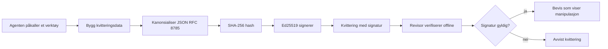
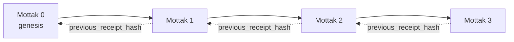

[Se leksjonsvideoen: Sikring av AI-agenter med kryptografiske kvitteringer](https://youtu.be/PLACEHOLDER_VIDEO_ID)

> _(Leksjonsvideo og miniatyrbilde skal legges til av Microsofts innholdsteam etter sammenslåing, i samsvar med mønsteret for leksjon 14 / 15.)_

# Sikring av AI-agenter med kryptografiske kvitteringer

## Introduksjon

Denne leksjonen vil dekke:

- Hvorfor revisjonsspor for AI-agenter er viktig for samsvar, feilsøking og tillit.
- Hva en kryptografisk kvittering er og hvordan den skiller seg fra en usignert logglinje.
- Hvordan produsere en signert kvittering for et agents verktøyskall i ren Python.
- Hvordan verifisere en kvittering offline og oppdage manipulering.
- Hvordan koble sammen kvitteringer slik at fjerning eller omordning bryter kjeden.
- Hva kvitteringer beviser og hva de eksplisitt ikke beviser.

## Læringsmål

Etter å ha fullført denne leksjonen vil du vite hvordan du:

- Identifiserer feilmoduser som motiverer kryptografisk proveniens for agenthandlinger.
- Produsere en Ed25519-signert kvittering over en kanonisk JSON-payload.
- Verifisere en kvittering uavhengig ved kun å bruke signatarens offentlige nøkkel.
- Oppdage manipulering ved å kjøre verifisering på nytt på en modifisert kvittering.
- Bygge en hash-kjedet sekvens av kvitteringer og forklare hvorfor kjeden er viktig.
- Gjenkjenne skillet mellom hva kvitteringer beviser (attribusjon, integritet, rekkefølge) og hva de ikke gjør (riktighet av handlingen, holdbarhet av policyen).

## Problemet: Agentens revisjonsspor

Tenk deg at du har satt i drift en AI-agent for Contoso Travel. Agenten leser kundeforespørsler, kaller en flights-API for å søke etter alternativer, og reserverer seter på vegne av kunden. Forrige kvartal behandlet agenten 50 000 bestillinger.

I dag kommer en revisor. De stiller et enkelt spørsmål: "Vis meg hva agenten din har gjort."

Du gir dem loggfilene dine. Revisoren ser på dem og stiller det vanskeligere spørsmålet: "Hvordan vet jeg at disse loggene ikke er blitt redigert?"

Dette er revisjonssporproblemet. De fleste agentdistribusjoner i dag stoler på:

- **Applikasjonslogger**: skrevet av agenten selv, kan redigeres av alle med tilgang til filsystemet.
- **Skyloggtjenester**: manipulasjonsavdekkende på plattformnivå, men bare hvis revisor stoler på plattformoperatøren.
- **Databasetransaksjonslogger**: godt egnet for databaseendringer, men ikke for vilkårlige verktøyskall.

Ingen av disse kan svare revisors spørsmål uten at revisor må stole på noen (deg, skyløsningen, databaseleverandøren). For internt bruk er denne tilliten ofte akseptabel. For regulerte arbeidsbelastninger (finans, helse, alt underlagt EU AI-loven) er det ikke det.

Kryptografiske kvitteringer løser dette ved å gjøre hver agenthandling uavhengig verifiserbar. Revisor trenger ikke stole på deg. De trenger kun din offentlige nøkkel og kvitteringen selv.

## Hva er en kryptografisk kvittering?

En kvittering er et JSON-objekt som registrerer hva en agent gjorde, signert med en digital signatur.



En minimal kvittering ser slik ut:

```json
{
  "type": "agent.tool_call.v1",
  "agent_id": "contoso-travel-bot",
  "tool_name": "lookup_flights",
  "tool_args_hash": "sha256:a3f9c1...",
  "result_hash": "sha256:7b2e1d...",
  "policy_id": "contoso-travel-policy-v3",
  "timestamp": "2026-04-25T14:30:00Z",
  "sequence": 47,
  "previous_receipt_hash": "sha256:9d4e6a...",
  "signature": {
    "alg": "EdDSA",
    "sig": "c5af83...",
    "public_key": "8f3b2c..."
  }
}
```

Tre egenskaper gjør jobben:

1. **Signaturen**. Kvitteringen signeres av agentens gateway ved bruk av en Ed25519-privatnøkkel. Enhver med tilsvarende offentlig nøkkel kan verifisere signaturen offline. Endring i noen felt ugyldiggjør signaturen.

2. **Kanonisk koding**. Før signering serialiseres kvitteringen med JSON Canonicalization Scheme (JCS, RFC 8785). Dette sikrer at to implementasjoner som produserer samme logiske kvittering gir byte-identisk utdata. Uten kanonisering ville ulike JSON-serialiserere produsere forskjellige signaturer for samme innhold.

3. **Hash-kjedning**. Feltet `previous_receipt_hash` kobler hver kvittering til den foregående. Fjerning eller omordning av en kvittering bryter alle kvitteringer som kommer etter. Manipulering blir synlig på kjedenivå selv om enkelte signaturer omgås.

Disse egenskapene gir til sammen tre garantier:

- **Attribusjon**: denne nøkkelen signerte dette innholdet.
- **Integritet**: innholdet har ikke endret seg siden signering.
- **Rekkefølge**: denne kvitteringen kom etter den kvitteringen i kjeden.

## Produsere en kvittering i Python

Du trenger ikke et spesielt bibliotek for å produsere en kvittering. De kryptografiske primitivene er bredt tilgjengelige og logikken er noen dusin linjer Python.

De praktiske øvelsene i `code_samples/18-signed-receipts.ipynb` går gjennom hele prosessen. Her er en oppsummering:

```python
import json
import hashlib
import base64
from nacl import signing
from jcs import canonicalize  # RFC 8785 kanonisk JSON

def b64url_nopad(data: bytes) -> str:
    return base64.urlsafe_b64encode(data).decode("ascii").rstrip("=")

def sha256_canonical(obj) -> str:
    """SHA-256 of a Python object's JCS-canonical JSON form."""
    return f"sha256:{hashlib.sha256(canonicalize(obj)).hexdigest()}"

# Generer eller last inn en signeringsnøkkel (i produksjon, lagres i en nøkkellager)
signing_key = signing.SigningKey.generate()
verify_key = signing_key.verify_key

# Bygg kvitteringsdata (ingen signatur ennå)
tool_args = {"origin": "SYD", "destination": "LAX"}
tool_result = [{"flight": "QF11", "price": 1850, "stops": 0}]

payload = {
    "type": "agent.tool_call.v1",
    "agent_id": "contoso-travel-bot",
    "tool_name": "lookup_flights",
    "tool_args_hash": sha256_canonical(tool_args),
    "result_hash": sha256_canonical(tool_result),
    "policy_id": "contoso-travel-policy-v3",
    "timestamp": "2026-04-25T14:30:00Z",
    "sequence": 0,
    "previous_receipt_hash": None,
}

# Kanoniser, hasj, signer.
canonical_bytes = canonicalize(payload)
message_hash = hashlib.sha256(canonical_bytes).digest()
signature_bytes = signing_key.sign(message_hash).signature

# Legg ved et strukturert signaturobjekt.
receipt = {
    **payload,
    "signature": {
        "alg": "EdDSA",
        "sig": b64url_nopad(signature_bytes),
        "public_key": b64url_nopad(bytes(verify_key)),
    },
}
```

Dette er hele signeringsprosessen. Øvelsene i notatblokken dekker hvert steg.

## Verifisere en kvittering og oppdage manipulering

Verifisering er den motsatte operasjonen:

```python
import base64
import hashlib
from nacl import signing
from nacl.exceptions import BadSignatureError
from jcs import canonicalize

def b64url_decode(s: str) -> bytes:
    padding = "=" * ((4 - len(s) % 4) % 4)
    return base64.urlsafe_b64decode(s + padding)

def verify_receipt(receipt: dict) -> bool:
    # Signaturen er et strukturert objekt: {"alg", "sig", "public_key"}.
    sig_obj = receipt.get("signature")
    if not sig_obj or sig_obj.get("alg") != "EdDSA":
        return False

    # Gjenoppbygg nyttelasten som faktisk ble signert (alt unntatt signaturen).
    payload = {k: v for k, v in receipt.items() if k != "signature"}

    canonical_bytes = canonicalize(payload)
    message_hash = hashlib.sha256(canonical_bytes).digest()

    try:
        verify_key = signing.VerifyKey(b64url_decode(sig_obj["public_key"]))
        verify_key.verify(message_hash, b64url_decode(sig_obj["sig"]))
        return True
    except BadSignatureError:
        return False
```

Denne funksjonen tar en kvittering og returnerer `True` hvis signaturen er gyldig, `False` ellers. Ingen nettverkskall, ingen tjenesteavhengighet, ingen tillit kreves til tredjepart.

For å se manipulering i praksis, går notatblokken gjennom:

1. Produserer en gyldig kvittering og bekrefter at den verifiseres.
2. Endrer en byte i feltet `tool_args_hash`.
3. Kjører verifisering på nytt og ser at det feiler.

Dette er den praktiske demonstrasjonen at kvitteringer er manipulasjonsavdekkende: enhver endring, uansett hvor liten, bryter signaturen.

## Kjede av kvitteringer for flerstegs-agenter

En enkelt signert kvittering beskytter én handling. En kjede av kvitteringer beskytter en sekvens.



Hver kvittering registrerer hashen av kvitteringen før den. For å fjerne kvittering 2 stille, må en angriper enten:

- Endre feltet `previous_receipt_hash` i kvittering 3 (bryter signaturen til kvittering 3), ELLER
- Falske en ny signatur på en modifisert kvittering 3 (krever agentens private nøkkel).

Hvis den private nøkkelen er i et hardware key vault og du publiserer den offentlige nøkkelen med hver kvittering, er ingen av disse angrepene gjennomførbare uten å bli oppdaget.

Notatblokken går gjennom:

1. Bygger en kjede med tre kvitteringer.
2. Verifiserer at hver kvitterings `previous_receipt_hash` matcher den faktiske hashen til forrige kvittering.
3. Manipulerer en kvittering midt i kjeden og ser kjeden bryte akkurat der.

Slik produserer du et revisjonsspor en ekstern revisor kan verifisere uten å måtte stole på deg.

## Hva kvitteringer beviser (og hva de ikke beviser)

Dette er den viktigste delen av leksjonen. Kvitteringer er kraftfulle, men kraften deres er begrenset.

**Kvitteringer beviser tre ting:**

1. **Attribusjon**: en spesifikk nøkkel signerte en spesifikk nyttelast.
2. **Integritet**: nyttelasten har ikke endret seg siden signering.
3. **Rekkefølge**: denne kvitteringen kom etter den forrige i hash-kjeden.

**Kvitteringer BEVISER IKKE:**

1. **Riktighet**: at agentens handling var korrekt. En kvittering kan signeres for et feil svar like godt som for et riktig.
2. **Policysamsvar**: at policyen i `policy_id` faktisk ble evaluert, eller at den ville tillatt handlingen hvis sjekket. Kvitteringen registrerer hva som ble påstått, ikke hva som ble håndhevet.
3. **Identitet utover nøkkelen**: kvitteringen sier "denne nøkkelen signerte dette innholdet." Den sier ikke "dette mennesket autoriserte dette." Å knytte en nøkkel til en person eller organisasjon krever separat identitetsinfrastruktur (en katalog, et offentlig nøkkelregister osv.).
4. **Sannhet i input**: hvis agenten mottar et manipulerende prompt og handler på det, registrerer kvitteringen handlingen nøyaktig. Kvitteringer er etter validering av input, ikke en erstatning for det.

Dette skillet er viktig av to grunner:

- Det viser hva kvitteringer er nyttige til: å gjøre agentatferd reviderbar og manipulasjonsavdekkende, selv på tvers av organisasjonsgrenser.
- Det viser hvilke lag du fortsatt trenger: inputvalidering (Leksjon 6), håndhevelse av policy (kort omtalt under), og identitetsinfrastruktur (utenfor omfang i denne leksjonen).

En vanlig feil er å anta at "vi har kvitteringer" betyr "vi har styring." Det gjør det ikke. Kvitteringer er fundamentet. Styring er systemet du bygger oppå.

## Produksjonsreferanser

Python-koden i denne leksjonen er bevisst minimal for at du skal kunne lese hver linje og forstå nøyaktig hva som skjer. I produksjon har du to alternativer:

1. **Bygg direkte på de kryptografiske primitivene.** De 50 linjene du så over er tilstrekkelige for mange brukstilfeller. PyNaCl (Ed25519) og `jcs`-pakken (kanonisk JSON) er godt vedlikeholdte og reviderte biblioteker.

2. **Bruk et produksjonsbibliotek for kvitteringer.** Flere open-source-prosjekter implementerer samme mønster med tillegg (nøkkelrotasjon, batch-verifisering, distribusjon av JWK-sett, integrasjon med policy-motorer):
   - Kvitteringsformatet som brukes i denne leksjonen følger en IETF Internet-Draft (`draft-farley-acta-signed-receipts`) som er under standardiseringsprosess.
   - Microsoft Agent Governance Toolkit komponerer kvitteringer med policybeslutninger basert på Cedar; se Veiledning 33 i det depotet for et helhetlig eksempel.
   - `protect-mcp` (npm) og `@veritasacta/verify` (npm) pakker gir en Node-basert implementasjon for signering og offline verifisering av kvitteringer, ment for å omslutte enhver MCP-server med et manipulasjonsavdekkende revisjonsspor.

Valget mellom å lage din egen og bruke et bibliotek ligner valget mellom å skrive ditt eget JWT-bibliotek og bruke et testet: begge er rimelige; biblioteket sparer tid og reduserer revisjonsoverflaten; fra-scratch-tilnærmingen tvinger deg til å forstå hver primitiv. Denne leksjonen lærer deg fra-scratch-tilnærmingen slik at du har grunnlaget for begge valg.

## Kunnskapstest

Test forståelsen din før du går videre til øvelsen.

**1. En kvittering er signert med agentens private Ed25519-nøkkel. Revisor har bare den offentlige nøkkelen. Kan revisor verifisere kvitteringen offline?**

<details>
<summary>Svar</summary>

Ja. Ed25519-verifisering krever kun den offentlige nøkkelen og de signerte bytene. Ingen nettverkskall, ingen tjenesteavhengighet. Dette er egenskapen som gjør kvitteringer nyttige i luftgapte, flerorganisasjons- eller lavtillits revisjonsmiljøer.
</details>

**2. En angriper endrer `policy_id`-feltet i en kvittering for å påstå at den ble styrt av en mer tillatende policy. Signaturen var over den opprinnelige nyttelasten. Hva skjer ved verifisering?**

<details>
<summary>Svar</summary>

Verifiseringen feiler. Signaturen ble beregnet over de kanoniske bytene av den opprinnelige nyttelasten; enhver endring i felt endrer de kanoniske bytene, som endrer SHA-256-hashen, og dermed gjør signaturen ugyldig. Angriperen ville trengt den private nøkkelen for å produsere en ny gyldig signatur, noe de ikke har.
</details>

**3. Hvorfor inkluderer kvitteringen `tool_args_hash` og `result_hash` i stedet for rå argumenter og resultat?**

<details>
<summary>Svar</summary>

To grunner. For det første kan kvitteringen måtte arkiveres eller overføres i miljøer der lekkasje av rått innhold (personopplysninger, forretningsdata) er et problem. Hashing holder kvitteringen liten og innholdet privat; revisor verifiserer at hashen stemmer overens med en separat lagret kopi av det faktiske innholdet. For det andre har hasher en fast størrelse; en kvittering med hasher har en begrenset størrelse uansett hvor store input og output var.
</details>

**4. Feltet `previous_receipt_hash` knytter hver kvittering til forgjengeren. Hvis en angriper stille fjerner en kvittering midt i kjeden, hva blir ugyldig?**

<details>
<summary>Svar</summary>

Alle kvitteringer som kom etter den slettede. Deres `previous_receipt_hash`-felt stemmer ikke lenger overens med den faktiske kjeden (fordi kvitteringen de refererte til ikke finnes, eller kjeden peker nå til en annen forgjenger). For å skjule slettingen måtte angriperen signere på nytt alle kvitteringer etterpå, noe som krever den private nøkkelen.
</details>

**5. En kvittering verifiseres luktfritt. Beviser det at agentens handling var korrekt, holdbar, eller i samsvar med policy?**

<details>
<summary>Svar</summary>

Nei. En gyldig kvittering beviser tre ting: attribusjon (denne nøkkelen signerte dette innholdet), integritet (innholdet har ikke endret seg), og rekkefølge (denne kvitteringen kom etter den andre). Det BEVISER IKKE at handlingen var korrekt, at policyen navngitt i `policy_id` faktisk ble evaluert, eller at agenten fulgte alle regler. Kvitteringer gjør agentatferd reviderbar, ikke nødvendigvis korrekt. Dette er det viktigste skillet i leksjonen.
</details>

## Praktisk øvelse

Åpne `code_samples/18-signed-receipts.ipynb` og fullfør alle fire seksjoner:

1. **Seksjon 1**: Signer din første kvittering og verifiser den.
2. **Seksjon 2**: Manipuler kvitteringen og observer at verifisering feiler.
3. **Seksjon 3**: Bygg en kjede med tre kvitteringer og verifiser integriteten i kjeden.
4. **Seksjon 4**: Bruk mønsteret på en agent bygget med Microsoft Agent Framework: pakk et verktøyskall inn i kvitteringssignering, og verifiser kvitteringen uavhengig.

**Ekstra utfordring 1:** utvid kvitteringsskjemaet med et tillegg av ditt eget valg (for eksempel en forespørsels-ID for sporing), oppdater den kanoniske signeringslogikken til å inkludere det, og bekreft at kvitteringen fortsatt går igjennom verifisering. Endre deretter feltet etter signering og bekreft at verifiseringen feiler. Dette tvinger deg til å forstå hvordan hver byte i den kanoniske kodingen bidrar til signaturen.
**Stretch challenge 2:** SHA-256-hash to av kvitteringene dine sammen (konsatenere deres kanoniske bytes i en deterministisk rekkefølge) og legg inn den resulterende digesten som et nytt felt på en tredje kvittering før du signerer den. Verifiser at alle tre kvitteringene fremdeles kan rundreise. Du har nettopp bygget et ett-trinns inklusjonsbevis: hvem som helst som har den tredje kvitteringen kan bevise at de to første eksisterte på tidspunktet den ble signert, uten å måtte avsløre innholdet deres. Dette er mønsteret som selektive-discolosure kvitteringer bruker i stor skala (Merkle-commitments, RFC 6962).

## Konklusjon

Kryptografiske kvitteringer gir AI-agenter en revisjonsspor som er:

- **Uavhengig verifiserbar**: hvilken som helst part med den offentlige nøkkelen kan verifisere, uten tjenesteavhengighet.
- **Manipulasjons-synlig**: enhver endring ugyldiggjør signaturen.
- **Bærbar**: en kvittering er en liten JSON-fil; den kan arkiveres, sendes og verifiseres hvor som helst.
- **Standardtilpasset**: bygget på Ed25519 (RFC 8032), JCS (RFC 8785), og SHA-256, alle bredt distribuerte primitiv.

De er ikke en erstatning for inndata-validering, policyhåndhevelse eller identitetsinfrastruktur. De er et fundament for disse lagene. Når du distribuerer agenter i regulerte arbeidsbelastninger, flerorganisasjons arbeidsflyter, eller andre settinger hvor en fremtidig revisor ikke kan antas å stole på deg, er kvitteringer hvordan du gjør revisjonssporet ærlig.

Det viktigste å ta med seg: kvitteringer beviser hvem som sa hva, når. De beviser ikke at det som ble sagt var sant eller riktig. Hold det skillet stramt. Det er forskjellen mellom et ærlig provenienssystem og et villedende.

## Produksjonsjekkliste

Når du er klar til å gå videre fra denne leksjonen til å distribuere kvittering-signerte agenter i et reelt miljø:

- [ ] **Flytt signeringsnøkkelen bort fra utviklerlaptopen.** Bruk Azure Key Vault, AWS KMS, eller en hardware security module. Den private nøkkelen som signerer kvitteringene dine må aldri ligge i kildekontroll eller i klartekst på applikasjonsmaskiner.
- [ ] **Publiser verifikasjonsnøkkelen.** Revisorer trenger den for å verifisere offline. Standardmønsteret er et JWK Set på en velkjent URL (RFC 7517), f.eks. `https://your-org.example.com/.well-known/agent-keys.json`.
- [ ] **Anker kjeden eksternt.** Skriv periodisk den siste kjedehode-hashen til en transparenslogg (Sigstore Rekor, RFC 3161 tidsstempelautoritet, eller et annet internt system) slik at en ekstern part kan bekrefte "denne kjeden eksisterte på dette tidspunktet."
- [ ] **Lagre kvitteringer uforanderlig.** Append-only blob lagring (Azure Storage med immutabilitetspolicyer, AWS S3 Object Lock) forhindrer en insider fra å omskrive historien på lagringslaget.
- [ ] **Avgjør lagringsvarighet.** Mange compliance-regimer krever flerårig oppbevaring. Planlegg for vekst i kvitteringer (hver kvittering er ~500 bytes; en agent som utfører 10K kall per dag produserer ~1,8 GB per år).
- [ ] **Dokumenter hva kvitteringer ikke dekker.** Kvitteringer beviser tilskrivelse, integritet, og rekkefølge. Din driftsprosedyrer bør eksplisitt liste hva slags ekstra kontroller (inndata-validering, policyhåndhevelse, ratelimiting, identitetsinfrastruktur) som er ved siden av kvitteringer i din styringspostur.

### Flere spørsmål om sikring av AI-agenter?

Bli med i [Microsoft Foundry Discord](https://aka.ms/ai-agents/discord) for å møte andre lærende, delta på kontortimer, og få svar på spørsmål om AI-agenter.

## Utover denne leksjonen

Denne leksjonen dekker enkeltkvitterings-signering og hash-kjedede sekvenser. De samme primitivene komponerer flere mer avanserte mønstre du kan møte når styringsposturen modnes:

- **Selektiv informasjon.** Når et kvitteringsfelts innhold er uavhengig forpliktet (RFC 6962-stil Merkle-tre), kan du avsløre spesifikke felt for bestemte revisorer og bevise at resten er uendret uten å eksponere dem. Nyttig når samme kvittering må tilfredsstille både en omfattende revisjon (som vil ha fullstendighet) og dataminimeringsreguleringer som GDPR (som ønsker at revisor ser så lite som mulig).
- **Kvitterings tilbakekalling.** Hvis en signeringsnøkkel kompromitteres, må du kunne merke alle kvitteringer signert med den nøkkelen som upålitelige fra et bestemt tidspunkt og fremover. Standardmønstre: kortlevde signeringsnøkler pluss en publisert tilbakekallingsliste, eller en transparenslogg med tilbakekallingsoppføringer.
- **Bilaterale / splitt-signatur kvitteringer.** Noen implementasjoner deler den signerte nyttelasten i pre-eksekvering (`authorization_*`) og post-eksekvering (`result_*`) halvdeler med uavhengige signaturer, nyttig når autorisasjonsbeslutningen og det observerte resultatet produseres av forskjellige aktører eller til ulike tider. Dette bygger additivt videre på kvitteringsformatet lært i denne leksjonen.
- **Nyttesammensetning.** En kvittering lukker hvilket som helst bytes-inhold du legger inn i `result_hash`. Virkelige nyttelaster er ofte rikere enn et enkelt verktøys kall-resultat: forhåndsbeslutningsresonnement (modellprediksjon, vurderte alternativer, bevis og deres fullstendighet, risikopostur, ansvarskjede, gateutfall) kan alle leve inni nyttelasten, lukket av en enkelt kvittering. Dette holder kvitteringsformatet minimalt mens nyttelastskjemaer kan utvikle seg domene-for-domene.
- **Tverr-implementasjons-konformitet.** Flere uavhengige implementasjoner av samme kvitteringsformat (Python, TypeScript, Rust, Go) verifiserer hverandre mot delte testvektorer. Om du lager din egen implementasjon, bekrefter validering mot publiserte vektorer kompatibilitet på wire-nivå.
- **Post-kvantemigrasjon.** Ed25519 er bredt brukt i dag, men ikke kvante-resistent. Kvitteringsformatet er algoritme-agnostisk: `signature.alg` feltet kan bære `ML-DSA-65` (NIST sin post-kvantem signaturstandard) når du trenger å migrere. Planlegg en overgangsperiode hvor kvitteringer er dobbelt-signert.

## Ekstra ressurser

- <a href="https://datatracker.ietf.org/doc/draft-farley-acta-signed-receipts/" target="_blank">IETF Internet-Draft: Signed Decision Receipts for Machine-to-Machine Access Control</a>
- <a href="https://learn.microsoft.com/azure/ai-studio/responsible-use-of-ai-overview" target="_blank">Responsible AI overview (Azure AI)</a>
- <a href="https://datatracker.ietf.org/doc/html/rfc8032" target="_blank">RFC 8032: Edwards-Curve Digital Signature Algorithm (EdDSA)</a>
- <a href="https://datatracker.ietf.org/doc/html/rfc8785" target="_blank">RFC 8785: JSON Canonicalization Scheme (JCS)</a>
- <a href="https://datatracker.ietf.org/doc/html/rfc6962" target="_blank">RFC 6962: Certificate Transparency</a> (Merkle-tree konstruksjon brukt av selektive-disclosure kvitteringer)
- <a href="https://github.com/microsoft/agent-governance-toolkit/blob/main/docs/tutorials/33-offline-verifiable-receipts.md" target="_blank">Microsoft Agent Governance Toolkit, Tutorial 33: Offline-Verifiable Decision Receipts</a>
- <a href="https://github.com/ScopeBlind/agent-governance-testvectors" target="_blank">Cross-implementation conformance test vectors</a> for kvitteringsformatet brukt i denne leksjonen (Apache-2.0)
- <a href="https://pynacl.readthedocs.io/" target="_blank">PyNaCl dokumentasjon</a> (Ed25519 i Python)

## Forrige leksjon

[Building Computer Use Agents (CUA)](../15-browser-use/README.md)

## Neste leksjon

_(Bestemmes av læreplan-vedlikeholdere)_

---

<!-- CO-OP TRANSLATOR DISCLAIMER START -->
**Ansvarsfraskrivelse**:
Dette dokumentet er oversatt ved hjelp av AI-oversettelsestjenesten [Co-op Translator](https://github.com/Azure/co-op-translator). Selv om vi streber etter nøyaktighet, vær oppmerksom på at automatiske oversettelser kan inneholde feil eller unøyaktigheter. Det opprinnelige dokumentet på originalspråket skal betraktes som den autoritative kilden. For kritisk informasjon anbefales profesjonell menneskelig oversettelse. Vi er ikke ansvarlige for eventuelle misforståelser eller feiltolkninger som oppstår ved bruk av denne oversettelsen.
<!-- CO-OP TRANSLATOR DISCLAIMER END -->