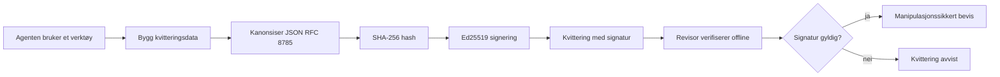
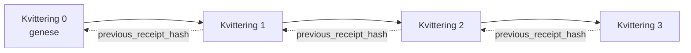

[Se leksjonsvideoen: Sikring av AI-agenter med kryptografiske kvitteringer](https://youtu.be/PLACEHOLDER_VIDEO_ID)

> _(Leksjonsvideo og miniatyrbilde skal legges til av Microsoft-innholdsteamet etter sammenslåing, i samsvar med mønsteret for leksjon 14 / 15.)_

# Sikring av AI-agenter med kryptografiske kvitteringer

## Introduksjon

Denne leksjonen vil dekke:

- Hvorfor revisjonsspor for AI-agenter er viktig for samsvar, feilsøking og tillit.
- Hva en kryptografisk kvittering er og hvordan den skiller seg fra en usignert logglinje.
- Hvordan produsere en signert kvittering for et verktøy-kall fra en agent i vanlig Python.
- Hvordan verifisere en kvittering uten nett og oppdage manipulering.
- Hvordan lenke kvitteringer slik at fjerning eller omorganisering bryter kjeden.
- Hva kvitteringer beviser og hva de eksplisitt ikke beviser.

## Læringsmål

Etter å ha fullført denne leksjonen vil du vite hvordan du:

- Identifiserer feiltyper som motiverer kryptografisk opprinnelse for agenthandlinger.
- Produserer en Ed25519-signert kvittering over en kanonisk JSON-payload.
- Verifiserer en kvittering uavhengig ved kun å bruke signatarens offentlige nøkkel.
- Oppdager manipulering ved å kjøre verifisering på nytt på en endret kvittering.
- Bygger en hash-kjedet sekvens av kvitteringer og forklarer hvorfor kjeden er viktig.
- Gjenkjenner skillet mellom hva kvitteringer beviser (attribusjon, integritet, sortering) og hva de ikke gjør (riktighet av handlingen, gyldighet av policy).

## Problemet: Agentens revisjonsspor

Se for deg at du har distribuert en AI-agent for Contoso Travel. Agenten leser kundeforespørsler, kaller et fly-API for å finne alternativer og bestiller seter på kundens vegne. Forrige kvartal behandlet agenten 50 000 bestillinger.

I dag kommer en revisor. De stiller et enkelt spørsmål: «Vis meg hva agenten din gjorde.»

Du overleverer loggfilene dine. Revisoren ser på dem og stiller det vanskeligere spørsmålet: «Hvordan vet jeg at disse loggene ikke er redigerte?»

Dette er problemet med revisjonsspor. De fleste agentdistribusjoner i dag baserer seg på:

- **Applikasjonslogger**: skrevet av agenten selv, redigerbare av hvem som helst med filsystemtilgang.
- **Skyloggtjenester**: manipulasjons-synlige på plattformnivå, men bare hvis revisor stoler på plattformoperatøren.
- **Databasetransaksjonslogger**: godt egnet for databaseendringer, men ikke for vilkårlige verktøykall.

Ingen av disse kan svare på revisors spørsmål uten at revisor må stole på noen (deg, skylagringsleverandøren eller databaseleverandøren). For intern bruk er denne tilliten ofte akseptabel. For regulerte arbeidsmengder (finans, helse, alt underlagt EU AI-loven) er den det ikke.

Kryptografiske kvitteringer løser dette ved å gjøre hver agenthandling uavhengig verifiserbar. Revisor trenger ikke stole på deg. De trenger bare din offentlige nøkkel og selve kvitteringen.

## Hva er en kryptografisk kvittering?

En kvittering er et JSON-objekt som registrerer hva en agent gjorde, signert med en digital signatur.


  
En minimal kvittering ser slik ut:

```json
{
  "type": "agent.tool_call.v1",
  "agent_id": "contoso-travel-bot",
  "tool_name": "lookup_flights",
  "tool_args_hash": "sha256:a3f9c1...",
  "result_hash": "sha256:7b2e1d...",
  "policy_id": "contoso-travel-policy-v3",
  "timestamp": "2026-04-25T14:30:00Z",
  "sequence": 47,
  "previous_receipt_hash": "sha256:9d4e6a...",
  "signature": {
    "alg": "EdDSA",
    "sig": "c5af83...",
    "public_key": "8f3b2c..."
  }
}
```
  
Tre egenskaper gjør jobben:

1. **Signaturen**. Kvitteringen er signert av agentens gateway med en Ed25519 privatnøkkel. Alle med tilhørende offentlig nøkkel kan verifisere signaturen uten nett. Manipulering av noen som helst felt ugyldiggjør signaturen.

2. **Kanonisk koding**. Før signering serialiseres kvitteringen ved bruk av JSON Canonicalization Scheme (JCS, RFC 8785). Dette sikrer at to implementasjoner som produserer samme logiske kvittering produserer byte-identisk output. Uten kanonisering ville ulike JSON-serialisatorer produsere ulike signaturer for samme innhold.

3. **Hash-kjeding**. Feltet `previous_receipt_hash` lenker hver kvittering til den forrige. Fjerning eller omrokkering av en kvittering bryter hver kvittering som kom etter. Manipulering blir synlig på kjedenivå selv om enkelt-signaturer omgås.

Disse egenskapene gir samlet tre garantier:

- **Attribusjon**: denne nøkkelen signerte dette innholdet.
- **Integritet**: innholdet har ikke endret seg siden signering.
- **Sortering**: denne kvitteringen kom etter den kvitteringen i kjeden.

## Produksjon av kvittering i Python

Du trenger ikke et spesielt bibliotek for å produsere en kvittering. De kryptografiske primitivene er allment tilgjengelige, og logikken er noen få dusin linjer Python.

De praktiske oppgavene i `code_samples/18-signed-receipts.ipynb` går gjennom hele flyten. Sammendraget:

```python
import json
import hashlib
import base64
from nacl import signing
from jcs import canonicalize  # RFC 8785 kanonisk JSON

def b64url_nopad(data: bytes) -> str:
    return base64.urlsafe_b64encode(data).decode("ascii").rstrip("=")

def sha256_canonical(obj) -> str:
    """SHA-256 of a Python object's JCS-canonical JSON form."""
    return f"sha256:{hashlib.sha256(canonicalize(obj)).hexdigest()}"

# Generer eller last inn en signeringsnøkkel (i produksjon, lagre i en nøkkellager)
signing_key = signing.SigningKey.generate()
verify_key = signing_key.verify_key

# Bygg kvitteringsdata (ingen signatur ennå)
tool_args = {"origin": "SYD", "destination": "LAX"}
tool_result = [{"flight": "QF11", "price": 1850, "stops": 0}]

payload = {
    "type": "agent.tool_call.v1",
    "agent_id": "contoso-travel-bot",
    "tool_name": "lookup_flights",
    "tool_args_hash": sha256_canonical(tool_args),
    "result_hash": sha256_canonical(tool_result),
    "policy_id": "contoso-travel-policy-v3",
    "timestamp": "2026-04-25T14:30:00Z",
    "sequence": 0,
    "previous_receipt_hash": None,
}

# Kanoniser, hash, signer.
canonical_bytes = canonicalize(payload)
message_hash = hashlib.sha256(canonical_bytes).digest()
signature_bytes = signing_key.sign(message_hash).signature

# Legg til et strukturert signaturobjekt.
receipt = {
    **payload,
    "signature": {
        "alg": "EdDSA",
        "sig": b64url_nopad(signature_bytes),
        "public_key": b64url_nopad(bytes(verify_key)),
    },
}
```
  
Dette er hele signerings-pipelinen. Oppgavene i notatboken går gjennom hvert steg.

## Verifisering av kvittering og oppdagelse av manipulering

Verifisering er den inverse operasjonen:

```python
import base64
import hashlib
from nacl import signing
from nacl.exceptions import BadSignatureError
from jcs import canonicalize

def b64url_decode(s: str) -> bytes:
    padding = "=" * ((4 - len(s) % 4) % 4)
    return base64.urlsafe_b64decode(s + padding)

def verify_receipt(receipt: dict) -> bool:
    # Signaturen er et strukturert objekt: {"alg", "sig", "public_key"}.
    sig_obj = receipt.get("signature")
    if not sig_obj or sig_obj.get("alg") != "EdDSA":
        return False

    # Gjenoppbygg nyttelasten som faktisk ble signert (alt unntatt signaturen).
    payload = {k: v for k, v in receipt.items() if k != "signature"}

    canonical_bytes = canonicalize(payload)
    message_hash = hashlib.sha256(canonical_bytes).digest()

    try:
        verify_key = signing.VerifyKey(b64url_decode(sig_obj["public_key"]))
        verify_key.verify(message_hash, b64url_decode(sig_obj["sig"]))
        return True
    except BadSignatureError:
        return False
```
  
Denne funksjonen tar inn en kvittering og returnerer `True` hvis signaturen er gyldig, `False` ellers. Ingen nettverkskall, ingen tjenesteavhengighet, ingen krav om tillit til tredjepart.

For å se manipulering i praksis går notatboken gjennom:

1. Produksjon av en gyldig kvittering og bekreftelse på at den verifiseres.
2. Endring av én byte i feltet `tool_args_hash`.
3. Ny kjøring av verifisering som feiler.

Dette demonstrerer praktisk at kvitteringer er manipulasjons-synlige: enhver endring, selv liten, bryter signaturen.

## Kjedede kvitteringer for flerstegs-agenter

En enkelt signert kvittering beskytter én handling. En kjede av kvitteringer beskytter en sekvens.


  
Hver kvittering lagrer hashen av kvitteringen før den. For å fjerne kvittering 2 uten å bli oppdaget må en angriper enten:

- Endre feltet `previous_receipt_hash` i kvittering 3 (bryter signaturen til kvittering 3), ELLER
- Falske en ny signatur på en endret kvittering 3 (krever agentens private nøkkel).

Hvis den private nøkkelen ligger i en maskinvare-nøkkelboks og du publiserer den offentlige nøkkelen med hver kvittering, er ingen av angrepene mulig uten å bli oppdaget.

Notatboken går gjennom:

1. Bygging av en kjede med tre kvitteringer.
2. Verifisering av at hver kvitterings `previous_receipt_hash` matcher den faktiske hashen av den forrige kvitteringen.
3. Manipulering av en kvittering midt i kjeden og ser at kjeden brytes akkurat der.

Slik produserer du et revisjonsspor en ekstern revisor kan verifisere uten å stole på deg.

## Hva kvitteringer beviser (og hva de ikke gjør)

Dette er det viktigste avsnittet i denne leksjonen. Kvitteringer er kraftige, men kraften deres er begrenset.

**Kvitteringer beviser tre ting:**

1. **Attribusjon**: en spesifikk nøkkel signerte en spesifikk payload.
2. **Integritet**: payloaden har ikke endret seg siden signering.
3. **Sortering**: denne kvitteringen kom etter den andre i hash-kjeden.

**Kvitteringer beviser IKKE:**

1. **Riktighet**: at agentens handling var riktig. En kvittering kan signeres for et feil svar like rent som for et riktig svar.
2. **Samsvar med policy**: at policyen som refereres i `policy_id` faktisk ble evaluert, eller at den ville tillatt denne handlingen hvis kontrollert. Kvitteringen registrerer hva som ble påstått, ikke hva som ble håndhevet.
3. **Identitet utover nøkkelen**: kvitteringen sier «denne nøkkelen signerte dette innholdet.» Den sier ikke «denne personen autoriserte dette.» Å koble en nøkkel til en person eller organisasjon krever separat identitetsinfrastruktur (en katalog, et offentlig nøkkelregister osv.).
4. **Sannferdighet av inndata**: hvis agenten mottar et manipulert prompt og handler ut fra det, registrerer kvitteringen handlingen korrekt. Kvitteringer ligger nedstrøms av validering av inndata, ikke som et substitutt.

Dette skillet er viktig av to grunner:

- Det forteller hva kvitteringer er nyttige for: å gjøre agentatferd reviderbar og manipulasjonssynlig, også på tvers av organisatoriske grenser.
- Det forteller hvilke ekstra lag du fortsatt trenger: inndatasjekk (Leksjon 6), policyhåndheving (kort omtalt nedenfor), og identitetsinfrastruktur (utenfor denne leksjonen).

En vanlig feil er å anta at «vi har kvitteringer» betyr «vi er styrt.» Det gjør det ikke. Kvitteringer er en grunnmur. Styring er systemet du bygger oppå.

## Produksjonstips

Python-koden i denne leksjonen er bevisst minimal slik at du kan lese hver linje og forstå nøyaktig hva som skjer. I produksjon har du to alternativer:

1. **Bygg direkte på de kryptografiske primitivene.** De 50 linjene du så ovenfor er tilstrekkelige for mange bruksområder. PyNaCl (Ed25519) og `jcs`-pakken (kanonisk JSON) er godt vedlikeholdte og reviderte biblioteker.

2. **Bruk et produksjonsbibliotek for kvitteringer.** Flere åpne kildeprosjekter implementerer samme mønster med tilleggsegenskaper (nøkkelrotasjon, batch-verifisering, JWK-settdistribusjon, integrasjon med policy-motorer):
   - Kvitteringsformatet brukt i denne leksjonen følger et IETF Internet-Draft (`draft-farley-acta-signed-receipts`) som er i standardiseringsprosess.
   - Microsoft Agent Governance Toolkit komponerer kvitteringer med policybeslutninger basert på Cedar; se Tutorial 33 i det depotet for et ende-til-ende-eksempel.
   - `protect-mcp` (npm) og `@veritasacta/verify` (npm) pakker tilbyr en Node-basert implementasjon av kvitteringssignering og offline verifisering, ment for å pakke enhver MCP-server med et manipulasjons-synlig revisjonsspor.
   - **[nobulex](https://github.com/arian-gogani/nobulex)** Python SDK (`pip install nobulex`) tilbyr samme Ed25519 + JCS signeringsmønster i Python med integrasjoner til LangChain og CrewAI, inkludert publiserte tverrvaliderings testvektorer og et samsvarskart bidratt via [OWASP PR #2210](https://github.com/OWASP/CheatSheetSeries/pull/2210).

Valget mellom å lage selv og bruke et bibliotek speiler valget mellom å skrive ditt eget JWT-bibliotek og bruke et testet: begge er fornuftige; biblioteket sparer tid og reduserer revisjonsflaten; tilnærmingen fra bunnen av tvinger deg til å forstå hver primitiv. Denne leksjonen lærer deg bunnen-av-stigen for at du skal ha grunnlaget for begge valg.

## Kunnskapssjekk

Test forståelsen før du går videre til praksisoppgaven.

**1. En kvittering er signert med agentens private Ed25519-nøkkel. Revisor har kun den offentlige nøkkelen. Kan revisor verifisere kvitteringen offline?**

<details>
<summary>Svar</summary>

Ja. Ed25519-verifisering krever kun den offentlige nøkkelen og de signerte bytene. Ingen nettverkskall, ingen tjenesteavhengighet. Dette er egenskapen som gjør kvitteringer nyttige i luft-gappede, multi-organisatoriske eller lavtillit-revisjonssituasjoner.
</details>

**2. En angriper endrer feltet `policy_id` i en kvittering for å påstå at den var underlagt en mer tillatende policy. Signaturen var over den opprinnelige payloaden. Hva skjer under verifisering?**

<details>
<summary>Svar</summary>

Verifiseringen feiler. Signaturen ble beregnet over de kanoniske byte av den opprinnelige payloaden; å endre noe felt endrer de kanoniske bytene, som endrer SHA-256-hashen, som gjør signaturen ugyldig. Angriperen måtte hatt den private nøkkelen for å lage en fersk gyldig signatur, noe de ikke har.
</details>

**3. Hvorfor inkluderer kvitteringen et `tool_args_hash` og `result_hash` i stedet for rå argumenter og resultat?**

<details>
<summary>Svar</summary>

To grunner. Først kan det hende kvitteringen må arkiveres eller overføres i miljøer hvor lekkasje av råinnhold (PII, forretningsdata) er et problem. Hashing holder kvitteringen liten og innholdet privat; revisor bekrefter at hashen samsvarer med en separat lagret kopi av det faktiske innholdet. For det andre har hasher fast størrelse; en kvittering med hasher er størrelsesbegrenset uavhengig av hvor store input og output var.
</details>

**4. Feltet `previous_receipt_hash` kobler hver kvittering til forgjengeren. Hvis en angriper stille sletter en kvittering midt i en kjede, hva blir ugyldig?**

<details>
<summary>Svar</summary>

Hver kvittering som kom etter den slettede. Deres `previous_receipt_hash`-felt samsvarer ikke lenger med den faktiske kjeden (fordi kvitteringen de refererte til ikke lenger finnes, eller kjeden nå peker til en annen forgjenger). For å skjule slettingen måtte angriperen har signert på nytt hver påfølgende kvittering, noe som krever privatnøkkelen.
</details>

**5. En kvittering verifiseres som gyldig. Beviser det at agentens handling var korrekt, gyldig eller i samsvar med policy?**

<details>
<summary>Svar</summary>

Nei. En gyldig kvittering beviser tre ting: attribusjon (denne nøkkelen signerte dette innholdet), integritet (innholdet har ikke endret seg), og sortering (denne kvitteringen kom etter den). Den beviser IKKE at handlingen var korrekt, at policyen angitt i `policy_id` faktisk ble evaluert, eller at agenten fulgte alle regler. Kvitteringer gjør agentatferd reviderbar, ikke nødvendigvis korrekt. Dette er det viktigste skillet i leksjonen.
</details>

## Praksisoppgave

Åpne `code_samples/18-signed-receipts.ipynb` og fullfør alle fire seksjoner:

1. **Seksjon 1**: Signer din første kvittering og verifiser den.
2. **Seksjon 2**: Endre kvitteringen og observer at verifiseringen feiler.
3. **Seksjon 3**: Lag en kjede med tre kvitteringer og verifiser kjedens integritet.
4. **Seksjon 4**: Anvend mønsteret på en agent bygget med Microsoft Agent Framework: pakk et verktøykall med kvitteringssignering, så verifiser kvitteringen uavhengig.
**Stretch challenge 1:** utvid kvitteringsskjemaet med et ekstra felt etter eget valg (for eksempel en forespørsels-ID for sporing), oppdater den kanoniske signeringslogikken for å inkludere det, og bekreft at kvitteringen fortsatt kan rundtrippes gjennom verifisering. Endre deretter feltet etter signering og bekreft at verifiseringen feiler. Dette tvinger deg til å forstå hvordan hver byte av den kanoniske kodingen bidrar til signaturen.

**Stretch challenge 2:** SHA-256-hash to av kvitteringene dine sammen (konkatener deres kanoniske bytes i en deterministisk rekkefølge) og legg inn den resulterende digesten som et nytt felt på en tredje kvittering før du signerer den. Verifiser at alle tre kvitteringene fortsatt kan rundtrippes. Du har nettopp laget et ett-trinns inklusjonsbevis: hvem som helst som har den tredje kvitteringen kan bevise at de to første eksisterte på tidspunktet den ble signert, uten å måtte avsløre innholdet deres. Dette er mønsteret som selektiv-avsløringskvitteringer bruker i stor skala (Merkle-commitments, RFC 6962).

## Konklusjon

Kryptografiske kvitteringer gir AI-agenter et revisjonsspor som er:

- **Uavhengig verifiserbart**: enhver part med den offentlige nøkkelen kan verifisere, uten tjenesteavhengighet.
- **Manipulasjonsbevisst**: enhver modifisering ugyldiggjør signaturen.
- **Portabelt**: en kvittering er en liten JSON-fil; den kan arkiveres, overføres og verifiseres hvor som helst.
- **Standardtilpasset**: bygget på Ed25519 (RFC 8032), JCS (RFC 8785) og SHA-256, alle mye brukte primitiv-elementer.

De er ikke en erstatning for inndatavaldiering, policyhåndhevelse eller identitetsinfrastruktur. De er et fundament for disse lagene. Når du tar i bruk agenter i regulerte arbeidsmengder, flerorganisasjonsarbeidsflyter eller andre situasjoner hvor en fremtidig revisor ikke automatisk kan stole på deg, er kvitteringer hvordan du gjør revisjonssporet ærlig.

Det viktigste å ta med seg: kvitteringer beviser hvem som sa hva og når. De beviser ikke at det som ble sagt var sant eller korrekt. Hold denne skillingen tydelig. Det er forskjellen mellom et ærlig provenienssystem og et misvisende.

## Produksjonsjekkliste

Når du er klar til å gå videre fra denne leksjonen til å distribuere kvitteringssignerte agenter i et reelt miljø:

- [ ] **Flytt signeringsnøkkelen bort fra utviklerlaptopen.** Bruk Azure Key Vault, AWS KMS eller en hardware security module. Den private nøkkelen som signerer kvitteringene dine må aldri være i kildekodekontroll eller i klartekst på applikasjonsmaskiner.
- [ ] **Publiser verifiseringsnøkkelen offentlig.** Revisorer trenger den for å verifisere offline. Standardmønsteret er en JWK-sett på en velkjent URL (RFC 7517), f.eks. `https://your-org.example.com/.well-known/agent-keys.json`.
- [ ] **Anker kjeden eksternt.** Skriv periodisk det siste hodehash-ex til en transparenslogg (Sigstore Rekor, RFC 3161 tidsstemplemyndighet, eller et annet internt system) slik at en ekstern part kan bekrefte "denne kjeden eksisterte på dette tidspunktet."
- [ ] **Lagre kvitteringer på en uforanderlig måte.** Append-only blob-lagring (Azure Storage med uforanderlighetsregler, AWS S3 Object Lock) hindrer en insider i å omskrive historikken på lagringslaget.
- [ ] **Bestem retensjonstid.** Mange samsvarsordninger krever flerårig lagring. Planlegg for vekst i kvitteringer (hver kvittering er ~500 bytes; en agent som gjør 10 000 kall per dag produserer ~1,8 GB per år).
- [ ] **Dokumenter hva kvitteringer ikke dekker.** Kvitteringer beviser attributtering, integritet og orden. Din driftshåndbok bør eksplisitt liste hvilke ekstra kontroller (inndatavaldiering, policyhåndheving, ratebegrensning, identitetsinfrastruktur) som eksisterer sammen med kvitteringer i din styringsprofil.

### Har du flere spørsmål om å sikre AI-agenter?

Bli med i [Microsoft Foundry Discord](https://aka.ms/ai-agents/discord) for å møte andre lærende, delta på kontortid og få svar på spørsmål om AI-agenter.

## Utover denne leksjonen

Denne leksjonen dekker signering av enkeltkvitteringer og hash-kjedede sekvenser. De samme primitive komponentene settes sammen i flere avanserte mønstre du kan støte på etter hvert som styringsprofilen modnes:

- **Selektiv avsløring.** Når et kvitteringsfelt er uavhengig forpliktet (RFC 6962-stil Merkle-tre), kan du avsløre bestemte felt til utvalgte revisorer og bevise at resten er uendret uten å eksponere dem. Nyttig når samme kvittering må tilfredsstille både et omfattende revisjonsspor (som krever fullstendighet) og personvernregler som GDPR (som krever at revisoren ser så lite som mulig).
- **Tilbaketrekking av kvittering.** Hvis en signeringsnøkkel kompromitteres, må du kunne merke alle kvitteringer signert med den nøkkelen som upålitelige fra et gitt tidspunkt og fremover. Standardmønstre: kortlevde signeringsnøkler pluss en offentlig revokasjonsliste, eller en transparenslogg med oppføringer om tilbaketrekking.
- **Tosidige / delt signaturkvitteringer.** Noen implementasjoner deler den signerte nyttelasten i pre-eksekvering (`authorization_*`) og post-eksekvering (`result_*`) deler med uavhengige signaturer, nyttig når autorisasjonsbeslutningen og det observerte resultatet produseres av forskjellige aktører eller på forskjellige tidspunkter. Dette settes i tillegg oppå kvitteringsformatet som læres i denne leksjonen.
- **Sammensetning av nyttelast.** En kvittering forsegler hvilke som helst bytes du putter i `result_hash`. Reelle nyttelaster er ofte rikere enn et enkelt verktøys kallresultat: forhåndsbeslutningsresonnement (modellprediksjon, vurderte muligheter, bevis og fullstendighet, risikopostur, ansvarskjede, portutfall) kan alle ligge i nyttelasten, innelåst av én kvittering. Dette holder kvitteringsformatet minimalt samtidig som nyttelastskjemaer kan utvikle seg domene-for-domene.
- **Tverrimplementasjonssamsvar.** Flere uavhengige implementasjoner av samme kvitteringsformat (Python, TypeScript, Rust, Go) verifiserer mot delte testvektorer. Hvis du bygger din egen implementasjon, bekrefter validering mot publiserte vektorer kompatibilitet på protokollnivå.
- **Post-kvantemigrasjon.** Ed25519 er mye brukt i dag, men er ikke kvantesikker. Kvitteringsformatet er algoritme-agilt: `signature.alg`-feltet kan bære `ML-DSA-65` (NISTs post-kvantem signaturstandard) når du må migrere. Planlegg en overgangsperiode hvor kvitteringer dobbeltsigneres.

## Tilleggsressurser

- <a href="https://datatracker.ietf.org/doc/draft-farley-acta-signed-receipts/" target="_blank">IETF Internet-Draft: Signed Decision Receipts for Machine-to-Machine Access Control</a>
- <a href="https://learn.microsoft.com/azure/ai-studio/responsible-use-of-ai-overview" target="_blank">Responsible AI overview (Azure AI)</a>
- <a href="https://datatracker.ietf.org/doc/html/rfc8032" target="_blank">RFC 8032: Edwards-Curve Digital Signature Algorithm (EdDSA)</a>
- <a href="https://datatracker.ietf.org/doc/html/rfc8785" target="_blank">RFC 8785: JSON Canonicalization Scheme (JCS)</a>
- <a href="https://datatracker.ietf.org/doc/html/rfc6962" target="_blank">RFC 6962: Certificate Transparency</a> (Merkle-trekonstruksjon brukt av selektiv-avsløringskvitteringer)
- <a href="https://github.com/microsoft/agent-governance-toolkit/blob/main/docs/tutorials/33-offline-verifiable-receipts.md" target="_blank">Microsoft Agent Governance Toolkit, Tutorial 33: Offline-Verifiable Decision Receipts</a>
- <a href="https://github.com/ScopeBlind/agent-governance-testvectors" target="_blank">Tverrimplementasjonssamsvar testvektorer</a> for kvitteringsformatet brukt i denne leksjonen (Apache-2.0)
- <a href="https://pynacl.readthedocs.io/" target="_blank">PyNaCl dokumentasjon</a> (Ed25519 i Python)

## Forrige leksjon

[Building Computer Use Agents (CUA)](../15-browser-use/README.md)

## Neste leksjon

_(Bestemmes av lærekursets vedlikeholdere)_

---

<!-- CO-OP TRANSLATOR DISCLAIMER START -->
**Ansvarsfraskrivelse**:
Dette dokumentet er oversatt ved hjelp av AI-oversettelsestjenesten [Co-op Translator](https://github.com/Azure/co-op-translator). Selv om vi streber etter nøyaktighet, vær oppmerksom på at automatiske oversettelser kan inneholde feil eller unøyaktigheter. Det opprinnelige dokumentet på originalspråket skal betraktes som den autoritative kilden. For kritisk informasjon anbefales profesjonell menneskelig oversettelse. Vi er ikke ansvarlige for eventuelle misforståelser eller feiltolkninger som oppstår ved bruk av denne oversettelsen.
<!-- CO-OP TRANSLATOR DISCLAIMER END -->