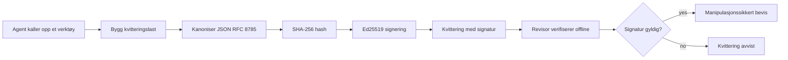
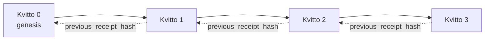

[Se leksjonsvideoen: Sikring av AI-agenter med kryptografiske kvitteringer](https://youtu.be/PLACEHOLDER_VIDEO_ID)

> _(Leksjonsvideo og miniatyrbilde vil bli lagt til av Microsofts innholdsteam etter sammenslåing, i samsvar med mønsteret for leksjon 14 / 15.)_

# Sikring av AI-agenter med kryptografiske kvitteringer

## Introduksjon

Denne leksjonen vil dekke:

- Hvorfor revisjonsspor for AI-agenter er viktige for samsvar, feilsøking og tillit.
- Hva en kryptografisk kvittering er og hvordan den skiller seg fra en usignert logglinje.
- Hvordan produsere en signert kvittering for en agents verktøysanrop i vanlig Python.
- Hvordan verifisere en kvittering offline og oppdage manipulering.
- Hvordan lenke kvitteringer slik at fjerning eller omordning av en bryter kjeden.
- Hva kvitteringer beviser og hva de eksplisitt ikke beviser.

## Læringsmål

Etter å ha fullført denne leksjonen, vil du vite hvordan du:

- Identifiserer feilmodes som motiverer kryptografisk opprinnelse for agenthandlinger.
- Produserer en Ed25519-signert kvittering over en kanonisk JSON-payload.
- Verifiserer en kvittering uavhengig ved å bruke bare signaturens offentlige nøkkel.
- Oppdager manipulering ved å kjøre verifikasjonen på nytt på en endret kvittering.
- Bygger en hasj-kjedet sekvens av kvitteringer og forklarer hvorfor kjeden er viktig.
- Gjenkjenner grensen mellom hva kvitteringer beviser (attributtering, integritet, rekkefølge) og hva de ikke gjør (korrektheten av handlingen, holdbarheten av policyen).

## Problemet: Din agents revisjonsspor

Forestill deg at du har distribuert en AI-agent for Contoso Travel. Agenten leser kundeforespørsler, kaller en fly-API for å finne alternativer, og bestiller seter på vegne av kunden. Forrige kvartal behandlet agenten 50 000 bestillinger.

I dag kommer en revisor. De stiller et enkelt spørsmål: "Vis meg hva agenten din gjorde."

Du overleverer loggfilene dine. Revisoren ser på dem og stiller det vanskeligere spørsmålet: "Hvordan vet jeg at disse loggene ikke ble redigert?"

Dette er revisjonssporproblemet. De fleste agentdistribusjoner i dag er avhengige av:

- **Applikasjonslogger**: skrevet av agenten selv, redigerbar av hvem som helst med filsystemtilgang.
- **Skytjenesteloggingsystemer**: manipulasjonssikret på plattformnivå men bare hvis revisor stoler på plattformoperatøren.
- **Databasetransaksjonslogger**: godt egnet for databaseendringer, men ikke for vilkårlige verktøysanrop.

Ingen av disse kan svare på revisors spørsmål uten at revisor må stole på noen (deg, din skyleverandør, din databaseleverandør). For internt bruk er denne tilliten ofte akseptabel. For regulerte arbeidsmengder (økonomi, helsevesen, alt som er underlagt EU AI-loven), er det ikke det.

Kryptografiske kvitteringer løser dette ved å gjøre hver agenthandling uavhengig verifiserbar. Revisor trenger ikke å stole på deg. De trenger bare din offentlige nøkkel og selve kvitteringen.

## Hva er en kryptografisk kvittering?

En kvittering er et JSON-objekt som registrerer hva en agent gjorde, signert med en digital signatur.


```mermaid
flowchart LR
    A[Agent kaller opp et verktøy] --> B[Bygg kvitteringslast]
    B --> C[Kanoniser JSON RFC 8785]
    C --> D[SHA-256 hash]
    D --> E[Ed25519 signering]
    E --> F[Kvittering med signatur]
    F --> G[Revisor verifiserer offline]
    G --> H{Signatur gyldig?}
    H -- yes --> I[Manipulasjonssikkert bevis]
    H -- no --> J[Kvittering avvist]
```

En minimal kvittering ser slik ut:

```json
{
  "type": "agent.tool_call.v1",
  "agent_id": "contoso-travel-bot",
  "tool_name": "lookup_flights",
  "tool_args_hash": "sha256:a3f9c1...",
  "result_hash": "sha256:7b2e1d...",
  "policy_id": "contoso-travel-policy-v3",
  "timestamp": "2026-04-25T14:30:00Z",
  "sequence": 47,
  "previous_receipt_hash": "sha256:9d4e6a...",
  "signature": {
    "alg": "EdDSA",
    "sig": "c5af83...",
    "public_key": "8f3b2c..."
  }
}
```

Tre egenskaper gjør jobben:

1. **Signaturen**. Kvitteringen er signert av agentens gateway ved hjelp av en Ed25519-privatnøkkel. Alle med tilhørende offentlig nøkkel kan verifisere signaturen offline. Manipulasjon av et hvilket som helst felt ugyldiggjør signaturen.

2. **Kanonisk koding**. Før signering serialiseres kvitteringen med JSON Canonicalization Scheme (JCS, RFC 8785). Dette sikrer at to implementasjoner som produserer samme logiske kvittering produserer byte-identisk output. Uten kanonisk koding ville ulike JSON-serialisatorer produsere forskjellige signaturer for samme innhold.

3. **Hasj-kjedning**. Feltet `previous_receipt_hash` lenker hver kvittering til den før den. Fjerning eller omordning av en kvittering bryter alle kvitteringer som kom etter. Manipulering blir synlig på kjedenivå selv om individuelle signaturer omgås.

Sammen gir disse egenskapene tre garantier:

- **Attributtering**: denne nøkkelen signerte dette innholdet.
- **Integritet**: innholdet har ikke endret seg siden signering.
- **Rekkefølge**: denne kvitteringen kom etter den kvitteringen i kjeden.

## Å produsere en kvittering i Python

Du trenger ikke et spesielt bibliotek for å lage en kvittering. De kryptografiske primitivene er allment tilgjengelige, og logikken er noen få dusin linjer Python.

Praktiske øvelser i `code_samples/18-signed-receipts.ipynb` går gjennom hele flyten. Oppsummeringsversjonen:

```python
import json
import hashlib
import base64
from nacl import signing
from jcs import canonicalize  # RFC 8785 kanonisk JSON

def b64url_nopad(data: bytes) -> str:
    return base64.urlsafe_b64encode(data).decode("ascii").rstrip("=")

def sha256_canonical(obj) -> str:
    """SHA-256 of a Python object's JCS-canonical JSON form."""
    return f"sha256:{hashlib.sha256(canonicalize(obj)).hexdigest()}"

# Generer eller last inn en signeringsnøkkel (i produksjon, lagre i en nøkkellager)
signing_key = signing.SigningKey.generate()
verify_key = signing_key.verify_key

# Bygg kvitteringspayloaden (ingen signatur ennå)
tool_args = {"origin": "SYD", "destination": "LAX"}
tool_result = [{"flight": "QF11", "price": 1850, "stops": 0}]

payload = {
    "type": "agent.tool_call.v1",
    "agent_id": "contoso-travel-bot",
    "tool_name": "lookup_flights",
    "tool_args_hash": sha256_canonical(tool_args),
    "result_hash": sha256_canonical(tool_result),
    "policy_id": "contoso-travel-policy-v3",
    "timestamp": "2026-04-25T14:30:00Z",
    "sequence": 0,
    "previous_receipt_hash": None,
}

# Kanoniser, hasj, signer.
canonical_bytes = canonicalize(payload)
message_hash = hashlib.sha256(canonical_bytes).digest()
signature_bytes = signing_key.sign(message_hash).signature

# Legg ved et strukturert signaturobjekt.
receipt = {
    **payload,
    "signature": {
        "alg": "EdDSA",
        "sig": b64url_nopad(signature_bytes),
        "public_key": b64url_nopad(bytes(verify_key)),
    },
}
```

Det er hele signeringspipeline. Øvelsene i notatboken går gjennom hvert trinn.

## Verifisering av kvittering og oppdaging av manipulering

Verifisering er den inverse operasjonen:

```python
import base64
import hashlib
from nacl import signing
from nacl.exceptions import BadSignatureError
from jcs import canonicalize

def b64url_decode(s: str) -> bytes:
    padding = "=" * ((4 - len(s) % 4) % 4)
    return base64.urlsafe_b64decode(s + padding)

def verify_receipt(receipt: dict) -> bool:
    # Signaturen er et strukturert objekt: {"alg", "sig", "public_key"}.
    sig_obj = receipt.get("signature")
    if not sig_obj or sig_obj.get("alg") != "EdDSA":
        return False

    # Gjenskap nyttelasten som faktisk ble signert (alt unntatt signaturen).
    payload = {k: v for k, v in receipt.items() if k != "signature"}

    canonical_bytes = canonicalize(payload)
    message_hash = hashlib.sha256(canonical_bytes).digest()

    try:
        verify_key = signing.VerifyKey(b64url_decode(sig_obj["public_key"]))
        verify_key.verify(message_hash, b64url_decode(sig_obj["sig"]))
        return True
    except BadSignatureError:
        return False
```

Denne funksjonen tar en kvittering og returnerer `True` hvis signaturen er gyldig, `False` ellers. Ingen nettverkskall, ingen tjenesteavhengighet, ingen tillit til tredjepart kreves.

For å se manipulering oppdages i praksis, viser notatboken:

1. Produksjon av en gyldig kvittering og bekreftelse av at den verifiseres.
2. Endring av en byte i feltet `tool_args_hash`.
3. Kjøring av verifisering på nytt og se at den feiler.

Dette er den praktiske demonstrasjonen på at kvitteringer er manipulasjonssikre: enhver modifikasjon, uansett hvor liten, bryter signaturen.

## Kjedeling av kvitteringer for agente med flere steg

En enkelt signert kvittering beskytter én handling. En kjede av kvitteringer beskytter en sekvens.


```mermaid
flowchart LR
    R0[Kvitto 0<br/>genesis] --> R1[Kvitto 1]
    R1 --> R2[Kvitto 2]
    R2 --> R3[Kvitto 3]
    R1 -. previous_receipt_hash .-> R0
    R2 -. previous_receipt_hash .-> R1
    R3 -. previous_receipt_hash .-> R2
```

Hver kvittering registrerer hasjen til den forrige kvitteringen. For å fjerne kvittering 2 ubemerket, må en angriper enten:

- Endre feltet `previous_receipt_hash` i kvittering 3 (bryter kvittering 3 sin signatur), ELLER
- Falske en ny signatur på en endret kvittering 3 (krever agentens private nøkkel).

Hvis den private nøkkelen ligger i en maskinvarenøkkellager og du publiserer den offentlige nøkkelen med hver kvittering, er ingen av angrepene gjennomførbare uten å bli oppdaget.

Notatboken går gjennom:

1. Oppbygge en kjede av tre kvitteringer.
2. Verifisere at hver kvitterings `previous_receipt_hash` matcher den faktiske hasjen til forrige kvittering.
3. Manipulere en kvittering midt i kjeden og se kjeden brytes akkurat der.

Slik produserer du et revisjonsspor som en ekstern revisor kan verifisere uten å stole på deg.

## Hva kvitteringer beviser (og hva de ikke gjør)

Dette er den viktigste delen av denne leksjonen. Kvitteringer er kraftige, men deres kraft har grenser.

**Kvitteringer beviser tre ting:**

1. **Attributtering**: en spesifikk nøkkel signerte en spesifikk payload.
2. **Integritet**: payloaden har ikke endret seg siden signering.
3. **Rekkefølge**: denne kvitteringen kom etter den kvitteringen i hash-kjeden.

**Kvitteringer beviser IKKE:**

1. **Korrekthet**: at agentens handling var riktig. En kvittering kan signeres for et feil svar like lett som for et riktig svar.
2. **Policy-samsvar**: at policyen referert til i `policy_id` faktisk ble evaluert, eller at den ville ha tillatt denne handlingen hvis sjekket. Kvitteringen registrerer hva som ble påstått, ikke hva som ble håndhevet.
3. **Identitet utover nøkkelen**: kvitteringen sier "denne nøkkelen signerte dette innholdet." Den sier ikke "dette mennesket autoriserte dette." Å koble en nøkkel til en person eller organisasjon krever separat identitetsinfrastruktur (et register, et offentlige nøkkelregister osv.).
4. **Sannferdighet av input**: hvis agenten mottar en manipulert prompt og handler på den, registrerer kvitteringen handlingen troverdig. Kvitteringer er etter inputvalidering, ikke en erstatning for det.

Denne grensen er viktig av to grunner:

- Den forteller deg hva kvitteringer er nyttige for: å gjøre agentatferd revisjonsbar og manipulasjonssikker, selv på tvers av organisatoriske grenser.
- Den forteller deg hvilke ekstra lag du fortsatt trenger: inputvalidering (Leksjon 6), policyhåndhevelse (kort omtalt nedenfor), og identitetsinfrastruktur (utenfor denne leksjonens omfang).

En vanlig feil er å anta at "vi har kvitteringer" betyr "vi er styrt." Det gjør det ikke. Kvitteringer er et fundament. Styring er systemet du bygger oppå.

## Produksjonsreferanser

Python-koden i denne leksjonen er bevisst minimal slik at du kan lese hver linje og forstå nøyaktig hva som skjer. I produksjon har du to alternativer:

1. **Bygg direkte på de kryptografiske primitivene.** De 50 linjene du så ovenfor er tilstrekkelige for mange bruksområder. PyNaCl (Ed25519) og `jcs`-pakken (kanonisk JSON) er godt vedlikeholdte og reviderte biblioteker.

2. **Bruk et produksjonsbibliotek for kvitteringer.** Flere open-source prosjekter implementerer samme mønster med ekstra funksjoner (nøkkelrotasjon, batch-verifisering, JWK Set-distribusjon, integrasjon med policy-motorer):
   - Kvitteringsformatet brukt i denne leksjonen følger et IETF Internet-Draft (`draft-farley-acta-signed-receipts`) som nå er under standardiseringsprosess.
   - Microsoft Agent Governance Toolkit komponerer kvitteringer med policybeslutninger basert på Cedar; se Tutorial 33 i det repositoriet for et ende-til-ende eksempel.
   - `protect-mcp` (npm) og `@veritasacta/verify` (npm) pakkene tilbyr en Node-basert implementering av kvitteringssignering og offline-verifisering, ment for å omgi alle MCP-servere med et manipulasjonssikkert revisjonsspor.
   - **[nobulex](https://github.com/arian-gogani/nobulex)** Python SDK (`pip install nobulex`) gir samme Ed25519 + JCS signeringsmønster i Python med LangChain og CrewAI-integrasjoner, inkludert publiserte kryssvalideringstestvektorer og en samsvarsmapping bidratt via [OWASP PR #2210](https://github.com/OWASP/CheatSheetSeries/pull/2210).

Valget mellom å lage selv og bruke et bibliotek speiler valget mellom å skrive ditt eget JWT-bibliotek og bruke et testet: begge er rimelige; biblioteket sparer tid og reduserer revisjonsoverflate; tilnærmingen fra bunnen av tvinger deg til å forstå hver primitiv. Denne leksjonen lærer deg fra bunnen så du har grunnlaget for begge valg.

## Kunnskapssjekk

Test din forståelse før du går videre til praksisøvelsen.

**1. En kvittering er signert med agentens private Ed25519-nøkkel. Revisor har bare den offentlige nøkkelen. Kan revisor verifisere kvitteringen offline?**

<details>
<summary>Svar</summary>

Ja. Ed25519-verifisering krever bare den offentlige nøkkelen og de signerte bytene. Ingen nettverkskall, ingen tjenesteavhengighet. Dette er egenskapen som gjør kvitteringer nyttige i air-gapped, multi-organisasjons- eller lavtillit revisjonsmiljøer.
</details>

**2. En angriper endrer feltet `policy_id` i en kvittering for å påstå at den var styrt av en mer tillatende policy. Signaturen var over den originale payload. Hva skjer under verifisering?**

<details>
<summary>Svar</summary>

Verifisering feiler. Signaturen ble beregnet over de kanoniske bytene av den originale payload; endring av et hvilket som helst felt endrer de kanoniske bytene, som endrer SHA-256 hasjen, som gjør signaturen ugyldig. Angriperen ville trenge den private nøkkelen for å produsere en ny gyldig signatur, noe de ikke har.
</details>

**3. Hvorfor inkluderer kvitteringen en `tool_args_hash` og `result_hash` istedenfor rå argumenter og resultat?**

<details>
<summary>Svar</summary>

To grunner. For det første kan kvitteringen måtte arkiveres eller overføres i miljøer hvor lekkasje av råinnhold (PII, forretningsdata) er et problem. Hashing holder kvitteringen liten og innholdet privat; revisoren verifiserer at hasjen samsvarer med en separat lagret kopi av det faktiske innholdet. For det andre har hasjer en fast størrelse; en kvittering med hasjer har begrenset størrelse uansett hvor store input og output var.
</details>

**4. Feltet `previous_receipt_hash` lenker hver kvittering til dens forgjenger. Hvis en angriper stille sletter en kvittering midt i en kjede, hva blir ugyldig?**

<details>
<summary>Svar</summary>

Hver kvittering som kom etter den slettede. Deres `previous_receipt_hash`-felt samsvarer ikke lenger med den faktiske kjeden (fordi kvitteringen de refererte til ikke lenger eksisterer, eller kjeden nå peker til en annen forgjenger). For å skjule slettingen, må angriperen signere på nytt hver senere kvittering, noe som krever den private nøkkelen.
</details>

**5. En kvittering verifiseres rent. Beviser det at agentens handling var korrekt, holdbar, eller i samsvar med policy?**

<details>
<summary>Svar</summary>

Nei. En gyldig kvittering beviser tre ting: attributtering (denne nøkkelen signerte dette innholdet), integritet (innholdet har ikke endret seg), og rekkefølge (denne kvitteringen kom etter den andre). Den BEVISER IKKE at handlingen var korrekt, at policyen nevnt i `policy_id` faktisk ble evaluert, eller at agenten fulgte alle regler. Kvitteringer gjør agentens atferd revisjonsbar, ikke nødvendigvis korrekt. Dette er den viktigste grensen i leksjonen.
</details>

## Praksisøvelse

Åpne `code_samples/18-signed-receipts.ipynb` og fullfør alle fire seksjoner:

1. **Seksjon 1**: Signer din første kvittering og verifiser den.
2. **Seksjon 2**: Manipuler kvitteringen og observer at verifisering feiler.
3. **Seksjon 3**: Bygg en kjede på tre kvitteringer og verifiser kjedens integritet.
4. **Seksjon 4**: Bruk mønsteret på en agent bygget med Microsoft Agent Framework: pakk inn et verktøysanrop i kvitteringssignering, og verifiser deretter kvitteringen uavhengig.


**Utfordring 1:** utvid kvitteringsskjemaet med et ekstra felt etter eget valg (for eksempel en forespørsels-ID for sporing), oppdater den kanoniske signeringslogikken for å inkludere det, og bekreft at kvitteringen fortsatt kan verifiseres. Endre deretter feltet etter signering og bekreft at verifikasjonen feiler. Dette tvinger deg til å forstå hvordan hver byte i den kanoniske kodingen bidrar til signaturen.

**Utfordring 2:** SHA-256-hash to av kvitteringene dine sammen (koble deres kanoniske bytes i en deterministisk rekkefølge) og legg inn den resulterende digesten som et nytt felt på en tredje kvittering før signering. Verifiser at alle tre kvitteringene fortsatt kan verifiseres. Du har akkurat laget et ett-trinns inklusjonsbevis: hvem som helst som har den tredje kvitteringen kan bevise at de to første eksisterte på tidspunktet den ble signert, uten å måtte avsløre innholdet. Dette er mønsteret som kvitteringer med selektiv avsløring bruker i stor skala (Merkle-forpliktelser, RFC 6962).

## Konklusjon

Kryptografiske kvitteringer gir AI-agenter et revisjonsspor som er:

- **Uavhengig verifiserbart**: enhver part med den offentlige nøkkelen kan verifisere, uten avhengighet til en tjeneste.
- **Manipulasjonsbestandig**: enhver endring ugyldiggjør signaturen.
- **Bærbart**: en kvittering er en liten JSON-fil; den kan arkiveres, overføres og verifiseres hvor som helst.
- **Standardbasert**: bygget på Ed25519 (RFC 8032), JCS (RFC 8785) og SHA-256, alle mye brukte primitive.

De er ikke en erstatning for inputvalidering, håndhevelse av policyer eller identitetsinfrastruktur. De er et fundament for disse lagene. Når du distribuerer agenter i regulerte arbeidsoppgaver, flerorganisasjons arbeidsflyter eller i enhver situasjon hvor en fremtidig revisor ikke kan antas å stole på deg, er kvitteringer måten du gjør revisjonssporet ærlig på.

Det viktigste å ta med seg: kvitteringer beviser hvem som sa hva, og når. De beviser ikke at det som ble sagt var sant eller riktig. Hold denne distinksjonen tydelig. Det er forskjellen mellom et ærlig opphavssystem og et misledende.

## Produksjonsjekkliste

Når du er klar til å gå videre fra denne leksjonen til å distribuere kvitteringssignerte agenter i et reelt miljø:

- [ ] **Flytt signeringsnøkkelen bort fra utviklerens laptop.** Bruk Azure Key Vault, AWS KMS, eller en hardware-sikkerhetsmodul. Privatnøkkelen som signerer kvitteringene dine må aldri lagres i kildekontroll eller i klartekst på applikasjonsmaskiner.
- [ ] **Publiser den offentlige verifikasjonsnøkkelen.** Revisorer trenger den for å verifisere offline. Standardmønsteret er et JWK-sett på en velkjent URL (RFC 7517), f.eks. `https://your-org.example.com/.well-known/agent-keys.json`.
- [ ] **Forankre kjeden eksternt.** Skriv periodisk den siste kjede- hodet hash til en transparenslogg (Sigstore Rekor, RFC 3161 tidsstempelmyndighet eller et sekundært internt system) slik at en ekstern part kan bekrefte "at denne kjeden eksisterte på dette tidspunktet."
- [ ] **Lagre kvitteringer uforanderlig.** Append-only blob-lagring (Azure Storage med uforanderlighetsregler, AWS S3 Object Lock) hindrer en innsidere å skrive om historien på lagringsnivå.
- [ ] **Bestem oppbevaringsperiode.** Mange samsvarsregimer krever flerårig oppbevaring. Planlegg for vekst i kvitteringer (hver kvittering er ~500 bytes; en agent som gjør 10K kall per dag produserer ~1.8 GB per år).
- [ ] **Dokumenter hva kvitteringer ikke dekker.** Kvitteringer beviser attribusjon, integritet og rekkefølge. Din kjøreplan bør eksplisitt liste opp hvilke tilleggskontroller (inputvalidering, politikkhåndhevelse, ratebegrensning, identitetsinfrastruktur) som står sammen med kvitteringer i din styringsposisjon.

### Har du flere spørsmål om å sikre AI-agenter?

Bli med i [Microsoft Foundry Discord](https://aka.ms/ai-agents/discord) for å møte andre lærende, delta på kontortid, og få svar på dine spørsmål om AI-agenter.

## Utover denne leksjonen

Denne leksjonen dekker enkel kvitteringssignering og hash-kjede sekvenser. De samme primitive komponeres til flere mer avanserte mønstre du kan støte på etter hvert som din styringsposisjon modnes:

- **Selektiv avsløring.** Når et kvitteringsfelt er uavhengig forpliktet (RFC 6962-stil Merkle-tre), kan du avsløre spesifikke felt til bestemte revisorer og bevise at resten er uendret uten å eksponere dem. Nyttig når samme kvittering må oppfylle både en grundig revisjon (som vil ha fullstendighet) og dataminimeringsreguleringer som GDPR (som ønsker at revisor skal se så lite som mulig).
- **Tilbakekalling av kvitteringer.** Hvis en signeringsnøkkel kompromitteres, trenger du en måte å merke alle kvitteringer signert med denne nøkkelen som upålitelige fra et bestemt tidspunkt og videre. Standardmønstre: kortlevde signeringsnøkler pluss en publisert tilbakekallingsliste, eller en transparenslogg med tilbakekallingsoppføringer.
- **Bilaterale / split-signatur kvitteringer.** Noen implementeringer deler den signerte nyttelasten i pre-eksekvering (`authorization_*`) og post-eksekvering (`result_*`) halvdeler med uavhengige signaturer, nyttig når autorisasjonsbeslutningen og det observerte resultatet produseres av forskjellige aktører eller på forskjellige tidspunkter. Dette bygger additivt på kvitteringsformatet som læres i denne leksjonen.
- **Nyttesammensetning.** En kvittering forsegler de bytene du legger i `result_hash`. Virkelige nyttelaster er ofte rikere enn ett enkelt verktøys kallresultat: forhandsbeslutningsresonnement (modellprediksjon, vurderte alternativer, bevis og kompletthet, risikopostur, ansvarskjede, gateutfall) kan alle ligge inne i nyttelasten, forseglet av en enkelt kvittering. Dette holder kvitteringsformatet minimalt samtidig som nyttelastskjemaer kan utvikle seg domene for domene.
- **Konformitet på tvers av implementeringer.** Flere uavhengige implementeringer av samme kvitteringsformat (Python, TypeScript, Rust, Go) verifiserer hverandre mot delte testvektorer. Hvis du bygger din egen implementering, bekrefter validering mot publiserte vektorer kompatibiliteten.
- **Post-kvantemigrasjon.** Ed25519 er mye brukt i dag, men er ikke kvante-resistent. Kvitteringsformatet er algoritme-agilt: `signature.alg` feltet kan bære `ML-DSA-65` (NISTs post-kvantesignaturstandard) når du trenger å migrere. Planlegg en overgangsperiode hvor kvitteringer er dobbelt-signert.

## Ytterligere ressurser

- <a href="https://datatracker.ietf.org/doc/draft-farley-acta-signed-receipts/" target="_blank">IETF Internet-Draft: Signerte beslutningskvitteringer for maskin-til-maskin tilgangskontroll</a>
- <a href="https://learn.microsoft.com/azure/ai-studio/responsible-use-of-ai-overview" target="_blank">Ansvarlig AI-oversikt (Azure AI)</a>
- <a href="https://datatracker.ietf.org/doc/html/rfc8032" target="_blank">RFC 8032: Edwards-kurve digital signaturalgoritme (EdDSA)</a>
- <a href="https://datatracker.ietf.org/doc/html/rfc8785" target="_blank">RFC 8785: JSON kanonisk ordningsskjema (JCS)</a>
- <a href="https://datatracker.ietf.org/doc/html/rfc6962" target="_blank">RFC 6962: Sertifikattransparens</a> (Merkle-tre-konstruksjon brukt av kvitteringer med selektiv avsløring)
- <a href="https://github.com/microsoft/agent-governance-toolkit/blob/main/docs/tutorials/33-offline-verifiable-receipts.md" target="_blank">Microsoft Agent Governance Toolkit, veiledning 33: Offline-verifiserbare beslutningskvitteringer</a>
- <a href="https://github.com/ScopeBlind/agent-governance-testvectors" target="_blank">Konformitetstestvektorer på tvers av implementeringer</a> for kvitteringsformatet brukt i denne leksjonen (Apache-2.0)
- <a href="https://pynacl.readthedocs.io/" target="_blank">PyNaCl dokumentasjon</a> (Ed25519 i Python)

## Forrige leksjon

[Bygge databrukagenter (CUA)](../15-browser-use/README.md)

---

<!-- CO-OP TRANSLATOR DISCLAIMER START -->
**Ansvarsfraskrivelse**:
Dette dokumentet er oversatt ved hjelp av AI-oversettelsestjenesten [Co-op Translator](https://github.com/Azure/co-op-translator). Selv om vi streber etter nøyaktighet, vær oppmerksom på at automatiske oversettelser kan inneholde feil eller unøyaktigheter. Det opprinnelige dokumentet på originalspråket skal betraktes som den autoritative kilden. For kritisk informasjon anbefales profesjonell menneskelig oversettelse. Vi er ikke ansvarlige for eventuelle misforståelser eller feiltolkninger som oppstår ved bruk av denne oversettelsen.
<!-- CO-OP TRANSLATOR DISCLAIMER END -->