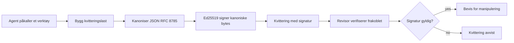
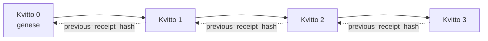

[Se leksjonsvideoen: Sikring av AI-agenter med kryptografiske kvitteringer](https://youtu.be/PLACEHOLDER_VIDEO_ID)

> _(Leksjonsvideo og miniatyrbilde legges til av Microsoft-innholdsteamet etter sammenslåing, i samsvar med mønsteret for leksjon 14 / 15.)_

# Sikring av AI-agenter med kryptografiske kvitteringer

## Introduksjon

Denne leksjonen vil dekke:

- Hvorfor revisjonsspor for AI-agenter er viktige for samsvar, feilsøking og tillit.
- Hva en kryptografisk kvittering er, og hvordan den skiller seg fra en usignert logglinje.
- Hvordan produsere en signert kvittering for en agents verktøyskall i ren Python.
- Hvordan verifisere en kvittering offline og oppdage manipulering.
- Hvordan koble kvitteringer slik at fjerning eller omorganisering av én bryter kjeden.
- Hva kvitteringer beviser og hva de eksplisitt ikke beviser.

## Læringsmål

Etter å ha fullført denne leksjonen, vil du vite hvordan du:

- Identifiserer feiltyper som motiverer kryptografisk opphav for agenthandlinger.
- Produserer en Ed25519-signert kvittering over en kanonisk JSON-payload.
- Verifiserer en kvittering uavhengig ved kun å bruke signatarens offentlige nøkkel.
- Oppdager manipulering ved å kjøre verifikasjon på nytt på en modifisert kvittering.
- Bygger en hash-kjedet sekvens av kvitteringer og forklarer hvorfor kjeden er viktig.
- Gjenkjenner skillet mellom hva kvitteringer beviser (attributt, integritet, rekkefølge) og hva de ikke beviser (riktigheten av handlingen, gyldigheten av policyen).

## Problemet: Agentens revisjonsspor

Forestill deg at du har distribuert en AI-agent for Contoso Travel. Agenten leser kundebestillinger, kaller et fly-API for å finne alternativer, og bestiller seter på kundens vegne. Forrige kvartal behandlet agenten 50 000 bestillinger.

I dag kommer en revisor. De stiller et enkelt spørsmål: "Vis meg hva agenten din gjorde."

Du overleverer loggfilene dine. Revisoren ser på dem og stiller det vanskeligere spørsmålet: "Hvordan vet jeg at disse loggene ikke er redigert?"

Dette er revisjonsspørsmålet. De fleste agentdistribusjoner i dag stoler på:

- **Applikasjonslogger**: skrevet av agenten selv, redigerbar av hvem som helst med filsystemtilgang.
- **Skytjenestelogging**: manipulasjonsbevisst på plattformnivå, men bare hvis revisor stoler på plattformoperatøren.
- **Databasetransaksjonslogger**: godt egnet for databaseendringer, men ikke for vilkårlige verktøy-kall.

Ingen av disse kan svare revisorens spørsmål uten at revisor må stole på noen (deg, din skytilbyder, databaseleverandøren). For intern bruk er den tilliten ofte akseptabel. For regulerte arbeidsmengder (finans, helsevesen, alt underlagt EUs AI-lov) er det ikke.

Kryptografiske kvitteringer løser dette ved å gjøre hver agenthandling uavhengig verifiserbar. Revisor trenger ikke stole på deg. De trenger kun offentlig nøkkel og kvitteringen selv.

## Hva er en kryptografisk kvittering?

En kvittering er et JSON-objekt som registrerer hva en agent gjorde, signert med en digital signatur.


```mermaid
flowchart LR
    A[Agent påkaller et verktøy] --> B[Bygg kvitteringslast]
    B --> C[Kanoniser JSON RFC 8785]
    C --> E[Ed25519 signer kanoniske bytes]
    E --> F[Kvittering med signatur]
    F --> G[Revisor verifiserer frakoblet]
    G --> H{Signatur gyldig?}
    H -- yes --> I[Bevis for manipulering]
    H -- no --> J[Kvittering avvist]
```

En minimal kvittering ser slik ut:

```json
{
  "type": "agent.tool_call.v1",
  "agent_id": "contoso-travel-bot",
  "tool_name": "lookup_flights",
  "tool_args_hash": "sha256:a3f9c1...",
  "result_hash": "sha256:7b2e1d...",
  "policy_id": "contoso-travel-policy-v3",
  "timestamp": "2026-04-25T14:30:00Z",
  "sequence": 47,
  "previous_receipt_hash": "sha256:9d4e6a...",
  "signature": {
    "alg": "EdDSA",
    "sig": "c5af83...",
    "public_key": "8f3b2c..."
  }
}
```

Tre egenskaper gjør jobben:

1. **Signaturen**. Kvitteringen er signert av agentens gateway med en privat Ed25519-nøkkel. Alle med tilsvarende offentlig nøkkel kan verifisere signaturen offline. Manipulering av noen som helst felt ugyldiggjør signaturen.

2. **Kanonisk koding**. Før signering serialiseres kvitteringen med JSON Canonicalization Scheme (JCS, RFC 8785). Dette sikrer at to implementasjoner som produserer samme logiske kvittering, lager byte-identisk output. Uten kanonisk koding ville forskjellige JSON-serialisatorer produsert ulike signaturer for samme innhold.

3. **Hash-kjedning**. Feltet `previous_receipt_hash` knytter hver kvittering til den forrige. Fjerning eller omorganisering av en kvittering ødelegger hver kvittering som kom etter. Manipulering blir synlig på kjedenivå selv om enkeltstående signaturer omgås.

Sammen gir disse egenskapene tre garantier:

- **Attributt**: denne nøkkelen signerte dette innholdet.
- **Integritet**: innholdet har ikke endret seg siden signering.
- **Rekkefølge**: denne kvitteringen kom etter den kvitteringen i kjeden.

## Lage en kvittering i Python

Du trenger ikke noe spesialbibliotek for å lage en kvittering. De kryptografiske primitivene er bredt tilgjengelige og logikken er noen dusin linjer Python.

De praktiske øvelsene i `code_samples/18-signed-receipts.ipynb` går gjennom hele flyten. Sammendragsversjonen:

```python
import json
import hashlib
import base64
from nacl import signing
from jcs import canonicalize  # RFC 8785 kanonisk JSON

def b64url_nopad(data: bytes) -> str:
    return base64.urlsafe_b64encode(data).decode("ascii").rstrip("=")

def sha256_canonical(obj) -> str:
    """SHA-256 of a Python object's JCS-canonical JSON form."""
    return f"sha256:{hashlib.sha256(canonicalize(obj)).hexdigest()}"

# Generer eller last inn en signeringsnøkkel (i produksjon, lagre i en nøkkelsafe)
signing_key = signing.SigningKey.generate()
verify_key = signing_key.verify_key

# Bygg kvitteringslasten (ingen signatur ennå)
tool_args = {"origin": "SYD", "destination": "LAX"}
tool_result = [{"flight": "QF11", "price": 1850, "stops": 0}]

payload = {
    "type": "agent.tool_call.v1",
    "agent_id": "contoso-travel-bot",
    "tool_name": "lookup_flights",
    "tool_args_hash": sha256_canonical(tool_args),
    "result_hash": sha256_canonical(tool_result),
    "policy_id": "contoso-travel-policy-v3",
    "timestamp": "2026-04-25T14:30:00Z",
    "sequence": 0,
    "previous_receipt_hash": None,
}

# Kanoniser og signer JCS-bytene direkte. PureEdDSA hasher internt.
canonical_bytes = canonicalize(payload)
signature_bytes = signing_key.sign(canonical_bytes).signature

# Fest et strukturert signaturobjekt.
receipt = {
    **payload,
    "signature": {
        "alg": "EdDSA",
        "sig": b64url_nopad(signature_bytes),
        "public_key": b64url_nopad(bytes(verify_key)),
    },
}
```

Det er hele signeringsprosessen. Øvelsene i notatboken går gjennom hvert trinn.

## Verifisere en kvittering og oppdage manipulering

Verifikasjon er den inverse operasjonen:

```python
import base64
import hashlib
from nacl import signing
from nacl.exceptions import BadSignatureError
from jcs import canonicalize

def b64url_decode(s: str) -> bytes:
    padding = "=" * ((4 - len(s) % 4) % 4)
    return base64.urlsafe_b64decode(s + padding)

def verify_receipt(receipt: dict) -> bool:
    # Signaturen er et strukturert objekt: {"alg", "sig", "public_key"}.
    sig_obj = receipt.get("signature")
    if not sig_obj or sig_obj.get("alg") != "EdDSA":
        return False

    # Gjenoppbygg nyttelasten som faktisk ble signert (alt unntatt signaturen).
    payload = {k: v for k, v in receipt.items() if k != "signature"}

    canonical_bytes = canonicalize(payload)

    try:
        verify_key = signing.VerifyKey(b64url_decode(sig_obj["public_key"]))
        verify_key.verify(canonical_bytes, b64url_decode(sig_obj["sig"]))
        return True
    except BadSignatureError:
        return False
```

Denne funksjonen tar en kvittering og returnerer `True` hvis signaturen er gyldig, `False` ellers. Ingen nettverkstilgang, ingen tjenesteavhengighet, ingen tillit til tredjepart nødvendig.

For å se manipulering oppdaget i praksis går notatboken gjennom:

1. Lage en gyldig kvittering og bekrefte at den verifiseres.
2. Modifisere én byte av feltet `tool_args_hash`.
3. Kjøre verifikasjonen på nytt og se at den feiler.

Dette er den praktiske demonstrasjonen av at kvitteringer er manipulasjonssikre: enhver endring, uansett hvor liten, bryter signaturen.

## Kjede av kvitteringer for multi-trinns agenter

En enkelt signert kvittering beskytter én handling. En kjede av kvitteringer beskytter en sekvens.


```mermaid
flowchart LR
    R0[Kvitto 0<br/>genese] --> R1[Kvitto 1]
    R1 --> R2[Kvitto 2]
    R2 --> R3[Kvitto 3]
    R1 -. previous_receipt_hash .-> R0
    R2 -. previous_receipt_hash .-> R1
    R3 -. previous_receipt_hash .-> R2
```

Hver kvittering registrerer hashen til kvitteringen før den. For å fjerne kvittering 2 uten å bli oppdaget må en angriper enten:

- Endre feltet `previous_receipt_hash` i kvittering 3 (bryter signaturen til kvittering 3), ELLER
- Falske en ny signatur på en modifisert kvittering 3 (krever agentens private nøkkel).

Hvis den private nøkkelen er i en hardware key vault og du publiserer den offentlige nøkkelen med hver kvittering, er ingen av angrepene gjennomførbare uten oppdagelse.

Notatboken går gjennom:

1. Bygge en kjede med tre kvitteringer.
2. Verifisere at hver kvitterings `previous_receipt_hash` samsvarer med den faktiske hashen til foregående kvittering.
3. Manipulere en kvittering midt i kjeden og se kjeden bryte akkurat der.

Slik produserer du et revisjonsspor en ekstern revisor kan verifisere uten å måtte stole på deg.

## Hva kvitteringer beviser (og hva de ikke gjør)

Dette er den viktigste delen av denne leksjonen. Kvitteringer er kraftige, men deres kraft er begrenset.

**Kvitteringer beviser tre ting:**

1. **Attributt**: en spesifikk nøkkel signerte en spesifikk payload.
2. **Integritet**: payloaden har ikke endret seg siden signering.
3. **Rekkefølge**: denne kvitteringen kom etter den kvitteringen i hash-kjeden.

**Kvitteringer beviser IKKE:**

1. **Riktighet**: at agentens handling var riktig. En kvittering kan signeres for et feil svar like lett som for et korrekt.
2. **Policy-samsvar**: at policyen nevnt i `policy_id` faktisk ble evaluert, eller at den ville ha tillatt denne handlingen hvis sjekket. Kvitteringen registrerer hva som ble påstått, ikke hva som ble håndhevet.
3. **Identitet utover nøkkelen**: kvitteringen sier "denne nøkkelen signerte dette innholdet." Den sier ikke "et menneske godkjente dette." Å koble en nøkkel til en person eller organisasjon krever separat identitetsinfrastruktur (et register, et offentlig nøkkel-register, osv.).
4. **Sannferdighet i inndata**: hvis agenten mottar en manipulert prompt og handler på den, registrerer kvitteringen handlingen trofast. Kvitteringer er nedstrøms for inndatavalidering, ikke en erstatning.

Dette skillet er viktig av to grunner:

- Det forteller deg hva kvitteringer er nyttige til: å gjøre agentatferd revisjonsbar og manipulasjonssikker, også på tvers av organisatoriske grenser.
- Det forteller deg hvilke tilleggslag du fortsatt trenger: inndatavalidering (Leksjon 6), policyhåndhevelse (kort omtalt nedenfor), og identitetsinfrastruktur (utenfor denne leksjonens omfang).

En vanlig feil er å anta at "vi har kvitteringer" betyr "vi er styrt." Det gjør det ikke. Kvitteringer er et grunnlag. Styring er systemet du bygger på toppen.

## Bevise at et menneske godkjente den eksakte handlingen

Punkt 3 ovenfor fortjener en egen seksjon: en handlingskvittering sier "denne nøkkelen signerte dette innholdet," aldri "et menneske godkjente dette." For høy-risikohandlinger (refusjoner, slettinger, overføringer), krever styringsrammeverk i økende grad nettopp dette manglende utsagnet, og det kan produseres med de samme primitivene du allerede bygde i denne leksjonen.

Den påfølgende notatboken `code_samples/human-authorization-receipts.ipynb` legger til en annen kvitteringstype, `human.approval.v1`, i samme konvoluttform som leksjonens kvitteringer (en typet payload signert med Ed25519 over sine kanoniske JCS-bytes, med `signature`-objektet utenfor de signerte bytene). En navngitt godkjenner signerer **den fullstendige kanoniske handlingen og dens digest** før utførelse; agentens handlingskvittering bærer **samme handlingsdigest** og en `parent_approval_ref`, `receipt_hash` til godkjenningen, samme konvensjon som `previous_receipt_hash` i kjeden du bygde ovenfor. Én `verify_chain` sjekker begge artefaktene under **separate pinned key registries** (godkjenner-nøkler vs agent-nøkler), slik at kodeveien deles, men myndighetene aldri.

Egenskapen dette gir, formulert nøye: *mennesket godkjente akkurat denne handlingen, og agenten utførte nøyaktig den godkjente handlingen.* Notatbokens nektelser er det som gjør egenskapen virkelig i stedet for bare påstått:

- den klassiske settet: manipulering, forvirret stedfortreder, avspilling, falskede nøkler på begge sider, feilformatert inndata;
- **utløpt myndighet**: en signatur som fortsatt verifiseres, men likevel nektes fordi policy-versjonen endret seg, godkjennernøkkelen ble fjernet fra den pinned registeret, eller godkjenningen utløp før utførelse;
- **digest-substitusjon**: en gyldig signert handlingskvittering som peker på en *ekte* godkjenning som binder en *annen* kanonisk handling.

Hver feil nektes med en distinkt grunn, slik at en revisor som leser avslag kan vite om myndighet gikk ut på dato eller handlingen endret seg. Regelen notatboken lærer: en signert godkjenning er ikke myndighet alene. Myndighet eksisterer bare hvis begge kvitteringer fortsatt binder til samme kanoniske handling ved utførelse. Menneskelig-godkjenningskvitteringen er en pedagogisk sammensetning definert av denne leksjonen, ikke en kvitteringstype definert av `draft-farley-acta-signed-receipts`.

## Produksjonsreferanser

Python-koden i denne leksjonen er bevisst minimal slik at du kan lese hver linje og forstå nøyaktig hva som skjer. I produksjon har du to valg:

1. **Bygg direkte på de kryptografiske primitivene.** De 50 linjene du så over er tilstrekkelige for mange bruksområder. PyNaCl (Ed25519) og `jcs`-pakken (kanonisk JSON) er velholdte og reviderte biblioteker.

2. **Bruk et produksjonsbibliotek for kvitteringer.** Flere open-source prosjekter implementerer samme mønster med flere funksjoner (nøkkelrotasjon, batch-verifisering, JWK-sett-distribusjon, integrasjon med policy-motorer):
   - Signeringsprosessen bruker JCS og signatur-domene-konvensjoner i et uavhengig IETF Internet-Draft ([`draft-farley-acta-signed-receipts`](https://datatracker.ietf.org/doc/draft-farley-acta-signed-receipts/), revisjon 02). Denne leksjonens enkle pedagogiske kvittering skiller seg fra draftets `{payload, signature}` konvolutt og presenteres ikke som en samsvarende implementering. Drafen publiserer en delt samsvars-pakke ([agent-governance-testvectors](https://github.com/ScopeBlind/agent-governance-testvectors)) for implementeringer med målrettet wireformat.
   - Microsoft Agent Governance Toolkit kombinerer kvitteringer med policybeslutninger basert på Cedar; se Tutorial 33 i det repositoriet for et ende-til-ende eksempel.
   - `protect-mcp` (npm) og `@veritasacta/verify` (npm) pakker tilbyr Node-basert implementering av kvitteringssignering og offline verifikasjon, ment for å pakke enhver MCP-server med et manipulasjonssikkert revisjonsspor, inkludert en holdt-sam-kjørselsflyt der en pause-handling avgir en godkjenningskvittering bundet til handlingsdigesten (WebAuthn-støttet i desktop-flyt), samme godkjenningskvitteringsmønster som den menneskelige autorisasjonsnotatboken ovenfor.
   - **[nobulex](https://github.com/arian-gogani/nobulex)** Python SDK (`pip install nobulex`) tilbyr det samme Ed25519 + JCS signeringsmønsteret i Python med LangChain og CrewAI-integrasjoner, inkludert publiserte tverrvalideringstestvektorer og en samsvars-mapping bidratt via [OWASP PR #2210](https://github.com/OWASP/CheatSheetSeries/pull/2210).

Valget mellom å lage egen løsning og bruke et bibliotek tilsvarer valget mellom å skrive din egen JWT-bibliotek og bruke et testet: begge er rimelige; biblioteket sparer tid og reduserer revisjonsflate; scratch-basert tilnærming tvinger deg til å forstå hver primitiv. Denne leksjonen lærer fra bunnen av slik at du har grunnlaget for begge valg.

## Kunnskapssjekk

Test din forståelse før du går videre til praksisøvelsen.

**1. En kvittering signeres med agentens private Ed25519-nøkkel. Revisor har kun den offentlige nøkkelen. Kan revisor verifisere kvitteringen offline?**

<details>
<summary>Svar</summary>

Ja. Ed25519-verifikasjon krever bare offentlig nøkkel og de signerte bytene. Ingen nettverkskall, ingen tjenesteavhengighet. Dette er egenskapen som gjør kvitteringer nyttige i luftgapte, tverrorganisatoriske, eller lavtillit revisjonsmiljøer.
</details>

**2. En angriper endrer `policy_id`-feltet i en kvittering for å påstå at den var styrt av en mer permisiv policy. Signaturen var over den opprinnelige payload. Hva skjer ved verifikasjon?**

<details>
<summary>Svar</summary>


Verifiseringen mislykkes. Signaturen ble beregnet over de kanoniske bytene til det originale innholdet; å endre noe felt endrer disse bytene, noe som gjør signaturen ugyldig. Angriperen ville trenge den private nøkkelen for å lage en ny gyldig signatur, noe de ikke har.
</details>

**3. Hvorfor inneholder kvitteringen en `tool_args_hash` og `result_hash` i stedet for råargumentene og resultatet?**

<details>
<summary>Svar</summary>

To grunner. For det første kan kvitteringen trenge å arkiveres eller overføres i miljøer hvor lekkasje av råinnhold (personopplysninger, forretningsdata) er et problem. Hashing holder kvitteringen liten og innholdet privat; revisoren verifiserer at hashen stemmer med en separat lagret kopi av det faktiske innholdet. For det andre har hasher en fast størrelse; en kvittering med hasher har en begrenset størrelse uansett hvor store innganger og utganger var.
</details>

**4. Feltet `previous_receipt_hash` kobler hver kvittering til sin forgjenger. Hvis en angriper stille sletter en kvittering fra midten av en kjede, hva blir ugyldig?**

<details>
<summary>Svar</summary>

Alle kvitteringene som kom etter den slettede. Deres `previous_receipt_hash`-felt stemmer ikke lenger med den faktiske kjeden (fordi kvitteringen de refererte til ikke eksisterer lenger, eller fordi kjeden nå peker til en annen forgjenger). For å skjule slettingen måtte angriperen signere på nytt alle senere kvitteringer, noe som krever den private nøkkelen.
</details>

**5. En kvittering verifiserer rent. Beviser det at agentens handling var korrekt, gyldig eller i samsvar med policy?**

<details>
<summary>Svar</summary>

Nei. En gyldig kvittering beviser tre ting: tilskrivelse (denne nøkkelen signerte dette innholdet), integritet (innholdet er ikke endret), og rekkefølge (denne kvitteringen kom etter den andre). Den beviser IKKE at handlingen var korrekt, at policyen som er navngitt i `policy_id` faktisk ble evaluert, eller at agenten fulgte alle regler. Kvitteringer gjør agentatferd reviderbar, men ikke nødvendigvis korrekt. Dette er den viktigste grensen i leksjonen.
</details>

## Praksisoppgave

Åpne `code_samples/18-signed-receipts.ipynb` og fullfør alle fire seksjoner:

1. **Seksjon 1**: Signer din første kvittering og verifiser den.
2. **Seksjon 2**: Manipuler kvitteringen og observer at verifiseringen feiler.
3. **Seksjon 3**: Bygg en kjede på tre kvitteringer og verifiser integriteten i kjeden.
4. **Seksjon 4**: Bruk mønsteret på en agent bygget med Microsoft Agent Framework: pakk et verktøys kall inn i kvitteringssignering, og verifiser så kvitteringen uavhengig.

**Ekstra utfordring 1:** utvid kvitteringsskjemaet med et ekstra felt av ditt valg (for eksempel en forespørsels-ID for sporing), oppdater den kanoniske signeringslogikken til å inkludere det, og bekreft at kvitteringen fortsatt kan rundreise gjennom verifisering. Modifiser så feltet etter signering og bekreft at verifikasjonen feiler. Dette tvinger deg til å forstå hvordan hver byte av den kanoniske kodingen bidrar til signaturen.

**Ekstra utfordring 2:** Hash med SHA-256 to av dine kvitteringer sammen (konkatener deres kanoniske byte i en deterministisk rekkefølge) og legg det resulterende digestet inn som et nytt felt i en tredje kvittering før du signerer den. Verifiser at alle tre kvitteringer fortsatt kan rundreise. Du har nettopp bygget et enklestegs inkluderingbevis: hvem som helst med den tredje kvitteringen kan bevise at de to første eksisterte da den ble signert, uten å måtte avsløre deres innhold. Dette er mønsteret som selektiv-avsløringskvitteringer bruker i stor skala (Merkel-forpliktelser, RFC 6962).

## Konklusjon

Kryptografiske kvitteringer gir AI-agenter et revisjonsspor som er:

- **Uavhengig verifiserbart**: enhver part med den offentlige nøkkelen kan verifisere, uten tjenesteavhengighet.
- **Manipulasjonsbevisst**: enhver endring ugyldiggjør signaturen.
- **Portabelt**: en kvittering er en liten JSON-fil; den kan arkiveres, overføres og verifiseres hvor som helst.
- **Standardtilpasset**: bygget på Ed25519 (RFC 8032), JCS (RFC 8785), og SHA-256, alle mye brukte primitiver.

De er ikke en erstatning for inputvalidering, policy-håndheving eller identitetsinfrastruktur. De er et fundament for disse lagene. Når du distribuerer agenter til regulerte arbeidsmengder, tverrorganisatoriske arbeidsflyter, eller i situasjoner der en fremtidig revisor ikke kan antas å stole på deg, er kvitteringer hvordan du gjør revisjonssporet ærlig.

Det viktigste å ta med seg: kvitteringer beviser hvem som sa hva, når. De beviser ikke at det som ble sagt var sant eller riktig. Hold denne forskjellen tydelig. Det er forskjellen mellom et ærlig provenienssystem og et villedende.

## Produksjonskontrolliste

Når du er klar til å gå videre fra denne leksjonen til å distribuere signerte kvitteringsagenter i et reelt miljø:

- [ ] **Flytt signeringsnøkkelen bort fra utviklermaskinen.** Bruk Azure Key Vault, AWS KMS eller en maskinvaresikkerhetsmodul. Den private nøkkelen som signerer kvitteringene dine må aldri ligge i versjonskontroll eller i klartekst på applikasjonsmaskiner.
- [ ] **Publiser verifikasjonsnøkkelen offentlig.** Revisorer trenger den for å verifisere offline. Standardmønsteret er en JWK-sett på en kjent URL (RFC 7517), f.eks. `https://your-org.example.com/.well-known/agent-keys.json`.
- [ ] **Forankre kjeden eksternt.** Skriv periodisk den siste hash-en i kjedehodet til en transparenslogg (Sigstore Rekor, RFC 3161 tidsstempelmyndighet, eller et annet internt system) slik at en ekstern part kan bekrefte "denne kjeden eksisterte på dette tidspunktet."
- [ ] **Lagre kvitteringer uforanderlig.** Append-only blob-lagring (Azure Storage med uforanderlighets-policyer, AWS S3 Object Lock) hindrer at en insider kan omskrive historien på lagringsnivå.
- [ ] **Bestem deg for oppbevaringstid.** Mange etterlevelsesregimer krever flerårig oppbevaring. Planlegg for vekst i kvitteringer (hver kvittering er ca. 500 byte; en agent som gjør 10 000 kall per dag produserer ~1,8 GB per år).
- [ ] **Dokumenter hva kvitteringer ikke dekker.** Kvitteringer beviser tilskrivelse, integritet og rekkefølge. Driftsdokumentasjonen din bør eksplisitt liste opp hvilke tilleggskontroller (inputvalidering, policyhåndheving, begrensning av frekvens, identitetsinfrastruktur) som supplerer kvitteringer i ditt styringsopplegg.

### Har du flere spørsmål om sikring av AI-agenter?

Bli med i [Microsoft Foundry Discord](https://aka.ms/ai-agents/discord) for å møte andre lærende, delta på kontortimer, og få svar på dine AI Agent-spørsmål.

## Utover denne leksjonen

Denne leksjonen dekker signering av enkeltkvitteringer og hash-kjede sekvenser. De samme primitive byggesteinene komponerer flere mer avanserte mønstre du kan møte etter hvert som styringsopplegget ditt modnes:

- **Selektiv avsløring.** Når en kvitterings felt er uavhengig forpliktet (Merkle-tre i RFC 6962-stil), kan du avsløre spesifikke felt for bestemte revisorer og bevise at de andre er uendret uten å eksponere dem. Nyttig når samme kvittering må tilfredsstille både en fullstendig revisjon (som ønsker fullstendighet) og dataminimeringsregler som GDPR (som vil at revisor ser så lite som mulig).
- **Tilbakekalling av kvitteringer.** Hvis en signeringsnøkkel blir kompromittert, trenger du en måte å merke alle kvitteringer signert med den nøkkelen som upålitelige fra et gitt tidspunkt og fremover. Standardmønstre: kortvarige signeringsnøkler pluss en publisert tilbakekallingsliste, eller en transparenslogg med tilbakekallingsposter.
- **Tosidige / split-signatur kvitteringer.** Noen implementasjoner deler det signerte innholdet i pre-eksekverings- (`authorization_*`) og post-eksekverings- (`result_*`) halvdeler med uavhengige signaturer, nyttig når autorisasjonsbeslutningen og det observerte resultatet er produsert av forskjellige aktører eller på forskjellige tidspunkter. Dette bygger additivt på kvitteringsformatet som læres i denne leksjonen.
- **Sammensetning av payload.** En kvittering forsegler alle byte du legger i `result_hash`. Virkelige payloads er ofte mer komplekse enn et enkelt verktøyskall-resultat: tankeprosess før beslutning (modellprediksjon, vurderte alternativer, bevis og deres fullstendighet, risikoprofil, ansvarsrekke, utfall av kontrollpunkt) kan alle leve i payload-en, forseglet av en enkelt kvittering. Dette holder kvitteringsformatet minimalt mens payload-skjemaer kan utvikle seg fra domene til domene.
- **Tverr-implementasjons samsvar.** Flere uavhengige implementasjoner av samme kvitteringsformat (Python, TypeScript, Rust, Go) verifiserer mot delte testvektorer. Hvis du bygger egen implementasjon, bekrefter validering mot publiserte vektorer kompatibilitet på wire-nivå.
- **Post-kvantemigrering.** Ed25519 er vidt utbredt i dag, men er ikke kvantebestandig. Kvitteringsformatet er algoritme-fleksibelt: feltet `signature.alg` kan inneholde `ML-DSA-65` (NISTs post-kvantum signaturstandard) når du trenger å migrere. Planlegg en overgangsperiode hvor kvitteringer dobbeltsigneres.

## Ytterligere ressurser

- <a href="https://datatracker.ietf.org/doc/draft-farley-acta-signed-receipts/" target="_blank">IETF Internet-Draft: Signerte beslutningskvitteringer for maskin-til-maskin tilgangskontroll</a>
- <a href="https://learn.microsoft.com/azure/ai-studio/responsible-use-of-ai-overview" target="_blank">Ansvarlig AI oversikt (Azure AI)</a>
- <a href="https://datatracker.ietf.org/doc/html/rfc8032" target="_blank">RFC 8032: Edwards-kurve digital signaturalgoritme (EdDSA)</a>
- <a href="https://datatracker.ietf.org/doc/html/rfc8785" target="_blank">RFC 8785: JSON kanoniseringsskjema (JCS)</a>
- <a href="https://datatracker.ietf.org/doc/html/rfc6962" target="_blank">RFC 6962: Sertifikattransparens</a> (Merkle-trekonstruksjon brukt av selektiv-avsløringskvitteringer)
- <a href="https://github.com/microsoft/agent-governance-toolkit/blob/main/docs/tutorials/33-offline-verifiable-receipts.md" target="_blank">Microsoft Agent Governance Toolkit, Veiledning 33: Offline-verifiserbare beslutningskvitteringer</a>
- <a href="https://github.com/ScopeBlind/agent-governance-testvectors" target="_blank">Tverrimplementerings samsvars testvektorer</a> for kvitteringsformatet brukt i denne leksjonen (Apache-2.0)
- <a href="https://pynacl.readthedocs.io/" target="_blank">PyNaCl dokumentasjon</a> (Ed25519 i Python)

## Forrige leksjon

[Opprette lokale AI-agenter](../17-creating-local-ai-agents/README.md)

---

<!-- CO-OP TRANSLATOR DISCLAIMER START -->
**Ansvarsfraskrivelse**:
Dette dokumentet er oversatt ved hjelp av AI-oversettelsestjenesten [Co-op Translator](https://github.com/Azure/co-op-translator). Selv om vi streber etter nøyaktighet, vær oppmerksom på at automatiske oversettelser kan inneholde feil eller unøyaktigheter. Det opprinnelige dokumentet på originalspråket skal betraktes som den autoritative kilden. For kritisk informasjon anbefales profesjonell menneskelig oversettelse. Vi er ikke ansvarlige for eventuelle misforståelser eller feiltolkninger som oppstår ved bruk av denne oversettelsen.
<!-- CO-OP TRANSLATOR DISCLAIMER END -->