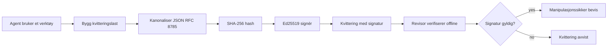
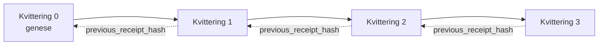

[Se leksjonsvideoen: Sikring av AI-agenter med kryptografiske kvitteringer](https://youtu.be/PLACEHOLDER_VIDEO_ID)

> _(Leksjonsvideo og miniatyrbilde legges til av Microsoft-innholdsteamet etter sammenslåing, i tråd med mønsteret for leksjon 14 / 15.)_

# Sikring av AI-agenter med kryptografiske kvitteringer

## Introduksjon

Denne leksjonen vil dekke:

- Hvorfor revisjonsspor for AI-agenter er viktig for samsvar, feilsøking og tillit.
- Hva en kryptografisk kvittering er og hvordan den skiller seg fra en usignert logglinje.
- Hvordan produsere en signert kvittering for et agents verktøykall i ren Python.
- Hvordan verifisere en kvittering offline og oppdage manipulasjon.
- Hvordan koble kvitteringer slik at fjerning eller omorganisering av en bryter kjeden.
- Hva kvitteringer beviser og hva de eksplisitt ikke beviser.

## Læringsmål

Etter å ha fullført denne leksjonen vil du vite hvordan du:

- Identifiserer feilmoduser som motiverer kryptografisk proveniens for agenthandlinger.
- Produserer en Ed25519-signert kvittering over en kanonisk JSON-payload.
- Verifiserer en kvittering uavhengig ved bruk av bare signaturens offentlige nøkkel.
- Oppdager manipulasjon ved å kjøre verifisering igjen på en endret kvittering.
- Bygger en hash-kjedet sekvens av kvitteringer og forklarer hvorfor kjeden er viktig.
- Gjenkjenner skillet mellom hva kvitteringer beviser (tilskrivelse, integritet, rekkefølge) og hva de ikke beviser (korrektheten av handlingen, gyldigheten av policyen).

## Problemet: Agentens revisjonsspor

Tenk deg at du har satt opp en AI-agent for Contoso Travel. Agenten leser kundehenvendelser, kaller et fly-API for å finne alternativer, og bestiller seter på vegne av kunden. Forrige kvartal behandlet agenten 50 000 bestillinger.

I dag kommer en revisor. De stiller et enkelt spørsmål: "Vis meg hva agenten din gjorde."

Du gir dem loggfilene dine. Revisoren ser på dem og stiller et vanskeligere spørsmål: "Hvordan vet jeg at disse loggene ikke er redigert?"

Dette er revisjonsspor-problemet. De fleste agentdistribusjoner i dag stoler på:

- **Applikasjonslogger**: skrevet av agenten selv, kan redigeres av hvem som helst med tilgang til filsystemet.
- **Skyloggtjenester**: manipulasjonsdetekterende på plattformnivå, men bare hvis revisor stoler på plattformoperatøren.
- **Databasenes transaksjonslogger**: godt egnet for databaseendringer, men ikke for vilkårlige verktøykall.

Ingen av disse kan svare på revisors spørsmål uten at revisor må stole på noen (deg, skylagringsleverandøren din, databaseleverandøren din). For internt bruk er denne tilliten ofte akseptabel. For regulerte arbeidsmengder (finans, helsevesen, alt underlagt EUs AI-forordning) er det ikke det.

Kryptografiske kvitteringer løser dette ved å gjøre hver agenthandling uavhengig verifiserbar. Revisor trenger ikke å stole på deg. De trenger bare den offentlige nøkkelen din og kvitteringen selv.

## Hva er en kryptografisk kvittering?

En kvittering er et JSON-objekt som registrerer hva en agent gjorde, signert med en digital signatur.


```mermaid
flowchart LR
    A[Agent bruker et verktøy] --> B[Bygg kvitteringslast]
    B --> C[Kanonaliser JSON RFC 8785]
    C --> D[SHA-256 hash]
    D --> E[Ed25519 signér]
    E --> F[Kvittering med signatur]
    F --> G[Revisor verifiserer offline]
    G --> H{Signatur gyldig?}
    H -- yes --> I[Manipulasjonssikker bevis]
    H -- no --> J[Kvittering avvist]
```

En minimal kvittering ser slik ut:

```json
{
  "type": "agent.tool_call.v1",
  "agent_id": "contoso-travel-bot",
  "tool_name": "lookup_flights",
  "tool_args_hash": "sha256:a3f9c1...",
  "result_hash": "sha256:7b2e1d...",
  "policy_id": "contoso-travel-policy-v3",
  "timestamp": "2026-04-25T14:30:00Z",
  "sequence": 47,
  "previous_receipt_hash": "sha256:9d4e6a...",
  "signature": {
    "alg": "EdDSA",
    "sig": "c5af83...",
    "public_key": "8f3b2c..."
  }
}
```

Tre egenskaper gjør jobben:

1. **Signaturen**. Kvitteringen signeres av agentens gateway ved bruk av en Ed25519-privatnøkkel. Alle med tilhørende offentlig nøkkel kan verifisere signaturen offline. Manipulering av et hvilket som helst felt ugyldiggjør signaturen.

2. **Kanonisk koding**. Før signering serialiseres kvitteringen ved hjelp av JSON Canonicalization Scheme (JCS, RFC 8785). Dette sikrer at to implementasjoner som produserer samme logiske kvittering lager byte-identisk output. Uten kanonisering ville ulike JSON-serialisatorer produsere forskjellige signaturer for samme innhold.

3. **Hash-kjedning**. Feltet `previous_receipt_hash` kobler hver kvittering til den forrige. Fjerning eller omorganisering av en kvittering bryter alle påfølgende kvitteringer. Manipulering blir synlig på kjedenivå selv om individuelle signaturer omgås.

Disse egenskapene gir til sammen tre garantier:

- **Tilskrivelse**: denne nøkkelen signerte dette innholdet.
- **Integritet**: innholdet har ikke endret seg siden signering.
- **Rekkefølge**: denne kvitteringen kom etter den i kjeden.

## Lage en kvittering i Python

Du trenger ikke et spesialbibliotek for å lage en kvittering. De kryptografiske primitivene er bredt tilgjengelige, og logikken er bare noen dusin linjer Python.

De praktiske øvelsene i `code_samples/18-signed-receipts.ipynb` går gjennom hele flyten. Oppsummeringen:

```python
import json
import hashlib
import base64
from nacl import signing
from jcs import canonicalize  # RFC 8785 kanonisk JSON

def b64url_nopad(data: bytes) -> str:
    return base64.urlsafe_b64encode(data).decode("ascii").rstrip("=")

def sha256_canonical(obj) -> str:
    """SHA-256 of a Python object's JCS-canonical JSON form."""
    return f"sha256:{hashlib.sha256(canonicalize(obj)).hexdigest()}"

# Generer eller last inn en signeringsnøkkel (i produksjon, lagre i en nøkkellager)
signing_key = signing.SigningKey.generate()
verify_key = signing_key.verify_key

# Bygg kvitteringsdata (ingen signatur ennå)
tool_args = {"origin": "SYD", "destination": "LAX"}
tool_result = [{"flight": "QF11", "price": 1850, "stops": 0}]

payload = {
    "type": "agent.tool_call.v1",
    "agent_id": "contoso-travel-bot",
    "tool_name": "lookup_flights",
    "tool_args_hash": sha256_canonical(tool_args),
    "result_hash": sha256_canonical(tool_result),
    "policy_id": "contoso-travel-policy-v3",
    "timestamp": "2026-04-25T14:30:00Z",
    "sequence": 0,
    "previous_receipt_hash": None,
}

# Kanoniser, hasj, signer.
canonical_bytes = canonicalize(payload)
message_hash = hashlib.sha256(canonical_bytes).digest()
signature_bytes = signing_key.sign(message_hash).signature

# Legg ved et strukturert signaturobjekt.
receipt = {
    **payload,
    "signature": {
        "alg": "EdDSA",
        "sig": b64url_nopad(signature_bytes),
        "public_key": b64url_nopad(bytes(verify_key)),
    },
}
```

Dette er hele signeringsrøret. Øvelsene i notatboken går gjennom hvert trinn.

## Verifisere en kvittering og oppdage manipulasjon

Verifisering er den motsatte operasjonen:

```python
import base64
import hashlib
from nacl import signing
from nacl.exceptions import BadSignatureError
from jcs import canonicalize

def b64url_decode(s: str) -> bytes:
    padding = "=" * ((4 - len(s) % 4) % 4)
    return base64.urlsafe_b64decode(s + padding)

def verify_receipt(receipt: dict) -> bool:
    # Signaturen er et strukturert objekt: {"alg", "sig", "public_key"}.
    sig_obj = receipt.get("signature")
    if not sig_obj or sig_obj.get("alg") != "EdDSA":
        return False

    # Rekonstruer nyttelasten som faktisk ble signert (alt unntatt signaturen).
    payload = {k: v for k, v in receipt.items() if k != "signature"}

    canonical_bytes = canonicalize(payload)
    message_hash = hashlib.sha256(canonical_bytes).digest()

    try:
        verify_key = signing.VerifyKey(b64url_decode(sig_obj["public_key"]))
        verify_key.verify(message_hash, b64url_decode(sig_obj["sig"]))
        return True
    except BadSignatureError:
        return False
```

Denne funksjonen tar en kvittering og returnerer `True` hvis signaturen er gyldig, `False` ellers. Ingen nettverkskall, ingen tjenesteavhengighet, ingen tillit kreves til noen tredjepart.

For å se manipulasjonssjekken i praksis går notatboken gjennom:

1. Lage en gyldig kvittering og bekrefte at den verifiseres.
2. Endre én byte i feltet `tool_args_hash`.
3. Kjør verifisering på nytt og se det feile.

Dette er den praktiske demonstrasjonen av at kvitteringer er manipulasjons-evidente: enhver endring, uansett hvor liten, bryter signaturen.

## Kjede kvitteringer for flertrinnsagenter

En enkelt signert kvittering beskytter én handling. En kjede av kvitteringer beskytter en sekvens.


```mermaid
flowchart LR
    R0[Kvittering 0<br/>genese] --> R1[Kvittering 1]
    R1 --> R2[Kvittering 2]
    R2 --> R3[Kvittering 3]
    R1 -. previous_receipt_hash .-> R0
    R2 -. previous_receipt_hash .-> R1
    R3 -. previous_receipt_hash .-> R2
```

Hver kvittering registrerer hash-en til forrige kvittering. For å slette kvittering 2 stille og rolig, må en angriper enten:

- Endre feltet `previous_receipt_hash` i kvittering 3 (bryter signaturen for kvittering 3), ELLER
- Falske en ny signatur på en endret kvittering 3 (krever agentens private nøkkel).

Hvis den private nøkkelen er i en sikker maskinvare-nøkkellager og du publiserer den offentlige nøkkelen med hver kvittering, er ingen av disse angrepene gjennomførbare uten oppdagelse.

Notatboken går gjennom:

1. Lage en kjede av tre kvitteringer.
2. Verifisere at hver kvitterings `previous_receipt_hash` stemmer overens med den faktiske hashen til den forrige kvitteringen.
3. Manipulere en kvittering midt i kjeden og se at kjeden brytes akkurat der.

Slik produserer du et revisjonsspor som en ekstern revisor kan verifisere uten å stole på deg.

## Hva kvitteringer beviser (og hva de ikke beviser)

Dette er den viktigste delen av denne leksjonen. Kvitteringer er kraftige, men deres kraft er begrenset.

**Kvitteringer beviser tre ting:**

1. **Tilskrivelse**: en bestemt nøkkel signerte en bestemt payload.
2. **Integritet**: payloaden har ikke endret seg siden signering.
3. **Rekkefølge**: denne kvitteringen kom etter den i hash-kjeden.

**Kvitteringer beviser IKKE:**

1. **Korrekthet**: at agentens handling var riktig. En kvittering kan signeres for et feil svar like enkelt som for et riktig.
2. **Overholdelse av policy**: at policyen referert i `policy_id` faktisk ble evaluert, eller at den ville tillatt denne handlingen hvis den ble sjekket. Kvitteringen registrerer hva som ble påstått, ikke hva som ble håndhevet.
3. **Identitet utover nøkkelen**: kvitteringen sier "denne nøkkelen signerte dette innholdet." Den sier ikke "denne personen autoriserte dette." Å knytte en nøkkel til en person eller organisasjon krever separat identitetsinfrastruktur (en katalog, et offentlig nøkkelregister osv.).
4. **Sannferdighet av input**: om agenten mottar en manipulert prompt og handler basert på den, registrerer kvitteringen handlingen trofast. Kvitteringer håndterer validering av input i etterkant, ikke som en erstatning for det.

Dette skillet er viktig av to grunner:

- Det forteller hva kvitteringer er nyttige for: å gjøre agentens oppførsel revisjonsbar og manipulasjonssikker, selv på tvers av organisatoriske grenser.
- Det forteller hvilke tilleggsnivåer du fremdeles trenger: inputvalidering (Leksjon 6), policyhåndhevelse (kort nevnt nedenfor) og identitetsinfrastruktur (utenfor omfanget av denne leksjonen).

En vanlig feil er å anta at "vi har kvitteringer" betyr "vi har styring." Det gjør det ikke. Kvitteringer er et fundament. Styring er systemet du bygger oppå.

## Produksjonsreferanser

Python-koden i denne leksjonen er bevisst minimal så du kan lese hver linje og forstå nøyaktig hva som skjer. I produksjon har du to valg:

1. **Bygge direkte på de kryptografiske primitivene.** De 50 linjene du så ovenfor er nok for mange bruksområder. PyNaCl (Ed25519) og `jcs`-pakken (kanonisk JSON) er godt vedlikeholdte og reviderte biblioteker.

2. **Bruke et produksjonsbibliotek for kvitteringer.** Flere open-source-prosjekter implementerer samme mønster med ekstra funksjoner (nøkkelrotasjon, batch-verifisering, distribusjon av JWK-sett, integrasjon med policy-motorer):
   - Kvitteringsformatet brukt i denne leksjonen følger et IETF Internet-Draft (`draft-farley-acta-signed-receipts`) som er under standardiseringsprosess.
   - Microsoft Agent Governance Toolkit kombinerer kvitteringer med Cedar-baserte policybeslutninger; se Tutorial 33 i det depotet for et end-til-end-eksempel.
   - Pakkene `protect-mcp` (npm) og `@veritasacta/verify` (npm) tilbyr en Node-basert implementasjon for signering av kvitteringer og offline-verifisering, tiltenkt å omslutte enhver MCP-server med et manipulasjonsikkert revisjonsspor.
   - **[nobulex](https://github.com/arian-gogani/nobulex)** Python SDK (`pip install nobulex`) gir samme Ed25519 + JCS signeringsmønster i Python med LangChain- og CrewAI-integrasjoner, inkludert publiserte kryssvalideringstestvektorer og en samsvarskartlegging bidratt via [OWASP PR #2210](https://github.com/OWASP/CheatSheetSeries/pull/2210).

Valget mellom å lage selv og å bruke et bibliotek speiler valget mellom å skrive sitt eget JWT-bibliotek og bruke et testet: begge er rimelige; biblioteket sparer tid og reduserer revisjonsoverflaten; fra bunnen av-tilnærmingen tvinger deg til å forstå hver primitiv. Denne leksjonen lærer veien fra bunnen av slik at du har grunnlaget for begge valg.

## Kunnskapssjekk

Test forståelsen din før du går videre til praksisoppgaven.

**1. En kvittering signeres med agentens private Ed25519-nøkkel. Revisor har bare den offentlige nøkkelen. Kan revisor verifisere kvitteringen offline?**

<details>
<summary>Svar</summary>

Ja. Ed25519-verifisering krever bare den offentlige nøkkelen og de signerte bytes. Ingen nettverkskall, ingen tjenesteavhengighet. Dette er egenskapen som gjør kvitteringer nyttige i luftgapte, flerorganisatoriske eller lavtillits-revisjonsmiljøer.
</details>

**2. En angriper endrer feltet `policy_id` i en kvittering for å hevde at den ble styrt av en mer tillatende policy. Signaturen var over den opprinnelige payloaden. Hva skjer under verifiseringen?**

<details>
<summary>Svar</summary>

Verifisering mislykkes. Signaturen ble beregnet over de kanoniske bytesene av den opprinnelige payloaden; endring av et felt endrer de kanoniske bytesene, som endrer SHA-256-hashen, som gjør signaturen ugyldig. Angriperen ville trenge den private nøkkelen for å lage en ny gyldig signatur, noe de ikke har.
</details>

**3. Hvorfor inkluderer kvitteringen `tool_args_hash` og `result_hash` i stedet for rå argumenter og resultat?**

<details>
<summary>Svar</summary>

To grunner. Først kan kvitteringen trenge å arkiveres eller overføres i miljøer hvor lekkasje av råinnhold (persondata, forretningsdata) er et problem. Hashing holder kvitteringen liten og innholdet privat; revisor verifiserer at hashen samsvarer med en separat lagret kopi av faktisk innhold. For det andre har hasher fast størrelse; en kvittering med hasher har begrenset størrelse uavhengig av hvor store input og output var.
</details>

**4. Feltet `previous_receipt_hash` kobler hver kvittering til forgjengeren. Hvis en angriper stille sletter en kvittering midt i en kjede, hva blir ugyldig?**

<details>
<summary>Svar</summary>

Hver kvittering som kom etter den slettede. Deres `previous_receipt_hash`-felt samsvarer ikke lenger med den faktiske kjeden (fordi kvitteringen de refererte til ikke lenger finnes, eller kjeden nå peker til en annen forgjenger). For å skjule slettingen må angriperen resigne alle senere kvitteringer, noe som krever den private nøkkelen.
</details>

**5. En kvittering verifiseres rent. Beviser det at agentens handling var korrekt, gyldig eller i samsvar med policy?**

<details>
<summary>Svar</summary>

Nei. En gyldig kvittering beviser tre ting: tilskrivelse (denne nøkkelen signerte dette innholdet), integritet (innholdet har ikke endret seg) og rekkefølge (denne kvitteringen kom etter den). Det beviser IKKE at handlingen var korrekt, at policyen i `policy_id` faktisk ble evaluert, eller at agenten fulgte alle regler. Kvitteringer gjør agentens oppførsel revisjonsbar, ikke nødvendigvis korrekt. Dette er det viktigste skillet i leksjonen.
</details>

## Praksisoppgave

Åpne `code_samples/18-signed-receipts.ipynb` og fullfør alle fire seksjoner:

1. **Seksjon 1**: Signer din første kvittering og verifiser den.
2. **Seksjon 2**: Manipuler kvitteringen og observer at verifisering feiler.
3. **Seksjon 3**: Bygg en kjede med tre kvitteringer og verifiser kjedens integritet.
4. **Seksjon 4**: Bruk mønsteret i en agent bygget med Microsoft Agent Framework: pakk et verktøykall i kvitterings-signering, og verifiser kvitteringen uavhengig.
**Ekstra utfordring 1:** utvid kvitteringsskjemaet med et eget valgfritt felt (for eksempel en forespørsels-ID for sporing), oppdater signeringslogikken for å inkludere det, og bekreft at kvitteringen fortsatt kan verifiseres gjennom hele prosessen. Endre deretter feltet etter signering og bekreft at verifiseringen feiler. Dette tvinger deg til å forstå hvordan hver byte i den kanoniske koding bidrar til signaturen.

**Ekstra utfordring 2:** SHA-256-hash to av kvitteringene dine sammen (konkatener deres kanoniske bytes i en deterministisk rekkefølge) og legg den resulterende digesten inn som et nytt felt på en tredje kvittering før signering. Verifiser at alle tre kvitteringene fortsatt kan verifiseres gjennom hele prosessen. Du har nettopp laget et ett-trinns inklusjonsbevis: hvem som helst som holder den tredje kvitteringen kan bevise at de to første eksisterte på tidspunktet den ble signert, uten å måtte avsløre innholdet. Dette er mønsteret som kvitteringer med selektiv avsløring bruker i stor skala (Merkle-forpliktelser, RFC 6962).

## Konklusjon

Kryptografiske kvitteringer gir AI-agenter et revisjonsspor som er:

- **Uavhengig verifiserbart**: enhver part med den offentlige nøkkelen kan verifisere, uten avhengighet til tjeneste.
- **Manipulasjonsindikativt**: enhver endring ugyldiggjør signaturen.
- **Bærbart**: en kvittering er en liten JSON-fil; den kan arkiveres, overføres og verifiseres hvor som helst.
- **Standardtilpasset**: bygget på Ed25519 (RFC 8032), JCS (RFC 8785) og SHA-256, alle bredt brukte primitive metoder.

De er ikke en erstatning for inndata-validering, håndheving av policy eller identitetsinfrastruktur. De er et fundament for disse lagene. Når du deployerer agenter i regulerte arbeidsmengder, flerorganisasjonsflyter eller andre omgivelser der en fremtidig revisor ikke kan antas å stole på deg, er kvitteringer hvordan du gjør revisjonssporet ærlig.

Det viktigste å ta med seg: kvitteringer beviser hvem som sa hva, når. De beviser ikke at det som ble sagt var sant eller riktig. Hold det skillet klart. Det er forskjellen på et ærlig opprinnelsessystem og et misledende.

## Produksjonssjekkliste

Når du er klar til å gå videre fra denne leksjonen og ta i bruk kvitteringssignerte agenter i et virkelig miljø:

- [ ] **Flytt signeringsnøkkelen bort fra utviklerlaptopen.** Bruk Azure Key Vault, AWS KMS eller en hardware security module. Den private nøkkelen som signerer kvitteringene dine må aldri ligge i versjonskontroll eller som klartekst på applikasjonsmaskiner.
- [ ] **Publiser den offentlige verifikasjonsnøkkelen.** Revisorer trenger den for offline verifisering. Standardmønsteret er et JWK Set på en velkjent URL (RFC 7517), f.eks. `https://your-org.example.com/.well-known/agent-keys.json`.
- [ ] **Forankre kjeden eksternt.** Skriv periodisk ut hash til siste kjedehode til en transparenslogg (Sigstore Rekor, RFC 3161 tidsstempelmyndighet, eller et annet internt system) slik at en ekstern part kan bekrefte "denne kjeden eksisterte på dette tidspunktet."
- [ ] **Lagres kvitteringer uforanderlig.** Append-only blob-lagring (Azure Storage med uforanderlighetsregler, AWS S3 Object Lock) hindrer en insider i å omskrive historikk på lagringslaget.
- [ ] **Planlegg for lagringstid.** Mange samsvarskrav krever flerårig lagring. Planlegg for vekst i kvitteringsmengden (hver kvittering er ~500 bytes; en agent som gjør 10 000 kall per dag genererer ca. 1,8 GB per år).
- [ ] **Dokumenter hva kvitteringer ikke dekker.** Kvitteringer beviser attribusjon, integritet og rekkefølge. Din kjørerapport bør eksplisitt liste hvilke tilleggskontroller (inndata-validering, policyhåndheving, ratebegrensning, identitetsinfrastruktur) som ligger sammen med kvitteringer i din styringsrutine.

### Har du flere spørsmål om sikker AI-agenter?

Bli med i [Microsoft Foundry Discord](https://aka.ms/ai-agents/discord) for å møte andre lærere, delta på veiledningstimer og få svar på dine spørsmål om AI-agenter.

## Utover denne leksjonen

Denne leksjonen dekker enkeltkvitteringssignering og hash-kjedede sekvenser. De samme primitive metodene kan kombineres til flere avanserte mønstre du kan støte på når styringsrutinen din modnes:

- **Selektiv avsløring.** Når et kvitteringsfelt uavhengig forpliktes (RFC 6962-stil Merkle-tre), kan du avsløre spesifikke felt til spesifikke revisorer og bevise at resten er uforandret uten å eksponere dem. Nyttig når samme kvittering må tilfredsstille både en omfattende revisjon (som vil ha fullstendighet) og dataminimeringsregler som GDPR (som krever at revisor ser så lite som mulig).
- **Tilbakekallelse av kvittering.** Hvis en signeringsnøkkel kompromitteres, trenger du en måte å merke alle kvitteringer signert med den nøkkelen som mistruede fra et tidspunkt og fremover. Standardmønstre: kortvarige signeringsnøkler pluss publisert tilbakekallelsesliste, eller en transparenslogg med tilbakekallelse-poster.
- **Tosidige / delte signaturkvitteringer.** Noen implementasjoner deler den signerte lasten i pre-eksekvering (`authorization_*`) og post-eksekvering (`result_*`) halvdeler med uavhengige signaturer, nyttig når autorisasjonsbeslutning og observert resultat produseres av forskjellige aktører eller på ulike tidspunkter. Dette bygger additivt opp på kvitteringsformatet som læres i denne leksjonen.
- **Sammensetning av last.** En kvittering forsegler de byteverdier du legger i `result_hash`. Virkelige lastdata er ofte rikere enn et enkelt verktøykallresultat: pre-beslutningsresonnement (modellprediksjon, vurderte alternativer, bevis og deres fullstendighet, risikopostur, ansvarskjede, portutfall) kan alle inngå i lasten forseglet av en enkelt kvittering. Dette holder kvitteringsformatet minimalistisk samtidig som lastskjemaer kan utvikles domene-for-domene.
- **Konformitet på tvers av implementasjoner.** Flere uavhengige implementasjoner av samme kvitteringsformat (Python, TypeScript, Rust, Go) sjekker hverandre mot delte testvektorer. Hvis du lager din egen implementasjon, bekrefter validering mot publiserte vektorer kompatibilitet på nettverksnivå.
- **Post-kvantemigrasjon.** Ed25519 er bredt brukt i dag, men er ikke kvantesikker. Kvitteringsformatet er algoritme-fleksibelt: feltet `signature.alg` kan bære `ML-DSA-65` (NISTs post-kvantum signaturstandard) når du trenger migrasjon. Planlegg overgangsperiode der kvitteringer er dobbelt signert.

## Ytterligere ressurser

- <a href="https://datatracker.ietf.org/doc/draft-farley-acta-signed-receipts/" target="_blank">IETF Internet-Draft: Signerte beslutningskvitteringer for maskin-til-maskin tilgangskontroll</a>
- <a href="https://learn.microsoft.com/azure/ai-studio/responsible-use-of-ai-overview" target="_blank">Ansvarlig AI oversikt (Azure AI)</a>
- <a href="https://datatracker.ietf.org/doc/html/rfc8032" target="_blank">RFC 8032: Edwards-Kurve digital signaturalgoritme (EdDSA)</a>
- <a href="https://datatracker.ietf.org/doc/html/rfc8785" target="_blank">RFC 8785: JSON Kanonicaliseringsskjema (JCS)</a>
- <a href="https://datatracker.ietf.org/doc/html/rfc6962" target="_blank">RFC 6962: Sertifikattransparens</a> (Merkle-trekonstruksjon brukt av selektiv-avsløringskvitteringer)
- <a href="https://github.com/microsoft/agent-governance-toolkit/blob/main/docs/tutorials/33-offline-verifiable-receipts.md" target="_blank">Microsoft Agent Governance Toolkit, Tutorial 33: Offline-verifiserbare beslutningskvitteringer</a>
- <a href="https://github.com/ScopeBlind/agent-governance-testvectors" target="_blank">Testvektorer for tvers-implementasjonskonformitet</a> for kvitteringsformatet brukt i denne leksjonen (Apache-2.0)
- <a href="https://pynacl.readthedocs.io/" target="_blank">PyNaCl dokumentasjon</a> (Ed25519 i Python)

## Forrige leksjon

[Bygge datamaskinbruk-agenter (CUA)](../15-browser-use/README.md)

---

<!-- CO-OP TRANSLATOR DISCLAIMER START -->
**Ansvarsfraskrivelse**:
Dette dokumentet er oversatt ved hjelp av AI-oversettelsestjenesten [Co-op Translator](https://github.com/Azure/co-op-translator). Selv om vi streber etter nøyaktighet, vær oppmerksom på at automatiske oversettelser kan inneholde feil eller unøyaktigheter. Det opprinnelige dokumentet på originalspråket skal betraktes som den autoritative kilden. For kritisk informasjon anbefales profesjonell menneskelig oversettelse. Vi er ikke ansvarlige for eventuelle misforståelser eller feiltolkninger som oppstår ved bruk av denne oversettelsen.
<!-- CO-OP TRANSLATOR DISCLAIMER END -->