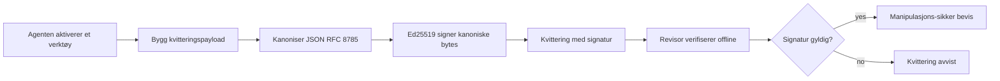
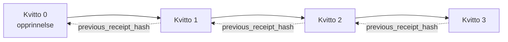

[Se leksjonsvideoen: Sikring av AI-agenter med kryptografiske kvitteringer](https://youtu.be/PLACEHOLDER_VIDEO_ID)

> _(Leksjonsvideo og miniatyrbilde vil bli lagt til av Microsoft-innholdsteamet etter sammenslåing, i samsvar med mønsteret for leksjon 14 / 15.)_

# Sikring av AI-agenter med kryptografiske kvitteringer

## Introduksjon

Denne leksjonen vil dekke:

- Hvorfor revisjonsspor for AI-agenter er viktig for samsvar, feilsøking og tillit.
- Hva en kryptografisk kvittering er og hvordan den skiller seg fra en usignert logglinje.
- Hvordan produsere en signert kvittering for et verktøys kall fra en agent i vanlig Python.
- Hvordan verifisere en kvittering offline og oppdage manipulering.
- Hvordan lenke kvitteringer slik at fjerning eller omrokering av én bryter kjeden.
- Hva kvitteringer beviser og hva de eksplisitt ikke beviser.

## Læringsmål

Etter å ha fullført denne leksjonen vil du vite hvordan du:

- Identifiserer feilsituasjoner som motiverer kryptografisk proveniens for agenthandlinger.
- Produserer en Ed25519-signert kvittering over en kanonisk JSON-payload.
- Verifiserer en kvittering uavhengig ved å bruke kun underskrevne nøkkelens offentlige nøkkel.
- Oppdager manipulering ved å kjøre verifisering på nytt på en endret kvittering.
- Bygger en hash-kjedet sekvens av kvitteringer og forklarer hvorfor kjeden er viktig.
- Gjenkjenner grensen mellom hva kvitteringer beviser (attribusjon, integritet, rekkefølge) og hva de ikke beviser (riktigheten av handlingen, gyldigheten av policyen).

## Problemet: Agentens revisjonsspor

Forestill deg at du har satt i drift en AI-agent for Contoso Travel. Agenten leser kunders forespørsler, kaller en fly-API for å finne alternativer, og bestiller seter på vegne av kunden. Forrige kvartal behandlet agenten 50 000 bestillinger.

I dag kommer en revisor. De stiller et enkelt spørsmål: "Vis meg hva agenten din gjorde."

Du leverer loggfilene dine. Revisoren ser på dem og stiller det vanskeligere spørsmålet: "Hvordan vet jeg at disse loggene ikke er redigert?"

Dette er problemet med revisjonsspor. De fleste agentinstallasjoner i dag stoler på:

- **Applikasjonslogger**: skrevet av agenten selv, redigerbar av alle med tilgang til filsystemet.
- **Skyloggtjenester**: manipuleringssikre på plattformnivå, men bare hvis revisoren stoler på plattformoperatøren.
- **Database-transaksjonslogger**: godt egnet for databaseendringer, men ikke for vilkårlige verktøyskall.

Ingen av disse kan besvare revisors spørsmål uten at revisor må stole på noen (deg, skyløsningstilbyderen eller databaseleverandøren). For intern bruk er denne tilliten ofte akseptabel. For regulerte arbeidsmengder (finans, helsetjenester, alt som omfattes av EU AI-loven) er den det ikke.

Kryptografiske kvitteringer løser dette ved å gjøre hver agenthandling uavhengig verifiserbar. Revisor trenger ikke å stole på deg. De trenger bare din offentlige nøkkel og selve kvitteringen.

## Hva er en kryptografisk kvittering?

En kvittering er et JSON-objekt som registrerer hva en agent gjorde, signert med en digital signatur.


```mermaid
flowchart LR
    A[Agenten aktiverer et verktøy] --> B[Bygg kvitteringspayload]
    B --> C[Kanoniser JSON RFC 8785]
    C --> E[Ed25519 signer kanoniske bytes]
    E --> F[Kvittering med signatur]
    F --> G[Revisor verifiserer offline]
    G --> H{Signatur gyldig?}
    H -- yes --> I[Manipulasjons-sikker bevis]
    H -- no --> J[Kvittering avvist]
```

En minimal kvittering ser slik ut:

```json
{
  "type": "agent.tool_call.v1",
  "agent_id": "contoso-travel-bot",
  "tool_name": "lookup_flights",
  "tool_args_hash": "sha256:a3f9c1...",
  "result_hash": "sha256:7b2e1d...",
  "policy_id": "contoso-travel-policy-v3",
  "timestamp": "2026-04-25T14:30:00Z",
  "sequence": 47,
  "previous_receipt_hash": "sha256:9d4e6a...",
  "signature": {
    "alg": "EdDSA",
    "sig": "c5af83...",
    "public_key": "8f3b2c..."
  }
}
```

Tre egenskaper gjør jobben:

1. **Signaturen**. Kvitteringen signeres av agentens gateway ved bruk av en Ed25519 privatnøkkel. Alle med den tilhørende offentlige nøkkelen kan verifisere signaturen offline. Manipulering av et hvilket som helst felt ugyldiggjør signaturen.

2. **Kanonisk koding**. Før signering serialiseres kvitteringen ved bruk av JSON Canonicalization Scheme (JCS, RFC 8785). Dette sikrer at to implementeringer som produserer samme logiske kvittering også produserer byte-identisk output. Uten kanonisering ville ulike JSON-serialisatorer produsere forskjellige signaturer for samme innhold.

3. **Hash-kjedning**. Feltet `previous_receipt_hash` lenker hver kvittering til den forrige. Å fjerne eller omrokere en kvittering bryter alle kvitteringer som kom etter den. Manipulering blir synlig på kjedenivå, selv om enkelte signaturer omgås.

Sammen gir disse egenskapene tre garantier:

- **Attribusjon**: denne nøkkelen signerte dette innholdet.
- **Integritet**: innholdet har ikke endret seg siden signering.
- **Rekkefølge**: denne kvitteringen kom etter den andre i kjeden.

## Å produsere en kvittering i Python

Du trenger ikke et spesielt bibliotek for å produsere en kvittering. De kryptografiske primitivene er allment tilgjengelige og logikken er noen titalls linjer Python.

De praktiske øvelsene i `code_samples/18-signed-receipts.ipynb` går grundig gjennom hele flyten. Sammendragsversjonen:

```python
import json
import hashlib
import base64
from nacl import signing
from jcs import canonicalize  # RFC 8785 kanonisk JSON

def b64url_nopad(data: bytes) -> str:
    return base64.urlsafe_b64encode(data).decode("ascii").rstrip("=")

def sha256_canonical(obj) -> str:
    """SHA-256 of a Python object's JCS-canonical JSON form."""
    return f"sha256:{hashlib.sha256(canonicalize(obj)).hexdigest()}"

# Generer eller last inn en signeringsnøkkel (i produksjon, lagre i en nøkkellager)
signing_key = signing.SigningKey.generate()
verify_key = signing_key.verify_key

# Bygg kvitteringsinnholdet (ingen signatur ennå)
tool_args = {"origin": "SYD", "destination": "LAX"}
tool_result = [{"flight": "QF11", "price": 1850, "stops": 0}]

payload = {
    "type": "agent.tool_call.v1",
    "agent_id": "contoso-travel-bot",
    "tool_name": "lookup_flights",
    "tool_args_hash": sha256_canonical(tool_args),
    "result_hash": sha256_canonical(tool_result),
    "policy_id": "contoso-travel-policy-v3",
    "timestamp": "2026-04-25T14:30:00Z",
    "sequence": 0,
    "previous_receipt_hash": None,
}

# Kanoniser og signer JCS-bytene direkte. PureEdDSA hasher internt.
canonical_bytes = canonicalize(payload)
signature_bytes = signing_key.sign(canonical_bytes).signature

# Legg ved et strukturert signaturobjekt.
receipt = {
    **payload,
    "signature": {
        "alg": "EdDSA",
        "sig": b64url_nopad(signature_bytes),
        "public_key": b64url_nopad(bytes(verify_key)),
    },
}
```

Det er hele signeringspipen. Øvelsene i notatboken forklarer hvert trinn.

## Verifisere en kvittering og oppdage manipulering

Verifisering er motsatt operasjon:

```python
import base64
import hashlib
from nacl import signing
from nacl.exceptions import BadSignatureError
from jcs import canonicalize

def b64url_decode(s: str) -> bytes:
    padding = "=" * ((4 - len(s) % 4) % 4)
    return base64.urlsafe_b64decode(s + padding)

def verify_receipt(receipt: dict) -> bool:
    # Signaturen er et strukturert objekt: {"alg", "sig", "public_key"}.
    sig_obj = receipt.get("signature")
    if not sig_obj or sig_obj.get("alg") != "EdDSA":
        return False

    # Gjenoppbygg nyttelasten som faktisk ble signert (alt unntatt signaturen).
    payload = {k: v for k, v in receipt.items() if k != "signature"}

    canonical_bytes = canonicalize(payload)

    try:
        verify_key = signing.VerifyKey(b64url_decode(sig_obj["public_key"]))
        verify_key.verify(canonical_bytes, b64url_decode(sig_obj["sig"]))
        return True
    except BadSignatureError:
        return False
```

Denne funksjonen tar en kvittering og returnerer `True` hvis signaturen er gyldig, `False` ellers. Ingen nettverkskall, ingen tjenesteavhengigheter, ingen tillit kreves til tredjepart.

For å se manipulering oppdages i praksis, går notatboken gjennom:

1. Å produsere en gyldig kvittering og bekrefte at den verifiserer.
2. Å endre én byte i feltet `tool_args_hash`.
3. Å kjøre verifiseringen på nytt og se at den feiler.

Dette er en praktisk demonstrasjon av at kvitteringer er manipulasjonssikre: enhver modifikasjon, uansett hvor liten, bryter signaturen.

## Kjedeoppbygging av kvitteringer for flertrinnsagenter

En enkelt signert kvittering beskytter én handling. En kjede av kvitteringer beskytter en sekvens.


```mermaid
flowchart LR
    R0[Kvitto 0<br/>opprinnelse] --> R1[Kvitto 1]
    R1 --> R2[Kvitto 2]
    R2 --> R3[Kvitto 3]
    R1 -. previous_receipt_hash .-> R0
    R2 -. previous_receipt_hash .-> R1
    R3 -. previous_receipt_hash .-> R2
```

Hver kvittering registrerer hashverdien til kvitteringen før den. For å fjerne kvittering 2 uten å etterlate spor, må en angriper enten:

- Endre feltet `previous_receipt_hash` i kvittering 3 (bryter signaturen for kvittering 3), ELLER
- Falske en ny signatur på en endret kvittering 3 (krever agentens private nøkkel).

Hvis den private nøkkelen er lagret i en hardware key vault og du publiserer den offentlige nøkkelen med hver kvittering, er ingen av angrepene mulig uten at det oppdages.

Notatboken går gjennom:

1. Å bygge en kjede med tre kvitteringer.
2. Å verifisere at hver kvitterings `previous_receipt_hash` samsvarer med den faktiske hashen til forrige kvittering.
3. Å manipulere en kvittering midt i kjeden og se at kjeden brytes akkurat der.

Slik lager du et revisjonsspor som en ekstern revisor kan verifisere uten å stole på deg.

## Hva kvitteringer beviser (og hva de ikke gjør)

Dette er den viktigste delen av denne leksjonen. Kvitteringer er kraftige, men deres kraft har grenser.

**Kvitteringer beviser tre ting:**

1. **Attribusjon**: en bestemt nøkkel signerte en bestemt payload.
2. **Integritet**: payloaden har ikke endret seg siden signering.
3. **Rekkefølge**: denne kvitteringen kom etter den andre i hash-kjeden.

**Kvitteringer BEVISER IKKE:**

1. **Riktighet**: at agentens handling var korrekt. En kvittering kan signeres for et feil svar like rent som for et riktig svar.
2. **Policysamsvar**: at policyen referert til i `policy_id` faktisk ble evaluert, eller at den ville ha tillatt denne handlingen hvis den ble sjekket. Kvitteringen registrerer hva som ble påstått, ikke hva som ble håndhevet.
3. **Identitet utover nøkkelen**: kvitteringen sier "denne nøkkelen signerte dette innholdet." Den sier ikke "et menneske godkjente dette." Å knytte en nøkkel til en person eller organisasjon krever separat identitetsinfrastruktur (en katalog, et offentlig nøkkelregister, osv.).
4. **Sannferdighet av input**: hvis agenten mottar et manipulert prompt og handler deretter, registrerer kvitteringen handlingen nøyaktig. Kvitteringer er etter inputvalidering, ikke en erstatning for det.

Denne grensen er viktig av to grunner:

- Den forteller deg hva kvitteringer er nyttige for: å gjøre agentatferd reviderbar og manipulasjonssikker, selv på tvers av organisatoriske grenser.
- Den forteller deg hvilke ytterligere lag du fortsatt trenger: inputvalidering (Leksjon 6), policyhåndhevelse (dekket kort nedenfor), og identitetsinfrastruktur (utenfor denne leksjonens omfang).

En vanlig feil er å anta at "vi har kvitteringer" betyr "vi er styrt." Det gjør det ikke. Kvitteringer er et fundament. Styring er systemet du bygger oppå.

## Bevise at et menneske godkjente den eksakte handlingen

Punkt 3 ovenfor fortjener sin egen seksjon: en handlingskvittering sier "denne nøkkelen signerte dette innholdet," aldri "et menneske godkjente dette." For høyrisiko-handlinger (refusjoner, slettinger, penger overføring), krever styringsrammeverk i økende grad nettopp denne manglende uttalelsen, og den kan produseres med de samme primitivene du allerede har bygd i denne leksjonen.

Den påfølgende notatboken `code_samples/human-authorization-receipts.ipynb` legger til en sekundær kvitteringstype, `human.approval.v1`, i samme konvoluttform som leksjonens kvitteringer (en typet payload signert med Ed25519 over sine kanoniske JCS-bytes, med `signature`-objektet utenfor de signerte bytes). En navngitt godkjenner signerer **hele den kanoniske handlingen og dens digest** før utførelse; agentens handlingskvittering bærer **samme handlingsdigest** og en `parent_approval_ref`, `receipt_hash` for godkjenningen, samme konvensjon som `previous_receipt_hash` i kjeden du bygde ovenfor. En `verify_chain` kjører gjennom begge elementene under **separate fastpinned nøkkelregistre** (godkjentnøkler vs agentnøkler), slik at kodebanen deles, men myndighetene aldri gjør det.

Egenskapen dette gir, formulert nøye: *mennesket godkjente denne eksakte handlingen, og agenten utførte nøyaktig denne godkjente handlingen.* Notatbokens avvisningsscenarier er det som gjør egenskapen reell i stedet for bare påstått:

- den klassiske samlingen: manipulering, forvirret stedfortreder, gjentakelse, forfalskede nøkler på begge sider, malformed input;
- **utgått myndighet**: en signatur som fortsatt verifiserer, men likevel avvises fordi policy-versjonen endret seg, godkjentnøkkelen ble rotert ut av det fastpinnede registeret, eller godkjenningen utløp før utførelse;
- **digest-substitusjon**: en gyldig signert handlingskvittering som peker på en *ekte* godkjenning som binder en *annen* kanonisk handling.

Hver feil gir avslag med en distinkt grunn, slik at en revisor som leser avslaget kan vite om myndigheten gikk ut på dato eller handlingen ble endret. Regelen notatboken lærer bort: en signert godkjenning er ikke myndighet i seg selv. Myndighet finnes bare hvis begge kvitteringer fortsatt binder til samme kanoniske handling ved utførelsestidspunktet. Menneske-godkjenningskvitteringen er en pedagogisk sammensetning definert av denne leksjonen, ikke en kvitteringstype definert av `draft-farley-acta-signed-receipts`.

## Produksjonsreferanser

Python-koden i denne leksjonen er med vilje minimal slik at du kan lese hver linje og forstå nøyaktig hva som skjer. I produksjon har du to valg:

1. **Bygg direkte på de kryptografiske primitivene.** De 50 linjene du så ovenfor er tilstrekkelige for mange bruksområder. PyNaCl (Ed25519) og `jcs`-pakken (kanonisk JSON) er godt vedlikeholdte og reviderte biblioteker.

2. **Bruk et produksjonsbibliotek for kvitteringer.** Flere open-source-prosjekter implementerer samme mønster med flere funksjoner (nøkkelrotasjon, batch-verifisering, JWK-sett-distribusjon, integrasjon med policy-motorer):
   - Signeringspipen bruker JCS og signatur-omfangskonvensjoner i et uavhengig IETF internett-utkast ([`draft-farley-acta-signed-receipts`](https://datatracker.ietf.org/doc/draft-farley-acta-signed-receipts/), revisjon 02). Denne leksjonens enkle pedagogiske kvittering skiller seg fra utkastets `{payload, signature}` konvolutt og presenteres ikke som en konform implementasjon. Utkastet publiserer en delt konformasjons-suite ([agent-governance-testvectors](https://github.com/ScopeBlind/agent-governance-testvectors)) for implementeringer som målretter dens trådlformat.
   - Microsoft Agent Governance Toolkit komponerer kvitteringer med Cedar-baserte policybeslutninger; se Tutorial 33 i det depotet for et ende-til-ende eksempel.
   - `protect-mcp` (npm) og `@veritasacta/verify` (npm) pakkene tilbyr en Node-basert implementasjon av kvitterings-signering og offline verifisering, ment for å pakke enhver MCP-server med et manipulasjonssikkert revisjonsspor, inkludert en holdt-for-samsignering flyt der en pausert handling emitterer en godkjenningskvittering knyttet til handlingsdigesten (WebAuthn-støttet i desktopflyten), samme godkjenningskvitteringsmønster som den menneskelige autorisasjonsnotatboken over.
   - **[nobulex](https://github.com/arian-gogani/nobulex)** Python SDK (`pip install nobulex`) tilbyr samme Ed25519 + JCS signeringsmønster i Python med LangChain og CrewAI-integrasjoner, inkludert publiserte kryssvalideringstestvektorer og en samsvarskartlegging bidratt via [OWASP PR #2210](https://github.com/OWASP/CheatSheetSeries/pull/2210).

Beslutningen om å lage egen løsning eller bruke bibliotek speiler valget mellom å skrive eget JWT-bibliotek og bruke et testet: begge er rimelige; biblioteket sparer tid og reduserer revisjonsområdet; løsningen fra bunnen av tvinger deg til å forstå hver primitiv. Denne leksjonen lærer fra-bunnen-av-tilnærmingen slik at du har grunnlaget for begge valg.

## Kunnskapssjekk

Test forståelsen din før du går videre til praksisøvelsen.

**1. En kvittering er signert med agentens private Ed25519-nøkkel. Revisor har bare den offentlige nøkkelen. Kan revisor verifisere kvitteringen offline?**

<details>
<summary>Svar</summary>

Ja. Ed25519-verifisering krever kun den offentlige nøkkelen og de signerte bytes. Ingen nettverkskall, ingen tjenesteavhengighet. Dette er egenskapen som gjør kvitteringer nyttige i luftgapte, flerorganisatoriske eller lavtillits revisjonsmiljøer.
</details>

**2. En angriper endrer feltet `policy_id` i en kvittering for å påstå at den var underlagt en mer tillatende policy. Signaturen var over originalpayloaden. Hva skjer under verifisering?**

<details>
<summary>Svar</summary>


Verifiseringen mislykkes. Signaturen ble beregnet over de kanoniske bytene av den opprinnelige nyttelasten; å endre noe felt endrer disse bytene, noe som gjør signaturen ugyldig. Angriperen ville trenge den private nøkkelen for å produsere en ny gyldig signatur, noe de ikke har.
</details>

**3. Hvorfor inkluderer kvitteringen en `tool_args_hash` og `result_hash` i stedet for de rå argumentene og resultatet?**

<details>
<summary>Svar</summary>

To grunner. For det første kan kvitteringen måtte arkiveres eller sendes i miljøer hvor lekkasje av råinnholdet (personlig identifiserbar informasjon, forretningsdata) er et problem. Hashing holder kvitteringen liten og innholdet privat; revisoren verifiserer at hashen stemmer med en separat lagret kopi av det faktiske innholdet. For det andre har hasher en fast størrelse; en kvittering med hasher har en begrenset størrelse uavhengig av hvor store inndata og utdata var.
</details>

**4. Feltet `previous_receipt_hash` lenker hver kvittering til sin forgjenger. Hvis en angriper stille sletter en kvittering fra midten av en kjede, hva blir ugyldig?**

<details>
<summary>Svar</summary>

Hver kvittering som kom etter den slettede. Deres `previous_receipt_hash`-felt samsvarer ikke lenger med den faktiske kjeden (fordi kvitteringen de refererte til ikke lenger finnes, eller kjeden nå peker til en annen forgjenger). For å skjule slettingen måtte angriperen signere på nytt hver senere kvittering, noe som krever den private nøkkelen.
</details>

**5. En kvittering verifiseres rent. Beviser det at agentens handling var korrekt, gyldig, eller i samsvar med policy?**

<details>
<summary>Svar</summary>

Nei. En gyldig kvittering beviser tre ting: tilordning (denne nøkkelen signerte dette innholdet), integritet (innholdet har ikke endret seg), og rekkefølge (denne kvitteringen kom etter den kvitteringen). Den beviser IKKE at handlingen var korrekt, at policyen angitt i `policy_id` faktisk ble evaluert, eller at agenten fulgte alle regler. Kvitteringer gjør agentens atferd reviderbar, ikke nødvendigvis korrekt. Dette er den viktigste grensen i leksjonen.
</details>

## Øvelsesoppgave

Åpne `code_samples/18-signed-receipts.ipynb` og fullfør alle fire seksjoner:

1. **Seksjon 1**: Signer din første kvittering og verifiser den.
2. **Seksjon 2**: Endre kvitteringen og observer at verifiseringen mislykkes.
3. **Seksjon 3**: Bygg en kjede med tre kvitteringer og verifiser kjedens integritet.
4. **Seksjon 4**: Bruk mønsteret på en agent bygget med Microsoft Agent Framework: pakk et verktøy-kall i kvitterings-signering, og verifiser deretter kvitteringen uavhengig.

**Utfordring 1:** utvid kvitteringsskjemaet med et ekstra felt etter eget valg (for eksempel en forespørsels-ID for sporing), oppdater den kanoniske signeringslogikken for å inkludere det, og bekreft at kvitteringen fortsatt kan rundreise gjennom verifisering. Endre deretter feltet etter signering og bekreft at verifiseringen feiler. Dette tvinger deg til å forstå hvordan hver enkelt byte i den kanoniske kodingen bidrar til signaturen.

**Utfordring 2:** SHA-256-hash to av kvitteringene dine sammen (settes sammen i en deterministisk rekkefølge) og legg inn den resulterende digesten som et nytt felt i en tredje kvittering før signering. Verifiser at alle tre kvitteringene fortsatt kan rundreise. Du har nettopp bygget et ett-trinns inklusjonsbevis: enhver som har den tredje kvitteringen kan bevise at de to første eksisterte da den ble signert, uten å måtte avsløre innholdet. Dette er mønsteret som selektiv-avsløring-kvitteringer bruker i stor skala (Merkle-forpliktelser, RFC 6962).

## Konklusjon

Kryptografiske kvitteringer gir AI-agenter en revisjonsspor som er:

- **Uavhengig verifiserbar**: enhver part med den offentlige nøkkelen kan verifisere, uten tjenesteavhengighet.
- **Manipulasjons-synlig**: enhver endring ugyldiggjør signaturen.
- **Bærbar**: en kvittering er en liten JSON-fil; den kan arkiveres, sendes og verifiseres hvor som helst.
- **Standardjustert**: bygget på Ed25519 (RFC 8032), JCS (RFC 8785), og SHA-256, alle mye brukte primitive.

De er ikke en erstatning for inndata-validering, håndhevelse av policy, eller identitetsinfrastruktur. De er et fundament for disse lagene. Når du distribuerer agenter i regulerte arbeidsmengder, flerorganisasjons-arbeidsflyter, eller ethvert miljø hvor en fremtidig revisor ikke kan antas å stole på deg, er kvitteringer hvordan du gjør revisjonssporet ærlig.

Det viktigste å ta med seg: kvitteringer beviser hvem som sa hva, når. De beviser ikke at det som ble sagt var sant eller riktig. Hold dette skillet stramt. Det er forskjellen mellom et ærlig provenienssystem og et villedende.

## Produksjons-sjekkliste

Når du er klar til å gå videre fra denne leksjonen til å distribuere kvitteringssignerte agenter i et ekte miljø:

- [ ] **Flytt signeringsnøkkelen bort fra utvikler-laptopen.** Bruk Azure Key Vault, AWS KMS eller en maskinvare-sikkerhetsmodul. Den private nøkkelen som signerer kvitteringene dine må aldri ligge i kildekoden eller i klartekst på applikasjonsmaskiner.
- [ ] **Publiser den offentlige verifiseringsnøkkelen.** Revisorer trenger den for å verifisere offline. Standardmønsteret er et JWK Set på en kjent URL (RFC 7517), f.eks. `https://your-org.example.com/.well-known/agent-keys.json`.
- [ ] **Ankr kjeden eksternt.** Skriv periodisk den siste kjedehodet-hashen til en transparenslogg (Sigstore Rekor, RFC 3161 tidsstempelmyndighet, eller et annet internt system) slik at en ekstern part kan bekrefte "denne kjeden eksisterte på dette tidspunktet."
- [ ] **Lagre kvitteringer uforanderlig.** Append-only blob storage (Azure Storage med uforanderlighetspolicyer, AWS S3 Object Lock) forhindrer at en insider kan omskrive historikk på lagringsnivå.
- [ ] **Avgjør om lagringstid.** Mange samsvarsregimer krever flere års lagring. Planlegg for vekst i kvitteringer (hver kvittering er ~500 byte; en agent som gjør 10 000 kall per dag produserer ~1,8 GB per år).
- [ ] **Dokumenter hva kvitteringer ikke dekker.** Kvitteringer beviser tilordning, integritet og rekkefølge. Din kjørebok bør eksplisitt liste hvilke tilleggskontroller (inndata-validering, policyhåndhevelse, hastighetsbegrensning, identitetsinfrastruktur) som ligger sammen med kvitteringer i din styringsinnstilling.

### Har du flere spørsmål om å sikre AI-agenter?

Bli med i [Microsoft Foundry Discord](https://aka.ms/ai-agents/discord) for å møte andre elever, delta på kontortid, og få svar på dine spørsmål om AI-agenter.

## Utover denne leksjonen

Denne leksjonen dekker enkeltkvitterings-signering og hash-kjedede sekvenser. De samme primitive bygningselementene settes sammen i flere mer avanserte mønstre du kan støte på etter hvert som din styringsinnstilling modnes:

- **Selektiv avsløring.** Når feltene i en kvittering er uavhengig forpliktet (RFC 6962-stil Merkle-tre), kan du avsløre bestemte felt til bestemte revisorer og bevise at resten er uendret uten å eksponere dem. Nyttig når samme kvittering skal tilfredsstille både en omfattende revisjon (som ønsker fullstendighet) og regler for dataminimering som GDPR (som vil at revisor skal se så lite som mulig).
- **Tilbakekalling av kvitteringer.** Hvis en signeringsnøkkel kompromitteres, trenger du en måte å merke alle kvitteringer signert med den nøkkelen som upålitelige fra et tidspunkt fremover. Standardmønstre: kortlivede signeringsnøkler pluss en publisert tilbakekallingsliste, eller en transparenslogg med tilbakekallingsposter.
- **Bilaterale / delte signatur-kvitteringer.** Noen implementasjoner deler det signerte innholdet i pre-eksekverings- (`authorization_*`) og post-eksekverings- (`result_*`) halvparter med uavhengige signaturer, nyttig når autorisasjonsbeslutningen og det observerte resultatet produseres av forskjellige aktører eller til forskjellige tider. Dette bygger additivt oppå kvitteringsformatet som læres i denne leksjonen.
- **Sammensetting av nyttelast.** En kvittering forsegler de bytene du legger i `result_hash`. Realistiske nyttelaster er ofte rikere enn et enkelt verktøysresultat: forhåndsbeslutningsresonnement (modellforutsigelse, vurderte alternativer, bevis og dets fullstendighet, risikopostur, ansvarskjede, utfallsport) kan alle ligge inni nyttelasten, forseglet av en enkelt kvittering. Dette holder kvitteringsformatet minimalt samtidig som nyttelastskjemaer får utvikle seg domene-for-domene.
- **Tverr-implementasjonskonformitet.** Flere uavhengige implementasjoner av samme kvitteringsformat (Python, TypeScript, Rust, Go) kryssverifiserer mot delte testvektorer. Hvis du bygger din egen implementasjon, bekrefter validering mot publiserte vektorer trådloddskompatibilitet.
- **Post-kvantemigrasjon.** Ed25519 er mye brukt i dag, men ikke kvantesikker. Kvitteringsformatet er algoritme-agilt: feltet `signature.alg` kan bære `ML-DSA-65` (NIST post-kvantum signaturstandard) når du trenger å migrere. Planlegg en overgangsperiode hvor kvitteringer er dobbelt signert.

## Tilleggsressurser

- <a href="https://datatracker.ietf.org/doc/draft-farley-acta-signed-receipts/" target="_blank">IETF Internet-Draft: Signed Decision Receipts for Machine-to-Machine Access Control</a>
- <a href="https://learn.microsoft.com/azure/ai-studio/responsible-use-of-ai-overview" target="_blank">Ansvarlig AI oversikt (Azure AI)</a>
- <a href="https://datatracker.ietf.org/doc/html/rfc8032" target="_blank">RFC 8032: Edwards-Curve Digital Signature Algorithm (EdDSA)</a>
- <a href="https://datatracker.ietf.org/doc/html/rfc8785" target="_blank">RFC 8785: JSON Canonicalization Scheme (JCS)</a>
- <a href="https://datatracker.ietf.org/doc/html/rfc6962" target="_blank">RFC 6962: Certificate Transparency</a> (Merkle-trekkonstruksjon brukt av selektiv-avsløring-kvitteringer)
- <a href="https://github.com/microsoft/agent-governance-toolkit/blob/main/docs/tutorials/33-offline-verifiable-receipts.md" target="_blank">Microsoft Agent Governance Toolkit, Tutorial 33: Offline-Verifiable Decision Receipts</a>
- <a href="https://github.com/ScopeBlind/agent-governance-testvectors" target="_blank">Konformitetstestvektorer på tvers av implementasjoner</a> for kvitteringsformatet brukt i denne leksjonen (Apache-2.0)
- <a href="https://pynacl.readthedocs.io/" target="_blank">PyNaCl dokumentasjon</a> (Ed25519 i Python)

## Forrige leksjon

[Opprette lokale AI-agenter](../17-creating-local-ai-agents/README.md)

---

<!-- CO-OP TRANSLATOR DISCLAIMER START -->
**Ansvarsfraskrivelse**:
Dette dokumentet er oversatt ved hjelp av AI-oversettelsestjenesten [Co-op Translator](https://github.com/Azure/co-op-translator). Selv om vi streber etter nøyaktighet, vær oppmerksom på at automatiske oversettelser kan inneholde feil eller unøyaktigheter. Det opprinnelige dokumentet på originalspråket skal betraktes som den autoritative kilden. For kritisk informasjon anbefales profesjonell menneskelig oversettelse. Vi er ikke ansvarlige for eventuelle misforståelser eller feiltolkninger som oppstår ved bruk av denne oversettelsen.
<!-- CO-OP TRANSLATOR DISCLAIMER END -->