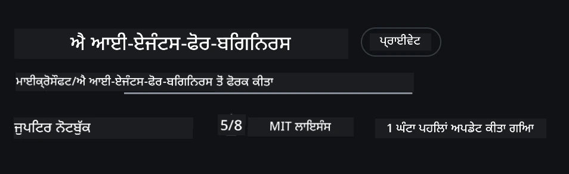
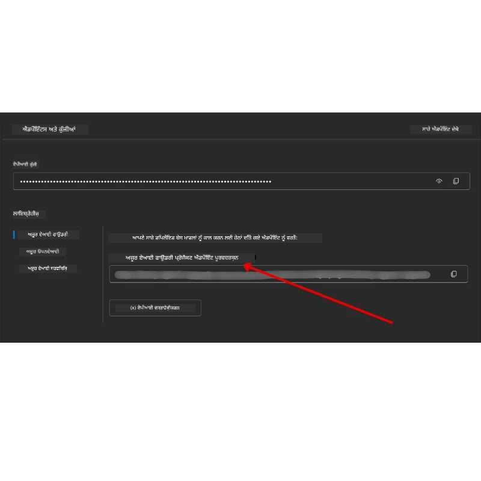

# ਕੋਰਸ ਸੈਟਅਪ

## ਪ੍ਰਸਤਾਵਨਾ

ਇਸ ਪਾਠ ਵਿੱਚ ਦੱਸਿਆ ਜਾਵੇਗਾ ਕਿ ਇਸ ਕੋਰਸ ਦੇ ਕੋਡ ਨਮੂਨੇ ਕਿਵੇਂ ਚਲਾਏ ਜਾਣ।

## ਹੋਰ ਲਰਨਰਾਂ ਨਾਲ ਜੁੜੋ ਅਤੇ ਮਦਦ ਪ੍ਰਾਪਤ ਕਰੋ

ਆਪਣਾ ਰਿਪੋ ਕਲੋਨ ਕਰਨ ਤੋਂ ਪਹਿਲਾਂ, ਸੈੱਟਅਪ ਜਾਂ ਕੋਰਸ ਬਾਰੇ ਕਿਸੇ ਵੀ ਪ੍ਰਸ਼ਨ ਲਈ ਜਾਂ ਹੋਰ ਲਰਨਰਾਂ ਨਾਲ ਜੁੜਨ ਲਈ [AI Agents For Beginners Discord channel](https://aka.ms/ai-agents/discord) ਵਿੱਚ ਸ਼ਾਮਲ ਹੋਵੋ।

## ਇਸ ਰੀਪੋ ਨੂੰ ਕਲੋਨ ਜਾਂ ਫੋਰਕ ਕਰੋ

ਸ਼ੁਰੂ ਕਰਨ ਲਈ, ਕਿਰਪਾ ਕਰਕੇ GitHub ਰਿਪੋਜ਼ਟਰੀ ਨੂੰ ਕਲੋਨ ਜਾਂ ਫੋਰਕ ਕਰੋ। ਇਸ ਨਾਲ ਤੁਹਾਡੇ ਕੋਲ ਕੋਰਸ ਮਟੀਰੀਅਲ ਦਾ ਆਪਣਾ ਸੰਸਕਰਣ ਹੋਵੇਗਾ ਤਾਂ ਜੋ ਤੁਸੀਂ ਕੋਡ ਚਲਾ, ਟੈਸਟ ਅਤੇ ਸੋਧ ਸਕੋ!

ਇਹ <a href="https://github.com/microsoft/ai-agents-for-beginners/fork" target="_blank">ਰੀਪੋ ਨੂੰ ਫੋਰਕ ਕਰੋ</a> ਲਿੰਕ 'ਤੇ ਕਲਿੱਕ ਕਰਕੇ ਕੀਤਾ ਜਾ ਸਕਦਾ ਹੈ

ਹੁਣ ਤੁਹਾਡੇ ਕੋਲ ਇਸ ਕੋਰਸ ਦਾ ਆਪਣਾ ਫੋਰਕ ਕੀਤਾ ਹੋਇਆ ਸੰਸਕਰਣ ਹੇਠਾਂ ਦਿੱਤੇ ਲਿੰਕ ਵਿੱਚ ਹੋਣਾ ਚਾਹੀਦਾ ਹੈ:



### ਸ਼ੈਲੋ ਕਲੋਨ (ਵਰਕਸ਼ਾਪ / Codespaces ਲਈ ਸਿਫਾਰਸ਼ ਕੀਤੀ ਜਾਂਦੀ ਹੈ)

  > ਪੂਰਾ ਰਿਪੋਜ਼ਟਰੀ ਡਾਊਨਲੋਡ ਕਰਨ 'ਤੇ ਵੱਡਾ ਹੋ ਸਕਦਾ ਹੈ (~3 GB). ਜੇ ਤੁਸੀਂ ਕੇਵਲ ਵਰਕਸ਼ਾਪ ਅਟੈਂਡ ਕਰ ਰਹੇ ਹੋ ਜਾਂ ਕੇਵਲ ਕੁਝ ਪਾਠ ਫੋਲਡਰਾਂ ਦੀ ਲੋੜ ਹੈ, ਤਾਂ ਸ਼ੈਲੋ ਕਲੋਨ (ਜਾਂ ਸਪਾਰਸ ਕਲੋਨ) ਇਤਿਹਾਸ ਨੂੰ ਸੰਖੇਪ ਕਰਕੇ ਅਤੇ/ਜਾਂ ਬਲੌਬ ਛੱਡ ਕੇ ਜ਼ਿਆਦਾ ਡਾਊਨਲੋਡ ਤੋਂ ਬਚਾਓ ਕਰਦਾ ਹੈ।

#### ਤੇਜ਼ ਸ਼ੈਲੋ ਕਲੋਨ — ਘੱਟ ਇਤਿਹਾਸ, ਸਾਰੇ ਫਾਇਲ

ਹੇਠਾਂ ਦਿੱਤੇ ਕਮਾਂਡਾਂ ਵਿੱਚ `<your-username>` ਨੂੰ ਆਪਣੇ ਫੋਰਕ URL ਨਾਲ (ਅਥਵਾ ਜੇ ਤੁਸੀਂ ਪਸੰਦ ਕਰੋ ਤਾਂ ਅਪਸਟਰੀਮ URL ਨਾਲ) ਬਦਲੋ।

ਨਵੀਂ ਕਮਿੱਟ ਇਤਿਹਾਸ (ਛੋਟਾ ਡਾਊਨਲੋਡ) ਹੀ ਕਲੋਨ ਕਰਨ ਲਈ:

```bash|powershell
git clone --depth 1 https://github.com/<your-username>/ai-agents-for-beginners.git
```

ਕਿਸੇ ਖਾਸ ਬ੍ਰਾਂਚ ਨੂੰ ਕਲੋਨ ਕਰਨ ਲਈ:

```bash|powershell
git clone --depth 1 --branch <branch-name> https://github.com/<your-username>/ai-agents-for-beginners.git
```

#### ਆংশਿਕ (ਸਪਾਰਸ) ਕਲੋਨ — ਘੱਟ ਬਲੌਬ + ਚੁਣੀ ਹੋਈਆਂ ਫੋਲਡਰਾਂ ਹੀ

ਇਹ ਆংশਿਕ ਕਲੋਨ ਅਤੇ sparse-checkout ਵਰਤਦਾ ਹੈ (Git 2.25+ ਦੀ ਲੋੜ ਤੇ partial clone ਸਹਾਇਤਾ ਵਾਲਾ ਆਧੁਨਿਕ Git ਸਿਫਾਰਸ਼ੀ ਹੈ):

```bash|powershell
git clone --depth 1 --filter=blob:none --sparse https://github.com/<your-username>/ai-agents-for-beginners.git
```

ਰੀਪੋ ਫੋਲਡਰ ਵਿੱਚ ਜਾਓ:

```bash|powershell
cd ai-agents-for-beginners
```

ਫਿਰ ਉਹ ਫੋਲਡਰ ਸਪੈਸੀਫਾਇ ਕਰੋ ਜੋ ਤੁਸੀਂ ਚਾਹੁੰਦੇ ਹੋ (ਹੇਠਾਂ ਉਦਾਹਰਨ ਵਿੱਚ ਦੋ ਫੋਲਡਰ ਦਿਖਾਏ ਗਏ ਹਨ):

```bash|powershell
git sparse-checkout set 00-course-setup 01-intro-to-ai-agents
```

ਫਾਇਲਾਂ ਕਲੋਨ ਅਤੇ ਵੇਰੀਫਾਈ ਕਰਨ ਮਗਰੋਂ, ਜੇ ਤੁਹਾਨੂੰ ਸਿਰਫ ਫਾਇਲਾਂ ਦੀ ਲੋੜ ਹੈ ਅਤੇ ਤੁਸੀਂ ਸਪੇਸ ਖਾਲੀ ਕਰਨਾ ਚਾਹੁੰਦੇ ਹੋ (ਕੋਈ git ਇਤਿਹਾਸ ਨਹੀਂ), ਤਾਂ ਰਿਪੋਜ਼ਟਰੀ ਮੈਟਾਡੇਟਾ ਮਿਟਾਓ (💀ਪਿੱਛੇ ਮੁੜ ਨਹੀਂ ਆ ਸਕਦਾ — ਤੁਸੀਂ ਸਾਰੀ Git ਕਾਰਗੁਜ਼ਾਰੀ ਖੋ ਦਿਓਗੇ: ਕੋਈ commits, pulls, pushes, ਜਾਂ ਇਤਿਹਾਸ ਪਹੁੰਚ ਨਹੀਂ ਹੋਵੇਗੀ)।

```bash
# zsh/bash
rm -rf .git
```

```powershell
# ਪਾਵਰਸ਼ੈਲ
Remove-Item -Recurse -Force .git
```

#### GitHub Codespaces ਦੀ ਵਰਤੋਂ ਕਰਨਾ (ਲੋਕਲ ਵੱਡੇ ਡਾਊਨਲੋਡ ਤੋਂ ਬਚਣ ਲਈ ਸਿਫਾਰਸ਼ ਕੀਤੀ ਜਾਂਦੀ ਹੈ)

- ਇਸ ਰਿਪੋ ਲਈ ਨਵਾਂ Codespace [GitHub UI](https://github.com/codespaces) ਰਾਹੀਂ ਬਣਾਓ।  

- ਨਵੇਂ ਬਣਾਏ Codespace ਦੇ ਟਰਮੀਨਲ ਵਿੱਚ ਉੱਪਰ ਦਿੱਤੀਆਂ ਵਿੱਚੋਂ ਕਿਸੇ ਇੱਕ ਸ਼ੈਲੋ/ਸਪੈਰਸ ਕਲੋਨ ਕਮਾਂਡ ਨੂੰ ਚਲਾਓ ਤਾਂ ਜੋ ਸਿਰਫ਼ ਉਹੀ ਪਾਠ ਫੋਲਡਰ Codespace ਵਰਕਸਪੇਸ ਵਿੱਚ ਆ ਜावਨ।
- ਵਿਕਲਪੀ: Codespaces ਵਿੱਚ ਕਲੋਨ ਕਰਨ ਮਗਰੋਂ ਬਾਅਦ, ਬੇਸ਼ੱਕ ਅਤਿਰਿਕਤ ਸਪੇਸ ਵਾਪਸ ਪ੍ਰਾਪਤ ਕਰਨ ਲਈ .git ਨੂੰ ਹਟਾਓ (ਉਪਰ ਦਿੱਤੀਆਂ ਰਿਮੂਵਲ ਕਮਾਂਡਾਂ ਵੇਖੋ)।
- ਨੋਟ: ਜੇ ਤੁਸੀਂ ਰੀਪੋ ਨੂੰ ਸੀਧਾ Codespaces ਵਿੱਚ ਖੋਲ੍ਹਦੇ ਹੋ (ਬਿਨਾਂ ਵੱਖਰੇ ਕਲੋਨ ਦੇ), ਤਾਂ ਧਿਆਨ ਰਹੇ Codespaces devcontainer ਮਾਹੌਲ ਬਣਾਏਗਾ ਅਤੇ ਇਹ ਸ਼ਾਇਦ ਵਧ ਤੋਂ ਵਧ ਸਰੋਤ ਪ੍ਰੋਵਿਜ਼ਨ ਕਰ ਸਕਦਾ ਹੈ। ਨਵੇਂ Codespace ਦੇ ਅੰਦਰ ਇੱਕ ਸ਼ੈਲੋ ਕਾਪੀ ਕਲੋਨ ਕਰਨ ਨਾਲ ਤੁਹਾਨੂੰ ਡਿਸਕ ਉਪਯੋਗ 'ਤੇ ਵੱਧ ਕੰਟਰੋਲ ਮਿਲਦਾ ਹੈ।

#### ਸੁਝਾਵ

- ਜੇ ਤੁਸੀਂ ਸੋਧ/ਕਮੀਟ ਕਰਨਾ ਚਾਹੁੰਦੇ ਹੋ ਤਾਂ ਹਮੇਸ਼ਾ ਕਲੋਨ URL ਨੂੰ ਆਪਣੇ ਫੋਰਕ ਨਾਲ ਬਦਲੋ।
- ਜੇ ਬਾਅਦ ਵਿੱਚ ਤੁਹਾਨੂੰ ਵੱਧ ਇਤਿਹਾਸ ਜਾਂ ਫਾਇਲਾਂ ਦੀ ਲੋੜ ਹੋਵੇ ਤਾਂ ਤੁਸੀਂ ਉਹਨਾਂ ਨੂੰ ਫੇਚ ਕਰ ਸਕਦੇ ਹੋ ਜਾਂ sparse-checkout ਨੂੰ ਅਨੁਕੂਲ ਕਰ ਸਕਦੇ ਹੋ ਤਾਂ ਜੋ ਹੋਰ ਫੋਲਡਰ ਸ਼ਾਮਲ ਕੀਤੇ ਜਾਣ।

## ਕੋਡ ਚਲਾਉਣਾ

ਇਸ ਕੋਰਸ ਵਿੱਚ ਕਈ Jupyter Notebooks ਹਨ ਜੋ ਤੁਹਾਨੂੰ AI ਏਜੰਟ ਬਣਾਉਣ ਦੌਰਾਨ ਹੈਂਡਸ-ਆਨ ਤਜਰਬਾ ਦੇਣ ਲਈ ਚਲਾਏ ਜਾ ਸਕਦੇ ਹਨ।

ਕੋਡ ਸੈਂਪਲ **Microsoft Agent Framework (MAF)** ਦੀ ਵਰਤੋਂ ਕਰਦੇ ਹਨ `AzureAIProjectAgentProvider` ਦੇ ਨਾਲ, ਜੋ **Azure AI Agent Service V2** (Responses API) ਨੂੰ **Microsoft Foundry** ਰਾਹੀਂ ਕਨੈਕਟ ਕਰਦਾ ਹੈ।

ਸਾਰੇ Python ਨੋਟਬੁੱਕਸ `*-python-agent-framework.ipynb` ਦੇ ਨਾਮ ਨਾਲ ਲੇਬਲ ਕੀਤੇ ਹੋਏ ਹਨ।

## ਲੋੜੀਂਦੇ ਸਾਧਨ

- Python 3.12+
  - **ਨੋਟ**: ਜੇ ਤੁਹਾਡੇ ਕੋਲ Python 3.12 ਇੰਸਟਾਲ ਨਹੀਂ ਹੈ, ਤਾਂ ਪਹਿਲਾਂ ਇਹ ਇੰਸਟਾਲ ਕਰੋ। ਫਿਰ requirements.txt ਫਾਇਲ ਤੋਂ ਸਹੀ ਵਰਜ਼ਨ ਇੰਸਟਾਲ ਹੋਣ ਨੂੰ ਯਕੀਨੀ ਬਣਾਉਣ ਲਈ python3.12 ਦੀ ਵਰਤੋਂ ਕਰਕੇ ਆਪਣਾ venv ਬਣਾਓ।
  
    >ਉਦਾਹਰਨ

    Python venv ਡਾਇਰੈਕਟਰੀ ਬਣਾਓ:

    ```bash|powershell
    python -m venv venv
    ```

    ਫਿਰ venv ਐਕਟੀਵੇਟ ਕਰੋ:

    ```bash
    # zsh/bash
    source venv/bin/activate
    ```
  
    ```dos
    # Command Prompt for Windows
    venv\Scripts\activate
    ```

- .NET 10+: .NET ਵਰਤੋਂ ਵਾਲੇ ਸੈਂਪਲ ਕੋਡ ਲਈ, ਯਕੀਨੀ ਬਣਾਓ ਕਿ ਤੁਸੀਂ [.NET 10 SDK](https://dotnet.microsoft.com/download/dotnet/10.0) ਜਾਂ ਉਸ ਤੋਂ ਬਾਅਦ ਦਾ ਸੰਸਕਰਣ ਇੰਸਟਾਲ ਕੀਤਾ ਹੈ। ਫਿਰ ਆਪਣੀ ਇੰਸਟਾਲ ਕੀਤੀ .NET SDK ਵਰਜ਼ਨ ਚੈੱਕ ਕਰੋ:

    ```bash|powershell
    dotnet --list-sdks
    ```

- **Azure CLI** — ਪ੍ਰਮਾਣਿਕਰਨ ਲਈ ਲਾਜ਼ਮੀ। ਇੰਸਟਾਲ ਲਈ [aka.ms/installazurecli](https://aka.ms/installazurecli) ਤੋਂ ਲਵੋ।
- **Azure Subscription** — Microsoft Foundry ਅਤੇ Azure AI Agent Service ਤੱਕ ਪਹੁੰਚ ਲਈ।
- **Microsoft Foundry Project** — ਨੋਟਬੁੱਕ ਚਲਾਉਣ ਲਈ ਇੱਕ ਪ੍ਰੋਜੈਕਟ ਜਿਸ 'ਤੇ ਕੋਈ ਮਾਡਲ ਡਿਪਲੌਇ ਕੀਤਾ ਹੋਵੇ (ਜਿਵੇਂ `gpt-4o`). ਹੇਠਾਂ [Step 1](../../../00-course-setup) ਵੇਖੋ।

ਅਸੀਂ ਇਸ ਰਿਪੋ ਦੇ ਰੂਟ ਵਿੱਚ ਇੱਕ `requirements.txt` ਫਾਇਲ ਸ਼ਾਮਲ ਕੀਤੀ ਹੈ ਜਿਸ ਵਿੱਚ ਸਾਰੇ ਲਾਜ਼ਮੀ Python ਪੈਕੇਜ ਹਨ ਜੋ ਕੋਡ ਸੈਂਪਲ ਚਲਾਉਣ ਲਈ ਚਾਹੀਦੇ ਹਨ।

ਤੁਸੀਂ ਉਨ੍ਹਾਂ ਨੂੰ ਰਿਪੋਜ਼ਟਰੀ ਦੇ ਰੂਟ ਵਿੱਚ ਟਰਮੀਨਲ 'ਚ ਹੇਠਾਂ ਦਿੱਤੀ ਕਮਾਂਡ ਚਲਾਕੇ ਇੰਸਟਾਲ ਕਰ ਸਕਦੇ ਹੋ:

```bash|powershell
pip install -r requirements.txt
```

ਸੰਭਵ ਟੱਕਰਾਂ ਅਤੇ ਸਮੱਸਿਆਵਾਂ ਤੋਂ ਬਚਣ ਲਈ ਅਸੀਂ Python ਵਰਚੁਅਲ ਇੰਵਾਇਰਨਮੈਂਟ ਬਣਾਉਣ ਦੀ ਸਿਫਾਰਸ਼ ਕਰਦੇ ਹਾਂ।

## VSCode ਸੈਟਅਪ

ਯਕੀਨੀ ਬਣਾਓ ਕਿ ਤੁਸੀਂ VSCode ਵਿੱਚ ਠੀਕ Python ਵਰਜ਼ਨ ਦੀ ਵਰਤੋਂ ਕਰ ਰਹੇ ਹੋ।


## Microsoft Foundry ਅਤੇ Azure AI Agent Service ਸੈੱਟਅਪ ਕਰੋ

### ਕਦਮ 1: Microsoft Foundry ਪ੍ਰੋਜੈਕਟ ਬਣਾਓ

ਨੋਟਬੁੱਕ ਚਲਾਉਣ ਲਈ ਤੁਹਾਨੂੰ Azure AI Foundry ਵਿੱਚ ਇੱਕ **hub** ਅਤੇ **project** ਦੀ ਲੋੜ ਹੈ ਜਿਸ 'ਤੇ ਇੱਕ ਡਿਪਲੋਇਡ ਮਾਡਲ ਹੋਵੇ।

1. ਆਪਣੇ Azure ਅਕاؤنਟ ਨਾਲ [ai.azure.com](https://ai.azure.com) 'ਤੇ ਜਾਓ ਅਤੇ ਸਾਈਨ ਇਨ ਕਰੋ।
2. ਇੱਕ **hub** ਬਣਾਓ (ਜਾਂ ਮੌਜੂਦਾ ਇੱਕ ਵਰਤੋ)। ਵੇਖੋ: [Hub resources overview](https://learn.microsoft.com/azure/ai-foundry/concepts/ai-resources)।
3. ਹੱਬ ਦੇ ਅੰਦਰ ਇੱਕ **project** ਬਣਾਓ।
4. **Models + Endpoints** → **Deploy model** ਤੋਂ ਇੱਕ ਮਾਡਲ (ਉਦਾਹਰਨ ਲਈ `gpt-4o`) ਡਿਪਲੌਇ ਕਰੋ।

### ਕਦਮ 2: ਆਪਣੀ ਪ੍ਰੋਜੈਕਟ ਐਂਡਪੋਇੰਟ ਅਤੇ ਮਾਡਲ ਡਿਪਲੌਇਮੈਂਟ ਨਾਂ ਪ੍ਰਾਪਤ ਕਰੋ

Microsoft Foundry ਪੋਰਟਲ ਵਿੱਚ ਆਪਣੇ ਪ੍ਰੋਜੈਕਟ ਤੋਂ:

- **Project Endpoint** — **Overview** ਪੇਜ 'ਤੇ ਜਾਕੇ ਐਂਡਪੋਇੰਟ URL ਕਾਪੀ ਕਰੋ।



- **Model Deployment Name** — **Models + Endpoints** 'ਤੇ ਜਾਓ, ਆਪਣਾ ਡਿਪਲੌਇਡ ਮਾਡਲ ਚੁਣੋ, ਅਤੇ **Deployment name** ਨੋਟ ਕਰ ਲਵੋ (ਉਦਾਹਰਨ: `gpt-4o`)।

### ਕਦਮ 3: `az login` ਨਾਲ Azure ਵਿੱਚ ਸਾਈਨ ਇਨ ਕਰੋ

ਸਾਰੇ ਨੋਟਬੁੱਕਸ ਪ੍ਰਮਾਣਿਕਰਨ ਲਈ **`AzureCliCredential`** ਦੀ ਵਰਤੋਂ ਕਰਦੇ ਹਨ — ਕੋਈ API ਕੀਜ਼ ਮੈਨੇਜ ਕਰਨ ਦੀ ਲੋੜ ਨਹੀਂ। ਇਸ ਲਈ ਤੁਹਾਨੂੰ Azure CLI ਰਾਹੀਂ ਸਾਈਨ ਇਨ ਹੋਣਾ ਲਾਜ਼ਮੀ ਹੈ।

1. ਜੇ ਅਜੇ ਤੱਕ ਇੰਸਟਾਲ ਨਹੀਂ ਕੀਤਾ, ਤਾਂ **Azure CLI ਇੰਸਟਾਲ ਕਰੋ**: [aka.ms/installazurecli](https://aka.ms/installazurecli)

2. ਹੇਠਾਂ ਦਿੱਤੀ ਕਮਾਂਡ ਚਲਾਕੇ **ਸਾਈਨ ਇਨ** ਕਰੋ:

    ```bash|powershell
    az login
    ```

    ਜੇ ਤੁਸੀਂ ਰਿਮੋਟ/Codespace ਵਾਤਾਵਰਣ ਵਿੱਚ ਹੋ ਅਤੇ ਬ੍ਰਾਉਜ਼ਰ ਨਹੀਂ ਹੈ:

    ```bash|powershell
    az login --use-device-code
    ```

3. ਜੇ ਪ੍ਰਾਂਪਟ ਹੋਵੇ ਤਾਂ ਆਪਣੀ subscription ਚੁਣੋ — ਉਹ ਜਿਹੜੀ Foundry ਪ੍ਰੋਜੈਕਟ ਵਾਲੀ subscription ਹੋ।

4. ਯਕੀਨੀ ਬਣਾਓ ਕਿ ਤੁਸੀਂ ਸਾਈਨ ਇਨ ਹੋਏ ਹੋ:

    ```bash|powershell
    az account show
    ```

> **ਕਿਉਂ `az login`?** ਨੋਟਬੁੱਕਸ `azure-identity` ਪੈਕੇਜ ਤੋਂ `AzureCliCredential` ਵਰਤ ਕੇ ਪ੍ਰਮਾਣਿਕਰਨ ਕਰਦੇ ਹਨ। ਇਸਦਾ ਅਰਥ ਹੈ ਕਿ ਤੁਹਾਡੀ Azure CLI ਸੈਸ਼ਨ ਹੀ ਕਰੈਡੇਂਸ਼ਲ ਪ੍ਰਦਾਨ ਕਰਦੀ ਹੈ — ਕੋਈ API ਕੀਜ਼ ਜਾਂ ਰਾਜ਼ `.env` ਫਾਇਲ ਵਿੱਚ ਨਹੀਂ। ਇਹ ਇੱਕ [ਸੁਰੱਖਿਆ ਦੀ ਬਿਹਤਰ ਪ੍ਰੈਕਟਿਸ](https://learn.microsoft.com/azure/developer/ai/keyless-connections) ਹੈ।

### ਕਦਮ 4: ਆਪਣੀ `.env` ਫਾਇਲ ਬਣਾਓ

ਨਮੂਨਾ ਫਾਇਲ ਨੂੰ ਕਾਪੀ ਕਰੋ:

```bash
# zsh/bash
cp .env.example .env
```

```powershell
# ਪਾਵਰਸ਼ੈਲ
Copy-Item .env.example .env
```

`.env` ਖੋਲ੍ਹੋ ਅਤੇ ਹੇਠਾਂ ਦਿੱਤੇ ਦੋ ਮੁੱਲ ਭਰੋ:

```env
AZURE_AI_PROJECT_ENDPOINT=https://<your-project>.services.ai.azure.com/api/projects/<your-project-id>
AZURE_AI_MODEL_DEPLOYMENT_NAME=gpt-4o
```

| Variable | Where to find it |
|----------|-----------------|
| `AZURE_AI_PROJECT_ENDPOINT` | Foundry portal → your project → **Overview** page |
| `AZURE_AI_MODEL_DEPLOYMENT_NAME` | Foundry portal → **Models + Endpoints** → your deployed model's name |

ਅਧਿਕਤਰ ਪਾਠਾਂ ਲਈ ਇੱਥੇ ਹੀ ਹੋ ਗਿਆ! ਨੋਟਬੁੱਕਸ ਆਪਣੇ `az login` ਸੈਸ਼ਨ ਰਾਹੀਂ ਆਟੋਮੇਟਿਕ ਪ੍ਰਮਾਣਿਕਰਨ ਕਰ ਲੈਣਗੇ।

### ਕਦਮ 5: Python ਨਿਰਭਰਤਾਵਾਂ ਇੰਸਟਾਲ ਕਰੋ

```bash|powershell
pip install -r requirements.txt
```

ਅਸੀਂ ਸਿਫਾਰਸ਼ ਕਰਦੇ ਹਾਂ ਕਿ ਤੁਸੀਂ ਇਹ ਕੰਮ ਉਸ ਵਰਚੁਅਲ ਇੰਵਾਇਰਨਮੈਂਟ ਵਿੱਚ ਕਰੋ ਜੋ ਤੁਸੀਂ ਪਹਿਲਾਂ ਬਣਾਇਆ ਸੀ।

## ਪਾਠ 5 ਲਈ ਵਾਧੂ ਸੈਟਅਪ (Agentic RAG)

ਪਾਠ 5 retrieval-augmented generation ਲਈ **Azure AI Search** ਦੀ ਵਰਤੋਂ ਕਰਦਾ ਹੈ। ਜੇ ਤੁਸੀਂ ਉਹ ਪਾਠ ਚਲਾਉਣ ਦਾ ਯੋਜਨਾ ਬਣਾਉਂਦੇ ਹੋ ਤਾਂ ਆਪਣੀ `.env` ਫਾਇਲ ਵਿੱਚ ਇਹ ਵੇਰੀਏਬਲ ਸ਼ਾਮਲ ਕਰੋ:

| Variable | Where to find it |
|----------|-----------------|
| `AZURE_SEARCH_SERVICE_ENDPOINT` | Azure portal → your **Azure AI Search** resource → **Overview** → URL |
| `AZURE_SEARCH_API_KEY` | Azure portal → your **Azure AI Search** resource → **Settings** → **Keys** → primary admin key |

## ਪਾਠ 6 ਅਤੇ ਪਾਠ 8 ਲਈ ਵਾਧੂ ਸੈਟਅਪ (GitHub Models)

ਕੁਝ ਨੋਟਬੁੱਕਸ ਪਾਠ 6 ਅਤੇ 8 ਵਿੱਚ **GitHub Models** ਦੀ ਵਰਤੋਂ ਕਰਦੇ ਹਨ ਬਜਾਏ Azure AI Foundry ਦੇ। ਜੇ ਤੁਸੀਂ ਇਹ ਸੈਂਪਲ ਚਲਾਉਣ ਦੀ ਯੋਜਨਾ ਬਣਾਓ, ਤਾਂ ਆਪਣੀ `.env` ਫਾਇਲ ਵਿੱਚ ਇਹ ਵੇਰੀਏਬਲ ਸ਼ਾਮਲ ਕਰੋ:

| Variable | Where to find it |
|----------|-----------------|
| `GITHUB_TOKEN` | GitHub → **Settings** → **Developer settings** → **Personal access tokens** |
| `GITHUB_ENDPOINT` | Use `https://models.inference.ai.azure.com` (default value) |
| `GITHUB_MODEL_ID` | Model name to use (e.g. `gpt-4o-mini`) |

## ਪਾਠ 8 ਲਈ ਵਾਧੂ ਸੈਟਅਪ (Bing Grounding Workflow)

ਪਾਠ 8 ਵਿਚਲੈ conditional workflow ਨੋਟਬੁੱਕ Azure AI Foundry ਰਾਹੀਂ **Bing grounding** ਦੀ ਵਰਤੋਂ ਕਰਦਾ ਹੈ। ਜੇ ਤੁਸੀਂ ਉਹ ਸੈਂਪਲ ਚਲਾਉਣ ਦੀ ਯੋਜਨਾ ਬਣਾਉਂਦੇ ਹੋ ਤਾਂ ਆਪਣੀ `.env` ਫਾਇਲ ਵਿੱਚ ਇਹ ਵੇਰੀਏਬਲ ਜੋੜੋ:

| Variable | Where to find it |
|----------|-----------------|
| `BING_CONNECTION_ID` | Azure AI Foundry portal → your project → **Management** → **Connected resources** → your Bing connection → copy the connection ID |

## ਸਮੱਸਿਆ ਨਿਵਾਰਣ

### macOS 'ਤੇ SSL ਸਰਟੀਫਿਕੇਟ ਵੈਰੀਫਿਕੇਸ਼ਨ ਐਰਰ

ਜੇ ਤੁਸੀਂ macOS 'ਤੇ ਹੋ ਅਤੇ ਤੁਸੀਂ ਹੇਠਾਂ ਦਿੱਹੀ ਗਲਤੀ ਵਰਗਾ ਐਰਰ ਦੇਖਦੇ ਹੋ:

```plaintext
ssl.SSLCertVerificationError: [SSL: CERTIFICATE_VERIFY_FAILED] certificate verify failed: self-signed certificate in certificate chain
```

ਇਹ Python ਦੀ macOS ਉੱਤੇ ਜਾਣੀ ਪਹਚਾਣ ਵਾਲੀ ਸਮੱਸਿਆ ਹੈ ਜਿਥੇ ਸਿਸਟਮ SSL ਸਰਟੀਫਿਕੇਟ ਸਵੈਚਾਲਿਤ ਤੌਰ 'ਤੇ ਭਰੋਸੇਯੋਗ ਨਹੀਂ ਬਣਾਏ ਜਾਂਦੇ। ਕ੍ਰਮਵਾਰ ਹੇਠਾਂ ਦਿੱਤੀਆਂ ਹੱਲਾਂ ਅਜ਼ਮਾਓ:

**ਵਿਕਲਪ 1: Python ਦਾ Install Certificates ਸਕ੍ਰਿਪਟ ਚਲਾਓ (ਸਿਫਾਰਸ਼ੀ)**

```bash
# 3.XX ਨੂੰ ਆਪਣੇ ਇੰਸਟਾਲ ਕੀਤਾ ਹੋਇਆ Python ਵਰਜ਼ਨ ਨਾਲ ਬਦਲੋ (ਉਦਾਹਰਨ ਲਈ, 3.12 ਜਾਂ 3.13):
/Applications/Python\ 3.XX/Install\ Certificates.command
```

**ਵਿਕਲਪ 2: ਆਪਣੇ ਨੋਟਬੁੱਕ ਵਿੱਚ `connection_verify=False` ਵਰਤੋ (ਕੇਵਲ GitHub Models ਨੋਟਬੁੱਕਸ ਲਈ)**

Lesson 6 ਨੋਟਬੁੱਕ (`06-building-trustworthy-agents/code_samples/06-system-message-framework.ipynb`) ਵਿੱਚ ਇੱਕ ਕਮੇਟ ਕੀਤੀ ਹੋਈ ਵਰਕਅਰਾਉਂਡ ਪਹਿਲਾਂ ਹੀ ਸ਼ਾਮਲ ਹੈ। ਕਲਾਇੰਟ ਬਣਾਉਂਦੇ ਸਮੇਂ `connection_verify=False` ਨੂੰ ਅਨਕਮੇਟ ਕਰੋ:

```python
client = ChatCompletionsClient(
    endpoint=endpoint,
    credential=AzureKeyCredential(token),
    connection_verify=False,  # ਜੇ ਤੁਸੀਂ ਸਰਟੀਫਿਕੇਟ ਦੀਆਂ ਗਲਤੀਆਂ ਦਾ ਸਾਹਮਣਾ ਕਰਦੇ ਹੋ ਤਾਂ SSL ਜਾਂਚ ਨੂੰ ਬੰਦ ਕਰੋ
)
```

> **⚠️ ਚੇਤਾਵਨੀ:** SSL ਵੇਰਿਫਿਕੇਸ਼ਨ ਨੂੰ ਅਯੋਗ (disable) ਕਰਨ ਨਾਲ ਸਰਟੀਫਿਕੇਟ ਵੈਰੀਫਿਕੇਸ਼ਨ ਸਕੀਪ ਹੋ ਜਾਤੀ ਹੈ ਅਤੇ ਸੁਰੱਖਿਆ ਘਟਦੀ ਹੈ। ਇਸਨੂੰ ਸਿਰਫ ਵਿਕਆਸਕ (development) ਵਾਤਾਵਰਣ ਵਿੱਚ ਅਸਥਾਈ ਰੂਪ ਵਿੱਚ ਵਰਤੋ, ਪ੍ਰੋਡਕਸ਼ਨ ਵਿੱਚ ਨਹੀਂ।

**ਵਿਕਲਪ 3: `truststore` ਇੰਸਟਾਲ ਅਤੇ ਵਰਤੋ**

```bash
pip install truststore
```

ਫਿਰ ਨੋਟਬੁੱਕ ਜਾਂ ਸਕ੍ਰਿਪਟ ਦੇ ਸਿਰੇ 'ਤੇ, ਕਿਸੇ ਵੀ ਨੈੱਟਵਰਕ ਕਾਲ ਕਰਨ ਤੋਂ ਪਹਿਲਾਂ ਹੇਠਾਂ ਦਿੱਤਾ ਕੋਡ ਜੋੜੋ:

```python
import truststore
truststore.inject_into_ssl()
```

## ਕਿਸੇ ਥਾਂ ਫਸ ਗਏ ਹੋ?

ਜੇ ਤੁਹਾਨੂੰ ਇਸ ਸੈਟਅਪ ਨੂੰ ਚਲਾਉਣ ਵਿੱਚ ਕਿਸੇ ਵੀ ਤਰ੍ਹਾਂ ਦੀ ਸਮੱਸਿਆ ਆ ਰਹੀ ਹੋਵੇ, ਤਾਂ ਸਾਡੇ <a href="https://discord.gg/kzRShWzttr" target="_blank">Azure AI Community Discord</a> ਵਿੱਚ ਜਾਓ ਜਾਂ <a href="https://github.com/microsoft/ai-agents-for-beginners/issues?WT.mc_id=academic-105485-koreyst" target="_blank">ਇੱਕ ਇਸ਼ੂ ਬਣਾਓ</a>।

## ਅਗਲਾ ਪਾਠ

ਹੁਣ ਤੁਸੀਂ ਇਸ ਕੋਰਸ ਲਈ ਕੋਡ ਚਲਾਉਣ ਲਈ ਤਿਆਰ ਹੋ। AI ਏਜੰਟਾਂ ਦੀ ਦੁਨੀਆ ਬਾਰੇ ਹੋਰ ਸਿੱਖਣ ਲਈ خوشਮਦّਦ! 

[AI ਏਜੰਟਾਂ ਅਤੇ ਏਜੰਟ ਵਰਤੋਂ ਕੇਸਾਂ ਦਾ ਪਰਿਚਯ](../01-intro-to-ai-agents/README.md)

---

<!-- CO-OP TRANSLATOR DISCLAIMER START -->
ਸਪੱਸ਼ਟੀਕਰਨ:
ਇਹ ਦਸਤਾਵੇਜ਼ AI ਅਨੁਵਾਦ ਸੇਵਾ [Co-op Translator](https://github.com/Azure/co-op-translator) ਦੀ ਵਰਤੋਂ ਕਰਕੇ ਅਨੁਵਾਦ ਕੀਤਾ ਗਿਆ ਹੈ। ਅਸੀਂ ਸ਼ੁੱਧਤਾ ਲਈ ਪੂਰੀ ਕੋਸ਼ਿਸ਼ ਕਰਦੇ ਹਾਂ, ਪਰ ਕਿਰਪਾ ਕਰਕੇ ਧਿਆਨ ਰੱਖੋ ਕਿ ਆਟੋਮੈਟਿਕ ਅਨੁਵਾਦਾਂ ਵਿੱਚ ਗਲਤੀਆਂ ਜਾਂ ਅਣਦੁਰੁਸਤੀਆਂ ਹੋ ਸਕਦੀਆਂ ਹਨ। ਮੂਲ ਭਾਸ਼ਾ ਵਿੱਚ ਮੌਜੂਦ ਦਸਤਾਵੇਜ਼ ਨੂੰ ਅਧਿਕਾਰਿਕ ਸਰੋਤ ਮੰਨਿਆ ਜਾਣਾ ਚਾਹੀਦਾ ਹੈ। ਜਰੂਰੀ ਜਾਣਕਾਰੀ ਲਈ, ਪੇਸ਼ੇਵਰ ਮਨੁੱਖੀ ਅਨੁਵਾਦ ਦੀ ਸਿਫਾਰਸ਼ ਕੀਤੀ ਜਾਂਦੀ ਹੈ। ਅਸੀਂ ਇਸ ਅਨੁਵਾਦ ਦੇ ਉਪਯੋਗ ਤੋਂ ਉੱਪਜਣ ਵਾਲੀਆਂ ਕਿਸੇ ਵੀ ਗਲਤਫਹਿਮੀਆਂ ਜਾਂ ਗਲਤ ਵਿਆਖਿਆਵਾਂ ਲਈ ਜਵਾਬਦੇਹ ਨਹੀਂ ਹਾਂ।
<!-- CO-OP TRANSLATOR DISCLAIMER END -->