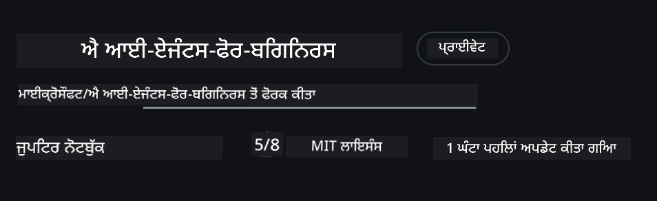
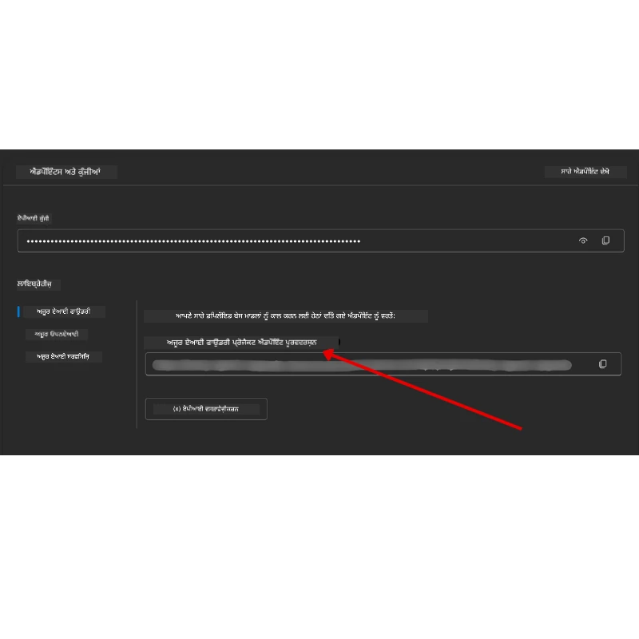

# ਕੋਰਸ ਸੈਟਅਪ

## ਪਰਿਚਯ

ਇਹ ਪਾਠ ਇਸ ਕੋਰਸ ਦੇ ਕੋਡ ਨਮੂਨੇ ਚਲਾਉਣ ਬਾਰੇ ਕਵਰ ਕਰੇਗਾ।

## ਹੋਰ ਸਿੱਖਣ ਵਾਲਿਆਂ ਨਾਲ ਸ਼ਾਮਿਲ ਹੋਵੋ ਅਤੇ ਸਹਾਇਤਾ ਪ੍ਰਾਪਤ ਕਰੋ

ਆਪਣੇ ਰੇਪੋ ਨੂੰ ਕਲੋਨ ਕਰਨ ਤੋਂ ਪਹਿਲਾਂ, ਸੈਟਅਪ ਲਈ ਕਿਸੇ ਮਦਦ ਲਈ, ਕੋਰਸ ਬਾਰੇ ਕਿਸੇ ਵੀ ਸਵਾਲ ਲਈ, ਜਾਂ ਹੋਰ ਸਿੱਖਣ ਵਾਲਿਆਂ ਨਾਲ ਜੁੜਨ ਲਈ [AI Agents For Beginners Discord ਚੈਨਲ](https://aka.ms/ai-agents/discord) ਚ ਸ਼ਾਮਿਲ ਹੋਵੋ।

## ਇਸ ਰੇਪੋ ਨੂੰ ਕਲੋਨ ਜਾਂ ਫੋਰਕ ਕਰੋ

ਸ਼ੁਰੂ ਕਰਨ ਲਈ, ਕਿਰਪਾ ਕਰਕੇ GitHub ਰੇਪੋਜ਼ਿਟਰੀ ਨੂੰ ਕਲੋਨ ਜਾਂ ਫੋਰਕ ਕਰੋ। ਇਸ ਨਾਲ ਤੁਹਾਡੇ ਕੋਲ ਕੋਰਸ ਮਟੀਰੀਅਲ ਦਾ ਆਪਣਾ ਵਰਜ਼ਨ ਹੋਵੇਗਾ ਜਿਸਨੂੰ ਤੁਸੀਂ ਚਲਾ ਸਕਦੇ ਹੋ, ਟੈਸਟ ਕਰ ਸਕਦੇ ਹੋ, ਅਤੇ ਕੋਡ ਵਿੱਚ ਤਬਦੀਲੀ ਕਰ ਸਕਦੇ ਹੋ!

ਇਹ ਇੱਥੋਂ <a href="https://github.com/microsoft/ai-agents-for-beginners/fork" target="_blank">ਰੇਪੋ ਨੂੰ ਫੋਰਕ ਕਰਨ</a> ਲਿੰਕ 'ਤੇ ਕਲਿੱਕ ਕਰਕੇ ਕੀਤਾ ਜਾ ਸਕਦਾ ਹੈ।

ਤੁਹਾਡੇ ਕੋਲ ਹੁਣ ਇਸ ਕੋਰਸ ਦਾ ਆਪਣਾ ਫੋਰਕਡ ਵਰਜ਼ਨ ਹੇਠਾਂ ਦਿੱਤੇ ਲਿੰਕ ਵਿੱਚ ਹੋਣਾ ਚਾਹੀਦਾ ਹੈ:



### ਸ਼ੈਲੋ ਕਲੋਨ (ਵਰਕਸ਼ਾਪ / ਕੋਡਸਪੇਸ ਲਈ ਸਿਫਾਰਸ਼ੀ)

  >ਜਦੋਂ ਤੁਸੀਂ ਪੂਰਾ ਇਤਿਹਾਸ ਅਤੇ ਸਾਰੇ ਫਾਈਲਾਂ ਡਾਊਨਲੋਡ ਕਰਦੇ ਹੋ ਤਾਂ ਪੂਰਾ ਰੇਪੋਜ਼ਿਟਰੀ ਵੱਡਾ ਹੋ ਸਕਦਾ ਹੈ (~3 GB). ਜੇ ਤੁਸੀਂ ਸਿਰਫ ਵਰਕਸ਼ਾਪ ਵਿਚ ਜਾ ਰਹੇ ਹੋ ਜਾਂ ਕੇਵਲ ਕੁਝ ਪਾਠ ਫੋਲਡਰ ਚਾਹੀਦੇ ਹਨ, ਤਾਂ ਸ਼ੈਲੋ ਕਲੋਨ (ਜਾਂ ਸਪਾਰਸ ਕਲੋਨ) ਬਹੁਤ ਘੱਟ ਡਾਊਨਲੋਡ ਕਰਦਾ ਹੈ।

#### ਤੁਰੰਤ ਸ਼ੈਲੋ ਕਲੋਨ — ਘੱਟ ਇਤਿਹਾਸ, ਸਾਰੀਆਂ ਫਾਈਲਾਂ

ਹੇਠਾਂ ਦਿੱਤੇ ਹੁਕਮਾਂ ਵਿੱਚ `<your-username>` ਨੂੰ ਆਪਣੇ ਫੋਰਕ URL (ਜਾਂ ਜੇ ਪਸੰਦ ਹੋਵੇ ਤਾਂ ਅਪਸਟਰੀਮ URL) ਨਾਲ ਬਦਲੋ।

ਸਿਰਫ ਤਾਜ਼ਾ ਕਮਿੱਟ ਇਤਿਹਾਸ ਕਲੋਨ ਕਰਨ ਲਈ (ਛੋਟਾ ਡਾਊਨਲੋਡ):

```bash
git clone --depth 1 https://github.com/<your-username>/ai-agents-for-beginners.git
```

ਕਿਸੇ ਖਾਸ ਬ੍ਰਾਂਚ ਨੂੰ ਕਲੋਨ ਕਰਨ ਲਈ:

```bash
git clone --depth 1 --branch <branch-name> https://github.com/<your-username>/ai-agents-for-beginners.git
```

#### ਹਿੱਸਾ (ਸਪਾਰਸ) ਕਲੋਨ — ਘੱਟ ਬਲੌਬ + ਸਿਰਫ ਚੁਣੇ ਹੋਏ ਫੋਲਡਰ

ਇਹ ਹਿੱਸਾ ਕਲੋਨ ਅਤੇ ਸਪਾਰਸ-ਚੈਕਆਊਟ ਵਰਤਦਾ ਹੈ (ਜਿਸ ਲਈ Git 2.25+ ਅਤੇ ਹਿੱਸਾ ਕਲੋਨ ਸਮਰਥਨ ਵਾਲਾ ਆਧੁਨਿਕ Git ਸਿਫਾਰਸ਼ੀ ਹੈ):

```bash
git clone --depth 1 --filter=blob:none --sparse https://github.com/<your-username>/ai-agents-for-beginners.git
```

ਰੇਪੋ ਫੋਲਡਰ ਵਿੱਚ ਜਾਓ:

```bash
cd ai-agents-for-beginners
```

ਫਿਰ ਦੱਸੋ ਤੁਹਾਨੂੰ ਕਿਹੜੇ ਫੋਲਡਰ ਚਾਹੀਦੇ ਹਨ (ਹੇਠਾਂ ਦੇ ਉਦਾਹਰਣ ਵਿੱਚ ਦੋ ਫੋਲਡਰ ਦਿਖਾਏ ਗਏ ਹਨ):

```bash
git sparse-checkout set 00-course-setup 01-intro-to-ai-agents
```

ਕਲੋਨ ਅਤੇ ਫਾਈਲਾਂ ਦੀ ਜਾਂਚ ਦੇ ਬਾਅਦ, ਜੇ ਤੁਸੀਂ ਕੇਵਲ ਫਾਈਲਾਂ ਚਾਹੁੰਦੇ ਹੋ ਅਤੇ ਸਪੇਸ ਖਾਲੀ ਕਰਨਾ ਚਾਹੁੰਦੇ ਹੋ (ਗਿਟ ਇਤਿਹਾਸ ਨਹੀਂ), ਤਾਂ ਕਿਰਪਾ ਕਰਕੇ ਰੇਪੋਜ਼ਿਟਰੀ ਮੈਟਾਡੇਟਾ ਹਟਾਓ (💀ਅਪਰਿਵਰਤੀਯ - ਤੁਹਾਡੇ ਕੋਲ ਸਾਰੀ ਗਿਟ ਕਾਰਗੁਜ਼ਾਰੀ ਖਤਮ ਹੋ ਜਾਵੇਗੀ):

```bash
# zsh/bash
rm -rf .git
```

```powershell
# ਪਾਵਰਸ਼ੈੱਲ
Remove-Item -Recurse -Force .git
```

#### GitHub ਕੋਡਸਪੇਸ ਦੀ ਵਰਤੋਂ ਕਰਨਾ (ਲੋਕਲ ਵੱਡੇ ਡਾਊਨਲੋਡ ਤੋਂ ਬਚਣ ਲਈ ਸਿਫਾਰਸ਼ੀ)

- ਇਸ ਰੇਪੋ ਲਈ ਨਵਾਂ ਕੋਡਸਪੇਸ [GitHub UI](https://github.com/codespaces) ਰਾਹੀਂ ਬਣਾਓ।  

- ਨਵੇਂ ਬਣੇ ਕੋਡਸਪੇਸ ਦੇ ਟਰਮੀਨਲ ਵਿੱਚ, ਉੱਪਰ ਦਿੱਤੇ ਗਏ ਸ਼ੈਲੋ/ਸਪਾਰਸ ਕਲੋਨ ਹੁਕਮਾਂ ਵਿੱਚੋਂ ਇੱਕ ਚਲਾਉ ਜੋ ਸਿਰਫ਼ ਜਰੂਰੀ ਪਾਠ ਫੋਲਡਰ ਨੂੰ ਕੋਡਸਪੇਸ ਵਰਕਸਪੇਸ ਵਿੱਚ ਲਿਆਉਂਦਾ ਹੈ।
- ਵਿਕਲਪਿਕ: ਕੋਡਸਪੇਸ ਵਿੱਚ ਕਲੋਨ ਕਰਨ ਤੋਂ ਬਾਅਦ .git ਹਟਾਓ ਤਾਂ ਜੋ ਵਾਧੂ ਸਪੇਸ ਵਾਪਸ ਮਿਲ ਸਕੇ (ਹਟਾਉਣ ਵਾਲੇ ਹੁਕਮ ਉਪਰ ਵੇਖੋ)।
- ਨੋਟ: ਜੇ ਤੁਸੀਂ ਰੇਪੋ ਨੂੰ ਸਿੱਧਾ ਕੋਡਸਪੇਸ ਵਿੱਚ ਖੋਲ੍ਹਣਾ ਚਾਹੁੰਦੇ ਹੋ (ਵਿਅਰਥ ਕਲੋਨ ਤੋਂ ਬਿਨਾਂ), ਜਾਣੋ ਕਿ ਕੋਡਸਪੇਸ ਡਿਵਕੰਟੇਨਰ ਵਾਤਾਵਰਣ ਬਣਾਏਗਾ ਅਤੇ ਹੋ ਸਕਦਾ ਹੈ ਕਿ ਤੁਹਾਨੂੰ ਜਰੂਰੀ ਤੋਂ ਵੱਧ ਪ੍ਰੋਵਿਜ਼ਨ ਕਰੇ।

#### ਸੁਝਾਅ

- ਜਦੋਂ ਤੂੰ ਸੋਧ/ਕਮਿੱਟ ਕਰਨਾ ਚਾਹੁੰਦਾ ਹੈ ਤਾਂ ਹਮੇਸ਼ਾ ਕਲੋਨ URL ਨੂੰ ਆਪਣੇ ਫੋਰਕ ਨਾਲ ਬਦਲੋ।
- ਜੇ ਬਾਅਦ ਵਿੱਚ ਵੱਧ ਇਤਿਹਾਸ ਜਾਂ ਫਾਈਲਾਂ ਦੀ ਲੋੜ ਹੋਵੇ, ਤਾਂ ਤੁਸੀਂ ਉਹਨਾਂ ਨੂੰ ਫੇਚ ਕਰ ਸਕਦੇ ਹੋ ਜਾਂ ਸਪਾਰਸ-ਚੈਕਆਊਟ ਵਿੱਚ ਹੋਰ ਫੋਲਡਰ ਸ਼ਾਮਲ ਕਰ ਸਕਦੇ ਹੋ।

## ਕੋਡ ਚਲਾਉਣਾ

ਇਹ ਕੋਰਸ ਕਈ ਜੁਪਾਈਟਰ ਨੋਟਬੁੱਕਸ ਪ੍ਰਦਾਨ ਕਰਦਾ ਹੈ ਜਿਨ੍ਹਾਂ ਨੂੰ ਚਲਾ ਕੇ ਤੁਸੀਂ ਐਆਈ ਏਜੰਟ ਬਣਾਉਣ ਦਾ ਹਥ-ਓਨ ਤਜ਼ਰਬਾ ਪ੍ਰਾਪਤ ਕਰ ਸਕਦੇ ਹੋ।

ਕੋਡ ਨਮੂਨੇ **Microsoft Agent Framework (MAF)** ਨੂੰ ਵਰਤਦੇ ਹਨ ਜਿਸ ਵਿੱਚ `FoundryChatClient` ਹੁੰਦਾ ਹੈ, ਜੋ **Microsoft Foundry Agent Service V2** (Responses API) ਰਾਹੀਂ **Microsoft Foundry** ਨਾਲ ਜੁੜਦਾ ਹੈ।

ਸਾਰੇ ਪਾਇਥਨ ਨੋਟਬੁੱਕਸ `*-python-agent-framework.ipynb` ਨਾਲ ਲੇਬਲ ਕੀਤੇ ਗਏ ਹਨ।

## ਲੋੜਾਂ

- Python 3.12+
  - **ਨੋਟ**: ਜੇ ਤੁਹਾਡੇ ਕੋਲ Python3.12 ਇੰਸਟਾਲ ਨਹੀਂ ਹੈ, ਤਾਂ ਪੱਕਾ ਕਰੋ ਕਿ ਤੁਸੀਂ ਇਸਨੂੰ ਇੰਸਟਾਲ ਕਰੋ। ਫਿਰ ਆਪਣੇ venv ਨੂੰ python3.12 ਨਾਲ ਬਣਾਓ ਤਾਂ ਜੋ requirements.txt ਫਾਈਲ ਤੋਂ ਸਹੀ ਵਰਜ਼ਨ ਇੰਸਟਾਲ ਹੋਣ।
  
    >ਉਦਾਹਰਣ

    Python ਵੈਨਵ ડિરેક્ટરી ਬਣਾਓ:

    ```bash
    python -m venv venv
    ```

    ਫਿਰ venv ਵਾਤਾਵਰਨ ਨੂੰ ਸੱਰਗਰਮ ਕਰੋ:

    ```bash
    # ਜੇਐਸਐਚ/ਬੈਸ਼
    source venv/bin/activate
    ```
  
    ```dos
    # Command Prompt for Windows
    venv\Scripts\activate
    ```

- .NET 10+: ਜੇ ਸੈਂਪਲ ਕੋਡ .NET ਵਰਤਦੇ ਹਨ, ਤਾਂ ਯਕੀਨ ਕਰੋ ਕਿ ਤੁਸੀਂ [.NET 10 SDK](https://dotnet.microsoft.com/download/dotnet/10.0) ਜਾਂ ਇਸ ਤੋਂ ਬਾਅਦ ਦਾ ਵਰਜ਼ਨ ਇੰਸਟਾਲ ਕੀਤਾ ਹੈ। ਫਿਰ ਆਪਣਾ ਇੰਸਟਾਲਡ .NET SDK ਵਰਜ਼ਨ ਚੈੱਕ ਕਰੋ:

    ```bash
    dotnet --list-sdks
    ```

- **Azure CLI** — ਪ੍ਰਮਾਣੀਕਰਨ ਲਈ ਜ਼ਰੂਰੀ ਹੈ। ਇਥੋਂ ਇੰਸਟਾਲ ਕਰੋ: [aka.ms/installazurecli](https://aka.ms/installazurecli)।
- **Azure Subscription** — Microsoft Foundry ਅਤੇ Microsoft Foundry Agent Service ਦੀ ਪਹੁੰਚ ਲਈ।
- **Microsoft Foundry Project** — ਇੱਕ ਪ੍ਰਾਜੈਕਟ ਜਿਸ ਵਿੱਚ ਕੋਈ ਡਿਪਲੋਇਡ ਮਾਡਲ ਹੈ (ਜਿਵੇਂ, `gpt-5-mini`)। ਵੇਖੋ [ਕਦਮ 1](#ਕਦਮ-1-ਇੱਕ-microsoft-foundry-ਪ੍ਰਾਜੈਕਟ-ਬਣਾਓ) ਹੇਠਾਂ।

ਅਸੀਂ ਇਸ ਰੇਪੋਜ਼ਿਟਰੀ ਦੀ ਰੂਟ ਵਿੱਚ ਇੱਕ `requirements.txt` ਫਾਈਲ ਦਿੱਤੀ ਹੈ ਜਿਸ ਵਿੱਚ ਕੋਡ ਨਮੂਨੇ ਚਲਾਉਣ ਲਈ ਜਰੂਰੀ ਸਾਰੇ ਪਾਇਥਨ ਪੈਕੇਜ ਹਨ।

ਤੁਸੀਂ ਆਪਣੀ ਟਰਮੀਨਲ ਵਿੱਚ ਹੇਠਾਂ ਦਿੱਤਾ ਹੁਕਮ ਚਲਾ ਕੇ ਇਹ ਇੰਸਟਾਲ ਕਰ ਸਕਦੇ ਹੋ, ਜਿੱਥੋਂ ਰੇਪੋਜ਼ਿਟਰੀ ਸ਼ੁਰੂ ਹੁੰਦੀ ਹੈ:

```bash
pip install -r requirements.txt
```

ਅਸੀਂ ਸੁਝਾਅ ਦਿੰਦੇ ਹਾਂ ਕਿ ਕਾਫ਼ੀ ਜੰਗਲਬੂਟਾ(ਵਰਚੂਅਲ ਵਾਤਾਵਰਣ) ਬਣਾਓ ਤਾਂ ਜੋ ਕਿਸੇ ਵੀ ਸੰਘਰਸ਼ ਅਤੇ ਸਮੱਸਿਆ ਤੋਂ ਬਚਿਆ ਜਾ ਸਕੇ।

## VSCode ਸੈਟਅਪ

ਯਕੀਨ ਕਰੋ ਕਿ ਤੁਸੀਂ VSCode ਵਿੱਚ ਸਹੀ ਪਾਇਥਨ ਵਰਜ਼ਨ ਵਰਤ ਰਹੇ ਹੋ।


## Microsoft Foundry ਅਤੇ Microsoft Foundry Agent Service ਸੈਟਅਪ ਕਰੋ

### ਕਦਮ 1: ਇੱਕ Microsoft Foundry ਪ੍ਰਾਜੈਕਟ ਬਣਾਓ

ਤੁਹਾਨੂੰ ਨੋਟਬੁੱਕਸ ਚਲਾਉਣ ਲਈ ਇੱਕ Microsoft Foundry **ஹਬ** ਅਤੇ **ਪ੍ਰਾਜੈਕਟ** ਚਾਹੀਦਾ ਹੈ ਜਿਸ ਵਿੱਚ ਕੋਈ ਡਿਪਲੋਇਡ ਮਾਡਲ ਹੋਵੇ।

1. [ai.azure.com](https://ai.azure.com) 'ਤੇ ਜਾਓ ਅਤੇ ਆਪਣੇ ਅਜ਼ਊਰ ਅਕਾਊਂਟ ਨਾਲ ਸাইন ਇਨ ਕਰੋ।
2. ਇੱਕ **ஹਬ** ਬਣਾਓ (ਜਾਂ ਮੌਜੂਦਾ ਹਬ ਵਰਤੋਂ). ਵੇਖੋ: [Hub resources overview](https://learn.microsoft.com/azure/ai-foundry/concepts/ai-resources)।
3. ਹਬ ਦੇ ਅੰਦਰ ਇੱਕ **ਪ੍ਰਾਜੈਕਟ** ਬਣਾਓ।
4. ਮਾਡਲ (ਜਿਵੇਂ `gpt-5-mini`) ਡਿਪਲੋਇ ਕਰੋ **Models + Endpoints** → **Deploy model** ਤੋਂ।

### ਕਦਮ 2: ਆਪਣੀ ਪ੍ਰਾਜੈਕਟ ਐਂਡਪੋਇੰਟ ਅਤੇ ਮਾਡਲ ਡਿਪਲੋਇਮੈਂਟ ਨਾਮ ਪ੍ਰਾਪਤ ਕਰੋ

Microsoft Foundry ਪੋਰਟਲ ਵਿੱਚੋਂ ਆਪਣੇ ਪ੍ਰਾਜੈਕਟ ਤੋਂ:

- **Project Endpoint** — **Overview** ਸਫ਼ੇ ਵਿੱਖੇ ਜਾ ਕੇ ਐਂਡਪੋਇੰਟ URL ਕਾਪੀ ਕਰੋ।



- **Model Deployment Name** — **Models + Endpoints** 'ਤੇ ਜਾਓ, ਆਪਣੇ ਡਿਪਲੋਇਡ ਮਾਡਲ ਨੂੰ ਚੁਣੋ ਅਤੇ **Deployment name** ਨੋਟ ਕਰੋ (ਜਿਵੇਂ `gpt-5-mini`)।

### ਕਦਮ 3: `az login` ਨਾਲ ਅਜ਼ਿਊਰ ਵਿੱਚ ਸਾਈਨ ਇਨ ਕਰੋ

ਜਿਆਦਾਤਰ ਨੋਟਬੁੱਕਸ ਤੁਹਾਡੇ **Azure CLI ਸਾਈਨ-ਇਨ** ਰਾਹੀਂ ਪ੍ਰਮਾਣੀਕਰਤ ਹੁੰਦੇ ਹਨ — `AzureCliCredential` ਜਾਂ `DefaultAzureCredential` (ਦੋਹਾਂ ਤੁਹਾਡੇ `az login` ਸੈਸ਼ਨ ਨੂੰ ਪਕੜਦੇ ਹਨ) ਤੋਂ `azure-identity` ਪੈਕੇਜ ਵਿੱਚੋਂ — ਇਸ ਲਈ ਓਹਨਾਂ ਨੂੰ API ਕੁੰਜੀਆਂ ਦੀ ज़ਰੂਰਤ ਨਹੀਂ ਹੁੰਦੀ। ਕੁਝ ਪਾਠ ਅਤੇ ਇੱਛਾ ਅਨੁਸਾਰ ਇੰਟਿਗ੍ਰੇਸ਼ਨ API ਕੁੰਜੀਆਂ ਦੀ ਵਰਤੋਂ ਕਰਦੇ ਹਨ; ਹਰ ਪਾਠ ਦੀ ਪਹਿਲਾਂ ਦੀਆਂ ਸ਼ਰਤਾਂ ਲਈ ਵਾਤਾਵਰਨ ਚਰ ਹਨ ਦੀ ਜਾਂਚ ਕਰੋ। ਇਹ ਤੁਹਾਨੂੰ Azure CLI ਰਾਹੀਂ ਸਾਈਨ-ਇਨ ਹੋਣੀ ਲੋੜੀਂਦਾ ਹੈ।

1. **Azure CLI ਇੰਸਟਾਲ ਕਰੋ** ਜੇ ਤੁਹਾਡੇ ਕੋਲ ਨਹੀਂ ਹੈ: [aka.ms/installazurecli](https://aka.ms/installazurecli)

2. **ਸਾਈਨ ਇਨ ਕਰੋ** ਇਸ ਹੁਕਮ ਨੂੰ ਚਲਾ ਕੇ:

    ```bash
    az login
    ```

    ਜਾਂ ਜੇ ਤੁਸੀਂ ਰਿਮੋਟ/ਕੋਡਸਪੇਸ ਵਾਤਾਵਰਣ ਵਿੱਚ ਹੋ ਬਿਨਾਂ ਬ੍ਰਾਉਜ਼ਰ ਦੇ:

    ```bash
    az login --use-device-code
    ```

3. **ਜਦੋਂ ਮੰਗਿਆ ਜਾਵੇ ਤਾਂ ਆਪਣੀ ਸਬਸਕ੍ਰਿਪਸ਼ਨ ਚੁਣੋ** — ਉਹ ਜਿਹੜੀ ਤੁਹਾਡੇ Foundry ਪ੍ਰਾਜੈਕਟ ਵਿੱਚ ਹੈ।

4. **ਪੱਕਾ ਕਰੋ** ਕਿ ਤੁਸੀਂ ਸਾਈਨ ਇਨ ਹੋ:

    ```bash
    az account show
    ```

> **ਕਿਉਂ `az login`?** ਨੋਟਬੁੱਕਸ `AzureCliCredential` (ਜਾਂ `DefaultAzureCredential`, ਜੋ ਤੁਹਾਡੇ Azure CLI ਸਾਈਨ-ਇਨ ਨੂੰ ਵੀ ਪਕੜਦਾ ਹੈ) ਤੋਂ `azure-identity` ਪੈਕੇਜ ਰਾਹੀਂ ਪ੍ਰਮਾਣੀਕਰਤ ਹੁੰਦੇ ਹਨ। ਇਸਦਾ ਮਤਲਬ ਹੈ ਕਿ ਤੁਹਾਡਾ ਅਜ਼ਿਊਰ CLI ਸੈਸ਼ਨ ਕ੍ਰੈਡੇਂਸ਼ਲਜ਼ ਪ੍ਰਦਾਨ ਕਰਦਾ ਹੈ — ਤੁਹਾਡੇ `.env` ਫਾਈਲ ਵਿੱਚ ਕੋਈ API ਕੁੰਜੀਆਂ ਜਾਂ ਸੀਕ੍ਰੇਟ ਨਹੀਂ। ਇਹ ਇੱਕ [ਸੁਰੱਖਿਆ ਦੀ ਸਭ ਤੋਂ ਵਧੀਆ ਪ੍ਰੈਕਟਿਸ](https://learn.microsoft.com/azure/developer/ai/keyless-connections) ਹੈ।

### ਕਦਮ 4: ਆਪਣੀ `.env` ਫਾਈਲ ਬਣਾਓ

ਉਦਾਹਰਨ ਫਾਈਲ ਨੂੰ ਕਾਪੀ ਕਰੋ:

```bash
# zsh/bash
cp .env.example .env
```

```powershell
# ਪਾਵਰਸ਼ੈੱਲ
Copy-Item .env.example .env
```

`.env` ਖੋਲ੍ਹੋ ਅਤੇ ਇਹ ਦੋ ਮੁੱਲ ਭਰੋ:

```env
AZURE_AI_PROJECT_ENDPOINT=https://<your-project>.services.ai.azure.com/api/projects/<your-project-id>
AZURE_AI_MODEL_DEPLOYMENT_NAME=gpt-5-mini
```

| ਵੇਰੀਏਬਲ | ਕਿੱਥੇ ਮਿਲੇਗਾ |
|----------|-----------------|
| `AZURE_AI_PROJECT_ENDPOINT` | Foundry ਪੋਰਟਲ → ਤੁਹਾਡਾ ਪ੍ਰਾਜੈਕਟ → **Overview** ਸਫ਼ਾ |
| `AZURE_AI_MODEL_DEPLOYMENT_NAME` | Foundry ਪੋਰਟਲ → **Models + Endpoints** → ਤੁਹਾਡੇ ਡਿਪਲੋਇਡ ਮਾਡਲ ਦਾ ਨਾਮ |

ਜ਼ਿਆਦਾਤਰ ਪਾਠਾਂ ਲਈ ਇਹੀ ਕਾਫ਼ੀ ਹੈ! ਨੋਟਬੁੱਕਸ ਆਪਣੇ ਆਪ `az login` ਸੈਸ਼ਨ ਰਾਹੀਂ ਪ੍ਰਮਾਣੀਕਰਤ ਹੋ ਜਾਣਗੇ।

### ਕਦਮ 5: ਪਾਇਥਨ ਡਿਪੈਂਡੈਂਸੀਜ਼ ਇੰਸਟਾਲ ਕਰੋ

```bash
pip install -r requirements.txt
```

ਅਸੀਂ ਸੁਝਾਅ ਦਿੰਦੇ ਹਾਂ ਇਹ ਤੁਹਾਡੇ ਬਣਾਏ ਗਏ ਵਰਚੂਅਲ ਵਾਤਾਵਰਣ ਦੀ ਅੰਦਰ ਚਲਾਓ।

## ਵਿਕਲਪਿਕ ਸੈਟਅਪ: Azure AI ਖੋਜ (ਪਾਠ 5 ਅਤੇ 16)

ਪਾਠ 5 (Agentic RAG) ਅਤੇ ਪਾਠ 16 ਦੇ ਨੋਟਬੁੱਕਸ ਬਿਲਕੁਲ ਠੀਕ ਕੰਮ ਕਰਦੇ ਹਨ ਇੱਕ **ਮੈਮੋਰੀ ਵਿੱਚ ਆਧਾਰਿਤ ਗਿਆਨ ਬੇਸ** ਨਾਲ — ਕਿਸੇ ਵੀ ਵਾਧੂ Azure ਸਰੋਤ ਦੀ ਲੋੜ ਨਹੀਂ। ਜੇ ਤੁਸੀਂ ਉਨ੍ਹਾਂ ਨੂੰ ਅਸਲੀ **Azure AI ਖੋਜ** ਸੂਚੀ ਨਾਲ ਬੈਕ ਕਰਨਾ ਚਾਹੁੰਦੇ ਹੋ, ਤਾਂ ਧਿਆਨ ਦਿਓ ਕਿ **ਪਾਠ 16 ਦਾ ਨੋਟਬੁੱਕ ਹਾਲੇ ਵੀ ਕੁੰਜੀ-ਆਧਾਰਿਤ ਪ੍ਰਮਾਣੀਕਰਨ ਵਰਤਦਾ ਹੈ**: ਇਹ ਮੈਮੋਰੀ ਖੋਜ ਤੋਂ Azure AI Search ਉੱਤੇ ਤਦ ਹੀ ਸਵਿੱਚ ਕਰਦਾ ਹੈ ਜਦੋਂ ਦੋਹਾਂ `AZURE_SEARCH_SERVICE_ENDPOINT` ਅਤੇ `AZURE_SEARCH_API_KEY` ਸੈੱਟ ਹੁੰਦੇ ਹਨ, ਨਹੀਂ ਤਾਂ ਮੈਮੋਰੀ ਖੋਜ 'ਤੇ ਰਹਿੰਦਾ ਹੈ — ਇਸ ਲਈ ਅਸਲੀ ਇੰਡੈਕਸ ਤੋਂ ਚਲਾਉਣ ਲਈ ਤੁਹਾਨੂੰ ਪ੍ਰਸ਼ਾਸਕ ਕੁੰਜੀ ਵੀ ਸੈੱਟ ਕਰਨੀ ਪਵੇਗੀ। ਕੁੰਜੀ-ਰਹਿਤ ਪ੍ਰਮਾਣੀਕਰਨ ਲਈ Microsoft Entra ID (RBAC) ਸਿਫਾਰਸ਼ੀ ਤਰੀਕਾ ਹੈ ਤੁਹਾਡੇ ਆਪਣਾ ਪ੍ਰੋਡਕਸ਼ਨ ਕੋਡ ਲਈ, ਜੋ ਕਿ `az login` ਫਲੋ ਨਾਲ ਸੰਗਤ ਹੈ ਜੋ ਹਰ ਜਗ੍ਹਾ ਇਸ ਕੋਰਸ ਵਿੱਚ ਵਰਤਿਆ ਜਾ ਰਿਹਾ ਹੈ।

ਹੇਠਾਂ ਦਿੱਤੇ RBAC ਕਦਮ ਸੈਟਅਪ-ਗਾਈਡ ਨਮੂਨੇ ਅਤੇ ਤੁਹਾਡੇ ਆਪਣੇ ਕੋਡ ਲਈ ਲਾਗੂ ਹੁੰਦੇ ਹਨ। ਇਹ ਪਾਠ 16 ਦੇ ਨੋਟਬੁੱਕ ਵਿੱਚ ਕੁੰਜੀ-ਰਹਿਤ ਪ੍ਰਮਾਣਿਕਤਾ ਨੂੰ ਯੋਗ ਨਹੀਂ ਕਰਦੇ; ਪਾਠ 16 ਨੂੰ Azure AI ਖੋਜ ਵਰਤਣ ਲਈ ਦੋਹਾਂ ਐਂਡਪੋਇੰਟ ਅਤੇ ਪ੍ਰਸ਼ਾਸਕ ਕੁੰਜੀ ਦੀ ਲੋੜ ਹੁੰਦੀ ਹੈ।

1. ਆਪਣੇ ਖੋਜ ਸਰਵਿਸ 'ਤੇ ਰੋਲ-ਆਧਾਰਿਤ ਐਕਸੇਸ ਯੋਗ ਕਰੋ:

    ```bash
    az search service update --name <service-name> --resource-group <resource-group> --auth-options aadOrApiKey
    ```

2. ਆਪਣੇ ਆਪ ਨੂੰ ਲੋੜੀਂਦੇ ਰੋਲ ਦਿਓ (ਸੂਚਿਕਾ ਬਣਾਉਣਾ/ਲੋਡ ਕਰਨਾ ਅਤੇ ਕਵੈਰੀ):

    ```bash
    az role assignment create --assignee <your-user-or-principal-id> --role "Search Service Contributor" --scope $(az search service show -g <resource-group> -n <service-name> --query id -o tsv)
    az role assignment create --assignee <your-user-or-principal-id> --role "Search Index Data Contributor" --scope $(az search service show -g <resource-group> -n <service-name> --query id -o tsv)
    ```

3. ਆਪਣੇ `.env` ਫਾਈਲ ਵਿੱਚ ਐਂਡਪੋਇੰਟ ਜੋੜੋ:

| ਵੇਰੀਏਬਲ | ਕਿੱਥੇ ਮਿਲੇਗਾ |
|----------|-----------------|
| `AZURE_SEARCH_SERVICE_ENDPOINT` | Azure ਪੋਰਟਲ → ਤੁਹਾਡਾ **Azure AI Search** ਸਰੋਤ → **Overview** → URL |
| `AZURE_SEARCH_API_KEY` | ਜ਼ਰੂਰੀ (ਐਂਡਪੋਇੰਟ ਨਾਲ) ਪਾਠ 16 ਨੋਟਬੁੱਕ ਵਿੱਚ Azure AI Search ਚਲਾਉਣ ਲਈ, ਜੋ ਕੁੰਜੀ-ਆਧਾਰਿਤ ਪ੍ਰਮਾਣਕਰਨ ਵਰਤਦਾ ਹੈ। Azure ਪੋਰਟਲ → **Settings** → **Keys** → ਮੁੱਖ ਪ੍ਰਸ਼ਾਸਕ ਕੁੰਜੀ |

> **ਕਿਉਂ ਕੁੰਜੀ-ਰਹਿਤ?** ਪ੍ਰਸ਼ਾਸਕ ਕੁੰਜੀਆਂ ਤੁਹਾਡੇ ਖੋਜ ਸਰਵਿਸ ਨੂੰ ਪੂਰਾ ਲਿਖਣ ਦਾ ਅਧਿਕਾਰ ਦਿੰਦੀਆਂ ਹਨ ਅਤੇ `.env` ਫਾਈਲਾਂ ਰਾਹੀਂ ਲੀਕ ਹੋ ਸਕਦੀਆਂ ਹਨ। RBAC ਨਾਲ, ਤੁਹਾਡੀ `az login` ਪਛਾਣ ਦੀ ਵਰਤੋਂ ਹੁੰਦੀ ਹੈ — ਉਹੀ ਕੁੰਜੀ-ਰਹਿਤ Entra ID ਰੂਹ ਰੀਤੀ ਜੋ ਕੋਰਸ ਦੇ ਨੋਟਬੁੱਕਸ ਵਰਤਦੇ ਹਨ (`AzureCliCredential` / `DefaultAzureCredential` ਰਾਹੀਂ)। ਵੇਖੋ [ਰੋਲਾਂ ਦੀ ਵਰਤੋਂ ਨਾਲ Azure AI Search ਨਾਲ ਕਨੈਕਟ](https://learn.microsoft.com/azure/search/search-security-rbac)।

ਭਰਪੂਰ ਇੰਡੈਕਸ ਬਣਾਉਣ ਵਾਲੇ ਨਮੂਨੇ ਲਈ [Azure AI Search ਸੈਟਅਪ ਗਾਈਡ](./AzureSearch.md) ਦੇਖੋ, ਜੋ ਪਾਇਥਨ ਅਤੇ .NET ਵਿੱਚ ਹਨ।

## ਪਾਠ ਜੋ ਸਿੱਧਾ Azure OpenAI ਨੂੰ ਕਾਲ ਕਰਦੇ ਹਨ ਲਈ ਵਧੂ ਸੈਟਅਪ (ਪਾਠ 6 ਅਤੇ 8)

ਕੁਝ ਨੋਟਬੁੱਕਸ ਪਾਠ 6 ਅਤੇ 8 ਵਿੱਚ ਸਿੱਧਾ **Azure OpenAI** ਨੂੰ ਕਾਲ ਕਰਦੇ ਹਨ (**Responses API** ਵਰਤ ਕੇ) ਬਜਾਏ Microsoft Foundry ਪ੍ਰਾਜੈਕਟ ਦੇ। ਇਹ ਨਮੂਨੇ ਪਹਿਲਾਂ GitHub Models ਵਰਤਦੇ ਸਨ, ਜੋ ਹੁਣ ਡਿਕਰੇਟੇਡ ਹੈ ਅਤੇ Responses API ਸਹਾਇਤਾ ਨਹੀਂ ਕਰਦਾ। ਆਪਣੇ `.env` ਫਾਈਲ ਵਿੱਚ ਇਹ ਵੇਰੀਏਬਲ ਸ਼ਾਮਲ ਕਰੋ:

| ਵੇਰੀਏਬਲ | ਕਿੱਥੇ ਮਿਲੇਗਾ |
|----------|-----------------|
| `AZURE_OPENAI_ENDPOINT` | Azure ਪੋਰਟਲ → ਤੁਹਾਡਾ **Azure OpenAI** ਸਰੋਤ → **Keys and Endpoint** → ਐਂਡਪੋਇੰਟ (ਜਿਵੇਂ `https://<your-resource>.openai.azure.com`) |
| `AZURE_OPENAI_DEPLOYMENT` | ਤੁਹਾਡੇ ਡਿਪਲੋਇਡ ਮਾਡਲ ਦਾ ਨਾਮ (ਜਿਵੇਂ `gpt-5-mini`) ਜੋ Responses API ਦਾ ਸਮਰਥਨ ਕਰਦਾ ਹੈ |
| `AZURE_OPENAI_API_KEY` | ਵਿਕਲਪਿਕ — ਜੇ ਤੁਸੀਂ ਕੁੰਜੀ-ਆਧਾਰਿਤ ਪ੍ਰਮਾਣੀਕਰਨ ਵਰਤਦੇ ਹੋ, ਨਾ ਕਿ `az login` / Entra ID |

> Responses API ਸਥਿਰ `/openai/v1/` ਐਂਡਪੋਇੰਟ ব্যবহার ਕਰਦਾ ਹੈ, ਇਸ ਲਈ ਕੋਈ `api-version` ਦੀ ਲੋੜ ਨਹੀਂ। ਕੁੰਜੀ-ਰਹਿਤ Entra ID ਅਥੈਂਟੀਕੇਸ਼ਨ ਲਈ `az login` ਨਾਲ ਸਾਈਨ ਇਨ ਕਰੋ।

## ਵਿਕਲਪਿਕ ਪ੍ਰਦਾਤਾ: MiniMax (OpenAI-ਸੰਗਤ)

[MiniMax](https://platform.minimaxi.com/) ਵੱਡੇ ਸੰਦਰਭ ਵਾਲੇ ਮਾਡਲ ਪ੍ਰਦਾਨ ਕਰਦਾ ਹੈ (204K ਟੋਕਨ ਤੱਕ) ਜੋ OpenAI-ਸੰਗਤ API ਰਾਹੀਂ ਹਨ। Microsoft Agent Framework ਦਾ `OpenAIChatClient` ਕਿਸੇ ਵੀ OpenAI-ਸੰਗਤ ਐਂਡਪੋਇੰਟ ਨਾਲ ਕੰਮ ਕਰਦਾ ਹੈ, ਇਸ ਲਈ ਤੁਸੀਂ MiniMax ਨੂੰ ਵਿਕਲਪ ਵਜੋਂ `OpenAIChatClient` ਉਪਯੋਗ ਕਰਨ ਵਾਲੇ ਪਾਠਾਂ ਲਈ ਵਰਤ ਸਕਦੇ ਹੋ।

ਆਪਣੇ `.env` ਫਾਈਲ ਵਿੱਚ ਇਹ ਵੇਰੀਏਬਲ ਸ਼ਾਮਲ ਕਰੋ:

| ਵੇਰੀਏਬਲ | ਕਿੱਥੇ ਮਿਲੇਗਾ |
|----------|-----------------|
| `MINIMAX_API_KEY` | [MiniMax Platform](https://platform.minimaxi.com/) → API Keys |
| `MINIMAX_BASE_URL` | `https://api.minimax.io/v1` ਵਰਤੋਂ (ਮੂਲ ਮੁੱਲ) |
| `MINIMAX_MODEL_ID` | ਵਰਤਣ ਲਈ ਮਾਡਲ ਨਾਮ (ਜਿਵੇਂ, `MiniMax-M3`) |

**ਉਦਾਹਰਣ ਮਾਡਲ**: `MiniMax-M3` (ਸਿਫਾਰਸ਼ੀ), `MiniMax-M2.7`, `MiniMax-M2.7-highspeed` (ਤੇਜ਼ ਜਵਾਬ)। ਮਾਡਲ ਨਾਮ ਅਤੇ ਉਪਲੱਬਧਤਾ ਸਮੇਂ-ਸਮੇਂ ਤੇ ਬਦਲ ਸਕਦੀ ਹੈ, ਅਤੇ ਕਿਸੇ ਮਾਡਲ ਦੀ ਪਹੁੰਚ ਤੁਹਾਡੇ ਖਾਤੇ 'ਤੇ ਨਿਰਭਰ ਕਰਦੀ ਹੈ।

ਉਹ ਕੋਡ ਨਮੂਨੇ ਜੋ `OpenAIChatClient` ਵਰਤਦੇ ਹਨ (ਜਿਵੇਂ ਪਾਠ 14 ਦਾ ਹੋਟਲ ਬੁਕਿੰਗ ਵਰਕਫਲੋ) ਆਪਣੇ ਆਪ ਤੁਹਾਡੇ MiniMax ਸੰਰਚਨਾ ਨੂੰ ਪਛਾਣ ਅਤੇ ਵਰਤਣਗੇ ਜੇ `MINIMAX_API_KEY` ਸੈੱਟ ਹੋਵੇ।


## ਵਿਵਕਲਪਿਕ ਪ੍ਰਦਾਤਾ: ਫਾਊਂਡਰੀ ਲੋਕਲ (ਮਾਡਲਾਂ ਨੂੰ ਯੰਤਰ ਉੱਤੇ ਚਲਾਓ)

[ਫਾਊਂਡਰੀ ਲੋਕਲ](https://foundrylocal.ai) ਇੱਕ ਹਲਕੀ ਭਾਰ ਵਾਲੀ ਰਨਟਾਈਮ ਹੈ ਜੋ ਭਾਸ਼ਾ ਮਾਡਲਾਂ ਨੂੰ **ਪੂਰੀ ਤਰ੍ਹਾਂ ਆਪਣੇ ਹੀ ਮਸ਼ੀਨ 'ਤੇ** ਡਾਊਨਲੋਡ, ਪ੍ਰਬੰਧਿਤ ਅਤੇ ਪਰੋਸਦਾ ਹੈ ਜਿਹੜੀ ਕਿ OpenAI-ਸੰਗਤ API ਰਾਹੀਂ ਕੰਮ ਕਰਦੀ ਹੈ — ਕਿਸੇ ਕਲਾਉਡ ਦੀ ਲੋੜ ਨਹੀਂ।

ਕਿਉਂਕਿ Microsoft ਏਜੰਟ ਫਰੇਮਵਰਕ ਦਾ `OpenAIChatClient` ਕਿਸੇ ਵੀ OpenAI-ਸੰਗਤ ਏਂਡਪੋਇੰਟ ਨਾਲ ਕੰਮ ਕਰਦਾ ਹੈ, ਫਾਊਂਡਰੀ ਲੋਕਲ ਇੱਕ ਡ੍ਰਾਪ-ਇਨ ਲੋਕਲ ਵਿਕਲਪ ਹੈ Azure OpenAI ਜਾਂਚ ਲਈ।

**1. ਫਾਊਂਡਰੀ ਲੋਕਲ ਇੰਸਟਾਲ ਕਰੋ**

```bash
# ਵਿਂਡੋਜ਼
winget install Microsoft.FoundryLocal

# ਮੈਕਓਐਸ
brew install foundrylocal
```

**2. ਇੱਕ ਮਾਡਲ ਡਾਊਨਲੋਡ ਅਤੇ ਚਲਾਓ** (ਇਸ ਨਾਲ ਲੋਕਲ ਸੇਵਾ ਵੀ ਸ਼ੁਰੂ ਹੁੰਦੀ ਹੈ):

```bash
foundry model list          # ਉਪਲਬਧ ਮਾਡਲ ਵੇਖੋ
foundry model run phi-4-mini
```

**3. ਲੋਕਲ ਏਂਡਪੋਇੰਟ ਖੋਜਣ ਲਈ ਵਰਤੀ ਜਾਣ ਵਾਲੀ Python SDK ਇੰਸਟਾਲ ਕਰੋ:**

```bash
pip install foundry-local-sdk
```

**4. ਮਾਇਕ੍ਰੋਸਾਫਟ ਏਜੰਟ ਫਰੇਮਵਰਕ ਨੂੰ ਆਪਣੇ ਲੋਕਲ ਮਾਡਲ ਵੱਲ ਨਿਰਦੇਸ਼ਿਤ ਕਰੋ:**

```python
from foundry_local import FoundryLocalManager
from agent_framework.openai import OpenAIChatClient

# ਮਾਡਲ ਨੂੰ ਡਾਊਨਲੋਡ ਕਰਦਾ ਹੈ (ਜੇ ਲੋੜ ਹੋਵੇ) ਅਤੇ ਸਥਾਨਕ ਤੌਰ 'ਤੇ ਸੇਵਾ ਦਿੰਦਾ ਹੈ, ਫਿਰ ਐਂਡਪੋਇੰਟ/ਪੋਰਟ ਦੀ ਖੋਜ ਕਰਦਾ ਹੈ।
manager = FoundryLocalManager("phi-4-mini")

chat_client = OpenAIChatClient(
    base_url=manager.endpoint,      # ਜਿਵੇਂ http://localhost:<port>/v1
    api_key=manager.api_key,        # ਫਾਉਂਡਰੀ ਲੋਕਲ ਲਈ ਹਮੇਸ਼ਾ "ਲੋੜੀਂਦਾ-ਨਹੀਂ"
    model_id=manager.get_model_info("phi-4-mini").id,
)

agent = chat_client.as_agent(
    name="LocalAgent",
    instructions="You are a helpful assistant running fully on-device.",
)
```

> **ਨੋਟ:** ਫਾਊਂਡਰੀ ਲੋਕਲ ਇੱਕ OpenAI-ਸੰਗਤ **ਚੈਟ ਕਮਪਲੀਸ਼ਨਜ਼** ਏਂਡਪੋਇੰਟ ਪ੍ਰਦਾਨ ਕਰਦਾ ਹੈ। ਇਸ ਨੂੰ ਲੋਕਲ ਵਿਕਾਸ ਅਤੇ ਆਫਲਾਈਨ ਸਥਿਤੀਆਂ ਲਈ ਵਰਤੋਂ। ਪੂਰੇ **ਰੇਸਪਾਂਸਿਜ API** ਫੀਚਰ ਸੈਟ (ਸਥਿਤੀਭਰਿਆ ਸਮਵਾਦ ਆਦਿ) ਲਈ Azure OpenAI ਜਾਂ Microsoft Foundry ਪ੍ਰੋਜੈਕਟ ਵਰਤੋਂ।

## ਸਬਕ 8 ਲਈ ਵਾਧੂ ਸੈਟਅੱਪ (ਬਿੰਗ ਗਰਾਉਂਡਿੰਗ ਵਰਕਫਲੋ)

ਸਬਕ 8 ਵਿੱਚ ਸ਼ਰਤੀ ਵਰਕਫਲੋ ਨੋਟਬੁੱਕ Microsoft Foundry ਰਾਹੀਂ **ਬਿੰਗ ਗਰਾਉਂਡਿੰਗ** ਵਰਤਦਾ ਹੈ। ਜੇ ਤੁਸੀਂ ਉਸ ਨਮੂਨੇ ਨੂੰ ਚਲਾਉਣ ਦਾ ਯੋਜਨਾ ਬਣਾਉਂਦੇ ਹੋ, ਤਾਂ ਆਪਣੀ `.env` ਫਾਈਲ ਵਿੱਚ ਇਹ ਵੈਰੀਏਬਲ ਸ਼ਾਮਲ ਕਰੋ:

| ਵੈਰੀਏਬਲ | ਕਿੱਥੋਂ ਲੱਭਣਾ ਹੈ |
|----------|-----------------|
| `BING_CONNECTION_ID` | Microsoft Foundry ਪੋਰਟਲ → ਤੁਹਾਡਾ ਪ੍ਰੋਜੈਕਟ → **Management** → **Connected resources** → ਤੁਹਾਡਾ ਬਿੰਗ ਕਨੈਕਸ਼ਨ → ਕਨੈਕਸ਼ਨ ID ਕਾਪੀ ਕਰੋ |

## ਸਮੱਸਿਆ ਦਾ ਹੱਲ

### macOS ਤੇ SSL ਸਰਟੀਫਿਕੇਟ ਪ੍ਰਮਾਣੀਕਰਨ ਦੀਆਂ ਤਰੁਟੀਆਂ

ਜੇ ਤੁਸੀਂ macOS ਉੱਤੇ ਹੋ ਅਤੇ ਐਸੀ ਗਲਤੀ ਮਿਲਦੀ ਹੈ:

```plaintext
ssl.SSLCertVerificationError: [SSL: CERTIFICATE_VERIFY_FAILED] certificate verify failed: self-signed certificate in certificate chain
```

ਇਹ macOS ਤੇ Python ਨਾਲ ਮਾਲੂਮ ਸਮੱਸਿਆ ਹੈ ਜਿਥੇ ਸਿਸਟਮ SSL ਸਰਟੀਫਿਕੇਟ ਆਪ-ਦੇ-ਆਪ ਟਰਸਟਡ ਨਹੀ ਹੁੰਦੇ। ਕ੍ਰਮਵਾਰ ਹੇਠਾਂ ਦਿੱਤੇ ਹੱਲ ਅਜ਼ਮਾਓ:

**ਵਿਕਲਪ 1: Python ਦਾ Install Certificates ਸਕ੍ਰਿਪਟ ਚਲਾੳ਼ੋ (ਮੁਨਾਸਿਬ ਹੈ)**

```bash
# 3.XX ਨੂੰ ਆਪਣੀ ਲੱਗਾਏ ਹੋਏ ਪਾਇਥਨ ਵਰਜ਼ਨ ਨਾਲ ਬਦਲੋ (ਉਦਾਹਰਣ ਵਜੋਂ, 3.12 ਜਾਂ 3.13):
/Applications/Python\ 3.XX/Install\ Certificates.command
```

**ਵਿਕਲਪ 2: ਆਪਣੇ ਨੋਟਬੁੱਕ ਵਿੱਚ `connection_verify=False` ਵਰਤੋਂ (ਸਿਰਫ GitHub Models ਨੋਟਬੁੱਕ ਲਈ)**

ਸਬਕ 6 ਦੇ ਨੋਟਬੁੱਕ (`06-building-trustworthy-agents/code_samples/06-system-message-framework.ipynb`) ਵਿੱਚ ਪਹਿਲਾਂ ਹੀ ਇੱਕ ਟਿੱਪਣੀ-ਬੰਦ ਵਕਲਪ ਸ਼ਾਮਲ ਹੈ। ਜਦੋਂ ਤੁਸੀਂ ਸਰਟੀਫਿਕੇਟ ਗਲਤੀਆਂ ਆਂਦੀਆਂ ਹਨ ਤਾਂ `connection_verify=False` ਨੂੰ ਅਣਕਾਮੇਟ ਕਰੋ:

```python
client = ChatCompletionsClient(
    endpoint=endpoint,
    credential=AzureKeyCredential(token),
    connection_verify=False,  # ਜੇ ਤੁਸੀਂ ਸਰਟੀਫਿਕੇਟ ਗਲਤੀਆਂ ਦਾ ਸਾਹਮਣਾ ਕਰਦੇ ਹੋ ਤਾਂ SSL ਵੈਰੀਫਿਕੇਸ਼ਨ ਨੂੰ ਅਣਚਾਲੂ ਕਰੋ
)
```

> **⚠️ ਚੇਤਾਵਨੀ:** SSL ਪ੍ਰਮਾਣੀਕਰਨ ਬੰਦ ਕਰਨਾ (`connection_verify=False`) ਸੁਰੱਖਿਆ ਨੂੰ ਘਟਾਉਂਦਾ ਹੈ ਕਿਉਂਕਿ ਇਹ ਸਰਟੀਫਿਕੇਟ ਵੈਰੀਫਿਕੇਸ਼ਨ ਛੱਡਦਾ ਹੈ। ਇਸ ਨੂੰ ਸਿਰਫ ਵਿਕਾਸੀ ਮਾਹੌਲ ਵਿੱਚ ਤਾਤਕਾਲਿਕ ਹੱਲ ਵਜੋਂ ਵਰਤੋਂ ਕਰੋ। ਪ੍ਰੋਡਕਸ਼ਨ ਵਿੱਚ ਕਦੇ ਵੀ ਇਸਦਾ ਇਸਤੇਮਾਲ ਨਾ ਕਰੋ।

**ਵਿਕਲਪ 3: `truststore` ਇੰਸਟਾਲ ਕਰੋ ਅਤੇ ਵਰਤੋਂ ਕਰੋ**

```bash
pip install truststore
```

ਫਿਰ ਆਪਣੇ ਨੋਟਬੁੱਕ ਜਾਂ ਸਕ੍ਰਿਪਟ ਦੇ ਸਿਰਲੇਖ 'ਚ ਕੁਝ ਵੀ ਨੈੱਟਵਰਕ ਕਾਲ ਕਰਨ ਤੋਂ ਪਹਿਲਾਂ ਹੇਠਾਂ ਦਿੱਤਾ ਕੋਡ ਸ਼ਾਮਲ ਕਰੋ:

```python
import truststore
truststore.inject_into_ssl()
```

## ਕਿਤੇ ਫਸੇ ਹੋ?

ਜੇ ਤੁਹਾਨੂੰ ਇਸ ਸੈਟਅੱਪ ਨੂੰ ਚਲਾਉਣ 'ਚ ਕੋਈ ਸਮੱਸਿਆ ਆਵੇ, ਤਾਂ ਸਾਡੇ <a href="https://discord.gg/kzRShWzttr" target="_blank">Azure AI Community Discord</a> ਵਿੱਚ ਆਓ ਜਾਂ <a href="https://github.com/microsoft/ai-agents-for-beginners/issues?WT.mc_id=academic-105485-koreyst" target="_blank">ਇੱਕ ਇਸ਼יו ਬਣਾਓ</a>।

## ਅਗਲਾ ਸਬਕ

ਤੁਸੀਂ ਹੁਣ ਇਸ ਕੋਰਸ ਲਈ ਕੋਡ ਚਲਾਉਣ ਲਈ ਤਿਆਰ ਹੋ। ਐਆਈ ਏਜੰਟਸ ਦੀ ਦੁਨੀਆ ਬਾਰੇ ਹੋਰ ਸਿੱਖਣ ਦੀ ਖੁਸ਼ੀ ਮਨਾਓ! 

[AI ਏਜੰਟਸ ਅਤੇ ਏਜੰਟ ਉਪਯੋਗ ਕੇਸਾਂ ਦਾ ਪਰਿਚਯ](../01-intro-to-ai-agents/README.md)

---

<!-- CO-OP TRANSLATOR DISCLAIMER START -->
**ਅਸਵੀਕਾਰੋਪਣ**:
ਇਸ ਦਸਤਾਵੇਜ਼ ਦਾ ਅਨੁਵਾਦ ਏਆਈ ਅਨੁਵਾਦ ਸੇਵਾ [Co-op Translator](https://github.com/Azure/co-op-translator) ਦੀ ਵਰਤੋਂ ਕਰਕੇ ਕੀਤਾ ਗਿਆ ਹੈ। ਜਦੋਂ ਕਿ ਅਸੀਂ ਸਹੀਤਾਵਾਂ ਲਈ ਯਤਨਸ਼ੀਲ ਹਾਂ, ਕਿਰਪਾ ਕਰਕੇ ਧਿਆਨ ਰੱਖੋ ਕਿ ਸਵੈਚਾਲਿਤ ਅਨੁਵਾਦਾਂ ਵਿੱਚ ਗਲਤੀਆਂ ਜਾਂ ਅਸਮੱਤਿਆਵਾਂ ਹੋ ਸਕਦੀਆਂ ਹਨ। ਮੂਲ ਦਸਤਾਵੇਜ਼ ਆਪਣੀ ਮੂਲ ਭਾਸ਼ਾ ਵਿੱਚ ਅਧਿਕਾਰਕ ਸਰੋਤ ਮੰਨਿਆ ਜਾਣਾ ਚਾਹੀਦਾ ਹੈ। ਜਰੂਰੀ ਜਾਣਕਾਰੀ ਲਈ, ਪੇਸ਼ੇਵਰ ਮਨੁੱਖੀ ਅਨੁਵਾਦ ਦੀ ਸਿਫ਼ਾਰਸ਼ ਕੀਤੀ ਜਾਂਦੀ ਹੈ। ਅਸੀਂ ਇਸ ਅਨੁਵਾਦ ਦੇ ਉਪਯੋਗ ਤੋਂ ਪੈਦਾ ਹੋਣ ਵਾਲੀਆਂ ਕਿਸੇ ਵੀ ਗਲਤਫਹਿਮੀਆਂ ਜਾਂ ਗਲਤ ਵਿਆਖਿਆਵਾਂ ਲਈ ਜਵਾਬਦੇਹ ਨਹੀਂ ਹਾਂ।
<!-- CO-OP TRANSLATOR DISCLAIMER END -->