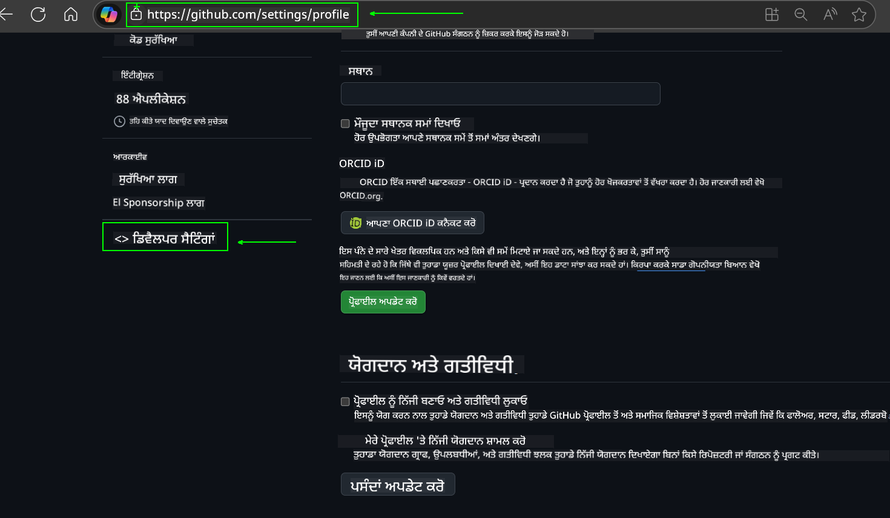
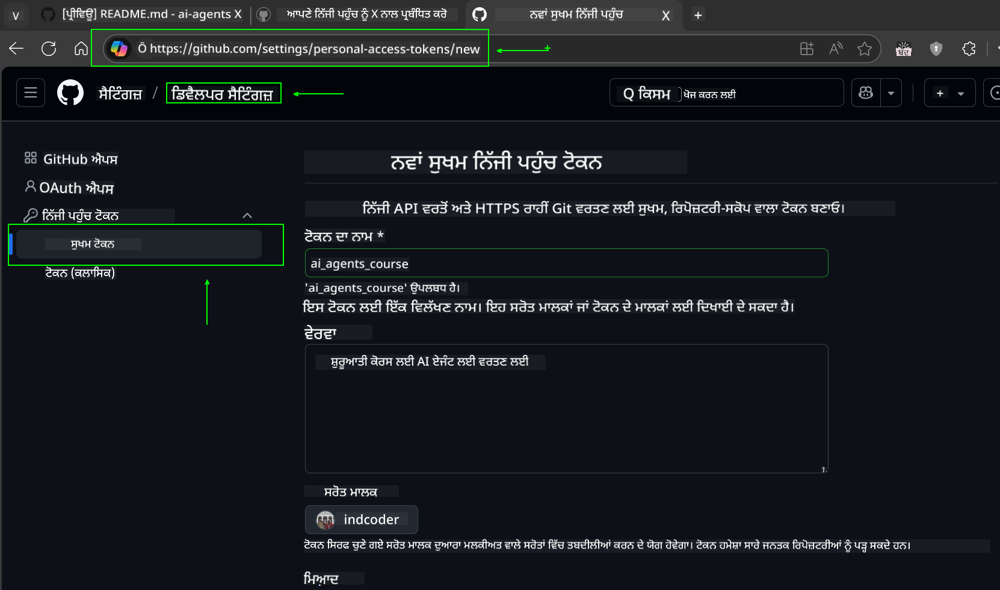
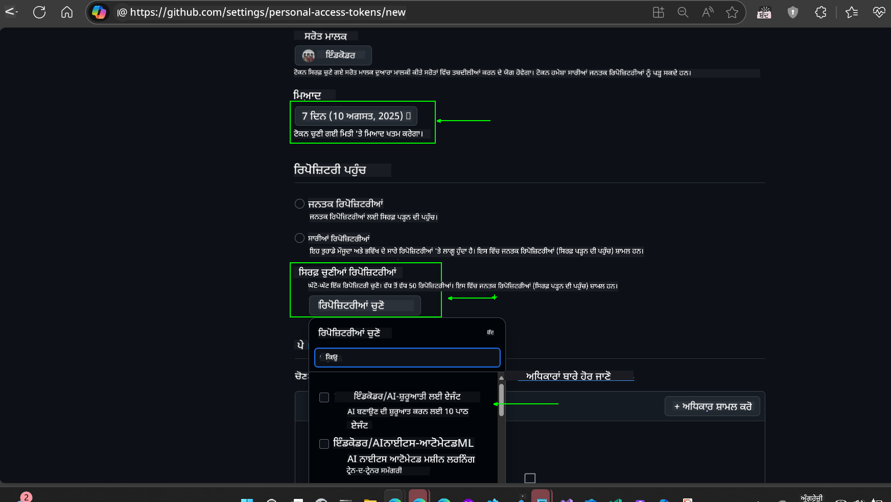
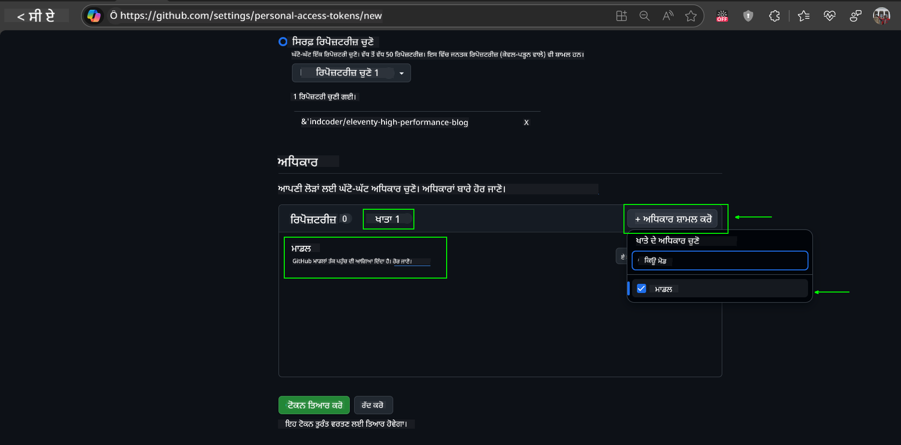

<!--
CO_OP_TRANSLATOR_METADATA:
{
  "original_hash": "96eb7f95375daa3e91778ca0295a55d9",
  "translation_date": "2025-10-15T11:44:19+00:00",
  "source_file": "00-course-setup/README.md",
  "language_code": "pa"
}
-->
# ਕੋਰਸ ਸੈਟਅਪ

## ਪਰਿਚਯ

ਇਸ ਪਾਠ ਵਿੱਚ ਇਸ ਕੋਰਸ ਦੇ ਕੋਡ ਨਮੂਨਿਆਂ ਨੂੰ ਕਿਵੇਂ ਚਲਾਉਣਾ ਹੈ, ਇਸ ਬਾਰੇ ਜਾਣਕਾਰੀ ਦਿੱਤੀ ਜਾਵੇਗੀ।

## ਹੋਰ ਸਿੱਖਣ ਵਾਲਿਆਂ ਨਾਲ ਜੁੜੋ ਅਤੇ ਮਦਦ ਪ੍ਰਾਪਤ ਕਰੋ

ਆਪਣੀ ਰਿਪੋ ਕਲੋਨ ਕਰਨ ਤੋਂ ਪਹਿਲਾਂ, [AI Agents For Beginners Discord channel](https://aka.ms/ai-agents/discord) ਵਿੱਚ ਸ਼ਾਮਲ ਹੋ ਜਾਓ ਤਾਂ ਜੋ ਸੈਟਅਪ ਵਿੱਚ ਮਦਦ ਲਈ, ਕੋਰਸ ਬਾਰੇ ਕੋਈ ਵੀ ਸਵਾਲ ਪੁੱਛਣ ਲਈ ਜਾਂ ਹੋਰ ਸਿੱਖਣ ਵਾਲਿਆਂ ਨਾਲ ਜੁੜਨ ਲਈ ਮਦਦ ਮਿਲ ਸਕੇ।

## ਇਸ ਰਿਪੋ ਨੂੰ ਕਲੋਨ ਜਾਂ ਫੋਰਕ ਕਰੋ

ਸ਼ੁਰੂ ਕਰਨ ਲਈ, ਕਿਰਪਾ ਕਰਕੇ GitHub ਰਿਪੋਜ਼ਿਟਰੀ ਨੂੰ ਕਲੋਨ ਜਾਂ ਫੋਰਕ ਕਰੋ। ਇਸ ਨਾਲ ਤੁਹਾਡੇ ਕੋਲ ਕੋਰਸ ਮਟੀਰੀਅਲ ਦਾ ਆਪਣਾ ਵਰਜਨ ਹੋਵੇਗਾ ਤਾਂ ਜੋ ਤੁਸੀਂ ਕੋਡ ਨੂੰ ਚਲਾ ਸਕੋ, ਟੈਸਟ ਕਰ ਸਕੋ ਅਤੇ ਇਸ ਵਿੱਚ ਸੋਧ ਕਰ ਸਕੋ!

ਇਹ <a href="https://github.com/microsoft/ai-agents-for-beginners/fork" target="_blank">ਰਿਪੋ ਨੂੰ ਫੋਰਕ</a> ਕਰਨ ਲਈ ਲਿੰਕ 'ਤੇ ਕਲਿਕ ਕਰਕੇ ਕੀਤਾ ਜਾ ਸਕਦਾ ਹੈ।

ਹੁਣ ਤੁਹਾਡੇ ਕੋਲ ਇਸ ਕੋਰਸ ਦਾ ਆਪਣਾ ਫੋਰਕ ਕੀਤਾ ਵਰਜਨ ਹੇਠਾਂ ਦਿੱਤੇ ਲਿੰਕ ਵਿੱਚ ਹੋਣਾ ਚਾਹੀਦਾ ਹੈ:


### ਸ਼ੈਲੋ ਕਲੋਨ (ਵਰਕਸ਼ਾਪ / ਕੋਡਸਪੇਸ ਲਈ ਸਿਫਾਰਸ਼ ਕੀਤੀ ਗਈ)

  > ਪੂਰੀ ਰਿਪੋਜ਼ਿਟਰੀ ਡਾਊਨਲੋਡ ਕਰਨ 'ਤੇ ਇਹ ਕਾਫ਼ੀ ਵੱਡੀ (~3 GB) ਹੋ ਸਕਦੀ ਹੈ। ਜੇ ਤੁਸੀਂ ਸਿਰਫ਼ ਵਰਕਸ਼ਾਪ ਵਿੱਚ ਸ਼ਾਮਲ ਹੋ ਰਹੇ ਹੋ ਜਾਂ ਸਿਰਫ਼ ਕੁਝ ਪਾਠ ਫੋਲਡਰਾਂ ਦੀ ਲੋੜ ਹੈ, ਤਾਂ ਸ਼ੈਲੋ ਕਲੋਨ (ਜਾਂ ਸਪਾਰਸ ਕਲੋਨ) ਇਤਿਹਾਸ ਨੂੰ ਛੋਟਾ ਕਰਕੇ ਅਤੇ/ਜਾਂ ਬਲੌਬਸ ਨੂੰ ਸਕਿਪ ਕਰਕੇ ਡਾਊਨਲੋਡ ਨੂੰ ਘਟਾਉਂਦਾ ਹੈ।

#### ਤੇਜ਼ ਸ਼ੈਲੋ ਕਲੋਨ — ਘੱਟ ਇਤਿਹਾਸ, ਸਾਰੇ ਫਾਈਲਾਂ

ਹੇਠਾਂ ਦਿੱਤੇ ਕਮਾਂਡਾਂ ਵਿੱਚ `<your-username>` ਨੂੰ ਆਪਣੇ ਫੋਰਕ URL ਨਾਲ ਬਦਲੋ (ਜਾਂ ਜੇ ਤੁਸੀਂ ਚਾਹੁੰਦੇ ਹੋ ਤਾਂ ਅੱਪਸਟ੍ਰੀਮ URL ਨਾਲ)।

ਸਿਰਫ਼ ਤਾਜ਼ਾ ਕਮਿਟ ਇਤਿਹਾਸ ਕਲੋਨ ਕਰਨ ਲਈ (ਛੋਟਾ ਡਾਊਨਲੋਡ):

```bash|powershell
git clone --depth 1 https://github.com/<your-username>/ai-agents-for-beginners.git
```

ਇੱਕ ਖਾਸ ਬ੍ਰਾਂਚ ਕਲੋਨ ਕਰਨ ਲਈ:

```bash|powershell
git clone --depth 1 --branch <branch-name> https://github.com/<your-username>/ai-agents-for-beginners.git
```

#### ਅੰਸ਼ਕ (ਸਪਾਰਸ) ਕਲੋਨ — ਘੱਟ ਬਲੌਬਸ + ਸਿਰਫ਼ ਚੁਣੇ ਹੋਏ ਫੋਲਡਰ

ਇਹ ਅੰਸ਼ਕ ਕਲੋਨ ਅਤੇ ਸਪਾਰਸ-ਚੈਕਆਉਟ ਵਰਤਦਾ ਹੈ (Git 2.25+ ਦੀ ਲੋੜ ਹੈ ਅਤੇ ਅਧੁਨਿਕ Git ਦੀ ਸਿਫਾਰਸ਼ ਕੀਤੀ ਜਾਂਦੀ ਹੈ ਜਿਸ ਵਿੱਚ ਅੰਸ਼ਕ ਕਲੋਨ ਸਹਾਇਤਾ ਹੈ):

```bash|powershell
git clone --depth 1 --filter=blob:none --sparse https://github.com/<your-username>/ai-agents-for-beginners.git
```

ਰਿਪੋ ਫੋਲਡਰ ਵਿੱਚ ਜਾਓ:

ਬੈਸ਼ ਲਈ:

```bash
cd ai-agents-for-beginners
```

ਪਾਵਰਸ਼ੈੱਲ ਲਈ:

```powershell
Set-Location ai-agents-for-beginners
```

ਫਿਰ ਉਹ ਫੋਲਡਰ ਦੱਸੋ ਜੋ ਤੁਸੀਂ ਚਾਹੁੰਦੇ ਹੋ (ਹੇਠਾਂ ਦਿੱਤੇ ਉਦਾਹਰਣ ਵਿੱਚ ਦੋ ਫੋਲਡਰ ਦਿਖਾਏ ਗਏ ਹਨ):

```bash|powershell
git sparse-checkout set 00-course-setup 01-intro-to-ai-agents
```

ਕਲੋਨ ਕਰਨ ਅਤੇ ਫਾਈਲਾਂ ਦੀ ਪੁਸ਼ਟੀ ਕਰਨ ਤੋਂ ਬਾਅਦ, ਜੇ ਤੁਹਾਨੂੰ ਸਿਰਫ਼ ਫਾਈਲਾਂ ਦੀ ਲੋੜ ਹੈ ਅਤੇ ਜਗ੍ਹਾ ਖਾਲੀ ਕਰਨੀ ਹੈ (ਕੋਈ git ਇਤਿਹਾਸ ਨਹੀਂ), ਕਿਰਪਾ ਕਰਕੇ ਰਿਪੋਜ਼ਿਟਰੀ ਮੈਟਾਡੇਟਾ ਨੂੰ ਮਿਟਾਓ (💀ਅਵਿਰਤ — ਤੁਸੀਂ ਸਾਰੇ Git ਫੰਕਸ਼ਨਲਿਟੀ ਨੂੰ ਗੁਆ ਲਵੋਗੇ: ਕੋਈ ਕਮਿਟ, ਪੁਲ, ਪੁਸ਼ ਜਾਂ ਇਤਿਹਾਸ ਤੱਕ ਪਹੁੰਚ ਨਹੀਂ ਹੋਵੇਗੀ)।

Linux/macOS ਲਈ:

```bash
rm -rf .git
```

Windows ਲਈ:

```powershell
Remove-Item -Recurse -Force .git
```

#### GitHub Codespaces ਵਰਤਣਾ (ਸਥਾਨਕ ਵੱਡੇ ਡਾਊਨਲੋਡ ਤੋਂ ਬਚਣ ਲਈ ਸਿਫਾਰਸ਼ ਕੀਤੀ ਗਈ)

- [GitHub UI](https://github.com/codespaces) ਰਾਹੀਂ ਇਸ ਰਿਪੋ ਲਈ ਇੱਕ ਨਵਾਂ ਕੋਡਸਪੇਸ ਬਣਾਓ।  

- ਨਵੇਂ ਬਣਾਏ ਗਏ ਕੋਡਸਪੇਸ ਦੇ ਟਰਮੀਨਲ ਵਿੱਚ, ਉਪਰੋਕਤ ਸ਼ੈਲੋ/ਸਪਾਰਸ ਕਲੋਨ ਕਮਾਂਡਾਂ ਵਿੱਚੋਂ ਇੱਕ ਚਲਾਓ ਤਾਂ ਜੋ ਸਿਰਫ਼ ਉਹ ਪਾਠ ਫੋਲਡਰ ਜੋ ਤੁਹਾਨੂੰ ਲੋੜੀਂਦੇ ਹਨ, ਕੋਡਸਪੇਸ ਵਰਕਸਪੇਸ ਵਿੱਚ ਲਿਆ ਜਾ ਸਕਣ।
- ਵਿਕਲਪਿਕ: ਕੋਡਸਪੇਸ ਵਿੱਚ ਕਲੋਨ ਕਰਨ ਤੋਂ ਬਾਅਦ, .git ਨੂੰ ਹਟਾਓ ਤਾਂ ਜੋ ਵਾਧੂ ਜਗ੍ਹਾ ਮੁੜ ਪ੍ਰਾਪਤ ਕੀਤੀ ਜਾ ਸਕੇ (ਉਪਰੋਕਤ ਹਟਾਉਣ ਵਾਲੀਆਂ ਕਮਾਂਡਾਂ ਵੇਖੋ)।
- ਨੋਟ: ਜੇ ਤੁਸੀਂ ਰਿਪੋ ਨੂੰ ਸਿੱਧੇ ਕੋਡਸਪੇਸ ਵਿੱਚ ਖੋਲ੍ਹਣਾ ਪਸੰਦ ਕਰਦੇ ਹੋ (ਬਿਨਾਂ ਵਾਧੂ ਕਲੋਨ ਦੇ), ਤਾਂ ਧਿਆਨ ਦਿਓ ਕਿ ਕੋਡਸਪੇਸ devcontainer ਵਾਤਾਵਰਣ ਬਣਾਉਣਗੇ ਅਤੇ ਫਿਰ ਵੀ ਤੁਹਾਨੂੰ ਲੋੜ ਤੋਂ ਵੱਧ ਪ੍ਰਦਾਨ ਕਰ ਸਕਦੇ ਹਨ। ਇੱਕ ਤਾਜ਼ਾ ਕੋਡਸਪੇਸ ਵਿੱਚ ਇੱਕ ਸ਼ੈਲੋ ਕਾਪੀ ਕਲੋਨ ਕਰਨਾ ਤੁਹਾਨੂੰ ਡਿਸਕ ਦੀ ਵਰਤੋਂ 'ਤੇ ਵਧੇਰੇ ਕੰਟਰੋਲ ਦਿੰਦਾ ਹੈ।

#### ਟਿਪਸ

- ਜੇ ਤੁਸੀਂ ਸੋਧ/ਕਮਿਟ ਕਰਨਾ ਚਾਹੁੰਦੇ ਹੋ, ਤਾਂ ਹਮੇਸ਼ਾ ਕਲੋਨ URL ਨੂੰ ਆਪਣੇ ਫੋਰਕ ਨਾਲ ਬਦਲੋ।
- ਜੇ ਤੁਹਾਨੂੰ ਬਾਅਦ ਵਿੱਚ ਹੋਰ ਇਤਿਹਾਸ ਜਾਂ ਫਾਈਲਾਂ ਦੀ ਲੋੜ ਹੈ, ਤਾਂ ਤੁਸੀਂ ਉਹਨਾਂ ਨੂੰ ਫੈਚ ਕਰ ਸਕਦੇ ਹੋ ਜਾਂ ਸਪਾਰਸ-ਚੈਕਆਉਟ ਨੂੰ ਹੋਰ ਫੋਲਡਰ ਸ਼ਾਮਲ ਕਰਨ ਲਈ ਸਮਾਯੋਜਿਤ ਕਰ ਸਕਦੇ ਹੋ।

## ਕੋਡ ਚਲਾਉਣਾ

ਇਹ ਕੋਰਸ Jupyter Notebooks ਦੀ ਇੱਕ ਲੜੀ ਪੇਸ਼ ਕਰਦਾ ਹੈ ਜੋ ਤੁਹਾਨੂੰ AI Agents ਬਣਾਉਣ ਦਾ ਹੱਥ-ਅਨੁਭਵ ਪ੍ਰਾਪਤ ਕਰਨ ਲਈ ਚਲਾਉਣ ਲਈ ਦਿੰਦਾ ਹੈ।

ਕੋਡ ਨਮੂਨੇ ਹੇਠਾਂ ਦਿੱਤੇ ਵਿੱਚੋਂ ਕਿਸੇ ਇੱਕ ਨੂੰ ਵਰਤਦੇ ਹਨ:

**GitHub ਖਾਤਾ ਲੋੜੀਂਦਾ ਹੈ - ਮੁਫ਼ਤ**:

1) Semantic Kernel Agent Framework + GitHub Models Marketplace. (semantic-kernel.ipynb) ਦੇ ਤੌਰ 'ਤੇ ਲੇਬਲ ਕੀਤਾ ਗਿਆ ਹੈ।
2) AutoGen Framework + GitHub Models Marketplace. (autogen.ipynb) ਦੇ ਤੌਰ 'ਤੇ ਲੇਬਲ ਕੀਤਾ ਗਿਆ ਹੈ।

**Azure Subscription ਲੋੜੀਂਦਾ ਹੈ**:
3) Azure AI Foundry + Azure AI Agent Service. (azureaiagent.ipynb) ਦੇ ਤੌਰ 'ਤੇ ਲੇਬਲ ਕੀਤਾ ਗਿਆ ਹੈ।

ਅਸੀਂ ਤੁਹਾਨੂੰ ਤਿੰਨ ਕਿਸਮ ਦੇ ਨਮੂਨਿਆਂ ਨੂੰ ਅਜ਼ਮਾਉਣ ਲਈ ਪ੍ਰੇਰਿਤ ਕਰਦੇ ਹਾਂ ਤਾਂ ਜੋ ਤੁਸੀਂ ਵੇਖ ਸਕੋ ਕਿ ਤੁਹਾਡੇ ਲਈ ਸਭ ਤੋਂ ਵਧੀਆ ਕੰਮ ਕਿਹੜਾ ਹੈ।

ਤੁਹਾਡੇ ਦੁਆਰਾ ਚੁਣਿਆ ਗਿਆ ਵਿਕਲਪ ਇਹ ਨਿਰਧਾਰਤ ਕਰੇਗਾ ਕਿ ਹੇਠਾਂ ਦਿੱਤੇ ਸੈਟਅਪ ਕਦਮਾਂ ਵਿੱਚੋਂ ਕਿਹੜੇ ਤੁਹਾਨੂੰ ਪਾਲਣ ਦੀ ਲੋੜ ਹੈ:

## ਲੋੜਾਂ

- Python 3.12+
  - **NOTE**: ਜੇ ਤੁਹਾਡੇ ਕੋਲ Python3.12 ਇੰਸਟਾਲ ਨਹੀਂ ਹੈ, ਤਾਂ ਯਕੀਨੀ ਬਣਾਓ ਕਿ ਤੁਸੀਂ ਇਸਨੂੰ ਇੰਸਟਾਲ ਕਰੋ। ਫਿਰ requirements.txt ਫਾਈਲ ਤੋਂ ਸਹੀ ਵਰਜਨ ਨੂੰ ਯਕੀਨੀ ਬਣਾਉਣ ਲਈ python3.12 ਦੀ ਵਰਤੋਂ ਕਰਕੇ ਆਪਣਾ venv ਬਣਾਓ।
  
    >ਉਦਾਹਰਨ

    Python venv ਡਾਇਰੈਕਟਰੀ ਬਣਾਓ:

    ``` bash
    python3 -m venv venv
    ```

    ਫਿਰ venv ਵਾਤਾਵਰਣ ਨੂੰ ਐਕਟੀਵੇਟ ਕਰੋ:

    macOS ਅਤੇ Linux

    ```bash
    source venv/bin/activate
    ```
  
    Windows

    ```bash
    venv\Scripts\activate
    ```

- ਇੱਕ GitHub ਖਾਤਾ - GitHub Models Marketplace ਤੱਕ ਪਹੁੰਚ ਲਈ
- Azure Subscription - Azure AI Foundry ਤੱਕ ਪਹੁੰਚ ਲਈ
- Azure AI Foundry ਖਾਤਾ - Azure AI Agent Service ਤੱਕ ਪਹੁੰਚ ਲਈ

ਅਸੀਂ ਇਸ ਰਿਪੋਜ਼ਿਟਰੀ ਦੇ ਰੂਟ ਵਿੱਚ ਇੱਕ `requirements.txt` ਫਾਈਲ ਸ਼ਾਮਲ ਕੀਤੀ ਹੈ ਜੋ ਸਾਰੇ ਲੋੜੀਂਦੇ Python ਪੈਕੇਜਾਂ ਨੂੰ ਸ਼ਾਮਲ ਕਰਦੀ ਹੈ ਜੋ ਕੋਡ ਨਮੂਨਿਆਂ ਨੂੰ ਚਲਾਉਣ ਲਈ ਲੋੜੀਂਦੇ ਹਨ।

ਤੁਸੀਂ ਇਸਨੂੰ ਰਿਪੋਜ਼ਿਟਰੀ ਦੇ ਰੂਟ ਵਿੱਚ ਆਪਣੇ ਟਰਮੀਨਲ ਵਿੱਚ ਹੇਠਾਂ ਦਿੱਤੇ ਕਮਾਂਡ ਨੂੰ ਚਲਾ ਕੇ ਇੰਸਟਾਲ ਕਰ ਸਕਦੇ ਹੋ:

```bash
pip install -r requirements.txt
```
ਅਸੀਂ ਕਿਸੇ ਵੀ ਟਕਰਾਅ ਅਤੇ ਸਮੱਸਿਆਵਾਂ ਤੋਂ ਬਚਣ ਲਈ Python ਵਰਚੁਅਲ ਵਾਤਾਵਰਣ ਬਣਾਉਣ ਦੀ ਸਿਫਾਰਸ਼ ਕਰਦੇ ਹਾਂ।

## VSCode ਸੈਟਅਪ
ਯਕੀਨੀ ਬਣਾਓ ਕਿ ਤੁਸੀਂ VSCode ਵਿੱਚ Python ਦਾ ਸਹੀ ਵਰਜਨ ਵਰਤ ਰਹੇ ਹੋ।


## GitHub Models ਵਰਤ ਕੇ ਨਮੂਨਿਆਂ ਲਈ ਸੈਟਅਪ 

### ਕਦਮ 1: ਆਪਣਾ GitHub Personal Access Token (PAT) ਪ੍ਰਾਪਤ ਕਰੋ

ਇਹ ਕੋਰਸ GitHub Models Marketplace ਨੂੰ ਵਰਤਦਾ ਹੈ, ਜੋ ਤੁਹਾਨੂੰ ਵੱਡੇ ਭਾਸ਼ਾ ਮਾਡਲਾਂ (LLMs) ਤੱਕ ਮੁਫ਼ਤ ਪਹੁੰਚ ਪ੍ਰਦਾਨ ਕਰਦਾ ਹੈ, ਜੋ ਤੁਸੀਂ AI Agents ਬਣਾਉਣ ਲਈ ਵਰਤੋਂਗੇ।

GitHub Models ਨੂੰ ਵਰਤਣ ਲਈ, ਤੁਹਾਨੂੰ ਇੱਕ [GitHub Personal Access Token](https://docs.github.com/en/authentication/keeping-your-account-and-data-secure/managing-your-personal-access-tokens) ਬਣਾਉਣ ਦੀ ਲੋੜ ਹੋਵੇਗੀ।

ਇਹ ਤੁਹਾਡੇ GitHub ਖਾਤੇ ਵਿੱਚ <a href="https://github.com/settings/personal-access-tokens" target="_blank">Personal Access Tokens settings</a> 'ਤੇ ਜਾ ਕੇ ਕੀਤਾ ਜਾ ਸਕਦਾ ਹੈ।

ਕਿਰਪਾ ਕਰਕੇ [Principle of Least Privilege](https://docs.github.com/en/get-started/learning-to-code/storing-your-secrets-safely) ਦੀ ਪਾਲਣਾ ਕਰੋ ਜਦੋਂ ਤੁਸੀਂ ਆਪਣਾ ਟੋਕਨ ਬਣਾਉਂਦੇ ਹੋ। ਇਸਦਾ ਮਤਲਬ ਹੈ ਕਿ ਤੁਹਾਨੂੰ ਸਿਰਫ਼ ਟੋਕਨ ਨੂੰ ਉਹ ਅਧਿਕਾਰ ਦੇਣੇ ਚਾਹੀਦੇ ਹਨ ਜੋ ਇਸ ਕੋਰਸ ਵਿੱਚ ਕੋਡ ਨਮੂਨਿਆਂ ਨੂੰ ਚਲਾਉਣ ਲਈ ਲੋੜੀਂਦੇ ਹਨ।

1. **Developer settings** ਵਿੱਚ ਜਾ ਕੇ ਸਕ੍ਰੀਨ ਦੇ ਖੱਬੇ ਪਾਸੇ `Fine-grained tokens` ਵਿਕਲਪ ਚੁਣੋ।
   

    ਫਿਰ `Generate new token` ਚੁਣੋ।

    

2. ਆਪਣੇ ਟੋਕਨ ਲਈ ਇੱਕ ਵਰਣਨਾਤਮਕ ਨਾਮ ਦਾਖਲ ਕਰੋ ਜੋ ਇਸਦੇ ਉਦੇਸ਼ ਨੂੰ ਦਰਸਾਉਂਦਾ ਹੋਵੇ, ਜਿਸਨੂੰ ਬਾਅਦ ਵਿੱਚ ਪਛਾਣਨਾ ਆਸਾਨ ਹੋਵੇ।

    🔐 ਟੋਕਨ ਦੀ ਮਿਆਦ ਦੀ ਸਿਫਾਰਸ਼

    ਸਿਫਾਰਸ਼ ਕੀਤੀ ਮਿਆਦ: 30 ਦਿਨ
    ਜੇ ਤੁਸੀਂ ਹੋਰ ਸੁਰੱਖਿਅਤ ਰਵੱਈਏ ਦੀ ਚਾਹਤ ਰੱਖਦੇ ਹੋ, ਤਾਂ ਤੁਸੀਂ ਛੋਟੇ ਸਮੇਂ ਲਈ ਚੋਣ ਕਰ ਸਕਦੇ ਹੋ—ਜਿਵੇਂ ਕਿ 7 ਦਿਨ 🛡️
    ਇਹ ਇੱਕ ਸ਼ਾਨਦਾਰ ਤਰੀਕਾ ਹੈ ਕਿ ਆਪਣਾ ਨਿੱਜੀ ਟੀਚਾ ਸੈਟ ਕਰੋ ਅਤੇ ਕੋਰਸ ਨੂੰ ਪੂਰਾ ਕਰੋ ਜਦੋਂ ਤੁਹਾਡਾ ਸਿੱਖਣ ਦਾ ਜ਼ੋਰ ਉੱਚਾ ਹੋਵੇ 🚀।

    

3. ਟੋਕਨ ਦੇ ਸਕੋਪ ਨੂੰ ਇਸ ਰਿਪੋਜ਼ਿਟਰੀ ਦੇ ਫੋਰਕ ਤੱਕ ਸੀਮਿਤ ਕਰੋ।

    

4. ਟੋਕਨ ਦੇ ਅਧਿਕਾਰਾਂ ਨੂੰ ਸੀਮਿਤ ਕਰੋ: **Permissions** ਦੇ ਅਧੀਨ, **Account** ਟੈਬ 'ਤੇ ਕਲਿੱਕ ਕਰੋ, ਅਤੇ "+ Add permissions" ਬਟਨ 'ਤੇ ਕਲਿੱਕ ਕਰੋ। ਇੱਕ ਡ੍ਰੌਪਡਾਊਨ ਪ੍ਰਗਟ ਹੋਵੇਗਾ। ਕਿਰਪਾ ਕਰਕੇ **Models** ਲਈ ਖੋਜ ਕਰੋ ਅਤੇ ਇਸਦੇ ਲਈ ਬਾਕਸ ਨੂੰ ਚੁਣੋ।
    

5. ਟੋਕਨ ਬਣਾਉਣ ਤੋਂ ਪਹਿਲਾਂ ਲੋੜੀਂਦੇ ਅਧਿਕਾਰਾਂ ਦੀ ਪੁਸ਼ਟੀ ਕਰੋ। 

6. ਟੋਕਨ ਬਣਾਉਣ ਤੋਂ ਪਹਿਲਾਂ, ਯਕੀਨੀ ਬਣਾਓ ਕਿ ਤੁਸੀਂ ਟੋਕਨ ਨੂੰ ਸੁਰੱਖਿਅਤ ਥਾਂ 'ਤੇ ਸਟੋਰ ਕਰਨ ਲਈ ਤਿਆਰ ਹੋ, ਜਿਵੇਂ ਕਿ ਪਾਸਵਰਡ ਮੈਨੇਜਰ ਵਾਲਟ, ਕਿਉਂਕਿ ਇਹ ਤੁਹਾਡੇ ਦੁਆਰਾ ਬਣਾਉਣ ਤੋਂ ਬਾਅਦ ਮੁੜ ਨਹੀਂ ਦਿਖਾਇਆ ਜਾਵੇਗਾ। 

ਆਪਣੇ ਨਵੇਂ ਬਣਾਏ ਟੋਕਨ ਨੂੰ ਕਾਪੀ ਕਰੋ। ਹੁਣ ਤੁਸੀਂ ਇਸ ਨੂੰ ਇਸ ਕੋਰਸ ਵਿੱਚ ਸ਼ਾਮਲ `.env` ਫਾਈਲ ਵਿੱਚ ਸ਼ਾਮਲ ਕਰੋ।

### ਕਦਮ 2: ਆਪਣੀ `.env` ਫਾਈਲ ਬਣਾਓ

ਆਪਣੀ `.env` ਫਾਈਲ ਬਣਾਉਣ ਲਈ ਆਪਣੇ ਟਰਮੀਨਲ ਵਿੱਚ ਹੇਠਾਂ ਦਿੱਤੇ ਕਮਾਂਡ ਨੂੰ ਚਲਾਓ।

```bash
cp .env.example .env
```

ਇਹ ਉਦਾਹਰਨ ਫਾਈਲ ਨੂੰ ਕਾਪੀ ਕਰੇਗਾ ਅਤੇ ਤੁਹਾਡੇ ਡਾਇਰੈਕਟਰੀ ਵਿੱਚ `.env` ਬਣਾਏਗਾ ਜਿੱਥੇ ਤੁਸੀਂ ਵਾਤਾਵਰਣ ਚਰਾਂ ਦੀਆਂ ਕੀਮਤਾਂ ਭਰ ਸਕਦੇ ਹੋ।

ਆਪਣੇ ਟੋਕਨ ਨੂੰ ਕਾਪੀ ਕਰਕੇ, ਆਪਣੀ ਮਨਪਸੰਦ ਟੈਕਸਟ ਐਡੀਟਰ ਵਿੱਚ `.env` ਫਾਈਲ ਖੋਲ੍ਹੋ ਅਤੇ ਆਪਣੇ ਟੋਕਨ ਨੂੰ `GITHUB_TOKEN` ਫੀਲਡ ਵਿੱਚ ਪੇਸਟ ਕਰੋ।


ਹੁਣ ਤੁਸੀਂ ਇਸ ਕੋਰਸ ਦੇ ਕੋਡ ਨਮੂਨਿਆਂ ਨੂੰ ਚਲਾ ਸਕਦੇ ਹੋ।

## Azure AI Foundry ਅਤੇ Azure AI Agent Service ਵਰਤ ਕੇ ਨਮੂਨਿਆਂ ਲਈ ਸੈਟਅਪ

### ਕਦਮ 1: ਆਪਣਾ Azure ਪ੍ਰੋਜੈਕਟ ਐਂਡਪੋਇੰਟ ਪ੍ਰਾਪਤ ਕਰੋ

Azure AI Foundry ਵਿੱਚ ਇੱਕ ਹੱਬ ਅਤੇ ਪ੍ਰੋਜੈਕਟ ਬਣਾਉਣ ਦੇ ਕਦਮਾਂ ਦੀ ਪਾਲਣਾ ਕਰੋ: [Hub resources overview](https://learn.microsoft.com/en-us/azure/ai-foundry/concepts/ai-resources)

ਜਦੋਂ ਤੁਸੀਂ ਆਪਣਾ ਪ੍ਰੋਜੈਕਟ ਬਣਾਉਂਦੇ ਹੋ, ਤਾਂ ਤੁਹਾਨੂੰ ਆਪਣੇ ਪ੍ਰੋਜੈਕਟ ਲਈ ਕਨੈਕਸ਼ਨ ਸਟ੍ਰਿੰਗ ਪ੍ਰਾਪਤ ਕਰਨ ਦੀ ਲੋੜ ਹੋਵੇਗੀ।

ਇਹ Azure AI Foundry ਪੋਰਟਲ ਵਿੱਚ ਆਪਣੇ ਪ੍ਰੋਜੈਕਟ ਦੇ **Overview** ਪੇਜ 'ਤੇ ਜਾ ਕੇ ਕੀਤਾ ਜਾ ਸਕਦਾ ਹੈ।


### ਕਦਮ 2: ਆਪਣੀ `.env` ਫਾਈਲ ਬਣਾਓ

ਆਪਣੀ `.env` ਫਾਈਲ ਬਣਾਉਣ ਲਈ ਆਪਣੇ ਟਰਮੀਨਲ ਵਿੱਚ ਹੇਠਾਂ ਦਿੱਤੇ ਕਮਾਂਡ ਨੂੰ ਚਲਾਓ।

```bash
cp .env.example .env
```

ਇਹ ਉਦਾਹਰਨ ਫਾਈਲ ਨੂੰ ਕਾਪੀ ਕਰੇਗਾ ਅਤੇ ਤੁਹਾਡੇ ਡਾਇਰੈਕਟਰੀ ਵਿੱਚ `.env` ਬਣਾਏਗਾ ਜਿੱਥੇ ਤੁਸੀਂ ਵਾਤਾਵਰਣ ਚਰਾਂ ਦੀਆਂ ਕੀਮਤਾਂ ਭਰ ਸਕਦੇ ਹੋ।

ਆਪਣੇ ਟੋਕਨ ਨੂੰ ਕਾਪੀ ਕਰਕੇ, ਆਪਣੀ ਮਨਪਸੰਦ ਟੈਕਸਟ ਐਡੀਟਰ ਵਿੱਚ `.env` ਫਾਈਲ ਖੋਲ੍ਹੋ ਅਤੇ ਆਪਣੇ ਟੋਕਨ ਨੂੰ `PROJECT_ENDPOINT` ਫੀਲਡ ਵਿੱਚ ਪੇਸਟ ਕਰੋ।

### ਕਦਮ 3: Azure ਵਿੱਚ ਸਾਈਨ ਇਨ ਕਰੋ

ਸੁਰੱਖਿਆ ਦੇ ਸਾਰੇ ਚੰਗੇ ਤਰੀਕੇ ਦੇ ਤੌਰ 'ਤੇ, ਅਸੀਂ [keyless authentication](https://learn.microsoft.com/azure/developer/ai/keyless-connections?tabs=csharp%2Cazure-cli?WT.mc_id=academic-105485-koreyst) ਨੂੰ Microsoft Entra ID ਨਾਲ Azure OpenAI ਵਿੱਚ ਪ੍ਰਮਾਣਿਕ ਕਰਨ ਲਈ ਵਰਤਾਂਗੇ।

ਅਗਲੇ ਕਦਮ ਵਿੱਚ, ਟਰਮੀਨਲ ਖੋਲ੍ਹੋ ਅਤੇ `az login --use-device-code` ਚਲਾਓ ਤਾਂ ਜੋ ਆਪਣੇ
ਜੇ ਤੁਹਾਨੂੰ ਇਸ ਸੈਟਅੱਪ ਨੂੰ ਚਲਾਉਣ ਵਿੱਚ ਕੋਈ ਸਮੱਸਿਆ ਆਉਂਦੀ ਹੈ, ਤਾਂ ਸਾਡੇ <a href="https://discord.gg/kzRShWzttr" target="_blank">Azure AI Community Discord</a> ਵਿੱਚ ਸ਼ਾਮਲ ਹੋ ਜਾਓ ਜਾਂ <a href="https://github.com/microsoft/ai-agents-for-beginners/issues?WT.mc_id=academic-105485-koreyst" target="_blank">ਇੱਕ ਸਮੱਸਿਆ ਬਣਾਓ</a>।

## ਅਗਲਾ ਪਾਠ

ਤੁਸੀਂ ਹੁਣ ਇਸ ਕੋਰਸ ਲਈ ਕੋਡ ਚਲਾਉਣ ਲਈ ਤਿਆਰ ਹੋ। AI Agents ਦੀ ਦੁਨੀਆ ਬਾਰੇ ਹੋਰ ਸਿੱਖਣ ਦਾ ਅਨੰਦ ਲਓ! 

[AI Agents ਅਤੇ Agent Use Cases ਦਾ ਪਰਿਚਯ](../01-intro-to-ai-agents/README.md)

---

**ਅਸਵੀਕਰਤਾ**:  
ਇਹ ਦਸਤਾਵੇਜ਼ AI ਅਨੁਵਾਦ ਸੇਵਾ [Co-op Translator](https://github.com/Azure/co-op-translator) ਦੀ ਵਰਤੋਂ ਕਰਕੇ ਅਨੁਵਾਦ ਕੀਤਾ ਗਿਆ ਹੈ। ਜਦੋਂ ਕਿ ਅਸੀਂ ਸਹੀ ਹੋਣ ਦਾ ਯਤਨ ਕਰਦੇ ਹਾਂ, ਕਿਰਪਾ ਕਰਕੇ ਧਿਆਨ ਦਿਓ ਕਿ ਸਵੈਚਾਲਿਤ ਅਨੁਵਾਦਾਂ ਵਿੱਚ ਗਲਤੀਆਂ ਜਾਂ ਅਸੁਚੱਜੇਪਣ ਹੋ ਸਕਦੇ ਹਨ। ਇਸ ਦੀ ਮੂਲ ਭਾਸ਼ਾ ਵਿੱਚ ਮੌਜੂਦ ਅਸਲ ਦਸਤਾਵੇਜ਼ ਨੂੰ ਅਧਿਕਾਰਤ ਸਰੋਤ ਮੰਨਿਆ ਜਾਣਾ ਚਾਹੀਦਾ ਹੈ। ਮਹੱਤਵਪੂਰਨ ਜਾਣਕਾਰੀ ਲਈ, ਪੇਸ਼ੇਵਰ ਮਨੁੱਖੀ ਅਨੁਵਾਦ ਦੀ ਸਿਫਾਰਸ਼ ਕੀਤੀ ਜਾਂਦੀ ਹੈ। ਅਸੀਂ ਇਸ ਅਨੁਵਾਦ ਦੀ ਵਰਤੋਂ ਤੋਂ ਪੈਦਾ ਹੋਣ ਵਾਲੇ ਕਿਸੇ ਵੀ ਗਲਤਫਹਿਮੀ ਜਾਂ ਗਲਤ ਵਿਆਖਿਆ ਲਈ ਜ਼ਿੰਮੇਵਾਰ ਨਹੀਂ ਹਾਂ।