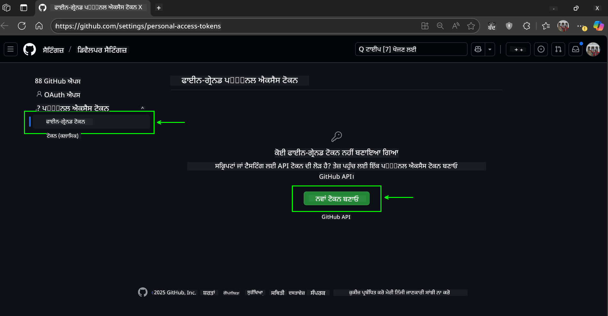
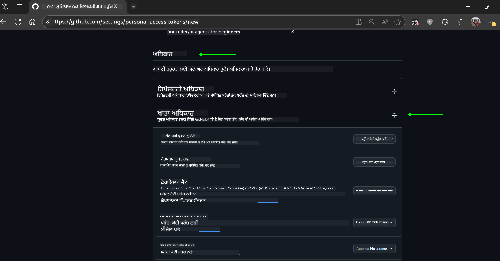
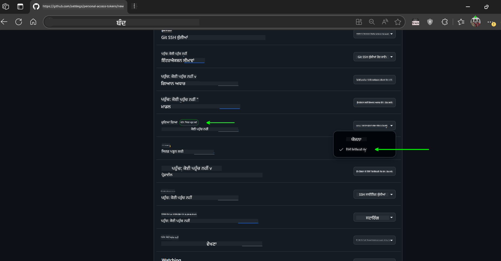

<!--
CO_OP_TRANSLATOR_METADATA:
{
  "original_hash": "c6a79c8f2b56a80370ff7e447765524f",
  "translation_date": "2025-07-24T08:07:54+00:00",
  "source_file": "00-course-setup/README.md",
  "language_code": "pa"
}
-->
# ਕੋਰਸ ਸੈਟਅਪ

## ਜਾਣ ਪਛਾਣ

ਇਸ ਪਾਠ ਵਿੱਚ ਤੁਸੀਂ ਸਿੱਖੋਗੇ ਕਿ ਇਸ ਕੋਰਸ ਦੇ ਕੋਡ ਨਮੂਨਿਆਂ ਨੂੰ ਕਿਵੇਂ ਚਲਾਇਆ ਜਾਵੇ।

## ਇਸ ਰਿਪੋ ਨੂੰ ਕਲੋਨ ਜਾਂ ਫੋਰਕ ਕਰੋ

ਸਭ ਤੋਂ ਪਹਿਲਾਂ, ਕਿਰਪਾ ਕਰਕੇ GitHub ਰਿਪੋਜ਼ਟਰੀ ਨੂੰ ਕਲੋਨ ਜਾਂ ਫੋਰਕ ਕਰੋ। ਇਸ ਨਾਲ ਤੁਹਾਡੇ ਕੋਲ ਕੋਰਸ ਮਟੀਰੀਅਲ ਦਾ ਆਪਣਾ ਵਰਜਨ ਹੋਵੇਗਾ, ਜਿਸ ਨਾਲ ਤੁਸੀਂ ਕੋਡ ਨੂੰ ਚਲਾ ਸਕਦੇ ਹੋ, ਟੈਸਟ ਕਰ ਸਕਦੇ ਹੋ ਅਤੇ ਇਸ ਵਿੱਚ ਸੋਧ ਕਰ ਸਕਦੇ ਹੋ!

ਇਹ ਕੰਮ ਲਿੰਕ 'ਤੇ ਕਲਿੱਕ ਕਰਕੇ ਕੀਤਾ ਜਾ ਸਕਦਾ ਹੈ।

ਤੁਹਾਡੇ ਕੋਲ ਹੁਣ ਇਸ ਕੋਰਸ ਦਾ ਆਪਣਾ ਫੋਰਕ ਕੀਤਾ ਵਰਜਨ ਹੋਣਾ ਚਾਹੀਦਾ ਹੈ ਇਸ ਲਿੰਕ ਵਿੱਚ:


## ਕੋਡ ਚਲਾਉਣਾ

ਇਹ ਕੋਰਸ Jupyter Notebooks ਦੀ ਇੱਕ ਲੜੀ ਪੇਸ਼ ਕਰਦਾ ਹੈ, ਜਿਸ ਨਾਲ ਤੁਸੀਂ AI Agents ਬਣਾਉਣ ਦਾ ਹੱਥ-ਅਨੁਭਵ ਪ੍ਰਾਪਤ ਕਰ ਸਕਦੇ ਹੋ।

ਕੋਡ ਨਮੂਨੇ ਹੇਠਾਂ ਦਿੱਤੇ ਦੋ ਤਰੀਕਿਆਂ ਵਿੱਚੋਂ ਕਿਸੇ ਇੱਕ ਨੂੰ ਵਰਤਦੇ ਹਨ:

**GitHub ਖਾਤਾ ਲੋੜੀਂਦਾ ਹੈ - ਮੁਫ਼ਤ**:

1) Semantic Kernel Agent Framework + GitHub Models Marketplace। ਲੇਬਲ ਕੀਤਾ ਗਿਆ ਹੈ (semantic-kernel.ipynb)
2) AutoGen Framework + GitHub Models Marketplace। ਲੇਬਲ ਕੀਤਾ ਗਿਆ ਹੈ (autogen.ipynb)

**Azure ਸਬਸਕ੍ਰਿਪਸ਼ਨ ਲੋੜੀਂਦੀ ਹੈ**:
3) Azure AI Foundry + Azure AI Agent Service। ਲੇਬਲ ਕੀਤਾ ਗਿਆ ਹੈ (azureaiagent.ipynb)

ਅਸੀਂ ਤੁਹਾਨੂੰ ਤਿੰਨ ਤਰੀਕਿਆਂ ਦੇ ਨਮੂਨਿਆਂ ਨੂੰ ਅਜ਼ਮਾਉਣ ਦੀ ਸਿਫਾਰਸ਼ ਕਰਦੇ ਹਾਂ ਤਾਂ ਜੋ ਤੁਸੀਂ ਵੇਖ ਸਕੋ ਕਿ ਤੁਹਾਡੇ ਲਈ ਕਿਹੜਾ ਵਧੀਆ ਕੰਮ ਕਰਦਾ ਹੈ।

ਤੁਹਾਡੇ ਚੋਣੇ ਗਏ ਵਿਕਲਪ ਦੇ ਅਧਾਰ 'ਤੇ, ਹੇਠਾਂ ਦਿੱਤੇ ਸੈਟਅਪ ਕਦਮਾਂ ਦੀ ਪਾਲਣਾ ਕਰੋ:

## ਲੋੜਾਂ

- Python 3.12+
  - **NOTE**: ਜੇ ਤੁਹਾਡੇ ਕੋਲ Python3.12 ਇੰਸਟਾਲ ਨਹੀਂ ਹੈ, ਤਾਂ ਇਹ ਯਕੀਨੀ ਬਣਾਓ ਕਿ ਤੁਸੀਂ ਇਸਨੂੰ ਇੰਸਟਾਲ ਕਰੋ। ਫਿਰ python3.12 ਦੀ ਵਰਤੋਂ ਕਰਕੇ ਆਪਣਾ venv ਬਣਾਓ ਤਾਂ ਜੋ requirements.txt ਫਾਈਲ ਤੋਂ ਸਹੀ ਵਰਜਨ ਇੰਸਟਾਲ ਹੋ ਸਕਣ।
- GitHub ਖਾਤਾ - GitHub Models Marketplace ਤੱਕ ਪਹੁੰਚ ਲਈ
- Azure ਸਬਸਕ੍ਰਿਪਸ਼ਨ - Azure AI Foundry ਤੱਕ ਪਹੁੰਚ ਲਈ
- Azure AI Foundry ਖਾਤਾ - Azure AI Agent Service ਤੱਕ ਪਹੁੰਚ ਲਈ

ਅਸੀਂ ਇਸ ਰਿਪੋਜ਼ਟਰੀ ਦੇ ਰੂਟ ਵਿੱਚ ਇੱਕ `requirements.txt` ਫਾਈਲ ਸ਼ਾਮਲ ਕੀਤੀ ਹੈ, ਜਿਸ ਵਿੱਚ ਸਾਰੇ ਲੋੜੀਂਦੇ Python ਪੈਕੇਜ ਹਨ ਜੋ ਕੋਡ ਨਮੂਨਿਆਂ ਨੂੰ ਚਲਾਉਣ ਲਈ ਲੋੜੀਂਦੇ ਹਨ।

ਤੁਸੀਂ ਹੇਠਾਂ ਦਿੱਤੇ ਕਮਾਂਡ ਨੂੰ ਰਿਪੋਜ਼ਟਰੀ ਦੇ ਰੂਟ ਵਿੱਚ ਆਪਣੇ ਟਰਮੀਨਲ ਵਿੱਚ ਚਲਾ ਕੇ ਇਨ੍ਹਾਂ ਨੂੰ ਇੰਸਟਾਲ ਕਰ ਸਕਦੇ ਹੋ:

```bash
pip install -r requirements.txt
```
ਅਸੀਂ ਕਿਸੇ ਵੀ ਟਕਰਾਅ ਅਤੇ ਸਮੱਸਿਆਵਾਂ ਤੋਂ ਬਚਣ ਲਈ Python ਵਰਚੁਅਲ ਐਨਵਾਇਰਮੈਂਟ ਬਣਾਉਣ ਦੀ ਸਿਫਾਰਸ਼ ਕਰਦੇ ਹਾਂ।

## VSCode ਸੈਟਅਪ
ਯਕੀਨੀ ਬਣਾਓ ਕਿ ਤੁਸੀਂ VSCode ਵਿੱਚ Python ਦਾ ਸਹੀ ਵਰਜਨ ਵਰਤ ਰਹੇ ਹੋ।


## GitHub Models ਵਰਤਣ ਲਈ ਨਮੂਨਿਆਂ ਦਾ ਸੈਟਅਪ 

### ਕਦਮ 1: ਆਪਣਾ GitHub Personal Access Token (PAT) ਪ੍ਰਾਪਤ ਕਰੋ

ਇਹ ਕੋਰਸ GitHub Models Marketplace ਦੀ ਵਰਤੋਂ ਕਰਦਾ ਹੈ, ਜੋ ਤੁਹਾਨੂੰ ਵੱਡੇ ਭਾਸ਼ਾ ਮਾਡਲ (LLMs) ਤੱਕ ਮੁਫ਼ਤ ਪਹੁੰਚ ਪ੍ਰਦਾਨ ਕਰਦਾ ਹੈ, ਜੋ ਤੁਸੀਂ AI Agents ਬਣਾਉਣ ਲਈ ਵਰਤੋਂ ਕਰੋਗੇ।

GitHub Models ਦੀ ਵਰਤੋਂ ਕਰਨ ਲਈ, ਤੁਹਾਨੂੰ [GitHub Personal Access Token](https://docs.github.com/en/authentication/keeping-your-account-and-data-secure/managing-your-personal-access-tokens) ਬਣਾਉਣ ਦੀ ਲੋੜ ਹੋਵੇਗੀ।

ਇਹ ਤੁਹਾਡੇ GitHub ਖਾਤੇ ਵਿੱਚ ਜਾ ਕੇ ਕੀਤਾ ਜਾ ਸਕਦਾ ਹੈ।

ਕਿਰਪਾ ਕਰਕੇ [Principle of Least Privilege](https://docs.github.com/en/get-started/learning-to-code/storing-your-secrets-safely) ਦੀ ਪਾਲਣਾ ਕਰੋ ਜਦੋਂ ਤੁਸੀਂ ਆਪਣਾ ਟੋਕਨ ਬਣਾਉਂਦੇ ਹੋ। ਇਸਦਾ ਮਤਲਬ ਹੈ ਕਿ ਤੁਹਾਨੂੰ ਟੋਕਨ ਨੂੰ ਸਿਰਫ਼ ਉਹ ਅਧਿਕਾਰ ਦੇਣੇ ਚਾਹੀਦੇ ਹਨ ਜੋ ਇਸ ਕੋਰਸ ਦੇ ਕੋਡ ਨਮੂਨਿਆਂ ਨੂੰ ਚਲਾਉਣ ਲਈ ਲੋੜੀਂਦੇ ਹਨ।

1. ਆਪਣੇ ਸਕ੍ਰੀਨ ਦੇ ਖੱਬੇ ਪਾਸੇ `Fine-grained tokens` ਵਿਕਲਪ ਚੁਣੋ।

    ਫਿਰ `Generate new token` ਚੁਣੋ।

    

1. ਆਪਣੇ ਟੋਕਨ ਲਈ ਇੱਕ ਵਰਣਨਾਤਮਕ ਨਾਮ ਦਿਓ ਜੋ ਇਸਦੇ ਉਦੇਸ਼ ਨੂੰ ਦਰਸਾਉਂਦਾ ਹੋਵੇ, ਜਿਸ ਨਾਲ ਇਸਨੂੰ ਬਾਅਦ ਵਿੱਚ ਪਛਾਣਨਾ ਆਸਾਨ ਹੋ ਜਾਵੇ। ਇੱਕ ਮਿਆਦ ਦੀ ਮਿਤੀ ਸੈਟ ਕਰੋ (ਸਿਫਾਰਸ਼: 30 ਦਿਨ; ਤੁਸੀਂ ਇੱਕ ਛੋਟਾ ਸਮਾਂ ਜਿਵੇਂ 7 ਦਿਨ ਚੁਣ ਸਕਦੇ ਹੋ ਜੇ ਤੁਸੀਂ ਜ਼ਿਆਦਾ ਸੁਰੱਖਿਅਤ ਪਹੁੰਚ ਚਾਹੁੰਦੇ ਹੋ।)

    

1. ਟੋਕਨ ਦੀ ਸਕੋਪ ਨੂੰ ਇਸ ਰਿਪੋਜ਼ਟਰੀ ਦੇ ਫੋਰਕ ਤੱਕ ਸੀਮਿਤ ਕਰੋ।

    

1. ਟੋਕਨ ਦੇ ਅਧਿਕਾਰਾਂ ਨੂੰ ਸੀਮਿਤ ਕਰੋ: **Permissions** ਦੇ ਅਧੀਨ, **Account Permissions** ਨੂੰ ਟੌਗਲ ਕਰੋ, **Models** ਤੱਕ ਜਾਓ ਅਤੇ ਸਿਰਫ਼ GitHub Models ਲਈ ਲੋੜੀਂਦੇ ਪੜ੍ਹਨ-ਅਧਿਕਾਰ ਨੂੰ ਯੋਗ ਕਰੋ।

    

    

ਆਪਣੇ ਨਵੇਂ ਬਣਾਏ ਟੋਕਨ ਨੂੰ ਕਾਪੀ ਕਰੋ। ਹੁਣ ਤੁਸੀਂ ਇਸਨੂੰ ਇਸ ਕੋਰਸ ਵਿੱਚ ਸ਼ਾਮਲ `.env` ਫਾਈਲ ਵਿੱਚ ਸ਼ਾਮਲ ਕਰੋਗੇ।

### ਕਦਮ 2: ਆਪਣੀ `.env` ਫਾਈਲ ਬਣਾਓ

ਆਪਣੀ `.env` ਫਾਈਲ ਬਣਾਉਣ ਲਈ ਆਪਣੇ ਟਰਮੀਨਲ ਵਿੱਚ ਹੇਠਾਂ ਦਿੱਤਾ ਕਮਾਂਡ ਚਲਾਓ।

```bash
cp .env.example .env
```

ਇਹ ਉਦਾਹਰਨ ਫਾਈਲ ਨੂੰ ਕਾਪੀ ਕਰੇਗਾ ਅਤੇ `.env` ਤੁਹਾਡੇ ਡਾਇਰੈਕਟਰੀ ਵਿੱਚ ਬਣਾਏਗਾ, ਜਿੱਥੇ ਤੁਸੀਂ ਵਾਤਾਵਰਣ ਚਰਾਂ ਦੇ ਮੁੱਲ ਭਰ ਸਕਦੇ ਹੋ।

ਆਪਣਾ ਟੋਕਨ ਕਾਪੀ ਕਰਕੇ, `.env` ਫਾਈਲ ਨੂੰ ਆਪਣੇ ਮਨਪਸੰਦ ਟੈਕਸਟ ਐਡੀਟਰ ਵਿੱਚ ਖੋਲ੍ਹੋ ਅਤੇ ਆਪਣੇ ਟੋਕਨ ਨੂੰ `GITHUB_TOKEN` ਫੀਲਡ ਵਿੱਚ ਪੇਸਟ ਕਰੋ।

ਹੁਣ ਤੁਸੀਂ ਇਸ ਕੋਰਸ ਦੇ ਕੋਡ ਨਮੂਨਿਆਂ ਨੂੰ ਚਲਾ ਸਕਦੇ ਹੋ।

## Azure AI Foundry ਅਤੇ Azure AI Agent Service ਵਰਤਣ ਲਈ ਨਮੂਨਿਆਂ ਦਾ ਸੈਟਅਪ

### ਕਦਮ 1: ਆਪਣਾ Azure ਪ੍ਰੋਜੈਕਟ ਐਂਡਪੌਇੰਟ ਪ੍ਰਾਪਤ ਕਰੋ

Azure AI Foundry ਵਿੱਚ ਹੱਬ ਅਤੇ ਪ੍ਰੋਜੈਕਟ ਬਣਾਉਣ ਦੇ ਕਦਮਾਂ ਦੀ ਪਾਲਣਾ ਕਰੋ: [Hub resources overview](https://learn.microsoft.com/en-us/azure/ai-foundry/concepts/ai-resources)

ਜਦੋਂ ਤੁਸੀਂ ਆਪਣਾ ਪ੍ਰੋਜੈਕਟ ਬਣਾਉਂਦੇ ਹੋ, ਤਾਂ ਤੁਹਾਨੂੰ ਆਪਣੇ ਪ੍ਰੋਜੈਕਟ ਲਈ ਕਨੈਕਸ਼ਨ ਸਟ੍ਰਿੰਗ ਪ੍ਰਾਪਤ ਕਰਨ ਦੀ ਲੋੜ ਹੋਵੇਗੀ।

ਇਹ Azure AI Foundry ਪੋਰਟਲ ਵਿੱਚ ਆਪਣੇ ਪ੍ਰੋਜੈਕਟ ਦੇ **Overview** ਪੇਜ 'ਤੇ ਜਾ ਕੇ ਕੀਤਾ ਜਾ ਸਕਦਾ ਹੈ।


### ਕਦਮ 2: ਆਪਣੀ `.env` ਫਾਈਲ ਬਣਾਓ

ਆਪਣੀ `.env` ਫਾਈਲ ਬਣਾਉਣ ਲਈ ਆਪਣੇ ਟਰਮੀਨਲ ਵਿੱਚ ਹੇਠਾਂ ਦਿੱਤਾ ਕਮਾਂਡ ਚਲਾਓ।

```bash
cp .env.example .env
```

ਇਹ ਉਦਾਹਰਨ ਫਾਈਲ ਨੂੰ ਕਾਪੀ ਕਰੇਗਾ ਅਤੇ `.env` ਤੁਹਾਡੇ ਡਾਇਰੈਕਟਰੀ ਵਿੱਚ ਬਣਾਏਗਾ, ਜਿੱਥੇ ਤੁਸੀਂ ਵਾਤਾਵਰਣ ਚਰਾਂ ਦੇ ਮੁੱਲ ਭਰ ਸਕਦੇ ਹੋ।

ਆਪਣਾ ਟੋਕਨ ਕਾਪੀ ਕਰਕੇ, `.env` ਫਾਈਲ ਨੂੰ ਆਪਣੇ ਮਨਪਸੰਦ ਟੈਕਸਟ ਐਡੀਟਰ ਵਿੱਚ ਖੋਲ੍ਹੋ ਅਤੇ ਆਪਣੇ ਟੋਕਨ ਨੂੰ `PROJECT_ENDPOINT` ਫੀਲਡ ਵਿੱਚ ਪੇਸਟ ਕਰੋ।

### ਕਦਮ 3: Azure ਵਿੱਚ ਸਾਈਨ ਇਨ ਕਰੋ

ਸੁਰੱਖਿਆ ਦੇ ਵਧੀਆ ਅਭਿਆਸ ਦੇ ਤੌਰ 'ਤੇ, ਅਸੀਂ [keyless authentication](https://learn.microsoft.com/azure/developer/ai/keyless-connections?tabs=csharp%2Cazure-cli?WT.mc_id=academic-105485-koreyst) ਦੀ ਵਰਤੋਂ ਕਰਕੇ Microsoft Entra ID ਨਾਲ Azure OpenAI ਵਿੱਚ ਪ੍ਰਮਾਣਿਕਤਾ ਪ੍ਰਾਪਤ ਕਰਾਂਗੇ।

ਅਗਲੇ ਕਦਮ ਵਿੱਚ, ਟਰਮੀਨਲ ਖੋਲ੍ਹੋ ਅਤੇ `az login --use-device-code` ਚਲਾਓ ਤਾਂ ਜੋ ਤੁਸੀਂ ਆਪਣੇ Azure ਖਾਤੇ ਵਿੱਚ ਸਾਈਨ ਇਨ ਕਰ ਸਕੋ।

ਜਦੋਂ ਤੁਸੀਂ ਲੌਗਇਨ ਕਰ ਲੈਂਦੇ ਹੋ, ਟਰਮੀਨਲ ਵਿੱਚ ਆਪਣੀ ਸਬਸਕ੍ਰਿਪਸ਼ਨ ਚੁਣੋ।

## ਵਾਧੂ ਵਾਤਾਵਰਣ ਚਰ - Azure Search ਅਤੇ Azure OpenAI 

Agentic RAG ਪਾਠ - ਪਾਠ 5 - ਵਿੱਚ ਕੁਝ ਨਮੂਨੇ ਸ਼ਾਮਲ ਹਨ ਜੋ Azure Search ਅਤੇ Azure OpenAI ਦੀ ਵਰਤੋਂ ਕਰਦੇ ਹਨ।

ਜੇ ਤੁਸੀਂ ਇਹ ਨਮੂਨੇ ਚਲਾਉਣਾ ਚਾਹੁੰਦੇ ਹੋ, ਤਾਂ ਤੁਹਾਨੂੰ ਆਪਣੀ `.env` ਫਾਈਲ ਵਿੱਚ ਹੇਠਾਂ ਦਿੱਤੇ ਵਾਤਾਵਰਣ ਚਰਾਂ ਨੂੰ ਸ਼ਾਮਲ ਕਰਨ ਦੀ ਲੋੜ ਹੋਵੇਗੀ:

### Overview Page (Project)

- `AZURE_SUBSCRIPTION_ID` - **Overview** ਪੇਜ ਦੇ **Project details** ਵਿੱਚ ਜਾਂਚ ਕਰੋ।

- `AZURE_AI_PROJECT_NAME` - ਆਪਣੇ ਪ੍ਰੋਜੈਕਟ ਦੇ **Overview** ਪੇਜ ਦੇ ਸਿਖਰ 'ਤੇ ਵੇਖੋ।

- `AZURE_OPENAI_SERVICE` - **Overview** ਪੇਜ ਦੇ **Included capabilities** ਟੈਬ ਵਿੱਚ **Azure OpenAI Service** ਲਈ ਵੇਖੋ।

### Management Center

- `AZURE_OPENAI_RESOURCE_GROUP` - **Management Center** ਦੇ **Overview** ਪੇਜ ਦੇ **Project properties** ਵਿੱਚ ਜਾਓ।

- `GLOBAL_LLM_SERVICE` - **Connected resources** ਦੇ ਅਧੀਨ, **Azure AI Services** ਕਨੈਕਸ਼ਨ ਨਾਮ ਲੱਭੋ। ਜੇ ਸੂਚੀਬੱਧ ਨਹੀਂ ਹੈ, ਤਾਂ **Azure portal** ਵਿੱਚ ਆਪਣੇ ਰਿਸੋਰਸ ਗਰੁੱਪ ਦੇ ਅਧੀਨ AI Services ਰਿਸੋਰਸ ਨਾਮ ਦੀ ਜਾਂਚ ਕਰੋ।

### Models + Endpoints Page

- `AZURE_OPENAI_EMBEDDING_DEPLOYMENT_NAME` - ਆਪਣਾ embedding ਮਾਡਲ (ਜਿਵੇਂ `text-embedding-ada-002`) ਚੁਣੋ ਅਤੇ ਮਾਡਲ ਵੇਰਵੇ ਤੋਂ **Deployment name** ਨੂੰ ਨੋਟ ਕਰੋ।

- `AZURE_OPENAI_CHAT_DEPLOYMENT_NAME` - ਆਪਣਾ chat ਮਾਡਲ (ਜਿਵੇਂ `gpt-4o-mini`) ਚੁਣੋ ਅਤੇ ਮਾਡਲ ਵੇਰਵੇ ਤੋਂ **Deployment name** ਨੂੰ ਨੋਟ ਕਰੋ।

### Azure Portal

- `AZURE_OPENAI_ENDPOINT` - **Azure AI services** ਲਈ ਵੇਖੋ, ਇਸ 'ਤੇ ਕਲਿੱਕ ਕਰੋ, ਫਿਰ **Resource Management**, **Keys and Endpoint** 'ਤੇ ਜਾਓ, "Azure OpenAI endpoints" 'ਤੇ ਸਕ੍ਰੋਲ ਕਰੋ, ਅਤੇ "Language APIs" ਵਾਲਾ ਕਾਪੀ ਕਰੋ।

- `AZURE_OPENAI_API_KEY` - ਇਸੇ ਸਕ੍ਰੀਨ ਤੋਂ, KEY 1 ਜਾਂ KEY 2 ਕਾਪੀ ਕਰੋ।

- `AZURE_SEARCH_SERVICE_ENDPOINT` - ਆਪਣਾ **Azure AI Search** ਰਿਸੋਰਸ ਲੱਭੋ, ਇਸ 'ਤੇ ਕਲਿੱਕ ਕਰੋ, ਅਤੇ **Overview** ਵੇਖੋ।

- `AZURE_SEARCH_API_KEY` - ਫਿਰ **Settings** 'ਤੇ ਜਾਓ ਅਤੇ **Keys** 'ਤੇ ਜਾ ਕੇ ਪ੍ਰਾਇਮਰੀ ਜਾਂ ਸੈਕੰਡਰੀ ਐਡਮਿਨ ਕੁੰਜੀ ਕਾਪੀ ਕਰੋ।

### External Webpage

- `AZURE_OPENAI_API_VERSION` - [API version lifecycle](https://learn.microsoft.com/en-us/azure/ai-services/openai/api-version-deprecation#latest-ga-api-release) ਪੇਜ ਦੇ **Latest GA API release** ਦੇ ਅਧੀਨ ਜਾਓ।

### keyless authentication ਸੈਟਅਪ

ਆਪਣੇ ਪ੍ਰਮਾਣਿਕਤਾ ਨੂੰ hardcode ਕਰਨ ਦੀ ਬਜਾਏ, ਅਸੀਂ Azure OpenAI ਨਾਲ keyless connection ਦੀ ਵਰਤੋਂ ਕਰਾਂਗੇ। ਇਸ ਲਈ, ਅਸੀਂ `DefaultAzureCredential` ਨੂੰ import ਕਰਾਂਗੇ ਅਤੇ ਬਾਅਦ ਵਿੱਚ `DefaultAzureCredential` ਫੰਕਸ਼ਨ ਨੂੰ ਕਾਲ ਕਰਕੇ credential ਪ੍ਰਾਪਤ ਕਰਾਂਗੇ।

```python
from azure.identity import DefaultAzureCredential, InteractiveBrowserCredential
```

## ਕਿਸੇ ਸਮੱਸਿਆ ਵਿੱਚ ਫਸੇ ਹੋ?

ਜੇ ਤੁਸੀਂ ਇਸ ਸੈਟਅਪ ਨੂੰ ਚਲਾਉਣ ਵਿੱਚ ਕੋਈ ਸਮੱਸਿਆ ਦਾ ਸਾਹਮਣਾ ਕਰਦੇ ਹੋ, ਤਾਂ ਸਾਡੇ...

## ਅਗਲਾ ਪਾਠ

ਹੁਣ ਤੁਸੀਂ ਇਸ ਕੋਰਸ ਦੇ ਕੋਡ ਨੂੰ ਚਲਾਉਣ ਲਈ ਤਿਆਰ ਹੋ। AI Agents ਦੀ ਦੁਨੀਆ ਬਾਰੇ ਹੋਰ ਸਿੱਖਣ ਲਈ ਸ਼ੁਭਕਾਮਨਾਵਾਂ!

[AI Agents ਅਤੇ Agent Use Cases ਦਾ ਪਰਿਚਯ](../01-intro-to-ai-agents/README.md)

**ਅਸਵੀਕਰਤਾ**:  
ਇਹ ਦਸਤਾਵੇਜ਼ AI ਅਨੁਵਾਦ ਸੇਵਾ [Co-op Translator](https://github.com/Azure/co-op-translator) ਦੀ ਵਰਤੋਂ ਕਰਕੇ ਅਨੁਵਾਦ ਕੀਤਾ ਗਿਆ ਹੈ। ਜਦੋਂ ਕਿ ਅਸੀਂ ਸਹੀ ਹੋਣ ਦੀ ਕੋਸ਼ਿਸ਼ ਕਰਦੇ ਹਾਂ, ਕਿਰਪਾ ਕਰਕੇ ਧਿਆਨ ਦਿਓ ਕਿ ਸਵੈਚਾਲਿਤ ਅਨੁਵਾਦਾਂ ਵਿੱਚ ਗਲਤੀਆਂ ਜਾਂ ਅਸੁੱਤੀਆਂ ਹੋ ਸਕਦੀਆਂ ਹਨ। ਮੂਲ ਦਸਤਾਵੇਜ਼ ਨੂੰ ਇਸਦੀ ਮੂਲ ਭਾਸ਼ਾ ਵਿੱਚ ਅਧਿਕਾਰਤ ਸਰੋਤ ਮੰਨਿਆ ਜਾਣਾ ਚਾਹੀਦਾ ਹੈ। ਮਹੱਤਵਪੂਰਨ ਜਾਣਕਾਰੀ ਲਈ, ਪੇਸ਼ੇਵਰ ਮਨੁੱਖੀ ਅਨੁਵਾਦ ਦੀ ਸਿਫਾਰਸ਼ ਕੀਤੀ ਜਾਂਦੀ ਹੈ। ਇਸ ਅਨੁਵਾਦ ਦੀ ਵਰਤੋਂ ਤੋਂ ਪੈਦਾ ਹੋਣ ਵਾਲੇ ਕਿਸੇ ਵੀ ਗਲਤਫਹਿਮੀ ਜਾਂ ਗਲਤ ਵਿਆਖਿਆ ਲਈ ਅਸੀਂ ਜ਼ਿੰਮੇਵਾਰ ਨਹੀਂ ਹਾਂ।