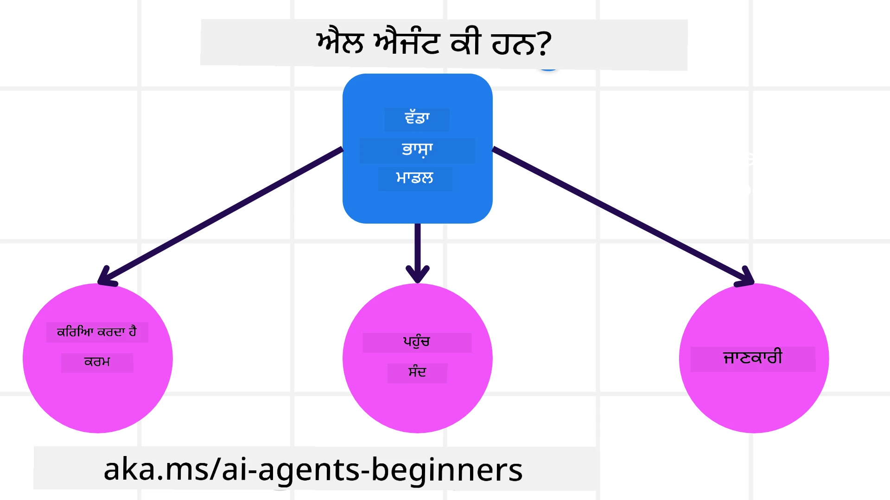
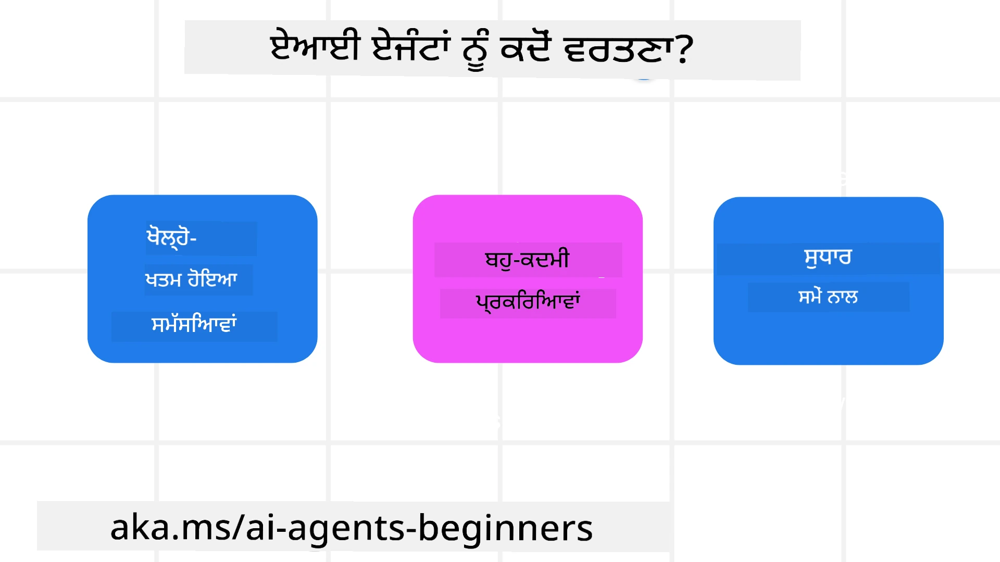

> _(ਉਪਰ ਦਿੱਤੀ ਛਵੀ 'ਤੇ ਕਲਿੱਕ ਕਰਕੇ ਇਸ ਪਾਠ ਦਾ ਵੀਡੀਓ ਵੇਖੋ)_

# AI ਏਜੰਟਾਂ ਅਤੇ ਏਜੰਟ ਉਪਯੋਗ ਮਾਮਲੇ ਦਾ ਪਰਿਚਯ

"AI Agents for Beginners" ਕੋਰਸ ਵਿੱਚ ਤੁਹਾਡਾ ਸਵਾਗਤ ਹੈ! ਇਹ ਕੋਰਸ AI ਏਜੰਟ ਬਣਾਉਣ ਲਈ ਮੁਢਲੀ ਜਾਣਕਾਰੀ ਅਤੇ ਲਾਗੂ ਉਦਾਹਰਣ ਪ੍ਰਦਾਨ ਕਰਦਾ ਹੈ।

ਹੋਰ ਸਿੱਖਣ ਵਾਲਿਆਂ ਅਤੇ AI ਏਜੰਟ ਨਿਰਮਾਤਿਆਂ ਨਾਲ ਮਿਲਣ ਅਤੇ ਇਸ ਕੋਰਸ ਬਾਰੇ ਕੋਈ ਵੀ ਸਵਾਲ ਪੁੱਛਣ ਲਈ <a href="https://discord.gg/kzRShWzttr" target="_blank">Azure AI ਡਿਸਕੋਰਡ ਕਮਿਊਨਿਟੀ</a> ਵਿੱਚ ਸ਼ਾਮਿਲ ਹੋਵੋ।

ਇਸ ਕੋਰਸ ਨੂੰ ਸ਼ੁਰੂ ਕਰਨ ਲਈ, ਅਸੀਂ ਪਹਿਲਾਂ ਇਹ ਸਮਝਣ ਦੀ ਕੋਸ਼ਿਸ਼ ਕਰਾਂਗੇ ਕਿ AI ਏਜੰਟ ਕੀ ਹਨ ਅਤੇ ਅਸੀਂ ਉਨ੍ਹਾਂ ਨੂੰ ਆਪਣੇ ਬਣਾਏ ਹੋਏ ਐਪਲੀਕੇਸ਼ਨਾਂ ਅਤੇ ਵਰਕਫਲੋਜ਼ ਵਿੱਚ ਕਿਵੇਂ ਵਰਤ ਸਕਦੇ ਹਾਂ।

## ਪਰਿਚਯ

ਇਸ ਪਾਠ ਵਿੱਚ ਕਵਰ ਕੀਤਾ ਗਿਆ ਹੈ:

- AI ਏਜੰਟ ਕੀ ਹਨ ਅਤੇ ਵੱਖ-ਵੱਖ ਕਿਸਮਾਂ ਦੇ ਏਜੰਟ ਕੌਣ-ਕੌਣ ਹਨ?
- ਕਿਹੜੇ ਉਪਯੋਗ ਮਾਮਲੇ AI ਏਜੰਟਾਂ ਲਈ ਸਭ ਤੋਂ ਵਧੀਆ ਹਨ ਅਤੇ ਇਹ ਸਾਡੀ ਕਿਵੇਂ ਮਦਦ ਕਰ ਸਕਦੇ ਹਨ?
- ਏਜੈਂਟਿਕ ਹੱਲ ਡਿਜ਼ਾਈਨ ਕਰਨ ਸਮੇਂ ਕੁਛ ਬੁਨਿਆਦੀ ਨਿਰਮਾਣ-ਬਲਾਕ ਕੀ ਹਨ?

## ਸਿੱਖਣ ਦੇ ਲਕਸ਼

ਇਸ ਪਾਠ ਨੂੰ ਪੂਰਾ ਕਰਨ ਤੋਂ ਬਾਅਦ, ਤੁਹਾਨੂੰ ਸਮਰੱਥ ਹੋਣਾ ਚਾਹੀਦਾ ਹੈ:

- AI ਏਜੰਟ ਦੀਆਂ ਸੰਕਲਪਨਾਵਾਂ ਨੂੰ ਸਮਝਣਾ ਅਤੇ ਇਹ ਹੋਰ AI ਹੱਲਾਂ ਤੋਂ ਕਿਵੇਂ ਵੱਖਰੇ ਹਨ।
- AI ਏਜੰਟਾਂ ਨੂੰ ਸਭ ਤੋਂ ਪ੍ਰਭਾਵਸ਼ਾਲੀ ਢੰਗ ਨਾਲ ਲਾਗੂ ਕਰਨਾ।
- ਉਪਭੋਗਤਿਆਂ ਅਤੇ ਗ੍ਰਾਹਕਾਂ ਦੋਹਾਂ ਲਈ ਉਤਪਾਦਕ ਤਰੀਕੇ ਨਾਲ ਏਜੈਂਟਿਕ ਹੱਲ ਡਿਜ਼ਾਈਨ ਕਰਨਾ।

## AI ਏਜੰਟਾਂ ਦੀ ਪਰਿਭਾਸ਼ਾ ਅਤੇ AI ਏਜੰਟਾਂ ਦੇ ਪ੍ਰਕਾਰ

### AI ਏਜੰਟ ਕੀ ਹਨ?

AI ਏਜੰਟ ਉਹ **ਪ੍ਰਣਾਲੀਆਂ** ਹਨ ਜੋ **ਵੱਡੇ ਭਾਸ਼ਾ ਮਾਡਲ(LLMs)** ਨੂੰ **ਕਾਰਵਾਈ ਕਰਨ** ਯੋਗ ਬਨਾਉਂਦੀਆਂ ਹਨ ਜਦੋਂ ਉਹਨਾਂ ਨੂੰ ਟੂਲਾਂ ਅਤੇ ਗਿਆਨ ਤੱਕ ਪਹੁੰਚ ਦਿੱਤੀ ਜਾਂਦੀ ਹੈ।

ਆਓ ਇਸ ਪਰਿਭਾਸ਼ਾ ਨੂੰ ਛੋਟੇ ਹਿੱਸਿਆਂ ਵਿੱਚ ਵੰਡੀਏ:

- **ਪ੍ਰਣਾਲੀ** - ਏਜੰਟਾਂ ਨੂੰ ਸਿਰਫ਼ ਇੱਕ ਘਟਕ ਵਜੋਂ ਨਹੀਂ, ਬਲਕੇ ਕਈ ਘਟਕਾਂ ਵਾਲੀ ਇੱਕ ਪ੍ਰਣਾਲੀ ਵਜੋਂ ਸੋਚਣਾ ਮਹੱਤਵਪੂਰਨ ਹੈ। ਬੁਨਿਆਦੀ ਪੱਧਰ 'ਤੇ, ਇੱਕ AI ਏਜੰਟ ਦੇ ਘਟਕ ਹਨ:
  - **Environment** - ਉਹ ਪਰਿਭਾਸ਼ਿਤ ਖੇਤਰ ਜਿੱਥੇ AI ਏਜੰਟ ਕੰਮ ਕਰ ਰਿਹਾ ਹੈ। ਉਦਾਹਰਨ ਲਈ, ਜੇ ਸਾਡੇ ਕੋਲ ਇੱਕ ਯਾਤਰਾ ਬੁੱਕਿੰਗ AI ਏਜੰਟ ਹੈ, ਤਾਂ Environment ਉਹ ਯਾਤਰਾ ਬੁੱਕਿੰਗ ਸਿਸਟਮ ਹੋ ਸਕਦਾ ਹੈ ਜਿਸਦਾ ਇਸਤੇਮਾਲ ਏਜੰਟ ਕੰਮ ਪੂਰਾ ਕਰਨ ਲਈ ਕਰਦਾ ਹੈ।
  - **Sensors** - Environments ਕੋਲ ਜਾਣਕਾਰੀ ਹੁੰਦੀ ਹੈ ਅਤੇ ਫੀਡਬੈਕ ਪ੍ਰਦਾਨ ਕਰਦੀ ਹੈ। AI ਏਜੰਟ ਇਸ ਜਾਣਕਾਰੀ ਨੂੰ ਇਕੱਠਾ ਕਰਨ ਅਤੇ ਵਰਤਮਾਨ ਸਥਿਤੀ ਕੀ ਹੈ ਇਹ ਸਮਝਣ ਲਈ ਸੈਂਸਰਾਂ ਦਾ ਉਪਯੋਗ ਕਰਦੇ ਹਨ। ਯਾਤਰਾ ਬੁੱਕਿੰਗ ਏਜੰਟ ਦੇ ਉਦਾਹਰਨ ਵਿੱਚ, ਯਾਤਰਾ ਬੁੱਕਿੰਗ ਸਿਸਟਮ ਹੋਟਲ ਦੀ ਉਪਲਬਧਤਾ ਜਾਂ ਉਡਾਣਾਂ ਦੀ ਕੀਮਤ ਵਰਗੀਆਂ ਜਾਣਕਾਰੀਆਂ ਪ੍ਰਦਾਨ ਕਰ ਸਕਦਾ ਹੈ।
  - **Actuators** - ਜਦੋਂ AI ਏਜੰਟ ਨੂੰ Environment ਦੀ ਵਰਤਮਾਨ ਸਥਿਤੀ ਮਿਲ ਜਾਂਦੀ ਹੈ, ਤਾਂ ਮੌਜੂਦਾ ਟਾਸਕ ਲਈ ਏਜੰਟ ਇਹ ਨਿਰਣය ਕਰਦਾ ਹੈ ਕਿ Environment ਨੂੰ ਬਦਲਣ ਲਈ ਕਿਹੜੀ ਕਾਰਵਾਈ करनी ਹੈ। ਯਾਤਰਾ ਬੁੱਕਿੰਗ ਏਜੰਟ ਲਈ, ਇਹ ਯੂਜ਼ਰ ਲਈ ਉਪਲਬਧ ਕਮਰਾ ਬੁੱਕ ਕਰਨਾ ਹੋ ਸਕਦਾ ਹੈ।

**ਵੱਡੇ ਭਾਸ਼ਾ ਮਾਡਲ(LLMs)** - ਏਜੰਟਾਂ ਦਾ ਸੰਕਲਪ LLMs ਦੇ ਬਣਨ ਤੋਂ ਪਹਿਲਾਂ ਵੀ ਮੌਜੂਦ ਸੀ। LLMs ਨਾਲ AI ਏਜੰਟ ਬਣਾਉਣ ਦਾ ਫਾਇਦਾ ਇਹ ਹੈ ਕਿ ਇਹ ਮਨੁੱਖੀ ਭਾਸ਼ਾ ਅਤੇ ਡੇਟਾ ਨੂੰ ਸਮਝਣ ਦੀ ਸਮਰੱਥਾ ਰੱਖਦੇ ਹਨ। ਇਹ ਸਮਰੱਥਾ LLMs ਨੂੰ Environment ਦੀ ਜਾਣਕਾਰੀ ਵਿਆਖਿਆ ਕਰਨ ਅਤੇ Environment ਨੂੰ ਬਦਲਣ ਲਈ ਯੋਜਨਾ ਬਣਾਉਣ ਯੋਗ ਬਨਾਉਂਦੀ ਹੈ।

**ਕਾਰਵਾਈ ਕਰਨ** - AI ਏਜੰਟ ਪ੍ਰਣਾਲੀਆਂ ਦੇ ਬਾਹਰ, LLMs ਉਹਨਾਂ ਪਰਿਸਥਿਤੀਆਂ ਤੱਕ ਸੀਮਤ ਹੁੰਦੇ ਹਨ ਜਿੱਥੇ ਕਾਰਵਾਈ ਵਰਤੋਂਕਾਰ ਦੇ ਪ੍ਰੋਮਪਟ ਦੇ ਆਧਾਰ 'ਤੇ ਸਮੱਗਰੀ ਜਾਂ ਜਾਣਕਾਰੀ ਬਣਾਉਣਾ ਹੁੰਦੀ ਹੈ। AI ਏਜੰਟ ਪ੍ਰਣਾਲੀਆਂ ਵਿੱਚ, LLMs ਵਰਤੋਂਕਾਰ ਦੀ ਬੇਨਤੀ ਨੂੰ ਵਿਆਖਿਆ ਕਰਕੇ ਅਤੇ ਆਪਣੀ Environment ਵਿੱਚ ਉਪਲਬਧ ਟੂਲਾਂ ਦਾ ਉਪਯੋਗ ਕਰਕੇ ਟਾਸਕ ਪੂਰੇ ਕਰ ਸਕਦੇ ਹਨ।

**ਟੂਲਾਂ ਤੱਕ ਪਹੁੰਚ** - LLM ਕੋਲ ਕਿਹੜੇ ਟੂਲਾਂ ਦੀ ਪਹੁੰਚ ਹੈ, ਇਹ ਪਰਿਭਾਸ਼ਿਤ ਹੁੰਦਾ ਹੈ 1) ਜਿਸ Environment ਵਿੱਚ ਉਹ ਚੱਲ ਰਿਹਾ ਹੈ ਅਤੇ 2) AI ਏਜੰਟ ਦੇ ਡਿਵੈਲਪਰ ਦੁਆਰਾ। ਸਾਡੀ ਯਾਤਰਾ ਏਜੰਟ ਉਦਾਹਰਨ ਲਈ, ਏਜੰਟ ਦੇ ਟੂਲ ਬੁੱਕਿੰਗ ਸਿਸਟਮ ਵਿੱਚ ਉਪਲਬਧ ਓਪਰੇਸ਼ਨਾਂ ਦੁਆਰਾ ਸੀਮਿਤ ਹਨ, ਅਤੇ/ਜਾਂ ਡਿਵੈਲਪਰ ਏਜੰਟ ਦੀ ਟੂਲ ਪਹੁੰਚ ਨੂੰ ਉਦਾਹਰਨ ਲਈ ਫਲਾਈਟਾਂ ਤੱਕ ਸੀਮਿਤ ਕਰ ਸਕਦਾ ਹੈ।

**ਮੇਮੋਰੀ+ਗਿਆਨ** - ਗੱਲਬਾਤ ਦੇ ਸੰਦਰਭ ਵਿੱਚ ਮੇਮੋਰੀ ਲਘੂ-ਕਾਲੀਨ ਹੋ ਸਕਦੀ ਹੈ। ਲੰਬੇ ਸਮੇਂ ਲਈ, Environment ਦੁਆਰਾ ਪ੍ਰਦਾਨ ਕੀਤੀ ਗਈ ਜਾਣਕਾਰੀ ਤੋਂ ਬਾਹਰ, AI ਏਜੰਟ ਹੋਰ ਪ੍ਰਣਾਲੀਆਂ, ਸੇਵਾਵਾਂ, ਟੂਲਾਂ ਅਤੇ ਇੱਥੋਂ ਤੱਕ ਕਿ ਹੋਰ ਏਜੰਟਾਂ ਤੋਂ ਵੀ ਗਿਆਨ ਪ੍ਰਾਪਤ ਕਰ ਸਕਦੇ ਹਨ। ਯਾਤਰਾ ਏਜੰਟ ਉਦਾਹਰਨ ਵਿੱਚ, ਇਹ ਗਿਆਨ ਯੂਜ਼ਰ ਦੀ ਯਾਤਰਾ ਪਸੰਦਾਂ ਬਾਰੇ ਜਾਣਕਾਰੀ ਹੋ ਸਕਦੀ ਹੈ ਜੋ ਕਿਸੇ ਗਾਹਕ ਡਾਟਾਬੇਸ ਵਿੱਚ ਮੌਜੂਦ ਹੈ।

### ਏਜੰਟਾਂ ਦੇ ਵੱਖ-ਵੱਖ ਪ੍ਰਕਾਰ

ਹੁਣ ਜਦੋਂ ਸਾਡੇ ਕੋਲ AI ਏਜੰਟਾਂ ਦੀ ਆਮ ਪਰਿਭਾਸ਼ਾ ਹੈ, ਆਓ ਕੁਝ ਵਿਸ਼ੇਸ਼ ਏਜੰਟ ਕਿਸਮਾਂ ਦੇਖੀਏ ਅਤੇ ਇਹ ਯਾਤਰਾ ਬੁੱਕਿੰਗ AI ਏਜੰਟ ਲਈ ਕਿਵੇਂ ਲਾਗੂ ਹੋਣਗੇ।

| **Agent Type**                | **Description**                                                                                                                       | **Example**                                                                                                                                                                                                                   |
| ----------------------------- | ------------------------------------------------------------------------------------------------------------------------------------- | ----------------------------------------------------------------------------------------------------------------------------------------------------------------------------------------------------------------------------- |
| **Simple Reflex Agents**      | Perform immediate actions based on predefined rules.                                                                                  | Travel agent interprets the context of the email and forwards travel complaints to customer service.                                                                                                                          |
| **Model-Based Reflex Agents** | Perform actions based on a model of the world and changes to that model.                                                              | Travel agent prioritizes routes with significant price changes based on access to historical pricing data.                                                                                                             |
| **Goal-Based Agents**         | Create plans to achieve specific goals by interpreting the goal and determining actions to reach it.                                  | Travel agent books a journey by determining necessary travel arrangements (car, public transit, flights) from the current location to the destination.                                                                                |
| **Utility-Based Agents**      | Consider preferences and weigh tradeoffs numerically to determine how to achieve goals.                                               | Travel agent maximizes utility by weighing convenience vs. cost when booking travel.                                                                                                                                          |
| **Learning Agents**           | Improve over time by responding to feedback and adjusting actions accordingly.                                                        | Travel agent improves by using customer feedback from post-trip surveys to make adjustments to future bookings.                                                                                                               |
| **Hierarchical Agents**       | Feature multiple agents in a tiered system, with higher-level agents breaking tasks into subtasks for lower-level agents to complete. | Travel agent cancels a trip by dividing the task into subtasks (for example, canceling specific bookings) and having lower-level agents complete them, reporting back to the higher-level agent.                                     |
| **Multi-Agent Systems (MAS)** | Agents complete tasks independently, either cooperatively or competitively.                                                           | Cooperative: Multiple agents book specific travel services such as hotels, flights, and entertainment. Competitive: Multiple agents manage and compete over a shared hotel booking calendar to book customers into the hotel. |

## ਕਦੋਂ AI ਏਜੰਟ ਵਰਤਣੇ

ਪਹਿਲਾਂ ਦੇ ਸੈਕਸ਼ਨ ਵਿੱਚ, ਅਸੀਂ ਯਾਤਰਾ ਏਜੰਟ ਉਪਯੋਗ-ਕੇਸ ਦੀ ਵਰਤੋਂ ਕਰਕੇ ਵੱਖ-ਵੱਖ ਕਿਸਮਾਂ ਦੇ ਏਜੰਟਾਂ ਨੂੰ ਯਾਤਰਾ ਬੁੱਕਿੰਗ ਦੇ ਵੱਖ-ਵੱਖ ਸਿਨਾਰਿਓਜ਼ ਵਿੱਚ ਕਿਵੇਂ ਵਰਤਿਆ ਜਾ ਸਕਦਾ ਹੈ, ਸਮਝਾਇਆ। ਅਸੀਂ ਇਸ ਐਪਲੀਕੇਸ਼ਨ ਨੂੰ ਕੋਰਸ ਭਰ ਵਿੱਚ ਵਰਤਦੇ ਰਹਾਂਗੇ।

ਆਓ ਉਹ ਕਿਸਮਾਂ ਦੇ ਉਪਯੋਗ ਮਾਮਲੇ ਵੇਖੀਏ ਜਿਨ੍ਹਾਂ ਲਈ AI ਏਜੰਟ ਸਭ ਤੋਂ ਵਧੀਆ ਹਨ:

- **ਖੁੱਲ੍ਹੇ-ਅੰਤ ਵਾਲੀਆਂ ਸਮੱਸਿਆਵਾਂ** - LLM ਨੂੰ ਜ਼ਰੂਰੀ ਕਦਮ ਨਿਰਧਾਰਿਤ ਕਰਨ ਦੀ ਆਗਿਆ ਦੇਣੀ ਉਚਿਤ ਹੁੰਦੀ ਹੈ ਕਿਉਂਕਿ ਇਨ੍ਹਾਂ ਨੂੰ ਹਮੇਸ਼ਾ ਵਰਕਫਲੋ ਵਿੱਚ ਹਾਰਡਕੋਡ ਨਹੀਂ ਕੀਤਾ ਜਾ ਸਕਦਾ।
- **ਕਈ ਕਦਮੀ ਪ੍ਰਕਿਰਿਆਵਾਂ** - ਉਹ ਟਾਸਕ ਜਿਨ੍ਹਾਂ ਵਿੱਚ ਕੁਝ ਇਸ ਤਰ੍ਹਾਂ ਦੀ ਜਟਿਲਤਾ ਹੁੰਦੀ ਹੈ ਕਿ AI ਏਜੰਟ ਨੂੰ ਇਕੋ-ਵਾਰੀ ਜਾਣਕਾਰੀ ਪ੍ਰਾਪਤ ਕਰਨ ਦੀ ਬਜਾਏ, ਕਈ ਦੌਰਾਂ ਵਿੱਚ ਟੂਲਾਂ ਜਾਂ ਜਾਣਕਾਰੀ ਦੀ ਲੋੜ ਹੁੰਦੀ ਹੈ।  
- **ਸਮੇਂ ਦੇ ਨਾਲ ਸੁਧਾਰ** - ਉਹ ਟਾਸਕ ਜਿੱਥੇ ਏਜੰਟ ਸਮੇਂ ਦੇ ਨਾਲ ਆਪਣੇ Environment ਜਾਂ ਯੂਜ਼ਰਾਂ ਤੋਂ ਪ੍ਰਾਪਤ ਫੀਡਬੈਕ ਲੈ ਕੇ ਸੁਧਾਰ ਕਰ ਸਕਦਾ ਹੈ ਤਾਂ ਕਿ ਵਧੀਆ ਉਪਯੋਗਿਤਾ ਪ੍ਰਦਾਨ ਕੀਤੀ ਜਾ ਸਕੇ।

ਅਸੀਂ Building Trustworthy AI Agents ਪਾਠ ਵਿੱਚ AI ਏਜੰਟਾਂ ਦੇ ਉਪਯੋਗ ਬਾਰੇ ਹੋਰ ਵਿਚਾਰ ਸ਼ਾਮਿਲ ਕਰਦੇ ਹਾਂ।

## ਏਜੈਂਟਿਕ ਹੱਲਾਂ ਦੇ ਬੁਨਿਆਦੀ ਤੱਤ

### ਏਜੰਟ ਵਿਕਾਸ

AI ਏਜੰਟ ਪ੍ਰਣਾਲੀ ਡਿਜ਼ਾਈਨ ਕਰਨ ਦਾ ਪਹਿਲਾ ਕਦਮ ਟੂਲਾਂ, ਕਾਰਵਾਈਆਂ ਅਤੇ ਵਿਵਹਾਰਾਂ ਦੀ ਪਰਿਭਾਸ਼ਾ ਕਰਨਾ ਹੈ। ਇਸ ਕੋਰਸ ਵਿੱਚ, ਅਸੀਂ ਆਪਣੇ ਏਜੰਟਾਂ ਨੂੰ ਡਿਫਾਈਨ ਕਰਨ ਲਈ **Azure AI Agent Service** ਦੇ ਉਪਯੋਗ 'ਤੇ ਕੇਂਦਰਿਤ ਹਾਂ। ਇਹ ਕੁਝ ਵਿਸ਼ੇਸ਼ਤਾਵਾਂ ਪ੍ਰਦਾਨ ਕਰਦਾ ਹੈ ਜਿਵੇਂ:

- OpenAI, Mistral, ਅਤੇ Llama ਵਰਗੇ Open ਮਾਡਲਾਂ ਦੀ ਚੋਣ
- Tripadvisor ਵਰਗੇ ਪ੍ਰਦਾਤਾਵਾਂ ਰਾਹੀਂ ਲਾਇਸੰਸ ਪ੍ਰਾਪਤ ਡੇਟਾ ਦੀ ਵਰਤੋਂ
- ਸਟੈਂਡਰਡਾਈਜ਼ਡ OpenAPI 3.0 ਟੂਲਾਂ ਦੀ ਵਰਤੋਂ

### ਏਜੈਂਟਿਕ ਰੂਪਰੇਖਾ

LLMs ਨਾਲ ਸੰਚਾਰ ਪ੍ਰੋਮਪਟਾਂ ਰਾਹੀਂ ਹੁੰਦਾ ਹੈ। ਏਜੰਟਾਂ ਦੀ ਅਰਧ-ਸਵੈ-ਚਾਲਤ ਕੁਦਰਤ ਦੇ ਕਾਰਨ, Environment ਵਿੱਚ ਹੋਏ ਬਦਲਾਅ ਤੋਂ ਬਾਅਦ ਹਮੇਸ਼ਾ LLM ਨੂੰ ਹੱਥੋਂ ਦੁਬਾਰਾ ਪ੍ਰੋਮਪਟ ਕਰਨਾ ਸੰਭਵ ਜਾਂ ਲਾਜ਼ਮੀ ਨਹੀਂ ਹੁੰਦਾ। ਅਸੀਂ ਐਸੇ **ਏਜੈਂਟਿਕ ਰੂਪਰੇਖਾ** ਵਰਤਦੇ ਹਾਂ ਜੋ ਸਾਡੇ ਨੂੰ ਕਈ ਕਦਮਾਂ ਵਿੱਚ LLM ਨੂੰ ਵਧੇਰੇ ਸਕੇਲਯੋਗ ਢੰਗ ਨਾਲ ਪ੍ਰੋਮਪਟ ਕਰਨ ਦੀ ਆਗਿਆ ਦਿੰਦੇ ਹਨ।

ਇਹ ਕੋਰਸ ਕੁਝ ਮੌਜੂਦਾ ਪ੍ਰਸਿੱਧ ਏਜੈਂਟਿਕ ਰੂਪਰੇਖਾਵਾਂ ਵਿੱਚ ਵੰਡਿਆ ਗਿਆ ਹੈ।

### ਏਜੈਂਟਿਕ ਫਰੇਮਵਰਕ

ਏਜੈਂਟਿਕ ਫਰੇਮਵਰਕ ਵਿਕਾਸਕਾਰਾਂ ਨੂੰ ਕੋਡ ਰਾਹੀਂ ਏਜੈਂਟਿਕ ਰੂਪਰੇਖਾ ਲਾਗੂ ਕਰਨ ਦੀ ਆਗਿਆ ਦਿੰਦੇ ਹਨ। ਇਹ ਫਰੇਮਵਰਕ ਟੈਂਪਲੇਟ, ਪਲੱਗਇਨ ਅਤੇ ਬਹਿਤਰ AI ਏਜੰਟ ਸਹਿਯੋਗ ਲਈ ਟੂਲ ਪ੍ਰਦਾਨ ਕਰਦੇ ਹਨ। ਇਹ ਲਾਭ AI ਏਜੰਟ ਪ੍ਰਣਾਲੀਆਂ ਦੀ ਬਿਹਤਰ ਨਿਗਰਾਨੀ ਅਤੇ ਟ੍ਰਬਲਸ਼ੂਟਿੰਗ ਦੀ ਸਮਰੱਥਾ ਪ੍ਰਦਾਨ ਕਰਦੇ ਹਨ।

ਇਸ ਕੋਰਸ ਵਿੱਚ, ਅਸੀਂ ਪ੍ਰੋਡਕਸ਼ਨ-ਤੈਅਰ AI ਏਜੰਟ ਬਣਾਉਣ ਲਈ Microsoft Agent Framework (MAF) ਦੀ ਖੋਜ ਕਰਾਂਗੇ।

## ਨਮੂਨਾ ਕੋਡ

- Python: [ਏਜੈਂਟ ਫਰੇਮਵਰਕ](./code_samples/01-python-agent-framework.ipynb)
- .NET: [ਏਜੈਂਟ ਫਰੇਮਵਰਕ](./code_samples/01-dotnet-agent-framework.md)

## AI ਏਜੰਟਾਂ ਬਾਰੇ ਹੋਰ ਸਵਾਲ ਹਨ?

ਹੋਰ ਸਿੱਖਣ ਵਾਲਿਆਂ ਨਾਲ ਮਿਲਣ, ਆਫਿਸ ਆਵਰਜ਼ ਵਿੱਚ ਹਾਜਿਰ ਹੋਣ ਅਤੇ ਆਪਣੇ AI ਏਜੰਟ ਸਵਾਲਾਂ ਦੇ ਜਵਾਬ ਲੈਣ ਲਈ [Microsoft Foundry Discord](https://aka.ms/ai-agents/discord) ਵਿੱਚ ਸ਼ਾਮਿਲ ਹੋਵੋ।

## ਪਿਛਲਾ ਪਾਠ

[ਕੋर्स ਸੈਟਅਪ](../00-course-setup/README.md)

## ਅਗਲਾ ਪਾਠ

[ਏਜੈਂਟਿਕ ਫਰੇਮਵਰਕਸ ਦੀ ਖੋਜ](../02-explore-agentic-frameworks/README.md)

---

<!-- CO-OP TRANSLATOR DISCLAIMER START -->
ਸਪੱਸ਼ਟੀਕਰਨ:
ਇਹ ਦਸਤਾਵੇਜ਼ ਏਆਈ ਅਨੁਵਾਦ ਸੇਵਾ [Co-op Translator](https://github.com/Azure/co-op-translator) ਦੀ ਵਰਤੋਂ ਕਰਕੇ ਅਨੁਵਾਦ ਕੀਤਾ ਗਿਆ ਹੈ। ਜਦੋਂ ਕਿ ਅਸੀਂ ਸ਼ੁੱਧਤਾ ਲਈ ਕੋਸ਼ਿਸ਼ ਕਰਦੇ ਹਾਂ, ਕਿਰਪਾ ਕਰਕੇ ਧਿਆਨ ਵਿੱਚ ਰੱਖੋ ਕਿ ਆਟੋਮੇਟਿਕ ਅਨੁਵਾਦਾਂ ਵਿੱਚ ਗਲਤੀਆਂ ਜਾਂ ਅਣਸਹੀਤੀਆਂ ਹੋ ਸਕਦੀਆਂ ਹਨ। ਮੂਲ ਦਸਤਾਵੇਜ਼ ਆਪਣੀ ਮੂਲ ਭਾਸ਼ਾ ਵਿੱਚ ਅਧਿਕਾਰਤ ਸਰੋਤ ਮੰਨਿਆ ਜਾਣਾ ਚਾਹੀਦਾ ਹੈ। ਸੰਵੇਦਨਸ਼ੀਲ ਜਾਂ ਮਹੱਤਵਪੂਰਨ ਜਾਣਕਾਰੀ ਲਈ, ਪੇਸ਼ੇਵਰ ਮਨੁੱਖੀ ਅਨੁਵਾਦ ਦੀ ਸਿਫਾਰਿਸ਼ ਕੀਤੀ ਜਾਂਦੀ ਹੈ। ਅਸੀਂ ਇਸ ਅਨੁਵਾਦ ਦੀ ਵਰਤੋਂ ਤੋਂ ਪੈਦਾ ਹੋਣ ਵਾਲੀਆਂ ਕਿਸੇ ਵੀ ਗਲਤਫਹਮੀ ਜਾਂ ਗਲਤ ਵਿਆਖਿਆ ਲਈ ਜ਼ਿੰਮੇਵਾਰ ਨਹੀਂ ਹਾਂ।
<!-- CO-OP TRANSLATOR DISCLAIMER END -->