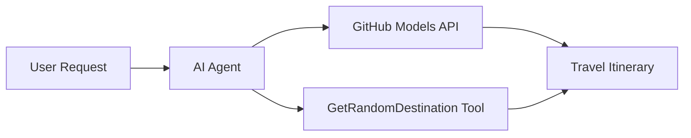

<!--
CO_OP_TRANSLATOR_METADATA:
{
  "original_hash": "23afd9be7b6ba5b69a44c3b6a78e07f6",
  "translation_date": "2025-11-06T10:03:22+00:00",
  "source_file": "01-intro-to-ai-agents/code_samples/01-dotnet-agent-framework.md",
  "language_code": "pa"
}
-->
# 🌍 ਮਾਈਕਰੋਸਾਫਟ ਏਜੰਟ ਫਰੇਮਵਰਕ (.NET) ਨਾਲ AI ਯਾਤਰਾ ਏਜੰਟ

## 📋 ਸਨਰੀਓ ਝਲਕ

ਇਹ ਨੋਟਬੁੱਕ ਮਾਈਕਰੋਸਾਫਟ ਏਜੰਟ ਫਰੇਮਵਰਕ ਲਈ .NET ਦੀ ਵਰਤੋਂ ਕਰਕੇ ਇੱਕ ਬੁੱਧੀਮਾਨ ਯਾਤਰਾ ਯੋਜਨਾ ਬਣਾਉਣ ਵਾਲੇ ਏਜੰਟ ਨੂੰ ਬਣਾਉਣ ਦਾ ਪ੍ਰਦਰਸ਼ਨ ਕਰਦੀ ਹੈ। ਇਹ ਏਜੰਟ ਦੁਨੀਆ ਭਰ ਦੇ ਕਈ ਗੰਤੀ ਸਥਾਨਾਂ ਲਈ ਵਿਅਕਤੀਗਤ ਦਿਨ-ਯਾਤਰਾ ਯੋਜਨਾਵਾਂ ਸਵੈਚਾਲਿਤ ਤੌਰ 'ਤੇ ਤਿਆਰ ਕਰ ਸਕਦਾ ਹੈ।

**ਮੁੱਖ ਸਮਰੱਥਾਵਾਂ:**
- 🎲 **ਰੈਂਡਮ ਗੰਤੀ ਚੋਣ**: ਛੁੱਟੀਆਂ ਦੇ ਸਥਾਨ ਚੁਣਨ ਲਈ ਇੱਕ ਕਸਟਮ ਟੂਲ ਦੀ ਵਰਤੋਂ ਕਰਦਾ ਹੈ
- 🗺️ **ਬੁੱਧੀਮਾਨ ਯਾਤਰਾ ਯੋਜਨਾ**: ਵਿਸਥਾਰਿਤ ਦਿਨ-ਦਰ-ਦਿਨ ਯੋਜਨਾਵਾਂ ਬਣਾਉਂਦਾ ਹੈ
- 🔄 **ਰਿਅਲ-ਟਾਈਮ ਸਟ੍ਰੀਮਿੰਗ**: ਤੁਰੰਤ ਅਤੇ ਸਟ੍ਰੀਮਿੰਗ ਜਵਾਬਾਂ ਦਾ ਸਮਰਥਨ ਕਰਦਾ ਹੈ
- 🛠️ **ਕਸਟਮ ਟੂਲ ਇੰਟੀਗ੍ਰੇਸ਼ਨ**: ਏਜੰਟ ਦੀ ਸਮਰੱਥਾ ਨੂੰ ਵਧਾਉਣ ਦਾ ਪ੍ਰਦਰਸ਼ਨ ਕਰਦਾ ਹੈ

## 🔧 ਤਕਨੀਕੀ ਆਰਕੀਟੈਕਚਰ

### ਮੁੱਖ ਤਕਨੀਕਾਂ
- **ਮਾਈਕਰੋਸਾਫਟ ਏਜੰਟ ਫਰੇਮਵਰਕ**: AI ਏਜੰਟ ਵਿਕਾਸ ਲਈ .NET ਦਾ ਨਵਾਂ ਰੂਪ
- **GitHub ਮਾਡਲ ਇੰਟੀਗ੍ਰੇਸ਼ਨ**: GitHub ਦੇ AI ਮਾਡਲ ਇੰਫਰੈਂਸ ਸੇਵਾ ਦੀ ਵਰਤੋਂ ਕਰਦਾ ਹੈ
- **OpenAI API ਅਨੁਕੂਲਤਾ**: ਕਸਟਮ ਐਂਡਪੋਇੰਟਸ ਨਾਲ OpenAI ਕਲਾਇੰਟ ਲਾਇਬ੍ਰੇਰੀਆਂ ਦੀ ਵਰਤੋਂ ਕਰਦਾ ਹੈ
- **ਸੁਰੱਖਿਅਤ ਸੰਰਚਨਾ**: ਵਾਤਾਵਰਣ-ਅਧਾਰਿਤ API ਕੁੰਜੀ ਪ੍ਰਬੰਧਨ

### ਮੁੱਖ ਹਿੱਸੇ
1. **AIAgent**: ਮੁੱਖ ਏਜੰਟ ਆਰਕੈਸਟਰੇਟਰ ਜੋ ਗੱਲਬਾਤ ਦੇ ਪ੍ਰਵਾਹ ਨੂੰ ਸੰਭਾਲਦਾ ਹੈ
2. **ਕਸਟਮ ਟੂਲ**: `GetRandomDestination()` ਫੰਕਸ਼ਨ ਜੋ ਏਜੰਟ ਲਈ ਉਪਲਬਧ ਹੈ
3. **ਚੈਟ ਕਲਾਇੰਟ**: GitHub ਮਾਡਲ-ਸਹਾਇਕ ਗੱਲਬਾਤ ਇੰਟਰਫੇਸ
4. **ਸਟ੍ਰੀਮਿੰਗ ਸਮਰਥਨ**: ਰਿਅਲ-ਟਾਈਮ ਜਵਾਬ ਤਿਆਰ ਕਰਨ ਦੀ ਸਮਰੱਥਾ

### ਇੰਟੀਗ੍ਰੇਸ਼ਨ ਪੈਟਰਨ


## 🚀 ਸ਼ੁਰੂਆਤ ਕਰਨਾ

**ਪੂਰਵ ਸ਼ਰਤਾਂ:**
- .NET 10.0 ਜਾਂ ਇਸ ਤੋਂ ਉੱਚਾ
- GitHub ਮਾਡਲ API ਐਕਸੈਸ ਟੋਕਨ
- `.env` ਫਾਇਲ ਵਿੱਚ ਸੰਰਚਿਤ ਵਾਤਾਵਰਣ ਵੈਰੀਏਬਲ

**ਲੋੜੀਂਦੇ ਵਾਤਾਵਰਣ ਵੈਰੀਏਬਲ:**
```env
GITHUB_TOKEN=your_github_token
GITHUB_ENDPOINT=https://models.inference.ai.azure.com
GITHUB_MODEL_ID=gpt-4o-mini
```

ਹੇਠਾਂ ਦਿੱਤੇ ਕੋਡ ਨਮੂਨੇ ਨੂੰ ਲਗਾਤਾਰ ਚਲਾਓ ਤਾਂ ਜੋ ਯਾਤਰਾ ਏਜੰਟ ਨੂੰ ਕਾਰਵਾਈ ਵਿੱਚ ਦੇਖਿਆ ਜਾ ਸਕੇ!

---

## .NET ਸਿੰਗਲ ਫਾਇਲ ਐਪ: AI ਯਾਤਰਾ ਏਜੰਟ ਉਦਾਹਰਨ

ਪੂਰਾ ਚਲਣਯੋਗ ਕੋਡ ਨਮੂਨਾ ਦੇਖਣ ਲਈ `01-dotnet-agent-framework.cs` ਨੂੰ ਵੇਖੋ।

```bash
dotnet run 01-dotnet-agent-framework.cs
```

### ਨਮੂਨਾ ਕੋਡ

```csharp
static string GetRandomDestination()
{
    var destinations = new List<string>
    {
        "Paris, France",
        "Tokyo, Japan",
        "New York City, USA",
        "Sydney, Australia",
        "Rome, Italy",
        "Barcelona, Spain",
        "Cape Town, South Africa",
        "Rio de Janeiro, Brazil",
        "Bangkok, Thailand",
        "Vancouver, Canada"
    };
    var random = new Random();
    int index = random.Next(destinations.Count);
    return destinations[index];
}

// Extract configuration from environment variables
var github_endpoint = Environment.GetEnvironmentVariable("GITHUB_ENDPOINT") ?? throw new InvalidOperationException("GITHUB_ENDPOINT is not set.");
var github_model_id = Environment.GetEnvironmentVariable("GITHUB_MODEL_ID") ?? "gpt-4o-mini";
var github_token = Environment.GetEnvironmentVariable("GITHUB_TOKEN") ?? throw new InvalidOperationException("GITHUB_TOKEN is not set.");

// Configure OpenAI Client Options
var openAIOptions = new OpenAIClientOptions()
{
    Endpoint = new Uri(github_endpoint)
};

// Initialize OpenAI Client with GitHub Models Configuration
var openAIClient = new OpenAIClient(new ApiKeyCredential(github_token), openAIOptions);

// Create AI Agent with Travel Planning Capabilities
AIAgent agent = openAIClient
    .GetChatClient(github_model_id)
    .CreateAIAgent(
        instructions: "You are a helpful AI Agent that can help plan vacations for customers at random destinations",
        tools: [AIFunctionFactory.Create(GetRandomDestination)]
    );

// Execute Agent: Plan a Day Trip (Non-Streaming)
Console.WriteLine(await agent.RunAsync("Plan me a day trip"));

// Execute Agent: Plan a Day Trip (Streaming Response)
await foreach (var update in agent.RunStreamingAsync("Plan me a day trip"))
{
    Console.Write(update);
}
```

---

**ਅਸਵੀਕਰਤੀ**:  
ਇਹ ਦਸਤਾਵੇਜ਼ AI ਅਨੁਵਾਦ ਸੇਵਾ [Co-op Translator](https://github.com/Azure/co-op-translator) ਦੀ ਵਰਤੋਂ ਕਰਕੇ ਅਨੁਵਾਦ ਕੀਤਾ ਗਿਆ ਹੈ। ਜਦੋਂ ਕਿ ਅਸੀਂ ਸਹੀ ਹੋਣ ਦੀ ਕੋਸ਼ਿਸ਼ ਕਰਦੇ ਹਾਂ, ਕਿਰਪਾ ਕਰਕੇ ਧਿਆਨ ਦਿਓ ਕਿ ਸਵੈਚਾਲਿਤ ਅਨੁਵਾਦਾਂ ਵਿੱਚ ਗਲਤੀਆਂ ਜਾਂ ਅਸੁੱਤੀਆਂ ਹੋ ਸਕਦੀਆਂ ਹਨ। ਮੂਲ ਦਸਤਾਵੇਜ਼ ਨੂੰ ਇਸਦੀ ਮੂਲ ਭਾਸ਼ਾ ਵਿੱਚ ਅਧਿਕਾਰਤ ਸਰੋਤ ਮੰਨਿਆ ਜਾਣਾ ਚਾਹੀਦਾ ਹੈ। ਮਹੱਤਵਪੂਰਨ ਜਾਣਕਾਰੀ ਲਈ, ਪੇਸ਼ੇਵਰ ਮਨੁੱਖੀ ਅਨੁਵਾਦ ਦੀ ਸਿਫਾਰਸ਼ ਕੀਤੀ ਜਾਂਦੀ ਹੈ। ਇਸ ਅਨੁਵਾਦ ਦੀ ਵਰਤੋਂ ਤੋਂ ਪੈਦਾ ਹੋਣ ਵਾਲੇ ਕਿਸੇ ਵੀ ਗਲਤਫਹਿਮੀ ਜਾਂ ਗਲਤ ਵਿਆਖਿਆ ਲਈ ਅਸੀਂ ਜ਼ਿੰਮੇਵਾਰ ਨਹੀਂ ਹਾਂ।