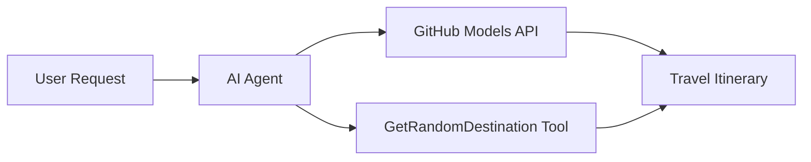

# 🌍 Microsoft Agent Framework (.NET) ਨਾਲ AI ਯਾਤਰਾ ਏਜੰਟ

## 📋 ਸਥਿਤੀ ਦਾ ਜਾਇਜ਼ਾ

ਇਹ ਨੋਟਬੁੱਕ ਦਿਖਾਉਂਦੀ ਹੈ ਕਿ Microsoft Agent Framework ਲਈ .NET ਦੀ ਵਰਤੋਂ ਕਰਕੇ ਇੱਕ ਬੁੱਧੀਮਾਨ ਯਾਤਰਾ ਯੋਜਨਾ ਏਜੰਟ ਕਿਵੇਂ ਬਣਾਇਆ ਜਾ ਸਕਦਾ ਹੈ। ਇਹ ਏਜੰਟ ਦੁਨੀਆ ਭਰ ਦੇ ਰੈਂਡਮ ਸਥਾਨਾਂ ਲਈ ਨਿੱਜੀਕ੍ਰਿਤ ਦਿਨ-ਯਾਤਰਾ ਯੋਜਨਾਵਾਂ ਆਪੋ-ਆਪ ਬਣਾਉਣ ਦੀ ਸਮਰਥਾ ਰੱਖਦਾ ਹੈ।

**ਮੁੱਖ ਸਮਰਥਾਵਾਂ:**
- 🎲 **ਰੈਂਡਮ ਸਥਾਨ ਚੋਣ**: ਛੁੱਟੀਆਂ ਦੇ ਸਥਾਨ ਚੁਣਨ ਲਈ ਇੱਕ ਕਸਟਮ ਟੂਲ ਦੀ ਵਰਤੋਂ ਕਰਦਾ ਹੈ
- 🗺️ **ਬੁੱਧੀਮਾਨ ਯਾਤਰਾ ਯੋਜਨਾ**: ਵਿਸਥਾਰਿਤ ਦਿਨ-ਦਰ-ਦਿਨ ਯੋਜਨਾਵਾਂ ਬਣਾਉਂਦਾ ਹੈ
- 🔄 **ਰਿਅਲ-ਟਾਈਮ ਸਟ੍ਰੀਮਿੰਗ**: ਤੁਰੰਤ ਅਤੇ ਸਟ੍ਰੀਮਿੰਗ ਜਵਾਬਾਂ ਦਾ ਸਮਰਥਨ ਕਰਦਾ ਹੈ
- 🛠️ **ਕਸਟਮ ਟੂਲ ਇੰਟੀਗ੍ਰੇਸ਼ਨ**: ਏਜੰਟ ਦੀ ਸਮਰਥਾ ਨੂੰ ਵਧਾਉਣ ਦਾ ਪ੍ਰਦਰਸ਼ਨ ਕਰਦਾ ਹੈ

## 🔧 ਤਕਨੀਕੀ ਆਰਚਿਟੈਕਚਰ

### ਮੁੱਖ ਤਕਨੀਕਾਂ
- **Microsoft Agent Framework**: AI ਏਜੰਟ ਵਿਕਾਸ ਲਈ .NET ਦਾ ਨਵਾਂ ਨਿਰਵਾਹ
- **GitHub Models Integration**: GitHub ਦੇ AI ਮਾਡਲ ਇੰਫਰੈਂਸ ਸੇਵਾ ਦੀ ਵਰਤੋਂ ਕਰਦਾ ਹੈ
- **OpenAI API Compatibility**: OpenAI ਕਲਾਇੰਟ ਲਾਇਬ੍ਰੇਰੀਆਂ ਨੂੰ ਕਸਟਮ ਐਂਡਪੋਇੰਟਸ ਨਾਲ ਵਰਤਦਾ ਹੈ
- **ਸੁਰੱਖਿਅਤ ਸੰਰਚਨਾ**: ਵਾਤਾਵਰਣ-ਅਧਾਰਿਤ API ਕੁੰਜੀ ਪ੍ਰਬੰਧਨ

### ਮੁੱਖ ਹਿੱਸੇ
1. **AIAgent**: ਮੁੱਖ ਏਜੰਟ ਆਰਕੈਸਟਰੇਟਰ ਜੋ ਗੱਲਬਾਤ ਦੇ ਪ੍ਰਵਾਹ ਨੂੰ ਸੰਭਾਲਦਾ ਹੈ
2. **Custom Tools**: `GetRandomDestination()` ਫੰਕਸ਼ਨ ਜੋ ਏਜੰਟ ਲਈ ਉਪਲਬਧ ਹੈ
3. **Chat Client**: GitHub Models-ਅਧਾਰਿਤ ਗੱਲਬਾਤ ਇੰਟਰਫੇਸ
4. **Streaming Support**: ਰਿਅਲ-ਟਾਈਮ ਜਵਾਬ ਬਣਾਉਣ ਦੀ ਸਮਰਥਾ

### ਇੰਟੀਗ੍ਰੇਸ਼ਨ ਪੈਟਰਨ


## 🚀 ਸ਼ੁਰੂਆਤ ਕਰਨਾ

**ਪੂਰਵ ਸ਼ਰਤਾਂ:**
- .NET 9.0 ਜਾਂ ਇਸ ਤੋਂ ਉੱਚਾ
- GitHub Models API ਐਕਸੈਸ ਟੋਕਨ
- `.env` ਫਾਇਲ ਵਿੱਚ ਸੰਰਚਿਤ ਵਾਤਾਵਰਣ ਵੈਰੀਏਬਲ

**ਲੋੜੀਂਦੇ ਵਾਤਾਵਰਣ ਵੈਰੀਏਬਲ:**
```env
GITHUB_TOKEN=your_github_token
GITHUB_ENDPOINT=https://models.inference.ai.azure.com
GITHUB_MODEL_ID=gpt-4o-mini
```

ਹੇਠਾਂ ਦਿੱਤੇ ਸੈਲਾਂ ਨੂੰ ਕ੍ਰਮਵਾਰ ਚਲਾਓ ਅਤੇ ਯਾਤਰਾ ਏਜੰਟ ਨੂੰ ਕਾਰਵਾਈ ਵਿੱਚ ਦੇਖੋ!

---

## .NET Single File App: AI Travel Agent Example

See `01-dotnet-agent-framework.cs` for the complete runnable code sample.

ਹੇਠਾਂ ਦਿੱਤੇ ਕੋਡ ਨਮੂਨੇ ਨੂੰ ਚਲਾਓ:

```bash
dotnet run 01-dotnet-agent-framework.cs
```

### Sample Code

```csharp
static string GetRandomDestination()
{
    var destinations = new List<string>
    {
        "Paris, France",
        "Tokyo, Japan",
        "New York City, USA",
        "Sydney, Australia",
        "Rome, Italy",
        "Barcelona, Spain",
        "Cape Town, South Africa",
        "Rio de Janeiro, Brazil",
        "Bangkok, Thailand",
        "Vancouver, Canada"
    };
    var random = new Random();
    int index = random.Next(destinations.Count);
    return destinations[index];
}

// Extract configuration from environment variables
var github_endpoint = Environment.GetEnvironmentVariable("GITHUB_ENDPOINT") ?? throw new InvalidOperationException("GITHUB_ENDPOINT is not set.");
var github_model_id = Environment.GetEnvironmentVariable("GITHUB_MODEL_ID") ?? "gpt-4o-mini";
var github_token = Environment.GetEnvironmentVariable("GITHUB_TOKEN") ?? throw new InvalidOperationException("GITHUB_TOKEN is not set.");

// Configure OpenAI Client Options
var openAIOptions = new OpenAIClientOptions()
{
    Endpoint = new Uri(github_endpoint)
};

// Initialize OpenAI Client with GitHub Models Configuration
var openAIClient = new OpenAIClient(new ApiKeyCredential(github_token), openAIOptions);

// Create AI Agent with Travel Planning Capabilities
AIAgent agent = openAIClient
    .GetChatClient(github_model_id)
    .CreateAIAgent(
        instructions: "You are a helpful AI Agent that can help plan vacations for customers at random destinations",
        tools: [AIFunctionFactory.Create(GetRandomDestination)]
    );

// Execute Agent: Plan a Day Trip (Non-Streaming)
Console.WriteLine(await agent.RunAsync("Plan me a day trip"));

// Execute Agent: Plan a Day Trip (Streaming Response)
await foreach (var update in agent.RunStreamingAsync("Plan me a day trip"))
{
    Console.Write(update);
}
```
