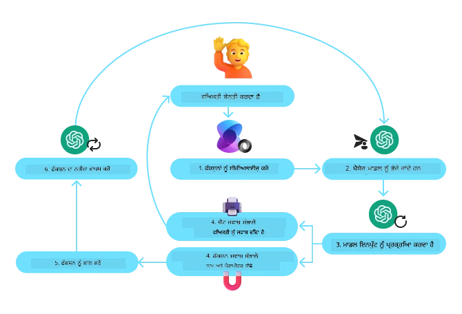
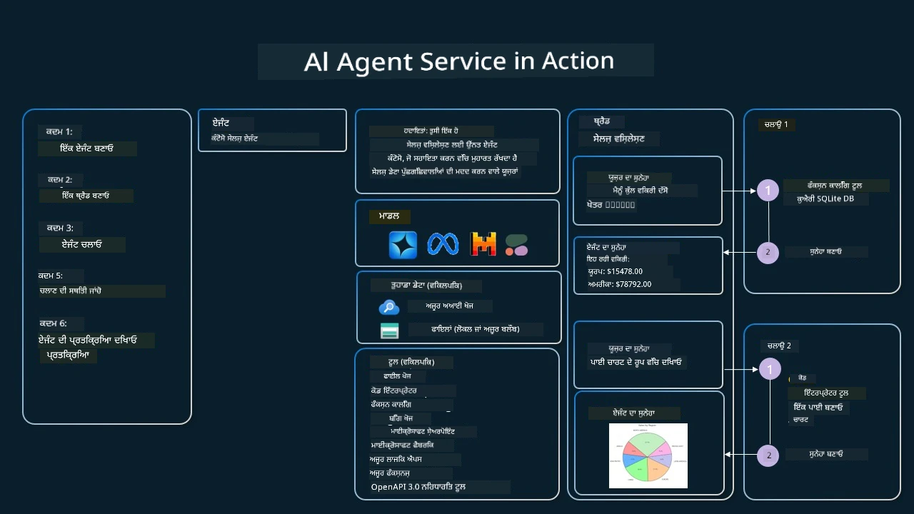

[](https://youtu.be/vieRiPRx-gI?si=cEZ8ApnT6Sus9rhn)

> _(ਇਸ ਪਾਠ ਦੀ ਵੀਡੀਓ ਦੇਖਣ ਲਈ ਉਪਰ ਦਿੱਤੀ ਤਸਵੀਰ 'ਤੇ ਕਲਿੱਕ ਕਰੋ)_

# ਟੂਲ ਯੂਜ਼ ਡਿਜ਼ਾਈਨ ਪੈਟਰਨ

ਟੂਲ ਦਿਲਚਸਪ ਹੁੰਦੇ ਹਨ ਕਿਉਂਕਿ ਇਨ੍ਹਾਂ ਦੇ ਜ਼ਰੀਏ AI ਏਜੰਟਸ ਕੋਲ ਖੁਬ ਵੱਡੇ ਸਕੌਪ ਵਾਲੀ ਸਮਰੱਥਾ ਹੋ ਜਾਂਦੀ ਹੈ। ਸਧਾਰਣ ਐਕਸ਼ਨਾਂ ਦੀ ਸੀਮਿਤ ਸੂਚੀ ਹੋਣ ਦੀ ਥਾਂ, ਟੂਲ ਸ਼ਾਮਲ ਕਰਕੇ, ਏਜੰਟ ਹੁਣ ਵੱਡੇ ਪੱਧਰ ਤੇ ਕੰਮ ਕਰ ਸਕਦਾ ਹੈ। ਇਸ ਚੈਪਟਰ ਵਿੱਚ ਅਸੀਂ ਟੂਲ ਯੂਜ਼ ਡਿਜ਼ਾਈਨ ਪੈਟਰਨ ਬਾਰੇ ਗੱਲ ਕਰਾਂਗੇ, ਜੋ ਦਰਸਾਉਂਦਾ ਹੈ ਕਿ AI ਏਜੰਟ ਕਿਸ ਤਰ੍ਹਾਂ ਖਾਸ ਟੂਲਾਂ ਨੂੰ ਵਰਤ ਕੇ ਆਪਣੇ ਲੱਛਿਆਂ ਨੂੰ ਹਾਸਲ ਕਰ ਸਕਦੇ ਹਨ।

## ਜਾਣ ਪਹਚਾਣ

ਇਸ ਪਾਠ ਵਿੱਚ ਅਸੀਂ ਹੇਠ ਲਿਖੇ ਸਵਾਲਾਂ ਦੇ ਜਵਾਬ ਲੱਭਾਂਗੇ:

- ਟੂਲ ਯੂਜ਼ ਡਿਜ਼ਾਈਨ ਪੈਟਰਨ ਕੀ ਹੈ?
- ਇਹ ਕਿਸ ਕਿਸਮ ਦੇ ਮਾਮਲਿਆਂ ਵਿੱਚ ਲਾਗੂ ਕੀਤਾ ਜਾ ਸਕਦਾ ਹੈ?
- ਇਸ ਡਿਜ਼ਾਈਨ ਪੈਟਰਨ ਨੂੰ ਲਾਗੂ ਕਰਨ ਲਈ ਕਿਹੜੇ ਅੰਗ/ਬਿਲਡਿੰਗ ਬਲਾਕੇ ਲੋੜੀਂਦੇ ਹਨ?
- ਟੂਲ ਯੂਜ਼ ਡਿਜ਼ਾਈਨ ਪੈਟਰਨ ਦੀ ਵਰਤੋਂ ਕਰਕੇ ਵਿਸ਼ਵਾਸਯੋਗ AI ਏਜੰਟ ਬਨਾਉਣ ਲਈ ਕੀ ਖਾਸ ਚੀਜ਼ਾਂ ਦਾ ਧਿਆਨ ਰੱਖਣਾ ਚਾਹੀਦਾ ਹੈ?

## ਸਿੱਖਣ ਦੇ ਲੱਖੇ

ਇਸ ਪਾਠ ਨੂੰ ਪੂਰਾ ਕਰਨ ਤੋਂ ਬਾਅਦ, ਤੁਸੀਂ ਸਮਰੱਥ ਹੋਵੋਗੇ:

- ਟੂਲ ਯੂਜ਼ ਡਿਜ਼ਾਈਨ ਪੈਟਰਨ ਦੀ ਪਹਚਾਣ ਤੇ ਇਸਦਾ ਮਕਸਦ ਵੱਖਰਗਾ ਕਰ ਸਕੋਗੇ।
- ਉਹ ਮਾਮਲੇ ਜਿੱਥੇ ਇਹ ਡਿਜ਼ਾਈਨ ਪੈਟਰਨ ਲਾਗੂ ਹੁੰਦਾ ਹੈ, ਉਨ੍ਹਾਂ ਦੀ ਪਛਾਣ ਕਰ ਸਕੋਗੇ।
- ਡਿਜ਼ਾਈਨ ਪੈਟਰਨ ਲਾਗੂ ਕਰਨ ਲਈ ਜਰੂਰੀ ਮੁੱਖ ਤੱਤਾਂ ਨੂੰ ਸਮਝ ਸਕੋਗੇ।
- ਇਹ ਡਿਜ਼ਾਈਨ ਪੈਟਰਨ ਵਰਤ ਕੇ AI ਏਜੰਟਾਂ ਵਿੱਚ ਵਿਸ਼ਵਾਸਯੋਗਤਾ ਲਈ ਧਿਆਨ ਦੇਣ ਵਾਲੀਆਂ ਚੀਜ਼ਾਂ ਨੂੰ ਸਮਝ ਸਕੋਗੇ।

## ਟੂਲ ਯੂਜ਼ ਡਿਜ਼ਾਈਨ ਪੈਟਰਨ ਕੀ ਹੈ?

**ਟੂਲ ਯੂਜ਼ ਡਿਜ਼ਾਈਨ ਪੈਟਰਨ** ਇਹ ਯਕੀਨੀ ਬਣਾਉਂਦਾ ਹੈ ਕਿ LLMs ਨੂੰ ਬਾਹਰੀ ਟੂਲਾਂ ਨਾਲ ਇੰਟਰਐਕਟ ਕਰਨ ਦੀ ਸਮਰੱਥਾ ਮਿਲਦੀ ਹੈ ਤਾਂ ਜੋ ਖਾਸ ਲੱਛੇ ਪ੍ਰਾਪਤ ਕੀਤੇ ਜਾ ਸਕਣ। ਟੂਲ ਉਹ ਕੋਡ ਹੁੰਦੇ ਹਨ ਜੋ ਏਜੰਟ ਦੁਆਰਾ ਚਲਾਉਂਦੇ ਹਨ ਤੇ ਕਾਰਵਾਈਆਂ ਕਰ ਸਕਦੇ ਹਨ। ਇੱਕ ਟੂਲ ਸਧਾਰਣ ਫੰਕਸ਼ਨ ਹੋ ਸਕਦਾ ਹੈ ਜਿਵੇਂ ਕਿ ਕੈਲਕੂਲੇਟਰ, ਜਾਂ ਤੀਸਰੀ ਪੱਖ ਦੀ ਸਰਵਿਸ ਲਈ API ਕਾਲ ਜਿਵੇਂ ਸਟਾਕ ਕੀਮਤ ਜਾਂ ਮੌਸਮ ਦੀ ਜਾਣਕਾਰੀ ਪ੍ਰਾਪਤ ਕਰਨਾ। AI ਏਜੰਟਾਂ ਦੇ ਸੰਦਰਭ ਵਿੱਚ, ਟੂਲ ਉਹ ਹੁੰਦੇ ਹਨ ਜੋ **ਮਾਡਲ-ਪੈਦਾ ਫੰਕਸ਼ਨ ਕਾਲਾਂ** ਦੇ ਜਵਾਬ ਵਿੱਚ ਏਜੰਟ ਐਕਟੀਵੇਟ ਕਰਦੇ ਹਨ।

## ਇਹ ਕਿਹੜੇ ਮਾਮਲਿਆਂ ਵਿੱਚ ਲਾਗੂ ਕੀਤੇ ਜਾ ਸਕਦੇ ਹਨ?

AI ਏਜੰਟ ਟੂਲਾਂ ਦੀ ਵਰਤੋਂ ਕਰਕੇ ਜਟਿਲ ਕੰਮ ਪੂਰੇ ਕਰ ਸਕਦੇ ਹਨ, ਜਾਣਕਾਰੀ ਪ੍ਰਾਪਤ ਕਰ ਸਕਦੇ ਹਨ ਜਾਂ ਫੈਸਲੇ ਲੈ ਸਕਦੇ ਹਨ। ਟੂਲ ਯੂਜ਼ ਡਿਜ਼ਾਈਨ ਪੈਟਰਨ ਆਮ ਤੌਰ ਤੇ ਐਸੇ ਸਥਿਤੀਆਂ ਵਿੱਚ ਵਰਤਿਆ ਜਾਂਦਾ ਹੈ ਜਿੱਥੇ ਬਾਹਰੀ ਸਿਸਟਮਾਂ ਨਾਲ ਗਤੀਸ਼ੀਲ ਇੰਟਰਐਕਸ਼ਨ ਲੋੜੀਂਦਾ ਹੁੰਦਾ ਹੈ, ਜਿਵੇਂ ਡੇਟਾਬੇਸ, ਵੈੱਬ ਸਰਵਿਸਿਜ਼ ਜਾਂ ਕੋਡ ਇੰਟਰਪ੍ਰੀਟਰ। ਇਹ ਸਮਰੱਥਾ ਹੇਠ ਲਿਖੇ ਮਮਲਿਆਂ ਵਿੱਚ ਵਰਗੀ ਹੋ ਸਕਦੀ ਹੈ:

- **ਗਤਿਵਿਧ ਜਾਣਕਾਰੀ ਹਾਸਲ ਕਰਨੀ:** ਏਜੰਟ ਬਾਹਰੀ APIs ਜਾਂ ਡੇਟਾਬੇਸਾਂ ਨੂੰ ਪੁੱਛਕਾਰੀਆਂ ਕਰ ਸਕਦੇ ਹਨ ਨਵੀਨਤਮ ਜਾਣਕਾਰੀ ਪ੍ਰਾਪਤ ਕਰਨ ਲਈ (ਉਦਾਹਰਣ ਵਜੋਂ, SQLite ਡੇਟਾਬੇਸ ਨੂੰ ਡੇਟਾ ਅਨਾਲਿਸਿਸ ਲਈ ਪੁੱਛਣਾ, ਸਟਾਕ ਕੀਮਤਾਂ ਜਾਂ ਮੌਸਮ ਦੀ ਜਾਣਕਾਰੀ ਲੈਣਾ)।
- **ਕੋਡ ਚਲਾਉਣਾ ਤੇ ਵਿਆਖਿਆ ਕਰਨਾ:** ਏਜੰਟ ਕੋਡ ਜਾਂ ਸਕ੍ਰਿਪਟ ਚਲਾ ਕੇ ਗਣਿਤ ਸਮੱਸਿਆਵਾਂ ਹੱਲ ਕਰ ਸਕਦੇ ਹਨ, ਰਿਪੋਰਟ ਤਿਆਰ ਕਰ ਸਕਦੇ ਹਨ ਜਾਂ ਸਿਮੂਲੇਸ਼ਨ ਕਰ ਸਕਦੇ ਹਨ।
- **ਕੰਮ-ਦੇ-ਕਾਰ ਸ਼੍ਰੇਣੀ ਆਟੋਮੇਸ਼ਨ:** ਟਾਸਕ ਸ਼ੈਡਿਊਲਰ, ਈਮੇਲ ਸਰਵਿਸਿਜ਼ ਜਾਂ ਡੇਟਾ ਪਾਈਪਲਾਈਨਜ਼ ਵਰਗੇ ਟੂਲਾਂ ਨੂੰ ਜੋੜ ਕੇ ਦੁਹਰਾਏ ਜਾਣ ਵਾਲੇ ਜਾਂ ਕਈ ਕਦਮ ਵਾਲੇ ਕੰਮਾਂ ਨੂੰ ਆਟੋਮੈਟ ਕਰਨਾ।
- **ਗਾਹਕ ਸਹਾਇਤਾ:** ਏਜੰਟ CRM ਸਿਸਟਮ, ਟਿਕਟਿੰਗ ਪਲੇਟਫਾਰਮ ਜਾਂ ਗਿਆਨ ਕਦਰਾਂ ਨਾਲ ਇੰਟਰਐਕਟ ਕਰ ਸਕਦੇ ਹਨ ਤਾਂ ਜੋ ਉਪਭੋਗਤਾ ਦੇ ਸਵਾਲਾਂ ਦਾ ਜਵਾਬ ਮਿਲੇ।
- **ਸਮੱਗਰੀ ਤਿਆਰ ਕਰਨੀ ਅਤੇ ਸੰਪਾਦਨ:** ਏਜੰਟ ਗਰਾਮਰ ਚੈੱਕਰ, ਟੈਕਸਟ ਸੰਖੇਪਕਾਰ ਜਾਂ ਸਮੱਗਰੀ ਸੁਰੱਖਿਆ ਮੁਲਿਆੰਕਣ ਵਰਗੇ ਟੂਲਾਂ ਦੀ ਵਰਤੋਂ ਕਰ ਕੇ ਸਮੱਗਰੀ ਬਨਾਉਣ ਵਾਲੇ ਕੰਮਾਂ ਵਿੱਚ ਸਹਾਇਤਾ ਕਰ ਸਕਦੇ ਹਨ।

## ਟੂਲ ਯੂਜ਼ ਡਿਜ਼ਾਈਨ ਪੈਟਰਨ ਨੂੰ ਲਾਗੂ ਕਰਨ ਲਈ ਲੋੜੀਂਦੇ ਅੰਗ/ਬਿਲਡਿੰਗ ਬਲਾਕ ਕੀ ਹਨ?

ਇਹ ਬਿਲਡਿੰਗ ਬਲਾਕ AI ਏਜੰਟ ਨੂੰ ਵੱਖ-ਵੱਖ ਕਿਸਮ ਦੇ ਕੰਮ ਕਰਨ ਯੋਗ ਬਣਾਉਂਦੇ ਹਨ। ਆਓ ਵੇਖੀਏ ਟੂਲ ਯੂਜ਼ ਡਿਜ਼ਾਈਨ ਪੈਟਰਨ ਨੂੰ ਲਾਗੂ ਕਰਨ ਲਈ ਜਰੂਰੀ ਅਸਲ ਤੱਤ:

- **ਫੰਕਸ਼ਨ/ਟੂਲ ਸਕੀਮਾਸ**: ਉਪਲਬਧ ਟੂਲਾਂ ਦੇ ਵਿਸਥਾਰਪੂਰਣ ਪਰਿਭਾਸ਼ਾਂ, ਜਿਵੇਂ ਫੰਕਸ਼ਨ ਦਾ ਨਾਮ, ਮਕਸਦ, ਜ਼ਰੂਰੀ ਪੈਰਾਮੀਟਰ ਅਤੇ ਉਮੀਦ ਕੀਤੀ ਗਈ ਨਤੀਜੇ। ਇਹ ਸਕੀਮਾਸ LLM ਨੂੰ ਸਮਝਾਉਂਦੀਆਂ ਹਨ ਕਿ ਕਿਹੜੇ ਟੂਲ ਮੌਜੂਦ ਹਨ ਤੇ ਕਿਵੇਂ ਵੈਧ ਬੇਨਤੀਆਂ ਬਣਾਈਆਂ ਜਾਣ।

- **ਫੰਕਸ਼ਨ ਐਗਜ਼ੈਕਿਊਸ਼ਨ ਲਾਜਿਕ**: ਇਹ ਤੈਅ ਕਰਦਾ ਹੈ ਕਿ ਕਿਵੇਂ ਅਤੇ ਕਦੋਂ ਟੂਲਾਂ ਨੂੰ ਉਪਭੋਗਤਾ ਦੀ ਇੱਛਾ ਅਤੇ ਗੱਲਬਾਤ ਦੇ ਸੰਦਰਭ ਦੇ ਆਧਾਰ 'ਤੇ ਕਾਲ ਕੀਤਾ ਜਾਂਦਾ ਹੈ। ਇਸ ਵਿੱਚ ਯੋਜਨਾ ਕਾਰ ਮਾਡਿਊਲ, ਰਾਊਟਿੰਗ ਤੰਤਰ ਜਾਂ ਸ਼ਰਤੀ ਮੁਹਾਵਰੇ ਸ਼ਾਮਲ ਹੋ ਸਕਦੇ ਹਨ ਜੋ ਟੂਲ ਵਰਤੋਂ ਨੂੰ ਗਤੀਸ਼ੀਲ ਬਣਾਉਂਦੇ ਹਨ।

- **ਸੰਦਰਭ ਸੰਦੇਸ਼ ਪੱਧਲਾ ਪ੍ਰਨਾਲੀ**: ਇਹ ਉਪਭੋਗਤਾ ਦੀਆਂ ਇਨਪੁੱਟਾਂ, LLM ਦੇ ਜਵਾਬਾਂ, ਟੂਲ ਕਾਲਾਂ ਅਤੇ ਟੂਲ ਦੇ ਨਤੀਜਿਆਂ ਵਿਚਕਾਰ ਗੱਲਬਾਤ ਦਾ ਪਰਬੰਧ ਕਰਦਾ ਹੈ।

- **ਟੂਲ ਇੰਟੀਗ੍ਰੇਸ਼ਨ ਫਰੇਮਵਰਕ**: ਏਜੰਟ ਨੂੰ ਵੱਖ-ਵੱਖ ਟੂਲਾਂ ਨਾਲ ਜੋੜਨ ਵਾਲਾ ਢਾਂਚਾ, ਚਾਹੇ ਉਹ ਸਧਾਰਣ ਫੰਕਸ਼ਨ ਹੋਣ ਜਾਂ ਜਟਿਲ ਬਾਹਰੀ ਸਰਵਿਸਿਜ਼।

- **ਗਲਤੀ ਹੈਂਡਲਿੰਗ ਅਤੇ ਪ੍ਰਮਾਣੀਕਰਨ**: ਟੂਲ ਚਲਾਵਟ ਵਿਚ ਨਾਕਾਮੀ ਦੇ ਹੱਲ ਲਈ ਪ੍ਰਨਾਲੀਆਂ, ਪੈਰਾਮੀਟਰਾਂ ਦੀ ਪ੍ਰਮਾਣਤਾ ਕਰਨ ਅਤੇ ਅਣਡਿੱਠੇ ਜਵਾਬਾਂ ਨੂੰ ਕੰਟਰੋਲ ਕਰਨ ਵਾਲੇ ਮਕੈਨਿਜ਼ਮ।

- **ਸਟੇਟ ਮੈਨੇਜ਼ਮੈਂਟ**: ਗੱਲਬਾਤ ਦਾ ਸੰਦਰਭ, ਪਿਛਲੇ ਟੂਲ ਇੰਟਰਐਕਸ਼ਨ ਅਤੇ ਲੰਮੇ ਸਮੇਂ ਦੀ ਜਾਣਕਾਰੀ ਨੂੰ ਟਰੈਕ ਕਰਦਾ ਹੈ ਤਾਂ ਜੋ ਬਹੁ-ਚਰਣ ਬਾਤਚੀਤ ਵਿੱਚ ਸਥਿਰਤਾ ਬਣਾਈ ਜਾ ਸਕੇ।

ਹੁਣ ਅਸੀਂ ਫੰਕਸ਼ਨ/ਟੂਲ ਕਾਲਿੰਗ ਨੂੰ ਹੋਰ ਵਿਸਥਾਰ ਵਿੱਚ ਵੇਖਾਂਗੇ।

### ਫੰਕਸ਼ਨ/ਟੂਲ ਕਾਲਿੰਗ

ਫੰਕਸ਼ਨ ਕਾਲਿੰਗ ਉਹ ਪ੍ਰਮੁੱਖ ਤਰੀਕਾ ਹੈ ਜਿਸ ਨਾਲ ਅਸੀਂ LLMs ਨੂੰ ਟੂਲਾਂ ਨਾਲ ਇੰਟਰਐਕਟ ਕਰਨ ਦੀ ਆਗਿਆ ਦਿੰਦੈ ਹਾਂ। ਤੁਸੀਂ ਅਕਸਰ 'ਫੰਕਸ਼ਨ' ਅਤੇ 'ਟੂਲ' ਨਾਲ ਸਮਝੋਤਾ ਕਰਦੇ ਹੋ ਕਿਉਂਕਿ 'ਫੰਕਸ਼ਨ' (ਜੋ ਦੁਬਾਰਾ ਵਰਤੋਂ ਜੋਗ ਕੋਡ ਦੇ ਟੁਕੜੇ ਹੁੰਦੇ ਹਨ) ਉਹ 'ਟੂਲ' ਹੁੰਦੇ ਹਨ ਜੋ ਏਜੰਟ ਕੰਮ ਕਰਨ ਲਈ ਵਰਤਦੇ ਹਨ। ਫੰਕਸ਼ਨ ਦੀ ਕੋਡ ਕਾਲ ਹੋਣ ਲਈ, LLM ਨੂੰ ਉਪਭੋਗਤਾ ਦੀ ਬੇਨਤੀ ਨੂੰ ਫੰਕਸ਼ਨ ਦੀ ਵਰਣਨਾ ਨਾਲ ਤੁਲਨਾ ਕਰਨੀ ਪੈਂਦੀ ਹੈ। ਇਸ ਲਈ ਸਾਰੇ ਉਪਲਬਧ ਫੰਕਸ਼ਨਾਂ ਦੀ ਵਰਣਨਾ ਵਾਲੀ ਇੱਕ ਸਕੀਮਾ LLM ਨੂੰ ਭੇਜੀ ਜਾਂਦੀ ਹੈ। LLM ਫਿਰ ਸਭ ਤੋਂ ਉਚਿਤ ਫੰਕਸ਼ਨ ਚੁਣਦਾ ਹੈ ਅਤੇ ਉਸ ਦਾ ਨਾਮ ਅਤੇ ਪੈਰਾਮੀਟਰ ਵਾਪਸ ਕਰਦਾ ਹੈ। ਚੁਣਿਆ ਗਿਆ ਫੰਕਸ਼ਨ ਕਾਲਿਆ ਜਾਂਦਾ ਹੈ, ਇਸ ਦਾ ਜਵਾਬ ਵਾਪਸ LLM ਨੂੰ ਭੇਜਿਆ ਜਾਂਦਾ ਹੈ, ਜੋ ਜਾਣਕਾਰੀ ਨੂੰ ਵਰਤ ਕੇ ਉਪਭੋਗਤਾ ਦੀ ਬੇਨਤੀ ਦਾ ਜਵਾਬ ਦਿੰਦਾ ਹੈ।

ਡਿਵੈਲਪਰਾਂ ਲਈ ਜੋ ਏਜੰਟਾਂ ਲਈ ਫੰਕਸ਼ਨ ਕਾਲਿੰਗ ਲਾਗੂ ਕਰਨਾ ਚਾਹੁੰਦੇ ਹਨ, ਤੁਹਾਨੂੰ ਲੋੜ ਪਵੇਗੀ:

1. ਫੰਕਸ਼ਨ ਕਾਲਿੰਗ ਨੂੰ ਸਹਾਇਤਾ ਦੇਣ ਵਾਲਾ LLM ਮਾਡਲ
2. ਫੰਕਸ਼ਨ ਵਰਣਨਾਂ ਵਾਲੀ ਸਕੀਮਾ
3. ਹਰ ਫੰਕਸ਼ਨ ਦਾ ਕੋਡ ਜੋ ਵਰਣਿਤ ਹੈ

ਸਫਰ ਦੀ ਮਿਸਾਲ ਵਜੋਂ ਸ਼ਹਿਰ ਵਿੱਚ ਵਰਤਮਾਨ ਸਮਾਂ ਲੈਣ ਦੀ ਉਦਾਹਰਣ ਵਰਤਦਿਆਂ ਵੇਖੀਏ:

1. **ਫੰਕਸ਼ਨ ਕਾਲਿੰਗ ਸਹਾਇਤਾ ਵਾਲਾ LLM ਇਨਿਸ਼ੀਅਲਾਈਜ਼ ਕਰੋ:**

    ਸਭ ਮਾਡਲ ਫੰਕਸ਼ਨ ਕਾਲਿੰਗ ਦਾ ਸਹਾਰਾ ਨਹੀਂ ਦਿੰਦੇ, ਇਸ ਲਈ ਇਹ ਜਰੂਰੀ ਹੈ ਕਿ ਤੁਸੀਂ ਇਸ ਗੱਲ ਦੀ ਪੁਸ਼ਟੀ ਕਰੋ ਕਿ ਜੋ LLM ਤੁਸੀਂ ਵਰਤ ਰਹੇ ਹੋ ਉਹ ਇਸਨੂੰ ਸਹਾਇਤਾ ਦਿੰਦਾ ਹੈ। <a href="https://learn.microsoft.com/azure/ai-services/openai/how-to/function-calling" target="_blank">Azure OpenAI</a> ਫੰਕਸ਼ਨ ਕਾਲਿੰਗ ਦਾ ਸਮਰਥਨ ਕਰਦਾ ਹੈ। ਅਸੀਂ Azure OpenAI ਕਲਾਇੰਟ ਦਾ ਇਨਿਸ਼ੀਅਲਾਈਜ਼ ਕਰਕੇ ਸ਼ੁਰੂ ਕਰ ਸਕਦੇ ਹਾਂ।

    ```python
    # ਐਜ਼ੂਰ ਓਪਨਐਆਈ ਕਲਾਇੰਟ ਨੂੰ ਸ਼ੁਰੂ ਕਰੋ
    client = AzureOpenAI(
        azure_endpoint = os.getenv("AZURE_AI_PROJECT_ENDPOINT"), 
        api_key=os.getenv("AZURE_OPENAI_API_KEY"),  
        api_version="2024-05-01-preview"
    )
    ```

1. **ਫੰਕਸ਼ਨ ਸਕੀਮਾ ਬਣਾਓ:**

    ਅਗਲਾ ਕਦਮ ਇੱਕ JSON ਸਕੀਮਾ ਬਣਾਉਣਾ ਹੈ ਜੋ ਫੰਕਸ਼ਨ ਦਾ ਨਾਮ, ਫੰਕਸ਼ਨ ਕੀ ਕਰਦਾ ਹੈ ਦਾ ਵੇਰਵਾ, ਅਤੇ ਫੰਕਸ਼ਨ ਪੈਰਾਮੀਟਰਾਂ ਦੇ ਨਾਮ ਤੇ ਵੇਰਵੇ ਸ਼ਾਮਲ ਕਰਦਾ ਹੈ।
    ਅਸੀਂ ਇਸ ਸਕੀਮਾ ਨੂੰ ਪਿਛਲੇ ਕਦਮ ਵਿੱਚ ਬਣਾਏ ਕਲਾਇੰਟ ਨੂੰ ਭੇਜਾਂਗੇ, ਨਾਲ ਹੀ ਉਪਭੋਗਤਾ ਦੀ ਬੇਨਤੀ ਨੂੰ ਜੋ ਸੈਨ ਫ੍ਰਾਂਸਿਸਕੋ ਵਿੱਚ ਸਮਾਂ ਲੱਭਣ ਲਈ ਹੈ। ਜਰੂਰੀ ਗੱਲ ਇਹ ਹੈ ਕਿ ਇੱਕ **ਟੂਲ ਕਾਲ** ਵਾਪਸ ਮਿਲਦਾ ਹੈ, **ਸਵਾਲ ਦਾ ਆਖਰੀ ਜਵਾਬ ਨਹੀਂ**। ਪਹਿਲਾਂ ਦੱਸਿਆ ਗਿਆ ਹੈ ਕਿ LLM ਫੰਕਸ਼ਨ ਦਾ ਨਾਮ ਵਾਪਸ ਕਰਦਾ ਹੈ ਜੋ ਉਸਨੇ ਕੰਮ ਲਈ ਚੁਣਿਆ ਹੈ, ਅਤੇ ਉਸ ਲਈ ਪੈਰਾਮੀਟਰ।

    ```python
    # ਮਾਡਲ ਲਈ ਫੰਕਸ਼ਨ ਦਾ ਵੇਰਵਾ ਜੋੜਨ ਲਈ
    tools = [
        {
            "type": "function",
            "function": {
                "name": "get_current_time",
                "description": "Get the current time in a given location",
                "parameters": {
                    "type": "object",
                    "properties": {
                        "location": {
                            "type": "string",
                            "description": "The city name, e.g. San Francisco",
                        },
                    },
                    "required": ["location"],
                },
            }
        }
    ]
    ```
   
    ```python
  
    # ਪਹਿਲਾਂ ਯੂਜ਼ਰ ਸੁਨੇਹਾ
    messages = [{"role": "user", "content": "What's the current time in San Francisco"}] 
  
    # ਪਹਿਲੀ API ਕਾਲ: ਮਾਡਲ ਨੂੰ ਫੰਕਸ਼ਨ ਵਰਤਣ ਲਈ ਪੁੱਛੋ
      response = client.chat.completions.create(
          model=deployment_name,
          messages=messages,
          tools=tools,
          tool_choice="auto",
      )
  
      # ਮਾਡਲ ਦੀ ਜਵਾਬ ਦੀ ਪ੍ਰਕਿਰਿਆ ਕਰੋ
      response_message = response.choices[0].message
      messages.append(response_message)
  
      print("Model's response:")  

      print(response_message)
  
    ```

    ```bash
    Model's response:
    ChatCompletionMessage(content=None, role='assistant', function_call=None, tool_calls=[ChatCompletionMessageToolCall(id='call_pOsKdUlqvdyttYB67MOj434b', function=Function(arguments='{"location":"San Francisco"}', name='get_current_time'), type='function')])
    ```
  
1. **ਕੋਡ ਜੋ ਕੰਮ ਨੂੰ ਅੰਜਾਮ ਦੇਣ ਲਈ ਲੋੜੀਂਦਾ ਹੈ:**

    ਹੁਣ ਜਦੋਂ LLM ਨੇ ਫੰਕਸ਼ਨ ਚੁਣ ਲਿਆ ਹੈ ਜੋ ਚਲਾਇਆ ਜਾਵੇਗਾ, ਕੰਮ ਕਰਨ ਵਾਲਾ ਕੋਡ ਲਿਖ ਕੇ ਚਲਾਇਆ ਜਾਣਾ ਚਾਹੀਦਾ ਹੈ।
    ਅਸੀਂ Python ਵਿੱਚ ਵਰਤਮਾਨ ਸਮਾਂ ਲੈਣ ਲਈ ਕੋਡ ਲਿਖਾਂਗੇ। ਸਾਥ ਹੀ ਸਾਨੂੰ ਜਵਾਬ ਸੰਦੇਸ਼ ਤੋਂ ਨਾਮ ਅਤੇ ਅਰਗੂਮੈਂਟਾਂ ਨੂੰ ਕੱਢਣ ਵਾਲਾ ਕੋਡ ਲਿਖਣਾ ਪਵੇਗਾ ਤਾਂ ਜੋ ਅੰਤਿਮ ਨਤੀਜਾ ਮਿਲ ਸਕੇ।

    ```python
      def get_current_time(location):
        """Get the current time for a given location"""
        print(f"get_current_time called with location: {location}")  
        location_lower = location.lower()
        
        for key, timezone in TIMEZONE_DATA.items():
            if key in location_lower:
                print(f"Timezone found for {key}")  
                current_time = datetime.now(ZoneInfo(timezone)).strftime("%I:%M %p")
                return json.dumps({
                    "location": location,
                    "current_time": current_time
                })
      
        print(f"No timezone data found for {location_lower}")  
        return json.dumps({"location": location, "current_time": "unknown"})
    ```

     ```python
     # ਫੰਕਸ਼ਨ ਕਾਲਾਂ ਨੂੰ ਸੰਭਾਲੋ
      if response_message.tool_calls:
          for tool_call in response_message.tool_calls:
              if tool_call.function.name == "get_current_time":
     
                  function_args = json.loads(tool_call.function.arguments)
     
                  time_response = get_current_time(
                      location=function_args.get("location")
                  )
     
                  messages.append({
                      "tool_call_id": tool_call.id,
                      "role": "tool",
                      "name": "get_current_time",
                      "content": time_response,
                  })
      else:
          print("No tool calls were made by the model.")  
  
      # ਦੂਜੀ ਏਪੀਆਈ ਕਾਲ: ਮਾਡਲ ਤੋਂ ਅੰਤਿਮ ਜਵਾਬ ਪ੍ਰਾਪਤ ਕਰੋ
      final_response = client.chat.completions.create(
          model=deployment_name,
          messages=messages,
      )
  
      return final_response.choices[0].message.content
     ```

     ```bash
      get_current_time called with location: San Francisco
      Timezone found for san francisco
      The current time in San Francisco is 09:24 AM.
     ```

ਫੰਕਸ਼ਨ ਕਾਲਿੰਗ ਤਕਰੀਬਨ ਹਰ ਏਜੰਟ ਟੂਲ ਯੂਜ਼ ਡਿਜ਼ਾਈਨ ਦਾ ਕੇਂਦਰਵਿੰਦੂ ਹੈ, ਪਰ ਕਈ ਵਾਰੀ ਇਸਨੂੰ ਅਖੰਡ ਤੌਰ ਤੇ ਲਾਗੂ ਕਰਨਾ ਥੋੜਾ ਮੁਸ਼ਕਲ ਹੁੰਦਾ ਹੈ।
ਜਿਵੇਂ ਅਸੀਂ [ਪਾਠ 2](../../../02-explore-agentic-frameworks) ਵਿੱਚ Sikhਿਆ, ਏਜੰਟਿਕ ਫਰੇਮਵਰਕਸ ਸਾਨੂੰ ਟੂਲ ਯੂਜ਼ ਲਾਗੂ ਕਰਨ ਲਈ ਪਹਿਲਾਂ ਹੀ ਬਣਾਏ ਹੋਏ ਬਿਲਡਿੰਗ ਬਲਾਕ ਮੁਹੱਈਆ ਕਰਵਾਉਂਦੇ ਹਨ।

## ਏਜੰਟਿਕ ਫਰੇਮਵਰਕਸ ਨਾਲ ਟੂਲ ਯੂਜ਼ ਦੇ ਉਦਾਹਰਨ

ਹੁਣ ਅਸੀਂ ਵੇਖਾਂਗੇ ਕਿ ਕਿਵੇਂ ਤੁਸੀਂ ਵੱਖ-ਵੱਖ ਏਜੰਟਿਕ ਫਰੇਮਵਰਕਸ ਦੀ ਵਰਤੋਂ ਕਰ ਕੇ ਟੂਲ ਯੂਜ਼ ਡਿਜ਼ਾਈਨ ਪੈਟਰਨ ਲਾਗੂ ਕਰ ਸਕਦੇ ਹੋ:

### Microsoft ਏਜੰਟ ਫਰੇਮਵਰਕ

<a href="https://learn.microsoft.com/azure/ai-services/agents/overview" target="_blank">Microsoft Agent Framework</a> ਇੱਕ ਖੁੱਲਾ ਸਰੋਤ AI ਫਰੇਮਵਰਕ ਹੈ ਜੋ AI ਏਜੰਟ ਬਣਾਉਣ ਲਈ ਹੈ। ਇਹ ਫੰਕਸ਼ਨ ਕਾਲਿੰਗ ਨੂੰ ਸੌਖਾ ਬਣਾਉਂਦਾ ਹੈ ਕਿਉਂਕਿ ਤੁਸੀਂ ਟੂਲਾਂ ਨੂੰ Python ਫੰਕਸ਼ਨਾਂ ਦੇ ਰੂਪ ਵਿੱਚ `@tool` ਡਿਕੋਰੇਟਰ ਨਾਲ ਪਰਿਭਾਸ਼ਿਤ ਕਰ ਸਕਦੇ ਹੋ। ਫਰੇਮਵਰਕ ਮਾਡਲ ਅਤੇ ਤੁਹਾਡੇ ਕੋਡ ਵਿਚਕਾਰ ਸੰਚਾਰ ਨਿਭਾਉਂਦਾ ਹੈ। ਇਹ ਪਹਿਲਾਂ ਤੋਂ ਬਣੇ ਟੂਲਾਂ ਜਿਵੇਂ ਫਾਈਲ ਖੋਜ ਅਤੇ ਕੋਡ ਇੰਟਰਪ੍ਰੀਟਰ ਨੂੰ `AzureAIProjectAgentProvider` ਰਾਹੀਂ ਪ੍ਰਦਾਨ ਕਰਦਾ ਹੈ।

ਹੇਠਾਂ ਦਿੱਤੀ ਤਸਵੀਰ Microsoft Agent Framework ਵਿੱਚ ਫੰਕਸ਼ਨ ਕਾਲਿੰਗ ਦੀ ਪ੍ਰਕਿਰਿਆ ਨੂੰ ਦਰਸਾਉਂਦੀ ਹੈ:



Microsoft Agent Framework ਵਿੱਚ, ਟੂਲਾਂ ਨੂੰ ਸਜਾਏ ਹੋਏ ਫੰਕਸ਼ਨਾਂ ਵਜੋਂ ਪਰਿਭਾਸ਼ਿਤ ਕੀਤਾ ਜਾਂਦਾ ਹੈ। ਅਸੀਂ ਪਹਿਲਾਂ ਦੇਖੇ ਗਏ `get_current_time` ਫੰਕਸ਼ਨ ਨੂੰ `@tool` ਡਿਕੋਰੇਟਰ ਦੀ ਵਰਤੋਂ ਕਰਕੇ ਇੱਕ ਟੂਲ ਵਿੱਚ ਬਦਲ ਸਕਦੇ ਹਾਂ। ਫਰੇਮਵਰਕ ਆਟੋਮੈਟਿਕ ਤੌਰ ਤੇ ਫੰਕਸ਼ਨ ਅਤੇ ਇਸਦੇ ਪੈਰਾਮੀਟਰਾਂ ਨੂੰ ਸੀਰੀਅਲਾਈਜ਼ ਕਰਕੇ LLM ਨੂੰ ਭੇਜਣ ਵਾਲੀ ਸਕੀਮਾ ਬਣਾਉਂਦਾ ਹੈ।

```python
from agent_framework import tool
from agent_framework.azure import AzureAIProjectAgentProvider
from azure.identity import AzureCliCredential

@tool
def get_current_time(location: str) -> str:
    """Get the current time for a given location"""
    ...

# ਕਲਾਇੰਟ ਬਣਾਓ
provider = AzureAIProjectAgentProvider(credential=AzureCliCredential())

# ਇੱਕ ਏਜੰਟ ਬਣਾਓ ਅਤੇ ਟੂਲ ਨਾਲ ਚਲਾਓ
agent = await provider.create_agent(name="TimeAgent", instructions="Use available tools to answer questions.", tools=get_current_time)
response = await agent.run("What time is it?")
```
  
### Azure AI Agent Service

<a href="https://learn.microsoft.com/azure/ai-services/agents/overview" target="_blank">Azure AI Agent Service</a> ਇੱਕ ਨਵਾਂ ਏਜੰਟਿਕ ਫਰੇਮਵਰਕ ਹੈ ਜੋ ਡਿਵੈਲਪਰਾਂ ਨੂੰ ਸੁਰੱਖਿਅਤ ਤਰੀਕੇ ਨਾਲ ਉੱਚ ਗੁਣਵੱਤਾ ਅਤੇ ਵਿਸਤਾਰਯੋਗ AI ਏਜੰਟਜ਼ ਬਨਾਉਣ, ਡਿਪਲੌਇ ਕਰਨ ਅਤੇ ਸਕੇਲ ਕਰਨ ਦਾ ਮੌਕਾ ਦਿੰਦਾ ਹੈ, ਜਿਸਦੇ ਲਈ ਉਸਾਰੀ ਵਾਲੇ ਕੰਪيوਟਰ ਅਤੇ ਸਟੋਰੇਜ ਸਰੋਤਾਂ ਦੀ ਜ਼ਰੂਰਤ ਨਹੀਂ ਪੈਂਦੀ। ਇਹ ਖ਼ਾਸ ਕਰਕੇ ਕਾਰੋਬਾਰੀ ਐਪਲੀਕੇਸ਼ਨਾਂ ਲਈ ਲਾਭਦਾਇਕ ਹੈ ਕਿਉਂਕਿ ਇਹ ਪੂਰੀ ਤਰ੍ਹਾਂ ਮੈਨੇਜ ਕੀਤੀ ਸਰਵਿਸ ਹੈ ਜੋ ਕਾਰੋਬਾਰੀ-ਪੱਧਰੀ ਸੁਰੱਖਿਆ ਪ੍ਰਦਾਨ ਕਰਦੀ ਹੈ।

ਸੀਧਾ LLM API ਨਾਲ ਵਿਕਾਸ ਕਰਨ ਦੀ ਤੁਲਨਾ ਵਿੱਚ, Azure AI Agent Service ਕੁਝ ਫਾਇਦੇ ਦਿੰਦਾ ਹੈ, ਜਿਵੇਂ:

- ਆਟੋਮੈਟਿਕ ਟੂਲ ਕਾਲਿੰਗ – ਟੂਲ ਕਾਲ ਨੂੰ ਪਾਰਸ ਕਰਨ, ਕਾਲ ਕਰਨ ਅਤੇ ਜਵਾਬ ਦੇ ਪਰਬੰਧ ਕਰਨ ਦੀ ਲੋੜ ਨਹੀਂ; ਇਹ ਸਾਰਾ ਕੰਮ ਸਰਵਰ ਪਾਸੇ ਹੁੰਦਾ ਹੈ
- ਸੁਰੱਖਿਅਤ ਤਰੀਕੇ ਨਾਲ ਡੇਟਾ ਪ੍ਰਬੰਧਨ – ਆਪਣੇ ਆਪ ਗੱਲਬਾਤ ਦੀ ਸਥਿਤੀ ਨੂੰ ਸੰਭਾਲਣ ਦੀ ਬਜਾਏ, ਤੁਸੀਂ ਥ੍ਰੈਡਾਂ ਤੇ ਨਿਰਭਰ ਕਰ ਸਕਦੇ ਹੋ ਜਿੱਥੇ ਸਾਰੀ ਜਾਣਕਾਰੀ ਸੰਭਾਲੀ ਜਾਂਦੀ ਹੈ
- ਬਿਲਟ-ਇਨ ਟੂਲ – ਜਿਵੇਂ Bing, Azure AI Search, ਅਤੇ Azure Functions ਵਰਗੇ ਡੇਟਾ ਸਰੋਤਾਂ ਨਾਲ ਇੰਟਰਐਕਟ ਕਰਨ ਲਈ ਉਪਲਬਧ ਟੂਲ

Azure AI Agent Service ਵਿੱਚ ਉਪਲਬਧ ਟੂਲਾਂ ਦੋ ਸ਼੍ਰੇਣੀਆਂ ਵਿੱਚ ਵੰਡੇ ਜਾ ਸਕਦੇ ਹਨ:

1. ਗਿਆਨ ਟੂਲ:
    - <a href="https://learn.microsoft.com/azure/ai-services/agents/how-to/tools/bing-grounding?tabs=python&pivots=overview" target="_blank">Bing Search ਨਾਲ ਗਰਾਂਡਿੰਗ</a>
    - <a href="https://learn.microsoft.com/azure/ai-services/agents/how-to/tools/file-search?tabs=python&pivots=overview" target="_blank">ਫਾਈਲ ਖੋਜ</a>
    - <a href="https://learn.microsoft.com/azure/ai-services/agents/how-to/tools/azure-ai-search?tabs=azurecli%2Cpython&pivots=overview-azure-ai-search" target="_blank">Azure AI Search</a>

2. ਐਕਸ਼ਨ ਟੂਲ:
    - <a href="https://learn.microsoft.com/azure/ai-services/agents/how-to/tools/function-calling?tabs=python&pivots=overview" target="_blank">ਫੰਕਸ਼ਨ ਕਾਲਿੰਗ</a>
    - <a href="https://learn.microsoft.com/azure/ai-services/agents/how-to/tools/code-interpreter?tabs=python&pivots=overview" target="_blank">ਕੋਡ ਇੰਟਰਪ੍ਰੀਟਰ</a>
    - <a href="https://learn.microsoft.com/azure/ai-services/agents/how-to/tools/openapi-spec?tabs=python&pivots=overview" target="_blank">OpenAPI ਪਰਿਭਾਸ਼ਿਤ ਟੂਲ</a>
    - <a href="https://learn.microsoft.com/azure/ai-services/agents/how-to/tools/azure-functions?pivots=overview" target="_blank">Azure Functions</a>

ਏਜੰਟ ਸਰਵਿਸ ਸਾਨੂੰ ਇਹ ਟੂਲ ਇੱਕ-ਠਾਂਡੇ `toolset` ਵਜੋਂ ਵਰਤਣ ਦੀ ਆਗਿਆ ਦਿੰਦੀ ਹੈ। ਇਸਦੇ ਨਾਲ-ਨਾਲ ਇਹ `threads` ਦੀ ਵਰਤੋਂ ਕਰਦੀ ਹੈ ਜੋ ਇੱਕ ਖਾਸ ਗੱਲਬਾਤ ਵਿਚ ਪਿਛਲੇ ਸੰਦੇਸ਼ਾਂ ਦਾ ਇਤਿਹਾਸ ਰੱਖਦੇ ਹਨ।

ਕਲਪਨਾ ਕਰੋ ਕਿ ਤੁਸੀਂ ਇੱਕ ਕੰਪਨੀ Contoso ਵਿੱਚ ਵਿਕਰੀ ਏਜੰਟ ਹੋ। ਤੁਸੀਂ ਇੱਕ ਗੱਲਬਾਤੀ ਏਜੰਟ ਬਨਾਉਣਾ ਚਾਹੁੰਦੇ ਹੋ ਜੋ ਤੁਹਾਡੇ ਵਿਕਰੀ ਡੇਟਾ ਬਾਰੇ ਸਵਾਲਾਂ ਦਾ ਜਵਾਬ ਦੇ ਸਕੇ।

ਹੇਠਾਂ ਦਿੱਤੀ ਤਸਵੀਰ Azure AI Agent Service ਦੀ ਵਰਤੋਂ ਕਰਕੇ ਜਿਵੇਂ ਤੁਸੀਂ ਆਪਣੇ ਵਿਕਰੀ ਡੇਟਾ ਦਾ ਵਿਸ਼ਲੇਸ਼ਣ ਕਰ ਸਕਦੇ ਹੋ, ਦਰਸਾਉਂਦੀ ਹੈ:



ਸਰਵਿਸ ਨਾਲ ਕਿਸੇ ਵੀ ਟੂਲ ਦੀ ਵਰਤੋਂ ਲਈ ਅਸੀਂ ਕਲਾਇੰਟ ਬਣਾਉਣਗੇ ਅਤੇ ਇਕ ਟੂਲ ਜਾਂ ਟੂਲਸੈਟ ਨੂੰ ਪਰਿਭਾਸ਼ਿਤ ਕਰਾਂਗੇ। ਇਸ ਨੂੰ ਅਮਲ ਵਿੱਚ ਲਿਜਾਣ ਲਈ, ਅਸੀਂ ਹੇਠਾਂ ਦਿੱਤਾ Python ਕੋਡ ਵਰਤ ਸਕਦੇ ਹਾਂ। LLM ਟੂਲਸੈਟ ਨੂੰ ਦੇਖ ਕੇ ਫੈਸਲਾ ਕਰੇਗਾ ਕਿ ਉਪਭੋਗਤਾ ਦੀ ਬੇਨਤੀ ਅਨੁਸਾਰ `fetch_sales_data_using_sqlite_query` ਫੰਕਸ਼ਨ ਵਰਤਣਾ ਹੈ ਜਾਂ ਪਹਿਲਾਂ ਤੋਂ ਬਣੇ ਕੋਡ ਇੰਟਰਪ੍ਰੀਟਰ ਨੂੰ।

```python 
import os
from azure.ai.projects import AIProjectClient
from azure.identity import DefaultAzureCredential
from fetch_sales_data_functions import fetch_sales_data_using_sqlite_query # fetch_sales_data_using_sqlite_query ਫੰਕਸ਼ਨ ਜੋ fetch_sales_data_functions.py ਫਾਈਲ ਵਿੱਚ ਮਿਲ ਸਕਦਾ ਹੈ।
from azure.ai.projects.models import ToolSet, FunctionTool, CodeInterpreterTool

project_client = AIProjectClient.from_connection_string(
    credential=DefaultAzureCredential(),
    conn_str=os.environ["PROJECT_CONNECTION_STRING"],
)

# ਟੂਲਸੈੱਟ ਸ਼ੁਰੂ ਕਰੋ
toolset = ToolSet()

# fetch_sales_data_using_sqlite_query ਫੰਕਸ਼ਨ ਨਾਲ ਫੰਕਸ਼ਨ ਕਾਲਿੰਗ ਏਜੰਟ ਨੂੰ ਸ਼ੁਰੂ ਕਰਨਾ ਅਤੇ ਇਸਨੂੰ ਟੂਲਸੈੱਟ ਵਿੱਚ ਜੋੜਨਾ
fetch_data_function = FunctionTool(fetch_sales_data_using_sqlite_query)
toolset.add(fetch_data_function)

# ਕੋਡ ਇੰਟਰਪ੍ਰਿਟਰ ਟੂਲ ਨੂੰ ਸ਼ੁਰੂ ਕਰਨਾ ਅਤੇ ਇਸਨੂੰ ਟੂਲਸੈੱਟ ਵਿੱਚ ਜੋੜਨਾ।
code_interpreter = code_interpreter = CodeInterpreterTool()
toolset.add(code_interpreter)

agent = project_client.agents.create_agent(
    model="gpt-4o-mini", name="my-agent", instructions="You are helpful agent", 
    toolset=toolset
)
```

## ਵਿਸ਼ਵਾਸਯੋਗ AI ਏਜੰਟ ਬਣਾਉਣ ਲਈ ਟੂਲ ਯੂਜ਼ ਡਿਜ਼ਾਈਨ ਪੈਟਰਨ ਨੂੰ ਵਰਤਦੇ ਸਮੇਂ ਖਿਆਲ ਰੱਖਣ ਵਾਲੀਆਂ ਵਿਸ਼ੇਸ਼ ਚੀਜ਼ਾਂ ਕੀ ਹਨ?

LLM ਦੁਆਰਾ ਗਤੀਸ਼ੀਲ ਤਰੀਕੇ ਨਾਲ ਤਿਆਰ ਕੀਤੀ SQL ਵੱਲ ਸਧਾਰਣ ਚਿੰਤਾ ਸੁਰੱਖਿਆ ਨਾਲ ਸੰਬੰਧਤ ਹੁੰਦੀ ਹੈ, ਖ਼ਾਸ ਕਰਕੇ SQL ਇੰਜੈਕਸ਼ਨ ਜਾਂ ਮਾਲੀਸ਼ੀਅਸ ਇਕਸ਼ਨ, ਜਿਵੇਂ ਡੇਟਾਬੇਸ ਨੂੰ ਹਾੜਨਾ ਜਾਂ ਇਸਦੀ ਚਾਲਬਾਜ਼ੀ ਕਰਨਾ। ਜਦ ਕਿ ਇਹ ਚਿੰਤਾ ਕਾਇਮ ਹਨ, ਪਰ ਡੇਟਾਬੇਸ ਐਕਸੈੱਸ ਅਧਿਕਾਰਾਂ ਨੂੰ ਠੀਕ ਤਰੀਕੇ ਨਾਲ ਸੰਰਚਿਤ ਕਰਕੇ ਇਸ ਨੂੰ ਪ੍ਰਭਾਵਸ਼ਾਲੀ ਤੌਰ ਤੇ ਰੋਕਿਆ ਜਾ ਸਕਦਾ ਹੈ। ਬਹੁਤ ਸਾਰੇ ਡੇਟਾਬੇਸ ਲਈ, ਇਹਨਾਂ ਨੂੰ ਕੇਵਲ ਪਾਠਨ ਲਈ (read-only) ਸੰਰਚਨਾ ਦੇਣ ਨੂੰ ਕਹਿੰਦੇ ਹਨ। ਜਿਵੇਂ PostgreSQL ਜਾਂ Azure SQL ਵਰਗੀਆਂ ਡੇਟਾਬੇਸ ਸਰਵਿਸਿਜ਼ ਲਈ, ਐਪ ਨੂੰ read-only (SELECT) ਅਧਿਕਾਰ ਦਿੱਤਾ ਜਾ ਸਕਦਾ ਹੈ।

ਐਪ ਨੂੰ ਸੁਰੱਖਿਅਤ ਮਾਹੌਲ ਵਿੱਚ ਚਲਾਉਣਾ ਹੋਰ ਕਾਇਮ ਬਚਾਅ ਪ੍ਰਦਾਨ ਕਰਦਾ ਹੈ। ਕਾਰੋਬਾਰੀ ਮਾਮਲਿਆਂ ਵਿੱਚ, ਡੇਟਾ ਅਕਸਰ ਓਪਰੇਸ਼ਨਲ ਸਿਸਟਮਾਂ ਤੋਂ ਕੱਟ ਕੇ, ਇੱਕ read-only ਡੇਟਾਬੇਸ ਜਾਂ ਡੇਟਾ ਵ੍ਹੇਅਰਹਾਊਸ ਵਿੱਚ ਆਪਣੇ ਆਪਣੇ ਯੂਜ਼ਰ-ਫ੍ਰੈਂਡਲੀ ਸਕੀਮਾ ਨਾਲ ਤਬਦੀਲ ਕੀਤਾ ਜਾਂਦਾ ਹੈ। ਇਹ ਅੰਦਾਜ਼ ਇਹ ਯਕੀਨੀ ਬਣਾਉਂਦਾ ਹੈ ਕਿ ਡੇਟਾ ਸੁਰੱਖਿਅਤ ਹੈ, ਪ੍ਰਦਰਸ਼ਨ ਅਤੇ ਪਹੁੰਚਯੋਗਤਾ ਲਈ ਵੀ ਸ਼ੁੱਧ ਹੈ, ਅਤੇ ਐਪ ਨੂੰ ਸੀਮਿਤ read-only ਐਕਸੈੱਸ ਪ੍ਰਾਪਤ ਹੈ।

## ਨਮੂਨਾ ਕੋਡ

- Python: [Agent Framework](./code_samples/04-python-agent-framework.ipynb)
- .NET: [Agent Framework](./code_samples/04-dotnet-agent-framework.md)

## ਟੂਲ ਯੂਜ਼ ਡਿਜ਼ਾਈਨ ਪੈਟਰਨ ਬਾਰੇ ਹੋਰ ਸਵਾਲ?

[Microsoft Foundry Discord](https://aka.ms/ai-agents/discord) ਨਾਲ ਜੁੜੋ ਤਾਂ ਜੋ ਹੋਰ ਸਿੱਖਿਅਕਾਂ ਨਾਲ ਮਿਲੋ, ਓਫਿਸ ਆਵਰ ਵਿੱਚ ਭਾਗ ਲਓ ਅਤੇ ਆਪਣੇ AI ਏਜੰਟਾਂ ਦੇ ਸਵਾਲਾਂ ਦੇ ਜਵਾਬ ਪ੍ਰਾਪਤ ਕਰੋ।

## ਵਾਧੂ ਸਰੋਤ

- <a href="https://microsoft.github.io/build-your-first-agent-with-azure-ai-agent-service-workshop/" target="_blank">Azure AI Agents Service ਵਰਕਸ਼ਾਪ</a>
- <a href="https://github.com/Azure-Samples/contoso-creative-writer/tree/main/docs/workshop" target="_blank">Contoso Creative Writer ਮਲਟੀ-ਏਜੰਟ ਵਰਕਸ਼ਾਪ</a>
- <a href="https://learn.microsoft.com/azure/ai-services/agents/overview" target="_blank">Microsoft Agent Framework ਜਾਇਜ਼ਾ</a>

## ਪਿਛਲਾ ਪਾਠ

[Agentic Design Patterns ਦੀ ਸਮਝ](../03-agentic-design-patterns/README.md)

## ਅਗਲਾ ਪਾਠ
[Agentic RAG](../05-agentic-rag/README.md)

---

<!-- CO-OP TRANSLATOR DISCLAIMER START -->
**ਅਸਵੀਕਾਰੋਪ**:  
ਇਹ ਦਸਤਾਵੇਜ਼ AI ਅਨੁਵਾਦ ਸੇਵਾ [Co-op Translator](https://github.com/Azure/co-op-translator) ਦੀ ਵਰਤੋਂ ਕਰਕੇ ਅਨੁਵਾਦਿਤ ਕੀਤਾ ਗਿਆ ਹੈ। ਜਦੋਂ ਕਿ ਅਸੀਂ ਸ਼ੁੱਧਤਾ ਲਈ ਕੋਸ਼ਿਸ਼ ਕਰਦੇ ਹਾਂ, ਕਿਰਪਾ ਕਰਕੇ ਧਿਆਨ ਰੱਖੋ ਕਿ ਆਟੋਮੈਟਿਕ ਅਨੁਵਾਦਾਂ ਵਿੱਚ ਗਲਤੀਆਂ ਜਾਂ ਅਣਠੀਕਤਾਵਾਂ ਹੋ ਸਕਦੀਆਂ ਹਨ। ਮੂਲ ਦਸਤਾਵੇਜ਼ ਆਪਣੇ ਮੂਲ ਭਾਸ਼ਾ ਵਿੱਚ ਸਰੋਤ ਮੰਨਿਆ ਜਾਣਾ ਚਾਹੀਦਾ ਹੈ। ਜਰੂਰੀ ਜਾਣਕਾਰੀ ਲਈ ਪੇਸ਼ੇਵਰ ਮਨੁੱਖੀ ਅਨੁਵਾਦ ਦੀ ਸਿਫਾਰਸ਼ ਕੀਤੀ ਜਾਂਦੀ ਹੈ। ਇਸ ਅਨੁਵਾਦ ਦੇ ਉਪਯੋਗ ਤੋਂ ਉੱਪਜਣ ਵਾਲੀਆਂ ਕਿਸੇ ਵੀ ਗਲਤਫਹਮੀਆਂ ਜਾਂ ਗਲਤ ਸਮਝਣਾਂ ਲਈ ਅਸੀਂ ਜ਼ਿੰਮੇਵਾਰ ਨਹੀਂ ਹਾਂ।
<!-- CO-OP TRANSLATOR DISCLAIMER END -->