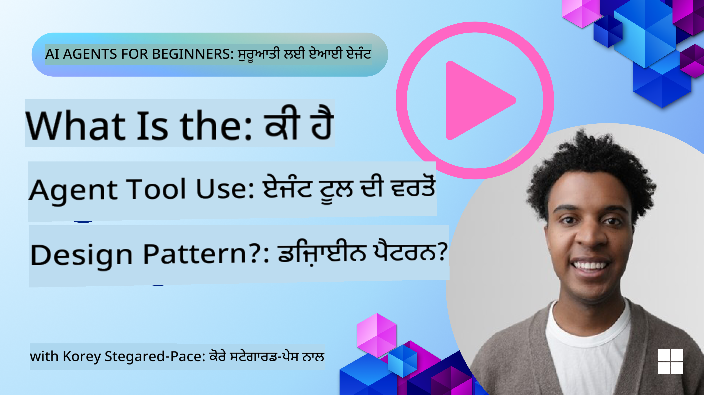
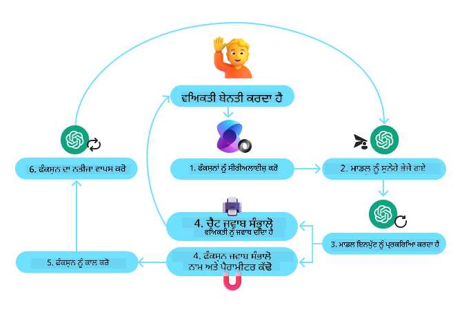

<!--
CO_OP_TRANSLATOR_METADATA:
{
  "original_hash": "e056335d729ba6e49571db7a6533825d",
  "translation_date": "2025-09-30T06:50:52+00:00",
  "source_file": "04-tool-use/README.md",
  "language_code": "pa"
}
-->
[](https://youtu.be/vieRiPRx-gI?si=cEZ8ApnT6Sus9rhn)

> _(ਉਪਰ ਦਿੱਤੀ ਤਸਵੀਰ 'ਤੇ ਕਲਿੱਕ ਕਰਕੇ ਇਸ ਪਾਠ ਦਾ ਵੀਡੀਓ ਵੇਖੋ)_

# ਟੂਲ ਯੂਜ਼ ਡਿਜ਼ਾਈਨ ਪੈਟਰਨ

ਟੂਲ ਦਿਲਚਸਪ ਹਨ ਕਿਉਂਕਿ ਇਹ AI ਏਜੰਟਾਂ ਨੂੰ ਵਿਆਪਕ ਸਮਰੱਥਾਵਾਂ ਪ੍ਰਦਾਨ ਕਰਦੇ ਹਨ। ਜਿੱਥੇ ਏਜੰਟ ਸਿਰਫ਼ ਸੀਮਿਤ ਕਾਰਵਾਈਆਂ ਕਰ ਸਕਦਾ ਹੈ, ਟੂਲ ਸ਼ਾਮਲ ਕਰਕੇ, ਹੁਣ ਏਜੰਟ ਕਈ ਤਰ੍ਹਾਂ ਦੀਆਂ ਕਾਰਵਾਈਆਂ ਕਰ ਸਕਦਾ ਹੈ। ਇਸ ਅਧਿਆਇ ਵਿੱਚ, ਅਸੀਂ ਟੂਲ ਯੂਜ਼ ਡਿਜ਼ਾਈਨ ਪੈਟਰਨ ਦੇਖਾਂਗੇ, ਜੋ ਦਰਸਾਉਂਦਾ ਹੈ ਕਿ AI ਏਜੰਟ ਆਪਣੇ ਲਕਸ਼ਾਂ ਨੂੰ ਹਾਸਲ ਕਰਨ ਲਈ ਵਿਸ਼ੇਸ਼ ਟੂਲਾਂ ਦਾ ਕਿਵੇਂ ਉਪਯੋਗ ਕਰ ਸਕਦੇ ਹਨ।

## ਪਰਿਚਯ

ਇਸ ਪਾਠ ਵਿੱਚ, ਅਸੀਂ ਹੇਠਾਂ ਦਿੱਤੇ ਸਵਾਲਾਂ ਦੇ ਜਵਾਬ ਲੱਭਣ ਦੀ ਕੋਸ਼ਿਸ਼ ਕਰ ਰਹੇ ਹਾਂ:

- ਟੂਲ ਯੂਜ਼ ਡਿਜ਼ਾਈਨ ਪੈਟਰਨ ਕੀ ਹੈ?
- ਇਹ ਕਿਹੜੇ ਉਪਯੋਗ ਮਾਮਲਿਆਂ 'ਤੇ ਲਾਗੂ ਕੀਤਾ ਜਾ ਸਕਦਾ ਹੈ?
- ਡਿਜ਼ਾਈਨ ਪੈਟਰਨ ਨੂੰ ਲਾਗੂ ਕਰਨ ਲਈ ਕਿਹੜੇ ਤੱਤ/ਬਿਲਡਿੰਗ ਬਲਾਕ ਲੋੜੀਂਦੇ ਹਨ?
- ਭਰੋਸੇਯੋਗ AI ਏਜੰਟ ਬਣਾਉਣ ਲਈ ਟੂਲ ਯੂਜ਼ ਡਿਜ਼ਾਈਨ ਪੈਟਰਨ ਦੀ ਵਰਤੋਂ ਕਰਨ ਲਈ ਵਿਸ਼ੇਸ਼ ਵਿਚਾਰ ਕੀ ਹਨ?

## ਸਿੱਖਣ ਦੇ ਲਕਸ਼

ਇਸ ਪਾਠ ਨੂੰ ਪੂਰਾ ਕਰਨ ਤੋਂ ਬਾਅਦ, ਤੁਸੀਂ ਇਹ ਕਰਨ ਦੇ ਯੋਗ ਹੋਵੋਗੇ:

- ਟੂਲ ਯੂਜ਼ ਡਿਜ਼ਾਈਨ ਪੈਟਰਨ ਅਤੇ ਇਸਦਾ ਉਦੇਸ਼ ਪਰਿਭਾਸ਼ਿਤ ਕਰੋ।
- ਉਹ ਉਪਯੋਗ ਮਾਮਲੇ ਪਛਾਣੋ ਜਿੱਥੇ ਟੂਲ ਯੂਜ਼ ਡਿਜ਼ਾਈਨ ਪੈਟਰਨ ਲਾਗੂ ਕੀਤਾ ਜਾ ਸਕਦਾ ਹੈ।
- ਡਿਜ਼ਾਈਨ ਪੈਟਰਨ ਨੂੰ ਲਾਗੂ ਕਰਨ ਲਈ ਲੋੜੀਂਦੇ ਮੁੱਖ ਤੱਤਾਂ ਨੂੰ ਸਮਝੋ।
- ਇਸ ਡਿਜ਼ਾਈਨ ਪੈਟਰਨ ਦੀ ਵਰਤੋਂ ਕਰਦੇ AI ਏਜੰਟਾਂ ਵਿੱਚ ਭਰੋਸੇਯੋਗਤਾ ਨੂੰ ਯਕੀਨੀ ਬਣਾਉਣ ਲਈ ਵਿਚਾਰਾਂ ਨੂੰ ਪਛਾਣੋ।

## ਟੂਲ ਯੂਜ਼ ਡਿਜ਼ਾਈਨ ਪੈਟਰਨ ਕੀ ਹੈ?

**ਟੂਲ ਯੂਜ਼ ਡਿਜ਼ਾਈਨ ਪੈਟਰਨ** LLMs ਨੂੰ ਬਾਹਰੀ ਟੂਲਾਂ ਨਾਲ ਸੰਚਾਰ ਕਰਨ ਦੀ ਸਮਰੱਥਾ ਦੇਣ 'ਤੇ ਧਿਆਨ ਕੇਂਦਰਿਤ ਕਰਦਾ ਹੈ ਤਾਂ ਜੋ ਵਿਸ਼ੇਸ਼ ਲਕਸ਼ਾਂ ਨੂੰ ਹਾਸਲ ਕੀਤਾ ਜਾ ਸਕੇ। ਟੂਲ ਉਹ ਕੋਡ ਹੁੰਦੇ ਹਨ ਜੋ ਏਜੰਟ ਦੁਆਰਾ ਕਾਰਵਾਈ ਕਰਨ ਲਈ ਚਲਾਏ ਜਾ ਸਕਦੇ ਹਨ। ਟੂਲ ਇੱਕ ਸਧਾਰਨ ਫੰਕਸ਼ਨ ਹੋ ਸਕਦਾ ਹੈ ਜਿਵੇਂ ਕਿ ਕੈਲਕੁਲੇਟਰ, ਜਾਂ ਕਿਸੇ ਤੀਜੀ ਪਾਰਟੀ ਸੇਵਾ ਲਈ API ਕਾਲ ਜਿਵੇਂ ਕਿ ਸਟਾਕ ਕੀਮਤ ਜਾਂ ਮੌਸਮ ਦੀ ਪੇਸ਼ਗੋਈ। AI ਏਜੰਟਾਂ ਦੇ ਸੰਦਰਭ ਵਿੱਚ, ਟੂਲ **ਮਾਡਲ-ਜਨਰੇਟ ਕੀਤੇ ਫੰਕਸ਼ਨ ਕਾਲਾਂ** ਦੇ ਜਵਾਬ ਵਿੱਚ ਚਲਾਉਣ ਲਈ ਡਿਜ਼ਾਈਨ ਕੀਤੇ ਜਾਂਦੇ ਹਨ।

## ਇਹ ਕਿਹੜੇ ਉਪਯੋਗ ਮਾਮਲਿਆਂ 'ਤੇ ਲਾਗੂ ਕੀਤਾ ਜਾ ਸਕਦਾ ਹੈ?

AI ਏਜੰਟ ਟੂਲਾਂ ਦੀ ਵਰਤੋਂ ਕਰਕੇ ਜਟਿਲ ਕੰਮ ਪੂਰੇ ਕਰ ਸਕਦੇ ਹਨ, ਜਾਣਕਾਰੀ ਪ੍ਰਾਪਤ ਕਰ ਸਕਦੇ ਹਨ, ਜਾਂ ਫੈਸਲੇ ਲੈ ਸਕਦੇ ਹਨ। ਟੂਲ ਯੂਜ਼ ਡਿਜ਼ਾਈਨ ਪੈਟਰਨ ਅਕਸਰ ਉਹਨਾਂ ਸਥਿਤੀਆਂ ਵਿੱਚ ਵਰਤਿਆ ਜਾਂਦਾ ਹੈ ਜਿੱਥੇ ਬਾਹਰੀ ਸਿਸਟਮਾਂ ਨਾਲ ਗਤੀਸ਼ੀਲ ਸੰਚਾਰ ਦੀ ਲੋੜ ਹੁੰਦੀ ਹੈ, ਜਿਵੇਂ ਕਿ ਡਾਟਾਬੇਸ, ਵੈੱਬ ਸੇਵਾਵਾਂ, ਜਾਂ ਕੋਡ ਇੰਟਰਪ੍ਰੀਟਰ। ਇਹ ਸਮਰੱਥਾ ਕਈ ਵੱਖ-ਵੱਖ ਉਪਯੋਗ ਮਾਮਲਿਆਂ ਲਈ ਲਾਭਦਾਇਕ ਹੈ, ਜਿਵੇਂ:

- **ਗਤੀਸ਼ੀਲ ਜਾਣਕਾਰੀ ਪ੍ਰਾਪਤੀ:** ਏਜੰਟ ਬਾਹਰੀ APIs ਜਾਂ ਡਾਟਾਬੇਸਾਂ ਨੂੰ ਪੁੱਛਗਿੱਛ ਕਰਕੇ ਤਾਜ਼ਾ ਡਾਟਾ ਪ੍ਰਾਪਤ ਕਰ ਸਕਦੇ ਹਨ (ਜਿਵੇਂ ਕਿ SQLite ਡਾਟਾਬੇਸ ਲਈ ਪੁੱਛਗਿੱਛ, ਸਟਾਕ ਕੀਮਤਾਂ ਜਾਂ ਮੌਸਮ ਜਾਣਕਾਰੀ ਪ੍ਰਾਪਤ ਕਰਨਾ)।
- **ਕੋਡ ਚਲਾਉਣਾ ਅਤੇ ਵਿਆਖਿਆ:** ਏਜੰਟ ਗਣਿਤ ਸਮੱਸਿਆਵਾਂ ਹੱਲ ਕਰਨ, ਰਿਪੋਰਟਾਂ ਬਣਾਉਣ, ਜਾਂ ਸਿਮੂਲੇਸ਼ਨ ਕਰਨ ਲਈ ਕੋਡ ਜਾਂ ਸਕ੍ਰਿਪਟ ਚਲਾ ਸਕਦੇ ਹਨ।
- **ਵਰਕਫਲੋ ਆਟੋਮੇਸ਼ਨ:** ਟਾਸਕ ਸ਼ੈਡਿਊਲਰ, ਈਮੇਲ ਸੇਵਾਵਾਂ, ਜਾਂ ਡਾਟਾ ਪਾਈਪਲਾਈਨ ਵਰਗੇ ਟੂਲਾਂ ਨੂੰ ਸ਼ਾਮਲ ਕਰਕੇ ਦੁਹਰਾਏ ਜਾਂ ਬਹੁ-ਕਦਮ ਵਰਕਫਲੋਜ਼ ਨੂੰ ਆਟੋਮੇਟ ਕਰਨਾ।
- **ਗਾਹਕ ਸਹਾਇਤਾ:** ਏਜੰਟ CRM ਸਿਸਟਮਾਂ, ਟਿਕਟਿੰਗ ਪਲੇਟਫਾਰਮਾਂ, ਜਾਂ ਨੋਲੇਜ ਬੇਸਾਂ ਨਾਲ ਸੰਚਾਰ ਕਰਕੇ ਉਪਭੋਗਤਾ ਦੀਆਂ ਪੁੱਛਗਿੱਛਾਂ ਦਾ ਹੱਲ ਕਰ ਸਕਦੇ ਹਨ।
- **ਸਮੱਗਰੀ ਬਣਾਉਣਾ ਅਤੇ ਸੰਪਾਦਨ:** ਏਜੰਟ ਗ੍ਰਾਮਰ ਚੈੱਕਰ, ਟੈਕਸਟ ਸਮਰੀਜ਼ਰ, ਜਾਂ ਸਮੱਗਰੀ ਸੁਰੱਖਿਆ ਮੁਲਾਂਕਨ ਕਰਨ ਵਾਲੇ ਟੂਲਾਂ ਦੀ ਵਰਤੋਂ ਕਰਕੇ ਸਮੱਗਰੀ ਬਣਾਉਣ ਦੇ ਕੰਮਾਂ ਵਿੱਚ ਸਹਾਇਤਾ ਕਰ ਸਕਦੇ ਹਨ।

## ਟੂਲ ਯੂਜ਼ ਡਿਜ਼ਾਈਨ ਪੈਟਰਨ ਨੂੰ ਲਾਗੂ ਕਰਨ ਲਈ ਲੋੜੀਂਦੇ ਤੱਤ/ਬਿਲਡਿੰਗ ਬਲਾਕ ਕੀ ਹਨ?

ਇਹ ਬਿਲਡਿੰਗ ਬਲਾਕ AI ਏਜੰਟ ਨੂੰ ਵਿਆਪਕ ਕੰਮ ਕਰਨ ਦੀ ਸਮਰੱਥਾ ਦਿੰਦੇ ਹਨ। ਆਓ ਟੂਲ ਯੂਜ਼ ਡਿਜ਼ਾਈਨ ਪੈਟਰਨ ਨੂੰ ਲਾਗੂ ਕਰਨ ਲਈ ਲੋੜੀਂਦੇ ਮੁੱਖ ਤੱਤਾਂ 'ਤੇ ਨਜ਼ਰ ਮਾਰਦੇ ਹਾਂ:

- **ਫੰਕਸ਼ਨ/ਟੂਲ ਸਕੀਮਾ:** ਉਪਲਬਧ ਟੂਲਾਂ ਦੀ ਵਿਸਥਾਰਿਤ ਪਰਿਭਾਸ਼ਾ, ਜਿਸ ਵਿੱਚ ਫੰਕਸ਼ਨ ਦਾ ਨਾਮ, ਉਦੇਸ਼, ਲੋੜੀਂਦੇ ਪੈਰਾਮੀਟਰ, ਅਤੇ ਉਮੀਦ ਕੀਤੇ ਨਤੀਜੇ ਸ਼ਾਮਲ ਹਨ। ਇਹ ਸਕੀਮਾ LLM ਨੂੰ ਸਮਝਣ ਯੋਗ ਬਣਾਉਂਦੇ ਹਨ ਕਿ ਕਿਹੜੇ ਟੂਲ ਉਪਲਬਧ ਹਨ ਅਤੇ ਕਿਵੇਂ ਵੈਧ ਬੇਨਤੀਆਂ ਬਣਾਈਆਂ ਜਾ ਸਕਦੀਆਂ ਹਨ।

- **ਫੰਕਸ਼ਨ ਚਲਾਉਣ ਦੀ ਤਰਕ:** ਵਰਤੋਂਕਾਰ ਦੇ ਇਰਾਦੇ ਅਤੇ ਗੱਲਬਾਤ ਦੇ ਸੰਦਰਭ ਦੇ ਅਧਾਰ 'ਤੇ ਟੂਲਾਂ ਨੂੰ ਕਿਵੇਂ ਅਤੇ ਕਦੋਂ ਚਲਾਇਆ ਜਾਵੇ, ਇਸ ਨੂੰ ਨਿਰਧਾਰਤ ਕਰਦਾ ਹੈ। ਇਸ ਵਿੱਚ ਪਲਾਨਰ ਮੋਡੀਊਲ, ਰੂਟਿੰਗ ਮਕੈਨਿਜ਼ਮ, ਜਾਂ ਸ਼ਰਤਮੁਲਕ ਪ੍ਰਵਾਹ ਸ਼ਾਮਲ ਹੋ ਸਕਦੇ ਹਨ ਜੋ ਗਤੀਸ਼ੀਲ ਤੌਰ 'ਤੇ ਟੂਲ ਦੀ ਵਰਤੋਂ ਨੂੰ ਨਿਰਧਾਰਤ ਕਰਦੇ ਹਨ।

- **ਮੇਸੇਜ ਹੈਂਡਲਿੰਗ ਸਿਸਟਮ:** ਉਹ ਘਟਕ ਜੋ ਵਰਤੋਂਕਾਰ ਦੇ ਇਨਪੁਟ, LLM ਦੇ ਜਵਾਬ, ਟੂਲ ਕਾਲਾਂ, ਅਤੇ ਟੂਲ ਨਤੀਜਿਆਂ ਦੇ ਵਿਚਕਾਰ ਗੱਲਬਾਤ ਦੇ ਪ੍ਰਵਾਹ ਨੂੰ ਸੰਭਾਲਦੇ ਹਨ।

- **ਟੂਲ ਇੰਟੀਗ੍ਰੇਸ਼ਨ ਫਰੇਮਵਰਕ:** ਢਾਂਚਾ ਜੋ ਏਜੰਟ ਨੂੰ ਵੱਖ-ਵੱਖ ਟੂਲਾਂ ਨਾਲ ਜੋੜਦਾ ਹੈ, ਚਾਹੇ ਉਹ ਸਧਾਰਨ ਫੰਕਸ਼ਨ ਹੋਣ ਜਾਂ ਜਟਿਲ ਬਾਹਰੀ ਸੇਵਾਵਾਂ।

- **ਗਲਤੀ ਸੰਭਾਲ ਅਤੇ ਵੈਧਤਾ:** ਟੂਲ ਚਲਾਉਣ ਵਿੱਚ ਅਸਫਲਤਾਵਾਂ ਨੂੰ ਸੰਭਾਲਣ, ਪੈਰਾਮੀਟਰਾਂ ਦੀ ਵੈਧਤਾ, ਅਤੇ ਅਣਅਪੇਖਿਤ ਜਵਾਬਾਂ ਨੂੰ ਸੰਭਾਲਣ ਦੇ ਮਕੈਨਿਜ਼ਮ।

- **ਸਟੇਟ ਮੈਨੇਜਮੈਂਟ:** ਗੱਲਬਾਤ ਦੇ ਸੰਦਰਭ, ਪਿਛਲੇ ਟੂਲ ਸੰਚਾਰ, ਅਤੇ ਲਗਾਤਾਰ ਡਾਟਾ ਨੂੰ ਟ੍ਰੈਕ ਕਰਦਾ ਹੈ ਤਾਂ ਜੋ ਬਹੁ-ਮੁੜ ਗੱਲਬਾਤਾਂ ਵਿੱਚ ਸਥਿਰਤਾ ਯਕੀਨੀ ਬਣਾਈ ਜਾ ਸਕੇ।

ਅਗਲੇ ਹਿੱਸੇ ਵਿੱਚ, ਆਓ ਫੰਕਸ਼ਨ/ਟੂਲ ਕਾਲਿੰਗ ਨੂੰ ਵਿਸਥਾਰ ਵਿੱਚ ਦੇਖਦੇ ਹਾਂ।

### ਫੰਕਸ਼ਨ/ਟੂਲ ਕਾਲਿੰਗ

ਫੰਕਸ਼ਨ ਕਾਲਿੰਗ ਉਹ ਮੁੱਖ ਤਰੀਕਾ ਹੈ ਜਿਸ ਨਾਲ ਅਸੀਂ ਵੱਡੇ ਭਾਸ਼ਾ ਮਾਡਲ (LLMs) ਨੂੰ ਟੂਲਾਂ ਨਾਲ ਸੰਚਾਰ ਕਰਨ ਯੋਗ ਬਣਾਉਂਦੇ ਹਾਂ। ਤੁਸੀਂ ਅਕਸਰ 'ਫੰਕਸ਼ਨ' ਅਤੇ 'ਟੂਲ' ਨੂੰ ਇੱਕੋ ਜਿਹਾ ਵਰਤਿਆ ਹੋਇਆ ਦੇਖੋਗੇ ਕਿਉਂਕਿ 'ਫੰਕਸ਼ਨ' (ਦੁਬਾਰਾ ਵਰਤਣ ਯੋਗ ਕੋਡ ਦੇ ਬਲਾਕ) ਉਹ 'ਟੂਲ' ਹਨ ਜੋ ਏਜੰਟ ਕੰਮ ਕਰਨ ਲਈ ਵਰਤਦੇ ਹਨ। ਇੱਕ ਫੰਕਸ਼ਨ ਦੇ ਕੋਡ ਨੂੰ ਚਲਾਉਣ ਲਈ, LLM ਨੂੰ ਵਰਤੋਂਕਾਰ ਦੀ ਬੇਨਤੀ ਨੂੰ ਫੰਕਸ਼ਨ ਦੇ ਵੇਰਵੇ ਦੇ ਨਾਲ ਤੁਲਨਾ ਕਰਨੀ ਪੈਂਦੀ ਹੈ। ਇਸ ਲਈ, ਉਪਲਬਧ ਫੰਕਸ਼ਨਾਂ ਦੇ ਵੇਰਵੇ ਵਾਲਾ ਸਕੀਮਾ LLM ਨੂੰ ਭੇਜਿਆ ਜਾਂਦਾ ਹੈ। LLM ਫਿਰ ਕੰਮ ਲਈ ਸਭ ਤੋਂ ਉਚਿਤ ਫੰਕਸ਼ਨ ਦੀ ਚੋਣ ਕਰਦਾ ਹੈ ਅਤੇ ਇਸਦਾ ਨਾਮ ਅਤੇ ਪੈਰਾਮੀਟਰ ਵਾਪਸ ਕਰਦਾ ਹੈ। ਚੁਣਿਆ ਗਿਆ ਫੰਕਸ਼ਨ ਚਲਾਇਆ ਜਾਂਦਾ ਹੈ, ਇਸਦਾ ਜਵਾਬ LLM ਨੂੰ ਵਾਪਸ ਭੇਜਿਆ ਜਾਂਦਾ ਹੈ, ਜੋ ਵਰਤੋਂਕਾਰ ਦੀ ਬੇਨਤੀ ਦਾ ਜਵਾਬ ਦੇਣ ਲਈ ਜਾਣਕਾਰੀ ਦੀ ਵਰਤੋਂ ਕਰਦਾ ਹੈ।

ਡਿਵੈਲਪਰਾਂ ਲਈ ਏਜੰਟਾਂ ਲਈ ਫੰਕਸ਼ਨ ਕਾਲਿੰਗ ਲਾਗੂ ਕਰਨ ਲਈ, ਤੁਹਾਨੂੰ ਲੋੜ ਹੋਵੇਗੀ:

1. ਇੱਕ LLM ਮਾਡਲ ਜੋ ਫੰਕਸ਼ਨ ਕਾਲਿੰਗ ਨੂੰ ਸਹਾਰਦਾ ਹੈ
2. ਫੰਕਸ਼ਨ ਵੇਰਵੇ ਵਾਲਾ ਸਕੀਮਾ
3. ਹਰ ਫੰਕਸ਼ਨ ਲਈ ਕੋਡ ਜੋ ਵੇਰਵੇ ਵਿੱਚ ਦਿੱਤਾ ਗਿਆ ਹੈ

ਆਓ ਸਾਨ ਫਰਾਂਸਿਸਕੋ ਵਿੱਚ ਮੌਜੂਦਾ ਸਮਾਂ ਪ੍ਰਾਪਤ ਕਰਨ ਦੇ ਉਦਾਹਰਨ ਨਾਲ ਸਮਝਾਈਏ:

1. **ਇੱਕ LLM ਸ਼ੁਰੂ ਕਰੋ ਜੋ ਫੰਕਸ਼ਨ ਕਾਲਿੰਗ ਨੂੰ ਸਹਾਰਦਾ ਹੈ:**

    ਸਾਰੇ ਮਾਡਲ ਫੰਕਸ਼ਨ ਕਾਲਿੰਗ ਨੂੰ ਸਹਾਰਦੇ ਨਹੀਂ ਹਨ, ਇਸ ਲਈ ਇਹ ਯਕੀਨੀ ਬਣਾਉਣਾ ਮਹੱਤਵਪੂਰਨ ਹੈ ਕਿ ਤੁਸੀਂ ਜੋ LLM ਵਰਤ ਰਹੇ ਹੋ ਉਹ ਕਰਦਾ ਹੈ। <a href="https://learn.microsoft.com/azure/ai-services/openai/how-to/function-calling" target="_blank">Azure OpenAI</a> ਫੰਕਸ਼ਨ ਕਾਲਿੰਗ ਨੂੰ ਸਹਾਰਦਾ ਹੈ। ਅਸੀਂ Azure OpenAI ਕਲਾਇੰਟ ਸ਼ੁਰੂ ਕਰਕੇ ਸ਼ੁਰੂ ਕਰ ਸਕਦੇ ਹਾਂ।

    ```python
    # Initialize the Azure OpenAI client
    client = AzureOpenAI(
        azure_endpoint = os.getenv("AZURE_OPENAI_ENDPOINT"), 
        api_key=os.getenv("AZURE_OPENAI_API_KEY"),  
        api_version="2024-05-01-preview"
    )
    ```

1. **ਫੰਕਸ਼ਨ ਸਕੀਮਾ ਬਣਾਓ:**

    ਅਗਲੇ ਕਦਮ ਵਿੱਚ ਅਸੀਂ ਇੱਕ JSON ਸਕੀਮਾ ਪਰਿਭਾਸ਼ਿਤ ਕਰਾਂਗੇ ਜਿਸ ਵਿੱਚ ਫੰਕਸ਼ਨ ਦਾ ਨਾਮ, ਫੰਕਸ਼ਨ ਕੀ ਕਰਦਾ ਹੈ ਇਸਦਾ ਵੇਰਵਾ, ਅਤੇ ਫੰਕਸ਼ਨ ਪੈਰਾਮੀਟਰਾਂ ਦੇ ਨਾਮ ਅਤੇ ਵੇਰਵੇ ਸ਼ਾਮਲ ਹਨ।  
    ਅਸੀਂ ਇਸ ਸਕੀਮਾ ਨੂੰ ਪਹਿਲਾਂ ਬਣਾਏ ਕਲਾਇੰਟ ਨੂੰ ਭੇਜਾਂਗੇ, ਸਾਨ ਫਰਾਂਸਿਸਕੋ ਵਿੱਚ ਸਮਾਂ ਲੱਭਣ ਲਈ ਵਰਤੋਂਕਾਰ ਦੀ ਬੇਨਤੀ ਦੇ ਨਾਲ। ਮਹੱਤਵਪੂਰਨ ਗੱਲ ਇਹ ਹੈ ਕਿ **ਟੂਲ ਕਾਲ** ਵਾਪਸ ਕੀਤੀ ਜਾਂਦੀ ਹੈ, **ਸਵਾਲ ਦਾ ਅੰਤਮ ਜਵਾਬ ਨਹੀਂ।** ਜਿਵੇਂ ਪਹਿਲਾਂ ਦੱਸਿਆ ਗਿਆ ਹੈ, LLM ਕੰਮ ਲਈ ਚੁਣੇ ਗਏ ਫੰਕਸ਼ਨ ਦਾ ਨਾਮ ਅਤੇ ਇਸਦੇ ਪੈਰਾਮੀਟਰ ਵਾਪਸ ਕਰਦਾ ਹੈ।

    ```python
    # Function description for the model to read
    tools = [
        {
            "type": "function",
            "function": {
                "name": "get_current_time",
                "description": "Get the current time in a given location",
                "parameters": {
                    "type": "object",
                    "properties": {
                        "location": {
                            "type": "string",
                            "description": "The city name, e.g. San Francisco",
                        },
                    },
                    "required": ["location"],
                },
            }
        }
    ]
    ```
   
    ```python
  
    # Initial user message
    messages = [{"role": "user", "content": "What's the current time in San Francisco"}] 
  
    # First API call: Ask the model to use the function
      response = client.chat.completions.create(
          model=deployment_name,
          messages=messages,
          tools=tools,
          tool_choice="auto",
      )
  
      # Process the model's response
      response_message = response.choices[0].message
      messages.append(response_message)
  
      print("Model's response:")  

      print(response_message)
  
    ```

    ```bash
    Model's response:
    ChatCompletionMessage(content=None, role='assistant', function_call=None, tool_calls=[ChatCompletionMessageToolCall(id='call_pOsKdUlqvdyttYB67MOj434b', function=Function(arguments='{"location":"San Francisco"}', name='get_current_time'), type='function')])
    ```
  
1. **ਕੰਮ ਕਰਨ ਲਈ ਲੋੜੀਂਦਾ ਫੰਕਸ਼ਨ ਕੋਡ:**

    ਹੁਣ ਜਦੋਂ LLM ਨੇ ਚੁਣਿਆ ਹੈ ਕਿ ਕਿਹੜਾ ਫੰਕਸ਼ਨ ਚਲਾਇਆ ਜਾਣਾ ਚਾਹੀਦਾ ਹੈ, ਕੰਮ ਕਰਨ ਲਈ ਕੋਡ ਲਾਗੂ ਅਤੇ ਚਲਾਇਆ ਜਾਣਾ ਚਾਹੀਦਾ ਹੈ।  
    ਅਸੀਂ ਮੌਜੂਦਾ ਸਮਾਂ ਪ੍ਰਾਪਤ ਕਰਨ ਲਈ Python ਵਿੱਚ ਕੋਡ ਲਾਗੂ ਕਰ ਸਕਦੇ ਹਾਂ। ਅਸੀਂ response_message ਤੋਂ ਨਾਮ ਅਤੇ ਪੈਰਾਮੀਟਰਾਂ ਨੂੰ ਕੱਢਣ ਲਈ ਕੋਡ ਵੀ ਲਿਖਣਾ ਪਵੇਗਾ ਤਾਂ ਜੋ ਅੰਤਮ ਨਤੀਜਾ ਪ੍ਰਾਪਤ ਕੀਤਾ ਜਾ ਸਕੇ।

    ```python
      def get_current_time(location):
        """Get the current time for a given location"""
        print(f"get_current_time called with location: {location}")  
        location_lower = location.lower()
        
        for key, timezone in TIMEZONE_DATA.items():
            if key in location_lower:
                print(f"Timezone found for {key}")  
                current_time = datetime.now(ZoneInfo(timezone)).strftime("%I:%M %p")
                return json.dumps({
                    "location": location,
                    "current_time": current_time
                })
      
        print(f"No timezone data found for {location_lower}")  
        return json.dumps({"location": location, "current_time": "unknown"})
    ```

     ```python
     # Handle function calls
      if response_message.tool_calls:
          for tool_call in response_message.tool_calls:
              if tool_call.function.name == "get_current_time":
     
                  function_args = json.loads(tool_call.function.arguments)
     
                  time_response = get_current_time(
                      location=function_args.get("location")
                  )
     
                  messages.append({
                      "tool_call_id": tool_call.id,
                      "role": "tool",
                      "name": "get_current_time",
                      "content": time_response,
                  })
      else:
          print("No tool calls were made by the model.")  
  
      # Second API call: Get the final response from the model
      final_response = client.chat.completions.create(
          model=deployment_name,
          messages=messages,
      )
  
      return final_response.choices[0].message.content
     ```

     ```bash
      get_current_time called with location: San Francisco
      Timezone found for san francisco
      The current time in San Francisco is 09:24 AM.
     ```

ਫੰਕਸ਼ਨ ਕਾਲਿੰਗ ਜ਼ਿਆਦਾਤਰ, ਜੇਕਰ ਸਾਰੇ ਨਹੀਂ, ਏਜੰਟ ਟੂਲ ਯੂਜ਼ ਡਿਜ਼ਾਈਨ ਦਾ ਕੇਂਦਰ ਹੈ, ਹਾਲਾਂਕਿ ਇਸਨੂੰ ਸ਼ੁਰੂ ਤੋਂ ਲਾਗੂ ਕਰਨਾ ਕਈ ਵਾਰ ਚੁਣੌਤੀਪੂਰਨ ਹੋ ਸਕਦਾ ਹੈ।  
ਜਿਵੇਂ ਅਸੀਂ [Lesson 2](../../../02-explore-agentic-frameworks) ਵਿੱਚ ਸਿੱਖਿਆ, ਏਜੰਟਿਕ ਫਰੇਮਵਰਕ ਸਾਨੂੰ ਟੂਲ ਯੂਜ਼ ਨੂੰ ਲਾਗੂ ਕਰਨ ਲਈ ਪਹਿਲਾਂ ਤੋਂ ਬਣਾਏ ਬਿਲਡਿੰਗ ਬਲਾਕ ਪ੍ਰਦਾਨ ਕਰਦੇ ਹਨ।

## ਏਜੰਟਿਕ ਫਰੇਮਵਰਕ ਨਾਲ ਟੂਲ ਯੂਜ਼ ਦੇ ਉਦਾਹਰਨ

ਹੇਠਾਂ ਕੁਝ ਉਦਾਹਰਨ ਹਨ ਕਿ ਤੁਸੀਂ ਵੱਖ-ਵੱਖ ਏਜੰਟਿਕ ਫਰੇਮਵਰਕ ਦੀ ਵਰਤੋਂ ਕਰਕੇ ਟੂਲ ਯੂਜ਼ ਡਿਜ਼ਾਈਨ ਪੈਟਰਨ ਨੂੰ ਕਿਵੇਂ ਲਾਗੂ ਕਰ ਸਕਦੇ ਹੋ:

### ਸੈਮੈਂਟਿਕ ਕਰਨਲ

<a href="https://learn.microsoft.com/azure/ai-services/agents/overview" target="_blank">ਸੈਮੈਂਟਿਕ ਕਰਨਲ</a> .NET, Python, ਅਤੇ Java ਡਿਵੈਲਪਰਾਂ ਲਈ ਇੱਕ ਖੁੱਲ੍ਹਾ-ਸਰੋਤ AI ਫਰੇਮਵਰਕ ਹੈ ਜੋ ਵੱਡੇ ਭਾਸ਼ਾ ਮਾਡਲ (LLMs) ਨਾਲ ਕੰਮ ਕਰਦੇ ਹਨ। ਇਹ ਫੰਕਸ਼ਨ ਕਾਲਿੰਗ ਦੀ ਵਰਤੋਂ ਦੀ ਪ੍ਰਕਿਰਿਆ ਨੂੰ ਸਧਾਰਨ ਬਣਾਉਂਦਾ ਹੈ ਕਿਉਂਕਿ ਇਹ ਤੁਹਾਡੇ ਫੰਕਸ਼ਨਾਂ ਅਤੇ ਉਨ੍ਹਾਂ ਦੇ ਪੈਰਾਮੀਟਰਾਂ ਨੂੰ ਮਾਡਲ ਨੂੰ ਆਪਣੇ ਆਪ <a href="https://learn.microsoft.com/semantic-kernel/concepts/ai-services/chat-completion/function-calling/?pivots=programming-language-python#1-serializing-the-functions" target="_blank">ਸਿਰੀਅਲਾਈਜ਼</a> ਕਰਕੇ ਵੇਰਵਾ ਦਿੰਦਾ ਹੈ। ਇਹ ਮਾਡਲ ਅਤੇ ਤੁਹਾਡੇ ਕੋਡ ਦੇ ਵਿਚਕਾਰ ਗੱਲਬਾਤ ਨੂੰ ਸੰਭਾਲਦਾ ਹੈ।  
ਏਜੰਟਿਕ ਫਰੇਮਵਰਕ ਜਿਵੇਂ ਸੈਮੈਂਟਿਕ ਕਰਨਲ ਦੀ ਵਰਤੋਂ ਕਰਨ ਦਾ ਇੱਕ ਹੋਰ ਫਾਇਦਾ ਇਹ ਹੈ ਕਿ ਇਹ ਤੁਹਾਨੂੰ ਪਹਿਲਾਂ ਤੋਂ ਬਣਾਏ ਟੂਲਾਂ ਤੱਕ ਪਹੁੰਚ ਪ੍ਰਦਾਨ ਕਰਦਾ ਹੈ ਜਿਵੇਂ <a href="https://github.com/microsoft/semantic-kernel/blob/main/python/samples/getting_started_with_agents/openai_assistant/step4_assistant_tool_file_search.py" target="_blank">ਫਾਇਲ ਖੋਜ</a> ਅਤੇ <a href="https://github.com/microsoft/semantic-kernel/blob/main/python/samples/getting_started_with_agents/openai_assistant/step3_assistant_tool_code_interpreter.py" target="_blank">ਕੋਡ ਇੰਟਰਪ੍ਰੀਟਰ</a>।

ਹੇਠਾਂ ਦਿੱਤਾ ਡਾਇਗ੍ਰਾਮ ਸੈਮੈਂਟਿਕ ਕਰਨਲ ਨਾਲ ਫੰਕਸ਼ਨ ਕਾਲਿੰਗ ਦੀ ਪ੍ਰਕਿਰਿਆ ਨੂੰ ਦਰਸਾਉਂਦਾ ਹੈ:



ਸੈਮੈਂਟਿਕ ਕਰਨਲ ਵਿੱਚ ਫੰਕਸ਼ਨ/ਟੂਲਾਂ ਨੂੰ <a href="https://learn.microsoft.com/semantic-kernel/concepts/plugins/?pivots=programming-language-python" target="_blank">ਪਲੱਗਇਨ</a> ਕਿਹਾ ਜਾਂਦਾ ਹੈ। ਅਸੀਂ ਪਹਿਲਾਂ ਦੇਖੇ `get_current_time` ਫੰਕਸ਼ਨ ਨੂੰ ਇੱਕ ਕਲਾਸ ਵਿੱਚ ਬਦਲ ਕੇ ਪਲੱਗਇਨ ਵਿੱਚ ਬਦਲ ਸਕਦੇ ਹਾਂ। ਅਸੀਂ `
ਐਪ ਨੂੰ ਸੁਰੱਖਿਅਤ ਵਾਤਾਵਰਣ ਵਿੱਚ ਚਲਾਉਣਾ ਸੁਰੱਖਿਆ ਨੂੰ ਹੋਰ ਵਧਾਉਂਦਾ ਹੈ। ਕਾਰੋਬਾਰੀ ਸਥਿਤੀਆਂ ਵਿੱਚ, ਡਾਟਾ ਆਮ ਤੌਰ 'ਤੇ ਓਪਰੇਸ਼ਨਲ ਸਿਸਟਮਾਂ ਤੋਂ ਕੱਢਿਆ ਜਾਂਦਾ ਹੈ ਅਤੇ ਇੱਕ ਪੜ੍ਹਨ-ਮਾਤਰ ਡਾਟਾਬੇਸ ਜਾਂ ਡਾਟਾ ਵੇਅਰਹਾਊਸ ਵਿੱਚ ਬਦਲਿਆ ਜਾਂਦਾ ਹੈ ਜਿਸ ਵਿੱਚ ਵਰਤੋਂਕਾਰ-ਅਨੁਕੂਲ ਸਕੀਮਾ ਹੁੰਦਾ ਹੈ। ਇਹ ਪਹੁੰਚ ਸੁਰੱਖਿਆ, ਪ੍ਰਦਰਸ਼ਨ ਅਤੇ ਪਹੁੰਚਯੋਗਤਾ ਲਈ ਡਾਟਾ ਨੂੰ ਢੰਗ ਨਾਲ ਢਾਲਦੀ ਹੈ ਅਤੇ ਇਹ ਯਕੀਨੀ ਬਣਾਉਂਦੀ ਹੈ ਕਿ ਐਪ ਨੂੰ ਸੀਮਿਤ, ਪੜ੍ਹਨ-ਮਾਤਰ ਪਹੁੰਚ ਹੈ।

### ਟੂਲ ਵਰਤੋਂ ਡਿਜ਼ਾਈਨ ਪੈਟਰਨ ਬਾਰੇ ਹੋਰ ਸਵਾਲ ਹਨ?

[Azure AI Foundry Discord](https://aka.ms/ai-agents/discord) ਵਿੱਚ ਸ਼ਾਮਲ ਹੋਵੋ ਤਾਂ ਜੋ ਹੋਰ ਸਿੱਖਣ ਵਾਲਿਆਂ ਨਾਲ ਮਿਲ ਸਕੋ, ਦਫ਼ਤਰ ਦੇ ਘੰਟਿਆਂ ਵਿੱਚ ਸ਼ਿਰਕਤ ਕਰ ਸਕੋ ਅਤੇ ਆਪਣੇ AI Agents ਨਾਲ ਸੰਬੰਧਿਤ ਸਵਾਲਾਂ ਦੇ ਜਵਾਬ ਪ੍ਰਾਪਤ ਕਰ ਸਕੋ।

## ਵਾਧੂ ਸਰੋਤ

- <a href="https://microsoft.github.io/build-your-first-agent-with-azure-ai-agent-service-workshop/" target="_blank">Azure AI Agents Service Workshop</a>
- <a href="https://github.com/Azure-Samples/contoso-creative-writer/tree/main/docs/workshop" target="_blank">Contoso Creative Writer Multi-Agent Workshop</a>
- <a href="https://learn.microsoft.com/semantic-kernel/concepts/ai-services/chat-completion/function-calling/?pivots=programming-language-python#1-serializing-the-functions" target="_blank">Semantic Kernel Function Calling Tutorial</a>
- <a href="https://github.com/microsoft/semantic-kernel/blob/main/python/samples/getting_started_with_agents/openai_assistant/step3_assistant_tool_code_interpreter.py" target="_blank">Semantic Kernel Code Interpreter</a>
- <a href="https://microsoft.github.io/autogen/dev/user-guide/core-user-guide/components/tools.html" target="_blank">Autogen Tools</a>

## ਪਿਛਲਾ ਪਾਠ

[Agentic Design Patterns ਨੂੰ ਸਮਝਣਾ](../03-agentic-design-patterns/README.md)

## ਅਗਲਾ ਪਾਠ

[Agentic RAG](../05-agentic-rag/README.md)

---

**ਅਸਵੀਕਰਤੀ**:  
ਇਹ ਦਸਤਾਵੇਜ਼ AI ਅਨੁਵਾਦ ਸੇਵਾ [Co-op Translator](https://github.com/Azure/co-op-translator) ਦੀ ਵਰਤੋਂ ਕਰਕੇ ਅਨੁਵਾਦ ਕੀਤਾ ਗਿਆ ਹੈ। ਹਾਲਾਂਕਿ ਅਸੀਂ ਸਹੀ ਹੋਣ ਦਾ ਯਤਨ ਕਰਦੇ ਹਾਂ, ਕਿਰਪਾ ਕਰਕੇ ਧਿਆਨ ਦਿਓ ਕਿ ਸਵੈਚਾਲਿਤ ਅਨੁਵਾਦਾਂ ਵਿੱਚ ਗਲਤੀਆਂ ਜਾਂ ਅਸੁਚੱਜੇਪਣ ਹੋ ਸਕਦੇ ਹਨ। ਇਸ ਦੀ ਮੂਲ ਭਾਸ਼ਾ ਵਿੱਚ ਮੌਜੂਦ ਅਸਲ ਦਸਤਾਵੇਜ਼ ਨੂੰ ਅਧਿਕਾਰਤ ਸਰੋਤ ਮੰਨਿਆ ਜਾਣਾ ਚਾਹੀਦਾ ਹੈ। ਮਹੱਤਵਪੂਰਨ ਜਾਣਕਾਰੀ ਲਈ, ਪੇਸ਼ੇਵਰ ਮਨੁੱਖੀ ਅਨੁਵਾਦ ਦੀ ਸਿਫਾਰਸ਼ ਕੀਤੀ ਜਾਂਦੀ ਹੈ। ਇਸ ਅਨੁਵਾਦ ਦੀ ਵਰਤੋਂ ਤੋਂ ਪੈਦਾ ਹੋਣ ਵਾਲੇ ਕਿਸੇ ਵੀ ਗਲਤਫਹਿਮੀ ਜਾਂ ਗਲਤ ਵਿਆਖਿਆ ਲਈ ਅਸੀਂ ਜ਼ਿੰਮੇਵਾਰ ਨਹੀਂ ਹਾਂ।