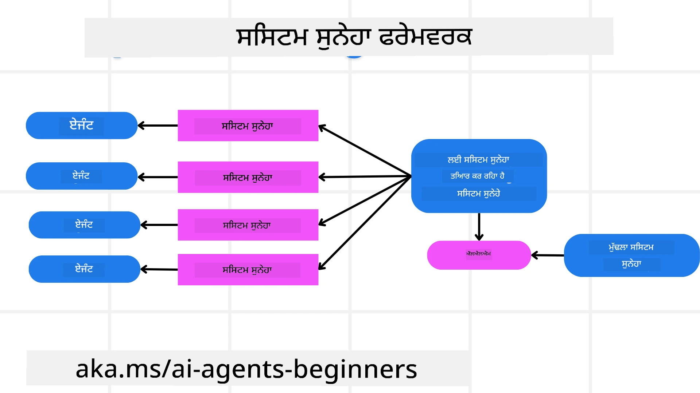
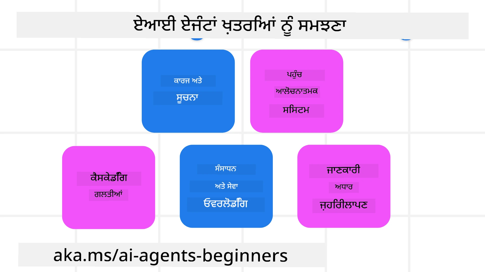
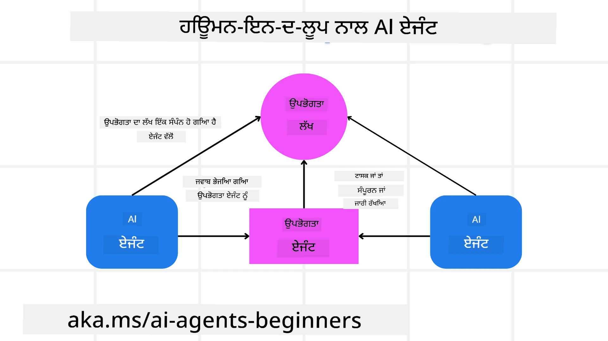

[](https://youtu.be/iZKkMEGBCUQ?si=Q-kEbcyHUMPoHp8L)

> _(ਇਸ ਪਾਠ ਦਾ ਵੀਡੀਓ ਦੇਖਣ ਲਈ ਉਪਰ ਦਿੱਤੀ ਤਸਵੀਰ 'ਤੇ ਕਲਿੱਕ ਕਰੋ)_

# ਭਰੋਸੇਮੰਦ AI ਏਜੰਟ ਬਣਾਉਣਾ

## ਪਰਿਚਯ

ਇਸ ਪਾਠ ਵਿੱਚ ਅਸੀਂ ਕਵਰ ਕਰਾਂਗੇ:

- ਸੁਰੱਖਿਅਤ ਅਤੇ ਪ੍ਰਭਾਵਸ਼ਾਲੀ AI ਏਜੰਟ ਕਿਵੇਂ ਬਣਾਏ ਅਤੇ ਡਿਪਲੋਇ ਕਰਨ।
- AI ਏਜੰਟਾਂ ਵਿਕਸਿਤ ਕਰਦੇ ਸਮੇਂ ਜਰੂਰੀ ਸੁਰੱਖਿਆ ਬਿੰਦੁ।
- AI ਏਜੰਟਾਂ ਨੂੰ ਵਿਕਸਿਤ ਕਰਦੇ ਹੋਏ ਡੇਟਾ ਅਤੇ ਵਰਤੋਂਕਾਰ ਦੀ ਪ੍ਰਾਈਵੇਸੀ ਕਿਵੇਂ ਬਰਕਰਾਰ ਰੱਖੀ ਜਾਵੇ।

## ਸਿੱਖਣ ਦੇ ਲਕੜ

ਇਸ ਪਾਠ ਨੂੰ ਮੁਕੰਮਲ ਕਰਨ ਤੋਂ ਬਾਅਦ, ਤੁਸੀਂ ਜਾਣੋਗੇ ਕਿਵੇਂ:

- AI ਏਜੰਟ ਬਣਾਉਣ ਸਮੇਂ ਖਤਰਿਆਂ ਦੀ ਪਛਾਣ ਅਤੇ ਘਟਾਅ ਕਰਨਾ।
- ਡੇਟਾ ਅਤੇ ਪਹੁੰਚ ਨੂੰ ਠੀਕ ਤਰੀਕੇ ਨਾਲ ਪ੍ਰਬੰਧਿਤ ਕਰਨ ਲਈ ਸੁਰੱਖਿਆ ਉਪਾਇਆ ਲਗਾਉਣਾ।
- ਐਸੇ AI ਏਜੰਟ ਬਣਾਉਣਾ ਜੋ ਡੇਟਾ ਦੀ ਪ੍ਰਾਈਵੇਸੀ ਬਨਾਈ ਰੱਖਣ ਅਤੇ ਉੱਚ ਗੁਣਵੱਤਾ ਵਾਲਾ ਵਰਤੋਂਕਾਰ ਅਨੁਭਵ ਪ੍ਰਦਾਨ ਕਰਨ।

## ਸੁਰੱਖਿਆ

ਆਓ ਪਹਿਲਾਂ ਸੁਰੱਖਿਅਤ ਏਜੰਟਿਕ ਐਪਲੀਕੇਸ਼ਨ ਬਣਾਉਣ ਦੇ ਬਾਰੇ ਵਿਚਾਰ ਕਰੀਏ। ਸੁਰੱਖਿਆ ਦਾ ਅਰਥ ਹੈ ਕਿ AI ਏਜੰਟ ਉਸ ਤਰ੍ਹਾਂ ਕੰਮ ਕਰੇ ਜਿਵੇਂ ਡਿਜ਼ਾਈਨ ਕੀਤਾ ਗਿਆ ਹੈ। ਏਜੰਟਿਕ ਐਪਲੀਕੇਸ਼ਨ ਦੇ ਨਿਰਮਾਤਾ ਹੋਣ ਦੇ ਨਾਤੇ, ਸਾਡੇ ਕੋਲ ਸੁਰੱਖਿਆ ਵਧਾਉਣ ਲਈ ਤਰੀਕੇ ਅਤੇ ਸਾਧਨ ਹਨ:

### ਸਿਸਟਮ ਸੁਨੇਹਾ ਫਰੇਮਵਰਕ ਬਨਾਉਣਾ

ਜੇਕਰ ਤੁਸੀਂ ਕਦੇ ਵੱਡੇ ਭਾਸ਼ਾਈ ਮਾਡਲ (LLMs) ਨਾਲ AI ਐਪਲੀਕੇਸ਼ਨ ਬਣਾਇਆ ਹੈ, ਤਾਂ ਤੁਸੀਂ ਜਾਣਦੇ ਹੋ ਕਿ ਮਜ਼ਬੂਤ ਸਿਸਟਮ ਪ੍ਰੋਮਪਟ ਜਾਂ ਸਿਸਟਮ ਸੁਨੇਹੇ ਦਾ ਡਿਜ਼ਾਈਨ ਕਰਨਾ ਕਿੰਨਾ ਮਹੱਤਵਪੂਰਨ ਹੈ। ਇਹ ਪ੍ਰੋਮਪਟ ਮੈਟਾ ਨਿਯਮ, ਹੁਕਮ, ਅਤੇ ਸਿਧਾਂਤ ਸਥਾਪਿਤ ਕਰਦੇ ਹਨ ਕਿ LLM ਵਰਤੋਂਕਾਰ ਅਤੇ ਡੇਟਾ ਨਾਲ ਕਿਵੇਂ ਇੰਟਰੈਕਟ ਕਰੇਗਾ।

AI ਏਜੰਟਾਂ ਲਈ, ਸਿਸਟਮ ਪ੍ਰੋਮਪਟ ਹੋਰ ਵੀ ਜ਼ਿਆਦਾ ਮਹੱਤਵਪੂਰਨ ਹੈ ਕਿਉਂਕਿ AI ਏਜੰਟਾਂ ਨੂੰ ਸਪਸ਼ਟ ਨਿਰਦੇਸ਼ਾਂ ਦੀ ਲੋੜ ਹੁੰਦੀ ਹੈ ਜਿੰਨ੍ਹਾਂ ਨਾਲ ਉਹ ਸਾਡੇ ਬਣਾਏ ਕੰਮ ਪੂਰੇ ਕਰ ਸਕਣ।

ਸਕੈਲ ਕਰਨਯੋਗ ਸਿਸਟਮ ਪ੍ਰੋਮਪਟ ਬਣਾਉਣ ਲਈ, ਅਸੀਂ ਆਪਣੇ ਐਪਲੀਕੇਸ਼ਨ ਵਿੱਚ ਇੱਕ ਜਾਂ ਇਸ ਤੋਂ ਵੱਧ ਏਜੰਟਾਂ ਲਈ ਸਿਸਟਮ ਸੁਨੇਹਾ ਫਰੇਮਵਰਕ ਵਰਤ ਸਕਦੇ ਹਾਂ:



#### ਕਦਮ 1: ਇੱਕ ਮੈਟਾ ਸਿਸਟਮ ਸੁਨੇਹਾ ਬਣਾਓ

ਮੈਟਾ ਪ੍ਰੋਮਪਟ ਇੱਕ LLM ਦੁਆਰਾ ਵਰਤਿਆ ਜਾਵੇਗਾ ਤਾਂ ਜੋ ਅਸੀਂ ਬਣਾਏ ਏਜੰਟਾਂ ਲਈ ਸਿਸਟਮ ਪ੍ਰੋਮਪਟ ਜਨਰੇਟ ਕਰ ਸਕੀਏ। ਅਸੀਂ ਇਸਨੂੰ ਇੱਕ ਟੈਮਪਲੇਟ ਵੱਜੋਂ ਡਿਜ਼ਾਈਨ ਕਰਦੇ ਹਾਂ ਤਾਂ ਜੋ ਜਰੂਰਤ ਪੈਣ 'ਤੇ ਅਸੀਂ ਅਸਾਨੀ ਨਾਲ ਬਹੁਤ ਸਾਰੇ ਏਜੰਟ ਬਣਾ ਸਕੀਏ।

ਇੱਥੇ ਇੱਕ ਮੈਟਾ ਸਿਸਟਮ ਸੁਨੇਹਾ ਦਾ ਉਦਾਹਰਣ ਹੈ ਜੋ ਅਸੀਂ LLM ਨੂੰ ਦੇਵਾਂਗੇ:

```plaintext
You are an expert at creating AI agent assistants. 
You will be provided a company name, role, responsibilities and other
information that you will use to provide a system prompt for.
To create the system prompt, be descriptive as possible and provide a structure that a system using an LLM can better understand the role and responsibilities of the AI assistant. 
```

#### ਕਦਮ 2: ਇੱਕ ਬੁਨਿਆਦੀ ਪ੍ਰੋਮਪਟ ਬਣਾਓ

ਅਗਲਾ ਕਦਮ ਏਜੰਟ ਦਾ ਵੇਰਵਾ ਦਿੱਤਾ ਜਾਣ ਵਾਲਾ ਇੱਕ ਬੁਨਿਆਦੀ ਪ੍ਰੋਮਪਟ ਬਣਾਉਣਾ ਹੈ। ਤੁਹਾਨੂੰ ਏਜੰਟ ਦਾ ਕਿਰਦਾਰ, ਉਹ ਕੰਮ ਜੋ ਏਜੰਟ ਪੂਰੇ ਕਰੇਗਾ, ਅਤੇ ਹਰ ਹੋਰ ਜ਼ਿੰਮੇਵਾਰੀ ਸ਼ਾਮਿਲ ਕਰਨੀ ਚਾਹੀਦੀ ਹੈ।

ਇੱਥੇ ਇੱਕ ਉਦਾਹਰਣ ਹੈ:

```plaintext
You are a travel agent for Contoso Travel that is great at booking flights for customers. To help customers you can perform the following tasks: lookup available flights, book flights, ask for preferences in seating and times for flights, cancel any previously booked flights and alert customers on any delays or cancellations of flights.  
```

#### ਕਦਮ 3: ਬੁਨਿਆਦੀ ਸਿਸਟਮ ਸੁਨੇਹਾ LLM ਨੂੰ ਦਿਓ

ਹੁਣ ਅਸੀਂ ਇਸ ਸਿਸਟਮ ਸੁਨੇਹੇ ਨੂੰ ਬਿਹਤਰ ਬਣਾਉਣ ਲਈ ਮੈਟਾ ਸਿਸਟਮ ਸੁਨੇਹਾ ਅਤੇ ਆਪਣਾ ਬੁਨਿਆਦੀ ਸਿਸਟਮ ਸੁਨੇਹਾ ਦਿੰਦੇ ਹਾਂ।

ਇਸ ਨਾਲ ਇੱਕ ਐਸਾ ਸਿਸਟਮ ਸੁਨੇਹਾ ਤਿਆਰ ਹੋਵੇਗਾ ਜੋ ਸਾਡੇ AI ਏਜੰਟਾਂ ਨੂੰ ਮਦਦ ਦੇਣ ਲਈ ਬੇਹਤਰ ਹੈ:

```markdown
**Company Name:** Contoso Travel  
**Role:** Travel Agent Assistant

**Objective:**  
You are an AI-powered travel agent assistant for Contoso Travel, specializing in booking flights and providing exceptional customer service. Your main goal is to assist customers in finding, booking, and managing their flights, all while ensuring that their preferences and needs are met efficiently.

**Key Responsibilities:**

1. **Flight Lookup:**
    
    - Assist customers in searching for available flights based on their specified destination, dates, and any other relevant preferences.
    - Provide a list of options, including flight times, airlines, layovers, and pricing.
2. **Flight Booking:**
    
    - Facilitate the booking of flights for customers, ensuring that all details are correctly entered into the system.
    - Confirm bookings and provide customers with their itinerary, including confirmation numbers and any other pertinent information.
3. **Customer Preference Inquiry:**
    
    - Actively ask customers for their preferences regarding seating (e.g., aisle, window, extra legroom) and preferred times for flights (e.g., morning, afternoon, evening).
    - Record these preferences for future reference and tailor suggestions accordingly.
4. **Flight Cancellation:**
    
    - Assist customers in canceling previously booked flights if needed, following company policies and procedures.
    - Notify customers of any necessary refunds or additional steps that may be required for cancellations.
5. **Flight Monitoring:**
    
    - Monitor the status of booked flights and alert customers in real-time about any delays, cancellations, or changes to their flight schedule.
    - Provide updates through preferred communication channels (e.g., email, SMS) as needed.

**Tone and Style:**

- Maintain a friendly, professional, and approachable demeanor in all interactions with customers.
- Ensure that all communication is clear, informative, and tailored to the customer's specific needs and inquiries.

**User Interaction Instructions:**

- Respond to customer queries promptly and accurately.
- Use a conversational style while ensuring professionalism.
- Prioritize customer satisfaction by being attentive, empathetic, and proactive in all assistance provided.

**Additional Notes:**

- Stay updated on any changes to airline policies, travel restrictions, and other relevant information that could impact flight bookings and customer experience.
- Use clear and concise language to explain options and processes, avoiding jargon where possible for better customer understanding.

This AI assistant is designed to streamline the flight booking process for customers of Contoso Travel, ensuring that all their travel needs are met efficiently and effectively.

```

#### ਕਦਮ 4: ਦੁਹਰਾਓ ਅਤੇ ਸੁਧਾਰ ਕਰੋ

ਇਸ ਸਿਸਟਮ ਸੁਨੇਹਾ ਫਰੇਮਵਰਕ ਦੀ ਮੁੱਲ ਇਹ ਹੈ ਕਿ ਇਹ ਸਿਸਟਮ ਸੁਨੇਹੇ ਅਨੇਕ ਏਜੰਟਾਂ ਲਈ ਆਸਾਨੀ ਨਾਲ ਬਣਾਉਣ ਅਤੇ ਸਮੇਂ ਦੇ ਨਾਲ ਸੁਧਾਰ ਕਰਨ ਯੋਗ ਬਣਾਉਂਦਾ ਹੈ। ਇਹ ਅਕਸਰ ਨਹੀਂ ਹੁੰਦਾ ਕਿ ਪਹਿਲੀ ਵਾਰੀ ਸਿਸਟਮ ਸੁਨੇਹਾ ਤੁਹਾਡੇ ਪੂਰੇ ਪ੍ਰਯੋਗ ਲਈ ਵਧੀਆ ਕੰਮ ਕਰੇ। ਛੋਟੇ ਤਬਦੀਲੀਆਂ ਅਤੇ ਸੁਧਾਰ ਕਰਕੇ ਬੁਨਿਆਦੀ ਸਿਸਟਮ ਸੁਨੇਹਾ ਬਦਲਣਾ ਅਤੇ ਇਸਨੂੰ ਪ੍ਰਕਿਰਿਆ ਵਿੱਚ ਚਲਾਉਣਾ ਤੁਹਾਨੂੰ ਨਤੀਜੇ ਬਰਾਬਰ ਕਰਕੇ ਜਾਣਚ ਕਰਨ ਵਿੱਚ ਮਦਦ ਕਰੇਗਾ।

## ਖ਼ਤਰਿਆਂ ਨੂੰ ਸਮਝਣਾ

ਭਰੋਸੇਮੰਦ AI ਏਜੰਟ ਬਣਾਉਣ ਲਈ, ਤੁਹਾਡੇ AI ਏਜੰਟ ਨਾਲ ਸਬੰਧਿਤ ਖਤਰਿਆਂ ਅਤੇ ਧਮਕੀ ਨੂੰ ਸਮਝਣਾ ਅਤੇ ਘਟਾਉਣਾ ਜਰੂਰੀ ਹੈ। ਆਓ ਸਿਰਫ ਕੁਝ ਖਤਰਿਆਂ ਤੇ ਨਜ਼ਰ ਮਾਰੇ ਜੋ AI ਏਜੰਟਾਂ ਨੂੰ ਹੋ ਸਕਦੇ ਹਨ ਅਤੇ ਤੁਸੀਂ ਉਨ੍ਹਾਂ ਲਈ ਕਿਵੇਂ ਬਿਹਤਰ ਯੋਜਨਾ ਬਣਾ ਸਕਦੇ ਹੋ।



### ਕੰਮ ਅਤੇ ਨਿਰਦੇਸ਼

**ਵੇਰਵਾ:** ਆਕਰਮਣਕਾਰ AI ਏਜੰਟ ਨੂੰ ਪ੍ਰੰਪਟਿੰਗ ਜਾਂ ਇਨਪੁੱਟ ਹਿੱਕੜਬੜੀ ਰਾਹੀਂ ਨਿਰਦੇਸ਼ ਜਾਂ ਲੱਖੇ ਬਦਲਣ ਦੀ ਕੋਸ਼ਿਸ਼ ਕਰਦੇ ਹਨ।

**ਘਟਾਅ**: ਪੂਰਬ ਅਧਿਕਾਰਿਤ ਚੈਕ ਅਤੇ ਇਨਪੁੱਟ ਫਿਲਟਰ ਲਗਾਓ ਤਾਂ ਜੋ ਸੰਭਾਵਿਤ ਖ਼ਤਰਨਾਕ ਪ੍ਰੰਪਟਾਂ ਨੂੰ AI ਏਜੰਟ ਦੁਆਰਾ ਪ੍ਰਕਿਰਿਆ ਤੋਂ ਪਹਿਲਾਂ ਪਛਾਣਿਆ ਜਾ ਸਕੇ। ਜਿਵੇਂ ਕਿ ਇਹ ਅਟੈਕ ਆਮ ਤੌਰ ‘ਤੇ ਬਾਰ-ਬਾਰ ਏਜੰਟ ਨਾਲ ਇੰਟਰੈਕਸ਼ਨ ਕਰਨਾ ਚਾਹੁੰਦੇ ਹਨ, ਗੱਲਬਾਤ ਦੇ ਮੋੜਾਂ ਦੀ ਗਿਣਤੀ ਸੀਮਤ ਕਰਨਾ ਇੱਕ ਹੋਰ ਤਰੀਕਾ ਹੈ ਇਨ੍ਹਾਂ ਹਮਲਿਆਂ ਤੋਂ ਬਚਾਅ ਕਰਨ ਦਾ।

### ਸੰਵੇਦਨਸ਼ੀਲ ਪ੍ਰਣਾਲੀਆਂ ਦਾ ਪਹੁੰਚ

**ਵੇਰਵਾ**: ਜੇਕਰ ਇੱਕ AI ਏਜੰਟ ਨੂੰ ਅਜਿਹੀਆਂ ਪ੍ਰਣਾਲੀਆਂ ਅਤੇ ਸੇਵਾਵਾਂ ਤੱਕ ਪਹੁੰਚ ਹੈ ਜੋ ਸੰਵੇਦਨਸ਼ੀਲ ਡੇਟਾ ਸਟੋਰ ਕਰਦੀਆਂ ਹਨ, ਤਾਂ ਹੁੰਮਲਾਵਰ ਇਸ ਮੇਲ-ਜੋਲ ਨੂੰ ਖਰਾਬ ਕਰ ਸਕਦੇ ਹਨ। ਇਹ ਸਿੱਧੇ ਹਮਲੇ ਹੋ ਸਕਦੇ ਹਨ ਜਾਂ AI ਏਜੰਟ ਰਾਹੀਂ ਸ਼ਾਮਲੀਕ ਤੌਰ 'ਤੇ ਜਾਣਕਾਰੀ ਹਾਸਲ ਕਰਨ ਦੀ ਕੋਸ਼ਿਸ਼।

**ਘਟਾਅ**: AI ਏਜੰਟ ਨੂੰ ਕੇਵਲ ਜ਼ਰੂਰਤੀ ਅਧਾਰ ’ਤੇ ਪ੍ਰਣਾਲੀਆਂ ਤੱਕ ਪਹੁੰਚ ਮਿਲਣੀ ਚਾਹੀਦੀ ਹੈ। ਏਜੰਟ ਅਤੇ ਪ੍ਰਣਾਲੀ ਵਿਚਕਾਰ ਸੰਚਾਰ ਸੁਰੱਖਿਅਤ ਹੋਣਾ ਚਾਹੀਦਾ ਹੈ। ਪ੍ਰਮਾਣਿਕਤਾ ਅਤੇ ਪਹੁੰਚ ਨਿਯੰਤਰਣ ਲਾਗੂ ਕਰਨਾ ਇਸ ਜਾਣਕਾਰੀ ਨੂੰ ਸੁਰੱਖਿਅਤ ਕਰਨ ਦਾ ਇਕ ਹੋਰ ਤਰੀਕਾ ਹੈ।

### ਸਰੋਤ ਅਤੇ ਸੇਵਾ ਦੀ ਓਵਰਲੋਡਿੰਗ

**ਵੇਰਵਾ:** AI ਏਜੰਟ ਵੱਖ-ਵੱਖ ਸੰਦਾਂ ਅਤੇ ਸੇਵਾਵਾਂ ਤੱਕ ਪਹੁੰਚ ਕਰਕੇ ਕੰਮ ਪੂਰੇ ਕਰਦੇ ਹਨ। ਹੁੰਮਲਾਵਰ ਇਸ ਯੋਗਤਾ ਨੂੰ ਵਰਤ ਕੇ ਸੇਵਾਵਾਂ ਨੂੰ ਬਹੁਤ ਸਾਰੀਆਂ ਬੇਨਤੀਆਂ ਭੇਜਕੇ ਹਮਲਾ ਕਰ ਸਕਦੇ ਹਨ, ਜਿਸ ਨਾਲ ਪ੍ਰਣਾਲੀ ਫੇਲ ਹੋ ਸਕਦੀ ਹੈ ਜਾਂ ਮਹਿੰਗਾਈ ਵਧ ਜਾਂਦੀ ਹੈ।

**ਘਟਾਅ:** ਐਸੇ ਨੀਤੀਆਂ ਲਾਗੂ ਕਰੋ ਜੋ ਇੱਕ AI ਏਜੰਟ ਦੁਆਰਾ ਸੇਵਾ ਲਈ ਬੇਨਤੀਆਂ ਦੀ ਗਿਣਤੀ ਸੀਮਤ ਕਰਨ। ਸੰਵਾਦ ਦੇ ਮੋੜਾਂ ਅਤੇ ਬੇਨਤੀਆਂ ਦੀ ਗਿਣਤੀ ਸੀਮਤ ਕਰਨਾ ਵੀ ਇਨ੍ਹਾਂ ਹਮਲਿਆਂ ਤੋਂ ਬਚਾਅ ਦਾ ਤਰੀਕਾ ਹੈ।

### ਗਿਆਨ ਅਧਾਰ ਵਿਸ਼ਾਕਤੀकरण

**ਵੇਰਵਾ:** ਇਹ ਕਿਸਮ ਦਾ ਹਮਲਾ ਸਿੱਧਾ AI ਏਜੰਟ ਉੱਤੇ ਨਹੀਂ ਹੁੰਦਾ, ਪਰ ਗਿਆਨ ਅਧਾਰ ਅਤੇ ਦੂਜੀਆਂ ਸੇਵਾਵਾਂ ਉੱਤੇ ਹੁੰਦਾ ਹੈ ਜੋ AI ਏਜੰਟ ਕੰਮ ਤੇ ਅਸਰ ਕਰਦਾ ਹੈ। ਇਸ ਵਿੱਚ ਡੇਟਾ ਜਾਂ ਜਾਣਕਾਰੀ ਨੂੰ ਖਰਾਬ ਕਰਨਾ ਸ਼ਾਮਲ ਹੋ ਸਕਦਾ ਹੈ, ਜਿਸ ਨਾਲ ਵਰਤੋਂਕਾਰ ਨੂੰ ਤਰਲੀਆਂ ਜਾਂ ਅਣਚਾਹੀਆਂ ਜਵਾਬ ਮਿਲ ਸਕਦੇ ਹਨ।

**ਘਟਾਅ:** AI ਏਜੰਟ ਵੱਲੋਂ ਵਰਤੀਆਂ ਜਾਣ ਵਾਲੀਆਂ ਜਾਣਕਾਰੀਆਂ ਦੀ ਨਿਯਮਤ ਜਾਂਚ ਕਰੋ। ਇਹ ਯਕੀਨੀ ਬਣਾਓ ਕਿ ਇਸ ਡੇਟਾ ਤੱਕ ਪਹੁੰਚ ਸੁਰੱਖਿਅਤ ਹੈ ਅਤੇ ਕੇਵਲ ਭਰੋਸੇਮੰਦ ਵਿਅਕਤੀਆਂ ਵੱਲੋਂ ਬਦਲੀ ਜਾ ਰਹੀ ਹੈ ਤਾਂ ਜੋ ਐਸਾ ਹਮਲਾ ਨਾ ਹੋਵੇ।

### ਲੜੀਵਾਰੀਆਂ ਗਲਤੀਆਂ

**ਵੇਰਵਾ:** AI ਏਜੰਟ ਵੱਖ-ਵੱਖ ਸੰਦਾਂ ਅਤੇ ਸੇਵਾਵਾਂ ਦੀ ਵਰਤੋਂ ਕਰਦੇ ਹਨ। ਹੁੰਮਲਾਵਰ ਵੱਲੋਂ ਹੁੰਦੀਆਂ ਗਲਤੀਆਂ ਹੋਰ ਪ੍ਰਣਾਲੀਆਂ ਨੂੰ ਫੇਲ ਕਰਨ ਕਾਰਨ ਬਣ ਸਕਦੀਆਂ ਹਨ, ਜਿਸ ਨਾਲ ਹਮਲਾ ਵਧਦਾ ਹੈ ਅਤੇ ਮੁਸ਼ਕਲ ਹੋ ਜਾਂਦੀ ਹੈ।

**ਘਟਾਅ**: ਇੱਕ ਤਰੀਕਾ ਇਹ ਹੈ ਕਿ AI ਏਜੰਟ ਨੂੰ ਸੀਮਤ ਮਾਹੌਲ ਵਿੱਚ ਚਲਾਉਣਾ, ਜਿਵੇਂ ਕਿ ਡੌਕਰ ਕੰਟੇਨਰ ਵਿੱਚ ਕੰਮ ਕਰਨਾ, ਤਾਂ ਜੋ ਸਿੱਧੇ ਪ੍ਰਣਾਲੀ ਹਮਲਿਆਂ ਤੋਂ ਬਚਿਆ ਜਾ ਸਕੇ। ਫਾਲਬੈਕ ਤंत्र ਅਤੇ ਦੁਹਰਾਓ ਲਾਜਿਕ ਬਣਾਉਣਾ ਜਦੋਂ ਕੁਝ ਪ੍ਰਣਾਲੀਆਂ ਗਲਤੀ ਨਾਲ ਜਵਾਬ ਦੇਣ ਤਾਂ ਵੱਡੀਆਂ ਪ੍ਰਣਾਲੀ ਫੇਲਾਂ ਤੋਂ ਬਚਾਅ ਲਈ ਇੱਕ ਹੋਰ ਤਰੀਕਾ ਹੈ।

## ਮਨੁੱਖ-ਇਨ-ਦ-ਲੂਪ

ਇੱਕ ਹੋਰ ਪ੍ਰਭਾਵਸ਼ਾਲੀ ਤਰੀਕਾ ਭਰੋਸੇਮੰਦ AI ਏਜੰਟ ਸਿਸਟਮ ਬਣਾਉਣ ਲਈ ਮਨੁੱਖ-ਇਨ-ਦ-ਲੂਪ ਵਰਤਣਾ ਹੈ। ਇਹ ਇੱਕ ਐਸਾ ਪ੍ਰਵਾਹ ਬਣਾਉਂਦਾ ਹੈ ਜਿਸ ਵਿਚ ਵਰਤੋਂਕਾਰ ਚਲਦੇ ਸਮੇਂ ਏਜੰਟਾਂ ਨੂੰ ਫੀਡਬੈਕ ਦੇ ਸਕਦੇ ਹਨ। ਵਰਤੋਂਕਾਰ ਬਹੁ ਏਜੰਟ ਪ੍ਰਣਾਲੀ ਵਿੱਚ ਏਜੰਟ ਦੇ ਤੌਰ ‘ਤੇ ਕੰਮ ਕਰਦੇ ਹਨ ਅਤੇ ਚਲ ਰਹੀ ਪ੍ਰਕਿਰਿਆ ਨੂੰ ਮਨਜ਼ੂਰੀ ਜਾਂ ਰੋਕ ਦੇ ਕੇ ਤੁਹਾਡੀ ਮਦਦ ਕਰਦੇ ਹਨ।



ਇੱਥੇ Microsoft Agent Framework ਦੀ ਵਰਤੋਂ ਕਰਦਿਆਂ ਕੋਡ ਸਨਿਪੇਟ ਦਿੱਤਾ ਗਿਆ ਹੈ ਜੋ ਇਸ ਸੰਕਲਪ ਨੂੰ ਦਿਖਾਉਂਦਾ ਹੈ:

```python
import os
from agent_framework.azure import AzureAIProjectAgentProvider
from azure.identity import AzureCliCredential

# ਮਾਨਵ-ਇਨ-ਦ-ਲੂਪ ਮਨਜ਼ੂਰੀ ਨਾਲ ਪ੍ਰੋਵਾਈਡਰ ਬਣਾਓ
provider = AzureAIProjectAgentProvider(
    credential=AzureCliCredential(),
)

# ਮਾਨਵ ਮਨਜ਼ੂਰੀ ਕਦਮ ਨਾਲ ਏਜੰਟ ਬਣਾਓ
response = provider.create_response(
    input="Write a 4-line poem about the ocean.",
    instructions="You are a helpful assistant. Ask for user approval before finalizing.",
)

# ਯੂਜ਼ਰ ਜਵਾਬ ਦੀ ਸਮੀਖਿਆ ਕਰ ਸਕਦਾ ਹੈ ਅਤੇ ਮਨਜ਼ੂਰੀ ਦੇ ਸਕਦਾ ਹੈ
print(response.output_text)
user_input = input("Do you approve? (APPROVE/REJECT): ")
if user_input == "APPROVE":
    print("Response approved.")
else:
    print("Response rejected. Revising...")
```

## ਨਤੀਜਾ

ਭਰੋਸੇਮੰਦ AI ਏਜੰਟ ਬਣਾਉਣ ਲਈ ਧਿਆਨਪੂਰਵਕ ਡਿਜ਼ਾਈਨ, ਮਜ਼ਬੂਤ ਸੁਰੱਖਿਆ ਉਪਾਇਆ, ਅਤੇ ਲਗਾਤਾਰ ਸੁਧਾਰ ਜਰੂਰੀ ਹੈ। ਸੰਰਚਿਤ ਮੈਟਾ ਪ੍ਰੋਮਪਟਿੰਗ ਪ੍ਰਣਾਲੀਆਂ ਲਾਗੂ ਕਰਕੇ, ਸੰਭਾਵਿਤ ਖਤਰਿਆਂ ਨੂੰ ਸਮਝ ਕੇ ਅਤੇ ਘਟਾਉਣ ਦੀਆਂ ਰਣਨੀਤੀਆਂ ਲਾਗੂ ਕਰਕੇ, ਡਿਵੈਲਪਰ ਸੁਰੱਖਿਅਤ ਅਤੇ ਪ੍ਰਭਾਵਸ਼ਾਲੀ AI ਏਜੰਟਾਂ ਬਣਾਉ ਸਕਦੇ ਹਨ। ਨਾਲ ਹੀ, ਮਨੁੱਖ-ਇਨ-ਦ-ਲੂਪ ਵਿਧੀ ਸ਼ਾਮਿਲ ਕਰ ਕੇ ਇਹ ਯਕੀਨੀ ਬਣਾਇਆ ਜਾ ਸਕਦਾ ਹੈ ਕਿ AI ਏਜੰਟ ਵਰਤੋਂਕਾਰ ਦੀਆਂ ਜਰੂਰਤਾਂ ਅਤੇ ਘਟਾਓਂ ਨਾਲ ਸਹਿਮਤ ਰਹਿਣ ਅਤੇ ਖਤਰਿਆਂ ਨੂੰ ਘਟਾਉਣ।

ਜਦ AI ਵਿਕਸਿਤ ਹੁੰਦਾ ਰਹੇਗਾ, ਸੁਰੱਖਿਆ, ਪ੍ਰਾਈਵੇਸੀ ਅਤੇ ਆਧਾਰਭੂਤ ਨੈਤਿਕ ਮੁੱਦਿਆਂ ਉੱਤੇ ਤੁਰੰਤ ਧਿਆਨ ਰੱਖਣਾ AI ਪ੍ਰੇਰਿਤ ਪ੍ਰਣਾਲੀਆਂ ਵਿੱਚ ਭਰੋਸਾ ਅਤੇ ਭਰੋਸੇਯੋਗਤਾ ਬਣਾਈ ਰੱਖਣ ਲਈ ਅਹੰਕਾਰਪੂਰਕ ਹੋਵੇਗਾ।

### ਕੀ ਤੁਸੀਂ ਭਰੋਸੇਮੰਦ AI ਏਜੰਟ ਬਾਰੇ ਹੋਰ ਪ੍ਰਸ਼ਨ ਰੱਖਦੇ ਹੋ?

[Microsoft Foundry Discord](https://aka.ms/ai-agents/discord) ਵਿੱਚ ਸ਼ਾਮਲ ਹੋਵੋ, ਜਿੱਥੇ ਤੁਸੀਂ ਹੋਰ ਸਿੱਖਣ ਵਾਲਿਆਂ ਨਾਲ ਮਿਲ ਸਕਦੇ ਹੋ, ਦਫਤਰ ਦੀ ਘੰਟੀਆ ਵਿੱਚ ਜਾ ਸਕਦੇ ਹੋ ਅਤੇ ਆਪਣੇ AI ਏਜੰਟ ਸਬੰਧੀ ਪ੍ਰਸ਼ਨਾਂ ਦੇ ਜਵਾਬ ਲੈ ਸਕਦੇ ਹੋ।

## ਵਾਧੂ ਸਰੋਤ

- <a href="https://learn.microsoft.com/azure/ai-studio/responsible-use-of-ai-overview" target="_blank">ਜ਼ਿੰਮੇਵਾਰ AI ਦਾ ਓਵਰਵਿਊ</a>
- <a href="https://learn.microsoft.com/azure/ai-studio/concepts/evaluation-approach-gen-ai" target="_blank">ਜਨਰੇਟਿਵ AI ਮਾਡਲਾਂ ਅਤੇ AI ਐਪਲੀਕੇਸ਼ਨਾਂ ਦਾ ਮੁਲਾਂਕਣ</a>
- <a href="https://learn.microsoft.com/azure/ai-services/openai/concepts/system-message?context=%2Fazure%2Fai-studio%2Fcontext%2Fcontext&tabs=top-techniques" target="_blank">ਸੁਰੱਖਿਆ ਸਿਸਟਮ ਸੁਨੇਹੇ</a>
- <a href="https://blogs.microsoft.com/wp-content/uploads/prod/sites/5/2022/06/Microsoft-RAI-Impact-Assessment-Template.pdf?culture=en-us&country=us" target="_blank">ਖਤਰਾ ਮੁਲਾਂਕਣ ਟੈਮਪਲੇਟ</a>

## ਪਿਛਲਾ ਪਾਠ

[ਏਜੰਟਿਕ RAG](../05-agentic-rag/README.md)

## ਅਗਲਾ ਪਾਠ

[ਯੋਜਨਾ ਡਿਜ਼ਾਈਨ ਪੈਟਰਨ](../07-planning-design/README.md)

---

<!-- CO-OP TRANSLATOR DISCLAIMER START -->
**ਹਨੁਮਾਨਾ**:  
ਇਹ ਦਸਤਾਵੇਜ਼ ਏਆਈ ਅਨੁਵਾਦ ਸੇਵਾ [Co-op Translator](https://github.com/Azure/co-op-translator) ਦੀ ਵਰਤੋਂ ਕਰਕੇ ਅਨੁਵਾਦ ਕੀਤਾ ਗਿਆ ਹੈ। ਜਦੋਂ ਕਿ ਅਸੀਂ ਸ਼ੁੱਧਤਾ ਲਈ ਕੋਸ਼ਿਸ਼ ਕਰਦੇ ਹਾਂ, ਕਿਰਪਾ ਕਰਕੇ ਧਿਆਨ ਵਿੱਚ ਰੱਖੋ ਕਿ ਸਵੈਚਾਲਿਤ ਅਨੁਵਾਦਾਂ ਵਿੱਚ ਗਲਤੀਆਂ ਜਾਂ ਅਸਰੂਪਤਾਵਾਂ ਹੋ ਸਕਦੀਆਂ ਹਨ। ਮੂਲ ਦਸਤਾਵੇਜ਼ ਆਪਣੇ ਮੂਲ ਭਾਸ਼ਾ ਵਿੱਚ ਪ੍ਰਮਾਣਿਕ ਸਰੋਤ ਮੰਨਿਆ ਜਾਵੇ। ਮਹੱਤਵਪੂਰਣ ਜਾਣਕਾਰੀ ਲਈ, ਪੇਸ਼ੇਵਰ ਮਨੁੱਖੀ ਅਨੁਵਾਦ ਦੀ ਸਿਫਾਰਸ਼ ਕੀਤੀ ਜਾਂਦੀ ਹੈ। ਅਸੀਂ ਇਸ ਅਨੁਵਾਦ ਦੀ ਵਰਤੋਂ ਕਰਕੇ ਉਪਜਣ ਵਾਲੀਆਂ ਕਿਸੇ ਵੀ ਗਲਤਫ਼ਹਮੀਆਂ ਜਾਂ ਅਸਮਝਦਾਰੀਆਂ ਲਈ ਜਿੰਮੇਵਾਰ ਨਹੀਂ ਹਾਂ।
<!-- CO-OP TRANSLATOR DISCLAIMER END -->