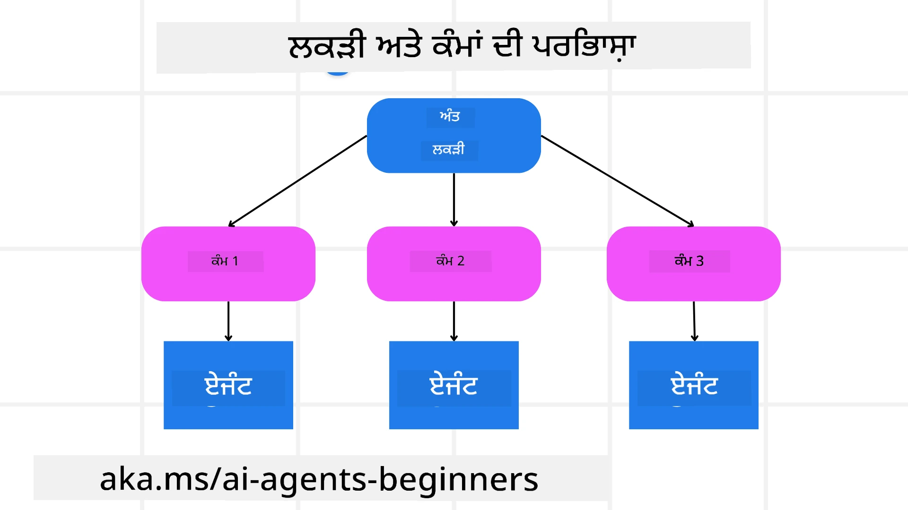

[](https://youtu.be/kPfJ2BrBCMY?si=9pYpPXp0sSbK91Dr)

> _(ਇਸ ਪਾਠ ਦਾ ਵੀਡੀਓ ਦੇਖਣ ਲਈ ਉਪਰ ਦਿੱਤੀ ਤਸਵੀਰ 'ਤੇ ਕਲਿੱਕ ਕਰੋ)_

# ਯੋਜਨਾ ਡਿਜ਼ਾਈਨ

## ਪਰਿਚਯ

ਇਹ ਪਾਠ ਕਵਰ ਕਰੇਗਾ

* ਇੱਕ ਸਾਫ਼ ਸਪਸ਼ਟ ਕੁੱਲ ਮਕਸਦ ਨੂੰ ਪਰਿਭਾਸ਼ਿਤ ਕਰਨਾ ਅਤੇ ਇੱਕ ਜਟਿਲ ਕੰਮ ਨੂੰ ਪ੍ਰਬੰਧਨਯੋਗ ਕਾਰਜਾਂ ਵਿੱਚ ਵੰਡਣਾ।
* ਵਿਸ਼ਵਾਸਯੋਗ ਅਤੇ ਮਸ਼ੀਨ ਪੜ੍ਹਨਯੋਗ ਜਵਾਬਾਂ ਲਈ ਸੰਰਚਿਤ ਨਿਕਾਸ ਦਾ ਲਾਭ ਲੈਣਾ।
* ਗਤੀਸ਼ੀਲ ਕਾਰਜਾਂ ਅਤੇ ਅਣਪੇਖੇ ਇਨਪੁਟਾਂ ਨੂੰ ਸੰਭਾਲਣ ਲਈ ਘਟਨਾ-ਚਾਲਿਤ ਪন্থਾ ਲਾਗੂ ਕਰਨਾ।

## ਸਿੱਖਣ ਦੇ ਲਕੜੀ

ਇਸ ਪਾਠ ਨੂੰ ਪੂਰਾ ਕਰਨ ਤੋਂ ਬਾਅਦ, ਤੁਹਾਨੂੰ ਇਸ ਬਾਰੇ ਸਮਝ ਹੋਵੇਗੀ:

* ਇੱਕ ਏਆਈ ਏਜੰਟ ਲਈ ਕੁੱਲ ਮਕਸਦ ਚੀਨ੍ਹਣਾ ਅਤੇ ਸੈੱਟ ਕਰਨਾ, ਇਹ ਯਕੀਨੀ ਬਣਾਉਂਦੇ ਹੋਏ ਕਿ ਉਹ ਸਪਸ਼ਟ ਤੌਰ 'ਤੇ ਜਾਣਦਾ ਹੈ ਕਿ ਕੀ ਪ੍ਰਾਪਤ ਕਰਨਾ ਹੈ।
* ਇੱਕ ਜਟਿਲ ਕੰਮ ਨੂੰ ਪ੍ਰਬੰਧਨਯੋਗ ਉਪਕਾਰਜਾਂ ਵਿੱਚ ਤੋੜਨਾ ਅਤੇ ਉਹਨਾਂ ਨੂੰ ਤਰਤੀਬ ਦੇ ਫਰਮਾ ਵਿੱਚ ਗਠਿਤ ਕਰਨਾ।
* ਏਜੰਟਾਂ ਨੂੰ ਸਹੀ ਸੰਦਾਂ (ਜਿਵੇਂ ਕਿ ਖੋਜ ਸੰਦ ਜਾਂ ਡਾਟਾ ਵਿਸ਼ਲੇਸ਼ਣ ਸੰਦ) ਨਾਲ ਸਜੋਣਾ, ਇਹ ਫੈਸਲਾ ਕਰਨਾ ਕਿਵੇਂ ਅਤੇ ਕਦੋਂ ਸੇ ਵਰਤਣਾ ਹੈ, ਅਤੇ ਅਣਪਛਾਤੀਆਂ ਸਥਿਤੀਆਂ ਨੂੰ ਸੰਭਾਲਣਾ।
* ਉਪਕਾਰਜ ਦੇ ਨਤੀਜੇ ਦਾ ਮੁਲਾਂਕਣ ਕਰਨਾ, ਪ੍ਰਦਰਸ਼ਨ ਮਾਪਣਾ ਅਤੇ ਅੰਤਿਮ ਨਿਕਾਸ ਵਿਖੇ ਸੁਧਾਰ ਲਈ ਕਾਰਵਾਈ ਕਰਨਾ।

## ਕੁੱਲ ਮਕਸਦ ਦੀ ਪਰਿਭਾਸ਼ਾ ਅਤੇ ਇੱਕ ਕਾਰਜ ਨੂੰ ਵੰਡਣਾ



ਅਧਿਕਤਰ ਅਸਲ ਦੁਨੀਆ ਦੇ ਕਾਰਜ ਇੱਕ ਕਦਮ ਵਿੱਚ ਤੁਰੂਣ ਲਈ ਬਹੁਤ ਜਟਿਲ ਹੁੰਦੇ ਹਨ। ਇੱਕ ਏਆਈ ਏਜੰਟ ਨੂੰ ਆਪਣੇ ਯੋਜਨਾ ਅਤੇ ਕਰਵਾਈਆਂ ਨੂੰ ਮਾਰਗਦਰਸ਼ਨ ਦੇਣ ਲਈ ਇੱਕ ਸੰਖੇਪ ਉਦਦੇਸ਼ ਦੀ ਲੋੜ ਹੁੰਦੀ ਹੈ। ਉਦਾਹਰਣ ਵਜੋਂ, ਹੇਠਾਂ ਦਿੱਤੇ ਮਕਸਦ 'ਤੇ ਵਿਚਾਰ ਕਰੋ:

    "3 ਦਿਨਾਂ ਦੀ ਯਾਤਰਾ ਸੰਚੀ ਬਣਾਉ।"

ਜਦੋਂ ਕਿ ਇਹ ਬਿਆਨ ਕਰਨਾ ਸੌਖਾ ਹੈ, ਇਹ ਫਿਰ ਵੀ ਸੁਧਾਰ ਦੀ ਲੋੜ ਰੱਖਦਾ ਹੈ। ਜਿਵੇਂ ਜ਼ਿਆਦਾ ਸਪਸ਼ਟ ਮਕਸਦ ਹੋਵੇਗਾ, ਓਹਨਾ ਐਜੰਟਾਂ (ਅਤੇ ਮਨੁੱਖ ਸਹਯੋਗੀਆਂ) ਨੂੰ ਸਹੀ ਨਤੀਜਾ ਪ੍ਰਾਪਤ ਕਰਨ ਤੇ ਧਿਆਨ ਕੇਂਦਰਿਤ ਕਰਨ ਵਿੱਚ ਮਦਦ ਮਿਲੇਗੀ, ਜਿਵੇਂ ਕਿ ਇੱਕ ਵਿਸਥਾਰਿਤ ਯਾਤਰਾ ਸੰਚੀ, ਜਿਸ ਵਿੱਚ ਫਲਾਈਟ ਵਿਕਲਪ, ਹੋਟਲ ਸਿਫਾਰਸ਼ਾਂ ਅਤੇ ਗਤੀਵਿਧੀ ਸੁਝਾਅ ਸ਼ਾਮਲ ਹਨ।

### ਕਾਰਜ ਵੰਡਣਾ

ਵੱਡੇ ਜਾਂ ਜਟਿਲ ਕਾਰਜ ਵੱਡੇ ਅਤੇ ਲਕੜੀਮਈ ਉਪਕਾਰਜਾਂ ਵਿੱਚ ਵੰਡੇ ਜਾਣ ਇਨਹੇੰ ਨੂੰ ਵੱਧ ਪ੍ਰਬੰਧਨਯੋਗ ਬਣਾਉਂਦਾ ਹੈ।
ਯਾਤਰਾ ਸੰਚੀ ਉਦਾਹਰਣ ਲਈ, ਤੁਸੀਂ ਮਕਸਦ ਨੂੰ ਵੰਡ ਸਕਦੇ ਹੋ:

* ਫਲਾਈਟ ਬੁਕਿੰਗ
* ਹੋਟਲ ਬੁਕਿੰਗ
* ਕਾਰ ਕਿਰਾਏ 'ਤੇ ਲੈਣਾ
* ਵਿਅਕਤੀਗਤীকਰਨ

ਹਰ ਉਪਕਾਰਜ ਨੂੰ ਫਿਰ ਨੇਮਿਤ ਏਜੰਟਾਂ ਜਾਂ ਪ੍ਰਕਿਰਿਆਵਾਂ ਦੁਆਰਾ ਸੰਭਾਲਿਆ ਜਾ ਸਕਦਾ ਹੈ। ਇੱਕ ਏਜੰਟ ਬਿਹਤਰ ਫਲਾਈਟ ਦੇਲਾਂ ਦੀ ਖੋਜ ਵਿੱਚ ਮਾਹਿਰ ਹੋ ਸਕਦਾ ਹੈ, ਦੂਜਾ ਹੋਟਲ ਬੁਕਿੰਗ 'ਤੇ ਧਿਆਨ ਦੇ ਸਕਦਾ ਹੈ, ਆਦਿ। ਇੱਕ ਕੋਆਰਡੀਨੇਟਿੰਗ ਜਾਂ "ਡਾਊਨਸਟਰੀਮ" ਏਜੰਟ ਫਿਰ ਇਹ ਨਤੀਜੇ ਇੱਕ ਸੰਗਠਿਤ ਯਾਤਰਾ ਸੰਚੀ ਵਿੱਚ ਅੰਤਮ ਉਪਭੋਗਤਾ ਲਈ ਤਿਆਰ ਕਰਦਾ ਹੈ।

ਇਹ ਮਾਡਿਊਲਰ ਪਧਤੀ ਇਨਕ੍ਰਿਮੈਂਟਲ ਸੁਧਾਰਾਂ ਲਈ ਭੀ ਸਹੂਲਤ ਦਿੰਦੀ ਹੈ। ਉਦਾਹਰਣ ਵਜੋਂ, ਤੁਸੀਂ ਖ਼ੁਰਾਕ ਦੀ ਸਿਫਾਰਸ਼ਾਂ ਜਾਂ ਸਥਾਨਕ ਗਤੀਵਿਧੀ ਸੁਝਾਅ ਲਈ ਵਿਸ਼ੇਸ਼ ਈਜੇਣਟ ਸ਼ਾਮਿਲ ਕਰ ਸਕਦੇ ਹੋ ਅਤੇ ਸਮੇਂ ਦੇ ਨਾਲ ਯਾਤਰਾ ਸੰਚੀ ਨੂੰ ਸੁਧਾਰ ਸਕਦੇ ਹੋ।

### ਸੰਰਚਿਤ ਨਿਕਾਸ

ਵੱਡੇ ਭਾਸ਼ਾ ਮਾਡਲ (LLMs) ਸੰਰਚਿਤ ਨਿਕਾਸ (ਜਿਵੇਂ JSON) ਤਿਆਰ ਕਰ ਸਕਦੇ ਹਨ ਜੋ ਡਾਊਨਸਟ੍ਰੀਮ ਏਜੰਟਾਂ ਜਾਂ ਸੇਵਾਵਾਂ ਲਈ ਪੜ੍ਹਨ ਅਤੇ ਪ੍ਰਕਿਰਿਆ ਕਰਨ ਵਿੱਚ ਸੌਖਾ ਹੁੰਦਾ ਹੈ। ਇਹ ਖਾਸ ਕਰਕੇ ਬਹੁ-ਏਜੰਟ ਸੰਦਰਭ ਵਿੱਚ ਲਾਭਕਾਰੀ ਹੈ, ਜਿੱਥੇ ਅਸੀਂ ਨੁਕਤਾਂ ਦੀ ਯੋਜਨਾ ਪ੍ਰਾਪਤ ਕਰਨ ਤੋਂ ਬਾਅਦ ਇਹ ਕਾਰਜ ਕਰ ਸਕਦੇ ਹਾਂ।

ਹੇਠਾਂ ਦਿੱਤੀ ਪਾਈਥਨ ਕੋਡ ਦਾ ਨਮੂਨਾ ਇੱਕ ਸਧਾਰਣ ਯੋਜਨਾ ਏਜੰਟ ਨੂੰ ਮਕਸਦ ਨੂੰ ਉਪਕਾਰਜਾਂ ਵਿੱਚ ਵੰਡਦੇ ਅਤੇ ਇੱਕ ਸੰਰਚਿਤ ਯੋਜਨਾ ਬਣਾਉਂਦੇ ਦਿਖਾਉਂਦਾ ਹੈ:

```python
from pydantic import BaseModel
from enum import Enum
from typing import List, Optional, Union
import json
import os
from typing import Optional
from pprint import pprint
from agent_framework.azure import AzureAIProjectAgentProvider
from azure.identity import AzureCliCredential

class AgentEnum(str, Enum):
    FlightBooking = "flight_booking"
    HotelBooking = "hotel_booking"
    CarRental = "car_rental"
    ActivitiesBooking = "activities_booking"
    DestinationInfo = "destination_info"
    DefaultAgent = "default_agent"
    GroupChatManager = "group_chat_manager"

# ਯਾਤਰਾ ਸਬਟਾਸਕ ਮਾਡਲ
class TravelSubTask(BaseModel):
    task_details: str
    assigned_agent: AgentEnum  # ਅਸੀਂ ਏਜੰਟ ਨੂੰ ਟਾਸਕ ਸੌਂਪਣਾ ਚਾਹੁੰਦੇ ਹਾਂ

class TravelPlan(BaseModel):
    main_task: str
    subtasks: List[TravelSubTask]
    is_greeting: bool

provider = AzureAIProjectAgentProvider(credential=AzureCliCredential())

# ਯੂਜ਼ਰ ਸੁਨੇਹਾ ਪਰਿਭਾਸ਼ਿਤ ਕਰੋ
system_prompt = """You are a planner agent.
    Your job is to decide which agents to run based on the user's request.
    Provide your response in JSON format with the following structure:
{'main_task': 'Plan a family trip from Singapore to Melbourne.',
 'subtasks': [{'assigned_agent': 'flight_booking',
               'task_details': 'Book round-trip flights from Singapore to '
                               'Melbourne.'}
    Below are the available agents specialised in different tasks:
    - FlightBooking: For booking flights and providing flight information
    - HotelBooking: For booking hotels and providing hotel information
    - CarRental: For booking cars and providing car rental information
    - ActivitiesBooking: For booking activities and providing activity information
    - DestinationInfo: For providing information about destinations
    - DefaultAgent: For handling general requests"""

user_message = "Create a travel plan for a family of 2 kids from Singapore to Melbourne"

response = client.create_response(input=user_message, instructions=system_prompt)

response_content = response.output_text
pprint(json.loads(response_content))
```

### ਮਲਟੀ-ਏਜੰਟ ਆਰਕੇਸਟ੍ਰੇਸ਼ਨ ਨਾਲ ਯੋਜਨਾ ਏਜੰਟ

ਇਸ ਉਦਾਹਰਣ ਵਿੱਚ, ਇੱਕ ਸੈਮਾਂਟਿਕ ਰਾਊਟਰ ਏਜੰਟ ਨੂੰ ਯੂਜ਼ਰ ਦੀ ਮੰਗ ਮਿਲਦੀ ਹੈ (ਉਦਾਹਰਣ ਵਜੋਂ, "ਮੈਨੂੰ ਆਪਣੀ ਯਾਤਰਾ ਲਈ ਹੋਟਲ ਯੋਜਨਾ ਚਾਹੀਦੀ ਹੈ।").

ਯੋਜਕ ਫਿਰ:

* ਹੋਟਲ ਯੋਜਨਾ ਪ੍ਰਾਪਤ ਕਰਦਾ ਹੈ: ਯੋਜਕ ਯੂਜ਼ਰ ਦਾ ਸੁਨੇਹਾ ਲੈਂਦਾ ਹੈ ਅਤੇ ਇੱਕ ਸਿਸਟਮ ਪ੍ਰੰਪਟ (ਜਿਸ ਵਿੱਚ ਉਪਲਬਧ ਏਜੰਟ ਜਾਣਕਾਰੀ ਸ਼ਾਮਲ ਹੈ) ਦੇ ਅਧਾਰ 'ਤੇ ਇੱਕ ਸੰਰਚਿਤ ਯਾਤਰਾ ਯੋਜਨਾ ਤਿਆਰ ਕਰਦਾ ਹੈ।
* ਏਜੰਟਾਂ ਅਤੇ ਉਹਨਾਂ ਦੇ ਸੰਦਾਂ ਦੀ ਸੂਚੀ ਬਣਾਉਂਦਾ ਹੈ: ਏਜੰਟ ਰਜਿਸਟਰੀ ਵਿੱਚ ਏਜੰਟਾਂ ਦੀ ਸੂਚੀ ਹੁੰਦੀ ਹੈ (ਜਿਵੇਂ ਕਿ ਫਲਾਈਟ, ਹੋਟਲ, ਕਾਰ ਕਿਰਾਇਆ ਅਤੇ ਗਤੀਵਿਧੀਆਂ ਲਈ) ਅਤੇ ਉਹਨਾਂ ਦੇ ਫੰਕਸ਼ਨਾਂ ਜਾਂ ਸੰਦਾਂ ਨਾਲ।
* ਯੋਜਨਾ ਨੂੰ ਸੰਬੰਧਿਤ ਏਜੰਟਾਂ ਨੂੰ ਰਾਹ ਦਿੰਦਾ ਹੈ: ਉਪਕਾਰਜਾਂ ਦੀ ਗਿਣਤੀ 'ਤੇ ਨਿਰਭਰ ਕਰਕੇ, ਯੋਜਕ ਸੁਨੇਹਾ ਸਿੱਧਾ ਕਿਸੇ  ਨਿਯੁਕਤ ਏਜੰਟ ਨੂੰ ਭੇਜਦਾ ਹੈ (ਇੱਕ-ਕਾਰਜ ਸਥਿਤੀਆਂ ਲਈ) ਜਾਂ ਮਲਟੀ-ਏਜੰਟ ਸਹਿਯੋਗ ਲਈ ਗਰੁੱਪ ਚੈਟ ਮੇਨੇਜਰ ਰਾਹੀਂ ਕੋਆਰਡੀਨੇਟ ਕਰਦਾ ਹੈ।
* ਨਤੀਜੇ ਦਾ ਸੰਖੇਪ ਕਰਦਾ ਹੈ: ਆਖ਼ਰਕਾਰ, ਯੋਜਕ ਤਿਆਰ ਕੀਤੀ ਗਈ ਯੋਜਨਾ ਦਾ ਸਪਸ਼ਟਤਾ ਲਈ ਸੰਖੇਪ ਕਰਦਾ ਹੈ।
ਹੇਠਾਂ ਦਿੱਤਾ ਪਾਈਥਨ ਕੋਡ ਸਹੀ ਤਰੀਕੇ ਨਾਲ ਇਹ ਕਦਮ ਦਰਸਾਉਂਦਾ ਹੈ:

```python

from pydantic import BaseModel

from enum import Enum
from typing import List, Optional, Union

class AgentEnum(str, Enum):
    FlightBooking = "flight_booking"
    HotelBooking = "hotel_booking"
    CarRental = "car_rental"
    ActivitiesBooking = "activities_booking"
    DestinationInfo = "destination_info"
    DefaultAgent = "default_agent"
    GroupChatManager = "group_chat_manager"

# ਯਾਤਰਾ ਸਬਟਾਸਕ ਮਾਡਲ

class TravelSubTask(BaseModel):
    task_details: str
    assigned_agent: AgentEnum # ਅਸੀੰ ਟਾਸਕ ਏਜੰਟ ਨੂੰ ਸੌਂਪਣਾ ਚਾਹੁੰਦੇ ਹਾਂ

class TravelPlan(BaseModel):
    main_task: str
    subtasks: List[TravelSubTask]
    is_greeting: bool
import json
import os
from typing import Optional

from agent_framework.azure import AzureAIProjectAgentProvider
from azure.identity import AzureCliCredential

# ਕਲਾਇੰਟ ਬਣਾਓ

provider = AzureAIProjectAgentProvider(credential=AzureCliCredential())

from pprint import pprint

# ਯੂਜ਼ਰ ਸੁਨੇਹਾ ਪਰਿਭਾਸ਼ਿਤ ਕਰੋ

system_prompt = """You are a planner agent.
    Your job is to decide which agents to run based on the user's request.
    Below are the available agents specialized in different tasks:
    - FlightBooking: For booking flights and providing flight information
    - HotelBooking: For booking hotels and providing hotel information
    - CarRental: For booking cars and providing car rental information
    - ActivitiesBooking: For booking activities and providing activity information
    - DestinationInfo: For providing information about destinations
    - DefaultAgent: For handling general requests"""

user_message = "Create a travel plan for a family of 2 kids from Singapore to Melbourne"

response = client.create_response(input=user_message, instructions=system_prompt)

response_content = response.output_text

# ਇਸਨੂੰ JSON ਵਜੋਂ ਲੋਡ ਕਰਨ ਤੋਂ ਬਾਅਦ ਪ੍ਰਤਿਕਿਰਿਆ ਸਮੱਗਰੀ ਛਪਾਓ

pprint(json.loads(response_content))
```

ਅੱਗੇ ਦਿੱਤਾ ਨਤੀਜਾ ਪਹਿਲੇ ਕੋਡ ਤੋਂ ਆਉਂਦਾ ਹੈ ਅਤੇ ਤੁਸੀਂ ਫਿਰ ਇਸ ਸੰਰਚਿਤ ਨਿਕਾਸ ਨੂੰ `assigned_agent` ਨੂੰ ਦੇ ਕੇ ਯਾਤਰਾ ਯੋਜਨਾ ਨੂੰ ਅੰਤਮ ਉਪਭੋਗਤਾ ਨੂੰ ਸੰਖੇਪ ਕਰ ਸਕਦੇ ਹੋ।

```json
{
    "is_greeting": "False",
    "main_task": "Plan a family trip from Singapore to Melbourne.",
    "subtasks": [
        {
            "assigned_agent": "flight_booking",
            "task_details": "Book round-trip flights from Singapore to Melbourne."
        },
        {
            "assigned_agent": "hotel_booking",
            "task_details": "Find family-friendly hotels in Melbourne."
        },
        {
            "assigned_agent": "car_rental",
            "task_details": "Arrange a car rental suitable for a family of four in Melbourne."
        },
        {
            "assigned_agent": "activities_booking",
            "task_details": "List family-friendly activities in Melbourne."
        },
        {
            "assigned_agent": "destination_info",
            "task_details": "Provide information about Melbourne as a travel destination."
        }
    ]
}
```

ਪਿਛਲੇ ਕੋਡ ਨਮੂਨੇ ਨਾਲ ਇੱਕ ਉਦਾਹਰਣ ਨੋਟਬੁੱਕ ਇੱਥੇ ਉਪਲਬਧ ਹੈ [here](07-python-agent-framework.ipynb)।

### ਦੁਹਰਾਉਂਦੇ ਯੋਜਨਾ ਬਨਾਉਣਾ

ਕੁਝ ਕਾਰਜਾਂ ਲਈ ਵਾਪਸੀ ਜਾਂ ਦੁਹਰਾਈ ਜਾਂ ਦੁਬਾਰਾ ਯੋਜਨਾ ਬਣਾਉਣੀ ਦੀ ਲੋੜ ਹੁੰਦੀ ਹੈ, ਜਿੱਥੇ ਇੱਕ ਉਪਕਾਰਜ ਦਾ ਨਤੀਜਾ ਅਗਲੇ 'ਤੇ ਅਸਰ ਪਾਂਦਾ ਹੈ। ਉਦਾਹਰਣ ਵਜੋਂ, ਜੇ ਏਜੰਟ ਫਲਾਈਟ ਬੁਕਿੰਗ ਦੌਰਾਨ ਅਣਪੇਛਾਤਾ ਡਾਟਾ ਫਾਰਮੈਟ ਮਿਲਦਾ ਹੈ, ਤਾਂ ਉਸ ਨੂੰ ਹੋਟਲ ਬੁਕਿੰਗ ਕਰਨ ਤੋਂ ਪਹਿਲਾਂ ਆਪਣੀ ਰਣਨੀਤੀ ਅਡੈਪਟ ਕਰਨੀ ਪੈ ਸਕਦੀ ਹੈ।

ਇਸਦੇ ਨਾਲ ਹੀ, ਯੂਜ਼ਰ ਦਾ ਫੀਡਬैक (ਜਿਵੇਂ ਕਿ ਕੋਈ ਮਨੁੱਖ ਫੈਸਲਾ ਕਰਦਾ ਹੈ ਕਿ ਉਹ ਪਹਿਲਾਂ ਦੀ ਫਲਾਈਟ ਪਸੰਦ ਕਰਦਾ ਹੈ) ਹਿੱਸੇਵਾਰ ਦੁਬਾਰਾ ਯੋਜਨਾ ਬਣਾਉਣ ਨੂੰ ਟ੍ਰਿਗਰ ਕਰ ਸਕਦਾ ਹੈ। ਇਹ ਗਤੀਸ਼ੀਲ, ਦੁਹਰਾਈ ਜਾਂਦੀ ਪদ্ধਤੀ ਇਹ ਯਕੀਨੀ ਬਣਾਉਂਦੀ ਹੈ ਕਿ ਅਖੀਰਕ ਸਮાધਾਨ ਅਸਲ ਸੰਸਾਰ ਦੀਆਂ ਸੀਮਾਵਾਂ ਅਤੇ ਬਦਲਦੇ ਯੂਜ਼ਰ ਪਸੰਦਾਂ ਨਾਲ ਮੇਲ ਖਾਂਦਾ ਹੈ।

ਉਦਾਹਰਣ ਲਈ ਕੋਡ

```python
from agent_framework.azure import AzureAIProjectAgentProvider
from azure.identity import AzureCliCredential
#.. ਪਿਛਲੇ ਕੋਡ ਵਾਂਗ ਹੀ ਅਤੇ ਯੂਜ਼ਰ ਇਤਿਹਾਸ, ਮੌਜੂਦਾ ਯੋਜਨਾ ਸੌਂਪੋ

system_prompt = """You are a planner agent to optimize the
    Your job is to decide which agents to run based on the user's request.
    Below are the available agents specialized in different tasks:
    - FlightBooking: For booking flights and providing flight information
    - HotelBooking: For booking hotels and providing hotel information
    - CarRental: For booking cars and providing car rental information
    - ActivitiesBooking: For booking activities and providing activity information
    - DestinationInfo: For providing information about destinations
    - DefaultAgent: For handling general requests"""

user_message = "Create a travel plan for a family of 2 kids from Singapore to Melbourne"

response = client.create_response(
    input=user_message,
    instructions=system_prompt,
    context=f"Previous travel plan - {TravelPlan}",
)
# .. ਮੁੜ ਯੋਜਨਾ ਬਣਾਓ ਅਤੇ ਟਾਸਕਾਂ ਨੂੰ ਸੰਬੰਧਿਤ ਏਜੰਟਾਂ ਨੂੰ ਭੇਜੋ
```

ਵੱਧ ਪੁੱਢਣ ਲਈ, ਮੈਗਨੈਟਿਕ ਵਨ <a href="https://www.microsoft.com/research/articles/magentic-one-a-generalist-multi-agent-system-for-solving-complex-tasks" target="_blank">ਬਲੌਗਪੋਸਟ</a> ਵੇਖੋ ਜੋ ਜਟਿਲ ਕਾਰਜਾਂ ਸਮਾਧਾਨ ਲਈ ਹੈ।

## ਸਾਰਾਂਸ਼

ਇਸ ਲੇਖ ਵਿੱਚ ਅਸੀਂ ਵੇਖਿਆ ਕਿ ਅਸੀਂ ਕਿਵੇਂ ਇੱਕ ਐਸਾ ਯੋਜਕ ਤਿਆਰ ਕਰ ਸਕਦੇ ਹਾਂ ਜੋ ਪਰਿਭਾਸ਼ਿਤ ਉਪਲਬਧ ਏਜੰਟਾਂ ਵਿੱਚੋਂ ਗਤੀਸ਼ੀਲ ਤੌਰ 'ਤੇ ਚੁਣਦਾ ਹੈ। ਯੋਜਕ ਦਾ ਨਿਕਾਸ ਕਾਰਜਾਂ ਨੂੰ ਵੰਡਦਾ ਹੈ ਅਤੇ ਏਜੰਟਾਂ ਨੂੰ ਸਿੱਲ ਕਰਦਾ ਹੈ ਤਾਂ ਜੋ ਉਹ ਕਾਰਜ ਕਰ ਸਕਣ। ਇਹ ਮੰਨਿਆ ਗਿਆ ਹੈ ਕਿ ਏਜੰਟਾਂ ਕੋਲ ਕਾਰਜ ਕਰਨ ਲਈ ਲੋੜੀਂਦੇ ਫੰਕਸ਼ਨਾਂ/ਸੰਦਾਂ ਤੱਕ ਪਹੁੰਚ ਹੈ। ਏਜੰਟਾਂ ਦੇ ਇਲਾਵਾ ਤੁਸੀਂ ਹੋਰ ਪੈਟਰਨ ਵਰਗੇ ਰਿਫਲੇਕਸ਼ਨ, ਸੰਖੇਪਕਾਰ ਅਤੇ ਰਾਊਂਡ ਰੋਬਿਨ ਚੈਟ ਨੂੰ ਸ਼ਾਮਿਲ ਕਰਕੇ ਹੋਰ ਵਿਅਕਤੀਗਤਕਰਨ ਕਰ ਸਕਦੇ ਹੋ।

## ਹੋਰ ਸਾਧਨ

ਮੈਗਨੈਟਿਕ ਵਨ - ਇੱਕ ਸਾਰਥਕ ਮਲਟੀ-ਏਜੰਟ ਪ੍ਰਣਾਲੀ ਜੋ ਜਟਿਲ ਕਾਰਜਾਂ ਨੂੰ ਹੱਲ ਕਰਦੀ ਹੈ ਅਤੇ ਕਈ ਮੁਸ਼ਕਿਲ ਏਜੰਟਿਕ ਬੈਂਚਮਾਰਕਾਂ 'ਤੇ ਪ੍ਰਸ਼ੰਸਨীয় ਨਤੀਜੇ ਹਾਸਲ ਕਰ ਚੁੱਕੀ ਹੈ। ਸੰਦਰਭ: <a href="https://www.microsoft.com/research/articles/magentic-one-a-generalist-multi-agent-system-for-solving-complex-tasks" target="_blank">ਮੈਗਨੈਟਿਕ ਵਨ</a>। ਇਸ ਲਾਗੂ ਕਰਨ ਵਿੱਚ, ਆਰਕੇਸਟ੍ਰੇਟਰ ਕਾਰਜ-ਵਿਸ਼ੇਸ਼ ਯੋਜਨਾਵਾਂ ਬਣਾਉਂਦਾ ਹੈ ਅਤੇ ਇਹ ਕਾਰਜ ਉਪਲਬਧ ਏਜੰਟਾਂ ਨੂੰ ਅਸਾਈਨ ਕਰਦਾ ਹੈ। ਯੋਜਨਾ ਬਣਾਉਣ ਦੇ ਨਾਲ ਨਾਲ, ਆਰਕੇਸਟ੍ਰੇਟਰ ਕਾਰਜ ਦੀ ਉਨਤੀ ਦੀ ਨਿਗਰਾਨੀ ਲਈ ਟ੍ਰੈਕਿੰਗ ਪ੍ਰਣਾਲੀ ਨੂੰ ਵੀ ਵਰਤਦਾ ਹੈ ਅਤੇ ਲੋੜੀਅਨੁਸਾਰ ਦੁਬਾਰਾ ਯੋਜਨਾ ਬਣਾਉਂਦਾ ਹੈ।

### ਯੋਜਨਾ ਡਿਜ਼ਾਈਨ ਪੈਟਰਨ ਬਾਰੇ ਹੋਰ ਪ੍ਰਸ਼ਨ ਹਨ?

[Microsoft Foundry Discord](https://aka.ms/ai-agents/discord) ਵਿੱਚ ਜੁੜੋ ਹੋਰ ਸਿੱਖਣ ਵਾਲਿਆਂ ਨਾਲ ਮਿਲਣ ਲਈ, ਦਫਤਰ ਘੰਟਿਆਂ ਵਿੱਚ ਸ਼ਾਮਿਲ ਹੋਵੋ ਅਤੇ ਆਪਣੇ AI ਏਜੰਟਾਂ ਦੇ ਪ੍ਰਸ਼ਨਾਂ ਦੇ ਜਵਾਬ ਪ੍ਰਾਪਤ ਕਰੋ।

## ਪਹਿਲਾ ਪਾਠ

[ਵਿਸ਼ਵਾਸਯੋਗ AI ਏਜੰਟ ਬਣਾਉਣਾ](../06-building-trustworthy-agents/README.md)

## ਅਗਲਾ ਪਾਠ

[ਮਲਟੀ-ਏਜੰਟ ਡਿਜ਼ਾਈਨ ਪੈਟਰਨ](../08-multi-agent/README.md)

---

<!-- CO-OP TRANSLATOR DISCLAIMER START -->
**ਇਤਰਾਜ਼**:  
ਇਸ ਦਸਤਾਵੇਜ਼ ਦਾ ਅਨੁਵਾਦ ਏਆਈ ਅਨੁਵਾਦ ਸੇਵਾ [Co-op Translator](https://github.com/Azure/co-op-translator) ਦੀ ਵਰਤੋਂ ਕਰਕੇ ਕੀਤਾ ਗਿਆ ਹੈ। ਜਦੋਂ ਕਿ ਅਸੀਂ ਸਹੀਅਤ ਲਈ ਕੋਸ਼ਿਸ਼ ਕਰਦੇ ਹਾਂ, ਕਿਰਪਾ ਕਰਕੇ ਧਿਆਨ ਰੱਖੋ ਕਿ ਸਵੈਚਾਲਿਤ ਅਨੁਵਾਦਾਂ ਵਿੱਚ ਗਲਤੀਆਂ ਜਾਂ ਅਸਮਰਥਤਾਵਾਂ ਹੋ ਸਕਦੀਆਂ ਹਨ। ਮੂਲ ਦਸਤਾਵੇਜ਼ ਉਸਦੀ ਮੂਲ ਭਾਸ਼ਾ ਵਿੱਚ ਪ੍ਰਮਾਣਿਕ ਸਰੋਤ ਮੰਨਿਆ ਜਾਣਾ ਚਾਹੀਦਾ ਹੈ। ਮਹੱਤਵਪੂਰਨ ਜਾਣਕਾਰੀ ਲਈ, ਪ੍ਰਫੈਸ਼ਨਲ ਮਨੁੱਖੀ ਅਨੁਵਾਦ ਦੀ ਸਿਫਾਰਸ਼ ਕੀਤੀ ਜਾਂਦੀ ਹੈ। ਇਸ ਅਨੁਵਾਦ ਦੀ ਵਰਤੋਂ ਤੋਂ ਉਤਪੰਨ ਹੋਣ ਵਾਲੀਆਂ ਕਿਸੇ ਵੀ ਗਲਤਾ ਜਾਂ ਗਲਤਫਹਿਮੀ ਲਈ ਅਸੀਂ ਜ਼ਿੰਮੇਵਾਰ ਨਹੀਂ ਹਾਂ।
<!-- CO-OP TRANSLATOR DISCLAIMER END -->