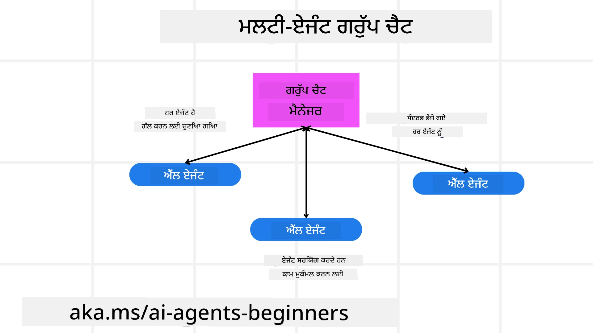
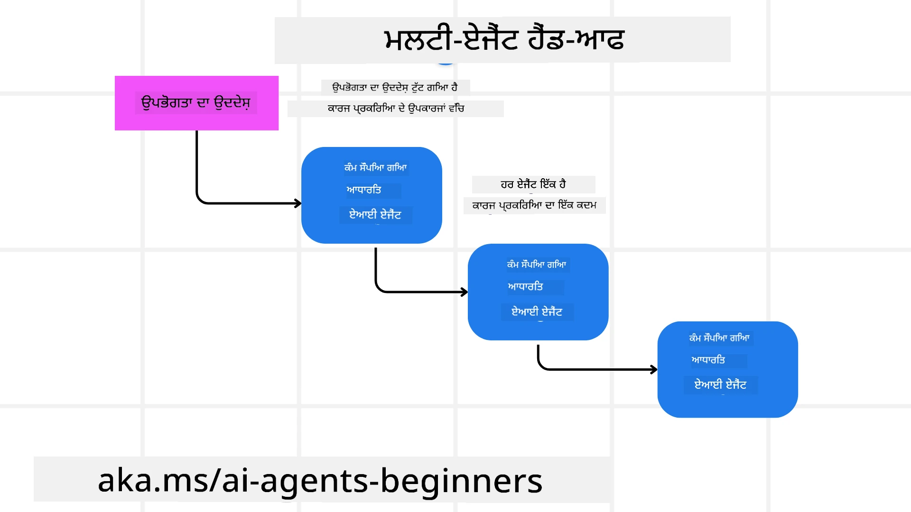
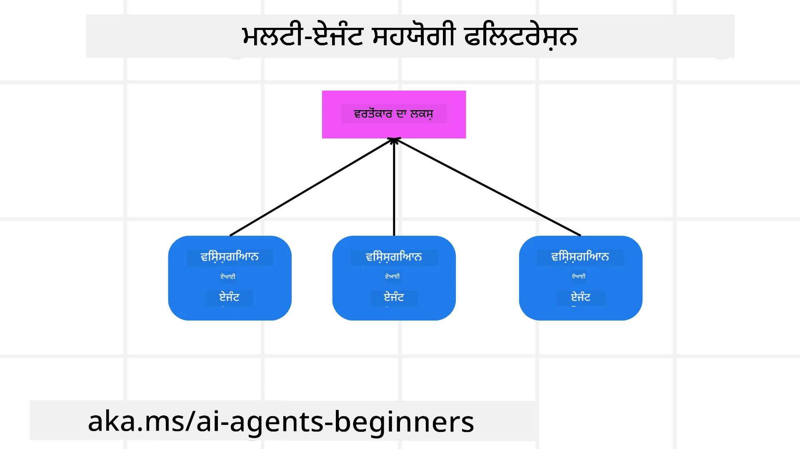

> _(ਇਸ ਪਾਠ ਦੀ ਵੀਡੀਓ ਵੇਖਣ ਲਈ ਉਪਰ ਵਾਲੀ ਤਸਵੀਰ 'ਤੇ ਕਲਿੱਕ ਕਰੋ)_

# ਮਲਟੀ-ਏਜੰਟ ਡਿਜ਼ਾਈਨ ਪੈਟਰਨ

ਜਿਵੇਂ ਹੀ ਤੁਸੀਂ ਕਿਸੇ ਪ੍ਰੋਜੈਕਟ 'ਤੇ ਕੰਮ ਸ਼ੁਰੂ ਕਰਦੇ ਹੋ ਜਿਸ ਵਿੱਚ ਕਈ ਏਜੰਟ ਸ਼ਾਮਲ ਹੁੰਦੇ ਹਨ, ਤੁਹਾਨੂੰ ਮਲਟੀ-ਏਜੰਟ ਡਿਜ਼ਾਈਨ ਪੈਟਰਨ ਬਾਰੇ ਸੋਚਣਾ ਪੈਂਦਾ ਹੈ। ਪਰ ਇਹ ਸਿੱਧਾ ਨਹੀਂ ਹੁੰਦਾ ਕਿ ਕਦੋਂ ਸਿੰਗਲ ਏਜੰਟ ਤੋਂ ਮਲਟੀ-ਏਜੰਟ ਤੇ ਬਦਲਣਾ ਚਾਹੀਦਾ ਹੈ ਅਤੇ ਇਸਦੇ ਕੀ ਫਾਇਦੇ ਹਨ।

## ਪਰੀਚਯ

ਇਸ ਪਾਠ ਵਿਚ, ਅਸੀਂ ਹੇਠਾਂ ਦਿੱਤੇ ਸਵਾਲਾਂ ਦੇ ਜਵਾਬ ਦੇਖ ਰਹੇ ਹਾਂ:

- ਕਿਹੜੇ ਸੰਦਰਭ ਹਨ ਜਿੱਥੇ ਮਲਟੀ-ਏਜੰਟ ਲਾਗੂ ਹੋ ਸਕਦੇ ਹਨ?
- ਇਕਕਾਰ ਏਜੰਟ ਨਾਲੋਂ ਮਲਟੀ-ਏਜੰਟ ਵਰਤਣ ਦੇ ਕੀ ਫਾਇਦੇ ਹਨ ਜੋ ਬਹੁਤ ਸਾਰੇ ਕੰਮ ਕਰਦਾ ਹੈ?
- ਮਲਟੀ-ਏਜੰਟ ਡਿਜ਼ਾਈਨ ਪੈਟਰਨ ਲਾਗੂ ਕਰਨ ਦੇ ਬੇਸਿਕ ਹਿੱਸੇ ਕਿਹੜੇ ਹਨ?
- ਅਸੀਂ ਕਿਵੇਂ ਦੇਖ ਸਕਦੇ ਹਾਂ ਕਿ ਕਈ ਏਜੰਟ ਇਕ ਦੂਜੇ ਨਾਲ ਕਿਵੇਂ ਬਣਦੇ ਜਾਂਦੇ ਹਨ?

## ਸਿੱਖਣ ਦੇ ਲਕੜੀ ਬਿੰਦੂ

ਇਸ ਪਾਠ ਮਗਰੋਂ, ਤੁਹਾਨੂੰ ਯੋਗ ਹੋਣਾ ਚਾਹੀਦਾ ਹੈ ਕਿ:

- ਕਿਹੜੇ ਸੰਦਰਭ ਹਨ ਜਿੱਥੇ ਮਲਟੀ-ਏਜੰਟ ਲਾਗੂ ਕੀਤੇ ਜਾ ਸਕਦੇ ਹਨ ਉਸ ਦੀ ਪਛਾਣ ਕਰੋ
- ਮਲਟੀ-ਏਜੰਟ ਵਰਤਣ ਦੇ ਫਾਇਦੇ ਸਿੰਗਲ ਏਜੰਟ ਨਾਲੋਂ ਵੇਖੋ
- ਮਲਟੀ-ਏਜੰਟ ਡਿਜ਼ਾਈਨ ਪੈਟਰਨ ਲਾਗੂ ਕਰਨ ਦੇ ਬੇਸਿਕ ਹਿੱਸਿਆਂ ਨੂੰ ਸਮਝੋ

ਵੱਡੀ ਤਸਵੀਰ ਕੀ ਹੈ?

*ਮਲਟੀ ਏਜੰਟ ਇੱਕ ਡਿਜ਼ਾਈਨ ਪੈਟਰਨ ਹੈ ਜੋ ਕਈ ਏਜੰਟਾਂ ਨੂੰ ਇੱਕ ਕੋਮਨ ਮਕਸਦ ਪ੍ਰਾਪਤ ਕਰਨ ਲਈ ਮਿਲ ਕੇ ਕੰਮ ਕਰਨ ਦੀ ਆਗਿਆ ਦਿੰਦਾ ਹੈ*।

ਇਹ ਪੈਟਰਨ ਵੱਖ-ਵੱਖ ਖੇਤਰਾਂ ਵਿੱਚ ਵਰਤਿਆ ਜਾਂਦਾ ਹੈ, ਜਿਵੇਂ ਰੋਬੋਟਿਕਸ, ਸੁਤੰਤਰ ਪ੍ਰਣਾਲੀਆਂ ਅਤੇ ਵੰਡਿਆ ਕੰਪਿਊਟਿੰਗ।

## ਕਿਹੜੇ ਸੰਦਰਭ ਹਨ ਜਿੱਥੇ ਮਲਟੀ-ਏਜੰਟ ਲਾਗੂ ਹੁੰਦੇ ਹਨ

ਤਾਂ ਫਿਰ ਕਿਹੜੇ ਸੰਦਰਭ ਹਨ ਜਿੱਥੇ ਮਲਟੀ-ਏਜੰਟ ਦੀ ਵਰਤੋਂ ਲਾਭਕਾਰੀ ਹੋ ਸਕਦੀ ਹੈ? ਜਵਾਬ ਹੈ ਕਿ ਬਹੁਤ ਸਾਰੇ ਸੰਦਰਭ ਹਨ ਜਿੱਥੇ ਕਈ ਏਜੰਟਾਂ ਨੂੰ ਲਾਉਣਾ ਫਾਇਦੇਮੰਦ ਹੈ, ਖਾਸ ਕਰਕੇ ਹੇਠਾਂ ਦਿੱਤੇ ਮਾਮਲਿਆਂ ਵਿੱਚ:

- **ਵੱਡੇ ਕਾਰਜਭਾਰ**: ਵੱਡੇ ਕਾਰਜਭਾਰ ਨੂੰ ਛੋਟੇ ਕਾਰਜਾਂ ਵਿੱਚ ਵੰਡਿਆ ਜਾ ਸਕਦਾ ਹੈ ਅਤੇ ਵੱਖ-ਵੱਖ ਏਜੰਟਾਂ ਨੂੰ ਦਿੱਤਾ ਜਾ ਸਕਦਾ ਹੈ, ਜਿਸ ਨਾਲ ਸਮਾਂ ਬਚਦਾ ਹੈ ਅਤੇ ਕੰਮ ਤੇਜ਼ੀ ਨਾਲ ਪੂਰਾ ਹੁੰਦਾ ਹੈ। ਉਦਾਹਰਨ ਵਜੋਂ, ਵੱਡੇ ਡਾਟਾ ਪ੍ਰੋਸੈਸਿੰਗ ਟਾਸਕ ਇਸ ਵਿੱਚ ਸ਼ਾਮਲ ਹੈ।
- **ਜਟਿਲ ਕੰਮ**: ਜਟਿਲ ਕੰਮ, ਜਿਵੇਂ ਵੱਡੇ ਕਾਰਜਭਾਰ, ਛੋਟੇ ਉਪ-ਕਾਰਜਾਂ ਵਿੱਚ ਵੰਡੇ ਜਾ ਸਕਦੇ ਹਨ ਅਤੇ ਵੱਖ-ਵੱਖ ਏਜੰਟਾਂ ਨੂੰ ਦਿੱਤੇ ਜਾ ਸਕਦੇ ਹਨ, ਜਿਹੜੇ ਹਰ ਇੱਕ ਕਿਸੇ ਖਾਸ ਹਿੱਸੇ ਵਿੱਚ ਮਾਹਰ ਹੁੰਦੇ ਹਨ। ਉਦਾਹਰਨ ਵਜੋਂ ਸੁਤੰਤਰ ਵਾਹਨ ਜਿੱਥੇ ਵੱਖ-ਵੱਖ ਏਜੰਟ ਨੇਵੀਗੇਸ਼ਨ, ਰੁਕਾਵਟ ਪਹਿਚਾਣ ਅਤੇ ਦੂਜੇ ਵਾਹਨਾਂ ਨਾਲ ਕਮਿਊਨਿਕੇਸ਼ਨ ਸੰਭਾਲਦੇ ਹਨ।
- **ਵੱਖ-ਵੱਖ ਖੇਤਰਾਂ ਦੀ ਮਾਹਰਤਾ**: ਵੱਖ-ਵੱਖ ਏਜੰਟਾਂ ਨੂੰ ਵੱਖ-ਵੱਖ ਖੇਤਰਾਂ ਵਿੱਚ ਮਾਹਰਤਾ ਹੋ ਸਕਦੀ ਹੈ, ਜਿਸ ਨਾਲ ਉਹ ਕਿਸੇ ਕੰਮ ਦੇ ਵੱਖ-ਵੱਖ ਪੱਖਾਂ ਨੂੰ ਇੱਕ ਇਕੱਲੇ ਏਜੰਟ ਨਾਲੋਂ ਬੇਹਤਰ ਤਰੀਕੇ ਨਾਲ ਸੰਭਾਲ ਸਕਦੇ ਹਨ। ਉਦਾਹਰਨ ਲਈ, ਹੈਲਥਕੇਅਰ, ਜਿੱਥੇ ਏਜੰਟ ਡਾਇਗਨੋਸਟਿਕਸ, ਇਲਾਜ ਦੀਆਂ ਯੋਜਨਾਵਾਂ ਅਤੇ ਮਰੀਜ਼ ਦੀ ਨਿਗਰਾਨੀ ਕਰ ਸਕਦੇ ਹਨ।

## ਇਕੱਲੇ ਏਜੰਟ ਨਾਲੋਂ ਮਲਟੀ-ਏਜੰਟ ਵਰਤਣ ਦੇ ਫਾਇਦੇ

ਇੱਕ ਇਕੱਲਾ ਏਜੰਟ ਸਧਾਰਣ ਕੰਮ ਲਈ ਠੀਕ ਹੋ ਸਕਦਾ ਹੈ, ਪਰ ਜਟਿਲ ਕੰਮਾਂ ਲਈ, ਕਈ ਏਜੰਟਾਂ ਦਾ ਇਸਤੇਮਾਲ ਕਈ ਫਾਇਦੇ ਦੇ ਸਕਦਾ ਹੈ:

- **ਮਾਹਰਤਾ**: ਹਰ ਏਜੰਟ ਕਿਸੇ ਖਾਸ ਕੰਮ ਵਿੱਚ ਮਾਹਿਰ ਹੋ ਸਕਦਾ ਹੈ। ਇਕਲੇ ਏਜੰਟ ਵਿੱਚ ਮਾਹਰਤਾ ਦੀ ਕਮੀ ਦਾ ਮਤਲਬ ਹੈ ਕਿ ਉਸ ਨੂੰ ਸਭ ਕੁਝ ਕਰਨਾ ਪੈਦਾ ਹੈ ਪਰ ਉਹ ਜਟਿਲ ਕੰਮਾਂ ਵਿੱਚ उलਝ ਸਕਦਾ ਹੈ ਅਤੇ ਉਹ ਕੰਮ ਕਰ ਸਕਦਾ ਹੈ ਜਿਸ ਲਈ ਉਹ ਬਿਹਤਰ ਨਹੀਂ ਹੈ।
- **ਸਕੇਲਬਿਲਿਟੀ**: ਵਧੇਰੇ ਏਜੰਟ ਸ਼ਾਮਿਲ ਕਰਕੇ ਪ੍ਰਣਾਲੀ ਨੂੰ ਵਧਾਉਣਾ ਆਸਾਨ ਹੁੰਦਾ ਹੈ ਬਜਾਏ ਕਿ ਇੱਕ ਏਜੰਟ ਤੀਕੜਾ ਹੋ ਜਾਵੇ।
- **ਫਾਲਟ ਟੋਲਰੈਂਸ**: ਜੇ ਇਕ ਏਜੰਟ ਫੇਲ੍ਹ ਹੋ ਜਾਵੇ, ਤਾਂ ਦੂਜੇ ਕੰਮ ਕਰਦੇ ਰਹਿੰਦੇ ਹਨ, ਜਿਸ ਨਾਲ ਸਿਸਟਮ ਦੇ ਭਰੋਸੇਯੋਗਤਾ ਬਣੀ ਰਹਿੰਦੀ ਹੈ।

ਚਲੋ ਇਕ ਉਦਾਹਰਨ ਲੈਂਦੇ ਹਾਂ, ਇੱਕ ਯੂਜ਼ਰ ਲਈ ਯਾਤਰਾ ਬੁੱਕ ਕਰਨ ਦੇ ਬਾਰੇ ਸੋਚੋ। ਇੱਕ ਸਿੰਗਲ ਏਜੰਟ ਸਿਸਟਮ ਨੂੰ ਯਾਤਰਾ ਬੁਕਿੰਗ ਦੇ ਸਾਰੇ ਪਹਲੂਆਂ ਨੂੰ ਸੰਭਾਲਣਾ ਪੈਂਦਾ, ਜਿਵੇਂ ਉਡਾਣਾਂ ਲੱਭਣਾ, ਹੋਟਲਾਂ ਅਤੇ ਕਿਰਾਏ ਦੀਆਂ ਕਾਰਾਂ ਦੀ ਬੁਕਿੰਗ। ਇਹ ਸਿਸਟਮ ਬਹੁਤ ਜਟਿਲ ਅਤੇ ਮੋਨੋਲੀਥਿਕ ਹੋ ਸਕਦਾ ਹੈ ਜਿਸਨੂੰ ਮੈਨਟੇਨ ਕਰਨਾ ਅਤੇ ਵਧਾਉਣਾ ਔਖਾ ਹੈ। ਦੂਜੇ ਪਾਸੇ, ਇੱਕ ਮਲਟੀ-ਏਜੰਟ ਸਿਸਟਮ ਵਿੱਚ ਵੱਖ-ਵੱਖ ਏਜੰਟ ਹੋ ਸਕਦੇ ਹਨ ਜੋ ਉਡਾਣਾਂ ਲੱਭਣ, ਹੋਟਲ ਬੁਕਿੰਗ ਅਤੇ ਕਿਰਾਏ ਦੀਆਂ ਕਾਰਾਂ ਲਈ ਮਾਹਿਰ ਹਨ। ਇਹ ਸਿਸਟਮ ਨੂੰ ਜ਼ਿਆਦਾ ਮੋਡੀਊਲਰ, ਆਸਾਨ ਅਤੇ ਸਕੇਲ ਕਰਨ ਯੋਗ ਬਣਾਉਂਦਾ ਹੈ।

ਇਸਨੂੰ ਤੁਲਨਾ ਕਰੋ ਇਕ ਮਾਂ-ਪਾਪ ਦੁਕਾਨ ਨਾਲ ਜੋ ਯਾਤਰਾ ਬੁਕਿੰਗ ਕਰਦੀ ਹੈ ਬਨਾਮ ਇੱਕ ਫ੍ਰੈਂਚਾਈਜ਼ ਕਰਕੇ। ਮਾਂ-ਪਾਪ ਦੁਕਾਨ ਵਿੱਚ ਇੱਕ ਹੀ ਏਜੰਟ ਸਾਰੇ ਕੰਮ ਕਰਦਾ ਹੋਵੇਗਾ, ਪਰ ਫ੍ਰੈਂਚਾਈਜ਼ ਵਿੱਚ ਵੱਖ-ਵੱਖ ਏਜੰਟ ਵੱਖ-ਵੱਖ ਕੰਮ ਸੰਭਾਲਦੇ ਹਨ।

## ਮਲਟੀ-ਏਜੰਟ ਡਿਜ਼ਾਈਨ ਪੈਟਰਨ ਲਾਗੂ ਕਰਨ ਦੇ ਹਿੱਸੇ

ਮਲਟੀ-ਏਜੰਟ ਡਿਜ਼ਾਈਨ ਪੈਟਰਨ ਲਾਗੂ ਕਰਨ ਤੋਂ ਪਹਿਲਾਂ, ਤੁਹਾਨੂੰ ਪੈਟਰਨ ਦੇ ਮੁੱਖ ਹਿੱਸਿਆਂ ਨੂੰ ਸਮਝਣਾ ਹੋਵੇਗਾ।

ਚਲੋ ਇਸਨੂੰ ਫਿਰ ਇਕ ਯੂਜ਼ਰ ਲਈ ਯਾਤਰਾ ਬੁਕਿੰਗ ਉਦਾਹਰਨ ਨਾਲ ਵੱਡਾ ਕਰੀਏ। ਇਸ ਮਾਮਲੇ ਵਿੱਚ ਹਿੱਸੇ ਹੋਣਗੇ:

- **ਏਜੰਟ ਸੰਚਾਰ**: ਉਡਾਣ ਲੱਭਣ, ਹੋਟਲ ਬੁਕ ਕਰਨ ਅਤੇ ਕਿਰਾਏ ਦੀ ਕਾਰਾਂ ਲਈ ਏਜੰਟਾਂ ਨੂੰ ਯੂਜ਼ਰ ਦੀਆਂ ਪਸੰਦਾਂ ਅਤੇ ਸੀਮਾਵਾਂ ਦੀ ਜਾਣਕਾਰੀ ਸਾਂਝੀ ਕਰਨੀ ਪੈਂਦੀ ਹੈ। ਤੁਹਾਨੂੰ ਇਹ ਫੈਸਲਾ ਕਰਨਾ ਚਾਹੀਦਾ ਹੈ ਕਿ ਇਸ ਸੰਚਾਰ ਲਈ ਕਿਹੜੀਆਂ ਪ੍ਰੋਟੋਕੋਲ ਅਤੇ ਤਰੀਕੇ ਵਰਤੇ ਜਾਣਗੇ। ਉਦਾਹਰਨ ਲਈ, ਉਡਾਣ ਲੱਭਣ ਵਾਲਾ ਏਜੰਟ ਹੋਟਲ ਬੁਕ ਕਰਨ ਵਾਲੇ ਏਜੰਟ ਨਾਲ ਇਸ ਗੱਲ ਦੀ ਜਾਂਚ ਕਰੇ ਕਿ ਹੋਟਲ ਫਲਾਈਟ ਨਾਲ ਉਸੇ ਦਿਨਾਂ ਲਈ ਬੁਕ ਕੀਤਾ ਗਿਆ ਹੈ। ਇਸਦਾ ਮਤਲਬ ਹੈ ਕਿ ਏਜੰਟਾਂ ਨੂੰ ਯੂਜ਼ਰ ਦੀ ਯਾਤਰਾ ਦੀਆਂ ਤਾਰੀਖਾਂ ਸਾਂਝੀਆਂ ਕਰਨੀਆਂ ਪੈਣਗੀਆਂ, ਜਿਸਦਾ ਅਰਥ ਇਹ ਹੈ ਕਿ ਤੁਹਾਨੂੰ ਫੈਸਲਾ ਕਰਨਾ ਪਏਗਾ *ਕਿਹੜੇ ਏਜੰਟ ਜਾਣਕਾਰੀ ਸਾਂਝੀ ਕਰ ਰਹੇ ਹਨ ਅਤੇ ਕਿਵੇਂ ਕਰ ਰਹੇ ਹਨ*।
- **ਸੰਨਿਰਲੇਖਣ ਤਰਕੀਬਾਂ**: ਏਜੰਟਾਂ ਨੂੰ ਆਪਣੇ ਕਿਰਿਆਵਾਂ ਨੂੰ ਸਨਹਿਰੀਤ ਤਰੀਕੇ ਨਾਲ ਮਿਲਾ ਕੇ ਯਕੀਨੀ ਬਣਾਉਣਾ ਪੈਂਦਾ ਹੈ ਕਿ ਯੂਜ਼ਰ ਦੀਆਂ ਪਸੰਦਾਂ ਅਤੇ ਸੀਮਾਵਾਂ ਪੂਰੀਆਂ ਹੋ ਰਹੀਆਂ ਹਨ। ਉਦਾਹਰਨ ਲਈ, ਯੂਜ਼ਰ ਦੀ ਪਸੰਦ ਹੋ ਸਕਦੀ ਹੈ ਕਿ ਉਹ ਇਕ ਹੋਟਲ ਏਅਰਪੋਰਟ ਦੇ ਨੇੜੇ ਚਾਹੁੰਦਾ ਹੈ, ਪਰ ਸੀਮਾ ਇਹ ਹੈ ਕਿ ਕਿਰਾਏ ਦੀਆਂ ਕਾਰਾਂ ਕੇਵਲ ਏਅਰਪੋਰਟ 'ਤੇ ਉਪਲਬਧ ਹਨ। ਇਸਦਾ ਮਤਲਬ ਹੈ ਕਿ ਹੋਟਲ ਬੁਕ ਕਰਨ ਵਾਲਾ ਏਜੰਟ ਕਿਰਾਏ ਦੀ ਕਾਰ ਬੁਕ ਕਰਨ ਵਾਲੇ ਏਜੰਟ ਨਾਲ ਇਸ ਗੱਲ ਦੀ ਸਾਂਝ ਰੱਖੇ ਕਿ ਪREFERੇ ਅਤੇ ਸੀਮਾਵਾਂ ਪੂਰੀਆਂ ਹੋ ਰਹੀਆਂ ਹਨ। ਇਹਦਾ ਮਤਲਬ ਹੈ ਕਿ ਤੁਹਾਨੂੰ ਫੈਸਲਾ ਕਰਨਾ ਪਏਗਾ *ਏਜੰਟ ਕਿਵੇਂ ਆਪਣੇ ਕੰਮ ਮਿਲਾ ਕੇ ਕਰ ਰਹੇ ਹਨ*।
- **ਏਜੰਟ ਆਰਕੀਟੈਕਚਰ**: ਏਜੰਟਾਂ ਨੂੰ ਆਪਣੇ ਅੰਦਰ ਉਹ ਢਾਂਚਾ ਰੱਖਣਾ ਪੈਂਦਾ ਹੈ ਜਿਸ ਨਾਲ ਉਹ ਫੈਸਲੇ ਕਰ ਸਕਣ ਅਤੇ ਯੂਜ਼ਰ ਨਾਲ ਆਪਣੀ ਵਾਰਤਾਲਾਪ ਤੋਂ ਸਿੱਖ ਸਕਣ। ਉਦਾਹਰਨ ਲਈ, ਉਡਾਣ ਲੱਭਣ ਵਾਲਾ ਏਜੰਟ ਇਹ ਫੈਸਲੇ ਕਰਨ ਦੇ ਯੋਗ ਹੋਣਾ ਚਾਹੀਦਾ ਹੈ ਕਿ ਕਿਹੜੀਆਂ ਉਡਾਣਾਂ ਯੂਜ਼ਰ ਨੂੰ ਸੁਝਾਈਆਂ ਜਾਣ। ਇਸਦਾ ਮਤਲਬ ਹੈ ਕਿ ਤੁਹਾਨੂੰ ਫੈਸਲਾ ਕਰਨਾ ਹੈ *ਏਜੰਟ ਕਿਵੇਂ ਫੈਸਲੇ ਕਰਦੇ ਹਨ ਅਤੇ ਯੂਜ਼ਰ ਨਾਲ ਵਾਰਤਾਲਾਪ ਤੋਂ ਸਿੱਖਦੇ ਹਨ*। ਉਦਾਹਰਨ ਵਜੋਂ, ਉਡਾਣ ਲੱਭਣ ਵਾਲਾ ਏਜੰਟ ਇੱਕ ਮਸ਼ੀਨ ਲਰਨਿੰਗ ਮਾਡਲ ਦੀ ਵਰਤੋਂ ਕਰ ਸਕਦਾ ਹੈ, ਜੋ ਪਿਛਲੀ ਪREFERਆਂ ਨੂੰ ਧਿਆਨ ਵਿੱਚ ਰੱਖ ਕੇ ਸੁਝਾਅ ਦਿੰਦਾ ਹੈ।
- **ਮਲਟੀ-ਏਜੰਟ ਵਾਰਤਾਲਾਪ ਵਿੱਚ ਪਹੁੰਚ**: ਤੁਹਾਨੂੰ ਦੇਖਣ ਦੀ ਜਰੂਰਤ ਹੈ ਕਿ ਕਈ ਏਜੰਟ ਇੱਕ ਦੂਜੇ ਨਾਲ ਕਿਵੇਂ ਸੰਚਾਰ ਕਰ ਰਹੇ ਹਨ। ਇਸ ਲਈ ਤੁਹਾਨੂੰ ਟੂਲਜ਼ ਅਤੇ ਤਕਨੀਕਾਂ ਦੀ ਲੋੜ ਪਏਗੀ ਜੋ ਏਜੰਟ ਦੀਆਂ ਗਤਿਵਿਧੀਆਂ ਅਤੇ ਵਾਰਤਾਲਾਪਾਂ ਨੂੰ ਟ੍ਰੈਕ ਕਰ ਸਕਨ। ਇਹ ਲਾਗਿੰਗ ਅਤੇ ਮਾਨੀਟਰਨਿੰਗ ਟੂਲਜ਼, ਵਿਜ਼ੂਅਲਾਈਜ਼ੇਸ਼ਨ ਟੂਲਜ਼ ਅਤੇ ਪ੍ਰਦਰਸ਼ਨ ਮੈਟਰਿਕਸ ਦੇ ਰੂਪ ਵਿੱਚ ਹੋ ਸਕਦੇ ਹਨ।
- **ਮਲਟੀ-ਏਜੰਟ ਪੈਟਰਨ**: ਮਲਟੀ-ਏਜੰਟ ਸਿਸਟਮ ਲਈ ਕੁਝ ਪੈਟਰਨ ਹੁੰਦੇ ਹਨ, ਜਿਵੇਂ ਕੇਂਦਰੀ, ਵਿਕੇਂਦਰੀ ਅਤੇ ਹਾਈਬ੍ਰਿਡ ਆਰਕੀਟੈਕਚਰ। ਤੁਹਾਨੂੰ ਇਹਦੇ ਵਿੱਚੋਂ ਆਪਣੇ ਯੂਜ਼ ਕੇਸ ਲਈ ਸਭ ਤੋਂ ਵਧੀਆ ਚੁਣਣਾ ਹੈ।
- **ਇਨਸਾਨ ਲੂਪ ਵਿੱਚ**: ਜ਼ਿਆਦਾਤਰ ਕੇਸਾਂ ਵਿੱਚ, ਇੱਕ ਇਨਸਾਨ ਲੂਪ ਵਿੱਚ ਹੁੰਦਾ ਹੈ ਅਤੇ ਤੁਹਾਨੂੰ ਏਜੰਟਾਂ ਨੂੰ ਦੱਸਣਾ ਪੈਂਦਾ ਹੈ ਕਿ ਕਦੋਂ ਮਨੁੱਖੀ ਦਖਲਅੰਦਾਜ਼ੀ ਮੰਗਣੀ ਹੈ। ਉਦਾਹਰਨ ਵਜੋਂ, ਯੂਜ਼ਰ ਕਿਸੇ ਖਾਸ ਹੋਟਲ ਜਾਂ ਉਡਾਣ ਦੀ ਮੰਗ ਕਰਦਾ ਹੈ ਜੋ ਏਜੰਟਾਂ ਨੇ ਨਹੀਂ ਸੁਝਾਇਆ ਜਾਂ ਬੁਕ ਕਰਨ ਤੋਂ ਪਹਿਲਾਂ ਪੁਸ਼ਟੀ ਮੰਗਦਾ ਹੈ।

## ਮਲਟੀ-ਏਜੰਟ ਵਾਰਤਾਲਾਪ ਵਿੱਚ ਪਹੁੰਚ

ਇਹ ਅਹਮ ਹੈ ਕਿ ਤੁਸੀਂ ਦੇਖ ਸਕੋ ਕਿ ਕਈ ਏਜੰਟ ਇੱਕ ਦੂਜੇ ਨਾਲ ਕਿਵੇਂ ਗੁੰਝਲਦਾਰ ਹੋ ਰਹੇ ਹਨ। ਇਹ ਪਹੁੰਚ ਡੀਬੱਗ ਕਰਨ, ਅਪਟੀਮਾਈਜ਼ ਕਰਨ ਅਤੇ ਸਿਸਟਮ ਦੀ ਕੁੱਲ ਪ੍ਰਭਾਵਸ਼ੀਲਤਾ ਯਕੀਨ ਬਣਾਉਣ ਲਈ ਜ਼ਰੂਰੀ ਹੈ। ਇਸ ਲਈ ਤੁਹਾਨੂੰ ਟੂਲਜ਼ ਅਤੇ ਤਕਨੀਕਾਂ ਦੀ ਲੋੜ ਹੈ ਜੋ ਏਜੰਟਾਂ ਦੀਆਂ ਗਤਿਵਿਧੀਆਂ ਅਤੇ ਵਾਰਤਾਲਾਪਾਂ ਨੂੰ ਟ੍ਰੈਕ ਕਰ ਸਕਣ। ਇਹ ਲਾਗਿੰਗ, ਮਾਨੀਟਰਨਿੰਗ, ਵਿਜ਼ੂਅਲਾਈਜ਼ੇਸ਼ਨ ਜਾ ਪ੍ਰਦਰਸ਼ਨ ਮੈਟਰਿਕਸ ਦੇ ਰੂਪ ਵਿੱਚ ਹੋ ਸਕਦਾ ਹੈ।

ਉਦਾਹਰਨ ਵਜੋਂ, ਇੱਕ ਯੂਜ਼ਰ ਲਈ ਯਾਤਰਾ ਬੁਕਿੰਗ ਵਿੱਚ, ਤੁਸੀਂ ਇੱਕ ਡੈਸ਼ਬੋਰਡ ਰੱਖ ਸਕਦੇ ਹੋ ਜੋ ਹਰ ਏਜੰਟ ਦੀ ਸਥਿਤੀ, ਯੂਜ਼ਰ ਦੀਆਂ ਪREFERਆਂ ਅਤੇ ਸੀਮਾਵਾਂ ਅਤੇ ਏਜੰਟਾਂ ਵਿਚਲਾ ਵਾਰਤਾਲਾਪ ਦਿਖਾਉਂਦਾ ਹੈ। ਇਹ ਡੈਸ਼ਬੋਰਡ ਯੂਜ਼ਰ ਦੀਆਂ ਤਾਰੀਖਾਂ, ਫਲਾਈਟ ਏਜੰਟ ਦੁਆਰਾ ਸੁਝਾਏ ਗਏ ਫਲਾਈਟਸ, ਹੋਟਲ ਏਜੰਟ ਦੁਆਰਾ ਸੁਝਾਏ ਹੋਏ ਹੋਟਲ ਅਤੇ ਕਿਰਾਏ ਦੀ ਕਾਰ ਏਜੰਟ ਦੁਆਰਾ ਸੁਝਾਈਆਂ ਕਾਰਾਂ ਨੂੰ ਦਿਖਾ ਸਕਦਾ ਹੈ। ਇਸ ਨਾਲ ਤੁਹਾਨੂੰ ਸਪਸ਼ਟ ਜਾਣਕਾਰੀ ਮਿਲਦੀ ਹੈ ਕਿ ਏਜੰਟ ਕਿਵੇਂ ਕੰਮ ਕਰ ਰਹੇ ਹਨ ਅਤੇ ਕਿ ਯੂਜ਼ਰ ਦੀਆਂ ਪREFERਆਂ ਅਤੇ ਸੀਮਾਵਾਂ ਪੂਰੀਆਂ ਹੋ ਰਹੀਆਂ ਹਨ ਜਾਂ ਨਹੀਂ।

ਚਲੋ ਇਨ੍ਹਾਂ ਵਿੱਚੋਂ ਹਰ ਇੱਕ ਪੱਖ ਨੂੰ ਹੋਰ ਵਿਸਥਾਰ ਨਾਲ ਦੇਖੀਏ।

- **ਲਾਗਿੰਗ ਅਤੇ ਮਾਨੀਟਰਨਿੰਗ ਟੂਲਜ਼**: ਤੁਸੀਂ ਹਰ ਇੱਕ ਕਾਰਵਾਈ ਲਈ ਲਾਗਿੰਗ ਚਾਹੁੰਦੇ ਹੋ ਜੋ ਏਜੰਟ ਕਰਦਾ ਹੈ। ਲਾਗ ਇੰਟਰੀ ਵਿੱਚ ਇਹ ਜਾਣਕਾਰੀ ਸ਼ਾਮਿਲ ਹੋ ਸਕਦੀ ਹੈ ਕਿ ਕੰਮ ਕਿਸ ਏਜੰਟ ਨੇ ਕੀਤਾ, ਕੀ ਕੀਤਾ, ਕਦੋਂ ਕੀਤਾ ਅਤੇ ਕੀ ਨਤੀਜਾ ਆਇਆ। ਇਹ ਜਾਣਕਾਰੀ ਡੀਬੱਗਿੰਗ ਅਤੇ ਸਧਾਰਨ ਕਰਨ ਲਈ ਵਰਤੀ ਜਾ ਸਕਦੀ ਹੈ।
- **ਵਿਜ਼ੂਅਲਾਈਜ਼ੇਸ਼ਨ ਟੂਲਜ਼**: ਇਹ ਤੁਹਾਨੂੰ ਏਜੰਟਾਂ ਵਿਚਲੇ ਵਾਰਤਾਲਾਪ ਨੂੰ ਹੋਰ ਆਸਾਨ ਲੋਕਦੀ ਤਰੀਕੇ ਨਾਲ ਦੇਖਣ ਵਿੱਚ ਮਦਦ ਕਰਦੇ ਹਨ। ਉਦਾਹਰਨ ਵਜੋਂ, ਤੁਸੀਂ ਇੱਕ ਗਰਾਫ ਦੇਖ ਸਕਦੇ ਹੋ ਜੋ ਏਜੰਟਾਂ ਵਿਚਕਾਰ ਜਾਣਕਾਰੀ ਦੇ ਇੰਟਰੇਕਸ਼ਨ ਨੂੰ ਦਰਸਾਉਂਦਾ ਹੈ। ਇਸ ਨਾਲ ਤੁਹਾਨੂੰ ਸਮਝਣ ਵਿੱਚ ਮਦਦ ਮਿਲ ਸਕਦੀ ਹੈ ਕਿ ਕਿੱਥੇ ਰੁਕਾਵਟਾਂ ਜਾਂ ਅਸਮਰਥਾ ਹਨ।
- **ਪ੍ਰਦਰਸ਼ਨ ਮੈਟਰਿਕਸ**: ਇਹ ਮਦਦ ਕਰਦੇ ਹਨ ਇਹ ਜਾਣਨ ਵਿੱਚ ਕਿ ਮਲਟੀ-ਏਜੰਟ ਸਿਸਟਮ ਕਿੰਨਾ ਪ੍ਰਭਾਵਸ਼ਾਲੀ ਹੈ। ਉਦਾਹਰਨ ਵਜੋਂ, ਕੰਮ ਪੂਰਾ ਕਰਨ ਵੇਲੇ ਸਮਾਂ, ਇਕਾਈ ਸਮੇਂ ਵਿੱਚ ਮੁਕੰਮਲ ਹੋਏ ਕੰਮਾਂ ਦੀ ਗਿਣਤੀ ਅਤੇ ਏਜੰਟਾਂ ਦੁਆਰਾ ਦਿੱਤੀਆਂ ਸਿਫਾਰਸ਼ਾਂ ਦੀ ਸਹੀਤਤਾ ਨੂੰ ਟ੍ਰੈਕ ਕੀਤਾ ਜਾ ਸਕਦਾ ਹੈ। ਇਹ ਜਾਣਕਾਰੀ ਆਧਾਰ ਸਿੱਧਾਂਤ ਲੈਣ ਅਤੇ ਪ੍ਰਣਾਲੀ ਨੂੰ ਬਿਹਤਰ ਕਰਨ ਲਈ ਵਰਤੀ ਜਾਂਦੀ ਹੈ।

## ਮਲਟੀ-ਏਜੰਟ ਪੈਟਰਨ

ਚਲੋ ਦਿਨ ਅਸੀਂ ਕੁਝ ਠੋਸ ਪੈਟਰਨਾਂ ਵਿੱਚ ਡੁੱਬਕੀ ਲਗਾਈਏ ਜੋ ਸਾਨੂੰ ਮਲਟੀ-ਏਜੰਟ ਐਪ ਬਣਾਉਣ ਵਿੱਚ ਮਦਦਗਾਰ ਹਨ। ਇੱਥੇ ਕੁਝ ਦਿਲਚਸਪ ਪੈਟਰਨ ਹਨ ਜੋ ਸੋਚਣ ਯੋਗ ਹਨ:

### ਗਰੁੱਪ ਚੈਟ

ਇਹ ਪੈਟਰਨ ਉਸ ਵੇਲੇ ਵਰਤੀ ਜਾਂਦੀ ਹੈ ਜਦੋਂ ਤੁਸੀਂ ਇੱਕ ਗਰੁੱਪ ਚੈਟ ਐਪ ਬਣਾਉਣੀ ਹੁੰਦੀ ਹੈ ਜਿੱਥੇ ਕਈ ਏਜੰਟ ਇਕ ਦੂਜੇ ਨਾਲ ਗੱਲ ਕਰ ਸਕਦੇ ਹਨ। ਇਸ ਪੈਟਰਨ ਵਿਚ ਟੀਮ ਕੋਲੈਬੋਰੇਸ਼ਨ, ਗ੍ਰਾਹਕ ਸਹਾਇਤਾ ਅਤੇ ਸੋਸ਼ਲ ਨੈੱਟਵਰਕਿੰਗ ਜਿਹੇ ਕੇਸ ਹਨ।

ਇਸ ਪੈਟਰਨ ਵਿੱਚ ਹਰ ਏਜੰਟ ਗਰੁੱਪ ਚੈਟ ਵਿੱਚ ਇੱਕ ਯੂਜ਼ਰ ਦਾ ਪ੍ਰਤੀਨਿਧਿਤਵ ਕਰਦਾ ਹੈ ਅਤੇ ਏਜੰਟਾਂ ਵਿਚਕਾਰ ਮੈਸੇਜ ਮੈਸੇਜਿੰਗ ਪ੍ਰੋਟੋਕੋਲ ਨਾਲ ਸਾਂਝੇ ਕੀਤੇ ਜਾਂਦੇ ਹਨ। ਏਜੰਟਾਂ ਮੈਸੇਜ ਭੇਜ ਸਕਦੇ ਹਨ, ਸਵੀਕਾਰ ਕਰ ਸਕਦੇ ਹਨ ਅਤੇ ਦੂਜੇ ਏਜੰਟਾਂ ਤੋਂ ਆਏ ਮੈਸੇਜਾਂ ਦਾ ਜਵਾਬ ਦੇ ਸਕਦੇ ਹਨ।

ਇਹ ਪੈਟਰਨ ਕੇਂਦਰੀ ਸਰਵਰ ਰਾਹੀਂ ਜਾਂ ਡਾਇਰੈਕਟ ਸੰਚਾਰ ਵਾਲੇ ਵਿਕੇਂਦਰੀ ਆਰਕੀਟੈਕਚਰ ਨਾਲ ਲਾਗੂ ਕੀਤਾ ਜਾ ਸਕਦਾ ਹੈ।

### ਹੈਂਡ-ਆਫ

ਇਹ ਪੈਟਰਨ ਉਸ ਵੇਲੇ ਵਰਤੀ ਜਾਂਦੀ ਹੈ ਜਦੋਂ ਤੁਸੀਂ ਇੱਕ ਐਪ ਬਣਾਉਣਾ ਚਾਹੁੰਦੇ ਹੋ ਜਿੱਥੇ ਕਈ ਏਜੰਟ ਆਪਣੇ ਵਿਚਕਾਰ ਕੰਮ ਹਵਾਲਾ ਕਰ ਸਕਦੇ ਹਨ।

ਇਸ ਪੈਟਰਨ ਦਾ ਪ੍ਰਯੋਗ ਗ੍ਰਾਹਕ ਸਹਾਇਤਾ, ਟਾਸਕ ਮੈਨੇਜਮੈਂਟ ਅਤੇ ਵਰਕਫਲੋ ਆਟੋਮੇਸ਼ਨ ਵਿੱਚ ਹੁੰਦਾ ਹੈ।

ਇਸ ਪੈਟਰਨ ਵਿੱਚ, ਹਰ ਏਜੰਟ ਕਿਸੇ ਕਾਰਜ ਜਾਂ ਵਰਕਫਲੋ ਦੇ ਕਦਮ ਦਾ ਪ੍ਰਤੀਨਿਧਿਤਵ ਕਰਦਾ ਹੈ ਅਤੇ ਪਹਿਲਾਂ ਤੋਂ ਜ਼ੇਰੀਏ ਨਿਯਮਾਂ ਦੇ ਅਧਾਰ ‘ਤੇ ਦੂਜੇ ਏਜੰਟ ਨੂੰ ਟਾਸਕ ਟ੍ਰਾਂਸਫ਼ਰ ਕਰਦਾ ਹੈ।

### ਸਹਿਯੋਗੀ ਫਿਲਟਰਿੰਗ

ਇਹ ਪੈਟਰਨ ਉਹਨਾਂ ਐਪ ਲਈ ਹੈ ਜਿੱਥੇ ਕਈ ਏਜੰਟ ਯੂਜ਼ਰਾਂ ਲਈ ਸਿਫਾਰਸ਼ਾਂ ਬਣਾਉਣ ਵਿਚ ਸਹਿਯੋਗ ਕਰਦੇ ਹਨ।

ਤੁਸੀਂ ਕਿਉਂ ਮਲਟੀ-ਏਜੰਟ ਸਹਿਯੋਗ ਕਰਨਾ ਚਾਹੁੰਦੇ ਹੋ? ਕਿਉਂਕਿ ਹਰ ਏਜੰਟ ਵੱਖ-ਵੱਖ ਖੇਤਰਾਂ ਵਿੱਚ ਮਾਹਰ ਹੋ ਸਕਦਾ ਹੈ ਅਤੇ ਵੱਖ-ਵੱਖ ਢੰਗ ਨਾਲ ਸਿਫਾਰਸ਼ਾਂ ਪ੍ਰਕਿਰਿਆ ਵਿੱਚ ਯੋਗਦਾਨ ਦੇ ਸਕਦਾ ਹੈ।

ਉਦਾਹਰਨ ਲਈ, ਜੇ ਇੱਕ ਯੂਜ਼ਰ ਨੂੰ ਸਟੌਕ ਮਾਰਕੀਟ ਵਿੱਚ ਸਭ ਤੋਂ ਵਧੀਆ ਸਟਾਕ ਦੀ ਸਿਫਾਰਸ਼ ਚਾਹੀਦੀ ਹੈ:

- **ਉਦਯੋਗ ਮਾਹਰ**: ਇੱਕ ਏਜੰਟ ਕਿਸੇ ਵਿਸ਼ੇਸ਼ ਉਦਯੋਗ ਵਿੱਚ ਮਾਹਰ ਹੋਵੇਗਾ।
- **ਟੈਕਨੀਕਲ ਵਿਸ਼ਲੇਸ਼ਣ**: ਦੂਜਾ ਏਜੰਟ ਟੈਕਨੀਕਲ ਵਿਸ਼ਲੇਸ਼ਣ ਵਿੱਚ ਮਾਹਰ ਹੋਵੇਗਾ।
- **ਮੂਲਦਰ ਵਿਸ਼ਲੇਸ਼ਣ**: ਅਤੇ ਤੀਜਾ ਏਜੰਟ ਮੂਲਦਰ ਵਿਸ਼ਲੇਸ਼ਣ ਵਿੱਚ ਮਾਹਰ ਹੋਵੇਗਾ। ਮਿਲ ਕੇ, ਇਹ ਏਜੰਟ ਯੂਜ਼ਰ ਨੂੰ ਇੱਕ ਵਿਆਪਕ ਸਿਫਾਰਸ਼ ਦੇ ਸਕਦੇ ਹਨ।

## ਸੰਦਰਭ: ਰਿਫੰਡ ਪ੍ਰਕਿਰਿਆ

ਇਸ ਗੱਲ 'ਤੇ ਧਿਆਨ ਦਿਉ ਕਿ ਜੇ ਇੱਕ ਗ੍ਰਾਹਕ ਕਿਸੇ ਉਤਪਾਦ ਲਈ ਰਿਫੰਡ ਲੈਣਾ ਚਾਹੁੰਦਾ ਹੈ, ਤਾਂ ਕਈ ਏਜੰਟ ਇਸ ਪ੍ਰਕਿਰਿਆ ਵਿੱਚ ਸ਼ਾਮਲ ਹੋ ਸਕਦੇ ਹਨ ਪਰ ਅਸੀਂ ਉਨ੍ਹਾਂ ਨੂੰ ਇਹ ਪ੍ਰਕਿਰਿਆ ਲਈ ਖਾਸ ਏਜੰਟ ਅਤੇ ਆਮ ਏਜੰਟ ਵਿੱਚ ਵੰਡ ਦੇ ਰਹੇ ਹਾਂ ਜੋ ਹੋਰ ਪ੍ਰਕਿਰਿਆਵਾਂ ਵਿੱਚ ਵਰਤੇ ਜਾ ਸਕਦੇ ਹਨ।

**ਰਿਫੰਡ ਪ੍ਰਕਿਰਿਆ ਲਈ ਖਾਸ ਏਜੰਟ**:

ਇਹ ਕੁਝ ਏਜੰਟ ਹਨ ਜੋ ਰਿਫੰਡ ਪ੍ਰਕਿਰਿਆ ਵਿੱਚ ਸ਼ਾਮਲ ਹੋ ਸਕਦੇ ਹਨ:

- **ਗ੍ਰਾਹਕ ਏਜੰਟ**: ਇਹ ਏਜੰਟ ਗ੍ਰਾਹਕ ਦੀ ਪੱਖ ਨੂੰ ਦਰਸਾਉਂਦਾ ਹੈ ਅਤੇ ਰਿਫੰਡ ਪ੍ਰਕਿਰਿਆ ਸ਼ੁਰੂ ਕਰਦਾ ਹੈ।
- **ਵਿਕਰੇਤਾ ਏਜੰਟ**: ਇਹ ਏਜੰਟ ਵਿਕਰੇਤਾ ਦੀ ਪੱਖ ਦਿਖਾਉਂਦਾ ਹੈ ਅਤੇ ਰਿਫੰਡ ਪ੍ਰਕਿਰਿਆ ਨੂੰ ਸੰਭਾਲਦਾ ਹੈ।
- **ਭੁਗਤਾਨ ਏਜੰਟ**: ਇਹ ਏਜੰਟ ਭੁਗਤਾਨ ਪ੍ਰਕਿਰਿਆ ਦਾ ਪ੍ਰਤੀਨਿਧਿਤਵ ਕਰਦਾ ਹੈ ਅਤੇ ਗ੍ਰਾਹਕ ਨੂੰ ਭੁਗਤਾਨ ਵਾਪਸ ਕਰਣ ਲਈ ਜ਼ਿੰਮੇਵਾਰ ਹੈ।
- **ਸੰਘਰਸ਼-ਨਿਵਾਰਣ ਏਜੰਟ**: ਇਹ ਏਜੰਟ ਸੰਘਰਸ਼ ਦੇ ਹੱਲ ਲਈ ਜ਼ਿੰਮੇਵਾਰ ਹੈ ਜੋ ਰਿਫੰਡ ਦੌਰਾਨ ਆ ਸਕਦੇ ਹਨ।
- **ਕੰਪਲਾਇੰਸ ਏਜੰਟ**: ਇਹ ਕੰਪਲਾਇੰਸ ਪ੍ਰਕਿਰਿਆ ਦਾ ਪ੍ਰਤੀਨਿਧਿਤਵ ਕਰਦਾ ਹੈ ਅਤੇ ਇਹ ਯਕੀਨੀ ਬਣਾਉਂਦਾ ਹੈ ਕਿ ਰਿਫੰਡ ਨੀਤੀਆਂ ਅਤੇ ਕਾਨੂੰਨਾਂ ਦੀ ਪਾਲਣਾ ਕੀਤੀ ਜਾ ਰਹੀ ਹੈ।

**ਆਮ ਏਜੰਟ**:

ਇਹ ਏਜੰਟ ਤੁਹਾਡੇ ਵਪਾਰ ਦੇ ਹੋਰ ਹਿੱਸਿਆਂ ਵਿੱਚ ਵਰਤੇ ਜਾ ਸਕਦੇ ਹਨ।

- **ਸ਼ਿਪਿੰਗ ਏਜੰਟ**: ਇਹ ਏਜੰਟ ਸ਼ਿਪਿੰਗ ਪ੍ਰਕਿਰਿਆ ਦਾ ਪ੍ਰਤੀਨਿਧਿਤਵ ਕਰਦਾ ਹੈ ਅਤੇ ਉਤਪਾਦ ਨੂੰ ਵਿਕਰੇਤਾ ਵੱਲ ਵਾਪਸ ਭੇਜਣ ਲਈ ਜ਼ਿੰਮੇਵਾਰ ਹੈ। ਇਹ ਰਿਫੰਡ ਅਤੇ ਆਮ ਸਪਲਾਈ ਦੋਹਾਂ ਲਈ ਵਰਤਿਆ ਜਾ ਸਕਦਾ ਹੈ।
- **ਫੀਡਬੈਕ ਏਜੰਟ**: ਇਹ ਗ੍ਰਾਹਕ ਤੋਂ ਫੀਡਬੈਕ ਇਕੱਠਾ ਕਰਨ ਦੀ ਪ੍ਰਕਿਰਿਆ ਦਾ ਪ੍ਰਤੀਨਿਧਿਤਵ ਕਰਦਾ ਹੈ। ਫੀਡਬੈਕ ਕਿਸੇ ਵੀ ਸਮੇਂ ਲਈ ਜ਼ਰੂਰੀ ਹੋ ਸਕਦਾ ਹੈ, ਨਾ ਕਿ ਸਿਰਫ ਰਿਫੰਡ ਦੌਰਾਨ।
- **ਐਸਕਲੇਸ਼ਨ ਏਜੰਟ**: ਇਸ ਤਰ੍ਹਾਂ ਦਾ ਏਜੰਟ ਮਾਮਲਿਆਂ ਨੂੰ ਉੱਚ ਸਤਰ ਦੇ ਸਹਾਇਤਾ ਵਿਭਾਗ ਵੱਲ ਵਧਾਉਣ ਲਈ ਜ਼ਿੰਮੇਵਾਰ ਹੁੰਦਾ ਹੈ। ਇਸਨੂੰ ਕਿਸੇ ਵੀ ਪ੍ਰਕਿਰਿਆ ਵਿੱਚ ਵਰਤਿਆ ਜਾ ਸਕਦਾ ਹੈ ਜਿਸ ਨੂੰ ਐਸਕਲੇਸ਼ਨ ਦੀ ਲੋੜ ਹੋਵੇ।
- **ਨੋਟੀਫਿਕੇਸ਼ਨ ਏਜੰਟ**: ਇਹ ਗ੍ਰਾਹਕ ਨੂੰ ਰਿਫੰਡ ਪ੍ਰਕਿਰਿਆ ਦੇ ਵੱਖ-ਵੱਖ ਦੌਰਾਂ ਵਿੱਚ ਸੁਚਨਾਵਾਂ ਭੇਜਣ ਲਈ ਜ਼ਿੰਮੇਵਾਰ ਹੈ।
- **ਐਨਾਲਿਟਿਕਸ ਏਜੰਟ**: ਇਹ ਰਿਫੰਡ ਪ੍ਰਕਿਰਿਆ ਨਾਲ ਸਬੰਧਤ ਡਾਟਾ ਦਾ ਵਿਸ਼ਲੇਸ਼ਣ ਕਰਦਾ ਹੈ।
- **ਆਡਿਟ ਏਜੰਟ**: ਇਹ ਯਕੀਨੀ ਬਣਾਉਂਦਾ ਹੈ ਕਿ ਰਿਫੰਡ ਪ੍ਰਕਿਰਿਆ ਠੀਕ ਤਰ੍ਹਾਂ ਹੋ ਰਹੀ ਹੈ।
- **ਰਿਪੋਰਟਿੰਗ ਏਜੰਟ**: ਇਹ ਰਿਫੰਡ ਪ੍ਰਕਿਰਿਆ ਦੀਆਂ ਰਿਪੋਰਟਾਂ ਤਿਆਰ ਕਰਦਾ ਹੈ।
- **ਨੋਲੇਜ ਏਜੰਟ**: ਇਹ ਜਾਣਕਾਰੀ ਦਾ ਸਰੋਤ ਹੈ ਜੋ ਰਿਫੰਡ ਅਤੇ ਤੁਹਾਡੇ ਵਪਾਰ ਦੇ ਹੋਰ ਹਿੱਸਿਆਂ ਨਾਲ ਸਬੰਧਿਤ ਹੈ।
- **ਸੁਰੱਖਿਆ ਏਜੰਟ**: ਇਹ ਰਿਫੰਡ ਪ੍ਰਕਿਰਿਆ ਦੀ ਸੁਰੱਖਿਆ ਯਕੀਨੀ ਬਣਾਉਂਦਾ ਹੈ।
- **ਕੁਆਲਿਟੀ ਏਜੰਟ**: ਇਹ ਰਿਫੰਡ ਦੀ ਕੁਆਲਿਟੀ ਦੀ ਜਾਂਚ ਲਈ ਜ਼ਿੰਮੇਵਾਰ ਹੈ।

ਪਿਛਲੇ ਹਿੱਸੇ ਵਿੱਚ ਕਾਫੀ ਸਾਰੇ ਏਜੰਟ ਹਨ, ਖਾਸ ਕਰਕੇ ਰਿਫੰਡ ਪ੍ਰਕਿਰਿਆ ਲਈ ਅਤੇ ਆਮ ਏਜੰਟ ਜੋ ਹੋਰ ਹਿੱਸਿਆਂ ਵਿੱਚ ਵੀ ਵਰਤ ਸਕਦੇ ਹੋ। ਇਹ ਤੁਹਾਨੂੰ ਇਹ ਸਮਝਾਉਂਦਾ ਹੈ ਕਿ ਤੁਹਾਡੇ ਮਲਟੀ-ਏਜੰਟ ਸਿਸਟਮ ਲਈ ਕਿਹੜੇ ਏਜੰਟ ਵਰਤਣੇ ਹਨ।

## ਅਸਾਈਂਮੈਂਟ

ਗ੍ਰਾਹਕ ਸਹਾਇਤਾ ਪ੍ਰਕਿਰਿਆ ਲਈ ਇੱਕ ਮਲਟੀ-ਏਜੰਟ ਸਿਸਟਮ ਡਿਜ਼ਾਈਨ ਕਰੋ। ਪ੍ਰਕਿਰਿਆ ਵਿੱਚ ਸ਼ਾਮਲ ਏਜੰਟਾਂ, ਉਹਨਾਂ ਦੀਆਂ ਜ਼ਿੰਮੇਵਾਰੀਆਂ ਅਤੇ ਉਹ ਇਕ ਦੂਜੇ ਨਾਲ ਕਿਵੇਂ ਵਾਪਰਦੇ ਹਨ, ਇਹ ਪਛਾਣੋ। ਗ੍ਰਾਹਕ ਸਹਾਇਤਾ ਪ੍ਰਕਿਰਿਆ ਲਈ ਖਾਸ ਏਜੰਟਾਂ ਅਤੇ ਤੇਰੇ ਵਿਆਪਾਰ ਦੇ ਹੋਰ ਹਿੱਸਿਆਂ ਲਈ ਆਮ ਏਜੰਟਾਂ ਦੋਹਾਂ ਦਾ ਧਿਆਨ ਵਿੱਚ ਰਖੋ।
> ਹੇਠਾਂ ਦਿੱਤੇ ਹੱਲ ਨੂੰ ਪੜ੍ਹਨ ਤੋਂ ਪਹਿਲਾਂ ਸੋਚੋ, ਤੁਹਾਨੂੰ ਲੱਗਣ ਵਾਲੇ ਲੋਕਾਂ ਤੋਂ ਵੱਧ ਏਜੰਟਾਂ ਦੀ ਲੋੜ ਹੋ ਸਕਦੀ ਹੈ।

> TIP: ਗਾਹਕ ਸਹਾਇਤਾ ਪ੍ਰਕਿਰਿਆ ਦੇ ਵੱਖ-ਵੱਖ ਪੜਾਅ ਬਾਰੇ ਸੋਚੋ ਅਤੇ ਕਿਸੇ ਵੀ ਸਿਸਟਮ ਲਈ ਲੋੜੀਂਦੇ ਏਜੰਟਾਂ ਨੂੰ ਵੀ ਧਿਆਨ ਵਿੱਚ ਰੱਖੋ।

## Solution

[Solution](./solution/solution.md)

## Knowledge checks

Question: ਮਲਟੀ-ਏਜੰਟਾਂ ਨੂੰ ਕਦੋਂ ਵਰਤਨਾ ਚਾਹੀਦਾ ਹੈ?

- [ ] A1: ਜਦੋਂ ਤੁਹਾਡਾ ਕੰਮ-ਭਾਰ ਘੱਟ ਅਤੇ ਟਾਸਕ ਸਧਾਰਣ ਹੋਵੇ।
- [ ] A2: ਜਦੋਂ ਤੁਹਾਡੇ ਕੋਲ ਵੱਡਾ ਕੰਮ ਭਾਰ ਹੋਵੇ
- [ ] A3: ਜਦੋਂ ਤੁਹਾਡਾ ਟਾਸਕ ਸਧਾਰਣ ਹੋਵੇ।

[Solution quiz](./solution/solution-quiz.md)

## Summary

ਇਸ ਪਾਠ ਵਿੱਚ, ਅਸੀਂ ਮਲਟੀ-ਏਜੰਟ ਡਿਜ਼ਾਈਨ ਪੈਟਰਨ ਬਾਰੇ ਵਿਚਾਰ ਕੀਤਾ, ਜਿਸ ਵਿੱਚ ਉਹ ਸਥਿਤੀਆਂ ਜਿੱਥੇ ਮਲਟੀ-ਏਜੰਟ ਲਾਗੂ ਹੁੰਦੇ ਹਨ, ਇੱਕਲੇ ਏਜੰਟ ਦੇ ਮੁਕਾਬਲੇ ਮਲਟੀ-ਏਜੰਟ ਵਰਤਣ ਦੇ ਫਾਇਦੇ, ਮਲਟੀ-ਏਜੰਟ ਡਿਜ਼ਾਈਨ ਪੈਟਰਨ ਨੂੰ ਲਾਗੂ ਕਰਨ ਦੇ ਮੂਲ ਤੱਤ ਅਤੇ ਕਿਵੇਂ ਕਈ ਏਜੰਟ ਇਕ ਦੂਜੇ ਨਾਲ ਵਰਤ ਰਹੇ ਹਨ, ਇਸ ਵਿੱਚ ਦਰਸ਼ਣ ਪ੍ਰਾਪਤ ਕਰਨਾ ਸ਼ਾਮਲ ਹੈ।

### ਮਲਟੀ-ਏਜੰਟ ਡਿਜ਼ਾਈਨ ਪੈਟਰਨ ਬਾਰੇ ਹੋਰ ਪ੍ਰਸ਼ਨ ਹਨ?

ਹੋਰ ਸਿੱਖਣ ਵਾਲਿਆਂ ਨਾਲ ਮਿਲਣ ਲਈ, ਦਫਤਰ ਘੰਟਿਆਂ ਵਿੱਚ ਸ਼ਮਿਲ ਹੋਣ ਅਤੇ ਆਪਣੇ ਏਆਈ ਏਜੰਟ ਪ੍ਰਸ਼ਨਾਂ ਦੇ ਜਵਾਬ ਲੈਣ ਲਈ [Microsoft Foundry Discord](https://aka.ms/ai-agents/discord) ਵਿੱਚ ਜੁੜੋ।

## Additional resources

- <a href="https://learn.microsoft.com/azure/ai-services/agents/overview" target="_blank">Microsoft Agent Framework documentation</a>
- <a href="https://www.analyticsvidhya.com/blog/2024/10/agentic-design-patterns/" target="_blank">Agentic design patterns</a>

## Previous Lesson

[Planning Design](../07-planning-design/README.md)

## Next Lesson

[Metacognition in AI Agents](../09-metacognition/README.md)

---

<!-- CO-OP TRANSLATOR DISCLAIMER START -->
**ਅਸਵੀਕਾਰੋਪੱਤਰ**:  
ਇਸ ਦਸਤਾਵੇਜ਼ ਦਾ ਅਨੁਵਾਦ AI ਅਨੁਵਾਦ ਸੇਵਾ [Co-op Translator](https://github.com/Azure/co-op-translator) ਦੀ ਵਰਤੋਂ ਕਰਕੇ ਕੀਤਾ ਗਿਆ ਹੈ। ਜਦੋਂ ਕਿ ਅਸੀਂ ਸ਼ੁੱਧਤਾ ਲਈ ਕੋਸ਼ਿਸ਼ ਕਰਦੇ ਹਾਂ, ਕਿਰਪਾ ਕਰਕੇ ਧਿਆਨ ਵਿੱਚ ਰੱਖੋ ਕਿ ਆਟੋਮੈਟਿਕ ਅਨੁਵਾਦਾਂ ਵਿੱਚ ਗਲਤੀਆਂ ਜਾਂ ਅਸੁਚਿਤਤਾਵਾਂ ਹੋ ਸਕਦੀਆਂ ਹਨ। ਮੂਲ ਦਸਤਾਵੇਜ਼ ਆਪਣੀ ਮੂਲ ਭਾਸ਼ਾ ਵਿੱਚ ਪ੍ਰਮਾਣਿਕ ਸਰੋਤ ਵਜੋਂ ਮੰਨਿਆ ਜਾਣਾ ਚਾਹੀਦਾ ਹੈ। ਜਰੂਰੀ ਜਾਣਕਾਰੀ ਲਈ, ਪੇਸ਼ੇਵਰ ਮਨੁੱਖੀ ਅਨੁਵਾਦ ਦੀ ਸਿਫਾਰਿਸ਼ ਕੀਤੀ ਜਾਂਦੀ ਹੈ। ਇਸ ਅਨੁਵਾਦ ਦੀ ਵਰਤੋਂ ਕਾਰਨ ਉਭਰ ਰਹੀਆਂ ਕਿਸੇ ਵੀ ਗਲਤਫਹਿਮੀਆਂ ਜਾਂ ਵਿਸ਼ਾੜਾਂ ਲਈ ਅਸੀਂ ਜ਼ਿੰਮੇਵਾਰ ਨਹੀਂ ਹਾਂ।
<!-- CO-OP TRANSLATOR DISCLAIMER END -->