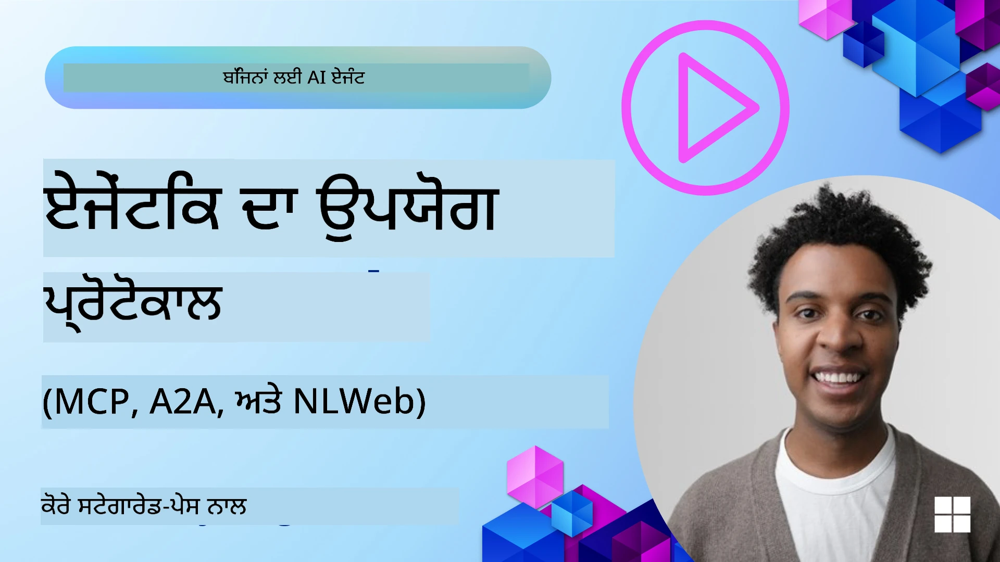
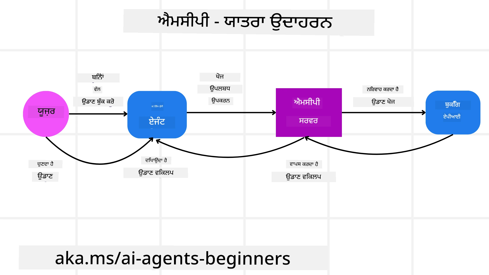
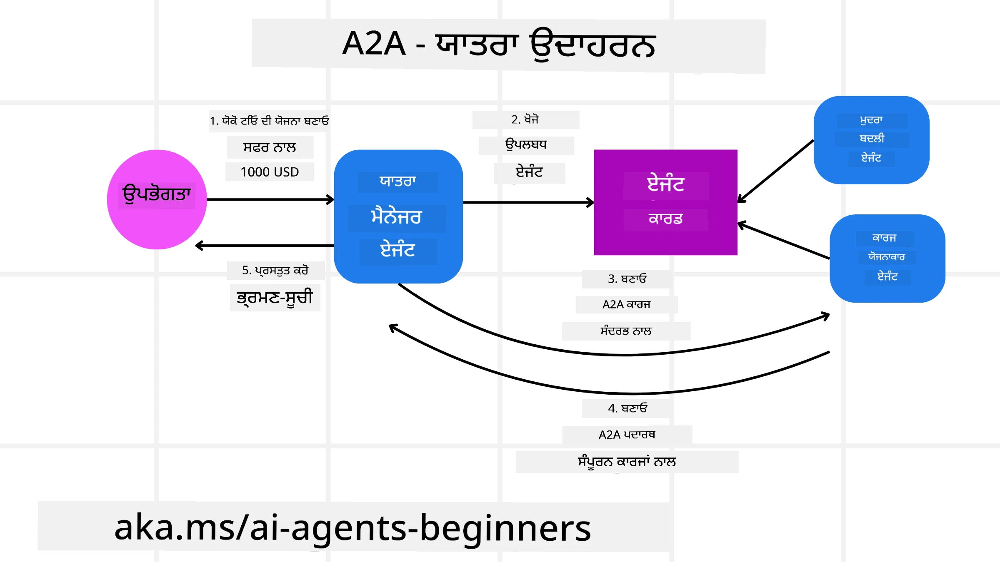
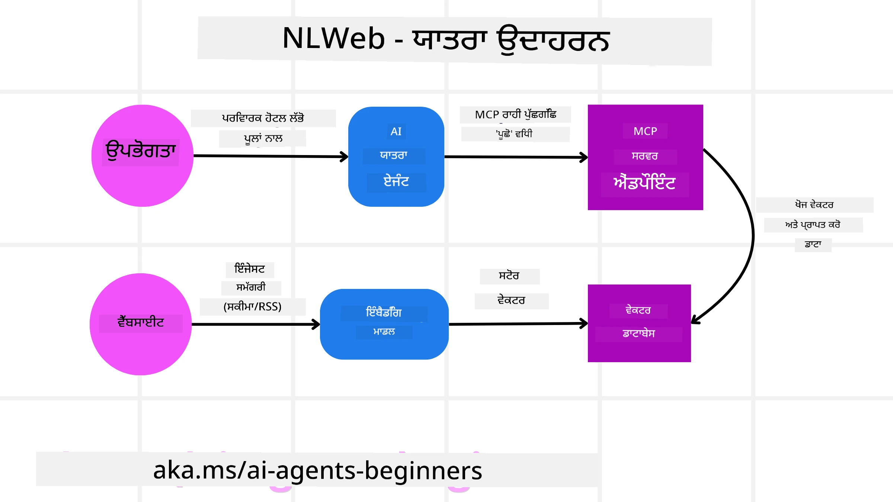

# ਏਜੈਂਟਿਕ ਪ੍ਰੋਟੋਕੋਲਸ ਦੀ ਵਰਤੋਂ (MCP, A2A ਅਤੇ NLWeb)

> _(ਉਪਰ ਦਿੱਤੀ ਚਿੱਤਰ 'ਤੇ ਕਲਿੱਕ ਕਰਕੇ ਇਸ ਪਾਠ ਦਾ ਵੀਡੀਓ ਦੇਖੋ)_

ਜਿਵੇਂ ਜ਼ਿਆਦਾ AI ਏਜੰਟਾਂ ਦੀ ਵਰਤੋਂ ਵਧ ਰਹੀ ਹੈ, ਉਸੇ ਤਰ੍ਹਾਂ ਐਸੇ ਪ੍ਰੋਟੋਕੋਲਾਂ ਦੀ ਲੋੜ ਵੀ ਵੱਧ ਰਹੀ ਹੈ ਜੋ ਸਟੈਂਡਰਡਾਈਜ਼ੇਸ਼ਨ, ਸੁਰੱਖਿਆ ਅਤੇ ਖੁੱਲ੍ਹੀ ਨਵੀਨੀਕਰਨ ਨੂੰ ਯਕੀਨੀ ਬਣਾਉਂਦੇ ਹਨ। ਇਸ ਪਾਠ ਵਿੱਚ, ਅਸੀਂ 3 ਪ੍ਰੋਟੋਕੋਲਾਂ ਬਾਰੇ ਚਰਚਾ ਕਰਾਂਗੇ ਜੋ ਇਸ ਲੋੜ ਨੂੰ ਪੂਰਾ ਕਰਨ ਦੀ ਕੋਸ਼ਿਸ਼ ਕਰਦੇ ਹਨ - Model Context Protocol (MCP), Agent to Agent (A2A) ਅਤੇ Natural Language Web (NLWeb)।

## ਪਰਿਚਯ

ਇਸ ਪਾਠ ਵਿੱਚ, ਅਸੀਂ ਝਲਕੀਆਂ ਲਵਾਂਗੇ:

• ਇਹ ਕਿ **MCP** ਕਿਵੇਂ AI ਏਜੰਟਾਂ ਨੂੰ ਬਾਹਰੀ ਟੂਲਾਂ ਅਤੇ ਡਾਟਾ ਤੱਕ ਪਹੁੰਚ ਦੇ ਕੇ ਯੂਜ਼ਰ ਟਾਸਕ ਪੂਰੇ ਕਰਨ ਯੋਗ ਬਣਾਉਂਦਾ ਹੈ।

• ਇਹ ਕਿ **A2A** ਕਿਵੇਂ ਵੱਖ-ਵੱਖ AI ਏਜੰਟਾਂ ਦਰਮਿਆਨ ਸੰਚਾਰ ਅਤੇ ਸਹਯੋਗ ਨੂੰ ਯੋਗ ਬਣਾਉਂਦਾ ਹੈ।

• ਇਹ ਕਿ **NLWeb** ਕਿਸ ਤਰ੍ਹਾਂ ਕਿਸੇ ਵੀ ਵੈੱਬਸਾਈਟ ਤੇ ਕੁਦਰਤੀ ਭਾਸ਼ਾ ਇੰਟਰਫੇਸ ਲਿਆਉਂਦਾ ਹੈ ਜਿਸ ਨਾਲ AI ਏਜੰਟ ਸਮੱਗਰੀ ਨੂੰ ਖੋਜ ਸਕਦੇ ਅਤੇ ਉਸ ਨਾਲ ਇੰਟਰਐਕਟ ਕਰ ਸਕਦੇ ਹਨ।

## ਸਿੱਖਣ ਦੇ ਲਕੜੀਦਸ਼

• **ਪਛਾਣੋ** MCP, A2A ਅਤੇ NLWeb ਦੇ ਮੁੱਖ ਉਦੇਸ਼ ਅਤੇ ਫਾਇਦੇ AI ਏਜੰਟਾਂ ਦੇ ਸੰਦਰਭ ਵਿੱਚ।

• **ਵਿਆਖਿਆ ਕਰੋ** ਕਿ ਹਰ ਪ੍ਰੋਟੋਕੋਲ ਕਿਵੇਂ LLMs, ਟੂਲਾਂ, ਅਤੇ ਹੋਰ ਏਜੰਟਾਂ ਦਰਮਿਆਨ ਸੰਚਾਰ ਅਤੇ ਇੰਟਰਐਕਸ਼ਨ ਨੂੰ ਸੁਗਮ ਬਣਾਉਂਦਾ ਹੈ।

• **ਮੰਨੋ** ਕਿ ਹਰ ਪ੍ਰੋਟੋਕੋਲ ਕੌਣ-ਕੌਣੀਆਂ ਵੱਖਰੀਆਂ ਭੂਮਿਕਾਵਾਂ ਨਿਭਾਉਂਦਾ ਹੈ ਜਦੋਂ ਕਿ ਜਟਿਲ ਏਜੈਂਟਿਕ ਸਿਸਟਮ ਬਣਾਏ ਜਾ ਰਹੇ ਹਨ।

## Model Context Protocol

**Model Context Protocol (MCP)** ਇੱਕ ਖੁੱਲ੍ਹਾ ਮਿਆਰ ਹੈ ਜੋ ਐਪਲੀਕੇਸ਼ਨਾਂ ਨੂੰ LLMs ਨੂੰ ਸੰਦਰਭ ਅਤੇ ਟੂਲ ਪ੍ਰਦਾਨ ਕਰਨ ਦਾ ਇੱਕ ਸਟੈਂਡਰਡਜ਼ਡ ਤਰੀਕਾ ਪ੍ਰਦਾਨ ਕਰਦਾ ਹੈ। ਇਹ ਇੱਕ "ਯੂਨੀਵਰਸਲ ਐਡੈਪਟਰ" ਨੂੰ ਵੱਖ-ਵੱਖ ਡਾਟਾ ਸਰੋਤਾਂ ਅਤੇ ਟੂਲਾਂ ਨਾਲ ਇਕ ਸਰਗਰਮ ਢੰਗ ਨਾਲ ਜੁੜਨ ਦੀ ਸਮਰੱਥਾ ਦਿੰਦਾ ਹੈ।

ਆਓ MCP ਦੇ ਭਾਗਾਂ, ਸਿੱਧੇ API ਉਪਯੋਗ ਦੇ ਮੁਕਾਬਲੇ ਵਿੱਚ ਫਾਇਦੇ, ਅਤੇ ਇੱਕ ਉਦਾਹਰਨ ਦੇਖੀਏ ਕਿ AI ਏਜੰਟ MCP ਸਰਵਰ ਨੂੰ ਕਿਵੇਂ ਵਰਤ ਸਕਦੇ ਹਨ।

### MCP ਕੋਰ ਕੰਪੋਨੈਂਟ

MCP ਇੱਕ **ਕਲਾਇੰਟ-ਸਰਵਰ ਆਰਕੀਟੈਕਚਰ** 'ਤੇ ਕੰਮ ਕਰਦਾ ਹੈ ਅਤੇ ਮੁੱਖ ਕੰਪੋਨੈਂਟ ਹਨ:

• **Hosts** ਉਹ LLM ਐਪਲੀਕੇਸ਼ਨ ਹਨ (ਉਦਾਹਰਣ ਲਈ ਇੱਕ ਕੋਡ ਐਡੀਟਰ ਜਿਵੇਂ VSCode) ਜੋ MCP ਸਰਵਰ ਨਾਲ ਕਨੈਕਸ਼ਨ ਸ਼ੁਰੂ ਕਰਦੇ ਹਨ।

• **Clients** ਹੋਸਟ ਐਪਲੀਕੇਸ਼ਨ ਦੇ ਅੰਦਰ ਉਹ घटਕ ਹਨ ਜੋ ਸਰਵਰਾਂ ਨਾਲ ਇੱਕ-ਉਪਰ-ਇੱਕ ਕਨੈਕਸ਼ਨ ਬਣਾਏ ਰੱਖਦੇ ਹਨ।

• **Servers** ਹਲਕੇ ਫੁੱਲਕੇ ਪ੍ਰੋਗ੍ਰਾਮ ਹਨ ਜੋ ਵਿਸ਼ੇਸ਼ ਸਮਰੱਥਾਵਾਂ ਨੂੰ ਇਕਸਪੋਜ਼ ਕਰਦੇ ਹਨ।

ਪ੍ਰੋਟੋਕੋਲ ਵਿੱਚ ਤਿੰਨ ਕੋਰ ਪ੍ਰਿਮੀਟਿਵਸ ਸ਼ਾਮਲ ਹਨ ਜੋ MCP ਸਰਵਰ ਦੀਆਂ ਸਮਰੱਥਾਵਾਂ ਹਨ:

• **Tools**: ਇਹ ਵੱਖ-ਵੱਖ ਕਾਰਵਾਈਆਂ ਜਾਂ ਫੰਕਸ਼ਨ ਹਨ ਜਿਨ੍ਹਾਂ ਨੂੰ ਇੱਕ AI ਏਜੰਟ ਕਿਸੇ ਕਿਰਿਆ ਨੂੰ ਕਰਨ ਲਈ ਕਾਲ ਕਰ ਸਕਦਾ ਹੈ। ਉਦਾਹਰਣ ਵਜੋਂ, ਇੱਕ ਮੌਸਮ ਸੇਵਾ "get weather" ਟੂਲ ਇਕਸਪੋਜ਼ ਕਰ ਸਕਦੀ ਹੈ, ਜਾਂ ਇੱਕ ਈ-ਕਾਮਰਸ ਸਰਵਰ "purchase product" ਟੂਲ ਦਿਖਾ ਸਕਦਾ ਹੈ। MCP ਸਰਵਰ ਹਰ ਟੂਲ ਦਾ ਨਾਮ, ਵਰਣਨ, ਅਤੇ ਇਨਪੁਟ/ਆਉਟਪੁਟ ਸਕੀਮਾ ਆਪਣੀ ਸਮਰੱਥਾਵਾਂ ਦੀ ਸੂਚੀ ਵਿੱਚ ਪ੍ਰਕਾਸ਼ਿਤ ਕਰਦੇ ਹਨ।

• **Resources**: ਇਹ ਪੜ੍ਹਨ-ਰਹਿਤ ਡਾਟਾ ਆਈਟਮ ਜਾਂ ਦਸਤਾਵੇਜ਼ ਹਨ ਜੋ ਇੱਕ MCP ਸਰਵਰ ਪ੍ਰਦਾਨ ਕਰ ਸਕਦਾ ਹੈ, ਅਤੇ ਕਲਾਇੰਟਾਂ ਉਹਨਾਂ ਨੂੰ ਮੰਗ 'ਤੇ ਪ੍ਰਾਪਤ ਕਰ ਸਕਦੇ ਹਨ। ਉਦਾਹਰਣਾਂ ਵਿੱਚ ਫਾਈਲ ਸਮੱਗਰੀ, ਡੇਟਾਬੇਸ ਰਿਕਾਰਡ, ਜਾਂ ਲੌਗ ਫਾਈਲਾਂ ਸ਼ਾਮਲ ਹਨ। Resources ਟੈਕਸਟ (ਜਿਵੇਂ ਕੋਡ ਜਾਂ JSON) ਜਾਂ ਬਾਈਨਰੀ (ਜਿਵੇਂ ਚਿੱਤਰ ਜਾਂ PDF) ਹੋ ਸਕਦੇ ਹਨ।

• **Prompts**: ਇਹ ਪਹਿਲਾਂ ਤੋਂ ਪਰਿਭਾਸ਼ਿਤ ਟੈਂਪਲੇਟ ਹਨ ਜੋ ਸੁਝਾਏ ਗਏ ਪ੍ਰਾਂਪਟ ਮੁਹੱਈਆ ਕਰਦੇ ਹਨ, ਜਿਸ ਨਾਲ ਹੋਰ ਜਟਿਲ ਵਰਕਫਲੋਜ਼ ਦੀ ਸਹਾਇਤਾ ਹੁੰਦੀ ਹੈ।

### MCP ਦੇ ਫਾਇਦੇ

MCP AI ਏਜੰਟਾਂ ਲਈ ਮਹੱਤਵਪੂਰਣ ਫਾਇਦੇ ਦਿੰਦਾ ਹੈ:

• **Dynamic Tool Discovery**: ਏਜੰਟ ਇੱਕ ਸਰਵਰ ਤੋਂ ਉਪਲਬਧ ਟੂਲਾਂ ਦੀ ਸੂਚੀ ਗਤਿਵਿਧੀ ਤੌਰ 'ਤੇ ਪ੍ਰਾਪਤ ਕਰ ਸਕਦੇ ਹਨ, ਨਾਲ ਹੀ ਉਹਨਾਂ ਦੇ ਵਰਣਨਾਂ ਨੂੰ ਵੀ ਦੇਖ ਸਕਦੇ ਹਨ। ਇਹ ਪੁਰਾਣੇ API ਇਕੀਕਰਨ ਦੇ ਤਰੀਕੇ ਨਾਲ ਵੱਖਰਾ ਹੈ, ਜਿੱਥੇ ਅਕਸਰ ਇੰਟੀਗਰੇਸ਼ਨਾਂ ਲਈ ਸਥਿਰ ਕੋਡਿੰਗ ਦੀ ਲੋੜ ਹੁੰਦੀ ਹੈ, ਜਿਸਦਾ ਮਤਲਬ ਹੈ ਕਿ ਕਿਸੇ ਵੀ API ਬਦਲਾਅ ਲਈ ਕੋਡ ਅਪਡੇਟ ਕਰਨੇ ਪੈਂਦੇ ਹਨ। MCP "ਇਕ ਵਾਰੀ ਇੰਟੀਗਰੇਟ ਕਰੋ" ਦਾ ਢੰਗ ਦਿੰਦਾ ਹੈ, ਜਿਸ ਨਾਲ ਵੱਧ ਅਨੁਕੂਲਤਾ ਹੁੰਦੀ ਹੈ।

• **Interoperability Across LLMs**: MCP ਵੱਖ-ਵੱਖ LLMs 'ਤੇ ਕੰਮ ਕਰਦਾ ਹੈ, ਜਿਸ ਨਾਲ ਕੋਰ ਮਾਡਲ ਬਦਲ ਕੇ ਵਧੀਆ ਪ੍ਰਦਰਸ਼ਨ ਲਈ ਜਾਂਚ ਕਰਨ ਦੀ ਲਚੀਲਾਪਨ ਮਿਲਦੀ ਹੈ।

• **Standardized Security**: MCP ਵਿੱਚ ਇੱਕ ਮਿਆਰੀ ਸੰਗ੍ਰਹਿਤ ਪ੍ਰਮਾਣੀਕਰਨ ਢੰਗ ਸ਼ਾਮਲ ਹੈ, ਜੋ ਹੋਰ MCP ਸਰਵਰਾਂ ਨੂੰ ਐਕਸੈੱਸ ਦਿੰਦੇ ਸਮੇਂ ਸਕੇਲਿੰਗ ਨੂੰ ਸੁਧਾਰਦਾ ਹੈ। ਇਹ ਵੱਖ-ਵੱਖ ਕੁੰਜੀਆਂ ਅਤੇ ਪ੍ਰਮਾਣੀਕਰਨ ਕਿਸਮਾਂ ਨੂੰ ਸੰਭਾਲਣ ਨਾਲੋਂ ਸਾਦਾ ਹੈ ਜੋ ਪਰੰਪਰਾਗਤ APIs ਵਿੱਚ ਲੋੜੀਂਦਾ ਹੁੰਦਾ ਹੈ।

### MCP ਉਦਾਹਰਨ

ਕਲਪਨਾ ਕਰੋ ਕਿ ਇੱਕ ਯੂਜ਼ਰ MCP ਨਾਲ ਸੰਚਾਲਿਤ AI ਸਹਾਇਕ ਦੀ ਵਰਤੋਂ ਕਰਕੇ ਫਲਾਈਟ ਬੁੱਕ ਕਰਨਾ ਚਾਹੁੰਦਾ ਹੈ।

1. **ਕਨੈਕਸ਼ਨ**: AI ਸਹਾਇਕ (ਜੋ MCP ਕਲਾਇੰਟ ਹੈ) ਇੱਕ ਏਅਰਲਾਈਨ ਵੱਲੋਂ ਪ੍ਰਦਾਨ ਕੀਤੇ MCP ਸਰਵਰ ਨਾਲ ਜੁੜਦਾ ਹੈ।

2. **ਟੂਲ ਖੋਜ**: ਕਲਾਇੰਟ ਏਅਰਲਾਈਨ ਦੇ MCP ਸਰਵਰ ਤੋਂ ਪੁੱਛਦਾ ਹੈ, "ਤੁਹਾਡੇ ਕੋਲ ਕਿਹੜੇ ਟੂਲ ਉਪਲਬਧ ਹਨ?" ਸਰਵਰ "search flights" ਅਤੇ "book flights" ਵਰਗੇ ਟੂਲਾਂ ਨਾਲ ਜਵਾਬ ਦਿੰਦਾ ਹੈ।

3. **ਟੂਲ ਕਾਲ**: ਤੁਸੀਂ ਫਿਰ AI ਸਹਾਇਕ ਨੂੰ ਕਹਿੰਦੇ ਹੋ, "ਕਿਰਪਾ ਕਰਕੇ ਪੋਰਟਲੈਂਡ ਤੋਂ ਹੋਨੋਲੂਲੂ ਲਈ ਫਲਾਈਟ ਖੋਜੋ।" AI ਸਹਾਇਕ ਆਪਣੇ LLM ਦੀ ਵਰਤੋਂ ਕਰਕੇ ਪਛਾਣਦਾ ਹੈ ਕਿ ਇਸਨੂੰ "search flights" ਟੂਲ ਨੂੰ ਕਾਲ ਕਰਨ ਦੀ ਲੋੜ ਹੈ ਅਤੇ MCP ਸਰਵਰ ਨੂੰ ਸਬੰਧਤ ਪੈਰਾਮੀਟਰ (origin, destination) ਭੇਜਦਾ ਹੈ।

4. **ਐਗਜ਼ੀਕਿਊਸ਼ਨ ਅਤੇ ਜਵਾਬ**: MCP ਸਰਵਰ, ਇੱਕ ਰੈਪਰ ਵੱਜੋਂ ਕੰਮ ਕਰਦਾ ਹੈ, ਅਸਲ ਵਿੱਚ ਏਅਰਲਾਈਨ ਦੀ ਅੰਤਰਿੰਗ ਬੁਕਿੰਗ API ਨੂੰ ਕਾਲ ਕਰਦਾ ਹੈ। ਫਿਰ ਉਹ ਫਲਾਈਟ ਜਾਣਕਾਰੀ (ਉਦਾਹਰਣ ਲਈ JSON ਡਾਟਾ) ਪ੍ਰਾਪਤ ਕਰਦਾ ਹੈ ਅਤੇ AI ਸਹਾਇਕ ਨੂੰ ਭੇਜ ਦਿੰਦਾ ਹੈ।

5. **ਅਗਲੀ ਇੰਟਰਐਕਸ਼ਨ**: AI ਸਹਾਇਕ ਫਲਾਈਟ ਵਿਕਲਪ ਪੇਸ਼ ਕਰਦਾ ਹੈ। ਜਦੋਂ ਤੁਸੀਂ ਇੱਕ ਫਲਾਈਟ ਚੁਣਦੇ ਹੋ, ਸਹਾਇਕ ਸੰਭਵਤ: ਇੱਕੋ ਹੀ MCP ਸਰਵਰ 'ਤੇ "book flight" ਟੂਲ ਨੂੰ ਕਾਲ ਕਰਕੇ ਬੁਕਿੰਗ ਪੂਰੀ ਕਰ ਸਕਦਾ ਹੈ।

## Agent-to-Agent Protocol (A2A)

ਜਦੋਂ MCP LLMs ਨੂੰ ਟੂਲਾਂ ਨਾਲ ਜੋੜਨ ਤੇ ਧਿਆਨ ਕੇਂਦਰਿਤ ਕਰਦਾ ਹੈ, ਤਾਂ **Agent-to-Agent (A2A) ਪ੍ਰੋਟੋਕੋਲ** ਇਸਨੂੰ ਇੱਕ ਕਦਮ ਅੱਗੇ ਲੈ ਜਾਂਦਾ ਹੈ, ਵੱਖ-ਵੱਖ AI ਏਜੰਟਾਂ ਦਰਮਿਆਨ ਸੰਚਾਰ ਅਤੇ ਸਹਯੋਗ ਯੋਗ ਬਣਾਉਂਦਾ ਹੈ। A2A ਵੱਖ-ਵੱਖ ਸੰਸਥਾਵਾਂ, ਵਾਤਾਵਰਣਾਂ ਅਤੇ ਟੈਕ ਸਟੈਕਾਂ ਦੇ AI ਏਜੰਟਾਂ ਨੂੰ ਇੱਕ ਸਾਂਝੇ ਟਾਸਕ ਨੂੰ ਪੂਰਾ ਕਰਨ ਲਈ ਜੁੜਨ ਦੀ ਸਮਰੱਥਾ ਦਿੰਦਾ ਹੈ।

ਅਸੀਂ A2A ਦੇ ਕੰਪੋਨੈਂਟ ਅਤੇ ਫਾਇਦੇ ਦੇਖਾਂਗੇ, ਨਾਲ ਹੀ ਇੱਕ ਉਦਾਹਰਨ ਜੋ ਸਾਡੇ ਯਾਤਰਾ ਐਪਲੀਕੇਸ਼ਨ ਵਿੱਚ ਲਾਗੂ ਹੋ ਸਕਦੀ ਹੈ।

### A2A ਕੋਰ ਕੰਪੋਨੈਂਟ

A2A ਏਜੰਟਾਂ ਦਰਮਿਆਨ ਸੰਚਾਰ ਯੋਗ ਬਣਾਉਣ ਅਤੇ ਉਹਨਾਂ ਨੂੰ ਯੂਜ਼ਰ ਦੇ ਇੱਕ ਉਪਕਾਰਜ ਨੂੰ ਪੂਰਾ ਕਰਨ ਲਈ ਮਿਲਕੇ ਕੰਮ ਕਰਨ 'ਤੇ ڌਿਆਨ ਕੇਂਦਰਿਤ ਕਰਦਾ ਹੈ। ਪ੍ਰੋਟੋਕੋਲ ਦਾ ਹਰ ਕੰਪੋਨੈਂਟ ਇਸ ਵਿੱਚ ਯੋਗਦਾਨ ਪਾਂਦਾ ਹੈ:

#### Agent Card

ਜਿਵੇਂ ਕਿ MCP ਸਰਵਰ ਟੂਲਾਂ ਦੀ ਸੂਚੀ ਸਾਂਝੀ ਕਰਦਾ ਹੈ, ਇੱਕ Agent Card ਵਿੱਚ ਹੁੰਦਾ ਹੈ:
- ਏਜੰਟ ਦਾ ਨਾਮ।
- ਜਿਹੜੇ ਆਮ ਟਾਸਕ ਉਹ ਪੂਰੇ ਕਰਦਾ ਹੈ, ਉਸ ਦਾ **ਵਰਣਨ**।
- ਹੋਰ ਏਜੰਟਾਂ (ਜਾਂ ਮਨੁੱਖੀ ਯੂਜ਼ਰਾਂ) ਨੂੰ ਇਹ ਸਮਝਣ ਵਿੱਚ ਮਦਦ ਕਰਨ ਲਈ **ਖਾਸ ਹੁਨਰਾਂ ਦੀ ਸੂਚੀ** ਅਤੇ ਉਹਨਾਂ ਦੇ ਵਰਣਨ ਕਿ ਕਦੋਂ ਅਤੇ ਕਿਉਂ ਉਹ ਏਜੰਟ ਨੂੰ ਕਾਲ ਕਰਨਗੇ।
- ਏਜੰਟ ਦਾ **ਮੌਜੂਦਾ Endpoint URL**।
- ਏਜੰਟ ਦਾ **ਵਰਜਨ** ਅਤੇ **ਸਮਰੱਥਾਵਾਂ** ਜਿਵੇਂ ਕਿ ਸਟ੍ਰੀਮਿੰਗ ਜਵਾਬ ਅਤੇ ਪੁਸ਼ ਨੋਟੀਫਿਕੇਸ਼ਨ।

#### Agent Executor

Agent Executor ਦੀ ज़ਿੰਮੇਵਾਰੀ ਹੁੰਦੀ ਹੈ **ਯੂਜ਼ਰ ਚੈਟ ਦਾ ਸੰਦਰਭ ਰਿਮੋਟ ਏਜੰਟ ਤੱਕ ਪਾਸ ਕਰਨ ਦੀ**, ਰਿਮੋਟ ਏਜੰਟ ਨੂੰ ਇਹ ਸਮਝਣ ਲਈ ਲੋੜ ਹੁੰਦੀ ਹੈ ਕਿ ਕਿਹੜਾ ਟਾਸਕ ਪੂਰਾ ਹੋਣਾ ਹੈ। ਇੱਕ A2A ਸਰਵਰ ਵਿੱਚ, ਇੱਕ ਏਜੰਟ ਆਪਣਾ ਖੁਦ ਦਾ Large Language Model (LLM) ਵਰਤਦਾ ਹੈ ਆਉਣ ਵਾਲੀਆਂ ਬੇਨਤੀਆਂ ਨੂੰ ਪਾਰਸ ਕਰਨ ਅਤੇ ਆਪਣੇ ਅੰਦਰੂਨੀ ਟੂਲਾਂ ਦੀ ਵਰਤੋਂ ਕਰਕੇ ਟਾਸਕ ਨਿੱਭਾਉਣ ਲਈ।

#### Artifact

ਜਦੋਂ ਇੱਕ ਰਿਮੋਟ ਏਜੰਟ ਮੰਗਿਆ ਗਿਆ ਟਾਸਕ ਪੂਰਾ ਕਰ ਲੈਂਦਾ ਹੈ, ਉਸ ਦਾ ਕੰਮ ਇੱਕ ਆਰਟੀਫੈਕਟ ਵਜੋਂ ਬਣਾਇਆ ਜਾਂਦਾ ਹੈ। ਇੱਕ ਆਰਟੀਫੈਕਟ ਵਿੱਚ **ਏਜੰਟ ਦੇ ਕੰਮ ਦਾ ਨਤੀਜਾ**, **ਕੀ ਪੂਰਾ ਕੀਤਾ ਗਿਆ** ਦਾ ਵਰਣਨ, ਅਤੇ ਪ੍ਰੋਟੋਕੋਲ ਰਾਹੀਂ ਭੇਜਿਆ ਗਿਆ **ਟੈਕਸਟ ਸੰਦਰਭ** ਹੁੰਦਾ ਹੈ। ਆਰਟੀਫੈਕਟ ਭੇਜਣ ਤੋਂ ਬਾਅਦ, ਰਿਮੋਟ ਏਜੰਟ ਨਾਲ ਕਨੈਕਸ਼ਨ ਬੰਦ ਕਰ ਦਿੱਤੀ ਜਾਂਦੀ ਹੈ ਜਦ ਤੱਕ ਕਿ ਉਸ ਦੀ ਫਿਰ ਲੋੜ ਨਾ ਪਏ।

#### Event Queue

ਇਹ ਕੰਪੋਨੈਂਟ **ਅਪਡੇਟਸ ਨੂੰ ਸੰਭਾਲਣ ਅਤੇ ਸੁਨੇਹੇ ਪਾਸ ਕਰਨ** ਲਈ ਵਰਤਿਆ ਜਾਂਦਾ ਹੈ। ਉਦਯੋਗਿਕ ਉਪਯੋਗ ਵਿੱਚ ਇਹ ਖਾਸ ਤੌਰ 'ਤੇ ਮਹੱਤਵਪੂਰਣ ਹੈ ਤਾਂ ਜੋ ਟਾਸਕ ਪੂਰਾ ਹੋਣ ਤੋਂ ਪਹਿਲਾਂ ਏਜੰਟਾਂ ਦਰਮਿਆਨ ਕਨੈਕਸ਼ਨ ਬੰਦ ਨਾ ਹੋ ਜਾਏ, ਖਾਸਕਰ ਜਦੋਂ ਟਾਸਕ ਪੂਰੇ ਹੋਣ ਵਿੱਚ ਵਕਤ ਲੱਗ ਸਕਦਾ ਹੈ।

### A2A ਦੇ ਫਾਇਦੇ

• **ਵਧੀਕ ਸਹਯੋਗ**: ਇਹ ਵੱਖ-ਵੱਖ ਵੈਂਡਰਾਂ ਅਤੇ ਪਲੇਟਫਾਰਮਾਂ ਦੇ ਏਜੰਟਾਂ ਨੂੰ ਇੰਟਰਐਕਟ ਕਰਨ, ਸੰਦਰਭ ਸਾਂਝਾ ਕਰਨ ਅਤੇ ਮਿਲ ਕੇ ਕੰਮ ਕਰਨ ਯੋਗ ਬਣਾਉਂਦਾ ਹੈ, ਪਰੰਪਰਾਗਤ ਤੌਰ 'ਤੇ ਅਲੱਗ-ਅਲੱਗ ਸਿਸਟਮਾਂ ਵਿੱਚ ਸਹਜ ਆਟੋਮੇਸ਼ਨ ਨੂੰ ਸਹੂਲਤ ਦਿੰਦਾ ਹੈ।

• **ਮਾਡਲ ਚੋਣ ਦੀ ਲਚੀਲਾਪਨ**: ਹਰ A2A ਏਜੰਟ ਆਪਣੇ ਰਿਕਵੈਸਟ ਨੂੰ ਸੇਵਾ ਦੇਣ ਲਈ ਜਿਸ LLM ਨੂੰ ਵਰਤਣਾ ਚਾਹੇ ਚੁਣ ਸਕਦਾ ਹੈ, ਜਿਸ ਨਾਲ ਪ੍ਰਤੀ ਏਜੰਟ ਅਨੁਕੂਲਿਤ ਜਾਂ ਫਾਈਨ-ਟਿਊਨ ਕੀਤੇ ਮਾਡਲਾਂ ਦੀ ਵਰਤੋਂ ਸੰਭਵ ਹੁੰਦੀ ਹੈ, ਜੋ ਕਿ ਕੁਝ MCP ਸੰਦਰਭਾਂ ਵਿੱਚ ਇੱਕੋ LLM ਕਨੈਕਸ਼ਨ ਨਾਲੋਂ ਵੱਖਰਾ ਹੈ।

• **ਬਿਲਟ-ਇਨ ਪ੍ਰਮਾਣੀਕਰਨ**: ਪ੍ਰਮਾਣੀਕਰਨ ਸਿੱਧਾ A2A ਪ੍ਰੋਟੋਕੋਲ ਵਿੱਚ ਸਮਾਧਾਨ ਹੁੰਦੀ ਹੈ, ਜੋ ਏਜੰਟ ਇੰਟਰਐਕਸ਼ਨਾਂ ਲਈ ਇੱਕ ਮਜ਼ਬੂਤ ਸੁਰੱਖਿਆ ਫਰੇਮਵਰਕ ਪ੍ਰਦਾਨ ਕਰਦੀ ਹੈ।

### A2A ਉਦਾਹਰਨ

ਆਓ ਆਪਣੇ ਯਾਤਰਾ ਬੁਕਿੰਗ ਦ੍ਰਿਸ਼ਟਾਂਤ ਨੂੰ ਵਿਸਥਾਰ ਕਰੀਏ, ਪਰ ਇਸ ਵਾਰ A2A ਦੀ ਵਰਤੋਂ ਕਰਦੇ ਹੋਏ।

1. **ਯੂਜ਼ਰ ਦੀ ਬੇਨਤੀ ਮਲਟੀ-ਏਜੰਟ ਕੋਲ**: ਇੱਕ ਯੂਜ਼ਰ "Travel Agent" A2A ਕਲਾਇੰਟ/ਏਜੰਟ ਨਾਲ ਸੰਵਾਦ ਕਰਦਾ ਹੈ, ਸ਼ਾਇਦ ਕਹਿੰਦਾ ਹੈ, "ਕਿਰਪਾ ਕਰਕੇ ਅਗਲੇ ਹਫ਼ਤੇ ਲਈ ਹੋਨੋਲੂਲੂ ਦੀ ਪੂਰੀ ਯਾਤਰਾ ਬੁਕ ਕਰ ਦਿਓ, ਜਿਸ ਵਿੱਚ ਫਲਾਈਟਾਂ, ਇੱਕ ਹੋਟਲ, ਅਤੇ ਇੱਕ ਰੈਂਟਲ ਕਾਰ ਸ਼ਾਮਲ ਹੋਵੇ"।

2. **Travel Agent ਦੁਆਰਾ ਓਰਕੇਸਟਰੈਸ਼ਨ**: Travel Agent ਇਸ ਜਟਿਲ ਬੇਨਤੀ ਨੂੰ ਪ੍ਰਾਪਤ ਕਰਦਾ ਹੈ। ਇਹ ਆਪਣੇ LLM ਦੀ ਵਰਤੋਂ ਕਰਕੇ ਟਾਸਕ ਬਾਰੇ ਵਿਚਾਰ ਕਰਦਾ ਹੈ ਅਤੇ ਨਿਰਧਾਰਿਤ ਕਰਦਾ ਹੈ ਕਿ ਇਸਨੂੰ ਹੋਰ ਵਿਸ਼ੇਸ਼ ਏਜੰਟਾਂ ਨਾਲ ਇੰਟਰਐਕਟ ਕਰਨ ਦੀ ਲੋੜ ਹੈ।

3. **ਏਜੰਟ-ਦਰਮਿਆਨੀ ਸੰਚਾਰ**: Travel Agent ਫਿਰ A2A ਪ੍ਰੋਟੋਕੋਲ ਦੀ ਵਰਤੋਂ ਕਰਕੇ डाउनਸਟਰੀਮ ਏਜੰਟਾਂ ਨਾਲ ਜੁੜਦਾ ਹੈ, ਜਿਵੇਂ ਕਿ "Airline Agent", "Hotel Agent", ਅਤੇ "Car Rental Agent" ਜੋ ਵੱਖ-ਵੱਖ ਕੰਪਨੀਆਂ ਦੁਆਰਾ ਬਣਾਏ ਗਏ ਹਨ।

4. **ਨਿਰਦੇਸ਼ਤ ਟਾਸਕ ਨਿਭਾਉਣਾ**: Travel Agent ਇੰਨਾਂ ਵਿਸ਼ੇਸ਼ ਏਜੰਟਾਂ ਨੂੰ ਨਿਰਧਾਰਿਤ ਟਾਸਕ ਭੇਜਦਾ ਹੈ (ਜਿਵੇਂ, "ਹੋਨੋਲੂਲੂ ਲਈ ਫਲਾਈਟ ਲੱਭੋ", "ਹੋਟਲ ਬੁੱਕ ਕਰੋ", "ਕਾਰ ਰੈਂਟ ਕਰੋ"). ਹਰ ਇਕ ਵਿਸ਼ੇਸ਼ ਏਜੰਟ ਆਪਣਾ LLM ਚਲਾਉਂਦਾ ਹੈ ਅਤੇ ਆਪਣੇ ਟੂਲਾਂ ਦੀ ਵਰਤੋਂ ਕਰਦਾ ਹੈ (ਜੋ ਖੁਦ MCP ਸਰਵਰ ਹੋ ਸਕਦੇ ਹਨ), ਅਤੇ ਆਪਣੇ assigned ਹਿੱਸੇ ਦੀ ਬੁਕਿੰਗ ਕਰਦਾ ਹੈ।

5. **ਸੰਗ੍ਰਹਿਤ ਉੱਤਰ**: ਜਦੋਂ ਸਾਰੇ ਡਾਊਨਸਟਰੀਮ ਏਜੰਟ ਆਪਣੇ ਟਾਸਕ ਪੂਰੇ ਕਰ ਲੈਂਦੇ ਹਨ, Travel Agent ਨਤੀਜੇ (ਫਲਾਈਟ ਵਿਸਥਾਰ, ਹੋਟਲ ਪੁਸ਼ਟੀਕਰਨ, ਕਾਰ ਰੈਂਟਲ ਬੁਕਿੰਗ) ਇਕੱਠੇ ਕਰਦਾ ਹੈ ਅਤੇ ਯੂਜ਼ਰ ਨੂੰ ਇੱਕ ਵਿਸਥਾਰਤ, ਚੈਟ-ਅੰਦਾਜ਼ ਦਾ ਜਵਾਬ ਭੇਜਦਾ ਹੈ।

## Natural Language Web (NLWeb)

ਵੈੱਬਸਾਈਟਾਂ ਲੰਬੇ ਸਮੇਂ ਤੋਂ ਇੰਟਰਨੈਟ 'ਤੇ ਜਾਣਕਾਰੀ ਅਤੇ ਡਾਟਾ ਤੱਕ ਯੂਜ਼ਰਾਂ ਦੀ ਪਹੁੰਚ ਦਾ ਮੁੱਖ ਜਰੀਆ ਰਹੀਆਂ ਹਨ।

ਆਓ NLWeb ਦੇ ਵੱਖ-ਵੱਖ ਕੰਪੋਨੈਂਟ, NLWeb ਦੇ ਫਾਇਦੇ ਅਤੇ ਇੱਕ ਉਦਾਹਰਨ ਦੇਖੀਏ ਕਿ ਸਾਡੇ NLWeb ਨੇ ਆਪਣੇ ਯਾਤਰਾ ਐਪਲੀਕੇਸ਼ਨ ਵਿੱਚ ਕਿਵੇਂ ਕੰਮ ਕਰਦਾ ਹੈ।

### NLWeb ਦੇ ਕੰਪੋਨੈਂਟ

- **NLWeb ਐਪਲੀਕੇਸ਼ਨ (ਕੋਰ ਸਰਵਿਸ ਕੋਡ)**: ਉਹ ਸਿਸਟਮ ਜੋ ਕੁਦਰਤੀ ਭਾਸ਼ਾ ਦੇ ਪ੍ਰਸ਼ਨਾਂ ਨੂੰ ਪ੍ਰੋਸੈਸ ਕਰਦਾ ਹੈ। ਇਹ ਪਲੇਟਫਾਰਮ ਦੇ ਵੱਖ-ਵੱਖ ਹਿੱਸਿਆਂ ਨੂੰ ਜੁੜਦਾ ਹੈ ਤਾਂ ਜੋ ਜਵਾਬ ਬਣਾਏ ਜਾ ਸਕਣ। ਤੁਸੀਂ ਇਸਨੂੰ ਵੈੱਬਸਾਈਟ ਦੀਆਂ ਕੁਦਰਤੀ ਭਾਸ਼ਾ ਵਿਸ਼ੇਸ਼ਤਾਵਾਂ ਨੂੰ ਚਲਾਉਣ ਵਾਲੇ **ਇੰਜਣ** ਦੇ ਤੌਰ 'ਤੇ ਸੋਚ ਸਕਦੇ ਹੋ।

- **NLWeb ਪ੍ਰੋਟੋਕੋਲ**: ਇਹ ਵੈੱਬਸਾਈਟ ਨਾਲ ਕੁਦਰਤੀ ਭਾਸ਼ਾ ਇੰਟਰਐਕਸ਼ਨ ਲਈ ਇੱਕ **ਮੂਲ ਨਿਯਮਾਂ ਦਾ ਸੈੱਟ** ਹੈ। ਇਹ ਜਵਾਬਾਂ ਨੂੰ JSON ਫਾਰਮੈਟ ਵਿੱਚ ਭੇਜਦਾ ਹੈ (ਅਕਸਰ Schema.org ਦੀ ਵਰਤੋਂ ਕਰਕੇ)। ਇਸਦਾ ਉਦੇਸ਼ "AI ਵੈੱਬ" ਲਈ ਇੱਕ ਸਧਾਰਣ ਬੁਨਿਆਦ ਬਣਾਉਣਾ ਹੈ, ਉਸੇ ਤਰੀਕੇ ਨਾਲ ਜਿਵੇਂ HTML ਨੇ ਆਨਲਾਈਨ ਦਸਤਾਵੇਜ਼ ਸਾਂਝੇ ਕਰਨ ਨੂੰ ਸੰਭਵ ਬਣਾਇਆ।

- **MCP ਸਰਵਰ (Model Context Protocol Endpoint)**: ਹਰ NLWeb ਸੈੱਟਅਪ ਇੱਕ **MCP ਸਰਵਰ** ਵਜੋਂ ਵੀ ਕੰਮ ਕਰਦਾ ਹੈ। ਇਸਦਾ مطلب ਹੈ ਕਿ ਇਹ ਹੋਰ AI ਪ੍ਰਣਾਲੀਆਂ ਨਾਲ **ਟੂਲ (ਜਿਵੇਂ ਇੱਕ “ask” ਮੈਥਡ) ਅਤੇ ਡਾਟਾ ਸਾਂਝਾ** ਕਰ ਸਕਦਾ ਹੈ। ਅਮਲ ਵਿੱਚ, ਇਹ ਵੈੱਬਸਾਈਟ ਦੀ ਸਮੱਗਰੀ ਅਤੇ ਸਮਰੱਥਾਵਾਂ ਨੂੰ AI ਏਜੰਟਾਂ ਲਈ ਵਰਤਣਯੋਗ ਬਣਾਉਂਦਾ ਹੈ, ਜਿਸ ਨਾਲ ਸਾਈਟ ਵੱਡੇ “ਏਜੰਟ ਇਕੋਸਿਸਟਮ” ਦਾ ਹਿੱਸਾ ਬਣ ਸਕਦੀ ਹੈ।

- **Embedding Models**: ਇਹ ਮਾਡਲ ਵੈੱਬਸਾਈਟ ਸਮੱਗਰੀ ਨੂੰ ਨੰਬਰਾਤਮਕ ਪ੍ਰਤੀਨਿਧਿਤਾ ਵਿੱਚ ਬਦਲਣ ਲਈ ਵਰਤੇ ਜਾਂਦੇ ਹਨ, ਜਿਨ੍ਹਾਂ ਨੂੰ ਵੇਕਟਰ (embeddings) ਕਿਹਾ ਜਾਂਦਾ ਹੈ। ਇਹ ਵੇਕਟਰ ਮਸ਼ੀਨਾਂ ਲਈ ਮਾਨੇਜ ਅਤੇ ਤੁਲਨਾ ਕਰਨ ਯੋਗ ਰੂਪ ਵਿੱਚ ਅਰਥ ਪਕੜਦੇ ਹਨ। ਉਹ ਇੱਕ ਖ਼ਾਸ ਡੇਟਾਬੇਸ ਵਿੱਚ ਸਟੋਰ ਕੀਤੇ ਜਾਂਦੇ ਹਨ, ਅਤੇ ਯੂਜ਼ਰ ਚੁਣ ਸਕਦੇ ਹਨ ਕਿ ਉਹ ਕਿਹੜਾ embedding ਮਾਡਲ ਵਰਤਣਾ ਚਾਹੁੰਦੇ ਹਨ।

- **Vector Database (Retrieval Mechanism)**: ਇਹ ਡੇਟਾਬੇਸ **ਵੈੱਬਸਾਈਟ ਸਮੱਗਰੀ ਦੇ embeddings ਨੂੰ ਸਟੋਰ ਕਰਦਾ ਹੈ**। ਜਦੋਂ ਕੋਈ ਪ੍ਰਸ਼ਨ ਪੁੱਛਿਆ ਜਾਂਦਾ ਹੈ, NLWeb ਤੇਜ਼ੀ ਨਾਲ ਸਭ ਤੋਂ ਸਬੰਧਿਤ ਜਾਣਕਾਰੀ ਲੱਭਣ ਲਈ ਵੇਕਟਰ ਡੇਟਾਬੇਸ ਦੀ ਜਾਂਚ ਕਰਦਾ ਹੈ। ਇਹ ਸੰਭਵ ਉੱਤਰਾਂ ਦੀ ਇੱਕ ਤੇਜ਼ ਸੂਚੀ ਦਿੰਦਾ ਹੈ, ਸਮਾਨਤਾ ਅਨੁਸਾਰ ਰੈਂਕ ਕੀਤੇ ਹੋਏ। NLWeb ਵੱਖ-ਵੱਖ ਵੇਕਟਰ ਸਟੋਰੇਜ ਸਿਸਟਮਾਂ ਨਾਲ ਕੰਮ ਕਰਦਾ ਹੈ ਜਿਵੇਂ Qdrant, Snowflake, Milvus, Azure AI Search, ਅਤੇ Elasticsearch।

### NLWeb ਉਦਾਹਰਨ

ਇੱਕ ਵਾਰ ਫਿਰ ਸਾਡੀ ਯਾਤਰਾ ਬੁਕਿੰਗ ਵੈੱਬਸਾਈਟ ਦੀ ਸੋਚ ਕਰੋ, ਪਰ ਇਸ ਵਾਰ ਇਹ NLWeb ਦੁਆਰਾ ਚਲਾਈ ਜਾ ਰਹੀ ਹੈ।

1. **ਡਾਟਾ ਇੰਜੈਸ਼ਨ**: ਯਾਤਰਾ ਵੈੱਬਸਾਈਟ ਦੇ ਮੌਜੂਦਾ ਪ੍ਰੋਡਕਟ ਕੈਟਾਲੋਗ (ਉਦਾਹਰਣ ਲਈ ਫਲਾਈਟ ਸੂਚੀਆਂ, ਹੋਟਲ ਵਰਣਨ, ਟੂਰ ਪੈਕੇਜ) Schema.org ਦੀ ਵਰਤੋਂ ਕਰਕੇ ਫਾਰਮੈਟ ਕੀਤੇ ਜਾਂਦੇ ਹਨ ਜਾਂ RSS ਫੀਡਾਂ ਰਾਹੀਂ ਲੋਡ ਕੀਤੇ ਜਾਂਦੇ ਹਨ। NLWeb ਦੇ ਟੂਲ ਇਹ ਸਟ੍ਰੱਕਚਰਡ ਡੇਟਾ ਇੰਜੈਸਟ ਕਰਦੇ ਹਨ, embeddings ਬਣਾਉਂਦੇ ਹਨ, ਅਤੇ ਉਹਨਾਂ ਨੂੰ ਲੋਕਲ ਜਾਂ ਰਿਮੋਟ ਵੇਕਟਰ ਡੇਟਾਬੇਸ ਵਿੱਚ ਸਟੋਰ ਕਰਦੇ ਹਨ।

2. **ਕੁਦਰਤੀ ਭਾਸ਼ਾ ਪ੍ਰਸ਼ਨ (ਇਨਸਾਨ)**: ਇੱਕ ਯੂਜ਼ਰ ਵੈੱਬਸਾਈਟ 'ਤੇ ਆਉਂਦਾ ਹੈ ਅਤੇ ਮੇਨੂਜ਼ ਨੂੰ ਨੇਵੀਗੇਟ ਕਰਨ ਦੀ ਥਾਂ ਚੈਟ ਇੰਟਰਫੇਸ 'ਚ ਟਾਈਪ ਕਰਦਾ ਹੈ: "ਅਗਲੇ ਹਫ਼ਤੇ ਲਈ ਹੋਨੋਲੂਲੂ ਵਿੱਚ ਇੱਕ ਪਰਿਵਾਰ-ਅਨੁਕੂਲ ਹੋਟਲ ਜੋ ਸਵਿਮਿੰਗ ਪੂਲ ਵਾਲਾ ਹੋ, ਮੁਝੇ ਲੱਭੋ"।

3. **NLWeb ਪ੍ਰੋਸੈਸਿੰਗ**: NLWeb ਐਪਲੀਕੇਸ਼ਨ ਇਹ ਪ੍ਰਸ਼ਨ ਪ੍ਰਾਪਤ ਕਰਦਾ ਹੈ। ਇਹ ਸਮਝਣ ਲਈ ਪ੍ਰਸ਼ਨ ਨੂੰ ਇੱਕ LLM ਕੋਲ ਭੇਜਦਾ ਹੈ ਅਤੇ ਇੱਕੋ ਸਮੇਂ ਆਪਣੇ ਵੇਕਟਰ ਡੇਟਾਬੇਸ ਵਿੱਚ ਸਬੰਧਤ ਹੋਟਲ ਲਿਸਟਿੰਗ ਲਈ ਖੋਜ ਕਰਦਾ ਹੈ।

4. **ਸਹੀ ਨਤੀਜੇ**: LLM ਡੇਟਾਬੇਸ ਤੋਂ ਖੋਜ ਨਤੀਜਿਆਂ ਦੀ ਵਿਆਖਿਆ ਕਰਨ ਵਿੱਚ ਮਦਦ ਕਰਦਾ ਹੈ, "family-friendly", "pool", ਅਤੇ "Honolulu" ਮਾਪਦੰਡਾਂ ਦੇ ਆਧਾਰ 'ਤੇ ਸਭ ਤੋਂ ਵਧੀਆ ਮੇਲ ਪਛਾਣਦਾ ਹੈ, ਅਤੇ ਫਿਰ ਇੱਕ ਕੁਦਰਤੀ ਭਾਸ਼ਾ ਦਾ ਜਵਾਬ ਫਾਰਮੈਟ ਕਰਦਾ ਹੈ। ਮਹੱਤਵਪੂਰਣ ਗੱਲ ਇਹ ਹੈ ਕਿ ਜਵਾਬ ਵੈੱਬਸਾਈਟ ਦੇ ਕੈਟਾਲੋਗ ਤੋਂ ਅਸਲ ਹੋਟਲਾਂ ਨੂੰ ਦਰਸਾਉਂਦਾ ਹੈ, ਗੜਬੜ ਜਾਨਕਾਰੀ ਤੋਂ ਬਚਦਾ ਹੈ।

5. **AI ਏਜੰਟ ਇੰਟਰਐਕਸ਼ਨ**: ਕਿਉਂਕਿ NLWeb ਇੱਕ MCP ਸਰਵਰ ਵਜੋਂ ਕੰਮ ਕਰਦਾ ਹੈ, ਇੱਕ ਬਾਹਰੀ AI ਯਾਤਰਾ ਏਜੰਟ ਵੀ ਇਸ ਵੈੱਬਸਾਈਟ ਦੇ NLWeb ਇੰਸਟੈਂਸ ਨਾਲ ਜੁੜ ਸਕਦਾ ਹੈ। AI ਏਜੰਟ ਫਿਰ `ask("Are there any vegan-friendly restaurants in the Honolulu area recommended by the hotel?")` ਮੈਥਡ ਵਰਤ ਕੇ ਵੈੱਬਸਾਈਟ ਨਾਲ ਸਿੱਧਾ ਪੁੱਛਗਿੱਛ ਕਰ ਸਕਦਾ ਹੈ। NLWeb ਇੰਸਟੈਂਸ ਇਸਨੂੰ ਪ੍ਰੋਸੈਸ ਕਰੇਗਾ, ਆਪਣੀ ਰੈਸਟੋਰੈਂਟ ਜਾਣਕਾਰੀ ਦੇ ਡੇਟਾਬੇਸ (ਜੇ ਲੋਡ ਕੀਤੀ ਹੋਵੇ) ਦੀ ਵਰਤੋਂ ਕਰਕੇ, ਅਤੇ ਇੱਕ ਸਟ੍ਰਕਚਰਡ JSON ਜਵਾਬ ਵਾਪਸ ਕਰੇਗਾ।

### MCP/A2A/NLWeb ਬਾਰੇ ਹੋਰ ਪ੍ਰਸ਼ਨ ਹਨ?

[Microsoft Foundry Discord](https://aka.ms/ai-agents/discord) ਨੂੰ ਜੁੜੋ ਤਾਂ ਜੋ ਹੋਰ ਸਿੱਖਣ ਵਾਲਿਆਂ ਨਾਲ ਮਿਲੋ, ਆਫਿਸ ਘੰਟਿਆਂ ਵਿੱਚ ਸ਼ਿਰਕਤ ਕਰੋ ਅਤੇ ਆਪਣੇ AI ਏਜੰਟਾਂ ਸਬੰਧੀ ਸਵਾਲਾਂ ਦੇ ਜਵਾਬ ਪ੍ਰਾਪਤ ਕਰੋ।

## ਸਰੋਤ

- [MCP for Beginners](https://aka.ms/mcp-for-beginners)  
- [MCP Documentation](https://learn.microsoft.com/python/api/overview/azure/ai-projects-readme)
- [NLWeb Repo](https://github.com/nlweb-ai/NLWeb)
- [Microsoft Agent Framework](https://aka.ms/ai-agents-beginners/agent-framewrok)

---

<!-- CO-OP TRANSLATOR DISCLAIMER START -->
ਡਿਸਕਲੈਮਰ:
ਇਹ ਦਸਤਾਵੇਜ਼ AI ਅਨੁਵਾਦ ਸੇਵਾ [Co-op Translator](https://github.com/Azure/co-op-translator) ਦੀ ਵਰਤੋਂ ਕਰਕੇ ਅਨੁਵਾਦ ਕੀਤਾ ਗਿਆ ਹੈ। ਜਦੋਂ ਕਿ ਅਸੀਂ ਸ਼ੁਧਤਾ ਲਈ ਕੋਸ਼ਿਸ਼ ਕਰਦੇ ਹਾਂ, ਕਿਰਪਾ ਕਰਕੇ ਧਿਆਨ ਰੱਖੋ ਕਿ ਆਟੋਮੈਟਿਕ ਅਨੁਵਾਦਾਂ ਵਿੱਚ ਤ੍ਰੁਟੀਆਂ ਜਾਂ ਅਣਸਹੀਤੀਆਂ ਹੋ ਸਕਦੀਆਂ ਹਨ। ਮੂਲ ਭਾਸ਼ਾ ਵਿੱਚ ਮੌਜੂਦ ਦਸਤਾਵੇਜ਼ ਨੂੰ ਅਧਿਕਾਰਤ ਸਰੋਤ ਮੰਨਿਆ ਜਾਣਾ ਚਾਹੀਦਾ ਹੈ। ਮਹੱਤਵਪੂਰਨ ਜਾਣਕਾਰੀ ਲਈ ਪੇਸ਼ੇਵਰ ਮਨੁੱਖੀ ਅਨੁਵਾਦ ਦੀ ਸਿਫਾਰਸ਼ ਕੀਤੀ ਜਾਂਦੀ ਹੈ। ਅਸੀਂ ਇਸ ਅਨੁਵਾਦ ਦੇ ਉਪਯੋਗ ਤੋਂ ਉਤਪੰਨ ਕਿਸੇ ਵੀ ਗਲਤਫਹਮੀ ਜਾਂ ਗਲਤ ਵਿਆਖਿਆ ਲਈ ਜ਼ਿੰਮੇਵਾਰ ਨਹੀਂ ਹੋਵਾਂਗੇ।
<!-- CO-OP TRANSLATOR DISCLAIMER END -->