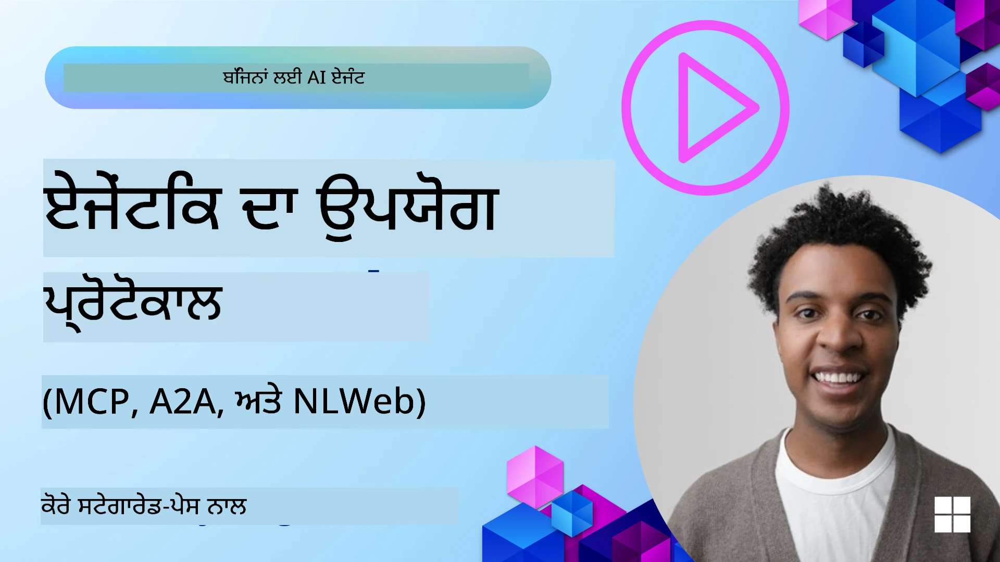
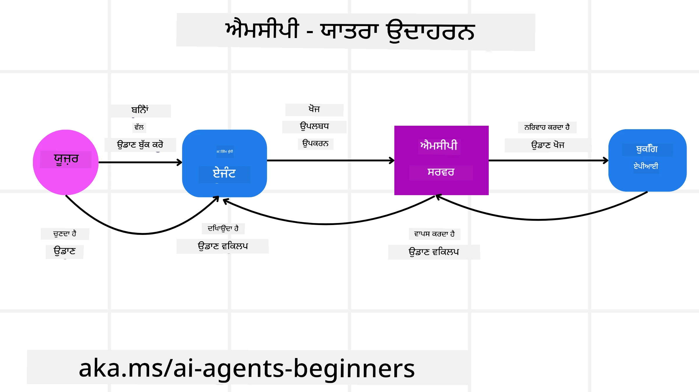
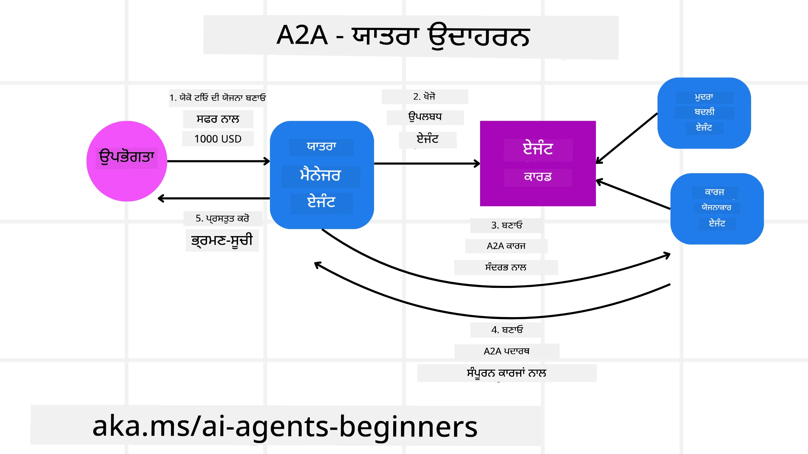
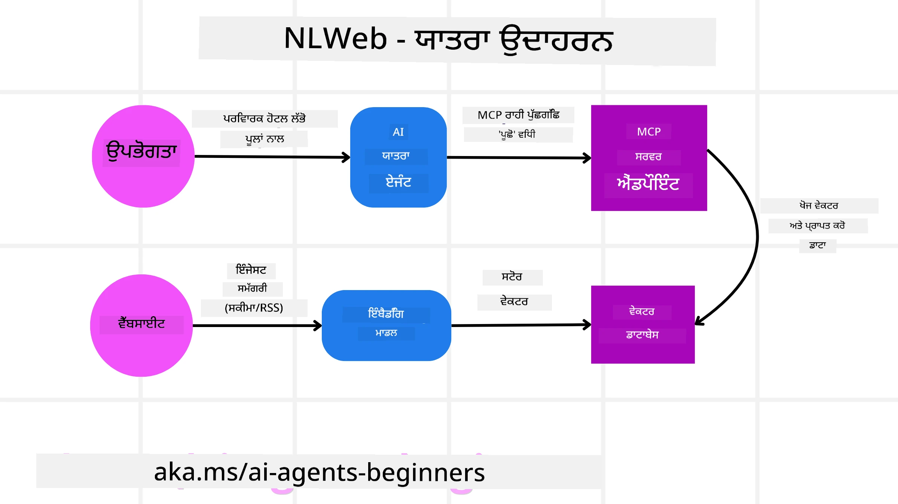

# ਏਜੇਂਟਿਕ ਪ੍ਰੋਟੋਕੋਲ (MCP, A2A ਅਤੇ NLWeb) ਦੀ ਵਰਤੋਂ  

  

> _(ਇਸ ਪਾਠ ਦਾ ਵੀਡੀਓ ਦੇਖਣ ਲਈ ਉਪਰ ਦਿੱਤੀ ਤਸਵੀਰ 'ਤੇ ਕਲਿੱਕ ਕਰੋ)_  

ਜਿਵੇਂ-जਿਵੇਂ AI ਏਜੰਟਾਂ ਦੀ ਵਰਤੋਂ ਵਧਦੀ ਜਾ ਰਹੀ ਹੈ, ਉਸੇ ਨਾਲ ਉਹ ਪ੍ਰੋਟੋਕੋਲਾਂ ਦੀ ਲੋੜ ਵੀ ਵਧ ਰਹੀ ਹੈ ਜੋ ਮਿਆਰੀਕਰਨ, ਸੁਰੱਖਿਆ ਅਤੇ ਖੁੱਲ੍ਹੇ ਨਵੀਨਤਾ ਲਈ ਸਹਾਇਤਾ ਨੂੰ ਯਕੀਨੀ ਬਣਾਉਂਦੇ ਹਨ। ਇਸ ਪਾਠ ਵਿੱਚ, ਅਸੀਂ ਇਸ ਲੋੜ ਨੂੰ ਪੂਰਾ ਕਰਨ ਵਾਲੇ 3 ਪ੍ਰੋਟੋਕੋਲਾਂ 'ਤੇ ਚਰਚਾ ਕਰਾਂਗੇ - ਮਾਡਲ ਕਾਂਟੈਕਸਟ ਪ੍ਰੋਟੋਕੋਲ (MCP), ਏਜੰਟ ਤੋਂ ਏਜੰਟ (A2A) ਅਤੇ ਨੈਚਰਲ ਲੈਂਗਵੇਜ ਵੈੱਬ (NLWeb)।  

## ਪਰਿਚਯ  

ਇਸ ਪਾਠ ਵਿੱਚ, ਅਸੀਂ ਕਵਰ ਕਰਾਂਗੇ:  

• ਕਿਵੇਂ **MCP** AI ਏਜੰਟਾਂ ਨੂੰ ਬਾਹਰੀ ਸੰਦਾਂ ਅਤੇ ਡੇਟਾ ਤੱਕ ਪਹੁੰਚ ਦੇ ਕੇ ਉਪਭੋੱਤਾ ਦੇ ਕੰਮ ਪੂਰੇ ਕਰਨ ਦੀ ਆਗਿਆ ਦਿੰਦਾ ਹੈ।  

• ਕਿਵੇਂ **A2A** ਵੱਖ-ਵੱਖ AI ਏਜੰਟਾਂ ਵਿਚਕਾਰ ਸੰਚਾਰ ਅਤੇ ਸਹਿਯੋਗ ਯਕੀਨੀ ਬਣਾਉਂਦਾ ਹੈ।  

• ਕਿਵੇਂ **NLWeb** ਕਿਸੇ ਵੀ ਵੈੱਬਸਾਈਟ ’ਤੇ ਕੁਦਰਤੀ ਭਾਸ਼ਾ ਇੰਟਰਫੇਸ ਲਿਆਉਂਦਾ ਹੈ, ਜਿਸ ਨਾਲ AI ਏਜੰਟ ਉਸ ਮਾਦੇ ਨੂੰ ਖੋਜ ਕੇ ਇਸ ਨਾਲ ਮੁਲਾਕਾਤ ਕਰ ਸਕਦੇ ਹਨ।  

## ਸਿੱਖਣ ਦੇ ਲਕੜ  

• AI ਏਜੰਟਾਂ ਦੇ ਸੰਦਰਭ ਵਿੱਚ MCP, A2A ਅਤੇ NLWeb ਦੇ ਮੁੱਖ ਮਕਸਦ ਅਤੇ ਫਾਯਦੇ **ਪਛਾਣੋ**।  

• ਕਿਵੇਂ ਹਰ ਪ੍ਰੋਟੋਕੋਲ LLMs, ਟੂਲਾਂ ਅਤੇ ਹੋਰ ਏਜੰਟਾਂ ਵਿੱਚ ਸੰਚਾਰ ਅਤੇ ਪਰਸਪਰ ਕਿਰਿਆਸ਼ੀਲਤਾ ਨੂੰ ਸਹੂਲਤ ਦਿੰਦਾ ਹੈ **ਵਿਆਖਿਆ ਕਰੋ**।  

• ਕਿਵੇਂ ਹਰ ਪ੍ਰੋਟੋਕੋਲ ਕੁਝ ਵਿਸ਼ੇਸ਼ ਭੂਮਿਕਾਵਾਂ ਨਿਭਾਉਂਦਾ ਹੈ ਜੋ ਜਟਿਲ ਏਜੇਂਟਿਕ ਸਿਸਟਮਾਂ ਦੇ ਨਿਰਮਾਣ ਲਈ ਜ਼ਰੂਰੀ ਹਨ, **ਸੰਮੇਤੋਂ**।  

## ਮਾਡਲ ਕਾਂਟੈਕਸਟ ਪ੍ਰੋਟੋਕੋਲ  

**ਮਾਡਲ ਕਾਂਟੈਕਸਟ ਪ੍ਰੋਟੋਕੋਲ (MCP)** ਇੱਕ ਖੁੱਲ੍ਹਾ ਮਿਆਰੀ ਮਾਪਦੰਡ ਹੈ ਜੋ ਐਪਲੀਕੇਸ਼ਨਾਂ ਨੂੰ LLMs ਨੂੰ ਸੰਦਰਭ ਅਤੇ ਟੂਲਾਂ ਪ੍ਰਦਾਨ ਕਰਨ ਦਾ ਸਟੈਂਡਰਡ ਤਰੀਕਾ ਦਿੰਦਾ ਹੈ। ਇਹ "ਯੂਨੀਵਰਸਲ ਐਡਾਪਟਰ" ਵਾਂਗ ਵੱਖ-ਵੱਖ ਡੇਟਾ ਸਰੋਤਾਂ ਅਤੇ ਟੂਲਾਂ ਨਾਲ ਸਥਿਰ ਤਰੀਕੇ ਨਾਲ ਜੁੜਨ ਦੀ ਆਗਿਆ ਦਿੰਦਾ ਹੈ।  

ਆਓ MCP ਦੇ ਹਿੱਸਿਆਂ, ਸਿੱਧੀ API ਵਰਤੋਂ ਨਾਲ ਤੁਲਨਾ ਵਿੱਚ ਫਾਇਦਿਆਂ ਅਤੇ ਇਹ ਕਿ ਕਿਵੇਂ AI ਏਜੰਟ MCP ਸਰਵਰ ਦੀ ਵਰਤੋਂ ਕਰ ਸਕਦੇ ਹਨ ਇਕ ਉਦਾਹਰਨ ਦੇਖੀਏ।  

### MCP ਦੇ ਮੁੱਖ ਹਿੱਸੇ  

MCP ਇੱਕ **ਕਲਾਇੰਟ-ਸਰਵਰ ਆਰਕੀਟੈਕਚਰ** ’ਤੇ ਚਲਦਾ ਹੈ ਅਤੇ ਮੁੱਖ ਹਿੱਸੇ ਹਨ:  

• **ਹੋਸਟ** LLM ਐਪਲੀਕੇਸ਼ਨ ਹਨ (ਉਦਾਹਰਨ ਵਜੋਂ ਇੱਕ ਕੋਡ ਐਡੀਟਰ ਜਿਵੇਂ VSCode) ਜੋ MCP ਸਰਵਰ ਨਾਲ ਕਨੈਕਸ਼ਨ ਸ਼ੁਰੂ ਕਰਦੇ ਹਨ।  

• **ਕਲਾਇੰਟ** ਉਹ ਹਿੱਸੇ ਹਨ ਜੋ ਹੋਸਟ ਐਪ ਵਿੱਚ ਹੁੰਦੇ ਹਨ ਅਤੇ ਸਰਵਰਾਂ ਨਾਲ ਇੱਕ-ਇੱਕ ਸੰਬੰਧ ਰਖਦੇ ਹਨ।  

• **ਸਰਵਰ** ਹਲਕੇ-ਫੁਲਕੇ ਪ੍ਰੋਗਰਾਮ ਹੁੰਦੇ ਹਨ ਜੋ ਖਾਸ ਖੂਬੀਆਂ ਦਾ ਪਰਦਰਸ਼ਨ ਕਰਦੇ ਹਨ।  

ਇਸ ਪ੍ਰੋਟੋਕੋਲ ਵਿੱਚ ਤਿੰਨ ਮੁੱਖ ਪ੍ਰਮਿਟਿਵ ਹਨ ਜੋ MCP ਸਰਵਰ ਦੀਆਂ ਸਮਰੱਥਾਵਾਂ ਹਨ:  

• **ਟੂਲ**: ਇਹ ਐਕਸ਼ਨ ਜਾਂ ਫੰਕਸ਼ਨ ਹੁੰਦੇ ਹਨ ਜੋ AI ਏਜੰਟ ਕਰ ਸਕਦਾ ਹੈ। ਉਦਾਹਰਨ ਲਈ, ਮੌਸਮ ਸੇਵਾ "ਮੌਸਮ ਪਤਾ ਕਰੋ" ਟੂਲ ਦੇ ਸਕਦੀ ਹੈ ਜਾਂ ਇੱਕ ਈ-ਕਾਮਰਸ ਸਰਵਰ "ਖਰੀਦਦਾਰੀ" ਦਾ ਟੂਲ ਮੁਹੱਈਆ ਕਰਵਾ ਸਕਦਾ ਹੈ। MCP ਸਰਵਰ ਹਰ ਟੂਲ ਦਾ ਨਾਮ, ਵੇਰਵਾ ਅਤੇ ਇਨਪੁੱਟ/ਆਉਟਪੁੱਟ ਸਕੀਮਾ ਆਪਣੀਆਂ ਸਮਰੱਥਾਵਾਂ ਦੀ ਸੂਚੀ ਵਿੱਚ ਦਿੰਦੇ ਹਨ।  

• **ਸਰੋਤ**: ਇਹ ਪੜ੍ਹਨ-ਵਾਲੇ ਡਾਟਾ ਆਈਟਮ ਜਾਂ ਦਸਤਾਵੇਜ਼ ਹੁੰਦੇ ਹਨ ਜੋ MCP ਸਰਵਰ ਮੁਹੱਈਆ ਕਰਵੇ ਅਤੇ ਕਲਾਇੰਟਜ਼ ਮੰਗ 'ਤੇ ਪ੍ਰਾਪਤ ਕਰ ਸਕਦੇ ਹਨ। ਉਦਾਹਰਨਾਂ ਵਿੱਚ ਫਾਇਲ ਦੇ ਮੱਤਵਾਂ, ਡੇਟਾਬੇਸ ਰਿਕਾਰਡ ਜਾਂ ਲੌਗ ਫਾਇਲਾਂ ਸ਼ਾਮਿਲ ਹਨ। ਸਰੋਤ ਪਾਠ (ਜਿਵੇਂ ਕੋਡ ਜਾਂ JSON) ਜਾਂ ਬਾਈਨਰੀ (ਜਿਵੇਂ ਚਿੱਤਰ ਜਾਂ PDF) ਹੋ ਸਕਦੇ ਹਨ।  

• **ਪ੍ਰਾਂਪਟ**: ਇਹ ਤੈਅ ਕੀਤੇ ਹੋਏ ਟੈਂਪਲੇਟ ਹੁੰਦੇ ਹਨ ਜੋ ਸੁਝਾਏ ਗਏ ਪ੍ਰਾਂਪਟ ਪ੍ਰਦਾਨ ਕਰਦੇ ਹਨ, ਜਿਸ ਨਾਲ ਵਧੇਰੇ ਬਹੁ-ਪਦਰਥ ਵਾਲੇ ਕੰਮ ਸੌਂਪਣ ਸੰਭਵ ਹੁੰਦੇ ਹਨ।  

### MCP ਦੇ ਫਾਇਦੇ  

MCP AI ਏਜੰਟਾਂ ਲਈ ਮਹੱਤਵਪੂਰਨ ਫਾਇਦੇ ਦਿੰਦਾ ਹੈ:  

• **ਡਾਇਨਾਮਿਕ ਟੂਲ ਖੋਜ**: ਏਜੰਟ ਸਰਵਰ ਤੋਂ ਉਪਲਬਧ ਟੂਲਾਂ ਦੀ ਸੂਚੀ ਪ੍ਰਾਪਤ ਕਰ ਸਕਦੇ ਹਨ ਜੋ ਇਹ ਦੱਸਦੀ ਹੈ ਕਿ ਉਹ ਕੀ ਕਰਦੇ ਹਨ। ਪਰੰਪਰਾ ਬੰਧ API ਦੇ ਬਦਲੇ, ਜਿੱਥੇ ਹਰ API ਬਦਲਾਅ ਲਈ ਕੋਡ ਅਦਾਲਤ ਕਰਨੀ ਪੈਂਦੀ ਹੈ, MCP "ਇਕ ਵਾਰੀ ਇੰਟਿਗਰੇਟ ਕਰੋ" ਦਾ ਤਰੀਕਾ ਦਿੰਦਾ ਹੈ, ਜੋ ਜ਼ਿਆਦਾ ਅਨੁਕੂਲਤਾ ਦਿੰਦਾ ਹੈ।  

• **LLMs ਵਿਚਕਾਰ ਅੰਤਰ-ਕਾਰਗੁਜ਼ਾਰੀ**: MCP ਵੱਖ-ਵੱਖ LLMs ਨਾਲ ਕੰਮ ਕਰਦਾ ਹੈ, ਜੋ ਬਿਹਤਰ ਪ੍ਰਦਰਸ਼ਨ ਲਈ ਮਾਡਲ ਬਦਲਣ ਦੀ ਲਚੀਲਾਪਨ ਦਿੰਦਾ ਹੈ।  

• **ਮਿਆਰੀਕ੍ਰਿਤ ਸੁਰੱਖਿਆ**: MCP ਵਿੱਚ ਇੱਕ ਮਿਆਰੀ ਪ੍ਰਮਾਣੀਕਰਨ ਤਰੀਕਾ ਹੈ, ਜੋ ਵੱਖ-ਵੱਖ MCP ਸਰਵਰਾਂ ਤੱਕ ਪਹੁੰਚ ਵਧਾਉਣ ਲਈ ਬਹੁਤ ਸਾਰੇ ਸਕੇਲਿੰਗ ਵਿੱਚ ਸੁਵਿਧਾ ਦਿੰਦਾ ਹੈ। ਇਹ ਕਈ ਰਵਾਇਤੀ APIs ਲਈ ਵੱਖ-ਵੱਖ ਕੁੰਜੀਆਂ ਅਤੇ ਪ੍ਰਮਾਣੀਕਰਨ ਦੇ ਉਪਾਯਾਂ ਨਾਲ ਮੁਕਾਬਲਾ ਕਰਨ ਨਾਲ ਵਧੀਆ ਹੈ।  

### MCP ਉਦਾਹਰਨ  

  

ਸੋਚੋ ਕਿ ਕੋਈ ਉਪਭੋਗਤਾ MCP ਦੁਆਰਾ ਚਲਾਇਆ ਗਿਆ AI ਸਹਾਇਕ ਦੀ ਵਰਤੋਂ ਨਾਲ ਇੱਕ ਉਡਾਣ ਬੁਕ ਕਰਨਾ ਚਾਹੁੰਦਾ ਹੈ।  

1. **ਕਨੈਕਸ਼ਨ**: AI ਸਹਾਇਕ (MCP ਕਲਾਇੰਟ) ਹਵਾਈਕੰਪਨੀ ਵੱਲੋਂ ਦਿੱਤੇ MCP ਸਰਵਰ ਨਾਲ ਜੁੜਦਾ ਹੈ।  

2. **ਟੂਲ ਖੋਜ**: ਕਲਾਇੰਟ ਹਵਾਈਕੰਪਨੀ ਦੇ MCP ਸਰਵਰ ਨਾਲ ਪੁੱਛਦਾ ਹੈ, "ਤੁਹਾਡੇ ਕੋਲ ਕਿਹੜੇ ਟੂਲ ਹਨ?" ਸਰਵਰ "ਉਡਾਣਾਂ ਖੋਜੋ" ਅਤੇ "ਉਡਾਣਾਂ ਬੁਕ ਕਰੋ" ਵਰਗੇ ਟੂਲ ਮੁਹੱਈਆ ਕਰਦਾ ਹੈ।  

3. **ਟੂਲ ਕਾਲ**: ਫਿਰ ਤੁਸੀਂ AI ਸਹਾਇਕ ਨੂੰ ਕਹਿੰਦੇ ਹੋ, "ਕਿਰਪਾ ਕਰਕੇ ਪੋਰਟਲੈਂਡ ਤੋਂ ਹੋਨੋਲੂਲੂ ਲਈ ਉਡਾਣ ਖੋਜੋ।" AI ਸਹਾਇਕ ਆਪਣੇ LLM ਦੀ ਵਰਤੋਂ ਕਰਕੇ ਪਹਿਲੇ ਟੂਲ ਨੂੰ ਕਾਲ ਕਰਦਾ ਹੈ ਅਤੇ MCP ਸਰਵਰ ਨੂੰ ਸਮుచਿਤ ਪੈਰਾਮੀਟਰ ਭੇਜਦਾ ਹੈ (ਮੂਲ, ਗੰਤব্য)।  

4. **ਕਾਰਜ ਅਤੇ ਜਵਾਬ**: MCP ਸਰਵਰ, ਇੱਕ ਰੈਪਰ ਵਾਂਗ, ਹਵਾਈਕੰਪਨੀ ਦੀਆਂ ਬੁਕਿੰਗ API ਨੂੰ ਕਾਲ ਕਰਦਾ ਹੈ, ਫਿਰ ਲੜੀ ਵਾਲੇ JSON ਡਾਟਾ ਪ੍ਰਾਪਤ ਕਰਕੇ AI ਸਹਾਇਕ ਨੂੰ ਭੇਜਦਾ ਹੈ।  

5. **ਅਗਲਾ ਇੰਟਰਐਕਸ਼ਨ**: AI ਸਹਾਇਕ ਉਡਾਣ ਦੇ ਵਿਕਲਪ ਪੇਸ਼ ਕਰਦਾ ਹੈ। ਜਦੋਂ ਤੁਸੀਂ ਇੱਕ ਉਡਾਣ ਚੁਣਦੇ ਹੋ, ਸਹਾਇਕ ਹੋਰ MCP ਸਰਵਰ 'ਤੇ "ਉਡਾਣ ਬੁਕ ਕਰੋ" ਟੂਲ ਕਾਲ ਕਰਕੇ ਬੁਕਿੰਗ ਪੂਰੀ ਕਰ ਸਕਦਾ ਹੈ।  

## ਏਜੰਟ-ਤੋਂ-ਏਜੰਟ ਪ੍ਰੋਟੋਕੋਲ (A2A)  

ਜਿੱਥੇ MCP LLMs ਨੂੰ ਟੂਲਾਂ ਨਾਲ ਜੋੜਨ 'ਤੇ ਧਿਆਨ ਦਿੰਦਾ ਹੈ, **ਏਜੰਟ-ਤੋਂ-ਏਜੰਟ (A2A) ਪ੍ਰੋਟੋਕੋਲ** ਅਗਲਾ ਕਦਮ ਹੈ ਜੋ ਵੱਖ-ਵੱਖ AI ਏਜੰਟਾਂ ਵਿਚਕਾਰ ਸੰਚਾਰ ਅਤੇ ਸਹਿਯੋਗ ਯਕੀਨੀ ਬਣਾਉਂਦਾ ਹੈ। A2A ਵੱਖ-ਵੱਖ ਸੰਗਠਨਾਂ, ਵਾਤਾਵਰਣਾਂ ਅਤੇ ਤਕਨੀਕੀ ਪ੍ਰਣਾਲੀਆਂ ਦੇ AI ਏਜੰਟਾਂ ਨੂੰ ਜੋੜਦਾ ਹੈ ਤਾਂ ਕਿ ਉਹ ਇੱਕ ਸਾਂਝੇ ਕੰਮ ਨੂੰ ਪੂਰਾ ਕਰ ਸਕਣ।  

ਅਸੀਂ A2A ਦੇ ਹਿੱਸਿਆਂ ਅਤੇ ਫਾਇਦਿਆਂ ਨੂੰ ਦੇਖਾਂਗੇ, ਨਾਲ ਹੀ ਇਸ ਦੀ ਵਰਤੋਂ ਕਰਕੇ ਸਾਡੇ ਯਾਤਰਾ ਐਪਲੀਕੇਸ਼ਨ ਵਿੱਚ ਇੱਕ ਉਦਾਹਰਨ ਸਮਝਾਂਗੇ।  

### A2A ਦੇ ਮੁੱਖ ਹਿੱਸੇ  

A2A ਏਜੰਟਾਂ ਵਿਚਕਾਰ ਸੰਚਾਰ ਨੂੰ ਯਕੀਨੀ ਬਣਾਉਂਦਾ ਹੈ ਅਤੇ ਉਨ੍ਹਾਂ ਨੂੰ ਉਪਭੋਗਤਾ ਦੇ ਸਬਟਾਸਕ ਨੂੰ ਪੂਰਾ ਕਰਨ ਲਈ ਸਾਥੀ ਬਣਾਉਂਦਾ ਹੈ। ਪ੍ਰੋਟੋਕੋਲ ਦਾ ਹਰ ਹਿੱਸਾ ਇਸ ਵਿੱਚ ਯੋਗਦਾਨ ਪਾਉਂਦਾ ਹੈ:  

#### ਏਜੰਟ ਕਾਰਡ  

ਜਿਵੇਂ MCP ਸਰਵਰ ਟੂਲਾਂ ਦੀ ਸੂਚੀ ਸਾਂਝੀ ਕਰਦਾ ਹੈ, ਏਜੰਟ ਕਾਰਡ ਵਿੱਚ ਹੁੰਦਾ ਹੈ:  
- ਏਜੰਟ ਦਾ ਨਾਮ।  
- ਉਹ **ਸਧਾਰਣ ਕੰਮਾਂ ਦਾ ਵੇਰਵਾ** ਜੋ ਉਹ ਪੂਰੇ ਕਰਦਾ ਹੈ।  
- ਐਜੰਟ ਨੂੰ ਕਦੋਂ ਅਤੇ ਕਿਉਂ ਕਾਲ ਕਰਨਾ ਹੈ, ਇਹ ਸਮਝਾਉਣ ਲਈ **ਖਾਸ ਹੁਨਰਾਂ ਦੀ ਸੂਚੀ**। ਇਹ ਹੋਰ ਏਜੰਟਾਂ ਜਾਂ ਮਨੁੱਖੀ ਉਪਭੋਗਤਾਵਾਂ ਲਈ ਸਹਾਇਕ ਹੁੰਦਾ ਹੈ।  
- ਏਜੰਟ ਦਾ **ਮੌਜੂਦਾ ਐਂਡਪੌਇੰਟ URL**।  
- ਏਜੰਟ ਦਾ **ਵਰਜ਼ਨ** ਅਤੇ ਉਸ ਦੀਆਂ **ਸਮਰੱਥਾਵਾਂ** ਜਿਵੇਂ ਕਿ ਸਟ੍ਰੀਮਿੰਗ ਜਵਾਬ ਅਤੇ ਪੁਸ਼ ਸੂਚਨਾਵਾਂ।  

#### ਏਜੰਟ ਐਕਜ਼ਿਕਿ੍ਯੂਟਰ  

ਏਜੰਟ ਐਕਜ਼ਿਕਿ੍ਯੂਟਰ ਦੀ ਜ਼ਿੰਮੇਵਾਰੀ ਹੈ ਕਿ **ਉਪਭੋਗਤਾ ਦੀ ਚੈਟ ਦਾ ਸੰਦਰਭ ਦੂਰੇ ਏਜੰਟ ਤੱਕ ਪਹੁੰਚਾਏ**, ਤਾਂ ਜੋ ਦੂਰਾ ਏਜੰਟ ਕੰਮ ਨੂੰ ਸਮਝ ਕੇ ਪੂਰਾ ਕਰ ਸਕੇ। A2A ਸਰਵਰ ਵਿੱਚ, ਏਜੰਟ ਆਪਣੇ ਖੁਦ ਦੇ LLM ਦੀ ਵਰਤੋਂ ਕਰਦਾ ਹੈ ਆਉਂਦੀਆਂ ਬੇਨਤੀਆਂ ਨੂੰ ਪੜ੍ਹਨ ਅਤੇ ਆਪਣੇ ਅੰਦਰੂਨੀ ਟੂਲਾਂ ਰਾਹੀਂ ਕੰਮ ਕਰਨ ਲਈ।  

#### ਆਰਟੀਫੈਕਟ  

ਜਦੋਂ ਦੂਰਾ ਏਜੰਟ ਬੇਨਤੀਇਹ ਪੁਰੀ ਕਰਦਾ ਹੈ, ਤਾਂ ਉਸ ਦਾ ਕਾਰਜ ਇੱਕ ਆਰਟੀਫੈਕਟ ਵਜੋਂ ਬਣਦਾ ਹੈ। ਇੱਕ ਆਰਟੀਫੈਕਟ ਵਿੱਚ ਸ਼ਾਮਿਲ ਹੁੰਦਾ ਹੈ: ਏਜੰਟ ਦੇ ਕੰਮ ਦਾ ਨਤੀਜਾ, ਕੀ ਪੂਰਾ ਕੀਤਾ ਗਿਆ ਉਸ ਦਾ ਵੇਰਵਾ ਅਤੇ ਉਹ ਲਿਖਤੀ ਸੰਦਰਭ ਜੋ ਪ੍ਰੋਟੋਕੋਲ ਰਾਹੀਂ ਭੇਜਿਆ ਜਾਂਦਾ ਹੈ। ਆਰਟੀਫੈਕਟ ਭੇਜਣ ਤੋਂ ਬਾਅਦ ਦੂਰੇ ਏਜੰਟ ਨਾਲ ਸੰਬੰਧ ਬੰਦ ਕੀਤਾ ਜਾਂਦਾ ਹੈ ਜਦ ਤੱਕ ਸਹੂਲਤ ਮੁੜ ਲੋੜੀਂਦੀ ਨਾ ਹੋਵੇ।  

#### ਇਵੈਂਟ ਕਿਊ  

ਇਹ ਹਿੱਸਾ **ਅਪਡੇਟਾਂ ਨੂੰ ਸੰਭਾਲਣ ਅਤੇ ਸੁਨੇਹਿਆਂ ਦੀ ਪਹੁੰਚ ਲਈ** ਵਰਤਿਆ ਜਾਂਦਾ ਹੈ। ਇਹ ਪ੍ਰੋਡਕਸ਼ਨ ਵਿੱਚ ਅਹਿਮ ਹੈ ਤਾਂ ਜੋ ਕੰਮ ਪੂਰਾ ਹੋਣ ਤੱਕ ਏਜੰਟਾਂ ਦਾ ਸੰਬੰਧ ਬੰਦ ਨਾ ਹੋ ਜਾਵੇ, ਖ਼ਾਸ ਕਰਕੇ ਜਦੋਂ ਕੰਮ ਲੰਮਾ ਸਮਾਂ ਲੈ ਸਕਦਾ ਹੈ।  

### A2A ਦੇ ਫਾਇਦੇ  

• **ਸਹਿਯੋਗ ਵਿੱਚ ਸੁਧਾਰ**: ਇਹ ਵੱਖ-ਵੱਖ ਵਿਕਰੇਤਾਵਾਂ ਅਤੇ ਪਲੇਟਫਾਰਮਾਂ ਦੇ ਏਜੰਟਾਂ ਨੂੰ ਪਰਸਪਰ ਸੰਚਾਰ ਕਰਨ, ਸੰਦਰਭ ਸਾਂਝਾ ਕਰਨ ਅਤੇ ਮਿਲ ਕੇ ਕੰਮ ਕਰਨ ਯੋਗ ਬਣਾਉਂਦਾ ਹੈ, ਇਸ ਨਾਲ ਸੰਪਰਕ ਵਿਚ ਵੱਖ-ਵੱਖ ਪ੍ਰਣਾਲੀਆਂ ਵਿਚਕਾਰ ਆਟੋਮੇਸ਼ਨ ਸੌਖਾ ਹੁੰਦਾ ਹੈ।  

• **ਮਾਡਲ ਚੋਣ 'ਤੇ ਲਚੀਲਾਪਨ**: ਹਰ A2A ਏਜੰਟ ਇਹ ਫੈਸਲਾ ਕਰ ਸਕਦਾ ਹੈ ਕਿ ਉਹ ਆਪਣੇ ਕਿੱਤੇ ਲਈ ਕਿਹੜਾ LLM ਵਰਤੇ, ਜੋ ਕੁਝ MCP ਸਥਿਤੀਆਂ ਨਾਲੋਂ ਵਧੀਆ ਅਨੁਕੂਲਤਾ ਦਿੰਦਾ ਹੈ।  

• **ਇੰਤਜ਼ਾਮੀ ਪ੍ਰਮਾਣੀਕਰਨ**: ਪ੍ਰਮਾਣੀਕਰਨ ਸਿੱਧਾ A2A ਪ੍ਰੋਟੋਕੋਲ ਵਿੱਚ ਸ਼ਾਮਿਲ ਹੈ, ਜੋ ਏਜੰਟਾਂ ਦੇ ਸੰਚਾਰ ਲਈ ਇੱਕ ਮਜ਼ਬੂਤ ਸੁਰੱਖਿਆ ਢਾਂਚਾ ਪ੍ਰਦਾਨ ਕਰਦਾ ਹੈ।  

### A2A ਦਾ ਉਦਾਹਰਨ  

  

ਆਓ ਆਪਣੀ ਯਾਤਰਾ ਬੁਕਿੰਗ ਕਹਾਣੀ ਨੂੰ ਵਧਾਈਏ, ਪਰ ਇਸ ਵਾਰੀ A2A ਦੀ ਵਰਤੋਂ ਨਾਲ।  

1. **ਉਪਭੋਗਤਾ ਦੀ ਬੇਨਤੀ ਮਲਟੀ-ਏਜੰਟ ਤੱਕ**: ਉਪਭੋਗਤਾ ਇੱਕ "ਟ੍ਰੈਵਲ ਏਜੰਟ" A2A ਕਲਾਇੰਟ/ਏਜੰਟ ਨਾਲ ਇੰਟਰਐਕਟ ਕਰਦਾ ਹੈ, ਜਿਵੇਂ ਕਿ ਕਹਿਣਾ, "ਮੁਝੇ ਅਗਲੇ ਹਫਤੇ ਹੋਨੋਲੂਲੂ ਲਈ ਪੂਰਾ ਯਾਤਰਾ ਬੁਕ ਕਰੋ, ਜਿਸ ਵਿੱਚ ਉਡਾਣ, ਹੋਟਲ ਅਤੇ ਕਿਰਾਏ ਦੀ ਕਾਰ ਸ਼ਾਮਿਲ ਹੋਵੇ"।  

2. **ਟ੍ਰੈਵਲ ਏਜੰਟ ਦੁਆਰਾ ਕੋਆਰਡੀਨੇਸ਼ਨ**: ਟ੍ਰੈਵਲ ਏਜੰਟ ਇਸ ਜਟਿਲ ਬੇਨਤੀ ਨੂੰ ਪ੍ਰਾਪਤ ਕਰਦਾ ਹੈ। ਇਹ ਆਪਣੀ LLM ਦੀ ਵਰਤੋਂ ਕਰਦਾ ਹੈ ਮਿਸ਼ਨ ਬਾਰੇ ਸੋਚਣ ਲਈ ਅਤੇ ਜਾਣਦਾ ਹੈ ਕਿ ਇਸ ਨੂੰ ਹੋਰ ਵਿਸ਼ੇਸ਼ ਏਜੰਟਾਂ ਨਾਲ ਸੰਚਾਰ ਕਰਨਾ ਹੈ।  

3. **ਏਜੰਟਾਂ ਵਿਚਕਾਰ ਸੰਚਾਰ**: ਟ੍ਰੈਵਲ ਏਜੰਟ ਫਿਰ A2A ਪ੍ਰੋਟੋਕੋਲ ਦੀ ਵਰਤੋਂ ਕਰ ਕੇ ਨੀਵਲੇ ਏਜੰਟਾਂ ਨਾਲ ਜੁੜਦਾ ਹੈ, ਜਿਵੇਂ ਕਿ "ਹਵਾਈਕੰਪਨੀ ਏਜੰਟ", "ਹੋਟਲ ਏਜੰਟ" ਅਤੇ "ਕਾਰ ਕਿਰਾਏ ਦਾ ਏਜੰਟ", ਜੋ ਵੱਖ-ਵੱਖ ਕੰਪਨੀਆਂ ਵੱਲੋਂ ਬਣਾਏ ਗਏ ਹਨ।  

4. **ਡੀਲਿਗੇਟ ਕੀਤਾ ਕੰਮ**: ਟ੍ਰੈਵਲ ਏਜੰਟ ਇਹ ਵਿਸ਼ੇਸ਼ ਟਾਸਕ ਆਲੇਏਜੰਟਾਂ ਨੂੰ ਭੇਜਦਾ ਹੈ (ਜਿਵੇਂ "ਹੋਨੋਲੂਲੂ ਲਈ ਉਡਾਣਾਂ ਲੱਭੋ", "ਹੋਟਲ ਬੁਕ ਕਰੋ", "ਕਾਰ ਕਿਰਾਏ 'ਤੇ ਲਓ")। ਹਰ ਵਿਸ਼ੇਸ਼ ਏਜੰਟ ਆਪਣੇ LLM ਅਤੇ ਟੂਲਾਂ (ਜੋ ਖੁਦ MCP ਸਰਵਰ ਹੋ ਸਕਦੇ ਹਨ) ਦੀ ਵਰਤੋਂ ਕਰ ਕੇ ਆਪਣਾ ਭਾਗ ਪੂਰਾ ਕਰਦਾ ਹੈ।  

5. **ਸੰਯੁਕਤ ਜਵਾਬ**: ਜਦੋਂ ਸਾਰੇ ਏਜੰਟ ਆਪਣਾ ਕੰਮ ਪੂਰਾ ਕਰ ਲੈਂਦੇ ਹਨ, ਟ੍ਰੈਵਲ ਏਜੰਟ ਨਤੀਜੇ (ਉਡਾਣ ਵੇਰਵਾ, ਹੋਟਲ ਪੁਸ਼ਟੀ, ਕਾਰ ਕਿਰਾਏ ਦੀ ਬੁਕਿੰਗ) ਇਕੱਠੇ ਕਰਦਾ ਹੈ ਅਤੇ ਉਪਭੋਗਤਾ ਨੂੰ ਇੱਕ ਚੈਟ-ਸਟਾਈਲ ਜਵਾਬ ਭੇਜਦਾ ਹੈ।  

## ਨੈਚਰਲ ਲੈਂਗਵੇਜ ਵੈੱਬ (NLWeb)  

ਵੈੱਬਸਾਈਟਾਂ ਲੰਬੇ ਸਮੇਂ ਤੋਂ ਇੰਟਰਨੈੱਟ 'ਤੇ ਜਾਣਕਾਰੀ ਅਤੇ ਡੇਟਾ ਤੱਕ ਉਪਭੋਗਤਾਵਾਂ ਦੀ ਮੁੱਖ ਪਹੁੰਚ ਰਹੀ ਹਨ।  

ਆਓ NLWeb ਦੇ ਵੱਖ-ਵੱਖ ਹਿੱਸਿਆਂ, ਇਸਦੇ ਫਾਇਦਿਆਂ ਅਤੇ ਇਹ ਕਿ ਸਾਡਾ ਯਾਤਰਾ ਐਪ ਕਿਸ ਤਰ੍ਹਾਂ NLWeb ਨਾਲ ਕੰਮ ਕਰਦਾ ਹੈ ਨੂੰ ਦੇਖੀਏ।  

### NLWeb ਦੇ ਹਿੱਸੇ  

- **NLWeb ਐਪਲੀਕੇਸ਼ਨ (ਮੁੱਖ ਸੇਵਾ ਕੋਡ)**: ਇਹ ਸਿਸਟਮ ਕੁਦਰਤੀ ਭਾਸ਼ਾ ਦੇ ਪ੍ਰਸ਼ਨਾਂ ਨੂੰ ਪ੍ਰਕਿਰਿਆ ਕਰਦਾ ਹੈ। ਇਹ ਪਲੇਟਫਾਰਮ ਦੇ ਵੱਖ-ਵੱਖ ਹਿੱਸਿਆਂ ਨੂੰ ਜੋੜਦਾ ਹੈ ਜਵਾਬ ਬਣਾਉਣ ਲਈ। ਤੁਸੀਂ ਇਸਨੂੰ ਵੈੱਬਸਾਈਟ ਦੇ ਕੁਦਰਤੀ ਭਾਸ਼ਾ ਵਿਸ਼ੇਸ਼ਤਾਵਾਂ ਨੂੰ ਚਲਾਉਣ ਵਾਲਾ **ਇੰਜਣ** ਸਮਝ ਸਕਦੇ ਹੋ।  

- **NLWeb ਪ੍ਰੋਟੋਕੋਲ**: ਇਹ ਵੈੱਬਸਾਈਟ ਨਾਲ ਕੁਦਰਤੀ ਭਾਸ਼ਾ ਸચાલਨ ਲਈ **ਮੂਲ ਨਿਯਮਾਂ ਦਾ ਸੈੱਟ** ਹੈ। ਇਹ JSON ਫਾਰਮੈਟ (ਅਕਸਰ Schema.org ਵਰਤਦਿਆਂ) ਵਿੱਚ ਜਵਾਬ ਭੇਜਦਾ ਹੈ। ਇਸਦਾ ਮਕਸਦ "AI ਵੈੱਬ" ਲਈ ਇੱਕ ਸਾਦਾ ਬੁਨਿਆਦ ਬਣਾਉਣਾ ਹੈ, ਜਿਵੇਂ HTML ਦਸਤਾਵੇਜ਼ ਆਨਲਾਈਨ ਸਾਂਝੇ ਕਰਨ ਲਈ ਕੀਤਾ।  

- **MCP ਸਰਵਰ (ਮਾਡਲ ਕਾਂਟੈਕਸਟ ਪ੍ਰੋਟੋਕੋਲ ਐਂਡਪੌਇੰਟ)**: ਹਰ NLWeb ਸੈੱਟਅੱਪ ਇੱਕ **MCP ਸਰਵਰ** ਵਜੋਂ ਕੰਮ ਕਰਦਾ ਹੈ। ਇਸ ਦਾ ਮਤਲਬ ਹੈ ਕਿ ਇਹ ਹੋਰ AI ਪ੍ਰਣਾਲੀਆਂ ਨਾਲ ਟੂਲਾਂ (ਜਿਵੇਂ ਕਿ "ask" ਮੈਥਡ) ਅਤੇ ਡੇਟਾ ਸਾਂਝਾ ਕਰ ਸਕਦਾ ਹੈ। ਇਸ ਨਾਲ ਵੈੱਬਸਾਈਟ ਦੀ ਸਮੱਗਰੀ ਅਤੇ ਸਮਰੱਥਾ AI ਏਜੰਟਾਂ ਲਈ ਉਪਯੋਗੀ ਬਣ ਜਾਂਦੀ ਹੈ ਅਤੇ ਸਾਈਟ ਨੂੰ ਵਿਆਪਕ “ਏਜੰਟ ਪਰਿਸ਼ਰ” ਦਾ ਹਿੱਸਾ ਬਣਾਉਂਦਾ ਹੈ।  

- **ਐਮਬੈੱਡਿੰਗ ਮਾਡਲ**: ਇਹ ਮਾਡਲ ਵੈੱਬਸਾਈਟ ਸਮੱਗਰੀ ਨੂੰ ਸੰਖਿਆਤਮਕ ਪ੍ਰਤੀਨਿਧੀਆਂ ਵਿੱਚ ਬਦਲਦੇ ਹਨ, ਜਿਨ੍ਹਾਂ ਨੂੰ ਵੇਕਟਰ (ਐਮਬੈੱਡਿੰਗਜ਼) ਕਹਿੰਦੇ ਹਨ। ਇਹ ਵੇਕਟਰ ਮੀਨਿੰਗ ਕੈਪਚਰ ਕਰਦੇ ਹਨ ਜਿਸ ਨਾਲ ਕੰਪਿਊਟਰ ਤੁਲਨਾ ਅਤੇ ਖੋਜ ਕਰ ਸਕਦੇ ਹਨ। ਇਹ ਇੱਕ ਖ਼ਾਸ ਡੇਟਾਬੇਸ ਵਿੱਚ ਸੰਭਾਲੇ ਜਾਂਦੇ ਹਨ ਅਤੇ ਉਪਭੋਗਤਾ ਮਾਡਲ ਦੀ ਚੋਣ ਕਰ ਸਕਦੇ ਹਨ।  

- **ਵੇਕਟਰ ਡੇਟਾਬੇਸ (ਪ੍ਰਾਪਤੀ ਪ੍ਰਣਾਲੀ)**: ਇਹ ਡੇਟਾਬੇਸ ਵੈੱਬਸਾਈਟ ਸਮੱਗਰੀ ਦੇ ਐਮਬੈੱਡਿੰਗਜ਼ ਨੂੰ ਸਟੋਰ ਕਰਦਾ ਹੈ। ਜਦੋਂ ਕੋਈ ਪ੍ਰਸ਼ਨ ਪੁੱਛਦਾ ਹੈ, NLWeb ਇਸ ਡੇਟਾਬੇਸ ਨੂੰ ਖੋਜ ਕੇ ਸਭ ਤੋਂ ਸਬੰਧਿਤ ਜਾਣਕਾਰੀ ਤੇਜ਼ੀ ਨਾਲ ਲੱਭਦਾ ਹੈ। ਇਹ ਸੰਭਾਵਿਤ ਜਵਾਬਾਂ ਦੀ ਇੱਕ ਤਾਲਿਕਾ ਦਿੰਦਾ ਹੈ, ਜੋ ਸਮਾਨਤਾ ਦਰਜਾ ਅਨੁਸਾਰ ਵਰਗੀਕ੍ਰਿਤ ਹੁੰਦੀ ਹੈ। NLWeb ਵੱਖ-ਵੱਖ ਵੇਕਟਰ ਸਟੋਰੇਜ ਪ੍ਰਣਾਲੀਆਂ ਜਿਵੇਂ ਕਿ Qdrant, Snowflake, Milvus, Azure AI Search ਅਤੇ Elasticsearch ਨਾਲ ਕੰਮ ਕਰਦਾ ਹੈ।  

### ਉਦਾਹਰਨ ਨਾਲ NLWeb  

  

ਆਓ ਫਿਰ ਤੋਂ ਸਾਡੀ ਯਾਤਰਾ ਬੁਕਿੰਗ ਵੈੱਬਸਾਈਟ ਨੂੰ ਦੇਖੀਏ, ਪਰ ਇਸ ਵਾਰੀ ਇਹ NLWeb ਨਾਲ ਚੱਲ ਰਹੀ ਹੈ।  

1. **ਡੇਟਾ ਇੰਟੇਕ**: ਯਾਤਰਾ ਵੈੱਬਸਾਈਟ ਦੇ ਮੌਜੂਦਾ ਪ੍ਰੋਡਕਟ ਕੈਟਾਲਾਗ (ਜਿਵੇਂ ਫ਼ਲਾਈਟ ਲਿਸਟਿੰਗ, ਹੋਟਲ ਵਰਣਨ, ਟੂਰ ਪੈਕੇਜ) Schema.org ਵਰਗੇ ਫਾਰਮੈਟ ਨਾਲ ਜਾਂ RSS ਫੀਡ ਰਾਹੀਂ ਲੋਡ ਕੀਤੇ ਜਾਂਦੇ ਹਨ। NLWeb ਦੇ ਟੂਲ ਇਸ ਸਟ੍ਰਕਚਰ ਡੇਟਾ ਨੂੰ ਲੈਂਦੇ ਹਨ, ਐਮਬੈੱਡਿੰਗ ਬਣਾਉਂਦੇ ਹਨ ਅਤੇ ਉਨ੍ਹਾਂ ਨੂੰ ਸਥਾਨਕ ਜਾਂ ਦੂਰੇ ਵੇਕਟਰ ਡੇਟਾਬੇਸ ਵਿੱਚ ਸਟੋਰ ਕਰਦੇ ਹਨ।  

2. **ਕੁਦਰਤੀ ਭਾਸ਼ਾ ਪ੍ਰਸ਼ਨ (มนੁੱਖ)**: ਕੋਈ ਉਪਭੋਗਤਾ ਵੈੱਬਸਾਈਟ 'ਤੇ ਆਉਂਦਾ ਹੈ ਅਤੇ ਮੇਨੂਵਾਂ ਦੌੜਨ ਦੀ ਥਾਂ ਚੈਟ ਇੰਟਰਫੇਸ ਵਿੱਚ ਲਿਖਦਾ ਹੈ: "ਮੇਰੇ ਲਈ ਹੋਨੋਲੂਲੂ ਵਿੱਚ ਅਗਲੇ ਹਫਤੇ ਡੂੰਬਣ ਵਾਲੀ ਸਵਿਮਿੰਗ ਪੁਲ ਵਾਲਾ ਪਰਿਵਾਰਕ-ਮਿੱਤਰ ਹੋਟਲ ਲੱਭੋ"।  

3. **NLWeb ਪ੍ਰਕਿਰਿਆ**: NLWeb ਐਪਲੀਕੇਸ਼ਨ ਇਹ ਪ੍ਰਸ਼ਨ ਪ੍ਰਾਪਤ ਕਰਦਾ ਹੈ। ਇਹ ਪ੍ਰਸ਼ਨ ਨੂੰ ਸਮਝਣ ਲਈ LLM ਨੂੰ ਭੇਜਦਾ ਹੈ ਅਤੇ ਇਕੱਠੇ ਹੀ ਡੇਟਾਬੇਸ ਵਿੱਚ ਹੋਟਲ ਲਿਸਟਿੰਗ ਲੱਭਦਾ ਹੈ।  

4. **ਸਹੀ ਨਤੀਜੇ**: LLM ਖੋਜ ਨਤੀਜਿਆਂ ਨੂੰ ਸਮਝਣ ਵਿੱਚ ਮਦਦ ਕਰਦਾ ਹੈ, "ਪਰਿਵਾਰਕ-ਮਿੱਤਰ", "ਪੂਲ" ਅਤੇ "ਹੋਨੋਲੂਲੂ" ਮਿਆਰ ਦੇ ਅਧਾਰ 'ਤੇ ਸਭ ਤੋਂ ਵਧੀਆ ਮੇਲ-ਮਿਲਾਪ ਪਛਾਣਦਾ ਹੈ, ਅਤੇ ਫਿਰ ਕੁਦਰਤੀ ਭਾਸ਼ਾ ਵਿੱਚ ਜਵਾਬ ਬਣਾਉਂਦਾ ਹੈ। ਜਰੂਰੀ ਹੈ ਕਿ ਜਵਾਬ ਵੈੱਬਸਾਈਟ ਦੇ ਅਸਲੀ ਹੋਟਲ ਕੈਟਾਲਾਗ ਤੋਂ ਹੁੰਦਾ ਹੈ, ਨਾ ਕਿ ਕਥਿਤ ਜਾਣਕਾਰੀ।  

5. **AI ਏਜੰਟ ਪਰਸਪਰਕ੍ਰਿਆ**: ਚੂੰਕਿ NLWeb MCP ਸਰਵਰ ਵਜੋਂ ਕੰਮ ਕਰਦਾ ਹੈ, ਬਾਹਰੀ AI ਯਾਤਰਾ ਏਜੰਟ ਵੀ ਇਸ ਵੈੱਬਸਾਈਟ ਦੇ NLWeb ਵਰਜ਼ਨ ਨਾਲ ਜੁੜ ਸਕਦਾ ਹੈ। AI ਏਜੰਟ ਤਦ `ask` MCP ਮੈਥਡ ਦੀ ਵਰਤੋਂ ਕਰ ਕੇ ਸਿੱਧਾ ਵੈੱਬਸਾਈਟ ਨੂੰ ਪੁੱਛ ਸਕਦਾ ਹੈ: `ask("ਕੀ ਹੋਨੋਲੂਲੂ ਖੇਤਰ ਵਿੱਚ ਕੋਈ ਵੇਗਨ-ਮਿੱਤਰ ਰੈਸਟੋਰੈਂਟ ਹੋਟਲ ਵਲੋਂ ਸਿਫਾਰਸ਼ ਕੀਤੇ ਗਏ ਹਨ?")`। NLWeb ਇਹ ਪ੍ਰਕਿਰਿਆ ਕਰੇਗਾ, ਰੈਸਟੋਰੈਂਟ ਜਾਣਕਾਰੀ ਦੇ ਡੇਟਾਬੇਸ ਨਾਲ (ਜੇ ਲੋਡ ਕੀਤੀ ਹੋਵੇ), ਅਤੇ ਇੱਕ ਸੰਗਠਿਤ JSON ਜਵਾਬ ਵਾਪਸ ਭੇਜੇਗਾ।  

### MCP/A2A/NLWeb ਬਾਰੇ ਹੋਰ ਪ੍ਰਸ਼ਨ?  

ਹੋਰ ਸਿੱਖਣ ਵਾਲਿਆਂ ਨਾਲ ਮਿਲਣ ਲਈ, ਦਫਤਰ ਵਾਲੇ ਘੰਟੇ ਵਿੱਚ ਸ਼ਾਮਿਲ ਹੋਣ ਅਤੇ ਆਪਣੇ AI ਏਜੰਟਾਂ ਦੇ ਪ੍ਰਸ਼ਨਾਂ ਦੇ ਜਵਾਬ ਹਾਸਲ ਕਰਨ ਲਈ [Microsoft Foundry Discord](https://discord.com/invite/ATgtXmAS5D) ‘ਤੇ ਸ਼ਾਮਿਲ ਹੋਵੋ।  

## ਸਾਂਝੇ ਜਣੇ  

- [ਨਵੇਂ ਸਿੱਖਣ ਵਾਲਿਆਂ ਲਈ MCP](https://aka.ms/mcp-for-beginners)  
- [MCP ਦਸਤਾਵੇਜ਼ੀਕਰਨ](https://learn.microsoft.com/python/api/overview/azure/ai-projects-readme)  
- [NLWeb ਰੇਪੋ](https://github.com/nlweb-ai/NLWeb)  
- [Microsoft Agent Framework](https://learn.microsoft.com/en-us/agent-framework/overview/?wt.mc_id=youtube_26688_organicsocial_reactor&pivots=programming-language-python)  

## ਪਹਿਲਾ ਪਾਠ  

[ਪ੍ਰੋਡਕਸ਼ਨ ਵਿੱਚ AI ਏਜੰਟ](../10-ai-agents-production/README.md)  

## ਅਗਲਾ ਪਾਠ  

[AI ਏਜੰਟਾਂ ਲਈ ਸੰਦਰਭ ਇੰਜੀਨੀਅਰਿੰਗ](../12-context-engineering/README.md)  

---

<!-- CO-OP TRANSLATOR DISCLAIMER START -->
**ਅਸਵੀਕਾਰੋਪਣ**:
ਇਸ ਦਸਤਾਵੇਜ਼ ਦਾ ਅਨੁਵਾਦ ਏਆਈ ਅਨੁਵਾਦ ਸੇਵਾ [Co-op Translator](https://github.com/Azure/co-op-translator) ਦੀ ਵਰਤੋਂ ਕਰਕੇ ਕੀਤਾ ਗਿਆ ਹੈ। ਜਦੋਂ ਕਿ ਅਸੀਂ ਸਹੀਤਾਵਾਂ ਲਈ ਯਤਨਸ਼ੀਲ ਹਾਂ, ਕਿਰਪਾ ਕਰਕੇ ਧਿਆਨ ਰੱਖੋ ਕਿ ਸਵੈਚਾਲਿਤ ਅਨੁਵਾਦਾਂ ਵਿੱਚ ਗਲਤੀਆਂ ਜਾਂ ਅਸਮੱਤਿਆਵਾਂ ਹੋ ਸਕਦੀਆਂ ਹਨ। ਮੂਲ ਦਸਤਾਵੇਜ਼ ਆਪਣੀ ਮੂਲ ਭਾਸ਼ਾ ਵਿੱਚ ਅਧਿਕਾਰਕ ਸਰੋਤ ਮੰਨਿਆ ਜਾਣਾ ਚਾਹੀਦਾ ਹੈ। ਜਰੂਰੀ ਜਾਣਕਾਰੀ ਲਈ, ਪੇਸ਼ੇਵਰ ਮਨੁੱਖੀ ਅਨੁਵਾਦ ਦੀ ਸਿਫ਼ਾਰਸ਼ ਕੀਤੀ ਜਾਂਦੀ ਹੈ। ਅਸੀਂ ਇਸ ਅਨੁਵਾਦ ਦੇ ਉਪਯੋਗ ਤੋਂ ਪੈਦਾ ਹੋਣ ਵਾਲੀਆਂ ਕਿਸੇ ਵੀ ਗਲਤਫਹਿਮੀਆਂ ਜਾਂ ਗਲਤ ਵਿਆਖਿਆਵਾਂ ਲਈ ਜਵਾਬਦੇਹ ਨਹੀਂ ਹਾਂ।
<!-- CO-OP TRANSLATOR DISCLAIMER END -->