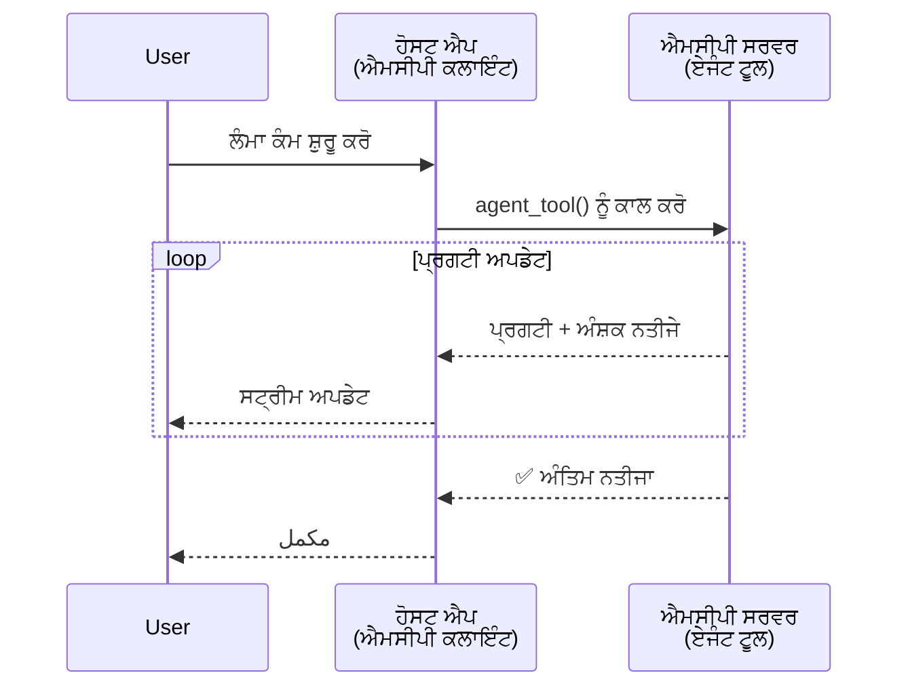
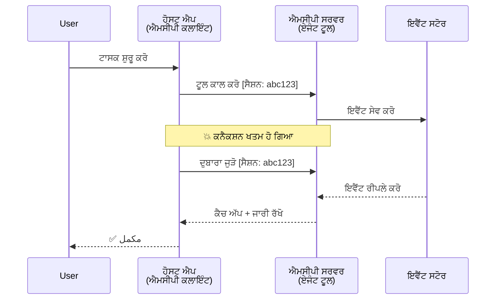
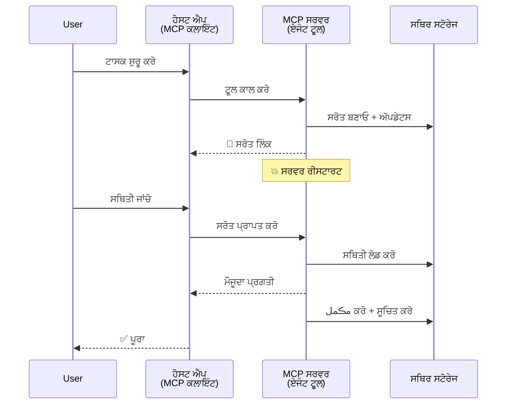
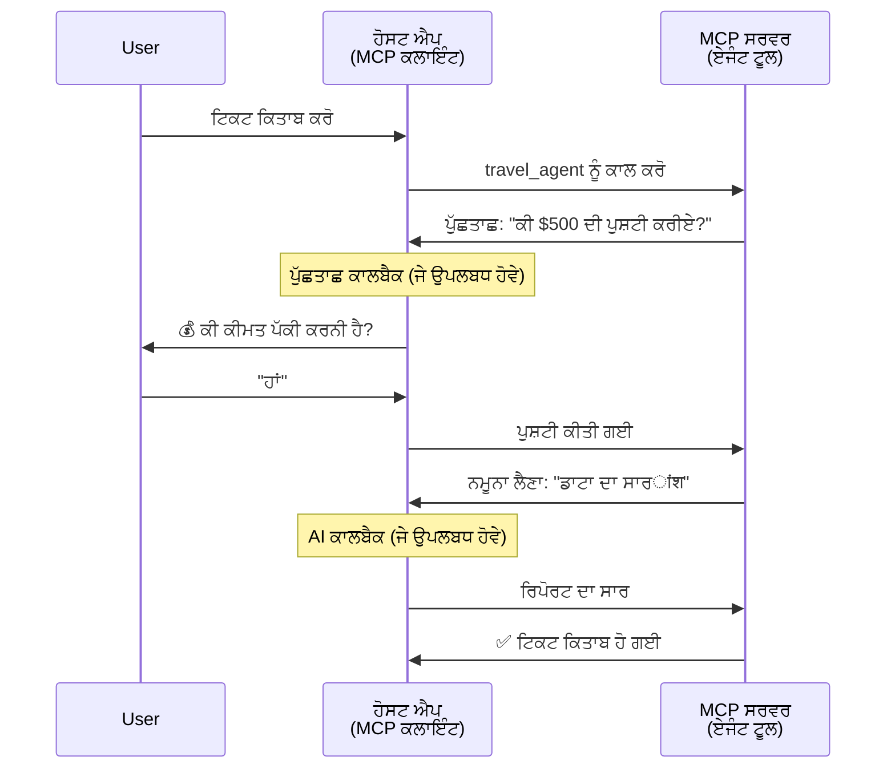
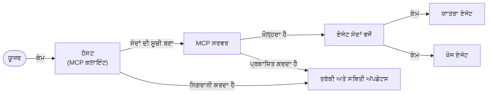

# MCP ਨਾਲ ਏਜੰਟ ਤੋਂ ਏਜੰਟ ਸੰਚਾਰ ਪ੍ਰਣਾਲੀ ਬਣਾਉਣਾ

> TL;DR - ਕੀ ਤੁਸੀਂ MCP 'ਤੇ ਏਜੰਟ2ਏਜੰਟ ਸੰਚਾਰ ਬਣਾ ਸਕਦੇ ਹੋ? ਜੀ ਹਾਂ!

MCP ਨੇ ਆਪਣੇ ਮੁਢਲੇ ਲਕੜੀ 'LLMs ਨੂੰ ਸੰਦਰਭ ਪ੍ਰਦਾਨ ਕਰਨ' ਤੋਂ ਕਾਫੀ ਅੱਗੇ ਵਧ ਗਿਆ ਹੈ। ਹਾਲੀਆ ਸੁਧਾਰਾਂ ਵਿੱਚ [ਪੁਨਰਾਰੰਭਯੋਗ ਸਟਰੀਮਾਂ](https://modelcontextprotocol.io/docs/concepts/transports#resumability-and-redelivery), [ਇਲਿਸੀਟੇਸ਼ਨ](https://modelcontextprotocol.io/specification/2025-06-18/client/elicitation), [ਸੈਂਪਲਿੰਗ](https://modelcontextprotocol.io/specification/2025-06-18/client/sampling), ਅਤੇ ਸੂਚਨਾਵਾਂ ([ਪ੍ਰਗਤੀ](https://modelcontextprotocol.io/specification/2025-06-18/basic/utilities/progress) ਅਤੇ [ਸੰਸਾਧਨ](https://modelcontextprotocol.io/specification/2025-06-18/schema#resourceupdatednotification)) ਸ਼ਾਮਲ ਹਨ, MCP ਹੁਣ ਜਟਿਲ ਏਜੰਟ-ਤੋਂ-ਏਜੰਟ ਸੰਚਾਰ ਪ੍ਰਣਾਲੀ ਬਣਾਉਣ ਲਈ ਇੱਕ ਮਜ਼ਬੂਤ ਬੁਨਿਆਦ ਪ੍ਰਦਾਨ ਕਰਦਾ ਹੈ।

## ਏਜੰਟ/ਟੂਲ ਬਾਰੇ ਗਲਤ ਫਹਮੀ

ਜਦੋਂ ਹੋਰ ਵਿਕਾਸਕਾਰ ਇਸਤੋਂਲਰੇਂਟ ਭਾਵਾਂ ਵਾਲੇ ਟੂਲਾਂ ਦੀ ਖੋਜ ਕਰਦੇ ਹਨ (ਲੰਬੇ ਸਮੇਂ ਚੱਲਦੇ ਹਨ, ਮਦਦ ਲਈ ਵਿਚਕਾਰ ਚਾਹੀਦਾ ਹੋ ਸਕਦਾ ਹੈ, ਆਦਿ), ਇੱਕ ਆਮ ਗਲਤ ਫਹਮੀ ਇਹ ਹੈ ਕਿ MCP ਮੁੱਖ ਤੌਰ 'ਤੇ ਅਣੁਕੂਲ ਹੈ ਕਿਉਂਕਿ ਇਸਦੇ ਸ਼ੁਰੂਆਤੀ ਟੂਲ ਉਦਾਹਰਨਾਂ ਆਮ ਬੇਨਤੀ-ਜਵਾਬ ਨਮੂਨੇ 'ਤੇ ਕੇਂਦਰਿਤ ਸਨ।

ਇਹ ਧਾਰਨਾ ਪੁਰਾਣੀ ਹੋ ਚੁੱਕੀ ਹੈ। MCP ਵਿਸ਼ੇਸ਼ਣ ਨੇ ਪਿਛਲੇ ਕੁਝ ਮਹੀਨਿਆਂ ਵਿੱਚ ਉਹ ਸਮਰੱਥਾਵਾਂ ਜੋੜੀਆਂ ਹਨ ਜੋ ਲੰਮੇ ਸਮੇਂ ਚੱਲਣ ਵਾਲੇ ਏਜੰਟਿਕ ਵਿਹਾਰ ਬਣਾਉਣ ਲਈ ਖਲਾਂ ਪੂਰੀਆਂ ਕਰਦੀਆਂ ਹਨ:

- **ਸਟ੍ਰੀਮਿੰਗ ਅਤੇ ਹਿੱਸੇਦਾਰ ਨਤੀਜੇ**: ਕਾਰਜ ਦੇ ਦੌਰਾਨ ਸੱਚ ਸਮੇਂ ਅਪਡੇਟ
- **ਪੁਨਰਾਰੰਭਯੋਗਤਾ**: ਕਲਾਇੰਟ ਡਿਸਕਨੇਕਸ਼ਨ ਤੋਂ ਬਾਅਦ ਫਿਰ ਜੁੜਨ ਅਤੇ ਜਾਰੀ ਰੱਖਣ ਸਕਦੇ ਹਨ
- **ਟਿਕਾਊਪਨ**: ਨਤੀਜੇ ਸਰਵਰ ਰੀਸਟਾਰਟ ਤੋਂ ਬਾਅਦ ਵੀ ਬਚਾਉਂਦੇ ਹਨ (ਜਿਵੇਂ ਕਿ ਸੰਸਾਧਨ ਲਿੰਕਾਂ ਰਾਹੀਂ)
- **ਮਲਟੀ-ਟਰਨ**: ਕਾਰਜ ਦੌਰਾਨ ਇਲਿਸੀਟੇਸ਼ਨ ਅਤੇ ਸੈਂਪਲਿੰਗ ਰਾਹੀਂ ਇੰਟਰੈਕਟਿਵ ਇਨਪੁੱਟ

ਇਹ ਫੀਚਰ ਮਿਲ ਕੇ ਜਟਿਲ ਏਜੰਟਿਕ ਅਤੇ ਮਲਟੀ-ਏਜੰਟ ਐਪਲੀਕੇਸ਼ਨਾਂ ਲਈ ਮੌਕਾ ਪ੍ਰਦਾਨ ਕਰਦੇ ਹਨ, ਸਭ MCP ਪ੍ਰੋਟੋਕੋਲ 'ਤੇ ਤਿਆਰ ਕੀਤੇ ਗਏ ਹਨ।

ਸੰਦਰਭ ਲਈ, ਅਸੀਂ ਇੱਕ ਏਜੰਟ ਨੂੰ "ਟੂਲ" ਕਹਾਂਗੇ ਜੋ MCP ਸਰਵਰ 'ਤੇ ਉਪਲਬਧ ਹੈ। ਇਸਦਾ ਅਰਥ ਹੈ ਕਿ ਇੱਕ ਹੋਸਟ ਐਪਲੀਕੇਸ਼ਨ ਮੌਜੂਦ ਹੈ ਜੋ MCP ਕਲਾਇੰਟ ਨੂੰ ਲਾਗੂ ਕਰਦੀ ਹੈ ਜੋ MCP ਸਰਵਰ ਨਾਲ ਸੈਸ਼ਨ ਸਥਾਪਿਤ ਕਰਦੀ ਹੈ ਅਤੇ ਏਜੰਟ ਨੂੰ ਕਾਲ ਕਰ ਸਕਦੀ ਹੈ।

## ਕੀ MCP ਟੂਲ ਨੂੰ "ਏਜੰਟਿਕ" ਬਣਾਉਂਦਾ ਹੈ?

ਲਾਗੂ ਕਰਨ ਵਿੱਚ ਦਾਖਲ ਹੋਣ ਤੋਂ ਪਹਿਲਾਂ, ਆਓ ਇਹ ਜਾਣੀਏ ਕਿ ਲੰਮੇ ਸਮੇਂ ਚੱਲਣ ਵਾਲੇ ਏਜੰਟਾਂ ਲਈ ਕਿਹੜੀਆਂ ਬੁਨਿਆਦੀ ਸਮਰੱਥਾਵਾਂ ਦੀ ਲੋੜ ਹੈ।

> ਅਸੀਂ ਏਜੰਟ ਨੂੰ ਇੱਕ ਐਸਾ ਇਕਾਈ ਵਜੋਂ ਪਰਿਭਾਸ਼ਿਤ ਕਰਾਂਗੇ ਜੋ ਖੁਦਮੁਖਤਿਆਰ ਤੌਰ 'ਤੇ ਲੰਮੇ ਸਮੇਂ ਤਕ ਕੰਮ ਕਰ ਸਕਦਾ ਹੈ, ਜਟਿਲ ਕਾਰਜਾਂ ਨੂੰ ਸੰਭਾਲ ਸਕਦਾ ਹੈ ਜਿਸ ਲਈ ਇੱਕ ਤੋਂ ਵੱਧ ਇੰਟਰਐਕਸ਼ਨ ਜਾਂ ਰੀਅਲ-ਟਾਈਮ ਫੀਡਬੈਕ ਦੇ ਆਧਾਰ 'ਤੇ ਸੋਧ ਕਰਨ ਦੀ ਲੋੜ ਪੈ ਸਕਦੀ ਹੈ।

### 1. ਸਟ੍ਰੀਮਿੰਗ ਅਤੇ ਹਿੱਸੇਦਾਰ ਨਤੀਜੇ

ਪਰੰਪਰਾਕੀ ਬੇਨਤੀ-ਜਵਾਬ ਨਮੂਨੇ ਲੰਮੇ ਕਾਰਜਾਂ ਲਈ ਕੰਮ ਨਹੀਂ ਕਰਦੇ। ਏਜੰਟਾਂ ਨੂੰ ਲੋੜ ਹੈ:

- ਸੱਚ ਸਮੇਂ ਪ੍ਰਗਤੀ ਅਪਡੇਟ
- ਵਿਚਕਾਰਲੇ ਨਤੀਜੇ

**MCP ਸਹਾਇਤਾ**: ਰਿਸੋਰਸ ਅਪਡੇਟ ਸੂਚਨਾਵਾਂ ਸਟਰੀਮਿੰਗ ਹਿੱਸੇਦਾਰ ਨਤੀਜੇ ਪ੍ਰਦਾਨ ਕਰਦੀਆਂ ਹਨ, ਹਾਲਾਂਕਿ ਇਸ ਲਈ JSON-RPC ਦੇ 1:1 ਬੇਨਤੀ/ਜਵਾਬ ਮਾਡਲ ਨਾਲ ਵਿਵਾਦਾਂ ਤੋਂ ਬਚਾਅ ਦੀ ਜਰੂਰਤ ਹੈ।

| ਫੀਚਰ                    | ਵਰਤੋਂ ਦਾ ਮਾਮਲਾ                                                                                                                                                                   | MCP ਸਹਾਇਤਾ                                                                              |
| -------------------------- | ------------------------------------------------------------------------------------------------------------------------------------------------------------------------------ | ------------------------------------------------------------------------------------------ |
| ਸੱਚ ਸਮੇਂ ਪ੍ਰਗਤੀ ਅਪਡੇਟ   | ਉਪਭੋਗਤਾ ਕੋਡਬੇਸ ਮਾਈਗਰੇਸ਼ਨ ਕਾਰਜ ਦੀ ਬੇਨਤੀ ਕਰਦਾ ਹੈ। ਏਜੰਟ ਪ੍ਰਗਤੀ ਸਟਰੀਮ ਕਰਦਾ ਹੈ: "10% - ਡਿਪੈਂਡੇਂਸੀਜ਼ ਦਾ ਵਿਸ਼ਲੇਸ਼ਣ... 25% - ਟਾਈਪਸਕ੍ਰਿਪਟ ਫਾਈਲਾਂ ਬਦਲਣਾ... 50% - ਇੰਪੋਰਟ ਅਪਡੇਟ ਕਰਨਾ..."          | ✅ ਪ੍ਰਗਤੀ ਸੂਚਨਾਵਾਂ                                                                  |
| ਹਿੱਸੇਦਾਰ ਨਤੀਜੇ           | "ਇੱਕ ਕਿਤਾਬ ਬਣਾਓ" ਕਾਰਜ ਹਿੱਸੇਦਾਰ ਨਤੀਜੇ ਸਟਰੀਮ ਕਰਦਾ ਹੈ, ਜਿਵੇਂ: 1) ਕਹਾਣੀ ਦਾ ਖਾਕਾ, 2) ਅਧਿਆਇ ਸੂਚੀ, 3) ਹਰ ਅਧਿਆਇ ਪੂਰਾ। ਹੋਸਟ ਕਿਸੇ ਵੀ ਸਮੇਂ ਜਾਂਚ, ਰੱਦ ਜਾਂ ਦਿਸ਼ਾ ਬਦਲ ਸਕਦਾ ਹੈ।                        | ✅ ਸੂਚਨਾਵਾਂ ਨੂੰ ਹਿੱਸੇਦਾਰ ਨਤੀਜਿਆਂ ਨਾਲ "ਵਧਾਇਆ" ਜਾ ਸਕਦਾ ਹੈ PR 383, 776 ਦੇ ਪ੍ਰਸਤਾਵ ਦੇਖੋ          |

<div align="center" style="font-style: italic; font-size: 0.95em; margin-bottom: 0.5em;">
<strong>ਫਿਗਰ 1:</strong> ਇਹ ਚਿੱਤਰ ਦਰਸਾਉਂਦਾ ਹੈ ਕਿ ਇਕ MCP ਏਜੰਟ ਲੰਮੇ ਕਾਰਜ ਦੌਰਾਨ ਭੂਮਿਕਾ ਐਪਲੀਕੇਸ਼ਨ ਨੂੰ ਸੱਚ ਸਮੇਂ ਪ੍ਰਗਤੀ ਅਪਡੇਟ ਅਤੇ ਹਿੱਸੇਦਾਰ ਨਤੀਜੇ ਕਿਵੇਂ ਸਟਰੀਮ ਕਰਦਾ ਹੈ, ਜਿਸ ਨਾਲ ਉਪਭੋਗਤਾ ਨੂੰ ਕਾਰਜ ਦੀ ਨਿਗਰਾਨੀ ਕਰਨ ਦਾ ਮੌਕਾ ਮਿਲਦਾ ਹੈ।
</div>



### 2. ਪੁਨਰਾਰੰਭਯੋਗਤਾ

ਏਜੰਟਾਂ ਨੂੰ ਨੈੱਟਵਰਕ ਵਿਛੋੜਿਆਂ ਨੂੰ ਸਹਿਜਤਾ ਨਾਲ ਸੰਭਾਲਣਾ ਚਾਹੀਦਾ ਹੈ:

- (ਕਲਾਇੰਟ) ਡਿਸਕਨੇਕਸ਼ਨ ਤੋਂ ਬਾਅਦ ਮੁੜ ਜੁੜਨਾ
- ਜਿੱਥੇ ਛੱਡਿਆ ਸੀ ਉੱਥੋਂ ਜਾਰੀ ਰੱਖਣਾ (ਸੰਦੇਸ਼ ਮੁੜ ਡਿਲਿਵਰੀ)

**MCP ਸਹਾਇਤਾ**: MCP StreamableHTTP ਟਰਾਂਸਪੋਰਟ ਅੱਜ ਸੈਸ਼ਨ ਪੁਨਰਾਰੰਭ ਅਤੇ ਸੰਦੇਸ਼ ਮੁੜ ਡਿਲਿਵਰੀ ਸੈਸ਼ਨ ID ਅਤੇ ਆਖਰੀ ਈਵੈਂਟ ID ਨਾਲ ਸਹਾਇਤਾ ਕਰਦਾ ਹੈ। ਇੱਥੇ ਸਭ ਤੋਂ ਜ਼ਰੂਰੀ ਗੱਲ ਇਹ ਹੈ ਕਿ ਸਰਵਰ ਨੂੰ ਇੱਕ EventStore ਲਾਗੂ ਕਰਨਾ ਚਾਹੀਦਾ ਹੈ ਜੋ ਕਲਾਇੰਟ ਮੁੜ ਜੁੜਨ 'ਤੇ ਘਟਨਾਵਾਂ ਦੁਹਰਾਉਣ ਦੀ ਆਗਿਆ ਦਿੰਦਾ ਹੈ।  
ਧਿਆਨ ਦਿਓ ਕਿ ਇੱਕ ਕਮੀਊਨਿਟੀ ਪ੍ਰਸਤਾਵ (PR #975) ਹੈ ਜੋ ਟਰਾਂਸਪੋਰਟ-ਅਗਨੋਸਟਿਕ ਪੁਨਰਾਰੰਭਯੋਗ ਸਟਰੀਮਾਂ ਦੀ ਜਾਂਚ ਕਰਦਾ ਹੈ।

| ਫੀਚਰ      | ਵਰਤੋਂ ਦਾ ਮਾਮਲਾ                                                                                                                                                   | MCP ਸਹਾਇਤਾ                                                                |
| ------------ | ---------------------------------------------------------------------------------------------------------------------------------------------------------- | -------------------------------------------------------------------------- |
| ਪੁਨਰਾਰੰਭਯੋਗਤਾ | ਲੰਮੇ ਕਾਰਜ ਦੌਰਾਨ ਕਲਾਇੰਟ ਡਿਸਕਨੇਕਟ ਹੋ ਜਾਂਦਾ ਹੈ। ਮੁੜ ਜੁੜਨ 'ਤੇ, ਸੈਸ਼ਨ ਮੁੜ ਚਾਲੂ ਹੁੰਦਾ ਹੈ, ਛੁੱਟੀਆਂ ਘਟਨਾਵਾਂ ਦੁਹਰਾਈਆਂ ਜਾਂਦੀਆਂ ਹਨ ਅਤੇ ਜਿੱਥੇ ਛੱਡਿਆ ਸੀ ਉੱਥੋਂ ਜਾਰੀ ਰਹਿੰਦਾ ਹੈ। | ✅ StreamableHTTP ਟਰਾਂਸਪੋਰਟ ਸੈਸ਼ਨ ID, ਘਟਨਾ ਦੁਹਰਾਈ ਅਤੇ EventStore ਨਾਲ |

<div align="center" style="font-style: italic; font-size: 0.95em; margin-bottom: 0.5em;">
<strong>ਫਿਗਰ 2:</strong> ਇਹ ਚਿੱਤਰ ਦਿਖਾਉਂਦਾ ਹੈ ਕਿ MCP ਦਾ StreamableHTTP ਟਰਾਂਸਪੋਰਟ ਅਤੇ ਇਵੈਂਟ ਸਟੋਰ ਕਿਵੇਂ ਸੈਸ਼ਨ ਮੁੜ ਚਾਲੂ ਕਰਨ ਦੀ ਸਕੀਮ ਚਲਾਉਂਦੇ ਹਨ: ਜੇ ਕਲਾਇੰਟ ਡਿਸਕਨੇਕਟ ਹੋ ਜਾਂਦਾ ਹੈ, ਉਹ ਮੁੜ ਜੁੜ ਕੇ ਛੁੱਟੀਆਂ ਘਟਨਾਵਾਂ ਦੁਹਰਾ ਸਕਦਾ ਹੈ ਅਤੇ ਕਾਰਜ ਨੂੰ ਬਿਨਾਂ ਕਿਸੇ ਪ੍ਰਗਤੀ ਖੋਹੇ ਜਾਰੀ ਰੱਖਦਾ ਹੈ।
</div>



### 3. ਟਿਕਾਊਪਨ

ਲੰਮੇ ਚੱਲਣ ਵਾਲੇ ਏਜੰਟਾਂ ਨੂੰ ਅਟੁੱਟ ਸਥਿਤੀ ਦੀ ਲੋੜ ਹੁੰਦੀ ਹੈ:

- ਨਤੀਜੇ ਸਰਵਰ ਰੀਸਟਾਰਟ ਤੋਂ ਬਾਅਦ ਬਚਾਏ ਜਾਂਦੇ ਹਨ
- ਸਥਿਤੀ ਬਾਹਰਲੇ ਤਰੀਕੇ ਨਾਲ ਪ੍ਰਾਪਤ ਕੀਤੀ ਜਾ ਸਕਦੀ ਹੈ
- ਸੈਸ਼ਨਾਂ ਦੇ ਪਾਸੇ ਪ੍ਰਗਤੀ ਟ੍ਰੈਕਿੰਗ

**MCP ਸਹਾਇਤਾ**: MCP ਹੁਣ ਟੂਲ ਕਾਲਾਂ ਲਈ ਰਿਸੋਰਸ ਲਿੰਕ ਵਾਪਸੀ ਕਿਸਮ ਦਾ ਸਮਰਥਨ ਕਰਦਾ ਹੈ। ਅੱਜ, ਇੱਕ ਸੰਭਵ ਨਮੂਨਾ ਇਹ ਹੈ ਕਿ ਇੱਕ ਟੂਲ ਡਿਜ਼ਾਇਨ ਕੀਤਾ ਜਾਵੇ ਜੋ ਇੱਕ ਸੰਸਾਧਨ ਬਣਾਉਂਦਾ ਅਤੇ ਤੁਰੰਤ ਰਿਸੋਰਸ ਲਿੰਕ ਵਾਪਸ ਕਰਦਾ ਹੈ। ਟੂਲ ਕੰਮ ਨੂੰ ਪਿੱਛੇ ਤੋਂ ਜਾਰੀ ਰੱਖ ਸਕਦਾ ਹੈ ਅਤੇ ਸੰਸਾਧਨ ਨੂੰ ਅਪਡੇਟ ਕਰਦਾ ਰਹਿੰਦਾ ਹੈ। ਇਸ ਤਰ੍ਹਾਂ, ਕਲਾਇੰਟ ਇਸ ਸੰਸਾਧਨ ਦੀ ਸਥਿਤੀ ਨੂੰ ਪੋਲ ਕਰ ਸਕਦਾ ਹੈ ਤਾਂ ਜੋ ਹਿੱਸੇਦਾਰ ਜਾਂ ਪੂਰੇ ਨਤੀਜੇ ਪ੍ਰਾਪਤ ਹੋਣ ਜਾਂ ਸੰਸਾਧਨ ਅਪਡੇਟ ਸੂਚਨਾਵਾਂ ਲਈ ਸਬਸਕ੍ਰਾਈਬ ਕਰ ਸਕਦਾ ਹੈ।

ਇੱਥੇ ਇੱਕ ਸੀਮਾ ਇਹ ਹੈ ਕਿ ਸੰਸਾਧਨਾਂ ਦੀ ਪੋਲਿੰਗ ਜਾਂ ਅਪਡੇਟ ਲਈ ਸਬਸਕ੍ਰਿਪਸ਼ਨ ਵੱਡੇ ਪੱਧਰ 'ਤੇ ਸੰਸਾਧਨ ਖਪਤ ਕਰ ਸਕਦੀ ਹੈ। ਇੱਕ ਖੁੱਲਾ ਕਮਿਊਨਿਟੀ ਪ੍ਰਸਤਾਵ (#992 ਸਮੇਤ) ਵੈੱਬਹੁਕ ਜਾਂ ਤ੍ਰਿਗਰਜ਼ ਸ਼ਾਮਲ ਕਰਨ ਦੀ ਸੰਭਾਵਨਾ ਦੀ ਜਾਂਚ ਕਰ ਰਿਹਾ ਹੈ ਜੋ ਸਰਵਰ ਅਪਡੇਟ ਦੀ ਸੂਚਨਾ ਦੇਣ ਲਈ ਕਲਾਇੰਟ/ਹੋਸਟ ਐਪ ਨੂੰ ਕਾਲ ਕਰ ਸਕਦਾ ਹੈ।

| ਫੀਚਰ    | ਵਰਤੋਂ ਦਾ ਮਾਮਲਾ                                                                                                                                        | MCP ਸਹਾਇਤਾ                                                        |
| ---------- | ----------------------------------------------------------------------------------------------------------------------------------------------- | ------------------------------------------------------------------ |
| ਟਿਕਾਊਪਨ | ਡੇਟਾ ਮਾਈਗਰੇਸ਼ਨ ਕਾਰਜ ਦੌਰਾਨ ਸਰਵਰ ਡਾਊਨ ਹੋ ਜਾਂਦਾ ਹੈ। ਨਤੀਜੇ ਅਤੇ ਪ੍ਰਗਤੀ ਰੀਸਟਾਰਟ ਸਤੰਤਰਤਾ ਕਰਦੇ ਹਨ, ਕਲਾਇੰਟ ਸਥਿਤੀ ਦੀ ਜਾਂਚ ਕਰ ਸਕਦਾ ਹੈ ਅਤੇ ਸਥਿਰ ਸੰਸਾਧਨ ਤੋਂ ਜਾਰੀ ਰੱਖਦਾ ਹੈ। | ✅ ਰਿਸੋਰਸ ਲਿੰਕ ਟਿਕਾਊ ਸਟੋਰੇਜ਼ ਅਤੇ ਸਥਿਤੀ ਸੂਚਨਾਵਾਂ ਨਾਲ                |

ਅੱਜ ਦਾ ਆਮ ਨਮੂਨਾ ਇਹ ਹੈ ਕਿ ਇੱਕ ਟੂਲ ਡਿਜ਼ਾਇਨ ਕੀਤਾ ਜਾਵੇ ਜੋ ਇੱਕ ਸੰਸਾਧਨ ਬਣਾਵੇ ਅਤੇ ਤੁਰੰਤ ਸੰਸਾਧਨ ਲਿੰਕ ਵਾਪਸ ਕਰੇ। ਟੂਲ ਪਿੱਛੇ ਕਾਰਜ ਦਾ ਪਤਾ ਲਗਾਉਂਦਾ ਹੈ, ਪ੍ਰਗਤੀ ਸੂਚਨਾਵਾਂ ਜਾਰੀ ਕਰਦਾ ਹੈ ਜੋ ਹਿੱਸੇਦਾਰ ਨਤੀਜੇ ਜਾਂ ਪ੍ਰਗਤੀ ਅਪਡੇਟ ਹੋ ਸਕਦੀਆਂ ਹਨ, ਅਤੇ ਜਰੂਰਤ ਮੁਤਾਬਕ ਸੰਸਾਧਨ ਵਿੱਚ ਸਮੱਗਰੀ ਅਪਡੇਟ ਕਰਦਾ ਹੈ।

<div align="center" style="font-style: italic; font-size: 0.95em; margin-bottom: 0.5em;">
<strong>ਫਿਗਰ 3:</strong> ਇਹ ਚਿੱਤਰ ਦਰਸਾਉਂਦਾ ਹੈ ਕਿ MCP ਏਜੰਟ ਕਿਵੇਂ ਟਿਕਾਊ ਸੰਸਾਧਨਾਂ ਅਤੇ ਸਥਿਤੀ ਸੂਚਨਾਵਾਂ ਦਾ ਉਪਯੋਗ ਕਰਦੇ ਹਨ ਤਾਂ ਜੋ ਲੰਮੇ ਸਮੇਂ ਚੱਲਣ ਵਾਲੇ ਕਾਰਜ ਸਰਵਰ ਰੀਸਟਾਰਟ ਤੋਂ ਬਾਅਦ ਬਚ ਸਕਣ, ਜਿਸ ਨਾਲ ਕਲਾਇੰਟ ਪ੍ਰਗਤੀ ਜाँच ਅਤੇ ਨਤੀਜੇ ਪ੍ਰਾਪਤ ਕਰ ਸਕਦਾ ਹੈ ਭਲੇ ਅਸਫਲਤਾਵਾਂ ਆਈਆਂ ਹੋਣ।
</div>



### 4. ਮਲਟੀ-ਟਰਨ ਇੰਟਰੈਕਸ਼ਨ

ਏਜੰਟਾਂ ਨੂੰ ਅਕਸਰ ਕਾਰਜ ਦੌਰਾਨ ਵਾਧੂ ਇਨਪੁੱਟ ਦੀ ਲੋੜ ਹੁੰਦੀ ਹੈ:

- ਮਨੁੱਖੀ ਸਪਸ਼ਟੀਕਰਨ ਜਾਂ ਮਨਜ਼ੂਰੀ
- ਜਟਿਲ ਫੈਸਲੇ ਲਈ ਏਆਈ ਮਦਦ
- ਡਾਇਨਾਮਿਕ ਪੈਰਾਮੀਟਰ ਸਮੰਜਸਤਾ

**MCP ਸਹਾਇਤਾ**: ਫੁੱਲਤੌਰ 'ਤੇ ਸੈਂਪਲਿੰਗ (ਏਆਈ ਇਨਪੁੱਟ ਲਈ) ਅਤੇ ਇਲਿਸੀਟੇਸ਼ਨ (ਮਨੁੱਖੀ ਇਨਪੁੱਟ ਲਈ) ਦੁਆਰਾ ਸਮਰੱਥਿਤ।

| ਫੀਚਰ                 | ਵਰਤੋਂ ਦਾ ਮਾਮਲਾ                                                                                                                           | MCP ਸਹਾਇਤਾ                                           |
| ----------------------- | ---------------------------------------------------------------------------------------------------------------------------------------- | ----------------------------------------------------- |
| ਮਲਟੀ-ਟਰਨ ਇੰਟਰੈਕਸ਼ਨ   | ਯਾਤਰਾ ਬੁਕਿੰਗ ਏਜੰਟ ਮੁੱਲ ਪੁਸ਼ਟੀ ਲਈ ਉਪਭੋਗਤਾ ਤੋਂ ਪੁੱਛਦਾ ਹੈ, ਫਿਰ ਬੁਕਿੰਗ ਪੂਰੀ ਕਰਨ ਤੋਂ ਪਹਿਲਾਂ ਏਆਈ ਨੂੰ ਯਾਤਰਾ ਡਾਟਾ ਸਾਰ ਤਿਆਰ ਕਰਨ ਲਈ ਕਹਿੰਦਾ ਹੈ।     | ✅ ਮਨੁੱਖੀ ਇਨਪੁੱਟ ਲਈ ਇਲਿਸੀਟੇਸ਼ਨ, ਏਆਈ ਇਨਪੁੱਟ ਲਈ ਸੈਂਪਲਿੰਗ |

<div align="center" style="font-style: italic; font-size: 0.95em; margin-bottom: 0.5em;">
<strong>ਫਿਗਰ 4:</strong> ਇਹ ਚਿੱਤਰ ਦਰਸਾਂਦਾ ਹੈ ਕਿ MCP ਏਜੰਟ ਕਿਵੇਂ ਇੰਟਰੈਕਟਿਵ ਤੌਰ 'ਤੇ ਮਨੁੱਖੀ ਇਨਪੁੱਟ ਲਈ ਇਲਿਸੀਟੇਸ਼ਨ ਕਰ ਸਕਦੇ ਹਨ ਜਾਂ ਕਾਰਜ ਦੌਰਾਨ ਏਆਈ ਮਦਦ ਲਈ ਬੇਨਤੀ ਕਰ ਸਕਦੇ ਹਨ, ਜਿਹੜਾ ਕਿ ਪੁਸ਼ਟੀਆਂ ਅਤੇ ਡਾਇਨਾਮਿਕ ਫੈਸਲੇ ਲੈਣ ਵਾਲੇ ਕਈ-ਪੜਾਵਾਂ ਵਾਲੇ ਵਰਕਫਲੋਜ਼ ਨੂੰ ਸਮਰਥਨ ਦਿੰਦਾ ਹੈ।
</div>



## MCP 'ਤੇ ਲੰਬੇ ਸਮੇਂ ਚੱਲਣ ਵਾਲੇ ਏਜੰਟ ਲਾਗੂ ਕਰਨਾ - ਕੋਡ ਜਾਇਜ਼ਾ

ਇਸ ਲੇਖ ਦੇ ਹਿੱਸੇ ਵਜੋਂ, ਅਸੀਂ ਇੱਕ [ਕੋਡ ਰਿਪੋਜ਼ਟਰੀ](https://github.com/victordibia/ai-tutorials/tree/main/MCP%20Agents) ਪ੍ਰਦਾਨ ਕਰਦੇ ਹਾਂ ਜੋ MCP ਪਾਇਥਨ SDK ਦੇ ਨਾਲ ਲੰਮੇ ਸਮੇਂ ਚੱਲਣ ਵਾਲੇ ਏਜੰਟਾਂ ਦੀ ਪੂਰੀ ਲਾਗੂਆਇੰਸ਼ਨ ਹੈ ਜੋ ਸੈਸ਼ਨ ਮੁੜ ਚਾਲੂ ਕਰਨ ਅਤੇ ਸੰਦੇਸ਼ ਮੁੜ ਡਿਲਿਵਰੀ ਲਈ StreamableHTTP ਟਰਾਂਸਪੋਰਟ ਵਰਤਦਾ ਹੈ। ਇਹ ਲਾਗੂਆਇੰਸ਼ਨ ਦਿਖਾਉਂਦਾ ਹੈ ਕਿ MCP ਸਮਰੱਥਾਵਾਂ ਨੂੰ ਕਿਵੇਂ ਜੋੜ ਕੇ ਸਮਝਦਾਰ ਏਜੰਟ ਵਰਗੇ ਵਿਹਾਰ ਬਣਾਏ ਜਾ ਸਕਦੇ ਹਨ।

ਵਿਸ਼ੇਸ਼ ਤੌਰ 'ਤੇ, ਅਸੀਂ ਦੋ ਮੁੱਖ ਏਜੰਟ ਟੂਲਾਂ ਵਾਲਾ ਇੱਕ ਸਰਵਰ ਲਾਗੂ ਕਰਦੇ ਹਾਂ:

- **ਯਾਤਰਾ ਏਜੰਟ** - ਇਲਿਸੀਟੇਸ਼ਨ ਰਾਹੀਂ ਕੀਮਤ ਪੁਸ਼ਟੀ ਵਾਲੀ ਯਾਤਰਾ ਬੁਕਿੰਗ ਸੇਵਾ ਦਾ ਅਨੁਕਰਨ
- **ਖੋਜ ਏਜੰਟ** - ਸੈਂਪਲਿੰਗ ਰਾਹੀਂ ਏਆਈ ਸਹਾਇਤਾ ਵਾਲੇ ਖੋਜ ਕਾਰਜ

ਦੋਵੇਂ ਏਜੰਟ ਸੱਚ ਸਮੇਂ ਪ੍ਰਗਤੀ ਅਪਡੇਟ, ਇੰਟਰੈਕਟਿਵ ਪੁਸ਼ਟੀਆਂ ਅਤੇ ਪੂਰੀ ਸੈਸ਼ਨ ਮੁੜ ਚਾਲੂ ਕਰਨ ਦੀ ਸਮਰੱਥਾ ਦਰਸਾਉਂਦੇ ਹਨ।

### ਮੁੱਖ ਲਾਗੂਆਇੰਸ਼ਨ ਧਾਰਨਾਵਾਂ

ਹੇਠਲੇ ਹਿੱਸੇ ਸਰਵਰ-ਸਾਈਡ ਏਜੰਟ ਲਾਗੂਆਇੰਸ਼ਨ ਅਤੇ ਪ੍ਰਤੀ ਸਮਰੱਥਾ ਲਈ ਕਲਾਇੰਟ-ਸਾਈਡ ਹੋਸਟ ਹੈਂਡਲਿੰਗ ਦਿਖਾਉਂਦੇ ਹਨ:

#### ਸਟ੍ਰੀਮਿੰਗ ਅਤੇ ਪ੍ਰਗਤੀ ਅਪਡੇਟ - ਸੱਚ ਸਮੇਂ ਕਾਰਜ ਸਥਿਤੀ

ਸਟ੍ਰੀਮਿੰਗ ਏਜੰਟਾਂ ਨੂੰ ਲੰਬੇ ਕਾਰਜਾਂ ਦੌਰਾਨ ਸੱਚ ਸਮੇਂ ਪ੍ਰਗਤੀ ਅਪਡੇਟ ਦੇਣ ਦਿੰਦੀ ਹੈ, ਜਿਸ ਨਾਲ ਉਪਭੋਗਤਾ ਕਾਰਜ ਸਥਿਤੀ ਅਤੇ ਵਿਚਕਾਰਲੇ ਨਤੀਜਿਆਂ ਤੋਂ informed ਰਹਿੰਦੇ ਹਨ।

**ਸਰਵਰ ਲਾਗੂਆਇੰਸ਼ਨ (ਏਜੰਟ ਪ੍ਰਗਤੀ ਸੂਚਨਾ ਭੇਜਦਾ ਹੈ):**

```python
# ਸਰਵਰ/server.py ਤੋਂ - ਯਾਤਰਾ ਏਜੰਟ ਪ੍ਰਗਟੀ ਅੱਪਡੇਟ ਭੇਜ ਰਿਹਾ ਹੈ
for i, step in enumerate(steps):
    await ctx.session.send_progress_notification(
        progress_token=ctx.request_id,
        progress=i * 25,
        total=100,
        message=step,
        related_request_id=str(ctx.request_id)
    )
    await anyio.sleep(2)  # ਕੰਮ ਦੀ ਨਕਲ ਕਰੋ

# ਵਿਕਲਪ: ਵਿਸਥਾਰਿਤ ਕਦਮ-ਦਰ-ਕਦਮ ਅੱਪਡੇਟਾਂ ਲਈ ਸੁਨੇਹੇ ਲੌਗ ਕਰੋ
await ctx.session.send_log_message(
    level="info",
    data=f"Processing step {current_step}/{steps} ({progress_percent}%)",
    logger="long_running_agent",
    related_request_id=ctx.request_id,
)
```

**ਕਲਾਇੰਟ ਲਾਗੂਆਇੰਸ਼ਨ (ਹੋਸਟ ਪ੍ਰਗਤੀ ਅਪਡੇਟ ਪ੍ਰਾਪਤ ਕਰਦਾ ਹੈ):**

```python
# client/client.py ਤੋਂ - ਕਲਾਇੰਟ ਜੋ ਰੀਅਲ-ਟਾਈਮ ਸੂਚਨਾਵਾਂ ਸੰਭਾਲਦਾ ਹੈ
async def message_handler(message) -> None:
    if isinstance(message, types.ServerNotification):
        if isinstance(message.root, types.LoggingMessageNotification):
            console.print(f"📡 [dim]{message.root.params.data}[/dim]")
        elif isinstance(message.root, types.ProgressNotification):
            progress = message.root.params
            console.print(f"🔄 [yellow]{progress.message} ({progress.progress}/{progress.total})[/yellow]")

# ਸੈਸ਼ਨ ਬਣਾਉਂਦੇ ਸਮੇਂ ਸੁਨੇਹਾ ਹੈਂਡਲਰ ਰਜਿਸਟਰ ਕਰੋ
async with ClientSession(
    read_stream, write_stream,
    message_handler=message_handler
) as session:
```

#### ਇਲਿਸੀਟੇਸ਼ਨ - ਉਪਭੋਗਤਾ ਇਨਪੁੱਟ ਦੀ ਬੇਨਤੀ

ਇਲਿਸੀਟੇਸ਼ਨ ਏਜੰਟਾਂ ਨੂੰ ਕਾਰਜ ਦੌਰਾਨ ਉਪਭੋਗਤਾ ਇਨਪੁੱਟ ਦੀ ਬੇਨਤੀ ਕਰਨ ਦੀ ਆਗਿਆ ਦਿੰਦੀ ਹੈ। ਇਹ ਲੰਮੇ ਕਾਰਜਾਂ ਦੌਰਾਨ ਪੁਸ਼ਟੀਆੰ, ਸਪਸ਼ਟੀਕਰਨ ਜਾਂ ਮਨਜ਼ੂਰੀ ਲਈ ਜ਼ਰੂਰੀ ਹੈ।

**ਸਰਵਰ ਲਾਗੂਆਇੰਸ਼ਨ (ਏਜੰਟ ਪੁਸ਼ਟੀ ਦੀ ਬੇਨਤੀ ਕਰਦਾ ਹੈ):**

```python
# ਸਰਵਰ/server.py ਤੋਂ - ਯਾਤਰਾ ਏਜੰਟ ਕੀਮਤ ਦੀ ਪੁਸ਼ਟੀ ਮੰਗ ਰਹਾ ਹੈ
elicit_result = await ctx.session.elicit(
    message=f"Please confirm the estimated price of $1200 for your trip to {destination}",
    requestedSchema=PriceConfirmationSchema.model_json_schema(),
    related_request_id=ctx.request_id,
)

if elicit_result and elicit_result.action == "accept":
    # ਬੁਕਿੰਗ ਜਾਰੀ ਰੱਖੋ
    logger.info(f"User confirmed price: {elicit_result.content}")
elif elicit_result and elicit_result.action == "decline":
    # ਬੁਕਿੰਗ ਰੱਦ ਕਰੋ
    booking_cancelled = True
```

**ਕਲਾਇੰਟ ਲਾਗੂਆਇੰਸ਼ਨ (ਹੋਸਟ ਇਲਿਸੀਟੇਸ਼ਨ ਕਾਲਬੈਕ ਦਿੰਦਾ ਹੈ):**

```python
# client/client.py ਤੋਂ - ਕਲਾਇੰਟ ਹੇਠਾਂ ਅਪੀਲ ਕਰਦੇ ਬੇਨਤੀਆਂ ਨੂੰ ਸੰਭਾਲਣਾ
async def elicitation_callback(context, params):
    console.print(f"💬 Server is asking for confirmation:")
    console.print(f"   {params.message}")

    response = console.input("Do you accept? (y/n): ").strip().lower()

    if response in ['y', 'yes']:
        return types.ElicitResult(
            action="accept",
            content={"confirm": True, "notes": "Confirmed by user"}
        )
    else:
        return types.ElicitResult(
            action="decline",
            content={"confirm": False, "notes": "Declined by user"}
        )

# ਸੈਸ਼ਨ ਬਣਾਉਂਦੇ ਸਮੇਂ ਕਾਲਬੈਕ ਨੂੰ ਰਜਿਸਟਰ ਕਰੋ
async with ClientSession(
    read_stream, write_stream,
    elicitation_callback=elicitation_callback
) as session:
```

#### ਸੈਂਪਲਿੰਗ - ਏਆਈ ਸਹਾਇਤਾ ਦੀ ਬੇਨਤੀ

ਸੈਂਪਲਿੰਗ ਏਜੰਟਾਂ ਨੂੰ ਕਾਰਜ ਦੌਰਾਨ ਜਟਿਲ ਫੈਸਲੇ ਜਾਂ ਸਮੱਗਰੀ ਤਿਆਰ ਕਰਨ ਲਈ LLM ਸਹਾਇਤਾ ਦੀ ਬੇਨਤੀ ਕਰਨ ਦਿੰਦੀ ਹੈ। ਇਹ ਮਨੁੱਖ-ਏਆਈ ਗਠਬੰਧਨ ਵਰਕਫਲੋਜ਼ ਨੂੰ ਯੋਗ ਬਨਾਉਂਦੀ ਹੈ।

**ਸਰਵਰ ਲਾਗੂਆਇੰਸ਼ਨ (ਏਜੰਟ ਏਆਈ ਸਹਾਇਤਾ ਬੇਨਤੀ ਕਰਦਾ ਹੈ):**

```python
# ਸਰਵਰ/server.py ਤੋਂ - ਰਿਸਰਚ ਏਜੈਂਟ AI ਸਾਰ ਮੰਗ ਰਿਹਾ ਹੈ
sampling_result = await ctx.session.create_message(
    messages=[
        SamplingMessage(
            role="user",
            content=TextContent(type="text", text=f"Please summarize the key findings for research on: {topic}")
        )
    ],
    max_tokens=100,
    related_request_id=ctx.request_id,
)

if sampling_result and sampling_result.content:
    if sampling_result.content.type == "text":
        sampling_summary = sampling_result.content.text
        logger.info(f"Received sampling summary: {sampling_summary}")
```

**ਕਲਾਇੰਟ ਲਾਗੂਆਇੰਸ਼ਨ (ਹੋਸਟ ਸੈਂਪਲਿੰਗ ਕਾਲਬੈਕ ਦਿੰਦਾ ਹੈ):**

```python
# client/client.py ਤੋਂ - ਕਲਾਇੰਟ ਸੈਂਪਲਿੰਗ ਬਿਨਤੀਆਂ ਨੂੰ ਸਾਂਭਦਾ ਹੈ
async def sampling_callback(context, params):
    message_text = params.messages[0].content.text if params.messages else 'No message'
    console.print(f"🧠 Server requested sampling: {message_text}")

    # ਇੱਕ ਅਸਲੀ ਐਪਲੀਕੇਸ਼ਨ ਵਿੱਚ, ਇਹ LLM API ਨੂੰ ਕਾਲ ਕਰ ਸਕਦਾ ਹੈ
    # ਡੈਮੋ ਲਈ, ਅਸੀਂ ਇੱਕ ਮੌਕ ਜਵਾਬ ਪ੍ਰਦਾਨ ਕਰਦੇ ਹਾਂ
    mock_response = "Based on current research, MCP has evolved significantly..."

    return types.CreateMessageResult(
        role="assistant",
        content=types.TextContent(type="text", text=mock_response),
        model="interactive-client",
        stopReason="endTurn"
    )

# ਸੈਸ਼ਨ ਬਣਾਉਂਦੇ ਸਮੇਂ ਕਾਲਬੈਕ ਨੂੰ ਰਜਿਸਟਰ ਕਰੋ
async with ClientSession(
    read_stream, write_stream,
    sampling_callback=sampling_callback,
    elicitation_callback=elicitation_callback
) as session:
```

#### ਪੁਨਰਾਰੰਭਯੋਗਤਾ - ਵਿਛੋੜਿਆਂ ਦੀ ਸਥਿਰਤਾ ਅਤੇ ਜਾਰੀ ਰੱਖਣਾ

ਪੁਨਰਾਰੰਭਯੋਗਤਾ ਇਹ ਯਕੀਨੀ ਬਣਾਉਂਦੀ ਹੈ ਕਿ ਲੰਬੇ ਏਜੰਟ ਕਾਰਜ ਕਲਾਇੰਟ ਡਿਸਕਨੇਕਸ਼ਨਾਂ ਤੋਂ ਬਾਅਦ ਬਚ ਸਕਦੇ ਹਨ ਅਤੇ ਮੁੜ ਜੁੜਨ ਉੱਤੇ ਬਿਨਾਂ ਰੁਕਾਵਟ ਜਾਰੀ ਰਹਿੰਦੇ ਹਨ। ਇਹ ਇਵੈਂਟ ਸਟੋਰਾਂ ਅਤੇ ਮੁੜ ਚਾਲੂ ਕਰਨ ਵਾਲੇ ਟੋਕੇਨਾਂ ਰਾਹੀਂ ਲਾਗੂ ਕੀਤਾ ਜਾਂਦਾ ਹੈ।

**ਈਵੈਂਟ ਸਟੋਰ ਲਾਗੂਆਇੰਸ਼ਨ (ਸਰਵਰ ਸੈਸ਼ਨ ਸਥਿਤੀ ਰੱਖਦਾ ਹੈ):**

```python
# ਸਰਵਰ/event_store.py ਤੋਂ - ਸਾਦਾ ਮੈਮੋਰੀ ਵਿੱਚ ਘਟਨਾ ਸਟੋਰ
class SimpleEventStore(EventStore):
    def __init__(self):
        self._events: list[tuple[StreamId, EventId, JSONRPCMessage]] = []
        self._event_id_counter = 0

    async def store_event(self, stream_id: StreamId, message: JSONRPCMessage) -> EventId:
        """Store an event and return its ID."""
        self._event_id_counter += 1
        event_id = str(self._event_id_counter)
        self._events.append((stream_id, event_id, message))
        return event_id

    async def replay_events_after(self, last_event_id: EventId, send_callback: EventCallback) -> StreamId | None:
        """Replay events after the specified ID for resumption."""
        start_index = None
        stream_id = None
        for index, (event_stream_id, event_id, _) in enumerate(self._events):
            if event_id == last_event_id:
                start_index = index + 1
                stream_id = event_stream_id
                break

        if start_index is None:
            return None

        # ਸਿਰਫ ਅੱਗੇ ਵਾਲੀਆਂ ਘਟਨਾਵਾਂ ਨੂੰ ਸੈਸ਼ਨ ਦੀ ਮੂਲ ਸਟਰੀਮ ਤੋਂ ਦੁਬਾਰਾ ਚਲਾਓ।
        for event_stream_id, event_id, message in self._events[start_index:]:
            if event_stream_id != stream_id:
                continue
            await send_callback(EventMessage(message, event_id))

        return stream_id

# ਸਰਵਰ/server.py ਤੋਂ - ਘਟਨਾ ਸਟੋਰ ਨੂੰ ਸੈਸ਼ਨ ਮੈਨੇਜਰ ਕੋਲ ਭੇਜਣਾ
def create_server_app(event_store: Optional[EventStore] = None) -> Starlette:
    server = ResumableServer()

    # ਫਿਰ ਤੋਂ ਸ਼ੁਰੂ ਕਰਨ ਲਈ ਘਟਨਾ ਸਟੋਰ ਨਾਲ ਸੈਸ਼ਨ ਮੈਨੇਜਰ ਬਣਾਓ
    session_manager = StreamableHTTPSessionManager(
        app=server,
        event_store=event_store,  # ਘਟਨਾ ਸਟੋਰ ਸੈਸ਼ਨ ਨੂੰ ਮੁੜ ਸ਼ੁਰੂ ਕਰਨ ਦੀ ਸਹੂਲਤ ਦਿੰਦਾ ਹੈ
        json_response=False,
        security_settings=security_settings,
    )

    return Starlette(routes=[Mount("/mcp", app=session_manager.handle_request)])

# ਵਰਤੋਂ: ਘਟਨਾ ਸਟੋਰ ਨਾਲ ਇਨਸ਼ੀਅਲਾਈਜ਼ ਕਰੋ
event_store = SimpleEventStore()
app = create_server_app(event_store)
```

**ਕਲਾਇੰਟ ਮੈਟਾਡੇਟਾ ਨਾਲ ਮੁੜ ਚਾਲੂ ਕਰਨ ਵਾਲਾ ਟੋਕਨ (ਕਲਾਇੰਟ ਸਟੋਰ ਕੀਤੀ ਸਥਿਤੀ ਨਾਲ ਮੁੜ ਜੁੜਦਾ ਹੈ):**

```python
# client/client.py ਤੋਂ - ਮੈਟਾਡੇਟਾ ਦੇ ਨਾਲ ਕਲਾਇੰਟ ਰੀਜ਼ੰਪਸ਼ਨ
if existing_tokens and existing_tokens.get("resumption_token"):
    # ਜਿੱਥੇ ਛੱਡਿਆ ਸੀ ਉਥੋਂ ਜਾਰੀ ਰੱਖਣ ਲਈ ਮੌਜੂਦਾ ਰੀਜ਼ੰਪਸ਼ਨ ਟੋਕਨ ਦੀ ਵਰਤੋਂ ਕਰੋ
    metadata = ClientMessageMetadata(
        resumption_token=existing_tokens["resumption_token"],
    )
else:
    # ਜਦੋਂ ਰੀਜ਼ੰਪਸ਼ਨ ਟੋਕਨ ਮਿਲੇ ਤਾਂ ਉਸਨੂੰ ਸੇਵ ਕਰਨ ਲਈ ਕਾਲਬੈਕ ਬਣਾਓ
    def enhanced_callback(token: str):
        protocol_version = getattr(session, 'protocol_version', None)
        token_manager.save_tokens(session_id, token, protocol_version, command, args)

    metadata = ClientMessageMetadata(
        on_resumption_token_update=enhanced_callback,
    )

# ਰੀਜ਼ੰਪਸ਼ਨ ਮੈਟਾਡੇਟਾ ਨਾਲ ਬੇਨਤੀ ਭੇਜੋ
result = await session.send_request(
    types.ClientRequest(
        types.CallToolRequest(
            method="tools/call",
            params=types.CallToolRequestParams(name=command, arguments=args)
        )
    ),
    types.CallToolResult,
    metadata=metadata,
)
```

ਹੋਸਟ ਐਪਲੀਕੇਸ਼ਨ ਸੈਸ਼ਨ ID ਅਤੇ ਮੁੜ ਚਾਲੂ ਟੋਕਨ ਸਥਾਨਕ ਤੌਰ 'ਤੇ ਰੱਖਦਾ ਹੈ, ਜਿਸ ਨਾਲ ਇਹ ਮੌਜੂਦਾ ਸੈਸ਼ਨਾਂ ਨਾਲ ਬਿਨਾਂ ਕਿਸੇ ਪ੍ਰਗਤੀ ਜਾਂ ਸਥਿਤੀ ਖੋਣ ਦੇ ਮੁੜ ਜੁੜ ਸਕਦਾ ਹੈ।

### ਕੋਡ ਸੰਗਠਨ

<div align="center" style="font-style: italic; font-size: 0.95em; margin-bottom: 0.5em;">
<strong>ਫਿਗਰ 5:</strong> MCP-ਅਧਾਰਿਤ ਏਜੰਟ ਪ੍ਰਣਾਲੀ ਬਨावट
</div>



**ਮੁੱਖ ਫਾਈਲਾਂ:**

- **`server/server.py`** - ਡਿਜ਼ਾਇਨ ਕੀਤਾ MCP ਸਰਵਰ ਜੋ ਯਾਤਰਾ ਅਤੇ ਖੋਜ ਏਜੰਟਾਂ ਵਾਲਾ ਹੈ ਜੋ ਇਲਿਸੀਟੇਸ਼ਨ, ਸੈਂਪਲਿੰਗ ਅਤੇ ਪ੍ਰਗਤੀ ਅਪਡੇਟ ਦਰਸਾਉਂਦਾ ਹੈ
- **`client/client.py`** - ਇੰਟਰੈਕਟਿਵ ਹੋਸਟ ਐਪਲੀਕੇਸ਼ਨ ਜਿਸ ਵਿੱਚ ਮੁੜ ਚਾਲੂ ਕਰਨ ਦੀ ਸਮਰੱਥਾ, ਕਾਲਬੈਕ ਹੈਂਡਲਰ, ਅਤੇ ਟੋਕਨ ਪ੍ਰਬੰਧਨ ਹੈ
- **`server/event_store.py`** - ਸੈਸ਼ਨ ਮੁੜ ਚਾਲੂ ਕਰਨ ਅਤੇ ਸੰਦੇਸ਼ ਮੁੜ ਡਿਲਿਵਰੀ ਲਈ ਇਵੈਂਟ ਸਟੋਰ ਲਾਗੂਆਇੰਸ਼ਨ

## MCP 'ਤੇ ਮਲਟੀ-ਏਜੰਟ ਸੰਚਾਰ ਵਿਚ ਵਾਧਾ

ਹੇਠਾਂ ਦਿੱਤੀ ਲਾਗੂਆਇੰਸ਼ਨ ਹੋਸਟ ਐਪ ਦੀ ਬੁੱਧੀਮਾਨੀ ਅਤੇ ਪਹਿਰਾਵ ਨੂੰ ਵਧਾ ਕੇ ਮਲਟੀ-ਏਜੰਟ ਸਿਸਟਮਾਂ ਲਈ ਵਧਾਈ ਜਾ ਸਕਦੀ ਹੈ:

- **ਸਮਝਦਾਰ ਕਾਰਜ ਵਿਭਾਜਨ**: ਹੋਸਟ ਜਟਿਲ ਉਪਭੋਗਤਾ ਬੇਨਤੀਆਂ ਦਾ ਵਿਸ਼ਲੇਸ਼ਣ ਕਰਦਾ ਹੈ ਅਤੇ ਵੱਖ-ਵੱਖ ਵਿਸ਼ੇਸ਼ ਥਾਪਣ ਵਾਲੇ ਏਜੰਟਾਂ ਲਈ ਉਪਕਾਰ ਲਿਆਓਂ ਵਿੱਚ ਤੋੜਦਾ ਹੈ
- **ਮਲਟੀ-ਸਰਵਰ ਸਹਯੋਗਤਾ**: ਹੋਸਟ ਕਈ MCP ਸਰਵਰਾਂ ਨਾਲ ਜੁੜਦਾ ਹੈ, ਹਰ ਇੱਕ ਵੱਖਰੇ ਏਜੰਟ ਸਮਰੱਥਾਵਾਂ ਜਾਰੀ ਕਰਦਾ ਹੈ
- **ਕਾਰਜ ਸਥਿਤੀ ਪ੍ਰਬੰਧਨ**: ਹੋਸਟ ਕਈ ਸਮਕਾਲੀ ਏਜੰਟ ਕਾਰਜਾਂ ਦੀ ਪ੍ਰਗਤੀ ਨੂੰ ਟਰੈਕ ਕਰਦਾ ਹੈ, ਨਿਰਭਰਤਾਵਾਂ ਅਤੇ ਕ੍ਰਮਵਾਰਤਾ ਨੂੰ ਸੰਭਾਲਦਾ ਹੈ
- **ਲਚੀਲਾਪਨ ਅਤੇ ਮੁੜ ਕੋਸ਼ਿਸ਼ਾਂ**: ਹੋਸਟ ਅਸਫਲਤਾਵਾਂ ਦਾ ਪ੍ਰਬੰਧਨ ਕਰਦਾ ਹੈ, ਮੁੜ ਕੋਸ਼ਿਸ਼ ਦੀ ਲੋਜਿਕ ਲਾਗੂ ਕਰਦਾ ਹੈ, ਅਤੇ ਜਦੋਂ ਏਜੰਟ ਉਪਲਬਧ ਨਾ ਹੋਣ ਤਾਂ ਕਾਰਜਾਂ ਨੂੰ ਰੀਰੂਟ ਕਰਦਾ ਹੈ
- **ਨਤੀਜੇ ਸਮੋਹੀਕਰਨ**: ਹੋਸਟ ਕਈ ਏਜੰਟਾਂ ਦੇ ਨਤੀਜਿਆਂ ਨੂੰ ਸਮਰੂਪ ਅੰਤਿਮ ਨਤੀਜੇ ਵਿੱਚ ਜੋੜਦਾ ਹੈ

ਹੋਸਟ ਇੱਕ ਸਧਾਰਨ ਕਲਾਇੰਟ ਤੋਂ ਇਕ ਸਮਝਦਾਰ ਅਯੋਜਕ ਵਿੱਚ ਬਦਲਦਾ ਹੈ, ਜੋ ਵੰਡੇ ਹੋਏ ਏਜੰਟ ਸਮਰੱਥਾਵਾਂ ਨੂੰ ਸਾਂਝਾ ਕਰਦਾ ਹੈ ਅਤੇ ਇੱਕੋ MCP ਪ੍ਰੋਟੋਕੋਲ ਬੁਨਿਆਦ ਰੱਖਦਾ ਹੈ।

## ਨਤੀਜਾ

MCP ਦੀ ਵਧੀਆ ਸਮਰੱਥਾ - ਸਾਡੇਸਹੂਲਤੀਆਂ ਦੀ ਸੂਚਨਾਂ, ਇਲਿਸੀਟੇਸ਼ਨ/ਸੈਂਪਲਿੰਗ, ਪੁਨਰਾਰੰਭਯੋਗ ਸਟਰੀਮਾਂ ਅਤੇ ਟਿਕਾਊ ਸੰਸਾਧਨਾਂ - ਜਟਿਲ ਏਜੰਟ ਤੋਂ ਏਜੰਟ ਇੰਟਰੈਕਸ਼ਨਾਂ ਨੂੰ ਯੋਗ ਬਨਾਉਂਦੀਆਂ ਹਨ ਜਦਕਿ ਪ੍ਰੋਟੋਕੋਲ ਸਧਾਰਣਤਾ ਨੂੰ ਬਣਾਏ ਰੱਖਦੀਆਂ ਹਨ।

## ਸ਼ੁਰੂਆਤ ਕਰਨਾ

ਆਪਣੀ ਆਪਣੀ ਏਜੰਟ2ਏਜੰਟ ਪ੍ਰਣਾਲੀ ਬਣਾਉਣ ਨੂੰ ਤਿਆਰ ਹੋ? ਇਹ ਕਦਮ ਫਾਲੋ ਕਰੋ:

### 1. ਡੈਮੋ ਚਲਾਓ

```bash
# ਮੁੜ ਸ਼ੁਰੂ ਕਰਨ ਲਈ ਇਵੈਂਟ ਸਟੋਰ ਨਾਲ ਸਰਵਰ ਚਾਲੂ ਕਰੋ
python -m server.server --port 8006

# ਦੂਜੇ ਟਰਮੀਨਲ ਵਿੱਚ, ਇੰਟਰਐਕਟਿਵ ਕਲਾਇੰਟ ਚਲਾਓ
python -m client.client --url http://127.0.0.1:8006/mcp
```

**ਇੰਟਰਐਕਟਿਵ ਮੋਡ ਵਿੱਚ ਉਪਲਬਧ ਹੁਕਮ:**

- `travel_agent` - ਇਲਿਸੀਟੇਸ਼ਨ ਰਾਹੀਂ ਕੀਮਤ ਪੁਸ਼ਟੀ ਨਾਲ ਯਾਤਰਾ ਬੁਕ ਕਰੋ
- `research_agent` - ਸੈਂਪਲਿੰਗ ਰਾਹੀਂ ਏਆਈ ਸਹਾਇਤਾ ਵਾਲੇ ਖੋਜ ਵਿਸ਼ੇ
- `list` - ਸਾਰੇ ਉਪਲਬਧ ਟੂਲ ਦਿਖਾਓ
- `clean-tokens` - ਮੁੜ ਚਾਲੂ ਟੋਕਨ ਸਾਫ ਕਰੋ
- `help` - ਵਿਸਥਾਰਿਤ ਹੁਕਮ ਸਹਾਇਤਾ ਦਿਖਾਓ
- `quit` - ਕਲਾਇੰਟ ਬਾਹਰ ਨਿਕਲੋ

### 2. ਮੁੜ ਚਾਲੂ ਕਰਨ ਦੀ ਸਮਰੱਥਾ ਦੀ ਜਾਂਚ ਕਰੋ

- ਇੱਕ ਲੰਬੇ ਸਮੇਂ ਚੱਲਣ ਵਾਲੇ ਏਜੰਟ ਨੂੰ ਸ਼ੁਰੂ ਕਰੋ (ਜਿਵੇਂ `travel_agent`)
- ਕਾਰਜ ਦੌਰਾਨ ਕਲਾਇੰਟ ਨੂੰ ਬੰਦ ਕਰੋ (Ctrl+C)
- ਕਲਾਇੰਟ ਨੂੰ ਮੁੜ ਸ਼ੁਰੂ ਕਰੋ - ਇਹ ਆਪਣੀ ਛੋੜੀ ਹੋਈ ਜਗ੍ਹਾ ਤੋਂ ਜਾਰੀ ਰੱਖੇਗਾ

### 3. ਖੋਜੋ ਅਤੇ ਵਧਾਓ

- **ਉਦਾਹਰਨਾਂ ਖੋਜੋ**: ਇਸ [mcp-agents](https://github.com/victordibia/ai-tutorials/tree/main/MCP%20Agents) ਨੂੰ ਵੇਖੋ
- **ਕਮਿਊਨਿਟੀ ਨਾਲ ਜੁੜੋ**: MCP ਗਿੱਥਬ ਚਰਚਾਵਾਂ ਵਿੱਚ ਭਾਗ ਲਓ
- **ਪਰਯੋਗ ਕਰੋ**: ਇੱਕ ਸਧਾਰਨ ਲੰਬੇ ਸਮੇਂ ਦਾ ਕਾਰਜ ਸ਼ੁਰੂ ਕਰੋ ਅਤੇ ਧੀਰੇ-ਧੀਰੇ ਸਟ੍ਰੀਮਿੰਗ, ਪੁਨਰਾਰੰਭਯੋਗਤਾ ਅਤੇ ਮਲਟੀ-ਏਜੰਟ ਸਹਯੋਗ ਜੋੜੋ

ਇਹ ਦਿਖਾਉਂਦਾ ਹੈ ਕਿ MCP ਕਿਵੇਂ ਸਮਝਦਾਰ ਏਜੰਟ ਵਿਹਾਰਾਂ ਨੂੰ ਯੋਗ ਕਰਦਾ ਹੈ ਜਦਕਿ ਟੂਲ-ਅਧਾਰਿਤ ਸਧਾਰਣਤਾ ਨੂੰ ਬਣਾਈ ਰੱਖਦਾ ਹੈ।

ਸਰਵਰ MCP ਪ੍ਰੋਟੋਕੋਲ ਵਿਸ਼ੇਸ਼ਣ ਤੇਜ਼ੀ ਨਾਲ ਵਿਕਸਤ ਹੋ ਰਿਹਾ ਹੈ; ਪਾਠਕਾਂ ਨੂੰ ਅਧਿਕਤਮ ਤਾਜ਼ਾ ਜਾਣਕਾਰੀ ਲਈ ਅਧਿਕਾਰਿਕ ਡਾਕਯੂਮੈਂਟੇਸ਼ਨ ਵੈਬਸਾਈਟ https://modelcontextprotocol.io/introduction ਦੀ ਸਮੀਖਿਆ ਕਰਨ ਦੀ ਸਿਫ਼ਾਰਸ਼ ਕੀਤੀ ਜਾਂਦੀ ਹੈ।

---

<!-- CO-OP TRANSLATOR DISCLAIMER START -->
**ਅਸਵੀਕਾਰੋਪਣ**:
ਇਸ ਦਸਤਾਵੇਜ਼ ਦਾ ਅਨੁਵਾਦ ਏਆਈ ਅਨੁਵਾਦ ਸੇਵਾ [Co-op Translator](https://github.com/Azure/co-op-translator) ਦੀ ਵਰਤੋਂ ਕਰਕੇ ਕੀਤਾ ਗਿਆ ਹੈ। ਜਦੋਂ ਕਿ ਅਸੀਂ ਸਹੀਤਾਵਾਂ ਲਈ ਯਤਨਸ਼ੀਲ ਹਾਂ, ਕਿਰਪਾ ਕਰਕੇ ਧਿਆਨ ਰੱਖੋ ਕਿ ਸਵੈਚਾਲਿਤ ਅਨੁਵਾਦਾਂ ਵਿੱਚ ਗਲਤੀਆਂ ਜਾਂ ਅਸਮੱਤਿਆਵਾਂ ਹੋ ਸਕਦੀਆਂ ਹਨ। ਮੂਲ ਦਸਤਾਵੇਜ਼ ਆਪਣੀ ਮੂਲ ਭਾਸ਼ਾ ਵਿੱਚ ਅਧਿਕਾਰਕ ਸਰੋਤ ਮੰਨਿਆ ਜਾਣਾ ਚਾਹੀਦਾ ਹੈ। ਜਰੂਰੀ ਜਾਣਕਾਰੀ ਲਈ, ਪੇਸ਼ੇਵਰ ਮਨੁੱਖੀ ਅਨੁਵਾਦ ਦੀ ਸਿਫ਼ਾਰਸ਼ ਕੀਤੀ ਜਾਂਦੀ ਹੈ। ਅਸੀਂ ਇਸ ਅਨੁਵਾਦ ਦੇ ਉਪਯੋਗ ਤੋਂ ਪੈਦਾ ਹੋਣ ਵਾਲੀਆਂ ਕਿਸੇ ਵੀ ਗਲਤਫਹਿਮੀਆਂ ਜਾਂ ਗਲਤ ਵਿਆਖਿਆਵਾਂ ਲਈ ਜਵਾਬਦੇਹ ਨਹੀਂ ਹਾਂ।
<!-- CO-OP TRANSLATOR DISCLAIMER END -->