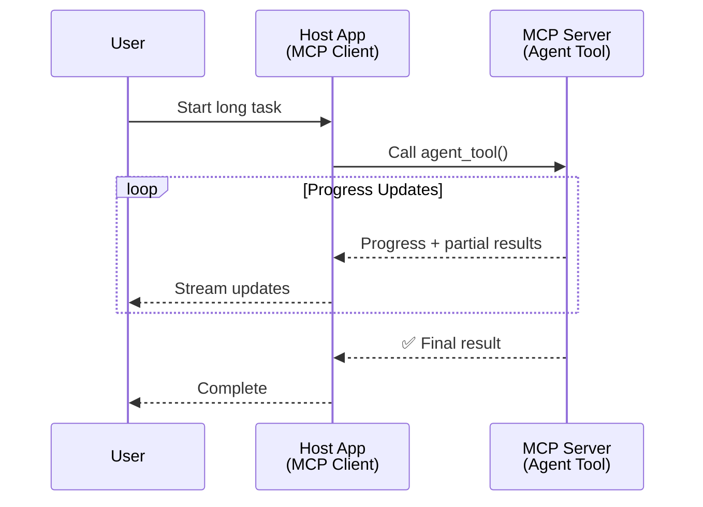
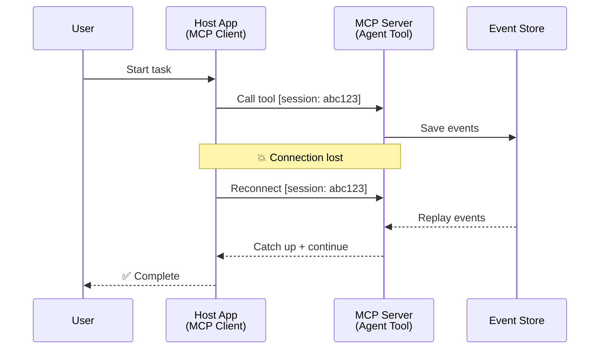
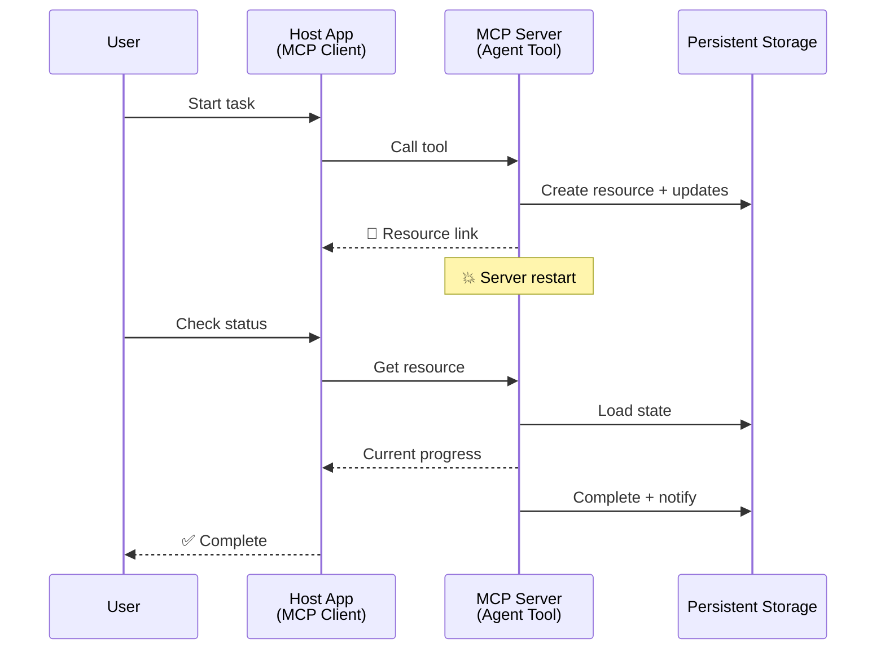
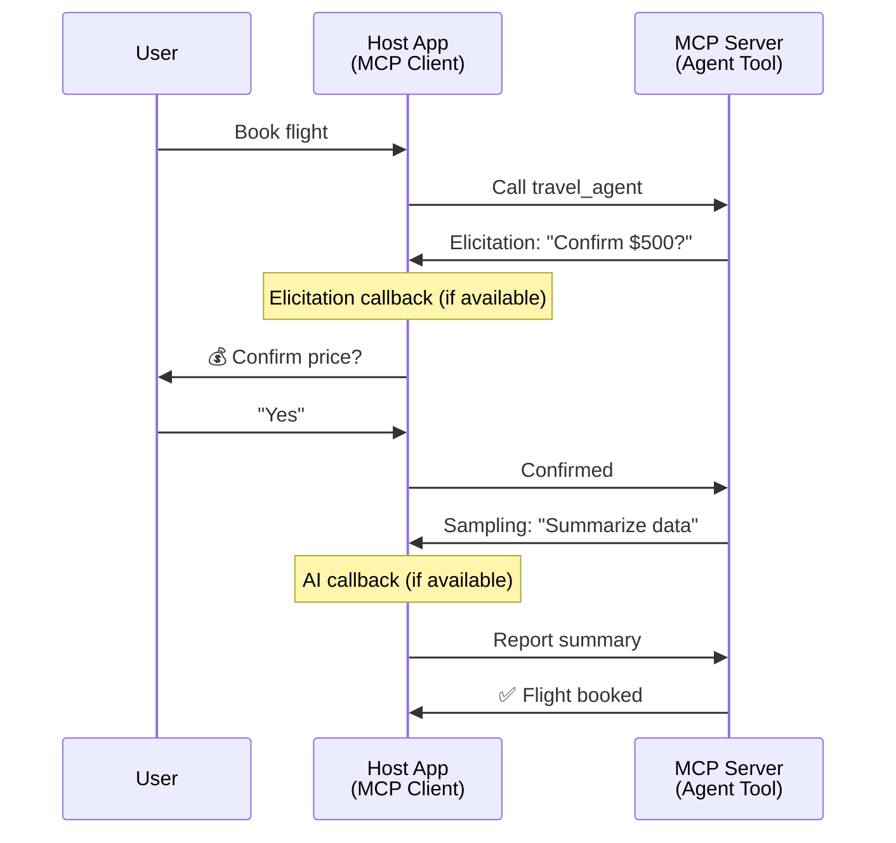

<!--
CO_OP_TRANSLATOR_METADATA:
{
  "original_hash": "5cc6836626047aa055e8960c8484a7d0",
  "translation_date": "2025-07-24T09:43:08+00:00",
  "source_file": "11-mcp/code_samples/mcp-agents/README.md",
  "language_code": "pa"
}
-->
# ਐਜੰਟ-ਤੋਂ-ਐਜੰਟ ਕਮਿਊਨਿਕੇਸ਼ਨ ਸਿਸਟਮ MCP ਨਾਲ ਬਣਾਉਣਾ

> ਸੰਖੇਪ - ਕੀ ਤੁਸੀਂ MCP 'ਤੇ Agent2Agent ਕਮਿਊਨਿਕੇਸ਼ਨ ਬਣਾਉਣਗੇ? ਹਾਂ!

MCP ਆਪਣੇ ਮੂਲ ਉਦੇਸ਼ "LLMs ਨੂੰ ਸੰਦਰਭ ਪ੍ਰਦਾਨ ਕਰਨਾ" ਤੋਂ ਕਾਫ਼ੀ ਅੱਗੇ ਤੱਕ ਵਿਕਸਿਤ ਹੋ ਚੁੱਕਾ ਹੈ। ਹਾਲੀਆ ਸੁਧਾਰਾਂ ਨਾਲ, ਜਿਵੇਂ ਕਿ [ਰਿਜ਼ਯੂਮੇਬਲ ਸਟ੍ਰੀਮਜ਼](https://modelcontextprotocol.io/docs/concepts/transports#resumability-and-redelivery), [ਇਲਿਸਿਟੇਸ਼ਨ](https://modelcontextprotocol.io/specification/2025-06-18/client/elicitation), [ਸੈਂਪਲਿੰਗ](https://modelcontextprotocol.io/specification/2025-06-18/client/sampling), ਅਤੇ ਨੋਟੀਫਿਕੇਸ਼ਨ ([ਪ੍ਰਗਤੀ](https://modelcontextprotocol.io/specification/2025-06-18/basic/utilities/progress) ਅਤੇ [ਸਰੋਤ](https://modelcontextprotocol.io/specification/2025-06-18/schema#resourceupdatednotification)), MCP ਹੁਣ ਜਟਿਲ ਐਜੰਟ-ਤੋਂ-ਐਜੰਟ ਕਮਿਊਨਿਕੇਸ਼ਨ ਸਿਸਟਮ ਬਣਾਉਣ ਲਈ ਇੱਕ ਮਜ਼ਬੂਤ ਬੁਨਿਆਦ ਪ੍ਰਦਾਨ ਕਰਦਾ ਹੈ।

## ਐਜੰਟ/ਟੂਲ ਬਾਰੇ ਗਲਤਫਹਿਮੀ

ਜਿਵੇਂ ਜ਼ਿਆਦਾ ਡਿਵੈਲਪਰ ਲੰਬੇ ਸਮੇਂ ਤੱਕ ਚੱਲਣ ਵਾਲੇ ਐਜੰਟਿਕ ਵਿਹਾਰ ਵਾਲੇ ਟੂਲਜ਼ ਦੀ ਖੋਜ ਕਰਦੇ ਹਨ (ਜੋ ਲੰਬੇ ਸਮੇਂ ਤੱਕ ਚੱਲ ਸਕਦੇ ਹਨ, ਮੱਧ-ਕਾਰਜ ਦੌਰਾਨ ਵਾਧੂ ਇਨਪੁਟ ਦੀ ਲੋੜ ਹੋ ਸਕਦੀ ਹੈ, ਆਦਿ), ਇੱਕ ਆਮ ਗਲਤਫਹਿਮੀ ਇਹ ਹੈ ਕਿ MCP ਇਸ ਲਈ ਅਨੁਕੂਲ ਨਹੀਂ ਹੈ ਕਿਉਂਕਿ ਇਸਦੇ ਸ਼ੁਰੂਆਤੀ ਉਦਾਹਰਣ ਸਧਾਰਣ ਬੇਨਤੀ-ਜਵਾਬ ਪੈਟਰਨਾਂ 'ਤੇ ਕੇਂਦਰਿਤ ਸਨ।

ਇਹ ਧਾਰਨਾ ਪੁਰਾਣੀ ਹੋ ਚੁੱਕੀ ਹੈ। ਪਿਛਲੇ ਕੁਝ ਮਹੀਨਿਆਂ ਵਿੱਚ MCP ਵਿਸ਼ੇਸ਼ਤਾ ਵਿੱਚ ਕਾਫ਼ੀ ਸੁਧਾਰ ਕੀਤੇ ਗਏ ਹਨ, ਜੋ ਲੰਬੇ ਸਮੇਂ ਤੱਕ ਚੱਲਣ ਵਾਲੇ ਐਜੰਟਿਕ ਵਿਹਾਰ ਬਣਾਉਣ ਲਈ ਲੋੜੀਂਦੇ ਸਮਰੱਥਾਵਾਂ ਪ੍ਰਦਾਨ ਕਰਦੇ ਹਨ:

- **ਸਟ੍ਰੀਮਿੰਗ ਅਤੇ ਅਧੂਰੇ ਨਤੀਜੇ**: ਕਾਰਜ ਦੌਰਾਨ ਰੀਅਲ-ਟਾਈਮ ਪ੍ਰਗਤੀ ਅੱਪਡੇਟ
- **ਰਿਜ਼ਯੂਮੇਬਿਲਿਟੀ**: ਡਿਸਕਨੈਕਸ਼ਨ ਤੋਂ ਬਾਅਦ ਕਲਾਇੰਟ ਦੁਬਾਰਾ ਜੁੜ ਸਕਦੇ ਹਨ
- **ਡਿਊਰੇਬਿਲਿਟੀ**: ਨਤੀਜੇ ਸਰਵਰ ਰੀਸਟਾਰਟ ਤੋਂ ਬਾਅਦ ਵੀ ਬਚੇ ਰਹਿੰਦੇ ਹਨ (ਜਿਵੇਂ ਕਿ ਸਰੋਤ ਲਿੰਕਾਂ ਰਾਹੀਂ)
- **ਮਲਟੀ-ਟਰਨ**: ਇਲਿਸਿਟੇਸ਼ਨ ਅਤੇ ਸੈਂਪਲਿੰਗ ਰਾਹੀਂ ਕਾਰਜ ਦੌਰਾਨ ਇੰਟਰੈਕਟਿਵ ਇਨਪੁਟ

ਇਹ ਵਿਸ਼ੇਸ਼ਤਾਵਾਂ ਨੂੰ ਜੋੜ ਕੇ ਜਟਿਲ ਐਜੰਟਿਕ ਅਤੇ ਮਲਟੀ-ਐਜੰਟ ਐਪਲੀਕੇਸ਼ਨ ਬਣਾਈਆਂ ਜਾ ਸਕਦੀਆਂ ਹਨ, ਜੋ ਸਾਰੀਆਂ MCP ਪ੍ਰੋਟੋਕੋਲ 'ਤੇ ਤੈਨਾਤ ਕੀਤੀਆਂ ਜਾ ਸਕਦੀਆਂ ਹਨ।

ਸੰਦਰਭ ਲਈ, ਅਸੀਂ ਇੱਕ ਐਜੰਟ ਨੂੰ "ਟੂਲ" ਵਜੋਂ ਸੰਬੋਧਨ ਕਰਾਂਗੇ ਜੋ ਇੱਕ MCP ਸਰਵਰ 'ਤੇ ਉਪਲਬਧ ਹੈ। ਇਸਦਾ ਮਤਲਬ ਹੈ ਕਿ ਇੱਕ ਹੋਸਟ ਐਪਲੀਕੇਸ਼ਨ ਮੌਜੂਦ ਹੈ ਜੋ ਇੱਕ MCP ਕਲਾਇੰਟ ਨੂੰ ਲਾਗੂ ਕਰਦਾ ਹੈ ਜੋ MCP ਸਰਵਰ ਨਾਲ ਸੈਸ਼ਨ ਸਥਾਪਿਤ ਕਰਦਾ ਹੈ ਅਤੇ ਐਜੰਟ ਨੂੰ ਕਾਲ ਕਰ ਸਕਦਾ ਹੈ।

## ਇੱਕ MCP ਟੂਲ ਨੂੰ "ਐਜੰਟਿਕ" ਕੀ ਬਣਾਉਂਦਾ ਹੈ?

ਲਾਗੂ ਕਰਨ ਤੋਂ ਪਹਿਲਾਂ, ਆਓ ਇਹ ਸਥਾਪਿਤ ਕਰੀਏ ਕਿ ਲੰਬੇ ਸਮੇਂ ਤੱਕ ਚੱਲਣ ਵਾਲੇ ਐਜੰਟਾਂ ਨੂੰ ਸਮਰਥਨ ਦੇਣ ਲਈ ਕਿਹੜੀਆਂ ਬੁਨਿਆਦੀ ਸਮਰੱਥਾਵਾਂ ਦੀ ਲੋੜ ਹੈ।

> ਅਸੀਂ ਇੱਕ ਐਜੰਟ ਨੂੰ ਇੱਕ ਐਸੇ ਇਕਾਈ ਵਜੋਂ ਪਰਿਭਾਸ਼ਿਤ ਕਰਾਂਗੇ ਜੋ ਲੰਬੇ ਸਮੇਂ ਤੱਕ ਖੁਦਮੁਖਤਿਆਰੀ ਨਾਲ ਕੰਮ ਕਰ ਸਕੇ, ਜਟਿਲ ਕਾਰਜਾਂ ਨੂੰ ਸੰਭਾਲ ਸਕੇ ਜੋ ਕਈ ਵਾਰ ਦੀ ਗਤੀਵਿਧੀ ਜਾਂ ਰੀਅਲ-ਟਾਈਮ ਫੀਡਬੈਕ ਦੇ ਆਧਾਰ 'ਤੇ ਸਮਰਪਣ ਦੀ ਲੋੜ ਪੈ ਸਕਦੀ ਹੈ।

### 1. ਸਟ੍ਰੀਮਿੰਗ ਅਤੇ ਅਧੂਰੇ ਨਤੀਜੇ

ਰਵਾਇਤੀ ਬੇਨਤੀ-ਜਵਾਬ ਪੈਟਰਨ ਲੰਬੇ ਸਮੇਂ ਤੱਕ ਚੱਲਣ ਵਾਲੇ ਕਾਰਜਾਂ ਲਈ ਕੰਮ ਨਹੀਂ ਕਰਦੇ। ਐਜੰਟਾਂ ਨੂੰ ਇਹ ਪ੍ਰਦਾਨ ਕਰਨ ਦੀ ਲੋੜ ਹੈ:

- ਰੀਅਲ-ਟਾਈਮ ਪ੍ਰਗਤੀ ਅੱਪਡੇਟ
- ਅੰਤਰਿਮ ਨਤੀਜੇ

**MCP ਸਮਰਥਨ**: ਸਰੋਤ ਅੱਪਡੇਟ ਨੋਟੀਫਿਕੇਸ਼ਨ ਸਟ੍ਰੀਮਿੰਗ ਅਧੂਰੇ ਨਤੀਜੇ ਸਮਰਥਿਤ ਕਰਦੇ ਹਨ, ਹਾਲਾਂਕਿ ਇਹ JSON-RPC ਦੇ 1:1 ਬੇਨਤੀ/ਜਵਾਬ ਮਾਡਲ ਨਾਲ ਟਕਰਾਅ ਤੋਂ ਬਚਣ ਲਈ ਧਿਆਨਪੂਰਵਕ ਡਿਜ਼ਾਈਨ ਦੀ ਲੋੜ ਹੈ।

| ਵਿਸ਼ੇਸ਼ਤਾ                    | ਵਰਤੋਂ ਦਾ ਕੇਸ                                                                                                                                                                       | MCP ਸਮਰਥਨ                                                                                |
| -------------------------- | ------------------------------------------------------------------------------------------------------------------------------------------------------------------------------ | ------------------------------------------------------------------------------------------ |
| ਰੀਅਲ-ਟਾਈਮ ਪ੍ਰਗਤੀ ਅੱਪਡੇਟ | ਯੂਜ਼ਰ ਇੱਕ ਕੋਡਬੇਸ ਮਾਈਗ੍ਰੇਸ਼ਨ ਕਾਰਜ ਦੀ ਬੇਨਤੀ ਕਰਦਾ ਹੈ। ਐਜੰਟ ਪ੍ਰਗਤੀ ਸਟ੍ਰੀਮ ਕਰਦਾ ਹੈ: "10% - ਡਿਪੈਂਡੈਂਸੀਜ਼ ਦਾ ਵਿਸ਼ਲੇਸ਼ਣ... 25% - ਟਾਈਪਸਕ੍ਰਿਪਟ ਫਾਈਲਾਂ ਨੂੰ ਕਨਵਰਟ ਕਰਨਾ... 50% - ਇੰਪੋਰਟਸ ਨੂੰ ਅਪਡੇਟ ਕਰਨਾ..."          | ✅ ਪ੍ਰਗਤੀ ਨੋਟੀਫਿਕੇਸ਼ਨ                                                                  |
| ਅਧੂਰੇ ਨਤੀਜੇ            | "ਇੱਕ ਕਿਤਾਬ ਬਣਾਓ" ਕਾਰਜ ਅਧੂਰੇ ਨਤੀਜੇ ਸਟ੍ਰੀਮ ਕਰਦਾ ਹੈ, ਜਿਵੇਂ ਕਿ 1) ਕਹਾਣੀ ਦਾ ਰੂਪਰੇਖਾ, 2) ਅਧਿਆਇ ਸੂਚੀ, 3) ਹਰ ਅਧਿਆਇ ਜਿਵੇਂ ਹੀ ਪੂਰਾ ਹੁੰਦਾ ਹੈ। ਹੋਸਟ ਕਿਸੇ ਵੀ ਪੜਾਅ 'ਤੇ ਜਾਂਚ, ਰੱਦ ਜਾਂ ਰੀਡਾਇਰੈਕਟ ਕਰ ਸਕਦਾ ਹੈ। | ✅ ਨੋਟੀਫਿਕੇਸ਼ਨ ਨੂੰ "ਵਧਾਇਆ" ਜਾ ਸਕਦਾ ਹੈ ਅਧੂਰੇ ਨਤੀਜੇ ਸ਼ਾਮਲ ਕਰਨ ਲਈ, PR 383, 776 ਦੇ ਪ੍ਰਸਤਾਵ ਵੇਖੋ |

<strong>ਚਿੱਤਰ 1:</strong> ਇਹ ਡਾਇਗ੍ਰਾਮ ਦਿਖਾਉਂਦਾ ਹੈ ਕਿ ਇੱਕ MCP ਐਜੰਟ ਲੰਬੇ ਸਮੇਂ ਤੱਕ ਚੱਲਣ ਵਾਲੇ ਕਾਰਜ ਦੌਰਾਨ ਰੀਅਲ-ਟਾਈਮ ਪ੍ਰਗਤੀ ਅੱਪਡੇਟ ਅਤੇ ਅਧੂਰੇ ਨਤੀਜੇ ਕਿਵੇਂ ਸਟ੍ਰੀਮ ਕਰਦਾ ਹੈ, ਯੂਜ਼ਰ ਨੂੰ ਰੀਅਲ-ਟਾਈਮ ਵਿੱਚ ਕਾਰਜ ਦੀ ਨਿਗਰਾਨੀ ਕਰਨ ਦੇ ਯੋਗ ਬਣਾਉਂਦਾ ਹੈ।

### 2. ਰਿਜ਼ਯੂਮੇਬਿਲਿਟੀ

ਐਜੰਟਾਂ ਨੂੰ ਨੈੱਟਵਰਕ ਵਿਘਟਨ ਨੂੰ ਸੁਚੱਜੇ ਢੰਗ ਨਾਲ ਸੰਭਾਲਣ ਦੀ ਲੋੜ ਹੈ:

- ਡਿਸਕਨੈਕਸ਼ਨ ਤੋਂ ਬਾਅਦ ਦੁਬਾਰਾ ਜੁੜਨਾ
- ਜਿੱਥੇ ਛੱਡਿਆ ਸੀ ਉੱਥੇ ਤੋਂ ਜਾਰੀ ਰੱਖਣਾ (ਸੰਦੇਸ਼ ਦੁਬਾਰਾ ਭੇਜਣਾ)

**MCP ਸਮਰਥਨ**: MCP StreamableHTTP ਟ੍ਰਾਂਸਪੋਰਟ ਅੱਜ ਸੈਸ਼ਨ ਰਿਜ਼ਯੂਮਸ਼ਨ ਅਤੇ ਸੰਦੇਸ਼ ਦੁਬਾਰਾ ਭੇਜਣ ਨੂੰ ਸੈਸ਼ਨ ID ਅਤੇ ਆਖਰੀ ਇਵੈਂਟ ID ਨਾਲ ਸਮਰਥਿਤ ਕਰਦਾ ਹੈ। ਇੱਥੇ ਮਹੱਤਵਪੂਰਨ ਗੱਲ ਇਹ ਹੈ ਕਿ ਸਰਵਰ ਨੂੰ ਇੱਕ EventStore ਲਾਗੂ ਕਰਨਾ ਚਾਹੀਦਾ ਹੈ ਜੋ ਕਲਾਇੰਟ ਦੁਬਾਰਾ ਜੁੜਨ 'ਤੇ ਇਵੈਂਟ ਰੀਪਲੇਅਜ਼ ਨੂੰ ਯੋਗ ਬਣਾਉਂਦਾ ਹੈ।  
ਨੋਟ ਕਰੋ ਕਿ ਇੱਕ ਕਮਿਊਨਿਟੀ ਪ੍ਰਸਤਾਵ (PR #975) ਹੈ ਜੋ ਟ੍ਰਾਂਸਪੋਰਟ-ਅਗਨੋਸਟਿਕ ਰਿਜ਼ਯੂਮੇਬਲ ਸਟ੍ਰੀਮਜ਼ ਦੀ ਪੜਚੋਲ ਕਰਦਾ ਹੈ।

| ਵਿਸ਼ੇਸ਼ਤਾ      | ਵਰਤੋਂ ਦਾ ਕੇਸ                                                                                                                                                   | MCP ਸਮਰਥਨ                                                                |
| ------------ | ---------------------------------------------------------------------------------------------------------------------------------------------------------- | -------------------------------------------------------------------------- |
| ਰਿਜ਼ਯੂਮੇਬਿਲਿਟੀ | ਕਲਾਇੰਟ ਲੰਬੇ ਸਮੇਂ ਤੱਕ ਚੱਲਣ ਵਾਲੇ ਕਾਰਜ ਦੌਰਾਨ ਡਿਸਕਨੈਕਟ ਕਰਦਾ ਹੈ। ਦੁਬਾਰਾ ਜੁੜਨ 'ਤੇ, ਸੈਸ਼ਨ ਛੁੱਟੇ ਹੋਏ ਇਵੈਂਟਾਂ ਨੂੰ ਰੀਪਲੇਅ ਕਰਦਾ ਹੈ, ਜਿੱਥੇ ਛੱਡਿਆ ਸੀ ਉੱਥੇ ਤੋਂ ਬਿਨਾਂ ਕਿਸੇ ਰੁਕਾਵਟ ਦੇ ਜਾਰੀ ਰੱਖਦਾ ਹੈ। | ✅ StreamableHTTP ਟ੍ਰਾਂਸਪੋਰਟ ਸੈਸ਼ਨ ID, ਇਵੈਂਟ ਰੀਪਲੇਅ, ਅਤੇ EventStore ਨਾਲ |

<strong>ਚਿੱਤਰ 2:</strong> ਇਹ ਡਾਇਗ੍ਰਾਮ ਦਿਖਾਉਂਦਾ ਹੈ ਕਿ MCP ਦਾ StreamableHTTP ਟ੍ਰਾਂਸਪੋਰਟ ਅਤੇ ਇਵੈਂਟ ਸਟੋਰ ਕਿਵੇਂ ਸੈਸ਼ਨ ਰਿਜ਼ਯੂਮਸ਼ਨ ਨੂੰ ਯੋਗ ਬਣਾਉਂਦੇ ਹਨ: ਜੇਕਰ ਕਲਾਇੰਟ ਡਿਸਕਨੈਕਟ ਕਰਦਾ ਹੈ, ਤਾਂ ਇਹ ਦੁਬਾਰਾ ਜੁੜ ਸਕਦਾ ਹੈ ਅਤੇ ਛੁੱਟੇ ਹੋਏ ਇਵੈਂਟਾਂ ਨੂੰ ਰੀਪਲੇਅ ਕਰ ਸਕਦਾ ਹੈ, ਕਾਰਜ ਨੂੰ ਬਿਨਾਂ ਕਿਸੇ ਪ੍ਰਗਤੀ ਦੇ ਨੁਕਸਾਨ ਦੇ ਜਾਰੀ ਰੱਖਦਾ ਹੈ।

### 3. ਡਿਊਰੇਬਿਲਿਟੀ

ਲੰਬੇ ਸਮੇਂ ਤੱਕ ਚੱਲਣ ਵਾਲੇ ਐਜੰਟਾਂ ਨੂੰ ਸਥਾਈ ਸਥਿਤੀ ਦੀ ਲੋੜ ਹੁੰਦੀ ਹੈ:

- ਨਤੀਜੇ ਸਰਵਰ ਰੀਸਟਾਰਟ ਤੋਂ ਬਾਅਦ ਵੀ ਬਚੇ ਰਹਿੰਦੇ ਹਨ
- ਸਥਿਤੀ ਨੂੰ ਬਾਹਰਲੇ ਤਰੀਕੇ ਨਾਲ ਪ੍ਰਾਪਤ ਕੀਤਾ ਜਾ ਸਕਦਾ ਹੈ
- ਸੈਸ਼ਨਾਂ ਵਿੱਚ ਪ੍ਰਗਤੀ ਟ੍ਰੈਕਿੰਗ

**MCP ਸਮਰਥਨ**: MCP ਹੁਣ ਟੂਲ ਕਾਲਾਂ ਲਈ ਇੱਕ Resource ਲਿੰਕ ਰਿਟਰਨ ਕਿਸਮ ਨੂੰ ਸਮਰਥਿਤ ਕਰਦਾ ਹੈ। ਅੱਜ, ਇੱਕ ਸੰਭਾਵਿਤ ਪੈਟਰਨ ਇੱਕ ਟੂਲ ਡਿਜ਼ਾਈਨ ਕਰਨਾ ਹੈ ਜੋ ਇੱਕ ਸਰੋਤ ਬਣਾਉਂਦਾ ਹੈ ਅਤੇ ਤੁਰੰਤ ਇੱਕ ਸਰੋਤ ਲਿੰਕ ਰਿਟਰਨ ਕਰਦਾ ਹੈ। ਟੂਲ ਪਿਛੋਕੜ ਵਿੱਚ ਕਾਰਜ ਨੂੰ ਸੰਬੋਧਿਤ ਕਰ ਸਕਦਾ ਹੈ ਅਤੇ ਸਰੋਤ ਨੂੰ ਅਪਡੇਟ ਕਰ ਸਕਦਾ ਹੈ। ਇਸਦੇ ਬਦਲੇ ਵਿੱਚ, ਕਲਾਇੰਟ ਇਸ ਸਰੋਤ ਦੀ ਸਥਿਤੀ ਨੂੰ ਪ੍ਰਾਪਤ ਕਰਨ ਲਈ ਚੁਣ ਸਕਦਾ ਹੈ ਤਾਂ ਜੋ ਅਧੂਰੇ ਜਾਂ ਪੂਰੇ ਨਤੀਜੇ ਪ੍ਰਾਪਤ ਕੀਤੇ ਜਾ ਸਕਣ (ਜੋ ਸਰਵਰ ਪ੍ਰਦਾਨ ਕਰਦਾ ਹੈ) ਜਾਂ ਅਪਡੇਟ ਨੋਟੀਫਿਕੇਸ਼ਨ ਲਈ ਸਰੋਤ ਨੂੰ ਸਬਸਕ੍ਰਾਈਬ ਕਰ ਸਕਦਾ ਹੈ।

ਇੱਥੇ ਇੱਕ ਸੀਮਿਤਤਾ ਇਹ ਹੈ ਕਿ ਸਰੋਤਾਂ ਨੂੰ ਪੋਲ ਕਰਨਾ ਜਾਂ ਅਪਡੇਟਾਂ ਲਈ ਸਬਸਕ੍ਰਾਈਬ ਕਰਨਾ ਸਕੇਲ 'ਤੇ ਸੰਸਾਧਨਾਂ ਦੀ ਖਪਤ ਕਰ ਸਕਦਾ ਹੈ। ਇੱਕ ਖੁੱਲ੍ਹਾ ਕਮਿਊਨਿਟੀ ਪ੍ਰਸਤਾਵ (#992 ਸਮੇਤ) ਹੈ ਜੋ ਵੈੱਬਹੂਕ ਜਾਂ ਟ੍ਰਿਗਰ ਸ਼ਾਮਲ ਕਰਨ ਦੀ ਸੰਭਾਵਨਾ ਦੀ ਪੜਚੋਲ ਕਰਦਾ ਹੈ ਜੋ ਸਰਵਰ ਕਲਾਇੰਟ/ਹੋਸਟ ਐਪਲੀਕੇਸ਼ਨ ਨੂੰ ਅਪਡੇਟਾਂ ਦੀ ਸੂਚਨਾ ਦੇਣ ਲਈ ਕਾਲ ਕਰ ਸਕਦਾ ਹੈ।

| ਵਿਸ਼ੇਸ਼ਤਾ    | ਵਰਤੋਂ ਦਾ ਕੇਸ                                                                                                                                        | MCP ਸਮਰਥਨ                                                        |
| ---------- | ----------------------------------------------------------------------------------------------------------------------------------------------- | ------------------------------------------------------------------ |
| ਡਿਊਰੇਬਿਲਿਟੀ | ਡਾਟਾ ਮਾਈਗ੍ਰੇਸ਼ਨ ਕਾਰਜ ਦੌਰਾਨ ਸਰਵਰ ਕਰੈਸ਼ ਕਰਦਾ ਹੈ। ਨਤੀਜੇ ਅਤੇ ਪ੍ਰਗਤੀ ਰੀਸਟਾਰਟ ਤੋਂ ਬਾਅਦ ਬਚੇ ਰਹਿੰਦੇ ਹਨ, ਕਲਾਇੰਟ ਸਥਿਤੀ ਦੀ ਜਾਂਚ ਕਰ ਸਕਦਾ ਹੈ ਅਤੇ ਸਥਾਈ ਸਰੋਤ ਤੋਂ ਜਾਰੀ ਰੱਖ ਸਕਦਾ ਹੈ। | ✅ ਸਥਾਈ ਸਟੋਰੇਜ ਅਤੇ ਸਥਿਤੀ ਨੋਟੀਫਿਕੇਸ਼ਨ ਨਾਲ ਸਰੋਤ ਲਿੰਕ |

ਅੱਜ, ਇੱਕ ਆਮ ਪੈਟਰਨ ਇੱਕ ਟੂਲ ਡਿਜ਼ਾਈਨ ਕਰਨਾ ਹੈ ਜੋ ਇੱਕ ਸਰੋਤ ਬਣਾਉਂਦਾ ਹੈ ਅਤੇ ਤੁਰੰਤ ਇੱਕ ਸਰੋਤ ਲਿੰਕ ਰਿਟਰਨ ਕਰਦਾ ਹੈ। ਟੂਲ ਪਿਛੋਕੜ ਵਿੱਚ ਕਾਰਜ ਨੂੰ ਸੰਬੋਧਿਤ ਕਰ ਸਕਦਾ ਹੈ, ਸਰੋਤ ਨੋਟੀਫਿਕੇਸ਼ਨ ਜਾਰੀ ਕਰ ਸਕਦਾ ਹੈ ਜੋ ਪ੍ਰਗਤੀ ਅੱਪਡੇਟ ਵਜੋਂ ਕੰਮ ਕਰਦੇ ਹਨ ਜਾਂ ਅਧੂਰੇ ਨਤੀਜੇ ਸ਼ਾਮਲ ਕਰਦੇ ਹਨ, ਅਤੇ ਜਰੂਰਤ ਪੈਣ 'ਤੇ ਸਰੋਤ ਵਿੱਚ ਸਮੱਗਰੀ ਨੂੰ ਅਪਡੇਟ ਕਰ ਸਕਦਾ ਹੈ।

<strong>ਚਿੱਤਰ 3:</strong> ਇਹ ਡਾਇਗ੍ਰਾਮ ਦਿਖਾਉਂਦਾ ਹੈ ਕਿ MCP ਐਜੰਟ ਲੰਬੇ ਸਮੇਂ ਤੱਕ ਚੱਲਣ ਵਾਲੇ ਕਾਰਜਾਂ ਨੂੰ ਯਕੀਨੀ ਬਣਾਉਣ ਲਈ ਸਥਾਈ ਸਰੋਤਾਂ ਅਤੇ ਸਥਿਤੀ ਨੋਟੀਫਿਕੇਸ਼ਨਾਂ ਦਾ ਕਿਵੇਂ ਇਸਤੇਮਾਲ ਕਰਦੇ ਹਨ, ਜਿਸ ਨਾਲ ਕਲਾਇੰਟ ਪ੍ਰਗਤੀ ਦੀ ਜਾਂਚ ਕਰ ਸਕਦੇ ਹਨ ਅਤੇ ਅਸਫਲਤਾਵਾਂ ਤੋਂ ਬਾਅਦ ਵੀ ਨਤੀਜੇ ਪ੍ਰਾਪਤ ਕਰ ਸਕਦੇ ਹਨ।

### 4. ਮਲਟੀ-ਟਰਨ ਇੰਟਰੈਕਸ਼ਨ

ਐਜੰਟਾਂ ਨੂੰ ਅਕਸਰ ਕਾਰਜ ਦੌਰਾਨ ਵਾਧੂ ਇਨਪੁਟ ਦੀ ਲੋੜ ਹੁੰਦੀ ਹੈ:

- ਮਨੁੱਖੀ ਸਪਸ਼ਟੀਕਰਨ ਜਾਂ ਮਨਜ਼ੂਰੀ
- ਜਟਿਲ ਫੈਸਲਿਆਂ ਲਈ AI ਸਹਾਇਤਾ
- ਗਤੀਸ਼ੀਲ ਪੈਰਾਮੀਟਰ ਸਹੀ ਕਰਨਾ

**MCP ਸਮਰਥਨ**: ਸੈਂਪਲਿੰਗ (AI ਇਨਪੁਟ ਲਈ) ਅਤੇ ਇਲਿਸਿਟੇਸ਼ਨ (ਮਨੁੱਖੀ ਇਨਪੁਟ ਲਈ) ਰਾਹੀਂ ਪੂਰੀ ਤਰ੍ਹਾਂ ਸਮਰਥਿਤ।

| ਵਿਸ਼ੇਸ਼ਤਾ                 | ਵਰਤੋਂ ਦਾ ਕੇਸ                                                                                                                                     | MCP ਸਮਰਥਨ                                           |
| ----------------------- | -------------------------------------------------------------------------------------------------------------------------------------------- | ----------------------------------------------------- |
| ਮਲਟੀ-ਟਰਨ ਇੰਟਰੈਕਸ਼ਨ | ਯਾਤਰਾ ਬੁਕਿੰਗ ਐਜੰਟ ਯੂਜ਼ਰ ਤੋਂ ਕੀਮਤ ਦੀ ਪੁਸ਼ਟੀ ਦੀ ਬੇਨਤੀ ਕਰਦਾ ਹੈ, ਫਿਰ ਬੁਕਿੰਗ ਲੈਣ ਤੋਂ ਪਹਿਲਾਂ ਯਾਤਰਾ ਡਾਟਾ ਦਾ ਸਾਰ ਲੈਣ ਲਈ AI ਨੂੰ ਪੁੱਛਦਾ ਹੈ। | ✅ ਇਲਿਸਿਟੇਸ਼ਨ ਮਨੁੱਖੀ ਇਨਪੁਟ ਲਈ, ਸੈਂਪਲਿੰਗ AI ਇਨਪੁਟ ਲਈ |

<strong>ਚਿੱਤਰ 4:</strong> ਇਹ ਡਾਇਗ੍ਰਾਮ ਦਿਖਾਉਂਦਾ ਹੈ ਕਿ MCP ਐਜੰਟ ਇੰਟਰੈਕਟਿਵ ਤੌਰ 'ਤੇ ਮਨੁੱਖੀ ਇਨਪੁਟ ਪ੍ਰਾਪਤ ਕਰਨ ਜਾਂ ਕਾਰਜ ਦੌਰਾਨ ਜਟਿਲ ਫੈਸਲਿਆਂ ਲਈ AI ਸਹਾਇਤਾ ਦੀ ਬੇਨਤੀ ਕਰਨ ਦੇ ਯੋਗ ਹਨ, ਜਿਸ ਨਾਲ ਪੁਸ਼ਟੀ ਅਤੇ ਗਤੀਸ਼ੀਲ ਫੈਸਲੇ ਕਰਨ ਵਾਲੇ ਜਟਿਲ, ਮਲਟੀ-ਟਰਨ ਵਰਕਫਲੋਜ਼ ਨੂੰ ਸਮਰਥਨ ਮਿਲਦਾ ਹੈ।

## MCP 'ਤੇ ਲੰਬੇ ਸਮੇਂ ਤੱਕ ਚੱਲਣ ਵਾਲੇ ਐਜੰਟ ਲਾਗੂ ਕਰਨਾ - ਕੋਡ ਝਲਕ

ਇਸ ਲੇਖ ਦੇ ਹਿੱਸੇ ਵਜੋਂ, ਅਸੀਂ ਇੱਕ [ਕੋਡ ਰਿਪੋ](https://github.com/victordibia/ai-tutorials/tree/main/MCP%20Agents) ਪ੍ਰਦਾਨ ਕਰਦੇ ਹਾਂ, ਜਿਸ ਵਿੱਚ MCP Python SDK ਨਾਲ

**ਅਸਵੀਕਰਤੀ**:  
ਇਹ ਦਸਤਾਵੇਜ਼ AI ਅਨੁਵਾਦ ਸੇਵਾ [Co-op Translator](https://github.com/Azure/co-op-translator) ਦੀ ਵਰਤੋਂ ਕਰਕੇ ਅਨੁਵਾਦ ਕੀਤਾ ਗਿਆ ਹੈ। ਜਦੋਂ ਕਿ ਅਸੀਂ ਸਹੀ ਹੋਣ ਦਾ ਯਤਨ ਕਰਦੇ ਹਾਂ, ਕਿਰਪਾ ਕਰਕੇ ਧਿਆਨ ਦਿਓ ਕਿ ਸਵੈਚਾਲਿਤ ਅਨੁਵਾਦਾਂ ਵਿੱਚ ਗਲਤੀਆਂ ਜਾਂ ਅਸੁਣਤੀਆਂ ਹੋ ਸਕਦੀਆਂ ਹਨ। ਇਸ ਦੀ ਮੂਲ ਭਾਸ਼ਾ ਵਿੱਚ ਮੌਜੂਦ ਮੂਲ ਦਸਤਾਵੇਜ਼ ਨੂੰ ਪ੍ਰਮਾਣਿਕ ਸਰੋਤ ਮੰਨਿਆ ਜਾਣਾ ਚਾਹੀਦਾ ਹੈ। ਮਹੱਤਵਪੂਰਨ ਜਾਣਕਾਰੀ ਲਈ, ਪੇਸ਼ੇਵਰ ਮਨੁੱਖੀ ਅਨੁਵਾਦ ਦੀ ਸਿਫਾਰਸ਼ ਕੀਤੀ ਜਾਂਦੀ ਹੈ। ਇਸ ਅਨੁਵਾਦ ਦੇ ਪ੍ਰਯੋਗ ਤੋਂ ਪੈਦਾ ਹੋਣ ਵਾਲੇ ਕਿਸੇ ਵੀ ਗਲਤਫਹਮੀਆਂ ਜਾਂ ਗਲਤ ਵਿਆਖਿਆਵਾਂ ਲਈ ਅਸੀਂ ਜ਼ਿੰਮੇਵਾਰ ਨਹੀਂ ਹਾਂ।