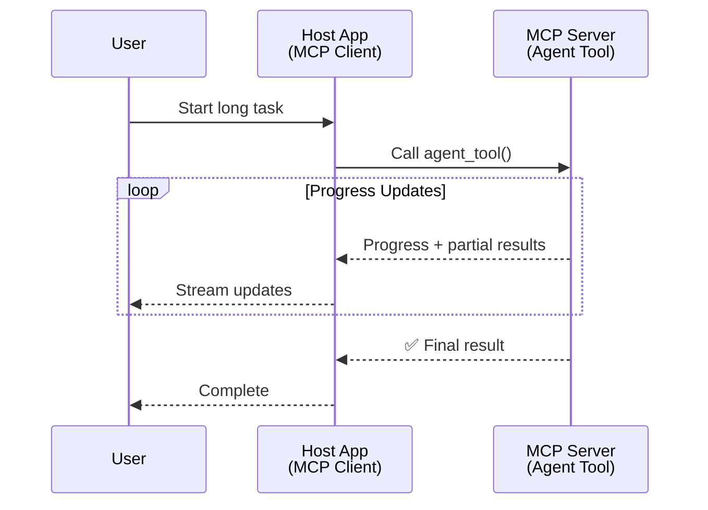
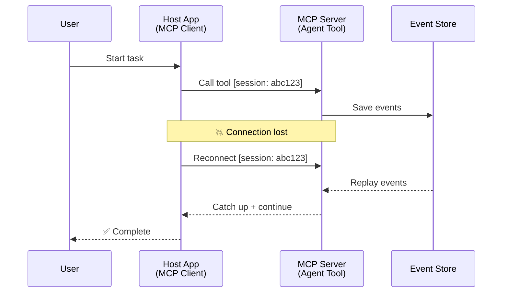
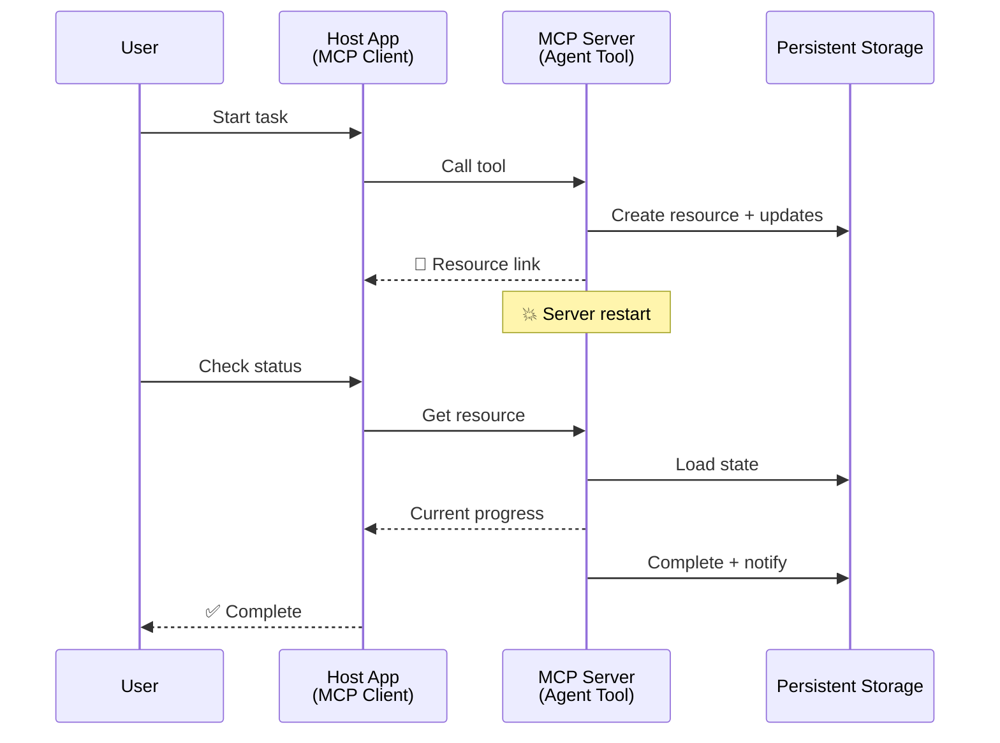
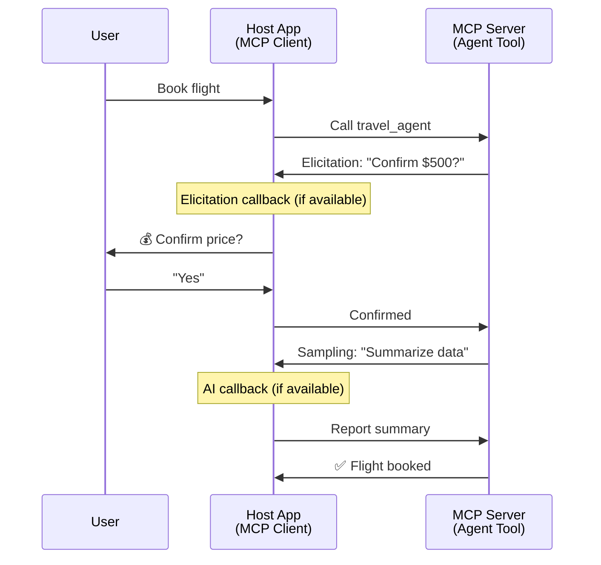

<!--
CO_OP_TRANSLATOR_METADATA:
{
  "original_hash": "5cc6836626047aa055e8960c8484a7d0",
  "translation_date": "2025-07-24T08:10:31+00:00",
  "source_file": "11-mcp/code_samples/mcp-agents/README.md",
  "language_code": "pa"
}
-->
# MCP ਨਾਲ ਏਜੰਟ-ਤੋਂ-ਏਜੰਟ ਸੰਚਾਰ ਪ੍ਰਣਾਲੀਆਂ ਬਣਾਉਣਾ

> TL;DR - ਕੀ ਤੁਸੀਂ MCP 'ਤੇ Agent2Agent ਸੰਚਾਰ ਬਣਾਉਣ ਦੀ ਯੋਗਤਾ ਰੱਖਦੇ ਹੋ? ਹਾਂ!

MCP ਆਪਣੇ ਮੂਲ ਉਦੇਸ਼ "LLMs ਨੂੰ ਸੰਦਰਭ ਪ੍ਰਦਾਨ ਕਰਨਾ" ਤੋਂ ਕਾਫ਼ੀ ਅੱਗੇ ਵਧ ਚੁੱਕਾ ਹੈ। ਹਾਲ ਹੀ ਦੇ ਸੁਧਾਰਾਂ, ਜਿਵੇਂ ਕਿ [resumable streams](https://modelcontextprotocol.io/docs/concepts/transports#resumability-and-redelivery), [elicitation](https://modelcontextprotocol.io/specification/2025-06-18/client/elicitation), [sampling](https://modelcontextprotocol.io/specification/2025-06-18/client/sampling), ਅਤੇ ਸੂਚਨਾਵਾਂ ([progress](https://modelcontextprotocol.io/specification/2025-06-18/basic/utilities/progress) ਅਤੇ [resources](https://modelcontextprotocol.io/specification/2025-06-18/schema#resourceupdatednotification)) ਦੇ ਨਾਲ, MCP ਹੁਣ ਜਟਿਲ ਏਜੰਟ-ਤੋਂ-ਏਜੰਟ ਸੰਚਾਰ ਪ੍ਰਣਾਲੀਆਂ ਬਣਾਉਣ ਲਈ ਇੱਕ ਮਜ਼ਬੂਤ ਬੁਨਿਆਦ ਪ੍ਰਦਾਨ ਕਰਦਾ ਹੈ।

## ਏਜੰਟ/ਟੂਲ ਦੀ ਗਲਤ ਫਹਿਮੀ

ਜਿਵੇਂ ਕਿ ਹੋਰ ਵਿਕਾਸਕਾਰ agentic ਵਿਵਹਾਰ ਵਾਲੇ ਟੂਲਾਂ ਦੀ ਖੋਜ ਕਰਦੇ ਹਨ (ਲੰਬੇ ਸਮੇਂ ਲਈ ਚਲਦੇ ਹਨ, ਮੱਧ-ਕ੍ਰਿਆਸ਼ੀਲਤਾ ਦੌਰਾਨ ਵਾਧੂ ਇਨਪੁਟ ਦੀ ਲੋੜ ਹੋ ਸਕਦੀ ਹੈ, ਆਦਿ), ਇੱਕ ਆਮ ਗਲਤ ਫਹਿਮੀ ਇਹ ਹੈ ਕਿ MCP ਅਣਉਪਯੋਗ ਹੈ, ਮੁੱਖ ਤੌਰ 'ਤੇ ਕਿਉਂਕਿ ਇਸਦੇ ਟੂਲ ਪ੍ਰਾਥਮਿਕ ਉਦਾਹਰਣ ਸਧਾਰਨ request-response ਪੈਟਰਨ 'ਤੇ ਕੇਂਦ੍ਰਿਤ ਸਨ।

ਇਹ ਧਾਰਨਾ ਹੁਣ ਪੁਰਾਣੀ ਹੋ ਚੁੱਕੀ ਹੈ। MCP ਵਿਸ਼ੇਸ਼ਤਾ ਨੂੰ ਪਿਛਲੇ ਕੁਝ ਮਹੀਨਿਆਂ ਵਿੱਚ ਕਾਫ਼ੀ ਵਧਾਇਆ ਗਿਆ ਹੈ, ਜਿਸ ਨਾਲ ਲੰਬੇ ਸਮੇਂ ਚੱਲਣ ਵਾਲੇ agentic ਵਿਵਹਾਰ ਬਣਾਉਣ ਲਈ ਖਾਲੀਪਨ ਨੂੰ ਪੂਰਾ ਕੀਤਾ ਗਿਆ ਹੈ:

- **Streaming & Partial Results**: ਕਾਰਜ ਦੌਰਾਨ ਰੀਅਲ-ਟਾਈਮ ਪ੍ਰਗਤੀ ਅੱਪਡੇਟ
- **Resumability**: ਡਿਸਕਨੈਕਸ਼ਨ ਤੋਂ ਬਾਅਦ ਕਲਾਇੰਟ ਦੁਬਾਰਾ ਜੁੜ ਸਕਦੇ ਹਨ ਅਤੇ ਜਾਰੀ ਰੱਖ ਸਕਦੇ ਹਨ
- **Durability**: ਨਤੀਜੇ ਸਰਵਰ ਰੀਸਟਾਰਟ ਤੋਂ ਬਾਅਦ ਵੀ ਬਚੇ ਰਹਿੰਦੇ ਹਨ (ਜਿਵੇਂ ਕਿ resource links ਰਾਹੀਂ)
- **Multi-turn**: ਮੱਧ-ਕ੍ਰਿਆਸ਼ੀਲਤਾ ਦੌਰਾਨ ਇਨਪੁਟ ਲਈ ਇਲਿਸਿਟੇਸ਼ਨ ਅਤੇ ਸੈਂਪਲਿੰਗ ਰਾਹੀਂ ਇੰਟਰੈਕਟਿਵ ਇਨਪੁਟ

ਇਹ ਵਿਸ਼ੇਸ਼ਤਾਵਾਂ ਨੂੰ ਜੋੜ ਕੇ ਜਟਿਲ agentic ਅਤੇ multi-agent ਐਪਲੀਕੇਸ਼ਨ ਬਣਾਈਆਂ ਜਾ ਸਕਦੀਆਂ ਹਨ, ਜੋ ਸਾਰੇ MCP ਪ੍ਰੋਟੋਕੋਲ 'ਤੇ ਤੈਨਾਤ ਕੀਤੇ ਗਏ ਹਨ।

ਸੰਬੰਧਿਤ ਸੰਦਰਭ ਲਈ, ਅਸੀਂ ਇੱਕ ਏਜੰਟ ਨੂੰ "ਟੂਲ" ਵਜੋਂ ਦਰਸਾਉਂਦੇ ਹਾਂ ਜੋ MCP ਸਰਵਰ 'ਤੇ ਉਪਲਬਧ ਹੈ। ਇਸਦਾ ਮਤਲਬ ਹੈ ਕਿ ਇੱਕ ਹੋਸਟ ਐਪਲੀਕੇਸ਼ਨ ਮੌਜੂਦ ਹੈ ਜੋ ਇੱਕ MCP ਕਲਾਇੰਟ ਨੂੰ ਲਾਗੂ ਕਰਦਾ ਹੈ ਜੋ MCP ਸਰਵਰ ਨਾਲ ਸੈਸ਼ਨ ਸਥਾਪਿਤ ਕਰਦਾ ਹੈ ਅਤੇ ਏਜੰਟ ਨੂੰ ਕਾਲ ਕਰ ਸਕਦਾ ਹੈ।

## ਕੀ MCP ਟੂਲ ਨੂੰ "Agentic" ਬਣਾਉਂਦਾ ਹੈ?

ਲਾਗੂ ਕਰਨ ਤੋਂ ਪਹਿਲਾਂ, ਆਓ ਇਹ ਸਥਾਪਿਤ ਕਰੀਏ ਕਿ ਲੰਬੇ ਸਮੇਂ ਚੱਲਣ ਵਾਲੇ ਏਜੰਟਾਂ ਨੂੰ ਸਹਾਇਕ ਕਰਨ ਲਈ ਕਿਹੜੀਆਂ ਬੁਨਿਆਦੀ ਸਹੂਲਤਾਂ ਦੀ ਲੋੜ ਹੈ।

> ਅਸੀਂ ਇੱਕ ਏਜੰਟ ਨੂੰ ਇੱਕ ਐਸੇ ਇਕਾਈ ਵਜੋਂ ਪਰਿਭਾਸ਼ਿਤ ਕਰਾਂਗੇ ਜੋ ਲੰਬੇ ਸਮੇਂ ਤੱਕ ਸਵੈ-ਚਾਲਤ ਤਰੀਕੇ ਨਾਲ ਕੰਮ ਕਰ ਸਕਦਾ ਹੈ, ਜਟਿਲ ਕਾਰਜਾਂ ਨੂੰ ਸੰਭਾਲਣ ਦੇ ਯੋਗ ਹੋਵੇ ਜੋ ਰੀਅਲ-ਟਾਈਮ ਫੀਡਬੈਕ ਦੇ ਆਧਾਰ 'ਤੇ ਕਈ ਇੰਟਰੈਕਸ਼ਨ ਜਾਂ ਸਮਾਧਾਨਾਂ ਦੀ ਲੋੜ ਕਰ ਸਕਦੇ ਹਨ।

### 1. Streaming & Partial Results

ਪ੍ਰੰਪਰਾਗਤ request-response ਪੈਟਰਨ ਲੰਬੇ ਸਮੇਂ ਚੱਲਣ ਵਾਲੇ ਕਾਰਜਾਂ ਲਈ ਕੰਮ ਨਹੀਂ ਕਰਦੇ। ਏਜੰਟਾਂ ਨੂੰ ਇਹ ਪ੍ਰਦਾਨ ਕਰਨ ਦੀ ਲੋੜ ਹੈ:

- ਰੀਅਲ-ਟਾਈਮ ਪ੍ਰਗਤੀ ਅੱਪਡੇਟ
- ਅੰਤਰਿਮ ਨਤੀਜੇ

**MCP ਸਹਾਇਤਾ**: Resource update notifications streaming partial results ਨੂੰ ਯੋਗ ਬਣਾਉਂਦੇ ਹਨ, ਹਾਲਾਂਕਿ ਇਹ JSON-RPC ਦੇ 1:1 request/response ਮਾਡਲ ਨਾਲ ਟਕਰਾਅ ਤੋਂ ਬਚਣ ਲਈ ਸਾਵਧਾਨੀ ਨਾਲ ਡਿਜ਼ਾਈਨ ਕਰਨ ਦੀ ਲੋੜ ਹੈ।

| ਵਿਸ਼ੇਸ਼ਤਾ                    | ਵਰਤੋਂ ਦਾ ਕੇਸ                                                                                                                                                                       | MCP ਸਹਾਇਤਾ                                                                                |
| -------------------------- | ------------------------------------------------------------------------------------------------------------------------------------------------------------------------------ | ------------------------------------------------------------------------------------------ |
| ਰੀਅਲ-ਟਾਈਮ ਪ੍ਰਗਤੀ ਅੱਪਡੇਟ | ਯੂਜ਼ਰ ਇੱਕ ਕੋਡਬੇਸ ਮਾਈਗ੍ਰੇਸ਼ਨ ਟਾਸਕ ਦੀ ਬੇਨਤੀ ਕਰਦਾ ਹੈ। ਏਜੰਟ ਪ੍ਰਗਤੀ ਸਟ੍ਰੀਮ ਕਰਦਾ ਹੈ: "10% - Dependencies ਦਾ ਵਿਸ਼ਲੇਸ਼ਣ ਕਰ ਰਿਹਾ ਹੈ... 25% - TypeScript ਫਾਈਲਾਂ ਨੂੰ ਕਨਵਰਟ ਕਰ ਰਿਹਾ ਹੈ... 50% - Imports ਨੂੰ ਅਪਡੇਟ ਕਰ ਰਿਹਾ ਹੈ..."          | ✅ Progress notifications                                                                  |
| ਅੰਤਰਿਮ ਨਤੀਜੇ            | "Generate a book" ਟਾਸਕ ਅੰਤਰਿਮ ਨਤੀਜੇ ਸਟ੍ਰੀਮ ਕਰਦਾ ਹੈ, ਜਿਵੇਂ ਕਿ 1) ਕਹਾਣੀ ਦਾ ਰੂਪ-ਰੇਖਾ, 2) ਅਧਿਆਇ ਸੂਚੀ, 3) ਹਰ ਅਧਿਆਇ ਜਿਵੇਂ ਪੂਰਾ ਹੁੰਦਾ ਹੈ। ਹੋਸਟ ਕਿਸੇ ਵੀ ਮੰਚ 'ਤੇ ਜਾਂਚ, ਰੱਦ, ਜਾਂ redirect ਕਰ ਸਕਦਾ ਹੈ। | ✅ Notifications ਨੂੰ "ਵਧਾਇਆ" ਜਾ ਸਕਦਾ ਹੈ ਅੰਤਰਿਮ ਨਤੀਜੇ ਸ਼ਾਮਲ ਕਰਨ ਲਈ PR 383, 776 ਦੇ ਪ੍ਰਸਤਾਵਾਂ ਦੇਖੋ |

<div align="center" style="font-style: italic; font-size: 0.95em; margin-bottom: 0.5em;">
<strong>ਚਿੱਤਰ 1:</strong> ਇਹ ਡਾਇਗ੍ਰਾਮ ਦਰਸਾਉਂਦਾ ਹੈ ਕਿ ਕਿਵੇਂ ਇੱਕ MCP ਏਜੰਟ ਲੰਬੇ ਸਮੇਂ ਚੱਲਣ ਵਾਲੇ ਕਾਰਜ ਦੌਰਾਨ ਰੀਅਲ-ਟਾਈਮ ਪ੍ਰਗਤੀ ਅੱਪਡੇਟ ਅਤੇ ਅੰਤਰਿਮ ਨਤੀਜੇ ਹੋਸਟ ਐਪਲੀਕੇਸ਼ਨ ਨੂੰ ਸਟ੍ਰੀਮ ਕਰਦਾ ਹੈ, ਯੂਜ਼ਰ ਨੂੰ ਰੀਅਲ-ਟਾਈਮ ਵਿੱਚ ਕਾਰਜ ਦੀ ਨਿਗਰਾਨੀ ਕਰਨ ਦੀ ਯੋਗਤਾ ਦਿੰਦਾ ਹੈ।
</div>


```mermaid
sequenceDiagram
    participant User
    participant Host as Host App<br/>(MCP Client)
    participant Server as MCP Server<br/>(Agent Tool)

    User->>Host: Start long task
    Host->>Server: Call agent_tool()

    loop Progress Updates
        Server-->>Host: Progress + partial results
        Host-->>User: Stream updates
    end

    Server-->>Host: ✅ Final result
    Host-->>User: Complete
```

### 2. Resumability

ਏਜੰਟਾਂ ਨੂੰ ਨੈੱਟਵਰਕ ਰੁਕਾਵਟਾਂ ਨੂੰ ਸਹਿਣਸ਼ੀਲ ਤਰੀਕੇ ਨਾਲ ਸੰਭਾਲਣ ਦੀ ਲੋੜ ਹੈ:

- ਡਿਸਕਨੈਕਸ਼ਨ ਤੋਂ ਬਾਅਦ ਦੁਬਾਰਾ ਜੁੜਨਾ
- ਜਿੱਥੇ ਛੱਡਿਆ ਸੀ ਉਥੇ ਤੋਂ ਜਾਰੀ ਰੱਖਣਾ (message redelivery)

**MCP ਸਹਾਇਤਾ**: MCP StreamableHTTP transport ਅੱਜ session resumption ਅਤੇ message redelivery ਨੂੰ session IDs ਅਤੇ last event IDs ਦੇ ਨਾਲ ਸਹਾਇਕ ਕਰਦਾ ਹੈ। ਇੱਥੇ ਮਹੱਤਵਪੂਰਨ ਗੱਲ ਇਹ ਹੈ ਕਿ ਸਰਵਰ ਨੂੰ ਇੱਕ EventStore ਲਾਗੂ ਕਰਨਾ ਚਾਹੀਦਾ ਹੈ ਜੋ ਕਲਾਇੰਟ ਦੁਬਾਰਾ ਜੁੜਨ 'ਤੇ event replays ਯੋਗ ਬਣਾਉਂਦਾ ਹੈ।  
ਨੋਟ ਕਰੋ ਕਿ ਇੱਕ community proposal (PR #975) ਹੈ ਜੋ transport-agnostic resumable streams ਦੀ ਖੋਜ ਕਰਦਾ ਹੈ।

| ਵਿਸ਼ੇਸ਼ਤਾ      | ਵਰਤੋਂ ਦਾ ਕੇਸ                                                                                                                                                   | MCP ਸਹਾਇਤਾ                                                                |
| ------------ | ---------------------------------------------------------------------------------------------------------------------------------------------------------- | -------------------------------------------------------------------------- |
| Resumability | ਕਲਾਇੰਟ ਲੰਬੇ ਸਮੇਂ ਚੱਲਣ ਵਾਲੇ ਕਾਰਜ ਦੌਰਾਨ ਡਿਸਕਨੈਕਟ ਕਰਦਾ ਹੈ। ਦੁਬਾਰਾ ਜੁੜਨ 'ਤੇ, session missed events replayed ਦੇ ਨਾਲ ਜਾਰੀ ਰਹਿੰਦਾ ਹੈ, ਜਿੱਥੇ ਛੱਡਿਆ ਸੀ ਉਥੇ ਤੋਂ ਬਿਨਾਂ ਰੁਕਾਵਟ ਜਾਰੀ ਰਹਿੰਦਾ ਹੈ। | ✅ StreamableHTTP transport session IDs, event replay, ਅਤੇ EventStore ਦੇ ਨਾਲ |

<div align="center" style="font-style: italic; font-size: 0.95em; margin-bottom: 0.5em;">
<strong>ਚਿੱਤਰ 2:</strong> ਇਹ ਡਾਇਗ੍ਰਾਮ ਦਰਸਾਉਂਦਾ ਹੈ ਕਿ ਕਿਵੇਂ MCP ਦਾ StreamableHTTP transport ਅਤੇ event store seamless session resumption ਯੋਗ ਬਣਾਉਂਦਾ ਹੈ: ਜੇ ਕਲਾਇੰਟ ਡਿਸਕਨੈਕਟ ਕਰਦਾ ਹੈ, ਇਹ ਦੁਬਾਰਾ ਜੁੜ ਸਕਦਾ ਹੈ ਅਤੇ missed events replay ਕਰ ਸਕਦਾ ਹੈ, ਕਾਰਜ ਨੂੰ ਬਿਨਾਂ ਰੁਕਾਵਟ ਜਾਰੀ ਰੱਖਦਾ ਹੈ।
</div>


```mermaid
sequenceDiagram
    participant User
    participant Host as Host App<br/>(MCP Client)
    participant Server as MCP Server<br/>(Agent Tool)
    participant Store as Event Store

    User->>Host: Start task
    Host->>Server: Call tool [session: abc123]
    Server->>Store: Save events

    Note over Host,Server: 💥 Connection lost

    Host->>Server: Reconnect [session: abc123]
    Store-->>Server: Replay events
    Server-->>Host: Catch up + continue
    Host-->>User: ✅ Complete
```

### 3. Durability

ਲੰਬੇ ਸਮੇਂ ਚੱਲਣ ਵਾਲੇ ਏਜੰਟਾਂ ਨੂੰ persistent state ਦੀ ਲੋੜ ਹੁੰਦੀ ਹੈ:

- ਨਤੀਜੇ ਸਰਵਰ ਰੀਸਟਾਰਟ ਤੋਂ ਬਾਅਦ ਵੀ ਬਚੇ ਰਹਿੰਦੇ ਹਨ
- ਸਥਿਤੀ ਨੂੰ out-of-band ਰਾਹੀਂ ਪ੍ਰਾਪਤ ਕੀਤਾ ਜਾ ਸਕਦਾ ਹੈ
- ਸੈਸ਼ਨ ਦੇ ਪਾਰ ਪ੍ਰਗਤੀ ਟ੍ਰੈਕਿੰਗ

**MCP ਸਹਾਇਤਾ**: MCP ਹੁਣ ਟੂਲ ਕਾਲਾਂ ਲਈ Resource link return type ਨੂੰ ਸਹਾਇਕ ਕਰਦਾ ਹੈ। ਅੱਜ, ਇੱਕ ਸੰਭਾਵਿਤ ਪੈਟਰਨ ਇੱਕ ਟੂਲ ਡਿਜ਼ਾਈਨ ਕਰਨਾ ਹੈ ਜੋ ਇੱਕ resource ਬਣਾਉਂਦਾ ਹੈ ਅਤੇ ਤੁਰੰਤ ਇੱਕ resource link ਵਾਪਸ ਕਰਦਾ ਹੈ। ਟੂਲ ਪਿਛਲੇ ਪਾਸੇ ਟਾਸਕ ਨੂੰ ਸੰਬੋਧਨ ਕਰ ਸਕਦਾ ਹੈ ਅਤੇ resource ਨੂੰ ਅਪਡੇਟ ਕਰ ਸਕਦਾ ਹੈ। ਇਸਦੇ ਬਦਲੇ ਵਿੱਚ, ਕਲਾਇੰਟ ਇਸ resource ਦੀ ਸਥਿਤੀ ਨੂੰ poll ਕਰਨ ਲਈ ਚੁਣ ਸਕਦਾ ਹੈ ਤਾਂ ਜੋ ਅੰਤਰਿਮ ਜਾਂ ਪੂਰੇ ਨਤੀਜੇ ਪ੍ਰਾਪਤ ਕੀਤੇ ਜਾ ਸਕਣ (ਜੋ resource updates ਸਰਵਰ ਪ੍ਰਦਾਨ ਕਰਦਾ ਹੈ) ਜਾਂ resource ਲਈ update notifications ਦੀ ਸਬਸਕ੍ਰਿਪਸ਼ਨ ਕਰ ਸਕਦਾ ਹੈ।

ਇੱਥੇ ਇੱਕ ਸੀਮਿਤਤਾ ਇਹ ਹੈ ਕਿ resources ਨੂੰ poll ਕਰਨਾ ਜਾਂ updates ਲਈ subscribe ਕਰਨਾ resources ਨੂੰ ਖਪਤ ਕਰ ਸਕਦਾ ਹੈ ਜਿਸਦਾ implications at scale 'ਤੇ ਪ੍ਰਭਾਵ ਪੈਂਦਾ ਹੈ। ਇੱਕ ਖੁੱਲ੍ਹਾ community proposal (#992 ਸਮੇਤ) ਹੈ ਜੋ webhooks ਜਾਂ triggers ਸ਼ਾਮਲ ਕਰਨ ਦੀ ਸੰਭਾਵਨਾ ਦੀ ਖੋਜ ਕਰਦਾ ਹੈ ਜੋ ਸਰਵਰ client/host application ਨੂੰ updates ਦੀ ਸੂਚਨਾ ਦੇਣ ਲਈ ਕਾਲ ਕਰ ਸਕਦਾ ਹੈ।

| ਵਿਸ਼ੇਸ਼ਤਾ    | ਵਰਤੋਂ ਦਾ ਕੇਸ                                                                                                                                        | MCP ਸਹਾਇਤਾ                                                        |
| ---------- | ----------------------------------------------------------------------------------------------------------------------------------------------- | ------------------------------------------------------------------ |
| Durability | ਸਰਵਰ data migration ਟਾਸਕ ਦੌਰਾਨ crash ਕਰਦਾ ਹੈ। ਨਤੀਜੇ ਅਤੇ ਪ੍ਰਗਤੀ ਰੀਸਟਾਰਟ ਤੋਂ ਬਾਅਦ ਬਚੇ ਰਹਿੰਦੇ ਹਨ, ਕਲਾਇੰਟ ਸਥਿਤੀ ਦੀ ਜਾਂਚ ਕਰ ਸਕਦਾ ਹੈ ਅਤੇ persistent resource ਤੋਂ ਜਾਰੀ ਰੱਖ ਸਕਦਾ ਹੈ। | ✅ Resource links persistent storage ਅਤੇ status notifications ਦੇ ਨਾਲ |

ਅੱਜ, ਇੱਕ ਆਮ ਪੈਟਰਨ ਇੱਕ ਟੂਲ ਡਿਜ਼ਾਈਨ ਕਰਨਾ ਹੈ ਜੋ ਇੱਕ resource ਬਣਾਉਂਦਾ ਹੈ ਅਤੇ ਤੁਰੰਤ ਇੱਕ resource link ਵਾਪਸ ਕਰਦਾ ਹੈ। ਟੂਲ ਪਿਛਲੇ ਪਾਸੇ ਟਾਸਕ ਨੂੰ ਸੰਬੋਧਨ ਕਰ ਸਕਦਾ ਹੈ, resource notifications ਜਾਰੀ ਕਰ ਸਕਦਾ ਹੈ ਜੋ progress updates ਵਜੋਂ ਕੰਮ ਕਰਦੇ ਹਨ ਜਾਂ ਅੰਤਰਿਮ ਨਤੀਜੇ ਸ਼ਾਮਲ ਕਰਦੇ ਹਨ, ਅਤੇ resource ਵਿੱਚ ਸਮੱਗਰੀ ਨੂੰ ਜ਼ਰੂਰਤ ਅਨੁਸਾਰ ਅਪਡੇਟ ਕਰ ਸਕਦਾ ਹੈ।

<div align="center" style="font-style: italic; font-size: 0.95em; margin-bottom: 0.5em;">
<strong>ਚਿੱਤਰ 3:</strong> ਇਹ ਡਾਇਗ੍ਰਾਮ ਦਰਸਾਉਂਦਾ ਹੈ ਕਿ ਕਿਵੇਂ MCP ਏਜੰਟ persistent resources ਅਤੇ status notifications ਦੀ ਵਰਤੋਂ ਕਰਦੇ ਹਨ ਇਹ ਯਕੀਨੀ ਬਣਾਉਣ ਲਈ ਕਿ ਲੰਬੇ ਸਮੇਂ ਚੱਲਣ ਵਾਲੇ ਕਾਰਜ ਸਰਵਰ ਰੀਸਟਾਰਟ ਤੋਂ ਬਾਅਦ ਬਚੇ ਰਹਿੰਦੇ ਹਨ, ਕਲਾਇੰਟ ਨੂੰ progress ਦੀ ਜਾਂਚ ਕਰਨ ਅਤੇ ਨਤੀਜੇ ਪ੍ਰਾਪਤ ਕਰਨ ਦੀ ਯੋਗਤਾ ਦਿੰਦੇ ਹਨ।
</div>


```mermaid
sequenceDiagram
    participant User
    participant Host as Host App<br/>(MCP Client)
    participant Server as MCP Server<br/>(Agent Tool)
    participant DB as Persistent Storage

    User->>Host: Start task
    Host->>Server: Call tool
    Server->>DB: Create resource + updates
    Server-->>Host: 🔗 Resource link

    Note over Server: 💥 Server restart

    User->>Host: Check status
    Host->>Server: Get resource
    Server->>DB: Load state
    Server-->>Host: Current progress
    Server->>DB: Complete + notify
    Host-->>User: ✅ Complete
```

### 4. Multi-Turn Interactions

ਏਜੰਟਾਂ ਨੂੰ ਮੱਧ-ਕ੍ਰਿਆਸ਼ੀਲਤਾ ਦੌਰਾਨ ਵਾਧੂ ਇਨਪੁਟ ਦੀ ਲੋੜ ਹੁੰਦੀ ਹੈ:

- ਮਨੁੱਖੀ ਸਪਸ਼ਟੀਕਰਨ ਜਾਂ ਮਨਜ਼ੂਰੀ
- ਜਟਿਲ ਫੈਸਲਿਆਂ ਲਈ AI ਸਹਾਇਤਾ
- ਗਤੀਸ਼ੀਲ ਪੈਰਾਮੀਟਰ ਸਹੀ ਕਰਨਾ

**MCP ਸਹਾਇਤਾ**: ਸੈਂਪਲਿੰਗ (AI ਇਨਪੁਟ ਲਈ) ਅਤੇ ਇਲਿਸਿਟੇਸ਼ਨ (ਮਨੁੱਖੀ ਇਨਪੁਟ ਲਈ) ਰਾਹੀਂ ਪੂਰੀ ਤਰ੍ਹਾਂ ਸਹਾਇਕ।

| ਵਿਸ਼ੇਸ਼ਤਾ                 | ਵਰਤੋਂ ਦਾ ਕੇਸ                                                                                                                                     | MCP ਸਹਾਇਤਾ                                           |
| ----------------------- | -------------------------------------------------------------------------------------------------------------------------------------------- | ----------------------------------------------------- |
| Multi-Turn Interactions | Travel booking agent ਯੂਜ਼ਰ ਤੋਂ ਕੀਮਤ ਦੀ ਪੁਸ਼ਟੀ ਦੀ ਬੇਨਤੀ ਕਰਦਾ ਹੈ, ਫਿਰ AI ਤੋਂ travel data ਦਾ ਸੰਖੇਪ ਕਰਨ ਦੀ ਬੇਨਤੀ ਕਰਦਾ ਹੈ, ਬੁਕਿੰਗ ਲੈਣ-ਦੇਣ ਨੂੰ ਪੂਰਾ ਕਰਨ ਤੋਂ ਪਹਿਲਾਂ। | ✅ Elicitation ਮਨੁੱਖੀ ਇਨਪੁਟ ਲਈ, sampling AI ਇਨਪੁਟ ਲਈ |

<div align="center" style="font-style: italic; font-size: 0.95em; margin-bottom: 0.5em;">
<strong>ਚਿੱਤਰ 4:</strong> ਇਹ ਡਾਇਗ੍ਰਾਮ ਦਰਸਾਉਂਦਾ ਹੈ ਕਿ ਕਿਵੇਂ MCP ਏਜੰਟ ਇੰਟਰੈਕਟਿਵ ਤਰੀਕੇ ਨਾਲ ਮਨੁੱਖੀ ਇਨਪੁਟ ਦੀ ਬੇਨਤੀ ਕਰ ਸਕਦੇ ਹਨ ਜਾਂ ਮੱਧ-ਕ੍ਰਿਆਸ਼ੀਲਤਾ ਦੌਰਾਨ AI ਸਹਾਇਤਾ ਦੀ ਬੇਨਤੀ ਕਰ ਸਕਦੇ ਹਨ, ਜਟਿਲ, multi-turn workflows ਨੂੰ ਸਹਾਇਕ ਕਰਦੇ ਹਨ ਜਿਵੇਂ ਕਿ ਪੁਸ਼ਟੀਆਂ ਅਤੇ ਗਤੀਸ਼ੀਲ ਫੈਸਲੇ।
</div>


```mermaid
sequenceDiagram
    participant User
    participant Host as Host App<br/>(MCP Client)
    participant Server as MCP Server<br/>(Agent Tool)

    User->>Host: Book flight
    Host->>Server: Call travel_agent

    Server->>Host: Elicitation: "Confirm $500?"
    Note over Host: Elicitation callback (if available)
    Host->>User: 💰 Confirm price?
    User->>Host: "Yes"
    Host->>Server: Confirmed

    Server->>Host: Sampling: "Summarize data"
    Note over Host: AI callback (if available)
    Host->>Server: Report summary

    Server->>Host: ✅ Flight booked
```

## MCP 'ਤੇ ਲੰਬੇ ਸਮੇਂ ਚੱਲਣ ਵਾਲੇ ਏਜੰਟਾਂ ਨੂੰ ਲਾਗੂ ਕਰਨਾ - ਕੋਡ ਝਲਕ

ਇਸ ਲੇਖ ਦੇ ਹਿੱਸੇ ਵਜੋਂ, ਅਸੀਂ ਇੱਕ [code repository](https://github.com/victordibia/ai-tutorials/tree/main/MCP%20Agents) ਪ੍ਰਦਾਨ ਕਰਦੇ ਹਾਂ ਜੋ MCP Python SDK ਦੇ StreamableHTTP transport ਦੀ ਵਰਤੋਂ ਕਰਕੇ session resumption ਅਤੇ message redelivery ਲਈ ਲੰਬੇ ਸਮੇਂ ਚੱਲਣ ਵਾਲੇ ਏਜੰਟਾਂ ਦੀ ਪੂਰੀ ਲਾਗੂ ਕਰਨ ਦੀ ਵਰਣੀਕਾ ਕਰਦਾ ਹੈ। ਲਾਗੂ ਕਰਨ ਵਿੱਚ ਦਰਸਾਇਆ ਗਿਆ ਹੈ ਕਿ ਕਿਵੇਂ MCP ਦੀਆਂ ਯੋਗਤਾਵਾਂ ਨੂੰ agent-like behaviors ਯੋਗ ਬਣਾਉਣ ਲਈ ਜੋੜਿਆ ਜਾ ਸਕਦਾ ਹੈ।

ਖਾਸ ਤੌਰ 'ਤੇ, ਅਸੀਂ ਦੋ ਮੁੱਖ agent tools ਦੇ ਨਾਲ ਇੱਕ ਸਰਵਰ ਲਾਗੂ ਕਰਦੇ ਹਾਂ:

- **Travel Agent** - elicitation ਰਾਹੀਂ ਕੀਮਤ ਦੀ ਪੁਸ਼ਟੀ ਦੇ ਨਾਲ ਇੱਕ travel booking ਸੇਵਾ ਦਾ simulation ਕਰਦਾ ਹੈ
- **Research Agent** - sampling ਰਾਹੀਂ AI-assisted summaries ਦੇ ਨਾਲ research tasks ਕਰਦਾ ਹੈ

ਦੋਵੇਂ ਏਜੰਟ ਰੀਅਲ-ਟਾਈਮ ਪ੍ਰਗਤੀ ਅੱਪਡੇਟ, ਇੰਟਰੈਕਟਿਵ ਪੁਸ਼ਟੀਆਂ, ਅਤੇ ਪੂਰੀ session resumption ਯੋਗਤਾਵਾਂ ਨੂੰ ਦਰਸਾਉਂਦੇ ਹਨ।

### ਮੁੱਖ ਲਾਗੂ ਕਰਨ ਦੇ ਸੰਕਲਪ

ਹੇਠਾਂ ਦਿੱਤੇ ਸੈਕਸ਼ਨ ਹਰ ਯੋਗਤਾ ਲਈ ਸਰਵਰ-ਸਾਈਡ agent ਲਾਗੂ ਕਰਨ ਅਤੇ ਕਲਾਇੰਟ-ਸਾਈਡ host ਹੈਂਡਲਿੰਗ ਨੂੰ ਦਰਸਾਉਂਦੇ ਹਨ:

#### Streaming & Progress Updates - ਰੀਅਲ-ਟਾਈਮ ਟਾਸਕ ਸਥਿਤੀ

Streaming ਏਜੰਟਾਂ ਨੂੰ ਲੰਬੇ ਸਮੇਂ ਚੱਲਣ ਵਾਲੇ ਕਾਰਜਾਂ ਦੌਰਾਨ ਰੀਅਲ-ਟਾਈਮ ਪ੍ਰਗਤੀ ਅੱਪਡੇਟ ਪ੍ਰਦਾਨ ਕਰਨ ਦੀ ਯੋਗਤਾ ਦਿੰਦਾ ਹੈ, ਯੂਜ਼ਰਾਂ ਨੂੰ ਟਾਸਕ ਸਥਿਤੀ ਅਤੇ ਅੰਤਰਿਮ ਨਤੀਜਿਆਂ ਬਾਰੇ ਜਾਣਕਾਰੀ ਰੱਖਦਾ ਹੈ।

**Server Implementation (agent sends progress notifications):**

```python
# From server/server.py - Travel agent sending progress updates
for i, step in enumerate(steps):
    await ctx.session.send_progress_notification(
        progress_token=ctx.request_id,
        progress=i * 25,
        total=100,
        message=step,
        related_request_id=str(ctx.request_id)
    )
    await anyio.sleep(2)  # Simulate work

# Alternative: Log messages for detailed step-by-step updates
await ctx.session.send_log_message(
    level="info",
    data=f"Processing step {current_step}/{steps} ({progress_percent}%)",
    logger="long_running_agent",
    related_request_id=ctx.request_id,
)
```

**Client Implementation (host receives progress updates):**

```python
# From client/client.py - Client handling real-time notifications
async def message_handler(message) -> None:
    if isinstance(message, types.ServerNotification):
        if isinstance(message.root, types.LoggingMessageNotification):
            console.print(f"📡 [dim]{message.root.params.data}[/dim]")
        elif isinstance(message.root, types.ProgressNotification):
            progress = message.root.params
            console.print(f"🔄 [yellow]{progress.message} ({progress.progress}/{progress.total})[/yellow]")

# Register message handler when creating session
async with ClientSession(
    read_stream, write_stream,
    message_handler=message_handler
) as session:
```

#### Elicitation - ਯੂਜ਼ਰ ਇਨਪੁਟ ਦੀ ਬੇਨਤੀ ਕਰਨਾ

Elicitation ਏਜੰਟਾਂ ਨੂੰ ਮੱਧ-ਕ੍ਰਿਆਸ਼ੀਲਤਾ ਦੌਰਾਨ ਯੂਜ਼ਰ ਇਨਪੁਟ ਦੀ ਬੇਨਤੀ ਕਰਨ ਦੀ ਯੋਗਤਾ ਦਿੰਦਾ ਹੈ। ਇਹ ਲੰਬੇ ਸਮੇਂ ਚੱਲਣ ਵਾਲੇ ਕਾਰਜਾਂ ਦੌਰਾਨ ਪੁ

**ਅਸਵੀਕਰਤਾ**:  
ਇਹ ਦਸਤਾਵੇਜ਼ AI ਅਨੁਵਾਦ ਸੇਵਾ [Co-op Translator](https://github.com/Azure/co-op-translator) ਦੀ ਵਰਤੋਂ ਕਰਕੇ ਅਨੁਵਾਦ ਕੀਤਾ ਗਿਆ ਹੈ। ਹਾਲਾਂਕਿ ਅਸੀਂ ਸਹੀ ਹੋਣ ਦਾ ਯਤਨ ਕਰਦੇ ਹਾਂ, ਕਿਰਪਾ ਕਰਕੇ ਧਿਆਨ ਦਿਓ ਕਿ ਸਵੈਚਾਲਿਤ ਅਨੁਵਾਦਾਂ ਵਿੱਚ ਗਲਤੀਆਂ ਜਾਂ ਅਸੁਚਤਤਾਵਾਂ ਹੋ ਸਕਦੀਆਂ ਹਨ। ਮੂਲ ਦਸਤਾਵੇਜ਼ ਨੂੰ ਇਸਦੀ ਮੂਲ ਭਾਸ਼ਾ ਵਿੱਚ ਅਧਿਕਾਰਤ ਸਰੋਤ ਮੰਨਿਆ ਜਾਣਾ ਚਾਹੀਦਾ ਹੈ। ਮਹੱਤਵਪੂਰਨ ਜਾਣਕਾਰੀ ਲਈ, ਪੇਸ਼ੇਵਰ ਮਨੁੱਖੀ ਅਨੁਵਾਦ ਦੀ ਸਿਫਾਰਸ਼ ਕੀਤੀ ਜਾਂਦੀ ਹੈ। ਇਸ ਅਨੁਵਾਦ ਦੀ ਵਰਤੋਂ ਤੋਂ ਪੈਦਾ ਹੋਣ ਵਾਲੇ ਕਿਸੇ ਵੀ ਗਲਤਫਹਿਮੀ ਜਾਂ ਗਲਤ ਵਿਆਖਿਆ ਲਈ ਅਸੀਂ ਜ਼ਿੰਮੇਵਾਰ ਨਹੀਂ ਹਾਂ।