<!--
CO_OP_TRANSLATOR_METADATA:
{
  "original_hash": "5cc6836626047aa055e8960c8484a7d0",
  "translation_date": "2025-08-21T13:13:43+00:00",
  "source_file": "11-mcp/code_samples/mcp-agents/README.md",
  "language_code": "pa"
}
-->
# MCP ਨਾਲ ਏਜੰਟ-ਤੋਂ-ਏਜੰਟ ਸੰਚਾਰ ਪ੍ਰਣਾਲੀਆਂ ਬਣਾਉਣਾ

> ਸਾਰ - ਕੀ ਤੁਸੀਂ MCP 'ਤੇ Agent2Agent ਸੰਚਾਰ ਬਣਾਉ ਸਕਦੇ ਹੋ? ਹਾਂ!

MCP ਆਪਣੇ ਮੂਲ ਲਕਸ਼ "LLMs ਨੂੰ ਸੰਦਰਭ ਪ੍ਰਦਾਨ ਕਰਨ" ਤੋਂ ਕਾਫ਼ੀ ਅੱਗੇ ਤੱਕ ਵਿਕਸਿਤ ਹੋ ਚੁੱਕਾ ਹੈ। ਹਾਲੀਆ ਸੁਧਾਰਾਂ ਨਾਲ, ਜਿਵੇਂ ਕਿ [resumable streams](https://modelcontextprotocol.io/docs/concepts/transports#resumability-and-redelivery), [elicitation](https://modelcontextprotocol.io/specification/2025-06-18/client/elicitation), [sampling](https://modelcontextprotocol.io/specification/2025-06-18/client/sampling), ਅਤੇ ਸੂਚਨਾਵਾਂ ([progress](https://modelcontextprotocol.io/specification/2025-06-18/basic/utilities/progress) ਅਤੇ [resources](https://modelcontextprotocol.io/specification/2025-06-18/schema#resourceupdatednotification)), MCP ਹੁਣ ਜਟਿਲ ਏਜੰਟ-ਤੋਂ-ਏਜੰਟ ਸੰਚਾਰ ਪ੍ਰਣਾਲੀਆਂ ਬਣਾਉਣ ਲਈ ਇੱਕ ਮਜ਼ਬੂਤ ਬੁਨਿਆਦ ਪ੍ਰਦਾਨ ਕਰਦਾ ਹੈ।

## ਏਜੰਟ/ਟੂਲ ਬਾਰੇ ਗਲਤਫਹਿਮੀ

ਜਿਵੇਂ ਜਿਵੇਂ ਹੋਰ ਡਿਵੈਲਪਰ ਲੰਬੇ ਸਮੇਂ ਤੱਕ ਚੱਲਣ ਵਾਲੇ, ਮੱਧ-ਕਾਰਜ ਦੌਰਾਨ ਵਾਧੂ ਇਨਪੁਟ ਦੀ ਲੋੜ ਵਾਲੇ ਟੂਲਾਂ ਦੀ ਖੋਜ ਕਰਦੇ ਹਨ, ਇੱਕ ਆਮ ਗਲਤਫਹਿਮੀ ਇਹ ਹੈ ਕਿ MCP ਇਸ ਲਈ ਅਨੁਕੂਲ ਨਹੀਂ ਹੈ ਕਿਉਂਕਿ ਇਸ ਦੇ ਸ਼ੁਰੂਆਤੀ ਟੂਲਾਂ ਸਿਰਫ ਸਧਾਰਨ ਬੇਨਤੀ-ਜਵਾਬ ਪੈਟਰਨਾਂ 'ਤੇ ਕੇਂਦਰਿਤ ਸਨ।

ਇਹ ਧਾਰਣਾ ਹੁਣ ਪੁਰਾਣੀ ਹੋ ਚੁੱਕੀ ਹੈ। ਪਿਛਲੇ ਕੁਝ ਮਹੀਨਿਆਂ ਵਿੱਚ MCP ਵਿਸ਼ੇਸ਼ਤਾ ਵਿੱਚ ਕਾਫ਼ੀ ਸੁਧਾਰ ਕੀਤੇ ਗਏ ਹਨ, ਜੋ ਲੰਬੇ ਸਮੇਂ ਤੱਕ ਚੱਲਣ ਵਾਲੇ ਏਜੰਟਿਕ ਵਿਵਹਾਰ ਬਣਾਉਣ ਲਈ ਲੋੜੀਂਦੇ ਸਮਰੱਥਾਵਾਂ ਪ੍ਰਦਾਨ ਕਰਦੇ ਹਨ:

- **Streaming ਅਤੇ Partial Results**: ਕਾਰਜ ਦੌਰਾਨ ਰੀਅਲ-ਟਾਈਮ ਪ੍ਰਗਤੀ ਅੱਪਡੇਟ
- **Resumability**: ਡਿਸਕਨੈਕਸ਼ਨ ਤੋਂ ਬਾਅਦ ਕਲਾਇੰਟ ਦੁਬਾਰਾ ਜੁੜ ਸਕਦੇ ਹਨ
- **Durability**: ਨਤੀਜੇ ਸਰਵਰ ਰੀਸਟਾਰਟ ਤੋਂ ਬਾਅਦ ਵੀ ਬਚੇ ਰਹਿੰਦੇ ਹਨ (ਜਿਵੇਂ ਕਿ ਰਿਸੋਰਸ ਲਿੰਕਾਂ ਰਾਹੀਂ)
- **Multi-turn**: ਮੱਧ-ਕਾਰਜ ਦੌਰਾਨ ਇਨਪੁਟ ਲਈ ਇਲਿਸਿਟੇਸ਼ਨ ਅਤੇ ਸੈਂਪਲਿੰਗ

ਇਹ ਵਿਸ਼ੇਸ਼ਤਾਵਾਂ ਨੂੰ ਜੋੜ ਕੇ ਜਟਿਲ ਏਜੰਟਿਕ ਅਤੇ ਮਲਟੀ-ਏਜੰਟ ਐਪਲੀਕੇਸ਼ਨਾਂ ਨੂੰ ਸੰਭਵ ਬਣਾਇਆ ਜਾ ਸਕਦਾ ਹੈ, ਜੋ ਸਾਰੇ MCP ਪ੍ਰੋਟੋਕੋਲ 'ਤੇ ਤੈਨਾਤ ਕੀਤੇ ਜਾ ਸਕਦੇ ਹਨ।

ਸੰਦਰਭ ਲਈ, ਅਸੀਂ ਇੱਕ ਏਜੰਟ ਨੂੰ "ਟੂਲ" ਵਜੋਂ ਦਰਸਾਵਾਂਗੇ ਜੋ ਇੱਕ MCP ਸਰਵਰ 'ਤੇ ਉਪਲਬਧ ਹੈ। ਇਸਦਾ ਮਤਲਬ ਹੈ ਕਿ ਇੱਕ ਹੋਸਟ ਐਪਲੀਕੇਸ਼ਨ ਮੌਜੂਦ ਹੈ ਜੋ ਇੱਕ MCP ਕਲਾਇੰਟ ਨੂੰ ਲਾਗੂ ਕਰਦਾ ਹੈ ਜੋ MCP ਸਰਵਰ ਨਾਲ ਸੈਸ਼ਨ ਸਥਾਪਿਤ ਕਰਦਾ ਹੈ ਅਤੇ ਏਜੰਟ ਨੂੰ ਕਾਲ ਕਰ ਸਕਦਾ ਹੈ।

## ਇੱਕ MCP ਟੂਲ ਨੂੰ "Agentic" ਕੀ ਬਣਾਉਂਦਾ ਹੈ?

ਲਾਗੂ ਕਰਨ ਤੋਂ ਪਹਿਲਾਂ, ਆਓ ਇਹ ਸਪਸ਼ਟ ਕਰੀਏ ਕਿ ਲੰਬੇ ਸਮੇਂ ਤੱਕ ਚੱਲਣ ਵਾਲੇ ਏਜੰਟਾਂ ਦਾ ਸਮਰਥਨ ਕਰਨ ਲਈ ਕਿਹੜੀਆਂ ਢਾਂਚਾਗਤ ਸਮਰੱਥਾਵਾਂ ਦੀ ਲੋੜ ਹੈ।

> ਅਸੀਂ ਇੱਕ ਏਜੰਟ ਨੂੰ ਇੱਕ ਐਸੇ ਇਨਟਿਟੀ ਵਜੋਂ ਪਰਿਭਾਸ਼ਿਤ ਕਰਾਂਗੇ ਜੋ ਲੰਬੇ ਸਮੇਂ ਤੱਕ ਖੁਦਮੁਖਤਿਆਰ ਤੌਰ 'ਤੇ ਕੰਮ ਕਰ ਸਕੇ, ਜਟਿਲ ਕਾਰਜਾਂ ਨੂੰ ਸੰਭਾਲ ਸਕੇ ਜੋ ਕਈ ਵਾਰ ਸੰਚਾਰ ਜਾਂ ਰੀਅਲ-ਟਾਈਮ ਫੀਡਬੈਕ ਦੇ ਆਧਾਰ 'ਤੇ ਸਹੀ ਕਰਨ ਦੀ ਲੋੜ ਪੈ ਸਕਦੇ ਹਨ।

### 1. Streaming ਅਤੇ Partial Results

ਰਵਾਇਤੀ ਬੇਨਤੀ-ਜਵਾਬ ਪੈਟਰਨ ਲੰਬੇ ਸਮੇਂ ਤੱਕ ਚੱਲਣ ਵਾਲੇ ਕਾਰਜਾਂ ਲਈ ਕੰਮ ਨਹੀਂ ਕਰਦੇ। ਏਜੰਟਾਂ ਨੂੰ ਇਹ ਪ੍ਰਦਾਨ ਕਰਨ ਦੀ ਲੋੜ ਹੈ:

- ਰੀਅਲ-ਟਾਈਮ ਪ੍ਰਗਤੀ ਅੱਪਡੇਟ
- ਅੰਤਰਿਮ ਨਤੀਜੇ

**MCP ਸਹਾਇਤਾ**: ਰਿਸੋਰਸ ਅੱਪਡੇਟ ਸੂਚਨਾਵਾਂ ਸਟ੍ਰੀਮਿੰਗ ਅੰਤਰਿਮ ਨਤੀਜਿਆਂ ਨੂੰ ਯੋਗ ਬਣਾਉਂਦੀਆਂ ਹਨ, ਹਾਲਾਂਕਿ ਇਹ JSON-RPC ਦੇ 1:1 ਬੇਨਤੀ/ਜਵਾਬ ਮਾਡਲ ਨਾਲ ਟਕਰਾਅ ਤੋਂ ਬਚਣ ਲਈ ਧਿਆਨਪੂਰਵਕ ਡਿਜ਼ਾਈਨ ਦੀ ਲੋੜ ਹੈ।

| ਵਿਸ਼ੇਸ਼ਤਾ                    | ਵਰਤੋਂ ਦਾ ਕੇਸ                                                                                                                                                                       | MCP ਸਹਾਇਤਾ                                                                                |
| -------------------------- | ------------------------------------------------------------------------------------------------------------------------------------------------------------------------------ | ------------------------------------------------------------------------------------------ |
| ਰੀਅਲ-ਟਾਈਮ ਪ੍ਰਗਤੀ ਅੱਪਡੇਟ | ਯੂਜ਼ਰ ਇੱਕ ਕੋਡਬੇਸ ਮਾਈਗ੍ਰੇਸ਼ਨ ਕਾਰਜ ਦੀ ਬੇਨਤੀ ਕਰਦਾ ਹੈ। ਏਜੰਟ ਪ੍ਰਗਤੀ ਸਟ੍ਰੀਮ ਕਰਦਾ ਹੈ: "10% - ਡਿਪੈਂਡੇੰਸੀਜ਼ ਦਾ ਵਿਸ਼ਲੇਸ਼ਣ ਕਰ ਰਿਹਾ ਹੈ... 25% - ਟਾਈਪਸਕ੍ਰਿਪਟ ਫਾਈਲਾਂ ਨੂੰ ਕਨਵਰਟ ਕਰ ਰਿਹਾ ਹੈ... 50% - ਇੰਪੋਰਟਸ ਨੂੰ ਅਪਡੇਟ ਕਰ ਰਿਹਾ ਹੈ..."          | ✅ ਪ੍ਰਗਤੀ ਸੂਚਨਾਵਾਂ                                                                  |
| ਅੰਤਰਿਮ ਨਤੀਜੇ            | "ਇੱਕ ਕਿਤਾਬ ਬਣਾਓ" ਕਾਰਜ ਅੰਤਰਿਮ ਨਤੀਜੇ ਸਟ੍ਰੀਮ ਕਰਦਾ ਹੈ, ਜਿਵੇਂ ਕਿ 1) ਕਹਾਣੀ ਦਾ ਰੂਪ-ਰੇਖਾ, 2) ਅਧਿਆਇ ਸੂਚੀ, 3) ਹਰ ਅਧਿਆਇ ਜਿਵੇਂ ਪੂਰਾ ਹੁੰਦਾ ਹੈ। ਹੋਸਟ ਕਿਸੇ ਵੀ ਮੰਚ 'ਤੇ ਜਾਂਚ ਕਰ ਸਕਦਾ ਹੈ, ਰੱਦ ਕਰ ਸਕਦਾ ਹੈ ਜਾਂ ਦੁਬਾਰਾ ਨਿਰਦੇਸ਼ਿਤ ਕਰ ਸਕਦਾ ਹੈ। | ✅ ਸੂਚਨਾਵਾਂ ਨੂੰ "ਵਧਾਇਆ" ਜਾ ਸਕਦਾ ਹੈ ਅੰਤਰਿਮ ਨਤੀਜੇ ਸ਼ਾਮਲ ਕਰਨ ਲਈ PR 383, 776 ਦੇ ਪ੍ਰਸਤਾਵ ਵੇਖੋ |

```mermaid
sequenceDiagram
    participant User
    participant Host as Host App<br/>(MCP Client)
    participant Server as MCP Server<br/>(Agent Tool)

    User->>Host: Start long task
    Host->>Server: Call agent_tool()

    loop Progress Updates
        Server-->>Host: Progress + partial results
        Host-->>User: Stream updates
    end

    Server-->>Host: ✅ Final result
    Host-->>User: Complete
```

<strong>ਚਿੱਤਰ 1:</strong> ਇਹ ਡਾਇਗ੍ਰਾਮ ਦਰਸਾਉਂਦਾ ਹੈ ਕਿ ਕਿਵੇਂ ਇੱਕ MCP ਏਜੰਟ ਲੰਬੇ ਸਮੇਂ ਤੱਕ ਚੱਲਣ ਵਾਲੇ ਕਾਰਜ ਦੌਰਾਨ ਰੀਅਲ-ਟਾਈਮ ਪ੍ਰਗਤੀ ਅੱਪਡੇਟ ਅਤੇ ਅੰਤਰਿਮ ਨਤੀਜੇ ਹੋਸਟ ਐਪਲੀਕੇਸ਼ਨ ਨੂੰ ਸਟ੍ਰੀਮ ਕਰਦਾ ਹੈ, ਯੂਜ਼ਰ ਨੂੰ ਰੀਅਲ-ਟਾਈਮ ਵਿੱਚ ਕਾਰਜ ਦੀ ਨਿਗਰਾਨੀ ਕਰਨ ਦੇ ਯੋਗ ਬਣਾਉਂਦਾ ਹੈ।

### 2. Resumability

ਏਜੰਟਾਂ ਨੂੰ ਨੈੱਟਵਰਕ ਵਿਘਟਨ ਨੂੰ ਸੁਚੱਜੇ ਢੰਗ ਨਾਲ ਸੰਭਾਲਣ ਦੀ ਲੋੜ ਹੈ:

- ਡਿਸਕਨੈਕਸ਼ਨ ਤੋਂ ਬਾਅਦ ਦੁਬਾਰਾ ਜੁੜੋ
- ਜਿੱਥੇ ਛੱਡਿਆ ਸੀ ਉੱਥੇ ਤੋਂ ਜਾਰੀ ਰੱਖੋ (ਸੰਦੇਸ਼ ਦੁਬਾਰਾ ਭੇਜਣਾ)

**MCP ਸਹਾਇਤਾ**: MCP StreamableHTTP ਟ੍ਰਾਂਸਪੋਰਟ ਅੱਜ ਸੈਸ਼ਨ ਰੀਜ਼ੰਪਸ਼ਨ ਅਤੇ ਸੰਦੇਸ਼ ਦੁਬਾਰਾ ਭੇਜਣ ਦੀ ਸਹਾਇਤਾ ਕਰਦਾ ਹੈ ਸੈਸ਼ਨ ID ਅਤੇ ਆਖਰੀ ਇਵੈਂਟ ID ਦੇ ਨਾਲ। ਇੱਥੇ ਮਹੱਤਵਪੂਰਨ ਗੱਲ ਇਹ ਹੈ ਕਿ ਸਰਵਰ ਨੂੰ ਇੱਕ EventStore ਲਾਗੂ ਕਰਨਾ ਚਾਹੀਦਾ ਹੈ ਜੋ ਕਲਾਇੰਟ ਦੁਬਾਰਾ ਜੁੜਨ 'ਤੇ ਇਵੈਂਟ ਰੀਪਲੇਅ ਯੋਗ ਬਣਾਉਂਦਾ ਹੈ।  
ਇਹ ਧਿਆਨ ਦਿਓ ਕਿ ਇੱਕ ਕਮਿਊਨਿਟੀ ਪ੍ਰਸਤਾਵ (PR #975) ਟ੍ਰਾਂਸਪੋਰਟ-ਅਗਨੋਸਟਿਕ ਰੀਜ਼ਯੂਮੇਬਲ ਸਟ੍ਰੀਮਜ਼ ਦੀ ਪੜਚੋਲ ਕਰਦਾ ਹੈ।

| ਵਿਸ਼ੇਸ਼ਤਾ      | ਵਰਤੋਂ ਦਾ ਕੇਸ                                                                                                                                                   | MCP ਸਹਾਇਤਾ                                                                |
| ------------ | ---------------------------------------------------------------------------------------------------------------------------------------------------------- | -------------------------------------------------------------------------- |
| Resumability | ਕਲਾਇੰਟ ਲੰਬੇ ਸਮੇਂ ਤੱਕ ਚੱਲਣ ਵਾਲੇ ਕਾਰਜ ਦੌਰਾਨ ਡਿਸਕਨੈਕਟ ਕਰਦਾ ਹੈ। ਦੁਬਾਰਾ ਜੁੜਨ 'ਤੇ, ਸੈਸ਼ਨ ਰੀਪਲੇਅ ਕੀਤੇ ਗਏ ਗੁੰਮ ਹੋਏ ਇਵੈਂਟਾਂ ਨਾਲ ਬਿਨਾਂ ਕਿਸੇ ਰੁਕਾਵਟ ਦੇ ਜਾਰੀ ਰਹਿੰਦਾ ਹੈ। | ✅ StreamableHTTP ਟ੍ਰਾਂਸਪੋਰਟ ਸੈਸ਼ਨ ID, ਇਵੈਂਟ ਰੀਪਲੇਅ, ਅਤੇ EventStore ਦੇ ਨਾਲ |

```mermaid
sequenceDiagram
    participant User
    participant Host as Host App<br/>(MCP Client)
    participant Server as MCP Server<br/>(Agent Tool)
    participant Store as Event Store

    User->>Host: Start task
    Host->>Server: Call tool [session: abc123]
    Server->>Store: Save events

    Note over Host,Server: 💥 Connection lost

    Host->>Server: Reconnect [session: abc123]
    Store-->>Server: Replay events
    Server-->>Host: Catch up + continue
    Host-->>User: ✅ Complete
```

<strong>ਚਿੱਤਰ 2:</strong> ਇਹ ਡਾਇਗ੍ਰਾਮ ਦਰਸਾਉਂਦਾ ਹੈ ਕਿ ਕਿਵੇਂ MCP ਦਾ StreamableHTTP ਟ੍ਰਾਂਸਪੋਰਟ ਅਤੇ ਇਵੈਂਟ ਸਟੋਰ ਸੈਸ਼ਨ ਰੀਜ਼ੰਪਸ਼ਨ ਨੂੰ ਯੋਗ ਬਣਾਉਂਦੇ ਹਨ: ਜੇਕਰ ਕਲਾਇੰਟ ਡਿਸਕਨੈਕਟ ਕਰਦਾ ਹੈ, ਤਾਂ ਇਹ ਦੁਬਾਰਾ ਜੁੜ ਸਕਦਾ ਹੈ ਅਤੇ ਗੁੰਮ ਹੋਏ ਇਵੈਂਟਾਂ ਨੂੰ ਰੀਪਲੇਅ ਕਰ ਸਕਦਾ ਹੈ, ਕਾਰਜ ਨੂੰ ਬਿਨਾਂ ਕਿਸੇ ਰੁਕਾਵਟ ਦੇ ਜਾਰੀ ਰੱਖਦਾ ਹੈ।

### 3. Durability

ਲੰਬੇ ਸਮੇਂ ਤੱਕ ਚੱਲਣ ਵਾਲੇ ਏਜੰਟਾਂ ਨੂੰ ਸਥਾਈ ਸਥਿਤੀ ਦੀ ਲੋੜ ਹੁੰਦੀ ਹੈ:

- ਨਤੀਜੇ ਸਰਵਰ ਰੀਸਟਾਰਟ ਤੋਂ ਬਾਅਦ ਵੀ ਬਚੇ ਰਹਿੰਦੇ ਹਨ
- ਸਥਿਤੀ ਨੂੰ ਬਾਹਰਲੇ ਤੌਰ 'ਤੇ ਪ੍ਰਾਪਤ ਕੀਤਾ ਜਾ ਸਕਦਾ ਹੈ
- ਸੈਸ਼ਨਾਂ ਵਿੱਚ ਪ੍ਰਗਤੀ ਟ੍ਰੈਕਿੰਗ

**MCP ਸਹਾਇਤਾ**: MCP ਹੁਣ ਟੂਲ ਕਾਲਾਂ ਲਈ ਇੱਕ ਰਿਸੋਰਸ ਲਿੰਕ ਵਾਪਸੀ ਪ੍ਰਕਾਰ ਦੀ ਸਹਾਇਤਾ ਕਰਦਾ ਹੈ। ਅੱਜ, ਇੱਕ ਸੰਭਾਵਿਤ ਪੈਟਰਨ ਇੱਕ ਟੂਲ ਡਿਜ਼ਾਈਨ ਕਰਨਾ ਹੈ ਜੋ ਇੱਕ ਰਿਸੋਰਸ ਬਣਾਉਂਦਾ ਹੈ ਅਤੇ ਤੁਰੰਤ ਇੱਕ ਰਿਸੋਰਸ ਲਿੰਕ ਵਾਪਸ ਕਰਦਾ ਹੈ। ਟੂਲ ਪਿਛਲੇ ਪੱਛੇ ਕਾਰਜ ਨੂੰ ਸੰਬੋਧਨ ਕਰ ਸਕਦਾ ਹੈ ਅਤੇ ਰਿਸੋਰਸ ਨੂੰ ਅੱਪਡੇਟ ਕਰ ਸਕਦਾ ਹੈ। ਇਸਦੇ ਬਦਲੇ ਵਿੱਚ, ਕਲਾਇੰਟ ਇਸ ਰਿਸੋਰਸ ਦੀ ਸਥਿਤੀ ਨੂੰ ਪੂਰੇ ਜਾਂ ਅੰਸ਼ਕ ਨਤੀਜੇ ਪ੍ਰਾਪਤ ਕਰਨ ਲਈ ਜਾਂ ਰਿਸੋਰਸ ਅੱਪਡੇਟਾਂ ਲਈ ਸਬਸਕ੍ਰਾਈਬ ਕਰਨ ਲਈ ਚੁਣ ਸਕਦਾ ਹੈ।

ਇੱਥੇ ਇੱਕ ਸੀਮਿਤਤਾ ਇਹ ਹੈ ਕਿ ਰਿਸੋਰਸਾਂ ਨੂੰ ਪੋਲ ਕਰਨਾ ਜਾਂ ਅੱਪਡੇਟਾਂ ਲਈ ਸਬਸਕ੍ਰਾਈਬ ਕਰਨਾ ਸਕੇਲ 'ਤੇ ਸੰਸਾਧਨਾਂ ਦੀ ਖਪਤ ਕਰ ਸਕਦਾ ਹੈ। ਇੱਕ ਖੁੱਲ੍ਹਾ ਕਮਿਊਨਿਟੀ ਪ੍ਰਸਤਾਵ (#992 ਸਮੇਤ) ਇਸ ਸੰਭਾਵਨਾ ਦੀ ਪੜਚੋਲ ਕਰਦਾ ਹੈ ਕਿ ਸਰਵਰ ਵੈੱਬਹੂਕ ਜਾਂ ਟ੍ਰਿਗਰ ਸ਼ਾਮਲ ਕਰ ਸਕਦਾ ਹੈ ਜੋ ਅੱਪਡੇਟਾਂ ਦੀ ਸੂਚਨਾ ਦੇਣ ਲਈ ਕਲਾਇੰਟ/ਹੋਸਟ ਐਪਲੀਕੇਸ਼ਨ ਨੂੰ ਕਾਲ ਕਰ ਸਕਦਾ ਹੈ।

| ਵਿਸ਼ੇਸ਼ਤਾ    | ਵਰਤੋਂ ਦਾ ਕੇਸ                                                                                                                                        | MCP ਸਹਾਇਤਾ                                                        |
| ---------- | ----------------------------------------------------------------------------------------------------------------------------------------------- | ------------------------------------------------------------------ |
| Durability | ਸਰਵਰ ਡਾਟਾ ਮਾਈਗ੍ਰੇਸ਼ਨ ਕਾਰਜ ਦੌਰਾਨ ਕਰੈਸ਼ ਕਰਦਾ ਹੈ। ਨਤੀਜੇ ਅਤੇ ਪ੍ਰਗਤੀ ਰੀਸਟਾਰਟ ਤੋਂ ਬਾਅਦ ਬਚੇ ਰਹਿੰਦੇ ਹਨ, ਕਲਾਇੰਟ ਸਥਿਤੀ ਦੀ ਜਾਂਚ ਕਰ ਸਕਦਾ ਹੈ ਅਤੇ ਸਥਾਈ ਰਿਸੋਰਸ ਤੋਂ ਜਾਰੀ ਰੱਖ ਸਕਦਾ ਹੈ। | ✅ ਸਥਾਈ ਸਟੋਰੇਜ ਅਤੇ ਸਥਿਤੀ ਸੂਚਨਾਵਾਂ ਦੇ ਨਾਲ ਰਿਸੋਰਸ ਲਿੰਕ |

ਅੱਜ, ਇੱਕ ਆਮ ਪੈਟਰਨ ਇੱਕ ਟੂਲ ਡਿਜ਼ਾਈਨ ਕਰਨਾ ਹੈ ਜੋ ਇੱਕ ਰਿਸੋਰਸ ਬਣਾਉਂਦਾ ਹੈ ਅਤੇ ਤੁਰੰਤ ਇੱਕ ਰਿਸੋਰਸ ਲਿੰਕ ਵਾਪਸ ਕਰਦਾ ਹੈ। ਟੂਲ ਪਿਛਲੇ ਪੱਛੇ ਕਾਰਜ ਨੂੰ ਸੰਬੋਧਨ ਕਰ ਸਕਦਾ ਹੈ, ਰਿਸੋਰਸ ਸੂਚਨਾਵਾਂ ਜਾਰੀ ਕਰ ਸਕਦਾ ਹੈ ਜੋ ਪ੍ਰਗਤੀ ਅੱਪਡੇਟਾਂ ਵਜੋਂ ਕੰਮ ਕਰਦੀਆਂ ਹਨ ਜਾਂ ਅੰਤਰਿਮ ਨਤੀਜੇ ਸ਼ਾਮਲ ਕਰਦੀਆਂ ਹਨ, ਅਤੇ ਜ਼ਰੂਰਤ ਪੈਣ 'ਤੇ ਰਿਸੋਰਸ ਵਿੱਚ ਸਮੱਗਰੀ ਨੂੰ ਅੱਪਡੇਟ ਕਰ ਸਕਦਾ ਹੈ।

<strong>ਚਿੱਤਰ 3:</strong> ਇਹ ਡਾਇਗ੍ਰਾਮ ਦਰਸਾਉਂਦਾ ਹੈ ਕਿ ਕਿਵੇਂ MCP ਏਜੰਟ ਸਥਾਈ ਰਿਸੋਰਸਾਂ ਅਤੇ ਸਥਿਤੀ ਸੂਚਨਾਵਾਂ ਦੀ ਵਰਤੋਂ ਕਰਦੇ ਹਨ ਇਹ ਯਕੀਨੀ ਬਣਾਉਣ ਲਈ ਕਿ ਲੰਬੇ ਸਮੇਂ ਤੱਕ ਚੱਲਣ ਵਾਲੇ ਕਾਰਜ ਸਰਵਰ ਰੀਸਟਾਰਟ ਤੋਂ ਬਾਅਦ ਵੀ ਬਚੇ ਰਹਿੰਦੇ ਹਨ, ਕਲਾਇੰਟ ਨੂੰ ਪ੍ਰਗਤੀ ਦੀ ਜਾਂਚ ਕਰਨ ਅਤੇ ਅਸਫਲਤਾਵਾਂ ਤੋਂ ਬਾਅਦ ਵੀ ਨਤੀਜੇ ਪ੍ਰਾਪਤ ਕਰਨ ਦੇ ਯੋਗ ਬਣਾਉਂਦੇ ਹਨ।

### 4. Multi-Turn Interactions

ਏਜੰਟਾਂ ਨੂੰ ਅਕਸਰ ਮੱਧ-ਕਾਰਜ ਦੌਰਾਨ ਵਾਧੂ ਇਨਪੁਟ ਦੀ ਲੋੜ ਹੁੰਦੀ ਹੈ:

- ਮਨੁੱਖੀ ਸਪਸ਼ਟੀਕਰਨ ਜਾਂ ਮਨਜ਼ੂਰੀ
- ਜਟਿਲ ਫੈਸਲਿਆਂ ਲਈ AI ਸਹਾਇਤਾ
- ਗਤੀਸ਼ੀਲ ਪੈਰਾਮੀਟਰ ਸਹੀਕਰਨ

**MCP ਸਹਾਇਤਾ**: ਸੈਂਪਲਿੰਗ (AI ਇਨਪੁਟ ਲਈ) ਅਤੇ ਇਲਿਸਿਟੇਸ਼ਨ (ਮਨੁੱਖੀ ਇਨਪੁਟ ਲਈ) ਰਾਹੀਂ ਪੂਰੀ ਤਰ੍ਹਾਂ ਸਹਾਇਤਾਪ੍ਰਾਪਤ।

| ਵਿਸ਼ੇਸ਼ਤਾ                 | ਵਰਤੋਂ ਦਾ ਕੇਸ                                                                                                                                     | MCP ਸਹਾਇਤਾ                                           |
| ----------------------- | -------------------------------------------------------------------------------------------------------------------------------------------- | ----------------------------------------------------- |
| Multi-Turn Interactions | ਯਾਤਰਾ ਬੁਕਿੰਗ ਏਜੰਟ ਯੂਜ਼ਰ ਤੋਂ ਕੀਮਤ ਦੀ ਪੁਸ਼ਟੀ ਦੀ ਬੇਨਤੀ ਕਰਦਾ ਹੈ, ਫਿਰ ਬੁਕਿੰਗ ਲੈਣ ਤੋਂ ਪਹਿਲਾਂ ਯਾਤਰਾ ਡਾਟਾ ਦਾ ਸਾਰ ਲੈਣ ਲਈ AI ਤੋਂ ਬੇਨਤੀ ਕਰਦਾ ਹੈ। | ✅ ਇਲਿਸਿਟੇਸ਼ਨ ਮਨੁੱਖੀ ਇਨਪੁਟ ਲਈ, ਸੈਂਪਲਿੰਗ AI ਇਨਪੁਟ ਲਈ |

```mermaid
sequenceDiagram
    participant User
    participant Host as Host App<br/>(MCP Client)
    participant Server as MCP Server<br/>(Agent Tool)

    User->>Host: Book flight
    Host->>Server: Call travel_agent

    Server->>Host: Elicitation: "Confirm $500?"
    Note over Host: Elicitation callback (if available)
    Host->>User: 💰 Confirm price?
    User->>Host: "Yes"
    Host->>Server: Confirmed

    Server->>Host: Sampling: "Summarize data"
    Note over Host: AI callback (if available)
    Host->>Server: Report summary

    Server->>Host: ✅ Flight booked
```

<strong>ਚਿੱਤਰ 4:</strong> ਇਹ ਡਾਇਗ੍ਰਾਮ ਦਰਸਾਉਂਦਾ ਹੈ ਕਿ ਕਿਵੇਂ MCP ਏਜੰਟ ਇੰਟਰੈਕਟਿਵ ਤੌਰ 'ਤੇ ਮੱਧ-ਕਾਰਜ ਦੌਰਾਨ ਮਨੁੱਖੀ ਇਨਪੁਟ ਦੀ ਬੇਨਤੀ ਕਰ ਸਕਦੇ ਹਨ ਜਾਂ ਜਟਿਲ ਫੈਸਲਿਆਂ ਲਈ AI ਸਹਾਇਤਾ ਦੀ ਬੇਨਤੀ ਕਰ ਸਕਦੇ ਹਨ, ਪੁਸ਼ਟੀਕਰਨ ਅਤੇ ਗਤੀਸ਼ੀਲ ਫੈਸਲਾ-ਲੈਣ ਵਾਲੇ ਵਰਕਫਲੋਜ਼ ਦਾ ਸਮਰਥਨ ਕਰਦੇ ਹਨ।

## MCP 'ਤੇ ਲੰਬੇ ਸਮੇਂ ਤੱਕ ਚੱਲਣ ਵਾਲੇ ਏਜੰਟਾਂ ਨੂੰ ਲਾਗੂ ਕਰਨਾ - ਕੋਡ ਝਲਕ

ਇਸ ਲੇਖ ਦੇ ਹਿੱਸੇ ਵਜੋਂ, ਅਸੀਂ ਇੱਕ [ਕੋਡ ਰਿਪੋ](https://github.com/victordibia/ai-tutorials/tree/main/MCP%20Agents) ਪ੍ਰਦਾਨ ਕਰਦੇ ਹਾਂ ਜੋ MCP Python SDK ਨਾਲ StreamableHTTP ਟ੍ਰਾਂਸਪੋਰਟ ਦੀ ਵਰਤੋਂ ਕਰਦੇ ਹੋਏ ਲੰਬੇ ਸਮੇਂ ਤੱਕ ਚੱਲਣ ਵਾਲੇ ਏਜੰਟਾਂ ਦੀ ਪੂਰੀ ਲਾਗੂਆਤ ਦਰਸਾਉਂਦਾ ਹੈ। 

...

**ਅਸਵੀਕਰਤੀ**:  
ਇਹ ਦਸਤਾਵੇਜ਼ AI ਅਨੁਵਾਦ ਸੇਵਾ [Co-op Translator](https://github.com/Azure/co-op-translator) ਦੀ ਵਰਤੋਂ ਕਰਕੇ ਅਨੁਵਾਦ ਕੀਤਾ ਗਿਆ ਹੈ। ਜਦੋਂ ਕਿ ਅਸੀਂ ਸਹੀ ਹੋਣ ਦਾ ਯਤਨ ਕਰਦੇ ਹਾਂ, ਕਿਰਪਾ ਕਰਕੇ ਧਿਆਨ ਦਿਓ ਕਿ ਸਵੈਚਾਲਿਤ ਅਨੁਵਾਦਾਂ ਵਿੱਚ ਗਲਤੀਆਂ ਜਾਂ ਅਸੁਣਤੀਆਂ ਹੋ ਸਕਦੀਆਂ ਹਨ। ਇਸ ਦੀ ਮੂਲ ਭਾਸ਼ਾ ਵਿੱਚ ਮੌਜੂਦ ਮੂਲ ਦਸਤਾਵੇਜ਼ ਨੂੰ ਪ੍ਰਮਾਣਿਕ ਸਰੋਤ ਮੰਨਿਆ ਜਾਣਾ ਚਾਹੀਦਾ ਹੈ। ਮਹੱਤਵਪੂਰਨ ਜਾਣਕਾਰੀ ਲਈ, ਪੇਸ਼ੇਵਰ ਮਨੁੱਖੀ ਅਨੁਵਾਦ ਦੀ ਸਿਫਾਰਸ਼ ਕੀਤੀ ਜਾਂਦੀ ਹੈ। ਇਸ ਅਨੁਵਾਦ ਦੇ ਪ੍ਰਯੋਗ ਤੋਂ ਪੈਦਾ ਹੋਣ ਵਾਲੇ ਕਿਸੇ ਵੀ ਗਲਤਫਹਿਮੀ ਜਾਂ ਗਲਤ ਵਿਆਖਿਆ ਲਈ ਅਸੀਂ ਜ਼ਿੰਮੇਵਾਰ ਨਹੀਂ ਹਾਂ।