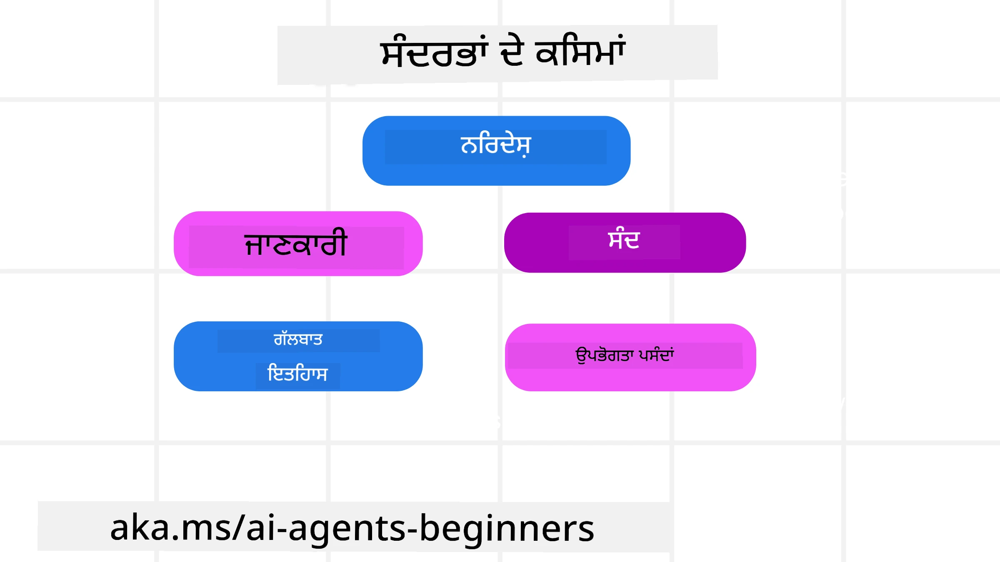
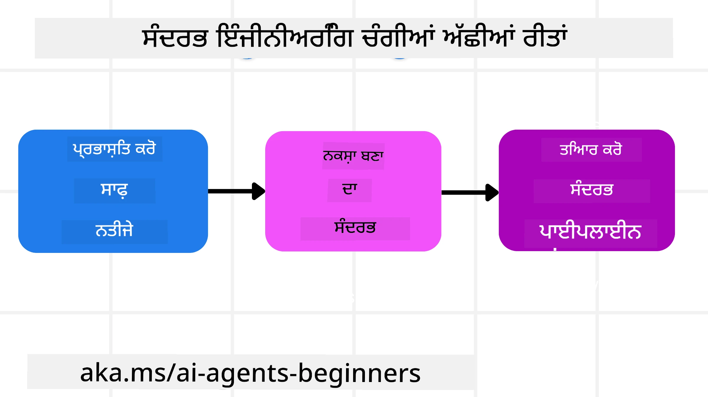

# ਏਆਈ ਏਜੰਟਾਂ ਲਈ ਸੰਦਰਭ ਇੰਜੀਨੀਅਰਿੰਗ

> _(ਇਸ ਪਾਠ ਦੇ ਵੀਡੀਓ ਨੂੰ ਵੇਖਣ ਲਈ ਉਪਰ ਦਿੱਤੀ ਚਿੱਤਰ 'ਤੇ ਕਲਿੱਕ ਕਰੋ)_

ਉਸ ਐਪਲੀਕੇਸ਼ਨ ਦੀ ਜਟਿਲਤਾ ਨੂੰ ਸਮਝਣਾ ਜਿਸ ਲਈ ਤੁਸੀਂ ਏਆਈ ਏਜੰਟ ਬਣਾ ਰਹੇ ਹੋ, ਇੱਕ ਭਰੋਸੇਯੋਗ ਏਜੰਟ ਬਣਾਉਣ ਲਈ ਮਹੱਤਵਪੂਰਨ ਹੈ। ਸਾਨੂੰ ਉਹ ਏਆਈ ਏਜੰਟ ਬਣਾਉਣੇ ਹਨ ਜੋ ਸੂਚਨਾ ਨੂੰ ਪ੍ਰਭਾਵਸ਼ালী ਢੰਗ ਨਾਲ ਸੰਭਾਲ ਸਕਣ ਤਾਂ ਜੋ ਪ੍ਰੌਮਪਟ ਇੰਜੀਨੀਅਰਿੰਗ ਤੋਂ ਵੱਧ ਜਟਿਲ ਜ਼ਰੂਰਤਾਂ ਨੂੰ ਪੂਰਾ ਕੀਤਾ ਜਾ ਸਕੇ। 

ਇਸ ਪਾਠ ਵਿੱਚ, ਅਸੀਂ ਦੇਖਾਂਗੇ ਕਿ ਸੰਦਰਭ ਇੰਜੀਨੀਅਰਿੰਗ ਕੀ ਹੈ ਅਤੇ ਇਸਦਾ ਏਆਈ ਏਜੰਟਾਂ ਦੇ ਨਿਰਮਾਣ ਵਿੱਚ ਕੀ ਭੂਮਿਕਾ ਹੈ।

## ਪਰਿਚਿਆ

ਇਸ ਪਾਠ ਵਿੱਚ ਕਵਰੇਜ ਕੀਤਾ ਜਾਵੇਗਾ:

• **ਸੰਦਰਭ ਇੰਜੀਨੀਅਰਿੰਗ ਕੀ ਹੈ** ਅਤੇ ਇਹ ਪ੍ਰੌਮਪਟ ਇੰਜੀਨੀਅਰਿੰਗ ਤੋਂ ਕਿਵੇਂ ਵੱਖਰਾ ਹੈ।

• **ਪ੍ਰਭਾਵਸ਼ালী ਸੰਦਰਭ ਇੰਜੀਨੀਅਰਿੰਗ ਲਈ ਰਣਨੀਤੀਆਂ**, ਜਿਸ ਵਿੱਚ ਸੂਚਨਾ ਲਿਖਣ, ਚੁਣਨ, ਸੰਕੁਚਿਤ ਕਰਨ ਅਤੇ ਤਿਆਗਣ ਦੇ ਤਰੀਕੇ ਸ਼ਾਮਿਲ ਹਨ।

• **ਆਮ ਸੰਦਰਭ ਫੇਲ੍ਹਅਸ** ਜੋ ਤੁਹਾਡੇ ਏਜੰਟ ਨੂੰ ਖਰਾਬ ਕਰ ਸਕਦੇ ਹਨ ਅਤੇ ਉਹਨਾਂ ਨੂੰ ਠੀਕ ਕਰਨ ਦਾ ਤਰੀਕਾ।

## ਸਿੱਖਣ ਦੇ ਲਕੜ

ਇਸ ਪਾਠ ਨੂੰ ਪੂਰਾ ਕਰਨ ਤੋਂ ਬਾਅਦ, ਤੁਸੀਂ ਜਾਣੋਗੇ ਕਿ ਕਿਵੇਂ:

• **ਸੰਦਰਭ ਇੰਜੀਨੀਅਰਿੰਗ ਦੀ ਪਰਿਭਾਸ਼ਾ ਕਰਨੀ ਹੈ** ਅਤੇ ਪ੍ਰੌਮਪਟ ਇੰਜੀਨੀਅਰਿੰਗ ਤੋਂ ਇਸ ਨੂੰ ਵੱਖ ਕਰਨਾ ਹੈ।

• **ਵੱਡੇ ਭਾਸ਼ਾਈ ਮਾਡਲ (LLM) ਐਪਲੀਕੇਸ਼ਨਾਂ ਵਿੱਚ ਸੰਦਰਭ ਦੇ ਮੁੱਖ ਅੰਸ਼ਾਂ ਦੀ ਪਹਚਾਣ ਕਰਨੀਆਂ ਹਨ।**

• **ਸੰਦਰਭ ਲਿਖਣ, ਚੁਣਨ, ਸੰਕੁਚਿਤ ਕਰਨ ਅਤੇ ਤਿਆਗਣ ਦੀਆਂ ਰਣਨੀਤੀਆਂ ਅਮਲ ਕਰਨ ਲਈ** ਜਿਹੜੀਆਂ ਏਜੰਟ ਦੇ ਪ੍ਰਦਰਸ਼ਨ ਨੂੰ ਬਿਹਤਰ ਕਰਦੀਆਂ ਹਨ।

• **ਆਮ ਸੰਦਰਭ ਸੰਬੰਧੀ ਗਲਤੀਆਂ ਜਿਵੇਂ ਕਿ ਜ਼ਹਿਰੀਲਾ ਹੋਣਾ, ਧਿਆਨ ਵਿਘਟਨ, ਗੁੰਝਲਦਾਰਤਾ ਅਤੇ ਟਕਰਾਅ ਨੂੰ ਸਿੱਧਾ ਕਰਨਾ ਅਤੇ ਇਸ ਦੀ ਟਾਲਣਾ ਕਰਨੀ ਹੈ।**

## ਸੰਦਰਭ ਇੰਜੀਨੀਅਰਿੰਗ ਕੀ ਹੈ?

ਏਆਈ ਏਜੰਟਾਂ ਲਈ, ਸੰਦਰਭ ਉਹ ਹੈ ਜੋ ਏਆਈ ਏਜੰਟ ਦੀ ਯੋਜਨਾ ਬਨਾਉਣ ਨੂੰ ਪ੍ਰੇਰਿਤ ਕਰਦਾ ਹੈ ਕਿ ਉਹ ਕਿਹੜੇ ਕਾਰਵਾਈਆਂ ਕਰੇ। ਸੰਦਰਭ ਇੰਜੀਨੀਅਰਿੰਗ ਦਾ ਅਰਥ ਹੈ ਇਹ ਸੁਨਿਸ਼ਚਿਤ ਕਰਨਾ ਕਿ ਏਜੰਟ ਕੋਲ ਟਾਸਕ ਦੇ ਅਗਲੇ ਕਦਮ ਨੂੰ ਪੂਰਾ ਕਰਨ ਲਈ ਸਹੀ ਜਾਣਕਾਰੀ ਮੌਜੂਦ ਹੋਵੇ। ਸੰਦਰਭ ਵਿਂਡੋ ਸੀਮਿਤ ਆਕਾਰ ਦੀ ਹੁੰਦੀ ਹੈ, ਇਸ ਲਈ ਏਜੰਟ ਨਿਰਮਾਤਾ ਵਜੋਂ ਸਾਨੂੰ ਸਿਸਟਮ ਤੇ ਪ੍ਰਕਿਰਿਆਵਾਂ ਬਣਾ ਕੇ ਸੰਦਰਭ ਵਿਂਡੋ ਵਿੱਚ ਜਾਣਕਾਰੀ ਜੋੜਨ, ਹਟਾਉਣ ਅਤੇ ਸੰਕੁਚਿਤ ਕਰਨ ਦੀ ਪ੍ਰਬੰਧਕੀ ਕਰਨੀ ਪੈਂਦੀ ਹੈ।

### ਪ੍ਰੌਮਪਟ ਇੰਜੀਨੀਅਰਿੰਗ ਬਨਾਮ ਸੰਦਰਭ ਇੰਜੀਨੀਅਰਿੰਗ

ਪ੍ਰੌਮਪਟ ਇੰਜੀਨੀਅਰਿੰਗ ਇੱਕ ਠਹਿਰਿਆ ਹੋਇਆ ਨਿਰਦੇਸ਼ਾਂ ਦਾ ਇੱਕ ਸੈੱਟ ਹੈ ਜੋ ਏਆਈ ਏਜੰਟਾਂ ਨੂੰ ਨਿਯਮਾਂ ਦੇ ਸੈੱਟ ਨਾਲ ਪ੍ਰਭਾਵਸ਼ਾਲੀ ਤਰੀਕੇ ਨਾਲ ਮਾਰਗਦਰਸ਼ਿਤ ਕਰਦਾ ਹੈ। ਸੰਦਰਭ ਇੰਜੀਨੀਅਰਿੰਗ ਇਕ ਗਤੀਸ਼ੀਲ ਜਾਣਕਾਰੀ ਦੇ ਸੈੱਟ ਦੀ ਪਰਬੰਧਕੀ ਹੈ, ਜਿਸ ਵਿੱਚ ਮੁੱਖ ਪ੍ਰੌਮਪਟ ਵੀ ਸ਼ਾਮਿਲ ਹੈ, ਤਾਂ ਜੋ ਸਮੇਂ ਦੇ ਨਾਲ ਏਜੰਟ ਕੋਲ ਜੋ ਲੋੜੀਂਦਾ ਹੈ ਉਹ ਮੌਜੂਦ ਰਹੇ। ਸੰਦਰਭ ਇੰਜੀਨੀਅਰਿੰਗ ਦਾ ਮਕਸਦ ਇਸ ਪ੍ਰਕਿਰਿਆ ਨੂੰ ਦੁਹਰਾਯੋਗ ਅਤੇ ਭਰੋਸੇਯੋਗ ਬਣਾਉਣਾ ਹੈ।

### ਸੰਦਰਭ ਦੇ ਕਿਸਮਾਂ

ਇਹ ਯਾਦ ਰੱਖਣਾ ਜਰੂਰੀ ਹੈ ਕਿ ਸੰਦਰਭ ਸਿਰਫ ਇੱਕ ਚੀਜ਼ ਨਹੀਂ ਹੈ। ਏਆਈ ਏਜੰਟ ਨੂੰ ਲੋੜੀਂਦੀ ਜਾਣਕਾਰੀ ਵੱਖ-ਵੱਖ ਸਰੋਤਾਂ ਤੋਂ ਆ ਸਕਦੀ ਹੈ ਅਤੇ ਸਾਡੇ ਉੱਤੇ ਹੈ ਕਿ ਅਸੀਂ ਇਹ ਯਕੀਨੀ ਬਣਾਈਏ ਕਿ ਏਜੰਟ ਨੂੰ ਇਹ ਸਰੋਤ ਉਪਲਬਧ ਹਨ:

ਏਆਈ ਏਜੰਟ ਨੂੰ ਪ੍ਰਬੰਧਿਤ ਕਰਨ ਲਈ ਸੰਦਰਭ ਦੇ ਕਿਸਮਾਂ ਵਿੱਚ ਸ਼ਾਮਿਲ ਹਨ:

• **ਨਿਰਦੇਸ਼:** ਇਹ ਉਹ "ਨਿਯਮ" ਹਨ – ਪ੍ਰੌਮਪਟ, ਸਿਸਟਮ ਮੈਸੇਜ, ਥੋੜ੍ਹੇ ਉਦਾਹਰਣ (ਜੋ ਏਆਈ ਨੂੰ ਦਿਖਾਉਂਦੇ ਹਨ ਕਿ ਕੰਮ ਕਿਵੇਂ ਕਰਨਾ ਹੈ), ਅਤੇ ਉਹ ਸੰਦ ਜਿਨ੍ਹਾਂ ਦਾ ਇਸਤੇਮਾਲ ਕੀਤਾ ਜਾ ਸਕਦਾ ਹੈ। ਇਹ ਥਾਂ ਹੈ ਜਿੱਥੇ ਪ੍ਰੌਮਪਟ ਇੰਜੀਨੀਅਰਿੰਗ ਅਤੇ ਸੰਦਰਭ ਇੰਜੀਨੀਅਰਿੰਗ ਮਿਲਦੇ ਹਨ।

• **ਜਾਣਕਾਰੀ:** ਇਸ ਵਿੱਚ ਤੱਥ, ਡੈਟਾਬੇਸੋਂ ਮਿਲੀ ਜਾਣਕਾਰੀ ਜਾਂ ਲੰਬੇ ਸਮੇਂ ਦੀਆਂ ਯਾਦਾਂ ਸ਼ਾਮਿਲ ਹਨ ਜੋ ਏਜੰਟ ਨੇ ਇਕੱਤਰ ਕੀਤੀਆਂ ਹਨ। ਜੇਕਰ ਏਜੰਟ ਨੂੰ ਵੱਖ-ਵੱਖ ਗਿਆਨ ਸਟੋਰ ਅਤੇ ਡੈਟਾਬੇਸਾਂ ਤੱਕ ਪਹੁੰਚ ਦੀ ਲੋੜ ਹੋਵੇ ਤਾਂ ਰੀਟ੍ਰੀਵਲ ਆਗਮੈਂਟਡ ਜਨਰੇਸ਼ਨ (RAG) ਸਿਸਟਮ ਨੂੰ ਇੰਟੀਗ੍ਰੇਟ ਕਰਨਾ ਸ਼ਾਮਿਲ ਹੁੰਦਾ ਹੈ।

• **ਉਪਕਾਰਣ:** ਇਹ ਬਾਹਰੀ ਫੰਕਸ਼ਨ, API ਅਤੇ MCP ਸਰਵਰਾਂ ਦੇ ਪਰਿਭਾਸ਼ਾ ਹਨ ਜਿਹੜੀਆਂ ਏਜੰਟ ਕਾਲ ਕਰ ਸਕਦਾ ਹੈ, ਨਾਲ ਹੀ ਉਹ ਫੀਡਬੈਕ (ਨਤੀਜੇ) ਜੋ ਇਨ੍ਹਾਂ ਦੇ ਇਸਤੇਮਾਲ ਤੋਂ ਮਿਲਦੇ ਹਨ।

• **ਗੱਲਬਾਤ ਦਾ ਇਤਿਹਾਸ:** ਉਪਭੋਗਤਾ ਨਾਲ ਜਾਰੀ ਗੱਲਬਾਤ। ਸਮੇਂ ਦੇ ਨਾਲ ਇਹ ਗੱਲਬਾਤਾਂ ਲੰਮੀ ਅਤੇ ਜਟਿਲ ਹੋ ਜਾਂਦੀਆਂ ਹਨ ਜੋ ਸੰਦਰਭ ਵਿਂਡੋ ਵਿੱਚ ਜਗ੍ਹਾ ਘੇਰ ਲੈਂਦੀਆਂ ਹਨ।

• **ਵਰਤੋਂਕਾਰ ਦੀਆਂ ਪਸੰਦਾਂ:** ਸਮੇਂ ਨਾਲ ਵਰਤੋਂਕਾਰ ਦੇ ਸ਼ੌਕ ਜਾਂ ਨਪਸੰਦ ਬਾਰੇ ਜਾਣਕਾਰੀ। ਇਹ ਸਟੋਰ ਕੀਤੀਆਂ ਜਾ ਸਕਦੀਆਂ ਹਨ ਅਤੇ ਮੁੱਖ ਫੈਸਲੇ ਲੈਣ ਵੇਲੇ ਸਹਾਇਤਾ ਲਈ ਵਰਤੀਆਂ ਜਾ ਸਕਦੀਆਂ ਹਨ।

## ਪ੍ਰਭਾਵਸ਼ালী ਸੰਦਰਭ ਇੰਜੀਨੀਅਰਿੰਗ ਲਈ ਰਣਨੀਤੀਆਂ

### ਯੋਜਨਾ ਬਣਾਉਣ ਵਾਲੀਆਂ ਰਣਨੀਤੀਆਂ

ਵਧੀਆ ਸੰਦਰਭ ਇੰਜੀਨੀਅਰਿੰਗ ਅਚ੍ਛੀ ਯੋਜਨਾ ਨਾਲ ਸ਼ੁਰੂ ਹੁੰਦੀ ਹੈ। ਇੱਥੇ ਇੱਕ ਐਸਾ ਤਰੀਕਾ ਦਿੱਤਾ ਗਿਆ ਹੈ ਜੋ ਤੁਹਾਨੂੰ ਸੰਦਰਭ ਇੰਜੀਨੀਅਰਿੰਗ ਦੇ ਮਤਲਬ ਬਾਰੇ ਸੋਚਣਾ ਸ਼ੁਰੂ ਕਰਨ ਵਿੱਚ ਮਦਦ ਕਰੇਗਾ:

1. **ਸਪਸ਼ਟ ਨਤੀਜੇ ਪਰਿਭਾਸ਼ਿਤ ਕਰੋ** - ਉਹ ਨਤੀਜੇ ਜੋ ਏਆਈ ਏਜੰਟਾਂ ਨੂੰ ਦਿੱਤੇ ਜਾਣਗੇ, ਉਹ ਸਪਸ਼ਟ ਹੋਣੇ ਚਾਹੀਦੇ ਹਨ। ਇਸ ਸਵਾਲ ਦਾ ਜਵਾਬ ਦਿਓ - "ਜਦੋਂ ਏਜੰਟ ਆਪਣਾ ਕੰਮ ਕਰ ਲਵੇਗਾ, ਤਦ โลก ਕਿਵੇਂ ਦਿਖਾਈ ਦੇਵੇਗੀ?" ਦੂਜੇ ਸ਼ਬਦਾਂ ਵਿੱਚ, ਵਰਤੋਂਕਾਰ ਨਾਲ ਮੰਨਾ ਗੇ ਸੰਦਰਭ ਤੇ ਕਿਹਾ ਜਾਣਾ ਚਾਹੀਦਾ ਹੈ।

2. **ਸੰਦਰਭ ਦਾ ਨਕਸ਼ਾ ਬਣਾਓ** - ਜਦੋਂ ਤੁਸੀਂ ਏਜੰਟ ਦੇ ਨਤੀਜੇ ਨਿਰਧਾਰਤ ਕਰਦੇ ਹੋ, ਤਾਂ ਇਹ ਸਵਾਲ ਪੁੱਛੋ - "ਏਜੰਟ ਨੂੰ ਇਹ ਕੰਮ ਪੂਰਾ ਕਰਨ ਲਈ ਕਿਹੜੀ ਜਾਣਕਾਰੀ ਚਾਹੀਦੀ ਹੈ?" ਇਸ ਤਰ੍ਹਾਂ ਤੁਸੀਂ ਇਹ ਨਕਸ਼ਾ ਬਣਾ ਸਕਦੇ ਹੋ ਕਿ ਉਹ ਜਾਣਕਾਰੀ ਕਿੱਥੇ ਮਿਲੇਗੀ।

3. **ਸੰਦਰਭ ਪਾਈਪਲਾਈਨਾਂ ਬਣਾਓ** - ਹੁਣ ਜਦੋਂ ਤੁਹਾਨੂੰ ਪਤਾ ਹੈ ਕਿ ਜਾਣਕਾਰੀ ਕਿੱਥੇ ਹੈ, ਤਾਂ ਇਹ ਸਵਾਲ ਪੁੱਛੋ - "ਏਜੰਟ ਇਸ ਜਾਣਕਾਰੀ ਤੱਕ ਕਿਵੇਂ ਪਹੁੰਚੇਗਾ?" ਇਸਦੀ ਵਿਕਲਪਿਕ ਤਰੀਕੇ ਸ਼ਾਮਿਲ ਹਨ: RAG, MCP ਸਰਵਰਾਂ ਅਤੇ ਹੋਰ ਸੰਦਾਂ ਦਾ ਉਪਯੋਗ।

### ਪ੍ਰਭਾਵਸ਼ਾਲੀ ਰਣਨੀਤੀਆਂ

ਯੋਜਨਾ ਬਣਾਉਣਾ ਮਹੱਤਵਪੂਰਨ ਹੈ ਪਰ ਜਦੋਂ ਜਾਣਕਾਰੀ ਸਾਡੇ ਏਜੰਟ ਦੀ ਸੰਦਰਭ ਵਿਂਡੋ ਵਿੱਚ ਆਉਣ ਲੱਗਦੀ ਹੈ, ਤਾਂ ਸਾਨੂੰ ਇਸਦਾ ਪਰਬੰਧ ਕਰੋ ਵਾਸਤੇ ਕਈ ਅਮਲੀ ਰਣਨੀਤੀਆਂ ਰੱਖਣੀਆਂ ਚਾਹੀਦੀਆਂ ਹਨ:

#### ਸੰਦਰਭ ਪਰਬੰਧਨ

ਜਦ ਕਿ ਕੁਝ ਜਾਣਕਾਰੀ ਆਪੋ-ਆਪਣੇ ਸੰਦਰਭ ਵਿਂਡੋ ਵਿੱਚ ਸ਼ਾਮਿਲ ਹੋ ਜਾਂਦੀ ਹੈ, ਸੰਦਰਭ ਇੰਜੀਨੀਅਰਿੰਗ ਇਸ ਜਾਣਕਾਰੀ ਨੂੰ ਹੋਰ ਸਰਗਰਮ ਤਰੀਕੇ ਨਾਲ ਸੰਭਾਲਣ ਬਾਰੇ ਹੈ ਜੋ ਕਈ ਰਣਨੀਤੀਆਂ ਨਾਲ ਕੀਤਾ ਜਾ ਸਕਦਾ ਹੈ:

1. **ਏਜੰਟ ਸਕਰੈਚਪੈੱਡ**  
ਇਹ ਏਆਈ ਏਜੰਟ ਨੂੰ ਇਸ ਯੋਗਤਾ ਦਿੰਦਾ ਹੈ ਕਿ ਉਹ ਮੌਜੂਦਾ ਟਾਸਕਾਂ ਅਤੇ ਵਰਤੋਂਕਾਰ ਨਾਲ ਸੰਵਾਦ ਦੇ ਸਬੰਧ ਵਿੱਚ ਮਹੱਤਵਪੂਰਨ ਨੋਟੇ ਲਵੇ। ਇਹ ਸੰਦਰਭ ਵਿਂਡੋ ਦੇ ਬਾਹਰ ਕਿਸੇ ਫਾਇਲ ਜਾਂ ਰਨਟਾਈਮ ਆਬਜੈਕਟ ਵਿੱਚ ਹੋਣਾ ਚਾਹੀਦਾ ਹੈ, ਜਿਸਨੂੰ ਏਜੰਟ ਜਰੂਰਤ ਪੈਣ 'ਤੇ ਇਸ ਸੈਸ਼ਨ ਦੌਰਾਨ ਬਾਅਦ ਵਿੱਚ ਪ੍ਰਾਪਤ ਕਰ ਸਕਦਾ ਹੈ।

2. **ਯਾਦਾਂ**  
ਸਕਰੈਚਪੈੱਡ ਸਤਰਾਂ ਤੋਂ ਬਾਹਰ ਜਾਣਕਾਰੀ ਨੂੰ ਪਰਬੰਧ ਕਰਨ ਲਈ ਵਧੀਆ ਹਨ। ਯਾਦਾਂ ਏਜੰਟਾਂ ਨੂੰ ਕਈ ਸੈਸ਼ਨਾਂ ਵਿੱਚ ਪ੍ਰਸੰਗਿਕ ਜਾਣਕਾਰੀ ਸਟੋਰ ਅਤੇ ਰੀਟ੍ਰੀਵ ਕਰਨ ਦੀ ਆਗਿਆ ਦਿੰਦੇ ਹਨ। ਇਸ ਵਿੱਚ ਸੰਖੇਪ, ਵਰਤੋਂਕਾਰ ਪਸੰਦਾਂ ਅਤੇ ਭਵਿੱਖ ਲਈ ਸੁਧਾਰਾਂ ਨੂੰ ਸ਼ਾਮਿਲ ਕੀਤਾ ਜਾ ਸਕਦਾ ਹੈ।

3. **ਸੰਦਰਭ ਸੰਕੁਚਿਤ ਕਰਨਾ**  
ਜਦੋਂ ਸੰਦਰਭ ਵਿਂਡੋ ਵੱਧ ਜਾਂਦੀ ਹੈ ਅਤੇ ਸੀਮਾ ਦੇ ਨੇੜੇ ਪਹੁੰਚਦੀ ਹੈ, ਤਦ ਸੰਖੇਪਕਰਨ ਅਤੇ ਛਾਂਟਣ ਵਰਗੀਆਂ ਤਕਨੀਕਾਂ ਦੀ ਵਰਤੋਂ ਕੀਤੀ ਜਾ ਸਕਦੀ ਹੈ। ਇਸ ਵਿੱਚ ਸਿਰਫ ਸਭ ਤੋਂ ਪ੍ਰਸੰਗਿਕ ਜਾਣਕਾਰੀ ਰੱਖਣਾ ਜਾਂ ਪੁਰਾਣੀਆਂ ਸੁਨੇਹੇ ਹਟਾਉਣਾ ਸ਼ਾਮਿਲ ਹੈ।

4. **ਮਲਟੀ-ਏਜੰਟ ਸਿਸਟਮ**  
ਮਲਟੀ-ਏਜੰਟ ਸਿਸਟਮ ਤਿਆਰ ਕਰਨਾ ਸੰਦਰਭ ਇੰਜੀਨੀਅਰਿੰਗ ਦਾ ਇੱਕ ਰੂਪ ਹੈ ਕਿਉਂਕਿ ਹਰ ਏਜੰਟ ਦੀ ਆਪਣੀ ਸੰਦਰਭ ਵਿਂਡੋ ਹੁੰਦੀ ਹੈ। ਇਹ ਸੰਦਰਭ ਕਿਵੇਂ ਸਾਂਝਾ ਕੀਤਾ ਜਾਂਦਾ ਹੈ ਅਤੇ ਵੱਖ-ਵੱਖ ਏਜੰਟਾਂ ਨੂੰ ਕਿਵੇਂ ਦਿੱਤਾ ਜਾਂਦਾ ਹੈ, ਇਹ ਸਭ ਕੁਝ ਸਿਸਟਮ ਬਣਾਉਂਦੇ ਸਮੇਂ ਯੋਜਨਾ ਬਣਾਉਣ ਵਾਲਾ ਮਾਮਲਾ ਹੈ।

5. **ਸੈਂਡਬਾਕਸ ਵਾਤਾਵਰਣ**  
ਜੇਕਰ ਕਿਸੇ ਏਜੰਟ ਨੂੰ ਕੋਈ ਕੋਡ ਚਲਾਉਣਾ ਜਾਂ ਡੌਕਯੂਮੈਂਟ ਵਿੱਚ ਵੱਡੀ ਮਾਤਰਾ ਵਿੱਚ ਜਾਣਕਾਰੀ ਨੂੰ ਪ੍ਰਕਿਰਿਆਕ੍ਰਿਤ ਕਰਨਾ ਹੋਵੇ, ਤਾਂ ਇਸ ਨਾਲ ਨਤੀਜੇ ਪ੍ਰਕਿਰਿਆ ਕਰਨ ਲਈ ਬੜਾ ਟੋਕਨ ਖਰਚ ਹੋ ਸਕਦਾ ਹੈ। ਇਹ ਸਾਰੀ ਜਾਣਕਾਰੀ ਸੰਦਰਭ ਵਿਂਡੋ ਵਿੱਚ ਸਟੋਰ ਕਰਨ ਦੇ ਬਜਾਏ, ਏਜੰਟ ਇੱਕ ਐਸਾ ਸੈਂਡਬਾਕਸ ਵਾਤਾਵਰਣ ਵਰਤ ਸਕਦਾ ਹੈ ਜੋ ਇਹ ਕੋਡ ਚਲਾਉਂਦਾ ਹੈ ਅਤੇ ਸਿਰਫ਼ ਨਤੀਜੇ ਅਤੇ ਹੋਰ ਪ੍ਰਸੰਗਿਕ ਜਾਣਕਾਰੀ ਨੂੰ ਪੜ੍ਹਦਾ ਹੈ।

6. **ਰਨਟਾਈਮ ਸਟੇਟ ਆਬਜੈਕਟ**  
ਇਹ ਜਾਣਕਾਰੀ ਦੇ ਕੰਟੇਨਰ ਬਣਾਉਣ ਦੁਆਰਾ ਕੀਤਾ ਜਾਂਦਾ ਹੈ ਤਾਂ ਜੋ ਇਹ ਪ੍ਰਬੰਧ ਕੀਤਾ ਜਾ ਸਕੇ ਕਿ ਜਦੋਂ ਏਜੰਟ ਨੂੰ ਕਿਸੇ ਵਿਸ਼ੇਸ਼ ਜਾਣਕਾਰੀ ਦੀ ਲੋੜ ਪਵੇ। ਕਿਸੇ ਜਟਿਲ ਟਾਸਕ ਲਈ, ਇਹ ਬਹੁਤ ਸਹਾਇਕ ਹੁੰਦਾ ਹੈ ਕਿ ਏਜੰਟ ਹਰ ਹਿੱਸੇ ਦਾ ਨਤੀਜਾ ਕ੍ਰਮਵਾਰ ਸਟੋਰ ਕਰ ਸਕੇ, ਤਾਂ ਜੋ ਸੰਦਰਭ ਸਿਰਫ ਉਸ ਵਿਸ਼ੇਸ਼ ਹਿੱਸੇ ਨਾਲ ਜੁੜਿਆ ਰਹੇ।

#### ਸੰਦਰਭ ਦੀ ਜਾਂਚ

ਜਦੋਂ ਤੁਸੀਂ ਇਹਨਾਂ ਵਿੱਚੋਂ ਕਿਸੇ ਰਣਨੀਤੀ ਨੂੰ ਲਾਗੂ ਕਰਦੇ ਹੋ, ਤਾਂ ਇਹ ਵੇਖਣਾ ਲਾਭਦਾਇਕ ਹੁੰਦਾ ਹੈ ਕਿ ਅਗਲਾ ਮਾਡਲ ਕਾਲ ਕੀ ਪ੍ਰਾਪਤ ਕਰਦਾ ਹੈ। ਇੱਕ ਪ੍ਰਯੋਗਸ਼ੀਲ ਡਿਬੱਗਿੰਗ ਸਵਾਲ ਇਹ ਹੈ:

> ਕੀ ਏਜੰਟ ਨੇ ਬਹੁਤ ਜ਼ਿਆਦਾ ਸੰਦਰਭ ਲੋਡ ਕੀਤਾ, ਗਲਤ ਸੰਦਰਭ ਲਿਆ, ਜਾਂ ਜੋ ਸੰਦਰਭ ਚਾਹੀਦਾ ਸੀ ਉਹ ਛੱਡ ਦਿੱਤਾ?

ਤੁਹਾਨੂੰ ਇਸ ਸਵਾਲ ਦਾ ਜਵਾਬ ਦੇਣ ਲਈ ਰਾਅ ਪ੍ਰੌਮਪਟ, ਟੂਲ ਆਊਟਪੁਟ ਜਾਂ ਯਾਦਾਂ ਦੇ ਸਮੱਗਰੀਆਂ ਨੂੰ ਲਾਗ ਨਹੀਂ ਕਰਨਾ ਪੈਂਦਾ। ਉਤਪਾਦਨ ਵਿੱਚ ਛੋਟੀ ਸੰਦਰਭ ਜਾਂਚ ਰਿਕਾਰਡਾਂ ਨੂੰ ਤਰਜੀਹ ਦਿਓ ਜੋ ਗਿਣਤੀ, ਆਈਡੀ, ਹੈਸ਼, ਅਤੇ ਨੀਤੀ ਲੇਬਲ ਕੈਪਚਰ ਕਰਨਗੇ:

- **ਚੁਣਾਅ:** ਇਹ ਟਰੈਕ ਕਰੋ ਕਿ ਕਿੰਨੇ ਉਮੀਦਵਾਰ ਖੰਡ, ਉਪਕਾਰਣ ਜਾਂ ਯਾਦਾਂ ਵਿਚਾਰਿਆ ਗਿਆ, ਕਿੰਨੇ ਚੁਣੇ ਗਏ, ਅਤੇ ਕਿਹੜੇ ਨਿਯਮ ਜਾਂ ਸਕੋਰ ਨੇ ਹੋਰਾਂ ਨੂੰ ਬਾਹਰ ਰੱਖਿਆ।
- **ਸੰਕੁਚਿਤ ਕਰਨ:** ਸਰੋਤ ਸੀਮਾ ਜਾਂ ਟ੍ਰੇਸ ਆਈਡੀ, ਸੰਖੇਪ ਆਈਡੀ, ਸੰਕੁਚਿਤ ਕਰਨ ਤੋ ਪਹਿਲਾਂ ਅਤੇ ਬਾਅਦ ਦੇ ਟੋਕਨ ਦੀਆਂ ਅੰਦਾਜ਼ਿਤ ਗਿਣਤੀਆਂ, ਅਤੇ ਕੀ ਰਾਅ ਸਮੱਗਰੀ ਅਗਲੇ ਕਾਲ ਤੋਂ ਬਾਹਰ ਰਹੀ, ਇਸਦਾ ਰਿਕਾਰਡ ਰੱਖੋ।
- **ਅਲੱਗ ਕਰਨ:** ਕਿਹੜਾ ਹਿੱਸਾ ਵੱਖਰੇ ਏਜੰਟ, ਸੈਸ਼ਨ ਜਾਂ ਸੈਂਡਬਾਕਸ ਵਿੱਚ ਚਾਲੂ ਹੋਇਆ, ਕੀ ਸਿਮਿਤ ਸੰਖੇਪ ਵਾਪਸ ਦਿੱਤਾ ਗਿਆ, ਅਤੇ ਕਿ ਵੱਡੀ ਟੂਲ ਆਊਟਪੁੱਟ ਪ੍ਰਧਾਨ ਏਜੰਟ ਦੇ ਸੰਦਰਭ ਤੋਂ ਬਾਹਰ ਹੀ ਰਹੀ ਇਨ੍ਹਾਂ ਨੂੰ ਨੋਟ ਕਰੋ।
- **ਯਾਦਾਂ ਅਤੇ RAG:** ਪੂਰੀ ਰੀਟ੍ਰੀਵ ਕੀਤੀ ਹੋਈ ਟੈਕਸਟ ਦੀ ਬਜਾਇ ਰੀਟ੍ਰੀਵ ਕਰਨ ਵਾਲੇ ਦਸਤਾਵੇਜ਼ ਆਈਡੀਜ਼, ਯਾਦਾਂ ਦੇ ਆਈਡੀਜ਼, ਸਕੋਰ, ਚੁਣੇ ਹੋਏ ਆਈਡੀਜ਼ ਅਤੇ ਰੈਡੈਕਸ਼ਨ ਸਥਿਤੀ ਸਟੋਰ ਕਰੋ।
- **ਸੁਰੱਖਿਆ ਅਤੇ ਪ੍ਰਾਈਵੇਸੀ:** ਸੰਵੇਦਨਸ਼ੀਲ ਪ੍ਰੌਮਪਟ ਟੈਕਸਟ, ਟੂਲ ਅਰਗੂਮੈਂਟ, ਟੂਲ ਨਤੀਜੇ, ਜਾਂ ਯੂਜ਼ਰ ਯਾਦਾਂ ਦੇ ਬਾਡੀਜ਼ ਦੇ ਬਦਲੇ ਹੈਸ਼, ਆਈਡੀ, ਟੋਕਨ ਬਕੈਟ ਅਤੇ ਨੀਤੀ ਲੇਬਲਵਾਂ ਨੂੰ ਤਰਜੀਹ ਦਿਓ।

ਮਕਸਦ ਵਧੇਰੇ ਸੰਦਰਭ ਰੱਖਣਾ ਨਹੀਂ ਹੈ। ਮਕਸਦ ਇਹ ਰੱਖਣਾ ਹੈ ਕਿ ਵਿਕਾਸਕਾਰ ਨੂੰ ਇਹ ਸੁਝਾਅ ਮਿਲੇ ਕਿ ਕਿਹੜੀ ਸੰਦਰਭ ਰਣਨੀਤੀ ਚੱਲੀ ਅਤੇ ਕੀ ਇਸ ਨੇ ਅਗਲੇ ਮਾਡਲ ਕਾਲ ਨੂੰ ਇੱਛਤ ਤਰੀਕੇ ਨਾਲ ਬਦਲਿਆ।

### ਸੰਦਰਭ ਇੰਜੀਨੀਅਰਿੰਗ ਦੀ ਉਦਾਹਰਣ

ਮਾਨੋ ਅਸੀਂ ਇੱਕ ਏਜੰਟ ਚਾਹੁੰਦੇ ਹਾਂ ਜੋ **"ਮੈਨੂੰ ਪੈਰਿਸ ਲਈ ਯਾਤਰਾ ਬੁਕ ਕਰ ਦੇਵੇ।"**

• ਸਿਰਫ ਪ੍ਰੌਮਪਟ ਇੰਜੀਨੀਅਰਿੰਗ ਵਾਲਾ ਸਧਾਰਣ ਏਜੰਟ ਸਿਰਫ ਇਸ ਤਰ੍ਹਾਂ ਜਵਾਬ ਦੇ ਸਕਦਾ ਹੈ: **"ਠੀਕ ਹੈ, ਤੁਸੀਂ ਪੈਰਿਸ ਕਦੋਂ ਜਾਣਾ ਚਾਹੁੰਦੇ ਹੋ?"** ਉਹ ਸਿਰਫ ਉਸ ਸਮੇਤ ਯੂਜ਼ਰ ਦੇ ਸਿੱਧੇ ਪ੍ਰਸ਼ਨ ਨੂੰ ਸੰਭਾਲਦਾ ਹੈ।

• ਜਿਸ ਏਜੰਟ ਨੇ ਸੰਦਰਭ ਇੰਜੀਨੀਅਰਿੰਗ ਦੀਆਂ ਰਣਨੀਤੀਆਂ ਵਰਤੀਆਂ ਹਨ, ਉਹ ਕਾਫੀ ਹੋਰ ਕਾਮ ਕਰੇਗਾ। ਜਵਾਬ ਦੇਣ ਤੋਂ ਪਹਿਲਾਂ, ਉਸਦੀ ਸਿਸਟਮ ਇਹ ਕਰ ਸਕਦੀ ਹੈ:

  ◦ **ਤੁਹਾਡੇ ਕੈਲੰਡਰ** ਦੀ ਜਾਂਚ ਕਰੇ (ਅਸਲੀ ਸਮੇਂ ਦਾ ਡੇਟਾ ਪ੍ਰਾਪਤ ਕਰਨਾ)।

  ◦ **ਪਿਛਲੇ ਯਾਤਰਾ ਦੇ ਪਸੰਦਾਂ ਨੂੰ ਯਾਦ ਕਰੇ** (ਲੰਬੇ ਸਮੇਂ ਦੀ ਯਾਦ ਤੋਂ) ਜਿਵੇਂ ਤੁਹਾਡੀ ਮਨਪਸੰਦ ਏਅਰਲਾਈਨ, ਬਜਟ, ਜਾਂ ਸਿੱਧੇ ਫਲਾਈਟਾਂ ਦੀ ਪਸੰਦ।

  ◦ **ਉਪਲਬਧ ਸੰਦਾਂ** ਦੀ ਪਛਾਣ ਕਰੇ ਜਿਵੇਂ ਉਡਾਣ ਅਤੇ ਹੋਟਲ ਬੁਕਿੰਗ ਲਈ।

- ਫਿਰ ਇੱਕ ਉਦਾਹਰਨ ਜਵਾਬ ਹੋ ਸਕਦਾ ਹੈ: "ਹੈਲੋ [ਤੁਹਾਡਾ ਨਾਮ]! ਮੈਂ ਵੇਖਦਾ ਹਾਂ ਕਿ ਤੁਸੀਂ ਅਕਤੂਬਰ ਦੇ ਪਹਿਲੇ ਹਫ਼ਤੇ ਖਾਲੀ ਹੋ। ਕੀ ਮੈਂ [ਪਸੰਦੀਦਾ ਏਅਰਲਾਈਨ] ਵਿੱਚ ਤੁਹਾਡੇ ਆਮ ਬਜਟ [ਬਜਟ] ਦੇ ਅੰਦਰ ਸਿੱਧੇ ਫਲਾਈਟ ਖੋਲੀਅਾਂ?" ਇਹ ਸੰਸਪ੍ਰੰਗਤ, ਸੰਦਰਭ-ਸੂਚਿਤ ਜਵਾਬ ਸੰਦਰਭ ਇੰਜੀਨੀਅਰਿੰਗ ਦੀ ਸ਼ਕਤੀ ਨੂੰ ਦਰਸਾਉਂਦਾ ਹੈ।

## ਆਮ ਸੰਦਰਭ ਫੇਲ੍ਹਅਸ

### ਸੰਦਰਭ ਜਹਿਰੀਲਾ ਹੋਣਾ

**ਇਹ ਕੀ ਹੈ:** ਜਦੋਂ ਇੱਕ ਹਲੁਸੀਨੇਸ਼ਨ (LLM ਦੀ ਗਲਤ ਜਾਣਕਾਰੀ) ਜਾਂ ਗਲਤੀ ਸੰਦਰਭ ਵਿੱਚ ਆ ਜਾਂਦੀ ਹੈ ਅਤੇ ਵਾਰ-ਵਾਰ ਦਰੁਸਤ ਕੀਤੀ ਜਾਂਦੀ ਹੈ, ਜਿਸ ਨਾਲ ਏਜੰਟ ਅਸੰਭਵ ਲੱਛੇ ਪ੍ਰਾਪਤ ਕਰਨ ਜਾਂ ਬੇਸੁਧ ਰਣਨੀਤੀਆਂ ਵਿਕਸਤ ਕਰਨ ਲਈ प्रेरਿਤ ਹੁੰਦਾ ਹੈ।

**ਕੀ ਕਰਨਾ ਹੈ:** **ਸੰਦਰਭ ਦੀ ਚਾਂਨੀ ਕੀਤੀ ਜਾਵੇ** ਅਤੇ **ਕਰਾਂਟਾਈਨ** ਲਾਗੂ ਕੀਤਾ ਜਾਵੇ। ਜਾਣਕਾਰੀ ਨੂੰ ਲੰਬੇ ਸਮੇਂ ਦੀ ਯਾਦ ਵਿੱਚ ਸ਼ਾਮਿਲ ਕਰਨ ਤੋਂ ਪਹਿਲਾਂ ਇਸਦੀ ਜਾਂਚ ਕਰਨੀ ਚਾਹੀਦੀ ਹੈ। ਜੇ ਜਹਿਰੀਲਾ ਹੋਣ ਦਾ ਸੰਕੇਤ ਮਿਲੇ, ਤਾਂ ਨਵਾਂ ਸੰਦਰਭ ਧਾਗਾ ਸ਼ੁਰੂ ਕਰੋ ਤਾਂ ਜੋ ਮਾੜੀ ਜਾਣਕਾਰੀ ਦੂਜੇ ਥਾਂ ਨਾ ਫੈਲੇ।

**ਯਾਤਰਾ ਬੁਕਿੰਗ ਦੀ ਉਦਾਹਰਣ:** ਤੁਹਾਡੇ ਏਜੰਟ ਨੂੰ ਇੱਕ ਛੋਟੇ ਹਨੇਰੇ ਹਵਾਈ ਅੱਡੇ ਤੋਂ ਇੱਕ ਦੂਰ ਸਥਿਤ ਅੰਤਰਰਾਸ਼ਟਰੀ ਸ਼ਹਿਰ ਲਈ ਸਿੱਧਾ ਫਲਾਈਟ ਹੋਣ ਦੀ ਧਾਰਣਾ ਹੋ ਜਾਂਦੀ ਹੈ ਜੋ ਅਸਲ ਵਿੱਚ ਮੌਜੂਦ ਨਹੀਂ ਹੈ। ਇਹ ਗਲਤ ਫਲਾਈਟ ਵੇਰਵਾ ਸੰਦਰਭ ਵਿੱਚ ਸਟੋਰ ਹੋ ਜਾਂਦਾ ਹੈ। ਬਾਅਦ ਵਿੱਚ ਜਦੋਂ ਤੁਸੀਂ ਬੁਕਿੰਗ ਲਈ ਕਹਿੰਦੇ ਹੋ, ਤਾਂ ਏਜੰਟ ਇਹ ਅਸੰਭਵ ਰਾਹ ਦੀ ਟਿਕਟਾਂ ਲੱਭਣ ਦੀ ਕੋਸ਼ਿਸ਼ ਕਰਦਾ ਰਹਿੰਦਾ ਹੈ, ਜਿਸ ਨਾਲ ਗਲਤੀਆਂ ਵਾਪਰਦੀਆਂ ਹਨ।

**ਹੱਲ:** ਇੱਕ ਅਜਿਹਾ ਕਦਮ ਲਗਾਓ ਜੋ **ਅਸਲੀ ਸਮੇਂ API ਨਾਲ ਫਲਾਈਟ ਦੀ ਮੌਜੂਦਗੀ ਅਤੇ ਰੂਟ ਦੀ ਸਚਾਈ ਨੂੰ ਜਾਂਚਦਾ** ਹੋਵੇ _ਫਲਾਈਟ ਵੇਰਵਾ ਨੂੰ ਏਜੰਟ ਦੀ ਸੰਦਰਭ ਵਿੱਚ ਸ਼ਾਮਿਲ ਕਰਨ ਤੋਂ ਪਹਿਲਾਂ_। ਜੇ ਜਾਂਚ ਵਿੱਚ ਗਲਤੀ ਸਾਬਤ ਹੁੰਦੀ ਹੈ, ਤਾਂ ਗਲਤ ਜਾਣਕਾਰੀ "ਕਰਾਂਟਾਈਨ" ਕਰਕੇ ਅੱਗੇ ਵਰਤੀ ਨਹੀਂ ਜਾਵੇਗੀ।

### ਸੰਦਰਭ ਧਿਆਨ ਵਿਘਟਨ

**ਇਹ ਕੀ ਹੈ:** ਜਦੋਂ ਸੰਦਰਭ ਇੰਨਾ ਵੱਡਾ ਹੋ ਜਾਂਦਾ ਹੈ ਕਿ ਮਾਡਲ ਜ਼ਿਆਦਾ ਤਰ ਅਧਿਐਨ ਕੀਤਾ ਸੁਨੇਹਾ ਸਮਝਣ ਦੀ ਬਜਾਏ ਇਤਿਹਾਸਕ ਗੱਲਬਾਤ 'ਤੇ ਧਿਆਨ ਦਿੰਦਾ ਹੈ, ਜਿਸ ਨਾਲ ਦੁਹਰਾਏ ਜਾਣ ਵਾਲੇ ਜਾਂ ਬੇਸਹਾਇਤੀ ਕਾਰਵਾਈਆਂ ਹੁੰਦੀਆਂ ਹਨ। ਮਾਡਲ ਸੰਦਰਭ ਵਿਂਡੋ ਭਰਣ ਤੋਂ ਪਹਿਲਾਂ ਹੀ ਗਲਤੀਆਂ ਕਰਨਾ ਸ਼ੁਰੂ ਕਰਦੇ ਹਨ।

**ਕੀ ਕਰਨਾ ਹੈ:** **ਸੰਦਰਭ ਸੰਖੇਪਕਰਨ ਦੀ ਵਰਤੋਂ ਕਰੋ**। ਸਮੇਂ ਸਮੇਂ ਤੇ ਇਕੱਠੀ ਜਾਣਕਾਰੀ ਨੂੰ ਛੋਟੇ-ਛੋਟੇ ਸੰਖੇਪ ਵਿੱਚ ਬਦਲੋ, ਮਹੱਤਵਪੂਰਨ ਵੇਰਵੇ ਰੱਖਦਿਆਂ ਅਤੇ ਆਵ੍ਰਿਤ ਇਤਿਹਾਸ ਮਿਟਾ ਕੇ। ਇਸ ਨਾਲ ਧਿਆਨ ਦੁਬਾਰਾ ਤਾਜਾ ਹੁੰਦਾ ਹੈ।

**ਯਾਤਰਾ ਬੁਕਿੰਗ ਦੀ ਉਦਾਹਰਣ:** ਤੁਸੀਂ ਕਾਫੀ ਸਮੇਂ ਤੋਂ ਆਪਣੀਆਂ ਯਾਤਰਾ ਦੀਆਂ ਖ਼ੁਆਹਿਸ਼ਾਂ 'ਤੇ ਗੱਲਾਂ ਕਰ ਰਹੇ ਹੋ, ਜਿਨ੍ਹਾਂ ਵਿੱਚ ਦੋ ਸਾਲ ਪਹਿਲਾਂ ਤੁਹਾਡੀ ਬੈਕਪੈਕਿੰਗ ਯਾਤਰਾ ਦੀ ਵਿਸਥਾਰਿਕ ਵਰਣਨਾ ਵੀ ਸ਼ਾਮਿਲ ਹੈ। ਜਦੋਂ ਤੁਸੀਂ ਆਖਿਰਕਾਰ ਕਹਿੰਦੇ ਹੋ **"ਮੈਨੂੰ ਅਗਲੇ ਮਹੀਨੇ ਲਈ ਸਸਤੀ ਫਲਾਈਟ ਲੱਭੋ,"** ਤਾਂ ਏਜੰਟ ਪੁਰਾਣੀਆਂ ਬੇਕਾਰ ਵਿਸਥਾਰਾਂ ਵਿੱਚ ਫੱਸ ਜਾਂਦਾ ਹੈ ਅਤੇ ਤੁਹਾਡੇ ਬੈਕਪੈਕਿੰਗ ਸਾਜੋ-ਸਾਮਾਨ ਜਾਂ ਪਿਛਲੇ ਯਾਤਰੀ ਰੂਟਾਂ ਬਾਰੇ ਪੁੱਛਦਾ ਰਹਿੰਦਾ ਹੈ, ਜਦਕਿ ਤੂੰ ਆਪਣੀ ਮੌਜੂਦਾ ਮੰਗ ਦੀ ਪਾਸੇ ਧਿਆਨ ਨਹੀਂ ਦਿੰਦਾ।

**ਹੱਲ:** ਨਿਸ਼ਚਿਤ ਟਰਨਾਂ ਦੀ ਗਿਣਤੀ ਤੋਂ ਬਾਅਦ ਜਾਂ ਜਦੋਂ ਸੰਦਰਭ ਬਹੁਤ ਵੱਡਾ ਹੋ ਜਾਂਦਾ ਹੈ, ਏਜੰਟ ਨੂੰ **ਹਾਲ ਹੀ ਵਿੱਚ ਹੋਈ ਗੱਲਬਾਤ ਦੇ ਪ੍ਰਭਾਵਸ਼ਾਲੀ ਹਿੱਸੇ ਦਾ ਸੰਖੇਪ ਤਿਆਰ ਕਰਨਾ ਚਾਹੀਦਾ ਹੈ** – ਜਿਹੜਾ ਤੁਹਾਡੇ ਮੌਜੂਦਾ ਯਾਤਰਾ ਦੀਆਂ ਤਰੀਕਾਂ ਅਤੇ ਮੰਜ਼ਿਲ ਤੇ ਧਿਆਨ ਕੇਂਦ੍ਰਿਤ ਕਰਦਾ ਹੋਵੇ – ਅਤੇ ਇਸ ਸੰਖੇਪ ਦਾ ਉਪਯੋਗ ਅਗਲੇ LLM ਕਾਲ ਲਈ ਕਰਨਾ ਚਾਹੀਦਾ ਹੈ, ਪੁਰਾਣੀ ਅਤੇ ਘੱਟ ਲੋੜੀਂਦੀ ਗੱਲਾਂ ਨੂੰ ਛੱਡ ਦਿੰਦੇ ਹੋਏ।

### ਸੰਦਰਭ ਗੁੰਝਲਦਾਰੀ

**ਇਹ ਕੀ ਹੈ:** ਜਦੋਂ ਲੋੜਲੰਘੀ ਸੰਦਰਭ, ਅਕਸਰ ਬਹੁਤ ਸਾਰੇ ਉਪਕਾਰਣ (ਟੂਲ) ਹੋਣ ਕਾਰਨ, ਮਾਡਲ ਗਲਤ ਜਵਾਬ ਬਣਾਉਂਦਾ ਹੈ ਜਾਂ ਗੈਰ-ਸੰਬੰਧਿਤ ਟੂਲ ਕਾਲ ਕਰਦਾ ਹੈ। ਛੋਟੇ ਮਾਡਲ ਇਸ ਲਈ ਵਿਸ਼ੇਸ਼ ਤੌਰ 'ਤੇ ਸਵਾਲਾਂ ਦੇ ਵਸ਼ੀਭੂਤ ਹੁੰਦੇ ਹਨ।

**ਕੀ ਕਰਨਾ ਹੈ:** RAG ਤਕਨੀਕਾਂ ਦੀ ਵਰਤੋਂ ਕਰਕੇ **ਟੂਲ ਲੋਡਆਉਟ ਪ੍ਰਬੰਧਨ** ਲਾਗੂ ਕਰੋ। ਟੂਲ ਦਾ ਵੇਰਵਾ ਵੈਕਟਰ ਡੈਟਾਬੇਸ ਵਿੱਚ ਸਟੋਰ ਕਰੋ ਅਤੇ ਹਰ ਵਿਸ਼ੇਸ਼ ਟਾਸਕ ਲਈ ਕੇਵਲ ਸਭ ਤੋਂ ਸਬੰਧਿਤ ਟੂਲ ਚੁਣੋ। ਅਧਿਐਨ ਦਿਖਾਉਂਦੇ ਹਨ ਕਿ 30 ਤੋਂ ਘੱਟ ਟੂਲਾਂ ਦੀ ਚੋਣ ਸੀਮਿਤ ਕਰਨਾ ਵਧੀਆ ਹੈ।

**ਯਾਤਰਾ ਬੁਕਿੰਗ ਦੀ ਉਦਾਹਰਣ:** ਤੁਹਾਡੇ ਏਜੰਟ ਕੋਲ ਡਜਨੋ ਤੋਂ ਜ਼ਿਆਦਾ ਟੂਲ ਹਨ: `book_flight`, `book_hotel`, `rent_car`, `find_tours`, `currency_converter`, `weather_forecast`, `restaurant_reservations` ਆਦਿ। ਤੁਸੀਂ ਪੁੱਛਦੇ ਹੋ, **"ਪੈਰਿਸ ਵਿੱਚ ਘੁੰਮਣ ਦਾ ਸਭ ਤੋਂ ਵਧੀਆ ਤਰੀਕਾ ਕੀ ਹੈ?"** ਬਹੁਤ ਸਾਰੇ ਟੂਲਾਂ ਕਾਰਨ ਏਜੰਟ ਭ੍ਰਮਿਤ ਹੋ ਜਾਂਦਾ ਹੈ ਅਤੇ ਪੈਰਿਸ ਵਿੱਚ `book_flight` ਕਾਲ ਕਰਨ ਜਾਂ `rent_car` ਕਾਲ ਕਰਨ ਦੀ ਕੋਸ਼ਿਸ਼ ਕਰਦਾ ਹੈ, ਭਾਵੇਂ ਤੁਸੀਂ ਸਰਕਾਰੀ ਆਵਾਜਾਈ ਨੂੰ ਪਸੰਦ ਕਰਦੇ ਹੋ, ਕਿਉਂਕਿ ਟੂਲ ਵੇਰਵਿਆਂ ਵਿੱਚ ਅੰਤਰ ਨਹੀਂ ਹੈ ਜਾਂ ਉਹ ਸ਼ੁੱਧ ਸਕਤਾ ਨਹੀਂ।

**ਹੱਲ:** ਟੂਲ ਵੇਰਵਿਆਂ 'ਤੇ RAG ਨੂੰ ਵਰਤੋਂ। ਜਦੋਂ ਤੁਸੀਂ ਪੈਰਿਸ ਵਿੱਚ ਸਫ਼ਰ ਕਰਨ ਬਾਰੇ ਪੁੱਛਦੇ ਹੋ, ਤਾਂ ਸਿਸਟਮ ਸਿਰਫ ਸਭ ਤੋਂ ਸੰਬੰਧਿਤ ਟੂਲ ਜਿਵੇਂ ਕਿ `rent_car` ਜਾਂ `public_transport_info` ਨੂੰ ਹੀ ਪੁਲੜਦਾ ਹੈ ਅਤੇ LLM ਨੂੰ ਇੱਕ ਕੇਂਦਰਤ "ਲੋਡਆਉਟ" ਦਿੰਦਾ ਹੈ।

### ਸੰਦਰਭ ਟਕਰਾਅ

**ਇਹ ਕੀ ਹੈ:** ਜਦੋਂ ਸੰਦਰਭ ਵਿੱਚ ਵਿਰੋਧੀ ਜਾਣਕਾਰੀ ਹੁੰਦੀ ਹੈ, ਜਿਸ ਨਾਲ ਗਲਤ ਤਰ੍ਹਾਂ ਤਰਕ ਕਰਨ ਜਾਂ ਮਾੜੇ ਨਤੀਜਿਆਂ ਦੀ ਪੈਦਾਵਾਰ ਹੁੰਦੀ ਹੈ। ਇਹ ਅਕਸਰ ਐਸਾ ਹੁੰਦਾ ਹੈ ਕਿ ਜਾਣਕਾਰੀ ਹਿਸਿਆਂ ਵਿੱਚ ਆਉਂਦੀ ਹੈ ਤੇ ਪਹਿਲਾਂ ਦੇ ਗਲਤ ਮਾਨੇ ਸੰਦਰਭ ਵਿੱਚ ਰਹਿ ਜਾਂਦੇ ਹਨ।

**ਕੀ ਕਰਨਾ ਹੈ:** **ਸੰਦਰਭ ਛਾਂਟਣ** ਅਤੇ **ਆਫਲੋਡਿੰਗ** ਦਾ ਉਪਯੋਗ ਕਰੋ। ਛਾਂਟਣ ਦਾ ਮਤਲਬ ਹੈ ਨਵੀ ਜਾਣਕਾਰੀ ਆਉਣ 'ਤੇ ਪੁਰਾਣੀ ਜਾਂ ਵਿਰੋਧੀ ਜਾਣਕਾਰੀ ਹਟਾਉਣਾ। ਆਫਲੋਡਿੰਗ ਮਾਡਲ ਨੂੰ ਇੱਕ ਵੱਖਰੇ "ਸਕਰੈਚਪੈਡ" ਵਰਕਸਪੇਸ ਦਿੰਦਾ ਹੈ ਜੋ ਜਾਣਕਾਰੀ ਨੂੰ ਮੁੱਖ ਸੰਦਰਭ ਨੂੰ ਗਦਬਦ ਕਰਨ ਤੋਂ ਬਚਾ ਕੇ ਪਰਕਿਰਿਆ ਕਰ ਸਕਦਾ ਹੈ।
**ਯਾਤਰਾ ਬੁਕਿੰਗ ਉਦਾਹਰਨ:** ਤੁਸੀਂ ਪਹਿਲਾਂ ਆਪਣੇ ਏਜੰਟ ਨੂੰ ਦੱਸਦੇ ਹੋ, **"ਮੈਂ ਇਕਨਾਮੀ ਕਲਾਸ ਵਿੱਚ ਉਡਾਣ ਭਰਨਾ ਚਾਹੁੰਦਾ ਹਾਂ।"** ਬਾਅਦ ਵਿੱਚ ਗੱਲਬਾਤ ਦੌਰਾਨ, ਤੁਸੀਂ ਆਪਣਾ ਮਨ ਬਦਲ ਕੇ ਕਹਿੰਦੇ ਹੋ, **"ਅਸਲ ਵਿੱਚ, ਇਸ ਯਾਤਰਾ ਲਈ, ਆਓ ਬਿਜ਼ਨਸ ਕਲਾਸ ਵਿੱਚ ਜਾਂਦੇ ਹਾਂ।"** ਜੇ ਦੋਵੇਂ ਹੁਕਮ ਸੰਦਰਭ ਵਿੱਚ ਰਹਿੰਦੇ ਹਨ, ਤਾਂ ਏਜੰਟ ਨੂੰ ਟਕਰਾਅ ਵਾਲੇ ਖੋਜ ਨਤੀਜੇ ਮਿਲ ਸਕਦੇ ਹਨ ਜਾਂ ਇਹ ਸਮਝਣ ਵਿੱਚ ਗਲਤੀ ਹੋ ਸਕਦੀ ਹੈ ਕਿ ਕਿਹੜੀ ਪਸੰਦ ਨੂੰ ਪ੍ਰਾਥਮਿਕਤਾ ਮਿਲਣੀ ਚਾਹੀਦੀ ਹੈ।

**ਹੱਲ:** **ਸੰਦਰਭ ਛਾਂਟਣ** (context pruning) ਲਾਗੂ ਕਰੋ। ਜਦੋਂ ਕੋਈ ਨਵਾਂ ਹੁਕਮ ਪੁਰਾਣੇ ਨਾਲ ਟਕਰਾਊ ਕਰਦਾ ਹੈ, ਤਾਂ ਪੁਰਾਣਾ ਹੁਕਮ ਸੰਦਰਭ ਵਿੱਚੋਂ ਹਟਾ ਦਿੱਤਾ ਜਾਂਦਾ ਹੈ ਜਾਂ ਖੁੱਲ੍ਹ ਕੇ ਅਗਾਂਹ ਲਿਆ ਜਾਦਾ ਹੈ। ਇਸ ਦੇ ਨਾਂਲ, ਏਜੰਟ ਇੱਕ **scratchpad** ਦੀ ਵਰਤੋਂ ਕਰ ਸਕਦਾ ਹੈ ਤਾਂ ਜੋ ਟਕਰਾਅ ਵਾਲੀਆਂ ਪਸੰਦਾਂ ਨੂੰ ਸੁਮੇਲ ਕਰਕੇ ਫੈਸਲਾ ਕਰ ਸਕੇ, ਇਸ ਗੱਲ ਨੂੰ ਯਕੀਨੀ ਬਣਾਉਂਦੇ ਹੋਏ ਕਿ ਅੰਤਿਮ, सੰਗਠਿਤ ਹੁਕਮ ਹੀ ਉਸ ਦੀ ਕਾਰਵਾਈਅਾਂ ਨੂੰ ਦਿਸ਼ਾ ਦੇਂਦਾ ਹੈ।

## ਸੰਦਰਭ ਇੰਜੀਨੀਅਰਿੰਗ ਬਾਰੇ ਹੋਰ ਸਵਾਲ ਹਨ?

ਦੂਜੇ ਸਿੱਖਣ ਵਾਲਿਆਂ ਨਾਲ ਮਿਲਣ ਲਈ, ਦਫਤਰ ਘੰਟੇ ਵਿੱਚ ਸ਼ਿਰਕਤ ਕਰਨ ਲਈ ਅਤੇ ਆਪਣੀਆਂ AI ਏਜੰਟ ਸਵਾਲਾਂ ਦੇ ਜਵਾਬ ਪ੍ਰਾਪਤ ਕਰਨ ਲਈ [Microsoft Foundry Discord](https://aka.ms/ai-agents/discord) 'ਚ ਸ਼ਾਮਿਲ ਹੋਵੋ।

---

<!-- CO-OP TRANSLATOR DISCLAIMER START -->
**ਅਸਵੀਕਾਰੋਪਣ**:
ਇਸ ਦਸਤਾਵੇਜ਼ ਦਾ ਅਨੁਵਾਦ ਏਆਈ ਅਨੁਵਾਦ ਸੇਵਾ [Co-op Translator](https://github.com/Azure/co-op-translator) ਦੀ ਵਰਤੋਂ ਕਰਕੇ ਕੀਤਾ ਗਿਆ ਹੈ। ਜਦੋਂ ਕਿ ਅਸੀਂ ਸਹੀਤਾਵਾਂ ਲਈ ਯਤਨਸ਼ੀਲ ਹਾਂ, ਕਿਰਪਾ ਕਰਕੇ ਧਿਆਨ ਰੱਖੋ ਕਿ ਸਵੈਚਾਲਿਤ ਅਨੁਵਾਦਾਂ ਵਿੱਚ ਗਲਤੀਆਂ ਜਾਂ ਅਸਮੱਤਿਆਵਾਂ ਹੋ ਸਕਦੀਆਂ ਹਨ। ਮੂਲ ਦਸਤਾਵੇਜ਼ ਆਪਣੀ ਮੂਲ ਭਾਸ਼ਾ ਵਿੱਚ ਅਧਿਕਾਰਕ ਸਰੋਤ ਮੰਨਿਆ ਜਾਣਾ ਚਾਹੀਦਾ ਹੈ। ਜਰੂਰੀ ਜਾਣਕਾਰੀ ਲਈ, ਪੇਸ਼ੇਵਰ ਮਨੁੱਖੀ ਅਨੁਵਾਦ ਦੀ ਸਿਫ਼ਾਰਸ਼ ਕੀਤੀ ਜਾਂਦੀ ਹੈ। ਅਸੀਂ ਇਸ ਅਨੁਵਾਦ ਦੇ ਉਪਯੋਗ ਤੋਂ ਪੈਦਾ ਹੋਣ ਵਾਲੀਆਂ ਕਿਸੇ ਵੀ ਗਲਤਫਹਿਮੀਆਂ ਜਾਂ ਗਲਤ ਵਿਆਖਿਆਵਾਂ ਲਈ ਜਵਾਬਦੇਹ ਨਹੀਂ ਹਾਂ।
<!-- CO-OP TRANSLATOR DISCLAIMER END -->