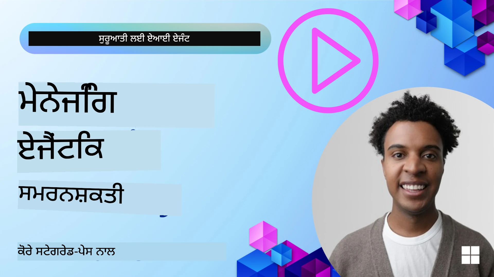

# ਐਆਈ ਏਜੰਟਾਂ ਲਈ ਮੈਮੋਰੀ  

ਐਆਈ ਏਜੰਟ ਬਣਾਉਣ ਦੇ ਵਿਲੱਖਣ ਫਾਇਦਿਆਂ ਬਾਰੇ ਗੱਲ ਕਰਦਿਆਂ, ਮੁੱਖ ਤੌਰ 'ਤੇ ਦੋ ਗੱਲਾਂ ਚਰਚਿਤ ਹੁੰਦੀਆਂ ਹਨ: ਕੰਮ ਪੂਰੇ ਕਰਨ ਲਈ ਸੰਦ ਬੁਲਾਉਣ ਦੀ ਸਮਰੱਥਾ ਅਤੇ ਸਮੇਂ ਨਾਲ ਬਿਹਤਰ ਹੋਣ ਦੀ ਯੋਗਤਾ। ਮੈਮੋਰੀ ਉਸ ਆਧਾਰ ਨੂੰ ਪ੍ਰਦਾਨ ਕਰਦੀ ਹੈ ਜੋ ਸਵੈ-ਸुधਾਰਕ ਏਜੰਟ ਬਣਾਉਂਦਾ ਹੈ ਜੋ ਸਾਡੇ ਉਪਭੋਗਤਾਵਾਂ ਲਈ ਬਿਹਤਰ ਅਨੁਭਵ ਬਣਾਉ ਸਕਦਾ ਹੈ।

ਇਸ ਪਾਠ ਵਿੱਚ, ਅਸੀਂ ਵੇਖਾਂਗੇ ਕਿ ਐਆਈ ਏਜੰਟਾਂ ਲਈ ਮੈਮੋਰੀ ਕੀ ਹੈ ਅਤੇ ਅਸੀਂ ਇਸ ਨੂੰ ਕਿਵੇਂ ਸੰਭਾਲ ਸਕਦੇ ਹਾਂ ਅਤੇ ਆਪਣੇ ਐਪਲੀਕੇਸ਼ਨਾਂ ਦੇ ਲਾਭ ਲਈ ਇਸਦਾ ਵਰਤੋਂ ਕਰ ਸਕਦੇ ਹਾਂ।

## ਪਰਿਚਯ

ਇਸ ਪਾਠ ਵਿੱਚ ਸਮਾਵੇਸ਼ ਹੋਵੇਗਾ:

• **ਐਆਈ ਏਜੰਟ ਮੈਮੋਰੀ ਨੂੰ ਸਮਝਣਾ**: ਮੈਮੋਰੀ ਕੀ ਹੈ ਅਤੇ ਇਹ ਏਜੰਟਾਂ ਲਈ ਕਿਉਂ ਜਰੂਰੀ ਹੈ।

• **ਮੈਮੋਰੀ ਦੀ ਕਾਰਜਨਵਾਈ ਅਤੇ ਸਟੋਰ ਕਰਨਾ**: ਆਪਣੇ ਐਆਈ ਏਜੰਟਾਂ ਵਿੱਚ ਮੈਮੋਰੀ ਦੀ ਖੂਬੀ ਲਾਉਣ ਦੇ ਵਿਹਾਰਕ ਤਰੀਕੇ, ਖਾਸ ਕਰਕੇ ਛੋਟੇ ਸਮੇਂ ਅਤੇ ਲੰਬੇ ਸਮੇਂ ਦੀ ਮੈਮੋਰੀ ਉੱਤੇ ਧਿਆਨ ਦੇਂਦੇ ਹੋਏ।

• **ਆਪਣੇ ਆਪ ਵਿੱਚ ਸੁਧਾਰ ਕਰਨ ਵਾਲੇ ਐਆਈ ਏਜੰਟ ਬਣਾਉਣਾ**: ਕਿਵੇਂ ਮੈਮੋਰੀ ਏਜੰਟਾਂ ਨੂੰ ਪਿਛਲੇ ਇੰਟਰੈਕਸ਼ਨਾਂ ਤੋਂ ਸਿੱਖਣ ਅਤੇ ਸਮੇਂ ਨਾਲ ਸੁਧਾਰ ਕਰਨ ਯੋਗ ਬਨਾਉਂਦੀ ਹੈ।

## ਉਪਲਬਧ ਕਾਰਜਾਂਵੀਆਂ

ਇਸ ਪਾਠ ਵਿੱਚ ਦੋ ਵਿਸ਼ਤ੍ਰਿਤ ਨੋਟਬੁੱਕ ਟਿਊਟੋਰਿਯਲ ਸ਼ਾਮਲ ਹਨ:

• **[13-agent-memory.ipynb](./13-agent-memory.ipynb)**: ਮੈਮੋਰੀ ਨੂੰ Mem0 ਅਤੇ ਐਜ਼ੂਰ ਏਆਈ ਸਰਚ ਨਾਲ Microsoft Agent Framework ਵਰਤਕੇ ਸੁੰਨੀ ਕਰਦਾ ਹੈ

• **[13-agent-memory-cognee.ipynb](./13-agent-memory-cognee.ipynb)**: Cognee ਵਰਤਕੇ ਸੰਰਚਿਤ ਮੈਮੋਰੀ ਬਣਾਉਂਦਾ ਹੈ, ਜੋ ਸਮਝਣ ਵਾਲੇ ਗ੍ਰਾਫ ਨੂੰ ਆਟੋਮੈਟਿਕ ਤੌਰ 'ਤੇ ਇਮਬੈਡਿੰਗ ਦੇ ਨਾਲ ਬਣਾਉਂਦਾ ਹੈ, ਗ੍ਰਾਫ ਨੂੰ ਵਿਜੂਲਾਈਜ਼ ਕਰਦਾ ਹੈ ਅਤੇ ਬੁੱਧੀਮਾਨ ਰੀਟਰੀਵਲ ਪ੍ਰਦਾਨ ਕਰਦਾ ਹੈ

## ਸਿੱਖਣ ਦੇ ਲਕਸ਼

ਇਸ ਪਾਠ ਨੂੰ ਪੂਰਾ ਕਰਨ ਤੋਂ ਬਾਦ, ਤੁਸੀਂ ਜਾਣੋਗੇ ਕਿ ਕਿਵੇਂ:

• **ਵੱਖ-ਵੱਖ ਕਿਸਮਾਂ ਦੀਆਂ ਐਆਈ ਏਜੰਟ ਮੈਮੋਰੀਆਂ ਵਿੱਚ ਅੰਤਰ ਕਰਨਾ**, ਜਿਸ ਵਿੱਚ ਵਰਕਿੰਗ, ਛੋਟੀ ਮਿਆਦ ਅਤੇ ਲੰਬੀ ਮਿਆਦ ਦੀ ਮੈਮੋਰੀ, ਨਾਲ ਹੀ ਵਿਸ਼ੇਸ਼ ਰੂਪਾਂ ਜਿਵੇਂ ਕਿ ਪਰਸੋਨਾ ਅਤੇ ਐਪਿਸੋਡਿਕ ਮੈਮੋਰੀ ਸ਼ਾਮਲ ਹਨ।

• **ਖਾਸ ਕਰਕੇ ਛੋਟੀ ਅਤੇ ਲੰਬੀ ਮਿਆਦ ਦੀ ਮੈਮੋਰੀ ਨੂੰ ਐਆਈ ਏਜੰਟਾਂ ਲਈ ਲਾਗੂ ਅਤੇ ਸੰਭਾਲਣਾ** Microsoft Agent Framework ਦੀ ਵਰਤੋਂ ਕਰਕੇ, Mem0, Cognee, ਵਾਈਟਬੋਰਡ ਮੈਮੋਰੀ ਵਰਗੇ ਸੰਦਾਂ ਨੂੰ ਵਰਤਦੇ ਹੋਏ ਅਤੇ Azure AI Search ਨਾਲ ਇੰਟੀਗਰੇਟ ਕਰਕੇ।

• **ਆਪਣੇ ਆਪ ਵਿੱਚ ਸੁਧਾਰ ਕਰਨ ਵਾਲੇ ਐਆਈ ਏਜੰਟਾਂ ਦੇ ਮੂਲ ਤੱਤਾਂ ਨੂੰ ਸਮਝਣਾ** ਅਤੇ ਕਿਵੇਂ ਮਜ਼ਬੂਤ ਮੈਮੋਰੀ ਪ੍ਰਬੰਧਨ ਪ੍ਰਣਾਲੀਆਂ ਲਗਾਤਾਰ ਸਿੱਖਣ ਅਤੇ ਅਨੁਕੂਲਣ ਵਿੱਚ ਯੋਗਦਾਨ ਪਾਉਂਦੀਆਂ ਹਨ।

## ਐਆਈ ਏਜੰਟ ਮੈਮੋਰੀ ਨੂੰ ਸਮਝਣਾ

ਮੂਲ ਰੂਪ ਵਿੱਚ, **ਐਆਈ ਏਜੰਟਾਂ ਲਈ ਮੈਮੋਰੀ ਉਨ੍ਹਾਂ ਵਿਧੀਆਂ ਨੂੰ ਕਹਿੰਦੀ ਹੈ ਜੋ ਉਨ੍ਹਾਂ ਨੂੰ ਜਾਣਕਾਰੀ ਨੂੰ ਸੰਭਾਲਣ ਅਤੇ ਯਾਦ ਕਰਨ ਦੀ ਆਗਿਆ ਦਿੰਦੀ ਹੈ**। ਇਹ ਜਾਣਕਾਰੀ ਕਿਸੇ ਗੱਲਬਾਤ ਬਾਰੇ ਖਾਸ ਵੇਰਵੇ, ਉਪਭੋਗਤਾ ਦੀ ਪਸੰਦ, ਪਿਛਲੇ ਕਾਰਜ ਜਾਂ ਸਿੱਖੇ ਹੋਏ ਪੈਟਰਨ ਹੋ ਸਕਦੇ ਹਨ।

ਮੈਮੋਰੀ ਦੇ ਬਿਨਾਂ, ਐਆਈ ਐਪਲੀਕੇਸ਼ਨਾਂ ਅਕਸਰ ਅਚਰੰਦ ਹਨ, ਜਿਸਦਾ ਅਰਥ ਹੈ ਕਿ ਹਰ ਇਕ ਇੰਟਰੈਕਸ਼ਨ ਨਾਲ ਨਵੀਂ ਸ਼ੁਰੂਆਤ ਹੁੰਦੀ ਹੈ। ਇਸ ਨਾਲ ਇਹ ਤਜ਼ਰਬਾ ਦੁਹਰਾਉਂਦਾ ਅਤੇ ਪਰੇਸ਼ਾਨੀਜਨਕ ਬਣ ਜਾਂਦਾ ਹੈ ਜਿੱਥੇ ਏਜੰਟ ਪਿਛਲੇ ਸੰਦਰਭ ਜਾਂ ਪਸੰਦਾਂ ਨੂੰ "ਭੁੱਲ ਜਾਂਦਾ" ਹੈ।

### ਮੈਮੋਰੀ ਕਿਉਂ ਜ਼ਰੂਰੀ ਹੈ?

ਏਜੰਟ ਦੀ ਬੁੱਧੀ ਉਸ ਦੀ ਪਿਛਲੀ ਜਾਣਕਾਰੀ ਨੂੰ ਯਾਦ ਕਰਨ ਅਤੇ ਵਰਤਣ ਦੀ ਸਮਰੱਥਾ ਨਾਲ ਗਹਿਰਾਈ ਨਾਲ ਜੁੜੀ ਹੈ। ਮੈਮੋਰੀ ਏਜੰਟਾਂ ਨੂੰ ਇਸ ਤਰ੍ਹਾਂ ਬਣਾਉਂਦੀ ਹੈ:

• **ਪ੍ਰਤੀਬਿੰਬੀ**: ਪਿਛਲੇ ਕਾਰਜਾਂ ਅਤੇ ਨਤੀਜਿਆਂ ਤੋਂ ਸਿੱਖਣਾ।

• **ਇੰਟਰਐਕਟਿਵ**: ਇੱਕ ਚੱਲ ਰਹੀ ਗੱਲਬਾਤ ਵਿੱਚ ਸੰਦਰਭ ਬਣਾਈ ਰੱਖਣਾ।

• **ਪੂਰਨਾਤਮਕ ਅਤੇ ਪ੍ਰਤੀਕਰਮਾਤਮਕ**: ਲੋੜਾਂ ਦੀ ਪੂਰਵ ਅਨੁਮਾਨ ਲਗਾਉਣਾ ਜਾਂ ਇਤਿਹਾਸਕ ਡੇਟਾ 'ਤੇ ਆਧਾਰਿਤ ਢੰਗ ਨਾਲ ਜਵਾਬ ਦੇਣਾ।

• **ਸਵੈ-ਨਿਰਭਰ**: ਸੰਭਾਲੀ ਹੋਈ ਜਾਣਕਾਰੀ ਤੋਂ ਅਧਾਰ ਲੈ ਕੇ ਜ਼ਿਆਦਾ ਸੁਤੰਤਰਤਾਪੂਰਵਕ ਕੰਮ ਕਰਨਾ।

ਮੈਮੋਰੀ ਲਾਗੂ ਕਰਨ ਦਾ ਉਦੇਸ਼ ਹੈ ਕਿ ਏਜੰਟਾਂ ਨੂੰ ਹੋਰ **ਭਰੋਸੇਮੰਦ ਅਤੇ ਯੋਗ** ਬਨਾਉਣਾ।

### ਮੈਮੋਰੀਆਂ ਦੀਆਂ ਕਿਸਮਾਂ

#### ਵਰਕਿੰਗ ਮੈਮੋਰੀ

ਇਸਨੂੰ ਇੱਕ ਝਰੋਕੇ ਦੀ ਕਾਗਜ਼ ਸੀ ਪਹਚਾਣੋ ਜਿਸ 'ਤੇ ਏਜੰਟ ਇੱਕ ਲਗਾਤਾਰ, ਚੱਲ ਰਹੇ ਕੰਮ ਜਾਂ ਸੋਚ ਪ੍ਰਕਿਰਿਆ ਦੌਰਾਨ ਸੂਚਨਾ ਤੁਰੰਤ ਲਿਖਦਾ ਹੈ। ਇਹ ਅਗਲੇ ਕਦਮ ਦੀ ਗਣਨਾ ਲਈ ਜਰੂਰੀ ਜਾਣਕਾਰੀ ਰੱਖਦਾ ਹੈ।

ਐਆਈ ਏਜੰਟਾਂ ਲਈ, ਵਰਕਿੰਗ ਮੈਮੋਰੀ ਅਕਸਰ ਗੱਲਬਾਤ ਤੋਂ ਸਭ ਤੋਂ ਢੁਕਵੇਂ ਜਾਣਕਾਰੀ ਦਰਜ ਕਰਦੀ ਹੈ, ਭਾਵੇਂ ਪੂਰਾ ਚੈਟ ਇਤਿਹਾਸ ਲੰਮਾ ਜਾਂ ਛਾਂਟਿਆ ਹੋਇਆ ਹੋਵੇ। ਇਹ ਲੋੜੀਂਦੇ ਤੱਤ ਜਿਵੇਂ ਕਿ ਜ਼ਰੂਰਤਾਂ, ਪ੍ਰਸਤਾਵ, ਫੈਸਲੇ ਅਤੇ ਕਾਰਜ ਨਿਕਾਰ ਕਰਦਾ ਹੈ।

**ਵਰਕਿੰਗ ਮੈਮੋਰੀ ਉਦਾਹਰਨ**

ਇੱਕ ਯਾਤਰਾ ਬੁਕਿੰਗ ਏਜੰਟ ਵਿੱਚ, ਵਰਕਿੰਗ ਮੈਮੋਰੀ ਉਪਭੋਗਤਾ ਦੀ ਵਰਤਮਾਨ ਬੇਨਤੀ ਨੂੰ ਕੈਦ ਕਰ ਸਕਦੀ ਹੈ, ਜਿਵੇਂ "ਮੈਂ ਪੈਰਿਸ ਯਾਤਰਾ ਬੁੱਕ ਕਰਾਉਣਾ ਚਾਹੁੰਦਾ ਹਾਂ"। ਇਹ ਖਾਸ ਜ਼ਰੂਰਤ ਏਜੰਟ ਦੀ ਤੁਰੰਤ ਸੰਦਰਭ ਵਿੱਚ ਸੰਭਾਲੀ ਜਾਂਦੀ ਹੈ ਤਾਂ ਜੋ ਮੌਜੂਦਾ ਮੁਲਾਕਾਤ ਦੌਰਾਨ ਯੋਗ ਦਿਸ਼ਾ ਦਿੱਤੀ ਜਾ ਸਕੇ।

#### ਛੋਟੀ ਮਿਆਦ ਦੀ ਮੈਮੋਰੀ

ਇਹ ਮੈਮੋਰੀ ਇੱਕ ਹੀ ਗੱਲਬਾਤ ਜਾਂ ਸੈਸ਼ਨ ਦੇ ਦੌਰਾਨ ਜਾਣਕਾਰੀ ਨੂੰ ਰੱਖਦੀ ਹੈ। ਇਹ ਮੌਜੂਦਾ ਚੈਟ ਦਾ ਸੰਦਰਭ ਹੈ, ਜਿਸ ਨਾਲ ਏਜੰਟ ਪਿਛਲੇ ਮੁੜਵੱਖ ਦੌਰਾਂ ਨੂੰ ਯਾਦ ਕਰ ਸਕਦਾ ਹੈ।

[Microsoft Agent Framework](https://github.com/microsoft/agent-framework) ਦੇ Python SDK ਸੈਂਪਲਾਂ ਵਿੱਚ, ਇਹ `AgentSession` ਨਾਲ ਨਕਸ਼ਾਬੰਦੀ ਹੁੰਦੀ ਹੈ, ਜੋ `agent.create_session()` ਨਾਲ ਬਣਾਈ ਜਾਂਦੀ ਹੈ। ਸੈਸ਼ਨ ਫ੍ਰੇਮਵਰਕ ਦੀ ਬਿਲਟ-ਇਨ ਛੋਟੀ ਮਿਆਦ ਦੀ ਮੈਮੋਰੀ ਹੈ: ਇਹ ਗੱਲਬਾਤ ਸੰਦਰਭ ਨੂੰ ਇਸੇ ਸੈਸ਼ਨ ਦੇ ਰੀਯੂਜ਼ ਹੋਣ ਦੌਰਾਨ ਮਿਲਦਾ ਹੈ, ਪਰ ਜਦ ਸੈਸ਼ਨ ਖਤਮ ਹੋ ਜਾਂਦਾ ਹੈ ਜਾਂ ਐਪਲੀਕੇਸ਼ਨ ਰੀਸਟਾਰਟ ਹੁੰਦੀ ਹੈ ਤਾਂ ਇਹ ਸੰਦਰਭ ਟਿਕਦਾ ਨਹੀਂ। ਵੱਡੀ ਮਿਆਦ ਦੀ ਮੈਮੋਰੀ ਨੂੰ ਉਹਨਾਂ ਤੱਥਾਂ ਅਤੇ ਪਸੰਦਾਂ ਲਈ ਵਰਤਿਆ ਜਾਂਦਾ ਹੈ ਜੋ ਸੈਸ਼ਨਾਂ ਤੋਂ ਪਰੇ ਸੁਰੱਖਿਅਤ ਰਹਿਣ, ਆਮ ਤੌਰ ਤੇ ਡੇਟਾਬੇਸ, ਵੇਕਟਰ ਇੰਡੈਕਸ ਜਾਂ ਕਿਸੇ ਹੋਰ ਸਥਾਈ ਸਟੋਰ ਰਾਹੀਂ।

**ਛੋਟੀ ਮਿਆਦ ਦੀ ਮੈਮੋਰੀ ਉਦਾਹਰਨ**

ਜੇ ਉਪਭੋਗਤਾ ਪੁੱਛਦਾ ਹੈ, "ਪੈਰਿਸ ਲਈ ਉਡਾਣ ਦੀ ਕੀਮਤ ਕਿੰਨੀ ਹੋਏਗੀ?" ਅਤੇ ਫਿਰ ਪੁੱਛਦਾ ਹੈ, "ਉਥੇ ਠਹਿਰਣ ਬਾਰੇ ਕੀ?" ਤਾਂ ਛੋਟੀ ਮਿਆਦ ਦੀ ਮੈਮੋਰੀ ਇਹ ਯਕੀਨੀ ਬਣਾਉਂਦੀ ਹੈ ਕਿ ਏਜੰਟ ਜਾਨਦਾ ਹੈ ਕਿ "ਉੱਥੇ" ਦਾ ਅਰਥ ਆਪਣੀ ਗੱਲਬਾਤ ਵਿਚ "ਪੈਰਿਸ" ਹੈ।

#### ਲੰਬੀ ਮਿਆਦ ਦੀ ਮੈਮੋਰੀ

ਇਹ ਜਾਣਕਾਰੀ ਕਈ ਗੱਲਬਾਤਾਂ ਜਾਂ ਸੈਸ਼ਨਾਂ ਵਿਚ ਪਾਇਦਾਰ ਰਹਿੰਦੀ ਹੈ। ਇਹ ਏਜੰਟਾਂ ਨੂੰ ਉਪਭੋਗਤਾ ਦੀਆਂ ਪਸੰਦਾਂ, ਇਤਿਹਾਸਕ ਸੰਪਰਕਾਂ ਜਾਂ ਆਮ ਗਿਆਨ ਲੰਬੇ ਸਮੇਂ ਨਾਲ ਯਾਦ ਕਰਨ ਦੇ ਯੋਗ ਬਣਾਉਂਦੀ ਹੈ। ਇਹ ਵਿਅਕਤੀਗਤ ਬਣਾਉਣ ਲਈ ਮਹੱਤਵਪੂਰਣ ਹੈ।

**ਲੰਬੀ ਮਿਆਦ ਦੀ ਮੈਮੋਰੀ ਉਦਾਹਰਨ**

ਇੱਕ ਲੰਬੀ ਮਿਆਦ ਦੀ ਮੈਮੋਰੀ ਇਸ ਗੱਲ ਨੂੰ ਸਟੋਰ ਕਰ ਸਕਦੀ ਹੈ ਕਿ "ਬੇਨ ਸਾਰਕੀ ਅਤੇ ਬਾਹਰੀ ਗਤੀਵਿਧੀਆਂ ਨੂੰ ਪਸੰਦ ਕਰਦਾ ਹੈ, ਉਨ੍ਹਾਂ ਨੂੰ ਪਹਾੜੀ ਦ੍ਰਿਸ਼ਟੀ ਨਾਲ ਕੌਫੀ ਪੀਣ ਪਸੰਦ ਹੈ ਅਤੇ ਪਿਛਲੀ ਸੱਟ ਕਾਰਨ ਉੱਚ ਕੋਟਰੀ ਸਕੀ ਪਟਾਂ ਨੂੰ ਛੱਡਦਾ ਹੈ"। ਇਹ ਜਾਣਕਾਰੀ, ਜੋ ਪਿਛਲੇ ਸੰਪਰਕਾਂ ਤੋਂ ਸਿੱਖੀ ਗਈ ਹੈ, ਭਵਿੱਖ ਦੀ ਯਾਤਰਾ ਯੋਜਨਾ ਸੈਸ਼ਨਾਂ ਦੌਰਾਨ ਸਿਫਾਰਸ਼ਾਂ ਨੂੰ ਬਹੁਤ ਜਿਆਦਾ ਵਿਅਕਤੀਗਤ ਪ੍ਰਭਾਵਿਤ ਕਰਦੀ ਹੈ।

#### ਪਰਸੋਨਾ ਮੈਮੋਰੀ

ਇਹ ਖਾਸ ਮੈਮੋਰੀ ਕਿਸਮ ਏਜੰਟ ਨੂੰ ਇੱਕ ਸਥਿਰ "ਵਿਅਕਤੀਗਤ ਸਲੂਕ" ਜਾਂ "ਪਰਸੋਨਾ" ਵਿਕਸਤ ਕਰਨ ਵਿਚ ਮਦਦ ਕਰਦੀ ਹੈ। ਇਹ ਏਜੰਟ ਨੂੰ ਆਪਣੀ ਜਾਂ ਆਪਣੀ ਨਿਯਤ ਭੂਮਿਕਾ ਬਾਰੇ ਜਾਣਕਾਰੀ ਯਾਦ ਰੱਖਣ ਦੀ ਆਗਿਆ ਦਿੰਦੀ ਹੈ, ਜਿਸ ਨਾਲ ਮੁਲਾਕਾਤਾਂ ਹੋਰ ਸਾਫ ਅਤੇ ਕੇਂਦਰਿਤ ਹੋ ਜਾਂਦੀਆਂ ਹਨ।

**ਪਰਸੋਨਾ ਮੈਮੋਰੀ ਉਦਾਹਰਨ**  
ਜੇ ਯਾਤਰਾ ਏਜੰਟ ਇੱਕ "ਮਾਹਿਰ ਸਕੀ ਯੋਜਨਾਕਾਰ" ਬਣਾਉਣ ਲਈ ਬਣਾਇਆ ਗਿਆ ਹੈ, ਤਾਂ ਪਰਸੋਨਾ ਮੈਮੋਰੀ ਇਸ ਭੂਮਿਕਾ ਨੂੰ ਮਜ਼ਬੂਤ ਕਰ ਸਕਦੀ ਹੈ, ਜੋ ਉਸਦੇ ਜਵਾਬਾਂ ਨੂੰ ਮਾਹਿਰ ਦੀ ਟੋਨ ਅਤੇ ਗਿਆਨ ਦੇ ਅਨੁਕੂਲ ਕਰਦੀ ਹੈ।

#### ਵਰਕਫਲੋ/ਐਪਿਸੋਡੀਕ ਮੈਮੋਰੀ

ਇਹ ਮੈਮੋਰੀ ਇੱਕ ਜਟਿਲ ਕੰਮ ਦੌਰਾਨ ਏਜੰਟ ਦੁਆਰਾ ਲਏ ਗਏ ਕਦਮਾਂ ਦੇ ਅਨੁਕ੍ਰਮ ਨੂੰ ਸੰਭਾਲਦੀ ਹੈ, ਜਿਸ ਵਿੱਚ ਸਫਲਤਾਵਾਂ ਅਤੇ ਅਸਫਲਤਾਵਾਂ ਸ਼ਾਮਲ ਹਨ। ਇਹ ਕਿਸੇ ਖਾਸ "ਐਪਿਸੋਡ" ਜਾਂ ਪਿਛਲੇ ਤਜ਼ਰਬਿਆਂ ਨੂੰ ਯਾਦ ਕਰਨ ਵਾਂਗ ਹੈ ਤਾਂ ਜੋ ਉਨ੍ਹਾਂ ਤੋਂ ਸਿੱਖਿਆ ਜਾ ਸਕੇ।

**ਐਪਿਸੋਡੀਕ ਮੈਮੋਰੀ ਉਦਾਹਰਨ**

ਜੇ ਏਜੰਟ ਕਿਸੇ ਖਾਸ ਉਡਾਣ ਨੂੰ ਬੁੱਕ ਕਰਨ ਦੀ ਕੋਸ਼ਿਸ਼ ਕਰਦਾ ਹੈ ਪਰ ਅਣਉਪਲਬਧਤਾ ਕਾਰਨ ਅਸਫਲ ਰਹਿੰਦਾ ਹੈ, ਤਾਂ ਐਪਿਸੋਡੀਕ ਮੈਮੋਰੀ ਇਸ ਅਸਫਲਤਾ ਨੂੰ ਦਰਜ ਕਰ ਸਕਦੀ ਹੈ, ਜਿਸ ਨਾਲ ਏਜੰਟ ਬਾਅਦ ਵਿੱਚ ਵਿਕਲਪਕ ਉਡਾਣਾਂ ਦੀ ਕੋਸ਼ਿਸ਼ ਕਰ ਸਕਦਾ ਹੈ ਜਾਂ ਇਸ ਸਮੱਸਿਆ ਬਾਰੇ ਜਿਆਦਾ ਸੂਚਿਤ ਤਰੀਕੇ ਨਾਲ ਉਪਭੋਗਤਾ ਨੂੰ ਜਾਣੂ ਕਰਾ ਸਕਦਾ ਹੈ।

#### ਐਂਟਿਟੀ ਮੈਮੋਰੀ

ਇਹ ਗੱਲਬਾਤਾਂ ਵਿਚੋਂ ਖਾਸ ਐਂਟਿਟੀਆਂ (ਜਿਵੇਂ ਲੋਕ, ਥਾਵਾਂ ਜਾਂ ਚੀਜ਼ਾਂ) ਅਤੇ ਘਟਨਾਵਾਂ ਨੂੰ ਕੱਢਣ ਅਤੇ ਯਾਦ ਕਰਨ ਨਾਲ ਸੰਬੰਧਿਤ ਹੈ। ਇਹ ਏਜੰਟ ਨੂੰ ਗੱਲਬਾਤ ਚਰਚਿਤ ਮੁੱਢਲੀ ਤੱਤਾਂ ਦਾ ਸੰਰਚਿਤ ਸਮਝ ਬਣਾਉਣ ਯੋਗ ਬਣਾਉਂਦਾ ਹੈ।

**ਐਂਟਿਟੀ ਮੈਮੋਰੀ ਉਦਾਹਰਨ**

ਪਿਛਲੀ ਯਾਤਰਾ ਬਾਰੇ ਗੱਲਬਾਤ ਵਿਚੋਂ, ਏਜੰਟ "ਪੈਰਿਸ", "ਐਫਿਲ ਟਾਵਰ" ਅਤੇ "ਲੇ ਸ਼ੈਟ ਨੁਆਰ ਰੈਸਟੋਰੈਂਟ ਵਿੱਚ ਡਿਨਰ" ਨੂੰ ਐਂਟਿਟੀਆਂ ਵਜੋਂ ਕੱਢ ਸਕਦਾ ਹੈ। ਅਗਲੀ ਮੁਲਾਕਾਤ ਵਿੱਚ, ਏਜੰਟ "ਲੇ ਸ਼ੈਟ ਨੁਆਰ" ਨੂੰ ਯਾਦ ਕਰਕੇ ਉੱਥੇ ਨਵਾਂ ਰਿਜ਼ਰਵੇਸ਼ਨ ਕਰਵਾਉਣ ਦੀ ਪੇਸ਼ਕਸ਼ ਕਰ ਸਕਦਾ ਹੈ।

#### ਸੰਰਚਿਤ RAG (ਰੀਟਰੀਵਲ ਆਗਮੈਂਟਡ ਜੇਨੇਰੇਸ਼ਨ)

ਜਦੋਂ ਕਿ RAG ਇੱਕ ਵਿਆਪਕ ਤਕਨੀਕ ਹੈ, "ਸੰਰਚਿਤ RAG" ਇੱਕ ਸ਼ਕਤੀਸ਼ਾਲੀ ਮੈਮੋਰੀ ਤਕਨਾਲੋਜੀ ਵਜੋਂ ਉਭਰਦੀ ਹੈ। ਇਹ ਵੱਖ-ਵੱਖ ਸਰੋਤਾਂ (ਗੱਲਬਾਤਾਂ, ਈਮੇਲਾਂ, ਚਿੱਤਰਾਂ) ਵਿੱਚੋਂ ਘਣੀ, ਸੰਰਚਿਤ ਜਾਣਕਾਰੀ ਕੱਢਦੀ ਹੈ ਅਤੇ ਪ੍ਰਤੀਉਤਰਾਂ ਵਿੱਚ ਸੁਚਿੱਤਾ, ਯਾਦ ਅਤੇ ਗਤੀ ਵਿੱਚ ਸੁਧਾਰ ਕਰਦੀ ਹੈ। ਕਲਾਸਿਕ RAG ਭਾਵੇਂ ਸਿਰਫ਼ ਸੈਮਾਂਟਿਕ ਸਮਾਨਤਾ 'ਤੇ ਆਧਾਰਿਤ ਹੁੰਦਾ ਹੈ, ਸੰਰਚਿਤ RAG ਜਾਣਕਾਰੀ ਦੀ ਮੂਲ ਸੰਰਚਨਾ ਦਾ ਭੀ ਖਿਆਲ ਰੱਖਦਾ ਹੈ।

**ਸੰਰਚਿਤ RAG ਉਦਾਹਰਨ**

ਸਿਰਫ਼ ਕੁੰਜੀ-ਸ਼ਬਦਾਂ ਦਾ ਮੇਲ ਖਾਣ ਦੀ ਬਜਾਏ, ਸੰਰਚਿਤ RAG ਇੱਕ ਈਮੇਲ ਵਿੱਚੋਂ ਉਡਾਣ ਦੇ ਵੇਰਵੇ (ਮੰਜਿਲ, ਮਿਤੀ, ਸਮਾਂ, ਏਅਰਲਾਈਨ) ਨਿਕਾਲ ਸਕਦਾ ਹੈ ਅਤੇ ਉਨ੍ਹਾਂ ਨੂੰ ਸੰਰਚਿਤ ਤਰੀਕੇ ਨਾਲ ਸਟੋਰ ਕਰ ਸਕਦਾ ਹੈ। ਇਹ ਸਟ੍ਰੱਕਚਰਡ ਸੰਭਾਲ "ਮੈਂ ਸੋਮਵਾਰ ਨੂੰ ਪੈਰਿਸ ਲਈ ਕਿਹੜੀ ਉਡਾਣ ਬੁੱਕ ਕਰਵਾਈ?" ਵਰਗੇ ਬਿਲਕੁਲ ਸਹੀ ਪ੍ਰਸ਼ਨਾਂ ਦੀ ਆਗਿਆ ਦਿੰਦਾ ਹੈ।

## ਮੈਮੋਰੀ ਲਾਗੂ ਅਤੇ ਸਟੋਰ ਕਰਨਾ

ਐਆਈ ਏਜੰਟਾਂ ਲਈ ਮੈਮੋਰੀ ਲਾਗੂ ਕਰਨ ਦਾ ਪ੍ਰਕਿਰਿਆ ਇੱਕ ਵਿਵਸਥਿਤ ਪ੍ਰਕਿਰਿਆ ਹੈ ਜਿਸਨੂੰ **ਮੈਮੋਰੀ ਪ੍ਰਬੰਧਨ** ਕਹਿੰਦੇ ਹਨ, ਜਿਸ ਵਿੱਚ ਮੈਮੋਰੀ ਉਤਪੰਨ ਕਰਨ, ਸਟੋਰ ਕਰਨ, ਪ੍ਰਾਪਤ ਕਰਨ, ਇੱਕੀਕ੍ਰਿਤ ਕਰਨ, ਅਪਡੇਟ ਕਰਨ ਅਤੇ ਇੱਥੋਂ ਤੱਕ ਕਿ "ਭੁੱਲਣ" (ਜਾਂ ਮਿਟਾਉਣ) ਦੀ ਵੀ ਸ਼ਾਮਲ ਹੈ। ਪ੍ਰਾਪਤੀ ਇਸ ਪ੍ਰਕਿਰਿਆ ਦਾ ਇਕ ਵਖਰੀ ਤੱਤ ਹੈ।

### ਖਾਸ ਮੈਮੋਰੀ ਸੰਦ

#### Mem0

ਏਜੰਟ ਦੀ ਮੈਮੋਰੀ ਸਟੋਰ ਅਤੇ ਸੰਭਾਲਣ ਦਾ ਇੱਕ ਤਰੀਕਾ Mem0 ਵਰਗੇ ਖਾਸ ਸੰਦਾਂ ਦੀ ਵਰਤੋਂ ਕਰਨਾ ਹੈ। Mem0 ਇੱਕ ਸਥਾਈ ਮੈਮੋਰੀ ਲੇਅਰ ਵਜੋਂ ਕੰਮ ਕਰਦਾ ਹੈ, ਜੋ ਏਜੰਟਾਂ ਨੂੰ ਸੰਬੰਧਿਤ ਸੰਪਰਕ ਯਾਦ ਕਰਨ, ਉਪਭੋਗਤਾ ਦੀਆਂ ਪਸੰਦਾਂ ਅਤੇ ਤੱਥਾਂ ਨੂੰ ਸਟੋਰ ਕਰਨ, ਅਤੇ ਸਫਲਤਾ ਅਤੇ ਅਸਫਲਤਾਵਾਂ ਤੋਂ ਸਿੱਖਣ ਦੀ ਆਗਿਆ ਦਿੰਦਾ ਹੈ। ਇਸ ਦਾ ਮਕਸਦ ਹੈ ਕਿ ਅਚਰੰਦ ਏਜੰਟ ਸਥਾਈ ਏਜੰਟਾਂ ਵਿੱਚ ਬਦਲ ਜਾਂ।

ਇਹ ਇੱਕ **ਦੋ-ਪੜਾਅ ਮੈਮੋਰੀ ਪਾਈਪਲਾਈਨ: ਅਖ਼ਤਿਆਰ ਕਰਨਾ ਅਤੇ ਅਪਡੇਟ ਕਰਨਾ** ਰਾਹੀਂ ਕੰਮ ਕਰਦਾ ਹੈ। ਪਹਿਲਾਂ, ਏਜੰਟ ਦੀ ਥ੍ਰੈੱਡ ਵਿੱਚ ਮੈਸੇਜ Mem0 ਸਰਵਿਸ ਨੂੰ ਭੇਜੇ ਜਾਂਦੇ ਹਨ, ਜੋ ਇੱਕ ਵੱਡੇ ਭਾਸ਼ਾ ਮਾਡਲ (LLM) ਦਾ ਵਰਤੋਂ ਕਰਕੇ ਗੱਲਬਾਤ ਇਤਿਹਾਸ ਦਾ ਸੰਖੇਪ ਬਣਾਉਂਦਾ ਹੈ ਅਤੇ ਨਵੀਂ ਮੈਮੋਰੀਆਂ ਕੱਢਦਾ ਹੈ। ਬਾਅਦ ਵਿੱਚ, ਇੱਕ LLM-ਚਲਿਤ ਅਪਡੇਟ ਪੜਾਅ ਫੈਸਲਾ ਕਰਦਾ ਹੈ ਕਿ ਇਹਨਾਂ ਮੈਮੋਰੀਆਂ ਨੂੰ ਜੋੜਨਾ, ਬਦਲਣਾ ਜਾਂ ਹਟਾਉਣਾ ਹੈ, ਅਤੇ ਇਹਨਾਂ ਨੂੰ ਇੱਕ ਹਾਈਬ੍ਰਿਡ ਡੇਟਾ ਸਟੋਰ ਵਿੱਚ ਸੰਭਾਲਦਾ ਹੈ ਜਿਸ ਵਿੱਚ ਵੇਕਟਰ, ਗ੍ਰਾਫ, ਅਤੇ ਕੀ-ਵੈਲ੍ਯੂ ਡੇਟਾਬੇਸ ਸ਼ਾਮਲ ਹੋ ਸਕਦੇ ਹਨ। ਇਹ ਪ੍ਰਣਾਲੀ ਵੱਖ-ਵੱਖ ਮੈਮੋਰੀਆਂ ਦੀ ਵਰਤੋਂ ਨੂੰ ਸਹਾਇਤਾ ਦਿੰਦੀ ਹੈ ਅਤੇ ਸੰਬੰਧਤ ਡੇਟੇ ਦੇ ਸੰਬੰਧਾਂ ਨੂੰ ਪ੍ਰਬੰਧਿਤ ਕਰਨ ਲਈ ਗ੍ਰਾਫ ਮੈਮੋਰੀ ਨੂੰ ਸ਼ਾਮਲ ਕਰ ਸਕਦੀ ਹੈ।

#### Cognee

ਇਕ ਹੋਰ ਸ਼ਕਤੀਸ਼ਾਲੀ ਤਰੀਕਾ **Cognee** ਦੀ ਵਰਤੋਂ ਹੈ, ਜੋ ਇੱਕ ਖੁੱਲਾ ਸਰੋਤ ਸੈਮੈਂਟਿਕ ਮੈਮੋਰੀ ਹੈ ਜੋ ਐਆਈ ਏਜੰਟਾਂ ਲਈ ਸੰਰਚਿਤ ਅਤੇ ਅਸੰਰਚਿਤ ਡੇਟਾ ਨੂੰ ਪੁੱਛ-ਪੜਤਾਲ ਯੋਗ ਗਿਆਨ ਗ੍ਰਾਫਾਂ ਵਿੱਚ ਬਦਲਦਾ ਹੈ, ਜੋ ਇਮਬੈਡਿੰਗ ਨਾਲ ਸਹਿਯੋਗੀ ਹੁੰਦੇ ਹਨ। Cognee ਇੱਕ **ਡੁਅਲ-ਸਟੋਰ ਸਰੰਜਾਮ** ਪ੍ਰਦਾਨ ਕਰਦਾ ਹੈ ਜੋ ਵੇਕਟਰ ਸਮਾਨਤਾ ਖੋਜ ਨੂੰ ਗ੍ਰਾਫ ਰਿਸ਼ਤੇਦਾਰੀਆਂ ਨਾਲ ਜੋੜਦਾ ਹੈ, ਜਿਸ ਨਾਲ ਏਜੰਟਾਂ ਨੂੰ ਸਿਰਫ ਜਾਣਕਾਰੀ ਦੀ ਸਮਾਨਤਾ ਨੂੰ ਹੀ ਨਹੀਂ, ਸਗੋਂ ਸੰਕਲਪਾਂ ਦਾ ਕਿਸ ਤਰ੍ਹਾਂ ਤੁਲਨਾਤਮਕ ਸਬੰਧ ਹੈ, ਨੂੰ ਸਮਝਣ ਦਿੰਦਾ ਹੈ।

ਇਹ **ਹਾਈਬ੍ਰਿਡ ਰੀਟਰੀਵਲ** ਵਿੱਚ ਮਹіਰ ਹੈ ਜੋ ਵੇਕਟਰ ਸਮਾਨਤਾ, ਗ੍ਰਾਫ ਸੰਰਚਨਾ ਅਤੇ LLM ਤਰਕ ਨੂੰ ਮਿਲਾਉਂਦਾ ਹੈ - ਸਿਧੀ ਚੁੰਨੀਂ ਤੋਂ ਗ੍ਰਾਫ-ਜਾਣਕਾਰ ਪ੍ਰਸ਼ਨ ਉੱਤਰ ਤੱਕ। ਪ੍ਰਣਾਲੀ **ਜੀਵੰਤ ਮੈਮੋਰੀ** ਦਾ ਸੰਰੱਖਣ ਕਰਦੀ ਹੈ ਜੋ ਵਿਕਸਿਤ ਅਤੇ ਵਧਦੀ ਹੈ, ਅਤੇ ਇੱਕ ਜੋੜੇ ਹੋਏ ਗ੍ਰਾਫ ਵਜੋਂ ਪੁੱਛ-ਪੜਤਾਲ ਯੋਗ ਬਣੀ ਰਹਿੰਦੀ ਹੈ, ਛੋਟੀ ਮਿਆਦ ਦੀ ਸੈਸ਼ਨ ਸੰਦਰਭ ਅਤੇ ਲੰਬੀ ਮਿਆਦ ਦੀ ਸਥਾਈ ਮੈਮੋਰੀ ਦੋਹਾਂ ਲਈ ਸਹਾਇਕ।

Cognee ਨੋਟਬੁੱਕ ਟਿਊਟੋਰਿਯਲ ([13-agent-memory-cognee.ipynb](./13-agent-memory-cognee.ipynb)) ਇਸ ਇਕੱਠੀ ਮੈਮੋਰੀ ਲੇਅਰ ਨੂੰ ਬਣਾਉਣਾ ਦਿਖਾਉਂਦਾ ਹੈ, ਵੱਖ-ਵੱਖ ਡੇਟਾ ਸਰੋਤਾਂ ਨੂੰ ਸ਼ਾਮਲ ਕਰਨ, ਗਿਆਨ ਗ੍ਰਾਫ ਨੂੰ ਵਿਜੂਲਾਈਜ਼ ਕਰਨ ਅਤੇ ਵੱਖ-ਵੱਖ ਖੋਜ ਪਧਤੀਆਂ ਨਾਲ ਏਜੰਟ ਦੀਆਂ ਸਪੇਸ਼ਲ ਜ਼ਰੂਰਤਾਂ ਲਈ ਪੁੱਛ-ਪੜਤਾਲ ਕਰਨ ਦੀਆਂ ਵਿਹਾਰਿਕ ਉਦਾਹਰਨਾਂ ਦੇ ਨਾਲ।

### RAG ਨਾਲ ਮੈਮੋਰੀ ਸਟੋਰ ਕਰਨਾ

Mem0 ਵਰਗੇ ਖਾਸ ਮੈਮੋਰੀ ਸੰਦਾਂ ਤੋਂ ਇਲਾਵਾ, ਤੁਸੀਂ ਇੱਕ ਮਜ਼ਬੂਤ ਖੋਜ ਸੇਵਾ ਵਰਗੇ **Azure AI Search ਨੂੰ ਮੈਮੋਰੀਆਂ ਨੂੰ ਸਟੋਰ ਕਰਨ ਅਤੇ ਪ੍ਰਾਪਤ ਕਰਨ ਦੇ ਬੈਕਇੰਡ ਵਜੋਂ ਵਰਤ ਸਕਦੇ ਹੋ**, ਖਾਸ ਕਰਕੇ ਸੰਰਚਿਤ RAG ਲਈ।

ਇਸ ਨਾਲ ਤੁਸੀਂ ਆਪਣੇ ਏਜੰਟ ਦੇ ਜਵਾਬਾਂ ਨੂੰ ਆਪਣੇ ਡੇਟਾ ਨਾਲ ਮੂਸਰ ਕਰ ਸਕਦੇ ਹੋ, ਜੋ ਜ਼ਿਆਦਾ ਸੰਬੰਧਿਤ ਅਤੇ ਸਹੀ ਉੱਤਰ ਯਕੀਨੀ ਬਣਾਉਂਦਾ ਹੈ। Azure AI Search **ਸੰਰਚਿਤ RAG** ਵਰਗੀਆਂ ਸਮਰੱਥਾਵਾਂ ਨੂੰ ਸਹਾਇਤਾ ਦਿੰਦਾ ਹੈ, ਜੋ ਵੱਡੇ ਡੇਟਾਸੇਟਾਂ ਤੋਂ ਘਣੀ, ਸੰਰਚਿਤ ਜਾਣਕਾਰੀ ਕੱਢਣ ਅਤੇ ਪ੍ਰਾਪਤ ਕਰਨ ਵਿੱਚ ਮਹਾਰਤ ਰੱਖਦਾ ਹੈ, ਜਿਵੇਂ ਗੱਲਬਾਤ ਇਤਿਹਾਸ, ਈਮੇਲ ਜਾਂ ਚਿੱਤਰ। ਇਹ ਰਵਾਇਤੀ ਟੈਕਸਟ ਚੰਕਿੰਗ ਅਤੇ ਇਮਬੈਡਿੰਗ ਤਕਨੀਕਾਂ ਨਾਲੋਂ ਕਾਫ਼ੀ ਇਹਦਾਰ ਅਤੇ ਤੇਜ਼ ਹੈ।

## ਐਆਈ ਏਜੰਟਾਂ ਨੂੰ ਸਵੈ-ਸੁਧਾਰ ਕਰਨ ਵਾਲੇ ਬਣਾਉਣਾ

ਆਪਣੇ ਆਪ ਨੂੰ ਸੁਧਾਰ ਕਰਨ ਵਾਲੇ ਏਜੰਟਾਂ ਦਾ ਇੱਕ ਆਮ ਨਮੂਨਾ ਇੱਕ **" ਗਿਆਨ ਏਜੰਟ "** ਨੂੰ ਸ਼ਾਮਲ ਕਰਨਾ ਹੁੰਦਾ ਹੈ। ਇਹ ਅਲਗ ਏਜੰਟ ਮੁੱਖ ਗੱਲਬਾਤ ਨੂੰ ਨਜ਼ਰ ਵਿੱਚ ਰੱਖਦਾ ਹੈ ਜੋ ਉਪਭੋਗਤਾ ਅਤੇ ਪ੍ਰਮੁੱਖ ਏਜੰਟ ਵਿਚਕਾਰ ਹੁੰਦੀ ਹੈ। ਇਸਦਾ ਕੰਮ ਹੈ:

1. **ਮੁੱਲਵਾਨ ਜਾਣਕਾਰੀ ਚਿਨ੍ਹਾਂਨਾ**: ਯਕੀਨ ਕਰਨ ਲਈ ਕਿ ਕੀ ਗੱਲਬਾਤ ਦਾ ਕੋਈ ਹਿੱਸਾ ਸਧਾਰਨ ਗਿਆਨ ਜਾਂ ਖਾਸ ਉਪਭੋਗਤਾ ਦੀ ਪਸੰਦ ਵਜੋਂ ਸੰਭਾਲਯੋਗ ਹੈ।

2. **ਕੱਢਾਈ ਅਤੇ ਸੰਖੇਪ ਬਣਾਉਣਾ**: ਗੱਲਬਾਤ ਵਿੱਚੋਂ ਮੁੱਖ ਸਿੱਖਿਆ ਜਾਂ ਪਸੰਦ ਨਿਕਾਲਣਾ।

3. **ਗਿਆਨ ਬੇਸ ਵਿੱਚ ਸਟੋਰ ਕਰਨਾ**: ਇਹਨਾਂ ਨਿਕਾਲੀਆਂ ਟਿੱਪਣੀਆਂ ਨੂੰ ਇੱਕ ਵੇਕਟਰ ਡੇਟਾਬੇਸ ਆਦਿ ਵਿੱਚ ਸਥਾਈ ਬਣਾਉਣਾ, ਤਾਂ ਜੋ ਬਾਅਦ ਵਿੱਚ ਪ੍ਰਾਪਤ ਕੀਤੀਆਂ ਜਾ ਸਕਣ।

4. **ਭਵਿੱਖੀ ਪੁੱਛ-ਪੜਤਾਲਾਂ ਨੂੰ ਵਧਾਉਣਾ**: ਜਦੋਂ ਉਪਭੋਗਤਾ ਨਵਾਂ ਪ੍ਰਸ਼ਨ ਪੇਸ਼ ਕਰਦਾ ਹੈ, ਤਾਂ ਇਹ ਗਿਆਨ ਏਜੰਟ ਸਬੰਧਤ ਸਟੋਰ ਕੀਤੀ ਜਾਣਕਾਰੀ ਪ੍ਰਾਪਤ ਕਰਕੇ ਯੂਜ਼ਰ ਦੇ ਪ੍ਰਾਂਪਟ ਨਾਲ ਜੋੜਦਾ ਹੈ, ਜਿਸ ਨਾਲ ਪ੍ਰਮੁੱਖ ਏਜੰਟ ਨੂੰ ਮੁੱਖ ਸੰਦਰਭ ਮਿਲਦਾ ਹੈ (RAG ਵਰਗਾ)।

### ਮੈਮੋਰੀ ਲਈ ਬਿਹਤਰੀਆਂ

• **ਲੈਟੈਂਸੀ ਪ੍ਰਬੰਧਨ**: ਉਪਭੋਗਤਾ ਇੰਟਰੈਕਸ਼ਨਾਂ ਨੂੰ ਲੈਟ ਨਹੀਂ ਕਰਨ ਲਈ, ਸ਼ੁਰੂਆਤ ਵਿੱਚ ਇੱਕ ਸਸਤਾ ਅਤੇ ਤੇਜ਼ ਮਾਡਲ ਵਰਤਿਆ ਜਾ ਸਕਦਾ ਹੈ ਜੋ ਜਲਦੀ ਨਿਰਣਯ ਕਰਦਾ ਹੈ ਕਿ ਕੀ ਜਾਣਕਾਰੀ ਸੰਭਾਲਣ ਜਾਂ ਪ੍ਰਾਪਤ ਕਰਨ ਯੋਗ ਹੈ, ਸਿਰਫ ਜ਼ਰੂਰਤ ਪੂਰੀ ਹੋਣ 'ਤੇ ਹੀ ਵੱਧ ਜਟਿੱਲ ਅਖ਼ਤਿਆਰ ਅਤੇ ਪ੍ਰਾਪਤੀ ਪ੍ਰਕਿਰਿਆ ਚਾਲੂ ਕਰਦਾ ਹੈ।

• **ਗਿਆਨ ਬੇਸ ਦੀ ਸੰਭਾਲ**: ਵੱਧ ਰਹੀ ਗਿਆਨ ਬੇਸ ਲਈ, ਘੱਟ ਵਰਤੇ ਜਾਣ ਵਾਲੀ ਜਾਣਕਾਰੀ ਨੂੰ "ਕੋਲਡ ਸਟੋਰੇਜ" ਵਿੱਚ ਖਸੇੜਿਆ ਜਾ ਸਕਦਾ ਹੈ ਤਾਂ ਜੋ ਲਾਗਤਾਂ ਸੰਭਾਲੀ ਜਾ ਸਕਣ।

## ਏਜੰਟ ਮੈਮੋਰੀ ਬਾਰੇ ਹੋਰ ਸਵਾਲ ਹਨ?

ਦੁਸਰੇ ਸਿੱਖਿਆਰਥੀਆਂ ਨਾਲ ਮਿਲਣ, ਦਫ਼ਤਰ ਘੰਟਿਆਂ ਵਿੱਚ ਸ਼ਾਮਿਲ ਹੋਣ ਅਤੇ ਆਪਣੀਆਂ ਐਆਈ ਏਜੰਟ ਸਬੰਧੀ ਪੁੱਛ-ਪੜਤਾਲਾਂ ਦੇ ਜਵਾਬ ਲੱਭਣ ਲਈ [Microsoft Foundry Discord](https://aka.ms/ai-agents/discord) ਵਿੱਚ ਸ਼ਾਮਲ ਹੋਵੋ।

---

<!-- CO-OP TRANSLATOR DISCLAIMER START -->
**ਅਸਵੀਕਾਰੋਪਣ**:
ਇਸ ਦਸਤਾਵੇਜ਼ ਦਾ ਅਨੁਵਾਦ ਏਆਈ ਅਨੁਵਾਦ ਸੇਵਾ [Co-op Translator](https://github.com/Azure/co-op-translator) ਦੀ ਵਰਤੋਂ ਕਰਕੇ ਕੀਤਾ ਗਿਆ ਹੈ। ਜਦੋਂ ਕਿ ਅਸੀਂ ਸਹੀਤਾਵਾਂ ਲਈ ਯਤਨਸ਼ੀਲ ਹਾਂ, ਕਿਰਪਾ ਕਰਕੇ ਧਿਆਨ ਰੱਖੋ ਕਿ ਸਵੈਚਾਲਿਤ ਅਨੁਵਾਦਾਂ ਵਿੱਚ ਗਲਤੀਆਂ ਜਾਂ ਅਸਮੱਤਿਆਵਾਂ ਹੋ ਸਕਦੀਆਂ ਹਨ। ਮੂਲ ਦਸਤਾਵੇਜ਼ ਆਪਣੀ ਮੂਲ ਭਾਸ਼ਾ ਵਿੱਚ ਅਧਿਕਾਰਕ ਸਰੋਤ ਮੰਨਿਆ ਜਾਣਾ ਚਾਹੀਦਾ ਹੈ। ਜਰੂਰੀ ਜਾਣਕਾਰੀ ਲਈ, ਪੇਸ਼ੇਵਰ ਮਨੁੱਖੀ ਅਨੁਵਾਦ ਦੀ ਸਿਫ਼ਾਰਸ਼ ਕੀਤੀ ਜਾਂਦੀ ਹੈ। ਅਸੀਂ ਇਸ ਅਨੁਵਾਦ ਦੇ ਉਪਯੋਗ ਤੋਂ ਪੈਦਾ ਹੋਣ ਵਾਲੀਆਂ ਕਿਸੇ ਵੀ ਗਲਤਫਹਿਮੀਆਂ ਜਾਂ ਗਲਤ ਵਿਆਖਿਆਵਾਂ ਲਈ ਜਵਾਬਦੇਹ ਨਹੀਂ ਹਾਂ।
<!-- CO-OP TRANSLATOR DISCLAIMER END -->