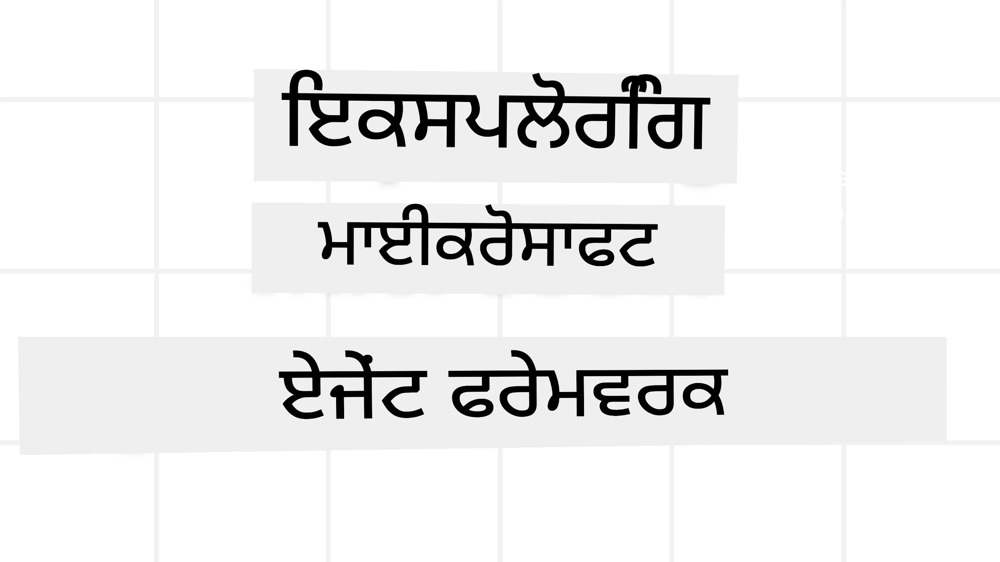
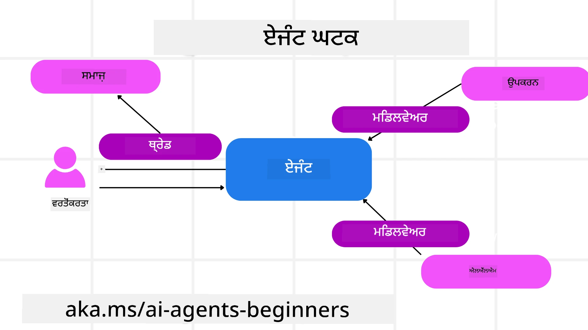

# ਮਾਈਕਰੋਸੌਫਟ ਏਜੰਟ ਫ੍ਰੇਮਵਰਕ ਦੀ ਖੋਜ



### ਪਰਿਚਯ

ਇਸ ਪਾਠ ਵਿੱਚ ਇਹ ਕੁਝ ਹਨ:

- ਮਾਈਕਰੋਸੌਫਟ ਏਜੰਟ ਫ੍ਰੇਮਵਰਕ ਦੀ ਸਮਝ: ਮੁੱਖ ਵਿਸ਼ੇਸ਼ਤਾਵਾਂ ਅਤੇ ਮੁੱਲ  
- ਮਾਈਕਰੋਸੌਫਟ ਏਜੰਟ ਫ੍ਰੇਮਵਰਕ ਦੇ ਮੁੱਖ ਧਾਰਣਾਵਾਂ ਦੀ ਖੋਜ
- ਉन्नਤ MAF ਨਮੂਨੇ: ਵਰਕਫ਼ਲੋਜ਼, ਮਿਡਲਵੇਅਰ, ਅਤੇ ਯਾਦداشت

## ਸਿੱਖਣ ਦੇ ਲੱਖੇ

ਇਸ ਪਾਠ ਨੂੰ ਪੂਰਾ ਕਰਨ ਤੋਂ ਬਾਅਦ, ਤੁਸੀਂ ਇਹ ਜਾਣੋਗੇ ਕਿ:

- ਮਾਈਕਰੋਸੌਫਟ ਏਜੰਟ ਫ੍ਰੇਮਵਰਕ ਦੀ ਵਰਤੋਂ ਕਰਕੇ ਉਤਪਾਦਨ ਯੋਗ AI ਏਜੰਟ ਬਣਾਏ ਜਾ ਸਕਦੇ ਹਨ
- ਮਾਈਕਰੋਸੌਫਟ ਏਜੰਟ ਫ੍ਰੇਮਵਰਕ ਦੀ ਮੁੱਖ ਵਿਸ਼ੇਸ਼ਤਾਵਾਂ ਨੂੰ ਆਪਣੇ ਏਜੰਟਿਕ ਵਰਤੋਂ ਕੇਸਾਂ ‘ਤੇ ਲਾਗੂ ਕਰਨਾ
- ਵਰਕਫ਼ਲੋਜ਼, ਮਿਡਲਵੇਅਰ, ਅਤੇ ਨਿਰੀਖਣ ਸਮੇਤ ਉन्नਤ ਨਮੂਨੇ ਵਰਤਣਾ

## ਕੋਡ ਦੇ ਨਮੂਨੇ

[Microsoft Agent Framework (MAF)](https://aka.ms/ai-agents-beginners/agent-framewrok) ਲਈ ਕੋਡ ਨਮੂਨੇ ਇਸ ਭੰਡਾਰ ਵਿੱਚ `xx-python-agent-framework` ਅਤੇ `xx-dotnet-agent-framework` ਫਾਇਲਾਂ ਹੇਠਾਂ ਮਿਲ ਸਕਦੇ ਹਨ।

## ਮਾਈਕਰੋਸੌਫਟ ਏਜੰਟ ਫ੍ਰੇਮਵਰਕ ਦੀ ਸਮਝ


[Microsoft Agent Framework (MAF)](https://aka.ms/ai-agents-beginners/agent-framewrok) ਮਾਈਕਰੋਸੌਫਟ ਲਈ AI ਏਜੰਟ ਬਣਾਉਣ ਦਾ ਸੰਗਠਿਤ ਫ੍ਰੇਮਵਰਕ ਹੈ। ਇਹ ਉਤਪਾਦਨ ਅਤੇ ਖੋਜ ਵਾਤਾਵਰਣਾਂ ਵਿੱਚ ਵੇਖੇ ਜਾਂਦੇ ਵੱਖ-ਵੱਖ ਏਜੰਟਿਕ ਵਰਤੋਂ ਕੇਸਾਂ ਨੂੰ ਹੈਂਡਲ ਕਰਨ ਲਈ ਲਚਕੀਲਾਪਣ ਮੁਹੱਈਆ ਕਰਦਾ ਹੈ, ਜਿਸ ਵਿੱਚ ਸ਼ਾਮਲ ਹਨ:

- **ਕ੍ਰਮਬੱਧ ਏਜੰਟ ਆਰਕੀਸਟ੍ਰੇਸ਼ਨ** ਜਿੱਥੇ ਕਦਮ-ਦਰ-ਕਦਮ ਵਰਕਫ਼ਲੋਜ਼ ਦੀ ਲੋੜ ਹੁੰਦੀ ਹੈ।
- **ਸਮਕਾਲੀ ਆਰਕੀਸਟ੍ਰੇਸ਼ਨ** ਜਿੱਥੇ ਏਜੰਟਾਂ ਨੂੰ ਇੱਕਸਾਤ ਕਾਰਜ ਪੂਰੇ ਕਰਨੇ ਹੁੰਦੇ ਹਨ।
- **ਗਰੁੱਪ ਚੈਟ ਆਰਕੀਸਟ੍ਰੇਸ਼ਨ** ਜਿੱਥੇ ਏਜੰਟ ਇੱਕ ਕੰਮ ਉੱਤੇ ਸਾਂਝੇ ਤੌਰ ‘ਤੇ ਸਹਿਯੋਗ ਕਰ ਸਕਦੇ ਹਨ।
- **ਹੈਂਡਆਫ਼ ਆਰਕੀਸਟ੍ਰੇਸ਼ਨ** ਜਿੱਥੇ ਜਦੋਂ ਉਪਕੰਮ ਮੁਕੰਮਲ ਹੁੰਦੇ ਹਨ ਤਾਂ ਏਜੰਟ ਕੰਮ ਇੱਕ ਦੂਜੇ ਨੂੰ ਸੌਂਪਦੇ ਹਨ।
- **ਮੈਗਨੈਟਿਕ ਆਰਕੀਸਟ੍ਰੇਸ਼ਨ** ਜਿੱਥੇ ਇੱਕ ਪਰਬੰਧਕ ਏਜੰਟ ਕੰਮ ਦੀ ਸੂਚੀ ਬਣਾਉਂਦਾ ਅਤੇ ਸੋਧਦਾ ਹੈ ਅਤੇ ਇਸ ਨੂੰ ਪੂਰਾ ਕਰਨ ਲਈ ਸਹਾਇਕ ਏਜੰਟਾਂ ਦੀ ਸੰਚਾਲਨਾ ਕਰਦਾ ਹੈ।

ਉਤਪਾਦਨ ਵਿੱਚ AI ਏਜੰਟ ਸੌਂਪਣ ਲਈ, MAF ਵਿੱਚ ਇਹ ਵਿਸ਼ੇਸ਼ਤਾਵਾਂ ਵੀ ਸ਼ਾਮਲ ਹਨ:

- **ਨਿਰੀਖਣਯੋਗਤਾ** OpenTelemetry ਦੇ ਉਪਯੋਗ ਨਾਲ, ਜਿੱਥੇ ਹਰ AI ਏਜੰਟ ਦੀ ਕਾਰਵਾਈ ਵਿੱਚ ਸੰਦ ਕਾਲ, ਆਰਕੀਸਟ੍ਰੇਸ਼ਨ ਕਦਮ, ਤਰਕ ਪ੍ਰਵਾਹ ਅਤੇ Microsoft Foundry ਡੈਸ਼ਬੋਰਡਾਂ ਰਾਹੀਂ ਪ੍ਰਦਰਸ਼ਨ ਨਿਗਰਾਨੀ ਸ਼ਾਮਲ ਹੁੰਦੀ ਹੈ।
- **ਸੁਰੱਖਿਆ** Microsoft Foundry ‘ਤੇ ਏਜੰਟ ਨੂੰ ਮੂਲ ਰੂਪ ਵਿੱਚ ਹੋਸਟ ਕਰਕੇ, ਜਿਸ ਵਿੱਚ ਭੂਮਿਕਾ-ਆਧਾਰਿਤ ਪੁੱਜ, ਨਿੱਜੀ ਡੇਟਾ ਸੰਭਾਲ ਅਤੇ ਨਿਰਮਿਤ ਸਮੱਗਰੀ ਸੁਰੱਖਿਆ ਜਿਹੇ ਨਿਯੰਤਰਣ ਸ਼ਾਮਲ ਹਨ।
- **ਟਿਕਾਊਪਣ** ਕਿਉਂਕਿ ਏਜੰਟ ਧਾਗੇ ਅਤੇ ਵਰਕਫਲੋਜ਼ ਰੁਕ, ਫਿਰ ਸ਼ੁਰੂ ਅਤੇ ਗਲਤੀਆਂ ਤੋਂ ਬਾਅਦ ਬਹਾਲ ਹੋ ਸਕਦੇ ਹਨ, ਜੋ ਲੰਬੇ ਸਮੇਂ ਚੱਲਣ ਵਾਲੀ ਪ੍ਰਕਿਰਿਆ ਨੂੰ ਯੋਗ ਬਣਾਉਂਦਾ ਹੈ।
- **ਨਿਯੰਤਰਣ** ਕਿਉਂਕਿ ਮਨੁੱਖੀ ਸਹਿਯੋਗ ਵਾਲੇ ਵਰਕਫਲੋਜ਼ ਨੂੰ ਸਮਰਥਨ ਮਿਲਦਾ ਹੈ ਜਿੱਥੇ ਕਾਰਜ ਮਨੁੱਖੀ ਮਨਜ਼ੂਰੀ ਦੀ ਲੋੜ ਵਜੋਂ ਚਿੰਹਿਤ ਕੀਤੀ ਜਾਂਦੀ ਹੈ।

ਮਾਈਕਰੋਸੌਫਟ ਏਜੰਟ ਫ੍ਰੇਮਵਰਕ ਅੰਤਰਕ੍ਰਿਆਸ਼ੀਲ ਹੋਣ ‘ਤੇ ਵੀ ਧਿਆਨ ਕੇਂਦ੍ਰਿਤ ਕਰਦਾ ਹੈ:

- **ਕਲਾਉਡ-ਅਗਨੋਸਟਿਕ ਹੋਣਾ** - ਏਜੰਟ ਕਂਟੇਨਰਾਂ ਵਿੱਚ, ਥਾਂ-ਥਾਂ ਤੇ ਅਤੇ ਵੱਖ-ਵੱਖ ਕਲਾਉਡਾਂ ‘ਤੇ ਚੱਲ ਸਕਦੇ ਹਨ।
- **ਪ੍ਰਦਾਤਾ-ਅਗਨੋਸਟਿਕ ਹੋਣਾ** - ਤੁਹਾਡੇ ਪ੍ਰਿਯ SDK ਜਿਵੇਂ Azure OpenAI ਅਤੇ OpenAI ਰਾਹੀਂ ਏਜੰਟ ਬਣਾਉਣਾ ਸੰਭਵ ਹੈ।
- **ਖੁੱਲੇ ਮਿਆਰਾਂ ਦਾ ਏਕੀਕਰਨ** - ਏਜੰਟ Agent-to-Agent(A2A) ਅਤੇ Model Context Protocol (MCP) ਵਰਗੇ ਪ੍ਰੋਟੋਕੋਲਾਂ ਦੀ ਵਰਤੋਂ ਕਰਕੇ ਹੋਰ ਏਜੰਟਾਂ ਅਤੇ ਸੰਦਾਂ ਨੂੰ ਖੋਜ ਅਤੇ ਵਰਤ ਸਕਦੇ ਹਨ।
- **ਪਲੱਗਇਨਸ ਅਤੇ ਕੁਨੈਕਟਰਜ਼** - Microsoft Fabric, SharePoint, Pinecone ਅਤੇ Qdrant ਵਰਗੇ ਡੇਟਾ ਅਤੇ ਯਾਦਦਾਸ਼ਤ ਸੇਵਾਵਾਂ ਨਾਲ ਕਨੈਕਸ਼ਨ ਬਣਾਏ ਜਾ ਸਕਦੇ ਹਨ।

ਆਓ ਵੇਖੀਏ ਕਿ ਇਹ ਵਿਸ਼ੇਸ਼ਤਾਵਾਂ ਮਾਈਕਰੋਸੌਫਟ ਏਜੰਟ ਫ੍ਰੇਮਵਰਕ ਦੇ ਕੁਝ ਮੁੱਖ ਧਾਰਣਾਵਾਂ ਵਿੱਚ ਕਿਵੇਂ ਲਾਗੂ ਹੁੰਦੀਆਂ ਹਨ।

## ਮਾਈਕਰੋਸੌਫਟ ਏਜੰਟ ਫ੍ਰੇਮਵਰਕ ਦੇ ਮੁੱਖ ਧਾਰਣਾਵਾਂ

### ਏਜੰਟ



**ਏਜੰਟ ਬਣਾਉਣਾ**

ਏਜੰਟ ਬਣਾਉਣਾ ਇੰਫਰੰਸ ਸਰਵਿਸ (LLM ਪ੍ਰਦਾਤਾ), AI ਏਜੰਟ ਵੱਲੋਂ ਅਨੁਸਰਣ ਲਈ ਹੁਕਮਾਂ ਦਾ ਸੈੱਟ, ਅਤੇ ਇੱਕ ਨਿਰਧਾਰਿਤ `name` ਦੁਆਰਾ ਕੀਤਾ ਜਾਂਦਾ ਹੈ:

```python
agent = AzureOpenAIChatClient(credential=AzureCliCredential()).create_agent( instructions="You are good at recommending trips to customers based on their preferences.", name="TripRecommender" )
```

ਉਪਰੋक्त `Azure OpenAI` ਦੀ ਵਰਤੋਂ ਹੋ ਰਹੀ ਹੈ ਪਰ ਏਜੰਟਾਂ ਨੂੰ ਕਈ ਤਰ੍ਹਾਂ ਦੀਆਂ ਸਰਵਿਸਜ਼ ਵਰਤ ਕੇ ਵੀ ਬਣਾਇਆ ਜਾ ਸਕਦਾ ਹੈ, ਜਿਵੇਂ `Microsoft Foundry Agent Service`:

```python
AzureAIAgentClient(async_credential=credential).create_agent( name="HelperAgent", instructions="You are a helpful assistant." ) as agent
```

OpenAI `Responses`, `ChatCompletion` APIs

```python
agent = OpenAIResponsesClient().create_agent( name="WeatherBot", instructions="You are a helpful weather assistant.", )
```

```python
agent = OpenAIChatClient().create_agent( name="HelpfulAssistant", instructions="You are a helpful assistant.", )
```

ਜਾਂ A2A ਪ੍ਰੋਟੋਕੋਲ ਰਾਹੀਂ ਰਿਮੋਟ ਏਜੰਟ:

```python
agent = A2AAgent( name=agent_card.name, description=agent_card.description, agent_card=agent_card, url="https://your-a2a-agent-host" )
```

**ਏਜੰਟ ਚਲਾਉਣਾ**

ਏਜੰਟ `.run` ਜਾਂ `.run_stream` ਮੈਥਡ ਦੀ ਵਰਤੋਂ ਕਰਕੇ ਨਾ-ਸਟ੍ਰੀਮਿੰਗ ਜਾਂ ਸਟ੍ਰੀਮਿੰਗ ਜਵਾਬ ਲਈ ਚਲਾਏ ਜਾਂਦੇ ਹਨ।

```python
result = await agent.run("What are good places to visit in Amsterdam?")
print(result.text)
```

```python
async for update in agent.run_stream("What are the good places to visit in Amsterdam?"):
    if update.text:
        print(update.text, end="", flush=True)

```

ਹਰ ਏਜੰਟ ਚਲਾਉਣ ਲਈ ਵਿਕਲਪ ਵੀ ਹੁੰਦੇ ਹਨ ਜਿਵੇਂ `max_tokens` ਜੋ ਏਜੰਟ ਵਰਤਦਾ ਹੈ, `tools` ਜਿਹੜੇ ਏਜੰਟ ਕਾਲ ਕਰ ਸਕਦਾ ਹੈ, ਅਤੇ ਖਾਸ ਕਰਕੇ `model` ਜੋ ਏਜੰਟ ਲਈ ਵਰਤਿਆ ਜਾਂਦਾ ਹੈ।

ਇਹ ਉਸ ਸਮੇਂ ਫਾਇਦੇਮੰਦ ਹੁੰਦਾ ਹੈ ਜਦੋ ਵਿਸ਼ੇਸ਼ ਮਾਡਲਾਂ ਜਾਂ ਸੰਦ ਚਾਹੀਦੇ ਹੋਣ ਵਰਤੋਂਕਾਰ ਦੇ ਕਾਰਜ ਨੂੰ ਪੂਰਾ ਕਰਨ ਲਈ।

**ਸੰਦ**

ਸੰਦ ਏਜੰਟ ਨੂੰ ਪਰਿਭਾਸ਼ਿਤ ਕਰਨ ਸਮੇਂ ਦੱਸੇ ਜਾ ਸਕਦੇ ਹਨ:

```python
def get_attractions( location: Annotated[str, Field(description="The location to get the top tourist attractions for")], ) -> str: """Get the top tourist attractions for a given location.""" return f"The top attractions for {location} are." 


# ਜਦੋਂ ਸਿੱਧਾ ਇੱਕ ChatAgent ਬਣਾਉਂਦੇ ਹੋ

agent = ChatAgent( chat_client=OpenAIChatClient(), instructions="You are a helpful assistant", tools=[get_attractions]

```

ਅਤੇ ਏਜੰਟ ਚਲਾਉਂਦੇ ਸਮੇਂ ਵੀ ਦੱਸੇ ਜਾ ਸਕਦੇ ਹਨ:

```python

result1 = await agent.run( "What's the best place to visit in Seattle?", tools=[get_attractions] # ਸਿਰਫ ਇਸ ਦੌੜ ਲਈ ਉਪਲਬਧ ਸਾਧਨ )
```

**ਏਜੰਟ ਧਾਗੇ**

ਏਜੰਟ ਧਾਗੇ ਬਹੁ-ਪੜਾਅ ਦੀਆਂ ਗੱਲਬਾਤਾਂ ਨੂੰ ਹੈਂਡਲ ਕਰਨ ਲਈ ਵਰਤੇ ਜਾਂਦੇ ਹਨ। ਧਾਗੇ ਬਣਾਏ ਜਾ ਸਕਦੇ ਹਨ:

- `get_new_thread()` ਦੀ ਵਰਤੋਂ ਕਰਕੇ ਜੋ ਵਕਤ ਦੇ ਨਾਲ ਧਾਗੇ ਨੂੰ ਸੁਰੱਖਿਅਤ ਕਰਦਾ ਹੈ
- ਓਟੋਮੈਟਿਕ ਧਾਗਾ ਬਣਾਉਣਾ ਜਦੋ ਏਜੰਟ ਚਲਾਇਆ ਜਾ ਰਿਹਾ ਹੋਵੇ ਅਤੇ ਇਹ ਧਾਗਾ ਸਿਰਫ ਅਜੇ ਦੇ ਚੱਲ ਰਹੇ ਰਨ ਦੌਰਾਨ ਮੌਜੂਦ ਰਹੇ।

ਧਾਗਾ ਬਣਾਉਣ ਲਈ ਕੋਡ ਇਸ ਪ੍ਰਕਾਰ ਹੈ:

```python
# ਇੱਕ ਨਵੀਂ ਧਾਗਾ ਬਣਾਓ।
thread = agent.get_new_thread() # ਧਾਗੇ ਨਾਲ ਏਜੰਟ ਨੂੰ ਚਲਾਓ।
response = await agent.run("Hello, I am here to help you book travel. Where would you like to go?", thread=thread)

```

ਤੁਸੀਂ ਫਿਰ ਧਾਗੇ ਨੂੰ ਸੀਰੀਅਲਾਈਜ਼ ਕਰ ਕੇ ਬਾਅਦ ਦੀ ਵਰਤੋਂ ਲਈ ਸਟੋਰ ਕਰ ਸਕਦੇ ਹੋ:

```python
# ਇੱਕ ਨਵੀਂ ਧਾਗਾ ਬਣਾਓ।
thread = agent.get_new_thread() 

# ਧਾਗੇ ਨਾਲ ਏਜੈਂਟ ਚਲਾਓ।

response = await agent.run("Hello, how are you?", thread=thread) 

# ਸਟੋਰੇਜ ਲਈ ਧਾਗਾ ਸਿਰੀਅਲਾਈਜ਼ ਕਰੋ।

serialized_thread = await thread.serialize() 

# ਸਟੋਰੇਜ ਤੋਂ ਲੋਡ ਕਰਨ ਤੋਂ ਬਾਅਦ ਧਾਗੇ ਦੀ ਹਾਲਤ ਡੀਸਿਰੀਅਲਾਈਜ਼ ਕਰੋ।

resumed_thread = await agent.deserialize_thread(serialized_thread)
```

**ਏਜੰਟ ਮਿਡਲਵੇਅਰ**

ਏਜੰਟ ਸੰਦਾਂ ਅਤੇ LLMs ਨਾਲ ਇੰਟਰੈਕਟ ਕਰਦੇ ਹਨ ਤਾਂ ਜੋ ਵਰਤੋਂਕਾਰ ਦੇ ਕਾਰਜ ਪੂਰੇ ਹੋ ਸਕਣ। ਕੁਝ ਸਥਿਤੀਆਂ ਵਿੱਚ, ਅਸੀਂ ਇਨ੍ਹਾਂ ਇੰਟਰੈਕਸ਼ਨਾਂ ਦੇ ਵਿਚਕਾਰ ਕੁਝ ਕਰਵਾਈ ਚਾਹੁੰਦੇ ਹਾਂ ਜਾਂ ਟ੍ਰੈਕ ਕਰਨੀ ਹੁੰਦੀ ਹੈ। ਏਜੰਟ ਮਿਡਲਵੇਅਰ ਸਾਡੇ ਲਈ ਇਹ ਸਮਭਵ ਬਣਾਉਂਦਾ ਹੈ:

*ਫੰਕਸ਼ਨ ਮਿਡਲਵੇਅਰ*

ਇਹ ਮਿਡਲਵੇਅਰ ਅਸੀਂ ਏਜੰਟ ਅਤੇ ਫੰਕਸ਼ਨ/ਸੰਦ ਦੇ ਵਿਚਕਾਰ ਕਿਸੇ ਕਾਰਵਾਈ ਨੂੰ ਚਲਾਉਣ ਦੀ ਆਗਿਆ ਦਿੰਦਾ ਹੈ। ਉਦਾਹਰਣ ਵਜੋਂ, ਜਦੋਂ ਤੁਸੀਂ ਫੰਕਸ਼ਨ ਕਾਲ ‘ਤੇ ਕੁਝ ਲੌਗਿੰਗ ਕਰਨਾ ਚਾਹੁੰਦੇ ਹੋ।

ਨਿਮਨਲਿਖਤ ਕੋਡ ਵਿੱਚ `next` ਦੱਸਦਾ ਹੈ ਕਿ ਅਗਲਾ ਮਿਡਲਵੇਅਰ ਯਾਂ ਅਸਲ ਫੰਕਸ਼ਨ ਨੂੰ ਕਾਲ ਕਰਨਾ ਚਾਹੀਦਾ ਹੈ।

```python
async def logging_function_middleware(
    context: FunctionInvocationContext,
    next: Callable[[FunctionInvocationContext], Awaitable[None]],
) -> None:
    """Function middleware that logs function execution."""
    # ਪ੍ਰੀ-ਪ੍ਰੋਸੈਸਿੰਗ: ਫ਼ੰਕਸ਼ਨ ਚਲਾਉਣ ਤੋਂ ਪਹਿਲਾਂ ਲਾਗ ਕਰੋ
    print(f"[Function] Calling {context.function.name}")

    # ਅਗਲੇ ਮਿਡਲਵੇਅਰ ਜਾਂ ਫੰਕਸ਼ਨ ਚਲਾਉਣ ਨੂੰ ਜਾਰੀ ਰੱਖੋ
    await next(context)

    # ਪੋਸਟ-ਪ੍ਰੋਸੈਸਿੰਗ: ਫ਼ੰਕਸ਼ਨ ਚਲਾਉਣ ਤੋਂ ਬਾਅਦ ਲਾਗ ਕਰੋ
    print(f"[Function] {context.function.name} completed")
```

*ਚੈਟ ਮਿਡਲਵੇਅਰ*

ਇਹ ਮਿਡਲਵੇਅਰ AI ਸੇਵਾ ਨੂੰ ਭੇਜੇ ਜਾ ਰਹੇ `messages` ਵਰਗੀਆਂ ਵਿਸ਼ੇਸ਼ ਜਾਣਕਾਰੀਆਂ ਸميت ਏਜੰਟ ਅਤੇ LLM ਵਿਕਤੀਆਂ ਵਿਚਕਾਰ ਕਾਰਵਾਈ ਜਾਂ ਲੋਗਿੰਗ ਦੀ ਆਗਿਆ ਦਿੰਦਾ ਹੈ।

```python
async def logging_chat_middleware(
    context: ChatContext,
    next: Callable[[ChatContext], Awaitable[None]],
) -> None:
    """Chat middleware that logs AI interactions."""
    # ਪ੍ਰੀ-ਪ੍ਰੋਸੈਸਿੰਗ: ਏਆਈ ਕਾਲ ਤੋਂ ਪਹਿਲਾਂ ਲੌਗ
    print(f"[Chat] Sending {len(context.messages)} messages to AI")

    # ਅਗਲੇ ਮਿਡਲਵੇਅਰ ਜਾਂ ਏਆਈ ਸੇਵਾ ਤੱਕ ਜਾਰੀ ਰੱਖੋ
    await next(context)

    # ਪੋਸਟ-ਪ੍ਰੋਸੈਸਿੰਗ: ਏਆਈ ਜਵਾਬ ਤੋਂ ਬਾਅਦ ਲੌਗ
    print("[Chat] AI response received")

```

**ਏਜੰਟ ਯਾਦਦਾਸ਼ਤ**

`Agentic Memory` ਪਾਠ ਵਿੱਚ ਜਿਵੇਂ ਕਵਰ ਕੀਤਾ ਗਿਆ ਹੈ, ਯਾਦਦਾਸ਼ਤ ਵੱਖ-ਵੱਖ ਸੰਦਰਭਾਂ 'ਤੇ ਏਜੰਟ ਨੂੰ ਕੰਮ ਕਰਨ ਦੇ ਯੋਗ ਬਣਾਉਣ ਲਈ ਮਹੱਤਵਪੂਰਣ ਹੁੰਦੀ ਹੈ। MAF ਕਈ ਕਿਸਮ ਦੀਆਂ ਯਾਦਦਾਸ਼ਤਾਂ ਮੁਹੱਈਆ ਕਰਦਾ ਹੈ:

*ਇਨ-ਮੇਮੋਰੀ ਸਟੋਰਜ*

ਇਹ ਉਹ ਯਾਦਦਾਸ਼ਤ ਹੈ ਜੋ ਐਪਲੀਕੇਸ਼ਨ ਦੇ ਰਨ ਸਮੇਂ ਵਿੱਚ ਧਾਗਿਆਂ ਵਿੱਚ ਸਟੋਰ ਕੀਤੀ ਜਾਂਦੀ ਹੈ।

```python
# ਇੱਕ ਨਵਾਂ ਧਾਗਾ ਬਣਾਉ।
thread = agent.get_new_thread() # ਧਾਗੇ ਨਾਲ ਏਜੰਟ ਨੂੰ ਚਲਾੳੁ।
response = await agent.run("Hello, I am here to help you book travel. Where would you like to go?", thread=thread)
```

*ਮੁਸੁੰਨਦ ਸੁਨੇਹੇ*

ਇਹ ਯਾਦਦਾਸ਼ਤ ਵੱਖਰੇ ਸੈਸ਼ਨਾਂ ਦੇ ਦੌਰਾਨ ਗੱਲਬਾਤ ਇਤਿਹਾਸ ਸਟੋਰ ਕਰਨ ਲਈ ਵਰਤੀ ਜਾਂਦੀ ਹੈ। ਇਸ ਨੂੰ `chat_message_store_factory` ਰਾਹੀਂ ਪਰਿਭਾਸ਼ਿਤ ਕੀਤਾ ਜਾਂਦਾ ਹੈ:

```python
from agent_framework import ChatMessageStore

# ਇੱਕ ਕਸਟਮ ਸੁਨੇਹਾ ਸਟੋਰ ਬਣਾਓ
def create_message_store():
    return ChatMessageStore()

agent = ChatAgent(
    chat_client=OpenAIChatClient(),
    instructions="You are a Travel assistant.",
    chat_message_store_factory=create_message_store
)

```

*ਡਾਇਨਾਮਿਕ ਯਾਦਦਾਸ਼ਤ*

ਇਹ ਯਾਦਦਾਸ਼ਤ ਘੁੰਮਣ ਵਾਲੇ ਸੰਦਰਭ ਦੇ ਪਹਿਲਾਂ ਸ਼ਾਮਲ ਕੀਤੀ ਜਾਂਦੀ ਹੈ। ਇਹ ਯਾਦਦਾਸ਼ਤ ਬਾਹਰੀ ਸੇਵਾਵਾਂ ਜਿਵੇਂ mem0 ਵਿੱਚ ਸਟੋਰ ਕੀਤੀ ਜਾ ਸਕਦੀ ਹੈ:

```python
from agent_framework.mem0 import Mem0Provider

# ਅੱਗੇ ਵਧੇ ਹੋਏ ਮੈਮੋਰੀ ਖੂਬੀਆਂ ਲਈ Mem0 ਦੀ ਵਰਤੋਂ ਕਰਨਾ
memory_provider = Mem0Provider(
    api_key="your-mem0-api-key",
    user_id="user_123",
    application_id="my_app"
)

agent = ChatAgent(
    chat_client=OpenAIChatClient(),
    instructions="You are a helpful assistant with memory.",
    context_providers=memory_provider
)

```

**ਏਜੰਟ ਨਿਰੀਖਣਯੋਗਤਾ**

ਨਿਰਮਿਯ ਅਤੇ ਵਿਚਾਰਯੋਗ ਏਜੰਟਿਕ ਪ੍ਰਣਾਲੀਆਂ ਬਣਾਉਣ ਲਈ ਨਿਰੀਖਣਯੋਗਤਾ ਮਹੱਤਵਪੂਰਣ ਹੈ। MAF OpenTelemetry ਨਾਲ ਇੰਟਿਗ੍ਰੇਟ ਕਰਦਾ ਹੈ ਤਾਂ ਕਿ ਬਿਹਤਰ ਨਿਰੀਖਣਯੋਗਤਾ ਲਈ ਟ੍ਰੇਸਿੰਗ ਅਤੇ ਮੀਟਰਜ਼ ਪ੍ਰਦਾਨ ਕਰ ਸਕੇ।

```python
from agent_framework.observability import get_tracer, get_meter

tracer = get_tracer()
meter = get_meter()
with tracer.start_as_current_span("my_custom_span"):
    # ਕੁਝ ਕਰੋ
    pass
counter = meter.create_counter("my_custom_counter")
counter.add(1, {"key": "value"})
```

### ਵਰਕਫ਼ਲੋਜ਼

MAF ਵਰਕਫ਼ਲੋਜ਼ ਮੁਹੱਈਆ ਕਰਦਾ ਹੈ ਜੋ ਇੱਕ ਕੰਮ ਨੂੰ ਪੂਰਾ ਕਰਨ ਲਈ ਪੂਰਵ-ਨਿਰਧਾਰਿਤ ਕਦਮ ਹਨ ਅਤੇ ਉਹਨਾਂ ਕਦਮਾਂ ਵਿੱਚ AI ਏਜੰਟ ਕੰਪੋਨੈਂਟ ਹੁੰਦੇ ਹਨ।

ਵਰਕਫ਼ਲੋਜ਼ ਵੱਖ-ਵੱਖ ਕੰਪੋਨੈਂਟਾਂ ਦਾ ਸਮੁੱਚਾ ਹੁੰਦਾ ਹੈ ਜੋ ਬਿਹਤਰ ਨਿਯੰਤਰਣ ਪ੍ਰਵਾਹ ਦੀ ਆਗਿਆ ਦਿੰਦੇ ਹਨ। ਵਰਕਫ਼ਲੋਜ਼ **ਬਹੁ-ਏਜੰਟ ਆਰਕੀਸਟ੍ਰੇਸ਼ਨ** ਅਤੇ **ਚੈਕਪੌਇੰਟਿੰਗ** ਨੂੰ ਵੀ ਯੋਗ ਬਣਾਉਂਦੇ ਹਨ ਤਾਂ ਜੋ ਵਰਕਫ਼ਲੋ ਸਥਿਤੀਆਂ ਨੂੰ ਸੁਰੱਖਿਅਤ ਕੀਤਾ ਜਾ ਸਕੇ।

ਵਰਕਫ਼ਲੋ ਦਾ ਮੁੱਖ ਹਿੱਸਾ ਹਨ:

**ਨਿਰਵਾਹਕ (Executors)**

ਨਿਰਵਾਹਕ ਇਨਪੁੱਟ ਸੁਨੇਹੇ ਪ੍ਰਾਪਤ ਕਰਦੇ ਹਨ, ਆਪਣੇ ਸੌਂਪੇ ਹੋਏ ਕਾਰਜ ਨਿਭਾਉਂਦੇ ਹਨ, ਅਤੇ ਫਿਰ ਇੱਕ ਆਉਟਪੁੱਟ ਸੁਨੇਹਾ ਤਿਆਰ ਕਰਦੇ ਹਨ। ਇਹ ਵਰਕਫ਼ਲੋ ਨੂੰ ਵੱਡੇ ਕੰਮ ਨੂੰ ਪੂਰਾ ਕਰਨ ਵੱਲ ਵਧਾਉਂਦਾ ਹੈ। ਨਿਰਵਾਹਕ AI ਏਜੰਟ ਜਾਂ ਕਸਟਮ ਲਾਜਿਕ ਹੱਥੇ ਹੋ ਸਕਦੇ ਹਨ।

**ਏਜ (Edges)**

ਏਜ ਵਰਕਫਲੋ ਵਿੱਚ ਸੁਨੇਹਿਆਂ ਦੇ ਪ੍ਰਵਾਹ ਨੂੰ ਪਰਿਭਾਸ਼ਿਤ ਕਰਨ ਲਈ ਵਰਤੇ ਜਾਂਦੇ ਹਨ। ਇਹ ਹੇਠਾਂ ਦਿੱਤੇ ਕਿਸਮਾਂ ਦੇ ਹੋ ਸਕਦੇ ਹਨ:

*ਸਿੱਧੇ ਏਜ* - ਨਿਰਵਾਹਕਾਂ ਵਿਚਕਾਰ ਸਧਾਰਨ ਇਕ-ਵੱਲੇ ਸਬੰਧ:

```python
from agent_framework import WorkflowBuilder

builder = WorkflowBuilder()
builder.add_edge(source_executor, target_executor)
builder.set_start_executor(source_executor)
workflow = builder.build()
```

*ਸ਼ਰਤਮਈ ਏਜ* - ਜਦੋਂ ਕੋਈ ਵਿਸ਼ੇਸ਼ ਸ਼ਰਤ ਪੂਰੀ ਹੁੰਦੀ ਹੈ, ਇਹ ਐਕਟਿਵ ਹੁੰਦੇ ਹਨ। ਉਦਾਹਰਣ ਵਜੋਂ, ਜੇ ਹੋਟਲ ਕਮਰੇ ਉਪਲਬਧ ਨਹੀਂ ਹਨ ਤਾਂ ਨਿਰਵਾਹਕ ਹੋਰ ਵਿਕਲਪ ਸਿਫਾਰਸ਼ ਕਰ ਸਕਦਾ ਹੈ।

*ਸਵਿੱਚ-ਕੇਸ ਏਜ* - ਨਿਰਧਾਰਿਤ ਸ਼ਰਤਾਂ ਦੇ ਆਧਾਰ 'ਤੇ ਸੁਨੇਹਿਆਂ ਨੂੰ ਵੱਖ-ਵੱਖ ਨਿਰਵਾਹਕਾਂ ਨੂੰ ਮਾਰਗਦਰਸ਼ਿਤ ਕਰੇ। ਉਦਾਹਰਣ ਵਜੋਂ, ਜੇ ਯਾਤਰੀ ਮੂਲਤਾ ਪ੍ਰਾਪਤ ਕਰਦਾ ਹੈ ਤਾਂ ਉਸ ਦੇ ਕਾਰਜ ਕਿਸੇ ਹੋਰ ਵਰਕਫ਼ਲੋ ਰਾਹੀਂ ਸੰਭਾਲੇ ਜਾਣਗੇ।

*ਫੈਨ-ਆਊਟ ਏਜ* - ਇੱਕ ਸੁਨੇਹਾ ਕਈ ਟਾਰਗੇਟਾਂ ਨੂੰ ਭੇਜੋ।

*ਫੈਨ-ਇਨ ਏਜ* - ਵੱਖਰੇ ਨਿਰਵਾਹਕਾਂ ਤੋਂ ਕਈ ਸੁਨੇਹੇ ਇਕੱਠੇ ਕਰਕੇ ਇੱਕ ਟਾਰਗੇਟ ਨੂੰ ਭੇਜੋ।

**ਘਟਨਾਵਾਂ (Events)**

ਵਰਕਫ਼ਲੋਜ਼ ਵਿੱਚ ਬਿਹਤਰ ਨਿਰੀਖਣਯੋਗਤਾ ਮੁਹੱਈਆ ਕਰਨ ਲਈ, MAF ਕਾਰਜਨਵੀਤੀ ਲਈ ਨਿਰਮਿਤ ਘਟਨਾ ਸੌਂਪਦਾ ਹੈ ਜਿਵੇਂ:

- `WorkflowStartedEvent` - ਵਰਕਫਲੋ ਚਲਾਉਣਾ ਸ਼ੁਰੂ ਹੋਇਆ
- `WorkflowOutputEvent` - ਵਰਕਫਲੋ ਨੇ ਨਤੀਜਾ ਤਿਆਰ ਕੀਤਾ
- `WorkflowErrorEvent` - ਵਰਕਫਲੋ ਵਿੱਚ ਗਲਤੀ ਆਈ
- `ExecutorInvokeEvent` - ਨਿਰਵਾਹਕ ਪ੍ਰਕਿਰਿਆ ਸ਼ੁਰੂ ਕਰਦਾ ਹੈ
- `ExecutorCompleteEvent` - ਨਿਰਵਾਹਕ ਪ੍ਰਕਿਰਿਆ ਖਤਮ ਕਰਦਾ ਹੈ
- `RequestInfoEvent` - ਇੱਕ ਬੇਨਤੀ ਜਾਰੀ ਕੀਤੀ ਗਈ

## ਉन्नਤ MAF ਨਮੂਨੇ

ਉਪਰੋਕਤ ਭਾਗ ਮਾਈਕਰੋਸੌਫਟ ਏਜੰਟ ਫ੍ਰੇਮਵਰਕ ਦੇ ਮੁੱਖ ਧਾਰਣਾਵਾਂ ਨੂੰ ਕਵਰ ਕਰਦੇ ਹਨ। ਜਿਵੇਂ ਤੁਸੀਂ ਹੋਰ ਜਟਿਲ ਏਜੰਟ ਬਣਾਉਂਦੇ ਹੋ, ਹੇਠਾਂ ਕੁਝ ਉन्नਤ ਨਮੂਨੇ ਹਨ ਜੋ ਧਿਆਨ ਵਿੱਚ ਰੱਖਣੇ:

- **ਮਿਡਲਵੇਅਰ ਕਂਪੋਜ਼ੀਸ਼ਨ**: ਫੰਕਸ਼ਨ ਅਤੇ ਚੈਟ ਮਿਡਲਵੇਅਰ ਦੀ ਵਰਤੋਂ ਕਰਕੇ ਲੌਗਿੰਗ, ਪ੍ਰਮਾਣੀਕਰਨ, ਦਰ ਸੀਮਾ ਨਿਰਧਾਰਨ ਵਾਲੇ ਕਈ ਮਿਡਲਵੇਅਰ ਹੈਂਡਲਰਾਂ ਨੂੰ ਸੰਜੋੜੋ ਤਾਂ ਕਿ ਏਜੰਟ ਵਿਹਾਰ ਉੱਤੇ ਨਜ਼ੁਕ ਨਿਯੰਤਰਣ ਮਿਲੇ।
- **ਵਰਕਫਲੋ ਚੈਕਪੌਇੰਟਿੰਗ**: ਵਰਕਫ਼ਲੋ ਘਟਨਾਵਾਂ ਅਤੇ ਸੀਰੀਅਲਾਈਜ਼ੇਸ਼ਨ ਦੀ ਵਰਤੋਂ ਕਰਕੇ ਲੰਬੇ ਸਮੇਂ ਚੱਲ ਰਹੀਆਂ ਏਜੰਟ ਪ੍ਰਕਿਰਿਆਵਾਂ ਨੂੰ ਸੁਰੱਖਿਅਤ ਕਰੋ ਅਤੇ ਮੁੜ ਸ਼ੁਰੂ ਕਰੋ।
- **ਡਾਇਨਾਮਿਕ ਸੰਦ ਚੋਣ**: ਸੰਦ ਵੇਰਵਿਆਂ ‘ਤੇ RAG ਨੂੰ MAF ਦੇ ਸੰਦ ਰਜਿਸਟ੍ਰੇਸ਼ਨ ਨਾਲ ਜੋੜ ਕੇ ਪ੍ਰਤੀਕੁਇਰੀ ਸਿਰਫ ਸਮਰਥਿਤ ਸੰਦ ਪੇਸ਼ ਕਰੋ।
- **ਬਹੁ-ਏਜੰਟ ਹੈਂਡਆਫ਼**: ਵਰਕਫਲੋ ਏਜ ਅਤੇ ਸ਼ਰਤੀ ਮਾਰਗਦਰਸ਼ਨ ਦੀ ਵਰਤੋਂ ਕਰਕੇ ਵਿਸ਼ੇਸ਼ ਮਾਹਿਰ ਏਜੰਟਾਂ ਵਿਚਕਾਰ ਹੈਂਡਆਫ਼ ਕਰਵਾਓ।

## ਕੋਡ ਦੇ ਨਮੂਨੇ

Microsoft Agent Framework ਲਈ ਕੋਡ ਨਮੂਨੇ ਇਸ ਭੰਡਾਰ ਵਿੱਚ `xx-python-agent-framework` ਅਤੇ `xx-dotnet-agent-framework` ਫਾਇਲਾਂ ਹੇਠਾਂ ਮਿਲ ਸਕਦੇ ਹਨ।

## Microsoft Agent Framework ਬਾਰੇ ਵਧੇਰੇ ਪ੍ਰਸ਼ਨ ਹਨ?

ਹੋਰ ਸਿੱਖਣ ਵਾਲਿਆਂ ਨਾਲ ਮਿਲਣ, ਦਫ਼ਤਰ ਸਮੇਂ ਵਿੱਚ ਸ਼ਾਮਿਲ ਹੋਣ ਅਤੇ ਆਪਣੇ AI ਏਜੰਟ ਪ੍ਰਸ਼ਨਾਂ ਦੇ ਜਵਾਬ ਪ੍ਰਾਪਤ ਕਰਨ ਲਈ [Microsoft Foundry Discord](https://aka.ms/ai-agents/discord) ਨੂੰ ਜੁੜੋ।

---

<!-- CO-OP TRANSLATOR DISCLAIMER START -->
**ਅਸਵੀਕਾਰੋਪਣ**:  
ਇਹ ਦਸਤਾਵੇਜ਼ ਏਆਈ ਅਨੁਵਾਦ ਸੇਵਾ [Co-op Translator](https://github.com/Azure/co-op-translator) ਦੀ ਵਰਤੋਂ ਕਰਕੇ ਅਨੁਵਾਦਿਤ ਕੀਤਾ ਗਿਆ ਹੈ। ਜਦੋਂ ਕਿ ਅਸੀਂ ਸਹੀਅਤ ਲਈ ਕੋਸ਼ਿਸ਼ ਕਰਦੇ ਹਾਂ, ਕਿਰਪਾ ਕਰਕੇ ਜਾਣਿਆ ਜਾਵੇ ਕਿ ਆਟੋਮੈਟਿਕ ਅਨੁਵਾਦਾਂ ਵਿੱਚ ਗਲਤੀਆਂ ਜਾਂ ਅਸਮਰੱਥਾਵਾਂ ਹੋ ਸਕਦੀਆਂ ਹਨ। ਮੂਲ ਦਸਤਾਵੇਜ਼ ਆਪਣੀ ਨੈਟਿਵ ਭਾਸ਼ਾ ਵਿੱਚ ਅਧਿਕਾਰਕ ਸਰੋਤ ਮੰਨਿਆ ਜਾਣਾ ਚਾਹੀਦਾ ਹੈ। ਨਾਜ਼ੁਕ ਜਾਣਕਾਰੀ ਲਈ ਪ੍ਰੋਫੈਸ਼ਨਲ ਮਨੁੱਖੀ ਅਨੁਵਾਦ ਦੀ ਸਿਫ਼ਾਰਿਸ਼ ਕੀਤੀ ਜਾਂਦੀ ਹੈ। ਅਸੀਂ ਇਸ ਅਨੁਵਾਦ ਦੀ ਵਰਤੋਂ ਨਾਲ ਹੋਣ ਵਾਲੀਆਂ ਕਿਸੇ ਵੀ ਗਲਤਫਹਿਮੀਆਂ ਜਾਂ ਭੁੱਲਾਂ ਲਈ ਜ਼ਿੰਮੇਵਾਰ ਨਹੀਂ ਹਾਂ।
<!-- CO-OP TRANSLATOR DISCLAIMER END -->