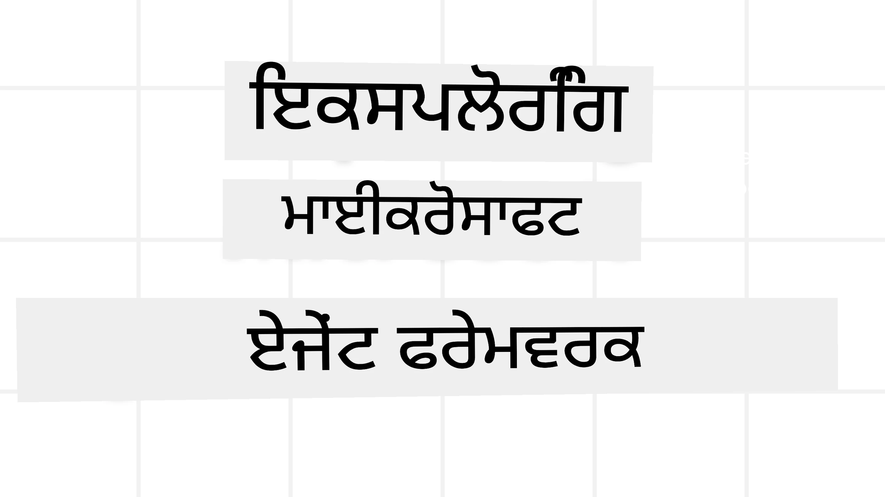
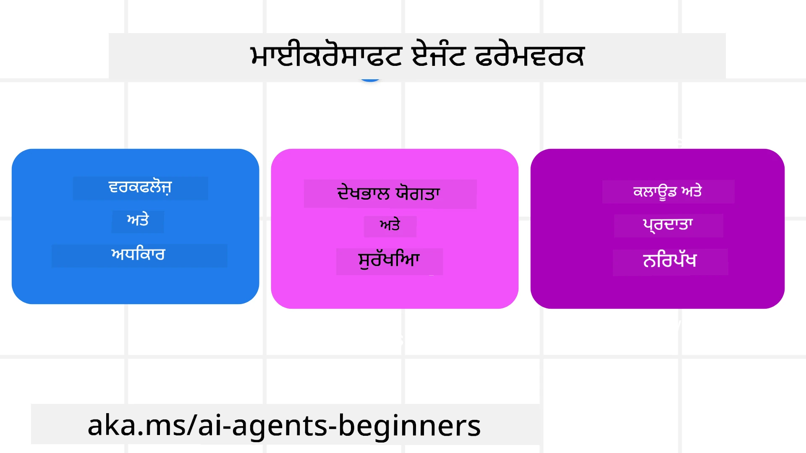
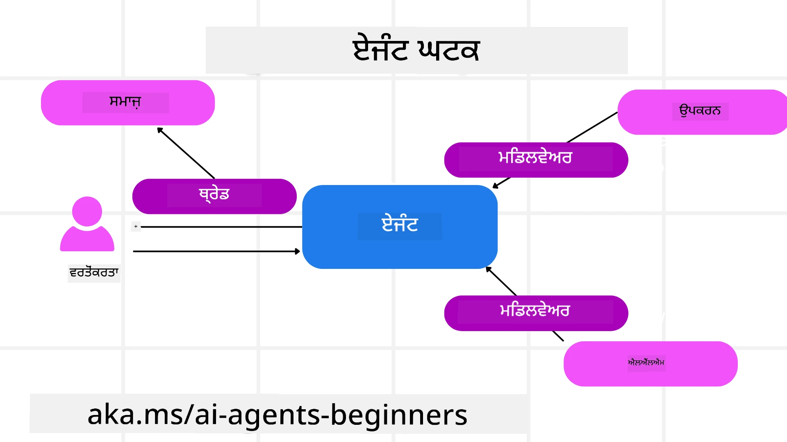

# ਮਾਈਕ੍ਰੋਸੌਫਟ ਏਜੰਟ ਫ੍ਰੇਮਵਰਕ ਦੀ ਖੋਜ



### ਜਾਣ ਪਹਿਚਾਣ

ਇਸ ਪਾਠ ਵਿੱਚ ਇਹ ਕਵਰ ਕੀਤਾ ਜਾਵੇਗਾ:

- ਮਾਈਕ੍ਰੋਸੌਫਟ ਏਜੰਟ ਫ੍ਰੇਮਵਰਕ ਨੂੰ ਸਮਝਣਾ: ਮੁੱਖ ਵਿਸ਼ੇਸ਼ਤਾਵਾਂ ਅਤੇ ਮੁੱਲ  
- ਮਾਈਕ੍ਰੋਸੌਫਟ ਏਜੰਟ ਫ੍ਰੇਮਵਰਕ ਦੇ ਮੁੱਖ ਸੰਕਲਪਾਂ ਦੀ ਖੋਜ
- ਉੱਨਤ MAF ਪੈਟਰਨ: ਵਰਕਫ਼ਲੋ, ਮਿਡਲਵੇਅਰ, ਅਤੇ ਮੈਮੋਰੀ

## ਸਿੱਖਣ ਦੇ ਮਕਸਦ

ਇਸ ਪਾਠ ਨੂੰ ਪੂਰਾ ਕਰਨ ਤੋਂ ਬਾਅਦ, ਤੁਸੀਂ ਜਾਣੋਗੇ ਕਿ ਕਿਵੇਂ:

- ਮਾਈਕ੍ਰੋਸੌਫਟ ਏਜੰਟ ਫ੍ਰੇਮਵਰਕ ਦੀ ਵਰਤੋਂ ਕਰਕੇ ਪ੍ਰੋਡਕਸ਼ਨ-ਤਿਆਰ AI ਏਜੰਟ ਬਣਾਏ ਜਾਣ
- ਮਾਈਕ੍ਰੋਸੌਫਟ ਏਜੰਟ ਫ੍ਰੇਮਵਰਕ ਦੀ ਮੁੱਖ ਵਿਸ਼ੇਸ਼ਤਾਵਾਂ ਨੂੰ ਆਪਣੇ ਏਜੰਟਿਕ ਉਪਯੋਗ ਮਾਮਲਿਆਂ ਲਈ ਲਾਗੂ ਕੀਤਾ ਜਾਵੇ
- ਉੱਨਤ ਪੈਟਰਨ ਵਰਤਣਾ ਜਿਵੇਂ ਕਿ ਵਰਕਫ਼ਲੋ, ਮਿਡਲਵੇਅਰ, ਅਤੇ ਨਿਰੀਖਣ

## ਕੋਡ ਨਮੂਨੇ 

[Microsoft Agent Framework (MAF)](https://learn.microsoft.com/en-us/agent-framework/overview/?wt.mc_id=youtube_26688_organicsocial_reactor&pivots=programming-language-python) ਲਈ ਕੋਡ ਨਮੂਨੇ ਇਸ ਰਿਪੋਜ਼ੀਟਰੀ ਵਿਚ `xx-python-agent-framework` ਅਤੇ `xx-dotnet-agent-framework` ਫਾਈਲਾਂ ਹੇਠਾਂ ਮਿਲ ਸਕਦੇ ਹਨ।

## ਮਾਈਕ੍ਰੋਸੌਫਟ ਏਜੰਟ ਫ੍ਰੇਮਵਰਕ ਨੂੰ ਸਮਝਣਾ



[Microsoft Agent Framework (MAF)](https://learn.microsoft.com/en-us/agent-framework/overview/?wt.mc_id=youtube_26688_organicsocial_reactor&pivots=programming-language-python) ਮਾਈਕ੍ਰੋਸੌਫਟ ਦਾ ਏਕਤ੍ਰਿਤ ਫ੍ਰੇਮਵਰਕ ਹੈ AI ਏਜੰਟ ਬਣਾਉਣ ਲਈ। ਇਹ ਵਿਕਾਸ ਲਈ ਲਚਕੀਲੇਪਨ ਪ੍ਰਦਾਨ ਕਰਦਾ ਹੈ ਜੋ ਪ੍ਰੋਡਕਸ਼ਨ ਅਤੇ ਖੋਜ ਮਾਹੌਲਾਂ ਵਿਚ ਵੇਖੇ ਗਏ ਵੱਖ-ਵੱਖ ਏਜੰਟਿਕ ਉਪਯੋਗ ਮਾਮਲਿਆਂ ਨੂੰ ਹੱਲ ਕਰ ਸਕਦਾ ਹੈ ਜਿਵੇਂ ਕਿ:

- **ਕਾਰਵਾਈ ਵਾਲਾ ਏਜੰਟ ਔਰਚੇਸਟ੍ਰੇਸ਼ਨ** ਜਿੱਥੇ ਕਦਮ-ਦਰ-ਕਦਮ ਵਰਕਫ਼ਲੋ ਦੀ ਲੋੜ ਹੁੰਦੀ ਹੈ।
- **ਇਕਸਾਰ ਔਰਚੇਸਟ੍ਰੇਸ਼ਨ** ਜਿੱਥੇ ਏਜੰਟ ਇੱਕੋ ਸਮੇਂ ਕੰਮ ਮੁਕੰਮਲ ਕਰਨ ਦੀ ਲੋੜ ਹੁੰਦੀ ਹੈ।
- **ਗਰੂਪ ਚੈਟ ਔਰਚੇਸਟ੍ਰੇਸ਼ਨ** ਜਿੱਥੇ ਏਜੰਟ ਇਕੱਠੇ ਕਿਸੇ ਇੱਕ ਕੰਮ 'ਤੇ ਸਹਿਯੋਗ ਕਰ ਸਕਦੇ ਹਨ।
- **ਹੈਂਡਆਫ਼ ਔਰਚੇਸਟ੍ਰੇਸ਼ਨ** ਜਿੱਥੇ ਏਜੰਟ ਇੱਕ-ਦੂਜੇ ਨੂੰ ਕੰਮ ਸੰਭਾਲ ਕੇ ਦੇਂਦੇ ਹਨ ਜਿਵੇਂ ਕਿ ਉਪ-ਕੰਮ ਮੁਕੰਮਲ ਹੁੰਦੇ ਹਨ।
- **ਮੈਗਨੇਟਿਕ ਔਰਚੇਸਟ੍ਰੇਸ਼ਨ** ਜਿੱਥੇ ਇੱਕ ਮੈਨੇਜਰ ਏਜੰਟ ਕੰਮ ਕਰਨ ਦੀ ਸੂਚੀ ਬਣਾਉਂਦਾ ਅਤੇ ਸੰਸ਼ੋਧਤ ਕਰਦਾ ਹੈ ਅਤੇ ਉਪ-ਏਜੰਟਾਂ ਦੇ ਸਮਨਵਯ ਨੂੰ ਸੰਭਾਲਦਾ ਹੈ।

AI ਏਜੰਟ ਪ੍ਰੋਡਕਸ਼ਨ ਵਿੱਚ ਪੇਸ਼ ਕਰਨ ਲਈ, MAF ਵਿੱਚ ਇਹ ਵਿਸ਼ੇਸ਼ਤਾਵਾਂ ਵੀ ਸ਼ਾਮਲ ਹਨ:

- **ਨਿਰੀਖਣਯੋਗਤਾ** OpenTelemetry ਦੀ ਵਰਤੋਂ ਦੁਆਰਾ ਜਿਸ ਵਿੱਚ AI ਏਜੰਟ ਦੀ ਹਰ ਕਾਰਵਾਈ ਸ਼ਾਮਲ ਹੈ ਜਿਵੇਂ ਕਿ ਉਪਕਰਣ ਕਾਲ, ਔਰਚੇਸਟ੍ਰੇਸ਼ਨ ਕਦਮ, ਸੋਚਣ ਦੇ ਪ੍ਰਵਾਹ ਅਤੇ Microsoft Foundry ਡੈਸ਼ਬੋਰਡਾਂ ਰਾਹੀਂ ਕਾਰਗੁਜ਼ਾਰੀ ਦੀ ਨਿਗਰਾਨੀ।
- **ਸੁਰੱਖਿਆ** Microsoft Foundry 'ਤੇ ਏਜੰਟਾਂ ਨੈਟਿਵ ਤੌਰ 'ਤੇ ਹੋਸਟ ਕੀਤੇ ਜਾਂਦੇ ਹਨ ਜਿਸ ਵਿੱਚ ਸੁਰੱਖਿਆ ਕੰਟਰੋਲ ਜਿਵੇਂ ਕਿ ਭੂਮਿਕਾ-ਆਧਾਰਤ ਪਹੁੰਚ, ਨਿੱਜੀ ਡੇਟਾ ਸੰਭਾਲ ਅਤੇ ਬਿਲਟ-ਇਨ ਕਨਟੈਂਟ ਸੇਫਟੀ ਸ਼ਾਮਲ ਹੈ।
- **ਟਿਕਾਊਪਣ** ਜਿਵੇਂ ਕਿ ਏਜੰਟ ਥ੍ਰੈਡ ਅਤੇ ਵਰਕਫ਼ਲੋਜ਼ ਰੋਕ, ਮੁੜ ਸ਼ੁਰੂ ਅਤੇ ਗਲਤੀਆਂ ਤੋਂ ਬਚ ਸਕਦੇ ਹਨ ਜੋ ਲੰਬੇ ਸਮੇਂ ਚੱਲਣ ਵਾਲੀ ਪ੍ਰਕਿਰਿਆ ਨੂੰ ਯੋਗ ਬਣਾਉਂਦਾ ਹੈ।
- **ਨਿਯੰਤਰਣ** ਜਿੱਥੇ ਹਲਕਾ ਮਨੁੱਖੀ ਹਸਤਕਸ਼ੇਪ ਵਾਲੇ ਵਰਕਫਲੋ ਨੂੰ ਸਮਰਥਿਤ ਕੀਤਾ ਜਾਂਦਾ ਹੈ ਜਿੱਥੇ ਕੰਮ ਮਨੁੱਖੀ ਮਨਜ਼ੂਰੀ ਦੀ ਲੋੜ ਰੱਖਦੇ ਹਨ।

ਮਾਈਕ੍ਰੋਸੌਫਟ ਏਜੰਟ ਫ੍ਰੇਮਵਰਕ ਦਾ ਧਿਆਨ ਇੰਟਰਓਪਰੇਬਲ ਹੋਣ 'ਤੇ ਵੀ ਹੈ:

- **ਕਲਾਉਡ-ਅਗਨੋਸਟਿਕ ਹੋਣ** - ਏਜੰਟ ਕੰਟੇਨਰਾਂ ਵਿੱਚ, ਓਨ-ਪ੍ਰੇਮ ਅਤੇ ਕਈ ਵੱਖ-ਵੱਖ ਕਲਾਉਡਸ 'ਤੇ ਚਲ ਸਕਦੇ ਹਨ।
- **ਪ੍ਰੋਵਾਈਡਰ-ਅਗਨੋਸਟਿਕ ਹੋਣ** - ਲੋਕਪ੍ਰਿਯ SDKs ਜਿਵੇਂ ਕਿ Azure OpenAI ਅਤੇ OpenAI ਦੁਆਰਾ ਏਜੰਟ ਬਣਾਏ ਜਾ ਸਕਦੇ ਹਨ।
- **ਖੁੱਲ੍ਹੇ ਮਿਆਰੀਕਰਨਾਂ ਨੂੰ ਸ਼ਾਮਲ ਕਰਨਾ** - ਏਜੰਟ-ਟੂ-ਏਜੰਟ (A2A) ਅਤੇ ਮਾਡਲ ਕੰਟੈਕਸਟ ਪ੍ਰੋਟੋਕੋਲ (MCP) ਵਰਗੀਆਂ ਪ੍ਰੋਟੋਕੋਲਾਂ ਦਾ ਉਪਯੋਗ ਕਰਕੇ ਹੋਰ ਏਜੰਟਾਂ ਅਤੇ ਟੂਲਾਂ ਦੀ ਖੋਜ ਅਤੇ ਉਪਯੋਗ ਕੀਤਾ ਜਾ ਸਕਦਾ ਹੈ।
- **ਪਲੱਗਇਨਾਂ ਅਤੇ ਕਨੇਕਟਰ** - ਡੇਟਾ ਅਤੇ ਮੈਮੋਰੀ ਸੇਵਾਵਾਂ ਨਾਲ ਕਨੈਕਸ਼ਨ ਬਣਾਏ ਜਾ ਸਕਦੇ ਹਨ ਜਿਵੇਂ Microsoft Fabric, SharePoint, Pinecone ਅਤੇ Qdrant।

ਆਓ ਵੇਖੀਏ ਕਿ ਇਹ ਵਿਸ਼ੇਸ਼ਤਾਵਾਂ ਮਾਈਕ੍ਰੋਸੌਫਟ ਏਜੰਟ ਫ੍ਰੇਮਵਰਕ ਦੇ ਕੁਝ ਮੁੱਖ ਸੰਕਲਪਾਂ 'ਤੇ ਕਿਵੇਂ ਲਾਗੂ ਹੁੰਦੀਆਂ ਹਨ।

## ਮਾਈਕ੍ਰੋਸੌਫਟ ਏਜੰਟ ਫ੍ਰੇਮਵਰਕ ਦੇ ਮੁੱਖ ਸੰਕਲਪ

### ਏਜੰਟ



**ਏਜੰਟ ਬਣਾਉਣਾ**

ਏਜੰਟ ਬਣਾਉਣ ਲਈ ਇન્ફਰੈਂਸ ਸਰਵਿਸ (LLM ਪ੍ਰੋਵਾਈਡਰ), AI ਏਜੰਟ ਲਈ ਇੱਕ ਹੁਕਮਾਂ ਦੀ ਸੈੱਟ, ਅਤੇ ਇੱਕ ਨਿਰਧਾਰਤ `name` ਦੀ ਲੋੜ ਹੁੰਦੀ ਹੈ:


```python
agent = AzureOpenAIChatClient(credential=AzureCliCredential()).create_agent( instructions="You are good at recommending trips to customers based on their preferences.", name="TripRecommender" )
```

ਉਪਰ ਦਿੱਤਾ ਉਦਾਹਰਣ `Azure OpenAI` ਦੀ ਵਰਤੋਂ ਕਰ ਰਿਹਾ ਹੈ ਪਰ ਏਜੰਟਾਂ ਨੂੰ ਵੱਖ-ਵੱਖ ਸਰਵਿਸਜ਼ ਨਾਲ ਵੀ ਬਣਾਇਆ ਜਾ ਸਕਦਾ ਹੈ ਜਿਵੇਂ ਕਿ `Microsoft Foundry Agent Service` :

```python
AzureAIAgentClient(async_credential=credential).create_agent( name="HelperAgent", instructions="You are a helpful assistant." ) as agent
```

OpenAI `Responses`, `ChatCompletion` APIਜ਼

```python
agent = OpenAIResponsesClient().create_agent( name="WeatherBot", instructions="You are a helpful weather assistant.", )
```

```python
agent = OpenAIChatClient().create_agent( name="HelpfulAssistant", instructions="You are a helpful assistant.", )
```

ਜਾਂ [MiniMax](https://platform.minimaxi.com/), ਜੋ ਵੱਡੇ ਸੰਦਰਭ ਖਿੜਕੀ ਨਾਲ OpenAI-ਉਪਯੋਗਤਾਪੂਰਨ API ਮੁਹੱਈਆ ਕਰਦਾ ਹੈ (204K ਟੋਕਨ ਤੱਕ):

```python
agent = OpenAIChatClient(base_url="https://api.minimax.io/v1", api_key=os.environ["MINIMAX_API_KEY"], model_id="MiniMax-M3").create_agent( name="HelpfulAssistant", instructions="You are a helpful assistant.", )
```

ਜਾਂ ਦੂਰ ਦਰਾਜ਼ ਏਜੰਟਾਂ A2A ਪ੍ਰੋਟੋਕੋਲ ਦੀ ਵਰਤੋਂ ਕਰਕੇ:

```python
agent = A2AAgent( name=agent_card.name, description=agent_card.description, agent_card=agent_card, url="https://your-a2a-agent-host" )
```

**ਏਜੰਟ ਚਲਾਉਣਾ**

ਏਜੰਟ `.run` ਜਾਂ `.run_stream` ਮੈਥਡਾਂ ਦੀ ਵਰਤੋਂ ਕਰਕੇ ਚਲਾਏ ਜਾਂਦੇ ਹਨ ਜੋ ਕਿ ਗੈਰ-ਸਟ੍ਰੀਮਿੰਗ ਜਾਂ ਸਟ੍ਰੀਮਿੰਗ ਜਵਾਬਾਂ ਲਈ ਹਨ।

```python
result = await agent.run("What are good places to visit in Amsterdam?")
print(result.text)
```

```python
async for update in agent.run_stream("What are the good places to visit in Amsterdam?"):
    if update.text:
        print(update.text, end="", flush=True)

```

ਹਰ ਏਜੰਟ ਚਲਾਉਣ ਵਿੱਚ ਕਸਟਮਾਈਜ਼ ਕਰਨ ਲਈ ਵਿਕਲਪ ਹੋ ਸਕਦੇ ਹਨ, ਜਿਵੇਂ ਕਿ ਏਜੰਟ ਵੱਲੋਂ ਵਰਤੇ ਜਾਣ ਵਾਲੇ `max_tokens`, ਉਹ `tools` ਜੋ ਏਜੰਟ ਕਾਲ ਕਰ ਸਕਦਾ ਹੈ, ਅਤੇ `model` ਜੋ ਸੁਪਰ ਨਿਰਧਾਰਿਤ ਹੈ।

ਇਹ ਉੱਪਯੋਗੀ ਹੈ ਜੇਕਰ ਕਿਸੇ ਉਪਭੋਗਤਾ ਦੇ ਕੰਮ ਨੂੰ ਪੂਰਾ ਕਰਨ ਲਈ ਵੱਖ-ਵੱਖ ਮਾਡਲ ਜਾਂ ਟੂਲ ਦੀ ਲੋੜ ਹੋਵੇ।

**ਟੂਲਜ਼**

ਟੂਲਜ਼ ਦੋਹਾਂ ਸਮੇਂ ਪਰਿਭਾਸ਼ਿਤ ਕੀਤੇ ਜਾ ਸਕਦੇ ਹਨ —ਏਜੰਟ ਬਣਾਉਣ ਸਮੇਂ:

```python
def get_attractions( location: Annotated[str, Field(description="The location to get the top tourist attractions for")], ) -> str: """Get the top tourist attractions for a given location.""" return f"The top attractions for {location} are." 


# ਜਦੋਂ ਸਿੱਧੇ ਤੌਰ 'ਤੇ ਇੱਕ ChatAgent ਬਣਾਇਆ ਜਾ ਰਿਹਾ ਹੋਵੇ

agent = ChatAgent( chat_client=OpenAIChatClient(), instructions="You are a helpful assistant", tools=[get_attractions]

```

ਅਤੇ ਏਜੰਟ ਚਲਾਉਂਦੇ ਸਮੇਂ ਵੀ:

```python

result1 = await agent.run( "What's the best place to visit in Seattle?", tools=[get_attractions] # ਸਿਰਫ ਇਸ ਦੌੜ ਲਈ ਦਿੱਤਾ ਗਇਆ ਉਪਕਰਨ )
```

**ਏਜੰਟ ਥ੍ਰੈਡ**

ਏਜੰਟ ਥ੍ਰੈਡ ਬਹੁ-ਮੁੜ ਬਾਤਚੀਤਾਂ ਨੂੰ ਸੰਭਾਲਣ ਲਈ ਵਰਤੇ ਜਾਂਦੇ ਹਨ। ਥ੍ਰੈਡ ਦੋ ਤਰੀਕਿਆਂ ਨਾਲ ਬਣਾਏ ਜਾ ਸਕਦੇ ਹਨ:

- `get_new_thread()` ਦੀ ਵਰਤੋਂ ਨਾਲ ਜੋ ਸਮੇਂ ਦੇ ਨਾਲ ਇਸ ਨੂੰ ਸहेਜ ਸਕਦਾ ਹੈ
- ਇੱਕ ਥ੍ਰੈਡ ਆਪੋآپ ਬਣਾਉਣਾ ਜਦੋਂ ਏਜੰਟ ਚਲਾਇਆ ਜਾ ਰਿਹਾ ਹੁੰਦਾ ਹੈ ਅਤੇ ਕੇਵਲ ਮੌਜੂਦਾ ਚਲਾਉਣ ਦੌਰਾਨ ਲਈ ਥ੍ਰੈਡ ਹੋਣਾ

ਥ੍ਰੈਡ ਬਣਾਉਣ ਲਈ ਕੋਡ ਇਸ ਤਰ੍ਹਾਂ ਲੱਗਦਾ ਹੈ:

```python
# ਇਕ ਨਵੀਂ ਧਾਰਾ ਬਣਾਓ।
thread = agent.get_new_thread() # ਧਾਰਾ ਨਾਲ ਏਜੰਟ ਨੂੰ ਚਲਾਓ।
response = await agent.run("Hello, I am here to help you book travel. Where would you like to go?", thread=thread)

```

ਤੁਸੀਂ ਫਿਰ ਥ੍ਰੈਡ ਨੂੰ ਸੈਰੀਅਲਾਈਜ਼ ਕਰ ਸਕਦੇ ਹੋ ਤਾਂ ਜੋ ਇਸਨੂੰ ਬਾਅਦ ਵਿੱਚ ਸੰਭਾਲਿਆ ਜਾ ਸਕੇ:

```python
# ਇੱਕ ਨਵੀਂ ਧਾਗਾ ਬਣਾਓ।
thread = agent.get_new_thread() 

# ਧਾਗੇ ਨਾਲ ਏਜੰਟ ਨੂੰ ਚਲਾਓ।

response = await agent.run("Hello, how are you?", thread=thread) 

# ਸਟੋਰੇਜ ਲਈ ਧਾਗੇ ਨੂੰ ਸੀਰੀਅਲਾਈਜ਼ ਕਰੋ।

serialized_thread = await thread.serialize() 

# ਸਟੋਰੇਜ ਤੋਂ ਲੋਡ ਕਰਨ ਤੋਂ ਬਾਅਦ ਧਾਗੇ ਦੀ ਹਾਲਤ ਨੂੰ ਡੀਸੀਰੀਅਲਾਈਜ਼ ਕਰੋ।

resumed_thread = await agent.deserialize_thread(serialized_thread)
```

**ਏਜੰਟ ਮਿਡਲਵੇਅਰ**

ਏਜੰਟ ਉਪਭੋਗਤਾ ਦੇ ਕੰਮਾਂ ਨੂੰ ਪੂਰਾ ਕਰਨ ਲਈ ਟੂਲਜ਼ ਅਤੇ LLMs ਨਾਲ ਇੰਟਰੈਕਟ ਕਰਦੇ ਹਨ। ਕੁਝ ਸਥਿਤੀਆਂ ਵਿੱਚ, ਅਸੀਂ ਇੰਟਰੈਕਸ਼ਨ ਦੇ ਦਰਮਿਆਨ ਕੁਝ ਕਰਵਾਈ ਜਾਂ ਨਿਗਰਾਨੀ ਕਰਨੀ ਚਾਹੁੰਦੇ ਹਾਂ। ਏਜੰਟ ਮਿਡਲਵੇਅਰ ਸਾਨੂੰ ਇਹ ਕਰਨ ਦੇ ਯੋਗ ਬਣਾਉਂਦੀਆਂ ਹਨ:

*ਫੰਕਸ਼ਨ ਮਿਡਲਵੇਅਰ*

ਇਹ ਮਿਡਲਵੇਅਰ ਸਾਨੂੰ ਏਜੰਟ ਅਤੇ ਫੰਕਸ਼ਨ/ਟੂਲ ਦੇ ਵਿਚਕਾਰ ਕਾਰਵਾਈ ਕਰਨ ਦੀ ਆਗਿਆ ਦਿੰਦਾ ਹੈ ਜਿਹੜਾ ਇਹ ਕਾਲ ਕਰ ਰਹੇ ਹੋਵੈ। ਉਦਾਹਰਣ ਦੇ ਤੌਰ 'ਤੇ ਜਦੋਂ ਤੁਸੀਂ ਫੰਕਸ਼ਨ ਕਾਲ 'ਤੇ ਕੁਝ ਲੌਗਿੰਗ ਕਰਨੀ ਹੋਵੇ।

ਹੇਠਾਂ ਦਿੱਤੇ ਕੋਡ ਵਿੱਚ `next` ਪ੍ਰਦਾਨ ਕਰਦਾ ਹੈ ਕਿ ਅਗਲਾ ਮਿਡਲਵੇਅਰ ਜਾਂ ਅਸਲੀ ਫੰਕਸ਼ਨ ਕਾਲ ਕੀਤਾ ਜਾਣਾ ਚਾਹੀਦਾ ਹੈ।

```python
async def logging_function_middleware(
    context: FunctionInvocationContext,
    next: Callable[[FunctionInvocationContext], Awaitable[None]],
) -> None:
    """Function middleware that logs function execution."""
    # ਪ੍ਰੀ-ਪ੍ਰੋਸੈਸਿੰਗ: ਫੰਕਸ਼ਨ ਐਗਜ਼ਿਕਿਊਸ਼ਨ ਤੋਂ ਪਹਿਲਾਂ ਲੌਗ ਕਰੋ
    print(f"[Function] Calling {context.function.name}")

    # ਅੱਗੇ ਦੇ ਮਿੱਡਲਵੇਅਰ ਜਾਂ ਫੰਕਸ਼ਨ ਐਗਜ਼ਿਕਿਊਸ਼ਨ ਵੱਲ ਜਾਰੀ ਰੱਖੋ
    await next(context)

    # ਪੋਸਟ-ਪ੍ਰੋਸੈਸਿੰਗ: ਫੰਕਸ਼ਨ ਐਗਜ਼ਿਕਿਊਸ਼ਨ ਤੋਂ ਬਾਅਦ ਲੌਗ ਕਰੋ
    print(f"[Function] {context.function.name} completed")
```

*ਚੈਟ ਮਿਡਲਵੇਅਰ*

ਇਹ ਮਿਡਲਵੇਅਰ AI ਸੇਵਾ ਵੱਲੋਂ ਕੀਤੀਆਂ ਬੇਨਤੀਆਂ ਅਤੇ ਮਿੰਮੇਂਦਾ ਏਜੰਟ ਵਿਚਕਾਰ ਕਾਰਵਾਈ ਜਾਂ ਲੌਗਿੰਗ ਕਰਨ ਦੀ ਆਗਿਆ ਦਿੰਦਾ ਹੈ।

ਇਸ ਵਿੱਚ ਜ਼ਰੂਰੀ ਜਾਣਕਾਰੀ ਹੁੰਦੀ ਹੈ, ਜਿਵੇਂ ਕਿ `messages` ਜੋ AI ਸੇਵਾ ਨੂੰ ਭੇਜੇ ਜਾ ਰਹੇ ਹਨ।

```python
async def logging_chat_middleware(
    context: ChatContext,
    next: Callable[[ChatContext], Awaitable[None]],
) -> None:
    """Chat middleware that logs AI interactions."""
    # ਪ੍ਰੀ-ਪ੍ਰੋਸੈਸਿੰਗ: AI ਕਾਲ ਤੋਂ ਪਹਿਲਾਂ ਲੌਗ
    print(f"[Chat] Sending {len(context.messages)} messages to AI")

    # ਅਗਲੇ ਮਿਡਲਵੇਅਰ ਜਾਂ AI ਸੇਵਾ ਨੂੰ ਜਾਰੀ ਰੱਖੋ
    await next(context)

    # ਪੋਸਟ-ਪ੍ਰੋਸੈਸਿੰਗ: AI ਜਵਾਬ ਤੋਂ ਬਾਅਦ ਲੌਗ
    print("[Chat] AI response received")

```

**ਏਜੰਟ ਮੈਮੋਰੀ**

`Agentic Memory` ਪਾਠ ਵਿੱਚ ਕਵਰ ਕੀਤੀ ਤਰ੍ਹਾਂ, ਮੈਮੋਰੀ ਏਜੰਟ ਨੂੰ ਵੱਖ-ਵੱਖ ਸੰਦਰਭਾਂ ਵਿੱਚ ਚਲਾਉਣ ਲਈ ਮਹੱਤਵਪੂਰਨ ਤੱਤ ਹੈ। MAF ਕਈ ਕਿਸਮ ਦੀਆਂ ਮੈਮੋਰੀਆਂ ਮੁਹੱਈਆ ਕਰਦਾ ਹੈ:

*ਇਨ-ਮੈਮੋਰੀ ਸਟੋਰੇਜ*

ਇਹ ਮੈਮੋਰੀ ਐਪਲੀਕੇਸ਼ਨ ਦੇ ਚੱਲਦੇ ਸਮੇਂ ਥ੍ਰੈਡਾਂ ਵਿੱਚ ਸਟੋਰ ਕੀਤੀ ਜਾਂਦੀ ਹੈ।

```python
# ਇੱਕ ਨਵੀਂ ਧਾਗਾ ਬਣਾਓ।
thread = agent.get_new_thread() # ਧਾਗੇ ਨਾਲ ਏਜੰਟ ਨੂੰ ਚਲਾਓ।
response = await agent.run("Hello, I am here to help you book travel. Where would you like to go?", thread=thread)
```

*ਪਾਇਦਾਰ ਸੁਨੇਹੇ*

ਇਹ ਮੈਮੋਰੀ ਵੱਖ-ਵੱਖ ਸੈਸ਼ਨਾਂ ਵਿੱਚ ਗੱਲਬਾਤ ਇਤਿਹਾਸ ਸਟੋਰ ਕਰਨ ਲਈ ਵਰਤੀ ਜਾਂਦੀ ਹੈ। ਇਹ `chat_message_store_factory` ਦੀ ਵਰਤੋਂ ਨਾਲ ਪਰਿਭਾਸ਼ਿਤ ਹੈ:

```python
from agent_framework import ChatMessageStore

# ਇੱਕ ਕਸਟਮ ਮੈਸੇਜ ਸਟੋਰ ਬਣਾਓ
def create_message_store():
    return ChatMessageStore()

agent = ChatAgent(
    chat_client=OpenAIChatClient(),
    instructions="You are a Travel assistant.",
    chat_message_store_factory=create_message_store
)

```

*ਡਾਇਨਾਮਿਕ ਮੈਮੋਰੀ*


ਇਹ ਯਾਦਦਾਸ਼ਤ ਏਜੰਟ ਚਲਾਉਣ ਤੋਂ ਪਹਿਲਾਂ ਸੰਦਰਭ ਵਿੱਚ ਜੋੜੀ ਜਾਂਦੀ ਹੈ। ਇਹ ਯਾਦਦਾਸ਼ਤ ਬਾਹਰੀ ਸੇਵਾਵਾਂ ਵਿੱਚ ਸંગ્રਹਿਤ ਕੀਤੀ ਜਾ ਸਕਦੀ ਹੈ ਜਿਵੇਂ mem0:

```python
from agent_framework.mem0 import Mem0Provider

# ਅੱਗੇ ਵਧੇ ਹੋਏ ਮੈਮੋਰੀ ਇਸਤੇਮਾਲ ਲਈ Mem0 ਦੀ ਵਰਤੋਂ ਕਰਨਾ
memory_provider = Mem0Provider(
    api_key="your-mem0-api-key",
    user_id="user_123",
    application_id="my_app"
)

agent = ChatAgent(
    chat_client=OpenAIChatClient(),
    instructions="You are a helpful assistant with memory.",
    context_providers=memory_provider
)

```

**ਏਜੰਟ ਦੇਖਰੇਖਯੋਗਤਾ**

ਦੇਖਰੇਖਯੋਗਤਾ ਭਰੋਸੇਮੰਦ ਅਤੇ ਸੰਭਾਲੇ ਜਾ ਸਕਣ ਵਾਲੇ ਏਜੰਟਿਕ ਪ੍ਰਣਾਲੀਆਂ ਬਣਾਉਣ ਲਈ ਮਹੱਤਵਪੂਰਨ ਹੈ। MAF ਖੁਲ੍ਹਾ ਟੈਲੀਮੇਟ੍ਰੀ ਨਾਲ ਇੰਟਿਗ੍ਰੇਟ ਕਰਦਾ ਹੈ ਜਿਨ੍ਹਾਂ ਟਰੇਸਿੰਗ ਅਤੇ ਮੀਟਰ ਪ੍ਰਦਾਨ ਕਰਦੇ ਹਨ ਵਧੀਆਂ ਦੇਖਰੇਖਯੋਗਤਾ ਲਈ।

```python
from agent_framework.observability import get_tracer, get_meter

tracer = get_tracer()
meter = get_meter()
with tracer.start_as_current_span("my_custom_span"):
    # ਕੁਝ ਕਰੋ
    pass
counter = meter.create_counter("my_custom_counter")
counter.add(1, {"key": "value"})
```

### ਵਰਕਫਲੋਜ਼

MAF ਵਰਕਫਲੋਜ਼ ਪ੍ਰਦਾਨ ਕਰਦਾ ਹੈ ਜੋ ਕਿ ਪੂਰਵ-ਪਰਿਭਾਸ਼ਿਤ ਕਦਮ ਹੁੰਦੇ ਹਨ ਕਿਸੇ ਕੰਮ ਨੂੰ ਪੂਰਾ ਕਰਨ ਲਈ ਅਤੇ ਉਨ੍ਹਾਂ ਕਦਮਾਂ ਵਿੱਚ AI ਏਜੰਟ ਕਾਮਪੋਨੈਂਟ ਵਜੋਂ ਸ਼ਾਮਲ ਹੁੰਦੇ ਹਨ।

ਵਰਕਫਲੋਜ਼ ਵੱਖ-ਵੱਖ ਕਾਮਪੋਨੈਂਟਾਂ ਤੋਂ ਬਣੇ ਹੁੰਦੇ ਹਨ ਜੋ ਵਧੀਆ ਨਿਯੰਤਰਣ ਪ੍ਰਵਾਹ ਨੂੰ ਸਹਾਇਤਾ ਦਿੰਦੇ ਹਨ। ਵਰਕਫਲੋਜ਼ ਨਾਲ **ਮਲਟੀ-ਏਜੰਟ ਆਰਕੇਸਟਰੈਸ਼ਨ** ਅਤੇ **ਚੈਕਪੋਇੰਟਿੰਗ** ਵੀ ਸੰਭਵ ਹੁੰਦਾ ਹੈ ਤਾਂ ਜੋ ਵਰਕਫਲੋ ਸਥਿਤੀਆਂ ਸੁਰੱਖਿਅਤ ਕੀਤੀਆਂ ਜਾ ਸਕਣ।

ਵਰਕਫਲੋ ਦੇ ਮੁੱਖ ਕਾਮਪੋਨੈਂਟ ਹਨ:

**ਐਗਜ਼ੈਕਿਊਟਰਜ਼**

ਐਗਜ਼ੈਕਿਊਟਰਜ਼ ਇਨਪੁੱਟ ਸੁਨੇਹੇ ਪ੍ਰਾਪਤ ਕਰਦੇ ਹਨ, ਆਪਣੇ ਨਿਰਧਾਰਿਤ ਕੰਮ ਕਰਦੇ ਹਨ ਅਤੇ ਫਿਰ ਨਿਕਾਸ ਸੁਨੇਹਾ ਤਿਆਰ ਕਰਦੇ ਹਨ। ਇਸ ਨਾਲ ਵਰਕਫਲੋ ਵੱਡੇ ਕੰਮ ਨੂੰ ਪੂਰਾ ਕਰਨ ਵੱਲ ਅੱਗੇ ਵਧਦਾ ਹੈ। ਐਗਜ਼ੈਕਿਊਟਰਜ਼ AI ਏਜੰਟ ਜਾਂ ਕਸਟਮ ਲਾਜਿਕ ਹੋ ਸਕਦੇ ਹਨ।

**ਐਜ**

ਵਰਕਫਲੋ ਵਿੱਚ ਸੁਨੇਹਿਆਂ ਦੇ ਪ੍ਰਵਾਹ ਨੂੰ ਪਰਿਭਾਸ਼ਿਤ ਕਰਨ ਲਈ ਐਜ ਵਰਤੇ ਜਾਂਦੇ ਹਨ। ਇਹ ਹੋ ਸਕਦੇ ਹਨ:

*ਡਾਇਰੇਕਟ ਐਜ* - ਐਗਜ਼ੈਕਿਊਟਰਜ਼ ਦੇ ਦਰਮਿਆਨ ਸਿੱਧਾ ਇਕ ਤੋਂ ਇਕ ਕਨੈਕਸ਼ਨ:

```python
from agent_framework import WorkflowBuilder

builder = WorkflowBuilder()
builder.add_edge(source_executor, target_executor)
builder.set_start_executor(source_executor)
workflow = builder.build()
```

*ਸ਼ਰਤੀ ਬੰਨ੍ਹੇ ਐਜ* - ਜਦੋਂ ਕੋਈ ਖਾਸ ਸ਼ਰਤ ਪੂਰੀ ਹੁੰਦੀ ਹੈ ਤਦ ਸਰਗਰਮ। ਉਦਾਹਰਨ ਵਜੋਂ, ਜਦੋਂ ਹੋਟਲਾਂ ਦੇ ਕਮਰੇ ਉਪਲਬਧ ਨਹੀਂ ਹੁੰਦੇ, ਤਾਂ ਇੱਕ ਐਗਜ਼ੈਕਿਊਟਰ ਹੋਰ ਵਿਕਲਪ ਸੁਝਾ ਸਕਦਾ ਹੈ।

*ਸਵਿਚ-ਕੇਸ ਐਜ* - ਤਿਆਰ ਕੀਤੀਆਂ ਸ਼ਰਤਾਂ ਦੇ ਆਧਾਰ 'ਤੇ ਸੁਨੇਹੇ ਵੱਖ-ਵੱਖ ਐਗਜ਼ੈਕਿਊਟਰਜ਼ ਨੂੰ ਭੇਜੋ। ਉਦਾਹਰਨ ਵਜੋਂ, ਜੇ ਯਾਤਰੀ ਗਾਹਕ ਕੋਲ ਪ੍ਰਾਇਰਟੀ ਐਕਸੈੱਸ ਹੈ ਤਾਂ ਉਹਨਾਂ ਦੇ ਕੰਮ ਹੋਰ ਵਰਕਫਲੋ ਰਾਹੀਂ ਸੰਭਾਲੇ ਜਾਣਗੇ।

*ਫੈਨ-ਆਊਟ ਐਜ* - ਇੱਕ ਸੁਨੇਹਾ ਕਈ ਟਾਰਗਟਾਂ ਨੂੰ ਭੇਜੋ।

*ਫੈਨ-ਇਨ ਐਜ* - ਵੱਖ-ਵੱਖ ਐਗਜ਼ੈਕਿਊਟਰਜ਼ ਤੋਂ ਕਈ ਸੁਨੇਹੇ ਇਕੱਠੇ ਕਰਕੇ ਇੱਕ ਟਾਰਗਟ ਨੂੰ ਭੇਜੋ।

**ਘਟਨਾਵਾਂ**

ਵਰਕਫਲੋ ਵਿੱਚ ਵਧੀਆ ਦੇਖਰੇਖਯੋਗਤਾ ਦੇ ਲਈ, MAF ਨਿਰਵਹਣ ਲਈ ਬਿਲਟ-ਇਨ ਘਟਨਾਵਾਂ ਪ੍ਰਦਾਨ ਕਰਦਾ ਹੈ ਜਿਵੇਂ:

- `WorkflowStartedEvent`  - ਵਰਕਫਲੋ ਦਾ ਨਿਰਮਾਣ ਸ਼ੁਰੂ ਹੁੰਦਾ ਹੈ
- `WorkflowOutputEvent` - ਵਰਕਫਲੋ ਨਿਕਾਸ ਤਿਆਰ ਕਰਦਾ ਹੈ
- `WorkflowErrorEvent` - ਵਰਕਫਲੋ ਨੂੰ ਕੋਈ ਤਰੁੱਟੀ ਮਿਲਦੀ ਹੈ
- `ExecutorInvokeEvent`  - ਐਗਜ਼ੈਕਿਊਟਰ ਕਾਰਜਸ਼ੁਰੂ ਕਰਦਾ ਹੈ
- `ExecutorCompleteEvent`  -  ਐਗਜ਼ੈਕਿਊਟਰ ਕਾਰਜ ਮੁਕੰਮਲ ਕਰਦਾ ਹੈ
- `RequestInfoEvent` - ਇੱਕ ਬੇਨਤੀ ਜਾਰੀ ਕੀਤੀ ਜਾਂਦੀ ਹੈ

## ਐਡਵਾਂਸਡ MAF ਪੈਟਰਨ

ਉਪਰ ਦਿੱਤੇ ਹਿੱਸੇ ਮਾਇਕ੍ਰੋਸਾਫਟ ਏਜੰਟ ਫਰੇਮਵਰਕ ਦੇ ਮੁੱਖ ਸੰਕਲਪ ਕਵਰ ਕਰਦੇ ਹਨ। ਜਿਵੇਂ ਜਦੋਂ ਤੁਸੀਂ ਹੋਰ ਜਟਿਲ ਏਜੰਟ ਬਣਾਉਂਦੇ ਹੋ, ਇੱਥੇ ਕੁਝ ਉੱਚ ਪੱਧਰ ਦੇ ਪੈਟਰਨ ਹਨ ਜੋ ਧਿਆਨ ਵਿੱਚ ਰੱਖਣੇ ਚਾਹੀਦੇ ਹਨ:

- **ਮਿਡਲਵੇਅਰ ਕੰਪੋਜ਼ੀਸ਼ਨ**: ਕਈ ਮਿਡਲਵੇਅਰ ਹੈਂਡਲਰਜ਼ (ਲੌਗਿੰਗ, ਪ੍ਰਮਾਣਿਕਤਾ, ਰੇਟ-ਲੀਮਿਟਿੰਗ) ਨੂੰ ਚੇਨ ਸਦ ਰਚੋ, ਫੰਕਸ਼ਨ ਅਤੇ ਚੈਟ ਮਿਡਲਵੇਅਰ ਦੀ ਵਰਤੋਂ ਕਰਕੇ ਏਜੰਟ ਦੇ ਵਰਤਾਅ 'ਤੇ ਸੂਖਮ ਨਿਯੰਤਰਣ ਲਈ।
- **ਵਰਕਫਲੋ ਚੈਕਪੋਇੰਟਿੰਗ**: ਵਰਕਫਲੋ ਘਟਨਾਵਾਂ ਅਤੇ ਸੀਰੀਅਲਾਈਜੇਸ਼ਨ ਦੀ ਵਰਤੋਂ ਕਰਕੇ ਲੰਮੇ ਸਮੇਂ ਚੱਲ ਰਹੀਆਂ ਏਜੰਟ ਪ੍ਰਕਿਰਿਆਵਾਂ ਨੂੰ ਸੰਭਾਲੋ ਅਤੇ ਮੁੜ ਸ਼ੁਰੂ ਕਰੋ।
- **ਡਾਇਨਾਮਿਕ ਟੂਲ ਚੋਣ**: MAF ਦੇ ਟੂਲ ਰਜਿਸਟ੍ਰੇਸ਼ਨ ਨਾਲ ਟੂਲ ਵੇਰਵਾ 'ਤੇ RAG ਮਿਲਾ ਕੇ ਹਰ ਪ੍ਰਸ਼ਨ ਲਈ ਸਿਰਫ ਸੰਬੰਧਤ ਟੂਲਸ ਪੇਸ਼ ਕਰੋ।
- **ਮਲਟੀ-ਏਜੰਟ ਹੈਂਡਆਫ**: ਵਰਕਫਲੋ ਐਜ ਅਤੇ ਸ਼ਰਤੀ ਰੂਟਿੰਗ ਦੀ ਵਰਤੋਂ ਕਰਕੇ ਵਿਸ਼ੇਸ਼ ਏਜੰਟਾਂ ਵਿਚਕਾਰ ਹੈਂਡਆਫ਼ਰਾਂ ਦੀ ਆਰਕੇਸਟਰੈਸ਼ਨ ਕਰੋ।

## ਮਾਇਕ੍ਰੋਸਾਫਟ ਫਾਉਂਡਰੀ 'ਤੇ ਲੈਂਗਚੇਨ / ਲੈਂਗਗ੍ਰਾਫ ਏਜੰਟ ਹੋਸਟ ਕਰਨਾ

ਮਾਇਕ੍ਰੋਸਾਫਟ ਏਜੰਟ ਫਰੇਮਵਰਕ **ਫਰੇਮਵਰਕ-ਇੰਟਰਓਪਰੇਬਲ** ਹੈ — ਤੁਸੀਂ صرف MAF ਨਾਲ ਲਿਖੇ ਏਜੰਟਾਂ ਨਾਲ ਸੀਮਤ ਨਹੀਂ ਹੋ। ਜੇ ਤੁਹਾਡੇ ਕੋਲ ਪਹਿਲਾਂ ਹੀ **ਲੈਂਗਚੇਨ** ਜਾਂ **ਲੈਂਗਗ੍ਰਾਫ** ਨਾਲ ਬਣਿਆ ਏਜੰਟ ਹੈ, ਤਾਂ ਤੁਸੀਂ ਇਸਨੂੰ ਇੱਕ **Microsoft Foundry ਹੋਸਟਡ ਏਜੰਟ** ਵਜੋਂ ਚਲਾ ਸਕਦੇ ਹੋ ਤਾਂ ਜੋ Foundry ਰਨਟਾਈਮ, ਸੈਸ਼ਨ, ਸਕੇਲਿੰਗ, ਪਛਾਣ ਅਤੇ ਪ੍ਰੋਟੋਕਾਲ ਏਂਡਪੋਇੰਟ ਪ੍ਰਬੰਧਿਤ ਕਰੇ, ਜਦੋਂ ਕਿ ਤੁਹਾਡਾ ਏਜੰਟ ਲਾਜਿਕ ਲੈਂਗਗ੍ਰਾਫ ਵਿੱਚ ਰਹਿੰਦਾ ਹੈ।

ਇਹ `langchain_azure_ai.agents.hosting` ਪੈਕੇਜ ਨਾਲ ਕੀਤਾ ਜਾਂਦਾ ਹੈ, ਜੋ ਉਹੀ ਪ੍ਰੋਟੋਕਾਲ ਵਰਤਣ ਵਾਲੇ Foundry ਹੋਸਟਡ ਏਜੰਟਾਂ ਉੱਪਰ ਇੱਕ ਕੰਪਾਇਲਡ ਲੈਂਗਗ੍ਰਾਫ ਗ੍ਰਾਫ ਨੂੰ ਪ੍ਰਦਾਨ ਕਰਦਾ ਹੈ।

**1. ਹੋਸਟਿੰਗ ਐਕਸਟਰਾ ਇੰਸਟਾਲ ਕਰੋ:**

```bash
pip install -U "langchain-azure-ai[hosting]>=1.2.4" azure-identity
```

`hosting` ਐਕਸਟਰਾ Foundry ਪ੍ਰੋਟੋਕਾਲ ਲਾਇਬ੍ਰੇਰੀਆਂ ਇੰਸਟਾਲ ਕਰਦਾ ਹੈ: `azure-ai-agentserver-responses` (OpenAI-ਅਨੁਕੂਲ `/responses` ਐਂਡਪੋਇੰਟ) ਅਤੇ `azure-ai-agentserver-invocations` (ਜੇਨਰਿਕ `/invocations` ਐਂਡਪੋਇੰਟ)।

**2. ਹੋਸਟਿੰਗ ਪ੍ਰੋਟੋਕਾਲ ਚੁਣੋ:**

| ਪ੍ਰੋਟੋਕਾਲ | ਹੋਸਟ ਕਲਾਸ | ਐਂਡਪੋਇੰਟ | ਕਦੋਂ ਵਰਤਣਾ ਹੈ |
|----------|-----------|----------|----------|
| **Responses** | `ResponsesHostServer` | `/responses` | ਤੁਸੀਂ OpenAI-ਅਨੁਕੂਲ ਚੈਟ, ਸਟ੍ਰੀਮਿੰਗ, ਜਵਾਬ ਇਤਿਹਾਸ, ਅਤੇ ਗੱਲਬਾਤ ਸੂਤਰਬੱਧਤਾ ਚਾਹੁੰਦੇ ਹੋ — ਗੱਲਬਾਤੀ ਏਜੰਟਾਂ ਲਈ ਸਿਫਾਰਸ਼ੀ ਡਿਫਾਲਟ। |
| **Invocations** | `InvocationsHostServer` | `/invocations` | ਤੁਹਾਨੂੰ ਕਸਟਮ JSON ਸ਼ੇਪ, ਵੈੱਬਹੁੱਕ-ਸ਼ੈਲੀ ਐਂਡਪੋਇੰਟ, ਜਾਂ ਗੈਰ-ਗੱਲਬਾਤੀ ਪ੍ਰੋਸੈਸਿੰਗ ਦੀ ਲੋੜ ਹੈ। |

ਕਿਉਂਕਿ **Responses API Foundry ਵਿੱਚ ਏਜੰਟ-ਸਟਾਈਲ ਵਿਕਾਸ ਲਈ ਮੁੱਖ API ਹੈ**, ਜ਼ਿਆਦਾਤਰ ਏਜੰਟਾਂ ਲਈ `ResponsesHostServer` ਤੋਂ ਸ਼ੁਰੂ ਕਰੋ।

**3. ਵਾਤਾਵਰਣ ਭਰਵਾਂ ਸੰਰਚਨਾ ਕਰੋ** (`az login` ਪਹਿਲਾਂ ਕਰੋ ਜਿਵੇਂ `DefaultAzureCredential` ਪ੍ਰਮਾਣੀਕਰਨ ਕਰ ਸਕੇ):

```bash
export FOUNDRY_PROJECT_ENDPOINT="https://<resource>.services.ai.azure.com/api/projects/<project>"
export FOUNDRY_MODEL_NAME="gpt-5-mini"
```

ਜਦੋਂ ਇਹ ਐਜੰਟ ਬਾਅਦ ਵਿੱਚ Foundry ਵਿੱਚ ਇੱਕ ਹੋਸਟਡ ਏਜੰਟ ਵਜੋਂ ਚਲਾਇਆ ਜਾਂਦਾ ਹੈ, ਪਲੇਟਫਾਰਮ ਆਪਣੇ ਆਪ `FOUNDRY_PROJECT_ENDPOINT` ਇੰਜੈਕਟ ਕਰਦਾ ਹੈ।

**4. Responses ਪ੍ਰੋਟੋਕਾਲ ਉੱਤੇ ਇੱਕ ਲੈਂਗਗ੍ਰਾਫ ਏਜੰਟ ਨੂੰ ਪ੍ਰਦਾਨ ਕਰੋ:**

```python
import os

from azure.ai.projects import AIProjectClient
from azure.identity import DefaultAzureCredential, get_bearer_token_provider
from langchain.agents import create_agent
from langchain_openai import ChatOpenAI
from langchain_azure_ai.agents.hosting import ResponsesHostServer

_AZURE_AI_SCOPE = "https://ai.azure.com/.default"


def build_chat_model() -> ChatOpenAI:
    project_endpoint = os.environ["FOUNDRY_PROJECT_ENDPOINT"].rstrip("/")
    deployment = os.environ.get("FOUNDRY_MODEL_NAME", "gpt-5-mini")
    credential = DefaultAzureCredential()
    project = AIProjectClient(endpoint=project_endpoint, credential=credential)
    openai_client = project.get_openai_client()
    token_provider = get_bearer_token_provider(credential, _AZURE_AI_SCOPE)

    # ਇੱਥੇ ChatOpenAI Foundry ਪ੍ਰੋਜੈਕਟ ਦੇ OpenAI-ਅਨੁਕੂਲ (ਜਵਾਬ) ਐਂਡਪੌਇੰਟ ਨੂੰ ਨਿਸ਼ਾਨਾ ਬਨਾਉਂਦਾ ਹੈ।
    return ChatOpenAI(
        model=deployment,
        base_url=str(openai_client.base_url),
        api_key=token_provider,
    )


def main() -> None:
    graph = create_agent(build_chat_model(), tools=[])
    port = int(os.environ.get("PORT", "8088"))
    ResponsesHostServer(graph).run(port=port)


if __name__ == "__main__":
    main()
```

ਲੋਕਲ ਕੰਪਿਊਟਰ ਉੱਤੇ ਇਸਨੂੰ `python main.py` ਨਾਲ ਚਲਾਓ, ਫਿਰ Responses ਬੇਨਤੀ ਨੂੰ `http://localhost:8088/responses` ਭੇਜੋ।

**ਮੁੱਖ ਵਿਹਾਰ:**

- **ਗੱਲਬਾਤਾਂ**: ਕਲਾਇੰਟ ਗੱਲਬਾਤ ਜਾਰੀ ਰੱਖਦੇ ਹਨ `previous_response_id` ਜਾਂ `conversation` ID ਭੇਜ ਕੇ। ਜੇ ਤੁਹਾਡਾ ਗ੍ਰਾਫ ਲੈਂਗਗ੍ਰਾਫ ਚੈਕਪੌਇੰਟਰ ਨਾਲ ਕੰਪਾਇਲ ਹੈ, ਤਾਂ Foundry ਗੱਲਬਾਤ ਦੀ ਸਥਿਤੀ ਨੂੰ ਚੈਕਪੌਇੰਟ ਨਾਲ ਜੋੜਦਾ ਹੈ (ਉਤਪਾਦਨ ਲਈ ਟਿਕਾਊ ਚੈਕਪੌਇੰਟਰ ਵਰਤੋਂ; `MemorySaver` ਲੋਕਲ ਪਰਖ ਲਈ ਠੀਕ ਹੈ)।
- **ਹਿਊਮਨ-ਇਨ-ਦ-ਲੂਪ**: ਜੇ ਤੁਹਾਡਾ ਗ੍ਰਾਫ ਲੈਂਗਗ੍ਰਾਫ `interrupt()` ਵਰਤਦਾ ਹੈ, ਤਾਂ `ResponsesHostServer` ਬਕਾਇਆ ਇੰਟਰਪਟ ਨੂੰ Responses `function_call` / `mcp_approval_request` ਆਈਟਮ ਵਜੋਂ ਦਰਸਾਂਦਾ ਹੈ, ਅਤੇ ਕਲਾਇੰਟ ਮਿਲਦੇ-ਜੁਲਦੇ `function_call_output` / `mcp_approval_response` ਨਾਲ ਮੁੜ ਸ਼ੁਰੂ ਕਰਦੇ ਹਨ।
- **Foundry ਵਿੱਚ ਡਿਪਲੌਇ**: Azure Developer CLI ਵਰਤੋਂ — `azd ext install azure.ai.agents`, `azd ai agent init -m <manifest>`, `azd ai agent run` (ਲੋਕਲ, ਡੋਕਰ ਲੋੜੀਂਦਾ), ਫਿਰ `azd provision` ਅਤੇ `azd deploy`। ਹੋਸਟਡ-ਏਜੰਟ ਡਿਪਲੌਇਮੈਂਟ ਲਈ **Foundry ਪ੍ਰੋਜੈਕਟ ਮੈਨੇਜਰ** ਭੂਮਿਕਾ ਜ਼ਰੂਰੀ ਹੈ।

ਇਸ ਉਦਾਹਰਨ ਦਾ ਇੱਕ ਚਲਣਯੋਗ ਸੰਸਕਰਣ `code-samples/14-langchain-hosted-agent.py` ਵਿੱਚ ਮੌਜੂਦ ਹੈ। ਪੂਰੀ ਗਾਈਡਲਾਈਨ (Invocations ਪ੍ਰੋਟੋਕਾਲ, ਕਸਟਮ ਰਿਕਵੈਸਟ ਸਕੀਮਾਂ, ਅਤੇ ਸਮੱਸਿਆ ਪਰਖ) ਲਈ ਵੇਖੋ [Host LangGraph agents as Foundry hosted agents](https://learn.microsoft.com/azure/foundry/how-to/develop/langchain-hosted-agents)।

## ਕੋਡ ਨਮੂਨੇ 

ਮਾਇਕ੍ਰੋਸਾਫਟ ਏਜੰਟ ਫਰੇਮਵਰਕ ਲਈ ਕੋਡ ਨਮੂਨੇ ਇਸ ਰਿਪੋਜ਼ਿਟਰੀ ਵਿੱਚ `xx-python-agent-framework` ਅਤੇ `xx-dotnet-agent-framework` ਫਾਈਲਾਂ ਨਾਲ ਮਿਲ ਸਕਦੇ ਹਨ।

## ਮਾਇਕ੍ਰੋਸਾਫਟ ਏਜੰਟ ਫਰੇਮਵਰਕ ਬਾਰੇ ਹੋਰ ਸਵਾਲ ਹਨ?

ਹੋਰ ਸਿੱਖਣ ਵਾਲਿਆਂ ਨਾਲ ਮਿਲਣ ਲਈ [Microsoft Foundry Discord](https://discord.com/invite/ATgtXmAS5D) ਵਿੱਚ ਸ਼ਾਮਲ ਹੋਵੋ, ਦਫਤਰੀ ਘੰਟੇ ਵਿੱਚ ਹਾਜ਼ਰੀ ਦਿਓ ਅਤੇ ਆਪਣੇ AI ਏਜੰਟ ਸਵਾਲਾਂ ਦੇ ਜਵਾਬ ਲਵੋ।
## ਪਿਛਲਾ ਪਾਠ

[AI ਏਜੰਟਾਂ ਲਈ ਯਾਦਦਾਸ਼ਤ](../13-agent-memory/README.md)

## ਅਗਲਾ ਪਾਠ


[ਕੰਪਿਊਟਰ ਯੂਜ਼ ਏਜੰਟਸ (CUA) ਬਣਾਉਣਾ](../15-browser-use/README.md)

---

<!-- CO-OP TRANSLATOR DISCLAIMER START -->
**ਅਸਵੀਕਾਰੋਪਣ**:
ਇਸ ਦਸਤਾਵੇਜ਼ ਦਾ ਅਨੁਵਾਦ ਏਆਈ ਅਨੁਵਾਦ ਸੇਵਾ [Co-op Translator](https://github.com/Azure/co-op-translator) ਦੀ ਵਰਤੋਂ ਕਰਕੇ ਕੀਤਾ ਗਿਆ ਹੈ। ਜਦੋਂ ਕਿ ਅਸੀਂ ਸਹੀਤਾਵਾਂ ਲਈ ਯਤਨਸ਼ੀਲ ਹਾਂ, ਕਿਰਪਾ ਕਰਕੇ ਧਿਆਨ ਰੱਖੋ ਕਿ ਸਵੈਚਾਲਿਤ ਅਨੁਵਾਦਾਂ ਵਿੱਚ ਗਲਤੀਆਂ ਜਾਂ ਅਸਮੱਤਿਆਵਾਂ ਹੋ ਸਕਦੀਆਂ ਹਨ। ਮੂਲ ਦਸਤਾਵੇਜ਼ ਆਪਣੀ ਮੂਲ ਭਾਸ਼ਾ ਵਿੱਚ ਅਧਿਕਾਰਕ ਸਰੋਤ ਮੰਨਿਆ ਜਾਣਾ ਚਾਹੀਦਾ ਹੈ। ਜਰੂਰੀ ਜਾਣਕਾਰੀ ਲਈ, ਪੇਸ਼ੇਵਰ ਮਨੁੱਖੀ ਅਨੁਵਾਦ ਦੀ ਸਿਫ਼ਾਰਸ਼ ਕੀਤੀ ਜਾਂਦੀ ਹੈ। ਅਸੀਂ ਇਸ ਅਨੁਵਾਦ ਦੇ ਉਪਯੋਗ ਤੋਂ ਪੈਦਾ ਹੋਣ ਵਾਲੀਆਂ ਕਿਸੇ ਵੀ ਗਲਤਫਹਿਮੀਆਂ ਜਾਂ ਗਲਤ ਵਿਆਖਿਆਵਾਂ ਲਈ ਜਵਾਬਦੇਹ ਨਹੀਂ ਹਾਂ।
<!-- CO-OP TRANSLATOR DISCLAIMER END -->