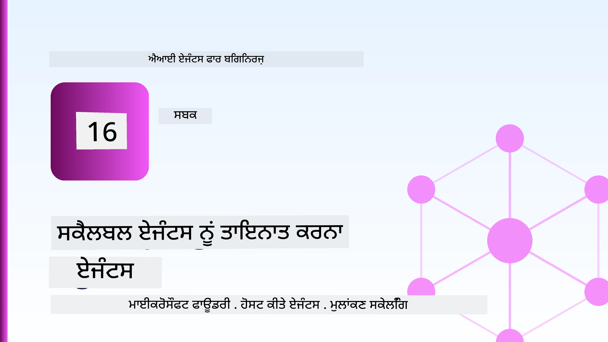
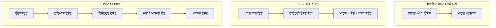
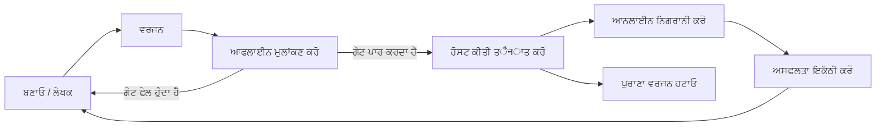
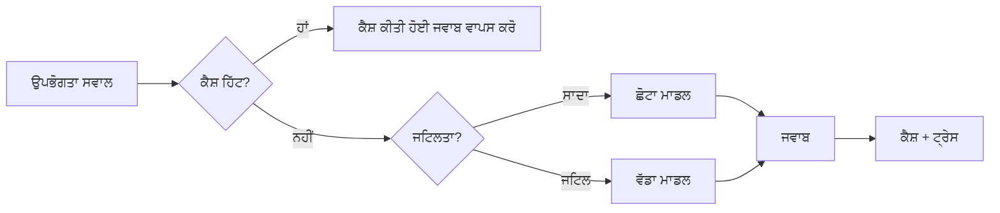
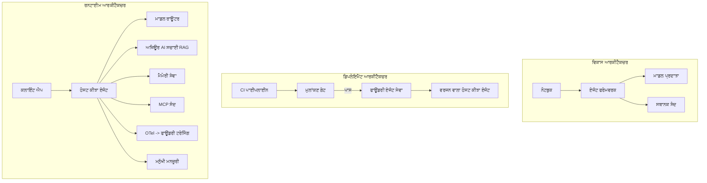

# ਮਾਈਕ੍ਰੋਸਾਫਟ ਫਾਊਂਡਰੀ ਨਾਲ ਸਕੇਲ ਕਰਨ ਯੋਗ ਏਜੰਟਸ ਦੀ ਤਾਇਨਾਤੀ



ਇਸ ਕੋਰਸ ਦੇ ਇਸ ਤੱਕ ਤੁਸੀਂ ਉਹ ਏਜੰਟ ਬਣਾਏ ਹਨ ਜੋ ਤੁਹਾਡੇ ਲੈਪਟਾਪ 'ਤੇ, ਇੱਕ ਨੋਟਬੁੱਕ ਦੇ ਅੰਦਰ, `az login` ਅਤੇ ਕੁਝ ਵਾਤਾਵਰਣ 변수ਾਂ ਦੇ ਨਾਲ ਚਲਦੇ ਹਨ। ਇਹ ਸਿੱਖਣ ਦਾ ਸਹੀ ਤਰੀਕਾ ਹੈ। ਪਰ ਇਹ ਉਹ ਸਹੀ ਤਰੀਕਾ ਨਹੀਂ ਹੈ ਜਦੋਂ ਹਜ਼ਾਰਾਂ ਗ੍ਰਾਹਕ 3 ਵਜੇ ਸਵੇਰੇ ਕਿਸੇ ਏਜੰਟ 'ਤੇ ਨਿਰਭਰ ਕਰਦੇ ਹਨ।

ਇਹ ਪਾਠ "ਇਹ ਮੇਰੇ ਮਸ਼ੀਨ 'ਤੇ ਚੱਲਦਾ ਹੈ" ਅਤੇ "ਇਹ ਪ੍ਰੋਡਕਸ਼ਨ ਵਿੱਚ ਭਰੋਸੇਯੋਗ ਅਤੇ ਸਸਤੇ ਤਰੀਕੇ ਨਾਲ ਚੱਲਦਾ ਹੈ" ਦੇ ਵਿਚਕਾਰ ਦੇ ਫਰਕ ਬਾਰੇ ਹੈ। ਅਸੀਂ ਇਹ ਫਰਕ **ਮਾਈਕ੍ਰੋਸਾਫਟ ਫਾਊਂਡਰੀ** ਅਤੇ **ਮਾਈਕ੍ਰੋਸਾਫਟ ਫਾਊਂਡਰੀ ਏਜੰਟ ਸਰਵਿਸ** ਦੀ ਵਰਤੋਂ ਕਰਕੇ ਪੂਰਾ ਕਰਦੇ ਹਾਂ, ਅਤੇ ਅਸੀਂ ਇੱਕ ਅਸਲੀ ਗਾਹਕ ਸਹਾਇਤਾ ਏਜੰਟ ਬਣਾਉਂਦੇ ਹਾਂ ਜਿਸ ਵਿੱਚ ਟੂਲ, ਰੀਟਰੀਵਲ, ਯਾਦ, ਮੁਲਾਂਕਣ ਅਤੇ ਨਿਗਰਾਨੀ ਸ਼ਾਮਲ ਹੈ।

## ਪਰਿਚਯ

ਇਸ ਪਾਠ ਵਿੱਚ ਸਮੇਤ ਹੁੰਦਾ ਹੈ:

- ਇੱਕ **ਪ੍ਰੋਟੋਟਾਈਪ ਏਜੰਟ** ਅਤੇ ਇੱਕ **ਤਾਇਨਾਤ ਏਜੰਟ** ਦੇ ਵਿਚਕਾਰ ਫਰਕ, ਅਤੇ ਇਹ ਬਦਲਾਅ ਮੁੱਖ ਤੌਰ 'ਤੇ ਮਾਡਲ ਦੇ ਆਸ-ਪਾਸ ਸਾਰੀਆਂ ਚੀਜ਼ਾਂ ਬਾਰੇ ਕਿਉਂ ਹੁੰਦਾ ਹੈ।
- ਏਜੰਟਸ ਲਈ **ਤਾਇਨਾਤੀ ਪੈਟਰਨ**: ਕਲਾਇੰਟ-ਹੋਸਟ ਕੀਤਾ, ਸਰਵਿਸ-ਹੋਸਟ (ਹੋਸਟਡ ਏਜੰਟ), ਅਤੇ ਵਰਕਫਲੋ-ਓਰਕੇਸਟਰੇਟেড।
- ਮਾਈਕ੍ਰੋਸਾਫਟ ਫਾਊਂਡਰੀ 'ਤੇ **ਏਜੰਟ ਦਾ ਜੀਵਨਚੱਕਰ** — ਬਣਾਉਣਾ, ਵਰਜ਼ਨ, ਤਾਇਨਾਤੀ, ਮੁਲਾਂਕਣ, ਨਿਗਰਾਨੀ, ਰਿਟਾਈਰ।
- **ਸਕੇਲਿੰਗ ਸਟ੍ਰੈਟਜੀਜ਼**: ਮਾਡਲ ਰੂਟਿੰਗ, ਕੈਸ਼ਿੰਗ, ਸਮਕਾਲੀਤਾ, ਅਤੇ ਬਿਨਾਂ ਸੂਚਨਾ ਵਾਲਾ ਡਿਜ਼ਾਈਨ।
- OpenTelemetry ਅਤੇ ਫਾਊਂਡਰੀ ਟ੍ਰੇਸਿੰਗ ਨਾਲ **ਨਿਗਰਾਨੀ**।
- ਮਾਡਲ ਚੋਣ, ਰੂਟਿੰਗ, ਅਤੇ ਮੁਲਾਂਕਣ ਦਰਵਾਜ਼ਿਆਂ ਰਾਹੀਂ **ਲਾਗਤ ਦੀ ਬਚਤ**।
- **ਕਾਰੋਬਾਰੀ ਵਿਚਾਰ**: ਸਾਸ਼ਨ, ਮਨੁੱਖੀ ਮਨਜ਼ੂਰੀ, ਅਤੇ MCP ਸਰਵਰਾਂ ਨੂੰ ਸੁਰੱਖਿਅਤ ਤਰੀਕੇ ਨਾਲ ਚਲਾਉਣਾ ਪ੍ਰੋਡਕਸ਼ਨ ਵਿੱਚ।

## ਸਿੱਖਣ ਦੇ ਲਕੜ

ਇਸ ਪਾਠ ਨੂੰ ਪੂਰਾ ਕਰਨ ਤੋਂ ਬਾਅਦ, ਤੁਸੀਂ ਜਾਣੋਂਗੇ ਕਿ:

- ਦਿੱਤੇ ਗਏ ਏਜੰਟ ਵਰਕਲੋਡ ਲਈ ਸਹੀ ਤਾਇਨਾਤ ਪੈਟਰਨ ਕਿਵੇਂ ਚੁਣਨਾ ਹੈ।
- ਮਾਈਕ੍ਰੋਸਾਫਟ ਫਾਊਂਡਰੀ ਏਜੰਟ ਸਰਵਿਸ ਨੂੰ ਏਜੰਟ ਤਾਇਨਾਤ ਕਰਨਾ ਤਾਂ ਜੋ ਇਹ ਵਰਜ਼ਨ ਕੀਤਾ ਗਿਆ, ਸਾਸ਼ਿਤ ਅਤੇ ਨਿਗਰਾਨੀਯੋਗ ਬਣ ਜਾਏ।
- ਟ੍ਰੇਸਿੰਗ ਲਈ ਏਜੰਟ ਨੂੰ ਇੰਸਟ੍ਰੂਮੈਂਟ ਕਰਨਾ ਅਤੇ ਇੱਕ ਮੁਲਾਂਕਣ ਪਾਈਪਲਾਈਨ ਜੋ ਹਰ ਰਿਲੀਜ਼ ਤੋਂ ਪਹਿਲਾਂ ਚਲਦੀ ਹੈ, ਉਹਨੂੰ ਜੁੜਨਾ।
- ਮਾਡਲ ਰੂਟਿੰਗ ਅਤੇ ਕੈਸ਼ਿੰਗ ਵਰਤ ਕੇ ਲੇਟੈਂਸੀ ਅਤੇ ਲਾਗਤ ਨੂੰ ਸਕੇਲ 'ਤੇ ਕਾਬੂ ਵਿੱਚ ਰੱਖਣਾ।
- ਉੱਚ-ਖਤਰੇ ਵਾਲੇ ਕਰਮਾਂ ਲਈ ਮਨੁੱਖੀ ਮਨਜ਼ੂਰੀ ਦਰਵਾਜ਼ਾ ਸ਼ਾਮਲ ਕਰਨਾ ਅਤੇ MCP ਸਰਵਰ ਨੂੰ ਪ੍ਰੋਡਕਸ਼ਨ-ਸੁਰੱਖਿਅਤ ਤਰੀਕੇ ਨਾਲ ਇণ্টਿਗ੍ਰੇਟ ਕਰਨਾ।

## ਪੂਰਕ ਸਮਗਰੀ

ਇਹ ਪਾਠ ਧਾਰਨਾ ਕਰਦਾ ਹੈ ਕਿ ਤੁਸੀਂ ਪਹਿਲਾਂ ਦੀਆਂ ਪਾਠਾਂ ਨੂੰ ਪੂਰਾ ਕਰ ਚੁੱਕੇ ਹੋ ਅਤੇ ਸਉਖਿਅਨਾਪੂਰਕ ਹੋ:

- [Microsoft Agent Framework](../14-microsoft-agent-framework/README.md) ਨਾਲ ਏਜੰਟ ਬਣਾਉਣਾ (ਪਾਠ 14)।
- [ਟੂਲ ਵਰਤੋਂ](../04-tool-use/README.md) (ਪਾਠ 4) ਅਤੇ [Agentic RAG](../05-agentic-rag/README.md) (ਪਾਠ 5)।
- [ਏਜੰਟ ਯਾਦ](../13-agent-memory/README.md) (ਪਾਠ 13) ਅਤੇ [Agentic ਪ੍ਰੋਟੋਕਾਲ / MCP](../11-agentic-protocols/README.md) (ਪਾਠ 11)।
- [ਨਿਗਰਾਨੀ ਅਤੇ ਮੁਲਾਂਕਣ](../10-ai-agents-production/README.md) (ਪਾਠ 10) — ਇਹ ਪਾਠ ਇਸ ਤੇ ਸੀਧਾ ਨਿਰਭਰ ਕਰਦਾ ਹੈ।

ਤੁਹਾਨੂੰ ਇਹ ਵੀ ਚਾਹੀਦਾ ਹੈ:

- ਇੱਕ **Azure ਸਬਸਕ੍ਰਿਪਸ਼ਨ** ਅਤੇ ਇੱਕ **Microsoft Foundry ਪ੍ਰੋਜੈਕਟ** ਜਿਸ ਚ ਘੱਟੋ-ਘੱਟ ਇੱਕ ਚੈਟ ਮਾਡਲ ਤਾਇਨਾਤ ਹੋਵੇ।
- **Azure CLI** ਪ੍ਰਮਾਣਿਤ (`az login`)।
- Python 3.12+ ਅਤੇ ਰਿਪੋਜਿਟਰੀ ਵਿੱਚ ਪੈਕੇਜ [`requirements.txt`](../../../requirements.txt)।

## ਪ੍ਰੋਟੋਟਾਈਪ ਤੋਂ ਪ੍ਰੋਡਕਸ਼ਨ ਤੱਕ: ਅਸਲ ਵਿੱਚ ਕੀ ਬਦਲਦਾ ਹੈ

ਇੱਕ ਪ੍ਰੋਟੋਟਾਈਪ ਏਜੰਟ ਅਤੇ ਇੱਕ ਪ੍ਰੋਡਕਸ਼ਨ ਏਜੰਟ ਇੱਕੋ ਮੁੱਖ ਲੂਪ ਨੂੰ ਸਾਂਝਾ ਕਰਦੇ ਹਨ — ਸੋਚਣਾ, ਟੂਲ ਕਾਲ ਕਰਨਾ, ਜਵਾਬ ਦੇਣਾ। ਜੋ ਕੁਝ ਬਦਲਦਾ ਹੈ ਉਹ ਉਸ ਲੂਪ ਦੇ ਆਲੇ-ਦੁਆਲੇ ਦੀਆਂ ਸਭ ਚੀਜ਼ਾਂ ਹਨ। ਮਾਡਲ ਸ਼ਾਇਦ ਪ੍ਰੋਡਕਸ਼ਨ ਏਜੰਟ ਦਾ 20% ਹੈ; ਬਾਕੀ 80% ਓਪਰੇਸ਼ਨਲ ਢਾਂਚਾ ਹੈ।

| ਚਿੰਤਾ | ਪ੍ਰੋਟੋਟਾਈਪ | ਪ੍ਰੋਡਕਸ਼ਨ |
| --- | --- | --- |
| **ਹੋਸਟਿੰਗ** | ਤੁਹਾਡੇ ਨੋਟਬੁੱਕ ਵਿੱਚ ਚੱਲਦਾ ਹੈ | ਇੱਕ ਹੋਸਟਡ ਸਰਵਿਸ ਵਜੋਂ ਚੱਲਦਾ ਹੈ, ਵਰਜ਼ਨ ਕੀਤਾ ਅਤੇ ਰੋਲ ਆਉਟ ਕੀਤਾ ਜਾਂਦਾ ਹੈ |
| **ਪਹਿਚਾਣ** | ਤੁਹਾਡੇ `az login` ਟੋਕਨ | ਸਕੋਪਡ RBAC ਨਾਲ ਪ੍ਰਬੰਧਿਤ ਪਹਿਚਾਣ |
| **ਸਥਿਤੀ** | ਇਨ-ਮੇਮੋਰੀ, ਰੀਸਟਾਰਟ ਤੇ ਖੋ ਜਾਂਦਾ ਹੈ | ਬਾਹਰੀਕ੍ਰਿਤ (ਥਰੈਡ ਸਟੋਰ, ਯਾਦ ਸੇਵਾ) |
| **ਫੇਲ੍ਹਯਾ** | ਤੁਸੀਂ ਟਰੇਸਬੈਕ ਵੇਖਦੇ ਹੋ | ਮੁੜ ਕੋਸ਼ਿਸ਼ਾਂ, ਫਾਲਬੈਕ, ਡੈਡ-ਲੇਟਰ, ਅਲਾਰਟ |
| **ਲਾਗਤ** | "ਇਹ ਕੁਝ ਸੈਂਟ ਹੈ" | ਦਰਖ਼ਾਸਤ ਪ੍ਰਤੀ ਟ੍ਰੈਕ ਕੀਤਾ, ਰੂਟਿੰਗ, ਕੈਸ਼, ਬਜਟ |
| **ਕੁਆਲਟੀ** | ਤੁਸੀਂ ਨਿਕਾਸੀ ਦੇਖਦੇ ਹੋ | ਹਰ ਰਿਲੀਜ਼ ਤੋਂ ਪਹਿਲਾਂ ਸਵੈਚਾਲਿਤ ਮੁਲਾਂਕਣ |
| **ਭਰੋਸਾ** | ਤੁਸੀਂ ਹਰ ਕਾਰਵਾਈ ਨੂੰ ਮਨਜ਼ੂਰ ਕਰਦੇ ਹੋ | ਨੀਤੀ + ਉੱਚ-ਖਤਰੇ ਵਾਲੇ ਕਰਮ ਲਈ ਮਨੁੱਖੀ-ਇਨ-ਲੂਪ |

ਇਸ ਟੇਬਲ ਨੂੰ ਦਿਮਾਗ ਵਿੱਚ ਰੱਖੋ। ਹੇਠਾਂ ਦਿੱਤੀ ਹਰ ਸੈਕਸ਼ਨ ਇਨ੍ਹਾਂ ਕਤਾਰਾਂ ਵਿੱਚੋਂ ਕਿਸੇ ਇੱਕ ਕੋਲ ਮੇਲ ਖਾਂਦੀ ਹੈ।

## ਏਜੰਟ ਤਾਇਨਾਤੀ ਪੈਟਰਨ

ਤਿੰਨ ਪੈਟਰਨ ਹਨ ਜੋ ਤੁਸੀਂ ਬਹੁਤ ਵਾਰੀ ਮਿਲਾ ਕੇ ਵਰਤੋਂਗੇ।

### 1. ਕਲਾਇੰਟ-ਹੋਸਟਡ ਏਜੰਟ

ਏਜੰਟ ਆਬਜੈਕਟ *ਤੁਹਾਡੇ* ਐਪਲੀਕੇਸ਼ਨ ਪ੍ਰਕਿਰਿਆ ਵਿੱਚ ਰਹਿੰਦਾ ਹੈ। ਤੁਹਾਡਾ ਕੋਡ ਮਾਡਲ ਪ੍ਰਦਾਤਾ ਨੂੰ ਸਿੱਧਾ ਕਾਲ ਕਰਦਾ ਹੈ; ਸੋਚਣ ਵਾਲਾ ਲੂਪ ਤੁਹਾਡੇ ਸਰਵਿਸ ਵਿੱਚ ਚੱਲਦਾ ਹੈ। ਇਹ ਉਹੀ ਹੈ ਜੋ ਹਰ ਪਿਛਲਾ ਪਾਠ ਕੀਤਾ ਹੈ।

- **ਵਰਤੋਂ ਕਿਸ ਸਮੇਂ** ਜਦੋਂ ਤੁਹਾਨੂੰ ਲੂਪ ਉੱਤੇ ਪੂਰਾ ਕਾਬੂ, ਕਸਟਮ ਮਿਡਲਵੇਅਰ ਦੀ ਲੋੜ ਹੋਵੇ, ਜਾਂ ਤੁਸੀਂ ਏਜੰਟ ਨੂੰ ਮੌਜੂਦਾ ਬੈਕਐਂਡ ਵਿੱਚ ਸ਼ਾਮਲ ਕਰ ਰਹੇ ਹੋ।
- **ਹਾਨੀ**: ਤੁਸੀਂ ਅਪਣੀ ਸਕੇਲਿੰਗ, ਸਥਿਤੀ ਅਤੇ ਲਚਕੀਲਾਪਣ ਨੂੰ ਆਪਣੀ ਮਰਜ਼ੀ ਨਾਲ ਸੰਭਾਲਦੇ ਹੋ।

### 2. ਹੋਸਟਡ ਏਜੰਟ (ਫਾਊਂਡਰੀ ਏਜੰਟ ਸਰਵਿਸ)

ਏਜੰਟ ਨੂੰ ਮਾਈਕ੍ਰੋਸਾਫਟ ਫਾਊਂਡਰੀ ਵਿੱਚ *ਸੰਸਾਧਨ ਵਜੋਂ ਰਜਿਸਟਰ* ਕੀਤਾ ਜਾਂਦਾ ਹੈ। ਫਾਊਂਡਰੀ ਸੋਚਣ ਵਾਲਾ ਲੂਪ ਦੌੜਾਉਂਦਾ ਹੈ, ਧਾਗੇ ਸੰਭਾਲਦਾ ਹੈ, ਸਮੱਗਰੀ ਦੀ ਸੁਰੱਖਿਆ ਅਤੇ RBAC ਲਾਗੂ ਕਰਦਾ ਹੈ, ਅਤੇ ਏਜੰਟ ਨੂੰ ਫਾਊਂਡਰੀ ਪੋਰਟਲ ਵਿੱਚ ਵਰਤੋਂਕਰਤਾ ਬਣਾਉਂਦਾ ਹੈ। ਤੁਹਾਡੀ ਐਪ ਇੱਕ ਪਤਲੀ ਕਲਾਇੰਟ ਬਣ ਜਾਂਦੀ ਹੈ ਜੋ ਧਾਗੇ ਬਣਾਉਂਦੀ ਅਤੇ ਜਵਾਬ ਪੜ੍ਹਦੀ ਹੈ।

- **ਵਰਤੋਂ ਕਿਸ ਸਮੇਂ** ਜਦੋਂ ਤੁਸੀਂ ਦਿਰਘਕਾਰੀ, ਇੰਬਿਲਟ ਨਿਗਰਾਨੀ, ਸਾਸ਼ਨ, ਅਤੇ ਘੱਟ ਓਪਰੇਸ਼ਨਲ ਸਰਫੇਸ ਚਾਹੁੰਦੇ ਹੋ।
- **ਹਾਨੀ**: ਮੈਨੇਜ ਕੀਤੀ ਚਲਾਊ ਰਨਟਾਈਮ ਲਈ ਘੱਟ ਤਹਿ-ਸਤਰੀ ਕਾਬੂ।

### 3. ਏਜੰਟ ਵਰਕਫਲੋ

ਕਈ ਏਜੰਟਸ (ਅਤੇ ਟੂਲ) ਨੂੰ ਇੱਕ ਗ੍ਰਾਫ ਵਿੱਚ ਜੋੜਿਆ ਜਾਂਦਾ ਹੈ ਜਿਸ ਵਿੱਚ ਸਪੱਸ਼ਟ ਕੰਟਰੋਲ ਫਲੋ ਹੁੰਦਾ ਹੈ — ਲੜੀਵਾਰ ਕਦਮ, ਸ਼ਾਖਾ ਬਣਾਉਣਾ, ਮਨੁੱਖੀ ਮਨਜ਼ੂਰੀ ਨੋਡ, ਅਤੇ ਦਿਰਘਕਾਰੀ ਚੈਕਪੌਇੰਟ ਜੋ ਰੋਕ ਕੇ ਮੁੜ ਚਾਲੂ ਕਰ ਸਕਦੇ ਹਨ। ਇਹ ਮਾਈਕ੍ਰੋਸਾਫਟ ਏਜੰਟ ਫਰੇਮਵਰਕ ਦੀ **ਵਰਕਫਲੋਜ਼** ਖੂਬੀ ਹੈ ਜੋ ਤਾਇਨਾਤੀ ਪੈਮਾਨੇ 'ਤੇ ਵਰਤੀ ਜਾਂਦੀ ਹੈ।

- **ਵਰਤੋਂ ਕਿਸ ਸਮੇਂ** ਜਦੋਂ ਇੱਕ ਸਿੰਗਲ ਕੰਮ ਕਈ ਵਿਸ਼ੇਸ਼ ਏਜੰਟਾਂ ਵਿੱਚ ਫੈਲਿਆ ਹੋਵੇ ਜਾਂ ਮੱਧ ਵਿਚ ਮਨਜ਼ੂਰੀ ਕਦਮ ਲੋੜੀਂਦਾ ਹੋਵੇ।
- **ਹਾਨੀ**: ਵੱਧ ਹਿੱਸਿਆਂ ਦੀ ਲੋੜ; ਓਰਕੇਸਟਰੇਸ਼ਨ ਪੱਧਰ ਦੀ ਨਿਗਰਾਨੀ ਦੀ ਲੋੜ।



## ਮਾਈਕ੍ਰੋਸਾਫਟ ਫਾਊਂਡਰੀ 'ਤੇ ਏਜੰਟ ਦਾ ਜੀਵਨਚੱਕਰ

ਏਜੰਟ ਨੂੰ ਤਾਇਨਾਤ ਕਰਨਾ ਇੱਕ ਵਾਰੀ ਦਾ `push` ਨਹੀਂ ਹੈ। ਇਹ ਇੱਕ ਲੂਪ ਹੈ, ਅਤੇ ਇਹ 소ਫਟਵੇਅਰ ਰਿਲੀਜ਼ ਸਾਈਕਲ ਵਰਗਾ ਲਗਦਾ ਹੈ ਕਿਉਂਕਿ ਇਹ ਅਸਲ ਵਿੱਚ ਉਹੀ ਹੈ।



ਮੁੱਖ ਵਿਚਾਰ, [ਪਾਠ 10](../10-ai-agents-production/README.md) ਤੋਂ ਲਿਆ ਗਿਆ: **ਆਫਲਾਈਨ ਮੁਲਾਂਕਣ ਇੱਕ ਦਰਵਾਜ਼ਾ ਹੈ, ਨਾ ਕਿ ਬਾਅਦ ਦੀ ਸੋਚ।** ਇੱਕ ਨਵਾਂ ਏਜੰਟ ਵਰਜ਼ਨ ਤਦ ਤੱਕ ਨਹੀੰ ਭੇਜਿਆ ਜਾਂਦਾ ਜਦ ਤੱਕ ਇਹ ਤੁਹਾਡੇ ਮੁਲਾਂਕਣ ਸਰਹੱਦਾਂ ਨੂੰ ਪਾਰ ਨਾ ਕਰ ਲਵੇ। ਔਨਲਾਈਨ ਨਿਗਰਾਨੀ ਅਸਲੀ ਦੁਨੀਆ ਦੀਆਂ ਫੇਲ੍ਹਯਾਂ ਨੂੰ ਤੁਹਾਡੇ ਆਫਲਾਈਨ ਟੈਸਟ ਸੈੱਟ ਵਿੱਚ ਫੀਡ ਕਰਦੀ ਹੈ। ਇਹ ਸਾਰਾ ਲੂਪ ਹੈ।

## ਸਕੇਲਿੰਗ ਸਟ੍ਰੈਟਜੀਜ਼

ਏਜੰਟ ਨੂੰ ਸਕੇਲ ਕਰਨਾ ਇੱਕ ਸਟੈਟਲੈੱਸ ਵੈੱਬ API ਨੂੰ ਸਕੇਲ ਕਰਨ ਤੋਂ ਵੱਖਰਾ ਹੈ, ਕਿਉਂਕਿ ਹਰ ਰਿਕੁਏਸਟ ਕਈ ਮਹਿੰਗੇ ਮਾਡਲ ਅਤੇ ਟੂਲ ਕਾਲ ਸਕਦਾ ਹੈ। ਚਾਰ ਤਕਨੀਕਾਂ ਜ਼ਿਆਦਾਤਰ ਭਾਰ ਵਰਦੀਆਂ ਹਨ।

**ਸਟੈਟਲੈੱਸ ਰਿਕੁਏਸਟ ਸਾਂਭਣਾ।** ਆਪਣੇ ਪ੍ਰਕਿਰਿਆ ਮੈਮੋਰੀ ਵਿੱਚ ਕਿਸੇ ਵੀ ਉਪਭੋਗਤਾ ਸਥਿਤੀ ਨੂੰ ਰੱਖੋ ਨਾ। ਗੱਲਬਾਤੇ ਧਾਗਿਆਂ ਨੂੰ ਫਾਊਂਡਰੀ ਧਾਗਾ ਸਟੋਰ ਜਾਂ ਯਾਦ ਸੇਵਾ ਵਿੱਚ ਸਟੋਰ ਕਰੋ ਤਾਂ ਜੋ ਕੋਈ ਵੀ ਇੰਜਣ ਕੋਈ ਵੀ ਬੇਨਤੀ ਸੰਭਾਲ ਸਕੇ। ਇਹ ਤੁਸੀਂ ਕਿਵੇਂ ਅਨੁਕੂਲ ਰੂਪ ਨਾਲ ਵੱਡਾ ਕਰ ਸਕਦੇ ਹੋ — ਇੰਸਟੈਂਸ ਵਧਾਓ, ਕੋਈ ਵਧੀਆ ਸੈਸ਼ਨ ਨਹੀਂ।

**ਮਾਡਲ ਰੂਟਿੰਗ।** ਹਰ ਬੇਨਤੀ ਨੂੰ ਤੁਹਾਡੇ ਸਭ ਤੋਂ ਸਮਰੱਥ (ਅਤੇ ਸਭ ਤੋਂ ਮਹਿੰਗੇ) ਮਾਡਲ ਦੀ ਲੋੜ ਨਹੀਂ ਹੁੰਦੀ। ਸਧਾਰਣ ਬੇਨਤੀਆਂ — ਮਨਸ਼ਾ ਵਰਗੀਕਰਨ, ਛੋਟੇ ਤੱਥਾਤਮਕ ਜਵਾਬ — ਨੂੰ ਛੋਟੇ ਤੇ ਤੇਜ਼ ਮਾਡਲ ਨੂੰ ਰੂਟ ਕਰੋ, ਅਤੇ ਵੱਡੇ ਮਾਡਲ ਨੂੰ ਸੱਚੀ ਸੋਚ ਲਈ ਰਿਜ਼ਰਵ ਕਰੋ। ਫਾਊਂਡਰੀ ਦਾ **ਮਾਡਲ ਰੂਟਰ** ਤੁਹਾਡੇ ਲਈ ਇਹ ਕਰ ਸਕਦਾ ਹੈ, ਜਾਂ ਤੁਸੀਂ ਖੁਦ ਇੱਕ ਹਲਕਾ ਕਲਾਸੀਫਾਇਰ ਬਣਾਉ। ਤੁਸੀਂ ਲੈਬ ਵਿੱਚ DIY ਵਰਜ਼ਨ ਬਣਾਉਗੇ।

**ਜਵਾਬ ਕੈਸ਼ਿੰਗ।** ਬਹੁਤ ਸਾਰੇ ਸਹਾਇਤਾ ਸਵਾਲ ਲਗਭਗ ਇੱਕ ਜਿਹੇ ("ਮੈਂ ਆਪਣਾ ਪਾਸਵਰਡ ਕਿਵੇਂ ਰੀਸੈੱਟ ਕਰਾਂ?") ਹੁੰਦੇ ਹਨ। ਆਮ ਸਵਾਲਾਂ ਦੇ ਜਵਾਬ ਕੈਸ਼ ਕਰੋ ਅਤੇ ਮਾਡਲ ਨੂੰ ਬਿਨਾਂ ਹਿੱਟ ਕੀਤੇ ਹੀ ਉਹਨਾਂ ਨੂੰ ਸੇਵਾ ਦਿਓ। ਇਥੋਂ ਤੱਕ ਕੇ ਇੱਕ ਥੋੜਾ ਜਿਹਾ ਕੈਸ਼ ਹਿਟ ਦਰ ਲਾਗਤ ਅਤੇ ਲੇਟੈਂਸੀ ਨੂੰ ਮਹੱਤਵਪੂਰਨ ਤਰੀਕੇ ਨਾਲ ਘਟਾਉਂਦੀ ਹੈ।

**ਸਮਕਾਲੀਤਾ ਅਤੇ ਬੈਕਪ੍ਰੈਸ਼ਰ।** ਮਾਡਲ ਪ੍ਰਦਾਤਾ ਦਰ ਸੀਮਤਾਂ ਵਿੱਚ ਹਨ। ਆਪਣੇ ਸਮਕਾਲੀਤਾ ਨੂੰ ਸੀਮਿਤ ਕਰੋ, ਵਿਆਜ ਨਾਲ ਮੁੜ ਕੋਸ਼ਿਸ਼ਾਂ ਕਰੋ, ਅਤੇ ਨਰਮਾਈ ਨਾਲ ਨਾਕਾਮ ਹੋਵੋ (ਕਿਊ ਕੀਤੀ "ਅਸੀਂ ਕੰਮ ਕਰ ਰਹੇ ਹਾਂ" ਜਵਾਬ ਇੱਕ 500 ਦੀ ਭੇਤਰ ਹੈ)।



## ਪ੍ਰੋਡਕਸ਼ਨ ਵਿੱਚ ਨਿਗਰਾਨੀ

ਤੁਸੀਂ ਉਹ ਨਹੀਂ ਚਲਾ ਸਕਦੇ ਜੋ ਤੁਸੀਂ ਨਹੀਂ ਦੇਖ ਸਕਦੇ। ਜਿਵੇਂ ਕਿ ਪਾਠ 10 ਵਿੱਚ ਕਿਹਾ ਗਿਆ, ਮਾਈਕ੍ਰੋਸਾਫਟ ਏਜੰਟ ਫਰੇਮਵਰਕ **OpenTelemetry** ਟ੍ਰੇਸ ਨੈਟਿਵ ਤੌਰ 'ਤੇ ਨਿਕਾਲਦਾ ਹੈ — ਹਰ ਮਾਡਲ ਕਾਲ, ਟੂਲ ਇਨਵੋਕੇਸ਼ਨ, ਅਤੇ ਓਰਕੇਸਟਰੇਸ਼ਨ ਕਦਮ ਇੱਕ ਸਪੈਨ ਬਣ ਜਾਂਦੇ ਹਨ। ਪ੍ਰੋਡਕਸ਼ਨ ਵਿੱਚ ਤੁਸੀਂ ਉਹ ਸਪੈਨ ਮਾਈਕ੍ਰੋਸਾਫਟ ਫਾਊਂਡਰੀ (ਜਾਂ ਕਿਸੇ ਵੀ OTel-ਸਮਰਥਿਤ ਬੈਕਐਂਡ) ਨੂੰ ਨਿਰਯਾਤ ਕਰਦੇ ਹੋ ਤਾਂ ਜੋ ਤੁਸੀਂ:

- ਇੱਕ ਗਾਹਕ ਦੀ ਸ਼ਿਕਾਇਤ ਨੂੰ ਹਰ ਮਾਡਲ ਅਤੇ ਟੂਲ ਕਾਲ 'ਤੇ ਅੰਤ ਤੋਂ ਅੰਤ ਤੱਕ ਟ੍ਰੇਸ ਕਰੋ।
- ਸਮੇਂ ਦੇ ਨਾਲ ਹਰ ਬੇਨਤੀ ਲਈ p50/p95 ਲੇਟੈਂਸੀ ਅਤੇ ਲਾਗਤ ਦੇਖੋ।
- ਗਲਤੀ ਦਰ ਵਿੱਚ ਬੁਲੰਦੀਆਂ ਅਤੇ ਲਾਗਤ ਵਿਸ਼ਮਤਾਵਾਂ 'ਤੇ ਅਲਾਰਟ ਕਰੋ ਪਹਿਲਾਂ ਕਿ ਤੁਹਾਡੇ ਉਪਭੋਗਤਾ (ਜਾਂ ਤੁਹਾਡੀ ਵਿੱਤੀ ਟੀਮ) ਉਹਨਾਂ ਨੂੰ ਮਹਿਸੂਸ ਕਰੇ।

```python
from agent_framework.observability import get_tracer

tracer = get_tracer()

with tracer.start_as_current_span("support_request") as span:
    span.set_attribute("customer.tier", "enterprise")
    span.set_attribute("routed.model", "gpt-5-nano")
    # ਇਸ ਸਪੈਨ ਦੇ ਅੰਦਰ ਏਜੰਟ ਕਾਰਜਨਵਾਈ ਆਪਮੈਟਿਕ ਤੌਰ 'ਤੇ ਟ੍ਰੇਸ ਕੀਤੀ ਜਾਂਦੀ ਹੈ
```

`customer.tier` ਅਤੇ `routed.model` ਵਰਗੀਆਂ ਵਿਸ਼ੇਸ਼ਤਾਵਾਂ ਉਹ ਹਨ ਜੋ ਟ੍ਰੇਸ ਦੀ ਇੱਕ ਦੇਵਾਲ ਨੂੰ ਉੱਤਰਦਾਇਤ ਪ੍ਰਸ਼ਨਾਂ ਵਿੱਚ ਤਬਦੀਲ ਕਰਦੀਆਂ ਹਨ ("ਕੀ ਵਪਾਰਿਕ ਗਾਹਕ ਛੋਟੇ ਮਾਡਲ ਵੱਲ ਬਹੁਤ ਵਾਰ ਰੂਟ ਕੀਤੇ ਜਾ ਰਹੇ ਹਨ?")।

## ਲਾਗਤ ਦੀ ਬਚਤ

ਪ੍ਰੋਡਕਸ਼ਨ ਏਜੰਟਾਂ ਵਿੱਚ ਲਾਗਤ ਟੋਕਨ ਦੁਆਰਾ ਵਧੀਆ ਨਿਯੰਤ੍ਰਿਤ ਹੁੰਦੀ ਹੈ। ਪ੍ਰਭਾਵ ਦੀ ਕ੍ਰਮ ਵਿੱਚ ਤਿੰਨ ਓਜ:

1. **ਮਾਡਲ ਦਾ ਠੀਕ ਆਕਾਰ.** ਇੱਕ ਛੋਟਾ ਮਾਡਲ ਜੋ ਤੁਹਾਡੀ ਮੁਲਾਂਕਣ ਗੇਟ ਪਾਸ ਕਰਦਾ ਹੈ, ਲਗਭਗ ਸਦਾ ਇੱਕ ਵੱਡੇ ਮਾਡਲ ਨਾਲੋਂ ਸਸਤਾ ਹੁੰਦਾ ਹੈ ਜੋ ਵੀ ਪਾਸ ਕਰਦਾ ਹੈ। ਮੁਲਾਂਕਣ ਦੀ ਵਰਤੋਂ ਕਰਕੇ ਛੋਟੇ ਮਾਡਲ ਦੀ ਕਾਫ਼ੀ ਮਿਆਰੀ ਹੋਣ ਦਾ ਸਬੂਤ ਦਿਓ ਨਾ ਕਿ ਸਾਵਧਾਨੀ ਨਾਲ ਸਭ ਤੋਂ ਵੱਡੇ ਮਾਡਲ ਦੀ ਡਿਫਾਲਟ ਚੋਣ ਕਰੋ।
2. **ਜਟਿਲਤਾ ਅਨੁਸਾਰ ਰੂਟ ਕਰੋ।** ਜਿਵੇਂ ਉੱਪਰ - ਮੁੱਖ ਤੌਰ 'ਤੇ ਵੱਡੇ ਮਾਡਲ ਦੀ ਕੀਮਤ ਸਿਰਫ ਉਹਨਾ ਬੇਨਤੀਆਂ ਲਈ ਭਰੋ ਜੋ ਵੱਡੇ ਮਾਡਲ ਦੀ ਸੋਚਣਾ ਲੋੜੀਂਦੇ ਹਨ।
3. **ਜੋਰਦਾਰ ਕੈਸ਼ਿੰਗ ਕਰੋ।** ਸਭ ਤੋਂ ਸਸਤੀ ਮਾਡਲ ਕਾਲ ਉਹੀ ਹੁੰਦੀ ਹੈ ਜੋ ਤੁਸੀਂ ਕਦੇ ਨਹੀਂ ਕਰਦੇ।

ਮੁਲਾਂਕਣ ਦਰਵਾਜ਼ੇ ਅਤੇ ਲਾਗਤ ਨਿਯੰਤਰਣ ਇੱਕੋ ਅਨੁਸ਼ਾਸਨ ਹਨ ਜੋ ਦੋਣੇ ਕੋਣਾਂ ਤੱਕ ਦੇਖੇ ਜਾਂਦੇ ਹਨ: ਮੁਲਾਂਕਣ ਤੁਹਾਨੂੰ *ਗुणਵੱਤਾ ਦਾ ਫਲੋਰ* ਦੱਸਦਾ ਹੈ, ਰੂਟਿੰਗ ਅਤੇ ਕੈਸ਼ਿੰਗ ਤੁਹਾਨੂੰ ਉਸ ਫਲੋਰ ਦੀ *ਲਾਗਤ* ਦੇ ਨਾਲ ਨੇੜੇ ਰੱਖਦੇ ਹਨ।

## ਕਾਰੋਬਾਰੀ ਤਾਇਨਾਤੀ ਵਿਚਾਰ

**ਸਾਸ਼ਨ।** ਹੋਸਟਡ ਏਜੰਟ ਫਾਊਂਡਰੀ ਦੇ RBAC, ਸਮੱਗਰੀ ਸੁਰੱਖਿਆ ਅਤੇ ਆਡਿਟ ਲੌਗਿੰਗ ਨੂੰ ਵਿਰਾਸਤ ਵਿੱਚ ਲੈਂਦੇ ਹਨ। ਹਰ ਏਜੰਟ ਨੂੰ ਇੱਕ ਪ੍ਰਬੰਧਿਤ ਪਹਿਚਾਣ ਦਿਓ ਜਿਸ ਨੂੰ ਉਹਨਾਂ ਨੂੰ ਲੋੜੀਂਦਾ ਸਭ ਤੋਂ ਘੱਟ ਅਧਿਕਾਰ ਮਿਲੇ — ਗਿਆਨ ਅਧਾਰ ਨੂੰ ਸਿਰਫ ਪੜ੍ਹਨ ਦੀ ਪਹੁੰਚ, ਟਿਕਟਿੰਗ API ਉੱਤੇ ਸਕੋਪਡ ਪਹੁੰਚ, ਹੋਰ ਕੁਝ ਨਹੀਂ।

**ਮਨੁੱਖੀ-ਇਨ-ਲੂਪ।** ਕੁਝ ਕਾਰਵਾਈਆਂ ਬਹੁਤ ਜ਼ਿਆਦਾ ਅਹਿਮ ਹੁੰਦੀਆਂ ਹਨ ਕਿ ਠੀਕ ਢੰਗ ਨਾਲ ਆਟੋਮੇਟ ਨਾ ਕੀਤੀਆਂ ਜਾਣ — ਰੀਫੰਡ ਜਾਰੀ ਕਰਨਾ, ਖਾਤਾ ਮਿਟਾਉਣਾ, ਕਾਨੂੰਨੀ ਟੀਮ ਨੂੰ ਅੱਗੇ ਭੇਜਣਾ। ਮਾਈਕ੍ਰੋਸਾਫਟ ਏਜੰਟ ਫਰੇਮਵਰਕ **ਮੰਜ਼ੂਰੀ-ਲੋੜੀਂਦਾ** ਟੂਲਾਂ ਨੂੰ ਸਹਾਇਤਾ ਦਿੰਦਾ ਹੈ: ਏਜੰਟ ਕਾਰਵਾਈ ਪ੍ਰਸਤਾਵਿਤ ਕਰਦਾ ਹੈ, ਕਾਰਗੁਜ਼ਾਰੀ ਰੁਕ ਜਾਂਦੀ ਹੈ, ਇੱਕ ਮਨੁੱਖੀ ਮਨਜ਼ੂਰ ਜਾਂ ਅਸਵੀਕਾਰ ਕਰਦਾ ਹੈ, ਅਤੇ ਵਰਕਫਲੋ ਮੁੜ ਚੱਲਦਾ ਹੈ। ਤੁਸੀਂ ਇਸਨੂੰ [ਪਾਠ 6](../06-building-trustworthy-agents/README.md) ਵਿੱਚ ਵੇਖਿਆ; ਇੱਥੇ ਤੁਸੀਂ ਇਸਨੂੰ ਤਾਇਨਾਤ ਕਰ ਰਹੇ ਹੋ।

**MCP ਪ੍ਰੋਡਕਸ਼ਨ ਵਿੱਚ।** [MCP](../11-agentic-protocols/README.md) ਤੁਹਾਡੇ ਏਜੰਟ ਨੂੰ ਬਾਹਰੀ ਟੂਲਾਂ ਨੂੰ ਇੱਕ ਮਿਆਰੀ ਇੰਟਰਫੇਸ ਰਾਹੀਂ ਵਰਤਣ ਦਿੰਦਾ ਹੈ। ਪ੍ਰੋਡਕਸ਼ਨ ਵਿੱਚ, ਹਰ MCP ਸਰਵਰ ਨੂੰ ਇੱਕ ਅਨਮਨਜੂਰ ਕੀਤੀ ਹੱਦ ਵਜੋਂ ਸਮਝੋ: ਸਰਵਰ ਵਰਜ਼ਨ ਨੂੰ ਫਿਕਸ ਕਰੋ, ਸਕੋਪਡ ਪਹਿਚਾਣ ਨਾਲ ਚਲਾਓ, ਉਸਦੇ ਨਤੀਜੇ ਵੈਰੀਫਾਈ ਕਰੋ, ਅਤੇ ਕਦੇ ਵੀ ਇਸਨੂੰ ਰਹੱਸ ਬਤਾਓ ਨਾ। ਏ MCP ਸਰਵਰ ਇੱਕ ਡਿਪੈਂਡੈਂਸੀ ਹੈ, ਅਤੇ ਡਿਪੈਂਡੈਂਸੀਜ਼ ਨੂੰ ਪੈਚ, ਆਡਿਟ ਅਤੇ ਰੇਟ-ਸੀਮਤ ਕੀਤਾ ਜਾਂਦਾ ਹੈ।



ਇਹ ਤਿੰਨ ਚਿੱਤਰ — ਵਿਕਾਸ, ਤਾਇਨਾਤ, ਚਲਾਉਣਾ — ਇੱਕੋ ਏਜੰਟ ਦੀ ਇਸ ਦੀ ਜ਼ਿੰਦਗੀ ਦੇ ਤਿੰਨ ਪੜਾਅ ਹਨ। ਹੇਠਾਂ ਦਿੱਤਾ ਲੈਬ ਤੁਹਾਨੂੰ ਇਸਨੂੰ ਬਣਾਉਣ ਵਿੱਚ ਮਦਦ ਕਰੇਗਾ।

## ਹੈਂਡਸ-ਆਨ ਲੈਬ: ਪ੍ਰੋਡਕਸ਼ਨ-ਤਿਆਰ ਗਾਹਕ ਸਹਾਇਤਾ ਏਜੰਟ

ਖੋਲ੍ਹੋ [`code_samples/16-python-agent-framework.ipynb`](./code_samples/16-python-agent-framework.ipynb) ਅਤੇ ਇਸ ਨੂੰ ਅੰਤ ਤੱਕ ਕੰਮ ਕਰੋ। ਤੁਸੀਂ ਇੱਕ **ਕਾਂਟੋਸੋ ਗਾਹਕ ਸਹਾਇਤਾ ਏਜੰਟ** ਬਣਾਓਗੇ ਜਿਸ ਵਿੱਚ ਹਰ ਪ੍ਰੋਡਕਸ਼ਨ ਚਿੰਤਾ ਜੁੜੀ ਹੋਈ ਹੈ:

1. **ਟੂਲ ਕਾਲਿੰਗ** — ਆਰਡਰ ਸਥਿਤੀ ਵੇਖੋ ਅਤੇ ਸਹਾਇਤਾ ਟਿਕਟ ਖੋਲ੍ਹੋ।
2. **RAG** — ਜਾਣਕਾਰੀ ਤਥਾ ਤੋਂ ਨੀਤੀ ਸਵਾਲਾਂ ਦੇ ਜਵਾਬ (Azure AI ਖੋਜ, ਇੱਕ ਇਨ-ਮੇਮੋਰੀ ਬੈਕਅਪ ਨਾਲ ਤਾਂ ਜੋ ਨੋਟਬੁੱਕ ਇੱਕ ਖੋਜ ਸੰਸਾਧਨ ਤੋਂ ਬਿਨਾਂ ਚੱਲ ਸਕੇ)।
3. **ਯਾਦ** — ਗੱਲਬਾਤ ਦੇ ਮੁੜ ਮੁੜ ਮੋੜਾਂ 'ਤੇ ਗਾਹਕ ਨੂੰ ਯਾਦ ਕਰੋ।
4. **ਮਾਡਲ ਰੂਟਿੰਗ** — ਇੱਕ ਜਟਿਲਤਾ ਵਰਗੀਕਰਨ ਹਰ ਬੇਨਤੀ ਨੂੰ ਛੋਟੇ ਜਾਂ ਵੱਡੇ ਮਾਡਲ ਵੱਲ ਰੂਟ ਕਰਦਾ ਹੈ।
5. **ਜਵਾਬ ਕੈਸ਼ਿੰਗ** — ਦੁਹਰਾਏ ਸਵਾਲ ਕੈਸ਼ ਵਿੱਚੋਂ ਸੇਵਾ ਕੀਤੇ ਜਾਂਦੇ ਹਨ।
6. **ਮਨੁੱਖੀ ਮਨਜ਼ੂਰੀ** — ਇੱਕ ਸੀਮਾ ਤੋਂ ਵੱਧ ਰੀਫੰਡਾਂ ਲਈ ਮਨੁੱਖੀ ਸਾਈਨ-ਆਫ਼ ਲਈ ਰੁਕਦੇ ਹਨ।
7. **ਮੁਲਾਂਕਣ ਪਾਈਪਲਾਈਨ** — ਇੱਕ ਛੋਟਾ ਆਫਲਾਈਨ ਟੈਸਟ ਸੈੱਟ ਏਜੰਟ ਨੂੰ ਸਕੋਰ ਕਰਦਾ ਹੈ ਅਤੇ ਰਿਲੀਜ਼ ਦਰਵਾਜ਼ਾ ਵਜੋਂ ਕੰਮ ਕਰਦਾ ਹੈ।
8. **ਨਿਗਰਾਨੀ** — ਹਰ ਬੇਨਤੀ 'ਤੇ OpenTelemetry ਟ੍ਰੇਸਿੰਗ।

### ਵਾਕਥਰੂ

ਨੋਟਬੁੱਕ ਇਸ ਤਰ੍ਹਾਂ ਸੁਚੱਜਾ ਹੈ ਕਿ ਹਰ ਪ੍ਰੋਡਕਸ਼ਨ ਚਿੰਤਾ ਇੱਕ ਖੁਦਮੁਖਤਾਰ, ਚਲਾਈ ਜਾ ਸਕਣ ਵਾਲਾ ਸੈਕਸ਼ਨ ਹੈ। ਇਸਦਾ ਦਿਲ ਹੈ ਰੂਟਿੰਗ-ਪਲੱਸ-ਕੈਸ਼ਿੰਗ ਬੇਨਤੀ ਹੈਂਡਲਰ:

```python
async def handle_support_request(query: str, customer_id: str) -> str:
    # 1. ਜਦੋਂ ਸੰਭਵ ਹੋਵੇ ਤਾਂ ਕੈਸ਼ ਤੋਂ ਸੇਵਾ ਦਿਓ।
    cached = response_cache.get(normalize(query))
    if cached:
        return cached

    # 2. ਲਾਗਤ ਨੂੰ ਕਾਬੂ ਵਿੱਚ ਰੱਖਣ ਲਈ ਜਟਿਲਤਾ ਅਨੁਸਾਰ ਰੂਟ ਕਰੋ।
    model = "gpt-5-nano" if is_simple(query) else "gpt-5-mini"

    # 3. ਨਿਰੀਖਣਯੋਗਤਾ ਲਈ ਏਜੰਟ ਨੂੰ ਟਰੇਸ ਸਪੈਨ ਦੇ ਅੰਦਰ ਚਲਾਓ।
    with tracer.start_as_current_span("support_request") as span:
        span.set_attribute("routed.model", model)
        span.set_attribute("customer.id", customer_id)
        response = await support_agent.run(query, model=model)

    # 4. ਕੈਸ਼ ਕਰੋ ਅਤੇ ਵਾਪਸ ਕਰੋ।
    response_cache.set(normalize(query), response.text)
    return response.text
```

ਜੋ ਮੁਲਾਂਕਣ ਦਰਵਾਜ਼ਾ ਇੱਕ ਰਿਲੀਜ਼ ਦੀ ਹਿਫਾਜ਼ਤ ਕਰਦਾ ਹੈ ਉਹ ਇਸ ਤਰ੍ਹਾਂ ਦਿਖਦਾ ਹੈ:

```python
async def evaluation_gate(agent, test_cases, threshold: float = 0.8) -> bool:
    passed = 0
    for case in test_cases:
        result = await agent.run(case["input"])
        if score_response(result.text, case["expected"]) >= 0.8:
            passed += 1
    pass_rate = passed / len(test_cases)
    print(f"Evaluation pass rate: {pass_rate:.0%} (gate: {threshold:.0%})")
    return pass_rate >= threshold  # ਸਿਰਫ਼ ਗੇਟ ਪਾਸ ਹੋਣ 'ਤੇ ਹੀ deploy ਕਰੋ
```

ਹਰ ਲਾਈਨ ਨੂੰ ਪੜ੍ਹੋ — ਨੋਟਬੁੱਕ ਜਾਨ-ਬੂਝ ਕੇ ਪ੍ਰਿਮਿਟਿਵਜ਼ ਨੂੰ ਛੋਟਾ ਰੱਖਦਾ ਹੈ ਤਾਂ ਜੋ ਕੁਝ ਵੀ ਕਹਿਰ ਫਰੇਮਵਰਕ ਕਾਲ ਦੇ ਪਿੱਛੇ ਨਾ ਲੁਕਿਆ ਹੋਵੇ।

## ਤਾਇਨਾਤ ਏਜੰਟ ਨੂੰ ਸਮੋਕ ਟੈਸਟ ਨਾਲ ਪਰਖਣਾ

ਉੱਪਰ ਦਿੱਤਾ ਮੁਲਾਂਕਣ ਦਰਵਾਜ਼ਾ ਤੁਹਾਡੇ ਏਜੰਟ ਆਬਜੈਕਟ ਦੇ ਖਿਲਾਫ਼ *ਆਫਲਾਈਨ* ਚਲਦਾ ਹੈ। ਜਦੋਂ ਏਜੰਟ ਇੱਕ ਹੋਸਟਡ ਏਜੰਟ ਵਜੋਂ ਤਾਇਨਾਤ ਕੀਤਾ ਜਾਂਦਾ ਹੈ, ਤੁਹਾਨੂੰ ਇੱਕ ਹੋਰ, ਹੋਰ ਸਸਤੀ ਜਾਂਚ ਦੀ ਲੋੜ ਹੁੰਦੀ ਹੈ: **ਕੀ ਤਾਇਨਾਤ ਕੀਤੀ ਸਰਵਿਸ ਅਸਲ ਵਿੱਚ ਜਵਾਬ ਦੇ ਰਹੀ ਹੈ?**

"ਸਫਲਤਾਪੂਰਕ" ਤਾਇਨਾਤੀ ਸਿਰਫ ਇਹ ਸਾਬਤ ਕਰਦੀ ਹੈ ਕਿ ਕੰਟਰੋਲ ਪਲੇਨ ਨੇ ਪਰਿਭਾਸ਼ਾ ਨੂੰ ਸਵੀਕਾਰ ਕਰ ਲਿਆ ਹੈ — ਇਹ ਸਬੂਤ ਨਹੀਂ ਕਿ ਏਜੰਟ ਜਵਾਬ ਦੇ ਰਿਹਾ ਹੈ। ਇਕ ਗਾਇਬ ਸਮਰਥਕ, ਗਲਤ ਮਾਡਲ ਰੂਟਿੰਗ ਜਾਂ ਮਿਆਦ ਮੁਕੰਮਲ সংযোগ ਇੱਕ ਸਫੈਦ ਤਾਇਨਾਤੀ ਬਣਾ ਸਕਦੇ ਹਨ ਜੋ ਕੁਝ ਵੀ ਵਾਪਸ ਨਹੀਂ ਕਰਦਾ। ਇੱਕ **ਸਮੋਕ ਟੈਸਟ** ਇਸਨੂੰ ਸਕਿੰਟਾਂ ਵਿੱਚ ਫੜ ਲੈਂਦਾ ਹੈ, ਹਰ ਤਾਇਨਾਤ ਉੱਤੇ, ਪੂਰੀ ਮੁਲਾਂਕਣ ਦੀ ਲਾਗਤ ਤੋਂ ਬਿਨਾਂ।

ਇਹ ਰਿਪੋਜਿਟਰੀ ਇੱਕ ਤਿਆਰ-ਇਸਤਮਾਲ ਸਮੋਕ-ਟੈਸਟ ਪਾਈਪਲਾਈਨ ਦੇ ਨਾਲ ਆਉਂਦੀ ਹੈ ਜੋ [AI ਸਮੋਕ ਟੈਸਟ](https://github.com/marketplace/actions/ai-smoke-test) GitHub ਐਕਸ਼ਨ 'ਤੇ ਬਣਾਇਆ ਗਿਆ ਹੈ:

- **ਕੈਟਾਲਾਗ** — [`tests/lesson-16-smoke-tests.json`](../../../tests/lesson-16-smoke-tests.json) ਵਿੱਚ ਕਾਂਟੋਸੋ ਸਹਾਇਤਾ ਏਜੰਟ ਲਈ ਪ੍ਰੰਪਟ ਅਤੇ ਦਾਅਵੇ ਹਨ (ਮੀਟ ਭੁੱਲਣ ਵਾਲੀ ਨੀਤੀ ਦੇ ਜਵਾਬ, ਆਰਡਰ ਦੀ ਜਾਂਚ, ਵਿਸ਼ੇ 'ਤੇ ਰਹਿਣਾ, ਅਤੇ ਬਹੁ-ਮੋਰ ਧਾਗਾ ਅਟਕਲ)। ਹੋਰ ਪਾਠਾਂ ਦੇ ਏਜੰਟਾਂ ਲਈ ਕੈਟਾਲਾਗ ਨਾਲ ਇੱਥੇ ਨਾਲ ਰਹਿੰਦੇ ਹਨ — ਵੇਖੋ [`tests/README.md`](../tests/README.md)।
- **ਵਰਕਫਲੋ** — [`.github/workflows/smoke-test.yml`](../../../.github/workflows/smoke-test.yml) Azure OIDC ਨਾਲ ਲੌਗਇਨ ਕਰਦਾ ਹੈ ਅਤੇ ਹਰ ਪ੍ਰੰਪਟ ਨੂੰ ਏਜੰਟ ਦੇ Responses ਐਂਡਪੌਇੰਟ ਤੇ POST ਕਰਦਾ ਹੈ, ਕਿਸੇ ਵੀ ਦਾਅਵੇ ਨਾ ਪੂਰੇ ਹੋਣ 'ਤੇ ਕੰਮ ਫੇਲ ਕਰਦਾ ਹੈ।

```yaml
- name: Smoke-test hosted agent
  uses: JFolberth/ai-smoketest@v1
  with:
    project_endpoint: ${{ inputs.project_endpoint }}
    agent_name: ContosoSupportAgent
    tests_file: tests/lesson-16-smoke-tests.json
```


ਇੱਕ ਵਾਰੀ ਤੁਹਾਡਾ ਏਜੰਟ ਤੈਨਾਤ ਹੋਣ 'ਤੇ, **Actions** ਟੈਬ ਤੋਂ ਇਸਨੂੰ ਚਲਾਓ, ਆਪਣਾ Foundry ਪ੍ਰੋਜੈਕਟ ਐਂਡਪੌਇੰਟ ਅਤੇ ਏਜੰਟ ਦਾ ਨਾਮ ਦਿੰਦੇ ਹੋਏ। ਫੈਡਰੇਟਿਡ ਆਈਡੈਂਟੀਟੀ ਨੂੰ Foundry ਪ੍ਰੋਜੈਕਟ ਸਕੋਪ 'ਤੇ **Azure AI User** ਰੋਲ ਦੀ ਲੋੜ ਹੈ। ਲੇਅਰਾਂ ਨੂੰ ਇੱਕ ਪਿਰਾਮਿਡ ਵਾਂਗ ਸੋਚੋ: ਧੂੰਏਂ ਦੇ ਟੈਸਟ (ਪਹੁੰਚਯੋਗ ਅਤੇ ਜਵਾਬ ਦੇ ਰਹੇ ਹਨ?) ਹਰ ਡਿਪਲੋਇ ਤੇ ਚੱਲਦੇ ਹਨ, ਅਫਲਾਈਨ ਮੁਲਾਂਕਣ (ਕਿਥੇ ਲੈ ਜਾਂਦੇ ਸਮੇਂ ਕਾਫੀ ਹੈ?) ਪ੍ਰਮੋਸ਼ਨ ਤੋਂ ਪਹਿਲਾਂ ਚੱਲਦਾ ਹੈ, ਅਤੇ ਆਨਲਾਈਨ ਮੁਲਾਂਕਣ (ਇਹ ਜੰਗਲ ਵਿੱਚ ਕਿਵੇਂ ਕਰ ਰਿਹਾ ਹੈ?) ਲਗਾਤਾਰ ਚੱਲਦਾ ਰਹਿੰਦਾ ਹੈ।

## ਗਿਆਨ ਦੀ ਜਾਂਚ

ਅਸਾਈਨਮੈਂਟ 'ਤੇ ਜਾਣ ਤੋਂ ਪਹਿਲਾਂ ਆਪਣੀ ਸਮਝ ਦੀ ਪਰਖ ਕਰੋ।

**1. ਤਕਰੀਬਨ ਇੱਕ ਪ੍ਰੋਡਕਸ਼ਨ ਏਜੰਟ ਦਾ "ਮਾਡਲ" ਕਿੰਨਾ ਹਿੱਸਾ ਹੁੰਦਾ ਹੈ, ਅਤੇ ਬਾਕੀ ਕੀ ਹੁੰਦਾ ਹੈ?**

<details>
<summary>ਜਵਾਬ</summary>

ਮਾਡਲ ਸਿਸਟਮ ਦਾ ਸਹੀ ਕਹਿਣਾ ਇਕ ਛੋਟਾ ਹਿੱਸਾ ਹੁੰਦਾ ਹੈ — ਅਕਸਰ ਇਸਨੂੰ ਲਗਭਗ 20% ਦੱਸਿਆ ਜਾਂਦਾ ਹੈ। ਬਾਕੀ ਦੇ ਓਪਰੇਸ਼ਨਲ ਢਾਂਚੇ ਹਨ: ਹੋਸਟਿੰਗ ਅਤੇ ਵਰਜਨਿੰਗ, ਆਈਡੈਂਟੀਟੀ ਅਤੇ RBAC, ਬਾਹਰੀ ਰਾਜ, ਫੇਲਿਊਰ ਹੈਂਡਲਿੰਗ, ਲਾਗਤ ਟ੍ਰੈਕਿੰਗ, ਮੁਲਾਂਕਣ ਅਤੇ ਮਨੁੱਖੀ-ਹਿਸਾ ਬਿੰਦੂ ਕੰਟਰੋਲ। ਪ੍ਰੋਡਕਸ਼ਨ ਵਿੱਚ ਜਾਣਾ ਜ਼ਿਆਦਾਤਰ ਸੋਚਣ ਦੇ ਚੱਕਰ ਦੇ *ਆਲੇ ਆਲੇ* ਸਭ ਕੁਝ ਬਣਾਉਣ ਬਾਰੇ ਹੁੰਦਾ ਹੈ।
</details>

**2. ਤੁਸੀਂ ਕਦੋਂ Hosted Agent ਨੂੰ client-hosted ਏਜੰਟ ਤੋਂ ਚੁਣੋਗੇ?**

<details>
<summary>ਜਵਾਬ</summary>

ਜਦੋਂ ਤੁਸੀਂ ਇੱਕ ਪ੍ਰਬੰਧਿਤ ਰਨਟਾਈਮ ਚਾਹੁੰਦੇ ਹੋ ਜਿਸ ਵਿੱਚ ਨਿਰਮਿਤ ਦਿਰਘਾ (ਸਥਿਰ ਰਹਿਣ ਵਾਲੇ ਥ੍ਰੈਡ ਜੋ ਮੁੜ ਚੱਲ ਸਕਦੇ ਹਨ), ਨਜ਼ਰਦਾਰੀ, ਸਮੱਗਰੀ ਦੀ ਸੁਰੱਖਿਆ ਅਤੇ RBAC ਸ਼ਾਮਲ ਹੈ, ਅਤੇ ਤੁਸੀਂ reasoning loop ਦੇ ਕੁਝ ਘੱਟ ਪੱਧਰ ਦੇ ਕੰਟਰੋਲ ਨੂੰ ਘੱਟ ਓਪਰੇਸ਼ਨਲ ਖੇਤਰ ਦੀ ਬਦਲੀ ਵਿੱਚ ਤਿਆਰ ਹੋ। ਜੇ ਤੁਹਾਨੂੰ reasoning loop 'ਤੇ ਪੂਰਾ ਕਬੂਤਲ ਚਾਹੀਦਾ ਹੈ ਜਾਂ ਤੁਸੀਂ ਏਜੰਟ ਨੂੰ ਮੌਜੂਦਾ ਬੈਕਐਂਡ ਵਿੱਚ ਸ਼ਾਮਲ ਕਰ ਰਹੇ ਹੋ, ਤਾਂ client-hosted ਪਸੰਦੀਦਾ ਹੈ।
</details>

**3. ਇੱਕ ਸਕੇਲ ਕਰਨ ਯੋਗ ਏਜੰਟ ਨੂੰ ਆਪਣੇ ਪ੍ਰਕਿਰਿਆ ਮੈਮੋਰੀ ਵਿੱਚ stateless ਕਿਉਂ ਹੋਣਾ ਚਾਹੀਦਾ ਹੈ?**

<details>
<summary>ਜਵਾਬ</summary>

ਤਾਂ ਜੋ ਕੋਈ ਵੀ ਇੰਸਟਰੈਂਸ ਕੋਈ ਵੀ ਬੇਨਤੀ ਸੰਭਾਲ ਸਕੇ, ਜੋ ਕਿ ਸਟੀਕੀ ਸੈਸ਼ਨਾਂ ਤੋਂ ਬਿਨਾਂ ਹੋਰਿਜੋਂਟਲ ਸਕੇਲਿੰਗ ਦੀ ਆਗਿਆ ਦਿੰਦਾ ਹੈ। ਪ੍ਰਤੀ ਯੂਜ਼ਰ ਗੱਲਬਾਤ ਦੀ ਰਾਜ ਬਾਹਰੀ ਥ੍ਰੈਡ ਸਟੋਰ ਜਾਂ ਮੈਮੋਰੀ ਸਰਵਿਸ ਨੂੰ ਬਾਹਰ ਕੱਢੀ ਜਾਂਦੀ ਹੈ। ਜੇ ਰਾਜ ਪ੍ਰਕਿਰਿਆ ਮੈਮੋਰੀ ਵਿੱਚ ਹੁੰਦੀ, ਤਾਂ ਤੁਹਾਨੂੰ ਦੁਬਾਰਾ ਸ਼ੁਰੂ ਕਰਨ 'ਤੇ ਇਹ ਗੁਆਉਣਾ ਪੈਂਦਾ ਅਤੇ ਤੁਸੀਂ ਬੋਝ ਨੂੰ ਆਜ਼ਾਦੀ ਨਾਲ ਵੰਡ ਨਹੀਂ ਸਕਦੇ।
</details>

**4. ਮਾਡਲ ਰੂਟਿੰਗ ਕਿਸ ਸਮੱਸਿਆ ਨੂੰ ਹੱਲ ਕਰਦੀ ਹੈ, ਅਤੇ ਇਹ ਮੁਲਾਂਕਣ ਨਾਲ ਕਿਵੇਂ ਸੰਬੰਧਿਤ ਹੈ?**

<details>
<summary>ਜਵਾਬ</summary>

ਰੂਟਿੰਗ ਸਧਾਰਣ ਬੇਨਤੀਆਂ ਨੂੰ ਕਿਸੇ ਛੋਟੇ, ਸਸਤੇ ਅਤੇ ਤੇਜ਼ ਮਾਡਲ ਵੱਲ ਭੇਜਦੀ ਹੈ ਅਤੇ ਵੱਡੇ ਮਾਡਲ ਨੂੰ ਅਸਲੀ reasoning ਲਈ ਰੱਖਦੀ ਹੈ, ਥਾਲੀ ਅਤੇ ਲਾਗਤ ਦੋਹਾਂ ਨੂੰ ਨਿਯੰਤਰਿਤ ਕਰਦੀ ਹੈ। ਇਹ ਮੁਲਾਂਕਣ ਨਾਲ ਇਸ ਲਈ ਸੰਬੰਧਿਤ ਹੈ ਕਿਉਂਕਿ ਮੁਲਾਂਕਣ ਉਹ ਚੀਜ਼ ਹੈ ਜੋ ਸਾਬਤ ਕਰਦਾ ਹੈ ਕਿ ਛੋਟਾ ਮਾਡਲ ਕਿਸੇ ਕਲਾਸ ਦੀਆਂ ਬੇਨਤੀਆਂ ਲਈ ਕਾਫੀ ਚੰਗਾ ਹੈ — ਬਿਨਾ ਮੁਲਾਂਕਣ ਦੇ ਰੂਟਿੰਗ ਅਨੁਮਾਨ ਲਗਾਉਣਾ ਹੈ।
</details>

**5. "ਮੁਲਾਂਕਣ ਗੇਟ" ਕੀ ਹੈ ਅਤੇ ਇਹ ਜੀਵਨ-ਚੱਕਰ ਵਿੱਚ ਕਿੱਥੇ ਬੈਠਦਾ ਹੈ?**

<details>
<summary>ਜਵਾਬ</summary>

ਇੱਕ ਮੁਲਾਂਕਣ ਗੇਟ ਇੱਕ ਅਫਲਾਈਨ ਟੈਸਟ ਸੈਟ ਨੂੰ ਨਵੇਂ ਏਜੰਟ ਵੈਰਜ਼ਨ ਖਿਲਾਫ ਚਲਾਉਂਦਾ ਹੈ ਅਤੇ ਡਿਪਲੋਇਮੈਂਟ ਨੂੰ ਰੋਕਦਾ ਹੈ ਜਦ ਤੱਕ ਪਾਸ ਦਰ ਕੁਝ ਸਥਿਰ ਸੀਮਾ ਤੋਂ ਘੱਟ ਨਾ ਹੋਵੇ। ਇਹ "ਵਰਜਨ" ਅਤੇ "ਡਿਪਲੋਇ" ਦੇ ਵਿਚਕਾਰ ਜੀਵਨ-ਚੱਕਰ ਵਿੱਚ ਬੈਠਦਾ ਹੈ, ਜਿਸ ਨਾਲ ਗੁਣਵੱਤਾ ਇਕ ਰਿਲੀਜ਼ ਲਈ ਅਗਾਂਹ ਦੀ ਸ਼ਰਤ ਬਣ ਜਾਂਦੀ ਹੈ ਨਾ ਕਿ ਸ਼ਿਪਿੰਗ ਤੋਂ ਬਾਅਦ ਜਾਂਚਣ ਵਾਲੀ ਚੀਜ਼।
</details>

**6. ਕਿਉਂ MCP ਸਰਵਰ ਨੂੰ ਪ੍ਰੋਡਕਸ਼ਨ ਵਿੱਚ ਇੱਕ ਅਣਵਿਸ਼ਵਾਸਯੋਗ ਸੀਮਾ ਵਜੋਂ ਵਰਤਣਾ ਚਾਹੀਦਾ ਹੈ?**

<details>
<summary>ਜਵਾਬ</summary>

ਕਿਉਂਕਿ ਇਹ ਇੱਕ ਬਾਹਰੀ ਨਿਰਭਰਤਾ ਹੈ ਜਿਸਨੂੰ ਤੁਹਾਡਾ ਏਜੰਟ ਕਾਲ ਕਰਦਾ ਹੈ। ਤੁਸੀਂ ਇਸ ਦਾ ਵਰਜਨ ਪਿੰਨ ਕਰਨਾ ਚਾਹੀਦਾ ਹੈ, ਇਸਨੂੰ ਸਕੋਪਡ ਆਈਡੈਂਟੀਟੀ ਨਾਲ ਚਲਾਉਣਾ ਚਾਹੀਦਾ ਹੈ, ਇਸਦੇ ਆਉਟਪੁੱਟਾਂ ਦੀ ਜਾਂਚ ਕਰਨੀ ਚਾਹੀਦੀ ਹੈ, ਦਰ-ਸੀਮਾ ਲਗਾਉਣੀ ਚਾਹੀਦੀ ਹੈ, ਅਤੇ ਕਦੇ ਵੀ ਇਸਨੂੰ ਸਿੰਕਤ ਨਾ ਦਿਖਾਓ — ਉਹੀ ਅਨੁਸ਼ਾਸਨ ਜੋ ਤੁਸੀਂ ਕਿਸੇ ਤੀਜੀ ਪਾਰਟੀ ਨਿਰਭਰਤਾ ਲਈ ਲਾਗੂ ਕਰਦੇ ਹੋ। ਇਸਦੇ ਆਉਟਪੁੱਟ ਤੁਹਾਡੇ ਏਜੰਟ ਦੀ reasoning ਵਿੱਚ ਵਗਦੇ ਹਨ, ਇਸ ਲਈ ਅਣਪੜਤਾ ਭਰੋਸਾ ਇੱਕ ਸੁਰੱਖਿਆ ਖ਼ਤਰਾ ਹੈ।
</details>

**7. ਏਕਕ ਬਦਲਾਅ ਆਮ ਤੌਰ 'ਤੇ ਪ੍ਰੋਡਕਸ਼ਨ ਏਜੰਟ ਖ਼ਰਚ 'ਤੇ ਸਭ ਤੋਂ ਵੱਡਾ ਪ੍ਰਭਾਵ ਕਿਹੜਾ ਹੁੰਦਾ ਹੈ, ਅਤੇ ਕਿਉਂ?**

<details>
<summary>ਜਵਾਬ</summary>

ਮਾਡਲ ਦਾ ਸਹੀ ਆਕਾਰ ਨਿਰਧਾਰਿਤ ਕਰਨਾ — ਸਭ ਤੋਂ ਛੋਟਾ ਮਾਡਲ ਇਸਤੇਮਾਲ ਕਰਨਾ ਜੋ ਤੁਹਾਡੇ ਮੁਲਾਂਕਣ ਗੇਟ ਨੂੰ ਪਾਰ ਕਰਦਾ ਹੈ। ਖ਼ਰਚ ਟੋਕਨਾਂ ਵੱਲੋਂ ਪ੍ਰਮੁੱਖ ਹੈ, ਅਤੇ ਇੱਕ ਛੋਟਾ ਮਾਡਲ ਜੋ ਗੁਣਵੱਤਾ ਦੇ ਮਿਆਰ ਨੂੰ ਪੂਰਾ ਕਰਦਾ ਹੈ, ਲਗਭਗ ਹਮੇਸ਼ਾ ਇੱਕ ਵੱਡੇ ਮਾਡਲ ਤੋਂ ਸਸਤਾ ਹੁੰਦਾ ਹੈ। ਕੈਸ਼ਿੰਗ ਅਤੇ ਰੂਟਿੰਗ ਫਿਰ ਖ਼ਰਚ ਨੂੰ ਹੋਰ ਘਟਾਉਂਦੇ ਹਨ, ਪਰ ਸਹੀ ਬੇਸ ਮਾਡਲ ਚੁਣਨਾ ਸਭ ਤੋਂ ਵੱਡਾ ਪਹਿਲਾ ਪ੍ਰਭਾਵ ਰੱਖਦਾ ਹੈ।
</details>

**8. span attributes ਜਿਵੇਂ ਕਿ `customer.tier` ਅਤੇ `routed.model` ਦੇਚ ਨਜ਼ਰਦਾਰੀ ਵਿੱਚ ਕੀ ਭੂਮਿਕਾ ਹੁੰਦੀ ਹੈ?**

<details>
<summary>ਜਵਾਬ</summary>

ਇਹ ਖ਼ੂਰੇ ਟ੍ਰੇਸਾਂ ਨੂੰ ਜਵਾਬਯੋਗ ਕਾਰੋਬਾਰੀ ਸਵਾਲਾਂ ਵਿੱਚ ਬਦਲ ਦਿੰਦੇ ਹਨ। attributes ਤੋਂ ਬਿਨਾਂ ਤੁਹਾਡੇ ਕੋਲ ਸਿਰਫ਼ ਇੱਕ spans ਦੀ diwar ਹੁੰਦੀ ਹੈ; attributes ਨਾਲ ਤੁਸੀਂ ਪੁੱਛ ਸਕਦੇ ਹੋ ਕਿ "ਕੀ ਉਦਯੋਗਿਕ ਗ੍ਰਾਹਕ ਬਾਰ-ਬਾਰ ਛੋਟੇ ਮਾਡਲ ਵੱਲ ਭੇਜੇ ਜਾ ਰਹੇ ਹਨ?" ਜਾਂ "ਕਿਹੜਾ ਮਾਡਲ ਸਾਡੇ ਸਭ ਤੋਂ ਹੌਲੀ ਬੇਨਤੀਆਂ ਨੂੰ ਸੰਭਾਲਦਾ ਹੈ?" Attributes ਉਹ ਤਰੀਕਾ ਹਨ ਜਿਸ ਨਾਲ ਤੁਸੀਂ ਆਪਣੀ ਆਪਰੇਸ਼ਨ ਲਈ ਮਹੱਤਵਪੂਰਨ ਪਹਲੂਆਂ ਅਨੁਸਾਰ ਟੈਲੀਮੀਟਰੀ ਨੂੰ ਵੰਡਦੇ ਹੋ।
</details>

## ਅਸਾਈਨਮੈਂਟ

ਲੈਬ ਤੋਂ ਗ੍ਰਾਹਕ ਸਹਾਇਤਾ ਏਜੰਟ ਲੈ ਕੇ ਇਸਨੂੰ ਇੱਕ ਖਾਸ ਦ੍ਰਿਸ਼ਟੀਕੋਣ ਲਈ ਮਜ਼ਬੂਤ ਕਰੋ: **ਇਕ SaaS ਕੰਪਨੀ ਲਈ ਸਬਸਕ੍ਰਿਪਸ਼ਨ ਬਿਲਿੰਗ ਸਹਾਇਤਾ ਏਜੰਟ।**

ਤੁਹਾਡੀ ਸਬਮਿਸ਼ਨ ਵਿੱਚ ਇਹ ਸ਼ਾਮਲ ਹੋਣਾ ਚਾਹੀਦਾ ਹੈ:

1. **ਉਪਕਰਨਾਂ ਨੂੰ ਬਦਲੋ** ਬਿਲਿੰਗ ਸੰਬੰਧੀ ਉਪਕਰਨਾਂ ਨਾਲ: `get_subscription_status`, `get_invoice`, ਅਤੇ `issue_credit` (50 ਡਾਲਰ ਤੋਂ ਵੱਧ ਕਰੈਡਿਟ ਲਈ ਮਨੁੱਖੀ ਮਨਜ਼ੂਰੀ ਲਾਜ਼ਮੀ)।
2. **ਤਿੰਨ RAG ਦਸਤਾਵੇਜ਼ ਜੋੜੋ** ਜੋ ਕੰਪਨੀ ਦੀ ਰਿਫੰਡ ਨੀਤੀ, ਬਿਲਿੰਗ ਚੱਕਰ, ਅਤੇ ਕੈਂਸਲੇਸ਼ਨ ਨੀਤੀ ਨੂੰ ਕਵਰ ਕਰਦੇ ਹਨ।
3. **ਮੁਲਾਂਕਣ ਸੈਟ ਨੂੰ ਵੱਧ ਤੋਂ ਵੱਧ ਅੱਠ ਮਾਮਲਿਆਂ ਤੱਕ ਵਧਾਓ**, ਜਿਸ ਵਿੱਚ ਘੱਟੋ-ਘੱਟ ਦੋ ਉਹ ਹੋਣ ਜੋ ਮਨੁੱਖੀ ਮਨਜ਼ੂਰੀ ਪਾਥ ਨੂੰ ਤੁਰੰਤ ਲਾਗੂ ਕਰਨ, ਅਤੇ ਯਕੀਨੀ ਬਣਾਓ ਕਿ ਤੁਹਾਡਾ ਮੁਲਾਂਕਣ ਗੇਟ ਸਹੀ ਤਰ੍ਹਾਂ ਪਾਸ ਜਾਂ ਫੇਲ ਹੁੰਦਾ ਹੈ।
4. **ਇੱਕ ਖ਼ਰਚ ਰਿਪੋਰਟ ਸ਼ਾਮਲ ਕਰੋ**: ਏਜੰਟ ਦੇ ਜ਼ਰੀਏ ਦੱਸ ਮਿਸ਼ਰਤ ਪੁੱਛਗਿੱਛਾਂ ਚਲਾਉਣ ਦੇ ਬਾਅਦ, ਛੋਟੇ ਮਾਡਲ, ਵੱਡੇ ਮਾਡਲ ਅਤੇ ਕੈਸ਼ ਤੋਂ ਸੇਵਾ ਪ੍ਰਾਪਤ ਕਰਨ ਵਾਲੀਆਂ ਪੁੱਛਗਿੱਛਾਂ ਦੀ ਗਿਣਤੀ ਪ੍ਰਿੰਟ ਕਰੋ।

ਇੱਕ ਛੋਟਾ ਪੈਰਾ (markdown ਸੈੱਲ ਵਿੱਚ) ਲਿਖੋ ਜਿਸ ਵਿੱਚ ਇਹ ਵਿਆਖਿਆ ਕਰੋ ਕਿ ਤੁਸੀਂ ਕਿਹੜਾ ਮਾਡਲ-ਰੂਟਿੰਗ ਨਿਯਮ ਚੁਣਿਆ ਅਤੇ ਇਸਨੂੰ ਅਸਲੀ ਟ੍ਰੈਫਿਕ ਨਾਲ ਕਿਵੇਂ ਮੁਲਾਂਕਣ ਕਰੋਗੇ। ਇਕੱਲਾ ਸਹੀ ਜਵਾਬ ਨਹੀਂ ਹੈ — ਤੁਹਾਡੀ ਮੁਲਾਂਕਣ ਇਸ ਗੱਲ 'ਤੇ ਆਧਾਰਿਤ ਹੋਵੇਗੀ ਕਿ ਕੀ ਪ੍ਰੋਡਕਸ਼ਨ ਸੰਬੰਧੀ ਚਿੰਤਾਵਾਂ ਸਹੀ ਤਰ੍ਹਾਂ ਜੋੜੀਆਂ ਗਈਆਂ ਹਨ।

## ਸੰਖੇਪ

ਇਸ ਪਾਠ ਵਿੱਚ ਤੁਸੀਂ ਮਾਇਕਰੋਸਾਫਟ Foundry ਨਾਲ ਇੱਕ ਏਜੰਟ ਨੂੰ ਪ੍ਰੋਟੋਟਾਈਪ ਤੋਂ ਪ੍ਰੋਡਕਸ਼ਨ ਤੱਕ ਲਿਜਾਇਆ:

- ਪ੍ਰੋਡਕਸ਼ਨ ਵਿੱਚ ਜਾਣਾ ਜ਼ਿਆਦਾਤਰ ਮਾਡਲ ਦੇ ਆਲੇ-ਦੁਆਲੇ ਦੇ **ਓਪਰੇਸ਼ਨਲ ਢਾਂਚੇ** ਬਾਰੇ ਹੁੰਦਾ ਹੈ — ਹੋਸਟਿੰਗ, ਆਈਡੈਂਟੀਟੀ, ਰਾਜ, ਫੇਲਿਊਰ ਹੈਂਡਲਿੰਗ, ਲਾਗਤ, ਗੁਣਵੱਤਾ, ਅਤੇ ਭਰੋਸਾ।
- ਤੁਸੀਂ ਤਿੰਨ **ਡਿਪਲੋਇਮੈਂਟ ਪੈਟਰਨ** ਸਿੱਖੇ — client-hosted, Hosted Agents, ਅਤੇ Agent Workflows — ਅਤੇ ਜਦੋਂ ਹਰ ਇੱਕ ਮੌਜੂਦਗੀਆਂ।
- ਤੁਸੀਂ **ਏਜੰਟ ਜੀਵਨ-ਚੱਕਰ** 'ਤੇ ਚੱਲੇ, ਜਿੱਥੇ ਅਫਲਾਈਨ **ਮੁਲਾਂਕਣ ਇੱਕ ਰਿਲੀਜ਼ ਗੇਟ ਵਜੋਂ ਕੰਮ ਕਰਦਾ ਹੈ** ਅਤੇ ਆਨਲਾਈਨ ਨਜ਼ਰਦਾਰੀ ਫੇਲਿਊਰ ਨੂੰ ਟੈਸਟ ਸੈਟ ਵਿੱਚ ਵਾਪਸ ਖੁਰਾਕ ਦਿੰਦੀ ਹੈ।
- ਤੁਸੀਂ **ਸਕੇਲਿੰਗ ਰਣਨੀਤੀਆਂ** ਲਾਗੂ ਕੀਤੀਆਂ — stateless ਡਿਜ਼ਾਇਨ, ਮਾਡਲ ਰੂਟਿੰਗ, ਕੈਸ਼ਿੰਗ, ਅਤੇ ਸੀਮਤ ਸਮਕਾਲੀਤਾ — ਅਤੇ ਇਨ੍ਹਾਂ ਨੂੰ **ਲਾਗਤ ਦੀ ਬਚਤ** ਨਾਲ ਜੋੜਿਆ।
- ਤੁਸੀਂ **ਐਂਟਰਪ੍ਰਾਈਜ਼ ਕੰਟਰੋਲ** ਜੋੜੇ: RBAC, ਮਨੁੱਖੀ-ਹਿੱਸਾ ਮਨਜ਼ੂਰੀ, ਅਤੇ ਪ੍ਰੋਡਕਸ਼ਨ ਸੁਰੱਖਿਅਤ MCP ਇੰਟੀਗ੍ਰੇਸ਼ਨ।
- ਤੁਸੀਂ ਇੱਕ **ਪ੍ਰੋਡਕਸ਼ਨ-ਤਿਆਰ ਗ੍ਰਾਹਕ ਸਹਾਇਤਾ ਏਜੰਟ** ਬਣਾਇਆ ਜੋ ਇਹ ਸਾਰੇ ਚਿੰਤਾ ਵਾਲੇ ਮਾਮਲੇ ਚਲਾਉਣਯੋਗ ਕੋਡ ਵਿੱਚ ਜੋੜਦਾ ਹੈ।

ਅਗਲਾ ਪਾਠ ਉਲਟ ਯਾਤਰਾ ਲੈਂਦਾ ਹੈ: ਏਜੰਟਸ ਨੂੰ ਕਲਾਉਡ ਵਿੱਚ ਵਧਾਉਣ ਦੀ ਥਾਂ, ਤੁਸੀਂ ਉਨ੍ਹਾਂ ਨੂੰ ਇਕੱਲੇ ਵਿਕਾਸਕਾਰ ਮਸ਼ੀਨ 'ਤੇ ਲੈ ਕੇ ਆਓਗੇ ਅਤੇ ਸਾਰੇ ਤੌਰ 'ਤੇ ਸਥਾਨਕ ਚਲਾਵੋਗੇ।

## ਵਾਧੂ ਸਰੋਤ

- <a href="https://learn.microsoft.com/azure/ai-foundry/what-is-azure-ai-foundry" target="_blank">Microsoft Foundry ਦਸਤਾਵੇਜ਼ੀकरण</a>
- <a href="https://learn.microsoft.com/azure/ai-foundry/agents/overview" target="_blank">Microsoft Foundry Agent Service ਦਾ ਜਾਇਜ਼ਾ</a>
- <a href="https://learn.microsoft.com/en-us/agent-framework/overview/?wt.mc_id=youtube_26688_organicsocial_reactor&pivots=programming-language-python" target="_blank">Microsoft Agent Framework</a>
- <a href="https://learn.microsoft.com/azure/ai-foundry/concepts/model-router" target="_blank">Microsoft Foundry ਵਿੱਚ Model Router</a>
- <a href="https://learn.microsoft.com/azure/search/search-what-is-azure-search" target="_blank">Azure AI Search</a>
- <a href="https://opentelemetry.io/" target="_blank">OpenTelemetry</a>
- <a href="https://github.com/marketplace/actions/ai-smoke-test" target="_blank">AI Smoke Test GitHub Action</a>
- <a href="https://modelcontextprotocol.io/" target="_blank">Model Context Protocol (MCP)</a>

## ਪਹਿਲਾ ਪਾਠ

[Building Computer Use Agents (CUA)](../15-browser-use/README.md)

## ਅਗਲਾ ਪਾਠ

[Creating Local AI Agents](../17-creating-local-ai-agents/README.md)

---

<!-- CO-OP TRANSLATOR DISCLAIMER START -->
**ਅਸਵੀਕਾਰੋਪਣ**:
ਇਸ ਦਸਤਾਵੇਜ਼ ਦਾ ਅਨੁਵਾਦ ਏਆਈ ਅਨੁਵਾਦ ਸੇਵਾ [Co-op Translator](https://github.com/Azure/co-op-translator) ਦੀ ਵਰਤੋਂ ਕਰਕੇ ਕੀਤਾ ਗਿਆ ਹੈ। ਜਦੋਂ ਕਿ ਅਸੀਂ ਸਹੀਤਾਵਾਂ ਲਈ ਯਤਨਸ਼ੀਲ ਹਾਂ, ਕਿਰਪਾ ਕਰਕੇ ਧਿਆਨ ਰੱਖੋ ਕਿ ਸਵੈਚਾਲਿਤ ਅਨੁਵਾਦਾਂ ਵਿੱਚ ਗਲਤੀਆਂ ਜਾਂ ਅਸਮੱਤਿਆਵਾਂ ਹੋ ਸਕਦੀਆਂ ਹਨ। ਮੂਲ ਦਸਤਾਵੇਜ਼ ਆਪਣੀ ਮੂਲ ਭਾਸ਼ਾ ਵਿੱਚ ਅਧਿਕਾਰਕ ਸਰੋਤ ਮੰਨਿਆ ਜਾਣਾ ਚਾਹੀਦਾ ਹੈ। ਜਰੂਰੀ ਜਾਣਕਾਰੀ ਲਈ, ਪੇਸ਼ੇਵਰ ਮਨੁੱਖੀ ਅਨੁਵਾਦ ਦੀ ਸਿਫ਼ਾਰਸ਼ ਕੀਤੀ ਜਾਂਦੀ ਹੈ। ਅਸੀਂ ਇਸ ਅਨੁਵਾਦ ਦੇ ਉਪਯੋਗ ਤੋਂ ਪੈਦਾ ਹੋਣ ਵਾਲੀਆਂ ਕਿਸੇ ਵੀ ਗਲਤਫਹਿਮੀਆਂ ਜਾਂ ਗਲਤ ਵਿਆਖਿਆਵਾਂ ਲਈ ਜਵਾਬਦੇਹ ਨਹੀਂ ਹਾਂ।
<!-- CO-OP TRANSLATOR DISCLAIMER END -->