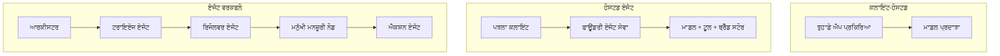
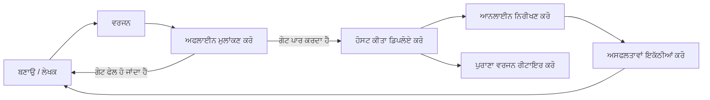
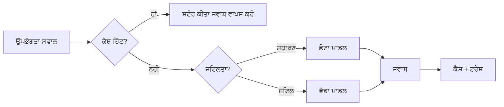
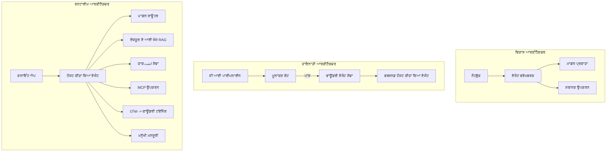

# ਮਾਈਕ੍ਰੋਸੌਫਟ ਫਾਊਂਡਰੀ ਨਾਲ ਸਕੇਲ ਕਰਨ ਯੋਗ ਏਜੰਟ ਤੈਅਾਰ ਕਰਨਾ


ਇਸ ਕੋਰਸ ਤੱਕ ਤੁਸੀਂ ਐਜੰਟ ਬਣਾਏ ਹਨ ਜੋ ਤੁਹਾਡੇ ਲੈਪਟੌਪ ਉੱਤੇ, ਇੱਕ ਨੋਟਬੁੱਕ ਦੇ ਅੰਦਰ ਚੱਲਦੇ ਹਨ, `az login` ਅਤੇ ਕੁਝ ਵਾਤਾਵਰਣ ਚਲਾਕੀਆਂ ਦੁਆਰਾ ਸੰਜਾਲਿਤ। ਇਹ ਸਿੱਖਣ ਦਾ ਬਿਲਕੁਲ ਸਹੀ ਤਰੀਕਾ ਹੈ। ਪਰ ਇਹ ਇੱਕ ਐਜੰਟ ਚਲਾਉਣ ਦਾ ਸਹੀ ਤਰੀਕਾ ਨਹੀਂ ਹੈ ਜਿਸ 'ਤੇ ਹਜ਼ਾਰਾਂ ਗਾਹਕ ਤਿੰਨ ਵਜੇ ਸਵੇਰੇ ਨਿਰਭਰ ਕਰਦੇ ਹਨ।

ਇਹ ਪਾਠ "ਮੇਰੇ ਮਸ਼ੀਨ 'ਤੇ ਇਹ ਕੰਮ ਕਰਦਾ ਹੈ" ਅਤੇ "ਉਤਪਾਦਨ ਵਿੱਚ ਭਰੋਸੇਯੋਗ ਅਤੇ ਕਿਫਾਇਤੀ ਢੰਗ ਨਾਲ ਕੰਮ ਕਰਦਾ ਹੈ" ਦੇ ਵਿਚਕਾਰ ਦੇ ਖਾਲੀਪਨ ਬਾਰੇ ਹੈ। ਅਸੀਂ ਉਸ ਖਾਲੀਪਨ ਨੂੰ ਬੰਦ ਕਰਦੇ ਹਾਂ **ਮਾਈਕ੍ਰੋਸੌਫਟ ਫਾਊਂਡਰੀ** ਅਤੇ **ਮਾਈਕ੍ਰੋਸੌਫਟ ਫਾਊਂਡਰੀ ਏਜੰਟ ਸਰਵਿਸ** ਦੀ ਵਰਤੋਂ ਕਰਕੇ, ਅਤੇ ਅਸੀਂ ਇਸਨੂੰ ਇੱਕ ਅਸਲੀ ਗਾਹਕ ਸਹਾਇਤਾ ਏਜੰਟ ਬਣਾ ਕੇ ਕਰਦੇ ਹਾਂ ਜਿਸ ਵਿੱਚ ਟੂਲ, ਤਲਾਸ਼, ਯਾਦ, ਮੁਲਾਂਕਣ ਅਤੇ ਨਿਗਰਾਨੀ ਹੁੰਦੀ ਹੈ।

## ਜਾਣਪਹਿਚਾਣ

ਇਸ ਪਾਠ ਵਿੱਚ ਕਵਰੇਜ ਕੀਤੀ ਜਾਵੇਗੀ:

- ਇੱਕ **ਪ੍ਰੋਟੋਟਾਈਪ ਏਜੰਟ** ਅਤੇ ਇੱਕ **ਤੈਅਾਰ ਕੀਤਾ ਹੈ ਐਜੰਟ** ਦਰਮਿਆਨ ਅੰਤਰ ਅਤੇ ਕਿਉਂ ਤਬਦੀਲੀ ਵਧੀਕਰ ਕੇ ਮਾਡਲ ਦੇ ਆਲੇ-ਦੁਆਲੇ ਸਭ ਕੁਝ ਹੁੰਦਾ ਹੈ।
- ਏਜੰਟਾਂ ਲਈ **ਤੈਅਾਰੀ ਦੇ ਢਾਂਚੇ**: ਕਲਾਇੰਟ-ਹੋਸਟਡ, ਸਰਵਿਸ-ਹੋਸਟਡ (ਹੋਸਟਡ ਏਜੰਟ), ਅਤੇ ਵਰਕਫ਼ਲੋ-ਆਰਕੀਸਟ੍ਰੇਟਡ।
- ਮਾਈਕ੍ਰੋਸੌਫਟ ਫਾਊਂਡਰੀ 'ਤੇ **ਏਜੰਟ ਲਾਇਫਸਾਈਕਲ** — ਬਣਾਉਣਾ, ਵਰਜਨ, ਤੈਅਾਰ ਕਰਨਾ, ਮੁਲਾਂਕਣ ਕਰਨਾ, ਨਿਰੀਖਣ ਕਰਨਾ, ਰਿਟਾਇਰ ਕਰਨਾ।
- **ਸਕੈਲਿੰਗ ਰਣਨੀਤੀਆਂ**: ਮਾਡਲ ਰਾਊਟਿੰਗ, ਕੈਸ਼ਿੰਗ, ਸਮਕਾਲੀ ਕਾਰਗੁਜ਼ਾਰੀ, ਅਤੇ ਸਟੇਟਲੈਸ ਡਿਜ਼ਾਇਨ।
- OpenTelemetry ਅਤੇ ਫਾਊਂਡਰੀ ਟ੍ਰੇਸਿੰਗ ਨਾਲ **ਨਿਰੀਖਣਯੋਗਤਾ**।
- ਮਾਡਲ ਚੋਣ, ਰਾਊਟਿੰਗ, ਅਤੇ ਮੁਲਾਂਕਣ ਗੇਟਾਂ ਦੁਆਰਾ **ਲਾਗਤ ਦੀ ਅੱਛੀ ਵਰਤੋਂ**।
- **ਉਦਯੋਗਿਕ ਵਿਚਾਰ**: ਸ਼ਾਸਨ, ਮਨੁੱਖੀ ਮਨਜ਼ੂਰੀ, ਅਤੇ MCP ਸਰਵਰਾਂ ਨੂੰ ਉਤਪਾਦਨ ਵਿੱਚ ਬੇਫਿਕਰੀ ਨਾਲ ਚਲਾਣਾ।

## ਸਿੱਖਣ ਦੇ ਲਕੜੇ

ਇਸ ਪਾਠ ਨੂੰ ਪੂਰਾ ਕਰਨ ਤੋਂ ਬਾਅਦ ਤੁਸੀਂ ਜਾਣੋਗੇ ਕਿ:

- ਕਿਸੇ ਦਿੱਤੇ ਏਜੰਟ ਵਰਕਲੋਡ ਲਈ ਠੀਕ ਤੈਅਾਰੀ ਦਾ ਚੁਣਾਵ ਕਰੋ।
- ਇੱਕ ਏਜੰਟ ਨੂੰ ਮਾਈਕ੍ਰੋਸੌਫਟ ਫਾਊਂਡਰੀ ਏਜੰਟ ਸਰਵਿਸ ਤੇ ਤੈਅਾਰ ਕਰੋ ਤਾਂ ਜੋ ਇਹ ਵਰਜਨਿਡ, ਸ਼ਾਸਿਤ ਅਤੇ ਨਿਰੀਖਣਯੋਗ ਹੋ ਜਾਏ।
- ਟ੍ਰੇਸਿੰਗ ਲਈ ਏਜੰਟ ਨੂੰ ਇੰਸਟ੍ਰੂਮੈਂਟ ਕਰੋ ਅਤੇ ਐਕਸੈਲਰੇਟ ਹੋਣ ਤੋਂ ਪਹਿਲਾਂ ਚਲਣ ਵਾਲੀ ਮੁਲਾਂਕਣ ਪਾਈਪਲਾਈਨ ਨੂੰ ਜੋੜੋ।
- ਮਾਡਲ ਰਾਊਟਿੰਗ ਅਤੇ ਕੈਸ਼ਿੰਗ ਲਾਗੂ ਕਰੋ ਤਾਂ ਜੋ ਵੱਡੇ ਪੈਮਾਨੇ 'ਤੇ ਲੇਟੇੰਸੀ ਅਤੇ ਲਾਗਤ ਨਿਯੰਤਰਿਤ ਰਹੇ।
- ਉੱਚ-ਖਤਰਨਾਕ ਕੰਮਾਂ ਲਈ ਮਨੁੱਖੀ ਮਨਜ਼ੂਰੀ ਦਾ ਗੇਟ ਸ਼ਾਮਲ ਕਰੋ ਅਤੇ MCP ਸਰਵਰ ਨੂੰ ਉਤਪਾਦਨ-ਸੁਰੱਖਿਅਤ ਢੰਗ ਨਾਲ ਜੋੜੋ।

## ਪਹਿਲਾਂ ਲੋੜੀਂਦੇ ਗੁਣ

ਇਹ ਸਬਕ ਮਾਨਦਾ ਹੈ ਕਿ ਤੁਸੀਂ ਪਹਿਲਲੇ ਸਬਕ ਪੂਰੇ ਕਰ ਚੁੱਕੇ ਹੋ ਅਤੇ ਤੁਹਾਨੂੰ ਇਹਨਾਂ 'ਚ ਸੁਵਿਧਾ ਹੈ:

- [ਮਾਈਕ੍ਰੋਸੌਫਟ ਏਜੰਟ ਫਰੇਮਵਰਕ](../14-microsoft-agent-framework/README.md) ਨਾਲ ਏਜੰਟ ਬਣਾਉਣਾ (ਸਬਕ 14)।
- [ਟੂਲ ਦੀ ਵਰਤੋਂ](../04-tool-use/README.md) (ਸਬਕ 4) ਅਤੇ [ਏਜੈਂਟਿਕ RAG](../05-agentic-rag/README.md) (ਸਬਕ 5)।
- [ਏਜਂਟ ਮੈਮੋਰੀ](../13-agent-memory/README.md) (ਸਬਕ 13) ਅਤੇ [ਏਜੈਂਟਿਕ ਪ੍ਰੋਟੋਕੋਲ / MCP](../11-agentic-protocols/README.md) (ਸਬਕ 11)।
- [ਨਿਰੀਖਣਯੋਗਤਾ ਅਤੇ ਮੁਲਾਂਕਣ](../10-ai-agents-production/README.md) (ਸਬਕ 10) — ਇਹ ਸਬਕ ਇਸ 'ਤੇ ਸਿੱਧਾ ਸਥਿਤ ਹੈ।

ਤੁਹਾਨੂੰ ਇਹ ਵੀ ਲੋੜੀਂਦਾ ਹੋਵੇਗਾ:

- ਇੱਕ **ਅਜ਼ੂਰ ਸਬਸਕ੍ਰਿਪਸ਼ਨ** ਅਤੇ ਇੱਕ **ਮਾਈਕ੍ਰੋਸੌਫਟ ਫਾਊਂਡਰੀ ਪ੍ਰੋਜੈਕਟ** ਜਿਸ ਵਿੱਚ ਘੱਟੋ-ਘੱਟ ਇੱਕ ਤੈਅਾਰ ਕੀਤਾ ਚੈਟ ਮਾਡਲ ਹੋਵੇ।
- ਪ੍ਰਮਾਣਿਤ ਕੀਤਾ **ਅਜ਼ੂਰ CLI** (`az login`)।
- Python 3.12+ ਅਤੇ ਰੀਪੋਜ਼ੀਟਰੀ ਵਿੱਚ ਮੌਜੂਦ ਪੈਕੇਜ [`requirements.txt`](../../../requirements.txt)।

## ਪ੍ਰੋਟੋਟਾਈਪ ਤੋਂ ਉਤਪਾਦਨ ਤੱਕ: ਕੀ ਅਸਲ ਵਿੱਚ ਬਦਲਦਾ ਹੈ

ਇੱਕ ਪ੍ਰੋਟੋਟਾਈਪ ਏਜੰਟ ਅਤੇ ਇਕ ਉਤਪਾਦਨ ਏਜੰਟ ਇੱਕੋ ਕੋਰ ਲੂਪ ਸਾਂਝਾ ਕਰਦੇ ਹਨ — ਤਰਕ ਕਰਨਾ, ਟੂਲਾਂ ਨੂੰ ਕਾਲ ਕਰਨਾ, ਜਵਾਬ ਦੇਣਾ। ਜੋ ਕੁਝ ਫਰਕ ਹੁੰਦਾ ਹੈ ਉਹ ਹੈ ਲੂਪ ਦੇ ਆਲੇ ਦੁਆਲੇ ਦੇ ਸਾਰੇ ਕੰਮ। ਮਾਡਲ ਸੰਭਾਵਤ ਤੌਰ 'ਤੇ ਉਤਪਾਦਨ ਏਜੰਟ ਦਾ 20% ਹੈ; ਬਾਕੀ ਦਾ 80% ਓਪਰੇਸ਼ਨਲ ਢਾਂਚਾ ਹੈ।

| ਚਿੰਤਾ | ਪ੍ਰੋਟੋਟਾਈਪ | ਉਤਪਾਦਨ |
| --- | --- | --- |
| **ਹੋਸਟਿੰਗ** | ਤੁਹਾਡੇ ਨੋਟਬੁੱਕ ਵਿੱਚ ਚਲਦਾ ਹੈ | ਇੱਕ ਹੋਸਟਡ ਸਰਵਿਸ ਵਜੋਂ ਚਲਦਾ ਹੈ, ਵਰਜਨਿਡ ਅਤੇ ਰੋਲਡ ਆਉਟ |
| **ਪਛਾਣ** | ਤੁਹਾਡਾ `az login` ਟੋਕਨ | ਸਕੋਪਡ RBAC ਨਾਲ ਪ੍ਰਬੰਧਿਤ ਪਛਾਣ |
| **ਸਥਿਤੀ** | ਇਨ-ਮੇਮੋਰੀ, ਰੀਸਟਾਰਟ 'ਤੇ ਖੋ ਜਾਂਦੀ ਹੈ | ਬਾਹਰੀਕ੍ਰਿਤ (ਥਰੇਡ ਸਟੋਰ, ਮੈਮੋਰੀ ਸਰਵਿਸ) |
| **ਨਾਕਾਮੀ** | ਤੁਸੀਂ ਟਰੇਸਬੈਕ ਵੇਖਦੇ ਹੋ | ਮੁੜ ਕੋਸ਼ਿਸ਼, ਫਾਲਬੈਕ, ਡੈਡ-ਲੈਟਰ, ਅਲਾਰਟ |
| **ਲਾਗਤ** | "ਇਹ ਕੁਝ ਸੈਂਟ ਜਿੰਨੀ ਹੈ" | ਪ੍ਰਤੀ ਬੇਨਤੀ ਟਰੈਕ ਕੀਤੀ, ਰਾਊਟ ਕੀਤੀ, ਕੈਸ਼ ਕੀਤੀ, ਬਜਟ ਬਣਾਈ ਗਈ |
| **ਗੁਣਵੱਤਾ** | ਤੁਸੀਂ ਨਤੀਜੇ ਨੂੰ ਨਿਗਾਹ ਕਰਦੇ ਹੋ | ਹਰ ਰੀਲੀਜ਼ ਤੋਂ ਪਹਿਲਾਂ ਆਪਣੈਮੈਟਿਕ ਟੈਸਟ |
| **ਭਰੋਸਾ** | ਤੁਸੀਂ ਹਰ ਕਾਰਵਾਈ ਦੀ ਮਨਜ਼ੂਰੀ ਦਿੰਦੇ ਹੋ | ਨੀਤੀ + ਜੋਖਮ ਵਾਲੀਆਂ ਕਾਰਵਾਈਆਂ ਲਈ ਮਨੁੱਖੀ ਵਿਚਕਾਰ |

ਇਸ ਐਕਸਪੋਰਟ ਨੂੰ ਯਾਦ ਰੱਖੋ। ਹਰੇਕ ਹਿੱਸਾ ਇਹਨਾਂ ਕਤਾਰਾਂ ਵਿਚੋਂ ਕਿਸੇ ਨਾਲ਼ ਮੈਪ ਹੁੰਦਾ ਹੈ।

## ਏਜੰਟ ਤੈਅਾਰੀ ਦੇ ਢਾਂਚੇ

ਤੁਹਾਨੂੰ ਤਿੰਨ ਢਾਂਚੇ ਵਰਤਣੇ ਹਨ, ਅਕਸਰ ਮਿਲਾ ਕੇ।

### 1. ਕਲਾਇੰਟ-ਹੋਸਟਡ ਏਜੰਟ

ਏਜੰਟ ਓਬਜੈਕਟ *ਤੁਹਾਡੇ* ਐਪਲੀਕੇਸ਼ਨ ਪ੍ਰਕਿਰਿਆ ਵਿੱਚ ਰਹਿੰਦਾ ਹੈ। ਤੁਹਾਡਾ ਕੋਡ ਸਿੱਧਾ ਮਾਡਲ ਪ੍ਰਦਾਤਾ ਨੂੰ ਕਾਲ ਕਰਦਾ ਹੈ; ਤਰਕ ਲੂਪ ਤੁਹਾਡੇ ਸਰਵਿਸ ਵਿੱਚ ਚਲਦਾ ਹੈ। ਇਹੀ ਹਰ ਪਹਿਲਾਂ ਦਾ ਸਬਕ ਸੀ।

- **ਇਸਦਾ ਉਪਯੋਗ ਕਰੋ ਜਦ** ਤੁਹਾਨੂੰ ਲੂਪ ਅਤੇMiddleware 'ਤੇ ਪੂਰਾ ਕਾਬੂ ਲੈਣਾ ਹੋਵੇ ਜਾਂ ਤੁਸੀਂ ਏਜੰਟ ਨੂੰ ਮੌਜੂਦਾ ਬੈਕਐਂਡ ਵਿੱਚ ਐम्बੈੱਡ ਕਰ ਰਹੇ ਹੋ।
- **ਸੌਦਾ-ਬਾਜ਼ੀ**: ਤੁਸੀਂ ਸਕੇਲਿੰਗ, ਸਥਿਤੀ ਅਤੇ ਲਚਕੀਲਾ ਖ਼ੁਦ ਸੰਭਾਲਦੇ ਹੋ।

### 2. ਹੋਸਟਡ ਏਜੰਟ (ਫਾਊਂਡਰੀ ਏਜੰਟ ਸਰਵਿਸ)

ਏਜੰਟ ਨੂੰ Microsoft Foundry ਵਿੱਚ *ਸੰਸਾਧਨ ਵਜੋਂ ਦਰਜ* ਕੀਤਾ ਜਾਂਦਾ ਹੈ। ਫਾਊਂਡਰੀ ਤਰਕ ਲੂਪ ਨੂੰ ਹੋਸਟ ਕਰਦਾ ਹੈ, ਥਰੇਡ ਨੂੰ ਸਾਂਭਦਾ ਹੈ, ਸਮੱਗਰੀ ਦੀ ਸੁਰੱਖਿਆ ਅਤੇ RBAC ਲਾਗੂ ਕਰਦਾ ਹੈ, ਅਤੇ ਏਜੰਟ ਨੂੰ ਫਾਊਂਡਰੀ ਪੋਰਟਲ ਵਿੱਚ ਦਿੱਖਦਾ ਹੈ। ਤੁਹਾਡੀ ਐਪ ਇੱਕ ਪਤਲੇ ਕਲਾਇੰਟ ਵਜੋਂ ਬਣ ਜਾਂਦੀ ਹੈ ਜੋ ਥਰੇਡ ਬਣਾ ਕੇ ਜਵਾਬ ਪੜ੍ਹਦੀ ਹੈ।

- **ਇਸਦਾ ਉਪਯੋਗ ਕਰੋ ਜਦ** ਤੁਹਾਨੂੰ ਟਿਕਾਊਪਨ, ਨਿਰਮਿਤ ਨਿਰੀਖਣਯੋਗਤਾ, ਸ਼ਾਸਨ ਅਤੇ ਘੱਟ ਓਪਰੇਸ਼ਨਲ ਖੇਤਰ ਦੀ ਲੋੜ ਹੋਵੇ।
- **ਸੌਦਾ-ਬਾਜ਼ੀ**: ਪ੍ਰਬੰਧਿਤ ਰਨਟਾਈਮ ਲਈ ਘੱਟ ਸਤਰ ਦਾ ਕੰਟਰੋਲ।

### 3. ਏਜੰਟ ਵਰਕਫਲੋ

ਕਈ ਏਜੰਟਾਂ (ਅਤੇ ਟੂਲਾਂ) ਨੂੰ ਇੱਕ ਗ੍ਰਾਫ ਵਿੱਚ ਜੋੜਿਆ ਜਾਂਦਾ ਹੈ ਜਿਸ ਵਿੱਚ ਖੁੱਲ੍ਹਾ ਕੰਟਰੋਲ ਫਲੋ ਹੁੰਦਾ ਹੈ — ਲੜੀਵਾਰ ਕਦਮ, ਸ਼ਾਖਾ, ਮਨੁੱਖੀ ਮਨਜ਼ੂਰੀ ਨੋਡ ਅਤੇ ਟਿਕਾਊ ਚੈੱਕਪੋਇੰਟ ਜੋ ਰੁਕ ਸਕਦੇ ਹਨ ਅਤੇ ਮੁੜ ਚਾਲੂ।

- **ਇਸਦਾ ਉਪਯੋਗ ਕਰੋ ਜਦ** ਇੱਕ ਟਾਸਕ ਕਈ ਖਾਸ ਏਜੰਟਾਂ ਵਿੱਚ ਫੈਲ੍ਹਦਾ ਹੋਵੇ ਜਾਂ ਮੱਧ ਵਿੱਚ ਮਨਜ਼ੂਰੀ ਦੀ ਲੋੜ ਹੋਵੇ।
- **ਸੌਦਾ-ਬਾਜ਼ੀ**: ਵੱਧ ਭਾਗਾਂ ਵਾਲਾ, ਆਰਕੀਸਟ੍ਰੇਸ਼ਨ-ਸਤਰ ਦੀ ਨਿਰੀਖਣਯੋਗਤਾ ਦੀ ਲੋੜ।



## ਮਾਈਕ੍ਰੋਸੌਫਟ ਫਾਊਂਡਰੀ 'ਤੇ ਏਜੰਟ ਲਾਇਫਸਾਈਕਲ

ਏਜੰਟ ਨੂੰ ਤੈਅਾਰ ਕਰਨਾ ਇੱਕ ਵਾਰੀ ਦਾ `push` ਨਹੀਂ ਹੈ। ਇਹ ਇੱਕ ਲੂਪ ਹੈ, ਅਤੇ ਇਹ ਪ੍ਰोगਰਾਮ ਸਹੀ ਰੀਲੀਜ਼ ਚੱਕਰ ਵਾਂਗ ਦਿੱਸਦਾ ਹੈ ਕਿਉਂਕਿ ਇਹ ਬਿਲਕੁਲ ਉਹੀ ਹੈ।



ਮੁਖ ਵਿਚਾਰ ਜੋ [ਸਬਕ 10](../10-ai-agents-production/README.md) ਤੋਂ ਲੈ ਕੇ ਆਇਆ ਗਿਆ ਹੈ: **ਆਫਲਾਈਨ ਮੁਲਾਂਕਣ ਇੱਕ ਗੇਟ ਹੈ, ਪچھੋਂ ਸੁਝਾਅ ਨਹੀਂ।** ਨਵੀਂ ਏਜੰਟ ਵਰਜਨ ਤੁਹਾਡੇ ਮੁਲਾਂਕਣ ਮਿਆਰਾਂ ਨੂੰ ਪਾਰ ਨਾ ਕਰੇ ਤਾਂ ਰੀਲੀਜ਼ ਨਹੀਂ ਹੁੰਦੀ। ਆਨਲਾਈਨ ਨਿਰੀਖਣ ਸਾਹਮਣੇ ਆਉਣ ਵਾਲੀਆਂ ਗਲਤੀਆਂ ਨੂੰ ਤੁਹਾਡੇ ਆਫਲਾਈਨ ਟੈਸਟ ਸੈੱਟ ਵਿੱਚ ਵਾਪਸ ਫੀਡ ਕਰਦਾ ਹੈ। ਇਹ ਪੂਰਾ ਲੂਪ ਹੈ।

## ਸਕੇਲਿੰਗ ਰਣਨੀਤੀਆਂ

ਇੱਕ ਏਜੰਟ ਨੂੰ ਸਕੇਲ ਕਰਨਾ ਇਕ ਸਟੇਟਲੈਸ ਵੈੱਬ API ਨੂੰ ਸਕੇਲ ਕਰਨ ਤੋਂ ਵੱਖਰਾ ਹੈ ਕਿਉਂਕਿ ਹਰ ਬੇਨਤੀ ਕਈ ਮਹਿੰਗੀਆਂ ਮਾਡਲ ਅਤੇ ਟੂਲ ਕਾਲਾਂ ਕਰ ਸਕਦੀ ਹੈ। ਚਾਰ ਤਕਨੀਕਾਂ ਵੱਧ ਭਾਰ ਢੋ ਰਹੀਆਂ ਹਨ।

**ਸਟੇਟਲੈਸ ਬੇਨਤੀ ਸੰਭਾਲ।** ਆਪਣੇ ਪ੍ਰਕਿਰਿਆ ਮੇਮੋਰੀ ਵਿੱਚ ਕਿਸੇ ਯੂਜ਼ਰ ਦੀ ਸਥਿਤੀ ਨਾ ਰੱਖੋ। ਗੱਲਬਾਤ ਥਰੇਡਾਂ ਨੂੰ ਫਾਊਂਡਰੀ ਥਰੇਡ ਸਟੋਰ ਜਾਂ ਇੱਕ ਮੈਮੋਰੀ ਸਰਵਿਸ ਵਿੱਚ ਸਟੋਰ ਕਰੋ ਤਾਂ ਜੋ ਕੋਈ ਵੀ ਉਦਾਹਰਣ ਕਿਸੇ ਵੀ ਬੇਨਤੀ ਨੂੰ ਸੰਭਾਲ ਸਕੇ। ਇਹੀ ਤੁਹਾਡੀ ਸਮਤਲ ਸਕੇਲਿੰਗ ਨੂੰ ਸੰਭਵ ਬਣਾਉਂਦਾ ਹੈ — ਉਦਾਹਰਣਾਂ ਜੋੜੋ, ਕੋਈ ਸਟਿੱਕੀ ਸੈਸ਼ਨਾਂ ਨਹੀਂ।

**ਮਾਡਲ ਰਾਊਟਿੰਗ।** ਹਰ ਬੇਨਤੀ ਨੂੰ ਤੁਹਾਡੇ ਸਭ ਤੋਂ ਕਾਬਲ (ਅਤੇ ਸਭ ਤੋਂ ਮਹਿੰਗੇ) ਮਾਡਲ ਦੀ ਲੋੜ ਨਹੀਂ। ਸਧਾਰਣ ਬੇਨਤੀਆਂ — ਇਰਾਦਾ ਵਗੈਰਾ ਦੀ ਵਰਗੀ ਸਕਲਾਸੀਫਿਕੇਸ਼ਨ, ਛੋਟੇ ਫੈਕਚੁਅਲ ਜਵਾਬ — ਨੂੰ ਇੱਕ ਛੋਟੇ ਤੇ ਤੇਜ਼ ਮਾਡਲ ਨੂੰ ਭੇਜੋ ਅਤੇ ਵੱਡੇ ਮਾਡਲ ਨੂੰ ਅਸਲੀ ਤਰਕ ਲਈ ਰਾਖਵāl ਕਰੋ। ਫਾਊਂਡਰੀ ਦਾ **ਮਾਡਲ ਰਾਊਟਰ** ਤੁਹਾਡੇ ਲਈ ਇਹ ਕਰ ਸਕਦਾ ਹੈ, ਜਾਂ ਤੁਸੀਂ ਖੁਦ ਇੱਕ ਹਲਕਾ ਫਿਲਟਰ ਬਣਾਉ। ਤੁਸੀਂ ਲੈਬ ਵਿੱਚ DIY ਵਰਜਨ ਬਣਾਓਗੇ।

**ਜਵਾਬ ਕੈਸ਼ਿੰਗ।** ਬਹੁਤ ਸਾਰੀਆਂ ਸਹਾਇਤਾ ਬੇਨਤੀਆਂ ਲਗਭਗ ਇਕੋ ਜਿਹੀਆਂ ਹੋਂਦੀਆਂ ਹਨ ("ਮੇਰਾ ਪਾਸਵਰਡ ਕਿਵੇਂ ਰੀਸੈਟ ਕਰਾਂ?")। ਆਮ ਸਵਾਲਾਂ ਦੇ ਜਵਾਬ ਕੈਸ਼ ਕਰੋ ਅਤੇ ਮਾਡਲ 'ਤੇੋਂ ਬਿਨਾਂ ਜਵਾਬ ਦਿਓ। ਥੋੜੇ ਜਿਹੇ ਕੈਸ਼ ਹਿੱਟ ਰੇਟ ਨਾਲ ਵੀ ਲਾਗਤ ਅਤੇ ਲੇਟੇੰਸੀ ਵਿੱਚ ਵੱਡਾ ਫਰਕ ਪੈਂਦਾ ਹੈ।

**ਸਮਕਾਲੀ ਕਾਰਗੁਜ਼ਾਰੀ ਅਤੇ ਬੈਕਪਰੈਸ਼ਰ।** ਮਾਡਲ ਪ੍ਰਦਾਤਾਵਾਂ ਦੀ ਰੇਟ ਸੀਮਾ ਹੁੰਦੀ ਹੈ। ਆਪਣੀ ਸਮਕਾਲੀ ਕਾਰਗੁਜ਼ਾਰੀ ਬੰਨ੍ਹੋ, ਵਧਦੇ ਬੈਕਾਕ ਨਾਲ ਦੁਬਾਰਾ ਕੋਸ਼ਿਸ਼ ਕਰੋ, ਅਤੇ ਸੁਖਦਾਇਕ ਤਰੀਕੇ ਨਾਲ ਅਸਫਲ ਹੋਵੋ (ਇੱਕ ਕਤਾਰ ਵਿੱਚ "ਅਸੀਂ ਇਸ 'ਤੇ ਹਾਂ" ਜਵਾਬ 500 ਦੀ ਤਲਾਸ਼ ਰੱਖਦਾ ਹੈ)।



## ਉਤਪਾਦਨ ਵਿੱਚ ਨਿਰੀਖਣਯੋਗਤਾ

ਜਿਹੜਾ ਤੁਸੀਂ ਨਹੀਂ ਦੇਖ ਸਕਦੇ, ਤੁਸੀਂ ਚਲਾ ਨਹੀਂ ਸਕਦੇ। ਸਬਕ 10 ਵਿੱਚ ਕਿਹਾ ਗਿਆ ਹੈ ਕਿ ਮਾਈਕ੍ਰੋਸੌਫਟ ਏਜੰਟ ਫਰੇਮਵਰਕ **OpenTelemetry** ਟ੍ਰੇਸਸ ਜਨਰੇਟ ਕਰਦਾ ਹੈ — ਹਰ ਮਾਡਲ ਕਾਲ, ਟੂਲ ਕਾਲ, ਅਤੇ ਆਰਕੀਜੇਸਤਰ ਪਦਮ ਇੱਕ ਸਪੈਨ ਬਣ ਜਾਂਦਾ ਹੈ। ਉਤਪਾਦਨ ਵਿੱਚ ਤੁਸੀਂ ਇਨਾਂ ਸਪੈਨਾਂ ਨੂੰ ਮਾਈਕ੍ਰੋਸੌਫਟ ਫਾਊਂਡਰੀ (ਜਾਂ ਕੋਈ ਵੀ OTel-ਮੇਲ ਬੈਕਐਂਡ) ਨੂੰ ਐਕਸਪੋਰਟ ਕਰਦੇ ਹੋ ਤਾਂ ਕਿ ਤੁਸੀਂ:

- ਇੱਕ ਗਾਹਕ ਦੀ ਸ਼ਿਕਾਇਤ ਨੂੰ ਹਰ ਮਾਡਲ ਅਤੇ ਟੂਲ ਕਾਲ 'ਚ ਇੱਕ-ਇਕ ਕਰਕੇ ਟ੍ਰੇਸ ਕਰੋ।
- ਸਮੇਂ ਦੇ ਨਾਲ ਪੀ50/ਪੀ95 ਲੇਟੇੰਸੀ ਅਤੇ ਲਾਗਤ ਦੇਖੋ।
- ਕਿਰਿਆ ਦਰ ਵਿੱਚ ਵਾਧਾ ਅਤੇ ਲਾਗਤ ਅਸਧਾਰਣਤਾਵਾਂ ਬਾਰੇ ਜਲਦੀ ਸੰਕੇਤ ਦਿਓ ਤਾਂ ਕਿ ਤੁਹਾਡੇ ਉਪਭੋਗਤਾ (ਜਾਂ ਤੁਹਾਡੀ ਵਿੱਤੀ ਟੀਮ) ਜਾਣੂ ਨਾ ਹੋਣ।

```python
from agent_framework.observability import get_tracer

tracer = get_tracer()

with tracer.start_as_current_span("support_request") as span:
    span.set_attribute("customer.tier", "enterprise")
    span.set_attribute("routed.model", "gpt-5-nano")
    # ਏਜੰਟ ਕਾਰਜਚਾਲੂ ਇਸ ਸਪੈਨ ਦੇ ਅੰਦਰ ਆਟੋਮੈਟਿਕ ਤੌਰ 'ਤੇ ਟ੍ਰੇਸ ਕੀਤਾ ਜਾਂਦਾ ਹੈ
```

`customer.tier` ਅਤੇ `routed.model` ਵਰਗੇ ਗੁਣ ਵਿਸ਼ਾਲ ਟ੍ਰੇਸਾਂ ਨੂੰ ਸਵਾਲ ਉਤੇ ਜਵਾਬ ਬਣਾਉਂਦੇ ਹਨ ("ਕੀ ਉਦਯੋਗ ਗਾਹਕ ਛੋਟੇ ਮਾਡਲ ਨੂੰ ਬਹੁਤ ਵਾਰ ਭੇਜੇ ਜਾ ਰਹੇ ਹਨ?").

## ਲਾਗਤ ਦੀ ਅੱਛੀ ਵਰਤੋਂ

ਉਤਪਾਦਨ ਏਜੰਟਾਂ ਵਿੱਚ ਲਾਗਤ ਦਾ ਮਹੱਤਵਪੂਰਨ ਹਿੱਸਾ ਟੋਕਨ ਨਾਲ ਸੰਬੰਧਿਤ ਹੈ। ਤਿੰਨ ਲਿਵਰ, ਪ੍ਰਭਾਵ ਦੇ ਅਨੁਕਾਰ:

1. **ਮਾਡਲ ਦਾ ਠੀਕ ਅਕਾਰ।** ਇੱਕ ਛੋਟਾ ਮਾਡਲ ਜੋ ਤੁਹਾਡੇ ਮੁਲਾਂਕਣ ਗੇਟ ਨੂੰ ਪਾਰ ਕਰਦਾ ਹੈ, ਅਕਸਰ ਇੱਕ ਵੱਡੇ ਮਾਡਲ ਨਾਲੋਂ ਵੱਧ ਸਸਤਾ ਹੁੰਦਾ ਹੈ ਜੋ ਵੀ ਪਾਰ ਕਰਦਾ ਹੈ। ਮੁਲਾਂਕਣ ਨਾਲ ਸਾਬਤ ਕਰੋ ਕਿ ਛੋਟਾ ਮਾਡਲ ਕਾਫੀ ਹੈ ਨਾ ਕਿ ਸਾਵਧਾਨੀ ਨਾਲ ਸਭ ਤੋਂ ਵੱਡੇ ਮਾਡਲ ਦੀ ਚੋਣ ਕਰੋ।
2. **ਕੰਪਲੈਕਸਿਟੀ ਮੁਤਾਬਕ ਰਾਹਦਾਰੀ।** ਪਹਿਲਾਂ ਵਰਤੀ ਤਰ੍ਹਾਂ — ਵੱਡੇ ਮਾਡਲ ਦੀ ਕੀਮਤ ਸਿਰਫ਼ ਉਹਨਾਂ ਬੇਨਤੀਆਂ ਲਈ ਜੋ ਵੱਡੇ ਮਾਡਲ ਤਰਕ ਦੀ ਮੰਗ ਕਰਦੀਆਂ ਹਨ।
3. **ਜ਼ੋਰਦਾਰ ਕੈਸ਼ਿੰਗ।** ਸਭ ਤੋਂ ਸਸਤਾ ਮਾਡਲ ਕਾਲ ਉਹ ਹੈ ਜੋ ਤੁਸੀਂ ਕਦੇ ਨਹੀਂ ਕਰਦੇ।

ਮੁਲਾਂਕਣ ਗੇਟ ਅਤੇ ਲਾਗਤ ਨਿਯੰਤਰਣ ਦੋਵੇਂ ਇੱਕੋ ਜਹੀ ਅਨੁਸ਼ਾਸ਼ਨ ਹਨ ਜਿਵੇਂ ਇੱਕੋ ਦਿਸ਼ਾ ਤੋਂ ਵੇਖੇ ਜਾਣ — ਮੁਲਾਂਕਣ ਤੁਹਾਨੂੰ *ਗੁਣਵੱਤਾ ਸਤਰ* ਦੱਸਦਾ ਹੈ, ਰਾਊਟਿੰਗ ਅਤੇ ਕੈਸ਼ਿੰਗ ਤੁਹਾਨੂੰ ਉਸ ਸਤਰ ਦੀ *ਲਾਗਤ* ਦੇ ਨੇੜੇ ਰੱਖਦੇ ਹਨ।

## ਉਦਯੋਗਿਕ ਤੈਅਰੀ ਸੰਬੰਧੀ ਵਿਚਾਰ

**ਸ਼ਾਸਨ।** ਹੋਸਟਡ ਏਜੰਟ ਫਾਊਂਡਰੀ ਦੇ RBAC, ਸਮੱਗਰੀ ਸੁਰੱਖਿਆ ਅਤੇ ਆਡੀਟ ਲਾਗਿੰਗ ਨੂੰ ਵਾਰਸਾ ਵਿੱਚ ਲੈਂਦੇ ਹਨ। ਹਰ ਏਜੰਟ ਨੂੰ ਘੱਟੋ-ਘੱਟ ਲੋੜੀਂਦੀ ਪਹੁੰਚ ਵਾਲੀ ਪ੍ਰਬੰਧਿਤ ਪਛਾਣ ਦਿਓ — ਗਿਆਨ ਅਧਾਰ ਲਈ ਸਿਰਫ ਪੜ੍ਹਨ ਦੀ ਪਹੁੰਚ, ਟਿਕਟਿੰਗ API ਲਈ ਸਕੋਪਡ ਪਹੁੰਚ, ਹੋਰ ਕੁਝ ਨਹੀਂ।

**ਮਨੁੱਖ-ਵਿੱਚਕਾਰ।** ਕੁਝ ਕਾਰਵਾਈਆਂ ਬਿਲਕੁਲ ਖੁਦਕੁਸ਼ੀ ਨਹੀਂ ਕਹਿ ਸਕਦੀਆਂ — ਰੀਫੰਡ ਜਾਰੀ ਕਰਨਾ, ਖਾਤਾ ਮਿਟਾਉਣਾ, ਕਾਨੂੰਨੀ ਟੀਮ ਨੂੰ ਉੱਚਾ ਕਰਨਾ। ਮਾਈਕ੍ਰੋਸੌਫਟ ਏਜੰਟ ਫਰੇਮਵਰਕ **ਮਨਜ਼ੂਰੀ-ਲੋੜੀਂਦੇ** ਟੂਲਾਂ ਦਾ ਸਮਰਥਨ ਕਰਦਾ ਹੈ: ਏਜੰਟ ਕਾਰਵਾਈ ਦਾ ਸੁਝਾਅ ਦਿੰਦਾ ਹੈ, ਕਾਰਵਾਈ ਠਹਿਰ ਜਾਂਦੀ ਹੈ, ਮਨੁੱਖ ਮਨਜ਼ੂਰੀ ਜਾਂ ਅਸਵੀਕਾਰ ਕਰਦਾ ਹੈ, ਅਤੇ ਵਰਕਫਲੋ ਦੁਬਾਰਾ ਚੱਲਦਾ ਹੈ। ਤੁਸੀਂ ਇਹ ਪ੍ਰਿਮਿਟਿਵ [ਸਬਕ 6](../06-building-trustworthy-agents/README.md) 'ਚ ਵੇਖਿਆ ਸੀ; ਇੱਥੇ ਤੁਸੀਂ ਇਸਨੂੰ ਤੈਅਾਰ ਕਰਦੇ ਹੋ।

**ਉਤਪਾਦਨ ਵਿੱਚ MCP।** [MCP](../11-agentic-protocols/README.md) ਤੁਹਾਡੇ ਏਜੰਟ ਨੂੰ ਬਾਹਰੀ ਟੂਲਾਂ ਨੂੰ ਇੱਕ ਮਿਆਰੀ ਇੰਟਰਫੇਸ ਦੁਆਰਾ ਵਰਤਣ ਦਿੰਦਾ ਹੈ। ਉਤਪਾਦਨ ਵਿੱਚ, ਹਰ MCP ਸਰਵਰ ਨੂੰ ਇੱਕ ਅਣ-ਭਰੋਸੇਯੋਗ ਸੀਮਾ ਵਜੋਂ ਮੰਨੋ: ਸਰਵਰ ਵਰਜਨ ਨੂੰ ਫਿਕਸ ਕਰੋ, ਇਸਨੂੰ ਸਕੋਪਡ ਪਛਾਣ ਨਾਲ ਚਲਾਓ, ਇਸਦੇ ਨਤੀਜਿਆਂ ਦੀ ਪੁਸ਼ਟੀ ਕਰੋ, ਅਤੇ ਕਦੇ ਵੀ ਇਸਨੂੰ ਰਾਜ਼ ਨਾ ਦਿਓ। MCP ਸਰਵਰ ਇੱਕ ਡਿਪੈਂਡੰਸੀ ਹੈ ਅਤੇ ਡਿਪੈਂਡੰਸੀਜ਼ ਨੂੰ ਪੈਚ, ਆਡੀਟ ਅਤੇ ਰੇਟ-ਲਿਮਿਟ ਕੀਤਾ ਜਾਂਦਾ ਹੈ।



ਇਹ ਤਿੰਨ ਡਾਇਗ੍ਰਾਮ — ਵਿਕਾਸ, ਤੈਅਾਰੀ, ਰਨ-ਟਾਈਮ — ਇਹੀ ਏਜੰਟ ਦੀ ਤਿੰਨ ਜ਼ਿੰਦਗੀ ਦੇ ਚਰਨ ਹਨ। ਅੱਗੇ ਵਾਲੀ ਲੈਬ ਤੁਹਾਨੂੰ ਇਸਨੂੰ ਬਣਾਉਣ ਦੇ ਰਾਹ 'ਤੇ ਲੈ ਕੇ ਚਲੇਗੀ।

## ਪ੍ਰਯੋਗਸ਼ਾਲਾ: ਉਤਪਾਦਨ-ਤਹਿਕ ਗاہਕ ਸਹਾਇਤਾ ਏਜੰਟ

ਖੋਲ੍ਹੋ [`code_samples/16-python-agent-framework.ipynb`](./code_samples/16-python-agent-framework.ipynb) ਅਤੇ ਇਸ ਨੂੰ ਸ਼ੁਰੂ ਤੋਂ ਅੰਤ ਤੱਕ ਕਰਕੇ ਵੇਖੋ। ਤੁਸੀਂ ਇੱਕ **ਕਾਂਟੋਸੋ ਗਾਹਕ ਸਹਾਇਤਾ ਏਜੰਟ** ਤਿਆਰ ਕਰੋਗੇ ਜਿਸ ਵਿੱਚ ਹਰ ਉਤਪਾਦਨ ਸਮੱਸਿਆ ਹੱਲ ਕੀਤੀ ਗਈ ਹੈ:

1. **ਟੂਲ ਕਾਲਿੰਗ** — ਆਰਡਰ ਸਥਿਤੀ ਦੀ ਤਲਾਸ਼ ਅਤੇ ਸਪੋਰਟ ਟਿਕਟ ਖੋਲ੍ਹਣਾ।
2. **RAG** — ਗਿਆਨ ਅਧਾਰ (ਅਜ਼ੂਰ AI ਖੋਜ, ਇੱਕ ਮੈਮੋਰੀ ਫਾਲਬੈਕ ਨਾਲ ਤਾਂ ਜੋ ਨੋਟਬੁੱਕ ਬਿਨਾਂ ਖੋਜ ਸੰਸਾਧਨ ਦੇ ਚੱਲੇ) ਤੋਂ ਨੀਤੀ ਸਵਾਲਾਂ ਦੇ ਜਵਾਬ।
3. **ਯਾਦ** — ਗੱਲਬਾਤ ਦੇ ਚੱਕਰਾਂ ਵਿੱਚ ਗਾਹਕ ਨੂੰ ਯਾਦ ਰੱਖਣਾ।
4. **ਮਾਡਲ ਰਾਊਟਿੰਗ** — ਇੱਕ ਜਟਿਲਤਾ ਕਲਾਸੀਫਾਇਰ ਹਰ ਬੇਨਤੀ ਨੂੰ ਛੋਟੇ ਜਾਂ ਵੱਡੇ ਮਾਡਲ 'ਤੇ ਭੇਜਦਾ ਹੈ।
5. **ਜਵਾਬ ਕੈਸ਼ਿੰਗ** — ਦੁਹਰਾਏ ਗਏ ਸਵਾਲਾਂ ਨੂੰ ਕੈਸ਼ ਤੋਂ ਕਵਰੇਜ ਕੀਤਾ ਜਾਂਦਾ ਹੈ।
6. **ਮਨੁੱਖੀ ਮਨਜ਼ੂਰੀ** — ਥ੍ਰੈਸ਼ਹੋਲਡ ਤੋਂ ਵੱਧ ਰੀਫੰਡਾਂ ਲਈ ਮਨੁੱਖੀ ਸਹਿਮਤੀ ਦੀ ਲੋੜ।
7. **ਮੁਲਾਂਕਣ ਪਾਈਪਲਾਈਨ** — ਇੱਕ ਛੋਟਾ ਆਫਲਾਈਨ ਟੈਸਟ ਸੈੱਟ ਏਜੰਟ ਨੂੰ ਸਕੋਰ ਕਰਦਾ ਹੈ ਅਤੇ ਰੀਲੀਜ਼ ਲਈ ਗੇਟ ਮੰਨਦਾ ਹੈ।
8. **ਨਿਰੀਖਣਯੋਗਤਾ** — ਹਰ ਬੇਨਤੀ ਨਾਲ OpenTelemetry ਟ੍ਰੇਸਿੰਗ।

### ਚਲਾਉਣ ਦੀ ਪ੍ਰਕਿਰਿਆ

ਨੋਟਬੁੱਕ ਅਜਿਹਾ ਬਣਾਇਆ ਗਿਆ ਹੈ ਕਿ ਹਰ ਉਤਪਾਦਨ ਸੰਬੰਧੀ ਬਿੰਦੂ ਇੱਕ ਖੁਦਮੁਖਤਾਰ, ਚਲਾਇਆ ਜਾ ਸਕਣ ਵਾਲਾ ਸੈਕਸ਼ਨ ਹੈ। ਇਸ ਦੀ ਰੂਹ ਹੈ ਰਾਊਟਿੰਗ-ਪਲਸ-ਕੈਸ਼ਿੰਗ ਬੇਨਤੀ ਸੰਭਾਲਣ ਵਾਲਾ:

```python
async def handle_support_request(query: str, customer_id: str) -> str:
    # 1. ਜਦੋਂ ਸਾਡੇ ਕੋਲ ਕੈਸ਼ ਉਪਲਬਧ ਹੋਵੇ ਤਾਂ ਉਸ ਤੋਂ ਸੇਵਾ ਕਰੋ।
    cached = response_cache.get(normalize(query))
    if cached:
        return cached

    # 2. ਖਰਚਾ ਕੰਟਰੋਲ ਕਰਨ ਲਈ ਜਟਿਲਤਾ ਅਨੁਸਾਰ ਰੂਟ ਬਣਾਓ।
    model = "gpt-5-nano" if is_simple(query) else "gpt-5-mini"

    # 3. ਨਿਰੀਖਣ ਯੋਗਤਾ ਲਈ ਏਜੰਟ ਨੂੰ ਟਰੇਸ ਸਪੈਨ ਦੇ ਅੰਦਰ ਚਲਾਓ।
    with tracer.start_as_current_span("support_request") as span:
        span.set_attribute("routed.model", model)
        span.set_attribute("customer.id", customer_id)
        response = await support_agent.run(query, model=model)

    # 4. ਕੈਸ਼ ਕਰੋ ਅਤੇ ਵਾਪਸ ਕਰੋ।
    response_cache.set(normalize(query), response.text)
    return response.text
```

ਰੀਲੀਜ਼ ਨੂੰ ਸੁਰੱਖਿਅਤ ਕਰਨ ਵਾਲਾ ਮੁਲਾਂਕਣ ਗੇਟ ਇਸ ਤਰ੍ਹਾਂ ਦਿਖਾਈ ਦਿੰਦਾ ਹੈ:

```python
async def evaluation_gate(agent, test_cases, threshold: float = 0.8) -> bool:
    passed = 0
    for case in test_cases:
        result = await agent.run(case["input"])
        if score_response(result.text, case["expected"]) >= 0.8:
            passed += 1
    pass_rate = passed / len(test_cases)
    print(f"Evaluation pass rate: {pass_rate:.0%} (gate: {threshold:.0%})")
    return pass_rate >= threshold  # ਸਿਰਫ ਗੇਟ ਪਾਸ ਹੋਣ ਤੇ ਹੀ ਡਿਪਲੋਇ ਕਰੋ
```

ਹਰ ਇੱਕ ਲਾਈਨ ਨੂੰ ਧਿਆਨ ਨਾਲ ਪੜ੍ਹੋ — ਨੋਟਬੁੱਕ ਵਿੱਚ ਪ੍ਰਿਮਿਟਿਵਜ਼ ਜਿੰਨਾ ਛੋਟਾ ਸੰਭਵ ਹੈ ਰੱਖਿਆ ਗਿਆ ਹੈ ਤਾਂ ਜੋ ਫਰੇਮਵਰਕ ਕਾਲ ਦੇ ਪਿੱਛੇ ਕੁਝ ਲੁਕਿਆ ਨਾ ਰਹਿ ਜਾਵੇ।

## ਤੈਅਾਰ ਕੀਤਾ ਏਜੰਟ ਨੂੰ ਸਮੋਕ ਟੈਸਟ ਨਾਲ ਚੈਕ ਕਰਨਾ

ਉਪਰੋਕਤ ਮੁਲਾਂਕਣ ਗੇਟ ਤੁਹਾਡੇ ਏਜੰਟ ਓਬਜੈਕਟ ਦੇ ਖਿਲਾਫ *ਆਫਲਾਈਨ* ਚਲਦਾ ਹੈ। ਜਦੋਂ ਏਜੰਟ ਹੋਸਟਡ ਏਜੰਟ ਵਜੋਂ ਤੈਅਾਰ ਕੀਤਾ ਜਾਂਦਾ ਹੈ, ਤਾਂ ਤੁਹਾਨੂੰ ਇੱਕ ਹੋਰ, ਹੋਰ ਵੀ ਸਸਤਾ ਜਾਂਚ ਚਾਹੀਦੀ ਹੈ: **ਕੀ ਤੈਅਾਰ ਕੀਤਾ ਐਂਡਪੋਇੰਟ ਸੱਚਮੁੱਚ ਜਵਾਬ ਦੇ ਰਿਹਾ ਹੈ?**

"ਸਫਲਤਾ ਨਾਲ" ਤੈਅਾਰ ਹੋਣਾ ਸਿਰਫ ਕਨਟਰੋਲ ਪਲੇਨ ਦੇ ਪਰਿਭਾਸ਼ਾ ਸਵੀਕਾਰ ਕਰਨ ਨੂੰ ਸਾਬਤ ਕਰਦਾ ਹੈ — ਇਹ ਸਾਬਤ ਨਹੀਂ ਕਰਦਾ ਕਿ ਏਜੰਟ ਜਵਾਬ ਦੇ ਰਿਹਾ ਹੈ। ਇਕ ਲਾਪਤਾ ਡਿਪੈਂਡੰਸੀ, ਖਰਾਬ ਮਾਡਲ ਰਾਊਟਿੰਗ, ਜਾਂ ਖਤਮ ਹੋਈ ਕੁਨੈਕਸ਼ਨ ਇੱਕ ਹਰਿਆ Deployment ਛੱਡ ਸਕਦੀ ਹੈ ਜੋ ਕੁਝ ਵੀ ਵਾਪਸ ਨਹੀਂ ਦਿੰਦੀ। ਇੱਕ **ਸਮੋਕ ਟੈਸਟ** ਸਕਿੰਟਾਂ ਵਿੱਚ ਇਹ ਫੜ ਲੈਂਦਾ ਹੈ, ਹਰ ਤਰ੍ਹਾਂ ਦੇ Deploy 'ਤੇ, ਬਿਨਾਂ ਪੂਰੇ ਮੁਲਾਂਕਣ ਦੇ ਖ਼ਰਚ ਦੇ।

ਇਹ ਰੀਪੋਜ਼ੀਟਰੀ ਤਿਆਰ-ਉਪਯੋਗ ਸਮੋਕ-ਟੈਸਟ ਪਾਈਪਲਾਈਨ ਨਾਲ ਆਉਂਦਾ ਹੈ ਜੋ [AI Smoke Test](https://github.com/marketplace/actions/ai-smoke-test) GitHub ਐਕਸ਼ਨ 'ਤੇ ਅਧਾਰਿਤ ਹੈ:

- **ਕੈਟਾਲੌਗ** — [`tests/lesson-16-smoke-tests.json`](../../../tests/lesson-16-smoke-tests.json) ਵਿੱਚ ਕਾਂਟੋਸੋ ਸਹਾਇਤਾ ਏਜੰਟ ਲਈ ਪ੍ਰੰਪਟ ਅਤੇ ਯਕੀਨੀਕਰਨ ਹਨ (ਭੂਮਿਕੱਤ ਨੀਤੀ ਦੇ ਉੱਤਰ, ਆਰਡਰ ਲੁਕਅਪ, ਵਿਸ਼ੇ 'ਤੇ ਰਹਿਣਾ, ਅਤੇ ਬਹੁ-ਮੁੜ ਗੱਲਬਾਤ ਕ੍ਰਮ)। ਹੋਰ ਸਬਕਾਂ ਦੇ ਏਜੰਟਾਂ ਲਈ ਕੈਟਾਲੌਗ ਇੱਥੇ ਨਾਲ ਹੀ ਹਨ — ਵੇਖੋ [`tests/README.md`](../tests/README.md)।
- **ਵਰਕਫਲੋ** — [`.github/workflows/smoke-test.yml`](../../../.github/workflows/smoke-test.yml) ਵਿੱਚ Azure OIDC ਨਾਲ ਲੋਗਇਨ ਕਰਕੇ ਹਰ ਪ੍ਰੰਪਟ ਨੂੰ ਏਜੰਟ ਦੀ Responses ਐਂਡਪੋਇੰਟ 'ਤੇ POST ਕਰਦਾ ਹੈ, ਕਿਸੇ ਵੀ ਯਕੀਨੀਕਰਨ ਫੇਲ ਹੋਣ 'ਤੇ ਕੰਮ ਥੱਲੇ ਲਾ ਦਿੰਦਾ ਹੈ।

```yaml
- name: Smoke-test hosted agent
  uses: JFolberth/ai-smoketest@v1
  with:
    project_endpoint: ${{ inputs.project_endpoint }}
    agent_name: ContosoSupportAgent
    tests_file: tests/lesson-16-smoke-tests.json
```


ਜਦੋਂ ਤੁਹਾਡਾ ਏਜੰਟ ਡਿਪਲੌਇਡ ਹੋ ਜਾਵੇ ਤਾਂ ਇਸਨੂੰ **Actions** ਟੈਬ ਤੋਂ ਚਲਾਓ, ਆਪਣੇ Foundry ਪ੍ਰੋਜੇਕਟ ਐਂਡਪੌਇੰਟ ਅਤੇ ਏਜੰਟ ਨਾਮ ਦੇ ਕੇ। ਫੈਡਰੇਟਿਡ ਆਈਡੈਂਟਿਟੀ ਨੂੰ Foundry ਪ੍ਰੋਜੇਕਟ ਸਕੋਪ 'ਤੇ **Azure AI User** ਰੋਲ ਦੀ ਲੋੜ ਹੁੰਦੀ ਹੈ। ਲੇਅਰਾਂ ਨੂੰ ਇੱਕ ਪਿਰਾਮਿਡ ਵਾਂਗ ਸੋਚੋ: স্মੋਕ ਟੈਸਟ (ਪਹੁੰਚਯੋਗ ਅਤੇ ਜਵਾਬ ਦੇ ਰਹੇ ਹਨ?) ਹਰ ਡਿਪਲੌਇ ’ਤੇ ਚਲਾਏ ਜਾਂਦੇ ਹਨ, ਆਫਲਾਈਨ ਮੁੱਲਾਂਕਣ (ਕਿਂਨਾ ਖ਼ੁਸ਼ਕਿਸਮਤ ਭੇਜਣ ਲਈ ਉਚਿਤ ਹੈ?) ਪ੍ਰਮੋਸ਼ਨ ਤੋਂ ਪਹਿਲਾਂ ਹੁੰਦਾ ਹੈ, ਅਤੇ ਆਨਲਾਈਨ ਮੁੱਲਾਂਕਣ (ਜੰਗਲ 'ਚ ਇਹ ਕਿਵੇਂ ਕਰ ਰਿਹਾ ਹੈ?) ਲਗਾਤਾਰ ਚਲਦਾ ਹੈ।

## ਗਿਆਨ ਦੀ ਜਾਂਚ

ਅਸਾਈਨਮੈਂਟ 'ਤੇ ਜਾਣ ਤੋਂ ਪਹਿਲਾਂ ਆਪਣੀ ਸਮਝ ਦੀ ਜਾਂਚ ਕਰੋ।

**1. ਤਕਰੀਬਨ ਉਤਪਾਦਨ ਏਜੰਟ ਦਾ ਕਿੰਨਾ ਹਿੱਸਾ "ਮਾਡਲ" ਹੁੰਦਾ ਹੈ, ਅਤੇ ਬਾਕੀ ਕੀ ਹੁੰਦਾ ਹੈ?**

<details>
<summary>ਉত্তਰ</summary>

ਮਾਡਲ ਸਿਸਟਮ ਦਾ ਥੋੜ੍ਹਾ ਹਿੱਸਾ ਹੈ — ਆਮ ਤੌਰ 'ਤੇ ਇਸਨੂੰ ਕਰੀਬ 20% ਦੱਸਿਆ ਜਾਂਦਾ ਹੈ। ਬਾਕੀ ਓਪਰੇਸ਼ਨਲ ਢਾਂਚਾ ਹੈ: ਹੋਸਟਿੰਗ ਅਤੇ ਵਰਜ਼ਨਿੰਗ, ਆਈਡੈਂਟਿਟੀ ਅਤੇ RBAC, ਬਾਹਰੀ ਸੂਚਨਾ, ਫੇਲ੍ਹ ਹੋਣ ਦੀ ਸੰਭਾਲ, ਖਰਚ ਮੁਆਇਨਾ, ਮੁੱਲਾਂਕਣ ਅਤੇ ਮਨੁੱਖੀ ਹਸਤਖੇਪ ਵਾਲੇ ਨਿਯੰਤਰਣ। ਉਤਪਾਦਨ ਵੱਲ ਜਾਣਾ ਮੁੱਖ ਤੌਰ 'ਤੇ ਤਰਕ ਦਾਰ ਲੂਪ ਦੇ ਆਲੇ ਦੁਆਲੇ ਸਭ ਕੁਝ ਬਣਾਉਣ ਬਾਰੇ ਹੁੰਦਾ ਹੈ।
</details>

**2. ਤੁਸੀਂ ਕਿਵੇਂ Hosted Agent ਨੂੰ client-hosted ਏਜੰਟ 'ਤੇ ਚੁਣੋਗੇ?**

<details>
<summary>ਉੱਤਰ</summary>

ਜਦੋਂ ਤੁਸੀਂ ਇੱਕ ਪ੍ਰਬੰਧਿਤ ਰਨਟਾਈਮ ਚਾਹੁੰਦੇ ਹੋ ਜਿਸ ਵਿੱਚ ਬਿਲਟ-ਇਨ ਦਿਰਘਕਾਲੀਨਤਾ (ਜੋ ਥ੍ਰੇਡਸ ਪ੍ਰਸਤੁਤ ਅਤੇ ਦੁਬਾਰਾ ਚਾਲੂ ਕਰ ਸਕਦੇ ਹਨ), ਨਿਰੀਖਣਯੋਗਤਾ, ਸਮੱਗਰੀ ਦੀ ਸੁਰੱਖਿਆ, ਅਤੇ RBAC ਸ਼ਾਮਲ ਹਨ, ਅਤੇ ਤੁਸੀਂ ਤਰਕ ਲੂਪ ਦੇ ਘੱਟ ਪੱਧਰੀ ਕੰਟਰੋਲ ਨੂੰ ਬਦਲੇ ਵਿੱਚ ਘੱਟ ਓਪਰੇਸ਼ਨਲ ਸਰਫੇਸ ਖੇਤਰ ਲਈ ਵੱਟੀ ਰੱਖਣ ਲਈ ਤਿਆਰ ਹੋ। ਜਦੋਂ ਤੁਹਾਨੂੰ ਲੂਪ 'ਤੇ ਪੂਰਾ ਕੰਟਰੋਲ ਚਾਹੀਦਾ ਹੈ ਜਾਂ ਤੁਸੀਂ ਏਜੰਟ ਨੂੰ ਮੌਜੂਦਾ ਬੈਕਐਂਡ ਵਿੱਚ ਸ਼ਾਮਲ ਕਰ ਰਹੇ ਹੋ ਤਾਂ client-hosted ਪਸੰਦੀਦਾ ਹੁੰਦਾ ਹੈ।
</details>

**3. ਇੱਕ ਸਕੇਲ ਕਰਨ ਯੋਗ ਏਜੰਟ ਨੂੰ ਆਪਣੇ ਪ੍ਰਕਿਰਿਆ ਮੈਮੋਰੀ ਵਿੱਚ ਬਿਨਾਂ ਰਾਜ (stateless) ਕਿਉਂ ਹੋਣਾ ਚਾਹੀਦਾ ਹੈ?**

<details>
<summary>ਉੱਤਰ</summary>

ਤਾਂ ਜੋ ਕੋਈ ਵੀ ਇੰਸਟੈਂਸ ਕੋਈ ਵੀ ਬੇਨਤੀ ਸੰਭਾਲ ਸਕੇ, ਇਹੀ ਹਨ ਜੋ ਸਟਿੱਕੀ ਸੈਸ਼ਨ ਦੇ ਬਿਨਾਂ ਹੋਰਾਈਜ਼ਨਟਲ ਸਕੇਲਿੰਗ ਨੂੰ ਸਮਭਵ ਬਣਾਉਂਦਾ ਹੈ। ਪ੍ਰਤੀ ਯੂਜ਼ਰ ਗੱਲਬਾਤ ਦੀ ਸਥਿਤੀ ਨੂੰ ਥ੍ਰੇਡ ਸਟੋਰ ਜਾਂ ਮੈਮੋਰੀ ਸਰਵਿਸ ਵਿੱਚ ਬਾਹਰੀਕ੍ਰਿਤ ਕੀਤਾ ਜਾਂਦਾ ਹੈ। ਜੇ ਸਥਿਤੀ ਪ੍ਰਕਿਰਿਆ ਮੈਮੋਰੀ ਵਿੱਚ ਹੋਵੇ ਤਾਂ ਤੁਸੀਂ ਰੀਸਟਾਰਟ ਤੇ ਇਹ ਖੋ ਦਿੰਦੇ ਹੋ ਅਤੇ ਲੋਡ ਨੂੰ ਮੁਫ਼ਤ ਤੌਰ 'ਤੇ ਵੰਡ ਨਹੀਂ ਸਕਦੇ।
</details>

**4. ਮਾਡਲ ਰਾਉਟਿੰਗ ਕਿਸ ਸਮੱਸਿਆ ਨੂੰ ਹੱਲ ਕਰਦੀ ਹੈ, ਅਤੇ ਇਹ ਮੁੱਲਾਂਕਣ ਨਾਲ ਕਿਵੇਂ ਸੰਬੰਧਿਤ ਹੈ?**

<details>
<summary>ਉੱਤਰ</summary>

ਰਾਉਟਿੰਗ ਸਧਾਰਣ ਬੇਨਤੀਆਂ ਨੂੰ ਇੱਕ ਛੋਟੇ, ਸਸਤੇ, ਤੇਜ਼ ਮਾਡਲ ਨੂੰ ਭੇਜਦਾ ਹੈ ਅਤੇ ਵੱਡੇ ਮਾਡਲ ਨੂੰ ਅਸਲੀ ਤਰਕ ਲਈ ਰਿਜ਼ਰਵ ਕਰਦਾ ਹੈ, ਜਿਸ ਨਾਲ ਦੇਰੀ ਅਤੇ ਖ਼ਰਚ ਦੋਹਾਂ ਤੇ ਕਾਬੂ ਮਿਲਦਾ ਹੈ। ਇਹ ਮੁੱਲਾਂਕਣ ਨਾਲ ਇਸ ਲਈ ਸੰਬੰਧਿਤ ਹੈ ਕਿਉਂਕਿ ਮੁੱਲਾਂਕਣ ਸਾਬਿਤ ਕਰਦਾ ਹੈ ਕਿ ਛੋਟਾ ਮਾਡਲ ਕਿਸੇ ਬੇਨਤੀ ਵਰਗੀ ਲਈ ਕਾਫ਼ੀ ਚੰਗਾ ਹੈ — ਮੁੱਲਾਂਕਣ ਤੋਂ ਬਿਨਾਂ ਰਾਉਟਿੰਗ ਝੂਠਾ ਅਨੁਮਾਨ ਹੈ।
</details>

**5. "ਮੁੱਲਾਂਕਣ ਦਰਵਾਜ਼ਾ" ਕੀ ਹੈ ਅਤੇ ਇਹ ਜੀਵਨਚੱਕਰ ਵਿੱਚ ਕਿੱਥੇ ਬੈਠਦਾ ਹੈ?**

<details>
<summary>ਉੱਤਰ</summary>

ਇੱਕ ਮੁੱਲਾਂਕਣ ਦਰਵਾਜ਼ਾ ਇੱਕ ਆਫਲਾਈਨ ਟੈਸਟ ਸੈੱਟ ਨੂੰ ਨਵੇਂ ਏਜੰਟ ਵਰਜ਼ਨ ਦੇ ਉੱਪਰ ਚਲਾਉਂਦਾ ਹੈ ਅਤੇ ਡਿਪਲੌਇਮੈਂਟ ਨੂੰ ਰੋਕ ਦਿੰਦਾ ਹੈ ਜਦ ਤੱਕ ਪਾਸ ਰੇਟ ਇੱਕ ਸੀਮਾ ਪਾਰ ਨਹੀਂ ਕਰਦਾ। ਇਹ ਜੀਵਨਚੱਕਰ ਵਿੱਚ "ਵਰਜ਼ਨ" ਅਤੇ "ਡਿਪਲੌਇ" ਦੇ ਵਿੱਚ ਬੈਠਦਾ ਹੈ, ਗੁਣਵੱਤਾ ਨੂੰ ਰਿਲੀਜ਼ ਲਈ ਇੱਕ ਸ਼ਰਤ ਬਣਾਉਂਦਾ ਹੈ ਨਾ ਕਿ ਜਿਹੜਾ ਤੁਹਾਡੇ ਜਹਾਜ਼ ਭੇਜਣ ਤੋਂ ਬਾਅਦ ਚੈੱਕ ਕਰਦੇ ਹੋ।
</details>

**6. ਉਤਪਾਦਨ ਵਿੱਚ ਇੱਕ MCP ਸਰਵਰ ਨੂੰ ਗੈਰ-ਭਰੋਸੇਯੋਗ ਸਰਹੱਦ ਕਿਉਂ ਸਮਝਾ ਜਾਣਾ ਚਾਹੀਦਾ ਹੈ?**

<details>
<summary>ਉੱਤਰ</summary>

ਕਿਉਂਕਿ ਇਹ ਤੁਹਾਡੇ ਏਜੰਟ ਦਾ ਇੱਕ ਬਾਹਰੀ ਨਿਰਭਰਤਾ ਹੈ ਜਿਸ ਵਿੱਚ ਇਹ کال ਕਰਦਾ ਹੈ। ਤੁਸੀਂ ਇਸ ਦਾ ਵਰਜ਼ਨ ਪਿੰਨ ਕਰਨਾ ਚਾਹੀਦਾ ਹੈ, ਇਸਨੂੰ ਇੱਕ ਸਕੂਪ ਆਈਡੈਂਟਿਟੀ ਨਾਲ ਚਲਾਉਣਾ ਚਾਹੀਦਾ ਹੈ, ਇਸਦੇ ਨਤੀਜੇ ਵੈਰੀਫਾਈ ਕਰਨੇ ਚਾਹੀਦੇ ਹਨ, ਰੇਟ-ਲਿਮਿਟ ਕਰਨਾ ਚਾਹੀਦਾ ਹੈ ਅਤੇ ਕਦੇ ਵੀ ਇਸਨੂੰ ਸੀਕਰੇਟਸ ਨਹੀਂ ਦੇਣੇ ਚਾਹੀਦੇ — ਉਹੀ ਅਨੁਸ਼ਾਸਨ ਜੋ ਤੁਸੀਂ ਕਿਸੇ ਵੀ ਤੀਜੇ-ਪੱਖ ਦੀ ਨਿਰਭਰਤਾ 'ਤੇ ਲਾਗੂ ਕਰਦੇ ਹੋ। ਇਸਦੇ ਨਤੀਜੇ ਤੁਹਾਡੇ ਏਜੰਟ ਦੇ ਤਰਕ ਵਿੱਚ ਸਮਾਏ ਜਾਂਦੇ ਹਨ, ਇਸ ਲਈ ਬਿਨਾਂ ਵੈਰੀਫਿਕੇਸ਼ਨ ਦੇ ਭਰੋਸਾ ਸੁਰੱਖਿਆ ਦਾ ਖਤਰਾ ਹੈ।
</details>

**7. ਕਿਹੜਾ ਇੱਕਲੌਤਾ ਬਦਲਾਅ ਆਮ ਤੌਰ 'ਤੇ ਉਤਪਾਦਨ ਏਜੰਟ ਦੇ ਖਰਚ 'ਤੇ ਸਭ ਤੋਂ ਵੱਡਾ ਪ੍ਰਭਾਵ ਪਾਉਂਦਾ ਹੈ, ਅਤੇ ਕਿਉਂ?**

<details>
<summary>ਉੱਤਰ</summary>

ਮਾਡਲ ਦਾ ਉਚਿਤ ਸਾਈਜ਼ ਚੁਣਨਾ — ਸਭ ਤੋਂ ਛੋਟਾ ਮਾਡਲ ਜੋ ਫਿਰ ਵੀ ਤੁਹਾਡੇ ਮੁੱਲਾਂਕਣ ਦਰਵਾਜ਼ੇ ਨੂੰ ਪਾਰ ਕਰਦਾ ਹੈ। ਖ਼ਰਚ ਟੋਕਨ ਤੋਂ ਪ੍ਰਭਾਵਿਤ ਹੁੰਦਾ ਹੈ, ਅਤੇ ਇੱਕ ਛੋਟਾ ਮਾਡਲ ਜੋ ਗੁਣਵੱਤਾ ਦੇ ਮਾਪਦੰਡ 'ਤੇ ਖਰਾ ਉੱਤਰਾ ਹੁੰਦਾ ਹੈ, ਵੱਡੇ ਮਾਡਲ ਨਾਲੋਂ ਲਗਭਗ ਹਮੇਸ਼ਾਂ ਸਸਤਾ ਹੁੰਦਾ ਹੈ। ਕੈਸ਼ਿੰਗ ਅਤੇ ਰਾਉਟਿੰਗ ਫਿਰ ਖਰਚ ਨੂੰ ਹੋਰ ਘੱਟ ਕਰਦੇ ਹਨ, ਪਰ ਸਹੀ ਮੁੱਢਲਾ ਮਾਡਲ ਚੁਣਨਾ ਸਭ ਤੋਂ ਵੱਡਾ ਪਹਿਲਾ ਪ੍ਰਭਾਵ ਪਾਉਂਦਾ ਹੈ।
</details>

**8. `customer.tier` ਅਤੇ `routed.model` ਵਰਗੇ ਸਪੈਨ ਗੁਣ ਕਿਸ ਤਰ੍ਹਾਂ ਨਿਰੀਖਣ ਯੋਗਤਾ ਵਿੱਚ ਭੂਮਿਕਾ ਨਿਭਾਉਂਦੇ ਹਨ?**

<details>
<summary>ਉੱਤਰ</summary>

ਇਹ ਕੱਚੇ ਟਰੇਸਾਂ ਨੂੰ ਜਵਾਬ ਦੇਣਯੋਗ ਕਾਰੋਬਾਰੀ ਸਵਾਲਾਂ ਵਿੱਚ ਬਦਲ ਦਿੰਦੇ ਹਨ। ਗੁਣਾਂ ਦੇ ਬਿਨਾਂ ਤੁਹਾਡੇ ਕੋਲ ਸਪੈਨਾਂ ਦੀ ਇੱਕ ਕੰਧ ਹੁੰਦੀ ਹੈ; ਗੁਣਾਂ ਦੇ ਨਾਲ ਤੁਸੀਂ ਪੁੱਛ ਸਕਦੇ ਹੋ "ਕੀ ਐਂਟਰਪ੍ਰਾਈਜ਼ ਗਾਹਕ ਬਹੁਤ ਵਾਰੀ ਛੋਟੇ ਮਾਡਲ ਨੂੰ ਰਾਊਟ ਕੀਤੇ ਜਾ ਰਹੇ ਹਨ?" ਜਾਂ "ਕਿਹੜਾ ਮਾਡਲ ਸਾਡੇ ਸਭ ਤੋਂ ਧੀਮੇ ਬੇਨਤੀਆਂ ਨੂੰ ਹੈਂਡਲ ਕਰਦਾ ਹੈ?" ਗੁਣ ਉਹ ਹਨ ਜਿਨ੍ਹਾਂ ਦੁਆਰਾ ਤੁਸੀਂ ਆਪਣੇ ਓਪਰੇਸ਼ਨ ਲਈ ਮਹੱਤਵਪੂਰਨ ਮਾਪਦੰਡਾਂ ਦੇ ਆਧਾਰ 'ਤੇ ਟੈਲੀਮੇਟਰੀ ਨੂੰ ਵੰਡਦੇ ਹੋ।
</details>

## ਅਸਾਈਨਮੈਂਟ

ਲੈਬ ਤੋਂ ਗ੍ਰਾਹਕ ਸਹਾਇਤਾ ਏਜੰਟ ਲਵੋ ਅਤੇ ਉਸਨੂੰ ਇੱਕ ਖਾਸ ਪਰਸਥਿਤੀ ਲਈ ਮਜ਼ਬੂਤ ਬਣਾਓ: **ਇੱਕ SaaS ਕੰਪਨੀ ਲਈ ਸਬਸਕ੍ਰਿਪਸ਼ਨ ਬਿਲਿੰਗ ਸਹਾਇਤਾ ਏਜੰਟ।**

ਤੁਹਾਡਾ ਸਬਮਿਸ਼ਨ ਇਨਾਂ ਚੀਜ਼ਾਂ ਦਾ ਸਮਾਵੇਸ਼ ਕਰਨਾ ਚਾਹੀਦਾ ਹੈ:

1. **ਟੂਲਜ਼ ਨੂੰ ਬਿਲਿੰਗ-ਸੰਬੰਧੀ ਵਾਲਿਆਂ ਨਾਲ ਬਦਲੋ**: `get_subscription_status`, `get_invoice`, ਅਤੇ `issue_credit` (50 ਡਾਲਰ ਤੋਂ ਵੱਧ ਕਰੈਡਿਟ ਲਈ ਮਨੁੱਖੀ ਮੰਜੂਰੀ ਲਾਜ਼ਮੀ ਹੈ)।
2. **ਤਿੰਨ RAG ਦਸਤਾਵੇਜ਼ਾਂ ਨੂੰ ਜੋੜੋ** ਜੋ ਕੰਪਨੀ ਦੀ ਰਿਫੰਡ ਨੀਤੀ, ਬਿਲਿੰਗ ਸਾਈਕਲ, ਅਤੇ ਰੱਦ ਨੀਤੀ ਨੂੰ ਕਵਰ ਕਰਦੇ ਹਨ।
3. **ਮੁੱਲਾਂਕਣ ਸੈੱਟ ਨੂੰ ਘੱਟੋ-ਘੱਟ 8 ਕੇਸਾਂ ਤੱਕ ਸੁਧਾਰੋ**, ਜਿਸ ਵਿੱਚ ਘੱਟੋ-ਘੱਟ ਦੋ ਕੇਸ ਸ਼ਾਮਿਲ ਹਨ ਜਿਹੜੇ ਮਨੁੱਖੀ ਮੰਜੂਰੀ ਵਾਲਾ ਰਸਤਾ ਚਲਾਉਣੇ ਚਾਹੀਦੇ ਹਨ, ਅਤੇ ਤੁਹਾਡੇ ਮੁੱਲਾਂਕਣ ਦਰਵਾਜ਼ੇ ਨੂੰ ਸਹੀ ਤਰ੍ਹਾਂ ਪਾਸ ਜਾਂ ਫੇਲ ਕਰਨ ਦੀ ਪੁਸ਼ਟੀ ਕਰੋ।
4. **ਇੱਕ ਖਰਚ ਰਿਪੋਰਟ ਸ਼ਾਮਲ ਕਰੋ**: ਉਦਾਹਰਨ ਵਜੋਂ, ਦਸ ਮਿਕਸਡ ਪ੍ਰਸ਼ਨਾਂ ਨੂੰ ਏਜੰਟ ਤੋਂ ਚਲਾਉਣ ਤੋਂ ਬਾਅਦ, ਪ੍ਰਿੰਟ ਕਰੋ ਕਿ ਕਿੰਨੇ ਛੋਟੇ ਮਾਡਲ ਨਾਲ ਗਏ, ਕਿੰਨੇ ਵੱਡੇ ਮਾਡਲ ਨਾਲ, ਅਤੇ ਕਿੰਨੇ ਕੈਸ਼ ਤੋਂ ਸਰਵ ਹੋਏ।

ਇੱਕ ਛੋਟਾ ਪੈਰਾ (markdown ਸੈੱਲ ਵਿੱਚ) ਲਿਖੋ ਜਿਸ ਵਿੱਚ ਤੁਸੀਂ ਦੱਸੋ ਕਿ ਤੁਸੀਂ ਕਿਹੜਾ ਮਾਡਲ-ਰਾਉਟਿੰਗ ਨਿਯਮ ਚੁਣਿਆ ਅਤੇ ਇਸਨੂੰ ਅਸਲੀ ਟ੍ਰੈਫਿਕ ਨਾਲ ਕਿਵੇਂ ਵੈਰੀਫਾਈ ਕਰੋਗੇ। ਕੋਈ ਇੱਕ ਸਹੀ ਜਵਾਬ ਨਹੀਂ ਹੈ — ਤੁਹਾਡੀ ਮੁਲਾਂਕਣ ਇਸ ਤੇ ਹੋ ਰਹੀ ਹੈ ਕਿ ਤੁਸੀਂ ਉਤਪਾਦਨ ਦੇ ਮਸਲਿਆਂ ਨੂੰ ਸਮਰੱਥਾਵਾਨ ਤਰੀਕੇ ਨਾਲ ਜੋੜਿਆ ਹੈ ਕਿ ਨਹੀਂ।

## ਸਾਰ

ਇਸ ਪਾਠ ਵਿੱਚ, ਤੁਸੀਂ ਇੱਕ ਏਜੰਟ ਨੂੰ ਮਾਇਕ੍ਰੋਸਾਫਟ Foundry ਨਾਲ ਪ੍ਰੋਟੋਟਾਈਪ ਤੋਂ ਉਤਪਾਦਨ ਤੱਕ ਲਿਜਾਇਆ:

- ਉਤਪਾਦਨ ਵੱਲ ਦੀ ਕੂਦ ਮੁੱਖ ਤੌਰ 'ਤੇ ਮਾਡਲ ਦੇ ਆਲੇ ਦੁਆਲੇ ਦਾ **ਓਪਰੇਸ਼ਨਲ ਢਾਂਚਾ** — ਹੋਸਟਿੰਗ, ਆਈਡੈਂਟਿਟੀ, ਸਥਿਤੀ, ਫੇਲ੍ਹ ਸੰਭਾਲ, ਖਰਚ, ਗੁਣਵੱਤਾ ਅਤੇ ਭਰੋਸਾ — ਬਾਰੇ ਹੁੰਦੀ ਹੈ।
- ਤੁਸੀਂ ਤਿੰਨ **ਡਿਪਲੌਇਮੈਂਟ ਪੈਟਰਨ** ਸਿੱਖੇ — client-hosted, Hosted Agents, ਅਤੇ Agent Workflows — ਅਤੇ ਕਦੋਂ ਕਿਹੜਾ ਉਚਿਤ ਹੈ।
- ਤੁਸੀਂ **ਏਜੰਟ ਜੀਵਨ ਚੱਕਰ** ਨੂੰ ਸਮਝਿਆ, ਜਿੱਥੇ ਆਫਲਾਈਨ **ਮੁੱਲਾਂਕਣ ਇੱਕ ਰਿਲੀਜ਼ ਗੇਟ ਵਾਂਗ ਕੰਮ ਕਰਦਾ ਹੈ** ਅਤੇ ਆਨਲਾਈਨ ਨਿਰੀਖਣ ਲਗਾਤਾਰ ਫੇਲ੍ਹ ਹੋਈਆਂ ਚੀਜ਼ਾਂ ਨੂੰ ਟੈਸਟ ਸੈੱਟ ਵਿੱਚ ਵਾਪਸ ਭੇਜਦਾ ਹੈ।
- ਤੁਸੀਂ **ਸਕੇਲਿੰਗ ਰਣਨੀਤੀਆਂ** — ਬਿਨਾਂ ਰਾਜ ਵਾਲਾ ਡਿਜ਼ਾਈਨ, ਮਾਡਲ ਰਾਉਟਿੰਗ, ਕੈਸ਼ਿੰਗ, ਅਤੇ ਸੀਮਤ ਸੰਚਾਲਨ — ਲਾਗੂ ਕੀਤੀਆਂ ਅਤੇ ਉਨ੍ਹਾਂ ਨੂੰ **ਖ਼ਰਚ ਦੀ ਬਚਤ** ਨਾਲ ਜੋੜਿਆ।
- ਤੁਸੀਂ **ਏਂਟਰਪ੍ਰਾਈਜ਼ ਨਿਯੰਤਰਣ** ਜੋੜੇ: RBAC, ਮਨੁੱਖੀ-ਦਰਮਿਆਨ ਦੀ ਮਨਜ਼ੂਰੀ, ਅਤੇ ਉਤਪਾਦਨ-ਸੁਰੱਖਿਅਤ MCP ਇੰਟੀਗ੍ਰੇਸ਼ਨ।
- ਤੁਸੀਂ ਇੱਕ **ਉਤਪਾਦਨ-ਤਿਆਰ ਗਾਹਕ ਸਹਾਇਤਾ ਏਜੰਟ** ਬਣਾਇਆ ਜੋ ਇਨ੍ਹਾਂ ਸਾਰੇ ਮਸਲਿਆਂ ਨੂੰ ਚਲਣਯੋਗ ਕੋਡ ਵਿੱਚ ਜੋੜਦਾ ਹੈ।

ਅਗਲਾ ਪਾਠ ਉਲਟ ਸਕੱਤਰ ਕਰਦਾ ਹੈ: ਸਕੇਲਿੰਗ ਏਜੰਟਸ ਨੂੰ ਕਲਾਊਡ ਵਿੱਚ ਵਧਾਉਣ ਦੀ ਥਾਂ, ਤੁਸੀਂ ਉਨ੍ਹਾਂ ਨੂੰ ਇੱਕ ਇਕੱਲੇ ਵਿਕਾਸਕ ਮਸ਼ੀਨ 'ਤੇ ਲਿਆਵੋਗੇ ਅਤੇ ਪੂਰੀ ਤਰ੍ਹਾਂ ਸਥਾਨਕ ਤੌਰ 'ਤੇ ਚਲਾਓਗੇ।

## ਵਾਧੂ ਸਾਧਨ

- <a href="https://learn.microsoft.com/azure/ai-foundry/what-is-azure-ai-foundry" target="_blank">ਮਾਇਕ੍ਰੋਸਾਫਟ Foundry ਦਸਤਾਵੇਜ਼</a>
- <a href="https://learn.microsoft.com/azure/ai-foundry/agents/overview" target="_blank">ਮਾਇਕ੍ਰੋਸਾਫਟ Foundry ਏਜੰਟ ਸਰਵਿਸ ਓਵਰਵਿਊ</a>
- <a href="https://learn.microsoft.com/en-us/agent-framework/overview/?wt.mc_id=youtube_26688_organicsocial_reactor&pivots=programming-language-python" target="_blank">ਮਾਇਕ੍ਰੋਸਾਫਟ ਏਜੰਟ ਫਰੇਮਵਰਕ</a>
- <a href="https://learn.microsoft.com/azure/ai-foundry/concepts/model-router" target="_blank">ਮਾਡਲ ਰਾਊਟਰ ਮਾਇਕ੍ਰੋਸਾਫਟ Foundry ਵਿੱਚ</a>
- <a href="https://learn.microsoft.com/azure/search/search-what-is-azure-search" target="_blank">Azure AI Search</a>
- <a href="https://opentelemetry.io/" target="_blank">OpenTelemetry</a>
- <a href="https://github.com/marketplace/actions/ai-smoke-test" target="_blank">AI Smoke Test GitHub ਐਕਸ਼ਨ</a>
- <a href="https://modelcontextprotocol.io/" target="_blank">ਮਾਡਲ ਸੰਦਰਭ ਪ੍ਰੋਟੋਕਾਲ (MCP)</a>

## ਪਿਛਲਾ ਪਾਠ

[ਕੰਪਿਊਟਰ ਵਰਤੋਂ ਏਜੰਟ ਬਣਾਉਣਾ (CUA)](../15-browser-use/README.md)

## ਅਗਲਾ ਪਾਠ

[ਸਥਾਨਕ AI ਏਜੰਟ ਬਣਾਉਣਾ](../17-creating-local-ai-agents/README.md)

---

<!-- CO-OP TRANSLATOR DISCLAIMER START -->
**ਅਸਵੀਕਾਰੋਪਣ**:
ਇਸ ਦਸਤਾਵੇਜ਼ ਦਾ ਅਨੁਵਾਦ ਏਆਈ ਅਨੁਵਾਦ ਸੇਵਾ [Co-op Translator](https://github.com/Azure/co-op-translator) ਦੀ ਵਰਤੋਂ ਕਰਕੇ ਕੀਤਾ ਗਿਆ ਹੈ। ਜਦੋਂ ਕਿ ਅਸੀਂ ਸਹੀਤਾਵਾਂ ਲਈ ਯਤਨਸ਼ੀਲ ਹਾਂ, ਕਿਰਪਾ ਕਰਕੇ ਧਿਆਨ ਰੱਖੋ ਕਿ ਸਵੈਚਾਲਿਤ ਅਨੁਵਾਦਾਂ ਵਿੱਚ ਗਲਤੀਆਂ ਜਾਂ ਅਸਮੱਤਿਆਵਾਂ ਹੋ ਸਕਦੀਆਂ ਹਨ। ਮੂਲ ਦਸਤਾਵੇਜ਼ ਆਪਣੀ ਮੂਲ ਭਾਸ਼ਾ ਵਿੱਚ ਅਧਿਕਾਰਕ ਸਰੋਤ ਮੰਨਿਆ ਜਾਣਾ ਚਾਹੀਦਾ ਹੈ। ਜਰੂਰੀ ਜਾਣਕਾਰੀ ਲਈ, ਪੇਸ਼ੇਵਰ ਮਨੁੱਖੀ ਅਨੁਵਾਦ ਦੀ ਸਿਫ਼ਾਰਸ਼ ਕੀਤੀ ਜਾਂਦੀ ਹੈ। ਅਸੀਂ ਇਸ ਅਨੁਵਾਦ ਦੇ ਉਪਯੋਗ ਤੋਂ ਪੈਦਾ ਹੋਣ ਵਾਲੀਆਂ ਕਿਸੇ ਵੀ ਗਲਤਫਹਿਮੀਆਂ ਜਾਂ ਗਲਤ ਵਿਆਖਿਆਵਾਂ ਲਈ ਜਵਾਬਦੇਹ ਨਹੀਂ ਹਾਂ।
<!-- CO-OP TRANSLATOR DISCLAIMER END -->