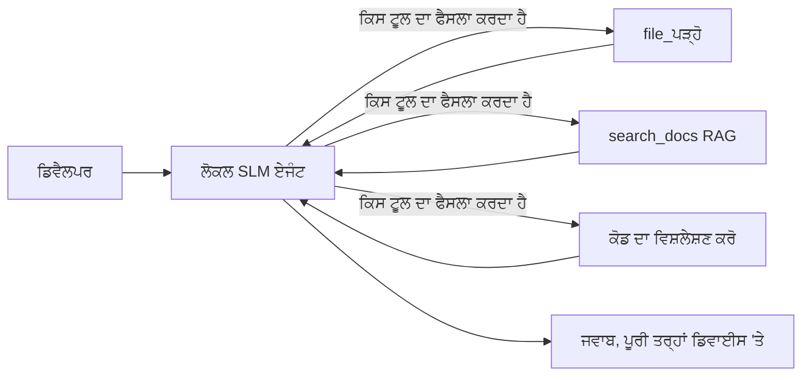
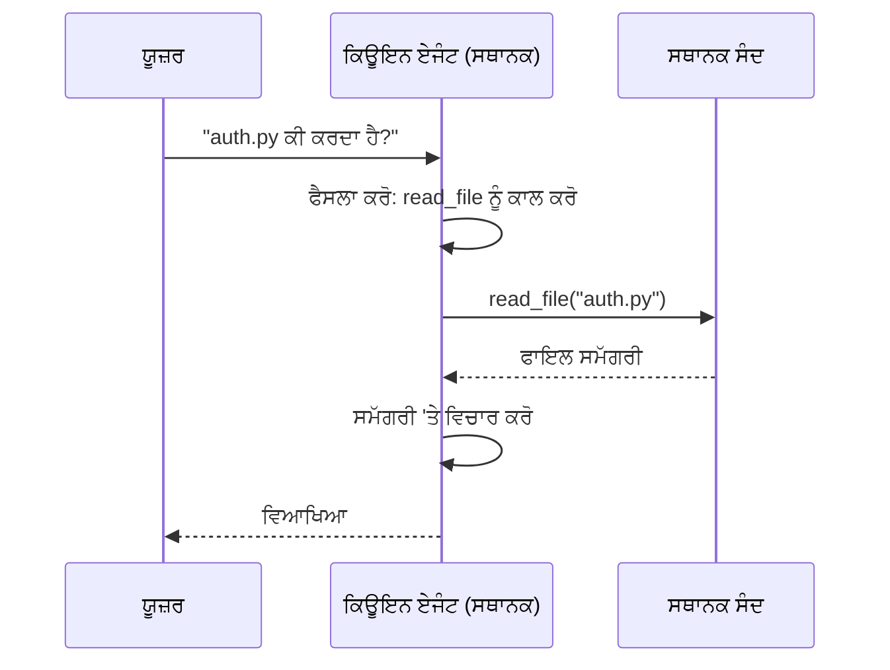
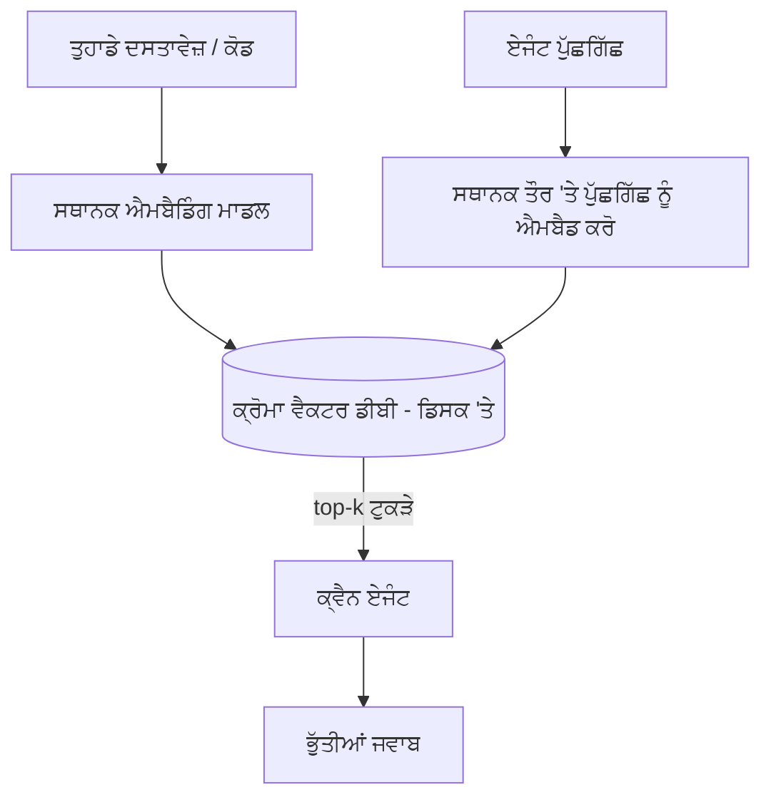
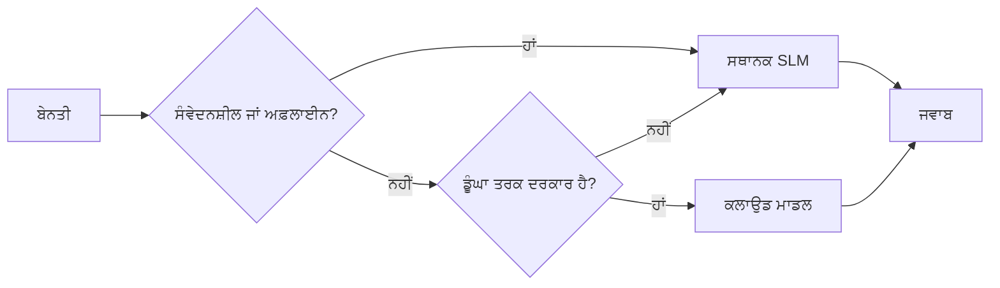

# ਮਾਈਕ੍ਰੋਸੋਫਟ ਫਾਉਂਡਰੀ ਲੋਕਲ ਅਤੇ ਕ੍ਵੈਨ ਦੀ ਵਰਤੋਂ ਕਰਕੇ ਲੋਕਲ ਏਆਈ ਏਜੰਟ ਬਣਾਉਣਾ


ਪਹਿਲਾ ਪਾਠ ਏਜੰਟਾਂ ਨੂੰ ਕਲਾਉਡ ਵਿੱਚ ਵੱਡਾ ਕਰਦਾ ਸੀ। ਇਹ ਪਾਠ ਉਨ੍ਹਾਂ ਨੂੰ ਇੱਕ ਇਕੱਲੀ ਮਸ਼ੀਨ 'ਤੇ ਲਿਆਉਂਦਾ ਹੈ। ਅੰਤ ਵਿੱਚ ਤੁਹਾਡੇ ਕੋਲ ਇੱਕ ਕੰਮ ਕਰਨ ਵਾਲਾ ਇੰਜੀਨੀਅਰਿੰਗ ਸਹਾਇਕ ਹੋਵੇਗਾ ਜੋ ਤਰਕ ਕਰਦਾ ਹੈ, ਉਪਕਰਨਾਂ ਨੂੰ ਕਾਲ ਕਰਦਾ ਹੈ, ਤੁਹਾਡੇ ਫਾਇਲਾਂ ਨੂੰ ਪੜ੍ਹਦਾ ਹੈ ਅਤੇ ਤੁਹਾਡੇ ਦਸਤਾਵੇਜ਼ਾਂ ਦੀ ਖੋਜ ਕਰਦਾ ਹੈ — **ਇਕ ਵੀ ਕਲਾਉਡ ਇੰਫਰੰਸ ਕਾਲ ਬਿਨਾਂ।**

ਤੁਹਾਨੂੰ ਇਹ ਕਿਉਂ ਚਾਹੀਦਾ ਹੈ? ਅਸਲੀ ਇੰਜੀਨੀਅਰਿੰਗ ਕੰਮ ਵਿੱਚ ਲਗਾਤਾਰ ਆਉਂਦੀਆਂ ਤਿੰਨ ਕਾਰਣ ਹਨ:

- **ਪ੍ਰਾਈਵੇਸੀ।** ਕੋਡ ਅਤੇ ਦਸਤਾਵੇਜ਼ ਮਸ਼ੀਨ ਨੂੰ ਕਦੇ ਨਹੀਂ ਛੱਡਦੇ। ਕੋਈ ਪ੍ਰਾਂਪਟ, ਕੋਈ ਸਨਿੱਪੇਟ, ਕੋਈ ਗ੍ਰਾਹਕ ਡਾਟਾ ਨੈੱਟਵਰਕ ਸੀਮਾ ਤੋਂ ਨਹੀਂ ਲੰਘਦਾ।
- **ਲਾਗਤ।** ਲੋਕਲ ਇੰਫਰੰਸ ਦਾ ਕੋਈ ਪ੍ਰਤੀ-ਟੋਕਨ ਬਿਲ ਨਹੀਂ ਹੁੰਦਾ। ਤੁਸੀਂ ਬਿਜਲੀ ਦੇ ਮੁੱਲ 'ਤੇ ਸਾਰਾ ਦਿਨ ਇਟਰੈਟ ਕਰ ਸਕਦੇ ਹੋ।
- **ਆਫਲਾਈਨ।** ਇੱਕ ਹਵਾਈ ਜਹਾਜ਼ ਉੱਤੇ, ਇੱਕ ਸੁਰੱਖਿਅਤ ਸਥਾਨ ਵਿੱਚ, ਜਾਂ ਬਿਜਲੀ ਬੰਦ ਹੋਣ ਦੌਰਾਨ, ਏਜੰਟ ਅਜੇ ਵੀ ਕੰਮ ਕਰਦਾ ਹੈ।

ਫਰਕ ਇਹ ਹੈ ਕਿ ਤੁਸੀਂ ਇੱਕ ਅੱਗੇਟ ਕਲਾਉਡ ਮਾਡਲ ਨੂੰ ਆਪਣੀ ਸੀਪੀਯੂ, ਜੀਪਿਊ, ਜਾਂ ਐਨਪਿਊ 'ਤੇ ਚੱਲ ਰਹੇ **ਛੋਟੇ ਭਾਸ਼ਾ ਮਾਡਲ (SLM)** ਨਾਲ ਬਦਲ ਰਹੇ ਹੋ। ਇਹ ਪਾਠ ਉਹਨਾਂ ਏਜੰਟਾਂ ਬਣਾਉਣ ਬਾਰੇ ਹੈ ਜੋ ਇਸ ਸੀਮਾਬੱਧਤਾ ਦੇ ਅੰਦਰ *ਚੰਗੇ* ਹਨ ਨਾ ਕਿ ਇਹ ਦਰਸਾਉਂਦੇ ਹੋਏ ਕਿ ਸੀਮਾਬੱਧਤਾ ਮੌਜੂਦ ਨਹੀਂ।

## ਪਰੇਚੇ

ਇਸ ਪਾਠ ਵਿੱਚ ਸਮੇਤ ਕੀਤਾ ਜਾਵੇਗਾ:

- **ਛੋਟੇ ਭਾਸ਼ਾ ਮਾਡਲ (SLM)** — ਉਹ ਕੀ ਹਨ, ਕਿੱਥੇ ਚਮਕਦੇ ਹਨ ਅਤੇ ਕਿੱਥੇ ਨਹੀਂ।
- **ਮਾਈਕ੍ਰੋਸੋਫਟ ਫਾਉਂਡਰੀ ਲੋਕਲ** — ਇੱਕ ਰਨਟਾਈਮ ਜੋ ਮਾਡਲ ਨੂੰ ਡਾਊਨਲੋਡ ਕਰਦਾ ਅਤੇ ਡਿਵਾਈਸ 'ਤੇ **OpenAI-ਸਮਰਥਿਤ API** ਰਾਹੀਂ ਸੇਵਾ ਦਿੰਦਾ ਹੈ।
- **ਕ੍ਵੈਨ ਫੰਕਸ਼ਨ ਕਾਲਿੰਗ ਮਾਡਲਸ** — SLMs ਜੋ ਭਰੋਸੇਯੋਗ ਢੰਗ ਨਾਲ ਟੂਲ ਕਾਲ ਪ੍ਰਦਾਨ ਕਰਦੇ ਹਨ, ਜੋ ਕਿ ਲੋਕਲ *ਏਜੰਟ* (ਸਿਰਫ਼ ਲੋਕਲ ਚੈਟ ਨਹੀਂ) ਨੂੰ ਸੰਭਵ ਬਣਾਉਂਦਾ ਹੈ।
- **ਲੋਕਲ ਟੂਲ, ਲੋਕਲ RAG, ਅਤੇ ਲੋਕਲ MCP** — ਏਜੰਟ ਨੂੰ ਕਲਾਉਡ ਦੇ ਬਿਨਾਂ ਸਮਰੱਥਾ ਦੇਣ।
- **ਹਾਇਬ੍ਰਿਡ ਪੈਟਰਨਸ** — ਕਦੋਂ ਚੀਜ਼ਾਂ ਨੂੰ ਲੋਕਲ ਰੱਖਣਾ ਹੈ ਅਤੇ ਕਦੋਂ ਕਲਾਉਡ ਲਈ ਆਗਿਆ ਦੇਣੀ ਹੈ।

## ਸਿੱਖਣ ਦੇ ਲਕੜ

ਇਸ ਪਾਠ ਨੂੰ ਪੂਰਾ ਕਰਨ ਤੋਂ ਬਾਅਦ, ਤੁਸੀਂ ਜਾਣੋਗੇ ਕਿਵੇਂ:

- SLMs ਦੇ ਤਜਰਬਿਆਂ ਦੀ ਵਿਆਖਿਆ ਕਰਨੀ ਅਤੇ ਮੁਕੰਮਲ ਲੋਕਲ ਏਜੰਟ ਮਾਮਲੇ ਚੁਣਨਾ।
- ਫਾਉਂਡਰੀ ਲੋਕਲ ਨਾਲ ਕ੍ਵੈਨ ਮਾਡਲ ਨੂੰ ਲੋਕਲ ਤੌਰ 'ਤੇ ਚਲਾਉਣਾ ਅਤੇ OpenAI-ਸਮਰਥਿਤ ਐਂਡਪਾਇੰਟ ਰਾਹੀਂ ਜੁੜਨਾ।
- ਇੱਕ ਟੂਲ-ਕਾਲਿੰਗ ਏਜੰਟ ਬਨਾਉਣਾ ਜੋ ਪੂਰੀ ਤਰ੍ਹਾਂ ਤੁਹਾਡੇ ਕੰਮ ਕਰਨ ਵਾਲੇ ਸਥਾਨ 'ਤੇ ਚੱਲਦਾ ਹੈ।
- ਲੋਕਲ ਵੇਕਟਰ ਡੇਟਾਬੇਸ (ਕਰੋਮਾ) ਦੀ ਵਰਤੋਂ ਕਰਕੇ ਆਪਣੇ ਦਸਤਾਵੇਜ਼ਾਂ 'ਤੇ ਲੋਕਲ RAG ਲਗਾਉਣਾ।
- ਏਜੰਟ ਨੂੰ ਇੱਕ ਲੋਕਲ MCP ਸਰਵਰ ਨਾਲ ਜੁੜਨਾ ਅਤੇ ਹਾਇਬ੍ਰਿਡ ਲੋਕਲ/ਕਲਾਉਡ ਡਿਜ਼ਾਈਨ ਬਾਰੇ ਤਰਕ ਕਰਨਾ।

## ਪਹਿਲਾਂ ਦੀਆਂ ਲੋੜਾਂ

ਇਹ ਪਾਠ ਮੰਨਦਾ ਹੈ ਕਿ ਤੁਸੀਂ ਪਹਿਲਾਂ ਦੇ ਪਾਠ ਪੂਰੇ ਕਰ ਲਏ ਹਨ ਅਤੇ ਇਹਨਾਂ ਵਿੱਚ ਮਾਹਿਰ ਹੋ:

- [ਟੂਲ ਦੀ ਵਰਤੋਂ](../04-tool-use/README.md) (ਪਾਠ 4) ਅਤੇ [ਏਜੇਂਟਿਕ RAG](../05-agentic-rag/README.md) (ਪਾਠ 5)।
- [ਏਜੇਂਟਿਕ ਪ੍ਰੋਟੋਕਾਲ / MCP](../11-agentic-protocols/README.md) (ਪਾਠ 11)।
- [ਮਾਈਕ੍ਰੋਸੋਫਟ ਏਜੰਟ ਫਰੇਮਵਰਕ](../14-microsoft-agent-framework/README.md) (ਪਾਠ 14)।

ਤੁਹਾਨੂੰ ਇਹ ਵੀ ਲੋੜ ਹੋਵੇਗੀ:

- ਇੱਕ ਡਿਵੈਲਪਰ ਵਰਕਸਟੇਸ਼ਨ। **8 GB RAM ਇੱਕ ਹਕੀਕੀ ਘੱਟੋ-ਘੱਟ ਹੈ**; 16 GB+ ਆਰਾਮਦਾਇਕ ਹੈ। GPU ਜਾਂ NPU ਮਦਦਗਾਰ ਹੈ ਪਰ ਜ਼ਰੂਰੀ ਨਹੀਂ।
- **ਮਾਈਕ੍ਰੋਸੋਫਟ ਫਾਉਂਡਰੀ ਲੋਕਲ** ਇੰਸਟਾਲ ਕੀਤਾ ਹੋਇਆ (ਹੇਠਾਂ ਦਿੱਤੇ ਸੈਟਅੱਪ ਭਾਗ ਨੂੰ ਵੇਖੋ)।
- ਪਾਇਥਨ 3.12+ ਅਤੇ ਰਿਪੋਜ਼ਟਰੀ ਵਿੱਚ ਪੈਕੇਜਾਂ [`requirements.txt`](../../../requirements.txt), ਨਾਲ ਹੀ `foundry-local-sdk`, `openai`, ਅਤੇ `chromadb` ਇਸ ਪਾਠ ਲਈ।

## ਛੋਟੇ ਭਾਸ਼ਾ ਮਾਡਲ: ਲੋਕਲ ਕੰਮ ਲਈ ਸਹੀ ਟੂਲ

ਇੱਕ ਅੱਗੇਟ ਕਲਾਉਡ ਮਾਡਲ ਦੇ ਸੈਂਕੜੇ ਬਿਲੀਅਨ ਪੈਰਾਮੀਟਰ ਹੁੰਦੇ ਹਨ ਅਤੇ ਉਸਦੇ ਪਿੱਛੇ ਇੱਕ ਡੇਟਾ ਸੈਂਟਰ ਹੁੰਦਾ ਹੈ। SLM ਵਿੱਚ ਕੁਝ ਬਿਲੀਅਨ ਪੈਰਾਮੀਟਰ ਹੁੰਦੇ ਹਨ ਅਤੇ ਇਸਨੂੰ ਤੁਹਾਡੇ ਲੈਪਟੌਪ ਦੀ RAM ਵਿੱਚ ਫਿੱਟ ਹੋਣਾ ਚਾਹੀਦਾ ਹੈ। ਇਹ ਫਰਕ ਸਾਫ਼ ਉਮੀਦਾਂ ਪੈਦਾ ਕਰਦਾ ਹੈ।

**SLM ਚੰਗੇ ਹਨ:**

- ਸੰਰਚਿਤ, ਸੀਮਤ ਕਾਰਜ — ਕਿਸੇ ਪਤਾ ਦਸਤਾਵੇਜ਼ ਦੀ ਵਰਗੀਕਰਨ, ਨਿੱਕਾਸ਼, ਸੰਖੇਪ।
- **ਟੂਲ ਕਾਲਿੰਗ** — ਫੈਸਲਾ ਕਰਨਾ ਕਿ ਕਿਹੜਾ ਫੰਕਸ਼ਨ ਕਾਲ ਕਰਨਾ ਹੈ ਅਤੇ ਕਿਨ੍ਹਾਂ ਆਰਗੂਮੈਂਟਾਂ ਨਾਲ।
- ਤੇਜ਼, ਸਸਤੇ, ਨਿੱਜੀ ਤੌਰ 'ਤੇ ਤੁਹਾਡੇ ਆਪਣੇ ਡਾਟੇ 'ਤੇ ਦੁਹਰਾਉਣਾ।

**SLM ਕਮਜ਼ੋਰ ਹਨ:**

- ਖੁੱਲ੍ਹੇ ਅੰਤ ਵਾਲਾ, ਵੱਡੇ ਸੰਦਰਭ ਵਿੱਚ ਬਹੁ-ਹੌਪ ਤਰਕ।
- ਵਿਸ਼ਾਲ ਸੰਸਾਰ ਦੀ ਜਾਣਕਾਰੀ (ਉਹਨਾਂ ਨੇ ਘੱਟ ਦੇਖਿਆ ਹੈ, ਅਤੇ ਵੱਧ ਭੁੱਲਦੇ ਹਨ)।

ਇਸਲਈ ਲੋਕਲ ਏਜੰਟਾਂ ਲਈ ਜਿੱਤਣ ਵਾਲੀ ਰਣਨੀਤੀ ਇਹ ਹੈ: **SLM ਨੂੰ ਆਯੋਜਿਤ ਕਰਨ ਦਿਓ, ਅਤੇ ਟੂਲਿੰਗ ਨੂੰ ਭਾਰੀ ਕੰਮ ਕਰਨ ਦਿਓ।** ਮਾਡਲ ਨੂੰ ਤੁਹਾਡਾ ਕੋਡਬੇਸ *ਜਾਣਨ* ਦੀ ਲੋੜ ਨਹੀਂ — ਇਸਨੂੰ ਇਹ ਜਾਣਨ ਦੀ ਲੋੜ ਹੈ ਕਿ ਕਦੋਂ `read_file` ਤੇ `search_docs` ਕਾਲ ਕਰਨੀ ਹੈ। ਇਹ SLM ਦੇ ਮਜ਼ਬੂਤੀਆਂ ਨੂੰ ਸਿੱਧਾ ਖੇਡਦਾ ਹੈ।



## ਮਾਈਕ੍ਰੋਸੋਫਟ ਫਾਉਂਡਰੀ ਲੋਕਲ

**ਮਾਈਕ੍ਰੋਸੋਫਟ ਫਾਉਂਡਰੀ ਲੋਕਲ** ਇੱਕ ਹਲਕਾ-ਫੁਲਕਾ ਰਨਟਾਈਮ ਹੈ ਜੋ ਮਾਡਲਾਂ ਨੂੰ ਡਾਊਨਲੋਡ ਕਰਦਾ, ਪ੍ਰਬੰਧਨ ਕਰਦਾ ਅਤੇ ਤੁਹਾਡੀ ਮਸ਼ੀਨ 'ਤੇ ਪੂਰੀ ਤਰ੍ਹਾਂ ਸੇਵਾ ਦਿੰਦਾ ਹੈ। ਸਾਡੇ ਲਈ ਇਸਦਾ ਸਭ ਤੋਂ ਮਹੱਤਵਪੂਰਣ ਫੀਚਰ ਇਹ ਹੈ ਕਿ ਇਹ ਇੱਕ **OpenAI-ਸਮਰਥਿਤ HTTP ਐਂਡਪਾਇੰਟ** ਪ੍ਰਦਾਨ ਕਰਦਾ ਹੈ — ਜਿਸਦਾ ਮਤਲਬ ਹੈ ਕਿ OpenAI SDK ਅਤੇ ਮਾਈਕ੍ਰੋਸੋਫਟ ਏਜੰਟ ਫਰੇਮਵਰਕ ਦਾ OpenAI ਕਲੀਐਂਟ ਇਸਦੇ ਖਿਲਾਫ ਸਿਰਫ਼ `base_url` ਤਬਦੀਲ ਕਰਕੇ ਕੰਮ ਕਰਦਾ ਹੈ। ਏਜੰਟ ਬਣਾਉਣ ਬਾਰੇ ਤੁਹਾਡੇ ਸਾਰੇ ਸਿੱਖੇ ਸਿੱਧੇ ਤੌਰ 'ਤੇ ਲਾਗੂ ਹੁੰਦੇ ਹਨ; ਸਿਰਫ਼ ਐਂਡਪਾਇੰਟ ਕਲਾਉਡ ਤੋਂ `localhost` ਨੂੰ ਜਾਂਦਾ ਹੈ।

ਫਾਉਂਡਰੀ ਲੋਕਲ ਤੁਹਾਡੇ ਹਾਰਡਵੇਅਰ ਲਈ ਮਾਡਲ ਦੀ ਸਭ ਤੋਂ ਵਧੀਆ ਬਿਲਡ ਆਪਣੇ ਆਪ ਚੁਣਦਾ ਹੈ — ਜਿਵੇਂ ਕਿ CPU ਬਿਲਡ, CUDA/GPU ਬਿਲਡ ਜਾਂ NPU ਬਿਲਡ — ਤਾਂ ਜੋ ਹਰ ਮਸ਼ੀਨ ਲਈ ਤੁਹਾਨੂੰ ਹੱਥੋਂ ਅਪਟੀਮਾਈਜ਼ ਨਾ ਕਰਨਾ ਪਵੇ।

### ਸੈਟਅੱਪ

ਫਾਉਂਡਰੀ ਲੋਕਲ ਇੰਸਟਾਲ ਕਰੋ (ਤੁਹਾਡੇ OS ਲਈ [ਦਸਤਾਵੇਜ਼](https://learn.microsoft.com/azure/ai-foundry/foundry-local/) ਵੇਖੋ), ਫਿਰ ਯਕੀਨੀ ਬਣਾਓ ਕਿ ਇਹ ਕੰਮ ਕਰਦਾ ਹੈ:

```bash
# ਇੰਸਟਾਲ ਕਰੋ (ਉਦਾਹਰਨ ਵਜੋਂ; ਆਪਣੇ ਪਲੇਟਫਾਰਮ ਲਈ ਦਸਤਾਵੇਜ਼ਾਂ ਦੀ ਪਾਲਣਾ ਕਰੋ)
winget install Microsoft.FoundryLocal      # ਵਿੰਡੋਜ਼
# brew install microsoft/foundrylocal/foundrylocal   # ਮੈਕਓਐਸ

# ਇੱਕ Qwen ਮਾਡਲ ਡਾਊਨਲੋਡ ਅਤੇ ਚਲਾਓ, ਫਿਰ ਸਥਾਨਕ ਸੇਵਾ ਸ਼ੁਰੂ ਕਰੋ
foundry model run qwen2.5-7b-instruct
foundry service status
```

ਜਦੋਂ ਸਰਵਿਸ ਚੱਲ ਰਹੀ ਹੋਵੇ ਤਾਂ ਤੁਹਾਡੇ ਕੋਲ ਇੱਕ ਲੋਕਲ, OpenAI-ਸਮਰਥਿਤ ਐਂਡਪਾਇੰਟ ਹੁੰਦਾ ਹੈ (ਆਮ ਤੌਰ 'ਤੇ `http://localhost:PORT/v1`)। ਨੋਟਬੁੱਕ `foundry-local-sdk` ਦੀ ਵਰਤੋਂ ਕਰਦਾ ਹੈ ਜੋ ਐਂਡਪਾਇੰਟ ਨੂੰ ਆਪਾਂ ਹੀ ਲੱਭ ਲੈਂਦਾ ਹੈ, ਇਸ ਲਈ ਤੁਹਾਨੂੰ ਪੋਰਟ ਨੂੰ ਹਾਰਡ ਕੋਡ ਕਰਨ ਦੀ ਲੋੜ ਨਹੀਂ।

## ਕ੍ਵੈਨ ਫੰਕਸ਼ਨ ਕਾਲਿੰਗ: ਇਹ ਕਿਉਂ ਮਹੱਤਵਪੂਰਣ ਹੈ

ਇੱਕ ਏਜੰਟ ਓਹੀ ਏਜੰਟ ਹੁੰਦਾ ਹੈ ਜੋ ਟੂਲਾਂ ਨੂੰ ਕਾਲ ਕਰ ਸਕਦਾ ਹੈ। ਕਈ SLM ਚੈਟ ਕਰ ਸਕਦੇ ਹਨ ਪਰ ਅਣਭਰੋਸੇਯੋਗ, ਗਲਤ-ਸੰਰਚਿਤ ਟੂਲ ਕਾਲ ਉਤਪਾਦਨ ਕਰਦੇ ਹਨ। **ਕ੍ਵੈਨ** ਮਾਡਲ ਫੰਕਸ਼ਨ ਕਾਲਿੰਗ ਲਈ ਪ੍ਰਸ਼ਿੱਖਤ ਹਨ ਅਤੇ ਲਗਾਤਾਰ ਚੰਗੀ ਤਰ੍ਹਾਂ ਸੱਜੀ ਹੋਈ ਟੂਲ-ਕਾਲ ਸੰਗਰਚਨਾ ਪੈਦਾ ਕਰਦੇ ਹਨ — ਜੋ ਕਿ ਇੱਕ ਲੋਕਲ ਚੈਟ ਮਾਡਲ ਨੂੰ ਇੱਕ ਲੋਕਲ *ਏਜੰਟ* ਬਣਾਉਂਦਾ ਹੈ।

ਫਲੋ ਸਧਾਰਨ ਟੂਲ-ਕਾਲਿੰਗ ਲੂਪ ਹੈ ਜੋ ਤੁਸੀਂ ਪਹਿਲਾਂ ਹੀ ਜਾਣਦੇ ਹੋ, ਸਿਰਫ਼ ਡਿਵਾਈਸ 'ਤੇ ਚਲ ਰਿਹਾ ਹੈ:



## ਲੋਕਲ RAG

ਦਸਤਾਵੇਜ਼ ਖੋਜ ਜ਼ਿੱਥੇ ਲੋਕਲ ਏਜੰਟ ਆਪਣੀ ਜਗ੍ਹਾ ਕਮਾਉਂਦੇ ਹਨ। ਇਸਦੇ ਬਜਾਏ ਕਿ SLM ਤੁਹਾਡੇ ਫਰੇਮਵਰਕ ਦੇ ਦਸਤਾਵੇਜ਼ ਯਾਦ ਕਰ ਲਿਆ ਹੋਵੇ, ਤੁਸੀਂ ਉਹਨਾਂ ਦਸਤਾਵੇਜ਼ਾਂ ਨੂੰ ਇੱਕ **ਲੋਕਲ ਵੇਕਟਰ ਡੇਟਾਬੇਸ** ਵਿੱਚ ਐੰਬਡ ਕਰਦੇ ਹੋ ਅਤੇ ਏਜੰਟ ਨੂੰ ਮੰਗ 'ਤੇ ਸੰਬੰਧਿਤ ਹਿੱਸੇ ਲੱਭਣ ਦਿੰਦੇ ਹੋ।

ਅਸੀਂ **ਕਰੋਮਾ** ਦੀ ਵਰਤੋਂ ਕਰਦੇ ਹਾਂ, ਇੱਕ ਐੰਬਡ ਕੀਤੀ ਹੋਈ ਵੇਕਟਰ ਸਟੋਰ ਜੋ ਬਿਨਾਂ ਕਿਸੇ ਸਰਵਰ ਪ੍ਰਬੰਧਨ ਦੇ ਪ੍ਰੋਸੈਸ ਦੇ ਅੰਦਰ ਚੱਲਦੀ ਹੈ। ਪਾਈਪਲਾਈਨ ਪੂਰੀ ਤਰ੍ਹਾਂ ਲੋਕਲ ਹੈ: ਲੋਕਲ ਐੰਬਡਿੰਗ ਮਾਡਲ → ਲੋਕਲ ਵੇਕਟਰ → ਲੋਕਲ ਰੀਟਰੀਵਲ → ਲੋਕਲ SLM।



ਇਹ ਅਗਲਾ ਐਜੇਂਟਿਕ RAG ਪੈਟਰਨ ਹੈ ਜੋ ਪਾਠ 5 ਤੋਂ ਹੈ — ਸਿਰਫ਼ ਪ੍ਰਭਾ ਹੈ ਕਿ ਹਰ ਕੰਪੋਨੈਂਟ ਤੁਹਾਡੇ ਮਸ਼ੀਨ 'ਤੇ ਚੱਲਦਾ ਹੈ।

## ਲੋਕਲ MCP ਸਰਵਰ

[MCP](../11-agentic-protocols/README.md) ਇੱਕ ਟ੍ਰਾਂਸਪੋਰਟ ਹੈ, ਨਾ ਕਿ ਕਲਾਉਡ ਸਰਵਿਸ। ਇੱਕ MCP ਸਰਵਰ `stdio` ਤੇ ਲੋਕਲ ਪ੍ਰਕਿਰਿਆ ਵਜੋਂ ਚੱਲ ਸਕਦਾ ਹੈ, ਅਤੇ ਏਜੰਟ ਲਈ ਮਿਆਰੀ ਪ੍ਰੋਟੋਕਾਲ 'ਤੇ ਟੂਲਾਂ ਉਪਲਬਧ ਕਰਵਾਉਂਦਾ ਹੈ। ਇਹ ਤੁਹਾਨੂੰ MCP ਸਰਵਰਾਂ ਦੀ ਵਧ ਰਹੀ ਪਰਿਵਾਰ ਦਾ ਦੁਬਾਰਾ ਉਪਯੋਗ ਕਰਨ ਦਿੰਦਾ ਹੈ — ਫਾਇਲ ਸਿਸਟਮ ਪਹੁੰਚ, ਗਿਟ ਸ਼ਾਮਿਲ ਹਨ, ਡੇਟਾਬੇਸ ਕੁੜੀ — ਸਾਰੇ ਇੱਥੇ ਆਫਲਾਈਨ।

ਸੁਰੱਖਿਆ ਮਾਮਲਾ ਕਲਾਉਡ ਤੋਂ ਵੱਖਰਾ ਹੈ, ਪਰ ਗੈਰਮੌਜੂਦ ਨਹੀਂ: ਇੱਕ ਲੋਕਲ MCP ਸਰਵਰ ਤੁਹਾਡੇ ਯੂਜ਼ਰ ਦੇ ਅਧਿਕਾਰਾਂ ਨਾਲ ਚੱਲਦਾ ਹੈ, ਇਸ ਲਈ ਇਸ ਨੂੰ ਜੋ ਤੁਹਾਡੇ ਕੰਮ ਦਾ ਹਿੱਸਾ ਹੈ (ਜਿਵੇਂ ਇੱਕ ਪਰੋਜੈਕਟ ਡਾਇਰੈਕਟਰੀ, ਤੁਹਾਡੇ ਪੂਰੇ ਹੋਮ ਫੋਲਡਰ ਨਾਲ ਨਹੀਂ) ਤੱਕ ਸੀਮਿਤ ਕਰੋ ਅਤੇ ਇਸਦੇ ਨਤੀਜਿਆਂ ਨੂੰ ਪਰਖ ਕੇ ਹੀ ਵਰਤੋਂ।

## ਹਾਇਬ੍ਰਿਡ ਕਲਾਉਡ ਅਤੇ ਲੋਕਲ ਪੈਟਰਨ

ਪਹਿਲਾਂ-ਲੋਕਲ ਮਤਲਬ ਸਿਰਫ ਲੋਕਲ ਨਹੀਂ। ਮਜ਼ਬੂਤੀਆਂ ਸਿਸਟਮ ਸੰਵੇਦਨਸ਼ੀਲਤਾ ਅਤੇ ਮੁਸ਼ਕਲਤਾ ਦੇ ਅਨੁਸਾਰ ਰੂਟ ਕਰਦੇ ਹਨ:

| ਸਥਿਤੀ | ਕਿੱਥੇ ਚੱਲਦਾ ਹੈ |
| --- | --- |
| ਸੰਵੇਦਨਸ਼ੀਲ ਕੋਡ / ਡਾਟਾ ਜਾਂ ਆਫਲਾਈਨ | **ਲੋਕਲ SLM** |
| ਸਧਾਰਨ, ਸੀਮਿਤ ਕੰਮ | **ਲੋਕਲ SLM** (ਸਸਤਾ, ਤੇਜ਼) |
| ਗੰਭੀਰ ਬਹੁ-ਹੌਪ ਤਰਕ ਗੈਰ-ਸੰਵੇਦਨਸ਼ੀਲ ਡਾਟਾ 'ਤੇ | **ਕਲਾਉਡ ਮਾਡਲ** |
| ਬਿਜਲੀ ਬੰਦ ਹੋਣ ਦੌਰਾਨ ਸਭ ਕੁਝ | **ਲੋਕਲ SLM** (ਸੁਚੱਜੀ ਤੌਰ 'ਤੇ ਘਟਾਉ) |

ਇਹ ਪਾਠ 16 ਵੱਲੋਂ **ਮਾਡਲ ਰੂਟਿੰਗ** ਵਿਚਾਰ ਦੀ ਨਕਲ ਕਰਦਾ ਹੈ — ਬਸ ਇੱਕ "ਮਾਡਲ" ਹੁਣ ਤੁਹਾਡੀ ਆਪਣੀ ਮਸ਼ੀਨ ਹੈ। ਇੱਕ ਮਜਬੂਤ ਡਿਜ਼ਾਈਨ ਕਲਾਉਡ ਅਣਉਪਲਬਧ ਹੋਣ 'ਤੇ ਲੋਕਲ ਤੇ ਵਾਪਸ ਚੱਲਦਾ ਹੈ, ਤਾਂ ਕਿ ਏਜੰਟ ਗੁਣਵੱਤਾ ਵਿਚ ਹੌਲੀ-ਹੌਲੀ ਕਮ ਹੋਵੇ ਨਾ ਕਿ ਪੂਰੀ ਤਰ੍ਹਾਂ ਫੇਲ ਹੋ ਜਾਵੇ।



## ਪ੍ਰਯੋਗਸ਼ਾਲਾ: ਇੱਕ ਲੋਕਲ ਇੰਜੀਨੀਅਰਿੰਗ ਸਹਾਇਕ

ਖੋਲ੍ਹੋ [`code_samples/17-local-agent-foundry-local.ipynb`](./code_samples/17-local-agent-foundry-local.ipynb) ਅਤੇ ਇਸਨੂੰ ਪੂਰਾ ਕਰੋ। ਤੁਸੀਂ ਇੱਕ **ਲੋਕਲ ਇੰਜੀਨੀਅਰਿੰਗ ਸਹਾਇਕ** ਬਣਾਵੋਗੇ ਜੋ ਪੂਰੀ ਤਰ੍ਹਾਂ ਤੁਹਾਡੇ ਕੰਮ ਕਾਰ ਸਥਾਨ 'ਤੇ ਚੱਲਦਾ ਹੈ ਅਤੇ ਕਰ ਸਕਦਾ ਹੈ:

1. **ਟੂਲਾਂ ਨੂੰ ਕਾਲ ਕਰੋ** — ਫਾਉਂਡਰੀ ਲੋਕਲ ਰਾਹੀਂ ਕ੍ਵੈਨ ਫੰਕਸ਼ਨ ਕਾਲਿੰਗ ਦੁਆਰਾ।
2. **ਲੋਕਲ ਫਾਇਲ ਓਪਰੇਸ਼ਨ ਕਰੋ** — ਇੱਕ ਪਰੋਜੈਕਟ ਡਾਇਰੈਕਟਰੀ ਵਿੱਚ ਫਾਇਲਾਂ ਦੀ ਲਿਸਟ ਅਤੇ ਪੜ੍ਹਾਈ ਕਰੋ।
3. **ਕੋਡ ਦਾ ਵਿਸ਼ਲੇਸ਼ਣ ਕਰੋ** — ਇੱਕ ਸਰੋਤ ਫਾਇਲ 'ਤੇ ਮੂਲ ਮੈਟ੍ਰਿਕਸ ਰਿਪੋਰਟ ਦਿਓ।
4. **ਦਸਤਾਵੇਜ਼ਾਂ ਨੂੰ ਖੋਜੋ** — ਕਰੋਮਾ ਨਾਲ ਦਸਤਾਵੇਜ਼ਾਂ ਦੇ ਫੋਲਡਰ 'ਤੇ ਲੋਕਲ RAG।
5. **MCP ਦੀ ਵਰਤੋਂ ਕਰੋ** — ਇੱਕ ਲੋਕਲ MCP ਸਰਵਰ ਨਾਲ ਜੁੜੋ (ਜੇ ਨਾ ਮਿਲੇ ਤਾਂ ਸੁਚੱਜੇ ਤੌਰ 'ਤੇ ਛੱਡੋ)।

ਕਿਸੇ ਵੀ ਸਮੇਂ ਕੋਈ ਕਲਾਉਡ ਇੰਫਰੰਸ ਵਰਤੀ ਨਹੀਂ ਜਾਂਦੀ।

### ਰਾਹਦਾਰੀ

ਸਹਾਇਕ OpenAI-ਸਮਰਥਿਤ ਐਂਡਪਾਇੰਟ ਰਾਹੀਂ ਫਾਉਂਡਰੀ ਲੋਕਲ ਨਾਲ ਜੁੜਦਾ ਹੈ, ਇਸ ਲਈ ਏਜੰਟ ਕੋਡ ਕਲਾਉਡ ਪਾਠਾਂ ਨਾਲ ਲਗਭਗ ਇਕੋ ਜਿਹਾ ਦਿਸਦਾ ਹੈ — ਸਿਰਫ ਕਲੀਐਂਟ ਬਦਲਦਾ ਹੈ:

```python
from foundry_local import FoundryLocalManager
from openai import OpenAI

# ਫਾਊਂਡਰੀ ਲੋਕਲ ਮਾਡਲ ਨੂੰ ਖੋਜਦਾ/ਡਾਊਨਲੋਡ ਕਰਦਾ ਹੈ ਅਤੇ ਸਾਨੂੰ ਇੱਕ ਸਥਾਨਕ ਐਂਡਪੌਇੰਟ ਦਿੰਦਾ ਹੈ।
manager = FoundryLocalManager(\"qwen2.5-7b-instruct\")
client = OpenAI(base_url=manager.endpoint, api_key=manager.api_key)  # api_key ਇੱਕ ਸਥਾਨਕ ਪਲੇਸਹੋਲਡਰ ਹੈ।
```

ਟੂਲ ਆਮ ਪਾਇਥਨ ਫੰਕਸ਼ਨ ਹਨ ਜੋ ਇੱਕ ਪਰੋਜੈਕਟ ਡਾਇਰੈਕਟਰੀ ਤੱਕ ਸੀਮਿਤ ਹਨ:

```python
def read_file(path: str) -> str:
    \"\"\"Read a file, but only inside the sandboxed project directory.\"\"\"
    full = (PROJECT_ROOT / path).resolve()
    if PROJECT_ROOT not in full.parents and full != PROJECT_ROOT:
        return \"Access denied: path is outside the project directory.\"
    return full.read_text(encoding=\"utf-8\")
```

ਸੈਂਡਬਾਕਸ ਚੈੱਕ 'ਤੇ ਧਿਆਨ ਦਿਓ — ਭਾਵੇਂ ਲੋਕਲ ਵੀ ਹੋਵੇ, ਇੱਕ ਟੂਲ ਜੋ ਕਿਸੇ ਵੀ ਰਾਹ ਨੂੰ ਪੜ੍ਹਦਾ ਹੈ ਉਹ ਇੱਕ ਜ਼ਿੰਮੇਵਾਰੀ ਹੈ। ਨੋਟਬੁੱਕ ਹਰ ਟੂਲ ਨੂੰ ਇੱਕ ਪ੍ਰੋਜੈਕਟ ਰੂਟ ਤੱਕ ਸੀਮਿਤ ਰੱਖਦਾ ਹੈ।

## ਗਿਆਨ ਦੀ ਜਾਂਚ

ਅਸਾਈਨਮੈਂਟ 'ਤੇ ਜਾਣ ਤੋਂ ਪਹਿਲਾਂ ਆਪਣੀ ਸਮਝ ਦਾ ਟੈਸਟ ਕਰੋ।

**1. ਇੱਕ ਏਜੰਟ ਨੂੰ ਕਲਾਉਡ ਵਿੱਚ ਚਲਾਉਣ ਦੀ ਥਾਂ ਲੋਕਲ ਵਿੱਚ ਚਲਾਉਣ ਦੇ ਦੋ ਠੋਸ ਕਾਰਣ ਦਿਓ।**

<details>
<summary>ਜਵਾਬ</summary>

ਕੋਈ ਵੀ ਦੋ: **ਪ੍ਰਾਈਵੇਸੀ** (ਕੋਡ ਅਤੇ ਡਾਟਾ ਮਸ਼ੀਨ ਨੂੰ ਕਦੇ ਨਹੀਂ ਛੱਡਦੇ), **ਲਾਗਤ** (ਕੋਈ ਪ੍ਰਤੀ-ਟੋਕਨ ਇੰਫਰੰਸ ਬਿਲ ਨਹੀਂ), ਅਤੇ **ਆਫਲਾਈਨ ਸਮਰੱਥਾ** (ਨੈੱਟਵਰਕ ਤੋ ਬਿਨ੍ਹਾਂ ਕੰਮ ਕਰਦਾ — ਹਵਾਈ ਜਹਾਜ਼ 'ਤੇ, ਸੁਰੱਖਿਅਤ ਸਥਾਨ ਵਿੱਚ ਜਾਂ ਬਿਜਲੀ ਬੰਦ ਹਾਲਤ ਵਿੱਚ)। ਨਿਯਮਾਂ/ਅਨੁਕੂਲਤਾ ਜੋ ਡਾਟਾ ਨੂੰ ਯੰਤਰ ਤੋਂ ਬਾਹਰ ਭੇਜਣ ਤੋਂ ਮਨਾਹੀ ਕਰਦੀਆਂ ਹਨ, ਪ੍ਰਾਈਵੇਸੀ ਕਾਰਣ ਲਈ ਆਮ ਚਲਨ ਹਨ।
</details>

**2. ਇੱਕ ਲੋਕਲ ਏਜੰਟ ਵਿੱਚ SLM ਅਤੇ ਇਸਦੇ ਟੂਲਾਂ ਵਿੱਚ ਕੰਮ ਦੀ ਵੰਡ ਕੀਮਤੀ ਕਿਵੇਂ ਹੈ ਅਤੇ ਕਿਉਂ?**

<details>
<summary>ਜਵਾਬ</summary>

SLM ਨੂੰ **ਆਯੋਜਿਤ ਕਰਨ ਦਿਓ** (ਫੈਸਲਾ ਕਰਨ ਲਈ ਕਿ ਕਿਹੜਾ ਟੂਲ ਕਾਲ ਕਰਨਾ ਹੈ ਅਤੇ ਕਿਸ ਆਰਗੂਮੈਂਟ ਨਾਲ) ਅਤੇ ਟੂਲਾਂ ਨੂੰ **ਭਾਰੀ ਕੰਮ ਕਰਨ ਦਿਓ** (ਫਾਇਲਾਂ ਨੂੰ ਪੜ੍ਹਨਾ, ਦਸਤਾਵੇਜ਼ ਲੱਭਣਾ, ਨਤੀਜੇ ਗਣਨਾ ਕਰਨਾ)। SLM ਬੰਨ੍ਹੇ ਫੈਸਲੇ ਜਿਵੇਂ ਟੂਲ ਚੋਣ ਦੇ ਖੇਤਰ ਵਿੱਚ ਮਜ਼ਬੂਤ ਹੁੰਦੇ ਹਨ ਪਰ ਵਿਸ਼ਾਲ ਗਿਆਨ ਅਤੇ ਲੰਬੇ ਬਹੁ-ਹੌਪ ਤਰਕ ਵਿੱਚ ਕਮਜ਼ੋਰ, ਇਸ ਲਈ ਟੂਲਾਂ ਉੱਤੇ ਨਿਰਭਰਤਾ ਉਨ੍ਹਾਂ ਦੀਆਂ ਮਜ਼ਬੂਤੀਆਂ ਨਾਲ ਮੇਲ ਖਾਂਦੀ ਹੈ।
</details>

**3. ਫਾਉਂਡਰੀ ਲੋਕਲ ਨਾਲ ਕਲਾਉਡ ਏਜੰਟ ਕੋਡ ਨੂੰ ਮੁੜ ਵਰਤਣਾ ਸੰਭਵ ਬਣਾਉਂਦਾ ਕੀ ਹੈ?**

<details>
<summary>ਜਵਾਬ</summary>

ਫਾਉਂਡਰੀ ਲੋਕਲ ਇੱਕ **OpenAI-ਸਮਰਥਿਤ HTTP ਐਂਡਪਾਇੰਟ** ਪ੍ਰਦਾਨ ਕਰਦਾ ਹੈ। OpenAI SDK ਅਤੇ ਏਜੰਟ ਫਰੇਮਵਰਕ ਦੇ OpenAI ਕਲੀਐਂਟ ਇਸਦੇ ਖਿਲਾਫ ਸਿਰਫ਼ `base_url` ਬਦਲ ਕੇ (ਅਤੇ ਲੋਕਲ ਥਾਂਹਾਰ API ਕੁੰਜੀ ਵਰਤ ਕੇ) ਕੰਮ ਕਰਦੇ ਹਨ। ਏਜੰਟ ਕੋਡ ਬਾਕੀ ਸਾਰਾ ਇੱਕੋ ਜਿਹਾ ਰਹਿੰਦਾ ਹੈ।
</details>

**4. ਅਸੀਂ ਕਿਸੇ ਵੀ SLM ਦੀ ਥਾਂ ਖਾਸ ਤੌਰ 'ਤੇ ਕ੍ਵੈਨ ਫੰਕਸ਼ਨ ਕਾਲਿੰਗ ਮਾਡਲ ਕਿਉਂ ਵਰਤਦੇ ਹਾਂ?**

<details>
<summary>ਜਵਾਬ</summary>

ਕਿਉਂਕਿ ਇੱਕ ਏਜੰਟ ਨੂੰ ਭਰੋਸੇਯੋਗ, ਚੰਗੀ ਤਰ੍ਹਾਂ ਬਣੀ **ਟੂਲ ਕਾਲ** ਬਨਾਉਣੀ ਚਾਹੀਦੀ ਹੈ। ਕਈ SLM ਚੈਟ ਕਰ ਸਕਦੇ ਹਨ ਪਰ ਗਲਤ ਜਾਂ ਅਸਮੰਜਸ ਟੂਲ-ਕਾਲ ਸੰਗਰਚਨਾ ਜਾਰੀ ਕਰਦੇ ਹਨ। ਕ੍ਵੈਨ ਮਾਡਲ ਫੰਕਸ਼ਨ ਕਾਲਿੰਗ ਲਈ ਪ੍ਰਸ਼ਿੱਖਤ ਹਨ ਅਤੇ ਸਥਿਰ ਟੂਲ ਕਾਲ ਪੈਦਾਂ ਕਰਦੇ ਹਨ, ਜੋ ਕਿ ਇੱਕ ਲੋਕਲ ਚੈਟ ਮਾਡਲ ਨੂੰ ਵਰਕਿੰਗ ਲੋਕਲ ਏਜੰਟ ਬਣਾਉਂਦਾ ਹੈ।
</details>

**5. ਲੋਕਲ RAG ਪਾਈਪਲਾਈਨ ਵਿੱਚ ਕਿਹੜੇ ਕੰਪੋਨੇਟ ਮਸ਼ੀਨ 'ਤੇ ਚੱਲਦੇ ਹਨ?**

<details>
<summary>ਜਵਾਬ</summary>

ਸਾਰੇ: ਐੰਬਡਿੰਗ ਮਾਡਲ, ਵੇਕਟਰ ਡੇਟਾਬੇਸ (ਕਰੋਮਾ, ਡਿਸਕ 'ਤੇ), ਰੀਟਰੀਵਲ ਸਟੈਪ, ਅਤੇ SLM। ਦਸਤਾਵੇਜ਼ ਸਥਾਨਕ ਤੌਰ 'ਤੇ ਐੰਬਡ ਕੀਤੇ ਜਾਂਦੇ ਹਨ, ਸਥਾਨਕ ਰੱਖੇ ਜਾਂਦੇ ਹਨ, ਸਥਾਨਕ ਤੌਰ 'ਤੇ ਲੱਭੇ ਜਾਂਦੇ ਹਨ ਅਤੇ ਸਥਾਨਕ ਮਾਡਲ ਦੁਆਰਾ ਤਰਕਸ਼ੀਲ ਕੀਤੇ ਜਾਂਦੇ ਹਨ — ਕੋਈ ਕੰਪੋਨੈਂਟ ਕਲਾਉਡ ਨੂੰ ਛੂਹਦਾ ਨਹੀਂ।
</details>

**6. ਇੱਕ ਲੋਕਲ MCP ਸਰਵਰ ਤੁਹਾਡੀ ਮਸ਼ੀਨ 'ਤੇ ਚੱਲਦਾ ਹੈ। ਕੀ ਇਹ ਸੰਵੇਦਨਸ਼ੀਲ ਤੌਰ 'ਤੇ ਸੁਰੱਖਿਅਤ ਬਣਾਉਂਦਾ ਹੈ? ਤੁਸੀਂ ਕਿਹੜਾ ਸਾਵਧਾਨੀ ਫਰਮਾਉਣੀ ਚਾਹੀਦੀ ਹੈ?**

<details>
<summary>ਜਵਾਬ</summary>

ਨਹੀਂ। ਇੱਕ ਲੋਕਲ MCP ਸਰਵਰ ਤੁਹਾਡੇ ਯੂਜ਼ਰ ਦੇ ਅਧਿਕਾਰਾਂ ਨਾਲ ਚੱਲਦਾ ਹੈ, ਇਸ ਲਈ ਇਹ ਉਹੀ ਚੀਜ਼ਾਂ ਛੂਹ ਸਕਦਾ ਹੈ ਜੋ ਤੁਸੀਂ ਕਰ ਸਕਦੇ ਹੋ। ਇਸਨੂੰ ਜੋ ਲੋੜ ਹੈ ਉਸ ਤਕ ਸੀਮਤ ਕਰੋ (ਉਦਾਹਰਨ ਵਜੋਂ ਇੱਕ ਪਰੋਜੈਕਟ ਡਾਇਰੈਕਟਰੀ, ਸਾਰੇ ਹੋਮ ਫੋਲਡਰ ਦੀ ਥਾਂ) ਅਤੇ ਇਸਦੇ ਆਉਟਪੁੱਟ ਨੂੰ ਇਨਪੁੱਟ ਵਜੋਂ ਸੰਭਾਲੋ ਕਿ ਕਾਰਵਾਈ ਤੋਂ ਪਹਿਲਾਂ ਚੰਗੀ ਤਰ੍ਹਾਂ ਪਰਖ ਹੋਵੇ।
</details>

**7. ਇੱਕ ਸਮਝਦਾਰ ਹਾਇਬ੍ਰਿਡ ਰੂਟਿੰਗ ਨਿਯਮ ਵਰਣਨ ਕਰੋ ਜੋ ਇੱਕ ਲੋਕਲ ਮਾਡਲ ਸ਼ਾਮਿਲ ਕਰਦਾ ਹੈ।**

<details>
<summary>ਜਵਾਬ</summary>

ਸੰਵੇਦਨਸ਼ੀਲ ਜਾਂ ਆਫਲਾਈਨ ਬੇਨਤੀਆਂ ਨੂੰ ਲੋਕਲ SLM ਨੂੰ ਰੂਟ ਕਰੋ; ਤੇਜ਼ੀ ਅਤੇ ਲਾਗਤ ਲਈ ਸਧਾਰਨ ਸੀਮਿਤ ਕਾਰਜ ਲੋਕਲ SLM ਨੂੰ ਰੂਟ ਕਰੋ; ਗੈਰ-ਸੰਵੇਦਨਸ਼ੀਲ ਡਾਟਾ 'ਤੇ ਮੁਸ਼ਕਲ ਬਹੁ-ਹੌਪ ਤਰਕ ਲਈ ਕਲਾਉਡ ਮਾਡਲ ਨੂੰ ਰੂਟ ਕਰੋ; ਅਤੇ ਜਦੋਂ ਕਲਾਉਡ ਉਪਲਬਧ ਨਾ ਹੋਵੇ ਤਾਂ ਲੋਕਲ SLM 'ਤੇ ਵਾਪਸ ਆਓ ਤਾਂ ਕਿ ਏਜੰਟ ਹੌਲੀ-ਹੌਲੀ ਕਮ ਹੋ ਜਾਵੇ ਨਾ ਕਿ ਫੇਲ ਹੋ ਜਾਵੇ। ਇਹ ਪਾਠ 16 ਦਾ ਮਾਡਲ ਰੂਟਿੰਗ ਹੈ ਜਿਸ ਵਿੱਚ ਇੱਕ ਮਾਡਲ ਤੁਹਾਡੀ ਮਸ਼ੀਨ ਹੈ।
</details>

**8. ਇਸ ਪਾਠ ਵਿੱਚ ਲੋਕਲ ਏਜੰਟ ਚਲਾਉਣ ਲਈ ਇੱਕ ਹਕੀਕੀ ਘੱਟੋ-ਘੱਟ RAM ਕਿੰਨੀ ਹੈ ਅਤੇ ਵੱਧ RAM ਤੁਹਾਨੂੰ ਕੀ ਦਿੰਦਾ ਹੈ?**

<details>
<summary>ਜਵਾਬ</summary>

ਲਗਭਗ **8 GB** ਹਕੀਕੀ ਘੱਟੋ-ਘੱਟ ਹੈ; 16 GB+ ਆਰਾਮਦਾਇਕ ਹੈ। ਵੱਧ RAM ਤੁਹਾਨੂੰ ਵੱਡੇ, ਹੋਰ ਸਮਰੱਥ ਮਾਡਲ ਚਲਾਉਣ ਅਤੇ ਜ਼ਿਆਦਾ ਸੰਦਰਭ ਨੂੰ ਮੈਮੋਰੀ ਵਿੱਚ ਰੱਖਣ ਦੀ ਆਜ਼ਾਦੀ ਦਿੰਦਾ ਹੈ। GPU ਜਾਂ NPU ਇੰਫਰੰਸ ਨੂੰ ਤੇਜ਼ ਕਰਦਾ ਹੈ ਪਰ ਜ਼ਰੂਰੀ ਨਹੀਂ — ਜਦੋਂ ਕੋਈ ਐਕਸਿਲਰੇਟਰ ਉਪਲਬਧ ਨਹੀਂ ਤਾਂ ਫਾਉਂਡਰੀ ਲੋਕਲ CPU ਬਿਲਡ ਚੁਣਦਾ ਹੈ।
</details>

## ਅਸਾਈਨਮੈਂਟ

ਲੋਕਲ ਇੰਜੀਨੀਅਰਿੰਗ ਸਹਾਇਕ ਨੂੰ ਇੱਕ **ਲੋਕਲ ਦਸਤਾਵੇਜ਼ ਸਮੀਖਿਆਕਾਰ** ਵਿੱਚ ਵਧਾਓ ਕਿਸੇ ਛੋਟੇ ਪ੍ਰੋਜੈਕਟ ਲਈ (ਜੇ ਤੁਸੀਂ ਚਾਹੁੰਦੇ ਹੋ ਤਾਂ ਇਸ ਰਿਪੋਜ਼ਟਰੀ ਦੇ ਕਿਸੇ ਪਾਠ ਫੋਲਡਰ ਦੀ ਵਰਤੋਂ ਕਰੋ)।

ਤੁਹਾਡੀ ਸਬਮਿਸ਼ਨ ਵਿੱਚ ਇਹ ਹੋਣਾ ਚਾਹੀਦਾ ਹੈ:

1. ਅਸਲੀ ਦਸਤਾਵੇਜ਼/ਕੋਡ ਫੋਲਡਰ ਨੂੰ ਕਰੋਮਾ ਵਿੱਚ ਇੰਡੈਕਸ ਕਰੋ (ਘੱਟੋ-ਘੱਟ ਪੰਜ ਫਾਇਲਾਂ)।
2. ਇੱਕ `find_todos` ਟੂਲ ਸ਼ਾਮਿਲ ਕਰੋ ਜੋ ਪਰੋਜੈਕਟ ਵਿੱਚ `TODO`/`FIXME` ਟਿੱਪਣੀਆਂ ਦੀ ਸਕੈਨ ਕਰਦਾ ਹੈ ਅਤੇ ਉਹਨਾਂ ਨੂੰ ਫਾਇਲ ਅਤੇ ਲਾਈਨ ਨੰਬਰ ਦੇ ਨਾਲ ਵਾਪਸ ਕਰਦਾ ਹੈ — `read_file` ਵਰਗਾ ਹੀ ਸੈਂਡਬਾਕਸ ਚੈੱਕ ਰੱਖਦੇ ਹੋਏ।

3. **ਏਜੰਟ ਨੂੰ ਤਿੰਨ ਸਵਾਲ ਪੁੱਛੋ** ਜੋ ਇਸਨੂੰ ਟੂਲਜ਼ ਨੂੰ ਮਿਲਾਉਣ ਲਈ ਮਜ਼ਬੂਰ ਕਰਦੇ ਹਨ: ਇੱਕ ਸਾਫ RAG ਸਵਾਲ, ਇੱਕ ਜੋ ਇੱਕ ਖਾਸ ਫਾਇਲ ਪੜ੍ਹਨ ਦੀ ਲੋੜ ਹੈ, ਅਤੇ ਇੱਕ ਜੋ TODOs ਲੱਭਣ ਦੀ ਲੋੜ ਹੈ।
4. **ਇਸ ਦੀ ਮਾਪ ਕਰੋ**: ਤਿੰਨਾਂ ਜਵਾਬਾਂ ਦਾ ਸਮਾਂ ਮਾਪੋ ਅਤੇ ਮਾਰਕਡਾਊਨ ਸੈੱਲ ਵਿੱਚ ਦਰਜ ਕਰੋ। ਟਿੱਪਣੀ ਕਰੋ ਕਿ ਕੀ ਲੇਟਨਸੀ ਤੁਹਾਡੇ ਇਰਾਦੇ ਵਾਲੇ ਵਾਰਕਫਲੋ ਲਈ ਸਵੀਕਾਰਯੋਗ ਹੈ।

ਫਿਰ ਇੱਕ ਛੋਟਾ ਪੈਰਾ ਲਿਖੋ ਕਿ ਇਸ ਰਿਵਿਊਅਰ ਲਈ **ਤੁਸੀਂ ਕੀ ਕੁਝ ਕਲਾਉਡ 'ਤੇ ਮੂਵ ਕਰੋਂਗੇ ਅਤੇ ਕੀ ਕੁਝ ਸਥਾਨਕ ਰੱਖੋਂਗੇ**, ਅਤੇ ਕਿਉਂ। ਤੁਹਾਡੀ ਮੂਲਿਆਂਕਣ ਇਸ ਗੱਲ ਤੇ ਹੁੰਦੀ ਹੈ ਕਿ ਕੀ ਸਥਾਨਕ ਹਿੱਸੇ ਸਹੀ ਤਰ੍ਹਾਂ ਜੁੜੇ ਹੋਏ ਹਨ ਅਤੇ ਕੀ ਤੁਹਾਡੀ ਹਾਈਬ੍ਰਿਡ ਤਰਕ ਠੀਕ ਹੈ—ਮਾਡਲ ਗੁਣਵੱਤਾ ਤੇ ਨਹੀਂ।

## ਸੰਖੇਪ

ਇਸ ਪਾਠ ਵਿੱਚ ਤੁਸੀਂ ਇੱਕ ਐਜੰਟ ਬਣਾਇਆ ਜੋ ਪੂਰੀ ਤਰ੍ਹਾਂ ਤੁਹਾਡੇ ਆਪਣੇ ਕੰਪਿਊਟਰ 'ਤੇ ਚੱਲਦਾ ਹੈ:

- **SLMs** ਪ੍ਰਾਈਵੇਸੀ, ਲਾਗਤ ਅਤੇ ਆਫਲਾਈਨ ਓਪਰੇਸ਼ਨ ਲਈ ਚੌੜਾਈ ਦਾ ਵਪਾਰ ਕਰਦੇ ਹਨ — ਅਤੇ ਚਮਕਦੇ ਹਨ ਜਦੋਂ ਉਹ ਆਪਣੇ ਆਪ ਸਾਰਾ ਗਿਆਨ ਲੈ ਕੇ ਨਹੀਂ ਸਗੋਂ ਟੂਲਜ਼ ਨੂੰ **ਸੰਚਾਲਿਤ ਕਰਦੇ ਹਨ**।
- **Foundry Local** ਮਾਡਲਾਂ ਨੂੰ ਡਿਵਾਈਸ 'ਤੇ ਇੱਕ **OpenAI-ਕੰਪੈਟਿਬਲ ਐਂਡਪੌਇੰਟ** ਦੇ ਪਿੱਛੇ ਸਰਵ ਕਰਦਾ ਹੈ, ਤਾਂ ਜੋ ਤੁਹਾਡਾ ਕਲਾਉਡ ਏਜੰਟ ਕੋਡ ਇੱਕ ਲਾਈਨ ਬਦਲ ਕੇ ਟ੍ਰਾਂਸਫਰ ਕੀਤਾ ਜਾ ਸਕੇ।
- **Qwen ਫੰਕਸ਼ਨ-ਕਾਲਿੰਗ ਮਾਡਲ** ਭਰੋਸੇਮੰਦ ਸਥਾਨਕ ਟੂਲ ਕਾਲਿੰਗ ਬਣਾਉਂਦੇ ਹਨ — ਅਤੇ ਇਸ ਲਈ ਸਥਾਨਕ *ਏਜੰਟਸ* ਸੰਭਵ।
- **লোকਲ RAG** (ਚਰੋਮਾ) ਅਤੇ **লোকਲ MCP** ਮਸ਼ੀਨ ਛੱਡੇ ਬਿਨਾਂ ਏਜੰਟ ਨੂੰ ਸਮਰੱਥਾ ਦਿੰਦੇ ਹਨ।
- **ਹਾਈਬ੍ਰਿਡ ਪੈਟਰਨ** ਤੁਹਾਨੂੰ ਸੰਵੇਦਨਸ਼ੀਲਤਾ ਅਤੇ ਮੁਸ਼ਕਲਾਈ ਦੇ ਅਧਾਰ 'ਤੇ ਰੂਟ ਕਰਨ ਦਿੰਦਾ ਹੈ, ਜਿੱਥੇ ਸਥਾਨਕ ਇੱਕ ਨਰਮ ਬੈਕਅੱਪ ਹੁੰਦਾ ਹੈ।

ਇਸ ਨਾਲ ਤਾਇਨਾਤੀ ਚੱਕਰ ਪੂਰਾ ਹੁੰਦਾ ਹੈ: ਪਾਠ 16 ਨੇ ਏਜੰਟਸ ਨੂੰ Microsoft Foundry ਵਿੱਚ ਵਧਾਇਆ, ਅਤੇ ਇਹ ਪਾਠ ਉਹਨਾਂ ਨੂੰ ਇੱਕ ਇਕੱਲੇ ਵਰਕਸਟੇਸ਼ਨ 'ਤੇ ਘਟਾਇਆ। ਅਗਲਾ ਪਾਠ ਤਾਇਨਾਤ ਏਜੰਟਸ ਨੂੰ ਸੁਰੱਖਿਅਤ ਰੱਖਣ ਵੱਲ ਵੱਲੋਂ ਹੈ।

## ਵਾਧੂ ਸਰੋਤ

- <a href="https://learn.microsoft.com/azure/ai-foundry/foundry-local/" target="_blank">Microsoft Foundry Local ਦਸਤਾਵੇਜ਼</a>
- <a href="https://learn.microsoft.com/azure/ai-foundry/what-is-azure-ai-foundry" target="_blank">Microsoft Foundry ਦਸਤਾਵੇਜ਼</a>
- <a href="https://learn.microsoft.com/en-us/agent-framework/overview/?wt.mc_id=youtube_26688_organicsocial_reactor&pivots=programming-language-python" target="_blank">Microsoft Agent Framework</a>
- <a href="https://qwen.readthedocs.io/en/latest/framework/function_call.html" target="_blank">Qwen ਫੰਕਸ਼ਨ ਕਾਲਿੰਗ ਦਸਤਾਵੇਜ਼</a>
- <a href="https://modelcontextprotocol.io/" target="_blank">ਮਾਡਲ ਸੰਦਰਭ ਪ੍ਰੋਟੋਕੋਲ (MCP)</a>
- <a href="https://docs.trychroma.com/" target="_blank">ਚਰੋਮਾ ਵੇਕਟਰ ਡੇਟਾਬੇਸ</a>

## ਪਹਿਲਾ ਪਾਠ

[Deploying Scalable Agents](../16-deploying-scalable-agents/README.md)

## ਅਗਲਾ ਪਾਠ

[Securing AI Agents](../18-securing-ai-agents/README.md)

---

<!-- CO-OP TRANSLATOR DISCLAIMER START -->
**ਅਸਵੀਕਾਰੋਪਣ**:
ਇਸ ਦਸਤਾਵੇਜ਼ ਦਾ ਅਨੁਵਾਦ ਏਆਈ ਅਨੁਵਾਦ ਸੇਵਾ [Co-op Translator](https://github.com/Azure/co-op-translator) ਦੀ ਵਰਤੋਂ ਕਰਕੇ ਕੀਤਾ ਗਿਆ ਹੈ। ਜਦੋਂ ਕਿ ਅਸੀਂ ਸਹੀਤਾਵਾਂ ਲਈ ਯਤਨਸ਼ੀਲ ਹਾਂ, ਕਿਰਪਾ ਕਰਕੇ ਧਿਆਨ ਰੱਖੋ ਕਿ ਸਵੈਚਾਲਿਤ ਅਨੁਵਾਦਾਂ ਵਿੱਚ ਗਲਤੀਆਂ ਜਾਂ ਅਸਮੱਤਿਆਵਾਂ ਹੋ ਸਕਦੀਆਂ ਹਨ। ਮੂਲ ਦਸਤਾਵੇਜ਼ ਆਪਣੀ ਮੂਲ ਭਾਸ਼ਾ ਵਿੱਚ ਅਧਿਕਾਰਕ ਸਰੋਤ ਮੰਨਿਆ ਜਾਣਾ ਚਾਹੀਦਾ ਹੈ। ਜਰੂਰੀ ਜਾਣਕਾਰੀ ਲਈ, ਪੇਸ਼ੇਵਰ ਮਨੁੱਖੀ ਅਨੁਵਾਦ ਦੀ ਸਿਫ਼ਾਰਸ਼ ਕੀਤੀ ਜਾਂਦੀ ਹੈ। ਅਸੀਂ ਇਸ ਅਨੁਵਾਦ ਦੇ ਉਪਯੋਗ ਤੋਂ ਪੈਦਾ ਹੋਣ ਵਾਲੀਆਂ ਕਿਸੇ ਵੀ ਗਲਤਫਹਿਮੀਆਂ ਜਾਂ ਗਲਤ ਵਿਆਖਿਆਵਾਂ ਲਈ ਜਵਾਬਦੇਹ ਨਹੀਂ ਹਾਂ।
<!-- CO-OP TRANSLATOR DISCLAIMER END -->