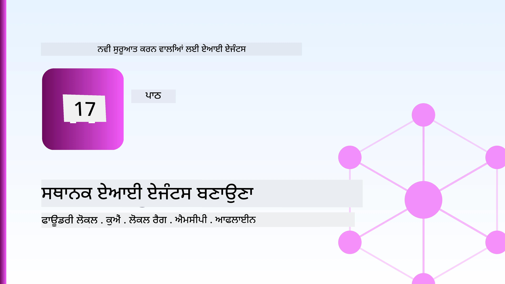
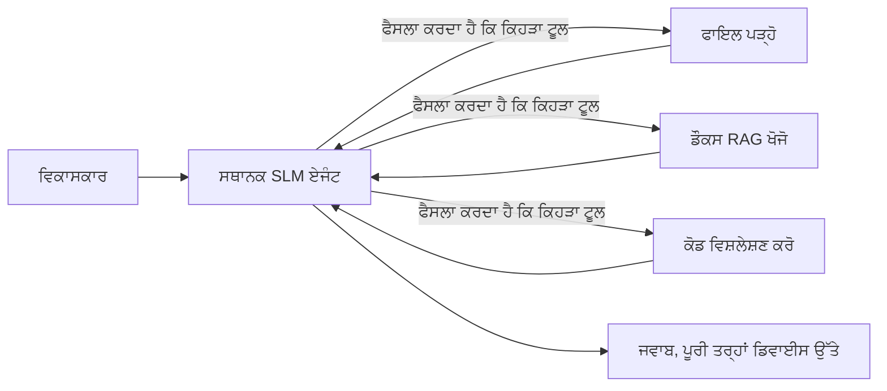
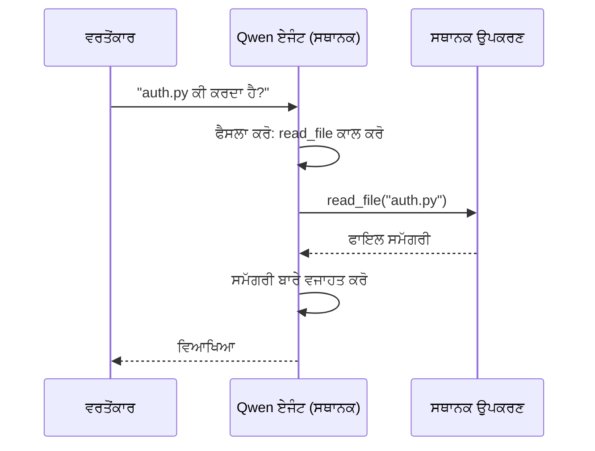
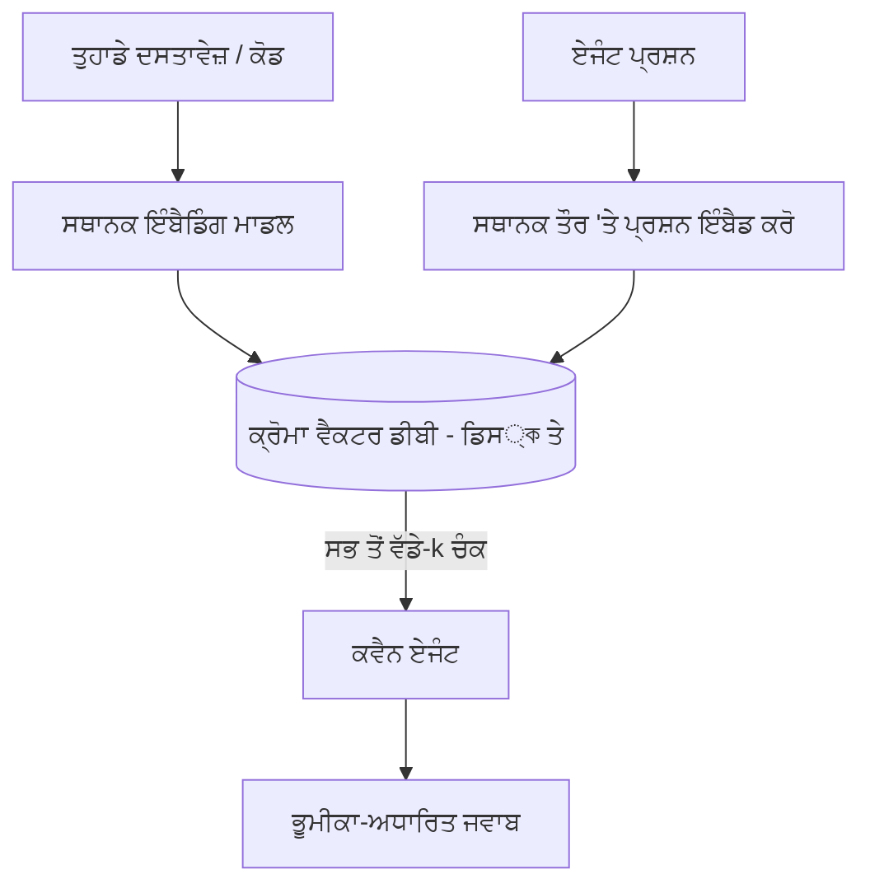
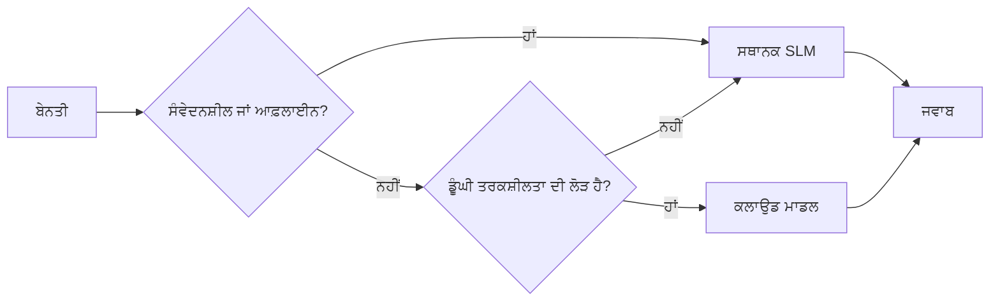

# ਮਾਈਕ੍ਰੋਸੋਫਟ ਫਾਉਂਡਰੀ ਲੋਕਲ ਅਤੇ ਕ੍ਵੈਨ ਦੀ ਵਰਤੋਂ ਕਰਕੇ ਲੋਕਲ ਏਆਈ ਏਜੰਟ ਬਣਾਉਣਾ



ਪਹਿਲਾ ਪਾਠ ਏਜੰਟਸ ਨੂੰ ਬੱਦਲ ਵਿੱਚ *ਵਧਾਉਂਦਾ* ਸੀ। ਇਹ ਇੱਕ ਨੂੰ ਇੱਕ ਹੀ ਮਸ਼ੀਨ 'ਤੇ *ਘਟਾਉਂਦਾ* ਹੈ। ਅੰਤ ਤੱਕ ਤੁਹਾਡੇ ਕੋਲ ਇੱਕ ਕੰਮ ਕਰਨ ਵਾਲਾ ਇੰਜੀਨੀਅਰਿੰਗ ਸਹਾਇਕ ਹੋਵੇਗਾ ਜੋ ਤਰਕ ਕਰਦਾ ਹੈ, ਟੂਲਾਂ ਨੂੰ ਕਾਲ ਕਰਦਾ ਹੈ, ਤੁਹਾਡੇ ਫਾਇਲਾਂ ਨੂੰ ਪੜ੍ਹਦਾ ਹੈ ਅਤੇ ਤੁਹਾਡੇ ਡੌਕਿਊਮੇਟੇਸ਼ਨ ਦੀ ਖੋਜ ਕਰਦਾ ਹੈ — **ਬਿਨਾਂ ਕਿਸੇ ਕਲਾਉਡ ਇੰਫਰੈਂਸ ਕਾਲ ਦੇ।**

ਤੁਸੀਂ ਇਹ ਕਿਉਂ ਚਾਹੋਗੇ? ਤਿੰਨ ਕਾਰਨ ਜੋ ਅਸਲੀ ਇੰਜੀਨੀਅਰਿੰਗ ਕੰਮ ਵਿੱਚ ਲਗਾਤਾਰ ਆਉਂਦੇ ਹਨ:

- **ਪ੍ਰਾਇਵੇਸੀ।** ਕੋਡ ਅਤੇ ਦਸਤਾਵੇਜ਼ ਕਦੇ ਵੀ ਮਸ਼ੀਨ ਤੋਂ ਬਾਹਰ ਨਹੀਂ ਜਾਂਦੇ। ਨਾ ਕੋਈ ਪ੍ਰਾਂਪਟ, ਨਾ ਕੋਈ ਸਨਿਪੈੱਟ, ਨਾ ਕੋਈ ਗਾਹਕ ਡੇਟਾ ਨੈੱਟਵਰਕ ਸੀਮਾ ਨੂੰ ਪਾਰ ਕਰਦਾ ਹੈ।
- **ਖਰਚ।** ਲੋਕਲ ਇੰਫਰੈਂਸ ਦਾ ਪ੍ਰਤੀ-ਟੋਕਨ ਬਿੱਲ ਨਹੀਂ ਹੁੰਦਾ। ਤੁਸੀਂ ਸਾਡੇ ਦੀ ਕੀਮਤ ਤੇ ਸਾਰਾ ਦਿਨ ਇਟਰੇਟ ਕਰ ਸਕਦੇ ਹੋ।
- **ਆਫਲਾਈਨ।** ਹਵਾਈ ਜਹਾਜ਼ ਵਿੱਚ, ਸੁਰੱਖਿਅਤ ਸਥਾਨ ਤੇ ਜਾਂ ਬਿਜਲੀ ਚਲਦਿਆਂ, ਏਜੰਟ ਫਿਰ ਵੀ ਕੰਮ ਕਰਦਾ ਹੈ।

ਮੁਕਾਬਲੇ ਵਿੱਚ ਤੁਸੀਂ ਇੱਕ ਸੀਮਿਤ ਕਲਾਉਡ ਮਾਡਲ ਦੇ ਸਥਾਨ ਤੇ **ਸਮਾਲ ਲੈਂਗਵਿਜ਼ ਮਾਡਲ (SLM)** ਨੂੰ ਆਪਣੇ CPU, GPU ਜਾਂ NPU 'ਤੇ ਚਲਾਉਂਦੇ ਹੋ। ਇਹ ਪਾਠ ਐਜੰਟ ਬਣਾਉਣ ਬਾਰੇ ਹੈ ਜੋ ਉਸ ਸੀਮਿਤਤਾ ਵਿੱਚ *ਚੰਗੇ* ਹਨ, ਨਾ ਕਿ ਇਹ ਦਿਗਦੇ ਹਨ ਕਿ ਸੀਮਿਤਤਾ ਮੌਜੂਦ ਨਹੀਂ ਹੈ।

## ਪਰਚਿਆ

ਇਸ ਪਾਠ ਵਿਚ ਇਹ ਖੇਤਰ ਕਵਰ ਕਰਨਗੇ:

- **ਸਮਾਲ ਲੈਂਗਵਿਜ ਮਾਡਲ (SLMs)** — ਇਹ ਕੀ ਹਨ, ਕਿੱਥੇ ਉਨ੍ਹਾਂ ਦੀ ਖੂਬੀ ਹੈ, ਅਤੇ ਕਿੱਥੇ ਨਹੀਂ।
- **ਮਾਈਕ੍ਰੋਸੋਫਟ ਫਾਉਂਡਰੀ ਲੋਕਲ** — ਇੱਕ ਰਨਟਾਈਮ ਜੋ ਮਾਡਲਾਂ ਨੂੰ ਡਾਊਨਲੋਡ ਅਤੇ ਡਿਵਾਈਸ 'ਤੇ ਸਰਵ ਕਰਦਾ ਹੈ ਇੱਕ **OpenAI-ਸੰਮੇਲਿਤ API** ਰਾਹੀਂ।
- **ਕ੍ਵੈਨ ਫੰਕਸ਼ਨ-ਕਾਲਿੰਗ ਮਾਡਲ** — SLMs ਜੋ ਵਾਲੀਡ ਟੂਲ ਕਾਲ ਨਿਕਲਦੇ ਹਨ, ਜੋ ਲੋਕਲ *ਏਜੰਟਸ* (ਸਿਰਫ ਲੋਕਲ ਚੈਟ ਨਹੀਂ) ਨੂੰ ਸੰਭਵ ਬਣਾਉਂਦੇ ਹਨ।
- **ਲੋਕਲ ਟੂਲਜ਼, ਲੋਕਲ RAG, ਅਤੇ ਲੋਕਲ MCP** — ਕਲਾਉਡ ਬਿਨਾਂ ਏਜੰਟ ਨੂੰ ਸਮਰੱਥਾ ਦੇਣਾ।
- **ਹਾਈਬ੍ਰਿਡ ਪੈਟਰਨ** — ਕਦੋਂ ਚੀਜ਼ਾਂ ਲੋਕਲ ਰੱਖਣੀਆਂ ਹਨ ਅਤੇ ਕਦੋਂ ਕਲਾਉਡ ਦੀ ਲੋੜ ਹੈ।

## ਸਿੱਖਣ ਦੇ ਟੀਚੇ

ਇਸ ਪਾਠ ਨੂੰ ਪੂਰਾ ਕਰਨ ਤੋਂ ਬਾਅਦ, ਤੁਸੀਂ ਜਾਣੋਗੇ ਕਿ ਕਿਵੇਂ:

- SLMs ਦੇ ਫਾਇਦੇ ਅਤੇ ਨੁਕਸਾਨ ਨੂੰ ਸਮਝਾਉਣਾ ਅਤੇ ਠੀਕ ਲੋਕਲ ਏਜੰਟ ਵਰਤੋਂਦੀਆਂ ਕਿੱਥੇ ਕਰਨੀਆਂ ਹਨ ਚੁਣਨਾ।
- ਫਾਉਂਡਰੀ ਲੋਕਲ ਨਾਲ ਇੱਕ ਕ੍ਵੈਨ ਮਾਡਲ ਨੂੰ ਲੋਕਲ ਸਰਵ ਕਰਨਾ ਅਤੇ OpenAI-ਕੰਪੈਟਿਬਲ ਏਂਡਪੌਇੰਟ ਤੋਂ ਕਨੈਕਟ ਕਰਨਾ।
- ਇੱਕ ਟੂਲ-ਕਾਲਿੰਗ ਏਜੰਟ ਬਣਾਉਣਾ ਜੋ ਪੂਰੀ ਤਰ੍ਹਾਂ ਤੁਹਾਡੇ ਵਰਕਸਟੇਸ਼ਨ 'ਤੇ ਚੱਲਦਾ ਹੈ।
- ਇੱਕ ਲੋਕਲ ਵੈਕਟਰ ਡਾਟਾਬੇਸ (Chroma) ਵਰਤ ਕੇ ਆਪਣੇ ਦਸਤਾਵੇਜ਼ਾਂ ਉੱਤੇ ਲੋਕਲ RAG ਸ਼ਾਮਲ ਕਰਨਾ।
- ਏਜੰਟ ਨੂੰ ਇੱਕ ਲੋਕਲ MCP ਸਰਵਰ ਨਾਲ ਜੋੜਨਾ ਅਤੇ ਹਾਈਬ੍ਰਿਡ ਲੋਕਲ/ਕਲਾਉਡ ਡਿਜ਼ਾਈਨਾਂ ਬਾਰੇ ਤਰਕ ਕਰਨਾ।

## ਪਹਿਲੇ ਲੋੜੀਂਦੇ ਕਾਰਜ

ਇਹ ਪਾਠ ਮੰਨਦਾ ਹੈ ਕਿ ਤੁਸੀਂ ਪਹਿਲਾਂ ਦੇ ਪਾਠ ਮੁਕੰਮਲ ਕਰ ਚੁੱਕੇ ਹੋ ਅਤੇ ਇਹਨਾਂ ਵਿੱਚ ਸੁਖਦਾਇਕ ਹੋ:

- [ਟੂਲ ਦੀ ਵਰਤੋਂ](../04-tool-use/README.md) (ਪਾਠ 4) ਅਤੇ [ਏਜੰਟਿਕ RAG](../05-agentic-rag/README.md) (ਪਾਠ 5)।
- [ਏਜੰਟਿਕ ਪ੍ਰੋਟੋਕਾਲ / MCP](../11-agentic-protocols/README.md) (ਪਾਠ 11)।
- [ਮਾਈਕ੍ਰੋਸੋਫਟ ਏਜੰਟ ਫ੍ਰੇਮਵਰਕ](../14-microsoft-agent-framework/README.md) (ਪਾਠ 14)।

ਤੁਹਾਨੂੰ ਇਹ ਵੀ ਚਾਹੀਦਾ ਹੁੰਦਾ ਹੈ:

- ਇੱਕ ਡਿਵੈਲਪਰ ਵਰਕਸਟੇਸ਼ਨ। **8 GB RAM ਇੱਕ ਵਾਸਤਵਿਕ ਘੱਟੋ-ਘੱਟ ਹੈ**; 16 GB+ ਆਰਾਮਦਾਇਕ ਹੈ। GPU ਜਾਂ NPU ਸਹਾਇਕ ਹਨ ਪਰ ਜ਼ਰੂਰੀ ਨਹੀਂ।
- **ਮਾਈਕ੍ਰੋਸੋਫਟ ਫਾਉਂਡਰੀ ਲੋਕਲ** ਇੰਸਟਾਲ ਕੀਤਾ ਹੋਇਆ (ਹੇਠਾਂ ਸੈਟਅੱਪ ਹਿੱਸਾ ਵੇਖੋ)।
- ਪਾਈਥਨ 3.12+ ਅਤੇ ਰੇਪੋਜ਼ਟਰੀ ਵਿੱਚ [requirements.txt](../../../requirements.txt), ਨਾਲ `foundry-local-sdk`, `openai`, ਅਤੇ `chromadb` ਇਸ ਪਾਠ ਲਈ।

## ਸਮਾਲ ਲੈਂਗਵਿਜ ਮਾਡਲ: ਲੋਕਲ ਕੰਮ ਲਈ ਢੁਕਵਾਉਂ ਟੂਲ

ਇੱਕ ਸੀਮਿਤ ਕਲਾਉਡ ਮਾਡਲ ਵਿੱਚ ਸੈਂਕੜੇ ਬਿਲੀਅਨਾਂ ਪੈਰਾਮੀਟਰ ਹੁੰਦੇ ਹਨ ਅਤੇ ਇੱਕ ਡੇਟਾ ਸੈਂਟਰ ਉਸ ਦੇ ਪਿੱਛੇ ਹੁੰਦਾ ਹੈ। ਇੱਕ SLM ਵਿੱਚ ਕੁਝ ਬਿਲੀਅਨਾਂ ਪੈਰਾਮੀਟਰ ਹੁੰਦੇ ਹਨ ਅਤੇ ਤੁਹਾਡੇ ਲੈਪਟੌਪ ਦੀ RAM ਵਿੱਚ ਫਿਟ ਹੋਣਾ ਪੈਦਾ ਹੈ। ਇਹ ਫਰਕ ਸਾਫ ਉਮੀਦਾਂ ਪੈਦਾ ਕਰਦਾ ਹੈ।

**SLMs ਚੰਗੇ ਹਨ:**

- ਸੰਜੋਏ, ਸੀਮਿਤ ਕਾਰਜ — ਵਰਗੀਕਰਨ, ਕਢ਼ਾਈ, ਜਾਣੇ-ਪਛਾਣੇ ਦਸਤਾਵੇਜ਼ ਦੀ ਸੰਖੇਪ ਜਾਣਕਾਰੀ।
- **ਟੂਲ ਕਾਲ ਕਰਨਾ** — ਇਹ ਫੈਸਲਾ ਕਰਨਾ ਕਿ ਕਿਹੜਾ ਫੰਕਸ਼ਨ ਕਾਲ ਕਰਨਾ ਹੈ ਅਤੇ ਕਿਹੜੇ ਆਰਗੁਮੈਂਟ ਨਾਲ।
- ਤੇਜ਼, ਸਸਤਾ, ਨਿੱਜੀ ਤੌਰ 'ਤੇ ਆਪਣਾ ਡੇਟਾ ਉੱਤੇ ਇਟਰੇਟ ਕਰਨਾ।

**SLMs ਥੋੜੇ ਕਮਜੋਰ ਹਨ:**

- ਖੁਲ੍ਹੇ-ਸਾਮ੍ਹਣੇ, ਲੰਬੇ-ਸੰਪੂਰਕ ਤਰਕ ਦੀ ਵਿਆਪਕ ਸਮਝ।
- ਵਿਆਪਕ ਦੁਨੀਆਵੀਂ ਜਾਣਕਾਰੀ (ਉਹਨਾਂ ਨੇ ਘੱਟ ਵੇਖਿਆ ਹੈ, ਅਤੇ ਜ਼ਿਆਦਾ ਭੁੱਲਦੇ ਹਨ)।

ਇਸ ਲਈ ਲੋਕਲ ਏਜੰਟ ਲਈ ਜੇਤੂ ਰਣਨੀਤੀ ਹੈ: **SLM ਨੂੰ ਆਰਕੀਸਟ੍ਰੇਟ ਕਰਨ ਦਿਓ, ਅਤੇ ਟੂਲਾਂ ਨੂੰ ਭਾਰੀ ਕੰਮ ਕਰਨ ਦਿਓ।** ਮਾਡਲ ਨੂੰ ਤੁਸੀਂ ਆਪਣੇ ਕੋਡਬੇਸ ਬਾਰੇ *ਜਾਣਨ ਦੀ ਲੋੜ* ਨਹੀਂ, ਬਲਕਿ ਇਹ ਜਾਣਨ ਦੀ ਲੋੜ ਹੈ ਕਿ ਕਦੋਂ `read_file` ਅਤੇ `search_docs` ਕਾਲ ਕਰਨੇ ਹਨ। ਇਹ ਸਿੱਧੀ ਤਰ੍ਹਾਂ SLM ਦੀਆਂ ਤਾਕਤਾਂ ਨੂੰ ਵਰਤਦਾ ਹੈ।



## ਮਾਈਕ੍ਰੋਸੋਫਟ ਫਾਉਂਡਰੀ ਲੋਕਲ

**ਮਾਈਕ੍ਰੋਸੋਫਟ ਫਾਉਂਡਰੀ ਲੋਕਲ** ਇੱਕ ਹਲਕਾ ਰਨਟਾਈਮ ਹੈ ਜੋ ਤੁਹਾਡੇ ਮਸ਼ੀਨ ਤੇ ਪੂਰੀ ਤਰ੍ਹਾਂ ਮਾਡਲ ਡਾਊਨਲੋਡ, ਪ੍ਰਬੰਧਕ ਅਤੇ ਸਰਵ ਕਰਦਾ ਹੈ। ਸਾਡੇ ਲਈ ਇਸ ਦਾ ਸਭ ਤੋਂ ਮਹੱਤਵਪੂਰਨ ਫੀਚਰ ਇਹ ਹੈ ਕਿ ਇਹ ਇੱਕ **OpenAI-ਕੰਪੈਟਿਬਲ HTTP ਏਂਡਪੌਇੰਟ** ਪ੍ਰਦਾਨ ਕਰਦਾ ਹੈ — ਜਿਸਦਾ ਮਤਲਬ ਹੈ OpenAI SDK ਅਤੇ ਮਾਈਕ੍ਰੋਸੋਫਟ ਏਜੰਟ ਫ੍ਰੇਮਵਰਕ ਦੇ OpenAI ਕਲਾਇੰਟ ਸਿਰਫ਼ `base_url` ਬਦਲ ਕੇ ਇਸ ਦੇ ਖਿਲਾਫ ਕੰਮ ਕਰ ਸਕਦੇ ਹਨ। ਤੁਹਾਡੇ ਸਿੱਖੇ ਹੋਏ ਏਜੰਟ ਬਿਲਡਿੰਗ ਦੇ ਸਾਰੇ ਤੱਤ ਸਿੱਧੇ ਤੌਰ 'ਤੇ ਲਾਗੂ ਹੁੰਦੇ ਹਨ; ਸਿਰਫ ਏਂਡਪੌਇੰਟ ਕਲਾਊਡ ਤੋਂ `localhost` 'ਤੇ ਆ ਜਾਂਦਾ ਹੈ।

ਫਾਉਂਡਰੀ ਲੋਕਲ ਆਪਣੀ ਮਸ਼ੀਨ ਲਈ ਸਭ ਤੋਂ ਚੰਗੀ ਬਿਲਡ ਖੁਦ ਚੁਣਦਾ ਹੈ — CPU ਬਿਲਡ, CUDA/GPU ਬਿਲਡ ਜਾਂ NPU ਬਿਲਡ — ਤਾਂ ਜੋ ਤੂੰ ਕਦੇ ਵੀ ਹਰ ਮਸ਼ੀਨ ਲਈ ਹੱਥ ਨਾਲ ਅਪਟਿਮਾਈਜ਼ ਨਾ ਕਰਨਾ ਪਵੇ।

### ਸੈਟਅੱਪ

ਫਾਉਂਡਰੀ ਲੋਕਲ ਇੰਸਟਾਲ ਕਰੋ (ਤੁਹਾਡੇ OS ਲਈ [ਡੌਕਿਊਮੇਂਟੇਸ਼ਨ](https://learn.microsoft.com/azure/ai-foundry/foundry-local/) ਵੇਖੋ), ਫਿਰ ਇਹ ਪੁਸ਼ਟੀ ਕਰੋ ਕਿ ਇਹ ਚੱਲ ਰਿਹਾ ਹੈ:

```bash
# ਇੰਸਟਾਲ ਕਰੋ (ਉਦਾਹਰਨ ਵਜੋਂ; ਆਪਣੇ ਪਲੇਟਫਾਰਮ ਲਈ ਡੌਕਸ ਦੀ ਪਾਲਣਾ ਕਰੋ)
winget install Microsoft.FoundryLocal      # ਵਿਂਡੋਜ਼
# brew install microsoft/foundrylocal/foundrylocal   # macOS

# ਇੱਕ Qwen ਮਾਡਲ ਡਾਊਨਲੋਡ ਅਤੇ ਚਲਾਓ, ਫਿਰ ਸਥਾਨਕ ਸੇਵਾ ਸ਼ੁਰੂ ਕਰੋ
foundry model run qwen2.5-7b-instruct
foundry service status
```

ਜਦੋਂ ਸਰਵਿਸ ਚੱਲ ਰਹੀ ਹੁੰਦੀ ਹੈ ਤਾਂ ਤੁਹਾਡੇ ਕੋਲ ਇੱਕ ਲੋਕਲ, OpenAI-ਕੰਪੈਟਿਬਲ ਏਂਡਪੌਇੰਟ ਹੁੰਦਾ ਹੈ (ਆਮ ਤੌਰ `http://localhost:PORT/v1` ). ਨੋਟਬੁੱਕ `foundry-local-sdk` ਦੀ ਵਰਤੋਂ ਕਰਕੇ ਆਟੋਮੈਟਿਕ ਏਂਡਪੌਇੰਟ ਲੱਭਦਾ ਹੈ, ਇਸ ਲਈ ਤੁਸੀਂ ਪੋਰਟ ਕੈਡਿੰਗ ਕਰਨ ਦੀ ਜ਼ਰੂਰਤ ਨਹੀਂ।

## ਕ੍ਵੈਨ ਫੰਕਸ਼ਨ ਕਾਲਿੰਗ: ਇਸ ਦੀ ਮਹੱਤਤਾ

ਇੱਕ ਏਜੰਟ ਸਿਰਫ਼ ਐਜੰਟ ਹੁੰਦਾ ਹੈ ਜੇ ਇਹ ਟੂਲ ਕਾਲ ਕਰ ਸਕੇ। ਬਹੁਤ ਸਾਰੇ SLMs ਚੈਟ ਕਰ ਸਕਦੇ ਹਨ ਪਰ ਗਲਤ ਜਾਂ ਖਰਾਬ ਟੂਲ ਕਾਲ ਨਿਰਗਮਨ ਕਰਦੇ ਹਨ। **ਕ੍ਵੈਨ** ਮਾਡਲ ਫੰਕਸ਼ਨ ਕਾਲਿੰਗ ਲਈ ਟ੍ਰੇਨ ਹੁੰਦੇ ਹਨ ਅਤੇ ਮੁੱਖਥਰ ਤੌਰ 'ਤੇ ਸਹੀ ਬਣੇ ਟੂਲ ਕਾਲ ਸਟ੍ਰੱਕਚਰ ਨਿਕਾਲਦੇ ਹਨ — ਜੋ ਲੋਕਲ ਚੈਟ ਮਾਡਲ ਨੂੰ ਇੱਕ ਕਾਰਗਰ ਲੋਕਲ *ਏਜੰਟ* ਬਣਾਉਂਦਾ ਹੈ।

ਫਲੋ ਸਧਾਰਨ ਟੂਲ ਕਾਲਿੰਗ ਚੱਕਰ ਹੈ ਜੋ ਤੂੰ ਪਹਿਲਾਂ ਜਾਣਦਾ ਹੈ, ਸਿਰਫ਼ ਡਿਵਾਈਸ ਉੱਤੇ ਚੱਲ ਰਿਹਾ ਹੈ:



## ਲੋਕਲ RAG

ਡੌਕਿਊਮੇਟੇਸ਼ਨ ਖੋਜ ਉਹ ਥਾਂ ਹੈ ਜਿੱਥੇ ਲੋਕਲ ਏਜੰਟ ਆਪਣੀ ਵਰਤੋਂ ਸਾਬਤ ਕਰਦੇ ਹਨ। ਭਰੋਸਾ ਕਰਨ ਦੀ ਜਗ੍ਹਾ ਕਿ SLM ਨੇ ਤੁਹਾਡੇ ਫਰੇਮਵਰਕ ਦੇ ਦਸਤਾਵੇਜ਼ ਯਾਦ ਕੀਤੇ ਹਨ, ਤੁਸੀਂ ਉਹਨਾਂ ਦਸਤਾਵੇਜ਼ਾਂ ਨੂੰ ਇੱਕ **ਲੋਕਲ ਵੈਕਟਰ ਡਾਟਾਬੇਸ** ਵਿੱਚ ਐਮਬੈੱਡ ਕਰਦੇ ਹੋ ਅਤੇ ਏਜੰਟ ਨੂੰ ਮੰਗ ਉੱਤੇ ਸੰਬੰਧਤ ਹਿੱਸੇ ਲੱਭਣ ਦਿੰਦੇ ਹੋ।

ਅਸੀਂ **ਕ੍ਰੋਮਾ** ਵਰਤਦੇ ਹਾਂ, ਇੱਕ ਐਮਬੈੱਡਡ ਵੈਕਟਰ ਸਟੋਰ ਜੋ ਬਿਨਾਂ ਸਰਵਰ ਦੇ ਪ੍ਰੋਸੈਸ ਵਿੱਚ ਚੱਲਦਾ ਹੈ। ਪਾਈਪਲਾਈਨ ਪੂਰੀ ਤਰ੍ਹਾਂ ਲੋਕਲ ਹੈ: ਲੋਕਲ ਐਮਬੈੱਡਿੰਗ ਮਾਡਲ → ਲੋਕਲ ਵੈਕਟਰ → ਲੋਕਲ ਰੀਟਰਿਵਲ → ਲੋਕਲ SLM।



ਇਹ ਉਹੀ ਏਜੰਟਿਕ RAG ਪੈਟਰਨ ਹੈ ਜੋ ਪਾਠ 5 ਵਿੱਚ ਸੀ — ਸਿਰਫ ਇਹ ਪਰਿਵਰਤਨ ਕਿ ਹਰ ਇਕ ਕੰਪੋਨੈਂਟ ਤੁਹਾਡੇ ਮਸ਼ੀਨ ਉੱਤੇ ਚੱਲਦਾ ਹੈ।

## ਲੋਕਲ MCP ਸਰਵਰ

[MCP](../11-agentic-protocols/README.md) ਇੱਕ ਟਰਾਂਸਪੋਰਟ ਹੈ, ਕਲਾਉਡ ਸੇਵਾ ਨਹੀਂ। ਇੱਕ MCP ਸਰਵਰ `stdio` 'ਤੇ ਇੱਕ ਲੋਕਲ ਪ੍ਰਕਿਰਿਆ ਵਜੋਂ ਚੱਲ ਸਕਦਾ ਹੈ, ਅਤੇ ਸਧਾਰਨ ਪ੍ਰੋਟੋਕਾਲ ਰਾਹੀਂ ਆਪਣੇ ਏਜੰਟ ਨੂੰ ਟੂਲ ਪ੍ਰਦਾਨ ਕਰਦਾ ਹੈ। ਇਸ ਨਾਲ ਤੁਸੀਂ MCP ਸਰਵਰਾਂ ਦੇ ਵਧਦੇ ਏਕੋਸਿਸਟਮ ਨੂੰ ਦੁਬਾਰਾ ਵਰਤ ਸਕਦੇ ਹੋ — ਫਾਇਲ ਸਿਸਟਮ ਐਕਸੈਸ, ਗਿੱਟ ਆਪਰੇਸ਼ਨ, ਡਾਟਾਬੇਸ ਕਵੈਰੀਜ਼ — ਪੂਰੀ ਤਰ੍ਹਾਂ ਆਫਲਾਈਨ।

ਸੁਰੱਖਿਆ ਦ੍ਰਿਸ਼ਟੀਕੋਣ ਕਲਾਉਡ ਤੋਂ ਵੱਖਰਾ ਹੈ, ਪਰ ਗੈਰਮੌਜੂਦ ਨਹੀਂ: ਇੱਕ ਲੋਕਲ MCP ਸਰਵਰ ਫਿਰ ਵੀ ਤੁਹਾਡੇ ਯੂਜ਼ਰ ਦੀਆਂ ਅਨੁਮਤੀਆਂ ਨਾਲ ਚੱਲਦਾ ਹੈ, ਇਸ ਲਈ ਇਸਨੂੰ ਜੋ ਵੀ ਛੂਹਣ ਦਿਓ ਉੱਤੇ ਸਹੀ ਪਰਿਧਾਨ ਕਰੋ (ਇੱਕ ਪ੍ਰੋਜੈਕਟ ਡਾਇਰੈਕਟਰੀ, ਤੁਹਾਡੇ ਘਰ ਫੋਲਡਰ ਦੀ ਪੂਰੀ ਜਗ੍ਹਾ ਨਹੀਂ) ਅਤੇ ਇਸਦੇ ਨਤੀਜੇ ਅੰਦਰੂਨੀ ਜਾਣਕਾਰੀ ਵਜੋਂ ਸਵੈ-ਸੰਤੁਸ਼ਟੀਕਰੀ ਸਥਿਤੀ ਚੈੱਕ ਕਰੋ।

## ਹਾਈਬ੍ਰਿਡ ਕਲਾਉਡ-ਅਤੇ-ਲੋਕਲ ਪੈਟਰਨ

ਲੋਕਲ-ਪਹਿਲਾ ਦਾ ਮਤਲਬ ਲੋਕਲ-ਸਿਰਫ ਨਹੀਂ ਹੁੰਦਾ। ਪਰਪੱਕੜ ਪ੍ਰਣਾਲੀਆਂ ਸੰਵੇਦਨਸ਼ੀਲਤਾ ਅਤੇ ਔਖਾਈ ਅਨੁਸਾਰ ਰੂਟਿੰਗ ਕਰਦੀਆਂ ਹਨ:

| ਹਾਲਤ | ਕਿੱਥੇ ਚੱਲਦਾ ਹੈ |
| --- | --- |
| ਸੰਵੇਦਨਸ਼ੀਲ ਕੋਡ/ਡੇਟਾ, ਜਾਂ ਆਫਲਾਈਨ | **ਲੋਕਲ SLM** |
| ਸਧਾਰਨ, ਸੀਮਿਤ ਕੰਮ | **ਲੋਕਲ SLM** (ਸਸਤਾ, ਤੇਜ਼) |
| ਸੰਵੇਦਨਸ਼ੀਲ ਨਹੀਂ ਡਾਟਾ ਉੱਤੇ ਮੁਸ਼ਕਲ ਲੰਬੀ ਤਰਕ | **ਕਲਾਉਡ ਮਾਡਲ** |
| ਹਰੇਕ ਕੁਝ, ਬਿਜਲੀ ਜਾਂ ਅਦੇਸ਼ ਦੌਰਾਨ | **ਲੋਕਲ SLM** (ਸੁੰਦਰ ਹੌਲੀ ਹੌਲੀ ਤਬਾਹੀ) |

ਇਹ ਪਿਛਲੇ ਪਾਠ 16 ਵਿੱਚ ਦਿੱਤੇ **ਮਾਡਲ ਰੂਟਿੰਗ** ਵਿਚਾਰ ਦੀ ਨਕਲ ਕਰਦਾ ਹੈ — ਸਿਰਫ਼ ਇੱਕ "ਮਾਡਲ" ਹੁਣ ਤੁਹਾਡੀ ਆਪਣੀ ਮਸ਼ੀਨ ਹੈ। ਇੱਕ ਮਜ਼ਬੂਤ ਡਿਜ਼ਾਈਨ ਕਲਾਉਡ ਦੀ ਗੈਰ-ਉਪਲਬਧਤਾ ਤੇ ਲੋਕਲ 'ਤੇ ਵਾਪਸ ਆਉਂਦਾ ਹੈ, ਤਾਂ ਜੋ ਏਜੰਟ ਖਰਾਬਗਿਆ ਵਿੱਚ ਗੁਣਵੱਤਾ ਵਿੱਚ ਘਟਾਓ ਕਰੇ ਨਾ ਕਿ ਸਿੱਧਾ ਅਸਫਲ ਹੋਵੇ।



## ਹੱਥ-ਅੱਤੇ ਲੈਬ: ਇੱਕ ਲੋਕਲ ਇੰਜੀਨੀਅਰਿੰਗ ਸਹਾਇਕ

ਖੋਲ੍ਹੋ [`code_samples/17-local-agent-foundry-local.ipynb`](./code_samples/17-local-agent-foundry-local.ipynb) ਅਤੇ ਇਸਦੇ ਨਾਲ ਕੰਮ ਕਰੋ। ਤੁਸੀਂ ਇੱਕ **ਲੋਕਲ ਇੰਜੀਨੀਅਰਿੰਗ ਸਹਾਇਕ** ਬਣਾਓਗੇ ਜੋ ਪੂਰੀ ਤਰ੍ਹਾਂ ਤੁਹਾਡੇ ਵਰਕਸਟੇਸ਼ਨ ਉੱਤੇ ਚੱਲਦਾ ਹੈ ਅਤੇ ਇਹ ਕਰ ਸਕਦਾ ਹੈ:

1. **ਟੂਲ ਕਾਲ ਕਰੋ** — ਫਾਉਂਡਰੀ ਲੋਕਲ ਰਾਹੀਂ ਕ੍ਵੈਨ ਫੰਕਸ਼ਨ ਕਾਲਿੰਗ ਦੇ ਜ਼ਰੀਏ।
2. **ਲੋਕਲ ਫਾਇਲ ਆਪਰੇਸ਼ਨ ਕਰੋ** — ਇੱਕ ਪ੍ਰੋਜੈਕਟ ਡਾਇਰੈਕਟਰੀ ਵਿੱਚ ਫਾਇਲਾਂ ਦੀ ਸੂਚੀ ਬਣਾਉ ਅਤੇ ਪੜ੍ਹੋ।
3. **ਕੋਡ ਦਾ ਵਿਸ਼ਲੇਸ਼ਣ ਕਰੋ** — ਇਕ ਸੋਰਸ ਫਾਇਲ ਦੇ ਮੂਲ ਮਾਪਦੰਡ ਦੀ ਰਿਪੋਰਟ ਦਿਓ।
4. **ਡੌਕਿਊਮੇਟੇਸ਼ਨ ਖੋਜੋ** — ਕ੍ਰੋਮਾ ਨਾਲ ਇੱਕ ਦਸਤਾਵੇਜ਼ ਫੋਲਡਰ 'ਤੇ ਲੋਕਲ RAG।
5. **MCP ਵਰਤੋ** — ਇੱਕ ਲੋਕਲ MCP ਸਰਵਰ ਨਾਲ ਕਨੈਕਟ ਕਰੋ (ਜੇ ਕੋਈ ਸੰਰਚਨਾ ਨਹੀਂ ਹੈ ਤਾਂ ਸੁੰਦਰ ਤਰ੍ਹਾਂ ਛੱਡ ਦੇਵੋ)।

ਕਿਸੇ ਵੀ ਬਿੰਦੂ ਤੇ ਕਲਾਉਡ ਇੰਫਰੈਂਸ ਦੀ ਵਰਤੋਂ ਨਹੀਂ ਹੁੰਦੀ।

### ਚਾਲੂ ਕਰਨ ਦੀ ਵਿਧੀ

ਸਹਾਇਕ OpenAI-ਕੰਪੈਟਿਬਲ ਏਂਡਪੌਇੰਟ ਰਾਹੀਂ ਫਾਉਂਡਰੀ ਲੋਕਲ ਨਾਲ ਜੁੜਦਾ ਹੈ, ਇਸ ਲਈ ਏਜੰਟ ਕੋਡ ਕਲਾਉਡ ਪਾਠਾਂ ਦੇ ਬਹੁਤ ਨਜ਼ਦੀਕ ਦਿਖਦਾ ਹੈ — ਸਿਰਫ ਕਲਾਇੰਟ ਬਦਲਦਾ ਹੈ:

```python
from foundry_local import FoundryLocalManager
from openai import OpenAI

# ਫਾਊਂਡਰੀ ਲੋਕਲ ਮਾਡਲ ਨੂੰ ਖੋਜਦਾ/ਡਾਉਨਲੋਡ ਕਰਦਾ ਹੈ ਅਤੇ ਸਾਨੂੰ ਇੱਕ ਲੋਕਲ ਐਂਡਪੌਇੰਟ ਦਿੰਦਾ ਹੈ।
manager = FoundryLocalManager(\"qwen2.5-7b-instruct\")
client = OpenAI(base_url=manager.endpoint, api_key=manager.api_key)  # api_key ਇੱਕ ਲੋਕਲ ਪਲੇਸਹੋਲਡਰ ਹੈ।
```

ਟੂਲ ਆਮ ਪਾਈਥਨ ਫੰਕਸ਼ਨ ਹਨ ਜੋ ਇੱਕ ਪ੍ਰੋਜੈਕਟ ਡਾਇਰੈਕਟਰੀ ਲਈ ਸੀਮਿਤ ਹਨ:

```python
def read_file(path: str) -> str:
    \"\"\"Read a file, but only inside the sandboxed project directory.\"\"\"
    full = (PROJECT_ROOT / path).resolve()
    if PROJECT_ROOT not in full.parents and full != PROJECT_ROOT:
        return \"Access denied: path is outside the project directory.\"
    return full.read_text(encoding=\"utf-8\")
```

ਸੈਂਡਬਾਕਸ ਚੈੱਕ ਤੇ ਧਿਆਨ ਦਿਓ — ਭਾਵੇਂ ਲੋਕਲ ਹੀ ਕਿਉਂ ਨਾ ਹੋਵੇ, ਇੱਕ ਐਜੰਟ ਜੋ ਬੇਕਾਰ ਰਾਹਾਂ ਨੂੰ ਪੜ੍ਹਦਾ ਹੈ ਉਸਨੂੰ ਸੰਭਾਲਣਾ ਜ਼ਰੂਰੀ ਹੈ। ਨੋਟਬੁੱਕ ਹਰ ਟੂਲ ਨੂੰ ਇੱਕੋ ਪ੍ਰੋਜੈਕਟ ਰੂਟ 'ਤੇ ਸੀਮਿਤ ਰੱਖਦਾ ਹੈ।

## ਗਿਆਨ ਜਾਂਚ

ਅਸਾਈਨਮੈਂਟ 'ਤੇ ਜਾਣ ਤੋਂ ਪਹਿਲਾਂ ਆਪਣੀ ਸਮਝ ਚੈੱਕ ਕਰੋ।

**1. ਇੱਕ ਏਜੰਟ ਨੂੰ ਕਲਾਉਡ ਦੀ ਤુલਨਾ ਵਿੱਚ ਲੋਕਲ ਚਲਾਉਣ ਦੇ ਦੋ ਮਜ਼ਬੂਤ ਕਾਰਨ ਦੱਸੋ।**

<details>
<summary>ਜਵਾਬ</summary>

ਦਿੱਸੋ ਕਿਸੇ ਵੀ ਦੋ: **ਪ੍ਰਾਇਵੇਸੀ** (ਕੋਡ ਅਤੇ ਡੇਟਾ ਕਦੇ ਮਸ਼ੀਨ ਤੋਂ ਬਾਹਰ ਨਹੀਂ ਜਾਂਦੇ), **ਖਰਚ** (ਕੋਈ ਪ੍ਰਤੀ-ਟੋਕਨ ਇੰਫਰੈਂਸ ਬਿੱਲ ਨਹੀਂ), ਅਤੇ **ਆਫਲਾਈਨ ਸਮਰੱਥਾ** (ਬਿਨਾਂ ਨੈੱਟਵਰਕ ਕਮ ਕਰਦਾ ਹੈ — ਹਵਾਈ ਜਹਾਜ਼ ਵਿੱਚ, ਸੁਰੱਖਿਅਤ ਸਥਾਨ ਵਿੱਚ, ਜਾਂ ਬਿਜਲੀ ਜਾਂਚ ਦੌਰਾਨ)। ਡੇਟਾ ਨੂੰ ਡਿਵਾਈਸ ਤੋਂ ਬਾਹਰ ਭੇਜਣ 'ਤੇ ਰੋਕਣ ਵਾਲੇ ਨਿਯਮ/ਅਨੁਕੂਲਤਾ ਕਾਰਕ ਪ੍ਰਾਇਵੇਸੀ ਦਾ ਮੁੱਖ ਕਾਰਨ ਹਨ।
</details>

**2. ਲੋਕਲ ਏਜੰਟ ਵਿੱਚ SLM ਅਤੇ ਇਸਦੇ ਟੂਲਾਂ ਦਰਮਿਆਨ ਸਿਫ਼ਾਰਸ਼ੀ ਬੰਤੋਰੀ ਕੀ ਹੈ ਅਤੇ ਕਿਉਂ?**

<details>
<summary>ਜਵਾਬ</summary>

SLM ਨੂੰ ਆਰਕੀਸਟ੍ਰੇਟ ਕਰਨ ਦਿਓ (ਫੈਸਲਾ ਕਰਨਾ ਕਿ ਕਿਹੜਾ ਟੂਲ ਕਾਲ ਕੀਤਾ ਜਾਵੇ ਅਤੇ ਕਿਹੜੇ ਆਰਗੁਮੈਂਟ ਨਾਲ) ਅਤੇ ਟੂਲਾਂ ਨੂੰ ਭਾਰੀ ਕੰਮ ਕਰਨ ਦਿਓ (ਫਾਇਲਾਂ ਪੜ੍ਹਨਾ, ਡੌਕਿਊਮੇਟੇਸ਼ਨ ਪ੍ਰਾਪਤ ਕਰਨਾ, ਨਤੀਜੇ ਕੱਟਣਾ)। SLM ਸੀਮਿਤ ਫੈਸਲਿਆਂ ਵਿੱਚ ਮਜ਼ਬੂਤ ਹੈ ਜਿਵੇਂ ਕਿ ਟੂਲ ਚੋਣ, ਪਰ ਵਿਸ਼ਾਲ ਗਿਆਨ ਅਤੇ ਲੰਬੇ ਤਰਕ ਵਿੱਚ ਕਮਜ਼ੋਰ, ਇਸ ਲਈ ਟੂਲਾਂ ਉੱਤੇ ਨਿਰਭਰ ਰਹਿਣਾ ਉਹਨਾਂ ਦੀ ਤਾਕਤ ਨੂੰ ਵਰਤਦਾ ਹੈ।
</details>

**3. ਫਾਉਂਡਰੀ ਲੋਕਲ ਨਾਲ ਕਲਾਉਡ ਏਜੰਟ ਕੋਡ ਨੂੰ ਦੁਬਾਰਾ ਵਰਤਣਾ ਕਿਵੇਂ ਸੰਭਵ ਹੁੰਦਾ ਹੈ?**

<details>
<summary>ਜਵਾਬ</summary>

ਫਾਉਂਡਰੀ ਲੋਕਲ ਇੱਕ **OpenAI-ਕੰਪੈਟਿਬਲ HTTP ਏਂਡਪੌਇੰਟ** ਪ੍ਰਦਾਨ ਕਰਦਾ ਹੈ। OpenAI SDK ਅਤੇ ਏਜੰਟ ਫ੍ਰੇਮਵਰਕ ਦੇ OpenAI ਕਲਾਇੰਟ ਸਿਰਫ਼ `base_url` ਬਦਲ ਕੇ (ਅਤੇ ਇੱਕ ਲੋਕਲ ਪਲੇਸਹੋਲਡਰ API ਕੁੰਜੀ ਵਰਤ ਕੇ) ਇਸ ਤੋਂ ਕੰਮ ਕਰਦੇ ਹਨ। ਏਜੰਟ ਕੋਡ ਬਾਕੀ ਸਾਰਾ ਇੱਕੋ ਜਿਹਾ ਰਹਿੰਦਾ ਹੈ।
</details>

**4. ਅਸੀਂ ਕਿਸੇ ਵੀ SLM ਦੇ ਬਜਾਏ ਵਿਸ਼ੇਸ਼ ਤੌਰ ਤੇ ਕ੍ਵੈਨ ਫੰਕਸ਼ਨ-ਕਾਲਿੰਗ ਮਾਡਲ ਕਿਉਂ ਵਰਤਦੇ ਹਾਂ?**

<details>
<summary>ਜਵਾਬ</summary>

ਕਿਉਂਕਿ ਇੱਕ ਏਜੰਟ ਨੂੰ ਭਰੋਸੇਯੋਗ, ਸਹੀ ਬਣੇ **ਟੂਲ ਕਾਲ** ਪੈਦਾ ਕਰਨੇ ਹੋਂਦੇ ਹਨ। ਬਹੁਤ ਸਾਰੇ SLMs ਚੈਟ ਕਰ ਸਕਦੇ ਹਨ ਪਰ ਖਰਾਬ ਜਾਂ ਅਸੰਗਤ ਟੂਲ-ਕਾਲ ਸਟ੍ਰੱਕਚਰ ਨਿਕਲਦੇ ਹਨ। ਕ੍ਵੈਨ ਮਾਡਲ ਫੰਕਸ਼ਨ ਕਾਲਿੰਗ ਲਈ ਟ੍ਰੇਨ ਹੁੰਦੇ ਹਨ ਅਤੇ ਲਗਾਤਾਰ ਟੂਲ ਕਾਲ ਨਿਕਾਲਦੇ ਹਨ, ਜੋ ਲੋਕਲ ਚੈਟ ਮਾਡਲ ਨੂੰ ਕੰਮ ਕਰਨ ਵਾਲਾ ਲੋਕਲ ਏਜੰਟ ਬਣਾਉਂਦਾ ਹੈ।
</details>

**5. ਲੋਕਲ RAG ਪਾਈਪਲਾਈਨ ਵਿੱਚ ਕਿਹੜੇ ਹਿੱਸੇ ਮਸ਼ੀਨ ਉੱਤੇ ਚੱਲਦੇ ਹਨ?**

<details>
<summary>ਜਵਾਬ</summary>

ਸਾਰੇ: ਐਮਬੈੱਡਿੰਗ ਮਾਡਲ, ਵੈਕਟਰ ਡਾਟਾਬੇਸ (ਚ੍ਰੋਮਾ, ਡਿਸ્ક ਉੱਤੇ), ਰੀਟਰਿਵਲ ਕਦਮ ਅਤੇ SLM। ਦਸਤਾਵੇਜ਼ ਲੋਕਲ ਤੌਰ 'ਤੇ ਐਮਬੈੱਡ ਕੀਤੇ ਜਾਂਦੇ ਹਨ, ਲੋਕਲ ਸਟੋਰ ਕੀਤੇ ਜਾਂਦੇ ਹਨ, ਲੋਕਲ ਪ੍ਰਾਪਤ ਕੀਤੇ ਜਾਂਦੇ ਹਨ ਅਤੇ ਲੋਕਲ ਮਾਡਲ ਵੱਲੋਂ ਤਰਕ ਕੀਤਾ ਜਾਂਦਾ ਹੈ — ਕੋਈ ਭੀ ਹਿੱਸਾ ਕਲਾਉਡ ਨੂੰ ਛੂਹਦਾ ਨਹੀਂ।
</details>

**6. ਇੱਕ ਲੋਕਲ MCP ਸਰਵਰ ਤੁਹਾਡੇ ਮਸ਼ੀਨ ਉੱਤੇ ਚੱਲਦਾ ਹੈ। ਕੀ ਇਹ ਆਪਣੇ ਆਪ ਸੁਰੱਖਿਅਤ ਬਣ ਜਾਂਦਾ ਹੈ? ਤੁਹਾਡੇ ਲਈ ਕਿਹੜਾ ਸਾਵਧਾਨੀ ਜ਼ਰੂਰੀ ਹੈ?**

<details>
<summary>ਜਵਾਬ</summary>

ਨਹੀਂ। ਇੱਕ ਲੋਕਲ MCP ਸਰਵਰ ਤੁਹਾਡੇ ਯੂਜ਼ਰ ਦੀਆਂ ਅਨੁਮਤੀਆਂ ਨਾਲ ਚੱਲਦਾ ਹੈ, ਇਸ ਲਈ ਇਹ ਤੁਸੀਂ ਜੋ ਕੁਝ ਵੀ ਪਹੁੰਚ ਸਕਦੇ ਹੋ ਉਸ ਨੂੰ ਛੂਹਦਾ ਹੈ। ਇਸਨੂੰ ਜੋ ਵੀ ਲੋੜ ਹੈ ਉਸ ਤੱਕ ਸੀਮਿਤ ਕਰੋ (ਜਿਵੇਂ ਕਿ ਕੋਈ ਇਕ ਪ੍ਰੋਜੈਕਟ ਡਾਇਰੈਕਟਰੀ ਨਾ ਕਿ ਤੁਹਾਡੇ ਪੂਰੇ ਘਰੀਲੂ ਫੋਲਡਰ) ਅਤੇ ਇਸਦੇ ਨਤੀਜੇ ਨੂੰ ਕਿਰਿਆਵਲੀ ਕਰਨ ਤੋਂ ਪਹਿਲਾਂ ਇਨਪੁੱਟ ਵਜੋਂ ਜਾਂਚੋ ਅਤੇ ਪ੍ਰਮਾਣਿਤ ਕਰੋ।
</details>

**7. ਇਕ ਸਮਝਦਾਰ ਹਾਈਬ੍ਰਿਡ ਰੂਟਿੰਗ ਨਿਯਮ ਵਿਆਖਿਆ ਕਰੋ ਜਿਸ ਵਿੱਚ ਇਕ ਲੋਕਲ ਮਾਡਲ ਸ਼ਾਮਿਲ ਹੈ।**

<details>
<summary>ਜਵਾਬ</summary>

ਸੰਵੇਦਨਸ਼ੀਲ ਜਾਂ ਆਫਲਾਈਨ ਬੇਨਤੀ ਨੂੰ ਲੋਕਲ SLM ਨੂੰ ਭੇਜੋ; ਸਧਾਰਨ ਸੀਮਿਤ ਕਾਰਜ ਤੇਜ਼ ਅਤੇ ਸਸਤੇ ਲਈ ਲੋਕਲ SLM ਨੂੰ; ਸੰਵੇਦਨਸ਼ੀਲ ਨਾ ਹੋਣ ਵਾਲੇ ਡਾਟਾ ਉੱਤੇ ਮੁਸ਼ਕਲ ਲੰਬਾ ਤਰਕ ਕਲਾਉਡ ਮਾਡਲ ਨੂੰ; ਅਤੇ ਜੇ ਕਲਾਉਡ ਉਪਲਬਧ ਨਹੀਂ ਤਾਂ ਲੋਕਲ SLM ਵੱਲ ਵਾਪਸ ਆਓ ਤਾਂ ਜੋ ਏਜੰਟ ਸੁਚੱਜੇ ਤਰੀਕੇ ਨਾਲ ਘਟਾਉਂਦਾ ਰਹੇ ਨਾ ਕਿ ਸਿੱਧਾ ਅਸਫਲ ਹੋਵੇ। ਇਹ ਮਾਡਲ ਰੂਟਿੰਗ (ਪਾਠ 16) ਦੀ ਤਰ੍ਹਾਂ ਹੈ ਜਿਸ ਵਿੱਚ ਤੁਹਾਡੀ ਮਸ਼ੀਨ ਇੱਕ ਮਾਡਲ ਵਜੋਂ ਸ਼ਾਮਿਲ ਹੈ।
</details>

**8. ਇਸ ਪਾਠ ਵਿੱਚ ਲੋਕਲ ਏਜੰਟ ਚਲਾਉਣ ਲਈ ਹਕੀਕਤੀ ਘੱਟੋ-ਘੱਟ RAM ਕਿੰਨੀ ਹੈ, ਅਤੇ ਜ਼ਿਆਦਾ RAM ਤੁਹਾਨੂੰ ਕੀ ਦਿੰਦੀ ਹੈ?**

<details>
<summary>ਜਵਾਬ</summary>

ਲਗਭਗ **8 GB** ਇੱਕ ਵਾਜਬ ਘੱਟੋ-ਘੱਟ ਹੈ; 16 GB+ ਆਰਾਮਦਾਇਕ ਹੈ। ਜ਼ਿਆਦਾ RAM ਤੁਹਾਨੂੰ ਵੱਡੇ, ਜ਼ਿਆਦਾ ਸਮਰੱਥ ਮਾਡਲ ਚਲਾਉਣ ਅਤੇ ਜ਼ਿਆਦਾ ਸੰਦਰਭ ਯਾਦ ਰੱਖਣ ਦੇ ਯੋਗ ਬਨਾਉਂਦਾ ਹੈ। ਇੱਕ GPU ਜਾਂ NPU ਇੰਫਰੈਂਸ ਨੂੰ ਤੇਜ਼ ਕਰਦਾ ਹੈ ਪਰ ਜ਼ਰੂਰੀ ਨਹੀਂ — ਫਾਉਂਡਰੀ ਲੋਕਲ ਜਦੋਂ ਕੋਈ ਐਕਸਲੇਰੇਟਰ ਉਪਲਬਧ ਨਹੀਂ ਹੁੰਦਾ ਤਾਂ CPU ਬਿਲਡ ਚੁਣਦਾ ਹੈ।
</details>

## ਅਸਾਈਨਮੈਂਟ

ਲੋਕਲ ਇੰਜੀਨੀਅਰਿੰਗ ਸਹਾਇਕ ਨੂੰ ਇੱਕ **ਲੋਕਲ ਦਸਤਾਵੇਜ਼ ਸਮੀਖਿਆਕਾਰ** ਵਿੱਚ ਵਧਾਓ ਆਪਣੇ ਮਨਪਸੰਦ ਛੋਟੇ ਪ੍ਰੋਜੈਕਟ ਲਈ (ਜੇ ਚਾਹੋ ਤਾਂ ਇਸ ਰੇਪੋ ਦੇ ਕਿਸੇ ਪਾਠ ਫੋਲਡਰ ਦੀ ਵਰਤੋਂ ਕਰੋ)।

ਤੁਹਾਡੇ ਜਮ੍ਹਾਂ ਕਰਵਾਉਣ ਵਿੱਚ ਇਹ ਸ਼ਾਮਿਲ ਹੋਣਾ ਚਾਹੀਦਾ ਹੈ:

1. **ਅਸਲੀ ਦਸਤਾਵੇਜ਼/ਕੋਡ ਫੋਲਡਰ** ਨੂੰ ਕ੍ਰੋਮਾ ਵਿੱਚ ਉਦਾਂਕਿਤ ਕਰੋ (ਘੱਟੋ ਘੱਟ ਪੰਜ ਫਾਇਲਾਂ)।
2. **ਇੱਕ `find_todos` ਟੂਲ ਸ਼ਾਮਲ ਕਰੋ** ਜੋ ਪ੍ਰੋਜੈਕਟ ਵਿੱਚ `TODO`/`FIXME` ਟਿੱਪਣੀਆਂ ਸਕੈਨ ਕਰੇ ਅਤੇ ਉਹ ਫਾਇਲ ਅਤੇ ਲਾਈਨ ਨੰਬਰ ਨਾਲ ਵਾਪਸ ਦੇਵੇ — ਬਿਲਕੁਲ ਉਹੀ ਸੈਂਡਬਾਕਸ ਚੈੱਕ ਜਿਵੇਂ `read_file` ਵਿੱਚ ਹੈ।

3. **ਏਜੰਟ ਨੂੰ ਤਿੰਨ ਸਵਾਲ ਪੁੱਛੋ** ਜੋ ਉਸ ਨੂੰ ਟੂਲਜ਼ ਨੂੰ ਮਿਲਾ ਕੇ ਕੰਮ ਕਰਨ 'ਤੇ ਮਜਬੂਰ ਕਰਨ: ਇੱਕ ਸਾਫ਼ RAG ਸਵਾਲ, ਇੱਕ ਜੋ ਕਿਸੇ ਖਾਸ ਫਾਇਲ ਨੂੰ ਪੜ੍ਹਨ ਦੀ ਲੋੜ ਹੈ, ਅਤੇ ਇੱਕ ਜੋ TODOs ਲੱਭਣ ਦੀ ਲੋੜ ਹੈ।
4. **ਇਸ ਦੀ ਮਾਪੋ**: ਤਿੰਨੋਂ ਉੱਤਰਾਂ ਲਈ ਸਮਾਂ ਮਾਪੋ ਅਤੇ ਉਨ੍ਹਾਂ ਨੂੰ ਇੱਕ ਮਾਰਕਡਾਊਨ ਸੈੱਲ ਵਿੱਚ ਨੋਟ ਕਰੋ। ਟਿੱਪਣੀ ਕਰੋ ਕਿ ਲੈਟੈਂਸੀ ਤੁਹਾਡੇ ਮਨਸੂਬੇ ਵਾਲੇ ਕੰਮ ਲਈ ਕਿੰਨੀ ਮਨਜੂਰਯੋਗ ਹੈ।

ਫਿਰ ਇੱਕ ਛੋਟਾ ਪੈਰਾ ਲਿਖੋ ਕਿ ਤੁਸੀਂ ਇਸ ਸਮੀਖਿਆਕਾਰ ਲਈ **ਕਿਹੜੀਆਂ ਚੀਜ਼ਾਂ ਕਲਾਉਡ 'ਤੇ ਲੈ ਜਾਵੋਗੇ ਅਤੇ ਕਿਹੜੀਆਂ ਲੋਕਲ ਰੱਖੋਗੇ**, ਅਤੇ ਕਿਉਂ। ਤੁਹਾਡੀ ਜाँच ਇਸ ਗੱਲ 'ਤੇ ਕੀਤੀ ਜਾਂਦੀ ਹੈ ਕਿ ਲੋਕਲ ਹਿੱਸਿਆਂ ਨੂੰ ਠੀਕ ਤਰੀਕੇ ਨਾਲ ਜੋੜਿਆ ਗਿਆ ਹੈ ਜਾਂ ਨਹੀਂ ਅਤੇ ਤੁਹਾਡਾ ਹਾਈਬ੍ਰਿਡ ਤਰਕ ਸਹੀ ਹੈ ਜਾਂ ਨਹੀਂ — ਮਾਡਲ ਗੁਣਵੱਤਾ 'ਤੇ ਨਹੀਂ।

## ਸਾਰ

ਇਸ ਸਬਕ ਵਿਚ ਤੁਸੀਂ ਇੱਕ ਐਜੰਟ ਬਣਾਇਆ ਜੋ ਪੂਰੀ ਤਰ੍ਹਾਂ ਤੁਹਾਡੇ ਆਪਣੇ ਮਸ਼ੀਨ 'ਤੇ ਚਲਦਾ ਹੈ:

- **SLMs** ਪਰਾਈਵੇਸੀ, ਲਾਗਤ, ਅਤੇ ਆਫਲਾਈਨ ਚਲਾਉਣ ਲਈ ਵਿਆਪਕਤਾ ਦੇ ਬਦਲੇ — ਅਤੇ ਜਦੋਂ ਉਹ **ਟੂਲਜ਼ ਦਾ ਆਯੋਜਨ ਕਰਦੇ ਹਨ** ਬਜਾਏ ਖੁਦ ਸਾਰਾ ਗਿਆਨ ਲੈ ਜਾਣ ਦੇ ਤਾਂ ਚਮਕਦੇ ਹਨ।
- **Foundry Local** ਮਾਡਲਾਂ ਨੂੰ ਡਿਵਾਈਸ 'ਤੇ ਇੱਕ **OpenAI-compatible endpoint** ਦੇ ਪਿੱਛੇ ਸੇਵਾ ਦਿੰਦਾ ਹੈ, ਤਾਂ ਕਿ ਤੁਹਾਡਾ ਕਲਾਉਡ ਏਜੰਟ ਕੋਡ ਇੱਕ ਲਾਈਨ ਬਦਲ ਕੇ ਟ੍ਰਾਂਸਫਰ ਕੀਤਾ ਜਾ ਸਕੇ।
- **Qwen function-calling models** ਭਰੋਸੇਮੰਦ ਲੋਕਲ ਟੂਲ ਕਾਲਿੰਗ — ਅਤੇ ਇਸ ਤਰਾਂ ਲੋਕਲ *ਏਜੰਟਾਂ* — ਨੂੰ ਸੰਭਵ ਬਣਾਉਂਦੇ ਹਨ।
- **ਲੋਕਲ RAG** (Chroma) ਅਤੇ **ਲੋਕਲ MCP** ਐਜੰਟ ਨੂੰ ਯੰਤਰ ਨੂੰ ਛੱਡਣ ਦੇ ਬਿਨਾਂ ਸਮਰੱਥਾ ਦਿੰਦੇ ਹਨ।
- **ਹਾਈਬ੍ਰਿਡ ਪੈਟਰਨ** ਤੁਹਾਨੂੰ ਸੰਵੇਦਨਸ਼ੀਲਤਾ ਅਤੇ ਮੁਸ਼ਕਲਾਈ ਅਨੁਸਾਰ ਰੂਟ ਕਰਨ ਦੇ ਦਿੰਦਾ ਹੈ, ਲੋਕਲ ਨੂੰ ਸੌਹਣਾ ਬੈਕਅੱਪ ਵਜੋਂ।

ਇਹ ਤਾਇਨਾਤੀ ਚੱਕਰ ਨੂੰ ਪੂਰਾ ਕਰਦਾ ਹੈ: ਸਬਕ 16 ਨੇ ਏਜੰਟਾਂ ਨੂੰ ਮਾਈਕ੍ਰੋਸਾਫਟ Foundry ਵਿੱਚ ਵਧਾਇਆ, ਅਤੇ ਇਹ ਸਬਕ ਇਕੱਲੀ ਵਰਕਸਟੀਸ਼ਨ 'ਤੇ ਉਹਨਾਂ ਨੂੰ ਘਟਾਇਆ। ਅਗਲਾ ਸਬਕ ਤਾਇਨਾਤ ਕੀਤੇ ਏਜੰਟਾਂ ਨੂੰ ਸੁਰੱਖਿਅਤ ਰੱਖਣ ਵੱਲ ਮੁੜਦਾ ਹੈ।

## ਵਾਧੂ ਸਰੋਤ

- <a href="https://learn.microsoft.com/azure/ai-foundry/foundry-local/" target="_blank">ਮਾਈਕ੍ਰੋਸਾਫਟ Foundry Local ਦਸਤਾਵੇਜ਼</a>
- <a href="https://learn.microsoft.com/azure/ai-foundry/what-is-azure-ai-foundry" target="_blank">ਮਾਈਕ੍ਰੋਸਾਫਟ Foundry ਦਸਤਾਵੇਜ਼</a>
- <a href="https://learn.microsoft.com/en-us/agent-framework/overview/?wt.mc_id=youtube_26688_organicsocial_reactor&pivots=programming-language-python" target="_blank">ਮਾਈਕ੍ਰੋਸਾਫਟ ਏਜੰਟ ਫ੍ਰੇਮਵਰਕ</a>
- <a href="https://qwen.readthedocs.io/en/latest/framework/function_call.html" target="_blank">Qwen function calling ਦਸਤਾਵੇਜ਼</a>
- <a href="https://modelcontextprotocol.io/" target="_blank">ਮਾਡਲ ਸੰਦੇਸ਼ ਪ੍ਰੋਟੋਕੋਲ (MCP)</a>
- <a href="https://docs.trychroma.com/" target="_blank">Chroma ਵੇਕਟਰ ਡੇਟਾਬੇਸ</a>

## ਪਿਛਲਾ ਸਬਕ

[Deploying Scalable Agents](../16-deploying-scalable-agents/README.md)

## ਅਗਲਾ ਸਬਕ

[Securing AI Agents](../18-securing-ai-agents/README.md)

---

<!-- CO-OP TRANSLATOR DISCLAIMER START -->
**ਅਸਵੀਕਾਰੋਪਣ**:
ਇਸ ਦਸਤਾਵੇਜ਼ ਦਾ ਅਨੁਵਾਦ ਏਆਈ ਅਨੁਵਾਦ ਸੇਵਾ [Co-op Translator](https://github.com/Azure/co-op-translator) ਦੀ ਵਰਤੋਂ ਕਰਕੇ ਕੀਤਾ ਗਿਆ ਹੈ। ਜਦੋਂ ਕਿ ਅਸੀਂ ਸਹੀਤਾਵਾਂ ਲਈ ਯਤਨਸ਼ੀਲ ਹਾਂ, ਕਿਰਪਾ ਕਰਕੇ ਧਿਆਨ ਰੱਖੋ ਕਿ ਸਵੈਚਾਲਿਤ ਅਨੁਵਾਦਾਂ ਵਿੱਚ ਗਲਤੀਆਂ ਜਾਂ ਅਸਮੱਤਿਆਵਾਂ ਹੋ ਸਕਦੀਆਂ ਹਨ। ਮੂਲ ਦਸਤਾਵੇਜ਼ ਆਪਣੀ ਮੂਲ ਭਾਸ਼ਾ ਵਿੱਚ ਅਧਿਕਾਰਕ ਸਰੋਤ ਮੰਨਿਆ ਜਾਣਾ ਚਾਹੀਦਾ ਹੈ। ਜਰੂਰੀ ਜਾਣਕਾਰੀ ਲਈ, ਪੇਸ਼ੇਵਰ ਮਨੁੱਖੀ ਅਨੁਵਾਦ ਦੀ ਸਿਫ਼ਾਰਸ਼ ਕੀਤੀ ਜਾਂਦੀ ਹੈ। ਅਸੀਂ ਇਸ ਅਨੁਵਾਦ ਦੇ ਉਪਯੋਗ ਤੋਂ ਪੈਦਾ ਹੋਣ ਵਾਲੀਆਂ ਕਿਸੇ ਵੀ ਗਲਤਫਹਿਮੀਆਂ ਜਾਂ ਗਲਤ ਵਿਆਖਿਆਵਾਂ ਲਈ ਜਵਾਬਦੇਹ ਨਹੀਂ ਹਾਂ।
<!-- CO-OP TRANSLATOR DISCLAIMER END -->