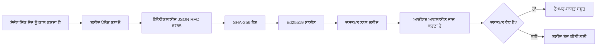
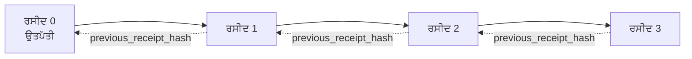

[ਦਰਸਾਉਂਦੇ ਹੋਏ ਵੀਡੀਓ ਵੇਖੋ: ਕ੍ਰਿਪਟੋਗ੍ਰਾਫਿਕ ਰਸੀਦਾਂ ਨਾਲ ਏਆਈ ਏਜੰਟਾਂ ਦੀ ਸੁਰੱਖਿਆ](https://youtu.be/PLACEHOLDER_VIDEO_ID)

> _(ਲੈਸਨ ਵੀਡੀਓ ਅਤੇ ਥੰਬਨੇਲ ਮਾਇਕ੍ਰੋਸੌਫਟ ਸਮੱਗਰੀ ਟੀਮ ਵੱਲੋਂ ਮਰਜ ਤੋਂ ਬਾਅਦ ਜੋੜੇ ਜਾਣਗੇ, ਲੈਸਨ 14 / 15 ਪੈਟਰਨ ਦੇ ਅਨੁਰੂਪ.)_

# ਕ੍ਰਿਪਟੋਗ੍ਰਾਫਿਕ ਰਸੀਦਾਂ ਨਾਲ ਏਆਈ ਏਜੰਟਾਂ ਦੀ ਸੁਰੱਖਿਆ

## ਜਾਣ-ਪਛਾਣ

ਇਹ ਲੈਸਨ ਕਵਰ ਕਰੇਗੀ:

- ਕਿਉਂ ਏਆਈ ਏਜੰਟਾਂ ਲਈ ਆਡਿਟ ਟਰੇਲ, ਅਨੁਕੂਲਤਾ, ਡਿਬੱਗਿੰਗ ਅਤੇ ਭਰੋਸੇ ਲਈ ਮਹੱਤਵਪੂਰਨ ਹਨ।
- ਕ੍ਰਿਪਟੋਗ੍ਰਾਫਿਕ ਰਸੀਦ ਕੀ ਹੈ ਅਤੇ ਇਹ ਇਕ ਅਸਾਈਨ ਨਾ ਕੀਤੀ ਲੌਗ ਲਾਈਨ ਤੋਂ ਕਿਵੇਂ ਵੱਖਰਾ ਹੈ।
- ਸਧਾਰਨ ਪਾਇਥਨ ਵਿੱਚ ਏਜੰਟ ਦੇ ਟੂਲ ਕਾਲ ਲਈ ਸਾਈਂ ਕੀਤੀ ਹੋਈ ਰਸੀਦ ਕਿਵੇਂ ਬਣਾਈ ਜਾਵੇ।
- ਆਫਲਾਈਨ ਰਸੀਦ ਦੀ ਜਾਂਚ ਕਿਵੇਂ ਕਰਨ ਅਤੇ ਟੈਂਪਰਿੰਗ ਦਾ ਪਤਾ ਲਗਾਉਣ ਦਾ ਤਰੀਕਾ।
- ਰਸੀਦਾਂ ਨੂੰ ਇਕ ਦੂਜੇ ਨਾਲ ਜੋੜ ਕੇ ਚੇਂਨ ਬਣਾਉਣਾ ਤਾਂ ਜੋ ਇੱਕ ਰਸੀਦ ਨੂੰ ਹਟਾਊ ਜਾਂ ਅਦਾਲਤ ਵਿੱਚ ਮੋੜਣਾ ਸਾਰੇ ਚੇਂਨ ਨੂੰ ਤੋੜਦਾ ਹੈ।
- ਰਸੀਦਾਂ ਕੀ ਸਾਬਤ ਕਰਦੀਆਂ ਹਨ ਅਤੇ ਉਹ ਖੁਲ੍ਹ ਕੇ ਕੀ ਨਹੀਂ ਸਾਬਤ ਕਰਦੀਆਂ।

## ਸਿੱਖਣ ਦੇ ਲਕੜ

ਇਸ ਲੈਸਨ ਨੂੰ ਪੂਰਾ ਕਰਨ ਤੋਂ ਬਾਅਦ, ਤੁਸੀਂ ਜਾਣੋਗੇ ਕਿ:

- ਕਿੰਨੇ ਅਸਫਲਤਾ ਦੀਆਂ ਸਥਿਤੀਆਂ ਹਨ ਜੋ ਏਜੰਟ ਕਿਰਿਆਵਾਂ ਲਈ ਕ੍ਰਿਪਟੋਗ੍ਰਾਫਿਕ ਪ੍ਰੋਵੇਨੈਂਸ ਦੀ ਲੋੜ ਨੂੰ ਮੋਟੀਵੇਟ ਕਰਦੀਆਂ ਹਨ।
- ਕੈਨਾਨੀਕਲ JSON ਪੇਲੋਡ 'ਤੇ Ed25519-ਸਾਈਂ ਕੀਤੀ ਰਸੀਦ ਕਿਵੇਂ ਤਿਆਰ ਕਰਨੀ ਹੈ।
- ਸਿਰਫ ਸਾਈਨ ਕਰਨ ਵਾਲੇ ਦੀ ਪਬਲਿਕ ਕੀ ਦੀ ਵਰਤੋਂ ਕਰਕੇ ਸੁਤੰਤਰ ਰਸੀਦ ਦੀ ਜਾਂਚ ਕਿਵੇਂ ਕਰਨੀ ਹੈ।
- ਬਦਲੀ ਜਾਂ ਟੈਂਪਰਿੰਗ ਦਾ ਪਤਾ ਲੱਗਣ ਲਈ ਤਬਦੀਲ ਕੀਤੀ ਰਸੀਦ 'ਤੇ ਦੁਬਾਰਾ ਜਾਂਚ ਕਿਵੇਂ ਕਰਨੀ ਹੈ।
- ਰਸੀਦਾਂ ਦੀ ਏਸ ਹੈਸ਼-ਚੈਨਡ ਲੜੀ ਕਿਵੇਂ ਬਣਾਈ ਜਾਵੇ ਅਤੇ ਕਿਉਂ ਇਹ ਚੇਨ ਮੁਹੱਤਵਪੂਰਨ ਹੈ।
- ਕੀ ਰਸੀਦ ਸਾਬਤ ਕਰਦੀਆਂ ਹਨ (ਅਟ੍ਰਿਬਿਊਸ਼ਨ, ਅਖੰਡਤਾ, ਕ੍ਰਮ) ਅਤੇ ਕੀ ਨਹੀਂ (ਕਿਰਿਆਵ ਦੀ ਸਹੀਤਾ, ਨੀਤੀ ਦੀ ਬਕਾਇਆਵਾਰੀ) ਦਾ ਫਰਕ ਸੂਝਣਾ।

## ਸਮੱਸਿਆ: ਤੁਹਾਡੇ ਏਜੰਟ ਦਾ ਆਡਿਟ ਟਰੇਲ

कल्पना ਕਰੋ ਕਿ ਤੁਸੀਂ Contoso Travel ਲਈ ਇੱਕ ਏਆਈ ਏਜੰਟ ਤਿਆਰ ਕੀਤਾ ਹੈ। ਇਹ ਏਜੰਟ ਗ੍ਰਾਹਕ ਦੀਆਂ ਮੰਗਾਂ ਪੜ੍ਹਦਾ ਹੈ, ਉਡਾਣਾਂ ਲਈ API ਕਾਲ ਕਰਦਾ ਹੈ ਅਤੇ ਗਾਹਕ ਦੇ ਹਿੱਸੇ ਵਿੱਚ ਸੀਟਾਂ ਬੁੱਕ ਕਰਦਾ ਹੈ। ਪਿਛਲੇ ਕਵਾਰਟਰ ਵਿੱਚ, ਇਹ ਏਜੰਟ 50,000 ਬੁਕਿੰਗ ਪ੍ਰਕਿਰਿਆ ਕੀਤੀਆਂ।

ਅੱਜ ਇਕ ਆਡੀਟਰ ਆਇਆ। ਉਹ ਇੱਕ ਸਧਾਰਣ ਸਵਾਲ ਪੁੱਛਦਾ ਹੈ: "ਮੈਨੂੰ ਦਿਖਾਓ ਤੁਹਾਡਾ ਏਜੰਟ ਕੀ ਕੀਤਾ।"

ਤੁਸੀਂ ਆਪਣੇ ਲੌਗ ਫਾਇਲਾਂ ਦਿੱਤੀਆਂ। ਆਡੀਟਰ ਉਹਨਾਂ ਨੂੰ ਦੇਖਦਿਆਂ ਇੱਕ ਮੁਸ਼ਕਲ ਸਵਾਲ ਕਰਦਾ ਹੈ: "ਮੈਂ ਕਿਵੇਂ ਜਾਣਾ ਕਿ ਇਹ ਲੌਗ ਸੋਧੇ ਨਹੀਂ ਗਏ?"

ਇਹ ਆਡਿਟ-ਟਰੇਲ ਸਮੱਸਿਆ ਹੈ। ਅੱਜ ਦੇ ਵੱਧਤਰ ਏਜੰਟ ਪ੍ਰਯੋਗਹਾਲ:

- **ਐਪਲੀਕੇਸ਼ਨ ਲੌਗ**: ਏਜੰਟ ਆਪਣੇ ਆਪ ਲਿਖਦਾ ਹੈ, ਕਿਸੇ ਵੀ ਫਾਇਲ ਸਿਸਟਮ ਐਕਸੈੱਸ ਵਾਲਾ ਸੋਧ ਸਕਦਾ ਹੈ।
- **ਕਲਾਉਡ ਲੌਗਿੰਗ ਸਰਵਿਸਜ਼**: ਪਲੇਟਫਾਰਮ ਸਤਰ 'ਤੇ ਟੈਂਪਰ-ਸਾਬਿਤ, ਪਰ ਕੇਵਲ ਜੇ ਆਡੀਟਰ ਨੂੰ ਪਲੇਟਫਾਰਮ ਚਲਾਉਣ ਵਾਲੇ 'ਤੇ ਭਰੋਸਾ ਹੈ।
- **ਡੇਟਾਬੇਸ ਟ੍ਰਾਂਜ਼ੈਕਸ਼ਨ ਲੌਗ**: ਡੇਟਾਬੇਸ ਬਦਲਾਵਾਂ ਲਈ ਉਚਿਤ ਪਰ ਮਨਚਾਹੇ ਟੂਲ ਕਾਲਾਂ ਲਈ ਨਹੀਂ।

ਇਹਨਾਂ ਵਿੱਚੋਂ ਕੋਈ ਵੀ ਆਡੀਟਰ ਦੇ ਸਵਾਲ ਦਾ ਜਵਾਬ ਨਹੀਂ ਦੇ ਸਕਦਾ ਬਗੈਰ ਵਰਤੇ ਜਾਂਦੇ ਕਿਸੇ ਭਰੋਸੇ (ਤੁਸੀਂ, ਤੁਹਾਡਾ ਕਲਾਉਡ ਪ੍ਰਦਾਤਾ, ਡੇਟਾਬੇਸ ਵਿਕਰੇਤਾ)। ਅੰਦਰੂਨੀ ਵਰਤੋਂ ਲਈ, ਉਹ ਭਰੋਸਾ ਕਈ ਵਾਰੀ ਮਨਜੂਰ ਹੁੰਦਾ ਹੈ। ਕਾਨੂੰਨੀ ਕੰਮਕਾਜ (ਵਿੱਤ, ਸਿਹਤ ਸੇਵਾ, EU AI ਐਕਟ ਵਾਲੇ) ਲਈ ਨਹੀਂ।

ਕ੍ਰਿਪਟੋਗ੍ਰਾਫਿਕ ਰਸੀਦਾਂ ਇਸਨੂੰ ਹੱਲ ਕਰਦੀਆਂ ਹਨ ਜਿਸ ਨਾਲ ਹਰ ਏਜੰਟ ਕਿਰਿਆ ਆਜ਼ਾਦ ਤੌਰ 'ਤੇ ਵੇਰੀਫਾਈ ਕਰ ਸਕੀਦੀ ਹੈ। ਆਡੀਟਰ ਨੂੰ ਤੁਹਾਡੇ 'ਤੇ ਭਰੋਸਾ ਕਰਨ ਦੀ ਲੋੜ ਨਹੀਂ। ਉਹ ਸਿਰਫ ਤੁਹਾਡੀ ਪਬਲਿਕ ਕੀ ਅਤੇ ਰਸੀਦ ਦੀ ਲੋੜ ਪਾਉਂਦੇ ਹਨ।

## ਕ੍ਰਿਪਟੋਗ੍ਰਾਫਿਕ ਰਸੀਦ ਕੀ ਹੁੰਦੀ ਹੈ?

ਰਸੀਦ ਇੱਕ JSON ਵਸਤੂ ਹੈ ਜੋ ਦਰਸਾਉਂਦੀ ਹੈ ਕਿ ਏਜੰਟ ਨੇ ਕੀ ਕੀਤਾ, ਡਿਜਿਟਲ ਸਿਗਨੇਚਰ ਨਾਲ ਸਾਈਂ ਹੁੰਦੀ ਹੈ।


  
ਇੱਕ ਘੱਟੋ-ਘੱਟ ਰਸੀਦ ਇਸ ਤਰ੍ਹਾਂ ਦਿੱਸਦੀ ਹੈ: 

```json
{
  "type": "agent.tool_call.v1",
  "agent_id": "contoso-travel-bot",
  "tool_name": "lookup_flights",
  "tool_args_hash": "sha256:a3f9c1...",
  "result_hash": "sha256:7b2e1d...",
  "policy_id": "contoso-travel-policy-v3",
  "timestamp": "2026-04-25T14:30:00Z",
  "sequence": 47,
  "previous_receipt_hash": "sha256:9d4e6a...",
  "signature": {
    "alg": "EdDSA",
    "sig": "c5af83...",
    "public_key": "8f3b2c..."
  }
}
```
  
ਤਿੰਨ ਗੁਣ ਕੰਮ ਕਰ ਰਹੇ ਹਨ:

1. **ਸਿਗਨੇਚਰ**। ਰਸੀਦ ਏਜੰਟ ਦੇ ਗੇਟਵੇ ਦੁਆਰਾ Ed25519 ਪ੍ਰਾਈਵੇਟ ਕੀ ਨਾਲ ਸਾਈਂ ਕੀਤੀ ਜਾਂਦੀ ਹੈ। ਜਿਸ ਨੂੰ ਮਿਲਦੀ ਸਾਰਥਕ ਪਬਲਿਕ ਕੀ, ਉਹ ਕਿਸੇ ਵੀ ਸਮੇਂ ਸਿਗਨੇਚਰ ਦੀ ਆਫਲਾਈਨ ਤਸਦੀਕ ਕਰ ਸਕਦਾ ਹੈ। ਕਿਸੇ ਖੇਤਰ ਵਿੱਚ ਸੋਧ ਸਿਗਨੇਚਰ ਨੂੰ ਅਣਜਮ੍ਹਾਂ ਕਰ ਦਿੰਦੀ ਹੈ।

2. **ਕੈਨਾਨੀਕਲ ਕੋਡਿੰਗ**। ਸਾਈਂ ਕਰਨ ਤੋਂ ਪਹਿਲਾਂ, ਰਸੀਦ ਨੂੰ JSON Canonicalization Scheme (JCS, RFC 8785) ਨਾਲ ਸੀਰੀਅਲਾਈਜ਼ ਕੀਤਾ ਜਾਂਦਾ ਹੈ। ਇਸ ਨਾਲ ਇਹ ਯਕੀਨੀ ਬਣਦਾ ਹੈ ਕਿ ਦੋ ਅਮਲ ਉੱਤਰ ਇੱਕੋ ਢੰਗ ਨਾਲ ਲਾਜ਼ਮੀ ਤੌਰ 'ਤੇ ਬਾਈਟ-ਸਹੀ ਔਟਪੁੱਟ ਦਿੰਦੇ ਹਨ। ਬਿਨਾਂ ਕੁਝ ਐਤਰਾਜ਼ ਦੇ, ਵੱਖ-ਵੱਖ JSON ਸੀਰੀਅਲਾਈਜ਼ਰ ਨੇ ਇੱਕੋ ਸਮੱਗਰੀ ਲਈ ਵੱਖ-ਵੱਖ ਸਿਗਨੇਚਰਾਂ ਦਾ ਨਿਰਮਾਣ ਕੀਤਾ ਹੋ ਸਕਦਾ।

3. **ਹੈਸ਼ ਚੈਨਿੰਗ**। `previous_receipt_hash` ਖੇਤਰ ਹਰ ਰਸੀਦ ਨੂੰ ਪਿਛਲੀ ਰਸੀਦ ਨਾਲ ਜੋੜਦਾ ਹੈ। ਇੱਕ ਰਸੀਦ ਨੂੰ ਹਟਾਉਣਾ ਜਾਂ ਉਸ ਦੀ ਸਸਤੀ ਦੇ ਅਨੁਕੂਲਤਾ ਤੋੜਦਾ ਹੈ। ਟੈਂਪਰਿੰਗ ਚੇਨ ਸਤਰ 'ਤੇ ਦਿਖਾਈ ਪੈਂਦੀ ਹੈ ਭਾਵੇਂ ਵਿਅਕਤੀਗਤ ਸਿਗਨੇਚਰਾਂ ਨੂੰ ਬਾਈਪਾਸ ਕੀਤਾ ਜਾਵੇ।

ਇਨਾਂ ਗੁਣਾਂ ਨਾਲ ਤਿੰਨ ਗਰੰਟੀ ਮਿਲਦੀਆਂ ਹਨ:

- **ਅਟ੍ਰਿਬਿਊਸ਼ਨ**: ਇਹ ਕੀ ਇਹ ਸਮੱਗਰੀ ਸਾਈਂ ਕੀਤੀ।  
- **ਅਖੰਡਤਾ**: ਸਮੱਗਰੀ ਸਾਈਂ ਕਰਨ ਤੋਂ ਬਾਅਦ ਬਦਲੀ ਨਹੀਂ।  
- **ਕ੍ਰਮ**: ਇਹ ਰਸੀਦ ਉਸ ਚੇਨ ਵਿੱਚ ਉਸ ਤੋਂ ਪਹਿਲਾਂ ਆਉਣ ਵਾਲੀ ਰਸੀਦ ਦੇ ਬਾਅਦ ਹੈ।

## ਪਾਇਥਨ ਵਿੱਚ ਰਸੀਦ ਬਣਾਉਣਾ

ਰਸੀਦ ਬਣਾਉਣ ਲਈ ਤੁਹਾਨੂੰ ਕਿਸੇ ਖਾਸ ਲਾਇਬ੍ਰੇਰੀ ਦੀ ਲੋੜ ਨਹੀਂ। ਕ੍ਰਿਪਟੋਗ੍ਰਾਫਿਕ ਪ੍ਰਿਮਿਟਿਵਸ ਆਮ ਤੌਰ 'ਤੇ ਉਪਲਬਧ ਹਨ ਅਤੇ ਤਰਕ ਸਿਰਫ ਕੁਝ ਦਹਾਕਾ ਪਾਇਥਨ ਲਾਈਨਾਂ ਦਾ ਹੈ।

`code_samples/18-signed-receipts.ipynb` ਵਿੱਚ ਹੈਂਡਸ-ਆਨ ਅਭਿਆਸ ਪੂਰੇ ਵੀਹ-ਤੰਦਰੂਸਤ ਪ੍ਰਕਿਰਿਆ ਵਿੱਖਾਉਂਦੇ ਹਨ। ਸੰਖੇਪ ਸੰਕਲਨ:

```python
import json
import hashlib
import base64
from nacl import signing
from jcs import canonicalize  # RFC 8785 ਕੈਨੋਨਿਕਲ JSON

def b64url_nopad(data: bytes) -> str:
    return base64.urlsafe_b64encode(data).decode("ascii").rstrip("=")

def sha256_canonical(obj) -> str:
    """SHA-256 of a Python object's JCS-canonical JSON form."""
    return f"sha256:{hashlib.sha256(canonicalize(obj)).hexdigest()}"

# ਸਾਈਨਿੰਗ ਕੀ ਬਣਾਓ ਜਾਂ ਲੋਡ ਕਰੋ (ਉਤਪਾਦਨ ਵਿੱਚ, ਕੁੰਜੀ ਵਾਲਟ ਵਿੱਚ ਸੰਭਾਲੋ)
signing_key = signing.SigningKey.generate()
verify_key = signing_key.verify_key

# ਰਸੀਦ ਪੇਲੋਡ ਬਣਾਓ (ਹੁਣ ਤੱਕ ਕੋਈ ਦਸਤਖਤ ਨਹੀਂ)
tool_args = {"origin": "SYD", "destination": "LAX"}
tool_result = [{"flight": "QF11", "price": 1850, "stops": 0}]

payload = {
    "type": "agent.tool_call.v1",
    "agent_id": "contoso-travel-bot",
    "tool_name": "lookup_flights",
    "tool_args_hash": sha256_canonical(tool_args),
    "result_hash": sha256_canonical(tool_result),
    "policy_id": "contoso-travel-policy-v3",
    "timestamp": "2026-04-25T14:30:00Z",
    "sequence": 0,
    "previous_receipt_hash": None,
}

# ਕੈਨੋਨਿਕਲ ਬਣਾਓ, ਹੈਸ਼ ਕਰੋ, ਦਸਤਖਤ ਕਰੋ।
canonical_bytes = canonicalize(payload)
message_hash = hashlib.sha256(canonical_bytes).digest()
signature_bytes = signing_key.sign(message_hash).signature

# ਇੱਕ ਸੰਰਚਿਤ ਦਸਤਖ਼ਤ ਵਸਤੂ ਜੋੜੋ।
receipt = {
    **payload,
    "signature": {
        "alg": "EdDSA",
        "sig": b64url_nopad(signature_bytes),
        "public_key": b64url_nopad(bytes(verify_key)),
    },
}
```
  
ਇਹ ਸਾਰੀ ਸਾਈਨਿੰਗ ਪ੍ਰਕਿਰਿਆ ਹੈ। ਨੋਟਬੁਕ ਦੇ ਅਭਿਆਸ ਹਰ ਕਦਮ 'ਤੇ ਚੱਲਦੇ ਹਨ।

## ਰਸੀਦ ਦੀ ਜਾਂਚ ਅਤੇ ਟੈਂਪਰਿੰਗ ਦਾ ਪਤਾ ਲਗਾਉਣਾ

ਜਾਂਚ ਉਲਟ ਪ੍ਰਕਿਰਿਆ ਹੈ:

```python
import base64
import hashlib
from nacl import signing
from nacl.exceptions import BadSignatureError
from jcs import canonicalize

def b64url_decode(s: str) -> bytes:
    padding = "=" * ((4 - len(s) % 4) % 4)
    return base64.urlsafe_b64decode(s + padding)

def verify_receipt(receipt: dict) -> bool:
    # ਸਿਗਨੇਚਰ ਇੱਕ ਸੰਰਚਿਤ ਵਸਤੂ ਹੈ: {"alg", "sig", "public_key"}।
    sig_obj = receipt.get("signature")
    if not sig_obj or sig_obj.get("alg") != "EdDSA":
        return False

    # payload ਨੂੰ ਮੁੜ ਬਣਾਓ ਜੋ ਅਸਲ ਵਿੱਚ ਸਾਇਨ ਕੀਤਾ ਗਿਆ ਸੀ (ਸਿਗਨੇਚਰ ਨੂੰ ਛੱਡ ਕੇ ਸਾਰਾ ਕੁਝ)।
    payload = {k: v for k, v in receipt.items() if k != "signature"}

    canonical_bytes = canonicalize(payload)
    message_hash = hashlib.sha256(canonical_bytes).digest()

    try:
        verify_key = signing.VerifyKey(b64url_decode(sig_obj["public_key"]))
        verify_key.verify(message_hash, b64url_decode(sig_obj["sig"]))
        return True
    except BadSignatureError:
        return False
```
  
ਇਹ ਫੰਕਸ਼ਨ ਇੱਕ ਰਸੀਦ ਲੈਂਦਾ ਹੈ ਅਤੇ ਸੱਚ (True) ਵਾਪਸ ਕਰਦਾ ਹੈ ਜੇ ਸਿਗਨੇਚਰ ਸਹੀ ਹੋਵੇ, ਨਹੀਂ ਤਾਂ ਝੂਠ (False)। ਕੋਈ ਨੈੱਟਵਰਕ ਕਾਲ ਨਹੀਂ, ਕੋਈ ਸਰਵਿਸ ਨਿਰਭਰਤਾ ਨਹੀਂ, ਕਿਸੇ ਤੀਜੀ ਪਾਰਟੀ ਉੱਤੇ ਭਰੋਸਾ ਕਰਨ ਦੀ ਲੋੜ ਨਹੀਂ।

ਟੈਂਪਰਿੰਗ ਡਿੱਠੀ ਜਾਵੇ ਇਸਦੇ ਲਈ ਨੋਟਬੁੱਕ ਵਿੱਚ ਇਹ ਦਿਖਾਇਆ ਗਿਆ ਹੈ:

1. ਵਿਵੇਕਯੋਗ ਰਸੀਦ ਬਣਾਈ ਜਾਵੇ ਅਤੇ ਯਕੀਨ ਕਰਵਾਇਆ ਜਾਵੇ ਕਿ ਇਹ ਜਾਂਚ ਪਾਸ ਕਰਦੀ ਹੈ।  
2. `tool_args_hash` ਖੇਤਰ ਦੀ ਇਕ ਬਾਈਟ ਨੂੰ ਸੋਧਿਆ ਜਾਵੇ।  
3. ਜਾਂਚ ਮੁੜ ਚਲਾਈ ਜਾਵੇ ਅਤੇ ਵਫਲ ਦੇਖਿਆ ਜਾਵੇ।

ਇਹ ਪ੍ਰਯੋਗਾਤਮਕ ਪ੍ਰਮਾਣ ਹੈ ਕਿ ਰਸੀਦਾਂ ਟੈਂਪਰ-ਸਾਬਿਤ ਹੁੰਦੀਆਂ ਹਨ: ਛੋਟੀ ਤੋਂ ਛੋਟੀ ਸੋਧ ਵੀ ਸਿਗਨੇਚਰ ਨੂੰ ਤੋੜ ਦਿੰਦੀ ਹੈ।

## ਬਹੁ-ਕਦਮੀ ਏਜੰਟਾਂ ਲਈ ਰਸੀਦਾਂ ਨੂੰ ਚੇਨ ਕਰਨਾ

ਇੱਕ ਸਿੰਗਲ ਸਾਈਂ ਕੀਤੀ ਰਸੀਦ ਇੱਕ ਕਿਰਿਆ ਦੀ ਸੁਰੱਖਿਆ ਕਰਦੀ ਹੈ। ਰਸੀਦਾਂ ਦੀ ਲੜੀ ਕ੍ਰਮ ਦੀ ਸੁਰੱਖਿਆ ਕਰਦੀ ਹੈ।


  
ਹਰ ਰਸੀਦ ਪਿਛਲੀ ਰਸੀਦ ਦੇ ਹੈਸ਼ ਨੂੰ ਦਰਜ ਕਰਦੀ ਹੈ। ਚੇਨ ਵਿੱਚ ਦੂਜੀ ਰਸੀਦ ਨੂੰ ਸ਼ਾਂਤੀ ਨਾਲ ਹਟਾਉਣ ਲਈ ਹਮਲਾਵਰ ਨੂੰ ਜਾਂ:

- ਰਸੀਦ 3 ਦੇ `previous_receipt_hash` ਖੇਤਰ ਨੂੰ ਸੋਧਣਾ ਪਵੇਗਾ (ਰਸੀਦ 3 ਦੀ ਸਿਗਨੇਚਰ ਖਰਾਬ ਹੋ ਜਾਏਗੀ), ਜਾਂ  
- ਸੋਧਿਆ ਰਸੀਦ 3 'ਤੇ ਨਵਾਂ ਸਿਗਨੇਚਰ ਬਣਾਉਣਾ ਪਵੇਗਾ (ਏਜੰਟ ਦੀ ਪ੍ਰਾਈਵੇਟ ਕੀ ਦੀ ਲੋੜ).

ਜੇ ਪ੍ਰਾਈਵੇਟ ਕੀ ਕਿਸੇ ਹਾਰਡਵੇਅਰ ਕੀ ਵੌਲਟ ਵਿੱਚ ਹੈ ਅਤੇ ਤੁਸੀਂ ਹਰ ਰਸੀਦ ਨਾਲ ਪਬਲਿਕ ਕੀ ਪ੍ਰਕਾਸ਼ਿਤ ਕਰਦੇ ਹੋ ਤਾਂ ਇਹ ਕੋਈ ਹਮਲਾ ਪਤਾ ਲੱਗਣ ਤੋਂ ਬਿਨਾਂ ਸੰਭਵ ਨਹੀਂ।

ਨੋਟਬੁਕ ਚੱਲਦਾ ਹੈ:

1. ਤਿੰਨ ਰਸੀਦਾਂ ਦੀ ਇਕ ਚੇਨ ਬਣਾਉਣਾ।  
2. ਜਾਂਚਣਾ ਕਿ ਹਰ ਰਸੀਦ ਦਾ `previous_receipt_hash` ਅਸਲ ਪਿਛਲੀ ਰਸੀਦ ਦੇ ਹੈਸ਼ ਨਾਲ ਮਿਲਦਾ ਹੈ।  
3. ਰਸੀਦ ਦੇ ਵਿਚਕਾਰ ਇੱਕ ਵਿੱਚ ਟੈਂਪਰਿੰਗ ਕਰਨਾ ਅਤੇ ਚੇਨ ਉਸ ਥਾਂ ਤੋੜਦੇ ਦੇਖਣਾ।

ਇਸ ਤਰ੍ਹਾਂ ਤੁਸੀਂ ਇਕ ਐਸਾ ਆਡਿਟ ਟਰੇਲ ਬਣਾਉਂਦੇ ਹੋ ਜੋ ਬਾਹਰੀ ਆਡੀਟਰ ਤੁਹਾਡੇ ਉੱਤੇ ਭਰੋਸਾ ਕੀਤੇ ਬਿਨਾਂ ਪ੍ਰਮਾਣਿਤ ਕਰ ਸਕਦਾ ਹੈ।

## ਰਸੀਦ ਕੀ ਸਾਬਤ ਕਰਦੀਆਂ ਹਨ (ਅਤੇ ਕੀ ਨਹੀਂ)

ਇਹ ਇਸ ਲੈਸਨ ਦਾ ਸਭ ਤੋਂ ਮਹੱਤਵਪੂਰਨ ਭਾਗ ਹੈ। ਰਸੀਦ ਤਾਕਤਵਰ ਹਨ ਪਰ ਇਨ੍ਹਾਂ ਦੀ ਪਰਿਧੀ ਸੀਮਤ ਹੈ।

**ਰਸੀਦ ਤਿੰਨ ਗੱਲਾਂ ਸਾਬਤ ਕਰਦੀਆਂ ਹਨ:**

1. **ਅਟ੍ਰਿਬਿਊਸ਼ਨ**: ਇਕ ਖਾਸ ਕੀ ਨੇ ਇਕ ਖਾਸ ਸਮੱਗਰੀ ਨੂੰ ਸਾਈਂ ਕੀਤਾ।  
2. **ਅਖੰਡਤਾ**: ਸਮੱਗਰੀ ਸਾਈਂ ਕਰਨ ਦੇ ਬਾਅਦ ਬਦਲੀ ਨਹੀਂ ਹੋਈ।  
3. **ਕ੍ਰਮ**: ਇਹ ਰਸੀਦ ਉਸ ਲੜੀ ਵਿੱਚ ਉਸ ਤੋਂ ਪਹਿਲਾਂ ਆਈ ਰਸੀਦ ਤੋਂ ਬਾਅਦ ਹੈ।

**ਰਸੀਦ ਇਹ ਨਹੀਂ ਸਾਬਤ ਕਰਦੀਆਂ:**

1. **ਸਹੀਤਾ**: ਕਿ ਏਜੰਟ ਦੀ ਕਾਰਵਾਈ ਸਹੀ ਸੀ। ਇੱਕ ਰਸੀਦ ਗਲਤ ਜਵਾਬ ਲਈ ਵੀ ਇਨਸਾਫ਼ੀ ਨਾਲ ਸਾਈਂ ਕੀਤੀ ਜਾ ਸਕਦੀ ਹੈ।  
2. **ਨੀਤੀ ਦੀ ਪਾਲਣਾ**: ਦੀ `policy_id` ਵਿੱਚ ਦਰਜ ਨੀਤੀ ਦਰਅਸਲ ਜਾਂਚੀ ਗਈ ਸੀ ਜਾਂ ਜੇਚ ਕੀਤੀ ਗਈ ਤਾਂ ਇਜਾਜ਼ਤ ਦੇਣ ਵਾਲੀ ਹੁੰਦੀ। ਰਸੀਦ ਇਸਦੀ દવા ਕਰਦੀ ਹੈ, ਲਾਗੂ ਕਰਨ ਦੀ ਨਹੀਂ।  
3. **ਕੀ ਤੋਂ ਬਾਹਰ ਦੀ ਪਹਿਚਾਣ**: ਰਸੀਦ ਕਹਿੰਦੀ ਹੈ "ਇਸ ਕੀ ਨੇ ਇਹ ਸਮੱਗਰੀ ਸਾਈਂ ਕੀਤੀ" ਪਰ نہیں کہتی کہ "ਇਸ ਮਨੁੱਖ ਨੇ ਇਹ ਮਨਜ਼ੂਰ ਕੀਤਾ"। ਕਿਸੇ ਕੀ ਨੂੰ ਵਿਅਕਤੀ ਜਾਂ ਸੰਸਥਾ ਨਾਲ ਜੋੜਨਾ ਵੱਖਰਾ ਪਹਿਚਾਣ ਢਾਂਚਾ (ਡਾਇਰੈਕਟਰੀ, ਪਬਲਿਕ ਕੀ ਰਜਿਸਟਰੀ) ਲੋੜਦਾ ਹੈ।  
4. **ਇਨਪੁੱਟ ਦੀ ਸਚਾਈ**: ਜੇ ਏਜੰਟ ਨੂੰ ਗੜਬੜਾਇਆ ਗਿਆ ਪ੍ਰੰਪਟ ਮਿਲਦਾ ਹੈ ਅਤੇ ਉਸ'ਤੇ ਕਿਰਿਆ ਕਰਦਾ ਹੈ, ਰਸੀਦ ਉਸ ਕਿਰਿਆ ਨੂੰ ਸੱਚਾਈ ਨਾਲ ਦਰਜ ਕਰਦੀ ਹੈ। ਰਸੀਦ ਇਨਪੁੱਟ ਵੈਰੀਫਿਕੇਸ਼ਨ ਦਾ ਸਥਾਨ ਨਹੀ ਹੈ, ਬਲਕਿ ਇਸਦਾ ਡਾਊਨਸਟਰੀਮ ਹੈ।

ਇਹ ਸੀਮਾ ਦੋ ਕਾਰਨਾਂ ਲਈ ਜਰੂਰੀ ਹੈ:

- ਇਹ ਦੱਸਦਾ ਹੈ ਕਿ ਰਸੀਦ ਕਿਥੇ ਲਾਗੂ ਹਨ: ਏਜੰਟ ਦੇ ਵਿਹਾਰ ਨੂੰ ਆਡਿਟ ਕਰਨਯੋਗ ਅਤੇ ਟੈਂਪਰ-ਸਾਬਿਤ ਬਣਾਉਣ ਲਈ, ਜਿਹੜਾ ਕਿ ਸੰਸਥਾਗਤ ਹੱਦਾਂ ਦੇ ਪਾਰ ਵੀ ਲਾਗੂ ਹੁੰਦਾ ਹੈ।  
- ਇਹ ਦੱਸਦਾ ਹੈ ਕਿ ਤੁਹਾਨੂੰ ਹੋਰ ਕੀ ਲੇਅਰ ਦੀ ਲੋੜ ਹੈ: ਇਨਪੁੱਟ ਵੈਲੀਡੇਸ਼ਨ (ਲੇਸਨ 6), ਨੀਤੀ ਲਾਗੂ ਕਰਨ (ਥੋੜਕਾ ਹੇਠਾਂ ਦਿੱਤਾ), ਅਤੇ ਪਹਿਚਾਣ ਢਾਂਚਾ (ਇਸ ਲੈਸਨ ਦੇ ਬਾਹਰ)।

ਆਮ ਗਲਤੀ ਇਹ ਸਮਝਨਾ ਹੈ ਕਿ "ਸਾਡੇ ਕੋਲ ਰਸੀਦਾਂ ਹਨ" ਇਸਦਾ ਮਤਲਬ "ਅਸੀਂ ਸ਼ਾਸਕ ਹਨ"। ایسا نہیں ہے। ਰਸੀਦਾਂ ਇੱਕ ਬੁਨਿਆਦ ਹਨ। ਸ਼ਾਸਤਰੀ ਪ੍ਰਬੰਧਨ ਉਹ ਪ੍ਰਣਾਲੀ ਹੈ ਜੋ ਤੁਸੀਂ ਉਸ ਦੇ ਉੱਪਰ ਬਣਾਉਂਦੇ ਹੋ।

## ਉਤਪਾਦਨ ਸੰਬੰਧੀ ਰਹਿਤਾਂ

ਇਸ ਲੈਸਨ ਦਾ ਪਾਇਥਨ ਕੋਡ ਇਰਾਦਤਨ ਘੱਟ ਤੋਂ ਘੱਟ ਹੈ ਤਾਂ ਜੋ ਤੁਸੀਂ ਹਰ ਲਾਈਨ ਪੜ੍ਹ ਕੇ ਸਮਝ ਸਕੋ ਕਿ ਕੀ ਹੋ ਰਿਹਾ ਹੈ। ਉਤਪਾਦਨ ਵਿੱਚ, ਤੁਹਾਡੇ ਕੋਲ ਦੋ ਵਿਕਲਪ ਹਨ:

1. **ਪਹਿਲਾਂ ਤੋਂ ਮੌਜੂਦ ਕ੍ਰਿਪਟੋਗ੍ਰਾਫਿਕ ਪ੍ਰਿਮਿਟਿਵਸ ਉੱਤੇ ਸਿੱਧਾ ਬਣਾਓ।** ਇਹ ਜੋ 50 ਲਾਈਨਾਂ ਤੁਸੀਂ ਉਪਰ ਵੇਖੀਆਂ ਹਨ ਉਹ ਕਈ ਸਿਨਾਰੀਆ ਲਈ ਕਾਫ਼ੀ ਹਨ। PyNaCl (Ed25519) ਅਤੇ `jcs` ਪੈਕੇਜ (ਕੈਨਾਨੀਕਲ JSON) ਚੰਗੀ ਤਰ੍ਹਾਂ ਤਿਆਰ ਅਤੇ ਆਡੀਟ ਕੀਤੀਆਂ ਗਈਆਂ ਲਾਇਬ੍ਰੇਰੀਆਂ ਹਨ।  
2. **ਉਤਪਾਦਨ ਰਸੀਦ ਲਾਇਬ੍ਰੇਰੀ ਦੀ ਵਰਤੋਂ ਕਰੋ।** ਕਈ ਓਪਨ-ਸੋਰਸ ਪ੍ਰੋਜੈਕਟ ਇਸੇ ਪੈਟਰਨ ਨੂੰ ਹੋਰ ਖਾਸ ਫੀਚਰਾਂ (ਕੀ ਪਰਿਵਰਤਨ, ਬੈਚ ਵੇਰੀਫਿਕੇਸ਼ਨ, JWK ਸੈੱਟ ਵੰਡਣਾ, ਨੀਤੀ ਇੰਜਣਾਂ ਨਾਲ ਇੰਟਿਗ੍ਰੇਸ਼ਨ) ਦੇ ਨਾਲ ਲਾਗੂ ਕਰਦੇ ਹਨ:  
   - ਇਸ ਲੈਸਨ ਵਿੱਚ ਵਰਤੀ ਰਸੀਦ ਫਾਰਮੈਟ ਇੱਕ IETF ਇੰਟਰਨੈੱਟ-ਡਰਾਫਟ (`draft-farley-acta-signed-receipts`) ਦੇ ਤਹਿਤ ਹੈ ਜੋ ਮਿਆਰੀਕਰਨ ਪ੍ਰਕਿਰਿਆ ਵਿੱਚ ਹੈ।  
   - ਮਾਇਕ੍ਰੋਸੌਫਟ ਏਜੰਟ ਗਵਰਨੈਂਸ ਟੂਲਕਿਟ ਰਸੀਦਾਂ ਨੂੰ ਸੀਡਰ-ਅਧਾਰਿਤ ਨੀਤੀ ਫੈਸਲੇ ਨਾਲ ਜੋੜਦਾ ਹੈ; ਉਸ ਰਿਪੋ ਵਿੱਚ ਟਿਊਟੋਰੀਅਲ 33 ਇੱਕ ਅੰਤ-ਤੱਕ ਉਦਾਹਰਨ ਹੈ।  
   - `protect-mcp` (npm) ਅਤੇ `@veritasacta/verify` (npm) ਪੈਕੇਜ Node-ਆਧਾਰਤ ਰਸੀਦ ਸਾਈਨਿੰਗ ਅਤੇ ਆਫਲਾਈਨ ਵੇਰੀਫਿਕੇਸ਼ਨ ਲਾਗੂ ਕਰਦੇ ਹਨ, ਜਿਹੜਾ ਕਿਸੇ ਵੀ MCP ਸਰਵਰ ਨੂੰ ਟੈਂਪਰ-ਸਾਬਿਤ ਆਡਿਟ ਟਰੇਲ ਨਾਲ ਘੇਰਣ ਲਈ ਹੈ।  
   - **[nobulex](https://github.com/arian-gogani/nobulex)** ਪਾਇਥਨ SDK (`pip install nobulex`) Ed25519 + JCS ਸਾਈਨਿੰਗ ਪੈਟਰਨ ਨੂੰ ਪਾਇਥਨ ਵਿੱਚ ਲੰਚੇਨ ਅਤੇ CrewAI ਇੰਟਿਗ੍ਰੇਸ਼ਨਾਂ ਨਾਲ ਪ੍ਰਦਾਨ ਕਰਦਾ ਹੈ, ਪਬਲਿਸ਼ਡ ਕ੍ਰਾਸ-ਵੈਰੀਫਿਕੇਸ਼ਨ ਟੈਸਟ ਵੇਕਟਰ ਅਤੇ ਇੱਕ ਕਮਪਲਾਇੰਸ ਮੈਪਿੰਗ ਜੋ [OWASP PR #2210](https://github.com/OWASP/CheatSheetSeries/pull/2210) ਰਾਹੀਂ ਯੋਗਦਾਨ ਕੀਤੀ ਗਈ ਹੈ।

ਆਪਣੀ ਲਾਇਬ੍ਰੇਰੀ ਲਿਖਣ ਅਤੇ ਇੱਕ ਪ੍ਰਮਾਣਿਤ JWT ਲਾਇਬ੍ਰੇਰੀ ਦੀ ਵਰਤੋਂ ਕਰਨ ਦੇ ਵਿਚਕਾਰ ਫੈਸਲਾ ਕਿਰਤੇ ਸਮਾਨ ਹੈ: ਦੋਹਾਂ ਉਚਿਤ ਹਨ; ਲਾਇਬ੍ਰੇਰੀ ਸਮਾਂ ਬਚਾਉਂਦੀ ਅਤੇ ਆਡੀਟ ਸਤਹ ਘਟਾਉਂਦੀ ਹੈ; ਨਵਾਂ ਤਰੀਕਾ ਤੁਹਾਨੂੰ ਹਰ ਪ੍ਰਿਮਿਟਿਵ ਨੂੰ ਸਮਝਣ ਤੇ ਮਜ਼ਬੂਰ ਕਰਦਾ ਹੈ। ਇਹ ਲੈਸਨ ਤੁਹਾਨੂੰ ਇਹ ਯਥਾਰਥ ਸਿਖਾਉਂਦੀ ਹੈ ਤਾਂ ਜੋ ਤੁਸੀਂ ਦੋਹਾਂ ਚੋਣਾਂ ਲਈ ਬੁਨਿਆਦ ਰੱਖ ਸਕੋ।

## ਗਿਆਨ ਜਾਂਚ

ਪ੍ਰਯੋਗ ਅਭਿਆਸ ਤੇ ਜਾਣ ਤੋਂ ਪਹਿਲਾਂ ਆਪਣੀ ਸਮਝ ਨੂੰ ਟੈਸਟ ਕਰੋ।

**1. ਰਸੀਦ ਏਜੰਟ ਦੀ ਪ੍ਰਾਈਵੇਟ Ed25519 ਕੀ ਨਾਲ ਸਾਈਂ ਕੀਤੀ ਜਾਂਦੀ ਹੈ। ਆਡੀਟਰ ਕੋਲ ਸਿਰਫ ਪਬਲਿਕ ਕੀ ਹੁੰਦੀ ਹੈ। ਕੀ ਆਡੀਟਰ ਰਸੀਦ ਦੀ ਆਫਲਾਈਨ ਜਾਂਚ ਕਰ ਸਕਦਾ ਹੈ?**

<details>
<summary>ਜਵਾਬ</summary>

ਹਾਂ। Ed25519 ਸਿਗਨੇਚਰ ਦੀ ਜਾਂਚ ਲਈ ਸਿਰਫ ਪਬਲਿਕ ਕੀ ਅਤੇ ਸਾਈਂ ਕੀਤੇ ਬਾਈਟ ਲੋੜੀਂਦੇ ਹਨ। ਕੋਈ ਨੈੱਟਵਰਕ ਕਾਲ, ਕੋਈ ਸਰਵਿਸ ਨਿਰਭਰਤਾ ਨਹੀਂ। ਇਹ ਗੁਣ ਰਸੀਦਾਂ ਨੂੰ ਹਵਾ-ਕੱਟੀ, ਬਹੁ-ਸੰਗਠਨੀ ਅਤੇ ਘੱਟ ਭਰੋਸੇ ਵਾਲੇ ਆਡਿਟ ਸੈਟਿੰਗਾਂ ਵਿੱਚ ਲਾਭਦਾਇਕ ਬਣਾਉਂਦਾ ਹੈ।  
</details>

**2. ਇੱਕ ਹਮਲਾਵਰ ਰਸੀਦ ਦੇ `policy_id` ਖੇਤਰ ਨੂੰ ਸੋਧ ਕੇ ਦਾਅਵਾ ਕਰਦਾ ਹੈ ਕਿ ਇਹ ਕਿਸੇ ਢਿੱਲੇ ਨੀਤੀ ਦੇ ਅਧੀਨ ਸੀ। ਸਿਗਨੇਚਰ ਅਸਲ ਪੇਲੋਡ ਉੱਤੇ ਬਣੀ ਸੀ। ਜਾਂਚ ਦੌਰਾਨ ਕੀ ਹੁੰਦਾ ਹੈ?**

<details>
<summary>ਜਵਾਬ</summary>

ਜਾਂਚ ਫੇਲ੍ਹ ਹੁੰਦੀ ਹੈ। ਸਿਗਨੇਚਰ ਮੂਲ ਪੇਲੋਡ ਦੇ ਕੈਨਾਨੀਕਲ ਬਾਈਟ ਉੱਤੇ ਬਣਾਈ ਗਈ ਸੀ; ਕੋਈ ਵੀ ਸੋਧ ਕੈਨਾਨੀਕਲ ਬਾਈਟ ਬਦਲ ਦਿੰਦੀ ਹੈ, ਜਿਸ ਨਾਲ SHA-256 ਹੈਸ਼ ਬਦਲ ਜਾਂਦਾ ਹੈ, ਤੇ ਸਿਗਨੇਚਰ ਅਮਾਨ੍ਯ ਹੋ ਜਾਂਦੀ ਹੈ। ਹਮਲਾਵਰ ਨੂੰ ਤਾਜ਼ੀ ਵਾਹ ਵੈਧ ਸਿਗਨੇਚਰ ਬਣਾਉਣ ਲਈ ਪ੍ਰਾਈਵੇਟ ਕੀ ਦੀ ਲੋੜ ਪਵੇਗੀ, ਜੋ ਉਸਦੇ ਕੋਲ ਨਹੀਂ।  
</details>

**3. ਰਸੀਦ ਵਿੱਚ ਕੁਸ਼ ਦਲੀਲਾਂ ਅਤੇ ਨਤੀਜਾ ਦੀ ਥਾਂ `tool_args_hash` ਅਤੇ `result_hash` ਹਨ, ਇਸਦਾ ਕਾਰਣ ਕੀ ਹੈ?**

<details>
<summary>ਜਵਾਬ</summary>

ਦੋ ਕਾਰਨ ਹਨ। ਪਹਿਲਾਂ, ਰਸੀਦ ਨੂੰ ਅਜਿਹੀਆਂ ਥਾਵਾਂ 'ਤੇ ਸਟੋਰ ਜਾਂ ਭੇਜਣਾ ਪੈ ਸਕਦਾ ਹੈ ਜਿੱਥੇ ਮੁਢਲੀ ਸਮੱਗਰੀ (PII, ਵਪਾਰਕ ਡੇਟਾ) ਨੂੰ ਬਾਹਰ ਲਿਕ ਹੋਣਾ ਸਮੱਸਿਆ ਬਣਦਾ ਹੈ। ਹੈਸ਼ਿੰਗ ਰਸੀਦ ਨੂੰ ਛੋਟਾ ਅਤੇ ਸਮੱਗਰੀ ਨੂੰ ਗੋਪਨੀਯਤਾ ਵਿੱਚ ਰੱਖਦਾ ਹੈ; ਆਡੀਟਰ ਜਾਂਚਦਾ ਹੈ ਕਿ ਹੈਸ਼ ਅਸਲੀ ਸਮੱਗਰੀ ਦੀ ਵੱਖਰੀ ਸਟੋਰ ਕੀਤੀ ਕਾਪੀ ਨਾਲ ਮਿਲਦਾ ਹੈ। ਦੂਜਾ, ਹੈਸ਼ ਦੀ ਨਹਰਮਾਰਗੀ ਲੰਬਾਈ ਹੁੰਦੀ ਹੈ; ਹੈਸ਼ ਵਾਲੀ ਰਸੀਦ ਭਾਰੇ ਇਨਪੁੱਟ ਅਤੇ ਆਉਟਪੁੱਟ ਹੁੰਦਿਆਂ ਵੀ ਸੀਮਿਤ ਆਕਾਰ ਦੀ ਹੋਦੀ ਹੈ।  
</details>

**4. `previous_receipt_hash` ਖੇਤਰ ਹਰ ਰਸੀਦ ਨੂੰ ਉਸਦੇ ਪੂਰਵਜ ਨਾਲ ਜੋੜਦਾ ਹੈ। ਜੇ ਕੋਈ ਹਮਲਾਵਰ ਚੇਨ ਵਿਚੋਂ ਕਿਸੇ ਰਸੀਦ ਨੂੰ ਬੇਅਵਾਜ਼ੀ ਨਾਲ ਹਟਾ ਦਿੰਦਾ ਹੈ, ਤਾਂ ਕਿ ਕੀ ਗਲਤ ਹੋਆਂਗਾ?**

<details>
<summary>ਜਵਾਬ</summary>

ਜੋ ਵੀ ਰਸੀਦ ਹਟਾਈ ਗਈ ਤੋਂ ਬਾਅਦ ਆਈ ਹੈ ਉਹ ਸਭ ਗਲਤ ਹੋ ਜਾਂਦੀਆਂ ਹਨ। ਉਹਨਾਂ ਦੇ `previous_receipt_hash` ਖੇਤਰ ਹੁਣ ਅਸਲ ਚੇਨ ਨਾਲ ਮੇਲ ਨਹੀਂ ਖਾਂਦੇ (ਕਿਉਂਕਿ ਜਿਸ ਰਸੀਦ ਨੂੰ ਵੇਖਿਆ ਗਿਆ ਸੀ ਉਹ ਹੁਣ ਨਹੀਂ ਹੈ ਜਾਂ ਚੇਨ ਹੁਣ ਵੱਖਰੇ ਪੂਰਵਜ ਵੱਲ ਹੈ)। ਧੋਖਾ ਛੁਪਾਉਣ ਲਈ ਹਮਲਾਵਰ ਨੂੰ ਹਰ ਬਾਅਦੀ ਰਸੀਦ ਨੂੰ ਦੁਬਾਰਾ ਸਾਈਨ ਕਰਨਾ ਪਵੇਗਾ, ਜੋ ਕਿ ਪ੍ਰਾਈਵੇਟ ਕੀ ਲੋੜਦਾ ਹੈ।  
</details>

**5. ਇੱਕ ਰਸੀਦ ਸਫਲਤਾਪੂर्वਕ ਜਾਂਚ ਲੰਘ ਜਾਂਦੀ ਹੈ। ਕੀ ਇਹ ਸਾਬਤ ਕਰਦਾ ਹੈ ਕਿ ਏਜੰਟ ਦੀ ਕਿਰਿਆ ਸਹੀ, ਤਰਕਸ਼ੀਲ ਜਾਂ ਨੀਤੀ ਅਨੁਕੂਲ ਸੀ?**

<details>
<summary>ਜਵਾਬ</summary>

ਨਹੀਂ। ਇੱਕ ਵੈਧ ਰਸੀਦ ਤਿੰਨ ਗੱਲਾਂ ਸਾਬਤ ਕਰਦੀ ਹੈ: ਅਟ੍ਰਿਬਿਊਸ਼ਨ (ਇਹ ਕੀ ਇਸ ਸਮੱਗਰੀ ਨੂੰ ਸਾਈਂ ਕਰਦਾ ਹੈ), ਅਖੰਡਤਾ (ਸਮੱਗਰੀ ਬਦਲੀ ਨਹੀਂ ਹੋਈ), ਅਤੇ ਕ੍ਰਮ (ਇਹ ਰਸੀਦ ਉਸ ਤੋਂ ਪਹਿਲਾਂ ਆਈ ਰਸੀਦ ਤੋਂ ਬਾਅਦ ਹੈ)। ਇਹ ਸਾਬਤ ਨਹੀਂ ਕਰਦੀ ਕਿ ਕਿਰਿਆ ਸਹੀ ਸੀ, `policy_id` ਵਿੱਚ ਦਰਜ ਨੀਤੀ ਦੀ ਅਸਲ ਜਾਂਚ ਕੀਤੀ ਗਈ ਸੀ ਜਾਂ ਏਜੰਟ ਨੇ ਹਰ ਨਿਯਮ ਦੀ ਪਾਲਣਾ ਕੀਤੀ। ਰਸੀਦਾਂ ਏਜੰਟ ਵਿਹਾਰ ਨੂੰ ਆਡਿਟ ਕਰਨਯੋਗ ਬਨਾਉਂਦੀਆਂ ਹਨ, ਹਮੇਸ਼ਾਂ ਸਹੀ ਨਹੀਂ। ਇਹ ਲੈਸਨ ਦੀ ਸਭ ਤੋਂ ਜਰੂਰੀ ਹੱਦ ਹੈ।  
</details>

## ਅਭਿਆਸ

`code_samples/18-signed-receipts.ipynb` ਖੋਲ੍ਹੋ ਅਤੇ ਸਾਰੇ ਚਾਰ ਭਾਗ ਪੂਰੇ ਕਰੋ:

1. **ਭਾਗ 1**: ਆਪਣੀ ਪਹਿਲੀ ਰਸੀਦ ਸਾਈਂ ਕਰੋ ਅਤੇ ਜਾਂਚੋ।  
2. **ਭਾਗ 2**: ਰਸੀਦ ਵਿੱਚ ਟੈਂਪਰਿੰਗ ਕਰੋ ਅਤੇ ਜਾਂਚ ਨਾ ਹੋਨ ਦੀ ਪੁਸ਼ਟੀ ਕਰੋ।  
3. **ਭਾਗ 3**: ਤਿੰਨ ਰਸੀਦਾਂ ਦੀ ਚੇਨ ਬਣਾਓ ਅਤੇ ਚੇਨ ਦੀ ਅਖੰਡਤਾ ਦੀ ਜਾਂਚ ਕਰੋ।  
4. **ਭਾਗ 4**: ਮਾਇਕ੍ਰੋਸੌਫਟ ਏਜੰਟ ਫ੍ਰੇਮਵਰਕ ਨਾਲ ਬਣੇ ਏਜੰਟ ਲਈ ਪੈਟਰਨ ਲਗਾਓ: ਰਸੀਦ ਸਾਈਨਿੰਗ ਲਈ ਟੂਲ ਕਾਲ ਨੂੰ ਘੇਰੋ, ਫਿਰ ਰਸੀਦ ਦੀ ਸੁਤੰਤਰ ਜਾਂਚ ਕਰੋ।
**ਸਟ੍ਰੈਚ ਚੈਲੈਂਜ 1:** ਆਪਣੀ ਚੋਣ ਦਾ ਇੱਕ ਵਾਧੂ ਫੀਲਡ (ਉਦਾਹਰਨ ਵਜੋਂ, ਟ੍ਰੇਸਿੰਗ ਲਈ ਇੱਕ ਬੇਨਤੀ ID) ਰਸੀਦ ਸਕੀਮਾ ਨਾਲ ਜੋੜੋ, ਕੈਨਾਨਿਕਲ ਸਾਈਨਿੰਗ ਤਰਤੀਬ ਨੂੰ ਇਸ ਵਿੱਚ ਸ਼ਾਮਲ ਕਰਨ ਲਈ ਅੱਪਡੇਟ ਕਰੋ, ਅਤੇ ਪੁਸ਼ਟੀ ਕਰੋ ਕਿ ਰਸੀਦ ਅਜੇ ਵੀ ਸਤਿਆਪਨ ਦੇ ਰਾਹੀਂ ਰਾਊਂਡ-ਟ੍ਰਿਪ ਹੁੰਦੀ ਹੈ। ਫਿਰ ਸਾਈਨਿੰਗ ਤੋਂ ਬਾਅਦ ਫੀਲਡ ਨੂੰ ਬਦਲੋ ਅਤੇ ਸਤਿਆਪਨ ਫੇਲ ਹੋਣ ਦੀ ਪੁਸ਼ਟੀ ਕਰੋ। ਇਸ ਨਾਲ ਤੁਹਾਨੂੰ ਸਮਝਣ ਲਈ ਮਜ਼ਬੂਰ ਕੀਤਾ ਜਾਂਦਾ ਹੈ ਕਿ ਕੈਨਾਨਿਕਲ ਕੋਡਿੰਗ ਦਾ ਹਰ ਬਾਈਟ ਦਸਤਖ਼ਤ ਵਿੱਚ ਕਿਵੇਂ ਯੋਗਦਾਨ ਦਿੰਦਾ ਹੈ।

**ਸਟ੍ਰੈਚ ਚੈਲੈਂਜ 2:** ਆਪਣੇ ਦੋ ਰਸੀਦਾਂ ਨੂੰ SHA-256-ਹੈਸ਼ ਕਰੋ (ਉਹਨਾਂ ਦੇ ਕੈਨਾਨਿਕਲ ਬਾਈਟਜ਼ ਨੂੰ ਨਿਯਤ ਹੁਕਮ ਵਿੱਚ ਜੁੜ ਕੇ) ਅਤੇ ਤੀਜੇ ਰਸੀਦ ਵਿੱਚ ਇੱਕ ਨਵੇਂ ਫੀਲਡ ਵਜੋਂ ਨਤੀਜੇ ਦੇ ਡਾਈਜੈਸਟ ਨੂੰ ਸੰਮਿਲਤ ਕਰੋ ਇਸ ਤੋਂ ਪਹਿਲਾਂ ਕਿ ਇਸ ਨੂੰ ਸਾਈਨ ਕੀਤਾ ਜਾਵੇ। ਪੱਕਾ ਕਰੋ ਕਿ ਤੇਨੋਂ ਰਸੀਦਾਂ ਅਜੇ ਵੀ ਰਾਊਂਡ-ਟ੍ਰਿਪ ਹੁੰਦੀਆਂ ਹਨ। ਤੁਸੀਂ ਹੁਣੇ ਇੱਕ ਇੱਕ-ਕਦਮੀ ਸਮਾਵੇਸ਼ ਸਬੂਤ ਬਣਾਇਆ ਹੈ: ਜੋ ਕੋਈ ਵੀ ਤੀਜੇ ਰਸੀਦ ਨੂੰ ਰੱਖਦਾ ਹੈ ਉਹ ਪਹਿਲੀ ਦੋ ਰਸੀਦਾਂ ਦੇ ਹੋਣ ਦਾ ਸਬੂਤ ਦੇ ਸਕਦਾ ਹੈ ਜਦੋਂ ਇਹ ਸਾਈਨ ਕੀਤਾ ਗਿਆ ਸੀ, ਬਿਨਾ ਉਨ੍ਹਾਂ ਦੀਆਂ ਸਮੱਗਰੀ ਪਰਦਾ ਕਰਨ ਦੀ ਲੋੜ। ਇਹ ਉਨ੍ਹਾਂ ਪੈਟਰਨਾਂ ਵਿੱਚੋਂ ਇੱਕ ਹੈ ਜੋ ਚੋਣ-ਵਿਕਾਸ ਰਸੀਦਾਂ ਨੂੰ ਵੱਡੇ ਪੱਧਰ 'ਤੇ ਵਰਤਦੀਆਂ ਹਨ (Merkle ਕੰਮਿਟਮੈਂਟ, RFC 6962)।

## ਨਤੀਜਾ

ਕ੍ਰਿਪਟੋਗ੍ਰਾਫਿਕ ਰਸੀਦਾਂ AI ਏਜੰਟਾਂ ਨੂੰ ਇੱਕ ਆਡਿਟ ਟ੍ਰੇਲ ਦਿੰਦੇ ਹਨ ਜੋ:

- **ਸਵਤੰਤਰ ਹੋ ਕੇ ਸਤਿਆਪਯੋਗ**: ਕੋਈ ਵੀ ਪਾਰਟੀ ਜਿਸ ਕੋਲ ਪਬਲਿਕ ਕੀ ਹੈ, ਸਤਿਆਪਿਤ ਕਰ ਸਕਦੀ ਹੈ, ਕੋਈ ਸੇਵਾ ਦੇ ਅਧੀਨਤਾ ਨਹੀਂ।
- **ਟੈਂਪਰ-ਸਪਸ਼ਟ**: ਕੋਈ ਵੀ ਬਦਲਾਵ ਦਸਤਖ਼ਤ ਨੂੰ ਅਮਾਨਯੋਗ ਕਰ ਦਿੰਦਾ ਹੈ।
- **ਪੋਰਟੇਬਲ**: ਇੱਕ ਰਸੀਦ ਇੱਕ ਛੋਟੀ JSON ਫਾਈਲ ਹੈ; ਇਹ ਸੰਭਾਲੀ ਜਾ ਸਕਦੀ ਹੈ, ਭੇਜੀ ਜਾ ਸਕਦੀ ਹੈ, ਅਤੇ ਕਿਤੇ ਵੀ ਸਤਿਆਪਿਤ ਕੀਤੀ ਜਾ ਸਕਦੀ ਹੈ।
- **ਮਿਆਰੀਕ੍ਰਿਤ**: Ed25519 (RFC 8032), JCS (RFC 8785), ਅਤੇ SHA-256 ਉੱਤੇ ਬਣੀ ਹੈ, ਸਾਰੇ ਵਿਆਪਕ ਤੌਰ 'ਤੇ ਵਰਤੇ ਜਾਂਦੇ ਪ੍ਰਿਥਮਿਵਜ਼।

ਇਹ ਇਨਪੁੱਟ ਵੈਰੀਫਿਕੇਸ਼ਨ, ਨੀਤੀ ਲਾਗੂ ਕਰਨ, ਜਾਂ ਪਛਾਣ ਇੰਫ੍ਰਾਸਟਰੱਕਚਰ ਦਾ ਬਦਲ ਨਹੀਂ ਹਨ। ਇਹ ਹਰ ਲੇਅਰਾਂ ਲਈ ਇੱਕ ਬੁਨਿਆਦ ਹਨ। ਜਦੋਂ ਤੁਸੀਂ ਏਜੰਟਾਂ ਨੂੰ ਨਿਯੰਤਰਿਤ ਵਰਕਲੋਡ, ਬਹੁ-ਸੰਗਠਨ ਵਜ਼ੀਫੇ, ਜਾਂ ਕਿਸੇ ਵੀ ਐਸੇ ਸੈਟਿੰਗ ਵਿੱਚ ਡਿਪਲੋਇ ਕਰ ਰਹੇ ਹੋ ਜਿੱਥੇ ਭਵਿੱਖ ਦਾ ਆডਿਟਰ ਤੁਹਾਡੇ 'ਤੇ ਭਰੋਸਾ ਨਹੀਂ ਕਰ ਸਕਦਾ, ਰਸੀਦਾਂ ਹੀ ਉਹ ਤਰੀਕਾ ਹਨ ਜਿਨ੍ਹਾਂ ਰਾਹੀਂ ਤੁਸੀਂ ਆਡਿਟ ਟ੍ਰੇਲ ਸੱਚਾ ਰੱਖਦੇ ਹੋ।

ਸਭ ਤੋਂ ਮਹੱਤਵਪੂਰਣ ਨਤੀਜਾ: ਰਸੀਦ ਸਾਬਤ ਕਰਦੀਆਂ ਹਨ ਕਿ ਕਿਸ ਨੇ ਕੀ ਕਿਹਾ, ਕਦੋਂ ਕਿਹਾ। ਇਹ ਸਾਬਤ ਨਹੀਂ ਕਰਦੀਆਂ ਕਿ ਜੋ ਕਿਹਾ ਗਿਆ ਉਹ ਸੱਚ ਜਾਂ ਸਹੀ ਸੀ। ਇਸ ਫਰਕ ਨੂੰ ਕਸਕੇ ਫੜੋ। ਇਹ ਇੱਕ ਇਮਾਨਦਾਰ ਪ੍ਰੋਵੇਨੈਂਸ ਸਿਸਟਮ ਅਤੇ ਇੱਕ ਗਲਤਫਹਮੀ ਵਾਲੇ ਵਿਚਕਾਰ ਫਰਕ ਹੈ।

## ਪ੍ਰੋਡਕਸ਼ਨ ਚੈੱਕਲਿਸਟ

ਜਦੋਂ ਤੁਸੀਂ ਇਸ ਪਾਠ ਤੋਂ ਗ੍ਰੈਜੂਏਟ ਹੋ ਕੇ ਸਤਿਆਪਿਤ ਰਸੀਦ-ਦਸਤਖ਼ਤ ਏਜੰਟ ਡਿਪਲੋਇ ਕਰਨ ਲਈ ਤਿਆਰ ਹੋ:

- [ ] **ਡਿਵੈਲਪਰ ਲੈਪਟਾਪ ਤੋਂ ਸਾਈਨਿੰਗ ਕੀ ਹਟਾਓ।** Azure Key Vault, AWS KMS, ਜਾਂ ਇੱਕ ਹਾਰਡਵੇਅਰ ਸੁਰੱਖਿਆ ਮਾਡਿਊਲ ਵਰਤੋ। ਤੁਹਾਡੇ ਰਸੀਦਾਂ ਨੂੰ ਦਸਤਖ਼ਤ ਕਰਨ ਵਾਲੀ ਪ੍ਰਾਈਵੇਟ ਕੀ ਕਦੇ ਵੀ ਸੋర్స ਕੋਡ ਵਿੱਚ ਜਾਂ ਐਪਲੀਕੇਸ਼ਨ ਮਸ਼ੀਨਾਂ 'ਤੇ ਸਾਦਾ ਟੈਕਸਟ ਵਿੱਚ ਜੀਵਤ ਨਹੀਂ ਰਹੀ।
- [ ] **ਸਤਿਆਪਨ ਲਈ ਸਰਵਜਨਿਕ ਕੀ ਪ੍ਰਕਾਸ਼ਿਤ ਕਰੋ।** ਆਡਿਟਰਾਂ ਨੂੰ ਅਫਲਾਈਨ ਵੈਰੀਫਾਈ ਕਰਨ ਲਈ ਇਸਦੀ ਲੋੜ ਹੁੰਦੀ ਹੈ। ਸਧਾਰਨ ਪੈਟਰਨ ਇੱਕ JWK ਸੈੱਟ ਹੁੰਦਾ ਹੈ ਜੋ ਇੱਕ ਜਾਣੇ-ਮੰਨੇ URL ਤੇ ਹੁੰਦਾ ਹੈ (RFC 7517), ਜਿਵੇਂ `https://your-org.example.com/.well-known/agent-keys.json`।
- [ ] **ਚੇਨ ਨੂੰ ਬਾਹਰੀ ਤੌਰ 'ਤੇ ਐਂਕਰ ਕਰੋ।** ਸਮੇਂ ਸਮੇਂ 'ਤੇ ਨਵੀਨਤਮ ਚੇਨ ਹੈਡ ਹੈਸ਼ ਨੂੰ ਇੱਕ ਟ੍ਰਾਂਸਪੇਰੰਸੀ ਲੋਗ (Sigstore Rekor, RFC 3161 ਟਾਈਮਸਟੈਂਪ ਅਥਾਰਟੀ, ਜਾਂ ਦੂਜਾ ਅੰਦਰੂਨੀ ਸਿਸਟਮ) ਵਿੱਚ ਲਿਖੋ ਤਾਂ ਜੋ ਕੋਈ ਬਾਹਰੀ ਪਾਰਟੀ ਇਹ ਪੁਸ਼ਟੀ ਕਰ ਸਕੇ "ਇਹ ਚੇਨ ਇਸ ਸਮੇਂ ਮੌਜੂਦ ਸੀ।"
- [ ] **ਰਸੀਦਾਂ ਨੂੰ ਅਪਰੇਖਯ ਰੱਖੋ।** ਅਪੇਂਡ-ਓਨਲੀ ਬਲੌਬ ਸਟੋਰੇਜ਼ (Azure Storage ਨਾਲ ਅਪਰੇਖਯਤਾ ਨੀਤੀਆਂ, AWS S3 Object Lock) ਅੰਦਰੂਨੀ ਵਿਅਕਤੀ ਨੂੰ ਸਟੋਰੇਜ਼ ਪੱਧਰ 'ਤੇ ਇਤਿਹਾਸ ਮੁੜ ਲਿਖਣ ਤੋਂ ਰੋਕਦਾ ਹੈ।
- [ ] **ਰਖਿਆ ਦੀ ਯੋਜਨਾ ਬਣਾਓ।** ਕਈ ਅਨੁਕੂਲਤਾ ਨਿਯਮ ਕਈ ਸਾਲਾਂ ਦੀ ਰਖਿਆ ਮੰਗਦੇ ਹਨ। ਰਸੀਦਾਂ ਦੀ ਵਾਧੇ ਦੀ ਯੋਜਨਾ ਬਣਾਓ (ਹਰ ਇੱਕ ਰਸੀਦ ਲਗਭਗ ~500 ਬਾਈਟ ਹੁੰਦੀ ਹੈ; ਇੱਕ ਏਜੰਟ ਜੋ ਹਰ ਰੋਜ਼ 10 ਹਜ਼ਾਰ ਕਾਲਾਂ ਕਰਦਾ ਹੈ ਉਹ ਸਾਲਾਨਾ ਲਗਭਗ ~1.8 ਜੀਬੀ ਉਤਪੰਨ ਕਰਦਾ ਹੈ)।
- [ ] **ਦਸਤਾਵੇਜ਼ ਬਣਾ ਕੇ ਰੱਖੋ ਕਿ ਰਸੀਦਾਂ ਕਿੱਥੇ ਕਵਰ ਨਹੀਂ ਕਰਦੀਆਂ।** ਰਸੀਦ ਅਟ੍ਰਿਬਿਊਸ਼ਨ, ਅਖੰਡਤਾ, ਅਤੇ ਕ੍ਰਮ ਦਰਸਾਉਂਦੀਆਂ ਹਨ। ਤੁਹਾਡਾ ਰਨਬੁੱਕ ਖੁੱਲ੍ਹ ਕੇ ਲਿਖੇ ਕਿ ਹੋਰ ਕਿਸ ਕਾਲੂ ਨਿਯੰਤਰਣਾਂ (ਇਨਪੁੱਟ ਵੈਲੀਡੇਸ਼ਨ, ਨੀਤੀ ਲਾਗੂ ਕਰਨਾ, ਦਰ ਸੀਮਾ, ਪਛਾਣ ਢਾਂਚਾ) ਤੁਹਾਡੇ ਸਰਕਾਰ ਦਰਬਾਰ ਵਿੱਚ ਰਸੀਦਾਂ ਨਾਲ ਮਿਲਕੇ ਕੰਮ ਕਰਦੀਆਂ ਹਨ।

### AI ਏਜੰਟਾਂ ਦੀ ਸੁਰੱਖਿਆ ਬਾਰੇ ਹੋਰ ਸਵਾਲ ਹਨ?

[Microsoft Foundry Discord](https://aka.ms/ai-agents/discord) ਵਿੱਚ ਸ਼ਾਮਿਲ ਹੋਵੋ ਹੋਰ ਸਿੱਖਣ ਵਾਲਿਆਂ ਨਾਲ ਮਿਲਣ ਲਈ, ਦਫ਼ਤਰ ਘੰਟਿਆਂ ਵਿੱਚ ਹਾਜ਼ਰ ਹੋਣ ਲਈ, ਅਤੇ ਆਪਣੇ AI ਏਜੰਟਾਂ ਦੇ ਸਵਾਲ ਸਮਝਣ ਲਈ।

## ਇਸ ਪਾਠ ਤੋਂ ਬਾਹਰ

ਇਹ ਪਾਠ ਇੱਕ-ਰਸੀਦ ਸਾਈਨਿੰਗ ਅਤੇ ਹੈਸ਼ ਚੇਨ ਵਾਲੇ ਕ੍ਰਮ ਬਾਰੇ ਹੈ। ਉਹੀ ਪ੍ਰਿਥਮਿਕਤਾਵਾਂ ਤੁਹਾਡੇ ਸਰਕਾਰੀ ਧੋਖੇ ਵਿਕਾਸ ਦੇ ਪੱਧਰ ਨੂੰ ਬਲ ਮਿਲਕੇ ਹੋਰ ਜਟਿਲ ਪੈਟਰਨਾਂ ਵਿੱਚ ਬਣ ਸਕਦੀਆਂ ਹਨ:

- **ਚੋਣ-ਵਿਕਾਸ ਖੁਲਾਸਾ।** ਜਦੋਂ ਰਸੀਦ ਦੇ ਫੀਲਡ ਸਵਤੰਤਰ ਰੂਪ ਵਿੱਚ ਬੱਧ ਹੁੰਦੇ ਹਨ (RFC 6962-ਸਟਾਈਲ Merkle ਟ੍ਰੀ), ਤਾਂ ਤੁਸੀਂ ਕਿਸੇ ਖਾਸ ਫੀਲਡ ਨੂੰ ਖਾਸ ਆਡਿਟਰਾਂ ਨੂੰ ਦਿਖਾ ਸਕਦੇ ਹੋ ਅਤੇ ਸਾਬਿਤ ਕਰ ਸਕਦੇ ਹੋ ਕਿ ਬਾਕੀ ਬਦਲੇ ਨਹੀਂ गए ਬਿਨਾ ਉਹਨਾਂ ਨੂੰ ਖੋਲ੍ਹੇ। ਇਹ ਲਾਭਦਾਇਕ ਹੈ ਜਦੋਂ ਉਹੀ ਰਸੀਦ ਦੋਹਾਂ ਨੂੰ ਪੂਰਾ ਆਡਿਟ (ਜੋ ਪੂਰਨਤਾ ਚਾਹੁੰਦਾ ਹੈ) ਅਤੇ ਜਾਣਕਾਰੀ ਮਿਨੀਮਾਈਜੇਸ਼ਨ ਨਿਯਮਾਂ ਜਿਵੇਂ GDPR (ਜੋ ਆਡਿਟਰ ਨੂੰ ਘੱਟ ਤੋਂ ਘੱਟ ਵੇਖਣ ਦੀ ਲੋੜ ਹੈ) ਨੂੰ ਪੂਰਾ ਕਰਨਾ ਹੋਵੇ।
- **ਰਸੀਦ ਰੱਦਗੀ।** ਜੇਕਰ ਸਾਈਨਿੰਗ ਕੀ ਕੰਪ੍ਰੋਮਾਈਜ਼ ਹੁੰਦੀ ਹੈ, ਤਾਂ ਤੁਹਾਨੂੰ ਸਾਰੇ ਉਸ ਕੀ ਨਾਲ ਸਾਈਨ ਕੀਤੇ ਰਸੀਦਾਂ ਨੂੰ ਇੱਕ ਸਮੇਂ ਤੋਂ ਬਾਅਦ ਅਨਟ੍ਰਸਟਡ ਚਿੰਨ੍ਹਤ ਕਰਨ ਦਾ ਤਰੀਕਾ ਚਾਹੀਦਾ ਹੈ। ਸਧਾਰਨ ਪੈਟਰਨ: ਛੋਟੀ ਉਮਰ ਵਾਲੀਆਂ ਸਾਈਨਿੰਗ ਕੀਜ਼ ਅਤੇ ਪ੍ਰਕਾਸ਼ਿਤ ਰੱਦਗੀ ਸੂਚੀ, ਜਾਂ ਇੱਕ ਟ੍ਰਾਂਸਪੇਰੰਸੀ ਲੋਗ ਜਿਸ ਵਿੱਚ ਰੱਦਗੀ ਦਾਖਲੇ ਹੋਣ।
- **ਦੋ-ਪੱਖੀ / ਵੰਡ-ਦੇ-ਦਸਤਖ਼ਤ ਵਾਲੇ ਰਸੀਦ।** ਕੁਝ ਇੰਪਲੀਮੈਂਟੇਸ਼ਨਾਂ ਸਾਈਨ ਕੀਤੇ ਪੇਲੋਡ ਨੂੰ ਪ੍ਰੀ-ਐਕਸਿਕਿਊਸ਼ਨ (`authorization_*`) ਅਤੇ ਪੋਸਟ-ਐਕਸਿਕਿਊਸ਼ਨ (`result_*`) ਅਧੇਰੇ ਵੰਡ ਦਿੰਦੀਆਂ ਹਨ ਬਿਨਾਂ ਦਸਤਖ਼ਤਾਂ ਦੇ, ਜਦੋਂ ਅਧਿਕਾਰ ਫੈਸਲਾ ਅਤੇ ਨਤੀਜਾ ਦੇਖਿਆ ਗਿਆ ਵੱਖ-ਵੱਖ ਪਾਸਿਆਂ ਦੁਆਰਾ ਜਾਂ ਵੱਖ-ਵੱਖ ਸਮਿਆਂ 'ਤੇ ਬਣਿਆ ਹੋਵੇ। ਇਹ ਪਾਠ ਵਿੱਚ ਸਿਖਾਈ ਗਈ ਰਸੀਦ ਫਾਰਮੈਟ 'ਤੇ ਝੋੜ ਕੇ ਬਣਾਉਂਦਾ ਹੈ।
- **ਪੇਲੋਡ ਸੰਗਰਚਨਾ।** ਇੱਕ ਰਸੀਦ ਉਸੇ ਬਾਈਟਾਂ ਨੂੰ ਸੀਲ ਕਰਦਾ ਹੈ ਜੋ ਤੁਸੀਂ `result_hash` ਵਿੱਚ ਰੱਖਦੇ ਹੋ। ਅਸਲੀ ਦੁਨੀਆ ਦੇ ਪੇਲੋਡ ਅਕਸਰ ਇੱਕ ਸਿੰਘੇ ਟੂਲ ਕਾਲ ਨਤੀਜੇ ਨਾਲੋਂ ਜ਼ਿਆਦਾ ਧਨ ਹਨ: ਪ੍ਰੀ-ਫੈਸਲਾ ਬਿਚਾਰ (ਮਾਡਲ ਅਨੁਮਾਨ, ਵਿਚਾਰ ਕੀਤੇ ਵਿਕਲਪ, ਸਬੂਤ ਅਤੇ ਉਸਦੀ ਪੂਰਨਤਾ, ਖਤਰਾ ਦਰਜਾ, ਜ਼ਿੰਮੇਵਾਰੀ ਲੜੀ, ਗੇਟ ਨਤੀਜਾ) ਸਾਰੇ ਪੇਲੋਡ ਵਿੱਚ ਰਹਿ ਸਕਦੇ ਹਨ, ਇੱਕ ਰਸੀਦ ਨਾਲ ਸੀਲ ਕੀਤੇ। ਇਹ ਰਸੀਦ ਫਾਰਮੈਟ ਨੂੰ ਨਿਊਨਤਮ ਬਣਾਈ ਰੱਖਦਾ ਹੈ ਜਦੋਂ ਪੇਲੋਡ ਸਕੀਮਾਂ ਖੇਤਰ-ਖੇਤਰ ਬਦਲ ਰਹੀਆਂ ਹੁੰਦੀਆਂ ਹਨ।
- **ਇੰਪਲੀਮੈਂਟੇਸ਼ਨ ਬਾਹਰਲਾਪੀ ਪੁਸ਼ਟੀ।** ਉਸੀ ਰਸੀਦ ਫਾਰਮੈਟ ਦੇ ਕਈ ਸਵਤੰਤਰ ਇੰਪਲੀਮੈਂਟੇਸ਼ਨਾਂ (Python, TypeScript, Rust, Go) ਸਾਂਝੇ ਟੈਸਟ ਵੈਕਟਰਾਂ ਖਿਲਾਫ਼ ਪੜਚੋਲ ਕਰਦੇ ਹਨ। ਜੇ ਤੁਸੀਂ ਆਪਣੀ ਇੰਪਲੀਮੈਂਟੇਸ਼ਨ ਬਣਾਈ, ਪ੍ਰਕਾਸ਼ਿਤ ਵੈਕਟਰਾਂ ਨਾਲ ਵੈਰੀਫਾਈ ਕਰਨਾ ਵਾਇਰ ਸੰਦਰਭਤਾ ਦੀ ਪੁਸ਼ਟੀ ਕਰਦਾ ਹੈ।
- **ਪੋਸਟ-ਕੁਆਂਟਮ ਮਾਈਗ੍ਰੇਸ਼ਨ।** Ed25519 ਅੱਜ ਵਿਆਪਕ ਤੌਰ 'ਤੇ ਵਰਤਿਆ ਜਾਂਦਾ ਹੈ ਪਰ ਕੁਆਂਟਮ-ਪ੍ਰਤੀਰੋਧਕ ਨਹੀਂ ਹੈ। ਰਸੀਦ ਫਾਰਮੈਟ ਅਲਗੋ-ਚੁਸਤ ਹੈ: `signature.alg` ਫੀਲਡ `ML-DSA-65` (NIST ਪੋਸਟ-ਕੁਆਂਟਮ ਦਸਤਖ਼ਤ ਮਿਆਰ) ਲਿਆ ਸਕਦਾ ਹੈ ਜਦੋਂ ਤੁਹਾਨੂੰ ਮਾਈਗ੍ਰੇਟ ਕਰਨ ਦੀ ਲੋੜ ਹੋਵੇ। ਇੱਕ ਅਦਲਾ-ਬਦਲੀ ਸਮਾਂਸਾ ਦੇ ਲਈ ਯੋਜਨਾ ਬਣਾਓ ਜਿਸ ਵਿਚ ਰਸੀਦਾਂ ਦੁਹਰਾਈ ਦਸਤਖ਼ਤ ਕੀਤੀਆਂ ਜਾਂਦੀਆਂ ਹਨ।

## ਵਾਧੂ ਸਰੋਤ

- <a href="https://datatracker.ietf.org/doc/draft-farley-acta-signed-receipts/" target="_blank">IETF ਇੰਟਰਨੈੱਟ-ਡ੍ਰਾਫਟ: ਮਸ਼ੀਨ-ਟੂ-ਮਸ਼ੀਨ ਐਕਸੈੱਸ ਕੰਟਰੋਲ ਲਈ ਦਸਤਖ਼ਤ ਕੀਤੀਆਂ ਫੈਸਲਾ ਰਸੀਦਾਂ</a>
- <a href="https://learn.microsoft.com/azure/ai-studio/responsible-use-of-ai-overview" target="_blank">ਜ਼ਿੰਮੇਵਾਰ AI ਸੰਖੇਪ (Azure AI)</a>
- <a href="https://datatracker.ietf.org/doc/html/rfc8032" target="_blank">RFC 8032: ਐਡਵਰਡਜ਼-ਕਰਵ ਡਿਜੀਟਲ ਦਸਤਖ਼ਤ ਅਲਗੋਰਿਦਮ (EdDSA)</a>
- <a href="https://datatracker.ietf.org/doc/html/rfc8785" target="_blank">RFC 8785: JSON ਕੈਨਾਨਿਕਲਾਈਜ਼ੇਸ਼ਨ ਸਕੀਮ (JCS)</a>
- <a href="https://datatracker.ietf.org/doc/html/rfc6962" target="_blank">RFC 6962: ਸਰਟੀਫਿਕੇਟ ਟ੍ਰਾਂਸਪੇਰੰਸੀ</a> (Merle-ਟ੍ਰੀ ਨਿਰਮਾਣ ਜੋ ਚੋਣ-ਵਿਕਾਸ ਰਸੀਦਾਂ ਦੁਆਰਾ ਵਰਤਿਆ ਜਾਂਦਾ ਹੈ)
- <a href="https://github.com/microsoft/agent-governance-toolkit/blob/main/docs/tutorials/33-offline-verifiable-receipts.md" target="_blank">Microsoft ਏਜੰਟ ਗਵਰਨੈਂਸ ਟੂਲਕਿਟ, ਟਿਊਟੋਰਿਯਲ 33: ਅਫਲਾਈਨ-ਵੈਰੀਫਾਇਏਬਲ ਫੈਸਲਾ ਰਸੀਦਾਂ</a>
- <a href="https://github.com/ScopeBlind/agent-governance-testvectors" target="_blank">ਇਸ ਪਾਠ ਵਿੱਚ ਵਰਤੇ ਗਏ ਰਸੀਦ ਫਾਰਮੈਟ ਲਈ ਕ੍ਰਾਸ-ਇੰਪਲੀਮੈਂਟੇਸ਼ਨ ਪੁਸ਼ਟੀ ਟੈਸਟ ਵੈਕਟਰ</a> (Apache-2.0)
- <a href="https://pynacl.readthedocs.io/" target="_blank">PyNaCl ਦਸਤਾਵੇਜ਼ (Python ਵਿੱਚ Ed25519)</a>

## ਪਿਛਲਾ ਪਾਠ

[ਕੰਪਿūਟਰ ਉਪਯੋਗ ਏਜੰਟ ਬਣਾਉਣਾ (CUA)](../15-browser-use/README.md)

## ਅਗਲਾ ਪਾਠ

_(ਕਰਿਕੁਲਮ ਸੰਭਾਲਣ ਵਾਲਿਆਂ ਦੁਆਰਾ ਫੈਸਲਾ ਕੀਤਾ ਜਾਵੇਗਾ)_

---

<!-- CO-OP TRANSLATOR DISCLAIMER START -->
**ਅਸਵੀਕਾਰੋਪਣ**:
ਇਸ ਦਸਤਾਵੇਜ਼ ਦਾ ਅਨੁਵਾਦ ਏਆਈ ਅਨੁਵਾਦ ਸੇਵਾ [Co-op Translator](https://github.com/Azure/co-op-translator) ਦੀ ਵਰਤੋਂ ਕਰਕੇ ਕੀਤਾ ਗਿਆ ਹੈ। ਜਦੋਂ ਕਿ ਅਸੀਂ ਸਹੀਤਾਵਾਂ ਲਈ ਯਤਨਸ਼ੀਲ ਹਾਂ, ਕਿਰਪਾ ਕਰਕੇ ਧਿਆਨ ਰੱਖੋ ਕਿ ਸਵੈਚਾਲਿਤ ਅਨੁਵਾਦਾਂ ਵਿੱਚ ਗਲਤੀਆਂ ਜਾਂ ਅਸਮੱਤਿਆਵਾਂ ਹੋ ਸਕਦੀਆਂ ਹਨ। ਮੂਲ ਦਸਤਾਵੇਜ਼ ਆਪਣੀ ਮੂਲ ਭਾਸ਼ਾ ਵਿੱਚ ਅਧਿਕਾਰਕ ਸਰੋਤ ਮੰਨਿਆ ਜਾਣਾ ਚਾਹੀਦਾ ਹੈ। ਜਰੂਰੀ ਜਾਣਕਾਰੀ ਲਈ, ਪੇਸ਼ੇਵਰ ਮਨੁੱਖੀ ਅਨੁਵਾਦ ਦੀ ਸਿਫ਼ਾਰਸ਼ ਕੀਤੀ ਜਾਂਦੀ ਹੈ। ਅਸੀਂ ਇਸ ਅਨੁਵਾਦ ਦੇ ਉਪਯੋਗ ਤੋਂ ਪੈਦਾ ਹੋਣ ਵਾਲੀਆਂ ਕਿਸੇ ਵੀ ਗਲਤਫਹਿਮੀਆਂ ਜਾਂ ਗਲਤ ਵਿਆਖਿਆਵਾਂ ਲਈ ਜਵਾਬਦੇਹ ਨਹੀਂ ਹਾਂ।
<!-- CO-OP TRANSLATOR DISCLAIMER END -->