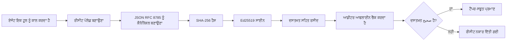
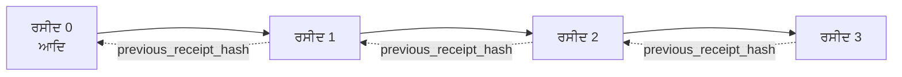

[ਪਾਠ ਵੀਡੀਓ ਦੇਖੋ: ਕ੍ਰਿਪਟੋਗ੍ਰਾਫਿਕ ਰਸੀਦਾਂ ਨਾਲ ਏਆਈ ਏਜੈਂਟਾਂ ਦੀ ਸੁਰੱਖਿਆ](https://youtu.be/PLACEHOLDER_VIDEO_ID)

> _(ਪਾਠ ਵੀਡੀਓ ਅਤੇ ਥੰਬਨੇਲ ਨੂੰ ਮਾਈਕ੍ਰੋਸੌਫਟ ਸਮੱਗਰੀ ਟੀਮ ਦੁਆਰਾ ਭੇਜਣ ਤੋਂ ਬਾਅਦ ਜੋੜਿਆ ਜਾਵੇਗਾ, ਜੋ ਪਾਠ 14 / 15 ਦੇ ਪੈਟਰਨ ਨਾਲ ਮੇਲ ਖਾਂਦਾ ਹੈ।)_

# ਕ੍ਰਿਪਟੋਗ੍ਰਾਫਿਕ ਰਸੀਦਾਂ ਨਾਲ ਏਆਈ ਏਜੈਂਟਾਂ ਦੀ ਸੁਰੱਖਿਆ

## ਜਾਣ-ਪਛਾਣ

ਇਹ ਪਾਠ ਕਵਰ ਕਰੇਗਾ:

- ਸਮਝਾਓ ਕਿ ਏਆਈ ਏਜੈਂਟਾਂ ਲਈ ਆਡਿਟ ਟਰੇਲ ਕਿਉਂ ਸੰਬੰਧਿਤ ਹੈ, ਜਿਵੇਂ ਕਿ ਅਨੁਕੂਲਤਾ, ਡੀਬੱਗਿੰਗ, ਅਤੇ ਭਰੋਸਾ।
- ਕ੍ਰਿਪਟੋਗ੍ਰਾਫਿਕ ਰਸੀਦ ਕੀ ਹੈ ਅਤੇ ਇਹ ਬਿਨਾਂ ਸਾਈਨ ਕੀਤੇ ਲੌਗ ਲਾਈਨ ਤੋਂ ਕਿਵੇਂ ਵੱਖਰਾ ਹੈ।
- ਇੱਕ ਏਜੈਂਟ ਦੇ ਟੂਲ ਕਾਲ ਲਈ ਸਾਈਨ ਕੀਤੀ ਗਈ ਰਸੀਦ ਨੂੰ ਸਾਦਾ ਪਾਇਥਨ ਵਿੱਚ ਕਿਵੇਂ ਤਿਆਰ ਕਰਨਾ ਹੈ।
- ਕਿਵੇਂ ਰਸੀਦ ਨੂੰ ਆਫਲਾਈਨ ਵੈਰਿਫਾਈ ਕਰਨਾ ਹੈ ਅਤੇ ਛੇੜਛਾਡ ਦੀ ਪਛਾਣ ਕਰਨੀ ਹੈ।
- ਰਸੀਦਾਂ ਨੂੰ ਕੜੀ ਵਿੱਚ ਜੋੜਨਾ ਤਾਂ ਜੋ ਇੱਕ ਨੂੰ ਹਟਾਉਣ ਜਾਂ ਰੀ-ਆਰਡਰ ਕਰਨ ਨਾਲ ਕੜੀ ਟੁੱਟ ਜਾਏ।
- ਰਸੀਦ ਕੀ ਸਾਬਤ ਕਰਦੀਆਂ ਹਨ ਅਤੇ ਉਹ ਕਿੱਸੇ ਗੱਲ ਦਾ ਸਪੱਸ਼ਟ ਪ੍ਰਭਾਵ ਨਹੀਂ ਰੱਖਦੀਆਂ।

## ਸਿੱਖਣ ਦੇ ਲਛਣ

ਇਸ ਪਾਠ ਨੂੰ ਪੂਰਾ ਕਰਨ ਤੋਂ ਬਾਅਦ, ਤੁਸੀਂ ਜਾਣੋਗੇ ਕਿ:

- ਉਹ ਅਸਫਲਤਾ ਦੇ ਮੋਡਜ਼ ਕਿਹੜੇ ਹਨ ਜੋ ਏਜੈਂਟ ਕਾਰਵਾਈਆਂ ਲਈ ਕ੍ਰਿਪਟੋਗ੍ਰਾਫਿਕ ਮੂਲਤਾ ਨੂੰ ਪ੍ਰੇਰਿਤ ਕਰਦੇ ਹਨ।
- ਕੈਨੋਨਿਕਲ JSON ਪੇਲੋਡ 'ਤੇ Ed25519-ਸਾਈਨ ਕੀਤੀ ਗਈ ਰਸੀਦ ਕਿਵੇਂ ਤਿਆਰ ਕਰਨੀ ਹੈ।
- ਸਿਰਫ ਸਾਈਨ ਕਰਨ ਵਾਲੇ ਦਾ ਪਬਲਿਕ ਕੀ ਵਰਤਕੇ ਰਸੀਦ ਨੂੰ ਸੁਤੰਤਰ ਤੌਰ 'ਤੇ ਕਿਵੇਂ ਵੈਰਿਫਾਈ ਕਰਨਾ ਹੈ।
- ਤਬਦੀਲੀ ਦਾ ਪਤਾ ਲਗਾਉਣ ਲਈ ਸੰਸ਼ੋਧਿਤ ਰਸੀਦ ਉੱਤੇ ਪੜਤਾਲ ਦੁਬਾਰਾ ਚਲਾਉਣ。
- ਰਸੀਦਾਂ ਦੀ ਹੈਸ਼-ਚੇਨ ਕੁੜੀ ਬਣਾਉਣਾ ਅਤੇ ਸਮਝਾਉਣਾ ਕਿ ਇਹ ਚੇਨ ਕਿਉਂ ਮਹੱਤਵਪੂਰਨ ਹੈ।
- ਸਮਝਣਾ ਕਿ ਰਸੀਦਾਂ ਕੀ ਸਾਬਤ ਕਰਦੀਆਂ ਹਨ (ਅੰਸ਼ਗ੍ਰਹਿਤਾ, ਅਖੰਡਤਾ, ਕ੍ਰਮ) ਅਤੇ ਉਹ ਕੀ ਸਬੂਤ ਨਹੀਂ ਦਿੰਦੀਆਂ (ਕਾਰਵਾਈ ਦੀ ਸਹੀਤਾ, ਨੀਤੀ ਦੀ ਧਰਮਤਾ)।

## ਸਮੱਸਿਆ: ਤੁਹਾਡੇ ਏਜੈਂਟ ਦਾ ਆਡਿਟ ਟਰੇਲ

ਕਲਪਨਾ ਕਰੋ ਕਿ ਤੁਸੀਂ Contoso Travel ਲਈ ਇੱਕ ਏਆਈ ਏਜੈਂਟ ਤੈਨਾਤ ਕੀਤਾ ਹੈ। ਇਹ ਏਜੈਂਟ ਗ੍ਰਾਹਕਾਂ ਦੀਆਂ ਬੇਨਤੀਆਂ ਪੜ੍ਹਦਾ ਹੈ, ਫਲਾਈਟਸ ਏਪੀਆਈ ਕਾਲ ਕਰਕੇ ਵਿਕਲਪ ਵੇਖਦਾ ਹੈ, ਅਤੇ ਗ੍ਰਾਹਕ ਵਲੋਂ ਸੀਟਾਂ ਬੁੱਕ ਕਰਦਾ ਹੈ। ਪਿਛਲੇ ਤਿਮਾਹੀ ਵਿੱਚ, ਏਜੈਂਟ ਨੇ 50,000 ਬੁੱਕਿੰਗ ਪ੍ਰਕਿਰਿਆ ਕੀਤੀਆਂ।

ਅੱਜ ਇੱਕ ਆਡੀਟਰ ਆਇਆ। ਉਹ ਸਾਦਾ ਸਵਾਲ ਕਰਦਾ ਹੈ: "ਮੈਨੂੰ ਦਿਖਾਓ ਕਿ ਤੁਹਾਡੇ ਏਜੈਂਟ ਨੇ ਕੀ ਕੀਤਾ।"

ਤੁਸੀਂ ਆਪਣੇ ਲੌਗ ਫ਼ਾਈਲਜ਼ ਦੇ ਦਿੰਦੇ ਹੋ। ਆਡੀਟਰ ਉਹਨਾਂ ਨੂੰ ਵੇਖਦਾ ਹੈ ਅਤੇ ਮਸ਼ਕਲ ਸਵਾਲ ਕਰਦਾ ਹੈ: "ਮੈਨੂੰ ਕਿਵੇਂ ਪਤਾ ਕਿ ਇਹ ਲੌਗ ਸੋਧੇ ਨਹੀਂ ਗਏ?"

ਇਹ ਆਡਿਟ-ਟਰੇਲ ਸਮੱਸਿਆ ਹੈ। ਅੱਜਕੱਲ੍ਹ ਜ਼ਿਆਦਾਤਰ ਏਜੈਂਟ ਡਿਪਲੌਏਮੈਂਟਸ ਦੁਆਰਾ ਭਰੋਸਾ ਲਿਆ ਜਾਂਦਾ ਹੈ:

- **ਐਪਲੀਕੇਸ਼ਨ ਲੌਗਜ਼**: ਏਜੈਂਟ ਦੁਆਰਾ ਲਿਖੇ ਗਏ, ਜਿਹਨਾਂ ਨੂੰ ਕਿਸੇ ਵੀ ਫਾਇਲ-ਸਿਸਟਮ ਐਕਸੈਸ ਵਾਲੇ ਵਿਅਕਤੀ ਵੱਲੋਂ ਸੋਧਿਆ ਜਾ ਸਕਦਾ ਹੈ।
- **ਕਲਾਉਡ ਲੌਗਿੰਗ ਸੇਵਾਵਾਂ**: ਪਲੇਟਫਾਰਮ ਪੱਧਰ 'ਤੇ ਛੇੜਛਾੜ ਦਿਖਾਉਂਦੀਆਂ ਹਨ ਪਰ ਸਿਰਫ ਜਦੋਂ ਆਡੀਟਰ ਪਲੇਟਫਾਰਮ ਓਪਰੇਟਰ ਉੱਤੇ ਭਰੋਸਾ ਕਰਦਾ ਹੈ।
- **ਡੇਟਾਬੇਜ਼ ਟ੍ਰਾਂਜ਼ੈਕਸ਼ਨ ਲੌਗਜ਼**: ਡੇਟਾਬੇਜ਼ ਬਦਲਾਵਾਂ ਲਈ ਉਚਿਤ ਪਰ ਬਿਨਾਂ ਵਜ੍ਹਾ ਟੂਲ ਕਾਲਾਂ ਲਈ ਨਹੀਂ।

ਇਹਨਾਂ ਵਿੱਚੋਂ ਕੋਈ ਵੀ ਸਵਾਲ ਦਾ ਜਵਾਬ ਨਹੀਂ ਦੇ ਸਕਦਾ ਬਿਨਾਂ ਕਿਸੇ ਵਿਅਕਤੀ (ਤੁਸੀਂ, ਤੁਹਾਡਾ ਕਲਾਉਡ ਪ੍ਰਦਾਤਾ, ਤੁਹਾਡਾ ਡੇਟਾਬੇਜ਼ ਵੇਂਡਰ) ਉੱਤੇ ਭਰੋਸਾ ਕੀਤੇ। ਅੰਦਰੂਨੀ ਉਪਯੋਗ ਲਈ, ਇਹ ਭਰੋਸਾ ਕਬੂਲਯੋਗ ਹੋ ਸਕਦਾ ਹੈ। ਪਰ ਨਿਯੰਤਰਿਤ ਕੰਮਾਂ ਲਈ (ਵਿੱਤ, ਸਿਹਤ ਸੰਭਾਲ, EU ਏਆਈ ਐਕਟ ਅਧੀਨ), ਇਹ ਸਹੀ ਨਹੀਂ।

ਕ੍ਰਿਪਟੋਗ੍ਰਾਫਿਕ ਰਸੀਦਾਂ ਇਹ ਇਸ ਤਰ੍ਹਾਂ ਹੱਲ ਕਰਦੀਆਂ ਹਨ ਕਿ ਹਰ ਏਜੈਂਟ ਕਾਰਵਾਈ ਨੂੰ ਸੁਤੰਤਰ ਤੌਰ 'ਤੇ ਵੈਰਿਫਾਈ ਕੀਤਾ ਜਾ ਸਕਦਾ ਹੈ। ਆਡੀਟਰ ਨੂੰ ਤੁਹਾਡੇ ਉੱਤੇ ਭਰੋਸਾ ਕਰਨ ਦੀ ਲੋੜ ਨਹੀਂ। ਉਹਨੂੰ ਸਿਰਫ ਤੁਹਾਡਾ ਪਬਲਿਕ ਕੀ ਅਤੇ ਰਸੀਦ ਦੀ ਲੋੜ ਹੈ।

## ਕ੍ਰਿਪਟੋਗ੍ਰਾਫਿਕ ਰਸੀਦ ਕੀ ਹੈ?

ਰਸੀਦ ਇੱਕ JSON ਵਸਤੂ ਹੈ ਜੋ ਦਰਜ ਕਰਦੀ ਹੈ ਕਿ ਏਜੈਂਟ ਨੇ ਕੀ ਕੀਤਾ, ਅਤੇ ਇਹ ਡਿਜੀਟਲ ਦਸਤਖਤ ਨਾਲ ਸਾਈਨ ਕੀਤੀ ਜਾਂਦੀ ਹੈ।


  
ਇੱਕ ਨਿਊਨਤਮ ਰਸੀਦ ਇਸ ਤਰ੍ਹਾਂ ਦਿਖਦੀ ਹੈ:

```json
{
  "type": "agent.tool_call.v1",
  "agent_id": "contoso-travel-bot",
  "tool_name": "lookup_flights",
  "tool_args_hash": "sha256:a3f9c1...",
  "result_hash": "sha256:7b2e1d...",
  "policy_id": "contoso-travel-policy-v3",
  "timestamp": "2026-04-25T14:30:00Z",
  "sequence": 47,
  "previous_receipt_hash": "sha256:9d4e6a...",
  "signature": {
    "alg": "EdDSA",
    "sig": "c5af83...",
    "public_key": "8f3b2c..."
  }
}
```
  
ਤਿੰਨ ਗੁਣ ਰਸੀਦ ਨੂੰ ਕੰਮ ਕਰਾਉਂਦੇ ਹਨ:

1. **ਦਸਤਖਤ**। ਰਸੀਦ ਏਜੈਂਟ ਦੇ ਗੇਟਵੇ ਦੁਆਰਾ Ed25519 ਪ੍ਰਾਈਵੇਟ ਕੀ ਨਾਲ ਸਾਈਨ ਕੀਤੀ ਜਾਂਦੀ ਹੈ। ਜੋ ਕੋਈ ਵੀ ਸਬੰਧਤ ਪਬਲਿਕ ਕੀ ਰੱਖਦਾ ਹੈ ਉਹ ਸਾਈਨ ਨੂੰ ਆਫਲਾਈਨ ਵੈਰਿਫਾਈ ਕਰ ਸਕਦਾ ਹੈ। ਕਿਸੇ ਵੀ ਖੇਤਰ ਦੀ ਛੇੜਛਾੜ ਸਾਈਨ ਨੂੰ ਅвалид ਕਰ ਦਿੰਦੀ ਹੈ।

2. **ਕੈਨੋਨਿਕਲ ਐਨਕੋਡਿੰਗ**। ਸਾਈਨ ਕਰਨ ਤੋਂ ਪਹਿਲਾਂ, ਰਸੀਦ ਨੂੰ JSON Canonicalization Scheme (JCS, RFC 8785) ਦੀ ਵਰਤੋਂ ਕਰਕੇ ਸੀਰੀਅਲਾਈਜ਼ ਕੀਤਾ ਜਾਂਦਾ ਹੈ। ਇਸ ਨਾਲ ਇਹ ਯਕੀਨੀ ਬਣਦਾ ਹੈ ਕਿ ਦੋ ਵੱਖ-ਵੱਖ ਇੰਪਲੀਮੇਂਟੇਸ਼ਨਾਂ ਦੁਆਰਾ ਉਹੀ ਲੌਜਿਕਲ ਰਸੀਦ ਇੱਕੋ ਜਿਹਾ ਬਾਈਟ ਨਿਕਾਸ ਤੇ ਤਿਆਰ ਹੁੰਦੀ ਹੈ। ਕੈਨੋਨਿਕਲਾਈਜ਼ੇਸ਼ਨ ਬਿਨਾਂ ਵੱਖ-ਵੱਖ ਜੇਐਸਓਐਨ ਸੀਰੀਅਲਾਈਜ਼ਰ ਵੱਖ-ਵੱਖ ਸਕਿਚਰ ਬਣਾਉਂਦੇ।

3. **ਹੈਸ਼-ਚੇਨਿੰਗ**। `previous_receipt_hash` ਖੇਤਰ ਹਰ ਰਸੀਦ ਨੂੰ ਉਸ ਨਾਲ ਪਿਛਲੀ ਰਸੀਦ ਨਾਲ ਜੋੜਦਾ ਹੈ। ਇੱਕ ਰਸੀਦ ਨੂੰ ਹਟਾਉਣ ਜਾਂ ਪੁਨਰ-ਕ੍ਰਮ ਕਰਨ ਨਾਲ ਉਸ ਤੋਂ ਬਾਅਦ ਵਾਲੀਆਂ ਸਬ ਰਸੀਦਾਂ ਟੁੱਟ ਜਾਂਦੀਆਂ ਹਨ। ਛੇੜਛਾੜ ਚੇਨ ਪੱਧਰ 'ਤੇ ਸਪਸ਼ਟ ਹੋ ਜਾਂਦੀ ਹੈ ਭਾਵੇਂ ਵੱਖ-ਵੱਖ ਦਸਤਖਤਾਂ ਨੂੰ ਬਾਈਪ ਕੀਤਾ ਜਾਵੇ।

ਇਹ ਤਿੰਨ ਗੁਣ ਮਿਲ ਕੇ ਤਿੰਨ ਗਾਰੰਟੀਜ਼ ਦਿੰਦੇ ਹਨ:

- **ਅੰਸ਼ਗ੍ਰਹਿਤਾ**: ਇਹ ਕੀ ਇਸ ਸਮੱਗਰੀ ਨੂੰ ਸਾਈਨ ਕਰਦਾ ਹੈ।
- **ਅਖੰਡਤਾ**: ਸਮੱਗਰੀ ਸਾਈਨ ਕਰਨ ਤੋਂ ਬਾਅਦ ਨਹੀਂ ਬਦਲੀ ਗਈ।
- **ਕ੍ਰਮ**: ਇਹ ਰਸੀਦ ਚੇਨ ਵਿੱਚ ਉਸ ਰਸੀਦ ਤੋਂ ਬਾਅਦ ਆਉਂਦੀ ਹੈ।

## ਪਾਇਥਨ ਵਿੱਚ ਰਸੀਦ ਤਿਆਰ ਕਰਨਾ

ਰਸੀਦ ਤਿਆਰ ਕਰਨ ਲਈ ਤੁਹਾਨੂੰ ਕੋਈ ਵਿਸ਼ੇਸ਼ ਲਾਇਬ੍ਰੇਰੀ ਦੀ ਲੋੜ ਨਹੀਂ। ਕ੍ਰਿਪਟੋਗ੍ਰਾਫਿਕ ਪ੍ਰਿਮਿਟਿਵਜ਼ ਵਿਆਪਕ ਤੌਰ 'ਤੇ ਉਪਲਬਧ ਹਨ ਅਤੇ ਲਾਜਿਕ ਕੁਝ ਦਹਾਈਆਂ ਕਤਾਰਾਂ ਦਾ ਪਾਇਥਨ ਹੈ।

`code_samples/18-signed-receipts.ipynb` ਵਿੱਚ ਹੈਂਡ-ਆਨ ਅਭਿਆਸ ਪੂਰੇ ਪ੍ਰਕਿਰਿਆ ਨੂੰ ਵੱਖ-ਵੱਖ ਕਦਮਾਂ ਵਿੱਚ ਸਿਖਾਉਂਦੇ ਹਨ। ਸਾਰ ਸੰਸਕਰਨ:

```python
import json
import hashlib
import base64
from nacl import signing
from jcs import canonicalize  # RFC 8785 ਕੈਨੋਨਿਕਲ JSON

def b64url_nopad(data: bytes) -> str:
    return base64.urlsafe_b64encode(data).decode("ascii").rstrip("=")

def sha256_canonical(obj) -> str:
    """SHA-256 of a Python object's JCS-canonical JSON form."""
    return f"sha256:{hashlib.sha256(canonicalize(obj)).hexdigest()}"

# ਇੱਕ ਸਾਇਨ ਕਰਨ ਵਾਲੀ ਕੁੰਜੀ ਬਣਾਓ ਜਾਂ ਲੋਡ ਕਰੋ (ਉਤਪਾਦਨ ਵਿੱਚ, ਇੱਕ ਕੁੰਜੀ ਵਾਲਟ ਵਿੱਚ ਸਟੋਰ ਕਰੋ)
signing_key = signing.SigningKey.generate()
verify_key = signing_key.verify_key

# ਰਸੀਦ ਪੇਲੋਡ ਬਣਾਓ (ਹੁਣ ਤੱਕ ਕੋਈ ਦਸਤਖਤ ਨਹੀਂ)
tool_args = {"origin": "SYD", "destination": "LAX"}
tool_result = [{"flight": "QF11", "price": 1850, "stops": 0}]

payload = {
    "type": "agent.tool_call.v1",
    "agent_id": "contoso-travel-bot",
    "tool_name": "lookup_flights",
    "tool_args_hash": sha256_canonical(tool_args),
    "result_hash": sha256_canonical(tool_result),
    "policy_id": "contoso-travel-policy-v3",
    "timestamp": "2026-04-25T14:30:00Z",
    "sequence": 0,
    "previous_receipt_hash": None,
}

# ਕੈਨੋਨਿਕਲ ਕਰਨਾ, ਹੈਸ਼ ਕਰਨਾ, ਸਾਇਨ ਕਰਨਾ।
canonical_bytes = canonicalize(payload)
message_hash = hashlib.sha256(canonical_bytes).digest()
signature_bytes = signing_key.sign(message_hash).signature

# ਇੱਕ ਬਣਤਰਵਾਦ ਸਾਇਨਚਿੱਠੀ ਵਸਤੂ ਜੋੜੋ।
receipt = {
    **payload,
    "signature": {
        "alg": "EdDSA",
        "sig": b64url_nopad(signature_bytes),
        "public_key": b64url_nopad(bytes(verify_key)),
    },
}
```
  
ਇਹ ਸਾਹਮਣੇ ਸਾਈਨਿੰਗ ਪਾਈਪਲਾਈਨ ਹੈ। ਨੋਟਬੁੱਕ ਵਿੱਚ ਹਰ ਕਦਮ ਦੀ ਵਿਆਖਿਆ ਕੀਤੀ ਗਈ ਹੈ।

## רਸੀਦ ਦੀ ਜਾਂਚ ਅਤੇ ਛੇੜਛਾੜ ਦਾ ਪਤਾ ਲਗਾਉਣਾ

ਵੈਰਿਫਿਕੇਸ਼ਨ ਉਲਟ ਪ੍ਰਕਿਰਿਆ ਹੈ:

```python
import base64
import hashlib
from nacl import signing
from nacl.exceptions import BadSignatureError
from jcs import canonicalize

def b64url_decode(s: str) -> bytes:
    padding = "=" * ((4 - len(s) % 4) % 4)
    return base64.urlsafe_b64decode(s + padding)

def verify_receipt(receipt: dict) -> bool:
    # ਸਾਈਨেচਰ ਇੱਕ ਸਾਂਚਾਬੱਧ ਔਬਜੈਕਟ ਹੈ: {"alg", "sig", "public_key"}.
    sig_obj = receipt.get("signature")
    if not sig_obj or sig_obj.get("alg") != "EdDSA":
        return False

    # ਉਹ ਪੇਲੋਡ ਮੁੜ ਬਣਾਓ ਜੋ ਹਕੀਕਤ ਵਿੱਚ ਸਾਈਨ ਕੀਤਾ ਗਿਆ ਸੀ (ਸਾਈਨেচਰ ਦੇ ਇਲਾਵਾ ਸਭ ਕੁਝ).
    payload = {k: v for k, v in receipt.items() if k != "signature"}

    canonical_bytes = canonicalize(payload)
    message_hash = hashlib.sha256(canonical_bytes).digest()

    try:
        verify_key = signing.VerifyKey(b64url_decode(sig_obj["public_key"]))
        verify_key.verify(message_hash, b64url_decode(sig_obj["sig"]))
        return True
    except BadSignatureError:
        return False
```
  
ਇਹ ਫੰਕਸ਼ਨ ਇੱਕ ਰਸੀਦ ਲੈਂਦਾ ਹੈ ਅਤੇ ਜੇ ਦਸਤਖਤ ਸਹੀ ਹੋਵੇ ਤਾਂ `True` ਵਾਪਸ ਕਰਦਾ ਹੈ, ਨਹੀਂ ਤਾਂ `False`। ਕੋਈ ਨੈੱਟਵਰਕ ਕਾਲ, ਕੋਈ ਸੇਵਾ ਨਿਰਭਰਤਾ ਨਹੀਂ, ਕੋਈ ਤੀਜੇ ਪੱਖ ਉੱਤੇ ਭਰੋਸਾ ਨਹੀਂ।

ਛੇੜਛਾੜ ਪਤਾ ਲਗਾਉਣ ਲਈ ਨੋਟਬੁੱਕ ਵਿੱਚ ਦਿਖਾਇਆ ਗਿਆ ਹੈ:

1. ਇੱਕ ਵੈਧ ਰਸੀਦ ਤਿਆਰ ਕਰਨੀ ਅਤੇ ਉਸ ਦੀ ਪੁਸ਼ਟੀ ਕਰਨੀ ਕਿ ਇਹ ਵੈਰਿਫਾਈ ਹੋ ਜਾਂਦੀ ਹੈ।
2. `tool_args_hash` ਖੇਤਰ ਦਾ ਇੱਕ ਬਾਈਟ ਸੋਧਣਾ।
3. ਵੈਰਿਫਿਕੇਸ਼ਨ ਮੁੜ ਚਲਾਉਣਾ ਅਤੇ ਅਸਫਲ ਹੋ ਜਾਣਾ ਵੇਖਣਾ।

ਇਹ ਪ੍ਰੈਕਟਿਕਲ ਦਰਸਾਉਂਦਾ ਹੈ ਕਿ ਰਸੀਦਾਂ ਛੇੜਛਾੜ-ਸਾਬਤ ਹਨ: ਕੋਈ ਵੀ ਸੋਧ ਚਾਹੇ ਛੋਟੀ ਜੇਹੀ ਹੋਵੇ, ਦਸਤਖਤ ਟੁੱਟ ਜਾਂਦੀ ਹੈ।

## ਬਹੁ-ਕਦਮੀ ਏਜੈਂਟਾਂ ਲਈ ਰਸੀਦਾਂ ਦੀ ਕੜੀ ਬਣਾਉਣਾ

ਇੱਕ ਇਕੱਲੀ ਸਾਈਨ ਕੀਤੀ ਰਸੀਦ ਇੱਕ ਕਾਰਵਾਈ ਦੀ ਰੱਖਿਆ ਕਰਦੀ ਹੈ। ਰਸੀਦਾਂ ਦੀ ਇੱਕ ਕੜੀ ਇੱਕ ਕ੍ਰਮ ਦੀ ਰੱਖਿਆ ਕਰਦੀ ਹੈ।


  
ਹਰ ਰਸੀਦ ਪਿਛਲੀ ਰਸੀਦ ਦੇ ਹੈਸ਼ ਨੂੰ ਦਰਜ ਕਰਦੀ ਹੈ। ਚੁਪਚਾਪ ਰਸੀਦ 2 ਨੂੰ ਹਟਾਉਣ ਲਈ, ਇੱਕ ਆਕਰਮਣਕਰਤਾ ਨੂੰ ਜਾਂ ਤਾਂ:

- ਰਸੀਦ 3 ਦੇ `previous_receipt_hash` ਖੇਤਰ ਨੂੰ ਸੋਧਣਾ ਪਵੇਗਾ (ਜੋ ਰਸੀਦ 3 ਦੇ ਦਸਤਖਤ ਨੂੰ ਅਮਾਨਯ ਕਰ ਦੇਵੇਗਾ), ਜਾਂ
- ਸੋਧੀ ਹੋਈ ਰਸੀਦ 3 'ਤੇ ਨਵਾਂ ਦਸਤਖਤ ਬਣਾਉਣਾ (ਜਿਸ ਲਈ ਏਜੈਂਟ ਦੀ ਪ੍ਰਾਈਵੇਟ ਕੀ ਦੀ ਲੋੜ ਹੈ)।

ਜੇ ਪ੍ਰਾਈਵੇਟ ਕੀ ਹਾਰਡਵੇਅਰ ਕੀ ਵਾਲਟ ਵਿੱਚ ਹੈ ਅਤੇ ਤੁਸੀਂ ਹਰ ਰਸੀਦ ਨਾਲ ਪਬਲਿਕ ਕੀ ਪ੍ਰਕਾਸ਼ਿਤ ਕਰਦੇ ਹੋ, ਤਾਂ ਕੋਈ ਵੀ ਹਮਲਾ ਬਿਨਾਂ ਪਤਾ ਲਾਏ ਨਹੀਂ ਕੀਤਾ ਜਾ ਸਕਦਾ।

ਨੋਟਬੁੱਕ ਵਿੱਚ ਦਰਸਾਇਆ ਗਿਆ ਹੈ:

1. ਤਿੰਨ ਰਸੀਦਾਂ ਦੀ ਚੇਨ ਬਣਾਉਣਾ।
2. ਪ੍ਰਤੀਕ ਰਸੀਦ ਦੇ `previous_receipt_hash` ਨੂੰ ਪਿਛਲੀ ਰਸੀਦ ਦੇ ਅਸਲ ਹੈਸ਼ ਨਾਲ ਮੇਲ ਕਰਨਾ।
3. ਚੇਨ ਵਿਚੋਂ ਇੱਕ ਰਸੀਦ ਵਿਚ ਛੇੜਛਾੜ ਕਰਕੇ ਅਤੇ ਦਿਖਾਉਣਾ ਕਿ ਕੜੀ ਉਸ ਥਾਂ ਤੋਂ ਟੁੱਟ ਗਈ।

ਇਸ ਤਰ੍ਹਾਂ ਤੁਸੀਂ ਇੱਕ ਆਡਿਟ ਟਰੇਲ ਤਿਆਰ ਕਰਦੇ ਹੋ ਜੋ ਇੱਕ ਬਾਹਰੀ ਆਡੀਟਰ ਤੁਹਾਡੇ ਉੱਤੇ ਭਰੋਸਾ ਕੀਤੇ ਬਿਨਾਂ ਵੈਰਿਫਾਈ ਕਰ ਸਕਦਾ ਹੈ।

## ਰਸੀਦ ਕੀ ਸਾਬਤ ਕਰਦੀਆਂ ਹਨ (ਅਤੇ ਕੀ ਨਹੀਂ ਕਰਦੀਆਂ)

ਇਹ ਇਸ ਪਾਠ ਦਾ ਸਭ ਤੋਂ ਮਹੱਤਵਪੂਰਨ ਭਾਗ ਹੈ। ਰਸੀਦਾਂ ਸ਼ਕਤੀਸ਼ਾਲੀ ਹਨ ਪਰ ਉਨ੍ਹਾਂ ਦੀ ਸ਼ਕਤੀ ਸੀਮਿਤ ਹੈ।

**ਰਸੀਦ ਤਿੰਨ ਗੱਲਾਂ ਸਾਬਤ ਕਰਦੀਆਂ ਹਨ:**

1. **ਅੰਸ਼ਗ੍ਰਹਿਤਾ**: ਇੱਕ ਖਾਸ ਕੀ ਨੇ ਇੱਕ ਖਾਸ ਪੇਲੋਡ ਸਾਈਨ ਕੀਤਾ।
2. **ਅਖੰਡਤਾ**: ਪੇਲੋਡ ਸਾਈਨ ਕਰਨ ਤੋਂ ਬਾਅਦ ਨਹੀਂ ਬਦਲਿਆ।
3. **ਕ੍ਰਮ**: ਇਹ ਰਸੀਦ ਚੇਨ ਵਿੱਚ ਉਸ ਰਸੀਦ ਤੋਂ ਬਾਅਦ ਆਈ।

**ਰਸੀਦ ਨਹੀਂ ਸਾਬਤ ਕਰਦੀਆਂ:**

1. **ਸਹੀਤਾ**: ਏਜੈਂਟ ਦੀ ਕਾਰਵਾਈ ਸਹੀ ਸੀ। ਇੱਕ ਗਲਤ ਜਵਾਬ ਲਈ ਵੀ ਰਸੀਦ ਬਰਾਬਰ ਸਹੀ ਤਰੀਕੇ ਨਾਲ ਸਾਈਨ ਕੀਤੀ ਜਾ ਸਕਦੀ ਹੈ।
2. **ਨੀਤੀ ਦੀ ਪਾਲਣਾ**: `policy_id` ਵਿੱਚ ਦਿੱਤੀ ਨੀਤੀ ਵਾਸਤਵ ਵਿੱਚ ਜਾਂਚੀ ਗਈ ਸੀ ਜਾਂ ਨਹੀਂ, ਜਾਂ ਇਹ ਕਾਰਵਾਈ ਉਸ ਨੀਤੀ ਅਧੀਨ ਪ੍ਰਭਵੀ ਸੀ ਜਾਂ ਨਹੀਂ। ਰਸੀਦ ਦਰਜ ਕਰਦੀ ਹੈ ਕਿ ਕੀ ਦਾਅਵਾ ਕੀਤਾ ਗਿਆ, ਨਾ ਕਿ ਕੀ ਲਾਗੂ ਕੀਤਾ ਗਿਆ।
3. **ਕੀ ਤੋਂ ਪਰੇ ਪਛਾਣ**: ਰਸੀਦ ਕਹਿੰਦੀ ਹੈ "ਇਹ ਕੀ ਇਹ ਸਮੱਗਰੀ ਸਾਈਨ ਕਰਦੀ ਹੈ।" ਇਹ ਨਹੀਂ ਕਹਿੰਦੀ "ਇਸ ਮਨੁੱਖ ਨੇ ਇਹ ਅਧਿਕਾਰ ਦਿੱਤਾ।" ਕਿਸੇ ਵਿਅਕਤੀ ਜਾਂ ਸੰਸਥਾ ਨਾਲ ਕੀ ਜੋੜਨ ਲਈ ਵੱਖਰੀ ਪਛਾਣ ਢਾਂਚਾ ਲੋੜੀਂਦਾ ਹੈ (ਜਿਵੇਂ ਡਾਇਰੈਕਟਰੀ, ਪਬਲਿਕ ਕੀ ਰਜਿਸਟਰੀ)।
4. **ਇਨਪੁਟ ਦੀ ਸੱਚਾਈ**: ਜੇ ਏਜੈਂਟ ਨੂੰ ਮੈਨਿਪੁਲੇਟ ਕੀਤਾ ਗਿਆ ਪ੍ਰਾਂਪਟ ਮਿਲਦਾ ਹੈ ਅਤੇ ਉਹ ਅਨੁਸਾਰ ਕਾਰਵਾਈ ਕਰਦਾ ਹੈ, ਤਦ ਵੀ ਰਸੀਦ ਕਾਰਵਾਈ ਨੂੰ ਇਮਾਨਦਾਰੀ ਨਾਲ ਦਰਜ ਕਰਦੀ ਹੈ। ਰਸੀਦ ਇਨਪੁਟ ਵੈਲਿਡੇਸ਼ਨ ਦੀ ਥਾਂ ਨਹੀਂ।

ਇਹ ਸੀਮਾ ਦੋ ਕਾਰਨਾਂ ਲਈ ਮਹੱਤਵਪੂਰਨ ਹੈ:

- ਇਹ ਦੱਸਦੀ ਹੈ ਕਿ ਰਸੀਦ ਕਿਉਂ ਲਾਭਦਾਇਕ ਹੈ: ਏਜੈਂਟ ਦਾ ਵਿਹਾਰ ਆਡਿਟ ਕਰਨਯੋਗ ਅਤੇ ਛੇੜਛਾੜ-ਪ੍ਰਤੀਰੋਧੀ ਬਣਾਉਣਾ, ਭਾਵੇਂ ਸੰਸਥਾਗਤ ਹੱਦਾਂ ਤੋਂ ਇਲਾਵਾ।
- ਇਹ ਦੱਸਦੀ ਹੈ ਕਿ ਤੁਹਾਨੂੰ ਕਿਹੜੇ ਹੋਰ ਪਰਤਾਂ ਦੀ ਲੋੜ ਹੈ: ਇਨਪੁਟ ਵੈਲਿਡੇਸ਼ਨ (ਪਾਠ 6), ਨੀਤੀ ਦੀ ਲਾਗੂਆਮ (ਹੇਠਾਂ ਥੋੜ੍ਹਾ ਜਿਹਾ), ਅਤੇ ਪਛਾਣ ਢਾਂਚਾ (ਇਸ ਪਾਠ ਤੋਂ ਬਾਹਰ)।

ਇੱਕ ਆਮ ਗਲਤੀ ਇਹ ਸੋਚਣਾ ਹੈ ਕਿ "ਸਾਡੇ ਕੋਲ ਰਸੀਦਾਂ ਹਨ" ਮਤਲਬ "ਸਾਡੇ ਕੋਲ ਪਰਬੰਧਨ ਹੈ"। ਇਹ ਗਲਤ ਹੈ। ਰਸੀਦ ਇੱਕ ਬੁਨਿਆਦ ਹਨ। ਪਰਬੰਧਨ ਉਹ ਪ੍ਰਣਾਲੀ ਹੈ ਜੋ ਤੁਸੀਂ ਇਸ ਦੇ ਉੱਪਰ ਬਣਾਉਂਦੇ ਹੋ।

## ਉਤਪਾਦਨ ਸੰਬੰਧੀ ਹਵਾਲੇ

ਇਸ ਪਾਠ ਦੀ ਪਾਇਥਨ ਕੋਡ ਸੰਕੁਚਿਤ ਹੈ ਤਾਂ ਜੋ ਤੁਸੀਂ ਹਰ ਕਤਾਰ ਨੂੰ ਪੜ੍ਹ ਸਕੋ ਅਤੇ ਬਹੁਤ ਖਾਸ ਤੌਰ 'ਤੇ ਸਮਝ ਸਕੋ। ਉਤਪਾਦਨ ਵਿੱਚ ਤੁਸੀਂ ਦੋ ਵਿਕਲਪ ਰੱਖਦੇ ਹੋ:

1. **ਕ੍ਰਿਪਟੋਗ੍ਰਾਫਿਕ ਪ੍ਰਿਮਿਟਿਵਜ਼ 'ਤੇ ਸਿਧਾ ਬਣਾਓ।** ਉੱਪਰ ਦਿੱਤੇ 50 ਕਤਾਰਾਂ ਬਹੁਤ ਕਾਰਗਰ ਹਨ। PyNaCl (Ed25519) ਅਤੇ `jcs` ਪੈਕੇਜ (ਕੈਨੋਨਿਕਲ JSON) ਚੰਗੇ ਸੰਭਾਲੇ ਜਾਂਦੇ ਅਤੇ ਆਡੀਟ ਕੀਤੇ ਗਏ লাইਬ੍ਰੇਰੀਆਂ ਹਨ।

2. **ਉਤਪਾਦਨ ਰਸੀਦ ਲਾਇਬ੍ਰੇਰੀ ਦੀ ਵਰਤੋਂ ਕਰੋ।** ਕੁਝ ਖੁੱਲੇ ਸ੍ਰੋਤ ਪ੍ਰੋਜੈਕਟ ਇਨ੍ਹਾਂ ਨਾਲ ਹੋਰ ਫੀਚਰਾਂ (ਕੀ ਰੋਟੇਸ਼ਨ, ਬੈਚ ਵੈਰਿਫਿਕੇਸ਼ਨ, JWK ਸੈੱਟ ਵੰਡ, ਨੀਤੀ ਇੰਜਨ ਨਾਲ ਇੰਟਿਗ੍ਰੇਸ਼ਨ) ਦੇਣਗੇ:
   - ਇਸ ਪਾਠ ਵਿੱਚ ਵਰਤਿਆ ਗਿਆ ਰਸੀਦ ਫਾਰਮੈਟ IETF ਇੰਟਰਨੈੱਟ-ਡਰਾਫਟ (`draft-farley-acta-signed-receipts`) 'ਚ ਹੈ ਜੋ ਮਿਆਰੀਕਰਨ ਵਿੱਚ ਹੈ।
   - ਮਾਈਕ੍ਰੋਸੌਫਟ ਏਜੈਂਟ ਗਵਰਨੈਂਸ ਟੂਲਕਿਟ ਰਸੀਦਾਂ ਨੂੰ ਸਿਡਰ-ਆਧਾਰਿਤ ਨੀਤੀ ਫੈਸਲਿਆਂ ਨਾਲ ਜੋੜਦਾ ਹੈ; ਇਸ ਦਾ ਪ੍ਰਯੋਗ ਟਿਊਟੋਰਿਯਲ 33 ਵਿੱਚ ਵੇਖੋ।
   - `protect-mcp` (npm) ਅਤੇ `@veritasacta/verify` (npm) ਪੈਕੇਜ ਇਕ ਨੋਡ-ਅਧਾਰਿਤ ਰਸੀਦ ਸਾਈਨਿੰਗ ਅਤੇ ਆਫਲਾਈਨ ਵੈਰਿਫਿਕੇਸ਼ਨ ਲਈ ਹਨ ਜੋ ਕਿਸੇ ਵੀ MCP ਸਰਵਰ ਨੂੰ ਛੇੜਛਾੜ-ਪ੍ਰਤੀਰੋਧੀ ਆਡਿਟ ਟਰੇਲ ਨਾਲ ਢੱਕ ਸਕਦੇ ਹਨ।

ਆਪਣੇ ਆਪ JWT ਲਾਇਬ੍ਰੇਰੀ ਲਿਖਣ ਅਤੇ ਇਕ ਜਾਂਚੀ ਹੋਈ ਵਰਤੋਂ ਵਿੱਚ ਚੋਣ ਕਰਨ ਦੀ ਤਰ੍ਹਾਂ, ਇਹਨਾਂ ਵਿੱਚ ਭਿੰਨਤਾ ਹੈ: ਦੋਹਾਂ ਵਾਜਬ ਹਨ; ਲਾਇਬ੍ਰੇਰੀ ਸਮਾਂ ਬਚਾਉਂਦੀ ਹੈ ਅਤੇ ਆਡਿਟ ਸਤਹ ਘਟਾਉਂਦੀ ਹੈ; ਆਪਣੇ ਆਪ ਤੋਂ ਲਿਖਣਾ ਤੁਹਾਨੂੰ ਹਰ ਪ੍ਰਿਮਿਟਿਵ ਨੂੰ ਵੀਵਿਧਤ ਕਰਦਾ ਹੈ। ਇਹ ਪਾਠ ਆਪਣੇ ਆਪ ਤੋਂ ਲਿਖਣ ਦੀ ਰਾਹ ਦਿਖਾਉਂਦਾ ਹੈ ਤਾਂ ਜੋ ਤੁਹਾਡੇ ਕੋਲ ਦੋਹਾਂ ਲਈ ਬੁਨਿਆਦ ਹੋਵੇ।

## ਗਿਆਨ ਜਾਂਚ

ਅਭਿਆਸ ਅਭਿਆਸ 'ਤੇ ਜਾਣ ਤੋਂ ਪਹਿਲਾਂ ਆਪਣੀ ਸਮਝ ਦੀ ਪੜਚੋਲ ਕਰੋ।

**1. ਇੱਕ ਰਸੀਦ ਏਜੈਂਟ ਦੀ ਪ੍ਰਾਈਵੇਟ Ed25519 ਕੀ ਨਾਲ ਸਾਈਨ ਕੀਤੀ ਜਾਂਦੀ ਹੈ। ਆਡੀਟਰ ਕੋਲ ਸਿਰਫ ਪਬਲਿਕ ਕੀ ਹੈ। ਕੀ ਆਡੀਟਰ ਰਸੀਦ ਨੂੰ ਬਿਨਾਂ ਨੈੱਟਵਰਕ ਕਾਲ ਦੇ ਵੈਰਿਫਾਈ ਕਰ ਸਕਦਾ ਹੈ?**

<details>
<summary>ਜਵਾਬ</summary>

ਹਾਂ। Ed25519 ਵੈਰਿਫਿਕੇਸ਼ਨ ਲਈ ਸਿਰਫ ਪਬਲਿਕ ਕੀ ਅਤੇ ਸਾਈਨ ਕੀਤੇ ਬਾਈਟਾਂ ਦੀ ਲੋੜ ਹੁੰਦੀ ਹੈ। ਕੋਈ ਨੈੱਟਵਰਕ ਕਾਲ, ਕੋਈ ਸੇਵਾ ਨਿਰਭਰਤਾ ਨਹੀਂ। ਇਸ ਗੁਣ ਕਰਕੇ ਰਸੀਦਾਂ ਹਵਾ-ਪੜਦੀਯਾਂ, ਬਹੁ-ਸੰਸਥਾਈ, ਜਾਂ ਘੱਟ-ਭਰੋਸੇ ਵਾਲੇ ਆਡਿਟ ਸੈਟਿੰਗਜ਼ ਵਿੱਚ ਲਾਭਦਾਇਕ ਹਨ।
</details>

**2. ਇੱਕ ਹਮਲਾਵਰ ਨੇ ਰਸੀਦ ਦੇ `policy_id` ਖੇਤਰ ਵਿੱਚ ਸੋਧ ਕਰਕੇ ਇਕ ਹੋਰ ਆਗਿਆਪ੍ਰਦ ਨੀਤੀ ਵਾਲਾ ਦਾਅਵਾ ਕੀਤਾ। ਦਸਤਖਤ ਮੂਲ ਪੇਲੋਡ ਉੱਤੇ ਸੀ। ਵੈਰਿਫਿਕੇਸ਼ਨ ਦੌਰਾਨ ਕੀ ਹੁੰਦਾ ਹੈ?**

<details>
<summary>ਜਵਾਬ</summary>

ਵੈਰਿਫਿਕੇਸ਼ਨ ਅਸਫਲ ਹੋ ਜਾਂਦੀ ਹੈ। ਦਸਤਖਤ ਮੂਲ ਪੇਲੋਡ ਦੇ ਕੈਨੋਨਿਕਲ ਬਾਈਟਾਂ ਉੱਤੇ ਸੀ; ਕਿਸੇ ਖੇਤਰ ਦੀ ਸੋਧ ਨਾਲ ਕੈਨੋਨਿਕਲ ਬਾਈਟ ਬਦਲ ਜਾਂਦੇ ਹਨ ਜੋ SHA-256 ਹੈਸ਼ ਬਦਲਦਾ ਹੈ, ਇਸ ਕਾਰਨ ਦਸਤਖਤ ਗਲਤ ਹੋ ਜਾਂਦੀ ਹੈ। ਹਮਲਾਵਰ ਨੂੰ ਨਵਾਂ ਠੀਕ ਦਸਤਖਤ ਬਣਾਉਣ ਲਈ ਪ੍ਰਾਈਵੇਟ ਕੀ ਦੀ ਲੋੜ ਹੈ ਜੋ ਉਸਦੇ ਕੋਲ ਨਹੀਂ।
</details>

**3. ਰਸੀਦ ਵਿੱਚ ਕੱਚੇ ਤੱਤਾਂ (args) ਅਤੇ ਨਤੀਜੇ ਦੇ ਮੁਕਾਬਲੇ `tool_args_hash` ਅਤੇ `result_hash` ਸ਼ਾਮਲ ਕੀਤੇ ਗਏ ਹਨ ਕਿਉਂ?**

<details>
<summary>ਜਵਾਬ</summary>

ਦੋ ਕਾਰਨ। ਪਹਿਲਾ, ਰਸੀਦ ਨੂੰ ਸੰਗ੍ਰਹਿਤ ਜਾਂ ਪ੍ਰਸਾਰਿਤ ਕਰਨ ਦੌਰਾਨ ਸਾਡਾ ਲਕੜੀ ਸਮੱਗਰੀ (PII ਜਾਂ ਕਾਰੋਬਾਰੀ ਡੇਟਾ) ਲੀਕ ਹੋ ਸਕਦੀ ਹੈ। ਹੈਸ਼ਿੰਗ ਨਾਲ ਸਮੱਗਰੀ ਛੋਟੀ ਅਤੇ ਗੁਪਤ ਰਹਿੰਦੀ ਹੈ; ਆਡੀਟਰ ਜਾਂਚਦਾ ਹੈ ਕਿ ਹੈਸ਼ ਅਸਲ ਸਮੱਗਰੀ ਦੀ ਸਟੋਰ ਕੀਤੀ ਨਕਲ ਨਾਲ ਮੇਲ ਖਾਂਦਾ ਹੈ। ਦੂਜਾ, ਹੈਸ਼ਾਂ ਦੀ ਫਿਕਸਡ ਆਕਾਰ ਹੁੰਦੀ ਹੈ; ਹੈਸ਼ ਵਾਲੀ ਰਸੀਦ ਦਾ ਆਕਾਰ ਇਨਪੁਟ ਅਤੇ ਆਉਟਪੁਟ ਵਿੱਚ ਵੱਡੇ ਫਰਕ ਤੋਂ ਬਿਨਾਂ ਸੀਮਤ ਰਹਿੰਦਾ ਹੈ।
</details>

**4. `previous_receipt_hash` ਖੇਤਰ ਹਰ ਰਸੀਦ ਨੂੰ ਉਸ ਨਾਲ ਪਿਛਲੀ ਰਸੀਦ ਨਾਲ ਜੋੜਦਾ ਹੈ। ਜੇ ਇੱਕ ਹਮਲਾਵਰ ਚੇਨ ਦੇ ਮੱਧੋਂ ਚੁਪਚਾਪ ਇੱਕ ਰਸੀਦ ਹਟਾ ਦੇਵੇ, ਤਾਂ ਕੀ ਗਲਤ ਹੋ ਜਾਵੇਗਾ?**

<details>
<summary>ਜਵਾਬ</summary>

ਜੋ ਵੀ ਰਸੀਦ ਹਟਾਈ ਗਈ ਤੋਂ ਬਾਅਦ ਆਈਆਂ ਹਨ ਉਹਨਾਂ ਦੀ ਜੇਤੂ ਸਾਂਭ ਹੁੰਦੀ ਹੈ। ਉਹਨਾਂ ਦੇ `previous_receipt_hash` ਹੁਣ ਚੇਨ ਨਾਲ ਮੇਲ ਨਹੀਂ ਖਾਂਦੇ (ਕਿਉਂਕਿ ਜਿਸ ਰਸੀਦ ਨੂੰ ਉਨ੍ਹਾਂ ਨੇ ਦਰਸਾਇਆ ਸੀ ਉਹ ਮੌਜੂਦ ਨਹੀਂ ਥੀ, ਜਾਂ ਚੇਨ ਹੁਣ ਵੱਖਰੀ ਪਿਛਲੀ ਰਸੀਦ ਉੱਤੇ ਹੋ ਗਈ)। ਹਟਾਉਣ ਨੂੰ ਛੁਪਾਉਣ ਲਈ ਹਮਲਾਵਰ ਨੂੰ ਹਰ ਬਾਅਦ ਵਾਲੀ ਰਸੀਦ ਨੂੰ ਮੁੜ-ਦਸਤਖਤ ਕਰਨੀ ਪਵੇਗੀ ਜਿਸ ਲਈ ਪ੍ਰਾਈਵੇਟ ਕੀ ਚਾਹੀਦੀ ਹੈ।
</details>

**5. ਇੱਕ ਰਸੀਦ ਸਫਲਤਾਪੂਰਕ ਵੈਰਿਫਾਈ ਹੋ ਗਈ। ਕੀ ਇਹ ਸਾਬਤ ਕਰਦਾ ਹੈ ਕਿ ਏਜੈਂਟ ਦੀ ਕਾਰਵਾਈ ਸਹੀ ਸੀ, ਧਾਰਮਿਕ ਸੀ, ਜਾਂ ਨੀਤੀ ਦੀ ਪਾਲਣਾ ਕੀਤੀ?**

<details>
<summary>ਜਵਾਬ</summary>

ਨਹੀਂ। ਇੱਕ ਵੈਧ ਰਸੀਦ ਤਿੰਨ ਗੱਲਾਂ ਸਾਬਤ ਕਰਦੀ ਹੈ: ਅੰਸ਼ਗ੍ਰਹਿਤਾ (ਇਸ ਕੀ ਨੇ ਇਹ ਸਮੱਗਰੀ ਸਾਈਨ ਕੀਤੀ), ਅਖੰਡਤਾ (ਸਮੱਗਰੀ ਬਦਲੀ ਨਹੀਂ), ਅਤੇ ਕ੍ਰਮ (ਇਹ ਰਸੀਦ ਉਸ ਤੋਂ ਬਾਅਦ ਆਈ)। ਇਹ ਸਾਬਤ ਨਹੀਂ ਕਰਦੀ ਕਿ ਕਾਰਵਾਈ ਸਹੀ ਸੀ, `policy_id` ਵਿੱਚ ਨੀਤੀ ਨੂੰ ਵਾਸਤਵ ਵਿੱਚ ਜਾਂਚਿਆ ਗਿਆ ਜਾਂ ਨਹੀਂ, ਜਾਂ ਏਜੈਂਟ ਨੇ ਸਾਰੇ ਨਿਯਮ ਮਾਨੇ। ਰਸੀਦਾਂ ਏਜੈਂਟ ਦੇ ਵਰਤਾਰਨ ਨੂੰ ਆਡਿਟ ਕਰਨਯੋਗ ਬਣਾਉਂਦੀਆਂ ਹਨ, ਨਾ ਕਿ ਜ਼ਰੂਰੀ ਤੌਰ 'ਤੇ ਸਹੀ। ਇਹ ਪਾਠ ਵਿੱਚ ਸਭ ਤੋਂ ਮਹੱਤਵਪੂਰਨ ਹੱਦ ਹੈ।
</details>

## ਅਭਿਆਸ ਕਰਨਾ

`code_samples/18-signed-receipts.ipynb` ਖੋਲ੍ਹੋ ਅਤੇ ਸਾਰੇ ਚਾਰ ਭਾਗ ਪੂਰੇ ਕਰੋ:

1. **ਭਾਗ 1**: ਆਪਣੀ ਪਹਿਲੀ ਰਸੀਦ ਸਾਈਨ ਕਰੋ ਅਤੇ ਉਸਦੀ ਪੁਸ਼ਟੀ ਕਰੋ।
2. **ਭਾਗ 2**: ਰਸੀਦ ਨਾਲ ਛੇੜਛਾੜ ਕਰੋ ਅਤੇ ਵੇਰਿਫਿਕੇਸ਼ਨ ਵਿੱਚ ਫੇਲ ਸ਼ੁਮਾਰ ਕਰੋ।
3. **ਭਾਗ 3**: ਤਿੰਨ ਰਸੀਦਾਂ ਦੀ ਚੇਨ ਬਣਾਓ ਅਤੇ ਚੇਨ ਅਖੰਡਤਾ ਦੀ ਪੁਸ਼ਟੀ ਕਰੋ।
4. **ਭਾਗ 4**: ਮਾਈਕ੍ਰੋਸੌਫਟ ਏਜੈਂਟ ਫਰੇਮਵਰਕ ਨਾਲ ਬਣੇ ਏਜੈਂਟ ਉੱਤੇ ਇਹ ਪੈਟਰਨ ਲਗਾਓ: ਇੱਕ ਟੂਲ ਕਾਲ ਨੂੰ ਰਸੀਦ-ਸਾਈਨਿੰਗ ਨਾਲ ਲੈਪ ਕਰੋ, ਫਿਰ ਰਸੀਦ ਨੂੰ ਸੁਤੰਤਰ ਵੈਰਿਫਾਈ ਕਰੋ।

**ਵੱਡਾ ਚੈਲੇਂਜ 1:** ਆਪਣੀ ਪਸੰਦ ਦਾ ਹੋਰ ਖੇਤਰ ਜੋੜ ਕੇ ਰਸੀਦ ਸਕੀਮਾ ਨੂੰ ਵਧਾਓ (ਜਿਵੇਂ ਟ੍ਰੇਸਿੰਗ ਲਈ ਰਿਕਵੈਸਟ ID), ਕੈਨੋਨਿਕਲ ਸਾਈਨਿੰਗ ਲਾਜਿਕ ਨੂੰ ਅਪਡੇਟ ਕਰੋ, ਅਤੇ ਪੁਸ਼ਟੀ ਕਰੋ ਕਿ ਰਸੀਦ ਫਿਰ ਵੀ ਵੈਰਿਫਿਕੇਸ਼ਨ ਵਿੱਚ ਬਿਨਾ ਸਮੱਸਿਆ ਸਮਝੋ ਜਾਂਦੀ ਹੈ। ਫਿਰ ਖੇਤਰ ਨੂੰ ਸਾਈਨਿੰਗ ਤੋਂ ਬਾਅਦ ਸੋਧੋ ਅਤੇ ਵੇਖੋ ਕਿ ਵੈਰਿਫਿਕੇਸ਼ਨ ਅਸਫਲ ਹੋ ਜਾਂਦੀ ਹੈ। ਇਹ ਤੁਹਾਨੂੰ ਸਿੱਖਾਉਂਦਾ ਹੈ ਕਿ ਕੈਨੋਨਿਕਲ ਐਨਕੋਡਿੰਗ ਦੇ ਹਰ ਬਾਈਟ ਦਾ ਸਾਈਨਿੰਗ 'ਚ ਕਿਵੇਂ ਯੋਗਦਾਨ ਹੁੰਦਾ ਹੈ।
**ਸਟਰੈਚ ਚੈਲੇਂਜ 2:** ਆਪਣੀਆਂ ਦੋ ਰਸੀਦਾਂ ਨੂੰ SHA-256 ਹੈਸ਼ ਨਾਲ ਨਾਲ ਜੋੜੋ (ਉਨ੍ਹਾਂ ਦੇ ਪ੍ਰਮਾਣਿਕ ਬਾਈਟਾਂ ਨੂੰ ਇੱਕ ਨਿਰਣਾ ਕਰੋ ਵਾਲੇ ਕ੍ਰਮ ਵਿੱਚ ਜੋੜੋ) ਅਤੇ ਤੀਜੀ ਰਸੀਦ ਉੱਤੇ ਨਵੇਂ ਫੀਲਡ ਵਜੋਂ ਪ੍ਰਾਪਤ ਡਾਈਜੇਸਟ ਨੂੰ ਸੰਘਾਪਿਤ ਕਰੋ, ਫਿਰ ਇਸ ਨੂੰ ਸਾਈਨ ਕਰੋ। ਪੱਕਾ ਕਰੋ ਕਿ ਤਿੰਨੋ ਰਸੀਦਾਂ ਅਜੇ ਵੀ ਦੁਬਾਰਾ ਜਾਂਚ ਯੋਗ ਹਨ। ਤੁਸੀਂ ਸਿਰਫ ਇੱਕ ਕਦਮ ਵਾਲਾ ਸ਼ਾਮਲ ਕਰਨ ਦਾ ਸਾਬਤ ਤਿਆਰ ਕੀਤਾ ਹੈ: ਜੋ ਵੀ ਤੀਜੀ ਰਸੀਦ ਰੱਖਦਾ ਹੈ ਉਹ ਸਾਬਤ ਕਰ ਸਕਦਾ ਹੈ ਕਿ ਪਹਿਲੀਆਂ ਦੋ ਮੌਜੂਦ ਸਨ ਜਦ ਉਹ ਦਸਤਖਤ ਕੀਤੀ ਗਈ, ਬਿਨਾਂ ਉਨ੍ਹਾਂ ਦੀ ਸਮੱਗਰੀ ਖੁਲਾਸਾ ਕੀਤੇ। ਇਹ ਉਹ ਨਮੂਨਾ ਹੈ ਜੋ selective-disclosure ਰਸੀਦਾਂ ਵੱਡੇ ਪੱਧਰ 'ਤੇ ਵਰਤਦੀਆਂ ਹਨ (Merkle commitments, RFC 6962)।

## ਨਤੀਜਾ

ਕ੍ਰਿਪਟੋਗ੍ਰਾਫਿਕ ਰਸੀਦਾਂ ਏਆਈ ਏਜੰਟਾਂ ਨੂੰ ਇੱਕ ਅਡਿਟ ਟਰੇਲ ਦਿੰਦੀਆਂ ਹਨ ਜੋ:

- **ਆਪਣੇ ਆਪ ਸਬੂਤਯੋਗ**: ਜੇਕਰ ਕਿਸੇ ਵੀ ਪਾਰਟੀ ਕੋਲ ਪਬਲਿਕ ਕੀ ਹੈ ਤਾਂ ਉਹ ਬਿਨਾਂ ਕਿਸੇ ਸੇਵਾ ਨਿਰਭਰਤਾ ਦੇ ਸਬੂਤ ਕਰ ਸਕਦਾ ਹੈ।
- **ਚੋਰ-ਮੋਚ ਪ੍ਰਤੀਰੋਧੀ**: ਕਿਸੇ ਵੀ ਤਬਦੀਲੀ ਕਰਕੇ ਦਸਤਖਤ ਅਮਾਨਯੋਗ ਹੋ ਜਾਂਦਾ ਹੈ।
- **ਪੋਰਟੇਬਲ**: ਇੱਕ ਰਸੀਦ ਇੱਕ ਛੋਟਾ JSON ਫਾਇਲ ਹੈ; ਇਹ ਅਰਕਾਈਵ, ਪ੍ਰਸਾਰਿਤ, ਅਤੇ ਕਿਤੇ ਵੀ ਜਾਂਚਿਆ ਜਾ ਸਕਦਾ ਹੈ।
- **ਮਿਆਰੀ ਅਨੁਰੂਪ**: Ed25519 (RFC 8032), JCS (RFC 8785), ਅਤੇ SHA-256 'ਤੇ ਬਣਿਆ, ਸਾਰੇ ਪ੍ਰਚਲਿਤ ਪ੍ਰਮਿਤਿਵਸ।

ਇਹ ਇਨਪੁਟ ਸੱਚਾਈ ਜਾਂ ਨੀਤੀ ਲਾਗੂ ਕਰਨ ਜਾਂ ਪਛਾਣ ਢਾਂਚੇ ਲਈ ਬਦਲ ਨਹੀਂ ਹਨ। ਇਹ ਉਹਨਾਂ ਪਰਤਾਂ ਲਈ ਇੱਕ ਭੂਮਿਕਾ ਹਨ। ਜਦੋਂ ਤੁਸੀਂ ਨਿਯਮਤ ਵੋਟਰਕੋਡ ਵਿੱਚ ਏਜੰਟ ਤਾਇਨਾਤ ਕਰ ਰਹੇ ਹੋ, ਬਹੁ-ਸੰਗਠਨ ਕਾਰਜ ਪ੍ਰਵਾਹਾਂ ਵਿੱਚ ਜਾਂ ਕਿਸੇ ਵੀ ਸਥਿਤੀ ਵਿੱਚ ਜਿੱਥੇ ਭਵਿੱਖ ਦਾ ਅਡਿਟਰ ਤੁਹਾਡੇ ਉੱਤੇ ਭਰੋਸਾ ਨਹੀਂ ਕਰ ਸਕਦਾ, ਰਸੀਦਾਂ ਅਡਿਟ ਟਰੇਲ ਨੂੰ ਇਮਾਨਦਾਰ ਬਣਾਉਂਦੀਆਂ ਹਨ।

ਸਭ ਤੋਂ ਜਰੂਰੀ ਗੱਲ: ਰਸੀਦ ਸਾਬਤ ਕਰਦੀਆਂ ਹਨ ਕਿ ਕਿਸ ਨੇ ਕੀ ਕਿਹਾ, ਕਦੋਂ। ਇਹ ਸਾਬਤ ਨਹੀਂ ਕਰਦੀਆਂ ਕਿ ਜੋ ਕਿਹਾ ਉਹ ਸਚ ਜਾਂ ਸਹੀ ਸੀ। ਇਸ ਫਰਕ ਨੂੰ ਧਿਆਨ ਨਾਲ ਰੱਖੋ। ਇਹ ਇਮਾਨਦਾਰ ਪ੍ਰੋਵੈਨੈਂਸ ਪ੍ਰਣਾਲੀ ਅਤੇ ਗਲਤ ਫਹਿਮੀ ਪ੍ਰਣਾਲੀ ਵਿੱਚ ਅੰਤਰ ਹੈ।

## ਉਤਪਾਦਨ ਚੈਕਲਿਸਟ

ਜਦੋਂ ਤੁਸੀਂ ਇਸ ਪਾਠ ਤੋਂ ਅੱਗੇ ਵੱਧਣ ਲਈ ਤਿਆਰ ਹੋ ਅਤੇ ਰਸੀਦ-ਦਸਤਖਤ ਵਾਲੇ ਏਜੰਟਾਂ ਨੂੰ ਅਸਲੀ ਮਾਹੌਲ ਵਿੱਚ ਤਾਇਨਾਤ ਕਰਨ ਜਾ ਰਹੇ ਹੋ:

- [ ] **ਦਸਤਖਤ ਕਰਨ ਵਾਲਾ ਕੀ ਡਿਵੈਲਪਰ ਲੈਪਟੌਪ ਤੋਂ ਹਟਾਓ।** Azure Key Vault, AWS KMS, ਜਾਂ ਹਾਰਡਵੇਅਰ ਸੁਰੱਖਿਆ ਮੋਡੀਊਲ ਵਰਤੋ। ਤੁਹਾਡੇ ਰਸੀਦਾਂ 'ਤੇ ਸਾਈਨ ਕਰਨ ਵਾਲੀ ਪ੍ਰਾਈਵੇਟ ਕੀ ਕਦੇ ਵੀ ਸਰੋਤ ਨਿਯੰਤਰਣ ਜਾਂ ਐਪਲੀਕੇਸ਼ਨ ਮਸ਼ੀਨਾਂ 'ਤੇ ਸਪਸ਼ਟ ਟੈਕਸਟ ਵਿੱਚ ਨਹੀਂ ਰਹਿ ਸਕਦੀ।
- [ ] **ਜਾਂਚਣ ਵਾਲੀ ਪਬਲਿਕ ਕੀ ਨੂੰ ਪ੍ਰਕਾਸ਼ਿਤ ਕਰੋ।** ਅਡਿਟਰਾਂ ਨੂੰ ਆਫਲਾਈਨ ਜਾਂਚ ਕਰਨ ਲਈ ਚਾਹੀਦੀ ਹੈ। ਮਿਆਰੀ ਨਮੂਨਾ ਇੱਕ JWK ਸੈੱਟ ਹੈ ਇੱਕ ਮਸ਼ਹੂਰ URL ਉੱਤੇ (RFC 7517), ਜਿਵੇਂ `https://your-org.example.com/.well-known/agent-keys.json`।
- [ ] **ਚੇਨ ਨੂੰ ਬਾਹਰੀ ਤੌਰ 'ਤੇ ਐਂਕਰ ਕਰੋ।** ਸਮੇਂ-ਸਮੇਂ 'ਤੇ ਸਭ ਤੋਂ ਨਵਾਂ ਚੇਨ ਹੇਡ ਹੈਸ਼ ਇੱਕ ਟ੍ਰਾਂਸਪੇਰੰਸੀ ਲਾਗ (Sigstore Rekor, RFC 3161 ਟਾਈਮਸਟੈਂਪ ਪ੍ਰਮਾਣਿਕਾਰਕ, ਜਾਂ ਦੂਜਾ ਅੰਦਰੂਨੀ ਸਿਸਟਮ) ਵਿੱਚ ਲਿਖੋ ਤਾਂ ਜੋ ਬਾਹਰੀ ਪਾਰਟੀ ਪੁਸ਼ਟੀ ਕਰ ਸਕੇ "ਇਹ ਚੇਨ ਇਸ ਸਮੇਂ ਮੌਜੂਦ ਸੀ।"
- [ ] **ਰਸੀਦਾਂ ਨੂੰ ਅਪ-ਟੀਲ ਨਹੀਂ ਜਾਣ ਦੇਗਾ।** ਐਪੈਂਡ-ਓਨਲੀ ਬਲੌਬ ਸਟੋਰੇਜ (Azure Storage ਜਿਸ ਵਿੱਚ ਅਪਰਿਵਰਤਨੀਤ ਨੀਤੀਆਂ ਹਨ, AWS S3 Object Lock) ਵਿੱਚ ਅੰਦਰੂਨੀ ਲੋਕ ਨੂੰ ਸਟੋਰੇਜ ਸਤਰ 'ਤੇ ਇਤਿਹਾਸ ਦੁਬਾਰਾ ਲਿਖਣ ਤੋਂ ਰੋਕਦਾ ਹੈ।
- [ ] **ਰਿਟੇਨਸ਼ਨ ਬਾਰੇ ਫੈਸਲਾ ਕਰੋ।** ਬਹੁਤ ਸਾਰੇ ਅਨੁਕੂਲਤਾ ਨਿਯਮ ਕਈ ਸਾਲਾਂ ਦੀ ਰਿਟੇਂਸ਼ਨ ਲੋੜਦੇ ਹਨ। ਰਸੀਦ ਵਾਧਾ ਯੋਜਨਾ ਬਣਾਓ (ਹਰ ਰਸੀਦ ਲਗਭਗ 500 ਬਾਈਟ ਦਾ ਹੁੰਦੀ ਹੈ; ਇੱਕ ਏਜੰਟ ਜੋ ਹਰ ਦਿਨ 10 ਹਜ਼ਾਰ ਕਾਲ ਕਰਦਾ ਹੈ, ਲਗਭਗ 1.8 GB ਪ੍ਰਤੀ ਸਾਲ ਬਣਦਾ ਹੈ)।
- [ ] **ਦਸਤਾਵੇਜ਼ ਕਰੋ ਕਿ ਰਸੀਦ ਕੀ ਨਹੀਂ ਕਵਰ ਕਰਦੀਆਂ।** ਰਸੀਦ ਸਬੂਤ, ਅਖੰਡਤਾ, ਅਤੇ ਕ੍ਰਮ ਸਾਬਤ ਕਰਦੀਆਂ ਹਨ। ਤੁਹਾਡਾ ਰਨਬੁਕ ਸਪਸ਼ਟ ਤੌਰ ਤੇ ਗਿਣਤੀ ਕਰਨੀ ਚਾਹੀਦੀ ਹੈ ਕਿ ਹੋਰ ਕੌਂਟਰੋਲਜ਼ (ਇਨਪੁਟ ਵੈਰੀਫਿਕੇਸ਼ਨ, ਨੀਤੀ ਲਾਗੂ ਕਰਨ, ਰੇਟ ਲਿਮਿਟਿੰਗ, ਪਛਾਣ ਢਾਂਚਾ) ਤੁਹਾਡੇ ਸਰਕਾਰਪਤੀ ਰੁਝਾਨ ਵਿੱਚ ਰਸੀਦਾਂ ਨਾਲ ਨਾਲ ਕਿੱਥੇ ਖੜੇ ਹਨ।

### ਏਆਈ ਏਜੰਟਾਂ ਦੀ ਸੁਰੱਖਿਆ ਬਾਰੇ ਹੋਰ ਸਵਾਲ?

ਦੂਜੇ ਸਿੱਖਣ ਵਾਲਿਆਂ ਨਾਲ ਮਿਲਣ, ਆਫਿਸ আওਰਜ਼ ਵਿੱਚ ਰਹਿਣ ਅਤੇ ਆਪਣੇ ਏਆਈ ਏਜੰਟ ਸਵਾਲਾਂ ਦੇ ਜਵਾਬ ਲਈ [Microsoft Foundry Discord](https://aka.ms/ai-agents/discord) ਵਿੱਚ ਸ਼ਾਮਿਲ ਹੋਵੋ।

## ਇਸ ਪਾਠ ਤੋਂ ਅੱਗੇ

ਇਹ ਪਾਠ ਸਿਰਫ ਇੱਕ-ਰਸੀਦ ਸਾਈਨਿੰਗ ਅਤੇ ਹੈਸ਼-ਚੇਨ ਸਿੱਖਰਾਂ ਨੂੰ ਕਵਰ ਕਰਦਾ ਹੈ। ਇਕੋ ਜਿਹੇ ਪ੍ਰਮਿਤਿਵਸ ਹੋਰ ਵਧੇਰੇ ਸੁਧਰੇ ਹਲਾਤਾਂ ਵਿੱਚ ਜੁੜਦੇ ਹਨ ਜਿਹੜੇ ਤੁਹਾਡੇ ਸਰਕਾਰਪਤੀ ਨਜ਼ਰੀਏ ਦੇ ਵਿਕਾਸ ਨਾਲ ਤੁਹਾਨੂੰ ਮਿਲ ਸਕਦੇ ਹਨ:

- **Selective disclosure.** ਜਦੋਂ ਇੱਕ ਰਸੀਦ ਦੇ ਫੀਲਡਾਂ ਨੂੰ ਆਜ਼ਾਦੀ ਨਾਲ ਕਮੀਟ ਕੀਤਾ ਜਾਂਦਾ ਹੈ (RFC 6962-ਸ਼ੈਲੀ ਦਾ Merkle ਦਰੱਖਤ), ਤਾਂ ਤੁਸੀਂ ਕਿਸੇ ਖਾਸ ਅਡਿਟਰ ਨੂੰ ਖਾਸ ਫੀਲਡਾਂ ਦਿਖਾ ਸਕਦੇ ਹੋ ਅਤੇ ਬਾਕੀ ਬਿਨਾਂ ਖੁਲਾਸਾ ਕੀਤੇ ਅਸਲੀ ਰਹਿਣ ਦੀ ਪੁਸ਼ਟੀ ਕਰ ਸਕਦੇ ਹੋ। ਇਹ ਉਪਯੋਗੀ ਹੈ ਜਦੋਂ ਇੱਕ ਰਸੀਦ ਨੂੰ ਦੁਹਾਂਣੇ ਇਕੱਠੇ ਆਡਿਟ (ਜੋ ਪੂਰਨਤਾ ਚਾਹੀਦਾ ਹੈ) ਅਤੇ ਡਾਟਾ ਘਟਾਊ ਕਾਨੂੰਨ ਜਿਵੇਂ GDPR (ਜੋ ਅਡਿਟਰ ਨੂੰ ਘੱਟ ਤੋਂ ਘੱਟ ਦੇਖਣਾ ਚਾਹੀਦਾ ਹੈ) ਦੀ ਪੂਰੀਆਂ ਕਰਨ ਦੀ ਲੋੜ ਹੁੰਦੀ ਹੈ।
- **ਰਸੀਦ ਰੱਦ ਕਰਨ।** ਜੇ ਸਾਈਨ ਕਰਨ ਵਾਲਾ ਕੀ ਖ਼ਤਰੇ ਵਿੱਚ ਆ ਜਾਂਦਾ ਹੈ, ਤੁਹਾਨੂੰ ਇੱਕ ਤਰੀਕਾ ਚਾਹੀਦਾ ਹੈ ਕਿ ਉਸ ਕੀ ਨਾਲ ਦਸਤਖਤ ਹੋਈ ਸਾਰੀਆਂ ਰਸੀਦਾਂ ਨੂੰ ਇਕ ਨਿਸ਼ਚਿਤ ਸਮੀ ਸਮੇਂ ਤੋਂ ਭਰੋਸਾ ਗੁਮਾਣ ਵਾਲੀਆਂ ਮੰਨਿਆ ਜਾਵੇ। ਮਿਆਰੀ ਤਰੀਕੇ: ਛੋਟੀ ਮਿਆਦ ਵਾਲੇ ਸਾਈਨਿੰਗ ਕੀ ਅਤੇ ਪ੍ਰਕਾਸ਼ਿਤ ਰੱਦ ਸੂਚੀ, ਜਾਂ ਰੱਦ ਕਰਨ ਵਾਲੀਆਂ ਐਨਟਰੀਜ਼ ਵਾਲਾ ਇੱਕ ਟ੍ਰਾਂਸਪੇਰੰਸੀ ਲਾਗ।
- **ਬilateral / split-signature receipts.** ਕੁਝ ਲਾਗੂ ਕਰਨ ਵਾਲੇ ਦਸਤਖਤ ਕੀਤੇ ਪੇਲੋਡ ਨੂੰ ਪੂਰਵ-ਕਾਰਜ (`authorization_*`) ਅਤੇ ਪਿਛਲੇ-ਕਾਰਜ (`result_*`) ਅੱਧੇ ਹਿੱਸੇ ਵਿੱਚ ਵੰਡਦੇ ਹਨ, ਜਿਨ੍ਹਾਂ ਦੀਆਂ ਅਲੱਗ ਅਲੱਗ ਦਸਤਖਤਾਂ ਹੁੰਦੀਆਂ ਹਨ, ਜੋ ਉਸ ਵੇਲੇ ਲਾਭਦਾਇਕ ਹੈ ਜਦੋਂ ਅਧਿਕਾਰ ਨਿਰਣਯ ਅਤੇ ਦੇਖੇ ਗਏ ਨਤੀਜੇ ਵੱਖ ਵੱਖ ਅਦਾਕਾਰਾਂ ਵੱਲੋਂ ਜਾਂ ਵੱਖ ਵੱਖ ਸਮਿਆਂ 'ਤੇ ਪੈਦਾ ਹੁੰਦੇ ਹਨ। ਇਹ ਪਾਠ ਵਿੱਚ ਸਿੱਖाए ਰਸੀਦ ਫਾਰਮੈਟ ਉੱਤੇ ਵਿਚਾਰ ਦੀ ਕੋਈ ਬਾਧਾ ਨਹੀਂ ਹੈ।
- **Payload composition.** ਇੱਕ ਰਸੀਦ ਉਹ ਬਾਈਟ ਸਿਲ ਕਰਦੀ ਹੈ ਜੋ ਤੁਸੀਂ `result_hash` ਵਿੱਚ ਪਾਓ। ਅਸਲ ਵਿੱਚ ਵਾਲੇ ਪੇਲੋਡ ਅਕਸਰ ਇਕ ਸਿੰਗਲ ਟੂਲ ਕਾਲ ਦੇ ਨਤੀਜੇ ਤੋਂ ਜ਼ਿਆਦਾ ਧਨੀ ਹੁੰਦੇ ਹਨ: ਪਹਿਲਾਂ ਦਾ ਨਿਰਣਯ ਤਰਕ (ਮਾਡਲ ਭਵਿੱਖਬਾਣੀ, ਵਿਚਾਰੇ ਗਏ ਵਿਕਲਪ, ਸਬੂਤ ਅਤੇ ਉਸ ਦੀ ਪੂਰਨਤਾ, ਜੋਖਮ ਸਥਿਤੀ, ਜਵਾਬਦੇਹੀ ਚੇਨ, ਗੇਟ ਨਤੀਜਾ) ਸਾਰੇ ਇਸ ਪੇਲੋਡ ਵਿੱਚ ਰਹਿ ਸਕਦੇ ਹਨ, ਜੋ ਇੱਕੋ ਰਸੀਦ ਨਾਲ ਸીલ ਹੁੰਦੇ ਹਨ। ਇਹ ਰਸੀਦ ਫਾਰਮੈਟ ਨੂੰ ਘੱਟ ਰੱਖਦਾ ਹੈ ਜਦਕਿ ਪੇਲੋਡ ਸਕੀਮਾ ਨੂੰ ਖੇਤਰ-ਦਰ-ਖੇਤਰ ਵਿਕਾਸ ਕਰਨ ਦਿੰਦਾ ਹੈ।
- **ਅੰਤਰ-ਲਾਗੂ ਕਰਨ ਯੋਗਤਾ ਪ੍ਰਮਾਣੀਕਰਨ।** ਇਕੋ ਜਿਹੇ ਰਸੀਦ ਫਾਰਮੈਟ ਦੇ ਕਈ ਸੁਤੰਤਰ ਲਾਗੂ ਕਰਨ (Python, TypeScript, Rust, Go) ਇੱਕੋ ਸਾਂਝੇ ਟੈਸਟ ਵੇਕਟਰਾਂ ਨਾਲ ਪਰਖ ਹੁੰਦੇ ਹਨ। ਜੇ ਤੁਸੀਂ ਆਪਣਾ ਖ਼ੁਦ ਦਾ ਲਾਗੂ ਕਰਦੇ ਹੋ, ਪ੍ਰਕਾਸ਼ਿਤ ਵੇਕਟਰਾਂ ਦੇਖ ਕੇ ਵੇਰੀਫਾਈ ਕਰਨਾ ਸੂਰਤੀ ਅਨੁਕੂਲਤਾ ਦੀ ਪੁਸ਼ਟੀ ਕਰਦਾ ਹੈ।
- **ਪੋਸਟ-ਕਵਾਂਟਮ ਮਾਈਗ੍ਰੇਸ਼ਨ।** Ed25519 ਅੱਜ ਵਿਆਪਕ ਤੌਰ 'ਤੇ ਵਰਤਿਆ ਜਾਂਦਾ ਹੈ ਪਰ ਕਵਾਂਟਮ-ਰੋਧੀ ਨਹੀਂ ਹੈ। ਰਸੀਦ ਫਾਰਮੈਟ ਅਲਗੋਰਿਥਮ-ਫੁਰਤਿਲਾ ਹੈ: `signature.alg` ਫੀਲਡ ਵਿੱਚ ਜਦੋ ਤਬਦੀਲੀ ਕਰਨੀ ਹੋਵੇ, `ML-DSA-65` (NIST ਪੋਸਟ-ਕਵਾਂਟਮ ਸਾਇਨਿੰਗ ਮਿਆਰੀ) ਰੱਖ ਸਕਦਾ ਹੈ। ਇਕਾਂਤਾਰੀ ਸਮੇਂ ਲਈ ਯੋਜਨਾ ਬਣਾ ਲਵੋ ਜਦੋਂ ਰਸੀਦਾਂ ਦੋਹਾਂ ਤਰ੍ਹਾਂ ਦੀ ਦਸਤਖਤ ਵਾਲੀਆਂ ਹੋਣ।

## ਵਾਧੂ ਸਰੋਤ

- <a href="https://datatracker.ietf.org/doc/draft-farley-acta-signed-receipts/" target="_blank">IETF ਇੰਟਰਨੈਟ-ਡ੍ਰਾਫਟ: ਮਸ਼ੀਨ-ਟੂ-ਮਸ਼ੀਨ ਐਕ્સੈਸ ਕੰਟਰੋਲ ਲਈ ਦਸਤਖਤ ਕੀਤੇ ਨਿਰਣਯ ਰਸੀਦ</a>
- <a href="https://learn.microsoft.com/azure/ai-studio/responsible-use-of-ai-overview" target="_blank">ਜਿੰਮੇਵਾਰ ਏਆਈ ਦੇਖ-ਰੇਖ (Azure AI)</a>
- <a href="https://datatracker.ietf.org/doc/html/rfc8032" target="_blank">RFC 8032: ਐਡਵਰਡਜ਼ ਕਰਵ ਡਿਜੀਟਲ ਦਸਤਖਤ ਅਲਗੋਰਿਥਮ (EdDSA)</a>
- <a href="https://datatracker.ietf.org/doc/html/rfc8785" target="_blank">RFC 8785: JSON ਕੈਨੋਨਿਕਲਾਈਜ਼ੇਸ਼ਨ ਸਕੀਮ (JCS)</a>
- <a href="https://datatracker.ietf.org/doc/html/rfc6962" target="_blank">RFC 6962: ਸਰਟੀਫਿਕੇਟ ਟ੍ਰਾਂਸਪੇਰੰਸੀ</a> (Merkle-ਟ੍ਰੀ ਨਿਰਮਾਣ ਜੋ selective-disclosure ਰਸੀਦਾਂ ਵੱਲੋਂ ਵਰਤਿਆ ਜਾਂਦਾ ਹੈ)
- <a href="https://github.com/microsoft/agent-governance-toolkit/blob/main/docs/tutorials/33-offline-verifiable-receipts.md" target="_blank">Microsoft Agent Governance Toolkit, ਟਿਊਟੋਰਿਯਲ 33: ਆਫਲਾਈਨ-ਜਾਂਚਯੋਗ ਨਿਰਣਯ ਰਸੀਦਾਂ</a>
- <a href="https://github.com/ScopeBlind/agent-governance-testvectors" target="_blank">ਇਸ ਪਾਠ ਵਿੱਚ ਵਰਤੇ ਰਸੀਦ ਫਾਰਮੈਟ ਲਈ ਕ੍ਰਾਸ-ਇੰਪਲਿਮੇਂਟੇਸ਼ਨ ਕਾਨਫ਼ਰਮੈਂਸ ਟੈਸਟ ਵੇਕਟਰ</a> (Apache-2.0)
- <a href="https://pynacl.readthedocs.io/" target="_blank">PyNaCl ਦਸਤਾਵੇਜ਼</a> (Python ਵਿੱਚ Ed25519)

## ਪਿਛਲਾ ਪਾਠ

[ਕੰਪਿਊਟਰ ਯੂਜ ਏਜੰਟ ਬਣਾਉਣਾ (CUA)](../15-browser-use/README.md)

## ਅਗਲਾ ਪਾਠ

_(ਕਰੀਕੁਲਮ ਸੰਭਾਲਣ ਵਾਲਿਆਂ ਵੱਲੋਂ ਨਿਰਧਾਰਿਤ ਕੀਤਾ ਜਾਵੇਗਾ)_

---

<!-- CO-OP TRANSLATOR DISCLAIMER START -->
**ਅਸਵੀਕਾਰੋਪਣ**:
ਇਸ ਦਸਤਾਵੇਜ਼ ਦਾ ਅਨੁਵਾਦ ਏਆਈ ਅਨੁਵਾਦ ਸੇਵਾ [Co-op Translator](https://github.com/Azure/co-op-translator) ਦੀ ਵਰਤੋਂ ਕਰਕੇ ਕੀਤਾ ਗਿਆ ਹੈ। ਜਦੋਂ ਕਿ ਅਸੀਂ ਸਹੀਤਾਵਾਂ ਲਈ ਯਤਨਸ਼ੀਲ ਹਾਂ, ਕਿਰਪਾ ਕਰਕੇ ਧਿਆਨ ਰੱਖੋ ਕਿ ਸਵੈਚਾਲਿਤ ਅਨੁਵਾਦਾਂ ਵਿੱਚ ਗਲਤੀਆਂ ਜਾਂ ਅਸਮੱਤਿਆਵਾਂ ਹੋ ਸਕਦੀਆਂ ਹਨ। ਮੂਲ ਦਸਤਾਵੇਜ਼ ਆਪਣੀ ਮੂਲ ਭਾਸ਼ਾ ਵਿੱਚ ਅਧਿਕਾਰਕ ਸਰੋਤ ਮੰਨਿਆ ਜਾਣਾ ਚਾਹੀਦਾ ਹੈ। ਜਰੂਰੀ ਜਾਣਕਾਰੀ ਲਈ, ਪੇਸ਼ੇਵਰ ਮਨੁੱਖੀ ਅਨੁਵਾਦ ਦੀ ਸਿਫ਼ਾਰਸ਼ ਕੀਤੀ ਜਾਂਦੀ ਹੈ। ਅਸੀਂ ਇਸ ਅਨੁਵਾਦ ਦੇ ਉਪਯੋਗ ਤੋਂ ਪੈਦਾ ਹੋਣ ਵਾਲੀਆਂ ਕਿਸੇ ਵੀ ਗਲਤਫਹਿਮੀਆਂ ਜਾਂ ਗਲਤ ਵਿਆਖਿਆਵਾਂ ਲਈ ਜਵਾਬਦੇਹ ਨਹੀਂ ਹਾਂ।
<!-- CO-OP TRANSLATOR DISCLAIMER END -->