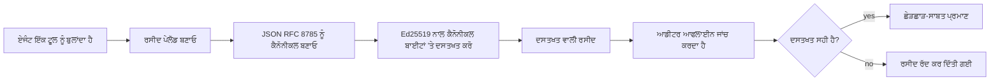
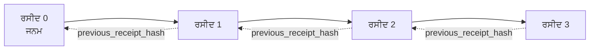

[ਪਾਠ ਵਿਡੀਓ ਦੇਖੋ: ਕ੍ਰਿਪਟੋਗ੍ਰਾਫਿਕ ਪ੍ਰਾਪਤੀਆਂ ਨਾਲ ਏਆਈ ਏਜੰਟਾਂ ਦੀ ਸੁਰੱਖਿਆ](https://youtu.be/PLACEHOLDER_VIDEO_ID)

> _(ਪਾਠ ਵਿਡੀਓ ਅਤੇ ਥੰਬਨੇਲ ਨੂੰ ਮਾਈਕ੍ਰੋਸਾਫਟ ਸਮੱਗਰੀ ਟੀਮ ਦੁਆਰਾ ਮਰਜ ਦੇ ਬਾਅਦ ਜੋੜਿਆ ਜਾਵੇਗਾ, ਜੋ ਪਾਠ 14 / 15 ਪੈਟਰਨ ਨਾਲ ਮਿਲਦਾ ਜੁਲਦਾ ਹੈ।)_

# ਕ੍ਰਿਪਟੋਗ੍ਰਾਫਿਕ ਪ੍ਰਾਪਤੀਆਂ ਨਾਲ ਏਆਈ ਏਜੰਟਾਂ ਦੀ ਸੁਰੱਖਿਆ

## ਪਰਿਚਯ

ਇਹ ਪਾਠ ਹੇਠ ਲਿਖੀਆਂ ਚੀਜ਼ਾਂ ਸਮਝਾਏਗਾ:

- ਏਆਈ ਏਜੰਟਾਂ ਲਈ ਆਡੀਟ ਟਰੇਲ ਕਿਉਂ ਮਹੱਤਵਪੂਰਨ ਹੁੰਦੇ ਹਨ, ਕੰਪਲਾਇੰਸ, ਡਿਬੱਗਿੰਗ ਅਤੇ ਭਰੋਸੇ ਲਈ।
- ਕ੍ਰਿਪਟੋਗ੍ਰਾਫਿਕ ਪ੍ਰਾਪਤੀ ਕੀ ਹੈ ਅਤੇ ਇਹ ਅਸਾਈਨ ਨਾ ਕੀਤੇ ਲੌਗ ਲਾਈਨ ਨਾਲ ਕਿਵੇਂ ਵੱਖਰੇ ਹੁੰਦੇ ਹਨ।
- ਇਕ ਏਜੰਟ ਦੇ ਟੂਲ ਕਾਲ ਲਈ ਸਾਇਨ ਕੀਤੀ ਪ੍ਰਾਪਤੀ ਕਿਵੇਂ ਬਣਾਈਏ ਸਧਾਰਨ ਪਾਇਥਨ ਵਿੱਚ।
- ਕਿਵੇਂ ਪ੍ਰਾਪਤੀ ਨੂੰ ਆਫਲਾਈਨ_verified_ ਕਰਨਾ ਹੈ ਅਤੇ ਟੈਂਪਰਿੰਗ ਦਾ ਪਤਾ ਲਗਾਉਣਾ ਹੈ।
- ਕਿਵੇਂ ਪ੍ਰਾਪਤੀਆਂ ਨੂੰ ਚੇਨ ਕੀਤਾ ਜਾ ਸਕਦਾ ਹੈ ਤਾਂ ਜੋ ਕਿਸੇ ਇੱਕ ਨੂੰ ਹਟਾਉਣ ਜਾਂ ਅਣੁਕ੍ਰਮਬੱਧ ਕਰਨ ਨਾਲ ਚੇਨ ਟੁੱਟ ਜਾਵੇ।
- ਪ੍ਰਾਪਤੀਆਂ ਕੀ ਸਾਬਿਤ ਕਰਦੀਆਂ ਹਨ ਅਤੇ ਉਹ ਖੁਲਾਸਾ ਕਰਦੀਆਂ ਨਹੀਂ।

## ਸਿਖਣ ਦੇ ਲੱਖੇ

ਇਸ ਪਾਠ ਨੂੰ ਪੂਰਾ ਕਰਨ ਤੋਂ ਬਾਅਦ, ਤੁਸੀਂ ਜਾਣੋਗੇ ਕਿ ਕਿਵੇਂ:

- ਓਹ ਅਸਫਲਤਾ ਦੇ ਤਰੀਕੇ ਜੋ ਏਜੰਟ ਕਿਰਿਆਵਾਂ ਲਈ ਕ੍ਰਿਪਟੋਗ੍ਰਾਫਿਕ ਪਰੋਗੇਨੈਂਸ ਦੀ ਲੋੜ ਨੂੰ ਮੋਟਿਵੇਟ ਕਰਦੇ ਹਨ, ਪਛਾਣੋ।
- ਇੱਕ ਕੈਨੋਨਿਕਲ JSON ਪੇਲੋਡ 'ਤੇ Ed25519 ਨਾਲ ਸਾਇਨ ਕੀਤੀ ਪ੍ਰਾਪਤੀ ਬਨਾਓ।
- ਸਾਇਨਰ ਦੀ ਪਬਲਿਕ ਕੀ ਸਿਰਫ ਵਰਤ ਕੇ ਪ੍ਰਾਪਤੀ ਨੂੰ ਅਜ਼ਾਦ ਕਰਨਾ।
- ਇੱਕ ਸੋਧੀ ਗਈ ਪ੍ਰਾਪਤੀ 'ਤੇ ਵੈਰੀਫਿਕੇਸ਼ਨ ਦੁਬਾਰਾ ਚਲਾਕੇ ਟੈਂਪਰਿੰਗ ਪਤਾ ਲਗਾਉਣਾ।
- ਪ੍ਰਾਪਤੀਆਂ ਦੀ ਹੇਠਾਂ-ਜੋੜੀ ਸਿੱਕੜ ਬਣਾਉਣਾ ਅਤੇ ਸਮਝਾਉਣਾ ਕਿਉਂ ਇਹ ਸਿੱਕੜ ਅਹਿਮ ਹੈ।
- ਪ੍ਰਾਪਤੀਆਂ ਕੀ ਸਾਬਿਤ ਕਰਦੀਆਂ ਹਨ (ਆਟ੍ਰਿਬਿਊਸ਼ਨ, ਅਖੰਡਤਾ, ਅਨੁਕ੍ਰਮ) ਅਤੇ ਕਿਹੜੀਆਂ ਗੱਲਾਂ ਉਹ ਸਾਬਿਤ ਨਹੀਂ ਕਰਦੀਆਂ (ਕਿਰਿਆ ਦੀ ਸਹੀਤਾ, ਨੀਤੀ ਦੀ ਤਰੱਕੀ) ਨੂੰ ਪਛਾਣੋ।

## ਸਮੱਸਿਆ: ਤੁਹਾਡੇ ਏਜੰਟ ਦੀ ਆਡੀਟ ਟਰੇਲ

ਸੋਚੋ ਕਿ ਤੁਸੀਂ Contoso ਟ੍ਰੈਵਲ ਲਈ ਇੱਕ ਏਆਈ ਏਜੰਟ ਨੂੰ ਤਾਇਨਾਤ ਕੀਤਾ ਹੈ। ਇਹ ਏਜੰਟ ਗ੍ਰਾਹਕ ਦੀਆਂ ਬੇਨਤੀਆਂ ਪੜ੍ਹਦਾ ਹੈ, ਫਲਾਈਟਸ API ਨੂੰ ਕਾਲ ਕਰਦਾ ਹੈ ਅਤੇ ਗ੍ਰਾਹਕ ਦੀ ਪੱਖੋਂ ਸੀਟਾਂ ਬੁੱਕ ਕਰਦਾ ਹੈ। ਪਿਛਲੇ ਤਿਮਾਹੀ ਵਿੱਚ, ਏਜੰਟ ਨੇ 50,000 ਬੁਕਿੰਗਜ਼ ਪ੍ਰਕਿਰਿਆ ਕੀਤੀਆਂ।

ਅੱਜ ਇੱਕ ਆਡੀਟਰ ਆਇਆ ਹੈ। ਉਹ ਸਾਦਾ ਸਵਾਲ ਪੁੱਛਦਾ ਹੈ: "ਮੈਨੂੰ ਦਿਖਾਓ ਤੁਹਾਡੇ ਏਜੰਟ ਨੇ ਕੀ ਕੀਤਾ।"

ਤੁਸੀਂ ਆਪਣੀਆਂ ਲੌਗ ਫਾਈਲਾਂ ਦਿੰਦੇ ਹੋ। ਆਡੀਟਰ ਉਹਨਾਂ ਨੂੰ ਦੇਖਦਾ ਹੈ ਅਤੇ ਔਖਾ ਸਵਾਲ ਪੁੱਛਦਾ ਹੈ: "ਮੈਨੂੰ ਕਿਵੇਂ ਪਤਾ ਲੱਗੇਗਾ ਕਿ ਇਹ ਲੌਗ ਨਹੀਂ ਸੋਧੇ ਗਏ?"

ਇਹ ਆਡੀਟ-ਟਰੇਲ ਸਮੱਸਿਆ ਹੈ। ਅੱਜਕੱਲ੍ਹ ਦੇ ਬਹੁਤ ਸਾਰੇ ਏਜੰਟ ਤਾਇਨਾਤੀਆਂ ਹੇਠਲਿਖਤ 'ਤੇ ਨਿਰਭਰ ਕਰਦੀਆਂ ਹਨ:

- **ਐਪਲੀਕੇਸ਼ਨ ਲੌਗਸ**: ਏਜੰਟ ਵੱਲੋਂ ਖੁਦ ਲਿਖੇ ਜਾਂਦੇ ਹਨ, ਅਤੇ ਜਿਸਦੇ ਕੋਲ ਫਾਈਲ ਸਿਸਟਮ ਦੀ ਪਹੁੰਚ ਹੈ ਉਹ ਸੋਧ ਸਕਦਾ ਹੈ।
- **ਕ्लਾਉਡ ਲੌਗਿੰਗ ਸੇਵਾਵਾਂ**: ਪਲੇਟਫਾਰਮ ਪੱਧਰ 'ਤੇ ਟੈਂਪਰ-ਪੜਚੋਲਯੋਗ ਪਰ ਕੇਵਲ ਜੇਕਰ ਆਡੀਟਰ ਪਲੇਟਫਾਰਮ ਆਪਰੇਟਰ 'ਤੇ ਭਰੋਸਾ ਕਰਦਾ ਹੋਵੇ।
- **ਡੇਟਾਬੇਸ ਟ੍ਰਾਂਜ਼ੈਕਸ਼ਨ ਲੌਗਸ**: ਡੇਟਾਬੇਸ ਬਦਲਾਵਾਂ ਲਈ ਠੀਕ ਪਰ ਇੱਛਿਤ ਟੂਲ ਕਾਲਾਂ ਲਈ ਨਹੀਂ।

ਇਹਨਾਂ ਵਿੱਚੋਂ ਕੋਈ ਵੀ ਆਡੀਟਰ ਦੇ ਸਵਾਲ ਦਾ ਜਵਾਬ ਦਿੰਦਾ ਵੈਸਾ ਨਹੀਂ ਬਿਨਾਂ ਕਿਸੇ 'ਤੇ ਭਰੋਸਾ ਕੀਤੇ (ਤੁਹਾਡੇ, ਤੁਹਾਡੇ ਕਲਾਊਡ ਪ੍ਰਦਾਤਾ, ਤੁਹਾਡੇ ਡੇਟਾਬੇਸ ਵਿਕਰੇਤਾ)। ਅੰਦਰੂਨੀ ਵਰਤੋਂ ਲਈ ਇਹ ਭਰੋਸਾ ਠੀਕ ਹੁੰਦਾ ਹੈ। ਪਰ ਨਿਯੰਤਰਿਤ ਕੰਮਾਂ ਲਈ (ਵਿੱਤ, ਸਿਹਤ ਸੰਭਾਲ, EU ਏਆਈ ਐਕਟ ਦੇ ਅਧੀਨ ਕੁਝ ਵੀ), ਇਹ ਸਹੀ ਨਹੀਂ।

ਕ੍ਰਿਪਟੋਗ੍ਰਾਫਿਕ ਪ੍ਰਾਪਤੀਆਂ ਇਸ ਦੀ ਸਮੱਸਿਆ ਹਲ ਕਰਦੀਆਂ ਹਨ ਇਸ ਤਰ੍ਹਾਂ ਕਿ ਹਰ ਏਜੰਟ ਕਿਰਿਆ ਨੂੰ ਸੁਤੰਤਰ ਤੌਰ 'ਤੇ ਵੈਰੀਫਾਇ ਕਰੋ। ਆਡੀਟਰ ਨੂੰ ਤੁਹਾਡੇ 'ਤੇ ਭਰੋਸਾ ਕਰਨ ਦੀ ਲੋੜ ਨਹੀਂ। ਉਸਨੂੰ ਸਿਰਫ ਤੁਹਾਡੀ ਪਬਲਿਕ ਕੀ ਅਤੇ ਪ੍ਰਾਪਤੀ ਦੀ ਲੋੜ ਹੈ।

## ਕ੍ਰਿਪਟੋਗ੍ਰਾਫਿਕ ਪ੍ਰਾਪਤੀ ਕੀ ਹੈ?

ਇੱਕ ਪ੍ਰਾਪਤੀ ਇੱਕ JSON ਵਸਤੁ ਹੈ ਜੋ ਦਰਜ ਕਰਦੀ ਹੈ ਕਿ ਏਜੰਟ ਨੇ ਕੀ ਕੀਤਾ, ਡਿਜੀਟਲ ਸਾਈਨ ਨਾਲ ਦਸਤਖਤ ਕੀਤੀ ਗਈ।


```mermaid
flowchart LR
    A[ਏਜੰਟ ਇੱਕ ਟੂਲ ਨੂੰ ਬੁਲਾਂਦਾ ਹੈ] --> B[ਰਸੀਦ ਪੇਲੋਡ ਬਣਾਓ]
    B --> C[JSON RFC 8785 ਨੂੰ ਕੈਨੋਨੀਕਲ ਬਣਾਓ]
    C --> E[Ed25519 ਨਾਲ ਕੈਨੋਨੀਕਲ ਬਾਈਟਾਂ 'ਤੇ ਦਸਤਖਤ ਕਰੋ]
    E --> F[ਦਸਤਖਤ ਵਾਲੀ ਰਸੀਦ]
    F --> G[ਆਡੀਟਰ ਆਫਲਾਈਨ ਜਾਂਚ ਕਰਦਾ ਹੈ]
    G --> H{ਦਸਤਖਤ ਸਹੀ ਹੈ?}
    H -- yes --> I[ਛੇੜਛਾੜ-ਸਾਬਤ ਪ੍ਰਮਾਣ]
    H -- no --> J[ਰਸੀਦ ਰੱਦ ਕਰ ਦਿੱਤੀ ਗਈ]
```

ਇੱਕ ਘੱਟੋ ਘੱਟ ਪ੍ਰਾਪਤੀ ਇਸ ਤਰ੍ਹਾਂ ਦਿੱਖਦੀ ਹੈ:

```json
{
  "type": "agent.tool_call.v1",
  "agent_id": "contoso-travel-bot",
  "tool_name": "lookup_flights",
  "tool_args_hash": "sha256:a3f9c1...",
  "result_hash": "sha256:7b2e1d...",
  "policy_id": "contoso-travel-policy-v3",
  "timestamp": "2026-04-25T14:30:00Z",
  "sequence": 47,
  "previous_receipt_hash": "sha256:9d4e6a...",
  "signature": {
    "alg": "EdDSA",
    "sig": "c5af83...",
    "public_key": "8f3b2c..."
  }
}
```

ਤਿੰਨ ਗੁਣ ਕੰਮ ਕਰ ਰਹੇ ਹਨ:

1. **ਦਸਤਖਤ**. ਪ੍ਰਾਪਤੀ ਏਜੰਟ ਦੇ ਗੇਟਵੇ ਵੱਲੋਂ Ed25519 ਪ੍ਰਾਈਵੇਟ ਕੀ ਨਾਲ ਦਸਤਖਤ ਕੀਤੀ ਜਾਂਦੀ ਹੈ। ਜਿਸਦੇ ਕੋਲ ਸਬੰਧਤ ਪਬਲਿਕ ਕੀ ਹੈ ਉਹ signature ਆਫਲਾਈਨ_verified_ ਕਰ ਸਕਦਾ ਹੈ। ਕਿਸੇ ਵੀ ਫੀਲਡ ਨੂੰ ਸੋਧਣਾ ਸਾਈਨ ਨੂੰ ਗੈਰ-ਮਾਨਯ ਕਰ ਦਿੰਦਾ ਹੈ।

2. **ਕੈਨੋਨਿਕਲ ਐਨਕੋਡਿੰਗ**. ਸਾਇਨ ਕਰਨ ਤੋਂ ਪਹਿਲਾਂ ਪ੍ਰਾਪਤੀ JSON ਕੈਨੋਨਿਕਲਾਈਜੇਸ਼ਨ ਸਕੀਮ (JCS, RFC 8785) ਦੀ ਵਰਤੋਂ ਕਰਕੇ ਸੀਰੀਅਲਾਈਜ਼ ਕੀਤੀ ਜਾਂਦੀ ਹੈ। ਇਸ ਨਾਲ ਇਹ ਯਕੀਨੀ ਹੁੰਦਾ ਹੈ ਕਿ ਦੋ_IMPLEMENTATIONS_ ਜੋ ਇੱਕੋ ਲਾਜ਼ਮੀ ਪ੍ਰਾਪਤੀ ਬਣਾਉਂਦੇ ਹਨ, ਉਹ ਬਾਈਟ-ਸਮਾਨ ਨਿਕਾਸ ਦੇਂਦੇ ਹਨ। ਬਿਨਾਂ ਕੈਨੋਨਿਕਲਾਈਜ਼ੇਸ਼ਨ ਤੋਂ, ਵੱਖਰੇ JSON ਸੀਰੀਅਲਾਈਜ਼ਰ ਇੱਕੋ ਸਮੱਗਰੀ ਲਈ ਵੱਖਰੇ sign ਕਰਦੇ।

3. **ਹੈਸ਼ ਚੇਨਿੰਗ**. `previous_receipt_hash` ਫੀਲਡ ਹਰ ਪ੍ਰਾਪਤੀ ਨੂੰ ਉਹਦੇ ਪਹਿਲਾਂ ਵਾਲੀ ਪ੍ਰਾਪਤੀ ਨਾਲ ਜੋੜਦਾ ਹੈ। ਕਿਸੇ ਪ੍ਰਾਪਤੀ ਨੂੰ ਹਟਾਉਣਾ ਜਾਂ ਅਣੁਕ੍ਰਮ ਨੂੰ ਤਬਦੀਲ ਕਰਨਾ, ਉਹਦੇ ਬਾਅਦ ਵਾਲੀਆਂ ਸਾਰੀਆਂ ਪ੍ਰਾਪਤੀਆਂ ਨੂੰ ਢਹਿ ਜਾਂਦਾ ਹੈ। ਟੈਂਪਰਿੰਗਚੇਨ ਪੱਧਰ 'ਤੇ ਵੀ ਨਜ਼ਰ ਆਉਂਦੀ ਹੈ ਜੇਕਰ ਵੱਖਰੇ ਦਸਤਖਤ ਬਾਈਪਾਸ ਹੋ ਜਾ ਰਹੇ ਹਨ।

ਇਕੱਠੇ ਇਹ ਗੁਣ ਤਿੰਨ ਗੈਰੰਟੀਆਂ ਦਿੰਦੇ ਹਨ:

- **ਆਟ੍ਰਿਬਿਊਸ਼ਨ**: ਇਹ ਕੰਜੀ ਨੇ ਇਸ ਸਮੱਗਰੀ ਨੂੰ ਸਾਈਨ ਕੀਤਾ।
- **ਅਖੰਡਤਾ**: ਸਮੱਗਰੀ ਸਾਈਨ ਕਰਨ ਤੋਂ ਬਾਅਦ ਨਹੀਂ ਬਦਲੀ ਗਈ।
- **ਅਨੁਕ੍ਰਮ**: ਇਹ ਪ੍ਰਾਪਤੀ ਉਸ ਪ੍ਰਾਪਤੀ ਤੋਂ ਬਾਅਦ ਚੇਨ ਵਿੱਚ ਆਈ।

## ਪਾਇਥਨ ਵਿੱਚ ਪ੍ਰਾਪਤੀ ਬਣਾਉਣਾ

ਤੁਹਾਨੂੰ ਪ੍ਰਾਪਤੀ ਬਣਾਉਣ ਲਈ ਕਿਸੇ ਵਿਸ਼ੇਸ਼ ਲਾਇਬ੍ਰੇਰੀ ਦੀ ਲੋੜ ਨਹੀਂ। ਕ੍ਰਿਪਟੋਗ੍ਰਾਫਿਕ ਪ੍ਰਿਮਿਟਿਵਜ਼ ਵਿਆਪਕ ਤੌਰ 'ਤੇ ਉਪਲਬਧ ਹਨ ਅਤੇ ਲੌਜਿਕ ਕੁਝ ਦਰਜਨ ਫੁੱਟ ਪਾਇਥਨ ਦੇਖਾਵੇ ਦੂਆਂਸ਼ ਹੈ।

`code_samples/18-signed-receipts.ipynb` ਵਿੱਚ ਹਨਡਸ-ਆਨ ਅਭਿਆਸ ਪੂਰੇ ਪ੍ਰਕਿਰਿਆ ਨੂੰ ਬਿਆਨ ਕਰਦੇ ਹਨ। ਸੰਖੇਪ ਸੰਸਕਰਨ:

```python
import json
import hashlib
import base64
from nacl import signing
from jcs import canonicalize  # RFC 8785 ਕੈਨੋਨਿਕਲ JSON

def b64url_nopad(data: bytes) -> str:
    return base64.urlsafe_b64encode(data).decode("ascii").rstrip("=")

def sha256_canonical(obj) -> str:
    """SHA-256 of a Python object's JCS-canonical JSON form."""
    return f"sha256:{hashlib.sha256(canonicalize(obj)).hexdigest()}"

# ਸਾਈਨਿੰਗ ਕੀ ਬਣਾਓ ਜਾਂ ਲੋਡ ਕਰੋ (ਉਤਪਾਦਨ ਵਿੱਚ, ਇੱਕ ਕੀ ਵਾਲਟ ਵਿੱਚ ਸਟੋਰ ਕਰੋ)
signing_key = signing.SigningKey.generate()
verify_key = signing_key.verify_key

# ਰਸੀਦ ਪੇਲੋਡ ਤਿਆਰ ਕਰੋ (ਹੁਣ ਤੱਕ ਕੋਈ ਦਸਤਖਤ ਨਹੀਂ)
tool_args = {"origin": "SYD", "destination": "LAX"}
tool_result = [{"flight": "QF11", "price": 1850, "stops": 0}]

payload = {
    "type": "agent.tool_call.v1",
    "agent_id": "contoso-travel-bot",
    "tool_name": "lookup_flights",
    "tool_args_hash": sha256_canonical(tool_args),
    "result_hash": sha256_canonical(tool_result),
    "policy_id": "contoso-travel-policy-v3",
    "timestamp": "2026-04-25T14:30:00Z",
    "sequence": 0,
    "previous_receipt_hash": None,
}

# JCS ਬਾਈਟਸ ਨੂੰ ਸਿੱਧਾ ਕੈਨੋਨਿਕਲਾਈਜ਼ ਅਤੇ ਸਾਈਨ ਕਰੋ। PureEdDSA ਅੰਦਰੂਨੀ ਤੌਰ 'ਤੇ ਹੈਸ਼ ਕਰਦਾ ਹੈ।
canonical_bytes = canonicalize(payload)
signature_bytes = signing_key.sign(canonical_bytes).signature

# ਇੱਕ ਸੰਰਚਿਤ ਦਸਤਖਤ ਵਸਤੂ ਜੁੜੋ।
receipt = {
    **payload,
    "signature": {
        "alg": "EdDSA",
        "sig": b64url_nopad(signature_bytes),
        "public_key": b64url_nopad(bytes(verify_key)),
    },
}
```

ਇਹ ਪੂਰੀ ਸਾਈਨਿੰਗ ਪਾਈਪਲਾਈਨ ਹੈ। ਨੋਟਬੁੱਕ ਵਿੱਚ ਅਭਿਆਸ ਹਰ ਕਦਮ ਨੂੰ ਚਲਾਉਂਦੇ ਹਨ।

## ਪ੍ਰਾਪਤੀ ਦੀ ਜਾਂਚ ਅਤੇ ਟੈਂਪਰਿੰਗ ਦਾ ਪਤਾ ਲਗਾਉਣਾ

ਵੈਰੀਫਿਕੇਸ਼ਨ ਵਿਰੋਧੀ ਕਾਰਵਾਈ ਹੈ:

```python
import base64
import hashlib
from nacl import signing
from nacl.exceptions import BadSignatureError
from jcs import canonicalize

def b64url_decode(s: str) -> bytes:
    padding = "=" * ((4 - len(s) % 4) % 4)
    return base64.urlsafe_b64decode(s + padding)

def verify_receipt(receipt: dict) -> bool:
    # ਦਸਤਖਤ ਇੱਕ ਸੰਰਚਿਤ ਵਸਤੂ ਹੈ: {"alg", "sig", "public_key"}।
    sig_obj = receipt.get("signature")
    if not sig_obj or sig_obj.get("alg") != "EdDSA":
        return False

    # ਉਹ ਪੇਲੋਡ ਮੁੜ ਬਣਾਓ ਜੋ ਹਕੀਕਤ ਵਿੱਚ ਦਸਤਖਤ ਕੀਤਾ ਗਿਆ ਸੀ (ਦਸਤਖਤ ਦੇ ਇਲਾਵਾ ਸਭ ਕੁਝ)।
    payload = {k: v for k, v in receipt.items() if k != "signature"}

    canonical_bytes = canonicalize(payload)

    try:
        verify_key = signing.VerifyKey(b64url_decode(sig_obj["public_key"]))
        verify_key.verify(canonical_bytes, b64url_decode(sig_obj["sig"]))
        return True
    except BadSignatureError:
        return False
```

ਇਹ ਫੰਕਸ਼ਨ ਇੱਕ ਪ੍ਰਾਪਤੀ ਲੈਂਦਾ ਹੈ ਅਤੇ `True` ਵਾਪਸ ਕਰਦਾ ਹੈ ਜੇ ਦਸਤਖਤ ਸਹੀ ਹੋਵੇ, ਹੋਰਥਾਂ `False`। ਕੋਈ ਨੈੱਟਵਰਕ ਕਾਲ, ਕੋਈ ਸੇਵਾ ਨਿਰਭਰਤਾ ਨਹੀਂ, ਕਿਸੇ ਤੀਜੇ ਪਕਸ਼ ਉੱਤੇ ਭਰੋਸਾ ਨਹੀਂ।

ਟੈਂਪਰਿੰਗ ਪਤਾ ਲਗਾਉਣ ਦਾ ਪ੍ਰਯੋਗ ਦੇਖਣ ਲਈ, ਨੋਟਬੁੱਕ ਵਿੱਚ ਚਲਾਯਾ ਗਿਆ ਹੈ:

1. ਇੱਕ ਵੈਧ ਪ੍ਰਾਪਤੀ ਬਣਾਉਣਾ ਅਤੇ ਉਸਦਾ ਸਹੀ ਹੋਣਾ ਪੁਸ਼ਟੀ ਕਰਨਾ।
2. `tool_args_hash` ਫੀਲਡ ਦਾ ਇੱਕ ਬਾਈਟ ਸੋਧਣਾ।
3. ਵੈਰੀਫਿਕੇਸ਼ਨ ਦੁਬਾਰਾ ਚਲਾਉਣਾ ਅਤੇ ਫੇਲ੍ਹ ਹੋਣਾ ਵੇਖਣਾ।

ਇਹ ਅਮਲੀ ਪ੍ਰਦਰਸ਼ਨ ਹੈ ਕਿ ਪ੍ਰਾਪਤੀਆਂ ਟੈਂਪਰ-ਪੜਚੋਲਯੋਗ ਹਨ: ਕੋਈ ਵੀ ਸੋਧ, ਭਾਵੇਂ ਛੋਟੀ, ਸਾਈਨ ਨੂੰ ਤੋੜ ਦਿੰਦੀ ਹੈ।

## ਬਹੁ-ਕਦਮ ਏਜੰਟਾਂ ਲਈ ਪ੍ਰਾਪਤੀਆਂ ਦੀ ਚੇਨਿੰਗ

ਇੱਕ ਇਕੱਲੀ ਸਾਈਨ ਕੀਤੀ ਪ੍ਰਾਪਤੀ ਇੱਕ ਕਿਰਿਆ ਦੀ ਰੱਖਿਆ ਕਰਦੀ ਹੈ। ਪ੍ਰਾਪਤੀਆਂ ਦੀ ਇੱਕ ਸਿੱਕੜ ਕਿਰਿਆਵਾਂ ਦੀ ਲੜੀ ਦੀ ਰੱਖਿਆ ਕਰਦੀ ਹੈ।


```mermaid
flowchart LR
    R0[ਰਸੀਦ 0<br/>ਜਨਮ] --> R1[ਰਸੀਦ 1]
    R1 --> R2[ਰਸੀਦ 2]
    R2 --> R3[ਰਸੀਦ 3]
    R1 -. previous_receipt_hash .-> R0
    R2 -. previous_receipt_hash .-> R1
    R3 -. previous_receipt_hash .-> R2
```

ਹਰ ਪ੍ਰਾਪਤੀ ਉਸ ਤੋਂ ਪਹਿਲਾਂ ਦੀ ਪ੍ਰਾਪਤੀ ਦਾ ਹੈਸ਼ ਦਰਜ ਕਰਦੀ ਹੈ। ਪ੍ਰਾਪਤੀ 2 ਨੂੰ ਬਿਨਾਂ ਆਵਾਜ਼ ਦੇ ਹਟਾਉਣ ਲਈ, ਹਮਲਾਵਰ ਨੂੰ ਚਾਹੀਦਾ ਹੋਵੇਗਾ ਜਾਂ:

- ਪ੍ਰਾਪਤੀ 3 ਦੇ `previous_receipt_hash` ਫੀਲਡ ਨੂੰ ਸੋਧਣਾ (ਜਿਸ ਨਾਲ ਪ੍ਰਾਪਤੀ 3 ਦਾ ਦਸਤਖਤ ਟੁੱਟਦਾ ਹੈ), ਜਾਂ
- ਸੋਧੀ ਗਈ ਪ੍ਰਾਪਤੀ 3 'ਤੇ ਨਵਾਂ ਦਸਤਖਤ ਬਣਾਉਣਾ (ਜੇਹੜਾ ਏਜੰਟ ਦੀ ਪ੍ਰਾਈਵੇਟ ਕੀ ਦੀ ਲੋੜ ਹੈ)।

ਜੇ ਪ੍ਰਾਈਵੇਟ ਕੀ ਹਾਰਡਵੇਅਰ ਕੀ ਵਾਲਟ ਵਿੱਚ ਹੈ ਅਤੇ ਤੁਸੀਂ ਹਰ ਪ੍ਰਾਪਤੀ ਨਾਲ ਪਬਲਿਕ ਕੀ ਪ੍ਰਕਾਸ਼ਿਤ ਕਰਦੇ ਹੋ, ਤਾਂ ਇਹ ਦੋਹਾਂ ਹਮਲੇ ਪਤਾ ਲੱਗਣ ਤੋਂ ਬਿਨਾਂ ਅਮਲ ਨਹੀਂ ਹੋ ਸਕਦੇ।

ਨੋਟਬੁੱਕ ਵਿੱਚ ਇਹ ਚਲਾਇਆ ਗਿਆ ਹੈ:

1. ਤਿੰਨ ਪ੍ਰਾਪਤੀਆਂ ਦੀ ਚੇਨ ਬਣਾਉਣਾ।
2. ਹਰ ਪ੍ਰਾਪਤੀ ਦੇ `previous_receipt_hash` ਦਾ ਦੂਜੇ ਦੇ ਅਸਲ ਹੈਸ਼ ਨਾਲ ਮੇਲ ਹੋਣਾ ਵੇਰੀਫਾਈ ਕਰਨਾ।
3. ਵਿਚਕਾਰ ਇਕ ਪ੍ਰਾਪਤੀ ਵਿੱਚ ਟੈਂਪਰਿੰਗ ਕਰਨਾ ਅਤੇ ਵੇਖਣਾ ਕਿ ਚੇਨ ਓਥੇ ਟੁੱਟੀ।

ਇਸ ਤਰ੍ਹਾਂ ਤੁਸੀਂ ਐਸਾ ਆਡੀਟ ਟਰੇਲ ਬਣਾਉਂਦੇ ਹੋ ਜੋ ਬਾਹਰੀ ਆਡੀਟਰ ਕਦੇ ਵੀ ਤੁਹਾਡੇ 'ਤੇ ਭਰੋਸਾ ਕੀਤੇ ਬਿਨਾਂ ਵੈਰੀਫਾਈ ਕਰ ਸਕਦਾ ਹੈ।

## ਪ੍ਰਾਪਤੀਆਂ ਕਿਹੜੀਆਂ ਗੱਲਾਂ ਸਾਬित ਕਰਦੀਆਂ ਹਨ (ਅਤੇ ਕਿਹੜੀਆਂ ਨਹੀਂ)

ਇਹ ਪਾਠ ਦਾ ਸਭ ਤੋਂ ਮਹੱਤਵਪੂਰਨ ਭਾਗ ਹੈ। ਪ੍ਰਾਪਤੀਆਂ ਸ਼ਕਤੀਸ਼ਾਲੀ ਹਨ ਪਰ ਉਨ੍ਹਾਂ ਦੀ ਸ਼ਕਤੀ ਸੀਮਿਤ ਹੈ।

**ਪ੍ਰਾਪਤੀਆਂ ਤਿੰਨ ਗੱਲਾਂ ਸਾਬਿਤ ਕਰਦੀਆਂ ਹਨ:**

1. **ਆਟ੍ਰਿਬਿਊਸ਼ਨ**: ਇੱਕ ਖਾਸ ਕੀ ਨੇ ਇੱਕ ਖਾਸ ਪੇਲੋਡ ਨੂੰ ਸਾਇਨ ਕੀਤਾ।
2. **ਅਖੰਡਤਾ**: ਪੇਲੋਡ ਸਾਇਨ ਕਰਨ ਤੋਂ ਬਾਅਦ ਨਹੀਂ ਬਦਲੀ।
3. **ਅਨੁਕ੍ਰਮ**: ਇਸ ਪ੍ਰਾਪਤੀ ਨੇ ਉਸ ਪ੍ਰਾਪਤੀ ਤੋਂ ਬਾਅਦ ਚੇਨ ਵਿੱਚ ਜਗ੍ਹਾ ਬਣਾਈ।

**ਪ੍ਰਾਪਤੀਆਂ ਇਹ ਨਹੀਂ ਸਾਬਿਤ ਕਰਦੀਆਂ:**

1. **ਸਹੀਤਾ**: ਕਿ ਏਜੰਟ ਦੀ ਕਿਰਿਆ ਸਹੀ ਕਿਰਿਆ ਸੀ। ਪ੍ਰਾਪਤੀ ਗਲਤ ਜਵਾਬ ਲਈ ਵੀ ਠੀਕ ਤਰ੍ਹਾਂ ਸਾਇਨ ਕੀਤੀ ਜਾ ਸਕਦੀ ਹੈ।
2. **ਨੀਤੀ ਦੀ ਪਾਲਣਾ**: ਕਿ `policy_id` ਵਿੱਚ ਦਿੱਤੀ ਨੀਤੀ ਵਾਸਤਵ ਵਿੱਚ ਮੁਲਾਂਕਣ ਕੀਤੀ ਗਈ, ਜਾਂ ਕਿ ਇਹ ਇਹ ਕਿਰਿਆ ਮੰਨਣ ਦੀ ਆਗਿਆ ਦਿੰਦੀ ਜੇ ਚੈੱਕ ਕੀਤੀ ਗਈ ਹੋਵੇ। ਪ੍ਰਾਪਤੀ ਇਹ ਦਰਜ ਕਰਦੀ ਹੈ ਕੀ ਕਿਹਾ ਗਿਆ, ਨਾ ਕਿ ਕੀ ਲਾਗੂ ਕੀਤਾ ਗਿਆ।
3. **ਕੀ ਤੋਂ ਇਲਾਵਾ ਪਛਾਣ**: ਪ੍ਰਾਪਤੀ ਕਿੱਤੀ ਹੈ "ਇਹ ਕੀ ਇਸ ਸਮੱਗਰੀ ਨੂੰ ਸਾਇਨ ਕੀਤਾ।" ਇਹ ਨਹੀਂ ਕਹਿੰਦੀ "ਇਸ ਮਨੁੱਖ ਨੇ ਪ੍ਰਭਾਵਿਤ ਕੀਤਾ।" ਕਿਸੇ ਕੀ ਨੂੰ ਕਿਸੇ ਬੰਦੇ ਜਾਂ ਸੰਗਠਨ ਨਾਲ ਜੋੜਨਾ ਵੱਖਰਾ ਪਛਾਣ ਢਾਂਚਾ ਮੰਗਦਾ ਹੈ (ਡਾਇਰੈਕਟਰੀ, ਪਬਲਿਕ ਕੀ ਰਜਿਸਟਰੀ ਆਦਿ)।
4. **ਇੰਪੁੱਟ ਦੀ ਸੱਚਾਈ**: ਜੇ ਏਜੰਟ ਨੂੰ ਸੋਧਿਆ ਹੋਇਆ ਪ੍ਰਾਂਪਟ ਮਿਲਦਾ ਹੈ ਅਤੇ ਉਹ ਉਸ 'ਤੇ ਕਿਰਿਆ ਕਰਦਾ ਹੈ, ਤਾਂ ਪ੍ਰਾਪਤੀ ਕਿਰਿਆ ਨੂੰ ਸੱਚਾਈ ਨਾਲ ਦਰਜ ਕਰਦੀ ਹੈ। ਪ੍ਰਾਪਤੀਆਂ ਇੰਪੁੱਟ ਜਾਂਚ ਦੇ ਬਾਅਦ ਦੀਆਂ ਹਨ, ਇਹਨਾਂ ਦਾ ਬਦਲ ਨਹੀਂ।

ਇਹ ਸੀਮਾ ਦੋ ਕਾਰਨਾਂ ਕਰਕੇ ਅਹਿਮ ਹੈ:

- ਇਹ ਦੱਸਦਾ ਹੈ ਕਿ ਪ੍ਰਾਪਤੀਆਂ ਕਿਸ ਲਈ ਲਾਭਦਾਇਕ ਹਨ: ਏਜੰਟ ਵਿਹਾਰ ਨੂੰ ਆਡੀਟ ਕਰਨਯੋਗ ਅਤੇ ਟੈਂਪਰ-ਪੜਚੋਲਯੋਗ ਬਣਾਉਣਾ, ਭਾਵੇਂ ਸੰਗਠਕੀ ਸੀਮਾਵਾਂ ਪਾਰ ਕਰਕੇ।
- ਇਹ ਦੱਸਦਾ ਹੈ ਕਿ ਤੁਹਾਨੂੰ ਹੋਰ ਕਿਹੜੀਆਂ ਵਰਤੋਂ ਦੀਆਂ ਪਰਤਾਂ ਚਾਹੀਦੀਆਂ ਹਨ: ਇੰਪੁੱਟ ਵੈਰੀਫਿਕੇਸ਼ਨ (ਪਾਠ 6), ਨੀਤੀ ਲਾਗੂ ਕਰਨ (ਹੇਠਾਂ ਥੋੜ੍ਹਾ ਕਵਰ ਕੀਤਾ), ਅਤੇ ਪਛਾਣ ਢਾਂਚਾ (ਇਸ ਪਾਠ ਤੋਂ ਬਾਹਰ)।

ਇੱਕ ਆਮ ਗਲਤੀ ਇਹ ਸੋਚਣਾ ਹੈ ਕਿ "ਸਾਡੇ ਕੋਲ ਪ੍ਰਾਪਤੀਆਂ ਹਨ" ਮਤਲਬ "ਅਸੀਂ ਪ੍ਰਬੰਧਿਤ ਹਾਂ।" ਇਹ ਸਹੀ ਨਹੀਂ। ਪ੍ਰਾਪਤੀ ਬੁਨਿਆਦ ਹਨ। ਪ੍ਰਬੰਧਨ ਉਹ ਪ੍ਰਣਾਲੀ ਹੈ ਜੋ ਤੁਸੀਂ ਇਸਦੇ ਉੱਤੇ ਬਣਾਉਂਦੇ ਹੋ।

## ਮਨੁੱਖੀ ਮਨਜ਼ੂਰੀ ਦੀ ਸਾਬਤੀ ਦੇਣਾ ਕਿ ਕਿਰਿਆ ਸਹੀ ਸੀ

ਉੱਪਰ ਦੀ ਆਈਟਮ 3 ਆਪਣੇ ਲਈ ਇੱਕ ਵੱਖਰਾ ਭਾਗ ਦੇਣਯੋਗ ਹੈ: ਇੱਕ ਕਿਰਿਆ ਪ੍ਰਾਪਤੀ ਕਹਿੰਦੀ ਹੈ "ਇਹ ਕੀ ਇਸ ਸਮੱਗਰੀ ਨੂੰ ਸਾਇਨ ਕੀਤਾ," ਨਾ ਕਿ "ਇਸ ਮਨੁੱਖ ਨੇ ਮਨਜ਼ੂਰ ਕੀਤਾ।" ਉੱਚ-ਖਤਰਾ ਵਾਲੀਆਂ ਕਿਰਿਆਵਾਂ (ਰਿਫੰਡ, ਮਿਟਾਉਣਾ, ਵਾਇਰ ਟ੍ਰਾਂਸਫਰ) ਲਈ, ਪ੍ਰਬੰਧਨੀ ਢਾਂਚੇ ਬੜੇ ਪੱਧਰ 'ਤੇ ਇਹ ਗੁੰਝਲਦਾਰ bayan ਲਾਜ਼ਮੀ ਕਰਦੇ ਹਨ, ਜੋ ਤੁਸੀਂ ਇਸ ਪਾਠ ਵਿੱਚ ਬਣਾਏ ਕ੍ਰਿਪਟੋਗ੍ਰਾਫਿਕ ਪ੍ਰਿਮਿਟਿਵਜ਼ ਨਾਲ ਉਪਲਬਧ ਹੈ।

ਅਗਲਾ ਨੋਟਬੁੱਕ `code_samples/human-authorization-receipts.ipynb` ਇਕ ਦੂਜਾ ਪ੍ਰਾਪਤੀ ਕਿਸਮ, `human.approval.v1`, ਜੋੜਦਾ ਹੈ, ਜੋ ਇਸ ਪਾਠ ਦੀਆਂ ਪ੍ਰਾਪਤੀਆਂ ਵਰਗਾ ਬੰਨ੍ਹਿਆ ਹੋਇਆ ਹੁੰਦਾ ਹੈ (ਇੱਕ ਟਾਈਪਡ ਪੇਲੋਡ Ed25519 ਨਾਲ ਕੈਨੋਨਿਕਲ JCS ਬਾਈਟਸ ਉੱਤੇ ਸਾਇਨ ਕੀਤਾ, ਜਿੱਥੇ `signature` ਵਸਤੁ ਸਾਈਨ ਕੀਤੀਆਂ ਬਾਈਟਸ ਤੋਂ ਬਾਹਰ ਹੈ)। ਇੱਕ ਨਾਮਜ਼ਦ ਮਨਜ਼ੂਰਕਰਤਾ ਪੂਰੀ ਕੈਨੋਨਿਕਲ ਕਿਰਿਆ ਅਤੇ ਉਸਦੀ ਡਾਈਜੇਸਟ ਸਾਈਨ ਕਰਦਾ ਹੈ ਪਹਿਲਾਂ; ਏਜੰਟ ਦੀ ਕਿਰਿਆ ਪ੍ਰਾਪਤੀ ਵਿੱਚੋਹੀ **ਕਿਰਿਆ ਦੀ ਡਾਈਜੇਸਟ** ਅਤੇ ਇੱਕ `parent_approval_ref` ਹੈ, ਜੋ ਮਨਜ਼ੂਰੀ ਦੀ `receipt_hash` ਹੁੰਦੀ ਹੈ, ਜੋ ਉੱਪਰ ਬਣਾਈ ਚੇਨ ਵਿੱਚ `previous_receipt_hash` ਵਰਗੀ ਹੈ। ਇੱਕ `verify_chain` ਦੋਹਾਂ ਕਾਗਜਾਂ ਨੂੰ ਵੱਖ-ਵੱਖ ਪਿਨ ਕੀ ਰੇਜਿਸਟਰੀਜ਼ (ਮਨਜ਼ੂਰਕਰਤਾ ਕੀ ਅਤੇ ਏਜੰਟ ਕੀ) ਹੇਠਾਂ ਚਲਾਉਂਦਾ ਹੈ, ਕੋਡ ਪਾਥ ਸਾਂਝਾ ਪਰ ਅਧਿਕਾਰ ਕਦੇ ਵੀ ਨਹੀਂ।

ਇਸ ਗੁਣ ਨੂੰ ਧਿਆਨ ਨਾਲ ਕਿਹਾ ਗਿਆ ਹੈ: *ਮਨੁੱਖ ਨੇ ਇਸ ਸਹੀ ਕਿਰਿਆ ਨੂੰ ਮਨਜ਼ੂਰ ਕੀਤਾ, ਅਤੇ ਏਜੰਟ ਨੇ ਬਿਲਕੁਲ ਉਸ ਮਨਜ਼ੂਰਸ਼ੁਦਾ ਕਿਰਿਆ ਨੂੰ ਅੰਜਾਮ ਦਿੱਤਾ।* ਨੋਟਬੁੱਕ ਦੇ ਇਨਕਾਰ ਵਾਲੇ ਹਾਲਾਤ ਇਸ ਗੁਣ ਨੂੰ ਹਕੀਕਤ ਬਣਾਉਂਦੇ ਹਨ ਨਾ ਕਿ ਕੇਵਲ ਦਾਅਵਾ:

- ਪਰੰਪਰਾਗਤ ਸਮੂਹ: ਟੈਂਪਰਿੰਗ, ਗੁੰਝਲਦਾਰ ਡਿਪਿਊ, ਰੀਪਲੇ, ਦੋਹਰਾਏ ਗਏ ਕੀ, ਗਲਤ-ਬਣਾਇਆ ਇੰਪੁੱਟ;
- **ਪੁਰਾਣੀ ਅਥਾਰਟੀ**: ਐਸੀ ਦਸਤਖਤ ਜੋ ਸਹੀ ਵੀ ਤਸਦੀਕ ਹੁੰਦੀ ਹੈ ਪਰ ਇਨਕਾਰ ਕਰ ਦਿੱਤਾ ਗਿਆ ਕਿਉਂਕਿ ਨੀਤੀ ਸੰਸਕਰਨ ਹਿਲਿਆ, ਮਨਜ਼ੂਰਕਰਤਾ ਕੀ ਪਿਨ ਰਜਿਸਟਰੀ ਤੋਂ ਕੱਟ ਦਿੱਤੀ ਗਈ, ਜਾਂ ਮਨਜ਼ੂਰੀ ਕਾਰਵਾਈ ਤੋਂ ਪਹਿਲਾਂ ਖਤਮ ਹੋ ਗਈ;
- **ਡਾਈਜੇਸਟ ਬਦਲੀ**: ਇੱਕ ਵੈਧ ਸਾਇਨ ਕੀਤੀ ਕਿਰਿਆ ਪ੍ਰਾਪਤੀ ਜੋ ਕਿਸੇ *ਅਸਲ* ਮਨਜ਼ੂਰੀ ਵੱਲ ਇਸ਼ਾਰਾ ਕਰਦੀ ਹੈ ਪਰ ਜੋ ਇੱਕ *ਵੱਖਰੀ* ਕੈਨੋਨਿਕਲ ਕਿਰਿਆ ਨਾਲ ਸਬੰਧਿਤ ਹੈ।

ਹਰ ਫੇਲ੍ਹ ਇੱਕ ਵੱਖਰਾ ਕਾਰਨ ਦਿੰਦੀ ਹੈ, ਇਸ ਲਈ ਆਡੀਟਰ ਇਨਕਾਰ ਪੜ੍ਹ ਕੇ ਦੱਸ ਸਕਦਾ ਹੈ ਕਿ ਅਥਾਰਟੀ PURANA ਹੋਈ ਜਾਂ ਅੰਜਾਮ ਦਿੱਤੀ ਕਿਰਿਆ ਬਦਲੀ। ਨੋਟਬੁੱਕ ਦਾ ਨਿਯਮ: ਸਾਇਨ ਕੀਤੀ ਮਨਜ਼ੂਰੀ ਖੁਦ ਅਥਾਰਟੀ ਨਹੀਂ। ਅਥਾਰਟੀ ਸਿਰਫ ਤਦੋਂ ਹੁੰਦੀ ਹੈ ਜਦੋਂ ਦੋਹਾਂ ਪ੍ਰਾਪਤੀ ਅਜੇ ਵੀ ਅੱਜ ਦੇ ਸਮੇਂ ਇੱਕੋ ਕੈਨੋਨਿਕਲ ਕਿਰਿਆ ਨਾਲ ਬਿੱਠੀਆਂ ਹੋਣ। ਮਨੁੱਖੀ-ਮਨਜ਼ੂਰੀ ਪ੍ਰਾਪਤੀ ਇੱਕ ਸਿੱਖਿਆਤਮਕ ਸੰਯੋਜਨ ਹੈ ਜੋ ਇਸ ਪਾਠ ਦੁਆਰਾ ਪਰਿਭਾਸ਼ਿਤ ਹੈ, ਨਾ ਕਿ `draft-farley-acta-signed-receipts` ਦੁਆਰਾ ਪਰਿਭਾਸ਼ਿਤ ਕਿਸਮ।

## ਉਤਪਾਦਨ ਸੰਦਰਭ

ਇਸ ਪਾਠ ਵਿੱਚ ਪਾਇਥਨ ਕੋਡ ਜਾਣ-ਬੁਝ ਕੇ ਘੱਟ ਤੋਂ ਘੱਟ ਹੈ ਤਾਂ ਜੋ ਤੁਸੀਂ ਹਰ ਲਾਈਨ ਪੜ੍ਹ ਸਕੋ ਅਤੇ ਪੂਰੀ ਤਰ੍ਹਾਂ ਸਮਝ ਸਕੋ ਕਿ ਕੀ ਹੋ ਰਿਹਾ ਹੈ। ਉਤਪਾਦਨ ਵਿੱਚ ਤੁਹਾਡੇ ਕੋਲ ਦੋ ਚੋਣਾਂ ਹਨ:

1. **ਸਿੱਧਾ ਕ੍ਰਿਪਟੋਗ੍ਰਾਫਿਕ ਪ੍ਰਿਮਿਟਿਵਜ਼ 'ਤੇ ਬਣਾਓ।** ਉਪਰ ਦਿਖਾਈ 50 ਲਾਈਨਾਂ ਬਹੁਤ ਸਾਰੇ ਮਾਮਲਿਆਂ ਲਈ ਕਾਫ਼ੀ ਹਨ। PyNaCl (Ed25519) ਅਤੇ `jcs` ਪੈਕੇਜ (ਕੈਨੋਨਿਕਲ JSON) ਚੰਗੀ ਤਰ੍ਹਾਂ ਜਾਰੀ ਅਤੇ ਆਡੀਟ ਕੀਤੀਆਂ ਗਈਆਂ ਲਾਇਬ੍ਰੇਰੀਆਂ ਹਨ।

2. **ਉਤਪਾਦਨ ਪ੍ਰਾਪਤੀ ਲਾਇਬ੍ਰੇਰੀ ਦੀ ਵਰਤੋਂ ਕਰੋ।** ਕਈ ਖੁਲੇ ਸਰੋਤ ਪ੍ਰੋਜੈਕਟ ਉਹੀ ਪੈਟਰਨ ਹੋਰ ਵਿਸ਼ੇਸ਼ਤਾਵਾਂ ਨਾਲ ਲਾਗੂ ਕਰਦੇ ਹਨ (ਕੀ ਰੋਟੇਸ਼ਨ, ਬੈਚ ਵੈਰੀਫਿਕੇਸ਼ਨ, JWK ਸੈੱਟ ਵੰਡਣਾ, ਨੀਤੀ ਇੰਜਣਾਂ ਨਾਲ ਇੰਟੀਗ੍ਰੇਸ਼ਨ):
   - ਸਾਇਨਿੰਗ ਪਾਈਪਲਾਈਨ IETF ਇੰਟਰਨੈੱਟ-ਡਰਾਫਟ ([`draft-farley-acta-signed-receipts`](https://datatracker.ietf.org/doc/draft-farley-acta-signed-receipts/), ਸੰਸ਼ੋਧਨ 02) ਵਿੱਚ JCS ਅਤੇ signature-scope ਰਿਵਾਜ ਵਰਤਦਾ ਹੈ। ਇਸ ਪਾਠ ਦੀ ਸਿੱਧੀ ਸਿੱਖਿਆਤਮਕ ਪ੍ਰਾਪਤੀ ਡਰਾਫਟ ਦੇ `{payload, signature}` ਲਿਫਾਫੇ ਤੋਂ ਵੱਖਰੀ ਹੈ ਅਤੇ ਇਹਦੀ ਪੂਰਨਤਾ ਨਹੀਂ ਦਿਖਾਉਂਦੀ। ਡਰਾਫਟ ਲਈ ਸਾਂਝਾ ਮਾਪਦੰਡ (agent-governance-testvectors) ਜਾਰੀ ਕੀਤਾ ਗਿਆ ਹੈ।
   - ਮਾਈਕ੍ਰੋਸਾਫਟ ਏਜੰਟ ਗਵਰਨੈਂਸ ਟੂਲਕਿਟ ਸੀਡਰ-ਆਧਾਰਿਤ ਨੀਤੀ ਫੈਸਲਿਆਂ ਨਾਲ ਪ੍ਰਾਪਤੀਆਂ ਬਣਾਉਂਦਾ ਹੈ; ਇਸਦੇ ਗਿੱਟਹੱਬ ਵਿੱਚ ਟਿਊਟੋਰਿਯਲ 33 ਵਿੱਚ ਪੂਰਾ ਉਦਾਹਰਨ ਹੈ।
   - `protect-mcp` (npm) ਅਤੇ `@veritasacta/verify` (npm) ਪੈਕੇਜ ਨੋਡ-ਆਧਾਰਿਤ ਪ੍ਰਾਪਤੀ ਸਾਇਨਿੰਗ ਅਤੇ ਆਫਲਾਈਨ ਵੈਰੀਫਿਕੇਸ਼ਨ ਲਈ ਹਨ, ਜਿਸ ਨਾਲ ਕਿਸੇ MCP ਸਰਵਰ ਲਈ ਟੈਂਪਰ-ਪੜਚੋਲਯੋਗ ਆਡੀਟ ਟਰੇਲ ਤਿਆਰ ਕੀਤਾ ਜਾ ਸਕਦਾ ਹੈ, ਜਿਸ ਵਿੱਚ ਰੁਕਿਆ ਹੋਇਆ ਕਿਰਿਆ ਮਨਜ਼ੂਰੀ ਪ੍ਰਾਪਤੀ ਨਿਕਾਸ ਕਰਦਾ ਹੈ (ਡੈਸਕਟਾਪ ਫਲੋ ਵਿੱਚ WebAuthn-ਸਹਾਇਤਾ), ਮਨੁੱਖੀ-ਅਥਾਰਾਈਜੇਸ਼ਨ ਨੋਟਬੁੱਕ ਦੇ ਪ੍ਰਾਪਤੀ ਪੈਟਰਨ ਵਰਗਾ ਹੀ।
   - **[nobulex](https://github.com/arian-gogani/nobulex)** ਪਾਇਥਨ SDK (`pip install nobulex`) Ed25519 + JCS ਸਾਈਨਿੰਗ ਪੈਟਰਨ ਨੂੰ LangChain ਅਤੇ CrewAI ਇੰਟੀਗ੍ਰੇਸ਼ਨਸ ਨਾਲ ਦਿੰਦਾ ਹੈ, ਜੇਹੜਾ ਧੜਾ-ਪ੍ਰਮਾਣਿਕਤਾ ਟੈਸਟ ਵੇਕਟਰਨ ਅਤੇ OWASP PR #2210 ਰਾਹੀਂ ਯੋਗਤਾ ਨਕਸ਼ਾ ਸਾਂਝਾ ਕਰਦਾ ਹੈ।

ਆਪਣਾ ਬਣਾਉਣਾ ਜਾਂ ਲਾਇਬ੍ਰੇਰੀ ਦੀ ਵਰਤੋਂ ਕਰਨ ਦਾ ਫੈਸਲਾ ਉਸੇ ਤਰ੍ਹਾਂ ਹੈ ਜਿਵੇਂ ਆਪਣਾ JWT ਲਾਇਬ੍ਰੇਰੀ ਲਿਖਣ ਜਾਂ ਪਰਖੀ ਹੋਈ ਵਰਤਣ: ਦੋਹਾਂ ਬਰਾਬਰ ਹਨ; ਲਾਇਬ੍ਰੇਰੀ ਸਮਾਂ ਬਚਾਉਂਦੀ ਅਤੇ ਆਡੀਟ ਖੇਤਰ ਘਟਾਉਂਦੀ ਹੈ; ਖੁਦ ਬਣਾਉਣ ਨਾਲ ਹਰ ਪ੍ਰਿਮਿਟਿਵ ਦੀ ਸਮਝ ਬਣਦੀ ਹੈ। ਇਹ ਪਾਠ ਤੁਹਾਨੂੰ ਖੁਦ ਬਣਾਉਣ ਦਾ ਰਸਤਾ ਸਿਖਾਡੇ ਹੈ ਤਾਂ ਜੋ ਤੁਸੀਂ ਦੋਹਾਂ ਚੋਣਾਂ ਲਈ ਬੁਨਿਆਦ ਰੱਖਦੇ ਹੋ।

## ਗਿਆਨ ਜਾਂਚ

ਅਭਿਆਸ ਕਸੌਟੀ ਤੋਂ ਪਹਿਲਾਂ ਆਪਣੀ ਸਮਝ ਦੀ ਜਾਂਚ ਕਰੋ।

**1. ਇੱਕ ਪ੍ਰਾਪਤੀ ਏਜੰਟ ਦੀ ਨਿੱਜੀ Ed25519 ਕੁੰਜੀ ਨਾਲ ਸਾਇਨ ਕੀਤੀ ਜਾਂਦੀ ਹੈ। ਆਡੀਟਰ ਕੋਲ ਸਿਰਫ ਪਬਲਿਕ ਕੀ ਹੈ। ਕੀ ਆਡੀਟਰ ਆਫਲਾਈਨ ਪ੍ਰਾਪਤੀ ਨੂੰ ਵੈਰੀਫਾਈ ਕਰ ਸਕਦਾ ਹੈ?**

<details>
<summary>ਜਵਾਬ</summary>

ਹਾਂ। Ed25519 ਵੈਰੀਫਿਕੇਸ਼ਨ ਲਈ ਸਿਰਫ ਪਬਲਿਕ ਕੀ ਅਤੇ ਸਾਇਨ ਕੀਤੇ ਬਾਈਟਾਂ ਦੀ ਲੋੜ ਹੈ। ਕੋਈ ਨੈੱਟਵਰਕ ਕਾਲ, ਕੋਈ ਸੇਵਾ ਨਿਰਭਰਤਾ ਨਹੀਂ। ਇਹ ਗੁਣ ਪ੍ਰਾਪਤੀਆਂ ਨੂੰ ਏਅਰ-ਗੈਪਡ, ਬਹੁ-ਸੰਗਠਨਾਤਮਕ ਜਾਂ ਘੱਟ ਭਰੋਸੇ ਵਾਲੇ ਆਡੀਟ ਸੈਟਿੰਗਜ਼ ਵਿੱਚ ਲਾਭਦਾਇਕ ਬਣਾਉਂਦਾ ਹੈ।
</details>

**2. ਇੱਕ ਹਮਲਾਵਰ ਪ੍ਰਾਪਤੀ ਦੇ `policy_id` ਖੇਤਰ ਨੂੰ ਸੋਧਦਾ ਹੈ ਤਾਂ ਜੋ ਇਹ ਦਾਅਵਾ ਕਰ ਸਕੇ ਕਿ ਇਸ ਨੂੰ ਇੱਕ ਜ਼ਿਆਦਾ ਸਹਿਯੋਗੀ ਨੀਤੀ ਨਾਲ ਸ਼ਾਸਿਤ ਕੀਤਾ ਗਿਆ ਸੀ। ਦਸਤਖਤ ਮੂਲ ਪੇਲੋਡ 'ਤੇ ਸੀ। ਵੈਰੀਫਿਕੇਸ਼ਨ ਦੌਰਾਨ ਕੀ ਹੁੰਦਾ ਹੈ?**

<details>
<summary>ਜਵਾਬ</summary>


ਵੈਰੀਫਿਕੇਸ਼ਨ ਅਸਫਲ ਹੋ ਗਿਆ। ਸਿਗਨੇਚਰ ਅਸਲ ਪੇਲੋਡ ਦੇ ਕੈਨੋਨਿਕਲ ਬਾਈਟਾਂ 'ਤੇ ਕਣਨਾਂ ਕੀਤੀ ਗਈ ਸੀ; ਕਿਸੇ ਵੀ ਖੇਤਰ ਨੂੰ ਬਦਲਣ ਨਾਲ ਉਹ ਬਾਈਟਾਂ ਬਦਲ ਜਾਂਦੀਆਂ ਹਨ, ਜਿਸ ਨਾਲ ਸਿਗਨੇਚਰ ਅਮਾਨਯ ਹੁੰਦਾ ਹੈ। ਹਮਲਾਵਰ ਨੂੰ ਨਵਾਂ ਮਾਨਯ ਸਿਗਨੇਚਰ ਬਣਾਉਣ ਲਈ ਪ੍ਰਾਈਵੇਟ ਕੁੰਜੀ ਦੀ ਲੋੜ ਹੋਵੇਗੀ, ਜੋ ਉਹਨਾਂ ਕੋਲ ਨਹੀਂ ਹੈ।
</details>

**3. ਕਿਉਂ ਰਸੀਦ ਵਿੱਚ ਕੱਚੇ ਦਲੀਲਾਂ ਅਤੇ ਨਤੀਜੇ ਦੀ ਬਜਾਏ `tool_args_hash` ਅਤੇ `result_hash` ਸ਼ਾਮਲ ਹਨ?**

<details>
<summary>ਜਵਾਬ</summary>

ਦੋ ਕਾਰਣ। ਪਹਿਲਾਂ, ਰਸੀਦ ਨੂੰ ਆਰਕਾਈਵ ਕਰਨ ਜਾਂ ਵਾਤਾਵਰਨਾਂ ਵਿੱਚ ਭੇਜਣ ਦੀ ਲੋੜ ਹੋ ਸਕਦੀ ਹੈ ਜਿੱਥੇ ਕੱਚਾ ਸਮੱਗਰੀ (PII, ਵਪਾਰਕ ਡੇਟਾ) ਲੀਕ ਹੋਣਾ ਸਮੱਸਿਆ ਹੈ। ਹੈਸ਼ਿੰਗ ਰਸੀਦ ਨੂੰ ਛੋਟਾ ਅਤੇ ਸਮੱਗਰੀ ਨੂੰ ਨਿੱਜੀ ਰੱਖਦਾ ਹੈ; ਆਡੀਟਰ ਸਾਬਤ ਕਰਦਾ ਹੈ ਕਿ ਹੈਸ਼ ਅਸਲ ਸਮੱਗਰੀ ਦੀ ਵੱਖਰੀ ਸਟੋਰ ਕੀਤੀ ਕਾਪੀ ਨਾਲ ਮਿਲਦਾ ਹੈ। ਦੂਜਾ, ਹੈਸ਼ਜ਼ ਦੀ ਇੱਕ ਨਿਸ਼ਚਿਤ ਆਕਾਰ ਹੁੰਦੀ ਹੈ; ਹੈਸ਼ ਵਾਲੀ ਰਸੀਦ ਦਾ ਆਕਾਰ ਇਨਪੁੱਟ ਅਤੇ ਆਉਟਪੁੱਟ ਦੇ ਆਕਾਰ ਤੋਂ ਬਿਨਾਂ ਸੀਮਿਤ ਹੁੰਦਾ ਹੈ।
</details>

**4. `previous_receipt_hash` ਖੇਤਰ ਹਰ ਰਸੀਦ ਨੂੰ ਉਸਦੇ ਪੂਰਵਜ ਨਾਲ ਜੋੜਦਾ ਹੈ। ਜੇ ਕੋਈ ਹਮਲਾਵਰ ਚੇਨ ਦੇ ਵਿਚਕਾਰ ਇੱਕ ਰਸੀਦ ਨੂੰ ਚੁੱਪਚਾਪ ਹਟਾ ਦੇਵੇ, ਤਾਂ ਕੀ ਅਮਾਨਯ ਹੋ ਜਾਂਦਾ ਹੈ?**

<details>
<summary>ਜਵਾਬ</summary>

ਹਟਾਈ ਗਈ ਰਸੀਦ ਤੋਂ ਬਾਅਦ ਵਾਲੀ ਹਰ ਇੱਕ ਰਸੀਦ। ਉਹਨਾਂ ਦੇ `previous_receipt_hash` ਖੇਤਰ ਹਕੀਕਤੀ ਚੇਨ ਨਾਲ ਹੁਣ ਮਿਲਦੇ ਨਹੀਂ (ਕਿਉਂਕਿ ਜਿਹੜੀ ਰਸੀਦ ਉਹਨਾਂ ਨੇ ਦਰਸਾਈ ਸੀ ਉਹ ਮੌਜੂਦ ਨਹੀਂ ਰਹੀ, ਜਾਂ ਚੇਨ ਹੁਣ ਕਿਸੇ ਹੋਰ ਪੂਰਵਜ ਵੱਲ ਇਸ਼ਾਰਾ ਕਰਦਾ ਹੈ)। ਹਟਾਉਣ ਨੂੰ ਛੁਪਾਉਣ ਲਈ, ਹਮਲਾਵਰ ਨੂੰ ਹਰ ਬਾਅਦ ਵਾਲੀ ਰਸੀਦ ਨੂੰ ਧੁਨਾਉਣਾ ਪਵੇਗਾ, ਜਿਸ ਲਈ ਪ੍ਰਾਈਵੇਟ ਕੁੰਜੀ ਦੀ ਲੋੜ ਹੁੰਦੀ ਹੈ।
</details>

**5. ਇੱਕ ਰਸੀਦ ਸਾਫ਼ ਵੈਰੀਫਾਈ ਹੁੰਦੀ ਹੈ। ਕੀ ਇਹ ਸਾਬਤ ਕਰਦਾ ਹੈ ਕਿ ਏਜੰਟ ਦੀ ਕਾਰਵਾਈ ਸਹੀ, ਮਜ਼ਬੂਤ ਜਾਂ ਨੀਤੀ ਦੇ ਅਨੁਕੂਲ ਸੀ?**

<details>
<summary>ਜਵਾਬ</summary>

ਨਹੀਂ। ਇੱਕ ਮਾਨਯ ਰਸੀਦ ਤਿੰਨ ਗੱਲਾਂ ਸਾਬਤ ਕਰਦੀ ਹੈ: ਅਟ੍ਰਿਬਿਊਸ਼ਨ (ਇਹ ਕੁੰਜੀ ਇਸ ਸਮੱਗਰੀ 'ਤੇ ਸਾਇਨ ਕੀਤੀ ਹੈ), ਅਖੰਡਤਾ (ਸਮੱਗਰੀ ਨਹੀਂ ਬਦਲੀ), ਅਤੇ ਕ੍ਰਮ (ਇਹ ਰਸੀਦ ਉਸ ਰਸੀਦ ਤੋਂ ਬਾਅਦ ਆਈ)। ਇਹ ਸਾਬਤ ਨਹੀਂ ਕਰਦੀ ਕਿ ਕਾਰਵਾਈ ਸਹੀ ਸੀ, `policy_id` ਵਿੱਚ ਦਰਸਾਈ ਨੀਤੀ ਵਾਸਤਵ ਵਿੱਚ ਮੁਲਾਂਕਣ ਕੀਤੀ ਗਈ ਸੀ, ਜਾਂ ਏਜੰਟ ਨੇ ਹਰ ਕਨੂੰਨ ਦੀ ਪਾਲਣਾ ਕੀਤੀ। ਰਸੀਦਾਂ ਏਜੰਟ ਦੇ ਵਰਤਾਂ ਨੂੰ ਆਡੀਟ ਕਰਨ ਜੋਗ ਬਣਾਉਂਦੀਆਂ ਹਨ, ਜਰੂਰੀ ਨਹੀਂ ਕਿ ਉਹ ਸਹੀ ਹੋਵੇ। ਇਹ ਪਾਠ ਦਾ ਸਭ ਤੋਂ ਮਹੱਤਵਪੂਰਨ ਸੀਮਾ ਹੈ।
</details>

## ਅਭਿਆਸ ਕਸਰਤ

ਫਾਇਲ `code_samples/18-signed-receipts.ipynb` ਖੋਲ੍ਹੋ ਅਤੇ ਚਾਰਾਂ ਹਿੱਸੇ ਪੂਰੇ ਕਰੋ:

1. **ਹਿੱਸਾ 1**: ਆਪਣੀ ਪਹਿਲੀ ਰਸੀਦ 'ਤੇ ਦਸਤਖ਼ਤ ਕਰੋ ਅਤੇ ਇਸਦੀ ਜਾਂਚ ਕਰੋ।
2. **ਹਿੱਸਾ 2**: ਰਸੀਦ ਨਾਲ ਚੇੜਛਾੜ ਕਰੋ ਅਤੇ ਵੈਰੀਫਿਕੇਸ਼ਨ ਦੀ ਵਿੱਫਲਤਾ ਨੂੰ ਦੇਖੋ।
3. **ਹਿੱਸਾ 3**: ਤਿੰਨ-ਰਸੀਦਾਂ ਦੀ ਚੇਨ ਬਣਾਓ ਅਤੇ ਚੇਨ ਅਖੰਡਤਾ ਦੀ ਪੁਸ਼ਟੀ ਕਰੋ।
4. **ਹਿੱਸਾ 4**: ਮਾਈਕ੍ਰੋਸਾਫਟ ਏਜੰਟ ਫ੍ਰੇਮਵਰਕ ਨਾਲ ਬਣੇ ਏਜੰਟ ਲਈ ਪੈਟਰਨ ਲਾਗੂ ਕਰੋ: ਟੂਲ ਕਾਲ ਨੂੰ ਰਸੀਦ-ਸਾਇਨਿੰਗ ਵਿੱਚ ਲਪੇਟੋ, ਫਿਰ ਰਸੀਦ ਨੂੰ ਸੁਤੰਤਰ ਤੌਰ 'ਤੇ ਵੈਰੀਫਾਈ ਕਰੋ।

**ਪੇਚੀਦਾ ਚੈਲੈਂਜ 1:** ਆਪਣੀ ਮਰਜ਼ੀ ਦਾ ਇੱਕ ਵਾਧੂ ਖੇਤਰ ਰਸੀਦ ਸਕੀਮਾ ਵਿੱਚ ਸ਼ਾਮਲ ਕਰੋ (ਜਿਵੇਂ ਕੌਨਫਿਗਰ ਕਰਨ ਲਈ ਰਿਕਵੇਸਟ ID), ਕੈਨੋਨਿਕਲ ਸਾਇਨਿੰਗ ਲਾਜਿਕ ਨੂੰ ਇਸ ਵਿੱਚ ਸ਼ਾਮਲ ਕਰੋ, ਅਤੇ ਪੁਸ਼ਟੀ ਕਰੋ ਕਿ ਰਸੀਦ ਅਜੇ ਵੀ ਵੈਰੀਫਿਕੇਸ਼ਨ ਵਿੱਚ ਠੀਕ ਆਉਂਦੀ ਹੈ। ਫਿਰ ਸਾਈਨ ਕਰਨ ਤੋਂ ਬਾਅਦ ਖੇਤਰ ਨੂੰ ਬਦਲੋ ਅਤੇ ਵੈਰੀਫਿਕੇਸ਼ਨ ਦੇ ਫੇਲ ਹੋਣ ਦੀ ਪੁਸ਼ਟੀ ਕਰੋ। ਇਹ ਤੁਹਾਨੂੰ ਸਮਝਣ ਲਈ ਮਜ਼ਬੂਤ ਕਰਦਾ ਹੈ ਕਿ ਕੈਨੋਨਿਕਲ ਕੋਡਕਰਨ ਦੇ ਹਰ ਬਾਈਟ ਦੀ ਸਿਗਨੇਚਰ ਵਿਚ ਕੀ ਭੂਮਿਕਾ ਹੁੰਦੀ ਹੈ।

**ਪੇਚੀਦਾ ਚੈਲੈਂਜ 2:** ਤੁਹਾਡੇ ਦੋ ਰਸੀਦਾਂ ਦੇ SHA-256 ਹੈਸ਼ ਕਰੋ (ਉਨ੍ਹਾਂ ਦੇ ਕੈਨੋਨਿਕਲ ਬਾਈਟਾਂ ਨੂੰ ਨਿਸ਼ਚਿਤ ਕ੍ਰਮ ਵਿੱਚ ਜੋੜੋ) ਅਤੇ ਨਤੀਜੇ ਵਾਲਾ ਡਾਈਜੇਸਟ ਤੀਜੀ ਰਸੀਦ ਦੇ ਇੱਕ ਨਵੇਂ ਖੇਤਰ ਵਿੱਚ ਬਠਾਓ, ਤਾਂ ਜੋ ਉਹ ਸਾਈਨ ਹੋਵੇ। ਪੁਸ਼ਟੀ ਕਰੋ ਕਿ ਤਿੰਨੋ ਰਸੀਦਾਂ ਫਿਰ ਵੀ ਅਛੂਤੀਆਂ ਹਨ। ਤੁਸੀਂ ਹੁਣ ਇੱਕ ਕਦਮ ਇਨਕਲੂਜ਼ਨ ਪ੍ਰਮਾਣ ਬਣਾਇਆ ਹੈ: ਜੇ ਕੋਈ ਤੀਜੀ ਰਸੀਦ ਰੱਖਦਾ ਹੈ, ਉਹ ਸਬੂਤ ਦੇ ਸਕਦਾ ਹੈ ਕਿ ਪਹਿਲੀਆਂ ਦੋ ਸਾਈਨ ਹੋਣ ਸਮੇਂ ਮੌਜੂਦ ਸਨ, ਬਿਨਾਂ ਸਮੱਗਰੀ ਖੋਲ੍ਹੇ। ਇਹ ਨਮੂਨਾ ਹੈ ਜੋ ਚੋਣੀ-ਵਿਆਖਿਆ ਰਸੀਦਾਂ ਵੱਡੇ ਪੈਮਾਨੇ 'ਤੇ ਵਰਤਦੀਆਂ ਹਨ (Merkle commitments, RFC 6962)।

## ਨਤੀਜਾ

ਗੁਪਤਲੇਖੀ ਰਸੀਦਾਂ AI ਏਜੰਟਾਂ ਨੂੰ ਐਸੀ ਆਡੀਟ ਟਰੇਲ ਦਿੰਦੀ ਹੈ ਜੋ:

- **ਸੁਤੰਤਰ ਤੌਰ 'ਤੇ ਵੈਰੀਫਾਈ ਕਰਨ ਯੋਗ**: ਕਿਸੇ ਵੀ ਪਾਰਟੀ ਕੋਲ ਪਬਲਿਕ ਕੀ ਹੋਣ 'ਤੇ ਵੈਰੀਫਿਕੇਸ਼ਨ ਕਰ ਸਕਦੀ ਹੈ, ਕੋਈ ਸਰਵਿਸ ਨਿਰਭਰਤਾ ਨਹੀਂ।
- **ਚੇੜਛਾੜ-ਸੂਚਕ**: ਕੋਈ ਵੀ ਸੋਧ ਸਿਗਨੇਚਰ ਨੂੰ ਅਮਾਨਯ ਕਰ ਦਿੰਦੀ ਹੈ।
- **ਪੋਰਟੇਬਲ**: ਇੱਕ ਰਸੀਦ ਛੋਟੀ JSON ਫਾਇਲ ਹੁੰਦੀ ਹੈ; ਇਸਨੂੰ ਕਿਤੇ ਵੀ ਆਰਕਾਈਵ, ਭੇਜਿਆ, ਅਤੇ ਵੈਰੀਫਾਈ ਕੀਤਾ ਜਾ ਸਕਦਾ ਹੈ।
- **ਮਿਆਰ-ਅਨੁਕੂਲ**: Ed25519 (RFC 8032), JCS (RFC 8785), ਅਤੇ SHA-256 ਉੱਤੇ ਨਿਰਮਿਤ, ਜੇਹੜੇ ਸਭ ਪ੍ਰਚਲਿਤ ਪ੍ਰਿਮਿਟਿਵ ਹਨ।

ਇਹ ਇਨਪੁੱਟ ਦੀ ਜਾਂਚ, ਨੀਤੀ ਲਾਗੂ ਕਰਨ ਜਾਂ ਪਛਾਣ ਢਾਂਚੇ ਦੀ ਸਥਿਤੀ ਦੀ ਬਜਾਏ ਬੁਨਿਆਦ ਹਨ। ਜਦੋਂ ਤੁਸੀਂ ਨਿਯੰਤਰਿਤ ਕਾਰਜਭਾਰ, ਕਈ-ਸੰਸਥਾਵਾਂ ਵਾਲੇ ਵਰਕਫਲੋਜ਼ ਜਾਂ ਕਿਸੇ ਵੀ ਵਾਤਾਵਰਨ ਵਿੱਚ ਏਜੰਟ ਲਾਗੂ ਕਰ ਰਹੇ ਹੋ ਜਿੱਥੇ ਭਵਿੱਖ ਵਿੱਚ ਆਡੀਟਰ ਤੁਹਾਡੇ 'ਤੇ ਭਰੋਸਾ ਨਹੀਂ ਕਰ ਸਕਦਾ, ਰਸੀਦਾਂ ਆਡੀਟ ਟਰੇਲ ਨੂੰ ਇਮਾਨਦਾਰ ਬਣਾਉਣ ਦਾ ਤਰੀਕਾ ਹਨ।

ਸਭ ਤੋਂ ਮੁੱਖ ਗੱਲ: ਰਸੀਦ ਸਾਬਤ ਕਰਦੀ ਹੈ ਕਿ ਕਿਸਨੇ ਕਦੋਂ ਕੀ ਕਿਹਾ। ਇਹ ਸਾਬਤ ਨਹੀਂ ਕਰਦੀ ਕਿ ਕਹਿਆ ਗਿਆ ਸੱਚ ਜਾਂ ਸਹੀ ਸੀ। ਇਸ ਫਰਕ ਨੂੰ ਕਸਕੇ ਫੜਕੋਂ। ਇਹ ਸੱਚੇ ਪ੍ਰਣਾਲੀ ਅਤੇ ਗੁੰਮਰਾਹ ਕਰਨ ਵਾਲੇ ਪ੍ਰਣਾਲੀ ਵਿਚਕਾਰ ਦਾ ਅੰਤਰ ਹੈ।

## ਉਤਪਾਦਨ ਜਾਂਚ-ਸੂਚੀ

ਜਦੋਂ ਤੁਸੀਂ ਇਸ ਪਾਠ ਤੋਂ ਬਾਅਦ ਅਸਲੀ ਵਾਤਾਵਰਨ ਵਿੱਚ ਰਸੀਦ-ਸਾਇਨ ਕੀਤੇ ਏਜੰਟ ਤਿਆਰ ਕਰਨ ਲਈ ਤਿਆਰ ਹੋ:

- [ ] **ਦਸਤਖ਼ਤ ਕਰਨ ਵਾਲੀ ਕੁੰਜੀ ਨੂੰ ਡਿਵੈਲਪਰ ਲੈਪਟਾਪ ਤੋਂ ਹਟਾਓ।** Azure Key Vault, AWS KMS, ਜਾਂ ਹੈਰਡਵੇਅਰ ਸੁਰੱਖਿਆ ਮੋਡੀਊਲ ਵਰਤੋ। ਤੁਹਾਡੀ ਪ੍ਰਾਈਵੇਟ ਕੁੰਜੀ ਜੋ ਰਸੀਦਾਂ 'ਤੇ ਦਸਤਖ਼ਤ ਕਰਦੀ ਹੈ ਕਦੇ ਵੀ ਸੋਰਸ ਕੰਟਰੋਲ ਜਾਂ ਐਪਲੀਕੇਸ਼ਨ ਮਸ਼ੀਨਾਂ 'ਤੇ ਖੁੱਲ੍ਹੇ ਤੌਰ 'ਤੇ ਨਹੀਂ ਹੋਣੀ ਚਾਹੀਦੀ।
- [ ] **ਵੈਰੀਫਿਕੇਸ਼ਨ ਲਈ ਪਬਲਿਕ ਕੀ ਪ੍ਰਕਾਸ਼ਿਤ ਕਰੋ।** ਆਡੀਟਰਾਂ ਨੂੰ ਆਫਲਾਈਨ ਜਾਂਚ ਲਈ ਇਸਦੀ ਲੋੜ ਹੈ। ਮਿਆਰੀ ਪੈਟਰਨ ਇੱਕ ਜੇਡਬਲਯੂਕੇ ਸੈਟ ਹੈ ਜੋ ਇੱਕ ਜਾਣੇ-ਪਹਿਚਾਣ ਵਾਲੇ URL (RFC 7517) 'ਤੇ, ਜਿਵੇਂ `https://your-org.example.com/.well-known/agent-keys.json` ਉੱਤੇ ਹੁੰਦਾ ਹੈ।
- [ ] **ਚੇਨ ਨੂੰ ਬਾਹਰੀ ਥਾਂ ਉੱਤੇ ਅੰਕਿਤ ਕਰੋ।** ਸਮੇਂ-ਸਮੇਂ 'ਤੇ ਨਵੀਨਤਮ ਚੇਨ ਮੁਖ_HASH ਨੂੰ ਇੱਕ ਪਾਰਦਰਸ਼ਤਾ ਲਾਗ (Sigstore Rekor, RFC 3161 ਟਾਈਮਸਟੈਂਪ ਅਧਿਕਾਰ, ਜਾਂ ਇੱਕ ਦੂਜੇ ਅੰਦਰੂਨੀ ਸਿਸਟਮ) ਵਿੱਚ ਲਿਖੋ ਤਾਂ ਕਿ ਬਾਹਰੀ ਪਾਰਟੀ ਪੁਸ਼ਟੀ ਕਰ ਸਕੇ "ਇਹ ਚੇਨ ਇਸ ਸਮੇਂ ਮੌਜੂਦ ਸੀ।"
- [ ] **ਰਸੀਦਾਂ ਨੂੰ ਅਟੁੱਟ ਸੰਭਾਲੋ।** ਐਪੈਂਡ-ਕেবল ਬਲੌਬ ਸਟੋਰੇਜ਼ (Azure Storage with immutability policies, AWS S3 Object Lock) ਇੱਕ ਅੰਦਰੂਨੀ ਵਿਅਕਤੀ ਨੂੰ ਸਟੋਰੇਜ਼ ਪੱਧਰ 'ਤੇ ਇਤਿਹਾਸ ਨੂੰ ਮੁੜ ਲਿਖਣ ਤੋਂ ਰੋਕਦਾ ਹੈ।
- [ ] **ਰੋਕ-ਰਖਾ ਲਈ ਫੈਸਲਾ ਕਰੋ।** ਕਈ ਕੰਪਲਾਇੰਸ ਨੀਤੀਆਂ ਬਹੁ-ਸਾਲਾਂ ਰੋਕੜ ਲੋੜਦੀਆਂ ਹਨ। ਰਸੀਦਾਂ ਦੇ ਵਾਧੇ ਲਈ ਯੋਜਨਾ ਬਣਾਓ (ਹਰ ਰਸੀਦ ਕਰੀਬ 500 ਬਾਈਟ; ਇੱਕ ਏਜੰਟ ਹਰ ਦਿਨ 10 ਹਜ਼ਾਰ ਕਾਲਾਂ ਕਰਦਾ ਹੈ ਜੋ ਸਾਲਾਨਾ ਕਰੀਬ 1.8 GB ਬਣਾਉਂਦਾ ਹੈ)।
- [ ] **ਦਸਤਾਵੇਜ਼ ਕਰੋ ਕਿ ਰਸੀਦਾਂ ਕਿਸ ਚੀਜ਼ ਨੂੰ ਕਵਰ ਨਹੀਂ ਕਰਦੀਆਂ।** ਰਸੀਦਾਂ ਅਟ੍ਰਿਬਿਊਸ਼ਨ, ਅਖੰਡਤਾ, ਅਤੇ ਕ੍ਰਮ ਸਾਬਤ ਕਰਦੀਆਂ ਹਨ। ਤੁਹਾਡੀ ਰਨਬੁੱਕ ਨੂੰ ਸਪੱਸ਼ਟ ਤੌਰ 'ਤੇ ਦਰਸਾਉਣਾ ਚਾਹੀਦਾ ਹੈ ਕਿ ਹੋਰ ਕਿਹੜੇ ਨਿਯੰਤਰ (ਇਨਪੁੱਟ ਜਾਂਚ, ਨੀਤੀ ਲਾਗੂ ਕਰਨ, ਦਰ ਸੀਮਾ, ਪਛਾਣ ਢਾਂਚਾ) ਤੁਹਾਡੇ ਕਾਰਜ ਸੰਚਾਲਨ ਵਿੱਚ ਰਸੀਦਾਂ ਨਾਲ ਮਿਲਕੇ ਕੰਮ ਕਰ ਰਹੇ ਹਨ।

### ਕੀ ਤੁਹਾਡੇ ਕੋਲ AI ਏਜੰਟਾਂ ਦੀ ਸੁਰੱਖਿਆ ਬਾਰੇ ਹੋਰ ਸਵਾਲ ਹਨ?

ਹੋਰ ਸਿੱਖਣ ਵਾਲਿਆਂ ਨਾਲ ਮਿਲਣ, ਦਫਤਰ ਘੰਟੇ ’ਚ ਸ਼ਾਮਿਲ ਹੋਣ ਅਤੇ ਆਪਣੇ AI ਏਜੰਟ ਪ੍ਰਸ਼ਨਾਂ ਦੇ ਜਵਾਬ ਲੈਣ ਲਈ [Microsoft Foundry Discord](https://aka.ms/ai-agents/discord) ਵਿੱਚ ਸ਼ਾਮਿਲ ਹੋਵੋ।

## ਇਸ ਪਾਠ ਤੋਂ ਅੱਗੇ

ਇਹ ਪਾਠ ਇੱਕ-ਰਸੀਦ ਦਸਤਖ਼ਤ ਅਤੇ ਹੈਸ਼-ਚੇਨ ਕੀਤੀਆਂ ਲੜੀਆਂ ਨੂੰ ਕਵਰ ਕਰਦਾ ਹੈ। ਇਹੀ ਪ੍ਰਮੁੱਖਾਂ ਹੋਰ ਕੁਝ ਅਗੇਤੀਆਂ ਪੈਟਰਨਾਂ ਵਿੱਚ ਮਿਲ ਜਾਦੀਆਂ ਹਨ ਜਿਹੜੀਆਂ ਤੁਸੀਂ ਆਪਣੀ ਕਾਰਜ ਸੰਚਾਲਨ ਦੇ ਵਿਕਾਸ ਦੇ ਨਾਲ ਦੇਖ ਸਕਦੇ ਹੋ:

- **ਚੋਣੀ-ਵਿਆਖਿਆ।** ਜਦੋਂ ਰਸੀਦ ਦੇ ਖੇਤਰ ਸੁਤੰਤਰ ਤੌਰ ‘ਤੇ ਬਾਝ ਦਿੱਤੇ (RFC 6962-ਸ਼ੈਲੀ ਦਾ ਮਰਕਲ ਟਰੀ), ਤੁਸੀਂ ਵਿਸ਼ੇਸ਼ ਖੇਤਰਾਂ ਨੂੰ ਵਿਸ਼ੇਸ਼ ਆਡੀਟਰਾਂ ਨੂੰ ਦਿਖਾ ਕੇ ਬਾਕੀ ਬਦਲਣਾ ਦੇਖਣ ਤੋਂ ਬਿਨਾਂ ਸਾਬਤ ਕਰ ਸਕਦੇ ਹੋ। ਲਾਭਦਾਇਕ ਜਦੋ ਇਕੋ ਰਸੀਦ ਵੱਡੇ ਆਡੀਟ (ਜੋ ਪੂਰਨਤਾ ਚਾਹੁੰਦਾ) ਅਤੇ ਡੇਟਾ ਨਿਯੰਤਰ (ਜਿਵੇਂ GDPR) ਨੂੰ ਪੂਰਾ ਕਰਨੀ ਹੋਵੇ।
- **ਰਸੀਦ ਰੱਦਗਿਆ।** ਜੇ ਕਾਈ ਸਾਇਨਿੰਗ ਕੁੰਜੀ ਚੋਰ ਜਾਂਦੀ ਹੈ, ਤੁਹਾਨੂੰ ਉਸ ਸਮੇਂ ਤੋਂ ਸਾਰੇ ਉੱਕੇ ਸਾਈਨ ਕੀਤੇ ਰਸੀਦਾਂ ਨੂੰ ਅਣ-ਭਰੋਸੇਯੋਗ ਮਾਰਕ ਕਰਨ ਦਾ ਤਰੀਕਾ ਚਾਹੀਦਾ। ਮਿਆਰੀ ਪੈਟਰਨ: ਛੋਟੀ ਮਿਆਦ ਵਾਲੀ ਸਾਇਨਿੰਗ ਕੁੰਜੀਆਂ ਅਤੇ ਪ੍ਰਕਾਸ਼ਿਤ ਰੱਦਗੀ ਸੂਚੀ, ਜਾਂ ਇੱਕ ਪਾਰਦਰਸ਼ਤਾ ਲਾਗ ਜਿਸ ਵਿੱਚ ਰੱਦਗੀ ਦੀਆਂ ਐਂਟ੍ਰੀਆਂ ਹੋਣ।
- **ਦੋ-ਪਾਸਾ / ਵੰਡ-ਹਸਤਾਖ਼ਤ ਰਸੀਦਾਂ।** ਕੁਝ ਇੰਪਲਿਮੈਂਟੇਸ਼ਨਾਂ ਸਾਇਨ ਕੀਤੀ ਪੇਲੋਡ ਨੂੰ ਪ੍ਰੀ-ਇਕਜ਼ੈਕਸ਼ਨ (`authorization_*`) ਅਤੇ ਪੋਸਟ-ਇਕਜ਼ੈਕਸ਼ਨ (`result_*`) ਅੱਧੀਆਂ ਵਿੱਚ ਵੰਡਦੀਆਂ ਹਨ ਜਿਨ੍ਹਾਂ ਦੇ ਆਪਣੇ ਸਾਇਨ ਹੁੰਦੇ ਨੇ, ਜਦੋ ਅਧਿਕਾਰ ਫੈਸਲਾ ਅਤੇ ਨਤੀਜਾ ਵੱਖ-ਵੱਖ ਐਕਟਰੇਟਰਾਂ ਜਾਂ ਸਮਿਆਂ 'ਤੇ ਹੁੰਦੇ ਹਨ। ਇਹ ਪਾਠ ਵਿੱਚ ਸਿੱਖਾਈ ਗਈ ਰਸੀਦ ਫਾਰਮੈਟ 'ਤੇ ਅਪਲਾਈ ਹੁੰਦਾ ਹੈ।
- **ਪੇਲੋਡ ਸੰਰਚਨਾ।** ਇੱਕ ਰਸੀਦ ‘result_hash’ ਵਿੱਚ ਤੁਸੀਂ ਜੋ ਕੁਝ ਵੀ ਰੱਖਦੇ ਹੋ ਉਸਨੂੰ ਸੀਲ ਕਰਦੀ ਹੈ। ਅਸਲੀ ਜਗਤ ਦੇ ਪੇਲੋਡ ਅਕਸਰ ਇਕੱਲੇ ਟੂਲ ਕਾਲ ਨਤੀਜੇ ਤੋਂ ਵੱਧ ਹੁੰਦੇ ਹਨ: ਪਹਿਲਾਂ ਫੈਸਲਾ-ਪਰ ਬਿਚਾਰ (ਮਾਡਲ ਪੇਸ਼ਕਸ਼, ਵਿਕਲਪ, ਸਬੂਤ ਅਤੇ ਇਸਦੀ ਪੂਰਨਤਾ, ਜੋਖਮ ਦੇਖਭਾਲ, ਜ਼ਿੰਮੇਵਾਰੀ ਸੜੀ, ਗੇਟ ਨਤੀਜਾ) ਸਾਰੇ ਪੇਲੋਡ ਵਿੱਚ ਰਹਿ ਸਕਦੇ ਹਨ, ਇੱਕੋ ਰਸੀਦ ਨਾਲ ਸੀਲ ਕੀਤੇ। ਇਸ ਨਾਲ ਰਸੀਦ ਫਾਰਮੈਟ ਨਿਯੰਤ੍ਰਿਤ ਰਹਿੰਦਾ ਹੈ ਅਤੇ ਖੇਤਰ-ਖੇਤਰ ਪੇਲੋਡ ਵਧਦਾ ਜਾਂ ਸਧਾਰਦਾ ਹੈ।
- **ਪਾਰ-ਇੰਪਲਿਮੈਂਟੇਸ਼ਨ ਅਨੁਰੂਪਤਾ।** ਇਕੋ ਰਸੀਦ ਫਾਰਮੈਟ ਦੇ ਅਨੇਕ ਸਵਤੰਤਰ ਇੰਪਲਿਮੈਂਟੇਸ਼ਨ (Python, TypeScript, Rust, Go) ਸਾਂਝੇ ਟੈਸਟ ਵੇਕਟਰਾਂ ਵੱਲੋਂ ਇਕ-ਦੂਜੇ ਨੂੰ ਜਾਂਚਦੇ ਹਨ। ਜੇ ਤੁਸੀਂ ਆਪਣਾ ਇੰਪਲਿਮੈਂਟੇਸ਼ਨ ਬਣਾਉਂਦੇ ਹੋ, ਪ੍ਰਕਾਸ਼ਿਤ ਵੇਕਟਰਾਂ ਨਾਲ ਵੈਰੀਫਾਈ ਕਰਨਾ ਵਾਇਰ ਅਨੁਕੂਲਤਾ ਦੀ ਪੁਸ਼ਟੀ ਕਰਦਾ ਹੈ।
- **ਪੋਸਟ-ਕੁਆਂਟਮ ਮਾਈਗ੍ਰੇਸ਼ਨ।** Ed25519 ਮਨਜੂਰਸ਼ੁਦਾ ਪਰ ਕੁਆਂਟਮ-ਰੋਧੀ ਨਹੀਂ। ਰਸੀਦ ਫਾਰਮੈਟ ਅਲਗੋਰਿਦਮ-ਲਚਕੀਲਾ ਹੈ: ਜਦੋਂ ਤੁਸੀਂ ਮਾਈਗ੍ਰੇਟ ਕਰਨ ਦੀ ਲੋੜ ਹੋਵੇ ਤਾਂ `signature.alg` ਖੇਤਰ `ML-DSA-65` (NIST ਪੋਸਟ-ਕੁਆਂਟਮ ਸਾਇਨਿੰਗ ਮਿਆਰੀ) ਲਿਆ ਸਕਦਾ ਹੈ। ਦੋਹਰੀ ਦਸਤਖ਼ਤ ਵਾਲੇ ਸਮੇਂ ਲਈ ਯੋਜਨਾ ਬਣਾਓ।

## ਵਾਧੂ ਸਰੋਤ

- <a href="https://datatracker.ietf.org/doc/draft-farley-acta-signed-receipts/" target="_blank">IETF ਇੰਟਰਨੈੱਟ-ਡ੍ਰਾਫਟ: ਮਸ਼ੀਨ-ਟੂ-ਮਸ਼ੀਨ ਐਕਸੈਸ ਕੰਟਰੋਲ ਲਈ ਸਾਇਨ ਕੀਤੇ ਫ਼ੈਸਲਾ ਰਸੀਦਾਂ</a>
- <a href="https://learn.microsoft.com/azure/ai-studio/responsible-use-of-ai-overview" target="_blank">ਜ਼ਿੰਮੇਵਾਰ AI ਦਾ ਵੇਰਵਾ (Azure AI)</a>
- <a href="https://datatracker.ietf.org/doc/html/rfc8032" target="_blank">RFC 8032: ਐਡਵਰਡਜ਼-ਕਰਵ ਡਿਜ਼ਿਟਲ ਸਿਗਨੇਚਰ ਐਲਗੋਰਿਦਮ (EdDSA)</a>
- <a href="https://datatracker.ietf.org/doc/html/rfc8785" target="_blank">RFC 8785: JSON ਕੈਨੋਨਿਕਲਾਈਜ਼ੇਸ਼ਨ ਸਕੀਮ (JCS)</a>
- <a href="https://datatracker.ietf.org/doc/html/rfc6962" target="_blank">RFC 6962: ਸਰਟੀਫਿਕੇਟ ਪਾਰਦਰਸ਼ਤਾ</a> (Merkle-ਟ੍ਰੀ ਬਣਾਵਟ ਜੋ ਚੋਣੀ-ਵਿਆਖਿਆ ਰਸੀਦਾਂ ਲਈ ਵਰਤੀ ਜਾਂਦੀ ਹੈ)
- <a href="https://github.com/microsoft/agent-governance-toolkit/blob/main/docs/tutorials/33-offline-verifiable-receipts.md" target="_blank">Microsoft Agent Governance Toolkit, ਟਿਊਟੋਰੀਅਲ 33: ਆਫਲਾਈਨ-ਵੈਰੀਫਾਇਬਲ ਫੈਸਲਾ ਰਸੀਦਾਂ</a>
- <a href="https://github.com/ScopeBlind/agent-governance-testvectors" target="_blank">ਇਸ ਪਾਠ ਵਿੱਚ ਵਰਤੇ ਗਏ ਰਸੀਦ ਫਾਰਮੈਟ ਲਈ ਪਾਰ-ਇੰਪਲਿਮੈਂਟੇਸ਼ਨ ਅਨੁਰੂਪਤਾ ਟੈਸਟ ਵੇਕਟਰ</a> (Apache-2.0)
- <a href="https://pynacl.readthedocs.io/" target="_blank">PyNaCl ਦਸਤਾਵੇਜ਼ (Ed25519 Python ਵਿੱਚ)</a>

## ਪਿਛਲਾ ਪਾਠ

[ਲੋਕਲ AI ਏਜੰਟ ਬਣਾਉਣਾ](../17-creating-local-ai-agents/README.md)

---

<!-- CO-OP TRANSLATOR DISCLAIMER START -->
**ਅਸਵੀਕਾਰੋਪਣ**:
ਇਸ ਦਸਤਾਵੇਜ਼ ਦਾ ਅਨੁਵਾਦ ਏਆਈ ਅਨੁਵਾਦ ਸੇਵਾ [Co-op Translator](https://github.com/Azure/co-op-translator) ਦੀ ਵਰਤੋਂ ਕਰਕੇ ਕੀਤਾ ਗਿਆ ਹੈ। ਜਦੋਂ ਕਿ ਅਸੀਂ ਸਹੀਤਾਵਾਂ ਲਈ ਯਤਨਸ਼ੀਲ ਹਾਂ, ਕਿਰਪਾ ਕਰਕੇ ਧਿਆਨ ਰੱਖੋ ਕਿ ਸਵੈਚਾਲਿਤ ਅਨੁਵਾਦਾਂ ਵਿੱਚ ਗਲਤੀਆਂ ਜਾਂ ਅਸਮੱਤਿਆਵਾਂ ਹੋ ਸਕਦੀਆਂ ਹਨ। ਮੂਲ ਦਸਤਾਵੇਜ਼ ਆਪਣੀ ਮੂਲ ਭਾਸ਼ਾ ਵਿੱਚ ਅਧਿਕਾਰਕ ਸਰੋਤ ਮੰਨਿਆ ਜਾਣਾ ਚਾਹੀਦਾ ਹੈ। ਜਰੂਰੀ ਜਾਣਕਾਰੀ ਲਈ, ਪੇਸ਼ੇਵਰ ਮਨੁੱਖੀ ਅਨੁਵਾਦ ਦੀ ਸਿਫ਼ਾਰਸ਼ ਕੀਤੀ ਜਾਂਦੀ ਹੈ। ਅਸੀਂ ਇਸ ਅਨੁਵਾਦ ਦੇ ਉਪਯੋਗ ਤੋਂ ਪੈਦਾ ਹੋਣ ਵਾਲੀਆਂ ਕਿਸੇ ਵੀ ਗਲਤਫਹਿਮੀਆਂ ਜਾਂ ਗਲਤ ਵਿਆਖਿਆਵਾਂ ਲਈ ਜਵਾਬਦੇਹ ਨਹੀਂ ਹਾਂ।
<!-- CO-OP TRANSLATOR DISCLAIMER END -->