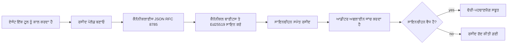
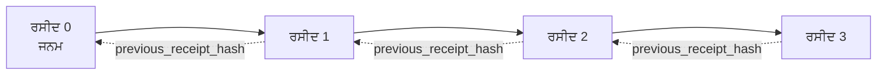

[ਪਾਠ ਮੁਫ਼ਤ ਵਿੱਡੀਓ ਵੇਖੋ: ਕ੍ਰਿਪਟੋਗ੍ਰਾਫਿਕ ਰਸੀਦਾਂ ਨਾਲ ਏਆਈ ਏਜੰਟਾਂ ਨੂੰ ਸੁਰੱਖਿਅਤ ਕਰਨਾ](https://youtu.be/PLACEHOLDER_VIDEO_ID)

> _(ਪਾਠ ਮੁਫ਼ਤ ਵਿੱਡੀਓ ਅਤੇ ਥੰਬਨੇਲ ਮਾਇਕਰੋਸੌਫਟ ਸਮੱਗਰੀ ਟੀਮ ਵਲੋਂ ਮਰਜ ਦੇ ਬਾਅਦ ਸ਼ਾਮਲ ਕੀਤੇ ਜਾਣਗੇ, ਪਾਠ 14 / 15 ਦੇ ਨਮੂਨੇ ਨਾਲ ਮੇਲ ਖਾਂਦੇ ਹੋਏ।)_

# ਕ੍ਰਿਪਟੋਗ੍ਰਾਫਿਕ ਰਸੀਦਾਂ ਨਾਲ ਏਆਈ ਏਜੰਟਾਂ ਨੂੰ ਸੁਰੱਖਿਅਤ ਕਰਨਾ

## ਪਰਿਚਯ

ਇਸ ਪਾਠ ਵਿੱਚ ਇਸ ਗੱਲ ਦੀ ਚਰਚਾ ਕੀਤੀ ਜਾਏਗੀ:

- ਕਿਉਂ ਏਆਈ ਏਜੰਟਾਂ ਲਈ ਆਡੀਟ ਟਰੇਲ ਅਨੁਕੂਲਤਾ, ਡਿਗਬੱਗਿੰਗ ਅਤੇ ਭਰੋਸੇ ਲਈ ਮਹੱਤਵਪੂਰਨ ਹਨ।
- ਕ੍ਰਿਪਟੋਗ੍ਰਾਫਿਕ ਰਸੀਦ ਕੀ ਹੈ ਅਤੇ ਇਹ ਇਨਸਾਈਨਡ ਲੌਗ ਲਾਈਨ ਤੋਂ ਕਿਵੇਂ ਵੱਖਰੀ ਹੈ।
- ਕਿਸ ਤਰ੍ਹਾਂ ਸਾਦੀ ਪਾਈਥਨ ਵਿੱਚ ਏਜੰਟ ਦੇ ਟੂਲ ਕਾਲ ਲਈ ਇੱਕ ਸਾਈਨ ਕੀਤੀ ਰਸੀਦ ਤਿਆਰ ਕਰਨੀ ਹੈ।
- ਕਿਵੇਂ ਆਫਲਾਈਨ ਰਸੀਦ ਦੀ ਜਾਂਚ ਕਰਨੀ ਹੈ ਅਤੇ ਛੇੜਛਾੜ ਪਤਾ ਲਗਾਉਣੀ ਹੈ।
- ਕਿਵੇਂ ਰਸੀਦਾਂ ਨੂੰ ਚੇਨ ਕਰਨਾ ਹੈ ਤਾਂ ਜੋ ਇੱਕ ਨੂੰ ਹਟਾਉਣ ਜਾਂ ਦੁਬਾਰਾ ਅਨੁਕੂਲਿਤ ਕਰਨ ਨਾਲ ਇਹ ਚੇਨ ਟੁੱਟ ਜਾਏ।
- ਕਿਹੜੀਆਂ ਗੱਲਾਂ ਰਸੀਦਾਂ ਸਾਬਤ ਕਰਦੀਆਂ ਹਨ ਅਤੇ ਉਹ ਸਪਸ਼ਟ ਤੌਰ 'ਤੇ ਕੀ ਨਹੀਂ ਸਾਬਤ ਕਰਦੀਆਂ।

## ਸਿੱਖਣ ਦੇ ਲਕੜ

ਇਸ ਪਾਠ ਨੂੰ ਪੂਰਾ ਕਰਨ ਤੋਂ ਬਾਅਦ, ਤੁਸੀਂ ਜਾਣੋਗੇ ਕਿ ਕਿਵੇਂ:

- ਫੇਲ੍ਹ ਮੋਡਜ਼ ਦੀ ਪਹਚਾਣ ਕਰਨੀ ਜੋ ਏਜੰਟ ਦੀਆਂ ਕਿਰਿਆਵਾਂ ਲਈ ਕ੍ਰਿਪਟੋਗ੍ਰਾਫਿਕ ਸ਼ੁਰੂਆਤ ਨੂੰ ਪ੍ਰੇਰਿਤ ਕਰਦੀਆਂ ਹਨ।
- ਇੱਕ ਕੈਨੋਨਿਕਲ JSON ਪੇਲੋਡ 'ਤੇ Ed25519-ਸਾਈਨ ਕੀਤੀ ਰਸੀਦ ਤਿਆਰ ਕਰਨੀ।
- ਸਾਈਨ ਕਰਨ ਵਾਲੇ ਦੀ ਪਬਲਿਕ ਕੀ ਦੀ ਵਰਤੋਂ ਕਰਕੇ ਇੱਕ ਰਸੀਦ ਨੂੰ ਸੁਤੰਤਰ ਤੌਰ 'ਤੇ ਜਾਂਚਣਾ।
- ਬਦਲਾਅ ਪਤਾ ਲਗਾਣ ਲਈ ਬਦਲੀ ਕੀਤੀ ਰਸੀਦ 'ਤੇ ਦੁਬਾਰਾ ਵੈਰੀਫਿਕੇਸ਼ਨ ਚਲਾਉਣਾ।
- ਰਸੀਦਾਂ ਦੀ ਹੈਸ਼-ਚੇਨ ਕੀਤੀ ਲੜੀ ਤਿਆਰ ਕਰਨੀ ਅਤੇ ਇਹ ਸਮਝਾਉਣਾ ਕਿ ਚੇਨ ਕਿਉਂ ਮਹੱਤਵਪੂਰਨ ਹੈ।
- ਇਹ ਪਛਾਣਣਾ ਕਿ ਰਸੀਦਾਂ ਕੀ ਸਾਬਤ ਕਰਦੀਆਂ ਹਨ (ਅਟ੍ਰਿਬਿਊਸ਼ਨ, ਇੰਟੀਗ੍ਰਿਟੀ, ਕ੍ਰਮ) ਅਤੇ ਉਹ ਕੀ ਨਹੀਂ ਸਾਬਤ ਕਰਦੀਆਂ (ਕਾਰਵਾਈ ਦੀ ਸਹੀਤਾ, ਨੀਤੀ ਦੀ ਯਥਾਰਥਤਾ)।

## ਸਮੱਸਿਆ: ਤੁਹਾਡੇ ਏਜੰਟ ਦਾ ਆਡੀਟ ਟਰੇਲ

ਕਲਪਨਾ ਕਰੋ ਕਿ ਤੁਸੀਂ Contoso Travel ਲਈ ਇੱਕ ਏਆਈ ਏਜੰਟ ਲਾਗੂ ਕੀਤਾ ਹੈ। ਏਜੰਟ ਗ੍ਰਾਹਕ ਦੀਆਂ ਬੇਨਤੀਆਂ ਨੂੰ ਪੜ੍ਹਦਾ ਹੈ, ਉਡਾਣਾਂ ਦੀਆਂ ਵਿਕਲਪਾਂ ਵੇਖਣ ਲਈ ਇੱਕ ਫਲਾਈਟ API ਕਾਲ ਕਰਦਾ ਹੈ, ਅਤੇ ਗ੍ਰਾਹਕ ਵੱਲੋਂ ਸੀਟਾਂ ਬੁਕ ਕਰਦਾ ਹੈ। ਪਿਛਲੇ ਤਿਮਾਹੀ ਵਿੱਚ, ਏਜੰਟ ਨੇ 50,000 ਬੁਕਿੰਗਾਂ ਪ੍ਰਕਾਸ਼ਤ ਕੀਤੀਆਂ।

ਅੱਜ ਇੱਕ ਆਡੀਟਰ ਆਉਂਦਾ ਹੈ। ਉਹ ਇੱਕ ਸਧਾਰਣ ਸਵਾਲ ਪੁੱਛਦਾ ਹੈ: "ਮੈਨੂੰ ਦਿਖਾਓ ਕਿ ਤੁਹਾਡੇ ਏਜੰਟ ਨੇ ਕੀ ਕੀਤਾ।"

ਤੁਸੀਂ ਆਪਣੇ ਲੌਗ ਫਾਈਲਾਂ ਦੇ ਦਿੰਦੇ ਹੋ। ਆਡੀਟਰ ਉਹਨਾਂ ਨੂੰ ਦੇਖਦਾ ਹੈ ਅਤੇ ਮੁਸ਼ਕਲ ਸਵਾਲ ਪੁੱਛਦਾ ਹੈ: "ਮੈਨੂੰ ਕਿਵੇਂ ਪਤਾ ਕਿ ਇਹ ਲੌਗ ਦਿੱਤੇ ਗਏ ਵੇਲੇ ਤਬਦੀਲ nahi ਹੋਏ?"

ਇਹ ਆਡੀਟ-ਟਰੇਲ ਸਮੱਸਿਆ ਹੈ। ਅੱਜਕਲ ਦੇ ਬਹੁਤ ਸਾਰੇ ਏਜੰਟ ਤਿਆਰ ਕਰਨ ਵਾਲੇ ਆਮ ਤੌਰ 'ਤੇ ਉਪਰੋਕਤ ਉਨਾਂ 'ਤੇ ਨਿਰਭਰ ਕਰਦੇ ਹਨ:

- **ਐਪਲੀਕੇਸ਼ਨ ਲੌਗ**: ਏਜੰਟ ਖੁਦ ਲਿਖਦਾ ਹੈ, ਕਿਸੇ ਨੂੰ ਵੀ ਫਾਇਲ-ਸਿਸਟਮ ਦੀ ਪਹੁੰਚ ਹੋਣ 'ਤੇ ਸੋਧ ਕੀਤੀ ਜਾ ਸਕਦੀ ਹੈ।
- **ਕਲਾਉਡ ਲੌਗਿੰਗ ਸਰਵਿਸਿਜ਼**: ਪਲੈਟਫਾਰਮ ਤਹਿ ਲੱਭਣਯੋਗ ਹਨ ਪਰ ਕੇਵਲ ਜਦੋਂ ਆਡੀਟਰ ਪਲੈਟਫਾਰਮ ਆਪਰੇਟਰ 'ਤੇ ਭਰੋਸਾ ਕਰਦਾ ਹੈ।
- **ਡਾਟਾਬੇਸ ਟ੍ਰਾਂਜ਼ੈਕਸ਼ਨ ਲੌਗ**: ਡਾਟਾਬੇਸ ਬਦਲਾਅ ਲਈ ਬਿਹਤਰ ਹਨ ਪਰ ਅਣਖੁਦ੍ਰਾ ਟੂਲ ਕਾਲ ਲਈ ਨਹੀਂ।

ਇਹਨਾਂ ਵਿੱਚੋਂ ਕੋਈ ਵੀ ਆਡੀਟਰ ਦੇ ਸਵਾਲ ਦਾ ਜਵਾਬ ਬਿਨਾਂ ਕਿਸੇ 'ਤੇ ਭਰੋਸਾ ਕਰਨ ਤੋਂ ਨਹੀਂ ਦੇ ਸਕਦਾ (ਤੁਸੀਂ, ਤੁਹਾਡਾ ਕਲਾਉਡ ਪ੍ਰਦਾਤਾ, ਤੁਹਾਡਾ ਡੀਟਾਬੇਸ ਵੇਂਡਰ)। ਅੰਦਰੂਨੀ ਵਰਤੋਂ ਲਈ ਇਹ ਭਰੋਸਾ ਅਕਸਰ ਮਨਜ਼ੂਰਯੋਗ ਹੁੰਦਾ ਹੈ। ਨਿਯੰਤਰਿਤ ਕੰਮ ਲਈ (ਫਾਇਨੈਂਸ, ਹੈਲਥਕੇਅਰ, ਯੂਰਪੀ ਯੂਐਈ ਏਆਈ ਐਕਟ ਦੇ ਅਧੀਨ ਕੁਝ) ਇਹ ਮਨਜ਼ੂਰ ਨਹੀਂ ਹੁੰਦਾ।

ਕ੍ਰਿਪਟੋਗ੍ਰਾਫਿਕ ਰਸੀਦਾਂ ਇਸ ਸਮੱਸਿਆ ਦਾ ਹੱਲ ਦਿੰਦੀਆਂ ਹਨ ਜਿਸ ਨਾਲ ਹਰ ਏਜੰਟ ਕਾਰਵਾਈ ਨੂੰ ਸੁਤੰਤਰ ਤੌਰ 'ਤੇ ਜਾਂਚਿਆ ਜਾ ਸਕਦਾ ਹੈ। ਆਡੀਟਰ ਨੂੰ ਤੁਹਾਡੇ ਤੇ ਭਰੋਸਾ ਕਰਨ ਦੀ ਲੋੜ ਨਹੀਂ। ਉਨ੍ਹਾਂ ਨੂੰ ਸਿਰਫ ਤੁਹਾਡੀ ਪਬਲਿਕ ਕੀ ਅਤੇ ਰਸੀਦ ਦੀ ਜ਼ਰੂਰਤ ਹੈ।

## ਕ੍ਰਿਪਟੋਗ੍ਰਾਫਿਕ ਰਸੀਦ ਕੀ ਹੈ?

ਇੱਕ ਰਸੀਦ ਇੱਕ JSON ਵਸਤੂ ਹੁੰਦੀ ਹੈ ਜੋ ਦਰਜ ਕਰਦੀ ਹੈ ਕਿ ਏਜੰਟ ਨੇ ਕੀ ਕੀਤਾ, ਇਸ ਨੂੰ ਇੱਕ ਡਿਜੀਟਲ ਹਸਤਾਖਰ ਨਾਲ ਸਾਈਨ ਕੀਤਾ ਗਿਆ ਹੈ।


```mermaid
flowchart LR
    A[ਏਜੰਟ ਇੱਕ ਟੂਲ ਨੂੰ ਕਾਲ ਕਰਦਾ ਹੈ] --> B[ਰਸੀਦ ਪੇਲੋਡ ਬਣਾਓ]
    B --> C[ਕੈਨੋਨੀਕਲਾਈਜ਼ JSON RFC 8785]
    C --> E[ਕੈਨੋਨੀਕਲ ਬਾਈਟਸ ਤੇ Ed25519 ਸਾਇਨ ਕਰੋ]
    E --> F[ਸਾਇਨਚੀਹਨ ਸਮੇਤ ਰਸੀਦ]
    F --> G[ਆਡੀਟਰ ਅਫਲਾਈਨ ਜਾਂਚ ਕਰਦਾ ਹੈ]
    G --> H{ਸਾਇਨਚੀਹਨ ਵੈਧ ਹੈ?}
    H -- yes --> I[ਚੋਰੀ-ਪਹਚਾਣਯੋਗ ਸਬੂਤ]
    H -- no --> J[ਰਸੀਦ ਰੱਦ ਕੀਤੀ ਗਈ]
```

ਇੱਕ ਘੱਟੋ-ਘੱਟ ਰਸੀਦ ਇਸ ਤਰ੍ਹਾਂ ਦੇਖਦੀ ਹੈ:

```json
{
  "type": "agent.tool_call.v1",
  "agent_id": "contoso-travel-bot",
  "tool_name": "lookup_flights",
  "tool_args_hash": "sha256:a3f9c1...",
  "result_hash": "sha256:7b2e1d...",
  "policy_id": "contoso-travel-policy-v3",
  "timestamp": "2026-04-25T14:30:00Z",
  "sequence": 47,
  "previous_receipt_hash": "sha256:9d4e6a...",
  "signature": {
    "alg": "EdDSA",
    "sig": "c5af83...",
    "public_key": "8f3b2c..."
  }
}
```

ਤਿੰਨ ਖਾਸ ਸਮੱਗਰੀ ਕੰਮ ਕਰ ਰਹੀਆਂ ਹਨ:

1. **ਹਸਤਾਖਰ**. ਰਸੀਦ ਏਜੰਟ ਦੇ ਗੇਟਵੇ ਵੱਲੋਂ ਇੱਕ Ed25519 ਨਿੱਜੀ ਕੁੰਜੀ ਨਾਲ ਹਸਤਾਖਰ ਕੀਤੀ ਜਾਂਦੀ ਹੈ। ਜਿਸ ਨੂੰ ਸਹੀ ਜਨਕਾਰੀ ਵਾਲੇ ਜਿਸਦੇ ਕੋਲ ਜਨਕਾਰੀ ਕੁੰਜੀ ਹੋਵੇ ਉਹ ਇਸ ਹਸਤਾਖਰ ਦੀ ਆਫਲਾਈਨ ਜਾਂਚ ਕਰ ਸਕਦਾ ਹੈ। ਕਿਸੇ ਵੀ ਖੇਤਰ ਵਿਚ ਛੇੜਛਾੜ ਨਾਲ ਹਸਤਾਖਰ ਤਬਾਹ ਹੋ ਜਾਂਦਾ ਹੈ।

2. **ਕੈਨੋਨਿਕਲ ਕੋਡਿੰਗ**. ਸਾਈਨ ਕਰਨ ਤੋਂ ਪਹਿਲਾਂ, ਰਸੀਦ ਨੂੰ JSON ਕੈਨੋਨਿਕਲਾਈਜ਼ੇਸ਼ਨ ਸਕੀਮ (JCS, RFC 8785) ਦੀ ਵਰਤੋਂ ਕਰਕੇ ਸੀਰੀਅਲਾਈਜ਼ ਕੀਤਾ ਜਾਂਦਾ ਹੈ। ਇਸ ਨਾਲ ਇਹ ਯਕੀਨ ਹੁੰਦਾ ਹੈ ਕਿ ਦੋ ਤਰੀਕੇ ਜਿਹੜੇ ਇੱਕੋ ਹੀ ਤਰੱਕੀਬੀ ਰਸੀਦ ਤਿਆਰ ਕਰਦੇ ਹਨ, ਉਹ ਬਾਈਟ-ਮਿਲਦੇ ਜਾਣ ਵਾਲੀ ਆਉਟਪੁਟ ਤਿਆਰ ਕਰਦੇ ਹਨ। ਬਿਨਾਂ ਕੈਨੋਨਿਕਲਾਈਜ਼ੇਸ਼ਨ ਦੇ, ਵੱਖ-ਵੱਖ JSON ਸੀਰੀਅਲਾਈਜ਼ਰ ਇੱਕੋ ਸਮੱਗਰੀ ਲਈ ਵੱਖ-ਵੱਖ ਹਸਤਾਖਰ ਪੈਦਾ ਕਰਦੇ।

3. **ਹੈਸ਼ ਚੇਨਿੰਗ**. `previous_receipt_hash` ਖੇਤਰ ਹਰ ਰਸੀਦ ਨੂੰ ਪਿਛਲੀ ਰਸੀਦ ਨਾਲ ਜੋੜਦਾ ਹੈ। ਕਿਸੇ ਰਸੀਦ ਨੂੰ ਹਟਾਉਣ ਜਾਂ ਦੁਬਾਰਾ ਅਨੁਕ੍ਰਮਿਤ ਕਰਨ ਨਾਲ ਲੜੀ ਵਿੱਚ ਹਰ ਰਸੀਦ ਖਰਾਬ ਹੋ ਜਾਂਦੀ ਹੈ। ਛੇੜਛਾੜ ਚੇਨ ਪੱਧਰ 'ਤੇ ਸਮਝਾਈ ਜਾਂਦੀ ਹੈ ਭਾਵੇਂ ਨਿੱਜੀ ਹਸਤਾਖਰ ਪਾਸ ਕਰ ਜਾ ਰਹੇ ਹੋਣ।

ਇਹਨਾਂ ਖਾਸ ਸਮੱਗ੍ਰੀਆਂ ਮਿਲ ਕੇ ਤਿੰਨ ਗਾਰੰਟੀ ਪ੍ਰਦਾਨ ਕਰਦੀਆਂ ਹਨ:

- **ਅਟ੍ਰਿਬਿਊਸ਼ਨ**: ਇਸ ਕੁੰਜੀ ਨੇ ਇਸ ਸਮੱਗਰੀ ਨੂੰ ਸਾਈਨ ਕੀਤਾ।
- **ਇੰਟੀਗ੍ਰਿਟੀ**: ਸਮੱਗਰੀ ਸਾਈਨ ਕਰਨ ਤੋਂ ਬਾਅਦ ਬਦਲੀ ਨਹੀਂ ਹੋਈ।
- **ਕ੍ਰਮ**: ਇਹ ਰਸੀਦ ਚੇਨ ਵਿੱਚ ਉਸ ਰਸੀਦ ਤੋਂ ਬਾਅਦ ਆਈ।

## ਪਾਈਥਨ ਵਿੱਚ ਰਸੀਦ ਬਣਾਉਣਾ

ਰਸੀਦ ਤਿਆਰ ਕਰਨ ਲਈ ਤੁਹਾਨੂੰ ਕੋਈ ਖ਼ਾਸ ਲਾਇਬ੍ਰੇਰੀ ਦੀ ਲੋੜ ਨਹੀਂ। ਕ੍ਰਿਪਟੋਗ੍ਰਾਫਿਕ ਪ੍ਰਿਮਿਟਿਵ ਵਿਆਪਕ ਤੌਰ 'ਤੇ ਮਿਲਦੇ ਹਨ ਅਤੇ ਲਾਜਿਕ ਕੁਝ ਦਰਜਨ ਲਾਈਨਾਂ ਪਾਈਥਨ ਵਿੱਚ ਹੀ ਹੈ।

`code_samples/18-signed-receipts.ipynb` ਵਿੱਚ ਹੱਥ-ਓਨ ਅਭਿਆਸ ਪੂਰੀ ਲੜੀ ਦਾ ਸਫਰ ਕਰਦੇ ਹਨ। ਸੰਖੇਪ ਸੰਸਕਰਣ:

```python
import json
import hashlib
import base64
from nacl import signing
from jcs import canonicalize  # RFC 8785 ਪ੍ਰਮਾਣਿਕ JSON

def b64url_nopad(data: bytes) -> str:
    return base64.urlsafe_b64encode(data).decode("ascii").rstrip("=")

def sha256_canonical(obj) -> str:
    """SHA-256 of a Python object's JCS-canonical JSON form."""
    return f"sha256:{hashlib.sha256(canonicalize(obj)).hexdigest()}"

# ਇਕ ਸਾਈਨਿੰਗ ਕੁੰਜੀ ਬਣਾਓ ਜਾਂ ਲੋਡ ਕਰੋ (ਉਤਪਾਦਨ ਵਿੱਚ, ਕਿ ਕੁੰਜੀ ਵਾਲਟ ਵਿੱਚ ਸਟੋਰ ਕਰੋ)
signing_key = signing.SigningKey.generate()
verify_key = signing_key.verify_key

# ਰਸੀਦ ਪੇਲੋਡ ਤਿਆਰ ਕਰੋ (ਅਜੇ ਤਕ ਕੋਈ ਦਸਤਖਤ ਨਹੀਂ)
tool_args = {"origin": "SYD", "destination": "LAX"}
tool_result = [{"flight": "QF11", "price": 1850, "stops": 0}]

payload = {
    "type": "agent.tool_call.v1",
    "agent_id": "contoso-travel-bot",
    "tool_name": "lookup_flights",
    "tool_args_hash": sha256_canonical(tool_args),
    "result_hash": sha256_canonical(tool_result),
    "policy_id": "contoso-travel-policy-v3",
    "timestamp": "2026-04-25T14:30:00Z",
    "sequence": 0,
    "previous_receipt_hash": None,
}

# ਸਿੱਧਾ JCS ਬਾਈਟਸ ਨੂੰ ਪ੍ਰਮਾਣਿਕ ਕਰੋ ਅਤੇ ਦਸਤਖਤ ਕਰੋ। PureEdDSA ਅੰਦਰੂਨੀ ਤੌਰ 'ਤੇ ਹੈਸ਼ ਕਰਦਾ ਹੈ।
canonical_bytes = canonicalize(payload)
signature_bytes = signing_key.sign(canonical_bytes).signature

# ਇੱਕ ਸੰਰਚਿਤ ਦਸਤਖਤ ਵਸਤੂ ਜੁੜੋ।
receipt = {
    **payload,
    "signature": {
        "alg": "EdDSA",
        "sig": b64url_nopad(signature_bytes),
        "public_key": b64url_nopad(bytes(verify_key)),
    },
}
```

ਇਹ ਸਾਰਾ ਸਾਈਨਿੰਗ ਪਾਈਪਲਾਈਨ ਹੈ। ਨੋਟਬੁੱਕ ਵਿੱਚ ਅਭਿਆਸ ਹਰੇਕ ਕਦਮ ਨੂੰ ਵਿਆਪਕ ਤੌਰ 'ਤੇ ਦਿਖਾਉਂਦੇ ਹਨ।

## ਰਸੀਦ ਦੀ ਜਾਂਚ ਅਤੇ ਛੇੜਛਾੜ ਪਤਾ ਲਗਾਉਣਾ

ਜਾਂਚ ਉਲਟੀ ਕਾਰਵਾਈ ਹੈ:

```python
import base64
import hashlib
from nacl import signing
from nacl.exceptions import BadSignatureError
from jcs import canonicalize

def b64url_decode(s: str) -> bytes:
    padding = "=" * ((4 - len(s) % 4) % 4)
    return base64.urlsafe_b64decode(s + padding)

def verify_receipt(receipt: dict) -> bool:
    # ਸਿਗਨੇਚਰ ਇੱਕ ਸੰਰਚਿਤ ਓਬਜੈਕਟ ਹੈ: {"alg", "sig", "public_key"}।
    sig_obj = receipt.get("signature")
    if not sig_obj or sig_obj.get("alg") != "EdDSA":
        return False

    # ਉ payload ਮੁੜ ਬਣਾਓ ਜੋ ਵਾਸ਼ਤਵ ਵਿੱਚ ਸਾਈਨ ਕੀਤਾ ਗਿਆ ਸੀ (ਸਿਗਨੇਚਰ ਨੂੰ ਛੱਡ ਕੇ ਸਭ ਕੁਝ)।
    payload = {k: v for k, v in receipt.items() if k != "signature"}

    canonical_bytes = canonicalize(payload)

    try:
        verify_key = signing.VerifyKey(b64url_decode(sig_obj["public_key"]))
        verify_key.verify(canonical_bytes, b64url_decode(sig_obj["sig"]))
        return True
    except BadSignatureError:
        return False
```

ਇਹ ਫੰਕਸ਼ਨ ਇੱਕ ਰਸੀਦ ਲੈਂਦਾ ਹੈ ਅਤੇ ਜੇ ਸਾਈਨ ਸਹੀ ਹੈ ਤਾਂ `True` ਵਾਪਸ ਕਰਦਾ ਹੈ, ਨਹੀਂ ਤਾਂ `False`। ਕੋਈ ਨੈੱਟਵਰਕ ਕਾਲ ਨਹੀਂ, ਕੋਈ ਸਰਵਿਸ ਨਿਰਭਰਤਾ ਨਹੀਂ, ਕਿਸੇ ਤੀਜੇ ਪੱਖ 'ਤੇ ਭਰੋਸਾ ਲੋੜੀਂਦਾ ਨਹੀਂ।

ਛੇੜਛਾੜ ਪਤਾ ਲਗਾਉਣ ਦੀ ਕਾਰਵਾਈ ਦੇਖਣ ਲਈ ਨੋਟਬੁੱਕ ਵਿੱਚ ਇਹ ਸਿਖਾਇਆ ਜਾਂਦਾ ਹੈ:

1. ਇੱਕ ਸਹੀ ਰਸੀਦ ਤਿਆਰ ਕਰਨੀ ਅਤੇ ਪੁਸ਼ਟੀ ਕਰਨੀ ਕਿ ਜਾਂਚ ਸਹੀ ਹੈ।
2. `tool_args_hash` ਖੇਤਰ ਵਿੱਚ ਇੱਕ ਬਾਈਟ ਸੋਧ ਕਰਨੀ।
3. ਜੇਚਕ ਕਰਨ ਦਾ ਦੁਬਾਰਾ ਚਲਣਾ ਅਤੇ ਇਸਦੀ ਨਾਕਾਮੀ ਦੇਖਣਾ।

ਇਹ ਪ੍ਰਯੋਗਸ਼ਾਲਾ ਹੈ ਜੋ ਦਰਸਾਉਂਦੀ ਹੈ ਕਿ ਰਸੀਦਾਂ ਛੇੜਛਾੜ-ਪ੍ਰਤੀਰੋਧੀ ਹੁੰਦੀਆਂ ਹਨ: ਕੋਈ ਵੀ ਸੋਧ, ਭਾਵੇਂ ਛੋਟੀ ਹੋਵੇ, ਸਾਈਨ ਨੂੰ ਟੁੱਟ ਪਾ ਦਿੰਦੀ ਹੈ।

## ਬਹੁ-ਕਦਮੀ ਏਜੰਟਾਂ ਲਈ ਰਸੀਦਾਂ ਦੀ ਚੇਨਿੰਗ

ਇੱਕ ਇਕੱਲੀ ਸਾਈਨ ਕੀਤੀ ਰਸੀਦ ਇੱਕ ਕਾਰਵਾਈ ਦੀ ਰੱਖਿਆ ਕਰਦੀ ਹੈ। ਰਸੀਦਾਂ ਦੀ ਚੇਨ ਸਕ੍ਰਮ ਦੀ ਰੱਖਿਆ ਕਰਦੀ ਹੈ।


```mermaid
flowchart LR
    R0[ਰਸੀਦ 0<br/>ਜਨਮ] --> R1[ਰਸੀਦ 1]
    R1 --> R2[ਰਸੀਦ 2]
    R2 --> R3[ਰਸੀਦ 3]
    R1 -. previous_receipt_hash .-> R0
    R2 -. previous_receipt_hash .-> R1
    R3 -. previous_receipt_hash .-> R2
```

ਹਰ ਰਸੀਦ ਆਪਣੇ ਪਿਛਲੇ ਰਸੀਦ ਦੇ ਹੈਸ਼ ਨੂੰ ਦਰਜ ਕਰਦੀ ਹੈ। ਚੁੱਪਕੇ ਨਾਲ ਰਸੀਦ 2 ਨੂੰ ਹਟਾਉਣ ਲਈ ਹਮਲਾਵਰ ਨੂੰ ਕੋਈ ਇੱਕ ਕਰਨਾ ਲੋੜੀਂਦਾ ਹੈ:

- ਰਸੀਦ 3 ਦੇ `previous_receipt_hash` ਖੇਤਰ ਨੂੰ ਸੋਧਣਾ (ਰਸੀਦ 3 ਦੇ ਸਾਈਨ ਨੂੰ ਤੋੜਦਾ ਹੈ), ਜਾਂ
- ਸੋਧੀ ਹੋਈ ਰਸੀਦ 3 'ਤੇ ਨਵਾਂ ਸਾਈਨ ਬਣਾਉਣਾ (ਏਜੰਟ ਦੀ ਨਿੱਜੀ ਕੁੰਜੀ ਦੀ ਲੋੜ ਹੈ)।

ਜੇ ਨਿੱਜੀ ਕੁੰਜੀ हारਡਵੇਅਰ ਕੁੰਜੀ ਵੌਲਟ ਵਿੱਚ ਹੈ ਅਤੇ ਤੁਸੀਂ ਹਰ ਰਸੀਦ ਨਾਲ ਪਬਲਿਕ ਕੀ ਪ੍ਰਕਾਸ਼ਿਤ ਕਰਦੇ ਹੋ, ਤਾਂ ਦੋਹਾਂ ਹਮਲਾਵਰ ਬਿਨਾਂ ਪਤਾ ਲਗੇ ਅਸੰਭਵ ਹਨ।

ਨੋਟਬੁੱਕ ਵਿੱਚ ਇਹ ਸਿਖਾਇਆ ਗਿਆ ਹੈ:

1. ਤਿੰਨ ਰਸੀਦਾਂ ਦੀ ਚੇਨ ਤਿਆਰ ਕਰਨਾ।
2. ਇਹ ਪੁਸ਼ਟੀ ਕਰਨਾ ਕਿ ਹਰ ਰਸੀਦ ਦਾ `previous_receipt_hash` ਪਿਛਲੀ ਰਸੀਦ ਦੇ ਅਸਲ ਹੈਸ਼ ਦੇ ਨਾਲ ਮੇਲ ਖਾਂਦਾ ਹੈ।
3. ਇਕ ਬੀਚ ਵਿੱਚ ਕਿਸੇ ਰਸੀਦ ਨਾਲ ਛੇੜਛਾੜ ਕਰਨਾ ਅਤੇ ਵੇਖਨਾ ਕਿ ਚੇਨ ਉਸ ਦੁਜੇ ਬਿੰਦੂ 'ਤੇ ਟੁੱਟ ਜਾਂਦੀ ਹੈ।

ਇਹ ਤਰੀਕਾ ਤੁਹਾਨੂੰ ਇੱਕ ਐਸਾ ਆਡੀਟ ਟਰੇਲ ਤਿਆਰ ਕਰਨ ਦਾ ਤਰੀਕਾ ਦਿੰਦਾ ਹੈ ਜੋ ਬਾਹਰੀ ਆਡੀਟਰ ਤੁਸੀਂ ਤੇ ਭਰੋਸਾ ਕੀਤੇ ਬਿਨਾਂ ਵੀ ਜਾਂਚ ਸਕਦਾ ਹੈ।

## ਰਸੀਦਾਂ ਕੀ ਸਾਬਤ ਕਰਦੀਆਂ ਹਨ (ਅਤੇ ਕੀ ਨਹੀਂ)

ਇਹ ਇਸ ਪਾਠ ਦਾ ਸਭ ਤੋਂ ਮਹੱਤਵਪੂਰਨ ਭਾਗ ਹੈ। ਰਸੀਦਾਂ ਤਾਕਤਵਰ ਹਨ ਪਰ ਉਹਨਾਂ ਦੀ ਤਾਕਤ ਸੀਮਿਤ ਹੈ।

**ਰਸੀਦ ਤਿੰਨ ਗੱਲਾਂ ਸਾਬਤ ਕਰਦੀਆਂ ਹਨ:**

1. **ਅਟ੍ਰਿਬਿਊਸ਼ਨ**: ਇੱਕ ਖਾਸ ਕੁੰਜੀ ਨੇ ਇੱਕ ਖਾਸ ਪੇਲੋਡ ਸਾਈਨ ਕੀਤਾ।
2. **ਇੰਟੀਗ੍ਰਿਟੀ**: ਪੇਲੋਡ ਸਾਈਨ ਕਰਨ ਤੋਂ ਬਾਅਦ ਨਹੀਂ ਬਦਲਾ।
3. **ਕ੍ਰਮ**: ਇਹ ਰਸੀਦ ਹੈਸ਼ ਚੇਨ ਵਿੱਚ ਉਸ ਰਸੀਦ ਤੋਂ ਬਾਅਦ ਆਈ।

**ਰਸੀਦ ਨਹੀਂ ਸਾਬਤ ਕਰਦੀਆਂ:**

1. **ਸਹੀਤਾ**: ਕਿ ਏਜੰਟ ਦੀ ਕਾਰਵਾਈ ਸਹੀ ਸੀ। ਇੱਕ ਰਸੀਦ ਗੱਲਤ ਜਵਾਬ ਲਈ ਵੀ ਸਾਫ ਸਾਈਨ ਹੋ ਸਕਦੀ ਹੈ।
2. **ਨੀਤੀ ਅਨੁਕੂਲਤਾ**: ਕਿ `policy_id` ਵਿੱਚ ਦਰਸਾਈ ਗਈ ਨੀਤੀ ਸੱਚਮੁੱਚ ਪਰਖੀ ਗਈ ਸੀ ਜਾਂ ਜੇ ਚੈੱਕ ਕੀਤੀ ਗਈ ਹੋਵੇ ਤਾਂ ਇਸ ਕਾਰਵਾਈ ਨੂੰ ਮਨਜ਼ੂਰ ਕੀਤੀ ਹੋਵੇਗੀ। ਰਸੀਦ ਦਰਜ ਕਰਦੀ ਹੈ ਕਿ ਕੀ ਦਾਅਵਾ ਕੀਤਾ ਗਿਆ ਸੀ, ਨਾ ਕਿ ਕਿ ਕੀ ਲਾਗੂ ਕੀਤਾ ਗਿਆ।
3. **ਕੁੰਜੀ ਤੋਂ ਬਾਹਰ ਪਹਚਾਣ**: ਰਸੀਦ ਕਹਿੰਦੀ ਹੈ "ਇਸ ਕੁੰਜੀ ਨੇ ਇਸ ਸਮੱਗਰੀ ਨੂੰ ਸਾਈਨ ਕੀਤਾ।" ਇਹ ਨਹੀਂ ਕਹਿੰਦੀ "ਇਸ ਮਨੁੱਖ ਨੇ ਮਨਜ਼ੂਰੀ ਦਿੱਤੀ।" ਕੁੰਜੀ ਨੂੰ ਕਿਸੇ ਵਿਅਕਤੀ ਜਾਂ ਸੰਗਠਨ ਨਾਲ ਜੋੜਨ ਲਈ ਅਲੱਗ ਪਹਚਾਣ ਢਾਂਚਾ ਦੀ ਲੋੜ ਹੁੰਦੀ ਹੈ (ਡਾਇਰੈਕਟਰੀ, ਜਨਤਕ ਕੁੰਜੀ ਰਜਿਸਟਰੀ ਆਦਿ)।
4. **ਇਨਪੁਟ ਦੀ ਸਚਾਈ**: ਜੇ ਏਜੰਟ ਨੂੰ ਛੇੜਛਾੜ ਕੀਤੀ ਗਈ ਪ੍ਰਾਂਪਟ ਮਿਲਦੀ ਹੈ ਅਤੇ ਉਸ ਤੇ ਕਾਰਵਾਈ ਕਰਦਾ ਹੈ, ਤਾਂ ਰਸੀਦ ਕਾਰਵਾਈ ਨੂੰ ਸਹੀ ਢੰਗ ਨਾਲ ਦਰਜ ਕਰਦੀ ਹੈ। ਰਸੀਦ ਇਨਪੁਟ ਸਹੀਤਾ ਦੇ ਬਾਅਦ ਹੁੰਦੀਆਂ ਹਨ, ਉਸਦੀ ਬਜਾਇ।

ਇਹ ਸੀਮਾ ਦੋ ਕਾਰਨਾਂ ਲਈ ਮਹੱਤਵਪੂਰਨ ਹੈ:

- ਇਹ ਦੱਸਦੀ ਹੈ ਕਿ ਰਸੀਦ ਕਿਸ ਲਈ ਫਾਇਦੇਮੰਦ ਹਨ: ਏਜੰਟ ਲਈ ਵਿਹਾਰਯੋਗ ਅਤੇ ਛੇੜਛਾੜ-ਪ੍ਰਤੀਰੋਧੀ ਬਣਾਉਣਾ, ਇੱਥੋਂ ਤੱਕ ਕਿ ਸੰਗਠਨਿਕ ਸੀਮਾਵਾਂ ਵੀ।
- ਇਹ ਦੱਸਦੀ ਹੈ ਕਿ ਤੁਹਾਨੂੰ ਹੋਰ ਕਿਹੜੇ ਤਹਿ ਲਗਾਉਣੇ ਪੈਣਗੇ: ਇਨਪੁਟ ਸਹੀਤਾ (ਪਾਠ 6), ਨੀਤੀ ਲਾਗੂ (ਥੋੜ੍ਹਾ ਹੇਠਾਂ ਦਿੱਤਾ), ਅਤੇ ਪਹਚਾਣ ਢਾਂਚਾ (ਇਸ ਪਾਠ ਤੋਂ ਬਾਹਰ)।

ਅਕਸਰ ਇੱਕ ਗਲਤੀ ਇਹ ਮੰਨਣਾ ਹੈ ਕਿ "ਸਾਡੇ ਕੋਲ ਰਸੀਦਾਂ ਹਨ" ਦਾ ਅਰਥ "ਅਸੀਂ ਸ਼ਾਸਨਵਾਲੇ ਹਾਂ" ਹੈ। ਇਹ ਨਹੀਂ। ਰਸੀਦ ਇੱਕ ਆਧਾਰ ਹਨ। ਸ਼ਾਸਨ ਉਹ ਪ੍ਰਣਾਲੀ ਹੈ ਜੋ ਤੁਸੀਂ ਉਸ ਦੇ ਉੱਪਰ ਬਣਾਉਂਦੇ ਹੋ।

## ਸਾਬਤ ਕਰਨਾ ਕਿ ਮਨੁੱਖ ਨੇ ਵਿਸ਼ੇਸ਼ ਕਾਰਵਾਈ ਮਨਜ਼ੂਰ ਕੀਤੀ ਹੈ

ਉੱਪਰ ਆਈ ਆਈਟਮ 3 ਆਪਣਾ ਖਾਸ ਹਿੱਸਾ ਬਣਾਉਂਦੀ ਹੈ: ਇੱਕ ਕਾਰਵਾਈ ਰਸੀਦ ਕਹਿੰਦੀ ਹੈ "ਇਸ ਕੁੰਜੀ ਨੇ ਇਹ ਸਮੱਗਰੀ ਸਾਈਨ ਕੀਤੀ," ਕਦੇ ਨਹੀਂ ਕਹਿੰਦੀ "ਇਸ ਮਨੁੱਖ ਨੇ ਮਨਜ਼ੂਰੀ ਦਿੱਤੀ।" ਵੱਡੇ-ਖ਼ਤਰਿਆਂ ਵਾਲੀਆਂ ਕਾਰਵਾਈਆਂ (ਰਿਫੰਡ, ਮਿਟਾਓ, ਤਾਰ ਪ੍ਰੇਰਣਾ) ਲਈ ਸ਼ਾਸਨ ਫਰੇਮਵਰਕ ਵੱਧ ਤੋਂ ਵੱਧ ਉਸ ਖ਼ਾਸ ਗੱਲ ਦੀ ਮੰਗ ਕਰਦੇ ਹਨ, ਅਤੇ ਇਸਨੂੰ ਇਸ ਪਾਠ ਵਿੱਚ ਤਿਆਰ ਕੀਤੇ ਗਏ ਸਾਡੇ ਹੀ ਪ੍ਰਿਮਿਟਿਵ ਨਾਲ ਤਿਆਰ ਕੀਤਾ ਜਾ ਸਕਦਾ ਹੈ।

ਅਗਲਾ ਨੋਟਬੁੱਕ `code_samples/human-authorization-receipts.ipynb` ਇੱਕ ਦੂਜੇ ਪ੍ਰਕਾਰ ਦੀ ਰਸੀਦ ਸ਼ਾਮਲ ਕਰਦਾ ਹੈ, `human.approval.v1`, ਜੋ ਪਾਠ ਦੀਆਂ ਰਸੀਦਾਂ ਦੇ ਨਾਲ ਇੱਕੋ ਐਨਵੈਲਪ ਆਕਾਰ ਵਿੱਚ ਹੈ (Ed25519 ਨਾਲ ਕੈਨੋਨਿਕਲ JCS ਬਾਈਟੰ ਤੇ ਹਸਤਾਖਰ ਕੀਤੀ ਇੱਕ ਟਾਈਪ ਕੀਤੀ ਪੇਲੋਡ, ਸਾਈਨ ਬਾਹਰ `signature` ਆਬਜੈਕਟ ਨਾਲ)। ਇੱਕ ਨਾਮਿਤ ਅਨੁਮਤੀਕਾਰ ਕਿਰਿਆ ਨੂੰ ਪ੍ਰਭਾਵਿਤ ਕਰਨ ਤੋਂ ਪਹਿਲਾਂ ਪੂਰੇ ਕੈਨੋਨਿਕਲ ਕਾਰਵਾਈ ਅਤੇ ਉਸਦੇ ਡਾਇਜੈਸਟ ਨੂੰ ਸਾਈਨ ਕਰਦਾ ਹੈ; ਏਜੰਟ ਦੀ ਕਾਰਵਾਈ ਰਸੀਦ ਵਿੱਚ ਉਹੇ ਕਾਰਵਾਈ ਡਾਇਜੈਸਟ ਅਤੇ ਇੱਕ `parent_approval_ref`, ਜੋ ਮਨਜ਼ੂਰੀ ਦੀ `receipt_hash` ਹੈ, ਸ਼ਾਮਲ ਹੁੰਦੀ ਹੈ, ਜੋ ਉਪਰ ਚੇਨ ਵਿੱਚ ਵਰਤੇ `previous_receipt_hash` ਨਾਲ ਮੇਲ ਖਾਂਦੀ ਹੈ। ਇੱਕ `verify_chain` ਦੋਹਾਂ ਨਮੂਨਿਆਂ ਨੂੰ ਪਿੰਨ ਕੀ ਰਜਿਸਟਰੀਆਂ (ਅਨੁਮਤੀਕਾਰ ਕੁੰਜੀਆਂ ਬਨਾਮ ਏਜੰਟ ਕੁੰਜੀਆਂ) ਤੋਂ ਹੇਠਾਂ ਜਾਂਚਦਾ ਹੈ, ਇਸ ਲਈ ਕੋਡ ਰਸਤਾ ਸਾਂਝਾ ਹੈ ਪਰ ਅਧਿਕਾਰ ਕਦੇ ਨਹੀਂ।

ਇਸ ਗੁਣ ਨੂੰ ਧਿਆਨ ਨਾਲ ਕਿਹਾ ਗਿਆ ਹੈ: *ਮਨੁੱਖ ਨੇ ਇਸ ਵਿਸ਼ੇਸ਼ ਕਾਰਵਾਈ ਨੂੰ ਮਨਜ਼ੂਰ ਕੀਤਾ, ਅਤੇ ਏਜੰਟ ਨੇ ਠੀਕ ਇਸ ਮਨਜ਼ੂਰ ਕੀਤੀ ਗਈ ਕਾਰਵਾਈ ਨੂੰ ਅਮਲ ਵਿੱਚ ਲਿਆਇਆ।* ਨੋਟਬੁੱਕ ਵਿੱਚ ਰੱਦ ਕਰਨ ਵਾਲੀਆਂ ਵਿਸ਼ੇਸ਼ਤਾਵਾਂ ਇਸ ਗੁਣ ਨੂੰ ਸੱਚਾ ਬਣਾਉਂਦੀਆਂ ਹਨ ਨਾ ਕਿ ਕੇਵਲ ਕਹਿੰਦੀਆਂ:

- ਪੁਰਾਣਾ ਸੈੱਟ: ਛੇੜਛਾੜ, ਗ਼ਲਤ ਡਿਪਟੀ, ਦੁਹਰਾਈ, ਦੋਹਰੀ ਕੁੰਜੀਆਂ ਦੋਹਾਂ ਪਾਸਿਆਂ ਤੇ, ਗਲਤ ਇਨਪੁਟ;
- **ਪੁਰਾਣਾ ਅਧਿਕਾਰ**: ਹਸਤਾਖਰ ਜੋ ਫਿਰ ਵੀ ਜਾਂਚਦਾ ਹੈ, ਪਰ ਮਨਜ਼ੂਰੀ ਦੇਣ ਤੋਂ ਇਨਕਾਰ ਕੀਤਾ ਜਾਂਦਾ ਹੈ ਕਿਉਂਕਿ ਨੀਤੀ ਸੰਸਕਰਨ ਬਦਲ ਗਿਆ, ਅਨੁਮਤੀਕਾਰ ਕੁੰਜੀ ਪਿੰਨ ਰਜਿਸਟਰੀ ਤੋਂ ਹਟਾਇਆ ਗਿਆ, ਜਾਂ ਮਨਜ਼ੂਰੀ ਕਾਰਵਾਈ ਤੋਂ ਪਹਿਲਾਂ ਸਮਾਪਤ ਹੋ ਗਈ;
- **ਡਾਇਜੈਸਟ ਬਦਲਾਅ**: ਇੱਕ ਵੈਧ ਤੌਰ 'ਤੇ ਸਾਈਨ ਕੀਤੀ ਕਾਰਵਾਈ ਰਸੀਦ ਜੋ ਇੱਕ *ਅਸਲ* ਮਨਜ਼ੂਰੀ ਵੱਲ ਇਸ਼ਾਰਾ ਕਰਦੀ ਹੈ ਜੋ ਇੱਕ *ਵੱਖਰੀ* ਕੈਨੋਨਿਕਲ ਕਾਰਵਾਈ ਨਾਲ ਜੁੜੀ ਹੈ।

ਹਰ ਨਾਕਾਮੀ ਵੱਖਰਾ ਕਾਰਣ ਨਾਲ ਇਨਕਾਰ ਕਰਦੀ ਹੈ, ਤਾ ਕਿ ਆਡੀਟਰ ਪੜ੍ਹ ਕੇ ਦੱਸ ਸਕੇ ਕਿ ਅਧਿਕਾਰ ਪੁਰਾਣਾ ਹੋਇਆ ਜਾਂ ਕਾਰਵਾਈ ਬਦਲੀ। ਨਿਯਮ ਜੋ ਨੋਟਬੁੱਕ ਸਿਖਾਉਂਦਾ ਹੈ: ਇੱਕ ਸਾਈਨ ਕੀਤੀ ਮਨਜ਼ੂਰੀ ਆਪੋ-ਆਪਣੇ ਵਿੱਚ ਅਧਿਕਾਰ ਨਹੀਂ। ਅਧਿਕਾਰ ਸਿਰਫ਼ ਤਾਂ ਹੁੰਦਾ ਹੈ ਜਦੋਂ ਦੋਹਾਂ ਰਸੀਦਾਂ ਕਾਰਵਾਈ ਦੇ ਸਮੇਂ ਇੱਕੋ ਹੀ ਕੈਨੋਨਿਕਲ ਕਾਰਵਾਈ ਨਾਲ ਜੁੜੀਆਂ ਰਹਿੰਦੀਆਂ ਹਨ। ਮਨੁੱਖ-ਅਨੁਮਤੀ ਰਸੀਦ ਇੱਕ ਪਾਠ ਵੱਲੋਂ ਪਰਿਭਾਸ਼ਿਤ ਸਿੱਖਿਆਕ ਸੰਯੋਜਨ ਹੈ, ਨਾ ਕਿ `draft-farley-acta-signed-receipts` ਵੱਲੋਂ ਪਰਿਭਾਸ਼ਿਤ ਰਸੀਦ ਕਿਸਮ।

## ਉਤਪਾਦਨ ਦੇ ਹਵਾਲੇ

ਇਸ ਪਾਠ ਵਿੱਚ ਪਾਈਥਨ ਕੋਡ ਸਾਦਾ ਰੱਖਿਆ ਗਿਆ ਹੈ ਤਾ ਕਿ ਤੁਸੀਂ ਹਰ ਲਾਈਨ ਨੂੰ ਪੜ੍ਹ ਕੇ ਸਮਝ ਸਕੋ ਕਿ ਕੀ ਹੋ ਰਿਹਾ ਹੈ। ਉਤਪਾਦਨ ਵਿੱਚ ਤੁਹਾਡੇ ਕੋਲ ਦੋ ਵਿਕਲਪ ਹਨ:

1. **ਕ੍ਰਿਪਟੋਗ੍ਰਾਫਿਕ ਪ੍ਰਿਮਿਟਿਵ ਤੇ ਸਿੱਧਾ ਕੰਮ ਕਰੋ।** ਉਪਰ ਦਿੱਤੀ 50 ਲਾਈਨਾਂ ਕਈ ਉਪਯੋਗਾਂ ਲਈ ਕਾਫ਼ੀ ਹਨ। PyNaCl (Ed25519) ਅਤੇ `jcs` ਪੈਕੇਜ (ਕੈਨੋਨਿਕਲ JSON) ਚੰਗੀ ਤਰ੍ਹਾਂ ਸੰਭਾਲੇ ਹੋਏ ਅਤੇ ਆਡੀਟ ਕੀਤੇ ਗਏ ਲਾਇਬ੍ਰੇਰੀਆਂ ਹਨ।

2. **ਉਤਪਾਦਨ ਰਸੀਦ ਲਾਇਬ੍ਰੇਰੀ ਦੀ ਵਰਤੋਂ ਕਰੋ।** ਕਈ ਖੁੱਲ੍ਹੇ ਸਰੋਤ ਪ੍ਰੋਜੈਕਟ ਓਹੀ ਪੈਟਰਨ ਹਾਲ ਕਰਦੇ ਹਨ ਜੋ ਵਾਧੂ ਵਿਸ਼ੇਸ਼ਤਾਵਾਂ ਦੇ ਨਾਲ (ਕੀ ਰੋਟੇਸ਼ਨ, ਬੈਚ ਵੈਰੀਫਿਕੇਸ਼ਨ, JWK ਸੈੱਟ ਵੰਡ, ਨੀਤੀ ਇੰਜਣ ਨਾਲ ਇੰਟੀਗ੍ਰੇਸ਼ਨ):
   - ਸਾਈਨਿੰਗ ਪਾਈਪਲਾਈਨ JCS ਅਤੇ ਸਾਈਨਚਰ ਸਕੋਪ ਸੰਮਤੀਆਂ ਨੂੰ ਇੱਕ ਸੁਤੰਤਰ IETF ਇੰਟਰਨੈੱਟ-ਡ੍ਰਾਫਟ ([`draft-farley-acta-signed-receipts`](https://datatracker.ietf.org/doc/draft-farley-acta-signed-receipts/), ਸੰਸ਼ੋਧਨ 02) ਵਿੱਚ ਵਰਤਦਾ ਹੈ। ਇਸ ਪਾਠ ਦੀ ਸਿੱਖਿਆਕ ਰਸੀਦ ਡ੍ਰਾਫਟ ਦੇ `{payload, signature}` ਐਨਵੈਲਪ ਤੋਂ ਵੱਖਰੀ ਹੈ ਅਤੇ ਇਸਨੂੰ ਇਕ ਸੂਚਿਤ ਅਮਲ-ਕਾਰਨੀ ਵਜੋਂ ਪੇਸ਼ ਨਹੀਂ ਕੀਤਾ ਗਿਆ। ਡ੍ਰਾਫਟ ਦੇ ਵਾਇਰ ਫਾਰਮੈਟ ਨੂੰ ਹੇਠਾਂ ਲੈ ਕੇ ਨਿਰਮਿਤਾਂ ਲਈ ਸਾਂਝਾ ਸਰਟੀਫਿਕੇਸ਼ਨ ਸੂਟ ਜਾਰੀ ਕਰਦਾ ਹੈ ([agent-governance-testvectors](https://github.com/ScopeBlind/agent-governance-testvectors))।
   - ਮਾਇਕਰੋਸੌਫਟ ਏਜੰਟ ਗਵਰਨੈਂਸ ਟੂਲਕਿਟ ਸੀਡਰ-ਅਧਾਰਿਤ ਨੀਤੀ ਫੈਸਲੇ ਨਾਲ ਰਸੀਦਾਂ ਨੂੰ ਜੋੜਦਾ ਹੈ; ਉਸ ਰਿਪੋਜ਼ਟਰੀ ਵਿੱਚ ਟਿਊਟੋਰਿਯਲ 33 ਵਿੱਚ ਇਕ ਅੰਤ-ਤਕ ਉਦਾਹਰਨ ਵੇਖੋ।
   - `protect-mcp` (npm) ਅਤੇ `@veritasacta/verify` (npm) ਪੈਕੇਜ ਨੋਡ-ਅਧਾਰਿਤ ਰਸੀਦ ਸਾਈਨਿੰਗ ਅਤੇ ਆਫਲਾਈਨ ਵੈਰੀਫਿਕੇਸ਼ਨ ਦਾ ਨਿਰਮਾਣ ਕਰਦੇ ਹਨ, ਜਿਸਦਾ ਮਕਸਦ ਕਿਸੇ ਵੀ MCP ਸਰਵਰ ਨੂੰ ਛੇੜਛਾੜ-ਪ੍ਰਤੀਰੋਧੀ ਆਡੀਟ ਟਰੇਲ ਨਾਲ ਲਪੇਟਣਾ ਹੈ ਅਤੇ ਇੱਕ ਰੁਕੇ ਹੋਏ ਕਾਰਵਾਈ ਨਾਲ ਸਹਿਮਤ ਪ੍ਰਾਪਤ ਕਰਨ ਵਾਲਾ ਢਾਂਚਾ ਸ਼ਾਮਲ ਹੈ (ਡੈਸਕਟਾਪ ਫਲੋ ਵਿੱਚ WebAuthn-ਬੈਕਡ), ਜੋ ਮਨੁੱਖੀ-ਅਧਿਕਾਰਤਾ ਨੋਟਬੁੱਕ ਦੇ ਉਹੋ ਜਿਹਾ ਮਾਡਲ ਹੈ।
   - **[nobulex](https://github.com/arian-gogani/nobulex)** ਪਾਈਥਨ SDK (`pip install nobulex`) ਪਾਈਥਨ ਵਿੱਚ Ed25519 + JCS ਸਾਈਨਿੰਗ ਪੈਟਰਨ ਵਾਂਗ ਹੀ ਲੈਂਗਚੇਨ ਅਤੇ CrewAI ਇੰਟੀਗ੍ਰੇਸ਼ਨਾਂ ਦੇ ਨਾਲ ਪ੍ਰਦਾਨ ਕਰਦਾ ਹੈ, ਜਿਸ ਵਿੱਚ ਪ੍ਰਕਾਸ਼ਿਤ ਕ੍ਰਾਸ-ਵੈਰੀਫਿਕੇਸ਼ਨ ਟੈਸਟ ভੈਕਟਰ ਅਤੇ [OWASP PR #2210](https://github.com/OWASP/CheatSheetSeries/pull/2210) ਦੁਆਰਾ ਯੋਗਦਾਨ ਦਿੱਖਾਇਆ ਹੈ।

ਆਪਣਾ ਖੁਦ ਦਾ ਬਣਾਉਣਾ ਜਾਂ ਲਾਇਬ੍ਰੇਰੀ ਦੀ ਵਰਤੋਂ ਕਰਨ ਦਾ ਫੈਸਲਾ ਉਹੋ ਜਿਹਾ ਹੈ ਜਿਵੇਂ ਕਿ ਖੁਦ JWT ਲਾਇਬ੍ਰੇਰੀ ਲਿਖਣ ਅਤੇ ਇੱਕ ਟੈਸਟ ਕੀਤੀ ਹੋਈ ਵਰਤੋਂ ਕਰਨ ਵਿੱਚ ਹੁੰਦਾ ਹੈ: ਦੋਹਾਂ ਸਹੀ ਹਨ; ਲਾਇਬ੍ਰੇਰੀ ਸਮਾਂ ਬਚਾਉਂਦੀ ਹੈ ਅਤੇ ਆਡੀਟ ਸਤਹ ਘਟਾਉਂਦੀ ਹੈ; ਖੁਦ ਤਿਆਰ ਕਰਨ ਵਾਲਾ ਤਰੀਕਾ ਹਰ ਪ੍ਰਿਮਿਟਿਵ ਨੂੰ ਸਮਝਦਾ ਹੈ। ਇਹ ਪਾਠ ਤੁਹਾਨੂੰ ਖੁਦ ਬਣਾਉਣ ਦਾ ਰਸਤਾ ਸਿਖਾਉਂਦਾ ਹੈ ਤਾਂ ਜੋ ਤੁਹਾਡੇ ਕੋਲ ਹਰ ਦੋ ਰਾਹਾਂ ਲਈ ਬੁਨਿਆਦ ਹੋਵੇ।

## ਗਿਆਨ ਦੀ ਜਾਂਚ

ਅਭਿਆਸ ਅਭਿਆਸ ਕਰਨ ਤੋਂ ਪਹਿਲਾਂ ਆਪਣੀ ਸਮਝ ਦੀ ਜਾਂਚ ਕਰੋ।

**1. ਇੱਕ ਰਸੀਦ ਏਜੰਟ ਦੀ ਨਿੱਜੀ Ed25519 ਕੁੰਜੀ ਨਾਲ ਸਾਈਨ ਕੀਤੀ ਜਾਂਦੀ ਹੈ। ਆਡੀਟਰ ਕੋਲ ਸਿਰਫ਼ ਜਨਤਕ ਕੀ ਹੈ। ਕੀ ਆਡੀਟਰ ਰਸੀਦ ਨੂੰ ਆਫਲਾਈਨ ਜਾਂਚ ਸਕਦਾ ਹੈ?**

<details>
<summary>ਜਵਾਬ</summary>

ਹਾਂ। Ed25519 ਜਾਂਚ ਲਈ ਸਿਰਫ ਜਨਤਕ ਕੁੰਜੀ ਅਤੇ ਸਾਈਨ ਕੀਤੇ ਬਾਈਟਾਂ ਦੀ ਲੋੜ ਹੁੰਦੀ ਹੈ। ਕੋਈ ਨੈੱਟਵਰਕ ਕਾਲ ਨਹੀਂ, ਕੋਈ ਸਰਵਿਸ ਨਿਰਭਰਤਾ ਨਹੀਂ। ਇਹ ਗੁਣ ਰਸੀਦਾਂ ਨੂੰ ਹਵਾ-ਝੰਡੀ, ਬਹੁ-ਸੰਗਠਨਾਂ ਜਾਂ ਘੱਟ-ਭਰੋਸੇ ਵਾਲੇ ਆਡੀਟ ਸਥਿਤੀਆਂ ਵਿੱਚ ਫਾਇਦੇਮੰਦ ਬਣਾਉਂਦਾ ਹੈ।
</details>

**2. ਇਕ ਹਮਲਾਵਰ ਇੱਕ ਰਸੀਦ ਦੇ `policy_id` ਖੇਤਰ ਨੂੰ ਸੋਧਦਾ ਹੈ ਤਾਂ ਕਿ ਇਹ ਦਾਅਵਾ ਕਰ ਸਕੇ ਕਿ ਇਹ ਕਿਸੇ ਵੱਧ ਖੁਲ੍ਹੇ ਨੀਤੀ ਦੇ ਅਧੀਨ ਸੀ। ਸਾਈਨ ਮੂਲ ਪੇਲੋਡ ਤੇ ਸੀ। ਜਾਂਚ ਦੌਰਾਨ ਕੀ ਹੁੰਦਾ ਹੈ?**

<details>
<summary>ਜਵਾਬ</summary>


ਤਸਦੀਕ ਅਸਫਲ ਹੁੰਦੀ ਹੈ। ਸਾਈਨਚਰ ਨੇ ਮੂਲ ਪੇਲੋਡ ਦੇ ਕੈਨੌਨਿਕਲ ਬਾਇਟਸ ਉੱਤੇ ਗਣਨਾ ਕੀਤੀ ਸੀ; ਕਿਸੇ ਵੀ ਖੇਤਰ ਨੂੰ ਬਦਲਣਾ ਉਹ ਬਾਇਟਸ ਬਦਲ ਦਿੰਦਾ ਹੈ, ਜਿਸ ਨਾਲ ਸਾਈਨਚਰ ਅਵੈਧ ਹੋ ਜਾਂਦੀ ਹੈ। ਹਮਲਾਵਰ ਨੂੰ ਤਾਜ਼ਾ ਵੈਧ ਸਾਈਨਚਰ ਬਣਾਉਣ ਲਈ ਪ੍ਰਾਈਵੇਟ ਕੁੰਜੀ ਦੀ ਲੋੜ ਹੋਵੇਗੀ, ਜੋ ਉਹਨਾਂ ਕੋਲ ਨਹੀਂ ਹੈ।
</details>

**3. ਰਸੀਦ ਵਿੱਚ ਕੱਚੇ ਆਰਗੁਮੈਂਟਸ ਅਤੇ ਨਤੀਜੇ ਦੀ ਥਾਂ `tool_args_hash` ਅਤੇ `result_hash` ਕਿਉਂ ਸ਼ਾਮਲ ਹਨ?**

<details>
<summary>ਜਵਾਬ</summary>

ਦੋ ਕਾਰਨ। ਪਹਿਲਾਂ, ਰਸੀਦ ਨੂੰ ਜ਼ਿਆਦਾ ਮਿਲਾਭਗ ਵਾਲੇ ਮਾਹੌਲਾਂ ਵਿੱਚ ਸੰਭਾਲਣਾ ਜਾਂ ਸਥਾਨਾਂਤਰਿਤ ਕਰਨਾ ਪੈ ਸਕਦਾ ਹੈ ਜਿੱਥੇ ਕੱਚੇ ਸਮੱਗਰੀ (PII, ਕਾਰੋਬਾਰੀ ਡਾਟਾ) ਲੀਕ ਹੋਣਾ ਸਮੱਸਿਆ ਹੈ। ਹੈਸ਼ਿੰਗ ਰਸੀਦ ਨੂੰ ਛੋਟਾ ਅਤੇ ਸਮੱਗਰੀ ਨੂੰ ਨਿੱਜੀ ਰੱਖਦਾ ਹੈ; ਆਡੀਟਰ ਜाँचਦਾ ਹੈ ਕਿ ਹੈਸ਼ ਅਸਲ ਸਮੱਗਰੀ ਦੀ ਵੱਖਰੇ ਸੰਭਾਲੀ ਕਾਪੀ ਨਾਲ ਮੇਲ ਖਾਂਦਾ ਹੈ। ਦੂਜਾ, ਹੈਸ਼ਾਂ ਦਾ ਸਾਈਜ਼ ਠੀਕ ਹੁੰਦਾ ਹੈ; ਹੈਸ਼ਾਂ ਵਾਲੀ ਰਸੀਦ ਦਾ ਆਕਾਰ ਇਨਪੁੱਟ ਅਤੇ ਆਊਟਪੁੱਟ ਕਿਸੇ ਵੀ ਵੱਡਾਈ ਦੇ ਬਾਵਜੂਦ ਬੰਧਿਆ ਰਹਿੰਦਾ ਹੈ।
</details>

**4. `previous_receipt_hash` ਖੇਤਰ ਹਰ ਰਸੀਦ ਨੂੰ ਇਸ ਦੇ ਪਹਿਲੇ ਰਸੀਦ ਨਾਲ ਜੋੜਦਾ ਹੈ। ਜੇਕਰ ਕੋਈ ਹਮਲਾਵਰ ਚੇਨ ਦੇ ਵਿਚਕਾਰੋਂ ਇੱਕ ਰਸੀਦ ਨੂੰ ਚੁੱਪਚਾਪ ਮਿਟਾ ਦੇਵੇ ਤਾਂ ਕੀ ਅਵੈਧ ਹੋ ਜਾਂਦਾ ਹੈ?**

<details>
<summary>ਜਵਾਬ</summary>

ਉਸ ਦੱਸੇ ਗਏ ਰਸੀਦ ਦੇ ਬਾਅਦ ਵਾਲੇ ਹਰ ਰਸੀਦ ਨੂੰ। ਉਨ੍ਹਾਂ ਦੇ `previous_receipt_hash` ਖੇਤਰ ਹੁਣ ਅਸਲ ਚੇਨ ਨਾਲ ਮੇਲ ਨਹੀਂ ਖਾਂਦੇ (ਕਿਉਂਕਿ ਜਿਹੜੀ ਰਸੀਦ ਉਹ ਦਰਸਾ ਰਹੇ ਸਨ ਉਹ ਮੌਜੂਦ ਨਹੀਂ, ਜਾਂ ਚੇਨ ਹੁਣ ਕਿਸੇ ਵੱਖਰੇ ਪਹਿਲੇ ਰਸੀਦ ਨੂੰ ਦਰਸਾ ਰਹੀ ਹੈ)। ਮਿਟਾਉਣ ਨੂੰ ਛੁਪਾਉਣ ਲਈ, ਹਮਲਾਵਰ ਨੂੰ ਹਰ ਬਾਅਦ ਦੀ ਰਸੀਦ ਨੂੰ ਦੁਬਾਰਾ ਸਾਈਨ ਕਰਨਾ ਪਏਗਾ, ਜਿਸ ਲਈ ਪ੍ਰਾਈਵੇਟ ਕੁੰਜੀ ਦੀ ਜਰੂਰਤ ਹੈ।
</details>

**5. ਇੱਕ ਰਸੀਦ ਸਾਫ਼ ਤਰ੍ਹਾਂ ਤਸਦੀਕ ਹੁੰਦੀ ਹੈ। ਕੀ ਇਹ ਸਾਬਤ ਕਰਦਾ ਹੈ ਕਿ ਏਜੰਟ ਦੀ ਕਾਰਵਾਈ ਸਹੀ, ਯੋਗ, ਜਾਂ ਨੀਤੀ ਦੇ ਅਨੁਕੂਲ ਸੀ?**

<details>
<summary>ਜਵਾਬ</summary>

ਨਹੀਂ। ਵੈਧ ਰਸੀਦ ਤਿੰਨ ਗੱਲਾਂ ਸਾਬਤ ਕਰਦੀ ਹੈ: ਅੈਟਰੀਬਿਊਸ਼ਨ (ਇਹ ਕੁੰਜੀ ਇਹ ਸਮੱਗਰੀ ਸਾਈਨ ਕੀਤੀ), ਅਖੰਡਤਾ (ਸਮੱਗਰੀ ਬਦਲੀ ਨਹੀਂ), ਅਤੇ ਕ੍ਰਮ (ਇਹ ਰਸੀਦ ਉਸ ਰਸੀਦ ਤੋਂ ਬਾਅਦ ਆਈ)। ਇਹ ਇਹ ਨਹੀਂ ਸਾਬਤ ਕਰਦਾ ਕਿ ਕਾਰਵਾਈ ਸਹੀ ਸੀ, `policy_id` ਵਿੱਚ ਨਾਂਮਿਤ ਨੀਤੀ ਦਾ ਅਸਲ ਵਿੱਚ ਮੁਲਾਂਕਣ ਹੋਇਆ, ਜਾਂ ਏਜੰਟ ਨੇ ਹਰ ਨਿਯਮ ਦੀ ਪਾਲਣਾ ਕੀਤੀ। ਰਸੀਦਾਂ ਏਜੰਟ ਦੇ ਵਿਹਾਰ ਨੂੰ ਆਡੀਟ ਕਰਨਯੋਗ ਬਣਾਉਂਦੀਆਂ ਹਨ, ਲਾਜ਼ਮੀ ਨਹੀਂ ਕਿ ਸਹੀ। ਇਹ ਸਿਖਲਾਈ ਵਿੱਚ ਸਭ ਤੋਂ ਮਹੱਤਵਪੂਰਨ ਹੱਦਬੰਦੀ ਹੈ।
</details>

## ਅਭਿਆਸ ਅਭਿਆਸ

`code_samples/18-signed-receipts.ipynb` ਖੋਲ੍ਹੋ ਅਤੇ ਸਾਰੇ ਚਾਰ ਭਾਗ ਪੂਰੇ ਕਰੋ:

1. **ਭਾਗ 1**: ਆਪਣੀ ਪਹਿਲੀ ਰਸੀਦ 'ਤੇ ਸਾਈਨ ਕਰੋ ਅਤੇ ਇਸ ਦੀ ਤਸਦੀਕ ਕਰੋ।
2. **ਭਾਗ 2**: ਰਸੀਦ ਵਿੱਚ ਚੋੜਫਾੜ ਕਰੋ ਅਤੇ ਤਸਦੀਕ ਫੇਲ ਦੇਖੋ।
3. **ਭਾਗ 3**: ਤਿੰਨ-ਰਸੀਦ ਚੇਨ ਬਣਾਓ ਅਤੇ ਚੇਨ ਦੀ ਅਖੰਡਤਾ ਦੀ ਜਾਂਚ ਕਰੋ।
4. **ਭਾਗ 4**: ਮਾਈਕਰੋਸਾਫਟ ਏਜੰਟ ਫਰੇਮਵਰਕ ਨਾਲ ਬਣੇ ਏਜੰਟ 'ਤੇ ਪੈਟਰਨ ਲਗਾਓ: ਟੂਲ ਕਾਲ ਨੂੰ ਰਸੀਦ-ਸਾਈਨਿੰਗ ਵਿੱਚ ਰੈਪ ਕਰੋ, ਫਿਰ ਰਸੀਦ ਨੂੰ ਅਲੱਗ ਤੌਰ 'ਤੇ ਤਸਦੀਕ ਕਰੋ।

**ਤਣਾਅ ਚੈਲੇਂਜ 1:** ਆਪਣੀ ਰਸੀਦ ਸਕੀਮਾ ਨੂੰ ਆਪਣੀ ਚੋਣ ਦਾ ਇੱਕ ਹੋਰ ਖੇਤਰ ਦੇ ਨਾਲ ਵਧਾਓ (ਇਸੇ ਲਈ, ਟਰੇਸਿੰਗ ਲਈ ਇੱਕ ਬੇਨਤੀ ID), ਕੈਨੌਨਿਕਲ ਸਾਈਨਿੰਗ ਲੋਜਿਕ ਨੂੰ ਇਹ ਸ਼ਾਮਲ ਕਰਨ ਲਈ ਅਪਡੇਟ ਕਰੋ, ਅਤੇ ਪੁਸ਼ਟੀ ਕਰੋ ਕਿ ਰਸੀਦ ਹਾਲੇ ਵੀ ਤਸਦੀਕ ਵਿੱਚ ਸਹੀ ਵਾਪਸ ਆਉਂਦੀ ਹੈ। ਫਿਰ ਸਾਈਨਿੰਗ ਦੇ ਬਾਅਦ ਖੇਤਰ ਨੂੰ ਬਦਲੋ ਅਤੇ ਤਸਦੀਕ ਫੇਲ ਹੋਣ ਦੀ ਪੁਸ਼ਟੀ ਕਰੋ। ਇਹ ਤੁਹਾਨੂੰ ਸਮਝਾਉਂਦਾ ਹੈ ਕਿ ਕੈਨੌਨਿਕਲ ਕੋਡਿੰਗ ਦਾ ਹਰ ਇੱਕ ਬਾਇਟ ਸਾਈਨਚਰ ਵਿੱਚ ਕਿਵੇਂ ਯੋਗਦਾਨ ਪਾਂਦਾ ਹੈ।

**ਤਣਾਅ ਚੈਲੇਂਜ 2:** ਆਪਣੇ ਦੋ ਰਸੀਦਾਂ ਨੂੰ SHA-256 ਨਾਲ ਹੈਸ਼ ਕਰੋ (ਉਨ੍ਹਾਂ ਦੇ ਕੈਨੌਨਿਕਲ ਬਾਇਟਸ ਨੂੰ ਇੱਕ ਨਿਰਪੱਖ ਕ੍ਰਮ ਵਿੱਚ ਜੋੜੋ) ਅਤੇ ਇਸ ਨਤੀਜੇ ਵਾਲੇ ਡਾਈਜੇਸਟ ਨੂੰ ਤੀਜੇ ਰਸੀਦ 'ਤੇ ਇੱਕ ਨਵੇਂ ਖੇਤਰ ਵਜੋਂ ਸਾਈਨ ਕਰਨ ਤੋਂ ਪਹਿਲਾਂ ਐम्बੈਡ ਕਰੋ। ਤਿੰਨੋ ਰਸੀਦਾਂ ਦੀ ਤਸਦੀਕ ਕਰੋ ਕਿ ਉਹ ਹਾਲੇ ਵੀ ਵਾਪਸ ਆ ਰਹੀਆਂ ਹਨ। ਤੁਸੀਂ ਬਿਲਕੁਲ ਇਕ-ਕਦਮੀ ਸ਼ਾਮਲ ਕਰਨ ਦਾ ਸਬੂਤ ਬਣਾਇਆ ਹੈ: ਕੋਈ ਵੀ ਤੀਜੀ ਰਸੀਦ ਰੱਖਣ ਵਾਲਾ ਇਹ ਸਾਬਤ ਕਰ ਸਕਦਾ ਹੈ ਕਿ ਪਹਿਲੀਆਂ ਦੋ ਮੌਜੂਦ ਸਨ ਜਦੋਂ ਉਹ ਸਾਈਨ ਕੀਤੀਆਂ ਗਈਆਂ, ਬਿਨਾਂ ਉਨ੍ਹਾਂ ਦੀ ਸਮੱਗਰੀ ਨੂੰ ਖੋਲ੍ਹਣ ਦੇ। ਇਹ ਪੈਟਰਨ ਹੈ ਜੋ ਚੁਣਿੰਦੇ-ਪ੍ਰਕਾਸ਼ ਰਸੀਦਾਂ ਵਿਆਪਕ ਪੱਧਰ 'ਤੇ ਵਰਤਦੀਆਂ ਹਨ (Merkle commitments, RFC 6962)।

## ਸਮਾਪਤੀ

ਕ੍ਰਿਪਟੋਗ੍ਰਾਫਿਕ ਰਸੀਦਾਂ AI ਏਜੰਟਾਂ ਨੂੰ ਇੱਕ ਆਡੀਟ ਟ੍ਰੇਲ ਦਿੰਦੀਆਂ ਹਨ ਜੋ ਕਿ:

- **ਆਜ਼ਾਦੀ ਨਾਲ ਤਸਦੀਕਯੋਗ**: ਕਿਸੇ ਵੀ ਪਾਰਟੀ ਕੋਲ ਜਨਤਕ ਕੁੰਜੀ ਹੋਣ 'ਤੇ ਤਸਦੀਕ ਕੀਤੀ ਜਾ ਸਕਦੀ ਹੈ, ਕੋਈ ਸੇਵਾ ਦੀ ਲੋੜ ਨਹੀਂ।
- **ਚੋੜਫਾੜ-ਪ੍ਰਦਰਸ਼ੀ**: ਕਿਸੇ ਵੀ ਤਬਦੀਲੀ ਨਾਲ ਸਾਈਨਚਰ ਅਵੈਧ ਹੋ ਜਾਂਦੀ ਹੈ।
- **ਪੋਰਟੇਬਲ**: ਇੱਕ ਰਸੀਦ ਇੱਕ ਛੋਟੀ ਜੇਐਸਓਐਨ ਫਾਈਲ ਹੈ; ਇਸ ਨੂੰ ਸੰਭਾਲਿਆ, ਪ੍ਰਸਾਰਤ ਕੀਤਾ ਅਤੇ ਕਿਤੇ ਵੀ ਤਸਦੀਕ ਕੀਤਾ ਜਾ ਸਕਦਾ ਹੈ।
- **ਮਿਆਰੀ ਮਿਥਕ ਨਾਲ ਮੇਲ ਖਾਣ ਵਾਲੀ**: Ed25519 (RFC 8032), JCS (RFC 8785), ਅਤੇ SHA-256 'ਤੇ ਨਿਰਮਿਤ, ਸਾਰੇ ਪ੍ਰਸਿੱਧ ਪ੍ਰਿਮਿਟਿਵਜ਼।

ਇਹ ਇਨਪੁੱਟ ਵੈਲੀਡੇਸ਼ਨ, ਨੀਤੀ ਲਾਗੂ ਕਰਨ, ਜਾਂ ਪਹਿਚਾਣ ਇੰਫਰੇਸਟੱਕਚਰ ਲਈ ਬਦਲ ਨਹੀਂ ਹਨ। ਇਹਨਾਂ ਲਈ ਇੱਕ ਆਧਾਰ ਹਨ। ਜਦੋਂ ਤੁਸੀਂ ਏਜੰਟਾਂ ਨੂੰ ਨਿਆੰਯਤ ਕਾਰਜ ਭਾਰ, ਬਹੁ-ਸੰਗਠਨ ਕਾਰਜ ਪ੍ਰਵਾਹਾਂ, ਜਾਂ ਕਿਸੇ ਅਜਿਹੇ ਮਾਹੌਲ ਵਿੱਚ ਤੈਅ ਕਰਦੇ ਹੋ ਜਿਥੇ ਭਵਿੱਖ ਵਿੱਚ ਆਡੀਟਰ ਤੁਹਾਡੇ ਉੱਤੇ ਭਰੋਸਾ ਨਹੀਂ ਕਰ ਸਕਦਾ, ਰਸੀਦਾਂ ਕਿਵੇਂ ਆਡੀਟ ਟ੍ਰੇਲ ਨੂੰ ਇਮਾਨਦਾਰ ਬਣਾਉਂਦੀਆਂ ਹਨ।

ਸਭ ਤੋਂ ਜ਼ਰੂਰੀ ਗੱਲ: ਰਸੀਦਾਂ ਸਾਬਤ ਕਰਦੀਆਂ ਹਨ ਕਿ ਕਿਸ ਨੇ ਕੀ ਕਿਹਾ ਅਤੇ ਕਦੋਂ। ਇਹ ਸਾਬਤ ਨਹੀਂ ਕਰਦੀਆਂ ਕਿ ਜੋ ਕਿਹਾ ਗਿਆ ਉਹ ਸੱਚ ਜਾਂ ਠੀਕ ਸੀ। ਇਸ ਅੰਤਰ ਨੂੰ ਕੜੀ ਧਿਆਨ ਨਾਲ ਰੱਖੋ। ਇਹ ਸਾਫ ਸੱਚਾਈ ਵਾਲੇ ਮੂਲ ਪ੍ਰਣਾਲੀ ਅਤੇ ਧੋਖਾ ਦੇਣ ਵਾਲੀ ਪ੍ਰਣਾਲੀ ਵਿੱਚ ਫਰਕ ਹੈ।

## ਉਤਪਾਦਨ ਚੈੱਕਲਿਸਟ

ਜਦੋਂ ਤੁਸੀਂ ਇਸ ਸਿਖਲਾਈ ਤੋਂ ਅੱਗੇ ਵਧ ਕੇ ਰਸੀਦ-ਸਾਈਨ ਕੀਤੇ ਏਜੰਟਾਂ ਨੂੰ ਵਾਸਤਵਿਕ ਮਾਹੌਲ ਵਿੱਚ ਤੈਅ ਕਰਨ ਲਈ ਤਿਆਰ ਹੋ:

- [ ] **ਡਿਵੈਲਪਰ ਲੈਪਟਾਪ ਤੋਂ ਸਾਈਨਿੰਗ ਕੁੰਜੀ ਨੂੰ ਹਟਾਓ।** Azure Key Vault, AWS KMS, ਜਾਂ ਇੱਕ ਹਾਰਡਵੇਅਰ ਸੁਰੱਖਿਆ ਮਾਡਿਊਲ ਵਰਤੋਂ। ਤੁਹਾਡੀ ਰਸੀਦਾਂ ਨੂੰ ਸਾਈਨ ਕਰਨ ਵਾਲੀ ਪ੍ਰਾਈਵੇਟ ਕੁੰਜੀ ਕਦੇ ਵੀ ਸਰੋਤ ਕੰਟਰੋਲ ਜਾਂ ਐਪਲੀਕੇਸ਼ਨ ਮਸ਼ੀਨਾਂ ਉੱਤੇ ਪਲੇਨਟੈਕਸਟ ਵਿੱਚ ਨਹੀਂ ਹੋਣੀ ਚਾਹੀਦੀ।
- [ ] **ਤਸਦੀਕ ਜਨਤਕ ਕੁੰਜੀ ਪ੍ਰਕਾਸ਼ਿਤ ਕਰੋ।** ਆਡੀਟਰਾਂ ਨੂੰ ਔਫਲਾਈਨ ਤਸਦੀਕ ਕਰਨ ਲਈ ਇਸ ਦੀ ਲੋੜ ਹੈ। ਮਿਆਰੀ ਪੈਟਰਨ ਇੱਕ ਜਾਣੀ-ਪਹਚਾਣੀ URL (RFC 7517) ਉੱਤੇ JWK ਸੈੱਟ ਹੁੰਦੀ ਹੈ, ਜਿਵੇਂ `https://your-org.example.com/.well-known/agent-keys.json`।
- [ ] **ਚੇਨ ਨੂੰ ਬਾਹਰੀ ਤੌਰ 'ਤੇ ਅਣਚੇਤਕ ਲਿੱਖੋ।** ਨਿਰਧਾਰਿਤ ਸਮੇਂ-ਸਮੇਂ 'ਤੇ ਨਵੀਂ ਚੇਨ ਦੇ ਮੁਖ ਹੈਸ਼ ਨੂੰ ਟ੍ਰਾਂਸਪੈਰੈਂਸੀ ਲੌਗ ਵਿੱਚ ਲਿਖੋ (Sigstore Rekor, RFC 3161 ਟਾਈਮਸਟੈਂਪ ਅਥਾਰਟੀ, ਜਾਂ ਦੂਸਰਾ ਅੰਦਰੂਨੀ ਪ੍ਰਣਾਲੀ) ਤਾਂ ਜੋ ਕੋਈ ਬਾਹਰੀ ਪਾਰਟੀ ਪੁਸ਼ਟੀ ਕਰ ਸਕੇ "ਇਹ ਚੇਨ ਇਸ ਸਮੇਂ ਉਪਲਬਧ ਸੀ।"
- [ ] **ਰਸੀਦਾਂ ਨੂੰ ਅਪਰਿਵਰਤਨੀਯ ਰੱਖੋ।** ਐਪੈਂਡ-ਓਨਲੀ ਬਲੌਬ ਸਟੋਰੇਜ (Azure Storage ਨਾਲ ਅਪਰਿਵਰਤਨੀਯ ਨੀਤੀਆਂ, AWS S3 Object Lock) ਇੱਕ ਅੰਦਰੂਨੀ ਲੋਗ ਨੂੰ ਸਟੋਰੇਜ ਸਤਰ 'ਤੇ ਇਤਿਹਾਸ ਨੂੰ ਦੁਬਾਰਾ ਲਿਖਣ ਤੋਂ ਰੋਕਦਾ ਹੈ।
- [ ] **ਰੱਖ-ਰਖਾਵ ਦਾ ਫੈਸਲਾ ਕਰੋ।** ਕਈ ਅਨੁਕੂਲਤਾ ਆਯੋਜਨ ਵੱਧ ਸਾਲਾਂ ਦੀ ਰੱਖਿਆ ਲੋੜਦੇ ਹਨ। ਰਸੀਦ ਵਾਧੇ ਲਈ ਯੋਜਨਾ ਬਣਾਓ (ਹਰ ਰਸੀਦ ਲਗਭਗ 500 ਬਾਈਟ; ਇੱਕ ਏਜੰਟ ਜੋ ਪ੍ਰਤੀ ਦਿਨ 10 ਹਜ਼ਾਰ ਕਾਲ ਕਰਦਾ ਹੈ ਉਹ ਸਾਲਾਨਾ ਲਗਭਗ 1.8GB ਬਣਾਉਂਦਾ ਹੈ)।
- [ ] **ਦਸਤਾਵੇਜ਼ ਕਰੋ ਕਿ ਰਸੀਦ ਕੀ ਨਹੀਂ ਕਵਰ ਕਰਦੀਆਂ।** ਰਸੀਦਾਂ ਅੈਟਰੀਬਿਊਸ਼ਨ, ਅਖੰਡਤਾ, ਅਤੇ ਕ੍ਰਮ ਸਾਬਤ ਕਰਦੀਆਂ ਹਨ। ਤੁਹਾਡਾ ਰਨਬੁੱਕ ਸਪੱਸ਼ਟ ਤੌਰ 'ਤੇ ਲਿਖੇ ਕਿ ਹੋਰ ਕਿਹੜੇ ਨਿਯੰਤਰਣ (ਇਨਪੁੱਟ ਵੈਲੀਡੇਸ਼ਨ, ਨੀਤੀ ਲਾਗੂ ਕਰਨਾ, ਦਰ ਸੀਮਾ ਲਗਾਉਣਾ, ਪਹਿਚਾਣ ਇੰਫਰਾਸਟਰੱਕਚਰ) ਤੁਹਾਡੇ ਗਵਰਨੰਸ ਅਸਥਿਤੀ ਵਿੱਚ ਰਸੀਦਾਂ ਦੇ ਨਾਲ ਬੈਠਦੇ ਹਨ।

### AI ਏਜੰਟਾਂ ਦੀ ਸੁਰੱਖਿਆ ਬਾਰੇ ਹੋਰ ਸਵਾਲ ਹਨ?

[Microsoft Foundry Discord](https://aka.ms/ai-agents/discord) ਵਿੱਚ ਸ਼ਾਮਲ ਹੋਵੋ, ਹੋਰ ਸਿੱਖਣ ਵਾਲਿਆਂ ਨਾਲ ਮਿਲੋ, ਦਫ਼ਤਰ ਘੰਟਿਆਂ ਵਿੱਚ ਸ਼ਾਮਿਲ ਹੋਵੋ, ਅਤੇ ਆਪਣੇ AI ਏਜੰਟਾਂ ਦੇ ਸਵਾਲਾਂ ਦੇ ਜਵਾਬ ਲਵੋ।

## ਇਸ ਸਿਖਲਾਈ ਤੋਂ ਅੱਗੇ

ਇਹ ਸਿਖਲਾਈ ਇੱਕ ਰਸੀਦ ਸਾਈਨਿੰਗ ਅਤੇ ਹੈਸ਼-ਚੇਨ ਡਿੱਠਾੜੇ ਨੂੰ ਕਵਰ ਕਰਦੀ ਹੈ। ਇਹੋ ਜੇਹੇ ਪ੍ਰਮੁੱਖਤਮ ਕਈ ਹੋਰ ਵਿਕਸਿਤ ਪੈਟਰਨਾਂ ਵਿੱਚ ਮਿਲ ਕੇ ਕੰਮ ਕਰਦੇ ਹਨ ਜੋ ਤੁਸੀਂ ਆਪਣੇ ਗਵਰਨੰਸ ਅਸਥਿਤੀ ਵਿਚ ਬਹਾਲ ਹੋਣ ਤੇ ਦੇਖੋਗੇ:

- **ਚੁਣੀਂਦਾ-ਪ੍ਰਕਾਸ਼ਨ।** ਜਦੋਂ ਰਸੀਦ ਦੇ ਖੇਤਰ ਆਜ਼ਾਦ ਤੌਰ 'ਤੇ ਕਮਿਟ ਕੀਤੇ ਜਾਂਦੇ ਹਨ (RFC 6962-ਸਟਾਈਲ Merkle ਟ੍ਰੀ), ਤੁਸੀਂ ਖਾਸ ਖੇਤਰ ਕੁਝ ਆਡੀਟਰਾਂ ਨੂੰ ਦਿਖਾ ਸਕਦੇ ਹੋ ਅਤੇ ਬਾਕੀ ਨੂੰ ਬਦਲਿਆ ਨਾ ਹੋਇਆ ਸਾਬਤ ਕਰ ਸਕਦੇ ਹੋ ਬਿਨਾਂ ਉਨ੍ਹਾਂ ਨੂੰ ਖੋਲ੍ਹਣ ਦੇ। ਲਾਭਦਾਇਕ ਜਦੋਂ ਇਕੋ ਰਸੀਦ ਨਿਪੂਰਨ ਆਡੀਟ ਨੂੰ ਪੂਰਾ ਕਰਨੀ ਹੋਵੇ (ਜੋ ਪੂਰਨਤਾ ਚਾਹੁੰਦਾ ਹੈ) ਅਤੇ ਡੇਟਾ ਘਟਾਊ ਨਿਯਮਾਵਲੀ ਜਿਵੇਂ ਕਿ GDPR (ਜੋ ਆਡੀਟਰ ਨੂੰ ਜਿੰਨਾ ਜਰੂਰੀ ਹੈ ਉਤਨਾ ਵੇਖਣਾ ਚਾਹੁੰਦੇ ਹਨ) ਪੂਰਾ ਕਰਨੀ ਹੋਵੇ।
- **ਰਸੀਦ ਰੱਦਗੀ।** ਜੇ ਇੱਕ ਸਾਈਨਿੰਗ ਕੁੰਜੀ ਕੰਪ੍ਰੋਮਾਈਜ਼ ਹੋ ਜਾਏ, ਤਾਂ ਤੁਹਾਨੂੰ ਇੱਕ ਤਰੀਕਾ ਚਾਹੀਦਾ ਹੈ ਕਿ ਉਸ ਕੁੰਜੀ ਨਾਲ ਸਾਈਨ ਕੀਤੀਆਂ ਸਾਰੀਆਂ ਰਸੀਦਾਂ ਨੂੰ ਕਿਸੇ ਸਮੇਂ ਤੋਂ ਅਣਵਿਸ਼ਵਾਸਯੋਗ ਦੇ ਤੌਰ 'ਤੇ ਦਰਸਾਇਆ ਜਾਵੇ। ਮਿਆਰੀ ਪੈਟਰਨ: ਛੋਟੀ ਮਿਆਦ ਵਾਲੀਆਂ ਸਾਈਨਿੰਗ ਕੁੰਜੀਆਂ ਅਤੇ ਪ੍ਰਕਾਸ਼ਿਤ ਰੱਦਗੀ ਸੂਚੀ, ਜਾਂ ਟ੍ਰਾਂਸਪੈਰੈਂਸੀ ਲੌਗ ਵਿੱਚ ਰੱਦਗੀ ਐਨਟਰੀਜ਼।
- **ਦੁ-ਪੱਖੀ / ਵੰਡੀਆਂ ਸਾਈਨਚਰ ਰਸੀਦਾਂ।** ਕੁਝ ਕਾਰਜਾਂ ਸਾਈਨ ਕੀਤੇ ਮੁਲ ਰੂਪ ਨੂੰ ਪ੍ਰੀ-ਇਗਜ਼ੀਕਿਊਸ਼ਨ (`authorization_*`) ਅਤੇ ਪੋਸਟ-ਇਗਜ਼ੀਕਿਊਸ਼ਨ (`result_*`) ਅੱਧਿਆਂ ਵਿੱਚ ਵੰਡਦੇ ਹਨ ਜਿਨ੍ਹਾਂ ਦੇ ਆਜ਼ਾਦ ਸਾਈਨਚਰ ਹੁੰਦੇ ਹਨ, ਜਦੋਂ ਅਧਿਕਾਰ ਨਿਰਣਯ ਅਤੇ ਵੇਖੇ ਨਤੀਜੇ ਵੱਖਰੇ ਕਿਰਦਾਰਾਂ ਵੱਲੋਂ ਜਾਂ ਵੱਖ-ਵੱਖ ਸਮਿਆਂ 'ਤੇ ਬਣਾਏ ਜਾਂਦੇ ਹਨ। ਇਹ ਸਿੱਖਲਾਈ ਵਿੱਚ ਸکھਾਏ ਰਸੀਦ ਫਾਰਮੈਟ ਉੱਤੇ ਵਧਾ ਕਰਦਾ ਹੈ।
- **ਪੇਲੋਡ ਸੰਰਚਨਾ।** ਇੱਕ ਰਸੀਦ ਉਸ ਕੋਈ ਵੀ ਬਾਇਟ ਕਿਵੇਂ ਵੀ 'result_hash' ਵਿੱਚ ਰੱਖੇ ਹਨ ਨਾਲ ਸীল ਕਰਦੀ ਹੈ। ਅਸਲੀ ਦੁਨੀਆ ਦੇ ਪੇਲੋਡ ਆਮ ਤੌਰ 'ਤੇ ਇੱਕ ਸਿੰਗਲ ਟੂਲ ਕਾਲ ਨਤੀਜੇ ਨਾਲੋਂ ਵੱਧ ਰਿਚ ਹੁੰਦੇ ਹਨ: ਪੂਰੇ ਫੈਸਲੇ ਵਾਲੀ ਸੋਚ (ਮਾਡਲ ਪੇਸ਼ਗੀ, ਵਿਕਲਪ, ਸਬੂਤ ਅਤੇ ਉਸ ਦੀ ਪੂਰਨਤਾ, ਖ਼ਤਰੇ ਦੀ ਹਾਲਤ, ਜਵਾਬਦੇਹੀ ਚੇਨ, ਗੇਟ ਨਤੀਜਾ) ਸਾਰਾ ਪੇਲੋਡ ਵਿੱਚ ਰਹਿ ਸਕਦਾ ਹੈ, ਇੱਕ ਰਸੀਦ ਨਾਲ ਸੀਲ ਕੀਤਾ। ਇਹ ਰਸੀਦ ਫਾਰਮੈਟ ਨੂੰ ਘੱਟ ਰੱਖਦਾ ਹੈ ਜਦੋਂਕਿ ਖੇਤਰਾਂ ਵੱਖ-ਵੱਖ ਖੇਤਰਾਂ ਲਈ ਵਿਕਸਤ ਹੋ ਸਕਦੇ ਹਨ।
- **ਅਤਰ ਰਹਿਤ ਲਾਗੂਗੀ ਜਾਣਚ।** ਉਸੇ ਇੱਕੋ ਰਸੀਦ ਫਾਰਮੈਟ ਦੇ ਕਈ ਅਜ਼ਾਦ ਲਾਗੂ ਕਰੋ (Python, TypeScript, Rust, Go) ਸਾਂਝੇ ਟੈਸਟ ਵੇਕਟਰਾਂ ਦੇ ਵਿਰੁੱਧ ਜਾਂਚ ਕਰਦੇ ਹਨ। ਜੇ ਤੁਸੀਂ ਆਪਣੀ ਲਾਗੂਗੀ ਬਣਾਉਂਦੇ ਹੋ, ਪ੍ਰਕਾਸ਼ਿਤ ਵੇਕਟਰਾਂ ਦੇ ਵਿਰੁੱਧ ਸਹੀ ਬਣਾਉਣਾ ਵਾਇਰ ਕੰਪੈਟੀਬਿਲিটি ਨੂੰ ਪੁਸ਼ਟੀ ਕਰਦਾ ਹੈ।
- **ਪੋਸਟ-ਕੰਵੇਂਟਮ ਮਾਈਗਰੇਸ਼ਨ।** Ed25519 ਅੱਜ ਵਿਆਪਕ ਤੌਰ ਤੇ ਲਾਗੂ ਹੈ ਪਰ ਕੁਆਂਟਮ-ਰੋਕਥਾਮ ਵਾਲਾ ਨਹੀਂ ਹੈ। ਰਸੀਦ ਫਾਰਮੈਟ ਅਲਗੋਰਿਥਮ-ਚੁਸਤ ਹੈ: ਜਦੋਂ ਤੁਹਾਨੂੰ ਬਦਲਾਉ ਕਰਨ ਦੀ ਲੋੜ ਹੋਵੇ ਤਾਂ `signature.alg` ਖੇਤਰ `ML-DSA-65` (NIST ਪੋਸਟ-ਕੰਵੇਂਟਮ ਸਾਈਨਚਰ ਮਿਆਰ) ਲੈ ਸਕਦਾ ਹੈ। ਦੂਹਰੇ ਸਾਈਨਿੰਗ ਵਾਲੇ ਟਰਾਂਜ਼ੀਸ਼ਨ ਸਮੇਂ ਦੀ ਯੋਜਨਾ ਬਣਾਓ।

## ਵਾਧੂ ਸਰੋਤ

- <a href="https://datatracker.ietf.org/doc/draft-farley-acta-signed-receipts/" target="_blank">IETF ਇੰਟਰਨੈੱਟ-ਡ੍ਰਾਫਟ: ਮਸ਼ੀਨ-ਟੂ-ਮਸ਼ੀਨ ਐਕਸੈਸ ਕੰਟਰੋਲ ਲਈ ਸਾਈਨ ਕੀਤੇ ਨਿਰਣਯ ਰਸੀਦਾਂ</a>
- <a href="https://learn.microsoft.com/azure/ai-studio/responsible-use-of-ai-overview" target="_blank">ਜਿੰਮੇਵਾਰ AI ਓਵਰਵਿਊ (Azure AI)</a>
- <a href="https://datatracker.ietf.org/doc/html/rfc8032" target="_blank">RFC 8032: ਐਡਵਰਡਜ਼-ਕਰਵ ਡਿਜੀਟਲ ਸਾਈਨਚਰ ਅਲਗੋਰਿਥਮ (EdDSA)</a>
- <a href="https://datatracker.ietf.org/doc/html/rfc8785" target="_blank">RFC 8785: JSON ਕੈਨੌਨਿਕਲਾਈਜੇਸ਼ਨ ਸਕੀਮ (JCS)</a>
- <a href="https://datatracker.ietf.org/doc/html/rfc6962" target="_blank">RFC 6962: ਸਰਟੀਫਿਕੇਟ ਟ੍ਰਾਂਸਪੈਰੈਂਸੀ</a> (Merkle-ਟ੍ਰੀ ਬਣਤਰ ਜੋ ਚੁਣਿੰਦੇ-ਪ੍ਰਕਾਸ਼ ਰਸੀਦਾਂ ਵਿੱਚ ਵਰਤੀ ਜਾਂਦੀ ਹੈ)
- <a href="https://github.com/microsoft/agent-governance-toolkit/blob/main/docs/tutorials/33-offline-verifiable-receipts.md" target="_blank">Microsoft Agent Governance Toolkit, ਟਿਊਟੋਰਿਯਲ 33: ਔਫਲਾਈਨ-ਤਸਦੀਕਯੋਗ ਨਿਰਣਯ ਰਸੀਦਾਂ</a>
- <a href="https://github.com/ScopeBlind/agent-governance-testvectors" target="_blank">ਇਸ ਪਾਠ ਵਿੱਚ ਵਰਤੇ ਗਏ ਰਸੀਦ ਫਾਰਮੈਟ ਲਈ ਕ੍ਰਾਸ-ਲਾਗੂਗੀ ਤਸਦੀਕ ਜਾਂਚ ਵੇਕਟਰ</a> (Apache-2.0)
- <a href="https://pynacl.readthedocs.io/" target="_blank">PyNaCl ਦਸਤਾਵੇਜ਼ (Python ਵਿੱਚ Ed25519)</a>

## ਪਿਛਲਾ ਪਾਠ

[ਲੋਕਲ AI ਏਜੰਟ ਬਣਾਉਣਾ](../17-creating-local-ai-agents/README.md)

---

<!-- CO-OP TRANSLATOR DISCLAIMER START -->
**ਅਸਵੀਕਾਰੋਪਣ**:
ਇਸ ਦਸਤਾਵੇਜ਼ ਦਾ ਅਨੁਵਾਦ ਏਆਈ ਅਨੁਵਾਦ ਸੇਵਾ [Co-op Translator](https://github.com/Azure/co-op-translator) ਦੀ ਵਰਤੋਂ ਕਰਕੇ ਕੀਤਾ ਗਿਆ ਹੈ। ਜਦੋਂ ਕਿ ਅਸੀਂ ਸਹੀਤਾਵਾਂ ਲਈ ਯਤਨਸ਼ੀਲ ਹਾਂ, ਕਿਰਪਾ ਕਰਕੇ ਧਿਆਨ ਰੱਖੋ ਕਿ ਸਵੈਚਾਲਿਤ ਅਨੁਵਾਦਾਂ ਵਿੱਚ ਗਲਤੀਆਂ ਜਾਂ ਅਸਮੱਤਿਆਵਾਂ ਹੋ ਸਕਦੀਆਂ ਹਨ। ਮੂਲ ਦਸਤਾਵੇਜ਼ ਆਪਣੀ ਮੂਲ ਭਾਸ਼ਾ ਵਿੱਚ ਅਧਿਕਾਰਕ ਸਰੋਤ ਮੰਨਿਆ ਜਾਣਾ ਚਾਹੀਦਾ ਹੈ। ਜਰੂਰੀ ਜਾਣਕਾਰੀ ਲਈ, ਪੇਸ਼ੇਵਰ ਮਨੁੱਖੀ ਅਨੁਵਾਦ ਦੀ ਸਿਫ਼ਾਰਸ਼ ਕੀਤੀ ਜਾਂਦੀ ਹੈ। ਅਸੀਂ ਇਸ ਅਨੁਵਾਦ ਦੇ ਉਪਯੋਗ ਤੋਂ ਪੈਦਾ ਹੋਣ ਵਾਲੀਆਂ ਕਿਸੇ ਵੀ ਗਲਤਫਹਿਮੀਆਂ ਜਾਂ ਗਲਤ ਵਿਆਖਿਆਵਾਂ ਲਈ ਜਵਾਬਦੇਹ ਨਹੀਂ ਹਾਂ।
<!-- CO-OP TRANSLATOR DISCLAIMER END -->