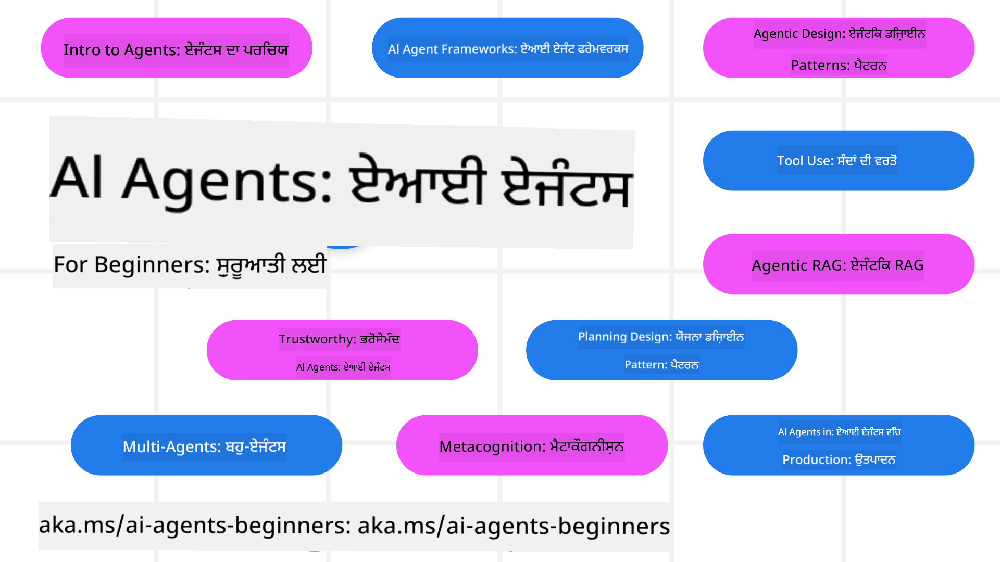

<!--
CO_OP_TRANSLATOR_METADATA:
{
  "original_hash": "9b4c2650691b24b20e0c912d01a466a2",
  "translation_date": "2025-08-21T12:15:43+00:00",
  "source_file": "README.md",
  "language_code": "pa"
}
-->
# AI Agents ਲਈ ਸ਼ੁਰੂਆਤੀ ਕੋਰਸ

## 11 ਪਾਠ ਜੋ ਤੁਹਾਨੂੰ AI Agents ਬਣਾਉਣ ਦੀ ਸ਼ੁਰੂਆਤ ਕਰਨ ਲਈ ਸਾਰਾ ਜ਼ਰੂਰੀ ਗਿਆਨ ਸਿਖਾਉਂਦੇ ਹਨ

### 🌐 ਬਹੁ-ਭਾਸ਼ਾ ਸਹਾਇਤਾ

#### GitHub Action ਰਾਹੀਂ ਸਹਾਇਤਾ (ਆਟੋਮੈਟਿਕ ਅਤੇ ਹਮੇਸ਼ਾ ਅਪ-ਟੂ-ਡੇਟ)

[French](../fr/README.md) | [Spanish](../es/README.md) | [German](../de/README.md) | [Russian](../ru/README.md) | [Arabic](../ar/README.md) | [Persian (Farsi)](../fa/README.md) | [Urdu](../ur/README.md) | [Chinese (Simplified)](../zh/README.md) | [Chinese (Traditional, Macau)](../mo/README.md) | [Chinese (Traditional, Hong Kong)](../hk/README.md) | [Chinese (Traditional, Taiwan)](../tw/README.md) | [Japanese](../ja/README.md) | [Korean](../ko/README.md) | [Hindi](../hi/README.md) | [Bengali](../bn/README.md) | [Marathi](../mr/README.md) | [Nepali](../ne/README.md) | [Punjabi (Gurmukhi)](./README.md) | [Portuguese (Portugal)](../pt/README.md) | [Portuguese (Brazil)](../br/README.md) | [Italian](../it/README.md) | [Polish](../pl/README.md) | [Turkish](../tr/README.md) | [Greek](../el/README.md) | [Thai](../th/README.md) | [Swedish](../sv/README.md) | [Danish](../da/README.md) | [Norwegian](../no/README.md) | [Finnish](../fi/README.md) | [Dutch](../nl/README.md) | [Hebrew](../he/README.md) | [Vietnamese](../vi/README.md) | [Indonesian](../id/README.md) | [Malay](../ms/README.md) | [Tagalog (Filipino)](../tl/README.md) | [Swahili](../sw/README.md) | [Hungarian](../hu/README.md) | [Czech](../cs/README.md) | [Slovak](../sk/README.md) | [Romanian](../ro/README.md) | [Bulgarian](../bg/README.md) | [Serbian (Cyrillic)](../sr/README.md) | [Croatian](../hr/README.md) | [Slovenian](../sl/README.md) | [Ukrainian](../uk/README.md) | [Burmese (Myanmar)](../my/README.md)

**ਜੇ ਤੁਸੀਂ ਹੋਰ ਭਾਸ਼ਾਵਾਂ ਵਿੱਚ ਅਨੁਵਾਦ ਕਰਵਾਉਣਾ ਚਾਹੁੰਦੇ ਹੋ, ਤਾਂ ਸਹਾਇਤਾ ਪ੍ਰਾਪਤ ਭਾਸ਼ਾਵਾਂ ਦੀ ਸੂਚੀ [ਇੱਥੇ](https://github.com/Azure/co-op-translator/blob/main/getting_started/supported-languages.md) ਹੈ।**

## 🌱 ਸ਼ੁਰੂਆਤ ਕਰਨ ਲਈ

ਇਸ ਕੋਰਸ ਵਿੱਚ 11 ਪਾਠ ਹਨ ਜੋ AI Agents ਬਣਾਉਣ ਦੇ ਮੂਲ ਸਿਧਾਂਤਾਂ ਨੂੰ ਕਵਰ ਕਰਦੇ ਹਨ। ਹਰ ਪਾਠ ਵਿੱਚ ਆਪਣਾ ਵਿਸ਼ਾ ਹੁੰਦਾ ਹੈ, ਇਸ ਲਈ ਤੁਸੀਂ ਕਿਤੇ ਵੀ ਸ਼ੁਰੂ ਕਰ ਸਕਦੇ ਹੋ!

ਇਸ ਕੋਰਸ ਲਈ ਬਹੁ-ਭਾਸ਼ਾ ਸਹਾਇਤਾ ਉਪਲਬਧ ਹੈ। ਸਾਡੀਆਂ [ਉਪਲਬਧ ਭਾਸ਼ਾਵਾਂ](../..) 'ਤੇ ਜਾਓ।

ਜੇ ਇਹ ਤੁਹਾਡਾ ਪਹਿਲਾ ਮੌਕਾ ਹੈ Generative AI ਮਾਡਲਾਂ ਨਾਲ ਕੰਮ ਕਰਨ ਦਾ, ਤਾਂ ਸਾਡਾ [Generative AI For Beginners](https://aka.ms/genai-beginners) ਕੋਰਸ ਦੇਖੋ, ਜਿਸ ਵਿੱਚ GenAI ਨਾਲ ਕੰਮ ਕਰਨ ਦੇ 21 ਪਾਠ ਸ਼ਾਮਲ ਹਨ।

ਇਸ ਰਿਪੋ ਨੂੰ [star (🌟)](https://docs.github.com/en/get-started/exploring-projects-on-github/saving-repositories-with-stars?WT.mc_id=academic-105485-koreyst) ਅਤੇ [fork](https://github.com/microsoft/ai-agents-for-beginners/fork) ਕਰਨਾ ਨਾ ਭੁੱਲੋ ਤਾਂ ਜੋ ਤੁਸੀਂ ਕੋਡ ਚਲਾ ਸਕੋ।

### ਤੁਹਾਨੂੰ ਕੀ ਚਾਹੀਦਾ ਹੈ

ਇਸ ਕੋਰਸ ਦੇ ਹਰ ਪਾਠ ਵਿੱਚ ਕੋਡ ਉਦਾਹਰਨਾਂ ਸ਼ਾਮਲ ਹਨ, ਜੋ code_samples ਫੋਲਡਰ ਵਿੱਚ ਮਿਲਦੀਆਂ ਹਨ। ਤੁਸੀਂ [ਇਸ ਰਿਪੋ ਨੂੰ fork](https://github.com/microsoft/ai-agents-for-beginners/fork) ਕਰਕੇ ਆਪਣੀ ਨਕਲ ਬਣਾ ਸਕਦੇ ਹੋ।

ਇਸ ਕੋਰਸ ਦੇ ਅਭਿਆਸਾਂ ਵਿੱਚ ਦਿੱਤੇ ਕੋਡ ਉਦਾਹਰਨਾਂ Language Models ਨਾਲ ਸੰਚਾਰ ਕਰਨ ਲਈ Azure AI Foundry ਅਤੇ GitHub Model Catalogs ਦੀ ਵਰਤੋਂ ਕਰਦੇ ਹਨ:

- [Github Models](https://aka.ms/ai-agents-beginners/github-models) - ਮੁਫ਼ਤ / ਸੀਮਿਤ
- [Azure AI Foundry](https://aka.ms/ai-agents-beginners/ai-foundry) - Azure ਖਾਤਾ ਲੋੜੀਂਦਾ ਹੈ

ਇਸ ਕੋਰਸ ਵਿੱਚ Microsoft ਦੇ ਹੇਠਾਂ ਦਿੱਤੇ AI Agent frameworks ਅਤੇ ਸੇਵਾਵਾਂ ਦੀ ਵਰਤੋਂ ਕੀਤੀ ਗਈ ਹੈ:

- [Azure AI Agent Service](https://aka.ms/ai-agents-beginners/ai-agent-service)
- [Semantic Kernel](https://aka.ms/ai-agents-beginners/semantic-kernel)
- [AutoGen](https://aka.ms/ai-agents/autogen)

ਇਸ ਕੋਰਸ ਲਈ ਕੋਡ ਚਲਾਉਣ ਬਾਰੇ ਹੋਰ ਜਾਣਕਾਰੀ ਲਈ, [Course Setup](./00-course-setup/README.md) 'ਤੇ ਜਾਓ।

## 🙏 ਮਦਦ ਕਰਨਾ ਚਾਹੁੰਦੇ ਹੋ?

ਕੀ ਤੁਹਾਡੇ ਕੋਲ ਸੁਝਾਅ ਹਨ ਜਾਂ ਤੁਸੀਂ ਕੋਈ ਸ਼ਬਦ ਜਾਂ ਕੋਡ ਦੀ ਗਲਤੀ ਲੱਭੀ ਹੈ? [ਇੱਕ issue ਰੇਜ਼ ਕਰੋ](https://github.com/microsoft/ai-agents-for-beginners/issues?WT.mc_id=academic-105485-koreyst) ਜਾਂ [ਇੱਕ pull request ਬਣਾਓ](https://github.com/microsoft/ai-agents-for-beginners/pulls?WT.mc_id=academic-105485-koreyst)।

ਜੇ ਤੁਸੀਂ ਫਸ ਜਾਂਦੇ ਹੋ ਜਾਂ AI Agents ਬਣਾਉਣ ਬਾਰੇ ਕੋਈ ਸਵਾਲ ਹੈ, ਤਾਂ ਸਾਡੇ [Azure AI Foundry Community Discord](https://discord.gg/kzRShWzttr) ਵਿੱਚ ਸ਼ਾਮਲ ਹੋਵੋ।

ਜੇ ਤੁਹਾਡੇ ਕੋਲ ਉਤਪਾਦ ਫੀਡਬੈਕ ਹੈ ਜਾਂ ਬਣਾਉਣ ਦੌਰਾਨ ਕੋਈ ਗਲਤੀ ਆਉਂਦੀ ਹੈ, ਤਾਂ ਸਾਡੇ [Azure AI Foundry Developer Forum](https://aka.ms/azureaifoundry/forum) 'ਤੇ ਜਾਓ।

## 📂 ਹਰ ਪਾਠ ਵਿੱਚ ਸ਼ਾਮਲ ਹੈ

- README ਵਿੱਚ ਲਿਖਿਆ ਪਾਠ ਅਤੇ ਇੱਕ ਛੋਟੀ ਵੀਡੀਓ
- Python ਕੋਡ ਉਦਾਹਰਨਾਂ ਜੋ Azure AI Foundry ਅਤੇ Github Models (ਮੁਫ਼ਤ) ਨੂੰ ਸਹਾਇਤਾ ਦਿੰਦੇ ਹਨ
- ਹੋਰ ਸਿਖਲਾਈ ਲਈ ਲਿੰਕ

## 🗃️ ਪਾਠ

| **ਪਾਠ**                                  | **ਟੈਕਸਟ ਅਤੇ ਕੋਡ**                                | **ਵੀਡੀਓ**                                                  | **ਵਾਧੂ ਸਿਖਲਾਈ**                                                                     |
|------------------------------------------|--------------------------------------------------|------------------------------------------------------------|--------------------------------------------------------------------------------------|
| AI Agents ਅਤੇ Agent Use Cases ਦਾ ਪਰਚੇਅ   | [Link](./01-intro-to-ai-agents/README.md)        | [Video](https://youtu.be/3zgm60bXmQk?si=z8QygFvYQv-9WtO1)  | [Link](https://aka.ms/ai-agents-beginners/collection?WT.mc_id=academic-105485-koreyst) |
| AI Agentic Frameworks ਦੀ ਖੋਜ             | [Link](./02-explore-agentic-frameworks/README.md)| [Video](https://youtu.be/ODwF-EZo_O8?si=Vawth4hzVaHv-u0H)  | [Link](https://aka.ms/ai-agents-beginners/collection?WT.mc_id=academic-105485-koreyst) |
| AI Agentic Design Patterns ਨੂੰ ਸਮਝਣਾ     | [Link](./03-agentic-design-patterns/README.md)   | [Video](https://youtu.be/m9lM8qqoOEA?si=BIzHwzstTPL8o9GF)  | [Link](https://aka.ms/ai-agents-beginners/collection?WT.mc_id=academic-105485-koreyst) |
| Tool Use Design Pattern                  | [Link](./04-tool-use/README.md)                  | [Video](https://youtu.be/vieRiPRx-gI?si=2z6O2Xu2cu_Jz46N)  | [Link](https://aka.ms/ai-agents-beginners/collection?WT.mc_id=academic-105485-koreyst) |
| Agentic RAG                              | [Link](./05-agentic-rag/README.md)               | [Video](https://youtu.be/WcjAARvdL7I?si=gKPWsQpKiIlDH9A3)  | [Link](https://aka.ms/ai-agents-beginners/collection?WT.mc_id=academic-105485-koreyst) |
| ਭਰੋਸੇਯੋਗ AI Agents ਬਣਾਉਣਾ               | [Link](./06-building-trustworthy-agents/README.md)| [Video](https://youtu.be/iZKkMEGBCUQ?si=jZjpiMnGFOE9L8OK ) | [Link](https://aka.ms/ai-agents-beginners/collection?WT.mc_id=academic-105485-koreyst) |
| Planning Design Pattern                  | [Link](./07-planning-design/README.md)           | [Video](https://youtu.be/kPfJ2BrBCMY?si=6SC_iv_E5-mzucnC)  | [Link](https://aka.ms/ai-agents-beginners/collection?WT.mc_id=academic-105485-koreyst) |
| Multi-Agent Design Pattern               | [Link](./08-multi-agent/README.md)               | [Video](https://youtu.be/V6HpE9hZEx0?si=rMgDhEu7wXo2uo6g)  | [Link](https://aka.ms/ai-agents-beginners/collection?WT.mc_id=academic-105485-koreyst) |
| Metacognition Design Pattern             | [Link](./09-metacognition/README.md)             | [Video](https://youtu.be/His9R6gw6Ec?si=8gck6vvdSNCt6OcF)  | [Link](https://aka.ms/ai-agents-beginners/collection?WT.mc_id=academic-105485-koreyst) |
| AI Agents in Production                  | [Link](./10-ai-agents-production/README.md)      | [Video](https://youtu.be/l4TP6IyJxmQ?si=31dnhexRo6yLRJDl)  | [Link](https://aka.ms/ai-agents-beginners/collection?WT.mc_id=academic-105485-koreyst) |
| AI Agents with MCP                       | [Link](./11-mcp/README.md)                       |                                                            | [Link](https://aka.ms/mcp-for-beginners)                                               |

## 🎒 ਹੋਰ ਕੋਰਸ

ਸਾਡੀ ਟੀਮ ਹੋਰ ਕੋਰਸ ਤਿਆਰ ਕਰਦੀ ਹੈ! ਦੇਖੋ:
- [**ਨਵਾਂ** ਮਾਡਲ ਕੌਂਟੈਕਸਟ ਪ੍ਰੋਟੋਕੋਲ (MCP) ਸ਼ੁਰੂਆਤੀ ਲਈ](https://github.com/microsoft/mcp-for-beginners?WT.mc_id=academic-105485-koreyst)
- [ਸ਼ੁਰੂਆਤੀ ਲਈ ਜਨਰੇਟਿਵ AI .NET ਦੀ ਵਰਤੋਂ ਕਰਕੇ](https://github.com/microsoft/Generative-AI-for-beginners-dotnet?WT.mc_id=academic-105485-koreyst)
- [ਸ਼ੁਰੂਆਤੀ ਲਈ ਜਨਰੇਟਿਵ AI](https://github.com/microsoft/generative-ai-for-beginners?WT.mc_id=academic-105485-koreyst)
- [ਸ਼ੁਰੂਆਤੀ ਲਈ ਜਨਰੇਟਿਵ AI ਜਾਵਾ ਦੀ ਵਰਤੋਂ ਕਰਕੇ](https://github.com/microsoft/generative-ai-for-beginners-java?WT.mc_id=academic-105485-koreyst)
- [ਸ਼ੁਰੂਆਤੀ ਲਈ ਮਸ਼ੀਨ ਲਰਨਿੰਗ](https://aka.ms/ml-beginners?WT.mc_id=academic-105485-koreyst)
- [ਸ਼ੁਰੂਆਤੀ ਲਈ ਡਾਟਾ ਸਾਇੰਸ](https://aka.ms/datascience-beginners?WT.mc_id=academic-105485-koreyst)
- [ਸ਼ੁਰੂਆਤੀ ਲਈ AI](https://aka.ms/ai-beginners?WT.mc_id=academic-105485-koreyst)
- [ਸ਼ੁਰੂਆਤੀ ਲਈ ਸਾਇਬਰਸੁਰੱਖਿਆ](https://github.com/microsoft/Security-101??WT.mc_id=academic-96948-sayoung)
- [ਸ਼ੁਰੂਆਤੀ ਲਈ ਵੈੱਬ ਡਿਵੈਲਪਮੈਂਟ](https://aka.ms/webdev-beginners?WT.mc_id=academic-105485-koreyst)
- [ਸ਼ੁਰੂਆਤੀ ਲਈ IoT](https://aka.ms/iot-beginners?WT.mc_id=academic-105485-koreyst)
- [ਸ਼ੁਰੂਆਤੀ ਲਈ XR ਡਿਵੈਲਪਮੈਂਟ](https://github.com/microsoft/xr-development-for-beginners?WT.mc_id=academic-105485-koreyst)
- [AI ਪੇਅਰਡ ਪ੍ਰੋਗਰਾਮਿੰਗ ਲਈ GitHub Copilot ਵਿੱਚ ਨਿਪੁੰਨਤਾ ਹਾਸਲ ਕਰੋ](https://aka.ms/GitHubCopilotAI?WT.mc_id=academic-105485-koreyst)
- [C#/.NET ਡਿਵੈਲਪਰਾਂ ਲਈ GitHub Copilot ਵਿੱਚ ਨਿਪੁੰਨਤਾ ਹਾਸਲ ਕਰੋ](https://github.com/microsoft/mastering-github-copilot-for-dotnet-csharp-developers?WT.mc_id=academic-105485-koreyst)
- [ਆਪਣੀ ਖੁਦ ਦੀ Copilot ਐਡਵੈਂਚਰ ਚੁਣੋ](https://github.com/microsoft/CopilotAdventures?WT.mc_id=academic-105485-koreyst)

## 🌟 ਸਮੁਦਾਇਕ ਧੰਨਵਾਦ

[ਸ਼ਿਵਮ ਗੋਯਲ](https://www.linkedin.com/in/shivam2003/) ਦਾ ਧੰਨਵਾਦ, ਜਿਨ੍ਹਾਂ ਨੇ Agentic RAG ਨੂੰ ਦਰਸਾਉਂਦੀਆਂ ਮਹੱਤਵਪੂਰਨ ਕੋਡ ਨਮੂਨਿਆਂ ਵਿੱਚ ਯੋਗਦਾਨ ਪਾਇਆ। 

## ਯੋਗਦਾਨ ਦੇਣਾ

ਇਹ ਪ੍ਰੋਜੈਕਟ ਯੋਗਦਾਨ ਅਤੇ ਸੁਝਾਵਾਂ ਦਾ ਸਵਾਗਤ ਕਰਦਾ ਹੈ। ਜ਼ਿਆਦਾਤਰ ਯੋਗਦਾਨਾਂ ਲਈ ਤੁਹਾਨੂੰ ਇੱਕ 
ਯੋਗਦਾਨ ਲਾਇਸੈਂਸ ਸਮਝੌਤਾ (CLA) ਸਹਿਮਤ ਕਰਨਾ ਪਵੇਗਾ, ਜੋ ਇਹ ਘੋਸ਼ਣਾ ਕਰਦਾ ਹੈ ਕਿ ਤੁਹਾਡੇ ਕੋਲ ਆਪਣੇ ਯੋਗਦਾਨ ਦੇ ਅਧਿਕਾਰ ਹਨ ਅਤੇ ਤੁਸੀਂ ਸਾਨੂੰ ਇਸਨੂੰ ਵਰਤਣ ਦੇ ਅਧਿਕਾਰ ਦਿੰਦੇ ਹੋ। ਵਿਸਥਾਰ ਲਈ, ਵੇਖੋ 
<https://cla.opensource.microsoft.com>।

ਜਦੋਂ ਤੁਸੀਂ ਇੱਕ ਪੁਲ ਰਿਕਵੇਸਟ ਜਮ੍ਹਾਂ ਕਰਦੇ ਹੋ, ਇੱਕ CLA ਬੌਟ ਆਟੋਮੈਟਿਕ ਤੌਰ 'ਤੇ ਇਹ ਨਿਰਧਾਰਤ ਕਰੇਗਾ ਕਿ ਕੀ ਤੁਹਾਨੂੰ CLA ਪ੍ਰਦਾਨ ਕਰਨ ਦੀ ਲੋੜ ਹੈ ਅਤੇ PR ਨੂੰ ਸਹੀ ਤਰੀਕੇ ਨਾਲ ਸਜਾਵੇਗਾ (ਜਿਵੇਂ ਕਿ ਸਥਿਤੀ ਚੈੱਕ, ਟਿੱਪਣੀ)। ਬੱਸ ਬੌਟ ਦੁਆਰਾ ਦਿੱਤੀਆਂ ਹਦਾਇਤਾਂ ਦੀ ਪਾਲਣਾ ਕਰੋ। ਤੁਹਾਨੂੰ ਇਹ ਸਿਰਫ ਇੱਕ ਵਾਰ ਸਾਰੇ ਰਿਪੋਜ਼ਟਰੀਜ਼ ਵਿੱਚ ਕਰਨਾ ਪਵੇਗਾ ਜੋ ਸਾਡੇ CLA ਦੀ ਵਰਤੋਂ ਕਰਦੇ ਹਨ।

ਇਸ ਪ੍ਰੋਜੈਕਟ ਨੇ [ਮਾਈਕਰੋਸੌਫਟ ਖੁੱਲ੍ਹੇ ਸਰੋਤ ਕੋਡ ਆਚਰਣ ਸੰਹਿਤਾ](https://opensource.microsoft.com/codeofconduct/) ਨੂੰ ਅਪਨਾਇਆ ਹੈ।
ਹੋਰ ਜਾਣਕਾਰੀ ਲਈ [ਕੋਡ ਆਫ ਕੰਡਕਟ FAQ](https://opensource.microsoft.com/codeofconduct/faq/) ਵੇਖੋ ਜਾਂ 
[opencode@microsoft.com](mailto:opencode@microsoft.com) 'ਤੇ ਸੰਪਰਕ ਕਰੋ ਜੇਕਰ ਤੁਹਾਡੇ ਕੋਲ ਹੋਰ ਸਵਾਲ ਜਾਂ ਟਿੱਪਣੀਆਂ ਹਨ।

## ਟ੍ਰੇਡਮਾਰਕ

ਇਸ ਪ੍ਰੋਜੈਕਟ ਵਿੱਚ ਪ੍ਰੋਜੈਕਟਾਂ, ਉਤਪਾਦਾਂ ਜਾਂ ਸੇਵਾਵਾਂ ਲਈ ਟ੍ਰੇਡਮਾਰਕ ਜਾਂ ਲੋਗੋ ਸ਼ਾਮਲ ਹੋ ਸਕਦੇ ਹਨ। ਮਾਈਕਰੋਸੌਫਟ ਟ੍ਰੇਡਮਾਰਕ ਜਾਂ ਲੋਗੋ ਦੀ ਅਧਿਕ੍ਰਿਤ ਵਰਤੋਂ 
[ਮਾਈਕਰੋਸੌਫਟ ਦੇ ਟ੍ਰੇਡਮਾਰਕ ਅਤੇ ਬ੍ਰਾਂਡ ਦਿਸ਼ਾ-ਨਿਰਦੇਸ਼ਾਂ](https://www.microsoft.com/legal/intellectualproperty/trademarks/usage/general) ਦੀ ਪਾਲਣਾ ਕਰਨੀ ਚਾਹੀਦੀ ਹੈ।
ਇਸ ਪ੍ਰੋਜੈਕਟ ਦੇ ਸੰਸ਼ੋਧਿਤ ਸੰਸਕਰਣਾਂ ਵਿੱਚ ਮਾਈਕਰੋਸੌਫਟ ਟ੍ਰੇਡਮਾਰਕ ਜਾਂ ਲੋਗੋ ਦੀ ਵਰਤੋਂ ਗਲਤਫਹਮੀ ਪੈਦਾ ਨਹੀਂ ਕਰਨੀ ਚਾਹੀਦੀ ਜਾਂ ਮਾਈਕਰੋਸੌਫਟ ਦੀ ਪ੍ਰਾਯੋਜਕਤਾ ਦਾ ਸੰਕੇਤ ਨਹੀਂ ਦੇਣਾ ਚਾਹੀਦਾ।
ਕਿਸੇ ਵੀ ਤੀਜੇ ਪੱਖ ਦੇ ਟ੍ਰੇਡਮਾਰਕ ਜਾਂ ਲੋਗੋ ਦੀ ਵਰਤੋਂ ਉਹਨਾਂ ਤੀਜੇ ਪੱਖ ਦੀਆਂ ਨੀਤੀਆਂ ਦੇ ਅਧੀਨ ਹੈ।

**ਅਸਵੀਕਾਰਨਾ**:  
ਇਹ ਦਸਤਾਵੇਜ਼ AI ਅਨੁਵਾਦ ਸੇਵਾ [Co-op Translator](https://github.com/Azure/co-op-translator) ਦੀ ਵਰਤੋਂ ਕਰਕੇ ਅਨੁਵਾਦ ਕੀਤਾ ਗਿਆ ਹੈ। ਜਦੋਂ ਕਿ ਅਸੀਂ ਸਹੀ ਹੋਣ ਦੀ ਕੋਸ਼ਿਸ਼ ਕਰਦੇ ਹਾਂ, ਕਿਰਪਾ ਕਰਕੇ ਧਿਆਨ ਦਿਓ ਕਿ ਸਵੈਚਾਲਿਤ ਅਨੁਵਾਦਾਂ ਵਿੱਚ ਗਲਤੀਆਂ ਜਾਂ ਅਸੁਚੀਤਤਾਵਾਂ ਹੋ ਸਕਦੀਆਂ ਹਨ। ਮੂਲ ਦਸਤਾਵੇਜ਼ ਨੂੰ ਇਸਦੀ ਮੂਲ ਭਾਸ਼ਾ ਵਿੱਚ ਅਧਿਕਾਰਤ ਸਰੋਤ ਮੰਨਿਆ ਜਾਣਾ ਚਾਹੀਦਾ ਹੈ। ਮਹੱਤਵਪੂਰਨ ਜਾਣਕਾਰੀ ਲਈ, ਪੇਸ਼ੇਵਰ ਮਨੁੱਖੀ ਅਨੁਵਾਦ ਦੀ ਸਿਫਾਰਸ਼ ਕੀਤੀ ਜਾਂਦੀ ਹੈ। ਇਸ ਅਨੁਵਾਦ ਦੀ ਵਰਤੋਂ ਤੋਂ ਪੈਦਾ ਹੋਣ ਵਾਲੇ ਕਿਸੇ ਵੀ ਗਲਤਫਹਿਮੀ ਜਾਂ ਗਲਤ ਵਿਆਖਿਆ ਲਈ ਅਸੀਂ ਜ਼ਿੰਮੇਵਾਰ ਨਹੀਂ ਹਾਂ।