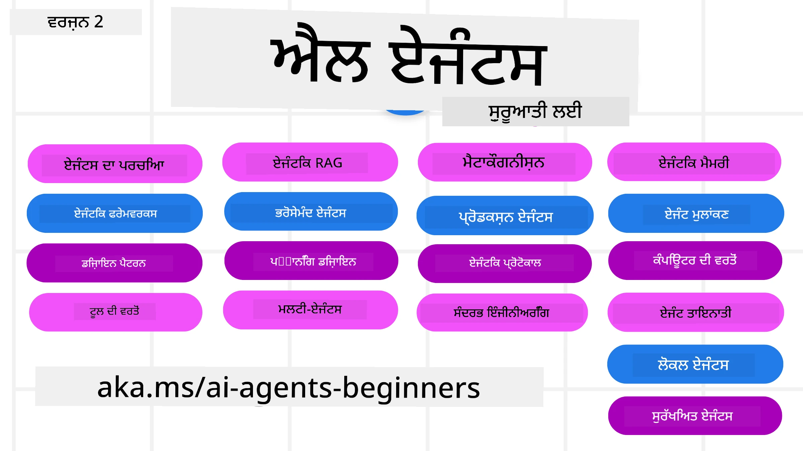

# ਬਿਗਨਰਾਂ ਲਈ ਏਆਈ ਏਜੰਟ - ਇੱਕ ਕੋਰਸ



## ਇੱਕ ਕੋਰਸ ਜੋ ਤੁਹਾਨੂੰ ਏਆਈ ਏਜੰਟ ਬਣਾਉਣ ਲਈ ਜਰੂਰੀ ਸਾਰੀਆਂ ਗੱਲਾਂ ਸਿਖਾਉਂਦਾ ਹੈ

[](https://github.com/microsoft/ai-agents-for-beginners/blob/master/LICENSE?WT.mc_id=academic-105485-koreyst)
[](https://GitHub.com/microsoft/ai-agents-for-beginners/graphs/contributors/?WT.mc_id=academic-105485-koreyst)
[](https://GitHub.com/microsoft/ai-agents-for-beginners/issues/?WT.mc_id=academic-105485-koreyst)
[](https://GitHub.com/microsoft/ai-agents-for-beginners/pulls/?WT.mc_id=academic-105485-koreyst)
[](http://makeapullrequest.com?WT.mc_id=academic-105485-koreyst)

### 🌐 ਬਹੁ-ਭਾਸ਼ਾ ਸਹਾਇਤਾ

#### ਗਿਟਹਬ ਐਕਸ਼ਨ ਰਾਹੀਂ ਸਹਾਇਤਾ ਪ੍ਰਾਪਤ (ਸਵੈਚਾਲਿਤ ਅਤੇ ਸਦਾ-ਅਪਟੂਡੇਟ)

<!-- CO-OP TRANSLATOR LANGUAGES TABLE START -->
[ਅਰਬੀ](../ar/README.md) | [ਬੰਗਾਲੀ](../bn/README.md) | [ਬੁਲਗਾਰੀਆਈ](../bg/README.md) | [ਬਰਮੀ (ਮਿਆਂਮਾਰ)](../my/README.md) | [ਚੀਨੀ (ਸਰਲ)](../zh-CN/README.md) | [ਚੀਨੀ (ਪਾਰੰਪਰਿਕ, ਹਾਂਗ ਕਾਂਗ)](../zh-HK/README.md) | [ਚੀਨੀ (ਪਾਰੰਪਰਿਕ, ਮਾਕਾਉ)](../zh-MO/README.md) | [ਚੀਨੀ (ਪਾਰੰਪਰਿਕ, ਤਾਈਵਾਨ)](../zh-TW/README.md) | [ਕ੍ਰੋਏਸ਼ੀਅਨ](../hr/README.md) | [ਚੇਕ](../cs/README.md) | [ਡੈਨਿਸ਼](../da/README.md) | [ਡੱਚ](../nl/README.md) | [ਏਸਟੋਨੀਆਈ](../et/README.md) | [ਫਿਨਿਸ਼](../fi/README.md) | [ਫ੍ਰੈਂਚ](../fr/README.md) | [ਜਰਮਨ](../de/README.md) | [ਗ੍ਰੀਕ](../el/README.md) | [ਹੀਬਰੂ](../he/README.md) | [ਹਿੰਦੀ](../hi/README.md) | [ਹੰਗੇਰੀ](../hu/README.md) | [ਇੰਡੋਨੇਸ਼ੀਅਨ](../id/README.md) | [ਇਟਾਲੀਅਨ](../it/README.md) | [ਜਪਾਨੀ](../ja/README.md) | [ਕੰਨੜ](../kn/README.md) | [ਕੋਰੀਅਨ](../ko/README.md) | [ਲਿਥੁਏਨੀਆਈ](../lt/README.md) | [ਮਲੇਸ਼ੀਆਈ](../ms/README.md) | [ਮਲਯਾਲਮ](../ml/README.md) | [ਮਰਾਠੀ](../mr/README.md) | [ਨੇਪਾਲੀ](../ne/README.md) | [ਨਾਈਜੀਰੀਆਈ ਪਿਡਗਿਨ](../pcm/README.md) | [ਨਾਰਵੇਜੀਆਈ](../no/README.md) | [ਫਾਰਸੀ (ਪਰਸ਼ੀ)](../fa/README.md) | [ਪੋਲਿਸ਼](../pl/README.md) | [ਪੁਰਤਗਾਲੀ (ਬ੍ਰਾਜ਼ੀਲ)](../pt-BR/README.md) | [ਪੁਰਤਗਾਲੀ (ਪੁर्तਗਾਲ)](../pt-PT/README.md) | [ਪੰਜਾਬੀ (ਗੁਰਮੁਖੀ)](./README.md) | [ਰੋਮਾਨੀਆਈ](../ro/README.md) | [ਰੂਸੀ](../ru/README.md) | [ਸੇਰਬੀਆਈ (ਸਿਰਿਲਿਕ)](../sr/README.md) | [ਸਲੋਵਾਕ](../sk/README.md) | [ਸਲੋਵੇਨੀਅਨ](../sl/README.md) | [ਸਪੇਨੀ](../es/README.md) | [ਸਵਾਹਿਲੀ](../sw/README.md) | [ਸਵੀਡਿਸ਼](../sv/README.md) | [ਟਾਗਾਲੋਗ (ਫਿਲੀਪੀਨੋ)](../tl/README.md) | [ਤਮਿਲ](../ta/README.md) | [ਤੇਲੁਗੂ](../te/README.md) | [ਥਾਈ](../th/README.md) | [ਤੁਰਕੀ](../tr/README.md) | [ਉਕਰੇਨੀ](../uk/README.md) | [ਉਰਦੂ](../ur/README.md) | [ਵੀਅਤਨਾਮੀਜ਼](../vi/README.md)

> **ਕੀ ਤੁਸੀਂ ਸਥਾਨਕ ਤੌਰ 'ਤੇ ਕਲੋਨ ਕਰਨਾ ਤਰਜੀਹ ਦੇਂਦੇ ਹੋ?**
>
> ਇਸ ਰਿਪੋਜ਼ਟਰੀ ਵਿੱਚ 50+ ਭਾਸ਼ਾਈ ਅਨੁਵਾਦ ਸ਼ਾਮਿਲ ਹਨ ਜੋ ਡਾਊਨਲੋਡ ਸਾਈਜ਼ ਵਿੱਚ ਕਾਫੀ ਵਾਧਾ ਕਰਦੇ ਹਨ। ਅਨੁਵਾਦ ਬਿਨਾਂ ਕਲੋਨ ਕਰਨ ਲਈ, ਸਪਾਰਸ ਚੈੱਕਆਊਟ ਵਰਤੋਂ ਕਰੋ:
>
> **Bash / macOS / Linux:**
> ```bash
> git clone --filter=blob:none --sparse https://github.com/microsoft/ai-agents-for-beginners.git
> cd ai-agents-for-beginners
> git sparse-checkout set --no-cone '/*' '!translations' '!translated_images'
> ```
>
> **CMD (ਵਿੰਡੋਜ਼):**
> ```cmd
> git clone --filter=blob:none --sparse https://github.com/microsoft/ai-agents-for-beginners.git
> cd ai-agents-for-beginners
> git sparse-checkout set --no-cone "/*" "!translations" "!translated_images"
> ```
>
> ਇਹ ਤੁਹਾਨੂੰ ਕੋਰਸ ਪੂਰਾ ਕਰਨ ਲਈ ਜਰੂਰੀ ਸਾਰੀਆਂ ਚੀਜ਼ਾਂ ਤੇਜ਼ ਡਾਊਨਲੋਡ ਨਾਲ ਦਿੰਦਾ ਹੈ।
<!-- CO-OP TRANSLATOR LANGUAGES TABLE END -->

**ਜੇ ਤੁਸੀਂ ਵਧੀਕ ਅਨੁਵਾਦ ਭਾਸ਼ਾਵਾਂ ਚਾਹੁੰਦੇ ਹੋ ਤਾਂ ਉਹਨਾਂ ਦੀ ਸੂਚੀ [ਇੱਥੇ](https://github.com/Azure/co-op-translator/blob/main/getting_started/supported-languages.md) ਹੈ**

[](https://GitHub.com/microsoft/ai-agents-for-beginners/watchers/?WT.mc_id=academic-105485-koreyst)
[](https://GitHub.com/microsoft/ai-agents-for-beginners/network/?WT.mc_id=academic-105485-koreyst)
[](https://GitHub.com/microsoft/ai-agents-for-beginners/stargazers/?WT.mc_id=academic-105485-koreyst)

[](https://discord.gg/nTYy5BXMWG)


## 🌱 ਸ਼ੁਰੂਆਤ

ਇਹ ਕੋਰਸ ਏਆਈ ਏਜੰਟ ਬਣਾਉਣ ਦੇ ਮੂਲ ਤੱਤਾਂ ਨੂੰ ਲੈ ਕੇ ਲੈਸਨਜ਼ ਦਾ ਸਮੂਹ ਹੈ। ਹਰ ਲੈਸਨ ਆਪਣੇ ਵਿਸ਼ੇ ਨੂੰ ਕਵਰ ਕਰਦਾ ਹੈ, ਇਸ ਲਈ ਜੋ ਵੀ ਤुਹਾਨੂੰ ਪਸੰਦ ਹੋ ਸ਼ੁਰੂ ਕਰੋ!

ਇਸ ਕੋਰਸ ਲਈ ਬਹੁ-ਭਾਸ਼ਾਈ ਸਹਾਇਤਾ ਉਪਲਬਧ ਹੈ। ਸਾਡੀਆਂ [ਉਪਲਬਧ ਭਾਸ਼ਾਵਾਂ ਇੱਥੇ ਵੇਖੋ](../..).

ਜੇ ਇਹ ਤੁਹਾਡਾ ਪਹਿਲਾ ਵਾਰ ਜਨਰੇਟਿਵ ਏਆਈ ਮਾਡਲਸ ਨਾਲ ਕੰਮ ਕਰਨਾ ਹੈ, ਤਾਂ ਸਾਡਾ [ਬਿਗਨਰਾਂ ਲਈ ਜਨਰੇਟਿਵ ਏਆਈ](https://aka.ms/genai-beginners) ਕੋਰਸ ਵੇਖੋ, ਜਿਸ ਵਿੱਚ GenAI ਨਾਲ ਬਣਾਉਣ ਦੇ 21 ਲੈਸਨ ਹਨ।

ਇਸ ਰਿਪੋ ਨੂੰ [ਸਤਾਰ (🌟) ਕਰਨਾ](https://docs.github.com/en/get-started/exploring-projects-on-github/saving-repositories-with-stars?WT.mc_id=academic-105485-koreyst) ਅਤੇ ਕੋਡ ਚਲਾਉਣ ਲਈ [ਫੋਰਕ ਕਰਨਾ](https://github.com/microsoft/ai-agents-for-beginners/fork) ਨਾ ਭੁੱਲੋ।

### ਹੋਰ ਸਿੱਖਣ ਵਾਲਿਆਂ ਨਾਲ ਮਿਲੋ, ਆਪਣੇ ਸਵਾਲਾਂ ਦੇ ਜਵਾਬ ਪਾਓ

ਜੇ ਤੁਸੀਂ ਫਸ ਜਾਂਦੇ ਹੋ ਜਾਂ ਏਆਈ ਏਜੰਟ ਬਣਾਉਣ ਬਾਰੇ ਕੋਈ ਸਵਾਲ ਹੈ, ਤਾਂ ਸਾਡੇ ਸਮਰਪਿਤ ਡਿਸਕੋਰਡ ਚੈਨਲ ਵਿੱਚ ਸ਼ਾਮਲ ਹੋਵੋ: [Microsoft Foundry Discord](https://aka.ms/ai-agents/discord).

### ਤੁਹਾਨੂੰ ਚਾਹੀਦਾ ਕੀ ਹੈ

ਇਸ ਕੋਰਸ ਦਾ ਹਰ ਲੈਸਨ ਕੋਡ ਉਦਾਹਰਣਾਂ ਨਾਲ ਆਉਂਦਾ ਹੈ, ਜੋ code_samples ਫੋਲਡਰ ਵਿੱਚ ਮਿਲ ਸਕਦੇ ਹਨ। ਤੁਸੀਂ [ਇਸ ਰਿਪੋ ਨੂੰ ਫੋਰਕ ਕਰਕੇ](https://github.com/microsoft/ai-agents-for-beginners/fork) ਆਪਣੀ ਕਾਪੀ ਬਣਾ ਸਕਦੇ ਹੋ।

ਇਨ੍ਹਾਂ ਵਿਆਯਾਮਾਂ ਵਿੱਚ ਦਿੱਤੇ ਕੋਡ ਉਦਾਹਰਣਾਂ Microsoft Agent Framework ਅਤੇ Azure AI Foundry Agent Service V2 ਦਾ ਪ੍ਰਯੋਗ ਕਰਦੇ ਹਨ:

- [Microsoft Foundry](https://aka.ms/ai-agents-beginners/ai-foundry) - Azure ਖਾਤਾ ਲੋੜੀਂਦਾ

ਇਹ ਕੋਰਸ Microsoft ਵੱਲੋਂ ਮੁਹੱਈਆ ਕੀਤੇ ਹੇਠਾਂ ਦਿੱਤੇ ਏਆਈ ਏਜੰਟ ਫਰੇਮਵਰਕ ਅਤੇ ਸੇਵਾਵਾਂ ਦੀ ਵਰਤੋਂ ਕਰਦਾ ਹੈ:

- [Microsoft Agent Framework (MAF)](https://aka.ms/ai-agents-beginners/agent-framewrok)
- [Azure AI Foundry Agent Service V2](https://aka.ms/ai-agents-beginners/ai-agent-service)


ਇਸ ਕੋਰਸ ਦੀ ਕੋਡ ਚਲਾਉਣ ਲਈ ਵਧੇਰੇ ਜਾਣਕਾਰੀ ਲਈ, [Course Setup](./00-course-setup/README.md) ਤੱਕ ਜਾਓ।

## 🙏 ਮਦਦ ਕਰਨਾ ਚਾਹੁੰਦੇ ਹੋ?

ਕੀ ਤੁਹਾਡੇ ਕੋਲ ਸੁਝਾਅ ਹਨ ਜਾਂ ਤੁਹਾਨੂੰ ਸਪੈਲਿੰਗ ਜਾਂ ਕੋਡ ਵਿੱਚ ਕੋਈ ਗਲਤੀ ਮਿਲੀ ਹੈ? [ਇਸ਼ੂ ਖੋਲ੍ਹੋ](https://github.com/microsoft/ai-agents-for-beginners/issues?WT.mc_id=academic-105485-koreyst) ਜਾਂ [ਪੁਲ-ਰਿਕਵੈਸਟ ਬਣਾਓ](https://github.com/microsoft/ai-agents-for-beginners/pulls?WT.mc_id=academic-105485-koreyst)


## 📂 ਹਰ ਲੈਸਨ ਵਿੱਚ ਸ਼ਾਮਲ ਹੈ

- README ਵਿੱਚ ਲਿਖਿਤ ਲੈਸਨ ਅਤੇ ਇੱਕ ਛੋਟੀ ਵੀਡੀਓ
- Microsoft Agent Framework ਅਤੇ Azure AI Foundry ਨਾਲ ਪਾਈਥਨ ਕੋਡ ਸੈਂਪਲ
- ਤੁਹਾਡੇ ਸਿਖਣ ਲਈ ਵਾਧੂ ਸਰੋਤਾਂ ਦੇ ਲਿੰਕ


## 🗃️ ਲੈਸਨਜ਼

| **ਲੈਸਨ**                                   | **ਟੈਕਸਟ ਅਤੇ ਕੋਡ**                                   | **ਵੀਡੀਓ**                                                | **ਵਾਧੂ ਸਿੱਖਣ**                                                                       |
|----------------------------------------------|----------------------------------------------------|---------------------------------------------------------|--------------------------------------------------------------------------------------|
| ਏਆਈ ਏਜੰਟ ਅਤੇ ਉਨ੍ਹਾਂ ਦੇ ਉਪਯੋਗ ਮਾਮਲੇ ਦਾ ਜਾਣ־ਪਛਾਣ   | [ਲਿੰਕ](./01-intro-to-ai-agents/README.md)            | [ਵੀਡੀਓ](https://youtu.be/3zgm60bXmQk?si=z8QygFvYQv-9WtO1) | [ਲਿੰਕ](https://aka.ms/ai-agents-beginners/collection?WT.mc_id=academic-105485-koreyst) |
| ਏਆਈ ਏਜੰਟਿਕ ਫਰੇਮਵਰਕ ਦਾ ਪਰੀਖਣ                  | [ਲਿੰਕ](./02-explore-agentic-frameworks/README.md)    | [ਵੀਡੀਓ](https://youtu.be/ODwF-EZo_O8?si=Vawth4hzVaHv-u0H) | [ਲਿੰਕ](https://aka.ms/ai-agents-beginners/collection?WT.mc_id=academic-105485-koreyst) |
| ਏਆਈ ਏਜੰਟਿਕ ਡਿਜ਼ਾਈਨ ਪੈਟਰਨ ਨੂੰ ਸਮਝਣਾ           | [ਲਿੰਕ](./03-agentic-design-patterns/README.md)       | [ਵੀਡੀਓ](https://youtu.be/m9lM8qqoOEA?si=BIzHwzstTPL8o9GF) | [ਲਿੰਕ](https://aka.ms/ai-agents-beginners/collection?WT.mc_id=academic-105485-koreyst) |
| ਟੂਲ ਵਰਤੋਂ ਡਿਜ਼ਾਈਨ ਪੈਟਰਨ                     | [ਲਿੰਕ](./04-tool-use/README.md)                      | [ਵੀਡੀਓ](https://youtu.be/vieRiPRx-gI?si=2z6O2Xu2cu_Jz46N) | [ਲਿੰਕ](https://aka.ms/ai-agents-beginners/collection?WT.mc_id=academic-105485-koreyst) |
| ਏਜੰਟਿਕ RAG                                  | [ਲਿੰਕ](./05-agentic-rag/README.md)                   | [ਵੀਡੀਓ](https://youtu.be/WcjAARvdL7I?si=gKPWsQpKiIlDH9A3) | [ਲਿੰਕ](https://aka.ms/ai-agents-beginners/collection?WT.mc_id=academic-105485-koreyst) |
| ਭਰੋਸੇਮੰਦ ਏਆਈ ਏਜੰਟ ਬਣਾਉਣਾ                    | [ਲਿੰਕ](./06-building-trustworthy-agents/README.md)   | [ਵੀਡੀਓ](https://youtu.be/iZKkMEGBCUQ?si=jZjpiMnGFOE9L8OK ) | [ਲਿੰਕ](https://aka.ms/ai-agents-beginners/collection?WT.mc_id=academic-105485-koreyst) |
| ਯੋਜ਼ਨਾ ਬਣਾਉਣ ਵਾਲਾ ਡਿਜ਼ਾਈਨ ਪੈਟਰਨ              | [ਲਿੰਕ](./07-planning-design/README.md)               | [ਵੀਡੀਓ](https://youtu.be/kPfJ2BrBCMY?si=6SC_iv_E5-mzucnC) | [ਲਿੰਕ](https://aka.ms/ai-agents-beginners/collection?WT.mc_id=academic-105485-koreyst) |
| ਬਹੁ-ਏਜੰਟ ਡਿਜ਼ਾਈਨ ਪੈਟਰਨ                      | [ਲਿੰਕ](./08-multi-agent/README.md)                   | [ਵੀਡੀਓ](https://youtu.be/V6HpE9hZEx0?si=rMgDhEu7wXo2uo6g) | [ਲਿੰਕ](https://aka.ms/ai-agents-beginners/collection?WT.mc_id=academic-105485-koreyst) |
| ਮੈਟਾਕੌਗਨੀਸ਼ਨ ਡਿਜ਼ਾਈਨ ਪੈਟਰਨ                   | [ਲਿੰਕ](./09-metacognition/README.md)                 | [ਵੀਡੀਓ](https://youtu.be/His9R6gw6Ec?si=8gck6vvdSNCt6OcF) | [ਲਿੰਕ](https://aka.ms/ai-agents-beginners/collection?WT.mc_id=academic-105485-koreyst) |
| AI ਏਜੰਟ ਪ੍ਰੋਡਕਸ਼ਨ ਵਿੱਚ                      | [Link](./10-ai-agents-production/README.md)        | [Video](https://youtu.be/l4TP6IyJxmQ?si=31dnhexRo6yLRJDl)  | [Link](https://aka.ms/ai-agents-beginners/collection?WT.mc_id=academic-105485-koreyst) |
| ਐਜੰਟਿਕ ਪ੍ਰੋਟੋਕੋਲਾਂ ਦੀ ਵਰਤੋਂ (MCP, A2A ਅਤੇ NLWeb) | [Link](./11-agentic-protocols/README.md)           | [Video](https://youtu.be/X-Dh9R3Opn8)                                 | [Link](https://aka.ms/ai-agents-beginners/collection?WT.mc_id=academic-105485-koreyst) |
| AI ਏਜੰਟਾਂ ਲਈ ਸੰਦੇਸ਼ ਉੱਤਰਦਾਤਾ	Tਸੀਨੀਅਰਿੰਗ            | [Link](./12-context-engineering/README.md)         | [Video](https://youtu.be/F5zqRV7gEag)                                 | [Link](https://aka.ms/ai-agents-beginners/collection?WT.mc_id=academic-105485-koreyst) |
| ਐਜੰਟਿਕ ਯਾਦਾਸ਼ਤ ਦਾ ਪ੍ਰਬੰਧਨ                      | [Link](./13-agent-memory/README.md)     |      [Video](https://youtu.be/QrYbHesIxpw?si=vZkVwKrQ4ieCcIPx)                                                      |                                                                                        |
| ਮਾਈਕ੍ਰੋਸਾਫਟ ਐਜੰਟ ਫਰੇਮਵਰਕ ਦੀ ਖੋਜ                         | [Link](./14-microsoft-agent-framework/README.md)                            |                                                            |                                                                                        |
| ਕਮਪਿਊਟਰ ਯੂਜ਼ ਐਜੰਟ ਬਣਾਉਣਾ (CUA)           | ਜਲਦੀ ਆ ਰਿਹਾ ਹੈ                            |                                                            |                                                                                        |
| ਸਕੇਲ ਕਰਨ ਯੋਗ ਏਜੰਟ ਤੈਨਾਤ ਕਰਨਾ                    | ਜਲਦੀ ਆ ਰਿਹਾ ਹੈ                            |                                                            |                                                                                        |
| ਸਥਾਨਕ AI ਏਜੰਟ ਬਣਾਉਣਾ                     | ਜਲਦੀ ਆ ਰਿਹਾ ਹੈ                               |                                                            |                                                                                        |
| AI ਏਜੰਟਾਂ ਦੀ ਸੁਰੱਖਿਆ                           | ਜਲਦੀ ਆ ਰਿਹਾ ਹੈ                               |                                                            |                                                                                        |

## 🎒 ਹੋਰ ਕੋਰਸ

ਸਾਡੀ ਟੀਮ ਹੋਰ ਕੋਰਸ ਵੀ ਤਿਆਰ ਕਰਦੀ ਹੈ! ਵੇਖੋ:

<!-- CO-OP TRANSLATOR OTHER COURSES START -->
### ਲੈਂਚੇਨ
[](https://aka.ms/langchain4j-for-beginners)
[](https://aka.ms/langchainjs-for-beginners?WT.mc_id=m365-94501-dwahlin)
[](https://github.com/microsoft/langchain-for-beginners?WT.mc_id=m365-94501-dwahlin)
---

### ਅਜ਼ੂਰ / ਐਜ / MCP / ਏਜੰਟ
[](https://github.com/microsoft/AZD-for-beginners?WT.mc_id=academic-105485-koreyst)
[](https://github.com/microsoft/edgeai-for-beginners?WT.mc_id=academic-105485-koreyst)
[](https://github.com/microsoft/mcp-for-beginners?WT.mc_id=academic-105485-koreyst)
[](https://github.com/microsoft/ai-agents-for-beginners?WT.mc_id=academic-105485-koreyst)

---
 
### ਜੈਨੇਰੇਟਿਵ AI ਸੀਰੀਜ਼
[](https://github.com/microsoft/generative-ai-for-beginners?WT.mc_id=academic-105485-koreyst)
[-9333EA?style=for-the-badge&labelColor=E5E7EB&color=9333EA)](https://github.com/microsoft/Generative-AI-for-beginners-dotnet?WT.mc_id=academic-105485-koreyst)
[-C084FC?style=for-the-badge&labelColor=E5E7EB&color=C084FC)](https://github.com/microsoft/generative-ai-for-beginners-java?WT.mc_id=academic-105485-koreyst)
[-E879F9?style=for-the-badge&labelColor=E5E7EB&color=E879F9)](https://github.com/microsoft/generative-ai-with-javascript?WT.mc_id=academic-105485-koreyst)

---
 
### ਕੋਰ ਇਲਰਨਿੰਗ
[](https://aka.ms/ml-beginners?WT.mc_id=academic-105485-koreyst)
[](https://aka.ms/datascience-beginners?WT.mc_id=academic-105485-koreyst)
[](https://aka.ms/ai-beginners?WT.mc_id=academic-105485-koreyst)
[](https://github.com/microsoft/Security-101?WT.mc_id=academic-96948-sayoung)
[](https://aka.ms/webdev-beginners?WT.mc_id=academic-105485-koreyst)
[](https://aka.ms/iot-beginners?WT.mc_id=academic-105485-koreyst)
[](https://github.com/microsoft/xr-development-for-beginners?WT.mc_id=academic-105485-koreyst)

---
 
### ਕੋਪਾਇਲਟ ਸੀਰੀਜ਼
[](https://aka.ms/GitHubCopilotAI?WT.mc_id=academic-105485-koreyst)
[](https://github.com/microsoft/mastering-github-copilot-for-dotnet-csharp-developers?WT.mc_id=academic-105485-koreyst)
[](https://github.com/microsoft/CopilotAdventures?WT.mc_id=academic-105485-koreyst)
<!-- CO-OP TRANSLATOR OTHER COURSES END -->

## 🌟 ਕਮਿਊਨਿਟੀ ਧੰਨਵਾਦ

Agentic RAG ਦਰਸਾਉਂਦੇ ਮਹੱਤਵਪੂਰਨ ਕੋਡ ਨਮੂਨੇ ਯੋਗਦਾਨ ਦੇਣ ਲਈ [Shivam Goyal](https://www.linkedin.com/in/shivam2003/) ਦਾ ਧੰਨਵਾਦ।

## ਯੋਗਦਾਨ ਦੇਣਾ

ਇਸ ਪਰੋਜੈਕਟ ਵਿੱਚ ਯੋਗਦਾਨ ਅਤੇ ਸੁਝਾਵਾਂ ਦਾ ਸਵਾਗਤ ਹੈ। ਜ਼ਿਆਦਾਤਰ ਯੋਗਦਾਨ ਲਈ ਤੁਹਾਨੂੰ Contributor License Agreement (CLA) ਤੇ ਸਹਿਮਤ ਹੋਣਾ ਲਾਜ਼ਮੀ ਹੈ ਜੋ ਦੱਸਦਾ ਹੈ ਕਿ ਤੁਹਾਡੇ ਕੋਲ ਆਪਣਾ ਯੋਗਦਾਨ ਵਰਤਣ ਦੇ ਹੱਕ ਹਨ। ਵੇਰਵਾ ਲਈ, <https://cla.opensource.microsoft.com> ਤੇ ਜਾਓ।

ਜਦੋਂ ਤੁਸੀਂ ਪੁਰ ਲੁਰਿਕਵੇਸਟ ਸਬਮਿਟ ਕਰਦੇ ਹੋ, ਤਾਂ CLA ਬੋਟ ਆਪਣੇ ਆਪ ਨਿਰਧਾਰਤ ਕਰੇਗਾ ਕਿ ਤੁਹਾਨੂੰ CLA ਦੇਣ ਦੀ ਲੋੜ ਹੈ ਜਾਂ ਨਹੀਂ ਅਤੇ PR ਨੂੰ ਠੀਕ ਢੰਗ ਨਾਲ ਸ਼ੋਭਾ ਦੇਵੇਗਾ (ਜਿਵੇਂ ਕਿ ਸਟੇਟਸ ਚੈਕ, ਟਿੱਪਣੀ)। ਬੋਟ ਵੱਲੋਂ ਦਿੱਤੀਆਂ ਹਦਾਇਤਾਂ ਦੀ ਪਾਲਣਾ ਕਰੋ। ਇਹ ਸਿਰਫ ਇਕ ਵਾਰੀ ਹੀ ਸਾਰੇ ਰਿਪੋਜ਼ਟੋਰੀਜ਼ ਲਈ ਕਰਨੀ ਪਵੇਗੀ ਜੋ ਸਾਡਾ CLA ਵਰਤਦੇ ਹਨ।

ਇਸ ਪਰੋਜੈਕਟ ਨੇ [Microsoft Open Source ਕੋਡ ਆਫ ਕੰਡਕਟ](https://opensource.microsoft.com/codeofconduct/) ਨੂੰ ਅਪਣਾਇਆ ਹੈ। ਵਧੇਰੇ ਜਾਣਕਾਰੀ ਲਈ [Code of Conduct FAQ](https://opensource.microsoft.com/codeofconduct/faq/) ਵੇਖੋ ਜਾਂ ਕੋਈ ਸਵਾਲ/ਟਿੱਪਣੀ ਲਈ [opencode@microsoft.com](mailto:opencode@microsoft.com) ਤੇ ਸੰਪਰਕ ਕਰੋ।

## ਟ੍ਰੇਡਮਾਰਕ

ਇਸ ਪਰੋਜੈਕਟ ਵਿੱਚ ਪ੍ਰੋਜੈਕਟ, ਉਤਪਾਦ ਜਾਂ ਸੇਵਾਵਾਂ ਲਈ ਟ੍ਰੇਡਮਾਰਕ ਜਾਂ ਲੋਗੋ ਹੋ ਸਕਦੇ ਹਨ। ਮਾਈਕ੍ਰੋਸਾਫਟ ਟ੍ਰੇਡਮਾਰਕ ਜਾਂ ਲੋਗੋ ਦੀ ਅਧਿਕૃત ਵਰਤੋਂ ਲਈ [Microsoft's Trademark & Brand Guidelines](https://www.microsoft.com/legal/intellectualproperty/trademarks/usage/general) ਦੀ ਪਾਲਣਾ ਕਰਨੀ ਲਾਜ਼ਮੀ ਹੈ। ਇਸ ਪਰੋਜੈਕਟ ਦੇ ਸੋਧੇ ਵਰਜਨਾਂ ਵਿੱਚ ਮਾਈਕ੍ਰੋਸਾਫਟ ਟ੍ਰੇਡਮਾਰਕ ਜਾਂ ਲੋਗੋ ਦੀ ਵਰਤੋਂ ਨਾਲ ਕੋਈ ਗਲਤ ਫਹਿਮੀ ਨਹੀਂ ਬਣਣੀ ਚਾਹੀਦੀ ਨਾ ਹੀ ਮਾਈਕ੍ਰੋਸਾਫਟ ਦੀ ਸਪਾਂਸਰਸ਼ਿਪ ਦਾ ਦਰਸਾਵਾ ਹੋਣਾ ਚਾਹੀਦਾ ਹੈ। ਕਿਸੇ ਤੀਜੇ ਪੱਖ ਦੇ ਟ੍ਰੇਡਮਾਰਕ ਜਾਂ ਲੋਗੋ ਦੀ ਵਰਤੋਂ ਉਨ੍ਹਾਂ ਪੱਖਾਂ ਦੀ ਨੀਤੀਆਂ ਦੇ ਅਧੀਨ ਰਹੇਗੀ।

## ਸਹਾਇਤਾ ਪ੍ਰਾਪਤ ਕਰਨਾ


ਜੇ ਤੁਸੀਂ ਫਸ ਜਾਂਦੇ ਹੋ ਜਾਂ AI ਐਪ ਬਣਾਉਣ ਬਾਰੇ ਕੋਈ ਪ੍ਰਸ਼ਨ ਹੈ, ਤਾਂ ਜੁੜੋ:

[](https://aka.ms/foundry/discord)

ਜੇ ਤੁਸੀਂ ਪ੍ਰੋਡਕਟ ਫੀਡਬੈਕ ਜਾਂ ਇਮਾਰਤੀ ਗਲਤੀਆਂ ਮਿਲਦੀਆਂ ਹਨ, ਤਾਂ ਜਾਓ:

[](https://aka.ms/foundry/forum)

---

<!-- CO-OP TRANSLATOR DISCLAIMER START -->
**ਅਸਵੀਕਾਰੋਪੱਤਰ**:  
ਇਸ ਦਸਤਾਵੇਜ਼ ਦਾ ਅਨੁਵਾਦ ਏ ਆਈ ਅਨੁਵਾਦ ਸੇਵਾ [Co-op Translator](https://github.com/Azure/co-op-translator) ਦੀ ਵਰਤੋਂ ਕਰਕੇ ਕੀਤਾ ਗਿਆ ਹੈ। ਜਦੋਂ ਕਿ ਅਸੀਂ ਸਹੀਤਾ ਲਈ ਕੋਸ਼ਿਸ਼ ਕਰਦੇ ਹਾਂ, ਕਿਰਪਾ ਕਰਕੇ ਇਹ ਗਲਤਫਹਮੀ ਹੋ ਸਕਦੀ ਹੈ ਕਿ ਆਟੋਮੇਟਿਡ ਅਨੁਵਾਦਾਂ ਵਿੱਚ ਕੁਝ ਗਲਤੀਆਂ ਜਾਂ ਅਣਠੀਕਤਾਵਾਂ ਹੋ ਸਕਦੀਆਂ ਹਨ। ਮੂਲ ਦਸਤਾਵੇਜ਼ ਆਪਣੀ ਮੂਲ ਭਾਸ਼ਾ ਵਿੱਚ ਹੀ ਅਥਾਰਟੀਟੇਟਿਵ ਸਰੋਤ ਮੰਨਿਆ ਜਾਵੇ। ਜਰੂਰੀ ਜਾਣਕਾਰੀ ਲਈ, ਵਿਸ਼ੇਸ਼ਜ ਪੇਸ਼ਾਵਰ ਮਨੁੱਖੀ ਅਨੁਵਾਦ ਦੀ ਸਿਫਾਰਿਸ਼ ਕੀਤੀ ਜਾਂਦੀ ਹੈ। ਇਸ ਅਨੁਵਾਦ ਦੀ ਵਰਤੋਂ ਦੇ ਨਾਲ ਪੈਦਾ ਹੋਣ ਵਾਲੀਆਂ ਕਿਸੇ ਵੀ ਗਲਤਫਹਮੀ ਜਾਂ ਭ੍ਰਮਾਂ ਲਈ ਅਸੀਂ ਜ਼ਿੰਮੇਵਾਰ ਨਹੀਂ ਹਾਂ।
<!-- CO-OP TRANSLATOR DISCLAIMER END -->