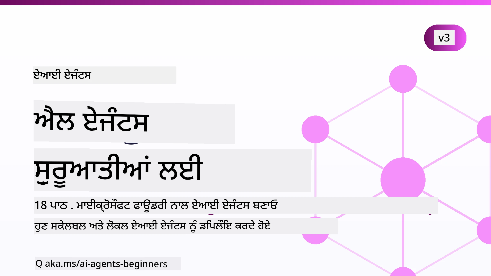

# ਸ਼ੁਰੂਆਤੀ ਲੋਕਾਂ ਲਈ ਏਆਈ ਏਜੰਟ - ਇੱਕ ਕੋਰਸ



## ਏਆਈ ਏਜੰਟ ਬਨਾਉਣ ਲਈ ਤੁਹਾਨੂੰ ਜੋ ਕੁਝ ਜਾਣਨ ਦੀ ਲੋੜ ਹੈ ਉਹ ਸਿੱਖਾਉਂਦਾ ਕੋਰਸ

[](https://github.com/microsoft/ai-agents-for-beginners/blob/master/LICENSE?WT.mc_id=academic-105485-koreyst)
[](https://GitHub.com/microsoft/ai-agents-for-beginners/graphs/contributors/?WT.mc_id=academic-105485-koreyst)
[](https://GitHub.com/microsoft/ai-agents-for-beginners/issues/?WT.mc_id=academic-105485-koreyst)
[](https://GitHub.com/microsoft/ai-agents-for-beginners/pulls/?WT.mc_id=academic-105485-koreyst)
[](http://makeapullrequest.com?WT.mc_id=academic-105485-koreyst)

### 🌐 ਬਹੁ-ਭਾਸ਼ਾ ਸਹਾਇਤਾ

#### GitHub ਐਕਸ਼ਨ ਦੇ ਜ਼ਰੀਏ ਸਹਾਇਤਾ (ਆਟੋਮੈਟਿਕ ਅਤੇ ਹਮੇਸ਼ਾ ਅਪ-ਟੂ-ਡੇਟ)

<!-- CO-OP TRANSLATOR LANGUAGES TABLE START -->
[Arabic](../ar/README.md) | [Bengali](../bn/README.md) | [Bulgarian](../bg/README.md) | [Burmese (Myanmar)](../my/README.md) | [Chinese (Simplified)](../zh-CN/README.md) | [Chinese (Traditional, Hong Kong)](../zh-HK/README.md) | [Chinese (Traditional, Macau)](../zh-MO/README.md) | [Chinese (Traditional, Taiwan)](../zh-TW/README.md) | [Croatian](../hr/README.md) | [Czech](../cs/README.md) | [Danish](../da/README.md) | [Dutch](../nl/README.md) | [Estonian](../et/README.md) | [Finnish](../fi/README.md) | [French](../fr/README.md) | [German](../de/README.md) | [Greek](../el/README.md) | [Hebrew](../he/README.md) | [Hindi](../hi/README.md) | [Hungarian](../hu/README.md) | [Indonesian](../id/README.md) | [Italian](../it/README.md) | [Japanese](../ja/README.md) | [Kannada](../kn/README.md) | [Khmer](../km/README.md) | [Korean](../ko/README.md) | [Lithuanian](../lt/README.md) | [Malay](../ms/README.md) | [Malayalam](../ml/README.md) | [Marathi](../mr/README.md) | [Nepali](../ne/README.md) | [Nigerian Pidgin](../pcm/README.md) | [Norwegian](../no/README.md) | [Persian (Farsi)](../fa/README.md) | [Polish](../pl/README.md) | [Portuguese (Brazil)](../pt-BR/README.md) | [Portuguese (Portugal)](../pt-PT/README.md) | [Punjabi (Gurmukhi)](./README.md) | [Romanian](../ro/README.md) | [Russian](../ru/README.md) | [Serbian (Cyrillic)](../sr/README.md) | [Slovak](../sk/README.md) | [Slovenian](../sl/README.md) | [Spanish](../es/README.md) | [Swahili](../sw/README.md) | [Swedish](../sv/README.md) | [Tagalog (Filipino)](../tl/README.md) | [Tamil](../ta/README.md) | [Telugu](../te/README.md) | [Thai](../th/README.md) | [Turkish](../tr/README.md) | [Ukrainian](../uk/README.md) | [Urdu](../ur/README.md) | [Vietnamese](../vi/README.md)

> **ਕੀ ਤੁਸੀਂ ਸਥਾਨਕ ਤੌਰ 'ਤੇ ਕਲੋਨ ਕਰਨ ਨੂੰ ਪਸੰਦ ਕਰਦੇ ਹੋ?**
>
> ਇਸ ਰਿਪੋਜ਼ੀਟਰੀ ਵਿੱਚ 50+ ਭਾਸ਼ਾ ਅਨੁਵਾਦ ਸ਼ਾਮਲ ਹਨ ਜੋ ਡਾਊਨਲੋਡ ਆਕਾਰ ਨੂੰ ਬਹੁਤ ਵਧਾਉਂਦੇ ਹਨ। ਬਿਨਾਂ ਅਨੁਵਾਦਾਂ ਦੇ ਕਲੋਨ ਕਰਨ ਲਈ, ਸਪਾਰਸ ਚੈਕਆਉਟ ਵਰਤੋਂ:
>
> **ਬੈਸ਼ / ਮੈਕਓਐਸ / ਲਿਨਕਸ:**
> ```bash
> git clone --filter=blob:none --sparse https://github.com/microsoft/ai-agents-for-beginners.git
> cd ai-agents-for-beginners
> git sparse-checkout set --no-cone '/*' '!translations' '!translated_images'
> ```
>
> **CMD (ਵਿੰਡੋਜ਼):**
> ```cmd
> git clone --filter=blob:none --sparse https://github.com/microsoft/ai-agents-for-beginners.git
> cd ai-agents-for-beginners
> git sparse-checkout set --no-cone "/*" "!translations" "!translated_images"
> ```
>
> ਇਹ ਤੁਹਾਨੂੰ ਤੇਜ਼ ਡਾਊਨਲੋਡ ਨਾਲ ਕੋਰਸ ਪੂਰਾ ਕਰਨ ਲਈ ਸਭ ਕੁਝ ਦਿੰਦਾ ਹੈ।
<!-- CO-OP TRANSLATOR LANGUAGES TABLE END -->

**ਜੇ ਤੁਸੀਂ ਵਧੀਕ ਅਨੁਵਾਦ ਭਾਸ਼ਾਵਾਂ ਦੀ ਸਹਾਇਤਾ ਚਾਹੁੰਦੇ ਹੋ ਤਾਂ ਉਹ ਇੱਥੇ ਦਿੱਤੀਆਂ ਹਨ [here](https://github.com/Azure/co-op-translator/blob/main/getting_started/supported-languages.md)।**

[](https://GitHub.com/microsoft/ai-agents-for-beginners/watchers/?WT.mc_id=academic-105485-koreyst)
[](https://GitHub.com/microsoft/ai-agents-for-beginners/network/?WT.mc_id=academic-105485-koreyst)
[](https://GitHub.com/microsoft/ai-agents-for-beginners/stargazers/?WT.mc_id=academic-105485-koreyst)

[](https://discord.com/invite/ATgtXmAS5D)


## 🌱 ਸ਼ੁਰੂਆਤ

ਇਸ ਕੋਰਸ ਵਿੱਚ ਏਆਈ ਏਜੰਟ ਬਨਾਉਣ ਦੇ ਮੂਲ ਤੱਤਾਂ 'ਤੇ ਪਾਠ ਸ਼ਾਮਲ ਹਨ। ਹਰ ਪਾਠ ਆਪਣਾ ਵਿਸ਼ਾ ਸਮਝਾਉਂਦਾ ਹੈ, ਇਸ ਲਈ ਜਿੱਥੇ ਮਰਜ਼ੀ ਉੱਥੇ ਸ਼ੁਰੂ ਕਰੋ!

ਇਸ ਕੋਰਸ ਲਈ ਬਹੁ-ਭਾਸ਼ਾ ਸਹਾਇਤਾ ਹੈ। ਸਾਡੇ ਕੋਲ ਉਪਲਬਧ ਭਾਸ਼ਾਵਾਂ ਲਈ ਜਾਓ [available languages here](#-multi-language-support). 

ਜੇ ਇਹ ਤੁਹਾਡਾ ਪਹਿਲਾ ਵਾਰ ਜਨਰੇਟਿਵ ਏਆਈ ਮਾਡਲਾਂ ਨਾਲ ਕੰਮ ਕਰਨਾ ਹੈ, ਤਾਂ ਸਾਡਾ [Generative AI For Beginners](https://aka.ms/genai-beginners) ਕੋਰਸ ਦੇਖੋ, ਜਿਸ ਵਿੱਚ ਜਨਏਆਈ ਨਾਲ ਬਨਾਉਣ ਬਾਰੇ 21 ਪਾਠ ਹਨ।

ਇਹ ਰਿਪੋ ਨੂੰ [ਸਟਾਰ (🌟) ਦੇਣਾ ਨਾ ਭੁੱਲੋ](https://docs.github.com/en/get-started/exploring-projects-on-github/saving-repositories-with-stars?WT.mc_id=academic-105485-koreyst) ਅਤੇ ਕੋਡ ਚਲਾਉਣ ਲਈ [ਰਿਪੋ ਫੋਰਕ ਕਰੋ](https://github.com/microsoft/ai-agents-for-beginners/fork)।

### ਦੂਜੇ ਸਿੱਖਣ ਵਾਲਿਆਂ ਨਾਲ ਮਿਲੋ, ਆਪਣੇ ਸਵਾਲਾਂ ਦੇ ਜਵਾਬ ਲਵੋ

ਜੇ ਤੁਸੀਂ ਫਸ ਜਾਂਦੇ ਹੋ ਜਾਂ ਏਆਈ ਏਜੰਟ ਬਣਾਉਣ ਬਾਰੇ ਕੋਈ ਸਵਾਲ ਹੈ, ਤਾਂ ਸਾਡੀ ਮੱਨਰਥ ਕੀਤਾ Discord ਚੈਨਲ ਵਿੱਚ ਸ਼ਾਮਲ ਹੋਵੋ [Microsoft Foundry Discord](https://aka.ms/ai-agents/discord).

### ਤੁਹਾਨੂੰ ਕੀ ਚਾਹੀਦਾ ਹੈ

ਇਸ ਕੋਰਸ ਦੇ ਹਰ ਪਾਠ ਵਿੱਚ ਕੋਡ ਉਦਾਹਰਨਾਂ ਹਨ, ਜੋ code_samples ਫੋਲਡਰ ਵਿੱਚ ਮਿਲ ਸਕਦੀਆਂ ਹਨ। ਤੁਸੀਂ ਆਪਣੀ ਨਕਲ ਬਣਾਉਣ ਲਈ [ਰਿਪੋ ਫੋਰਕ ਕਰ ਸਕਦੇ ਹੋ](https://github.com/microsoft/ai-agents-for-beginners/fork).  

ਇਹਨਾਂ ਅਭਿਆਸਾਂ ਵਿੱਚ ਕੋਡ ਉਦਾਹਰਨਾਂ Microsoft Agent Framework ਨਾਲ Microsoft Foundry Agent Service V2 ਦੀ ਵਰਤੋਂ ਕਰਦੀਆਂ ਹਨ:

- [Microsoft Foundry](https://aka.ms/ai-agents-beginners/ai-foundry) - ਐਜ਼ੂਰ ਖਾਤਾ ਲੋੜੀਂਦਾ

ਇਹ ਕੋਰਸ Microsoft ਤੋਂ ਹੇਠਲਿਖੇ ਏਆਈ ਏਜੰਟ ਫਰੇਮਵਰਕ ਅਤੇ ਸਰਵਿਸز ਵਰਤਦਾ ਹੈ:

- [Microsoft Agent Framework (MAF)](https://learn.microsoft.com/agent-framework/overview/)
- [Microsoft Foundry Agent Service V2](https://aka.ms/ai-agents-beginners/ai-agent-service)

ਕੁਝ ਕੋਡ ਉਦਾਹਰਨਾਂ ਦਿੱਤੇ ਗਏ OpenAI-ਮੁਕਾਬਲਤ ਪ੍ਰਭਾਵਕਾਂ ਦੀ ਵੀ ਸਹਾਇਤਾ ਕਰਦੀਆਂ ਹਨ, ਜਿਵੇਂ ਕਿ [MiniMax](https://platform.minimaxi.com/), ਜੋ ਵੱਡੇ ਸੰਦਰਭ ਮਾਡਲ (204K ਟੋਕਨ ਤੱਕ) ਪੇਸ਼ ਕਰਦਾ ਹੈ। ਵਿਵਰਣ ਲਈ [Course Setup](./00-course-setup/README.md) ਵੇਖੋ।

ਇਸ ਕੋਰਸ ਲਈ ਕੋਡ ਚਲਾਉਣ ਬਾਰੇ ਹੋਰ ਜਾਣਕਾਰੀ ਲਈ [Course Setup](./00-course-setup/README.md) 'ਤੇ ਜਾਓ।

## 🙏 ਮਦਦ ਕਰਨੀ ਹੈ?

ਤੁਹਾਡੇ ਕੋਲ ਸੁਝਾਅ ਹਨ ਜਾਂ ਅੱਖਰਾਂ ਜਾਂ ਕੋਡ ਵਿਚ ਗਲਤੀਆਂ ਮਿਲੀਆਂ ਹਨ? [ਇਸ਼ੂ ਰਾਈਜ਼ ਕਰੋ](https://github.com/microsoft/ai-agents-for-beginners/issues?WT.mc_id=academic-105485-koreyst) ਜਾਂ [ਪੁੱਲ ਰਿਕਵੇਸਟ ਬਣਾਓ](https://github.com/microsoft/ai-agents-for-beginners/pulls?WT.mc_id=academic-105485-koreyst)


## 📂 ਹਰ ਪਾਠ ਵਿੱਚ ਸ਼ਾਮਲ ਹੈ

- ਇੱਕ ਲਿਖਤੀ ਪਾਠ ਜੋ README ਵਿੱਚ ਹੈ ਅਤੇ ਇੱਕ ਛੋਟਾ ਵੀਡੀਓ
- Microsoft Agent Framework ਨਾਲ Microsoft Foundry ਦੀ ਵਰਤੋਂ ਕਰਦਿਆਂ ਪਾਇਥਨ ਕੋਡ ਉਦਾਹਰਨਾਂ
- ਸਿੱਖਣ ਜਾਰੀ ਰੱਖਣ ਲਈ ਵਾਧੂ ਸਾਂਝਾ ਸਾਧਨਾਵਾਂ ਦੇ ਲਿੰਕ


## 🗃️ ਪਾਠ

| **ਪਾਠ**                                   | **ਟੈਕਸਟ ਅਤੇ ਕੋਡ**                                    | **ਵੀਡੀਓ**                                                  | **ਵਾਧੂ ਸਿੱਖਿਆ**                                                                     |
|----------------------------------------------|----------------------------------------------------|------------------------------------------------------------|----------------------------------------------------------------------------------------|
| ਏਆਈ ਏਜੰਟਾਂ ਦਾ ਪਰਿਚਯ ਅਤੇ ਏਜੰਟ ਵਰਤੋਂ ਕੇਸ        | [ਲਿੰਕ](./01-intro-to-ai-agents/README.md)          | [ਵੀਡੀਓ](https://youtu.be/3zgm60bXmQk?si=z8QygFvYQv-9WtO1)  | [ਲਿੰਕ](https://aka.ms/ai-agents-beginners/collection?WT.mc_id=academic-105485-koreyst) |
| ਏਆਈ ਏਜੰਟ ਫਰੇਮਵਰਕ ਖੋਜਣਾ                         | [ਲਿੰਕ](./02-explore-agentic-frameworks/README.md)  | [ਵੀਡੀਓ](https://youtu.be/ODwF-EZo_O8?si=Vawth4hzVaHv-u0H)  | [ਲਿੰਕ](https://aka.ms/ai-agents-beginners/collection?WT.mc_id=academic-105485-koreyst) |
| ਏਆਈ ਏਜੰਟਿਕ ਡਿਜ਼ਾਈਨ ਪੈਟਰਨ ਸਮਝਣਾ                 | [ਲਿੰਕ](./03-agentic-design-patterns/README.md)     | [ਵੀਡੀਓ](https://youtu.be/m9lM8qqoOEA?si=BIzHwzstTPL8o9GF)  | [ਲਿੰਕ](https://aka.ms/ai-agents-beginners/collection?WT.mc_id=academic-105485-koreyst) |
| ਟੂਲ ਵਰਤੋਂ ਡਿਜ਼ਾਈਨ ਪੈਟਰਨ                       | [ਲਿੰਕ](./04-tool-use/README.md)                    | [ਵੀਡੀਓ](https://youtu.be/vieRiPRx-gI?si=2z6O2Xu2cu_Jz46N)  | [ਲਿੰਕ](https://aka.ms/ai-agents-beginners/collection?WT.mc_id=academic-105485-koreyst) |
| ਏਜੰਟਿਕ RAG                                   | [ਲਿੰਕ](./05-agentic-rag/README.md)                 | [ਵੀਡੀਓ](https://youtu.be/WcjAARvdL7I?si=gKPWsQpKiIlDH9A3)  | [ਲਿੰਕ](https://aka.ms/ai-agents-beginners/collection?WT.mc_id=academic-105485-koreyst) |
| ਭਰੋਸੇਮੰਦ ਏਆਈ ਏਜੰਟ ਬਨਾਉਣਾ                       | [ਲਿੰਕ](./06-building-trustworthy-agents/README.md) | [ਵੀਡੀਓ](https://youtu.be/iZKkMEGBCUQ?si=jZjpiMnGFOE9L8OK ) | [ਲਿੰਕ](https://aka.ms/ai-agents-beginners/collection?WT.mc_id=academic-105485-koreyst) |
| ਯੋਜਨਾ ਡਿਜ਼ਾਈਨ ਪੈਟਰਨ                          | [ਲਿੰਕ](./07-planning-design/README.md)             | [ਵੀਡੀਓ](https://youtu.be/kPfJ2BrBCMY?si=6SC_iv_E5-mzucnC)  | [ਲਿੰਕ](https://aka.ms/ai-agents-beginners/collection?WT.mc_id=academic-105485-koreyst) |
| ਬਹੁ-ਏਜੰਟ ਡਿਜ਼ਾਈਨ ਪੈਟਰਨ                       | [ਲਿੰਕ](./08-multi-agent/README.md)                 | [ਵੀਡੀਓ](https://youtu.be/V6HpE9hZEx0?si=rMgDhEu7wXo2uo6g)  | [ਲਿੰਕ](https://aka.ms/ai-agents-beginners/collection?WT.mc_id=academic-105485-koreyst) |

| ਮੈਟਾਕੌਗਨਿਸ਼ਨ ਡਿਜ਼ਾਇਨ ਪੈਟਰਨ                 | [ਲਿੰਕ](./09-metacognition/README.md)               | [ਵੀਡੀਓ](https://youtu.be/His9R6gw6Ec?si=8gck6vvdSNCt6OcF)  | [ਲਿੰਕ](https://aka.ms/ai-agents-beginners/collection?WT.mc_id=academic-105485-koreyst) |
| ਪ੍ਰੋਡਕਸ਼ਨ ਵਿੱਚ AI ਏਜੰਟ                        | [ਲਿੰਕ](./10-ai-agents-production/README.md)        | [ਵੀਡੀਓ](https://youtu.be/l4TP6IyJxmQ?si=31dnhexRo6yLRJDl)  | [ਲਿੰਕ](https://aka.ms/ai-agents-beginners/collection?WT.mc_id=academic-105485-koreyst) |
| ਏਜੈਂਟਿਕ ਪ੍ਰੋਟੋਕੋਲਾਂ ਦੀ ਵਰਤੋਂ (MCP, A2A ਅਤੇ NLWeb) | [ਲਿੰਕ](./11-agentic-protocols/README.md)           | [ਵੀਡੀਓ](https://youtu.be/X-Dh9R3Opn8)                                 | [ਲਿੰਕ](https://aka.ms/ai-agents-beginners/collection?WT.mc_id=academic-105485-koreyst) |
| AI ਏਜੰਟਾਂ ਲਈ ਸੰਦਰਭ ਇੰਜੀਨੀਅਰਿੰਗ            | [ਲਿੰਕ](./12-context-engineering/README.md)         | [ਵੀਡੀਓ](https://youtu.be/F5zqRV7gEag)                                 | [ਲਿੰਕ](https://aka.ms/ai-agents-beginners/collection?WT.mc_id=academic-105485-koreyst) |
| ਏਜੈਂਟਿਕ ਮੈਮੋਰੀ ਮੈਨੇਜ ਕਰਨਾ                      | [ਲਿੰਕ](./13-agent-memory/README.md)     |      [ਵੀਡੀਓ](https://youtu.be/QrYbHesIxpw?si=vZkVwKrQ4ieCcIPx)                                                      |                                                                                        |
| ਮਾਈਕ੍ਰੋਸੌਫਟ ਏਜੰਟ ਫਰੇਮਵਰਕ ਦੀ ਖੋਜ                       | [ਲਿੰਕ](./14-microsoft-agent-framework/README.md)                            |                                                            |                                                                                        |
| ਕੰਪਿਊਟਰ ਯੂਜ਼ ਏਜੰਟਸ (CUA) ਬਣਾਉਣਾ           | [ਲਿੰਕ](./15-browser-use/README.md)     |                                                            | [ਲਿੰਕ](https://docs.browser-use.com/examples/templates/playwright-integration)         |
| ਸਕੇਲ ਕਰਨ ਯੋਗ ਏਜੰਟ ਤੈਯਾਰ ਕਰਨਾ                    | [ਲਿੰਕ](./16-deploying-scalable-agents/README.md) |                                                    | [ਲਿੰਕ](https://learn.microsoft.com/azure/ai-foundry/agents/overview)                   |
| ਸਥਾਨਕ AI ਏਜੰਟ ਬਣਾਉਣਾ                     | [ਲਿੰਕ](./17-creating-local-ai-agents/README.md)  |                                                    | [ਲਿੰਕ](https://learn.microsoft.com/azure/ai-foundry/foundry-local/)                    |
| AI ਏਜੰਟਾਂ ਨੂੰ ਸੁਰੱਖਿਅਤ ਕਰਨਾ                           | [ਲਿੰਕ](./18-securing-ai-agents/README.md)  |                                                            | [ਲਿੰਕ](https://aka.ms/ai-agents-beginners/collection?WT.mc_id=academic-105485-koreyst) |

## 🎒 ਹੋਰ ਕੋਰਸ

ਸਾਡੀ ਟੀਮ ਹੋਰ ਕੋਰਸ ਵੀ ਬਣਾਉਂਦੀ ਹੈ! ਦੇਖੋ:

<!-- CO-OP TRANSLATOR OTHER COURSES START -->
### ਲੈਂਗਚੇਨ
[](https://aka.ms/langchain4j-for-beginners)
[](https://aka.ms/langchainjs-for-beginners?WT.mc_id=m365-94501-dwahlin)
[](https://github.com/microsoft/langchain-for-beginners?WT.mc_id=m365-94501-dwahlin)
---

### ਅਜ਼ੂਰੇ / ਐਜ਼ / MCP / ਏਜੰਟ
[](https://github.com/microsoft/AZD-for-beginners?WT.mc_id=academic-105485-koreyst)
[](https://github.com/microsoft/edgeai-for-beginners?WT.mc_id=academic-105485-koreyst)
[](https://github.com/microsoft/mcp-for-beginners?WT.mc_id=academic-105485-koreyst)
[](https://github.com/microsoft/ai-agents-for-beginners?WT.mc_id=academic-105485-koreyst)

---
 
### ਜਨਰੇਟਿਵ AI ਸੀਰੀਜ਼
[](https://github.com/microsoft/generative-ai-for-beginners?WT.mc_id=academic-105485-koreyst)
[-9333EA?style=for-the-badge&labelColor=E5E7EB&color=9333EA)](https://github.com/microsoft/Generative-AI-for-beginners-dotnet?WT.mc_id=academic-105485-koreyst)

[-C084FC?style=for-the-badge&labelColor=E5E7EB&color=C084FC)](https://github.com/microsoft/generative-ai-for-beginners-java?WT.mc_id=academic-105485-koreyst)
[-E879F9?style=for-the-badge&labelColor=E5E7EB&color=E879F9)](https://github.com/microsoft/generative-ai-with-javascript?WT.mc_id=academic-105485-koreyst)

---
 
### ਮੁੱਖ ਸਿੱਖਿਆ
[](https://aka.ms/ml-beginners?WT.mc_id=academic-105485-koreyst)
[](https://aka.ms/datascience-beginners?WT.mc_id=academic-105485-koreyst)
[](https://aka.ms/ai-beginners?WT.mc_id=academic-105485-koreyst)
[](https://github.com/microsoft/Security-101?WT.mc_id=academic-96948-sayoung)
[](https://aka.ms/webdev-beginners?WT.mc_id=academic-105485-koreyst)
[](https://aka.ms/iot-beginners?WT.mc_id=academic-105485-koreyst)
[](https://github.com/microsoft/xr-development-for-beginners?WT.mc_id=academic-105485-koreyst)

---
 
### ਕੋਪਾਇਲਟ ਸੀਰੀਜ਼
[](https://aka.ms/GitHubCopilotAI?WT.mc_id=academic-105485-koreyst)
[](https://github.com/microsoft/mastering-github-copilot-for-dotnet-csharp-developers?WT.mc_id=academic-105485-koreyst)
[](https://github.com/microsoft/CopilotAdventures?WT.mc_id=academic-105485-koreyst)
<!-- CO-OP TRANSLATOR OTHER COURSES END -->

## 🌟 ਕਮਿਊਨਿਟੀ ਧੰਨਵਾਦ

Agentic RAG ਦਰਸਾਉਂਦੇ ਮਹੱਤਵਪੂਰਨ ਕੋਡ ਸੈਂਪਲਾਂ ਲਈ [ਸ਼ਿਵਮ ਗੋਯਲ](https://www.linkedin.com/in/shivam2003/) ਦਾ ਧੰਨਵਾਦ।

## ਯੋਗਦਾਨ

ਇਹ ਪ੍ਰੋਜੈਕਟ ਯੋਗਦਾਨ ਅਤੇ ਸੁਝਾਵਾਂ ਦਾ ਸਵਾਗਤ ਕਰਦਾ ਹੈ। ਬਹੁਤ ਸਾਰੇ ਯੋਗਦਾਨਾਂ ਲਈ ਤੁਹਾਨੂੰ ਇੱਕ
ਯੋਗਦਾਤਾ ਲਾਇਸੈਂਸ ਐਗਰੀਮੈਂਟ (CLA) ਨਾਲ ਸਹਿਮਤ ਹੋਣਾ ਪੈਂਦਾ ਹੈ ਜੋ ਇਹ ਐਲਾਨ ਕਰਦਾ ਹੈ ਕਿ ਤੁਹਾਡੇ ਕੋਲ
ਆਪਣੇ ਯੋਗਦਾਨ ਦੀ ਵਰਤੋਂ ਕਰਨ ਦੇ ਹੱਕ ਹਨ ਅਤੇ ਤੁਸੀਂ ਇਹ ਹੱਕ ਦਿੰਦੇ ਹੋ। ਵੇਰਵਾ ਲਈ, ਵੇਖੋ <https://cla.opensource.microsoft.com>।

ਜਦੋਂ ਤੁਸੀਂ ਪੁਲ ਰਿਕਵੇਸਟ ਭੇਜਦੇ ਹੋ, CLA ਬੋਟ ਆਪੋ-ਆਪਣੇ ਨਿਰਧਾਰਿਤ ਕਰੇਗਾ ਕਿ ਕੀ ਤੁਹਾਨੂੰ CLA ਦੇਣਾ ਚਾਹੀਦਾ ਹੈ
ਅਤੇ PR ਨੂੰ ਉਚਿਤ ਤਰੀਕੇ ਨਾਲ ਸਜਾਵੇਗਾ (ਜਿਵੇਂ ਕਿ ਸਥਿਤੀ ਜਾਂਚ, ਟਿੱਪਣੀ)। ਸਿਰਫ ਬੋਟ ਵੱਲੋਂ ਦਿੱਤੇ ਗਏ ਹੁਕਮਾਂ ਦੀ ਪਾਲਣਾ ਕਰੋ।
ਤੂੰ ਸਾਡੇ CLA ਨੂੰ ਵਰਤਣ ਵਾਲੇ ਸਾਰੇ ਰੇਪੋਜ਼ ਵਿੱਚ ਸਿਰਫ ਇੱਕ ਵਾਰੀ ਇਹ ਕਰਨਾ ਪਵੇਗਾ।

ਇਸ ਪ੍ਰੋਜੈਕਟ ਨੇ [ਮਾਈਕਰੋਸਾਫਟ ਖੁੱਲ੍ਹਾ ਸਰੋਤ ਕੋਡਦੀ conduite](https://opensource.microsoft.com/codeofconduct/) ਅਪਣਾਈ ਹੈ।
ਵਧੇਰੇ ਜਾਣਕਾਰੀ ਲਈ [ਕੋਡ ਆਫ ਕੰਡਕਟ FAQ](https://opensource.microsoft.com/codeofconduct/faq/) ਵੇਖੋ ਜਾਂ
ਕਿਸੇ ਵੀ ਹੋਰ ਪ੍ਰਸ਼ਨਾਂ ਜਾਂ ਟਿੱਪਣੀਆਂ ਲਈ [opencode@microsoft.com](mailto:opencode@microsoft.com) ਨਾਲ ਸੰਪਰਕ ਕਰੋ।

## ਟ੍ਰੇਡਮਾਰਕਸ

ਇਸ ਪ੍ਰੋਜੈਕਟ ਵਿੱਚ ਪ੍ਰੋਜੈਕਟਾਂ, ਉਤਪਾਦਾਂ ਜਾਂ ਸੇਵਾਵਾਂ ਲਈ ਟ੍ਰੇਡਮਾਰਕ ਜਾਂ ਲੋਗੋ ਹੋ ਸਕਦੇ ਹਨ। ਮਾਈਕਰੋਸਾਫਟ ਦੇ
ਟ੍ਰੇਡਮਾਰਕ ਜਾਂ ਲੋਗੋ ਦੀ ਮਨਜ਼ੂਰ ਸ਼ੁਦਾ ਵਰਤੋਂ ਨੂੰ [ਮਾਈਕਰੋਸਾਫਟ ਦੇ ਟ੍ਰੇਡਮਾਰਕ ਅਤੇ ਬ੍ਰਾਂਡ ਗਾਈਡਲਾਈਨਸ](https://www.microsoft.com/legal/intellectualproperty/trademarks/usage/general) ਦੇ ਅਨੁਸਾਰ ਕਰਨਾ ਲਾਜ਼ਮੀ ਹੈ।

ਇਸ ਪ੍ਰੋਜੈਕਟ ਦੇ ਸੋਧੇ ਗਏ ਸੰਸਕਰਣਾਂ ਵਿੱਚ ਮਾਈਕਰੋਸਾਫਟ ਦੇ ਟ੍ਰੇਡਮਾਰਕ ਜਾਂ ਲੋਗੋ ਦੀ ਵਰਤੋਂ ਕਿਸੇ ਵੀ ਤਰ੍ਹਾਂ ਗੁੰਝਲਦਾਰ ਨਹੀਂ ਹੋਣੀ ਚਾਹੀਦੀ ਜਾਂ ਮਾਈਕਰੋਸਾਫਟ ਦੀ ਪੱਖੋਂ ਆਧਾਰ ਸੰਕੇਤ ਨਹੀਂ ਦੇਣਾ ਚਾਹੀਦਾ।
ਕਿਸੇ ਵੀ ਤੀਜੇ ਪੱਖ ਦੇ ਟ੍ਰੇਡਮਾਰਕ ਜਾਂ ਲੋਗੋ ਦੀ ਵਰਤੋਂ ਉਹਨਾਂ ਤੀਜੇ ਪੱਖ ਦੀਆਂ ਨীতੀਆਂ ਦੇ ਅਧੀਨ ਹੈ।

## ਮਦਦ ਲੈਣਾ


ਜੇ ਤੁਸੀਂ ਫਸ ਜਾਂਦੇ ਹੋ ਜਾਂ ਐਆਈ ਐਪ ਬਣਾਉਣ ਬਾਰੇ ਕੋਈ ਸਵਾਲ ਹੈ ਤਾਂ ਸ਼ਾਮਿਲ ਹੋਵੋ:

[](https://aka.ms/foundry/discord)

ਜੇ ਤੁਹਾਡੇ ਕੋਲ ਉਤਪਾਦ ਫੀਡਬੈਕ ਹੈ ਜਾਂ ਬਿਲਡ ਕਰਦੇ ਸਮੇਂ ਕੋਈ ਤਰੁੱਟ ਹੈ ਤਾਂ:


[](https://aka.ms/foundry/forum)

---

<!-- CO-OP TRANSLATOR DISCLAIMER START -->
**ਅਸਵੀਕਾਰੋਪਣ**:
ਇਸ ਦਸਤਾਵੇਜ਼ ਦਾ ਅਨੁਵਾਦ ਏਆਈ ਅਨੁਵਾਦ ਸੇਵਾ [Co-op Translator](https://github.com/Azure/co-op-translator) ਦੀ ਵਰਤੋਂ ਕਰਕੇ ਕੀਤਾ ਗਿਆ ਹੈ। ਜਦੋਂ ਕਿ ਅਸੀਂ ਸਹੀਤਾਵਾਂ ਲਈ ਯਤਨਸ਼ੀਲ ਹਾਂ, ਕਿਰਪਾ ਕਰਕੇ ਧਿਆਨ ਰੱਖੋ ਕਿ ਸਵੈਚਾਲਿਤ ਅਨੁਵਾਦਾਂ ਵਿੱਚ ਗਲਤੀਆਂ ਜਾਂ ਅਸਮੱਤਿਆਵਾਂ ਹੋ ਸਕਦੀਆਂ ਹਨ। ਮੂਲ ਦਸਤਾਵੇਜ਼ ਆਪਣੀ ਮੂਲ ਭਾਸ਼ਾ ਵਿੱਚ ਅਧਿਕਾਰਕ ਸਰੋਤ ਮੰਨਿਆ ਜਾਣਾ ਚਾਹੀਦਾ ਹੈ। ਜਰੂਰੀ ਜਾਣਕਾਰੀ ਲਈ, ਪੇਸ਼ੇਵਰ ਮਨੁੱਖੀ ਅਨੁਵਾਦ ਦੀ ਸਿਫ਼ਾਰਸ਼ ਕੀਤੀ ਜਾਂਦੀ ਹੈ। ਅਸੀਂ ਇਸ ਅਨੁਵਾਦ ਦੇ ਉਪਯੋਗ ਤੋਂ ਪੈਦਾ ਹੋਣ ਵਾਲੀਆਂ ਕਿਸੇ ਵੀ ਗਲਤਫਹਿਮੀਆਂ ਜਾਂ ਗਲਤ ਵਿਆਖਿਆਵਾਂ ਲਈ ਜਵਾਬਦੇਹ ਨਹੀਂ ਹਾਂ।
<!-- CO-OP TRANSLATOR DISCLAIMER END -->