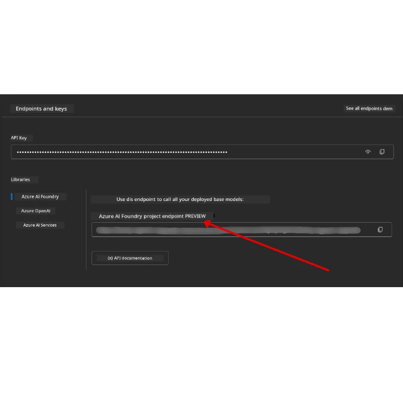

# How to Setup di Course

## Intro

Dis lesson go show how you go run di code samples for dis course.

## Join Other Learners and Get Help

Before you begin to clone your repo, join di [AI Agents For Beginners Discord channel](https://aka.ms/ai-agents/discord) to get help wit setup, ask any question about di course, or to connect wit oda learners.

## Clone or Fork dis Repo

To start, abeg clone or fork di GitHub Repository. Dis go give you your own version of di course material so you fit run, test, and tweak di code!

Dis one fit done by clicking di link to <a href="https://github.com/microsoft/ai-agents-for-beginners/fork" target="_blank">fork di repo</a>

You suppose don get your own forked version of dis course for dis link:


### Shallow Clone (recommended for workshop / Codespaces)

  >Di full repository fit big (~3 GB) if you download full history and all files. If na only workshop you dey attend or you only need small lesson folders, shallow clone (or sparse clone) go help avoid most of dat download by cutting history and/or skipping blobs.

#### Quick shallow clone — minimal history, all files

Replace `<your-username>` for di commands below wit your fork URL (or di upstream URL if you prefer).

To clone only di latest commit history (small download):

```bash|powershell
git clone --depth 1 https://github.com/<your-username>/ai-agents-for-beginners.git
```

To clone a specific branch:

```bash|powershell
git clone --depth 1 --branch <branch-name> https://github.com/<your-username>/ai-agents-for-beginners.git
```

#### Partial (sparse) clone — minimal blobs + only selected folders

Dis one dey use partial clone and sparse-checkout (requires Git 2.25+ and recommended modern Git wit partial clone support):

```bash|powershell
git clone --depth 1 --filter=blob:none --sparse https://github.com/<your-username>/ai-agents-for-beginners.git
```

Traverse into di repo folder:

```bash|powershell
cd ai-agents-for-beginners
```

Then specify which folders you want (example below dey show two folders):

```bash|powershell
git sparse-checkout set 00-course-setup 01-intro-to-ai-agents
```

After you don clone and verify di files, if you only need di files and want free space (no git history), abeg delete di repository metadata (💀irreversible — you go lose all Git functionality: no commits, pulls, pushes, or history access).

```bash
# zsh/bash
rm -rf .git
```

```powershell
# PowerShell
Remove-Item -Recurse -Force .git
```

#### Using GitHub Codespaces (recommended to avoid local large downloads)

- Create new Codespace for dis repo via di [GitHub UI](https://github.com/codespaces).  

- For di terminal of di newly created codespace, run one of di shallow/sparse clone commands wey dey above to bring only di lesson folders wey you need into di Codespace workspace.
- Optional: after you clone inside Codespaces, remove .git to reclaim extra space (see removal commands above).
- Note: If you prefer to open di repo directly in Codespaces (without extra clone), know say Codespaces go still build di devcontainer environment and fit still provision more than you need. Cloning shallow copy inside fresh Codespace give you more control over disk usage.

#### Tips

- Always change di clone URL to your fork if you want edit/commit.
- If later you need more history or files, you fit fetch dem or adjust sparse-checkout to include extra folders.

## Running the Code

Dis course get series of Jupyter Notebooks wey you fit run to get hands-on experience building AI Agents.

Di code samples dey use **Microsoft Agent Framework (MAF)** wit di `AzureAIProjectAgentProvider`, wey connect to **Azure AI Agent Service V2** (di Responses API) through **Microsoft Foundry**.

All Python notebooks dem label `*-python-agent-framework.ipynb`.

## Requirements

- Python 3.12+
  - **NOTE**: If you no get Python3.12 installed, make sure you install am. Then create your venv using python3.12 to make sure correct versions dey installed from di requirements.txt file.
  
    >Example

    Create Python venv directory:

    ```bash|powershell
    python -m venv venv
    ```

    Then activate venv environment for:

    ```bash
    # zsh/bash
    source venv/bin/activate
    ```
  
    ```dos
    # Command Prompt for Windows
    venv\Scripts\activate
    ```

- .NET 10+: For di sample codes wey dey use .NET, make sure you install [.NET 10 SDK](https://dotnet.microsoft.com/download/dotnet/10.0) or later. Then, check di .NET SDK version wey you don install:

    ```bash|powershell
    dotnet --list-sdks
    ```

- **Azure CLI** — Na im required for authentication. Install from [aka.ms/installazurecli](https://aka.ms/installazurecli).
- **Azure Subscription** — To get access to Microsoft Foundry and Azure AI Agent Service.
- **Microsoft Foundry Project** — Project wey get deployed model (e.g., `gpt-4o`). See [Step 1](../../../00-course-setup) wey dey below.

We don include `requirements.txt` file for root of dis repository wey get all di required Python packages to run di code samples.

You fit install dem by running dis command for your terminal at di root of di repository:

```bash|powershell
pip install -r requirements.txt
```

We recommend say make you create Python virtual environment to avoid conflicts and issues.

## Setup VSCode

Make sure say you dey use di correct Python version for VSCode.


## Set Up Microsoft Foundry and Azure AI Agent Service

### Step 1: Create a Microsoft Foundry Project

You need Azure AI Foundry **hub** and **project** with deployed model to run di notebooks.

1. Go to [ai.azure.com](https://ai.azure.com) and sign in wit your Azure account.
2. Create **hub** (or use one wey you don get). See: [Hub resources overview](https://learn.microsoft.com/azure/ai-foundry/concepts/ai-resources).
3. Inside di hub, create **project**.
4. Deploy model (e.g., `gpt-4o`) from **Models + Endpoints** → **Deploy model**.

### Step 2: Retrieve Your Project Endpoint and Model Deployment Name

From your project for di Microsoft Foundry portal:

- **Project Endpoint** — Go to di **Overview** page and copy di endpoint URL.



- **Model Deployment Name** — Go to **Models + Endpoints**, select your deployed model, and note di **Deployment name** (e.g., `gpt-4o`).

### Step 3: Sign in to Azure with `az login`

All notebooks dem dey use **`AzureCliCredential`** for authentication — no API keys to manage. Dis one require say you sign in via di Azure CLI.

1. **Install di Azure CLI** if you never install am: [aka.ms/installazurecli](https://aka.ms/installazurecli)

2. **Sign in** by running:

    ```bash|powershell
    az login
    ```

    Or if you dey for remote/Codespace environment wey no get browser:

    ```bash|powershell
    az login --use-device-code
    ```

3. **Select your subscription** if dem ask you — choose di one wey get your Foundry project.

4. **Verify** say you don sign in:

    ```bash|powershell
    az account show
    ```

> **Why `az login`?** Di notebooks dey authenticate using `AzureCliCredential` from `azure-identity` package. Dis one mean say your Azure CLI session na im dey provide di credentials — no API keys or secrets for your `.env` file. Dis na [security best practice](https://learn.microsoft.com/azure/developer/ai/keyless-connections).

### Step 4: Create Your `.env` File

Copy di example file:

```bash
# zsh/bash
cp .env.example .env
```

```powershell
# PowerShell
Copy-Item .env.example .env
```

Open `.env` and fill these two values:

```env
AZURE_AI_PROJECT_ENDPOINT=https://<your-project>.services.ai.azure.com/api/projects/<your-project-id>
AZURE_AI_MODEL_DEPLOYMENT_NAME=gpt-4o
```

| Variable | Where to find it |
|----------|-----------------|
| `AZURE_AI_PROJECT_ENDPOINT` | Foundry portal → your project → **Overview** page |
| `AZURE_AI_MODEL_DEPLOYMENT_NAME` | Foundry portal → **Models + Endpoints** → your deployed model's name |

Na so e be for most lessons! Di notebooks go authenticate automatically through your `az login` session.

### Step 5: Install Python Dependencies

```bash|powershell
pip install -r requirements.txt
```

We recommend say you run dis inside di virtual environment wey you create earlier.

## Additional Setup for Lesson 5 (Agentic RAG)

Lesson 5 dey use **Azure AI Search** for retrieval-augmented generation. If you wan run dat lesson, add these variables to your `.env` file:

| Variable | Where to find it |
|----------|-----------------|
| `AZURE_SEARCH_SERVICE_ENDPOINT` | Azure portal → your **Azure AI Search** resource → **Overview** → URL |
| `AZURE_SEARCH_API_KEY` | Azure portal → your **Azure AI Search** resource → **Settings** → **Keys** → primary admin key |

## Additional Setup for Lesson 6 and Lesson 8 (GitHub Models)

Some notebooks for lessons 6 and 8 dey use **GitHub Models** instead of Azure AI Foundry. If you wan run dem samples, add these variables to your `.env` file:

| Variable | Where to find it |
|----------|-----------------|
| `GITHUB_TOKEN` | GitHub → **Settings** → **Developer settings** → **Personal access tokens** |
| `GITHUB_ENDPOINT` | Use `https://models.inference.ai.azure.com` (default value) |
| `GITHUB_MODEL_ID` | Model name to use (e.g. `gpt-4o-mini`) |

## Additional Setup for Lesson 8 (Bing Grounding Workflow)

Di conditional workflow notebook for lesson 8 dey use **Bing grounding** via Azure AI Foundry. If you wan run dat sample, add dis variable to your `.env` file:

| Variable | Where to find it |
|----------|-----------------|
| `BING_CONNECTION_ID` | Azure AI Foundry portal → your project → **Management** → **Connected resources** → your Bing connection → copy di connection ID |

## Troubleshooting

### SSL Certificate Verification Errors on macOS

If you dey use macOS and you see error like:

```plaintext
ssl.SSLCertVerificationError: [SSL: CERTIFICATE_VERIFY_FAILED] certificate verify failed: self-signed certificate in certificate chain
```

Dis na known issue wit Python for macOS where system SSL certificates no dey automatically trusted. Try these solutions one by one:

**Option 1: Run Python's Install Certificates script (recommended)**

```bash
# Change 3.XX to the Python version wey you don install (for example, 3.12 or 3.13):
/Applications/Python\ 3.XX/Install\ Certificates.command
```

**Option 2: Use `connection_verify=False` in your notebook (for GitHub Models notebooks only)**

For Lesson 6 notebook (`06-building-trustworthy-agents/code_samples/06-system-message-framework.ipynb`), dem don put commented-out workaround already. Uncomment `connection_verify=False` when you dey create di client:

```python
client = ChatCompletionsClient(
    endpoint=endpoint,
    credential=AzureKeyCredential(token),
    connection_verify=False,  # Turn off SSL verification if you see certificate error dem
)
```

> **⚠️ Warning:** Turning off SSL verification (`connection_verify=False`) mean you dey reduce security by skipping certificate validation. Use am only as temporary workaround for development environments, never for production.

**Option 3: Install and use `truststore`**

```bash
pip install truststore
```

Then add dis at di top of your notebook or script before you make any network calls:

```python
import truststore
truststore.inject_into_ssl()
```

## Stuck Somewhere?

If you get any wahala running dis setup, enter our <a href="https://discord.gg/kzRShWzttr" target="_blank">Azure AI Community Discord</a> or <a href="https://github.com/microsoft/ai-agents-for-beginners/issues?WT.mc_id=academic-105485-koreyst" target="_blank">create an issue</a>.

## Next Lesson

You don ready to run di code for dis course. Happy learning and enjoy more about di world of AI Agents! 

[Introduction to AI Agents and Agent Use Cases](../01-intro-to-ai-agents/README.md)

---

<!-- CO-OP TRANSLATOR DISCLAIMER START -->
Disclaimer:
Dis document na AI translate using Co-op Translator (https://github.com/Azure/co-op-translator). Even though we dey try make am correct, abeg sabi say automated translation fit get mistakes or dey inaccurate. The original document for e original language suppose be di official source. If na important information, better make professional human translator handle am. We no dey responsible for any misunderstanding or wrong interpretation wey fit result from using this translation.
<!-- CO-OP TRANSLATOR DISCLAIMER END -->