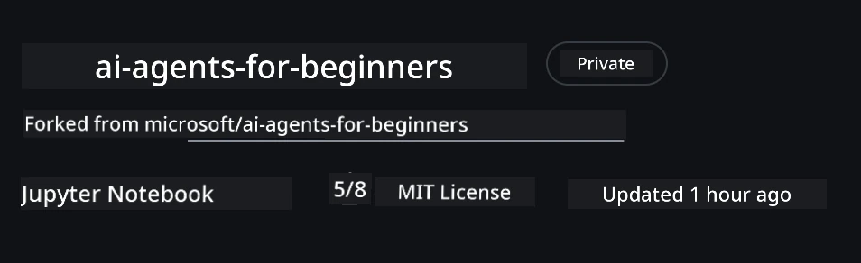
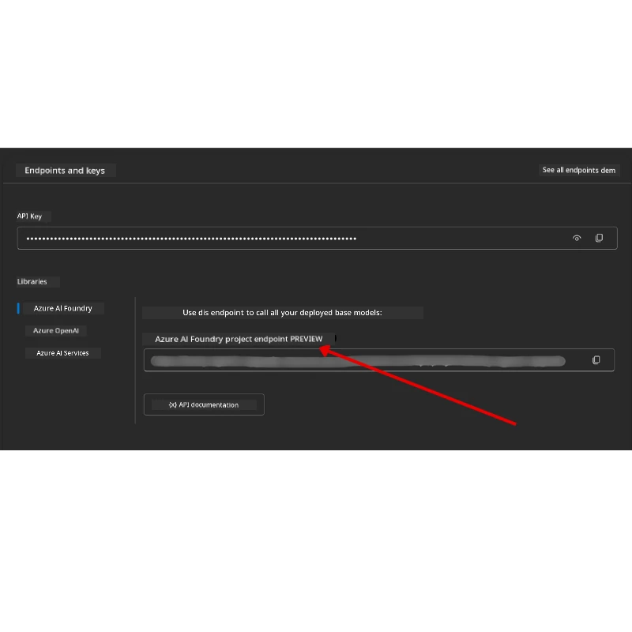

# How to Set Up Course

## Introduction

Dis lesson go show how to run the code samples for dis course.

## Join Other Learners and Get Help

Before you start to clone your repo, join di [AI Agents For Beginners Discord channel](https://aka.ms/ai-agents/discord) to get help for setup, any question about the course, or to connect with other learners.

## Clone or Fork dis Repo

To start, abeg clone or fork di GitHub Repository. Dis one go make your own version of di course material so you fit run, test, and change the code!

You fit do dis by clicking di link to <a href="https://github.com/microsoft/ai-agents-for-beginners/fork" target="_blank">fork di repo</a>

You go don get your own fork version of dis course for dis link:



### Shallow Clone (wey dem recommend for workshop / Codespaces)

  > The full repository fit be big (~3 GB) if you download full history plus all files. If na only workshop you wan join or you just need few lesson folders, shallow clone (or sparse clone) go download small part.

#### Quick shallow clone — minimal history, all files

Change `<your-username>` for di commands below with your fork URL (or if you want, upstream URL).

To clone only di last commit history (small download):

```bash
git clone --depth 1 https://github.com/<your-username>/ai-agents-for-beginners.git
```

To clone specific branch:

```bash
git clone --depth 1 --branch <branch-name> https://github.com/<your-username>/ai-agents-for-beginners.git
```

#### Partial (sparse) clone — minimal blobs + only selected folders

Dis one dey use partial clone and sparse-checkout (you need Git 2.25+ and dem recommend modern Git wey fit do partial clone):

```bash
git clone --depth 1 --filter=blob:none --sparse https://github.com/<your-username>/ai-agents-for-beginners.git
```

Enter the repo folder:

```bash
cd ai-agents-for-beginners
```

Then specify di folders wey you want (example below get two folders):

```bash
git sparse-checkout set 00-course-setup 01-intro-to-ai-agents
```

After cloning and checking di files, if na only files you need and want free space (no git history), abeg delete di repository metadata (💀no fit undo — you go lost all Git functionality):

```bash
# zsh/bash
rm -rf .git
```

```powershell
# PowerShell
Remove-Item -Recurse -Force .git
```

#### Using GitHub Codespaces (wey dem recommend so you no go download big file for your machine)

- Make new Codespace for dis repo via di [GitHub UI](https://github.com/codespaces).  

- For di terminal inside di new codespace wey you create, run one of di shallow/sparse clone commands wey dey above, so dat you go get only di lesson folders wey you need inside di Codespace workspace.
- Optional: after you clone inside Codespaces, you fit comot .git to take back space (see comot commands wey dey above).
- Note: If you want open the repo direct for Codespaces (without extra clone), abeg sabi say Codespaces go still build di devcontainer environment and fit still load pass wetin you need.

#### Tips

- Always change di clone URL to your fork if you want edit/commit.
- If later you need more history or files, you fit fetch dem or change sparse-checkout to add more folders.

## How to Run the Code

Dis course get series of Jupyter Notebooks wey you fit run to get hands-on experience to build AI Agents.

Di code samples dey use **Microsoft Agent Framework (MAF)** with `FoundryChatClient`, wey connect to **Microsoft Foundry Agent Service V2** (di Responses API) through **Microsoft Foundry**.

All Python notebooks dem get label `*-python-agent-framework.ipynb`.

## Wetin You Need

- Python 3.12+
  - **NOTE**: If you never install Python3.12, abeg make sure say you install am. Then create your venv using python3.12 to make sure say correct versions go install from requirements.txt file.
  
    >Example

    Create Python venv directory:

    ```bash
    python -m venv venv
    ```

    Then activate venv environment for:

    ```bash
    # zsh/bash
    source venv/bin/activate
    ```
  
    ```dos
    # Command Prompt for Windows
    venv\Scripts\activate
    ```

- .NET 10+: For sample codes wey use .NET, abeg make sure you install [.NET 10 SDK](https://dotnet.microsoft.com/download/dotnet/10.0) or later. Then, check your installed .NET SDK version:

    ```bash
    dotnet --list-sdks
    ```

- **Azure CLI** — E need for authentication. Install am from [aka.ms/installazurecli](https://aka.ms/installazurecli).
- **Azure Subscription** — For access to Microsoft Foundry and Microsoft Foundry Agent Service.
- **Microsoft Foundry Project** — Project wey get deployed model (like `gpt-5-mini`). See [Step 1](#step-1-create-microsoft-foundry-project) below.

We don include `requirements.txt` file for root of dis repository wey get all the Python packages wey you need to run the code samples.

You fit install dem by running di command below for your terminal inside di root of di repository:

```bash
pip install -r requirements.txt
```

We recommend say you create Python virtual environment to avoid any wahala and conflict.

## Setup VSCode

Make sure say you dey use di correct version of Python for VSCode.


## How to Set Up Microsoft Foundry and Microsoft Foundry Agent Service

### Step 1: Create Microsoft Foundry Project

You need Microsoft Foundry **hub** and **project** wey get deployed model to run di notebooks.

1. Go [ai.azure.com](https://ai.azure.com) and sign in with your Azure account.
2. Create **hub** (or use one wey dey). See: [Hub resources overview](https://learn.microsoft.com/azure/ai-foundry/concepts/ai-resources).
3. Inside di hub, create **project**.
4. Deploy model (like `gpt-5-mini`) from **Models + Endpoints** → **Deploy model**.

### Step 2: Find Your Project Endpoint and Model Deployment Name

For your project inside Microsoft Foundry portal:

- **Project Endpoint** — Go to **Overview** page and copy di endpoint URL.



- **Model Deployment Name** — Go to **Models + Endpoints**, select your deployed model, note di **Deployment name** (like `gpt-5-mini`).

### Step 3: Sign in to Azure with `az login`

Most notebooks authenticate through your **Azure CLI sign-in** — dey use `AzureCliCredential` or `DefaultAzureCredential` (both dey use your `az login` session) from `azure-identity` package — so dem no need API keys. Small lessons and optional integrations dey use API keys; check each lesson prerequisites for any extra environment variables. You must sign in through Azure CLI.

1. **Install Azure CLI** if you never install am yet: [aka.ms/installazurecli](https://aka.ms/installazurecli)

2. **Sign in** by running:

    ```bash
    az login
    ```

    Or if you dey remote/Codespace environment without browser:

    ```bash
    az login --use-device-code
    ```

3. **Select your subscription** if e ask — choose di one wey get your Foundry project.

4. **Verify** say you don sign in:

    ```bash
    az account show
    ```

> **Why `az login`?** Notebooks dey authenticate with `AzureCliCredential` (or `DefaultAzureCredential`, wey still use your Azure CLI sign-in) from `azure-identity` package. Dis one mean say your Azure CLI session dey provide the credentials — no API keys or secrets for your `.env` file. Na [security best practice](https://learn.microsoft.com/azure/developer/ai/keyless-connections).

### Step 4: Create Your `.env` File

Copy di example file:

```bash
# zsh/bash
cp .env.example .env
```

```powershell
# PowerShell
Copy-Item .env.example .env
```

Open `.env` and fill di two values dem:

```env
AZURE_AI_PROJECT_ENDPOINT=https://<your-project>.services.ai.azure.com/api/projects/<your-project-id>
AZURE_AI_MODEL_DEPLOYMENT_NAME=gpt-5-mini
```

| Variable | Where to find am |
|----------|-----------------|
| `AZURE_AI_PROJECT_ENDPOINT` | Foundry portal → your project → **Overview** page |
| `AZURE_AI_MODEL_DEPLOYMENT_NAME` | Foundry portal → **Models + Endpoints** → your deployed model name |

Na im be all for most lessons! Notebooks go automatically authenticate through your `az login` session.

### Step 5: Install Python Dependencies

```bash
pip install -r requirements.txt
```

We recommend say you run dis inside di virtual environment wey you create before.

## Optional Setup: Azure AI Search (Lessons 5 and 16)

Lesson 5 (Agentic RAG) and Lesson 16 notebooks go run straight away with **in-memory knowledge base** — no extra Azure resources required. If you want make dem use real **Azure AI Search** index, know say **Lesson 16 notebook dey use key-based authentication now**: e go switch from in-memory search go Azure AI Search only if **both** `AZURE_SEARCH_SERVICE_ENDPOINT` **and** `AZURE_SEARCH_API_KEY` dey set, otherwise e go remain on in-memory search — so if you want run am with real index, you must set admin key too. Keyless authentication with Microsoft Entra ID (RBAC) na di best approach for your own production code, like di `az login` way wey dem use for dis course.

Di RBAC steps below na for di setup-guide samples and your own code. Dem no dey enable keyless authentication for Lesson 16 notebook; Lesson 16 still need both endpoint and admin key to use Azure AI Search.

1. **Enable role-based access** for your search service:

    ```bash
    az search service update --name <service-name> --resource-group <resource-group> --auth-options aadOrApiKey
    ```

2. **Assign yourself di roles wey you need** (create/load indexes and query):

    ```bash
    az role assignment create --assignee <your-user-or-principal-id> --role "Search Service Contributor" --scope $(az search service show -g <resource-group> -n <service-name> --query id -o tsv)
    az role assignment create --assignee <your-user-or-principal-id> --role "Search Index Data Contributor" --scope $(az search service show -g <resource-group> -n <service-name> --query id -o tsv)
    ```

3. **Add di endpoint** to your `.env` file:

| Variable | Where to find am |
|----------|-----------------|
| `AZURE_SEARCH_SERVICE_ENDPOINT` | Azure portal → your **Azure AI Search** resource → **Overview** → URL |
| `AZURE_SEARCH_API_KEY` | E need (with di endpoint) to enable Azure AI Search for Lesson 16 notebook, wey use key-based auth. Azure portal → **Settings** → **Keys** → primary admin key |

> **Why keyless?** Admin keys fit give full write access to your search service and fit leak through `.env` files. With RBAC, your `az login` identity dey used instead — di same keyless Entra ID style wey di course notebooks dey use (via `AzureCliCredential` / `DefaultAzureCredential`). See [Connect to Azure AI Search using roles](https://learn.microsoft.com/azure/search/search-security-rbac).

Check di [Azure AI Search setup guide](./AzureSearch.md) for full index-creation samples for Python and .NET.

## Extra Setup for Lessons wey Dey Call Azure OpenAI Directly (Lessons 6 and 8)

Some notebooks for lessons 6 and 8 dey call **Azure OpenAI** directly (using **Responses API**) instead of passing Microsoft Foundry project. Dem samples before dey use GitHub Models, wey don old and no support Responses API. Add these variables to your `.env` file:

| Variable | Where to find am |
|----------|-----------------|
| `AZURE_OPENAI_ENDPOINT` | Azure portal → your **Azure OpenAI** resource → **Keys and Endpoint** → Endpoint (e.g. `https://<your-resource>.openai.azure.com`) |
| `AZURE_OPENAI_DEPLOYMENT` | Di name of your deployed model (e.g. `gpt-5-mini`) wey support Responses API |
| `AZURE_OPENAI_API_KEY` | Optional — only if you use key-based auth instead of `az login` / Entra ID |

> Di Responses API dey use stable `/openai/v1/` endpoint, so no `api-version` need be set. Sign in with `az login` to use keyless Entra ID authentication.

## Alternative Provider: MiniMax (OpenAI-Compatible)

[MiniMax](https://platform.minimaxi.com/) dey provide large-context models (up to 204K tokens) through OpenAI-compatible API. Since Microsoft Agent Framework's `OpenAIChatClient` fit work with any OpenAI-compatible endpoint, you fit use MiniMax as drop-in alternative for lessons wey use `OpenAIChatClient`.

Add these variables to your `.env` file:

| Variable | Where to find am |
|----------|-----------------|
| `MINIMAX_API_KEY` | [MiniMax Platform](https://platform.minimaxi.com/) → API Keys |
| `MINIMAX_BASE_URL` | Use `https://api.minimax.io/v1` (default value) |
| `MINIMAX_MODEL_ID` | Model name to use (e.g., `MiniMax-M3`) |

**Example models**: `MiniMax-M3` (wey dem recommend), `MiniMax-M2.7`, `MiniMax-M2.7-highspeed` (faster responses). Model names and availability fit change as time go, and access to model fit depend on your account.

Di code samples wey dey use `OpenAIChatClient` (like Lesson 14 hotel booking workflow) go automatically detect and use your MiniMax setup if `MINIMAX_API_KEY` don set.


## Alternative Provider: Foundry Local (Run Models On-Device)

[Foundry Local](https://foundrylocal.ai) na lightweight runtime wey dey download, manage, and serve language models **full full for your own machine** through one OpenAI-compatible API — no cloud needed.

Because Microsoft Agent Framework's `OpenAIChatClient` fit work with any OpenAI-compatible endpoint, Foundry Local na di local alternative wey you fit just drop-in for Azure OpenAI.

**1. Install Foundry Local**

```bash
# Windows
winget install Microsoft.FoundryLocal

# macOS
brew install foundrylocal
```

**2. Download and run one model** (dis go still start di local service):

```bash
foundry model list          # luk models wey dey available
foundry model run phi-4-mini
```

**3. Install di Python SDK** wey you go use find di local endpoint:

```bash
pip install foundry-local-sdk
```

**4. Point Microsoft Agent Framework to your local model:**

```python
from foundry_local import FoundryLocalManager
from agent_framework.openai import OpenAIChatClient

# Dɔ̀nlɔ̀dz (if e need) an dɛ serves dɛ model locally, den e find dɛ endpoint/port.
manager = FoundryLocalManager("phi-4-mini")

chat_client = OpenAIChatClient(
    base_url=manager.endpoint,      # e.g. http://localhost:<port>/v1
    api_key=manager.api_key,        # always "not-required" for Foundry Local
    model_id=manager.get_model_info("phi-4-mini").id,
)

agent = chat_client.as_agent(
    name="LocalAgent",
    instructions="You are a helpful assistant running fully on-device.",
)
```

> **Note:** Foundry Local dey provide one OpenAI-compatible **Chat Completions** endpoint. Use am for local development and offline situations. If you want di full **Responses API** featureset (like conversations wey get state, etc.), use Azure OpenAI or Microsoft Foundry project.

## Additional Setup for Lesson 8 (Bing Grounding Workflow)

Di conditional workflow notebook for lesson 8 dey use **Bing grounding** through Microsoft Foundry. If you wan run dat sample, add dis variable to your `.env` file:

| Variable | Where to find am |
|----------|-----------------|
| `BING_CONNECTION_ID` | Microsoft Foundry portal → your project → **Management** → **Connected resources** → your Bing connection → copy the connection ID |

## Troubleshooting

### SSL Certificate Verification Errors on macOS

If you dey macOS and you see error wey be like:

```plaintext
ssl.SSLCertVerificationError: [SSL: CERTIFICATE_VERIFY_FAILED] certificate verify failed: self-signed certificate in certificate chain
```

Dis issue na known wahala for Python on macOS, because system SSL certificates no dey automatically trusted. Try these solutions one by one:

**Option 1: Run Python's Install Certificates script (recommended)**

```bash
# Comot 3.XX put di Python version wey you don install (e.g., 3.12 or 3.13):
/Applications/Python\ 3.XX/Install\ Certificates.command
```

**Option 2: Use `connection_verify=False` for your notebook (only for GitHub Models notebooks)**

For Lesson 6 notebook (`06-building-trustworthy-agents/code_samples/06-system-message-framework.ipynb`), dem don put one commented-out workaround already. Uncomment `connection_verify=False` if you get certificate errors:

```python
client = ChatCompletionsClient(
    endpoint=endpoint,
    credential=AzureKeyCredential(token),
    connection_verify=False,  # Turn off SSL checking if you see certificate wahala
)
```

> **⚠️ Warning:** If you disable SSL verification (`connection_verify=False`), e go reduce security because e go skip certificate validation. Use am only as temporary patch for development environment. No use for production.

**Option 3: Install and use `truststore`**

```bash
pip install truststore
```

Then add dis one for top of your notebook or script before you start any network calls:

```python
import truststore
truststore.inject_into_ssl()
```

## You Dey Stuck Somewhere?

If you get any problem to run this setup, join our <a href="https://discord.gg/kzRShWzttr" target="_blank">Azure AI Community Discord</a> or <a href="https://github.com/microsoft/ai-agents-for-beginners/issues?WT.mc_id=academic-105485-koreyst" target="_blank">create one issue</a>.

## Next Lesson

You don ready to run code for dis course now. Happy to learn more about AI Agents world!

[Introduction to AI Agents and Agent Use Cases](../01-intro-to-ai-agents/README.md)

---

<!-- CO-OP TRANSLATOR DISCLAIMER START -->
**Disclaimer**:
Dis document don translate wit AI translation service [Co-op Translator](https://github.com/Azure/co-op-translator). Even tho we dey try make am correct, abeg make you know say automated translation fit get errors or mistakes. Di original document for dia own language na im be di correct source. For important info, make person wey sabi human translation do am. We no go responsible for any misunderstanding or wrong understanding wey fit happen because of dis translation.
<!-- CO-OP TRANSLATOR DISCLAIMER END -->