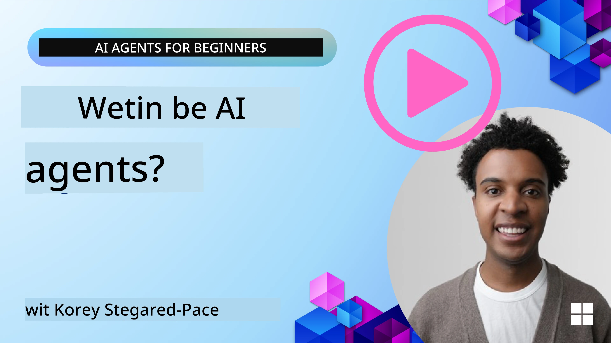
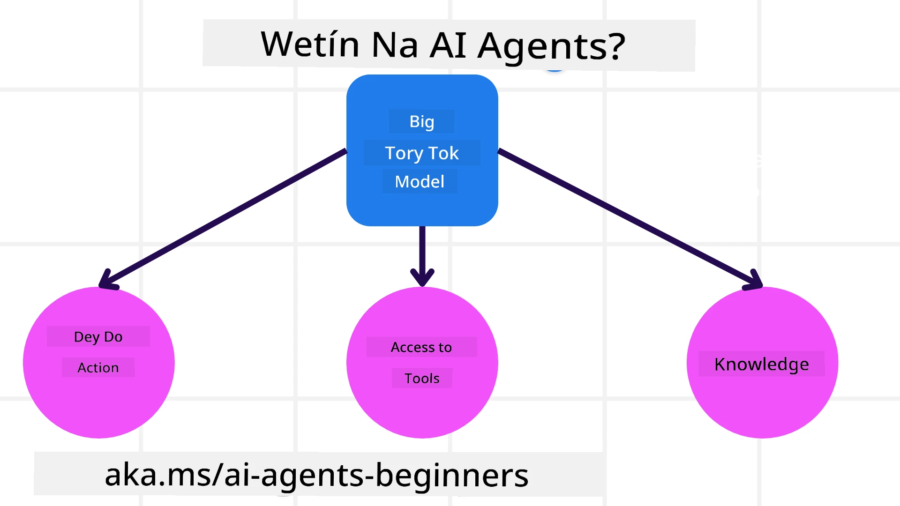
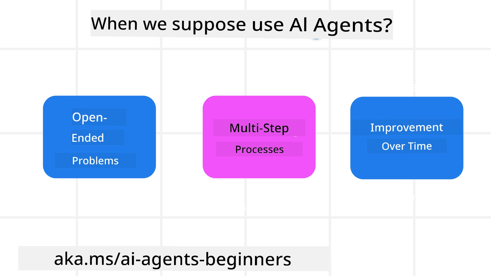

> _(Click di picture wey dey up make you watch di video for dis lesson)_

# Introduction to AI Agents and Agent Use Cases

Welcome to di "AI Agents for Beginners" course! Dis course go give you basic knowledge and sample wey you fit use to build AI Agents.

Join the <a href="https://discord.gg/kzRShWzttr" target="_blank">Azure AI Discord Community</a> make you meet oda learners and AI Agent Builders, and fit ask any question wey you get about dis course.

To start dis course, we go first try sabi wetin AI Agents be and how we fit use dem for di applications and workflows we dey build.

## Introduction

Dis lesson dey cover:

- Wetin be AI Agents and wetin be di different kain agents?
- Which kain use cases best for AI Agents and how dem fit help us?
- Wetin be some basic building blocks when we dey design Agentic Solutions?

## Learning Goals
After you finish dis lesson, you suppose fit:

- Understand AI Agent concepts and how dem different from oda AI solutions.
- Apply AI Agents well well so e go efficient.
- Design Agentic solutions wey productive for both users and customers.

## Defining AI Agents and Types of AI Agents

### What are AI Agents?

AI Agents na **systems** wey make **Large Language Models(LLMs)** fit **perform actions** by to extend dia abilities, give LLMs **access to tools** and **knowledge**.

Make we break dis definition small small:

- **System** - E important make we think about agents no as just one component but as system wey get many components. For basic level, di components of an AI Agent na:
  - **Environment** - Di defined space wey di AI Agent dey operate. For example, if we get travel booking AI Agent, di environment fit be di travel booking system wey di AI Agent dey use to complete tasks.
  - **Sensors** - Environments get information and dem dey provide feedback. AI Agents dey use sensors to gather and interpret dis information about di current state of di environment. For di Travel Booking Agent example, di travel booking system fit give info like hotel availability or flight prices.
  - **Actuators** - Once di AI Agent don receive di current state of di environment, for di current task di agent go determine which action to perform to change di environment. For di travel booking agent, e fit be to book an available room for di user.

**Large Language Models** - Di idea of agents dey before LLMs come. Di advantage of to build AI Agents with LLMs na say dem sabi interpret human language and data. Dis skill make LLMs fit interpret environmental information and plan how to change di environment.

**Perform Actions** - Outside Agent systems, LLMs dey limited to situations wey action na to generate content or information based on user prompt. Inside AI Agent systems, LLMs fit do tasks by to interpret di user request and use tools wey dey for dia environment.

**Access To Tools** - Which tools di LLM fit access dey depend on 1) di environment wey e dey operate and 2) di developer of di AI Agent. For our travel agent example, di agent tools dey limited by di operations wey available for di booking system, and/or di developer fit limit di agent tool access to flights.

**Memory+Knowledge** - Memory fit short-term for di conversation between di user and di agent. For long-term, outside di information wey environment provide, AI Agents fit also retrieve knowledge from oda systems, services, tools, and even oda agents. For di travel agent example, dis knowledge fit be info about di user's travel preferences wey dey for customer database.

### The different types of agents

Now we don get general definition of AI Agents, make we see some specific agent types and how dem go apply to travel booking AI agent.

| **Kain Agent**                | **Wetin E Mean**                                                                                                                       | **Example**                                                                                                                                                                                                                   |
| ----------------------------- | ------------------------------------------------------------------------------------------------------------------------------------- | ----------------------------------------------------------------------------------------------------------------------------------------------------------------------------------------------------------------------------- |
| **Simple Reflex Agents**      | Dem dey perform immediate actions based on rules wey dem don set already.                                                                                  | Travel agent go interpret di context of di email and forward travel complaints go customer service.                                                                                                                          |
| **Model-Based Reflex Agents** | Dem dey perform actions based on one model of di world and changes wey happen to dat model.                                                              | Travel agent go prioritize routes wey price don change well based on access to historical pricing data.                                                                                                             |
| **Goal-Based Agents**         | Dem dey create plans to achieve specific goals by to interpret di goal and decide wetin to do to reach am.                                  | Travel agent go book journey by to figure out necessary travel arrangements (car, public transit, flights) from di current location go destination.                                                                                |
| **Utility-Based Agents**      | Dem dey consider preferences and weigh tradeoffs using numbers to decide how to achieve goals.                                               | Travel agent go maximize utility by to weigh convenience vs cost when e dey book travel.                                                                                                                                          |
| **Learning Agents**           | Dem dey improve over time by to respond to feedback and adjust actions accordingly.                                                        | Travel agent go improve by using customer feedback from post-trip surveys to make adjustments to future bookings.                                                                                                               |
| **Hierarchical Agents**       | Dem get multiple agents arranged for levels, with higher-level agents wey go break tasks into subtasks for lower-level agents to complete. | Travel agent go cancel trip by to divide di task into subtasks (for example, cancel specific bookings) and make lower-level agents complete dem, then report back to di higher-level agent.                                     |
| **Multi-Agent Systems (MAS)** | Agents dey complete tasks independently, dem fit cooperate or compete.                                                           | Cooperative: Multiple agents go book specific travel services like hotels, flights, and entertainment. Competitive: Multiple agents go manage and compete over shared hotel booking calendar to book customers into di hotel. |

## When to Use AI Agents

For di earlier section, we use di Travel Agent example to show how different types of agents fit work for different travel booking scenarios. We go still use dis app throughout di course.

Make we look di kinds of use cases wey AI Agents dey best for:

- **Open-Ended Problems** - allow di LLM to decide di steps wey necessary to complete task because you no fit always hardcode am inside one workflow.
- **Multi-Step Processes** - tasks wey get levels of complexity wey make di AI Agent need to use tools or information over multiple turns instead of one-shot retrieval.  
- **Improvement Over Time** - tasks wey di agent fit improve over time by to receive feedback from either di environment or users so e go provide better utility.

We go cover more considerations about using AI Agents for di Building Trustworthy AI Agents lesson.

## Basics of Agentic Solutions

### Agent Development

Di first step for to design AI Agent system na to define di tools, actions, and behaviors. For dis course, we focus on to use di **Azure AI Agent Service** to define our Agents. E get features like:

- Selection of Open Models such as OpenAI, Mistral, and Llama
- Use of Licensed Data through providers such as Tripadvisor
- Use of standardized OpenAPI 3.0 tools

### Agentic Patterns

Communication with LLMs dey through prompts. Because AI Agents na semi-autonomous, e no always possible or necessary to manually reprompt di LLM after change happen for di environment. We dey use **Agentic Patterns** wey allow us to prompt di LLM over multiple steps for more scalable way.

Dis course split into some of di popular Agentic patterns wey dey now.

### Agentic Frameworks

Agentic Frameworks dey allow developers implement agentic patterns through code. Dem provide templates, plugins, and tools for better AI Agent collaboration. Dem benefits give ability for better observability and troubleshooting of AI Agent systems.

For dis course, we go explore di Microsoft Agent Framework (MAF) to build production-ready AI agents.

## Sample Codes

- Python: [Agent Framework](./code_samples/01-python-agent-framework.ipynb)
- .NET: [Agent Framework](./code_samples/01-dotnet-agent-framework.md)

## Got More Questions about AI Agents?

Join the [Microsoft Foundry Discord](https://aka.ms/ai-agents/discord) make you meet oda learners, attend office hours and make your AI Agents questions dem answer.

## Previous Lesson

[Course Setup](../00-course-setup/README.md)

## Next Lesson

[Exploring Agentic Frameworks](../02-explore-agentic-frameworks/README.md)

---

<!-- CO-OP TRANSLATOR DISCLAIMER START -->
Disclaimer:
Dis document don translate wit AI translation service Co-op Translator (https://github.com/Azure/co-op-translator). Even though we try make am correct, make you sabi say automatic translations fit get mistakes or no too accurate. Di original document for im own language dey remain di official/authoritative source. If na important information, better make professional human translator check am. We no dey liable for any misunderstanding or wrong interpretation wey fit happen from di use of dis translation.
<!-- CO-OP TRANSLATOR DISCLAIMER END -->