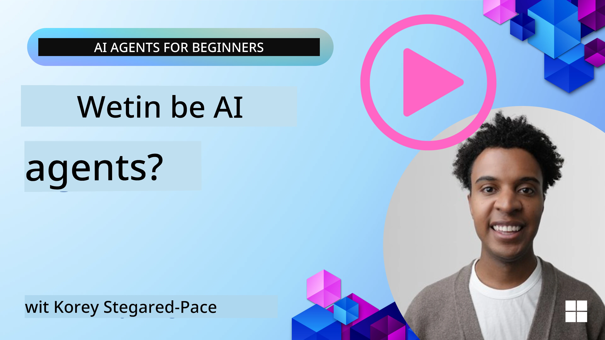
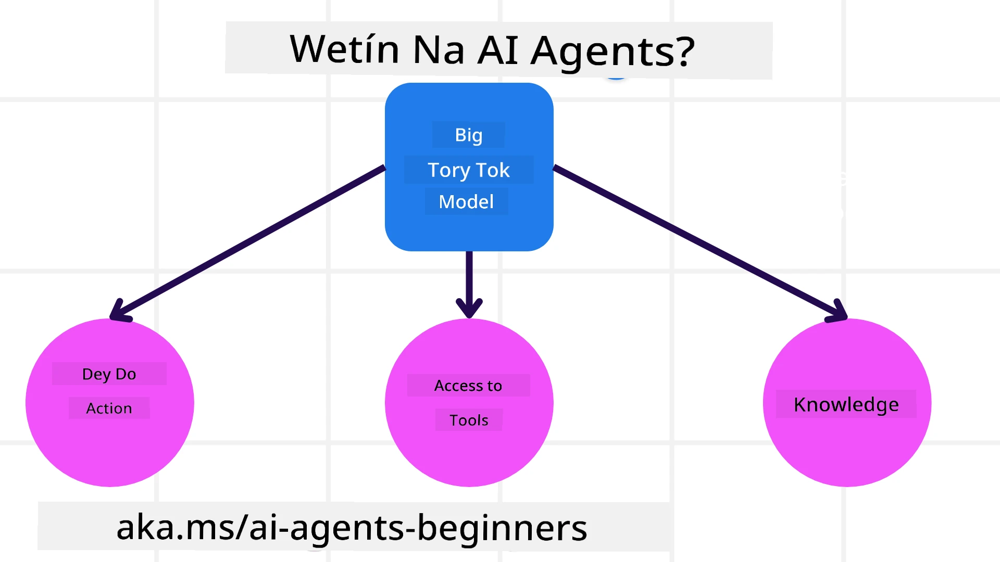
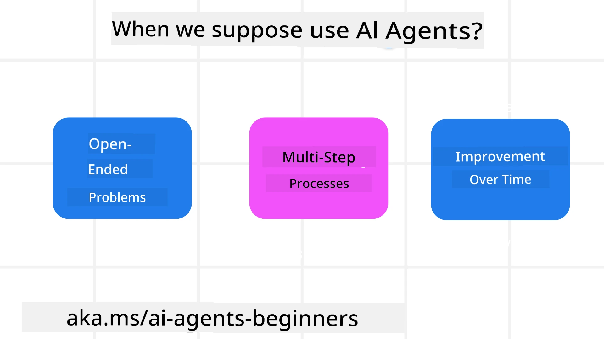

> _(Click di image wey dey top to watch di video for dis lesson)_

# Introduction to AI Agents and Agent Use Cases

Welcome to di **AI Agents for Beginners** course! Dis course go give you di basic knowledge — and real working code — to start to build AI Agents from ground up.

Come make we yan for <a href="https://discord.gg/kzRShWzttr" target="_blank">Azure AI Discord Community</a> — e full with learners and AI builders wey dey ready to answer your questions.

Before we start to build, mek we sure say we really sabi wetin AI Agent *be* and when e make sense to use one.

---

## Introduction

Dis lesson dey cover:

- Wetin AI Agents be, and di different kind wey dey
- Kain task wey AI Agents fit do well
- Di main building blocks wey you go use when you dey design Agentic solution

## Learning Goals

By di end of dis lesson, you suppose fit:

- Talk wetin AI Agent be and how e different from regular AI solution
- Know when you suppose use AI Agent (and when you no suppose)
- Draw basic Agentic solution design for real-world problem

---

## Defining AI Agents and Types of AI Agents

### Wetin be AI Agents?

Dis na simple way to think about am:

> **AI Agents na systems wey dey allow Large Language Models (LLMs) to actually *do things* — by giving dem tools and knowledge to act for di world, no just to respond to prompts.**

Make we break am down small:

- **System** — AI Agent no be just one tin. E be collection of parts wey dey work together. For inside, every agent get three parts:
  - **Environment** — Di space wey di agent dey work. For travel booking agent, dis na di booking platform itself.
  - **Sensors** — How di agent dey read di current state of di environment. Our travel agent fit check hotel availability or flight prices.
  - **Actuators** — How di agent dey take action. Di travel agent fit book room, send confirmation, or cancel reservation.

- **Large Language Models** — Agents dey before LLMs, but LLMs na wetin make modern agents strong well well. Dem fit understand natural language, reason about context, and turn vague user request into concrete plan of action.

- **Perform Actions** — Without agent system, LLM just go generate text. Inside agent system, di LLM fit actually *execute* steps — search database, call API, send message.

- **Access to Tools** — Di tools wey agent fit use depend on (1) di environment e dey run and (2) wetin di developer choose to give am. Travel agent fit fit search flights but no fit edit customer records — na everything you wire up.

- **Memory + Knowledge** — Agents fit get short-term memory (di current conversation) and long-term memory (customer database, past talks). Travel agent fit "remember" say you like window seats.

---

### Different Kinds of AI Agents

No all agents dem build one kain. Dis na breakdown of di main ones, using travel booking agent as example:

| **Agent Type** | **Wetin E Dey Do** | **Travel Agent Example** |
|---|---|---|
| **Simple Reflex Agents** | Dey follow hard-coded rules — no memory, no planning. | See complaint email → forward am to customer service. Na only dat. |
| **Model-Based Reflex Agents** | Get internal model of world and dey update as tins change. | Track old flight prices and show routes wey suddenly expensive. |
| **Goal-Based Agents** | Get goal for mind and dey figure how to reach am step by step. | Book full trip (flights, car, hotel) from your current place to your destination. |
| **Utility-Based Agents** | No just find *one* solution — find *best* one by weighing pros and cons. | Balance cost vs convenience to find trip wey fit you well well. |
| **Learning Agents** | Get better as time pass by learning from feedback. | Adjust booking recommendations based on survey after trip. |
| **Hierarchical Agents** | High-level agent dey break work into small tasks and give lower-level agents. | "Cancel trip" dey split: cancel flight, cancel hotel, cancel car rental — every one dey handled by sub-agent. |
| **Multi-Agent Systems (MAS)** | Plenty independent agents wey dey work together (or compete). | Cooperative: different agents dey handle hotels, flights, entertainment. Competitive: many agents dey compete to fill hotel rooms at best price. |

---

## When To Use AI Agents

Just because you fit use AI Agent no mean say you gats always use am. Dis na tins wey AI agents strong well:

- **Open-Ended Problems** — When steps to solve problem no fit pre-program. LLM gats figure di path as e dey go.
- **Multi-Step Processes** — Tasks wey need tools for many steps, no be only one lookup or generation.
- **Improvement Over Time** — When you want say di system go get smarter based on user feedback or environment signals.

We go reason well well about when (and when *no*) to use AI Agents for **Building Trustworthy AI Agents** lesson for later part of di course.

---

## Basics of Agentic Solutions

### Agent Development

First tin wey you do when you dey build agent na to define *wetin e fit do* — di tools, actions, and behaviors.

For dis course, we dey use **Microsoft Foundry Agent Service** as main platform. E supports:

- Models from providers like OpenAI, Mistral, and Meta (Llama)
- Licensed data from providers like Tripadvisor
- Standardized OpenAPI 3.0 tool definitions

### Agentic Patterns

You dey communicate with LLMs through prompts. With agents, you no fit hand-craft every prompt manually — agent gats take action for many steps. Na why **Agentic Patterns** dey. Dem be reusable strategies for prompting and control LLMs in way wey fit scale and reliable.

Dis course base on di most common and useful agentic patterns.

### Agentic Frameworks

Agentic Frameworks dey give developers ready-made templates, tools, and infrastructure for build agents. E make am easy to:

- Wire up tools and capabilities
- Observe wetin agent dey do (and debug when e spoil)
- Work together across many agents

For dis course, we dey focus on **Microsoft Agent Framework (MAF)** for build production-ready agents.

---

## Code Samples

Ready to see how e dey work? Here be code samples for dis lesson:

- 🐍 Python: [Agent Framework](./code_samples/01-python-agent-framework.ipynb)
- 🔷 .NET: [Agent Framework](./code_samples/01-dotnet-agent-framework.md)

---

## Get Questions?

Join [Microsoft Foundry Discord](https://discord.com/invite/ATgtXmAS5D) to connect with other learners, attend office hours, and get your AI Agent questions answer by community.

---

## Previous Lesson

[Course Setup](../00-course-setup/README.md)

## Next Lesson

[Exploring Agentic Frameworks](../02-explore-agentic-frameworks/README.md)

---

<!-- CO-OP TRANSLATOR DISCLAIMER START -->
**Disclaimer**:
Dis document don translate wit AI translation service [Co-op Translator](https://github.com/Azure/co-op-translator). Even tho we dey try make am correct, abeg make you know say automated translation fit get errors or mistakes. Di original document for dia own language na im be di correct source. For important info, make person wey sabi human translation do am. We no go responsible for any misunderstanding or wrong understanding wey fit happen because of dis translation.
<!-- CO-OP TRANSLATOR DISCLAIMER END -->