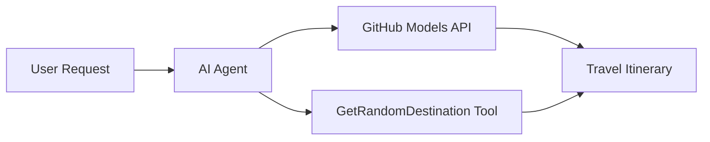

<!--
CO_OP_TRANSLATOR_METADATA:
{
  "original_hash": "e959fefef991a78e6eb72b5ce8ca58d4",
  "translation_date": "2025-11-11T14:12:02+00:00",
  "source_file": "01-intro-to-ai-agents/code_samples/01-dotnet-agent-framework.md",
  "language_code": "pcm"
}
-->
# 🌍 AI Travel Agent wit Microsoft Agent Framework (.NET)

## 📋 Overview of di Scenario

Dis notebook dey show how pesin fit build smart travel planning agent wit di Microsoft Agent Framework for .NET. Di agent fit automatically create personalized day-trip plans for random destinations wey dey anywhere for di world.

### Di Main Abilities:

- 🎲 **Random Destination Selection**: E dey use custom tool to choose vacation spots
- 🗺️ **Smart Trip Planning**: E dey create detailed day-by-day plans
- 🔄 **Real-time Streaming**: E support both immediate and streaming responses
- 🛠️ **Custom Tool Integration**: E dey show how pesin fit add more power to di agent

## 🔧 Technical Architecture

### Di Main Technologies

- **Microsoft Agent Framework**: Di latest .NET implementation for AI agent development
- **GitHub Models Integration**: E dey use GitHub AI model inference service
- **OpenAI API Compatibility**: E dey use OpenAI client libraries wit custom endpoints
- **Secure Configuration**: E dey manage API keys based on environment

### Di Main Components

1. **AIAgent**: Na di main agent wey dey handle di conversation flow
2. **Custom Tools**: `GetRandomDestination()` function wey di agent fit use
3. **Chat Client**: GitHub Models-powered conversation interface
4. **Streaming Support**: E fit generate real-time responses

### Integration Pattern



## 🚀 How to Start

### Wetin You Need

- [.NET 10 SDK](https://dotnet.microsoft.com/download/dotnet/10.0) or higher
- [GitHub Models API access token](https://docs.github.com/github-models/github-models-at-scale/using-your-own-api-keys-in-github-models)

### Di Environment Variables We You Go Need

```bash
# zsh/bash
export GH_TOKEN=<your_github_token>
export GH_ENDPOINT=https://models.github.ai/inference
export GH_MODEL_ID=openai/gpt-5-mini
```

```powershell
# PowerShell
$env:GH_TOKEN = "<your_github_token>"
$env:GH_ENDPOINT = "https://models.github.ai/inference"
$env:GH_MODEL_ID = "openai/gpt-5-mini"
```

### Example Code

To run di code example,

```bash
# zsh/bash
chmod +x ./01-dotnet-agent-framework.cs
./01-dotnet-agent-framework.cs
```

Or if you wan use di dotnet CLI:

```bash
dotnet run ./01-dotnet-agent-framework.cs
```

Check [`01-dotnet-agent-framework.cs`](../../../../01-intro-to-ai-agents/code_samples/01-dotnet-agent-framework.cs) for di full code.

```csharp
#!/usr/bin/dotnet run

#:package Microsoft.Extensions.AI@9.*
#:package Microsoft.Agents.AI.OpenAI@1.*-*

using System.ClientModel;
using System.ComponentModel;

using Microsoft.Agents.AI;
using Microsoft.Extensions.AI;

using OpenAI;

// Tool Function: Random Destination Generator
// This static method will be available to the agent as a callable tool
// The [Description] attribute helps the AI understand when to use this function
// This demonstrates how to create custom tools for AI agents
[Description("Provides a random vacation destination.")]
static string GetRandomDestination()
{
    // List of popular vacation destinations around the world
    // The agent will randomly select from these options
    var destinations = new List<string>
    {
        "Paris, France",
        "Tokyo, Japan",
        "New York City, USA",
        "Sydney, Australia",
        "Rome, Italy",
        "Barcelona, Spain",
        "Cape Town, South Africa",
        "Rio de Janeiro, Brazil",
        "Bangkok, Thailand",
        "Vancouver, Canada"
    };

    // Generate random index and return selected destination
    // Uses System.Random for simple random selection
    var random = new Random();
    int index = random.Next(destinations.Count);
    return destinations[index];
}

// Extract configuration from environment variables
// Retrieve the GitHub Models API endpoint, defaults to https://models.github.ai/inference if not specified
// Retrieve the model ID, defaults to openai/gpt-5-mini if not specified
// Retrieve the GitHub token for authentication, throws exception if not specified
var github_endpoint = Environment.GetEnvironmentVariable("GH_ENDPOINT") ?? "https://models.github.ai/inference";
var github_model_id = Environment.GetEnvironmentVariable("GH_MODEL_ID") ?? "openai/gpt-5-mini";
var github_token = Environment.GetEnvironmentVariable("GH_TOKEN") ?? throw new InvalidOperationException("GH_TOKEN is not set.");

// Configure OpenAI Client Options
// Create configuration options to point to GitHub Models endpoint
// This redirects OpenAI client calls to GitHub's model inference service
var openAIOptions = new OpenAIClientOptions()
{
    Endpoint = new Uri(github_endpoint)
};

// Initialize OpenAI Client with GitHub Models Configuration
// Create OpenAI client using GitHub token for authentication
// Configure it to use GitHub Models endpoint instead of OpenAI directly
var openAIClient = new OpenAIClient(new ApiKeyCredential(github_token), openAIOptions);

// Create AI Agent with Travel Planning Capabilities
// Initialize OpenAI client, get chat client for specified model, and create AI agent
// Configure agent with travel planning instructions and random destination tool
// The agent can now plan trips using the GetRandomDestination function
AIAgent agent = openAIClient
    .GetChatClient(github_model_id)
    .CreateAIAgent(
        instructions: "You are a helpful AI Agent that can help plan vacations for customers at random destinations",
        tools: [AIFunctionFactory.Create(GetRandomDestination)]
    );

// Execute Agent: Plan a Day Trip
// Run the agent with streaming enabled for real-time response display
// Shows the agent's thinking and response as it generates the content
// Provides better user experience with immediate feedback
await foreach (var update in agent.RunStreamingAsync("Plan me a day trip"))
{
    await Task.Delay(10);
    Console.Write(update);
}
```

---

<!-- CO-OP TRANSLATOR DISCLAIMER START -->
**Disclaimer**:  
Dis dokyument don translate wit AI translation service [Co-op Translator](https://github.com/Azure/co-op-translator). Even as we dey try make am accurate, abeg sabi say machine translation fit get mistake or no dey correct well. Di original dokyument for im native language na di main source wey you go trust. For important information, e good make professional human translator check am. We no go fit take blame for any misunderstanding or wrong interpretation wey fit happen because you use dis translation.
<!-- CO-OP TRANSLATOR DISCLAIMER END -->