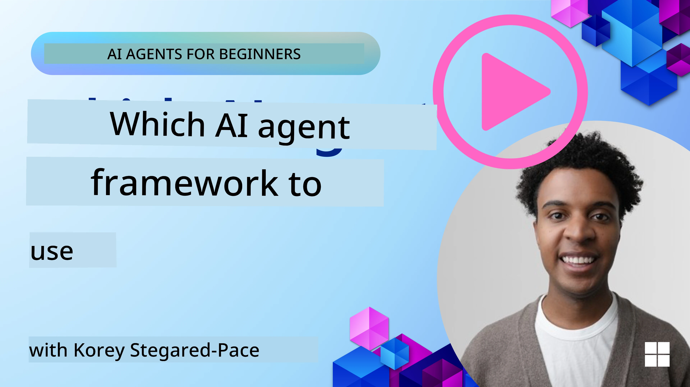

[](https://youtu.be/ODwF-EZo_O8?si=1xoy_B9RNQfrYdF7)

> _(Click di picture wey dey above make you watch di video for dis lesson)_

# Make we Explore AI Agent Frameworks

AI agent frameworks na software platforms wey dem design to make e easy to build, deploy, and manage AI agents. Dem frameworks dey provide developers pre-built components, abstractions, and tools wey go help make development of complex AI systems faster.

Dem frameworks dey help developers focus on wetin make their apps different by providing standard ways to solve common wahala for AI agent development. Dem fit improve scalability, accessibility, and efficiency for building AI systems.

## Introduction 

This lesson go cover:

- Wetin be AI Agent Frameworks and wetin dem fit make developers achieve?
- How teams fit use dem to quickly prototype, iterate, and improve their agent’s capabilities?
- Wetin be di differences between di frameworks and tools wey Microsoft create (<a href="https://aka.ms/ai-agents-beginners/ai-agent-service" target="_blank">Azure AI Agent Service</a> and the <a href="https://learn.microsoft.com/azure/ai-services/openai/how-to/responses" target="_blank">Microsoft Agent Framework</a>)?
- I fit integrate my existing Azure ecosystem tools directly, or I need standalone solutions?
- Wetin be Azure AI Agents service and how e dey help me?

## Learning goals

Di goals for dis lesson na to help you understand:

- Di role of AI Agent Frameworks for AI development.
- How to use AI Agent Frameworks to build intelligent agents.
- Key capabilities wey AI Agent Frameworks dey enable.
- Di differences between Microsoft Agent Framework and Azure AI Agent Service.

## What are AI Agent Frameworks and what do they enable developers to do?

Traditional AI Frameworks fit help you add AI inside your apps and make dem better for di following ways:

- **Personalization**: AI fit analyze how user dey behave and wetin dem like to give personalised recommendations, content, and experiences.
Example: Streaming services like Netflix dey use AI to suggest movies and shows based on wetin person don watch before, wey dey increase user engagement and satisfaction.
- **Automation and Efficiency**: AI fit automate repetitive tasks, simplify workflows, and make operations more efficient.
Example: Customer service apps dey use AI-powered chatbots to handle common questions, wey dey reduce response time and free human agents make dem handle more complex matter.
- **Enhanced User Experience**: AI fit improve overall user experience by providing smart features like voice recognition, natural language processing, and predictive text.
Example: Virtual assistants like Siri and Google Assistant dey use AI to understand and respond to voice commands, make am easier for users to interact with their devices.

### That all sounds great right, so why do we need the AI Agent Framework?

AI Agent frameworks na something pass normal AI frameworks. Dem design dem to make building intelligent agents easy — agents wey fit interact with users, other agents, and the environment to reach specific goals. These agents fit behave on their own, make decisions, and adapt when things change. Make we look some important capabilities wey AI Agent Frameworks dey enable:

- **Agent Collaboration and Coordination**: Dem allow make many AI agents fit work together, communicate, and coordinate to solve complex tasks.
- **Task Automation and Management**: Dem provide ways to automate multi-step workflows, delegate tasks, and manage tasks dynamically among agents.
- **Contextual Understanding and Adaptation**: Dem give agents ability to understand context, adapt to changing environment, and make decisions based on real-time information.

So, to summarize, agents fit help you do more, push automation to the next level, and create systems wey sabi adapt and learn from wetin dey happen around dem.

## How to quickly prototype, iterate, and improve the agent’s capabilities?

Dis space dey move fast, but some things common for most AI Agent Frameworks fit help you quickly prototype and iterate — like modular components, collaborative tools, and real-time learning. Make we break dem down:

- **Use Modular Components**: AI SDKs dey provide pre-built components like AI and Memory connectors, function calling via natural language or code plugins, prompt templates, and more.
- **Leverage Collaborative Tools**: Design agents with specific roles and tasks, make dem test and refine collaborative workflows.
- **Learn in Real-Time**: Put feedback loops where agents dey learn from interactions and change how dem dey behave dynamically.

### Use Modular Components

SDKs like the Microsoft Agent Framework get pre-built components like AI connectors, tool definitions, and agent management.

**How teams can use these**: Teams fit quickly put these components together to create functional prototype without starting from scratch, make dem do rapid experimentation and iteration.

**How it works in practice**: You fit use pre-built parser to extract information from user input, a memory module to store and retrieve data, and a prompt generator to interact with users, all without the need to build these components from scratch.

**Example code**. Make we look example how you fit use the Microsoft Agent Framework with `AzureAIProjectAgentProvider` to make the model respond to user input with tool calling:

``` python
# Microsoft Agent Framework Python Example

import asyncio
import os
from typing import Annotated

from agent_framework.azure import AzureAIProjectAgentProvider
from azure.identity import AzureCliCredential


# Define one sample tool function wey go book travel
def book_flight(date: str, location: str) -> str:
    """Book travel given location and date."""
    return f"Travel was booked to {location} on {date}"


async def main():
    provider = AzureAIProjectAgentProvider(credential=AzureCliCredential())
    agent = await provider.create_agent(
        name="travel_agent",
        instructions="Help the user book travel. Use the book_flight tool when ready.",
        tools=[book_flight],
    )

    response = await agent.run("I'd like to go to New York on January 1, 2025")
    print(response)
    # Example output: Your flight go New York for January 1, 2025, don successfully book. Safe travels! ✈️🗽


if __name__ == "__main__":
    asyncio.run(main())
```

Wetin you fit see from dis example na how you fit use pre-built parser to extract important information from user input, like origin, destination, and date for a flight booking request. Dis modular approach dey let you focus on di high-level logic.

### Leverage Collaborative Tools

Frameworks like the Microsoft Agent Framework dey make am easy to create many agents wey fit work together.

**How teams can use these**: Teams fit design agents with special roles and tasks, make dem test and improve collaborative workflows and boost overall system efficiency.

**How it works in practice**: You fit create team of agents where each agent get special function, like data retrieval, analysis, or decision-making. These agents fit communicate and share info to reach one goal, like answer user question or finish task.

**Example code (Microsoft Agent Framework)**:

```python
# Dey make plenti agents weh go work together using Microsoft Agent Framework

import os
from agent_framework.azure import AzureAIProjectAgentProvider
from azure.identity import AzureCliCredential

provider = AzureAIProjectAgentProvider(credential=AzureCliCredential())

# Data Retrieval Agent
agent_retrieve = await provider.create_agent(
    name="dataretrieval",
    instructions="Retrieve relevant data using available tools.",
    tools=[retrieve_tool],
)

# Data Analysis Agent
agent_analyze = await provider.create_agent(
    name="dataanalysis",
    instructions="Analyze the retrieved data and provide insights.",
    tools=[analyze_tool],
)

# Run agents dem one by one for one task
retrieval_result = await agent_retrieve.run("Retrieve sales data for Q4")
analysis_result = await agent_analyze.run(f"Analyze this data: {retrieval_result}")
print(analysis_result)
```

Wetin you see for the code before na how you fit create task wey need multiple agents to work together to analyze data. Each agent dey do specific work, and the task dey execute by coordinating the agents to reach the wanted result. If you create dedicated agents with specialized roles, you fit make task more efficient and perform better.

### Learn in Real-Time

Advanced frameworks get features for real-time context understanding and adaptation.

**How teams can use these**: Teams fit put feedback loops where agents dey learn from interactions and adjust their behavior dynamically, wey go lead to continuous improvement and better capabilities.

**How it works in practice**: Agents fit analyze user feedback, environmental data, and task results to update their knowledge base, adjust decision-making algorithms, and improve performance over time. Dis iterative learning process make agents fit adapt to changing conditions and user preferences, and improve overall system effectiveness.

## What are the differences between the Microsoft Agent Framework and Azure AI Agent Service?

Plenty ways dey to compare these approaches, but make we look some key differences for design, capabilities, and target use cases:

## Microsoft Agent Framework (MAF)

The Microsoft Agent Framework na streamlined SDK for building AI agents using `AzureAIProjectAgentProvider`. E allow developers create agents wey fit use Azure OpenAI models with built-in tool calling, conversation management, and enterprise-grade security through Azure identity.

**Use Cases**: Build production-ready AI agents wey fit use tools, run multi-step workflows, and integrate into enterprise scenarios.

Here be some important core concepts for the Microsoft Agent Framework:

- **Agents**. Agent dey create via `AzureAIProjectAgentProvider` and you fit configure am with name, instructions, and tools. The agent fit:
  - **Process user messages** and generate responses using Azure OpenAI models.
  - **Call tools** automatically based on conversation context.
  - **Maintain conversation state** across many interactions.

  Here be code snippet wey show how to create an agent:

    ```python
    import os
    from agent_framework.azure import AzureAIProjectAgentProvider
    from azure.identity import AzureCliCredential

    provider = AzureAIProjectAgentProvider(credential=AzureCliCredential())
    agent = await provider.create_agent(
        name="my_agent",
        instructions="You are a helpful assistant.",
    )

    response = await agent.run("Hello, World!")
    print(response)
    ```

- **Tools**. The framework support defining tools as Python functions wey the agent fit call automatically. Tools dey register when you create the agent:

    ```python
    def get_weather(location: str) -> str:
        """Get the current weather for a location."""
        return f"The weather in {location} is sunny, 72\u00b0F."

    agent = await provider.create_agent(
        name="weather_agent",
        instructions="Help users check the weather.",
        tools=[get_weather],
    )
    ```

- **Multi-Agent Coordination**. You fit create many agents wey get different specializations and coordinate how dem work:

    ```python
    planner = await provider.create_agent(
        name="planner",
        instructions="Break down complex tasks into steps.",
    )

    executor = await provider.create_agent(
        name="executor",
        instructions="Execute the planned steps using available tools.",
        tools=[execute_tool],
    )

    plan = await planner.run("Plan a trip to Paris")
    result = await executor.run(f"Execute this plan: {plan}")
    ```

- **Azure Identity Integration**. The framework dey use `AzureCliCredential` (or `DefaultAzureCredential`) for secure, keyless authentication, so you no need manage API keys directly.

## Azure AI Agent Service

Azure AI Agent Service na newer thing wey dem show for Microsoft Ignite 2024. E allow development and deployment of AI agents with more flexible models, like calling open-source LLMs directly such as Llama 3, Mistral, and Cohere.

Azure AI Agent Service get stronger enterprise security features and data storage options, so e good for enterprise use. 

E dey work out-of-the-box with the Microsoft Agent Framework for building and deploying agents.

This service dey Public Preview now and e support Python and C# for building agents.

Using the Azure AI Agent Service Python SDK, we fit create an agent with a user-defined tool:

```python
import asyncio
from azure.identity import DefaultAzureCredential
from azure.ai.projects import AIProjectClient

# Define tool functions
def get_specials() -> str:
    """Provides a list of specials from the menu."""
    return """
    Special Soup: Clam Chowder
    Special Salad: Cobb Salad
    Special Drink: Chai Tea
    """

def get_item_price(menu_item: str) -> str:
    """Provides the price of the requested menu item."""
    return "$9.99"


async def main() -> None:
    credential = DefaultAzureCredential()
    project_client = AIProjectClient.from_connection_string(
        credential=credential,
        conn_str="your-connection-string",
    )

    agent = project_client.agents.create_agent(
        model="gpt-4o-mini",
        name="Host",
        instructions="Answer questions about the menu.",
        tools=[get_specials, get_item_price],
    )

    thread = project_client.agents.create_thread()

    user_inputs = [
        "Hello",
        "What is the special soup?",
        "How much does that cost?",
        "Thank you",
    ]

    for user_input in user_inputs:
        print(f"# User: '{user_input}'")
        message = project_client.agents.create_message(
            thread_id=thread.id,
            role="user",
            content=user_input,
        )
        run = project_client.agents.create_and_process_run(
            thread_id=thread.id, agent_id=agent.id
        )
        messages = project_client.agents.list_messages(thread_id=thread.id)
        print(f"# Agent: {messages.data[0].content[0].text.value}")


if __name__ == "__main__":
    asyncio.run(main())
```

### Core concepts

Azure AI Agent Service get these core concepts:

- **Agent**. Azure AI Agent Service dey integrate with Microsoft Foundry. For AI Foundry, an AI Agent act like "smart" microservice wey fit answer questions (RAG), perform actions, or fully automate workflows. E dey do this by joining the power of generative AI models with tools wey allow am access and interact with real-world data sources. Here be example of an agent:

    ```python
    agent = project_client.agents.create_agent(
        model="gpt-4o-mini",
        name="my-agent",
        instructions="You are helpful agent",
        tools=code_interpreter.definitions,
        tool_resources=code_interpreter.resources,
    )
    ```

    For this example, agent dey create with model `gpt-4o-mini`, name `my-agent`, and instructions `You are helpful agent`. The agent get tools and resources to perform code interpretation tasks.

- **Thread and messages**. Thread na another important concept. Thread dey represent conversation or interaction between agent and user. Threads fit help track conversation progress, store context info, and manage state of interaction. Here be example of a thread:

    ```python
    thread = project_client.agents.create_thread()
    message = project_client.agents.create_message(
        thread_id=thread.id,
        role="user",
        content="Could you please create a bar chart for the operating profit using the following data and provide the file to me? Company A: $1.2 million, Company B: $2.5 million, Company C: $3.0 million, Company D: $1.8 million",
    )
    
    # Ask the agent to perform work on the thread
    run = project_client.agents.create_and_process_run(thread_id=thread.id, agent_id=agent.id)
    
    # Fetch and log all messages to see the agent's response
    messages = project_client.agents.list_messages(thread_id=thread.id)
    print(f"Messages: {messages}")
    ```

    For the code before, thread don create. After that, message dey send to the thread. By calling `create_and_process_run`, the agent dey asked to do work on the thread. Finally, the messages dey fetch and log to show di agent response. The messages dey show progress of conversation between user and agent. E important to sabi say messages fit get different types like text, image, or file — meaning di agent work fit result for example an image or text response. As developer, you fit use this info to further process di response or show am to di user.

- **Integrates with the Microsoft Agent Framework**. Azure AI Agent Service dey work well with the Microsoft Agent Framework, meaning you fit build agents using `AzureAIProjectAgentProvider` and deploy dem through the Agent Service for production.

**Use Cases**: Azure AI Agent Service design for enterprise apps wey need secure, scalable, and flexible AI agent deployment.

## What's the difference between these approaches?
 
E dey like say overlap dey, but some key differences dey for design, capabilities, and target use cases:
 
- **Microsoft Agent Framework (MAF)**: Na production-ready SDK for building AI agents. E provide simple API for creating agents with tool calling, conversation management, and Azure identity integration.
- **Azure AI Agent Service**: Na platform and deployment service inside Azure Foundry for agents. E get built-in connectivity to services like Azure OpenAI, Azure AI Search, Bing Search and code execution.
 
Still dey confused which one to choose?

### Use Cases
 
Make we check some common use cases to help you choose:
 
> Q: I dey build production AI agent applications and I want start quickly
>

>A: Microsoft Agent Framework good for this. E get simple, Pythonic API via `AzureAIProjectAgentProvider` wey make you fit define agents with tools and instructions for just few lines of code.

>Q: I need enterprise-grade deployment with Azure integrations like Search and code execution
>
> A: Azure AI Agent Service na di best fit. Na platform service wey get built-in capabilities for multiple models, Azure AI Search, Bing Search and Azure Functions. E make am easy to build your agents inside the Foundry Portal and deploy dem at scale.
 
> Q: I still dey confused, just give me one option
>
> A: Start with the Microsoft Agent Framework to build your agents, then use Azure AI Agent Service when you ready to deploy and scale dem for production. Dis approach go make you iterate fast on your agent logic and still get clear path to enterprise deployment.
 
Make we summarize di key differences for table:

| Framework | Focus | Core Concepts | Use Cases |
| --- | --- | --- | --- |
| Microsoft Agent Framework | Streamlined agent SDK with tool calling | Agents, Tools, Azure Identity | Building AI agents, tool use, multi-step workflows |
| Azure AI Agent Service | Flexible models, enterprise security, Code generation, Tool calling | Modularity, Collaboration, Process Orchestration | Secure, scalable, and flexible AI agent deployment |

## Can I integrate my existing Azure ecosystem tools directly, or do I need standalone solutions?
Di answer na yes — you fit integrate your existing Azure ecosystem tools directly wit Azure AI Agent Service, especially as e don build make e dey work seamlessly wit oda Azure services. For example, you fit integrate Bing, Azure AI Search, and Azure Functions. Dem still get deep integration wit Microsoft Foundry.

The Microsoft Agent Framework still dey integrate wit Azure services through `AzureAIProjectAgentProvider` and Azure identity, wey go make you fit call Azure services directly from your agent tools.

## Sample Codes

- Python: [Agent Framework](./code_samples/02-python-agent-framework.ipynb)
- .NET: [Agent Framework](./code_samples/02-dotnet-agent-framework.md)

## You still get more questions about AI Agent Frameworks?

Join the [Microsoft Foundry Discord](https://aka.ms/ai-agents/discord) make you meet other learners, attend office hours and make dem help answer your AI Agents questions.

## References

- <a href="https://techcommunity.microsoft.com/blog/azure-ai-services-blog/introducing-azure-ai-agent-service/4298357" target="_blank">Azure Agent Service</a>
- <a href="https://learn.microsoft.com/azure/ai-services/openai/how-to/responses" target="_blank">Microsoft Agent Framework - Azure OpenAI Responses</a>
- <a href="https://learn.microsoft.com/azure/ai-services/agents/overview" target="_blank">Azure AI Agent service</a>

## Previous Lesson

[Introduction to AI Agents and Agent Use Cases](../01-intro-to-ai-agents/README.md)

## Next Lesson

[Understanding Agentic Design Patterns](../03-agentic-design-patterns/README.md)

---

<!-- CO-OP TRANSLATOR DISCLAIMER START -->
Disclaimer:
Dem don use AI translation service wey dem dey call Co‑op Translator translate this document. Even though we dey try make am correct, make you sabi say automated translation fit get mistakes or no too accurate. The original document for im own language na the correct/authoritative source. If na important information, we advise make professional human translator do am. We no go responsible for any misunderstanding or wrong interpretation wey fit come from dis translation.
<!-- CO-OP TRANSLATOR DISCLAIMER END -->