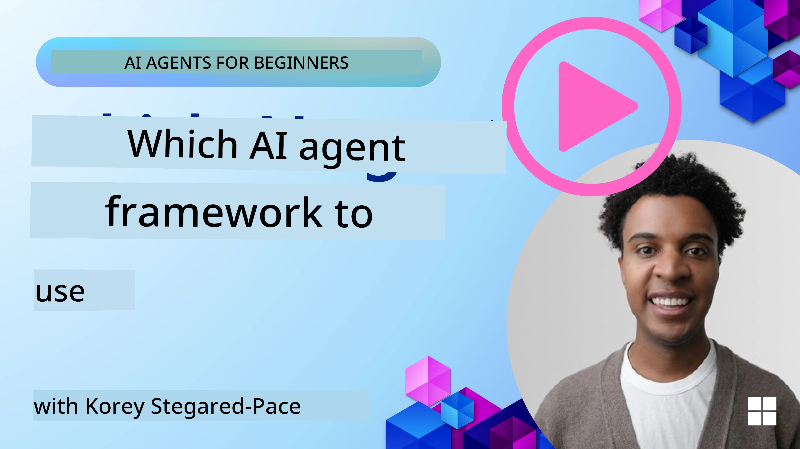

[](https://youtu.be/ODwF-EZo_O8?si=1xoy_B9RNQfrYdF7)

> _(Klik da piksha wey dey up deh to watch video of dis lesson)_

# Explore AI Agent Frameworks

AI agent frameworks na software platforms wey dem design to make e easy to create, deploy, and manage AI agents. Dem frameworks dey give developers pre-built parts, abstractions, and tools wey dey make develop complex AI systems smooth.

Dem frameworks dey help developers focus on wetin their apps need specially by providing standard methods to solve common wahala for AI agent development. Dem dey boost scalability, accessibility, and efficiency for building AI systems.

## Introduction 

Dis lesson go cover:

- Wetin be AI Agent Frameworks and wetin dem fit make developers achieve?
- How teams fit use dem quickly prototype, iterate, and improve their agent power?
- Wetin be difference between frameworks and tools wey Microsoft make (<a href="https://aka.ms/ai-agents-beginners/ai-agent-service" target="_blank">Microsoft Foundry Agent Service</a> and <a href="https://learn.microsoft.com/azure/ai-services/openai/how-to/responses" target="_blank">Microsoft Agent Framework</a>)?
- I fit connect my current Azure tools direct or I need separate solutions?
- Wetin be Microsoft Foundry Agent Service and how e dey help me?

## Learning goals

Main goal for dis lesson na to help you sabi:

- The role of AI Agent Frameworks for AI development.
- How to use AI Agent Frameworks to build smart agents.
- Main capabilities wey AI Agent Frameworks fit provide.
- Wetin separate Microsoft Agent Framework and Microsoft Foundry Agent Service.

## Wetin be AI Agent Frameworks and wetin dem dey make developers fit do?

Normal AI Frameworks fit help you add AI inside your apps and make your apps beta for dis ways:

- **Personalization**: AI fit check how user dey behave and their likes to give personalized recommendations, content, and experiences.
Example: Streaming services like Netflix dey use AI recommend movies and shows based on wetin dem don watch before, e dey make user enjoy am well well.
- **Automation and Efficiency**: AI fit do repetitive work sef, arrange workflow properly, and improve how work dey done.
Example: Customer service apps dey use AI chatbots to handle normal questions, e reduce wait time and free human agents for big big wahala.
- **Better User Experience**: AI fit make user experience better by giving smart features like voice recognition, natural language processing, and predicting text wey user go write.
Example: Virtual assistants like Siri and Google Assistant dey use AI to sabi and respond to voice commands, e make am easy to talk to their device.

### E sweet no be? but why we need AI Agent Framework?

AI Agent frameworks no be just AI frameworks alone. Dem dem design to help create smart agents wey fit interact with users, other agents, and environment to reach specific goals. Dem agents fit act on their own, make decisions, and adjust as things change. Make we check some main capabilities wey AI Agent Frameworks give:

- **Agent Collaboration and Coordination**: Make e possible to create many AI agents wey fit work together, yan, and arrange to solve complex tasks.
- **Task Automation and Management**: Give ways to automatically run multi-step workflows, pass tasks, and manage task for agents well well.
- **Contextual Understanding and Adaptation**: Give agents power to sabi context, adapt to environment wey dey change, and make decisions based on info wey dey happen.

So to talk am short, agents dey make you do beta things, carry automation enter next level, and create smart systems wey fit adapt and learn from environment.

## How to quickly prototype, iterate, and improve agent power?

Dis field dey move quickly, but some things common for most AI Agent Frameworks wey fit help you quickly prototype and iterate be like modular components, collaborative tools, and real-time learning. Make we look dem:

- **Use Modular Components**: AI SDKs get pre-built parts like AI and Memory connectors, function calling with natural language or code plugins, prompt templates, and others.
- **Leverage Collaborative Tools**: Design agents with clear roles and tasks, make dem fit test and improve how dem dey work together.
- **Learn in Real-Time**: Set feedback loops wey make agents learn from interaction and change their behavior quickly.

### Use Modular Components

SDKs like Microsoft Agent Framework get pre-built parts like AI connectors, tool definitions, and agent management.

**How teams fit use dem**: Teams fit quickly put these parts together to make prototype wey work without to start from zero, e dey allow quick testing and improvement.

**How e dey work for real life**: You fit use pre-built parser take take gather info from user input, memory module to save and get data, and prompt generator to yan with users, all without building the parts yourself.

**Example code**. Make we look example how you fit use Microsoft Agent Framework with `FoundryChatClient` to make model respond to user input with tool call:

``` python
# Microsoft Agent Framework Python Example

import asyncio
import os

from agent_framework import tool
from agent_framework.foundry import FoundryChatClient
from azure.identity import AzureCliCredential


# Define one example tool function wey go book travel
@tool(approval_mode="never_require")
def book_flight(date: str, location: str) -> str:
    """Book travel given location and date."""
    return f"Travel was booked to {location} on {date}"


async def main():
    provider = FoundryChatClient(
        project_endpoint=os.environ["AZURE_AI_PROJECT_ENDPOINT"],
        model=os.environ["AZURE_AI_MODEL_DEPLOYMENT_NAME"],
        credential=AzureCliCredential(),
    )
    agent = provider.as_agent(
        name="travel_agent",
        instructions="Help the user book travel. Use the book_flight tool when ready.",
        tools=[book_flight],
    )

    response = await agent.run("I'd like to go to New York on January 1, 2025")
    print(response)
    # Example output: Your flight go New York on top January 1, 2025, don successfully book. Safe journey! ✈️🗽


if __name__ == "__main__":
    asyncio.run(main())
```

Wetin you fit see for dis example na how you fit use pre-built parser to get key info from user input like origin, destination, and date for flight booking request. Dis modular method dey let you focus on big-big logic.

### Leverage Collaborative Tools

Frameworks like Microsoft Agent Framework help create many agents wey fit work together.

**How teams fit use dem**: Teams fit design agents wey get specific roles and tasks, so dem fit test and improve how dem dey work together and make system beta.

**How e dey work for real life**: You fit create team of agents wey each get their work like data collection, analysis, or decision-making. Dem agents fit yan and share info to reach one goal, like answer user question or finish task.

**Example code (Microsoft Agent Framework)**:

```python
# Dey create plenti agents wey go work together wit Microsoft Agent Framework

import os
from agent_framework.foundry import FoundryChatClient
from azure.identity import AzureCliCredential

provider = FoundryChatClient(
    project_endpoint=os.environ["AZURE_AI_PROJECT_ENDPOINT"],
    model=os.environ["AZURE_AI_MODEL_DEPLOYMENT_NAME"],
    credential=AzureCliCredential(),
)

# Agent wey dey find data
agent_retrieve = provider.as_agent(
    name="dataretrieval",
    instructions="Retrieve relevant data using available tools.",
    tools=[retrieve_tool],
)

# Agent wey dey analyze data
agent_analyze = provider.as_agent(
    name="dataanalysis",
    instructions="Analyze the retrieved data and provide insights.",
    tools=[analyze_tool],
)

# Make agents run one by one for work yawa
retrieval_result = await agent_retrieve.run("Retrieve sales data for Q4")
analysis_result = await agent_analyze.run(f"Analyze this data: {retrieval_result}")
print(analysis_result)
```

Wetin you see for code before na how you fit create task wey go need many agents to work together analyze data. Each agent get im own work, and task dey run by arranging agents to reach wanted result. Creating special agents with clear roles fit improve task speed and performance.

### Learn in Real-Time

Advanced frameworks get level for real-time context understanding and adaptation.

**How teams fit use dem**: Teams fit set feedback loops where agents dey learn from interaction and change how dem behave quickly, wey go bring constant improvement and better ability.

**How e dey work for real life**: Agents fit check user feedback, environment data, and task result to update their knowledge base, change how dem dey decide, and improve over time. Dis type learning help agents adapt to change and user preference, make overall system better.

## Wetin dey different between Microsoft Agent Framework and Microsoft Foundry Agent Service?

Plenty ways dey compare the two, but make we check key difference for design, capabilities and for who dem dey make am:

## Microsoft Agent Framework (MAF)

Microsoft Agent Framework na simple SDK to build AI agents with `FoundryChatClient`. E make developers fit create agents wey use Azure OpenAI models with built-in tool call, conversation management, and strong security via Azure identity.

**Use Cases**: Build AI agents ready for production with tool use, multi-step workflows, and enterprise integration.

Here some important ideas about Microsoft Agent Framework:

- **Agents**. You create agent via `FoundryChatClient` with name, instructions, and tools. Agent fit:
  - **Process user messages** and respond with Azure OpenAI models.
  - **Call tools** automatically depending on conversation.
  - **Keep conversation state** across messages.

  Here code snippet to create agent:

    ```python
    import os
    from agent_framework.foundry import FoundryChatClient
    from azure.identity import AzureCliCredential

    provider = FoundryChatClient(
        project_endpoint=os.environ["AZURE_AI_PROJECT_ENDPOINT"],
        model=os.environ["AZURE_AI_MODEL_DEPLOYMENT_NAME"],
        credential=AzureCliCredential(),
    )
    agent = provider.as_agent(
        name="my_agent",
        instructions="You are a helpful assistant.",
    )

    response = await agent.run("Hello, World!")
    print(response)
    ```

- **Tools**. Framework let you define tools as Python functions agent fit call by itself. Tools registering happen when you create agent:

    ```python
    def get_weather(location: str) -> str:
        """Get the current weather for a location."""
        return f"The weather in {location} is sunny, 72\u00b0F."

    agent = provider.as_agent(
        name="weather_agent",
        instructions="Help users check the weather.",
        tools=[get_weather],
    )
    ```

- **Multi-Agent Coordination**. You fit create many agents with different special powers and arrange how dem go work together:

    ```python
    planner = provider.as_agent(
        name="planner",
        instructions="Break down complex tasks into steps.",
    )

    executor = provider.as_agent(
        name="executor",
        instructions="Execute the planned steps using available tools.",
        tools=[execute_tool],
    )

    plan = await planner.run("Plan a trip to Paris")
    result = await executor.run(f"Execute this plan: {plan}")
    ```

- **Azure Identity Integration**. Framework uses `AzureCliCredential` (or `DefaultAzureCredential`) for secure keyless login, so you no need manage API keys.

## Microsoft Foundry Agent Service

Microsoft Foundry Agent Service na newer thing wey dem show for Microsoft Ignite 2024. E dey allow development and deployment of AI agents with flexible models, like open-source LLMs direct call such as Llama 3, Mistral, and Cohere.

Microsoft Foundry Agent Service get strong enterprise security and data storage method, e beta for enterprise app.

E fit cross work with Microsoft Agent Framework to build and deploy agents.

Dis service dey Public Preview now, and e support Python and C# for building agents.

Use Microsoft Foundry Agent Service Python SDK, we fit build agent with user-defined tool:

```python
import asyncio
from azure.identity import DefaultAzureCredential
from azure.ai.projects import AIProjectClient

# Define tool function dem
def get_specials() -> str:
    """Provides a list of specials from the menu."""
    return """
    Special Soup: Clam Chowder
    Special Salad: Cobb Salad
    Special Drink: Chai Tea
    """

def get_item_price(menu_item: str) -> str:
    """Provides the price of the requested menu item."""
    return "$9.99"


async def main() -> None:
    credential = DefaultAzureCredential()
    project_client = AIProjectClient.from_connection_string(
        credential=credential,
        conn_str="your-connection-string",
    )

    agent = project_client.agents.create_agent(
        model="gpt-4o-mini",
        name="Host",
        instructions="Answer questions about the menu.",
        tools=[get_specials, get_item_price],
    )

    thread = project_client.agents.create_thread()

    user_inputs = [
        "Hello",
        "What is the special soup?",
        "How much does that cost?",
        "Thank you",
    ]

    for user_input in user_inputs:
        print(f"# User: '{user_input}'")
        message = project_client.agents.create_message(
            thread_id=thread.id,
            role="user",
            content=user_input,
        )
        run = project_client.agents.create_and_process_run(
            thread_id=thread.id, agent_id=agent.id
        )
        messages = project_client.agents.list_messages(thread_id=thread.id)
        print(f"# Agent: {messages.data[0].content[0].text.value}")


if __name__ == "__main__":
    asyncio.run(main())
```

### Core concepts

Microsoft Foundry Agent Service get these important ideas:

- **Agent**. Microsoft Foundry Agent Service connect with Microsoft Foundry. For Foundry, AI Agent act like "smart" microservice wey fit answer questions (RAG), do actions, or automate workflow fully. E join generative AI model power with tools to access and interact with real data sources. Example agent:

    ```python
    agent = project_client.agents.create_agent(
        model="gpt-4o-mini",
        name="my-agent",
        instructions="You are helpful agent",
        tools=code_interpreter.definitions,
        tool_resources=code_interpreter.resources,
    )
    ```

    For this example, agent created with model `gpt-4o-mini`, name `my-agent`, instructions `You are helpful agent`. Agent get tools and resources for code interpretation tasks.

- **Thread and messages**. Thread na important idea. E mean conversation or interaction between agent and user. Threads fit track conversation progress, store context, and manage state. Example thread:

    ```python
    thread = project_client.agents.create_thread()
    message = project_client.agents.create_message(
        thread_id=thread.id,
        role="user",
        content="Could you please create a bar chart for the operating profit using the following data and provide the file to me? Company A: $1.2 million, Company B: $2.5 million, Company C: $3.0 million, Company D: $1.8 million",
    )
    
    # Beg the agent make e do work for the thread
    run = project_client.agents.create_and_process_run(thread_id=thread.id, agent_id=agent.id)
    
    # Carry come gather and log all messages make we fit see how the agent go reply
    messages = project_client.agents.list_messages(thread_id=thread.id)
    print(f"Messages: {messages}")
    ```

    For the code before, thread create. Then message send to thread. By calling `create_and_process_run`, agent dey asked to work on thread. Messages come get logged to see agent answer. Messages fit get different kind like text, image, or file, na wetin agent create like image or text response. As developer, you fit use info process answer or show am to user.

- **Works with Microsoft Agent Framework**. Microsoft Foundry Agent Service dey work well with Microsoft Agent Framework, so you fit build agents with `FoundryChatClient` and deploy through Agent Service for production.

**Use Cases**: Microsoft Foundry Agent Service designed for enterprise app wey need secure, scalable, flexible AI agent deployment.

## Wetin dey different between these two?
 
E be like say dem get things wey dem dey do the same, but some main difference dey for design, capabilities, and use cases:
 
- **Microsoft Agent Framework (MAF)**: Na production-ready SDK to build AI agents. E get simple API to create agents with tool calling, conversation management, and Azure identity.
- **Microsoft Foundry Agent Service**: Na platform and deployment service for agents for Microsoft Foundry. E get built-in connection to Azure OpenAI, Azure AI Search, Bing Search and code execution.
 
Still dey confuse which one to pick?

### Use Cases
 
Make we help you with common use cases:
 
> Q: I dey build production AI agent apps and I want start fast
>

>A: Microsoft Agent Framework go beta for you. E get simple Python API via `FoundryChatClient` to define agents with tools and instructions in just few lines code.

>Q: I need enterprise-grade deployment with Azure integrations like Search and code execution
>
> A: Microsoft Foundry Agent Service na best. E be platform service wey get many models, Azure AI Search, Bing Search and Azure Functions. E make am easy to build your agents for Foundry Portal and deploy am for scale.
 
> Q: I still dey confuse, abeg only one option
>
> A: Start with Microsoft Agent Framework to build agents, then use Microsoft Foundry Agent Service when you ready to deploy and scale for production. Dis way, you fit quickly change your agent logic and still get clear road to enterprise deployment.
 
Make we summarize key difference for table:

| Framework | Focus | Core Concepts | Use Cases |
| --- | --- | --- | --- |
| Microsoft Agent Framework | Simple SDK with tool calling | Agents, Tools, Azure Identity | Build AI agents, tool use, multi-step workflows |
| Microsoft Foundry Agent Service | Flexible models, enterprise security, Code generation, Tool calling | Modularity, Collaboration, Process Orchestration | Secure, scalable, flexible AI agent deployment |

## I fit connect my current Azure ecosystem tools direct or I need standalone solutions?


Di answer na yes, you fit join ya existing Azure ecosystem tools directly wit Microsoft Foundry Agent Service especially, as e don build to work gidigba wit oda Azure services dem. You fit for example join Bing, Azure AI Search, and Azure Functions. E still get deep connection wit Microsoft Foundry.

Di Microsoft Agent Framework still dey join wit Azure services through `FoundryChatClient` and Azure identity, wey go allow you call Azure services directly from ya agent tools.

## Sample Codes

- Python: [Agent Framework (Microsoft Foundry)](./code_samples/02-python-agent-framework.ipynb)
- Python: [Agent Framework (Azure OpenAI Responses API)](./code_samples/02-python-agent-framework-azure-openai.ipynb)
- .NET: [Agent Framework](./code_samples/02-dotnet-agent-framework.md)

## You Get More Questions about AI Agent Frameworks?

Join [Microsoft Foundry Discord](https://discord.com/invite/ATgtXmAS5D) to meet other learners, join office hours and get your AI Agents questions answer.

## References

- <a href="https://techcommunity.microsoft.com/blog/azure-ai-services-blog/introducing-azure-ai-agent-service/4298357" target="_blank">Azure Agent Service</a>
- <a href="https://learn.microsoft.com/azure/ai-services/openai/how-to/responses" target="_blank">Microsoft Agent Framework - Azure OpenAI Responses</a>
- <a href="https://learn.microsoft.com/azure/ai-services/agents/overview" target="_blank">Microsoft Foundry Agent Service</a>

## Previous Lesson

[Introduction to AI Agents and Agent Use Cases](../01-intro-to-ai-agents/README.md)

## Next Lesson

[Understanding Agentic Design Patterns](../03-agentic-design-patterns/README.md)

---

<!-- CO-OP TRANSLATOR DISCLAIMER START -->
**Disclaimer**:
Dis document don translate wit AI translation service [Co-op Translator](https://github.com/Azure/co-op-translator). Even tho we dey try make am correct, abeg make you know say automated translation fit get errors or mistakes. Di original document for dia own language na im be di correct source. For important info, make person wey sabi human translation do am. We no go responsible for any misunderstanding or wrong understanding wey fit happen because of dis translation.
<!-- CO-OP TRANSLATOR DISCLAIMER END -->