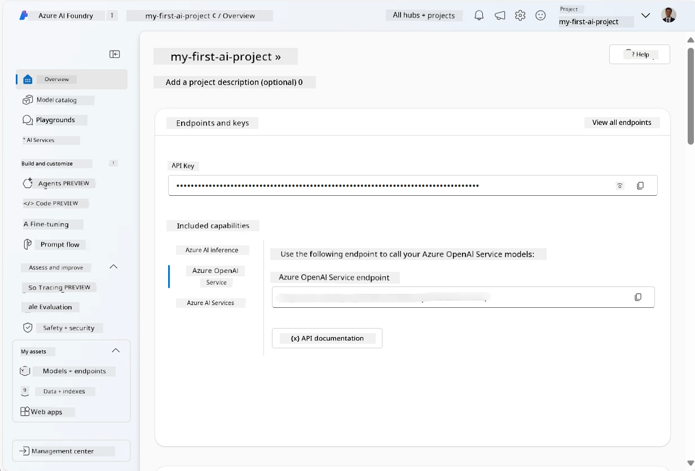
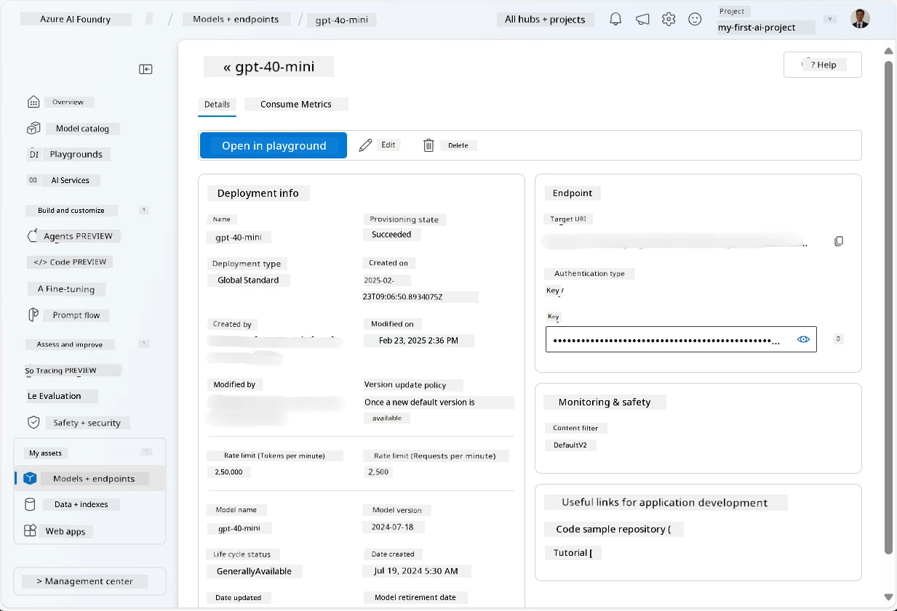
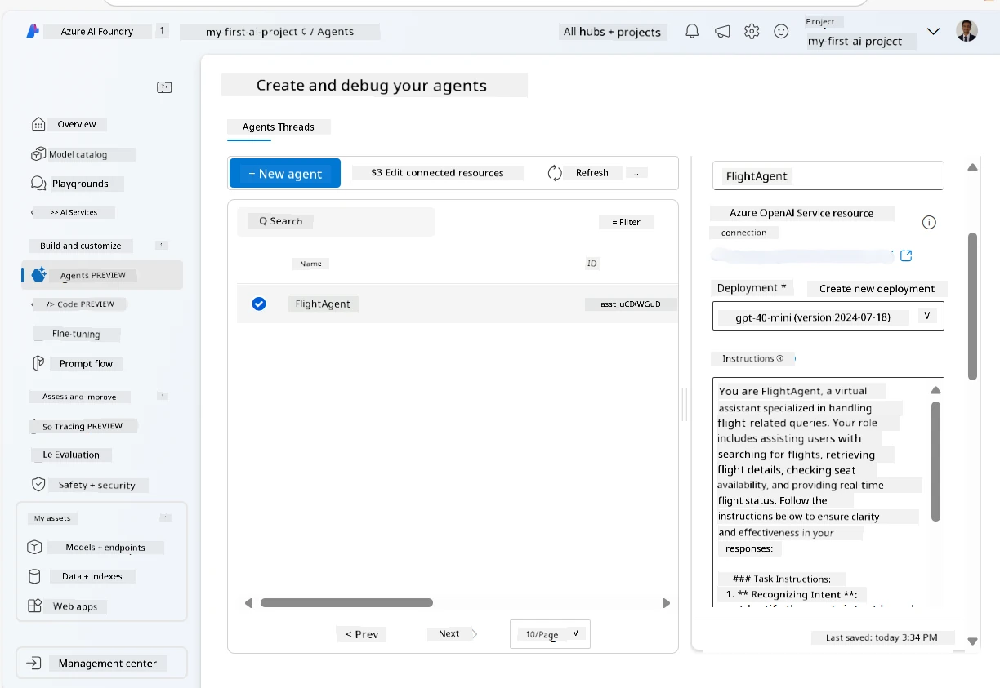
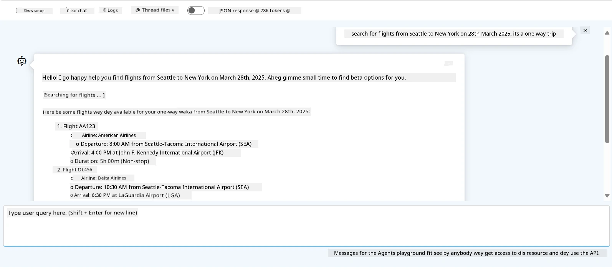

# Microsoft Foundry Agent Service Development

For dis exercise, you go use Microsoft Foundry Agent Service tools for [Microsoft Foundry portal](https://ai.azure.com/?WT.mc_id=academic-105485-koreyst) to create one agent for Flight Booking. Di agent go fit interact wit users and give information about flights.

## Prerequisites

To finish dis exercise, you need dis tin dem:
1. Azure account wey get active subscription. [Create account for free](https://azure.microsoft.com/free/?WT.mc_id=academic-105485-koreyst).
2. You need permission to create Microsoft Foundry hub or make person create am for you.
    - If your role na Contributor or Owner, you fit follow dis tutorial steps.

## Create Microsoft Foundry hub

> **Note:** Microsoft Foundry na before Azure AI Studio name.

1. Follow dis guideline from [Microsoft Foundry](https://learn.microsoft.com/en-us/azure/ai-studio/?WT.mc_id=academic-105485-koreyst) blog post to create Microsoft Foundry hub.
2. When your project don create, close any tips wey show and look di project page for Microsoft Foundry portal, e go look like dis image:

    

## Deploy model

1. For di pane left side for your project, for **My assets** section, select **Models + endpoints** page.
2. For **Models + endpoints** page, inside **Model deployments** tab, for **+ Deploy model** menu, select **Deploy base model**.
3. Search for `gpt-4o-mini` model for di list, then select am confirm.

    > **Note**: Reduce TPM help avoid make you use too much quota for di subscription wey you dey use.

    

## Create agent

Now wey you don deploy model, you fit create agent. Agent na conversational AI model wey fit interact wit users.

1. For di left pane for your project, inside **Build & Customize** section, select **Agents** page.
2. Click **+ Create agent** to create new agent. For **Agent Setup** dialog box:
    - Put name for di agent, for example `FlightAgent`.
    - Make sure say `gpt-4o-mini` model deployment wey you create before don select.
    - Set **Instructions** as per di prompt wey you want make di agent follow. Example dey below:
    ```
    You are FlightAgent, a virtual assistant specialized in handling flight-related queries. Your role includes assisting users with searching for flights, retrieving flight details, checking seat availability, and providing real-time flight status. Follow the instructions below to ensure clarity and effectiveness in your responses:

    ### Task Instructions:
    1. **Recognizing Intent**:
       - Identify the user's intent based on their request, focusing on one of the following categories:
         - Searching for flights
         - Retrieving flight details using a flight ID
         - Checking seat availability for a specified flight
         - Providing real-time flight status using a flight number
       - If the intent is unclear, politely ask users to clarify or provide more details.
        
    2. **Processing Requests**:
        - Depending on the identified intent, perform the required task:
        - For flight searches: Request details such as origin, destination, departure date, and optionally return date.
        - For flight details: Request a valid flight ID.
        - For seat availability: Request the flight ID and date and validate inputs.
        - For flight status: Request a valid flight number.
        - Perform validations on provided data (e.g., formats of dates, flight numbers, or IDs). If the information is incomplete or invalid, return a friendly request for clarification.

    3. **Generating Responses**:
    - Use a tone that is friendly, concise, and supportive.
    - Provide clear and actionable suggestions based on the output of each task.
    - If no data is found or an error occurs, explain it to the user gently and offer alternative actions (e.g., refine search, try another query).
    
    ```
> [!NOTE]
> To get detailed prompt, you fit check [dis repository](https://github.com/ShivamGoyal03/RoamMind) for more info.
    
> Also, you fit add **Knowledge Base** and **Actions** to make di agent sabi better, provide more info and run automated tasks as per user requests. For dis exercise, you fit skip dis steps.
    


3. To create new multi-AI agent, just click **New Agent**. New agent wey create go show for Agents page.


## Test agent

After you create di agent, you fit test am to see how e go respond to user questions for Microsoft Foundry portal playground.

1. For top of **Setup** pane for your agent, select **Try in playground**.
2. For **Playground** pane, you fit interact wit agent by typing your questions for chat window. For example, you fit ask agent to search flights from Seattle to New York for 28th.

    > **Note**: Di agent fit no give correct answer, because no real-time data dey use for dis exercise. Di purpose na test how agent fit understand and respond to user questions based on instructions wey dem give.

    

3. After you test di agent, you fit still customize am more by adding extra intents, training data, and actions to make am beta.

## Clean up resources

When you don finish test di agent, you fit delete am to avoid extra cost.
1. Open [Azure portal](https://portal.azure.com) and check inside resource group wey you deploy hub resources for dis exercise.
2. For toolbar, select **Delete resource group**.
3. Put resource group name and confirm say you wan delete am.

## Resources

- [Microsoft Foundry documentation](https://learn.microsoft.com/en-us/azure/ai-studio/?WT.mc_id=academic-105485-koreyst)
- [Microsoft Foundry portal](https://ai.azure.com/?WT.mc_id=academic-105485-koreyst)
- [Getting Started with Microsoft Foundry](https://techcommunity.microsoft.com/blog/educatordeveloperblog/getting-started-with-azure-ai-studio/4095602?WT.mc_id=academic-105485-koreyst)
- [Fundamentals of AI agents on Azure](https://learn.microsoft.com/en-us/training/modules/ai-agent-fundamentals/?WT.mc_id=academic-105485-koreyst)
- [Azure AI Discord](https://aka.ms/AzureAI/Discord)

---

<!-- CO-OP TRANSLATOR DISCLAIMER START -->
**Disclaimer**:
Dis document don translate wit AI translation service [Co-op Translator](https://github.com/Azure/co-op-translator). Even tho we dey try make am correct, abeg make you know say automated translation fit get errors or mistakes. Di original document for dia own language na im be di correct source. For important info, make person wey sabi human translation do am. We no go responsible for any misunderstanding or wrong understanding wey fit happen because of dis translation.
<!-- CO-OP TRANSLATOR DISCLAIMER END -->