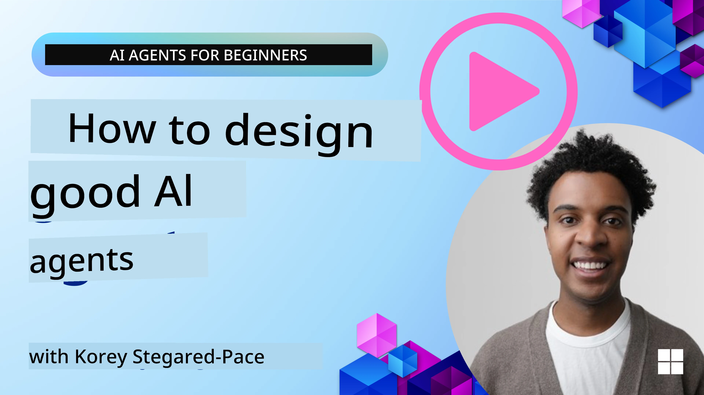
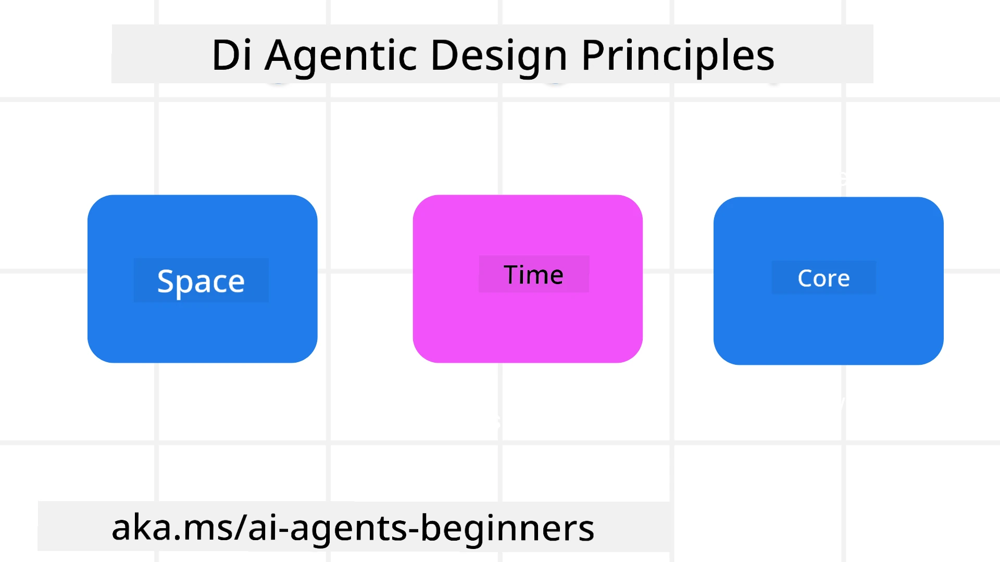

> _(Click di image wey dey top to watch video of dis lesson)_
# AI Agentic Design Principles

## Introduction

Plenti ways dey to think about how person fit build AI Agentic Systems. Because say ambiguity na feature and no be wahala for Generative AI design, sometimes e dey hard for engineers to know where to start. We don create set of human-centered UX Design Principles to help developers build customer-centered agentic systems wey go solve their business needs. Dis design principles no be strict architecture but na wetin team fit start with as dem dey define and build agent experiences.

Generally, agents suppose:

- Expand and scale human abilities (brainstorming, problem-solving, automation, etc.)
- Fill knowledge gaps (make me sabi better things for knowledge domains, translation, etc.)
- Help support collaboration in di ways we as person like to work with others
- Make us better versions of ourself (like life coach/task master, help us learn how to manage emotions and mindfulness skill, build resilience, etc.)

## Dis Lesson Go Cover

- Wetin be Agentic Design Principles
- Some guidelines to follow when you dey implement these design principles
- Some examples of how to use the design principles

## Learning Goals

After you finish dis lesson, you go fit:

1. Explain wetin Agentic Design Principles mean
2. Explain the guidelines for using Agentic Design Principles
3. Understand how to build agent with Agentic Design Principles

## The Agentic Design Principles

### Agent (Space)

Na di environment wey di agent dey operate for. These principles go show us how to design agents wey fit engage for physical and digital worlds.

- **Connecting, no collapsing** – help connect people to other people, events, and knowledge wey fit make collaboration and connection possible.
- Agents dey help connect events, knowledge, and people.
- Agents dey bring people close. Dem no suppose replace or make people shame.
- **Easily accessible but sometimes invisible** – agent go dey mostly work for background and only go remind us when e matter and e proper.
  - Agent dey easy to find and access for authorized users on any device or platform.
  - Agent dey support different input and output ways (sound, voice, text, etc.).
  - Agent fit easily waka between front and back; between proactive and reactive, based on how e sense wetin user need.
  - Agent fit work invisible but im background process and how e dey collaborate with other Agents dey clear and user fit control am.

### Agent (Time)

Na how agent dey operate with time. These principles dey guide how we design agents wey fit interact with past, present, and future.

- **Past**: Reflect on history wey get state and context.
  - Agent go show better result based on analysis of richer past data beyond just event, people, or states.
  - Agent fit connect past events and actively reflect on memory to engage current situations.
- **Now**: More than just notify, e dey push gently.
  - Agent get full plan to interact with people. When event happen, Agent no go just send notification or other normal form. Agent fit simplify flow or generate cues to catch user attention at right time.
  - Agent go give info based on environment, social and cultural changes wey relate to what user want.
  - Agent interaction fit dey gradual, e fit grow in complexity to empower users over time.
- **Future**: Adapt and change.
  - Agent fit adapt to different devices, platforms, and ways.
  - Agent adapt to user behavior, accessibility needs, and e dey customizable.
  - Agent dey shaped and e dey evolve through continuous user interaction.

### Agent (Core)

Na key elements wey dey at the center of agent design.

- **Accept say some things no too sure but make sure trust dey**.
  - Some level of Agent uncertainty dey expected. Uncertainty na important part of agent design.
  - Trust and transparency na foundation layers for Agent design.
  - Humans fit control when Agent dey on or off and agent status dey clear anytime.

## Guidelines to Follow to Implement These Principles

When you dey use these design principles, follow these guidelines:

1. **Transparency**: Tell user say AI dey involved, how e dey work (including past actions), and how dem fit give feedback and change system.
2. **Control**: Let user fit customize, specify preferences and personalize, and get control over system and im attributes (including ability to forget).
3. **Consistency**: Make sure experience dey steady across devices and endpoints. Use familiar UI/UX elements where e fit (like microphone icon for voice interaction) and reduce user brain wahala as much as possible (like concise responses, visuals, and ‘Learn More’ content).

## How To Design Travel Agent Using These Principles and Guidelines

Imagine you dey design Travel Agent, dis na how you fit reason to use Design Principles and Guidelines:

1. **Transparency** – Let user sabi say Travel Agent na AI-enabled Agent. Give basic instructions on how to start (like "Hello" message, sample prompts). Make sure e dey clear on product page. Show list of prompts wey user don ask before. Make am clear how to give feedback (thumbs up or down, Send Feedback button, etc.). Clearly yarn if Agent get usage or topic restrictions.
2. **Control** – Make e clear how user fit change Agent after e don create with things like System Prompt. Let user choose how wordy Agent go be, writing style, and anything wey Agent no suppose talk. Allow user see and delete any files or data, prompts, past conversations.
3. **Consistency** – Make sure icons for Share Prompt, add file or photo and tag person or thing dey normal and easy to recognize. Use paperclip icon for file upload/share with Agent, and image icon for graphics upload.

## Sample Codes

- Python: [Agent Framework](./code_samples/03-python-agent-framework.ipynb)
- .NET: [Agent Framework](./code_samples/03-dotnet-agent-framework.md)

## You get More Questions about AI Agentic Design Patterns?

Join di [Microsoft Foundry Discord](https://discord.com/invite/ATgtXmAS5D) to meet other learners, attend office hours and get your AI Agents questions answer.

## Extra Resources

- <a href="https://openai.com" target="_blank">Practices for Governing Agentic AI Systems | OpenAI</a>
- <a href="https://microsoft.com" target="_blank">The HAX Toolkit Project - Microsoft Research</a>
- <a href="https://responsibleaitoolbox.ai" target="_blank">Responsible AI Toolbox</a>

## Previous Lesson

[Exploring Agentic Frameworks](../02-explore-agentic-frameworks/README.md)

## Next Lesson

[Tool Use Design Pattern](../04-tool-use/README.md)

---

<!-- CO-OP TRANSLATOR DISCLAIMER START -->
**Disclaimer**:
Dis document don translate wit AI translation service [Co-op Translator](https://github.com/Azure/co-op-translator). Even tho we dey try make am correct, abeg make you know say automated translation fit get errors or mistakes. Di original document for dia own language na im be di correct source. For important info, make person wey sabi human translation do am. We no go responsible for any misunderstanding or wrong understanding wey fit happen because of dis translation.
<!-- CO-OP TRANSLATOR DISCLAIMER END -->