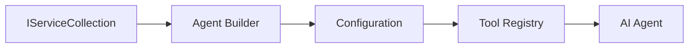

# 🎨 Agentic Design Patterns wit Azure OpenAI (Responses API) (.NET)

## 📋 Wetin You Go Learn

Dis example dey show how enterprise-grade design patterns dey build intelligent agents usin Microsoft Agent Framework for .NET wit Azure OpenAI (Responses API) join. You go sabi professional patterns and architecture way dey make agents ready for production, easy to maintain, and fit scale well.

### Enterprise Design Patterns

- 🏭 **Factory Pattern**: Standard way to create agent wit dependency injection
- 🔧 **Builder Pattern**: Fluent way to configure and set up agent
- 🧵 **Thread-Safe Patterns**: Manage concurrent conversation well
- 📋 **Repository Pattern**: Organize tool and capability management

## 🎯 .NET-Specific Architectural Benefits

### Enterprise Features

- **Strong Typing**: Validate during compile time and get IntelliSense support
- **Dependency Injection**: Built-in DI container integration
- **Configuration Management**: Use IConfiguration and Options patterns
- **Async/Await**: Proper asynchronous programming support

### Production-Ready Patterns

- **Logging Integration**: ILogger and structured logging support
- **Health Checks**: Built-in monitoring and diagnostics
- **Configuration Validation**: Strong typing with data annotations
- **Error Handling**: Manage exceptions proper

## 🔧 Technical Architecture

### Core .NET Components

- **Microsoft.Extensions.AI**: Unified AI service abstractions
- **Microsoft.Agents.AI**: Enterprise agent orchestration framework
- **Azure OpenAI (Responses API)**: High-performance API client patterns
- **Configuration System**: appsettings.json and environment integration

### Design Pattern Implementation



## 🏗️ Enterprise Patterns Wey Dem Show

### 1. **Creational Patterns**

- **Agent Factory**: Centralize how agent dem dey create wit consistent configuration
- **Builder Pattern**: Fluent API for complex agent configuration
- **Singleton Pattern**: Share resources and manage configuration
- **Dependency Injection**: Make coupling loose and easy to test

### 2. **Behavioral Patterns**

- **Strategy Pattern**: Different strategy to run tool dem
- **Command Pattern**: Encapsulate agent operations wit undo/redo
- **Observer Pattern**: Manage agent lifecycle based on events
- **Template Method**: Standard way to run agent workflow

### 3. **Structural Patterns**

- **Adapter Pattern**: Azure OpenAI (Responses API) integration layer
- **Decorator Pattern**: Make agent capability better
- **Facade Pattern**: Simplify how agent interface dey interact
- **Proxy Pattern**: Lazy loading and caching for better performance

## 📚 .NET Design Principles

### SOLID Principles

- **Single Responsibility**: Every component get one clear work
- **Open/Closed**: Fit extend without changing the original one
- **Liskov Substitution**: Use interface based tool implementations
- **Interface Segregation**: Interfaces weh dey focused and cohesive
- **Dependency Inversion**: Depend on abstractions, no on concretes

### Clean Architecture

- **Domain Layer**: Core agent and tool abstractions
- **Application Layer**: Agent orchestration and workflow
- **Infrastructure Layer**: Azure OpenAI (Responses API) integration and other external services
- **Presentation Layer**: User interaction and how response dem dey show

## 🔒 Enterprise Things to Consider

### Security

- **Credential Management**: Securely handle API key wit IConfiguration
- **Input Validation**: Use strong typing and check data annotation
- **Output Sanitization**: Secure how you process and filter responses
- **Audit Logging**: Cover all operations for tracking

### Performance

- **Async Patterns**: Non-blocking I/O operations
- **Connection Pooling**: Manage HTTP client well
- **Caching**: Cache responses to boost performance
- **Resource Management**: Proper disposal and cleanup ways

### Scalability

- **Thread Safety**: Support concurrent agent execution
- **Resource Pooling**: Use resources efficiently
- **Load Management**: Limit rate and handle backpressure
- **Monitoring**: Performance metrics and health checks

## 🚀 How To Deploy Production

- **Configuration Management**: Environment-specific settings
- **Logging Strategy**: Structured logging wit correlation IDs
- **Error Handling**: Global exception handling with proper recovery
- **Monitoring**: Application insights and performance counters
- **Testing**: Unit tests, integration tests, and load testing patterns

Ready to build enterprise-grade intelligent agents wit .NET? Make we build something wey strong! 🏢✨

## 🚀 How To Start

### Wetin You Need First

- [.NET 10 SDK](https://dotnet.microsoft.com/download/dotnet/10.0) or higher
- Azure subscription with Azure OpenAI resource plus model deployment
- Azure CLI — sign in wit `az login`

### Environment Variables Wey You Need

```bash
# zsh/bash
export AZURE_OPENAI_ENDPOINT=https://<your-resource>.openai.azure.com
export AZURE_OPENAI_DEPLOYMENT=gpt-4o-mini
# Den sign in so AzureCliCredential go fit get token
az login
```

```powershell
# PowerShell
$env:AZURE_OPENAI_ENDPOINT = "https://<your-resource>.openai.azure.com"
$env:AZURE_OPENAI_DEPLOYMENT = "gpt-4o-mini"
# Den sign in so AzureCliCredential fit gather token
az login
```

### Sample Code

To run the code example,

```bash
# zsh/bash
chmod +x ./03-dotnet-agent-framework.cs
./03-dotnet-agent-framework.cs
```

Or use the dotnet CLI:

```bash
dotnet run ./03-dotnet-agent-framework.cs
```

Check [`03-dotnet-agent-framework.cs`](../../../../03-agentic-design-patterns/code_samples/03-dotnet-agent-framework.cs) for the complete code.

```csharp
#!/usr/bin/dotnet run

#:package Microsoft.Extensions.AI@10.*
#:package Microsoft.Agents.AI.OpenAI@1.*-*
#:package Azure.AI.OpenAI@2.1.0
#:package Azure.Identity@1.13.1

using System.ComponentModel;

using Microsoft.Agents.AI;
using Microsoft.Extensions.AI;

using Azure.AI.OpenAI;
using Azure.Identity;

// Tool Function: Random Destination Generator
// This static method will be available to the agent as a callable tool
// The [Description] attribute helps the AI understand when to use this function
// This demonstrates how to create custom tools for AI agents
[Description("Provides a random vacation destination.")]
static string GetRandomDestination()
{
    // List of popular vacation destinations around the world
    // The agent will randomly select from these options
    var destinations = new List<string>
    {
        "Paris, France",
        "Tokyo, Japan",
        "New York City, USA",
        "Sydney, Australia",
        "Rome, Italy",
        "Barcelona, Spain",
        "Cape Town, South Africa",
        "Rio de Janeiro, Brazil",
        "Bangkok, Thailand",
        "Vancouver, Canada"
    };

    // Generate random index and return selected destination
    // Uses System.Random for simple random selection
    var random = new Random();
    int index = random.Next(destinations.Count);
    return destinations[index];
}

// Azure OpenAI with the Responses API (stable v1 endpoint). Sign in with `az login`.
var azureEndpoint = Environment.GetEnvironmentVariable("AZURE_OPENAI_ENDPOINT")
    ?? throw new InvalidOperationException("AZURE_OPENAI_ENDPOINT is not set.");
var deployment = Environment.GetEnvironmentVariable("AZURE_OPENAI_DEPLOYMENT") ?? "gpt-4o-mini";

var azureClient = new AzureOpenAIClient(new Uri(azureEndpoint), new AzureCliCredential());

// Define Agent Identity and Comprehensive Instructions
// Agent name for identification and logging purposes
var AGENT_NAME = "TravelAgent";

// Detailed instructions that define the agent's personality, capabilities, and behavior
// This system prompt shapes how the agent responds and interacts with users
var AGENT_INSTRUCTIONS = """
You are a helpful AI Agent that can help plan vacations for customers.

Important: When users specify a destination, always plan for that location. Only suggest random destinations when the user hasn't specified a preference.

When the conversation begins, introduce yourself with this message:
"Hello! I'm your TravelAgent assistant. I can help plan vacations and suggest interesting destinations for you. Here are some things you can ask me:
1. Plan a day trip to a specific location
2. Suggest a random vacation destination
3. Find destinations with specific features (beaches, mountains, historical sites, etc.)
4. Plan an alternative trip if you don't like my first suggestion

What kind of trip would you like me to help you plan today?"

Always prioritize user preferences. If they mention a specific destination like "Bali" or "Paris," focus your planning on that location rather than suggesting alternatives.
""";

// Create AI Agent with Advanced Travel Planning Capabilities
// Get the Responses client for the deployment and create the AI agent
// Configure agent with name, detailed instructions, and available tools
// This demonstrates the .NET agent creation pattern with full configuration
AIAgent agent = azureClient
    .GetOpenAIResponseClient(deployment)
    .CreateAIAgent(
        name: AGENT_NAME,
        instructions: AGENT_INSTRUCTIONS,
        tools: [AIFunctionFactory.Create(GetRandomDestination)]
    );

// Create New Conversation Thread for Context Management
// Initialize a new conversation thread to maintain context across multiple interactions
// Threads enable the agent to remember previous exchanges and maintain conversational state
// This is essential for multi-turn conversations and contextual understanding
AgentThread thread = agent.GetNewThread();

// Execute Agent: First Travel Planning Request
// Run the agent with an initial request that will likely trigger the random destination tool
// The agent will analyze the request, use the GetRandomDestination tool, and create an itinerary
// Using the thread parameter maintains conversation context for subsequent interactions
await foreach (var update in agent.RunStreamingAsync("Plan me a day trip", thread))
{
    await Task.Delay(10);
    Console.Write(update);
}

Console.WriteLine();

// Execute Agent: Follow-up Request with Context Awareness
// Demonstrate contextual conversation by referencing the previous response
// The agent remembers the previous destination suggestion and will provide an alternative
// This showcases the power of conversation threads and contextual understanding in .NET agents
await foreach (var update in agent.RunStreamingAsync("I don't like that destination. Plan me another vacation.", thread))
{
    await Task.Delay(10);
    Console.Write(update);
}
```

---

<!-- CO-OP TRANSLATOR DISCLAIMER START -->
**Disclaimer**:
Dis document don translate wit AI translation service [Co-op Translator](https://github.com/Azure/co-op-translator). Even tho we dey try make am correct, abeg make you know say automated translation fit get errors or mistakes. Di original document for dia own language na im be di correct source. For important info, make person wey sabi human translation do am. We no go responsible for any misunderstanding or wrong understanding wey fit happen because of dis translation.
<!-- CO-OP TRANSLATOR DISCLAIMER END -->