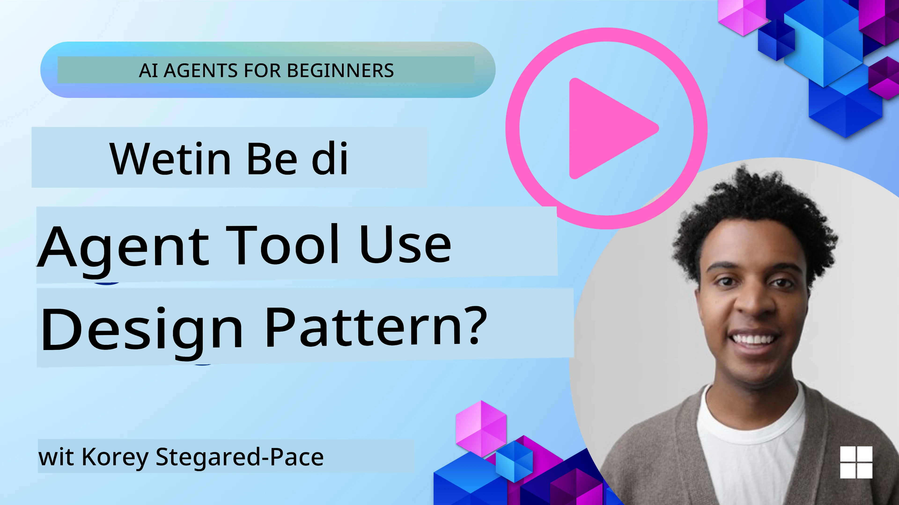
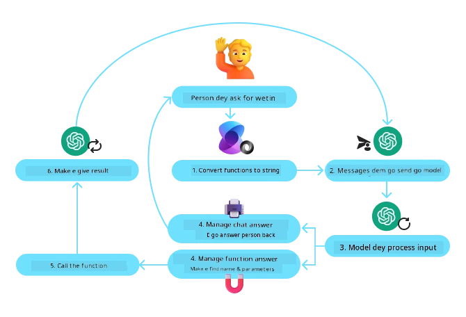
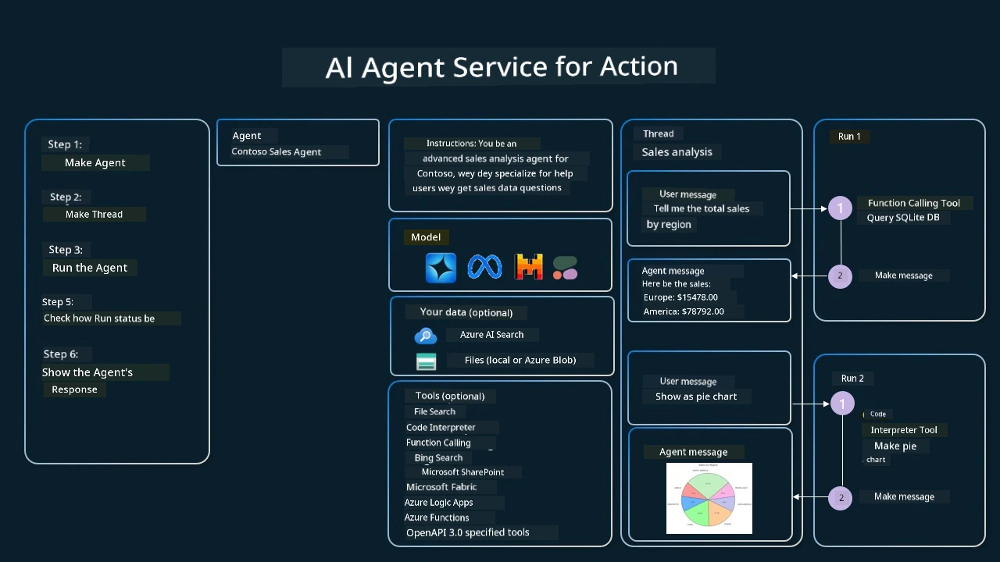

[](https://youtu.be/vieRiPRx-gI?si=cEZ8ApnT6Sus9rhn)

> _(Click di image wey dey up so make you fit watch video of dis lesson)_

# Tool Use Design Pattern

Tools nice because dem dey allow AI agents get bigger range of things dem fit do. Instead make di agent get small set of actions wey e fit perform, if you add tool, di agent fit now do plenty different actions. For dis chapter, we go check Tool Use Design Pattern, wey go show how AI agents fit use certain tools take achieve dia goals.

## Introduction

For dis lesson, we wan answer dis kind questions dem:

- Wetin be di tool use design pattern?
- Wetin be di things wey e fit take apply for?
- Wetin be di parts/building blocks wey you need to implement di design pattern?
- Wetin special things you must think about to use Tool Use Design Pattern take build AI agents wey man fit trust?

## Learning Goals

After you finish dis lesson, you go fit:

- Explain Wetin be Tool Use Design Pattern and wetin e dey do.
- Identify wetin kind use cases wey di Tool Use Design Pattern fit work for.
- Understand di main parts wey you need take implement di design pattern.
- Know wetin to think about to make sure AI agents wey use dis design pattern trustworthy.

## Wetin be di Tool Use Design Pattern?

Di **Tool Use Design Pattern** concentrate on how to give LLMs (Large Language Models) power to interact with tools outside dem make dem fit reach certain goals. Tools na code wey agent fit run to do actions. Tool fit be simple function like calculator, or API call to third-party service like check stock price or weather forecast. For AI agents matter, tools dem dey designed to be run by agents after **model-generated function calls**.

## Wetin be di use cases we fit apply am?

AI Agents fit use tools take finish complex work, find information, or make decision. Tool use design pattern dey used well well for situation wey need make agent interact well wit external systems, like databases, web services, or code interpreters. E fit good for many use cases like:

- **Dynamic Information Retrieval:** Agents fit ask external APIs or databases to bring fresh data (example, ask SQLite database for data analysis, check stock prices or weather info).
- **Code Execution and Interpretation:** Agents fit run code or scripts to solve math problem, make reports, or do simulations.
- **Workflow Automation:** Automate repetitive or many-step work by joining tools like task schedulers, email services, or data pipelines.
- **Customer Support:** Agents fit connect with CRM systems, ticketing platforms, or knowledge bases to help solve user questions.
- **Content Generation and Editing:** Agents fit use tools like grammar checkers, text summarizers, or content safety checkers to help di work of content creation.

## Wetin be di parts/building blocks wey we need take implement di tool use design pattern?

Dis building blocks dey allow di AI agent to do plenty kain tasks. Make we check di main parts wey we need for Tool Use Design Pattern implementation:

- **Function/Tool Schemas**: Detailed definitions of di tools wey dey available, including di function name, wetin e suppose do, parameters wey e need, and output wey e go give. Dis schemas dey help di LLM sabi the tools wey dey available and how to form correct requests.

- **Function Execution Logic**: Na dis one dey determine how and when to use tools based on wetin di user want and di convo context. E fit get planner modules, routing methods, or conditional flows wey go decide tool use dynamically.

- **Message Handling System**: Parts wey dey manage di chat flow between user input, LLM answer, tool calls, and tool outputs.

- **Tool Integration Framework**: Infrastructure wey join di agent to different tools, whether na simple functions or complex outside services.

- **Error Handling & Validation**: Systems wey fit manage tool failure, check parameters, and handle unexpected responses.

- **State Management**: Dey track di convo context, past tool use, and persistent data to make sure say things consistent for many-turn talks.

Next, make we check Function/Tool Calling more well-well.
 
### Function/Tool Calling

Function calling na di main way wey we dey allow Large Language Models (LLMs) take interact with tools. You go often see 'Function' and 'Tool' dey used like dem be same because 'functions' (blocks of reusable code) na di 'tools' wey agents dey use take do tasks. For function code to run, LLM must compare wetin user ask with di function description. To do dis, one schema wey contain all function descriptions go send to di LLM. Di LLM then go pick di correct function for di task and return e name and arguments. Di function selected go run, e response go come back to di LLM, wey go use am respond to wetin user ask.

For developers wey wan implement function calling for agents, you go need:

1. LLM model wey fit support function calling
2. Schema wey get di function descriptions
3. Code for every function wey dem describe

Make we use example to get current time for city make e clear:

1. **Initialize LLM wey fit function calling:**

    No all models fit function calling, so you go check say di LLM wey you dey use fit am.     <a href="https://learn.microsoft.com/azure/ai-services/openai/how-to/function-calling" target="_blank">Azure OpenAI</a> fit do function calling. We fit start by opening di Azure OpenAI client. 

    ```python
    # Make we start di Azure OpenAI client
    client = AzureOpenAI(
        azure_endpoint = os.getenv("AZURE_AI_PROJECT_ENDPOINT"), 
        api_key=os.getenv("AZURE_OPENAI_API_KEY"),  
        api_version="2024-05-01-preview"
    )
    ```

1. **Create Function Schema**:

    Next, we go define JSON schema wey get di function name, wetin function go do, plus di names and descriptions of di function parameters.
    We go carry dis schema pass to di client wey we create before, plus wetin user request wey dey find time for San Francisco. Wetin important to know be say **tool call** na wetin go return, **no be** final answer to di question. Like as we talk before, di LLM go return di function name wey e choose for di task and arguments wey e go give am.

    ```python
    # Function tori wey di model go read
    tools = [
        {
            "type": "function",
            "function": {
                "name": "get_current_time",
                "description": "Get the current time in a given location",
                "parameters": {
                    "type": "object",
                    "properties": {
                        "location": {
                            "type": "string",
                            "description": "The city name, e.g. San Francisco",
                        },
                    },
                    "required": ["location"],
                },
            }
        }
    ]
    ```
   
    ```python
  
    # Fes user message
    messages = [{"role": "user", "content": "What's the current time in San Francisco"}] 
  
    # Fes API call: Ask di model make e use di function
      response = client.chat.completions.create(
          model=deployment_name,
          messages=messages,
          tools=tools,
          tool_choice="auto",
      )
  
      # Process di model response
      response_message = response.choices[0].message
      messages.append(response_message)
  
      print("Model's response:")  

      print(response_message)
  
    ```

    ```bash
    Model's response:
    ChatCompletionMessage(content=None, role='assistant', function_call=None, tool_calls=[ChatCompletionMessageToolCall(id='call_pOsKdUlqvdyttYB67MOj434b', function=Function(arguments='{"location":"San Francisco"}', name='get_current_time'), type='function')])
    ```
  
1. **Di function code wey go carry out di task:**

    Now dat di LLM don pick di function wey e go run, di code wey go do di work must run.
    We fit write di code wey go get current time for Python. We go still write code to extract di name and arguments from di response_message to fit get di final answer.

    ```python
      def get_current_time(location):
        """Get the current time for a given location"""
        print(f"get_current_time called with location: {location}")  
        location_lower = location.lower()
        
        for key, timezone in TIMEZONE_DATA.items():
            if key in location_lower:
                print(f"Timezone found for {key}")  
                current_time = datetime.now(ZoneInfo(timezone)).strftime("%I:%M %p")
                return json.dumps({
                    "location": location,
                    "current_time": current_time
                })
      
        print(f"No timezone data found for {location_lower}")  
        return json.dumps({"location": location, "current_time": "unknown"})
    ```

     ```python
     # Manage how dem dey call function
      if response_message.tool_calls:
          for tool_call in response_message.tool_calls:
              if tool_call.function.name == "get_current_time":
     
                  function_args = json.loads(tool_call.function.arguments)
     
                  time_response = get_current_time(
                      location=function_args.get("location")
                  )
     
                  messages.append({
                      "tool_call_id": tool_call.id,
                      "role": "tool",
                      "name": "get_current_time",
                      "content": time_response,
                  })
      else:
          print("No tool calls were made by the model.")  
  
      # Secọnd API call: Collect di final response from di model
      final_response = client.chat.completions.create(
          model=deployment_name,
          messages=messages,
      )
  
      return final_response.choices[0].message.content
     ```

     ```bash
      get_current_time called with location: San Francisco
      Timezone found for san francisco
      The current time in San Francisco is 09:24 AM.
     ```

Function Calling na di heart of most, if no be all agent tool use design, but to build am from the start fit be challenge sometimes.
As we learn for [Lesson 2](../../../02-explore-agentic-frameworks) agentic frameworks dey give us pre-built building blocks to implement tool use.
 
## Tool Use Examples wit Agentic Frameworks

Here be some examples of how you fit implement Tool Use Design Pattern using different agentic frameworks:

### Microsoft Agent Framework

<a href="https://learn.microsoft.com/azure/ai-services/agents/overview" target="_blank">Microsoft Agent Framework</a> na open-source AI framework to build AI agents. E make am easy to use function calling by letting you define tools as Python functions with `@tool` decorator. Di framework dey manage communication between di model and your code well well. E still get pre-built tools like File Search and Code Interpreter through `AzureAIProjectAgentProvider`.

Di diagram below show how function calling dey work wit Microsoft Agent Framework:



For Microsoft Agent Framework, tools na decorated functions. We fit turn di `get_current_time` function wey we see before into tool by using `@tool` decorator. Di framework go serialize di function and parameters automatically, and create di schema to send to di LLM.

```python
from agent_framework import tool
from agent_framework.azure import AzureAIProjectAgentProvider
from azure.identity import AzureCliCredential

@tool
def get_current_time(location: str) -> str:
    """Get the current time for a given location"""
    ...

# Make di client
provider = AzureAIProjectAgentProvider(credential=AzureCliCredential())

# Make one agent an run am wit di tool
agent = await provider.create_agent(name="TimeAgent", instructions="Use available tools to answer questions.", tools=get_current_time)
response = await agent.run("What time is it?")
```
  
### Azure AI Agent Service

<a href="https://learn.microsoft.com/azure/ai-services/agents/overview" target="_blank">Azure AI Agent Service</a> na new agentic framework wey dey designed to empower developers to securely build, deploy, and scale AI agents wey high quality and fit expand without you worrying about di underlying compute and storage. E dey especially good for enterprise apps because na fully managed service with strong security.

Compared to build directly with LLM API, Azure AI Agent Service get some advantages, like:

- Automatic tool calling – no need to parse tool call, run tool, and handle answer; dis one dey done on server side now
- Secure managed data – no need manage your own conversation state, threads fit hold all info you need
- Ready-to-use tools – Tools wey you fit use for your data sources, like Bing, Azure AI Search, and Azure Functions.

Tools wey dey available for Azure AI Agent Service fit divide into two types:

1. Knowledge Tools:
    - <a href="https://learn.microsoft.com/azure/ai-services/agents/how-to/tools/bing-grounding?tabs=python&pivots=overview" target="_blank">Grounding with Bing Search</a>
    - <a href="https://learn.microsoft.com/azure/ai-services/agents/how-to/tools/file-search?tabs=python&pivots=overview" target="_blank">File Search</a>
    - <a href="https://learn.microsoft.com/azure/ai-services/agents/how-to/tools/azure-ai-search?tabs=azurecli%2Cpython&pivots=overview-azure-ai-search" target="_blank">Azure AI Search</a>

2. Action Tools:
    - <a href="https://learn.microsoft.com/azure/ai-services/agents/how-to/tools/function-calling?tabs=python&pivots=overview" target="_blank">Function Calling</a>
    - <a href="https://learn.microsoft.com/azure/ai-services/agents/how-to/tools/code-interpreter?tabs=python&pivots=overview" target="_blank">Code Interpreter</a>
    - <a href="https://learn.microsoft.com/azure/ai-services/agents/how-to/tools/openapi-spec?tabs=python&pivots=overview" target="_blank">OpenAPI defined tools</a>
    - <a href="https://learn.microsoft.com/azure/ai-services/agents/how-to/tools/azure-functions?pivots=overview" target="_blank">Azure Functions</a>

Di Agent Service dey allow all these tools to combine as one `toolset`. E dey also use `threads` to keep track of message history from one conversation.

Imagine say you be sales agent for company wey dem call Contoso. You wan build one conversational agent wey fit answer questions about your sales data.

Di image wey dey below show how you fit use Azure AI Agent Service to analyze your sales data:



To use any of these tools with di service, we fit create client and define tool or toolset. To do am for real, we fit use dis Python code. LLM go fit look di toolset and decide whether to use di user-created function, `fetch_sales_data_using_sqlite_query`, or di pre-built Code Interpreter based on wetin user ask.

```python 
import os
from azure.ai.projects import AIProjectClient
from azure.identity import DefaultAzureCredential
from fetch_sales_data_functions import fetch_sales_data_using_sqlite_query # fetch_sales_data_using_sqlite_query function wey you fit find for fetch_sales_data_functions.py file.
from azure.ai.projects.models import ToolSet, FunctionTool, CodeInterpreterTool

project_client = AIProjectClient.from_connection_string(
    credential=DefaultAzureCredential(),
    conn_str=os.environ["PROJECT_CONNECTION_STRING"],
)

# Make toolset ready
toolset = ToolSet()

# Make function calling agent ready with fetch_sales_data_using_sqlite_query function and put am inside toolset
fetch_data_function = FunctionTool(fetch_sales_data_using_sqlite_query)
toolset.add(fetch_data_function)

# Make Code Interpreter tool ready and put am inside toolset.
code_interpreter = code_interpreter = CodeInterpreterTool()
toolset.add(code_interpreter)

agent = project_client.agents.create_agent(
    model="gpt-4o-mini", name="my-agent", instructions="You are helpful agent", 
    toolset=toolset
)
```

## Wetin be special things to think about when you use Tool Use Design Pattern to build trustworthy AI agents?

One common worry about SQL wey LLMs dey generate dynamically be security, especially risk of SQL injection or bad things like drop or spoil di database. Even though dis concern dey real, you fit manage am well by setting database access permissions correct. For most databases, dis mean say you configure database as read-only. For database services like PostgreSQL or Azure SQL, app need get read-only (SELECT) role.

Running app for secure environment still go protect am well well. For enterprise level, data dey normally take from operational systems, then e dey extracted and transformed into read-only database or data warehouse with user-friendly schema. Dis way, data go secure, e go perform well, e go easy to get, and app go get restricted read-only access.

## Sample Codes

- Python: [Agent Framework](./code_samples/04-python-agent-framework.ipynb)
- .NET: [Agent Framework](./code_samples/04-dotnet-agent-framework.md)

## Get More Questions about Tool Use Design Patterns?

Join [Microsoft Foundry Discord](https://aka.ms/ai-agents/discord) to meet other learners, attend office hours and get answers to your AI Agents questions.

## Additional Resources

- <a href="https://microsoft.github.io/build-your-first-agent-with-azure-ai-agent-service-workshop/" target="_blank">Azure AI Agents Service Workshop</a>
- <a href="https://github.com/Azure-Samples/contoso-creative-writer/tree/main/docs/workshop" target="_blank">Contoso Creative Writer Multi-Agent Workshop</a>
- <a href="https://learn.microsoft.com/azure/ai-services/agents/overview" target="_blank">Microsoft Agent Framework Overview</a>

## Previous Lesson

[Understanding Agentic Design Patterns](../03-agentic-design-patterns/README.md)

## Next Lesson
[Agentic RAG](../05-agentic-rag/README.md)

---

<!-- CO-OP TRANSLATOR DISCLAIMER START -->
**Disclaimer**:  
Dis documan don translate wit AI translation service [Co-op Translator](https://github.com/Azure/co-op-translator). Even tho we dey try make am correct, abeg no forget say automated translations fit get some mistakes or wrong tins. Di original documan for im own language na di correct source. If na serious tins, e better make human professional person translate am. We no go gree if person misunderstand or misinterpret tins wey come from dis translation.
<!-- CO-OP TRANSLATOR DISCLAIMER END -->